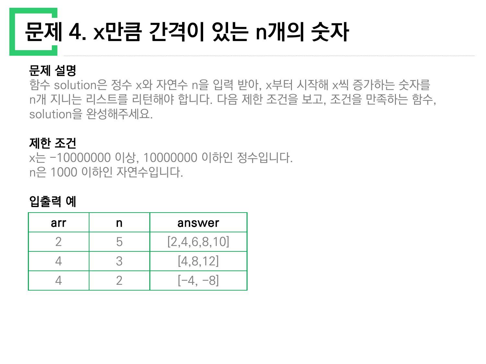
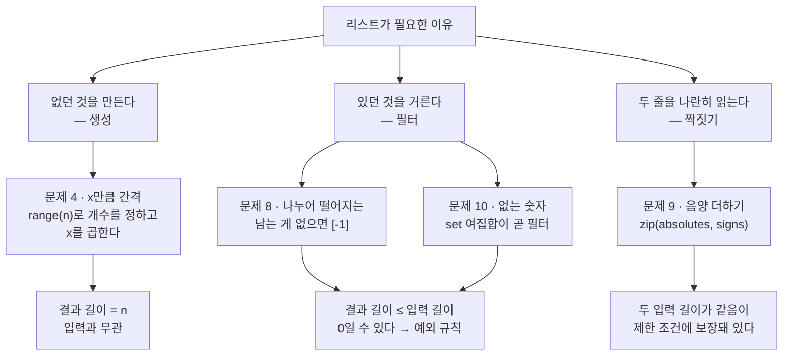
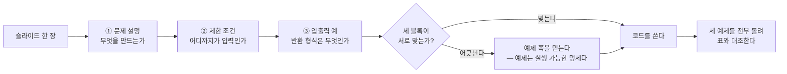

> [!abstract] 이 자료가 실제로 가르치는 것
> `문제풀이_1_10.pdf` 는 10쪽에 문제 10개를 담았고, **열 장이 모두 똑같은 세 블록**으로 되어 있다 — `문제 설명` / `제한 조건` / `입출력 예`. 얼핏 보면 설명이 본문이고 나머지는 부록 같다. 그런데 열 문제를 실제로 풀어 보면 **코드를 결정하는 것은 설명이 아니라 나머지 두 블록**이다. 설명은 이야기를 하고, 제한 조건은 경계를 긋고, 입출력 예는 그 경계 위에 점을 찍는다.
>
> 그래서 이 정리는 문제를 1번부터 차례로 나열하지 않는다. **세 블록이 서로를 감시하는 구조**를 척추로 놓고, 그 감시가 실제로 작동한 자리(설명만으로는 못 푸는 문제)와 **감시가 실패한 자리(세 블록이 서로 모순인 세 곳)** 를 나눠 본다.

---

## 1. 슬라이드 한 장의 해부

첫 장부터 구조가 드러난다.


세 블록이 각각 하는 일이 다르다.

| 블록 | 문제 1에서 말하는 것 | 코드에 미치는 영향 |
| --- | --- | --- |
| 문제 설명 | "'p'의 개수와 'y'의 개수를 비교해 같으면 True" | 비교 대상 두 개를 정한다 |
| 문제 설명 (단서) | "대문자와 소문자는 구별하지 않습니다" | `s.lower()` 한 줄이 여기서 나온다 |
| 문제 설명 (단서) | "'p', 'y' 모두 하나도 없는 경우는 항상 True" | 별도 분기가 필요한가? |
| 제한 조건 | 길이 50 이하, 알파벳으로만 | 성능 걱정을 지워 준다 |
| 입출력 예 | `"pPoooyY"→true`, `"Pyy"→false` | 대소문자 규칙을 **실제로 보여 준다** |

여기서 눈여겨볼 것은 세 번째 줄이다. "**둘 다 하나도 없으면 항상 True**"는 설명에만 있고 입출력 예에는 한 줄도 없다. 그런데 이 규칙은 코드를 하나도 늘리지 않는다 — 개수가 둘 다 0이면 `0 == 0` 이 이미 참이기 때문이다.

```python
def solution(s):
    t = s.lower()
    return t.count('p') == t.count('y')
```

`"pPoooyY"` → `p` 2개, `y` 2개 → `True`. `"Pyy"` → `p` 1개, `y` 2개 → `False`. 원본 입출력 예와 일치한다.

> [!note] 설명의 규칙이 늘 코드가 되지는 않는다
> "하나도 없으면 True"는 **명세로는 필요하지만 구현으로는 불필요한 조항**이다. 이런 조항을 보고 `if p == 0 and y == 0: return True` 를 먼저 쓰는 습관이 붙으면, 나중에 진짜로 분기가 필요한 문제(아래 문제 8)와 구분하지 못하게 된다. 세 블록을 대조하는 습관이 그 구분을 만들어 준다.

---

## 2. 세 블록이 어긋난 세 자리

원본을 열 장 다 대조하면 세 곳에서 블록끼리 충돌한다. 이 셋은 **자료의 오류**이므로 그대로 기록한다.

### 2.1 문제 4 — 표의 세 번째 행이 부호를 잃었다



설명은 "x부터 시작해 **x씩 증가**하는 숫자를 n개 지니는 리스트"라고 한다. 입출력 예는 세 행이다.

| `arr` | `n` | `answer` |
| --- | --- | --- |
| 2 | 5 | `[2,4,6,8,10]` |
| 4 | 3 | `[4,8,12]` |
| **4** | **2** | **`[-4, -8]`** |

앞의 두 행은 맞는다. 세 번째 행은 **입력이 4인데 출력이 음수**다. 파이썬으로 확인하면 이렇다.

```python
def solution(x, n):
    return [x * (i + 1) for i in range(n)]

solution(2, 5)   # [2, 4, 6, 8, 10]   ✓ 표와 일치
solution(4, 3)   # [4, 8, 12]         ✓ 표와 일치
solution(4, 2)   # [4, 8]             ✗ 표는 [-4, -8]
solution(-4, 2)  # [-4, -8]           ← 표가 의도한 입력
```

> [!warning] 원본 오류 ① — 문제 4 입출력 예 세 번째 행
> `x = 4, n = 2 → [-4, -8]` 로 적혀 있으나, **`x` 가 `-4` 여야** 출력과 맞는다. 제한 조건이 "x는 −10000000 이상"이라며 음수를 허용해 둔 것도 이 행이 원래 음수 예제였음을 뒷받침한다. 이 표만 보고 "출력에 부호를 뒤집어야 하나"라고 읽으면 앞의 두 행과 모순이 생긴다.

같은 장에 표기 오류가 하나 더 있다. **표의 첫 열 머리글이 `arr`** 인데, 이 문제의 매개변수는 `x` 다(배열이 아니라 정수다). 문제 2·문제 5의 표도 같은 자리에 `arr` 를 쓴다 — 슬라이드를 복제하며 머리글을 고치지 않은 흔적이다.

### 2.2 문제 5 — 제한 조건이 자기 예제를 배제한다


제한 조건: **"x는 1 이상, 10000 이하인 정수입니다."**
입출력 예 세 번째 행: **`626331 → -1`**.

626,331은 10,000보다 훨씬 크다. 두 블록이 정면으로 충돌한다.

> [!warning] 원본 오류 ② — 문제 5 제한 조건과 입출력 예의 충돌
> 제한 조건의 상한 `10000` 이 옳다면 세 번째 예제 `626331` 은 애초에 입력될 수 없다. 반대로 예제가 옳다면 상한은 최소 626,331 이상이어야 한다. **둘 중 하나는 반드시 틀렸다.** 그리고 이 예제는 버릴 수 없는 예제다 — `-1` 을 반환하는 유일한 사례이고, "500번 반복해도 1이 되지 않으면 −1"이라는 규칙의 **유일한 근거**이기 때문이다.

즉 이 문제에서 **입출력 예가 제한 조건을 이긴다.** 예제를 살리는 쪽으로 읽어야 코드가 완성된다.

```python
def solution(num):
    count = 0
    while num != 1 and count < 500:
        num = num // 2 if num % 2 == 0 else num * 3 + 1
        count += 1
    return count if num == 1 else -1
```

`6 → 8`, `16 → 4`, `626331 → -1`. 세 예제 모두 원본 표와 일치한다.

여기서 `count < 500` 의 위치가 중요하다. 설명은 "작업을 **500번 반복할 때까지** 1이 되지 않는다면 −1"이라고 한다. 500번째 작업까지는 해 보고, 그러고도 1이 아니면 포기한다는 뜻이다. 조건을 `count <= 500` 으로 쓰면 501번을 수행하게 되고, `count < 499` 로 쓰면 한 번을 덜 한다. **경계가 한 칸 어긋나도 626331 이외의 어떤 입력에서는 답이 달라진다.**

### 2.3 문제 8 — 설명에만 있는 규칙, 예제에만 있는 근거


여기서는 세 블록이 **서로를 보완한다.** 설명이 "나누어 떨어지는 element가 하나도 없다면 배열에 −1을 담아 반환하세요"라는 특수 규칙을 주고, 입출력 예 세 번째 행 `[3,2,6] / 10 → [-1]` 이 그 규칙의 유일한 실물이다. 예제가 없었다면 "−1을 담아"가 `-1` 인지 `[-1]` 인지 알 수 없다.

```python
def solution(arr, divisor):
    result = sorted(x for x in arr if x % divisor == 0)
    return result if result else [-1]
```

| 입력 | 결과 | 원본 표 |
| --- | --- | --- |
| `[5,9,7,10]`, 5 | `[5, 10]` | `[5, 10]` ✓ |
| `[2,36,1,3]`, 1 | `[1, 2, 3, 36]` | `[1, 2, 3, 36]` ✓ |
| `[3,2,6]`, 10 | `[-1]` | `[-1]` ✓ |

> [!caution] 원본 표기 흔들림 — 문제 8의 매개변수 이름
> 설명은 "**array**의 각 element"라 하고, 제한 조건 첫 줄은 "**arr**은 자연수를 담은 배열", 넷째 줄은 다시 "**array**는 길이 1 이상인 배열"이라 한다. 한 장 안에서 같은 대상을 두 이름으로 부른다. 실제 채점 함수의 시그니처는 입출력 예 머리글(`arr`)을 따르는 것이 안전하다.

---

## 3. 세 블록 대조 — 열 문제 한눈에

아래 카드는 원본 열 장의 세 블록을 그대로 옮겨 놓은 것이다. 각 문제에서 **어느 블록이 코드를 결정했는지**를 표시했다.

```html preview h=560px
<div style="font-family:system-ui,-apple-system,sans-serif;padding:18px;color:var(--foreground)">
  <div style="display:flex;gap:8px;flex-wrap:wrap;margin-bottom:14px">
    <button data-f="all"  class="fb" style="cursor:pointer">전체 10문제</button>
    <button data-f="desc" class="fb" style="cursor:pointer">설명이 결정</button>
    <button data-f="cons" class="fb" style="cursor:pointer">제한 조건이 결정</button>
    <button data-f="ex"   class="fb" style="cursor:pointer">입출력 예가 결정</button>
    <button data-f="bad"  class="fb" style="cursor:pointer">블록끼리 충돌</button>
  </div>
  <div id="grid" style="display:grid;grid-template-columns:repeat(auto-fill,minmax(255px,1fr));gap:11px"></div>
  <div id="tally" style="margin-top:14px;padding:11px 13px;background:var(--card);border:1px solid var(--border);border-radius:var(--radius);font-size:13px;line-height:1.7"></div>

  <script>
    var DATA = [
      {n:1,  t:'문자열 내 p와 y의 개수', k:'desc', why:'"대문자와 소문자는 구별하지 않습니다" — 이 한 줄이 s.lower()를 만든다. 제한 조건에는 없다.'},
      {n:2,  t:'하샤드 수',            k:'desc', why:'자릿수 합으로 나누어떨어지는지. 예제 네 줄(10,12,11,13)은 규칙을 확인만 해 준다.'},
      {n:3,  t:'정수 내림차순으로 배치하기', k:'cons', why:'상한 8000000000. 파이썬은 큰 정수를 그대로 다루지만, 이 상한이 "문자열로 정렬해도 되는가"를 판단하는 근거다.'},
      {n:4,  t:'x만큼 간격이 있는 n개의 숫자', k:'bad', why:'표 세 번째 행이 x=4인데 출력이 [-4,-8]. x=-4여야 한다.'},
      {n:5,  t:'콜라츠 추측',          k:'bad', why:'제한 조건 상한 10000 vs 입출력 예 626331. 예제가 -1 규칙의 유일한 근거라 예제를 살려야 한다.'},
      {n:6,  t:'두 정수 사이의 합',     k:'cons', why:'"a와 b의 대소관계는 정해져있지 않습니다" — 이 줄이 min/max를 강제한다. 설명의 예(3,5)만 보면 놓친다.'},
      {n:7,  t:'핸드폰 번호 가리기',    k:'ex',   why:'"뒷 4자리를 제외"가 *의 개수를 결정. 예제 두 줄(11자리→7개, 9자리→5개)이 길이 의존을 보여 준다.'},
      {n:8,  t:'나누어 떨어지는 숫자 배열', k:'ex', why:'"-1을 담아 반환"이 -1인지 [-1]인지는 예제 [3,2,6]/10 → [-1] 만이 답한다.'},
      {n:9,  t:'음양 더하기',          k:'cons', why:'signs[i]가 참이면 양수 — 이 정의는 제한 조건에만 있다. 설명은 "부호를 차례대로 담은"까지만 말한다.'},
      {n:10, t:'없는 숫자 더하기',      k:'desc', why:'0~9 중 없는 수의 합. 제한 조건(길이 1~9, 원소 서로 다름)은 예외를 없애 준다.'}
    ];
    var LABEL = {desc:'문제 설명', cons:'제한 조건', ex:'입출력 예', bad:'블록끼리 충돌'};
    var COLOR = {desc:'var(--chart-2)', cons:'var(--chart-3)', ex:'var(--chart-1)', bad:'var(--chart-5)'};
    var grid = document.getElementById('grid');
    function render(f) {
      var rows = DATA.filter(function (d) { return f === 'all' || d.k === f; });
      grid.innerHTML = rows.map(function (d) {
        return '<div style="border:1px solid var(--border);border-left:4px solid ' + COLOR[d.k] +
          ';border-radius:var(--radius);padding:11px 13px;background:var(--card)">' +
          '<div style="font-size:11px;font-weight:700;color:' + COLOR[d.k] + ';letter-spacing:.03em">' + LABEL[d.k] + '</div>' +
          '<div style="font-size:14px;font-weight:600;margin:4px 0 6px">문제 ' + d.n + '. ' + d.t + '</div>' +
          '<div style="font-size:12.5px;line-height:1.65;color:var(--muted-foreground)">' + d.why + '</div>' +
          '</div>';
      }).join('');
      var c = {desc:0, cons:0, ex:0, bad:0};
      DATA.forEach(function (d) { c[d.k]++; });
      document.getElementById('tally').innerHTML =
        '열 문제 중 <b>' + c.desc + '개</b>는 문제 설명만으로 풀리고, <b>' + c.cons + '개</b>는 제한 조건을 읽어야 풀리며, ' +
        '<b>' + c.ex + '개</b>는 입출력 예가 없으면 반환 형식을 정할 수 없다. ' +
        '나머지 <b>' + c.bad + '개</b>(문제 4·5)는 블록끼리 서로 모순이다 — 원본의 오류다.';
    }
    Array.prototype.forEach.call(document.getElementsByClassName('fb'), function (b) {
      b.style.cssText = 'padding:6px 12px;font-size:12.5px;border:1px solid var(--border);border-radius:var(--radius);' +
        'background:var(--card);color:var(--foreground);cursor:pointer';
      b.onclick = function () { render(b.getAttribute('data-f')); };
    });
    render('all');
  </script>
</div>
```

---

## 4. 수를 다루는 두 가지 길

열 문제 중 넷(2·3·5·10)이 **정수를 자릿수 단위로 다룬다.** 원본은 두 가지 길을 나란히 보여 주는데, 어느 쪽을 택하느냐가 코드 길이를 바꾼다.

### 4.1 문자열로 접는 길 — 문제 2·3

문제 2(하샤드 수)는 "x의 자릿수의 합으로 x가 나누어져야" 한다.

```python
def solution(x):
    return x % sum(int(c) for c in str(x)) == 0
```

문제 3(정수 내림차순)은 "n의 각 자릿수를 큰 것부터 작은 순으로 정렬한 새로운 정수".

```python
def solution(n):
    return int(''.join(sorted(str(n), reverse=True)))
```

두 줄 다 `str(n)` 으로 수를 문자열로 접었다가 다시 편다. 원본의 검산과 맞춘다.

| 문제 | 입력 | 중간 값 | 결과 | 원본 표 |
| --- | --- | --- | --- | --- |
| 2 | 10 | 자릿수 합 1 | `True` | True ✓ |
| 2 | 12 | 자릿수 합 3 | `True` | True ✓ |
| 2 | 11 | 자릿수 합 2 | `False` | False ✓ |
| 2 | 13 | 자릿수 합 4 | `False` | False ✓ |
| 3 | 118372 | `'873211'` | `873211` | 873211 ✓ |

### 4.2 나눗셈으로 깎는 길 — 문제 5

문제 5의 콜라츠 규칙은 문자열로 바꿔서는 표현할 수 없다. `%` 로 홀짝을 보고 `//` 로 깎는다. **자릿수가 아니라 값 자체가 문제인 경우**다.

> [!tip] 판단 기준
> 원본 열 문제에서 갈림은 단순하다 — **"자릿수 하나하나"를 봐야 하면 문자열, "수의 크기"를 봐야 하면 나눗셈**이다. 문제 2·3은 전자, 문제 5는 후자, 문제 10은 자릿수도 크기도 아니라 **집합**이다(`set(range(10)) - set(numbers)`).

### 4.3 콜라츠 궤적 시뮬레이터

원본이 준 세 입력(6, 16, 626331)과 그 결과(8, 4, −1)를 그대로 재현한다. 슬라이더로 임의의 값도 넣어 볼 수 있다.

```html preview h=560px
<div style="font-family:system-ui,-apple-system,sans-serif;padding:18px;color:var(--foreground)">
  <div style="display:flex;gap:8px;flex-wrap:wrap;align-items:center;margin-bottom:12px">
    <span style="font-size:12.5px;font-weight:600">원본 입출력 예:</span>
    <button class="preset" data-v="6" style="cursor:pointer">6</button>
    <button class="preset" data-v="16" style="cursor:pointer">16</button>
    <button class="preset" data-v="626331" style="cursor:pointer">626331</button>
  </div>
  <label for="num" style="font-size:12.5px;font-weight:600">입력 num =
    <span id="numv" style="color:var(--chart-1);font-size:19px;font-weight:700">6</span></label>
  <input id="num" type="range" min="1" max="10000" step="1" value="6"
    style="width:100%;accent-color:var(--primary);margin:6px 0 12px" />
  <svg id="plot" viewBox="0 0 660 250" width="100%" role="img" aria-label="콜라츠 궤적 그래프"></svg>
  <div id="out" style="margin-top:10px;padding:11px 13px;background:var(--card);border:1px solid var(--border);border-radius:var(--radius);font-size:13px;line-height:1.7"></div>
  <div id="trace" style="margin-top:8px;font-size:12px;color:var(--muted-foreground);word-break:break-all;line-height:1.8"></div>

  <script>
    function collatz(num) {
      var seq = [num], c = 0;
      while (num !== 1 && c < 500) {
        num = (num % 2 === 0) ? num / 2 : num * 3 + 1;
        seq.push(num); c++;
      }
      return { steps: (num === 1 ? c : -1), seq: seq, reached: num === 1 };
    }
    var sl = document.getElementById('num');
    function draw() {
      var n = parseInt(sl.value, 10);
      var r = collatz(n);
      document.getElementById('numv').textContent = n.toLocaleString();
      var W = 660, H = 250, PAD = 30;
      var seq = r.seq, hi = Math.max.apply(null, seq), len = seq.length;
      function X(i) { return PAD + (len < 2 ? 0 : i / (len - 1)) * (W - PAD - 14); }
      function Y(v) { return H - PAD - (Math.log(v + 1) / Math.log(hi + 1)) * (H - PAD - 16); }
      var pts = seq.map(function (v, i) { return X(i) + ',' + Y(v); }).join(' ');
      var dots = seq.length <= 90 ? seq.map(function (v, i) {
        return '<circle cx="' + X(i) + '" cy="' + Y(v) + '" r="2.6" fill="' +
          (v % 2 === 0 ? 'var(--chart-2)' : 'var(--chart-5)') + '"/>';
      }).join('') : '';
      document.getElementById('plot').innerHTML =
        '<line x1="' + PAD + '" y1="' + (H - PAD) + '" x2="' + (W - 10) + '" y2="' + (H - PAD) +
        '" stroke="var(--border)" stroke-width="1"/>' +
        '<polyline points="' + pts + '" fill="none" stroke="var(--chart-1)" stroke-width="2"/>' + dots +
        '<text x="' + PAD + '" y="16" font-size="11" fill="var(--muted-foreground)">세로축: log 스케일 · 최댓값 ' +
        hi.toLocaleString() + '</text>';
      var ok = r.steps !== -1;
      document.getElementById('out').innerHTML =
        '<b>solution(' + n.toLocaleString() + ') = <span style="color:' +
        (ok ? 'var(--chart-2)' : 'var(--chart-5)') + ';font-size:17px">' + r.steps + '</span></b>' +
        ' &nbsp;·&nbsp; 거친 수 ' + len + '개 &nbsp;·&nbsp; 최고점 ' + hi.toLocaleString() +
        (ok ? '' : ' &nbsp;·&nbsp; 500번 안에 1에 닿지 못했다');
      document.getElementById('trace').textContent =
        seq.length <= 60 ? seq.join(' → ') : seq.slice(0, 30).join(' → ') + ' → … → ' + seq.slice(-10).join(' → ');
    }
    Array.prototype.forEach.call(document.getElementsByClassName('preset'), function (b) {
      b.style.cssText = 'padding:5px 11px;font-size:12.5px;border:1px solid var(--border);border-radius:var(--radius);' +
        'background:var(--card);color:var(--foreground);cursor:pointer';
      b.onclick = function () {
        var v = parseInt(b.getAttribute('data-v'), 10);
        if (v > parseInt(sl.max, 10)) sl.max = v;
        sl.value = v; draw();
      };
    });
    sl.oninput = draw;
    draw();
  </script>
</div>
```

원본 설명의 궤적 `6 → 3 → 10 → 5 → 16 → 8 → 4 → 2 → 1` 은 화살표가 여덟 개다. 그래서 답이 **8**이다. 그래프의 점 색은 홀짝을 구분한다 — 홀수 뒤에는 반드시 값이 뛰어오르고(3n+1), 짝수는 반드시 절반으로 내려간다.

---

## 5. 리스트를 만드는 세 가지 이유

나머지 문제들은 전부 리스트를 다루지만, **왜 리스트를 만드는가**가 서로 다르다. 이 구분이 문제 4·8·9·10을 가른다.



이 갈래가 실제 코드 차이를 만든다.

**생성(문제 4)** — 결과 길이가 입력 리스트와 무관하다. 그래서 `range(n)` 이 축이다.

```python
def solution(x, n):
    return [x * (i + 1) for i in range(n)]
```

**필터(문제 8·10)** — 결과가 비어 있을 수 있다. 문제 8은 그래서 `[-1]` 규칙이 붙었고, 문제 10은 제한 조건("numbers의 길이 ≤ 9")이 **빈 결과를 아예 막아 준다.** 0~9의 열 개 중 최대 아홉 개만 주어지므로 빠진 수가 반드시 하나 이상 있다.

```python
def solution(numbers):
    return sum(set(range(10)) - set(numbers))
```

| 입력 | 빠진 수 | 합 | 원본 표 |
| --- | --- | --- | --- |
| `[1,2,3,4,6,7,8,0]` | 5, 9 | 14 | 14 ✓ |
| `[5,8,4,0,6,7,9]` | 1, 2, 3 | 6 | 6 ✓ |

**짝짓기(문제 9)** — 두 리스트의 길이가 같다는 보장이 **제한 조건에만** 있다("signs의 길이는 absolutes의 길이와 같습니다"). 이 줄이 있어야 `zip` 을 안심하고 쓴다.

```python
def solution(absolutes, signs):
    return sum(v if s else -v for v, s in zip(absolutes, signs))
```

`[4,7,12]` / `[True,False,True]` → 4 − 7 + 12 = **9**. `[1,2,3]` / `[False,False,True]` → −1 − 2 + 3 = **0**. 원본 표와 일치한다.

---

## 6. 설명의 예 하나만 믿으면 걸리는 곳

문제 6과 문제 7은 나란히 놓으면 대비가 선명하다. 둘 다 설명이 예를 하나 들지만, 한쪽은 그 예가 함정이고 한쪽은 아니다.

**문제 6 — 설명의 예가 함정이다.**
설명은 "a = 3, b = 5인 경우, 3 + 4 + 5 = 12"만 보여 준다. 이것만 보면 `sum(range(a, b+1))` 로 끝난 것 같다. 그런데 제한 조건 마지막 줄이 이렇다 — **"a와 b의 대소관계는 정해져있지 않습니다."** 입출력 예 세 번째 행 `a=5, b=3 → 12` 가 그 경고를 실물로 확인해 준다. `range(5, 4)` 는 빈 범위라 0을 돌려준다.

```python
def solution(a, b):
    return sum(range(min(a, b), max(a, b) + 1))
```

| a | b | 결과 | 원본 표 |
| --- | --- | --- | --- |
| 3 | 5 | 12 | 12 ✓ |
| 3 | 3 | 3 | 3 ✓ |
| 5 | 3 | 12 | 12 ✓ |

두 번째 행(`a == b`)도 제한 조건이 미리 지정해 둔 경우다 — "a와 b가 같은 경우는 둘 중 아무 수나 리턴하세요". `range(3, 4)` 는 `[3]` 이므로 합이 3, 자동으로 맞는다.

**문제 7 — 설명의 예가 그대로 답이다.**
"뒷 4자리를 제외한 나머지 숫자를 전부 `*` 로". 별의 개수가 **입력 길이에 따라 달라진다**는 사실은 예제 두 줄이 보여 준다.

```python
def solution(phone_number):
    return '*' * (len(phone_number) - 4) + phone_number[-4:]
```

| 입력 | 길이 | `*` 개수 | 결과 |
| --- | --- | --- | --- |
| `"01033334444"` | 11 | 7 | `"*******4444"` ✓ |
| `"027778888"` | 9 | 5 | `"*****8888"` ✓ |

제한 조건 "길이 4 이상"이 여기서 일한다. 길이가 4면 `'*' * 0` 이 되어 원본 그대로 나오고, 3이면 `'*' * (-1)` 이 빈 문자열이 되면서 앞자리가 사라진다. **제한 조건이 그 경우를 미리 지워 준 것이다.**

---

## 7. 세 블록을 읽는 순서

열 문제를 다 풀고 나면 읽는 순서가 정해진다.



마지막 상자가 이 자료를 다루는 방법이다. 위에서 모든 코드를 실행해 원본 표와 한 칸씩 대조했고, 그 과정에서 **문제 4와 문제 5의 오류가 드러났다.** 눈으로 읽었다면 둘 다 지나쳤을 것이다.

> [!important] 어긋날 때 무엇을 믿는가
> 문제 4에서는 **설명과 앞의 두 예제**가 옳고 세 번째 예제의 입력이 틀렸다. 문제 5에서는 **예제**가 옳고 제한 조건이 틀렸다. 규칙이 하나로 정해지지 않는다는 뜻이다 — 다수결로 읽어야 한다. 문제 4는 설명 + 예제 2행이 표 1행을 이기고, 문제 5는 예제가 유일한 근거이므로 이긴다.

---

## 이어지는 문서

- [02. 문제 11–20 — 무엇을 어디서부터 세는가](<./02. 문제 11-20 — 무엇을 어디서부터 세는가.md>) — 같은 형식의 슬라이드 열 장, 이번에는 인덱스와 자릿수의 기준점이 문제다
- [03. 지뢰찾기 — 여덟 칸을 세는 일이 아니라 격자 밖을 세지 않는 일](<./03. 지뢰찾기 — 여덟 칸을 세는 일이 아니라 격자 밖을 세지 않는 일.md>) — 2차원 리스트의 경계
- [04. 23-2 중간고사 — 텍스트가 없는 두 장이 진짜 문제다](<./04. 23-2 중간고사 — 텍스트가 없는 두 장이 진짜 문제다.md>) — 순서도를 코드로 옮기기

관련 과목: [01/coding-basics](../../coding-basics/README.md)의 순서도·알고리즘 연습, [06/algorithm-design-analysis](../../../06_algorithms-graphics/algorithm-design-analysis/README.md)의 억지 기법(문제 5·8·10이 모두 완전 탐색이다).

---

## 근거 자료

`ComputerScience/01_programming-foundations/python-programming/sources/문제풀이_1_10.pdf` (10쪽) 전체.

| 쪽 | 문제 | 이 문서에서 다룬 곳 |
| --- | --- | --- |
| 1 | 문자열 내 p와 y의 개수 | §1 (슬라이드 인용) |
| 2 | 하샤드 수 | §4.1 |
| 3 | 정수 내림차순으로 배치하기 | §4.1 |
| 4 | x만큼 간격이 있는 n개의 숫자 | §2.1 (슬라이드 인용) · §5 |
| 5 | 콜라츠 추측 | §2.2 (슬라이드 인용) · §4.2 · §4.3 |
| 6 | 두 정수 사이의 합 | §6 |
| 7 | 핸드폰 번호 가리기 | §6 |
| 8 | 나누어 떨어지는 숫자 배열 | §2.3 (슬라이드 인용) · §5 |
| 9 | 음양 더하기 | §5 |
| 10 | 없는 숫자 더하기 | §5 |

이 문서의 모든 코드와 표는 파이썬 3.11로 실행해 원본 슬라이드의 입출력 예와 한 칸씩 대조했다. 원본에 없는 내용은 §4.2의 판단 기준(보충 설명)뿐이며, 나머지는 전부 슬라이드에 적힌 값이다.
