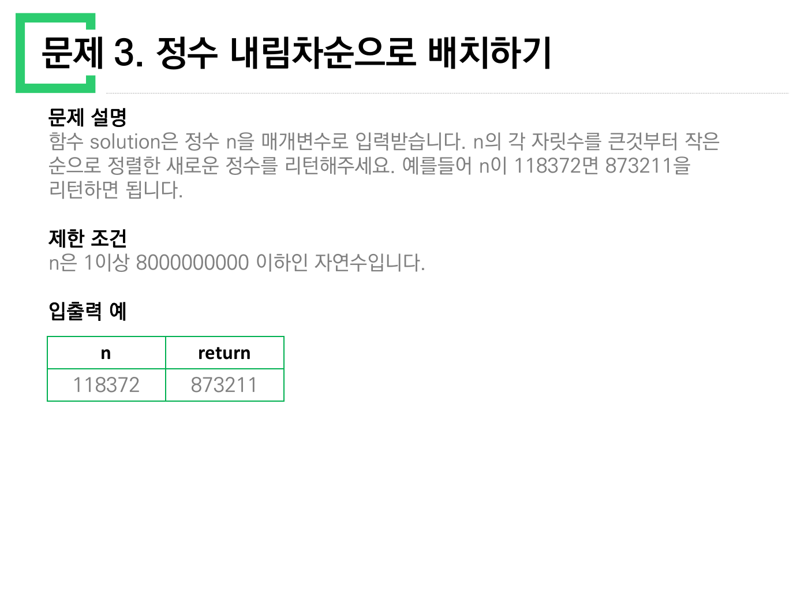
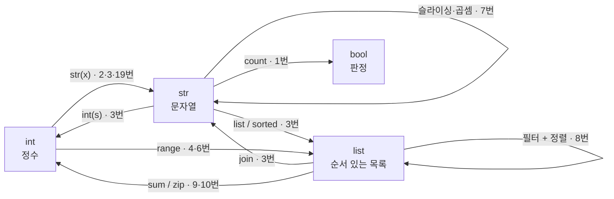
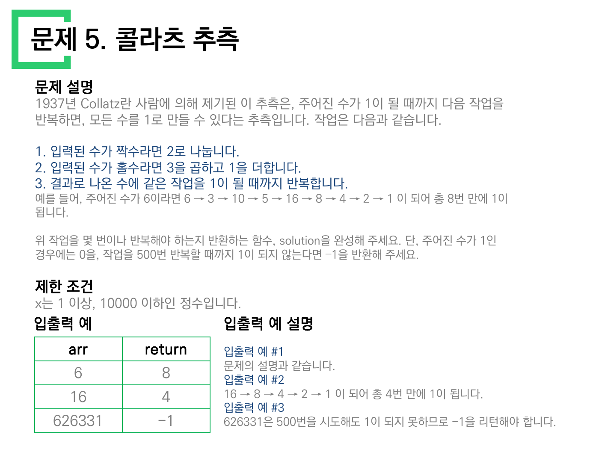
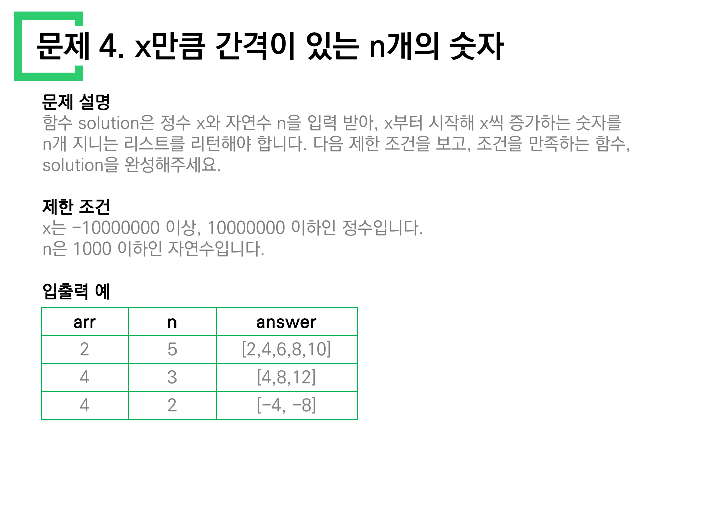
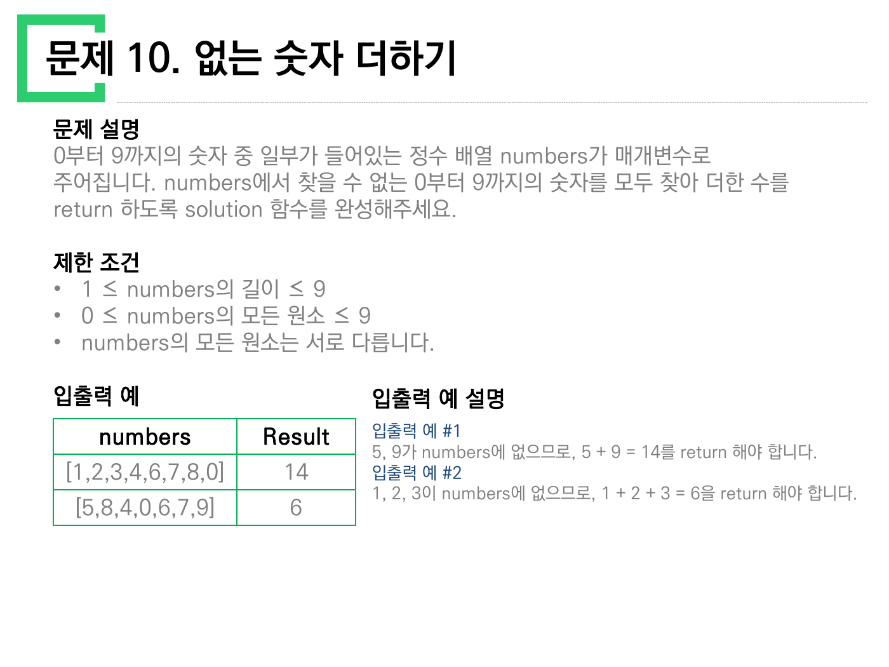
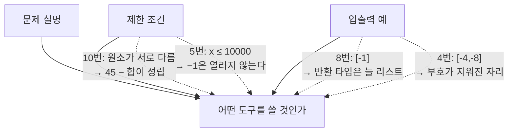

> [!abstract] 이 열 장이 실제로 하는 말
> 이 PDF에는 해설도, 코드도, 정답도 없다. **문제 설명 · 제한 조건 · 입출력 예** 세 칸만 열 번 반복된다. 그러니 읽을 것은 문제의 답이 아니라 **문제가 어떤 모양으로 서술되어 있는가**다.
>
> 그렇게 놓고 보면 열 문제 중 아홉은 같은 일을 시킨다 — *정수를 정수인 채로 다루지 말고, 잠깐 다른 것으로 바꾸었다가 되돌려라.* 자릿수의 합을 구하려면 수를 글자로 봐야 하고(2번), 내림차순으로 재배치하려면 글자를 다시 리스트로 봐야 한다(3번). 열 문제의 난이도 차이는 대부분 **이 환승을 몇 번 하느냐**로 설명된다.
>
> 그리고 딱 하나, **5번 콜라츠**만 이 설명을 벗어난다. 5번은 환승 문제가 아니라 **반복이 끝나는지를 아무도 모르는 문제**이고, 그래서 열 문제 중 유일하게 “안 끝나면 −1을 반환하라”는 조항을 달고 있다. 이 정리문서의 척추는 그 조항이다.

---

## 1. 열 장을 한 화면에

먼저 열 문제가 무엇을 받아 무엇을 내놓는지를 원본 표 그대로 옮긴다. 원본은 매 장 **입출력 예** 칸에 값을 직접 적어 두었으므로, 아래 표의 값은 전부 슬라이드에 인쇄된 것이다.

| # | 제목 | 받는 것 | 내놓는 것 | 원본 예시 |
| --- | --- | --- | --- | --- |
| 1 | 문자열 내 p와 y의 개수 | 문자열 `s` | `bool` | `"pPoooyY"` → true, `"Pyy"` → false |
| 2 | 하샤드 수 | 정수 `x` | `bool` | 10·12 → True, 11·13 → False |
| 3 | 정수 내림차순으로 배치하기 | 정수 `n` | 정수 | 118372 → 873211 |
| 4 | x만큼 간격이 있는 n개의 숫자 | 정수 `x`, 자연수 `n` | 리스트 | 2,5 → `[2,4,6,8,10]` |
| 5 | 콜라츠 추측 | 정수 `x` | 정수(횟수) | 6 → 8, 16 → 4, 626331 → −1 |
| 6 | 두 정수 사이의 합 | 정수 `a`, `b` | 정수 | 3,5 → 12 / 5,3 → 12 |
| 7 | 핸드폰 번호 가리기 | 문자열 | 문자열 | `"01033334444"` → `"*******4444"` |
| 8 | 나누어 떨어지는 숫자 배열 | 리스트, 정수 | 리스트 | `[5,9,7,10]`,5 → `[5,10]` |
| 9 | 음양 더하기 | 리스트, 불리언 리스트 | 정수 | `[4,7,12]`,`[T,F,T]` → 9 |
| 10 | 없는 숫자 더하기 | 리스트 | 정수 | `[1,2,3,4,6,7,8,0]` → 14 |

여기서 곧바로 눈에 띄는 것이 하나 있다. **입력 열의 이름이 제각각이다.** 2번·5번·8번의 표 머리글은 `arr`인데 문제 설명은 `x`(2·5번)와 `array`(8번)라 부르고, 4번은 `x`를 받는다면서 머리글이 `arr`이며, 19번(다음 노트)은 `n`을 `N`으로 적는다. 표 머리글이 문제 본문과 다른 이름을 쓰는 이 습관은 4번에서 **실제로 값을 망가뜨리는 사고**로 이어지는데, 그 이야기는 §4로 미룬다.

---

## 2. 아홉 문제가 공유하는 한 가지 동작 — 환승

파이썬에서 정수 `118372`는 **자릿수의 목록이 아니다.** 몫과 나머지로 자릿수를 뜯어낼 수는 있지만, “셋째 자리”를 곧바로 집을 수는 없다. 그런데 3번은 자릿수를 정렬하라고 한다. 정렬은 **순서 있는 컨테이너**에만 정의되어 있다. 그래서 수를 컨테이너로 만들었다가 되돌리는 왕복이 필요해진다.



> 원본 3쪽. 조건은 단 두 줄이고, 예시도 `118372 → 873211` 한 줄뿐이다. 이 한 줄이 요구하는 것이 **int → str → list → str → int** 라는 네 번의 환승이다.

열 문제가 지나는 환승역을 한 장에 그리면 이렇게 된다.



문제별로 어느 경로를 타는지를 적으면 이렇다.

| 문제 | 경로 | 환승이 필요한 이유 |
| --- | --- | --- |
| 1 | `str` → 개수 → `bool` | ‘p’와 ‘y’를 세려면 대소문자를 한쪽으로 접어야 한다 |
| 2 | `int` → `str` → 자릿수 합 → 나눗셈 | **자릿수의 합**은 정수 연산으로 직접 얻을 수 없다 |
| 3 | `int` → `str` → `list` → `str` → `int` | 정렬은 컨테이너 위에서만 정의된다 |
| 4 | `int` → `list` | 등차수열은 값이 아니라 **모양**이다 |
| 6 | (환승 없음) | 합은 산술로 닫힌다 — §5 참조 |
| 7 | `str` → `str` | 길이를 알아야 앞을 몇 개 가릴지 정해진다 |
| 8 | `list` → `list` | 필터와 정렬은 둘 다 컨테이너 연산 |
| 9 | `list` × `list` → `int` | 크기와 부호가 **다른 배열에 나뉘어** 있다 |
| 10 | `list` → `int` | 여집합을 구하려면 전체가 있어야 한다 |

9번이 특히 이 구조를 노골적으로 보여 준다. 원본 9쪽은 “정수들의 절댓값을 차례대로 담은 정수 배열 `absolutes`와 이 정수들의 부호를 차례대로 담은 불리언 배열 `signs`”라고 적는다. 즉 **하나의 정수를 크기와 부호로 쪼개서 두 개의 배열에 나눠 담은 뒤, 다시 붙이라**는 문제다. 원본이 준 두 예시로 확인하면

- `[4,7,12]`, `[true,false,true]` → $4 - 7 + 12 = 9$
- `[1,2,3]`, `[false,false,true]` → $-1 - 2 + 3 = 0$

두 번째 예시의 답이 **0**인 것이 이 문제의 좋은 점이다. 0은 “아무것도 안 했을 때”와 구별되지 않는 값이라, 부호를 한 번이라도 잘못 붙이면 답이 0에서 멀어진다.

---

## 3. 5번만 다르다 — 끝을 모르는 문제



> 원본 5쪽. 열 장 중 유일하게 **연도와 사람 이름**(1937년, Collatz)이 등장하고, 유일하게 **“…라는 추측입니다”** 라는 문장으로 규칙을 소개한다.

원본이 적은 규칙은 세 줄이다.

1. 입력된 수가 짝수라면 2로 나눕니다.
2. 입력된 수가 홀수라면 3을 곱하고 1을 더합니다.
3. 결과로 나온 수에 같은 작업을 1이 될 때까지 반복합니다.

그리고 원본은 곧장 조건을 하나 더 붙인다 — *“작업을 500번 반복할 때까지 1이 되지 않는다면 −1을 반환해 주세요.”*

이 한 줄이 다른 아홉 문제에는 없다. 8번에 붙은 “나누어 떨어지는 element가 하나도 없다면 −1을 담아 반환”은 **입력에 답이 없는 경우**를 다루지만, 5번의 −1은 다르다. **답은 있을 것 같은데 우리가 그것을 증명하지 못해서** 붙인 상한이다. 콜라츠 추측은 1937년에 제기된 이래 아직 미해결이고, 모든 자연수가 1에 도달한다는 보장이 없다. 보장이 없으면 `while` 루프의 종료를 보장할 수 없고, 종료를 보장할 수 없는 코드는 채점할 수 없다. 500이라는 숫자는 **수학이 아니라 채점 시스템이 붙인 숫자**다.

### 궤적을 직접 걸어 보기

원본 5쪽이 든 예시 `6 → 3 → 10 → 5 → 16 → 8 → 4 → 2 → 1`(8번)을 그대로 재현하고, 임의의 시작값으로 궤적을 그려 보는 도구다. 원본이 제시한 세 값 6·16·626331이 버튼으로 들어 있다.

```html preview h=560px
<div style="font-family:system-ui,-apple-system,sans-serif;padding:20px;color:var(--foreground)">
  <div style="display:flex;gap:10px;flex-wrap:wrap;align-items:flex-end;margin-bottom:14px">
    <div style="flex:1;min-width:200px">
      <label for="cstart" style="font-size:13px;font-weight:600">시작값 x</label>
      <input id="cstart" type="number" min="1" max="10000000" value="6"
        style="width:100%;padding:7px 9px;font-size:15px;border:1px solid var(--border);border-radius:var(--radius);background:var(--card);color:var(--foreground)" />
    </div>
    <div id="presets" style="display:flex;gap:6px;flex-wrap:wrap"></div>
  </div>

  <div id="cstat" style="display:flex;gap:20px;flex-wrap:wrap;margin-bottom:10px;font-size:13px"></div>
  <svg id="ctraj" viewBox="0 0 640 220" width="100%" role="img" aria-label="콜라츠 궤적 그래프"></svg>
  <div id="cseq" style="margin-top:10px;font-family:ui-monospace,SFMono-Regular,Menlo,monospace;font-size:12px;line-height:1.9;word-break:break-all;color:var(--muted-foreground)"></div>
  <div id="cverdict" style="margin-top:12px;padding:11px 13px;background:var(--card);border:1px solid var(--border);border-radius:var(--radius);font-size:13px;line-height:1.7"></div>

  <script>
    var LIMIT = 500;
    var inp = document.getElementById('cstart');

    [[6, '원본 예 #1'], [16, '원본 예 #2'], [626331, '원본 예 #3'], [6171, '보충 · 1–10000 최장']].forEach(function (p) {
      var b = document.createElement('button');
      b.textContent = p[0] + ' · ' + p[1];
      b.style.cssText = 'padding:6px 10px;font-size:12px;border:1px solid var(--border);' +
        'border-radius:var(--radius);background:var(--card);color:var(--foreground);cursor:pointer';
      b.onclick = function () { inp.value = p[0]; run(); };
      document.getElementById('presets').appendChild(b);
    });

    function traj(x) {
      var seq = [x], n = x, steps = 0;
      while (n !== 1 && steps < LIMIT) {
        n = (n % 2 === 0) ? n / 2 : 3 * n + 1;
        seq.push(n); steps++;
      }
      return { seq: seq, steps: steps, reached: n === 1 };
    }

    function run() {
      var x = Math.max(1, Math.floor(Number(inp.value) || 1));
      var t = traj(x);
      var ret = t.reached ? t.steps : -1;
      var peak = Math.max.apply(null, t.seq);

      document.getElementById('cstat').innerHTML =
        [['반환값', ret, t.reached ? 'var(--chart-1)' : 'var(--chart-5)'],
         ['걸음 수', t.steps, 'var(--chart-2)'],
         ['최고점', peak.toLocaleString(), 'var(--chart-3)'],
         ['시작값 대비', (peak / x).toFixed(1) + '배', 'var(--chart-4)']]
        .map(function (r) {
          return '<span><span style="color:var(--muted-foreground)">' + r[0] +
            '</span> <b style="color:' + r[2] + ';font-size:16px">' + r[1] + '</b></span>';
        }).join('');

      var W = 640, H = 220, pad = 26;
      var m = Math.max.apply(null, t.seq), n = t.seq.length;
      var pts = t.seq.map(function (v, i) {
        var px = pad + (n === 1 ? 0 : i / (n - 1) * (W - 2 * pad));
        var py = H - pad - (Math.log(v) / Math.log(m || 2)) * (H - 2 * pad);
        return px.toFixed(1) + ',' + py.toFixed(1);
      }).join(' ');
      document.getElementById('ctraj').innerHTML =
        '<line x1="' + pad + '" y1="' + (H - pad) + '" x2="' + (W - pad) + '" y2="' + (H - pad) +
        '" stroke="var(--border)" stroke-width="1"/>' +
        '<polyline points="' + pts + '" fill="none" stroke="var(--chart-1)" stroke-width="2"/>' +
        t.seq.map(function (v, i) {
          var px = pad + (n === 1 ? 0 : i / (n - 1) * (W - 2 * pad));
          var py = H - pad - (Math.log(v) / Math.log(m || 2)) * (H - 2 * pad);
          return '<circle cx="' + px.toFixed(1) + '" cy="' + py.toFixed(1) + '" r="' +
            (n > 120 ? 1.2 : 2.6) + '" fill="' + (v % 2 ? 'var(--chart-3)' : 'var(--chart-2)') + '"/>';
        }).join('') +
        '<text x="' + pad + '" y="14" font-size="11" fill="var(--muted-foreground)">세로축 = log 스케일 · ' +
        '<tspan fill="var(--chart-3)">홀수</tspan> / <tspan fill="var(--chart-2)">짝수</tspan></text>';

      document.getElementById('cseq').textContent =
        t.seq.length <= 40 ? t.seq.join(' → ') : t.seq.slice(0, 24).join(' → ') + ' → … → ' + t.seq.slice(-8).join(' → ');

      document.getElementById('cverdict').innerHTML = t.reached
        ? 'x = ' + x.toLocaleString() + ' 은(는) <b>' + t.steps + '걸음</b>만에 1에 닿는다. 500번 상한에 걸리지 않았으므로 반환값은 걸음 수 그 자체다.'
        : 'x = ' + x.toLocaleString() + ' 은(는) 500걸음 안에 1에 닿지 <b>못했다</b> — 원본 규칙에 따라 <b style="color:var(--chart-5)">−1</b>을 반환한다. ' +
          '<span style="color:var(--muted-foreground)">이것은 “1이 되지 않는다”가 아니라 “500걸음 안에는 되지 않는다”는 뜻이다.</span>';
    }
    inp.addEventListener('input', run);
    run();
  </script>
</div>
```

### 500이라는 문턱은 실제로 열리는가

원본 5쪽의 제한 조건은 **“x는 1 이상, 10000 이하인 정수입니다.”** 이다. 그렇다면 이 범위 안에서 −1이 반환되는 입력이 실제로 존재하는가? 1부터 10000까지 전부 돌려 확인했다.

| 확인한 것 | 결과 |
| --- | --- |
| 1–10000 중 500걸음 안에 1에 닿지 못하는 값 | **하나도 없다** |
| 걸음 수가 가장 큰 입력 | **6171** — 261걸음 |
| 원본 예 #3의 626331 | 제한 조건이 허용하는 범위 밖의 값 |

> [!warning] 원본 오류 ① — −1은 제한 조건 안에서 결코 반환되지 않는다
> 제한 조건이 `x ≤ 10000`인 한, 최대 걸음 수는 261(x = 6171)이다. 500이라는 상한은 이 범위의 **거의 두 배 여유**를 두고 있으므로, 명세대로 구현한 함수는 −1을 반환할 일이 없다. −1 조항은 제한 조건과 짝이 맞지 않는다.

그렇다면 원본이 −1의 예로 든 626331은 무엇인가. 두 가지 문제가 겹쳐 있다.

> [!warning] 원본 오류 ② — 예시 626331이 자기 문제의 제한 조건을 어긴다
> 원본 5쪽은 입출력 예 #3으로 **626331**을 들고 −1을 답으로 적었다. 그런데 같은 쪽 제한 조건은 `x ≤ 10000`이다. 626331은 그 62배가 넘는다. 유일하게 −1을 만들어 내는 예시가 **문제가 스스로 금지한 입력**인 셈이다.

그리고 그 예시에 붙은 설명 문장은 더 위험하다.

> [!warning] 원본 오류 ③ — “1이 되지 못하므로”는 사실이 아니다
> 원본은 입출력 예 #3 설명에 *“626331은 500번을 시도해도 1이 되지 못하므로 −1을 리턴해야 합니다”* 라고 적었다. 그러나 626331은 **508걸음이면 1에 도달한다.** 500을 겨우 8 넘겼을 뿐이다. 정확한 서술은 “500번 안에는 1이 되지 못하므로”이며, 이 차이는 사소하지 않다 — 앞의 서술은 콜라츠 추측의 반례가 발견되었다는 뜻이 되어 버린다.

세 번째 항목은 5번 문제의 성격을 그대로 요약한다. **끝나는지 모른다는 것과, 정해진 걸음 안에 끝나지 않는다는 것은 전혀 다른 말이다.** 500이라는 숫자는 전자를 후자로 바꿔치기해서 문제를 채점 가능하게 만드는 장치이고, 원본의 설명 문장은 그 바꿔치기를 잊어버렸다.

---

## 4. 표 머리글이 값까지 망가뜨린 자리 — 4번



> 원본 4쪽. 표 머리글은 `arr / n / answer`인데, 본문은 시종 `x`와 `n`으로 부른다. 그리고 세 번째 행을 보라.

원본 표 세 줄을 그대로 옮기면 이렇다.

| arr | n | answer |
| --- | --- | --- |
| 2 | 5 | `[2,4,6,8,10]` |
| 4 | 3 | `[4,8,12]` |
| **4** | **2** | **`[-4, -8]`** |

앞의 두 줄은 규칙대로다 — $x$부터 $x$씩 증가하는 수 $n$개. 세 번째 줄만 규칙을 정면으로 어긴다. $x = 4$, $n = 2$라면 답은 `[4, 8]`이어야 한다. `[-4, -8]`이 나오려면 $x$가 **−4**여야 한다.

> [!warning] 원본 오류 ④ — 4번 입출력 예 세 번째 줄에서 음수 부호가 사라졌다
> `x = 4, n = 2 → [-4, -8]` 은 성립하지 않는다. 올바른 입력은 `x = -4` 다. 같은 쪽 제한 조건이 굳이 *“x는 −10000000 이상”* 이라며 음수를 허용해 둔 것을 보면, 이 예시의 원래 의도는 **음수 x일 때도 같은 규칙이 그대로 적용된다**는 것을 보여 주는 데 있었다. 머리글을 `arr`로 잘못 적은 그 표에서 부호 하나가 함께 떨어져 나가면서, 그 의도가 통째로 지워졌다.

이 예시가 살아 있었다면 4번은 **부호를 특별 취급하지 말라**는 문제가 된다. `range(x, x*n+1, x)` 같은 코드는 $x > 0$에서만 동작하고 $x < 0$에서 빈 리스트를 낸다. 원본 의도대로 읽으면 정답은 “곱셈으로 만들라”는 것 — $x \cdot 1, x \cdot 2, \dots, x \cdot n$ 이면 부호와 무관하게 성립한다.

---

## 5. 환승하지 않는 두 문제 — 6번과 10번

6번과 10번은 이 묶음에서 유일하게 **컨테이너를 만들지 않고도 답이 나오는** 문제다. 그리고 둘 다 “전부 훑는 길”과 “한 줄로 끝내는 길”이 나란히 존재한다.

6번은 $a$와 $b$ 사이 정수의 합이다. 원본 6쪽은 대소 관계가 정해져 있지 않다고 못 박고, `(3,5)`와 `(5,3)`이 둘 다 12임을 예로 보인다. 낮은 값을 $l$, 높은 값을 $h$라 하면 항의 개수는 $h - l + 1$이고 합은 등차수열 합 공식으로

$$\sum_{k=l}^{h} k \;=\; \frac{(l + h)\,(h - l + 1)}{2}$$

10번은 `numbers`에 없는 0–9의 합이다. 0부터 9까지의 합은 항상 45이므로, 없는 것을 찾을 필요 없이 **있는 것을 빼면 된다**. 원본 10쪽의 두 예시로 확인하면 $45 - 31 = 14$, $45 - 39 = 6$ 으로 정확히 원본 표의 답과 같다.



> 원본 10쪽. 설명 칸은 “5, 9가 numbers에 없으므로, 5 + 9 = 14”라고 **없는 것을 찾는 방식**으로 적혀 있다. 그러나 제한 조건의 “numbers의 모든 원소는 서로 다릅니다”가 45 − 합이라는 지름길을 열어 둔다.

아래 도구로 두 길의 연산 횟수를 직접 비교할 수 있다. 6번은 `a`,`b`를 바꿔 가며, 10번은 원본의 두 예시를 그대로 넣어 두었다.

```html preview h=520px
<div style="font-family:system-ui,-apple-system,sans-serif;padding:20px;color:var(--foreground)">
  <div style="display:flex;gap:8px;margin-bottom:14px">
    <button id="t6" class="tabb">문제 6 · 두 정수 사이의 합</button>
    <button id="t10" class="tabb">문제 10 · 없는 숫자 더하기</button>
  </div>

  <div id="p6">
    <div style="display:flex;gap:18px;flex-wrap:wrap;margin-bottom:12px">
      <div style="flex:1;min-width:170px">
        <label for="av" style="font-size:12.5px;font-weight:600">a = <span id="avv">3</span></label>
        <input id="av" type="range" min="-50" max="50" value="3" style="width:100%;accent-color:var(--primary)" />
      </div>
      <div style="flex:1;min-width:170px">
        <label for="bv" style="font-size:12.5px;font-weight:600">b = <span id="bvv">5</span></label>
        <input id="bv" type="range" min="-50" max="50" value="5" style="width:100%;accent-color:var(--primary)" />
      </div>
    </div>
    <div id="out6"></div>
  </div>

  <div id="p10" hidden>
    <div id="chips10" style="display:flex;gap:8px;flex-wrap:wrap;margin-bottom:12px"></div>
    <div id="grid10" style="display:flex;gap:6px;flex-wrap:wrap;margin-bottom:12px"></div>
    <div id="out10"></div>
  </div>

  <style>
    .tabb{padding:7px 13px;font-size:13px;border:1px solid var(--border);border-radius:var(--radius);
          background:var(--card);color:var(--foreground);cursor:pointer}
    .tabb[data-on="1"]{background:var(--chart-1);color:var(--background);border-color:var(--chart-1);font-weight:600}
    .boxr{padding:11px 13px;border:1px solid var(--border);border-radius:var(--radius);background:var(--card);
          font-size:13px;line-height:1.75;margin-top:8px}
  </style>

  <script>
    var av = document.getElementById('av'), bv = document.getElementById('bv');
    function upd6() {
      var a = +av.value, b = +bv.value;
      document.getElementById('avv').textContent = a;
      document.getElementById('bvv').textContent = b;
      var l = Math.min(a, b), h = Math.max(a, b), cnt = h - l + 1;
      var loop = 0, acc = 0;
      for (var k = l; k <= h; k++) { acc += k; loop++; }
      var formula = (l + h) * cnt / 2;
      document.getElementById('out6').innerHTML =
        '<div class="boxr"><b style="color:var(--chart-2)">반복으로</b> — ' + l + '부터 ' + h +
        '까지 한 개씩 더한다. 덧셈 <b>' + loop + '회</b> → 합 <b>' + acc + '</b></div>' +
        '<div class="boxr"><b style="color:var(--chart-1)">공식으로</b> — (' + l + ' + ' + h + ') × ' + cnt +
        ' ÷ 2. 연산 <b>3회</b> → 합 <b>' + formula + '</b></div>' +
        '<div class="boxr" style="border-color:' + (acc === formula ? 'var(--chart-1)' : 'var(--chart-5)') + '">' +
        (acc === formula ? '두 값이 일치한다. ' : '불일치! ') +
        '입력 순서를 바꿔도(a와 b를 서로 맞바꿔도) 결과가 같은 것은 <b>min·max로 접었기 때문</b>이다 — ' +
        '원본 6쪽이 “a와 b의 대소관계는 정해져있지 않습니다”라고 못 박은 자리다.</div>';
    }
    av.addEventListener('input', upd6); bv.addEventListener('input', upd6);

    var CASES = [[[1,2,3,4,6,7,8,0], 14], [[5,8,4,0,6,7,9], 6]];
    var cur = 0;
    CASES.forEach(function (c, i) {
      var b = document.createElement('button');
      b.className = 'tabb';
      b.textContent = '원본 예 #' + (i + 1) + ' → ' + c[1];
      b.onclick = function () { cur = i; upd10(); };
      document.getElementById('chips10').appendChild(b);
    });
    function upd10() {
      var have = CASES[cur][0], want = CASES[cur][1];
      var set = {}; have.forEach(function (d) { set[d] = 1; });
      document.getElementById('grid10').innerHTML = [0,1,2,3,4,5,6,7,8,9].map(function (d) {
        var on = set[d];
        return '<div style="width:40px;height:40px;display:flex;align-items:center;justify-content:center;' +
          'border-radius:var(--radius);font-weight:700;font-size:16px;border:1px solid var(--border);' +
          'background:' + (on ? 'var(--card)' : 'var(--chart-1)') + ';color:' +
          (on ? 'var(--muted-foreground)' : 'var(--background)') + '">' + d + '</div>';
      }).join('');
      var sumHave = have.reduce(function (x, y) { return x + y; }, 0);
      var missing = [0,1,2,3,4,5,6,7,8,9].filter(function (d) { return !set[d]; });
      var sumMiss = missing.reduce(function (x, y) { return x + y; }, 0);
      document.getElementById('out10').innerHTML =
        '<div class="boxr"><b style="color:var(--chart-2)">없는 것을 찾아서</b> — 빠진 숫자 ' +
        (missing.join(', ') || '없음') + ' → 합 <b>' + sumMiss + '</b> (0–9를 열 번 검사)</div>' +
        '<div class="boxr"><b style="color:var(--chart-1)">있는 것을 빼서</b> — 45 − ' + sumHave +
        ' = <b>' + (45 - sumHave) + '</b> (덧셈 ' + have.length + '회 + 뺄셈 1회)</div>' +
        '<div class="boxr" style="border-color:' + (sumMiss === want ? 'var(--chart-1)' : 'var(--chart-5)') +
        '">원본 표의 답 <b>' + want + '</b> 와 ' + (sumMiss === want ? '일치' : '불일치') +
        '. 두 길이 같은 값을 내는 근거는 제한 조건의 <b>“numbers의 모든 원소는 서로 다릅니다”</b> 한 줄이다 — ' +
        '중복이 허용되면 45 − 합은 곧바로 무너진다.</div>';
    }

    var t6 = document.getElementById('t6'), t10 = document.getElementById('t10');
    function tab(which) {
      document.getElementById('p6').hidden = which !== 6;
      document.getElementById('p10').hidden = which !== 10;
      t6.dataset.on = which === 6 ? '1' : '0';
      t10.dataset.on = which === 10 ? '1' : '0';
    }
    t6.onclick = function () { tab(6); }; t10.onclick = function () { tab(10); };
    tab(6); upd6(); upd10();
  </script>
</div>
```

10번 도구의 마지막 줄이 이 절의 요점이다. **45 − 합이라는 지름길은 산술의 성질이 아니라 제한 조건이 허락한 것이다.** 원본 10쪽이 “numbers의 모든 원소는 서로 다릅니다”라고 적어 두지 않았다면, `[1,1,2]` 같은 입력에서 45 − 4 = 41 이라는 엉뚱한 답이 나온다. 제한 조건 칸은 장식이 아니라 **알고리즘 선택의 근거**다.

---

## 6. 8번의 조용한 규칙 — 없을 때도 리스트를 내놓아라

8번은 “divisor로 나누어 떨어지는 값을 오름차순으로 정렬한 배열”을 요구하고, 그런 값이 하나도 없으면 **“배열에 −1을 담아 반환”** 하라고 한다. 원본 8쪽의 세 예시를 그대로 확인하면

| arr | divisor | return |
| --- | --- | --- |
| `[5, 9, 7, 10]` | 5 | `[5, 10]` |
| `[2, 36, 1, 3]` | 1 | `[1, 2, 3, 36]` |
| `[3, 2, 6]` | 10 | `[-1]` |

세 번째 줄이 `-1`이 아니라 **`[-1]`** 임에 주의한다. 반환 타입이 언제나 리스트로 고정된다는 뜻이고, 이 규약 덕분에 호출하는 쪽은 결과를 늘 같은 방식으로 다룰 수 있다. 5번의 −1(정수를 반환하는 문제에서 정수 −1)과는 성격이 다르다.

두 번째 줄도 가볍지 않다. divisor = 1이면 **모든 원소가 통과**하므로, 이 예시는 사실상 “필터를 통과한 뒤에도 정렬은 반드시 해야 한다”를 확인하는 케이스다. 입력 `[2, 36, 1, 3]`이 이미 정렬되어 있지 않다는 점이 의도적이다.

---

## 7. 이 열 장이 실제로 가르치는 것



세 칸 중 학생이 가장 빨리 넘기는 칸은 **제한 조건**이지만, 실제로 코드의 모양을 정하는 것은 그 칸이다. 그리고 원본이 실수하는 자리도 그 칸 주변이다 — 5번의 상한이 범위와 어긋나고, 4번의 부호는 표에서 빠졌다.

이 묶음을 다 풀고 나면 다음 열 문제(11–20)로 넘어간다. 거기서는 다루는 대상이 **정수 하나에서 컨테이너로** 바뀌고, 함정도 값이 아니라 **순서와 기준점**으로 옮겨 간다.

- 다음 → [02. 문제 11–20 — 제한 조건 칸에 숨은 함정](<./02. 문제 11-20 — 제한 조건 칸에 숨은 함정.md>)
- 격자와 순서도로 넘어가려면 → [03. 지뢰찾기와 중간고사 — 명세가 그림뿐일 때](<./03. 지뢰찾기와 중간고사 — 명세가 그림뿐일 때.md>)

### 다른 과목과의 연결

- 6번의 등차수열 합·10번의 45 − 합처럼 **반복을 산술로 접는** 기법은 [알고리즘 설계와 분석 02. 알고리즘 효율성 분석과 점근적 표기법](<../../../06_algorithms-graphics/algorithm-design-analysis/notes/02. 알고리즘 효율성 분석과 점근적 표기법.md>)에서 $O(n) \to O(1)$ 로 정리된다.
- 3번의 “정렬은 컨테이너 위에서만 정의된다”는 관찰은 [데이터 구조 09. 정렬 ① — 한 회전이 무엇을 확정하는가](<../../../01_programming-foundations/data-structures/notes/09. 정렬 ① — 한 회전이 무엇을 확정하는가.md>)의 출발점과 같다.
- 5번의 “종료를 보장할 수 없다”는 [코딩 기초 05. 배열 위의 기본 알고리즘](<../../../01_programming-foundations/coding-basics/notes/05. 배열 위의 기본 알고리즘.md>)에서 다룬 반복 경계 문제의 극단적 형태다.

---

## 근거 자료

`문제풀이_1_10.pdf` (10쪽, PowerPoint 프레젠테이션, 작성자 유병철)

| 쪽 | 내용 | 이 문서에서 쓴 자리 |
| --- | --- | --- |
| 1 | 문제 1 — 문자열 내 p와 y의 개수 | §1 표, §2 경로표 |
| 2 | 문제 2 — 하샤드 수 | §1 표, §2 경로표 |
| 3 | 문제 3 — 정수 내림차순으로 배치하기 | §2 (이미지 인용) |
| 4 | 문제 4 — x만큼 간격이 있는 n개의 숫자 | §4 (이미지 인용, 원본 오류 ④) |
| 5 | 문제 5 — 콜라츠 추측 | §3 전체 (이미지 인용, 원본 오류 ①②③) |
| 6 | 문제 6 — 두 정수 사이의 합 | §5 (인터랙티브) |
| 7 | 문제 7 — 핸드폰 번호 가리기 | §1 표, §2 경로표 |
| 8 | 문제 8 — 나누어 떨어지는 숫자 배열 | §6 |
| 9 | 문제 9 — 음양 더하기 | §2 |
| 10 | 문제 10 — 없는 숫자 더하기 | §5 (이미지 인용, 인터랙티브) |

> [!note] 계산 검증
> 본문의 콜라츠 걸음 수(6 → 8, 16 → 4, 27 → 111, 6171 → 261, 626331 → 508), 1–10000 전수 조사 결과, 그리고 §5 인터랙티브가 대조하는 원본 표의 값은 모두 파이썬으로 직접 계산해 원본 슬라이드의 표와 대조한 뒤 옮겼다. 인터랙티브 안의 예시 값(6·16·626331·27, `[1,2,3,4,6,7,8,0]` → 14, `[5,8,4,0,6,7,9]` → 6)은 전부 원본에 인쇄된 값이다.
