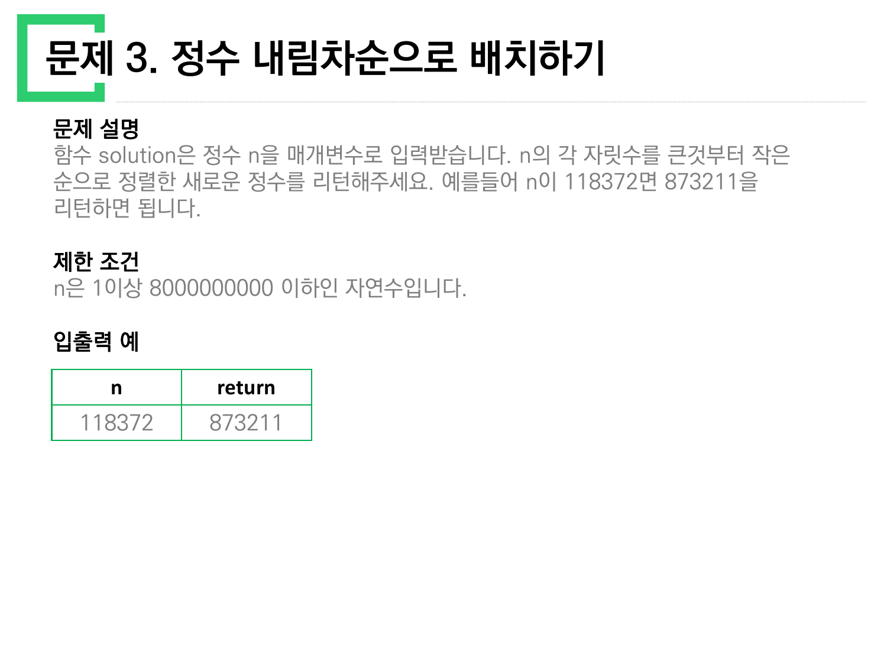
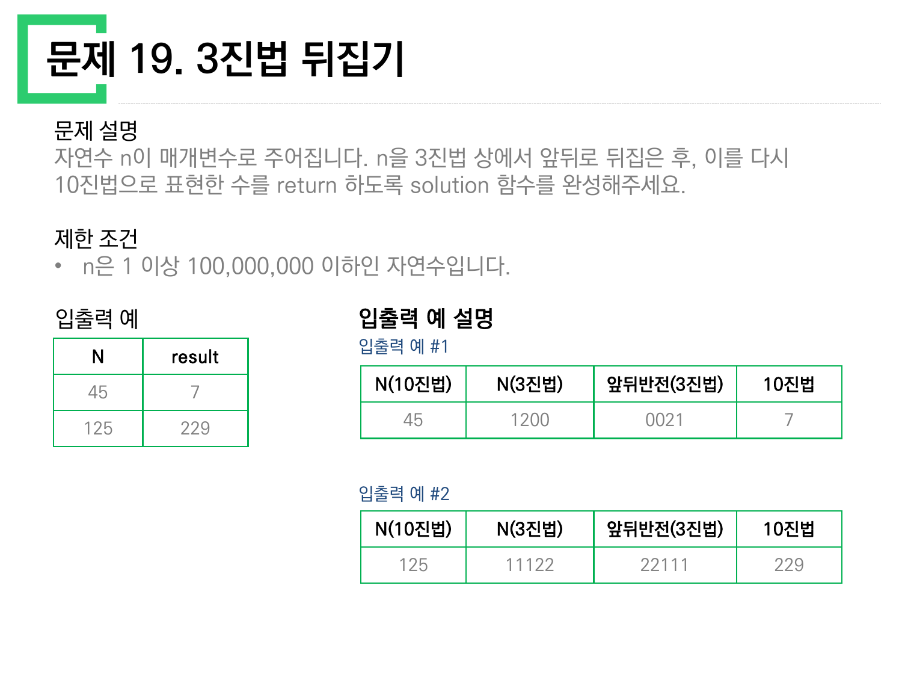
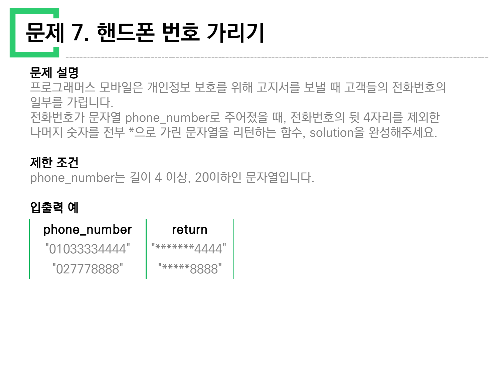
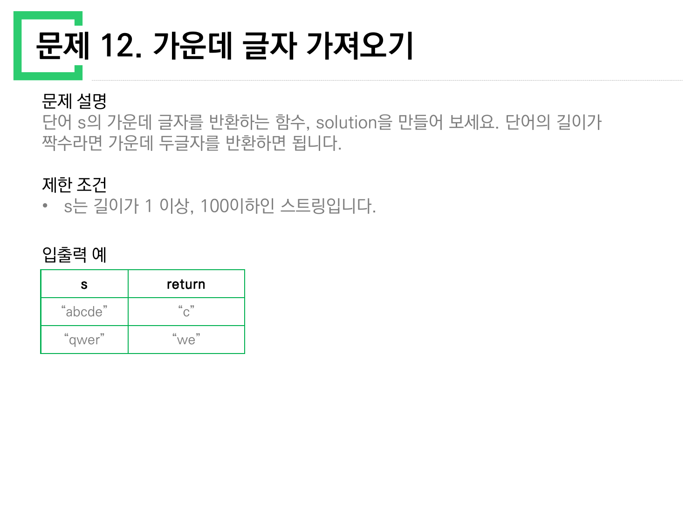
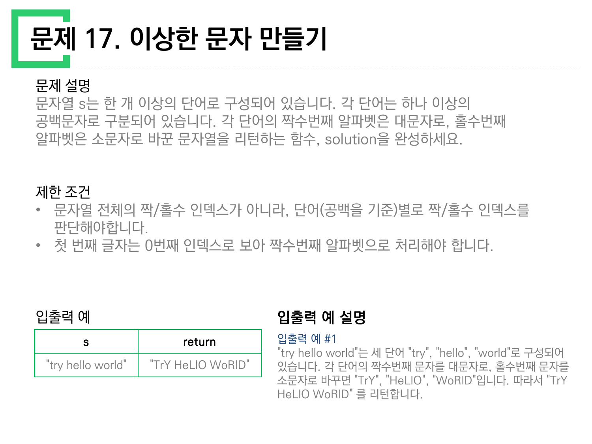
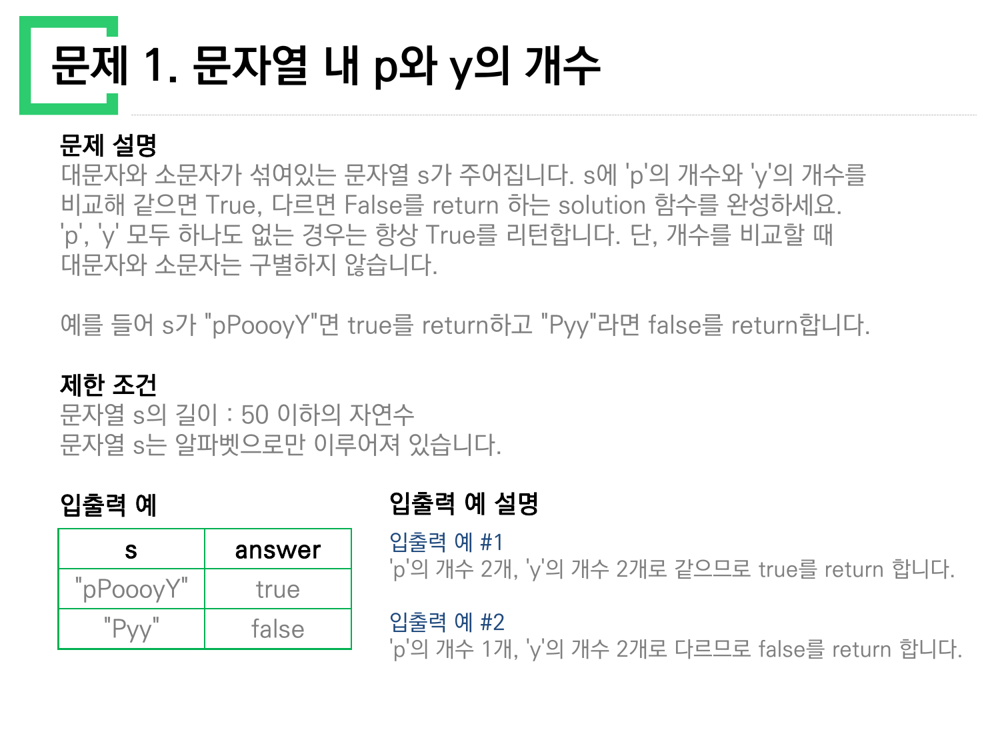
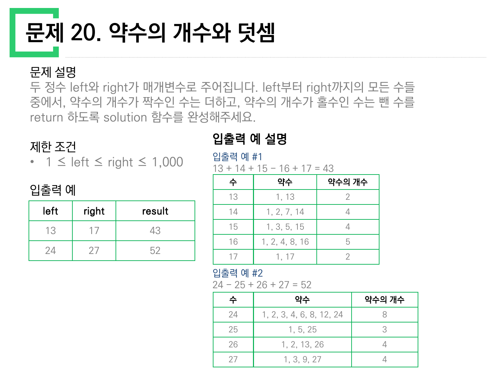

> [!abstract] 이 묶음이 실제로 하는 말
> 강의 자료 `문제풀이_1_10.pdf`(10쪽)와 `문제풀이_11_20.pdf`(10쪽)는 한 쪽에 한 문제씩, 스무 문제를 아무 설명 없이 나열한다. 해설도 없고 정답 코드도 없다. 있는 것은 **문제 설명 · 제한 조건 · 입출력 예** 세 칸뿐이다.
>
> 그런데 스무 문제를 늘어놓고 보면 절반 가까이가 같은 동작을 요구한다 — **덩어리 하나를 낱낱으로 쪼갠 다음, 그 낱낱을 센다.** 문자열을 글자로, 정수를 자릿수로, 정수를 약수로. 이 문서는 그 아홉 문제를 모았다.
>
> 그리고 이 아홉 문제에서 파이썬이 내주는 칼은 **딱 두 자루**다. 문자열의 인덱스, 그리고 나눗셈의 나머지. 어느 칼을 들지를 정하는 것은 문제 설명이 아니라 **제한 조건**이다. 마지막 20번만이 두 칼 모두를 거부한다.

---

## 아홉 문제를 한 줄로

원본에서 이 아홉 문제가 요구하는 동작만 뽑으면 이렇다.

| 원본 | 문제 | 무엇을 쪼개는가 | 무엇을 세는가 |
| --- | --- | --- | --- |
| `1_10` 1쪽 | 1. 문자열 내 p와 y의 개수 | 문자열 → 글자 | `p`의 수, `y`의 수 |
| `1_10` 2쪽 | 2. 하샤드 수 | 정수 → 자릿수 | 자릿수의 합 |
| `1_10` 3쪽 | 3. 정수 내림차순으로 배치하기 | 정수 → 자릿수 | (세지 않고 정렬한다) |
| `1_10` 7쪽 | 7. 핸드폰 번호 가리기 | 문자열 → 앞·뒤 두 토막 | 뒤 4자리를 뺀 나머지 길이 |
| `11_20` 2쪽 | 12. 가운데 글자 가져오기 | 문자열 → 앞·가운데·뒤 | 길이의 짝·홀 |
| `11_20` 5쪽 | 15. 문자열 다루기 기본 | 문자열 → 글자 | 길이, 그리고 숫자인 글자 수 |
| `11_20` 7쪽 | 17. 이상한 문자 만들기 | 문자열 → 단어 → 글자 | **단어 안에서의** 인덱스 |
| `11_20` 9쪽 | 19. 3진법 뒤집기 | 정수 → 3진 자릿수 | (세지 않고 뒤집는다) |
| `11_20` 10쪽 | 20. 약수의 개수와 덧셈 | 정수 → 약수 | 약수의 개수의 짝·홀 |

세 번째 칸이 이 문서의 척추다. **문자열 → 글자**는 인덱스로 쪼개고, **정수 → 자릿수**는 나눗셈으로 쪼갠다. 그런데 2·3·19번은 *정수를 자릿수로* 쪼개면서도 문자열 칼을 쓸 수 있다. 그 셋을 나란히 놓으면 두 칼의 성격이 드러난다.

```mermaid
graph TD
  A["아홉 문제"] --> B["문자열을 쪼갠다<br/>— 인덱스의 칼"]
  A --> C["정수를 쪼갠다<br/>— 나눗셈의 칼"]
  A --> D["쪼갤 수 없다"]

  B --> B1["1. p와 y 개수<br/>순서가 필요 없다"]
  B --> B2["7. 핸드폰 가리기<br/>경계 = len − 4"]
  B --> B3["12. 가운데 글자<br/>경계 = 길이의 짝·홀"]
  B --> B4["15. 길이 4 또는 6<br/>경계 = 길이 그 자체"]
  B --> B5["17. 이상한 문자<br/>경계가 두 겹: 공백, 그리고 인덱스"]

  C --> C1["2. 하샤드 수<br/>두 칼 모두 통한다"]
  C --> C2["3. 내림차순 배치<br/>문자열 칼이 압도한다"]
  C --> C3["19. 3진법 뒤집기<br/>문자열 칼이 아예 없다"]

  D --> D1["20. 약수의 개수<br/>세는 대신 알아야 한다"]

  style A fill:var(--card),stroke:var(--border),color:var(--foreground)
  style B fill:var(--card),stroke:var(--chart-1),color:var(--foreground)
  style C fill:var(--card),stroke:var(--chart-2),color:var(--foreground)
  style D fill:var(--card),stroke:var(--chart-4),color:var(--foreground)
```

---

## 칼 두 자루 — 2번이 두 칼을 모두 허락한다

원본 `1_10` 2쪽, 문제 2 「하샤드 수」의 설명은 이렇다.

> 양의 정수 x가 하샤드 수이려면 x의 자릿수의 합으로 x가 나누어져야 합니다. 예를 들어 18의 자릿수 합은 1+8=9이고, 18은 9로 나누어 떨어지므로 18은 하샤드 수입니다.

제한 조건은 `x는 1 이상, 10000 이하인 정수`. 이 문제는 **자릿수의 합**만 필요하고 자릿수의 *순서*는 필요 없다. 그래서 두 칼이 모두 통한다.

```python
# 칼 A — 문자열 인덱스
def solution(x):
    return x % sum(int(c) for c in str(x)) == 0

# 칼 B — 나눗셈의 나머지
def solution(x):
    s, n = 0, x
    while n > 0:
        s += n % 10      # 마지막 자릿수를 떼어낸다
        n //= 10         # 떼어낸 자리를 버린다
    return x % s == 0
```

칼 B의 두 줄이 **정수를 자릿수로 쪼개는 유일한 방식**이다. `% 10`이 마지막 자리를 읽고, `// 10`이 그 자리를 지운다. 아래에서 직접 돌려 보면 두 칼이 같은 곳에 도착한다는 것을 볼 수 있다.

```html preview h=560px
<div style="font-family:system-ui,-apple-system,sans-serif;padding:20px;color:var(--foreground)">
  <div style="font-size:13px;font-weight:600;margin-bottom:6px">정수 x (원본 제한 조건: 1 이상 10000 이하)</div>
  <input id="xin" type="number" min="1" max="10000" value="18"
         style="width:140px;font-size:22px;padding:6px 10px;border:1px solid var(--border);border-radius:6px;background:var(--card);color:var(--foreground)" />
  <span style="font-size:12px;opacity:.7;margin-left:10px">원본 입출력 예: 10 · 12 · 11 · 13</span>

  <div style="display:flex;gap:18px;flex-wrap:wrap;margin-top:18px">
    <div style="flex:1;min-width:260px;border:1px solid var(--border);border-radius:8px;padding:14px;background:var(--card)">
      <div style="font-weight:700;color:var(--chart-1);margin-bottom:8px">칼 A · 문자열 인덱스</div>
      <div id="pathA" style="font-family:ui-monospace,SFMono-Regular,Menlo,monospace;font-size:13px;line-height:1.9"></div>
    </div>
    <div style="flex:1;min-width:260px;border:1px solid var(--border);border-radius:8px;padding:14px;background:var(--card)">
      <div style="font-weight:700;color:var(--chart-2);margin-bottom:8px">칼 B · 나눗셈의 나머지</div>
      <div id="pathB" style="font-family:ui-monospace,SFMono-Regular,Menlo,monospace;font-size:13px;line-height:1.9"></div>
    </div>
  </div>

  <div id="verdict" style="margin-top:16px;font-size:19px;font-weight:700;text-align:center;padding:12px;border-radius:8px;border:1px solid var(--border)"></div>
</div>
<script>
(function(){
  var xin=document.getElementById('xin'),A=document.getElementById('pathA'),
      B=document.getElementById('pathB'),V=document.getElementById('verdict');
  function esc(s){return String(s).replace(/&/g,'&amp;').replace(/</g,'&lt;');}
  function draw(){
    var x=parseInt(xin.value,10);
    if(!(x>=1&&x<=10000)){A.textContent=B.textContent='제한 조건 밖';V.textContent='';return;}
    var s=String(x), digits=s.split('').map(Number), sum=digits.reduce(function(a,b){return a+b;},0);
    A.innerHTML='str(x) = "'+esc(s)+'"<br/>'
      +'→ ['+digits.join(', ')+']<br/>'
      +'→ sum = <b style="color:var(--chart-1)">'+sum+'</b>';
    var rows=[], n=x;
    while(n>0){ rows.push('n='+n+' → n%10 = '+(n%10)+' , n//10 = '+Math.floor(n/10)); n=Math.floor(n/10); }
    B.innerHTML=rows.join('<br/>')+'<br/>→ s = <b style="color:var(--chart-2)">'+sum+'</b>';
    var ok = (x % sum === 0);
    V.innerHTML = x+' % '+sum+' = '+(x%sum)+' &nbsp;→&nbsp; <span style="color:'
      +(ok?'var(--chart-2)':'var(--chart-4)')+'">'+(ok?'True — 하샤드 수':'False')+'</span>';
  }
  xin.addEventListener('input',draw); draw();
})();
</script>
```

### 3번 — 문자열 칼이 압도한다

`1_10` 3쪽, 문제 3 「정수 내림차순으로 배치하기」는 자릿수의 *순서*를 요구한다.



원본이 준 예는 `118372 → 873211` 하나뿐이다. 자릿수를 큰 것부터 늘어놓는 일이므로 **정렬**이 필요하고, 정렬은 열(列)을 요구한다. 나눗셈 칼로도 열을 만들 수 있지만, 문자열 칼이 한 줄로 끝난다.

```python
def solution(n):
    return int(''.join(sorted(str(n), reverse=True)))
```

> [!note] 제한 조건 `8000000000`이 말해 주는 것
> 원본 3쪽의 제한 조건은 `n은 1이상 8000000000 이하인 자연수입니다`이다. 80억은 32비트 부호 있는 정수의 상한 2,147,483,647을 넘고 64비트 안에는 들어간다. 파이썬의 `int`에는 상한이 없으니 이 조건은 파이썬 풀이에 **아무 영향도 주지 않는다**. 이 문제가 원래 자료형을 골라야 하는 언어를 염두에 두고 쓰였다는 흔적이다.
>
> 뒤집은 결과 `873211`도 원본 값 `118372`와 자릿수가 같으므로 넘칠 일이 없다. 다만 자릿수를 뒤집는 다른 문제(19번)에서는 그렇지 않다는 점을 뒤에서 본다.

### 19번 — 문자열 칼이 아예 없다

`11_20` 9쪽, 문제 19 「3진법 뒤집기」에서 상황이 뒤집힌다.



원본이 준 두 예는 표로 정리되어 있다.

| N(10진법) | N(3진법) | 앞뒤반전(3진법) | 10진법 |
| --- | --- | --- | --- |
| 45 | 1200 | 0021 | 7 |
| 125 | 11122 | 22111 | 229 |

두 줄 모두 계산해 확인했다. $45 = 1\cdot27 + 2\cdot9 + 0 + 0 = 1200_{(3)}$, 뒤집으면 $0021_{(3)} = 2\cdot3 + 1 = 7$. $125 = 11122_{(3)}$, 뒤집으면 $22111_{(3)} = 2\cdot81 + 2\cdot27 + 9 + 3 + 1 = 229$. **원본의 표는 정확하다.**

여기서 파이썬의 비대칭이 드러난다. 파이썬에는 3진 문자열을 정수로 **읽는** 함수는 있다.

```python
int('1200', 3)   # → 45
```

그런데 그 반대, 정수를 3진 문자열로 **쓰는** 함수는 없다. `bin`·`oct`·`hex`는 2·8·16진만 내주고 3진은 없다. 그러므로 이 문제에서 문자열 칼은 절반만 존재한다 — 돌아올 때는 쓸 수 있고, 갈 때는 쓸 수 없다. 갈 때는 2번에서 본 나눗셈 칼을 그대로 쓴다. 단 `10` 자리에 `3`이 들어갈 뿐이다.

```python
def solution(n):
    d = ''
    while n > 0:
        d = str(n % 3) + d   # 앞에 붙이면 정상 순서, 뒤에 붙이면 이미 뒤집힌 순서
        n //= 3
    return int(d[::-1], 3)
```

`d = str(n % 3) + d`의 `+ d`를 `d +`로 바꾸면 뒤집기가 공짜로 끝난다. **나눗셈 칼은 자릿수를 원래 순서의 반대로 뱉는다.** 2번에서는 합만 필요해 순서가 보이지 않았고, 19번에서 비로소 그 성질이 답이 된다.

```html preview h=520px
<div style="font-family:system-ui,-apple-system,sans-serif;padding:20px;color:var(--foreground)">
  <div style="font-size:13px;font-weight:600;margin-bottom:6px">자연수 n (원본 제한 조건: 1 이상 100,000,000 이하)</div>
  <input id="nin" type="number" min="1" max="100000000" value="45"
         style="width:170px;font-size:22px;padding:6px 10px;border:1px solid var(--border);border-radius:6px;background:var(--card);color:var(--foreground)" />
  <span style="font-size:12px;opacity:.7;margin-left:10px">원본 입출력 예: 45 → 7 · 125 → 229</span>

  <div style="margin-top:18px;border:1px solid var(--border);border-radius:8px;padding:14px;background:var(--card)">
    <div style="font-weight:700;color:var(--chart-2);margin-bottom:10px">나눗셈 칼이 뱉는 순서</div>
    <table style="width:100%;border-collapse:collapse;font-family:ui-monospace,SFMono-Regular,Menlo,monospace;font-size:13px">
      <thead><tr style="border-bottom:1px solid var(--border);text-align:left">
        <th style="padding:6px 4px;font-weight:600">단계</th><th style="padding:6px 4px;font-weight:600">n</th>
        <th style="padding:6px 4px;font-weight:600">n % 3</th><th style="padding:6px 4px;font-weight:600">n // 3</th>
      </tr></thead>
      <tbody id="steps"></tbody>
    </table>
  </div>

  <div style="margin-top:14px;display:flex;gap:14px;flex-wrap:wrap">
    <div style="flex:1;min-width:220px;text-align:center;padding:12px;border:1px solid var(--border);border-radius:8px;background:var(--card)">
      <div style="font-size:12px;opacity:.75">3진법 표기</div>
      <div id="base3" style="font-size:24px;font-weight:700;color:var(--chart-1);letter-spacing:2px"></div>
    </div>
    <div style="flex:1;min-width:220px;text-align:center;padding:12px;border:1px solid var(--border);border-radius:8px;background:var(--card)">
      <div style="font-size:12px;opacity:.75">앞뒤 반전</div>
      <div id="rev" style="font-size:24px;font-weight:700;color:var(--chart-3);letter-spacing:2px"></div>
    </div>
    <div style="flex:1;min-width:220px;text-align:center;padding:12px;border:1px solid var(--border);border-radius:8px;background:var(--card)">
      <div style="font-size:12px;opacity:.75">다시 10진법</div>
      <div id="out" style="font-size:24px;font-weight:700;color:var(--chart-2)"></div>
    </div>
  </div>
</div>
<script>
(function(){
  var nin=document.getElementById('nin'),S=document.getElementById('steps'),
      B=document.getElementById('base3'),R=document.getElementById('rev'),O=document.getElementById('out');
  function draw(){
    var n=parseInt(nin.value,10);
    if(!(n>=1&&n<=100000000)){S.innerHTML='';B.textContent=R.textContent=O.textContent='—';return;}
    var rows='',d='',cur=n,i=1;
    while(cur>0){
      var r=cur%3, q=Math.floor(cur/3);
      rows+='<tr style="border-bottom:1px solid var(--border)"><td style="padding:5px 4px">'+i+'</td>'
        +'<td style="padding:5px 4px">'+cur+'</td>'
        +'<td style="padding:5px 4px;color:var(--chart-1);font-weight:700">'+r+'</td>'
        +'<td style="padding:5px 4px">'+q+'</td></tr>';
      d=String(r)+d; cur=q; i++;
    }
    S.innerHTML=rows;
    var rv=d.split('').reverse().join('');
    B.textContent=d; R.textContent=rv;
    var v=0; for(var k=0;k<rv.length;k++) v=v*3+Number(rv[k]);
    O.textContent=v;
  }
  nin.addEventListener('input',draw); draw();
})();
</script>
```

> [!tip] 앞자리 0이 조용히 사라진다
> 원본 표의 첫 줄은 `1200 → 0021 → 7`이라고 앞자리 0을 두 개 살려 적었다. 코드에서는 `int('0021', 3)`이 그 0들을 그냥 버리고 7을 낸다. 그래서 **뒤집은 뒤 자릿수가 줄어들 수 있다** — 45는 네 자리인데 결과 7은 한 자리다. 3번(내림차순)에서는 큰 자리부터 정렬하므로 앞자리가 0이 되는 일이 없었는데, 19번에서는 원본이 예제 첫 줄부터 그 경우를 골랐다.

---

## 자르는 문제 — 경계를 어디에 긋는가

세 문제(7·12·17)는 쪼개는 것이 아니라 **한 군데를 자른다**. 답은 언제나 잘린 자리의 인덱스 하나다.

### 7번 — 경계가 뒤에서 온다



원본은 `"01033334444" → "*******4444"`, `"027778888" → "*****8888"` 두 예를 준다. 11자리는 별 7개, 9자리는 별 5개 — 언제나 `len - 4`개다.

```python
def solution(phone_number):
    return '*' * (len(phone_number) - 4) + phone_number[-4:]
```

제한 조건 `길이 4 이상, 20 이하`가 `len - 4`를 음수가 되지 않게 지켜 준다. 길이가 정확히 4이면 별이 0개이고 원본 문자열이 그대로 나온다. **제한 조건이 코드에서 `if`문 하나를 지워 준 셈**이다.

### 12번 — 짝수와 홀수를 한 식으로



원본 `11_20` 2쪽은 `"abcde" → "c"`, `"qwer" → "we"` 두 줄만 준다. 홀수 길이면 한 글자, 짝수 길이면 두 글자다. 두 경우를 `if`로 가르는 대신 한 식으로 합칠 수 있다.

$$\texttt{s[(n-1)//2 : n//2 + 1]}$$

- $n=5$ → `s[2:3]` → 한 글자 `"c"`
- $n=4$ → `s[1:3]` → 두 글자 `"we"`

시작 인덱스는 내림, 끝 인덱스는 올림. 홀수일 때 두 값이 같은 자리를 가리켜 폭이 1이 되고, 짝수일 때 한 칸 벌어져 폭이 2가 된다. 아래에서 길이를 바꿔 가며 경계가 어떻게 움직이는지 볼 수 있다.

```html preview h=440px
<div style="font-family:system-ui,-apple-system,sans-serif;padding:20px;color:var(--foreground)">
  <label for="sin" style="font-size:13px;font-weight:600">문자열 s (원본 제한 조건: 길이 1 이상 100 이하)</label>
  <input id="sin" type="text" value="abcde" maxlength="24"
         style="display:block;width:100%;max-width:420px;margin-top:6px;font-size:18px;padding:8px 10px;border:1px solid var(--border);border-radius:6px;background:var(--card);color:var(--foreground);font-family:ui-monospace,SFMono-Regular,Menlo,monospace" />
  <div style="font-size:12px;opacity:.7;margin-top:6px">원본 입출력 예: "abcde" → "c" · "qwer" → "we"</div>

  <div id="cells" style="display:flex;gap:6px;flex-wrap:wrap;margin-top:20px"></div>

  <div id="formula" style="margin-top:20px;font-family:ui-monospace,SFMono-Regular,Menlo,monospace;font-size:14px;line-height:2"></div>
</div>
<script>
(function(){
  var sin=document.getElementById('sin'),C=document.getElementById('cells'),F=document.getElementById('formula');
  function draw(){
    var s=sin.value, n=s.length;
    C.innerHTML=''; 
    if(n===0){F.textContent='길이 1 이상이어야 합니다.';return;}
    var lo=Math.floor((n-1)/2), hi=Math.floor(n/2)+1;
    for(var i=0;i<n;i++){
      var inside = (i>=lo && i<hi);
      var d=document.createElement('div');
      d.style.cssText='min-width:38px;text-align:center;padding:10px 6px;border-radius:6px;'
        +'border:1px solid '+(inside?'var(--chart-1)':'var(--border)')+';'
        +'background:'+(inside?'var(--chart-1)':'var(--card)')+';'
        +'color:'+(inside?'var(--card)':'var(--foreground)')+';font-weight:'+(inside?'700':'400')+';';
      d.innerHTML='<div style="font-family:ui-monospace,Menlo,monospace;font-size:18px">'
        +(s[i]===' '?'␣':s[i].replace(/&/g,'&amp;').replace(/</g,'&lt;'))+'</div>'
        +'<div style="font-size:10px;opacity:.75;margin-top:2px">'+i+'</div>';
      C.appendChild(d);
    }
    F.innerHTML='n = '+n+' ('+(n%2?'홀수':'짝수')+')<br/>'
      +'시작 = (n−1)//2 = <b style="color:var(--chart-1)">'+lo+'</b> &nbsp;·&nbsp; '
      +'끝 = n//2 + 1 = <b style="color:var(--chart-1)">'+hi+'</b><br/>'
      +'s['+lo+':'+hi+'] = <b style="color:var(--chart-2);font-size:17px">"'
      +s.slice(lo,hi).replace(/&/g,'&amp;').replace(/</g,'&lt;')+'"</b> (폭 '+(hi-lo)+')';
  }
  sin.addEventListener('input',draw); draw();
})();
</script>
```

### 17번 — 진짜 함정은 대소문자가 아니다



원본 `11_20` 7쪽의 제한 조건 두 줄이 이 문제의 전부다.

> - 문자열 전체의 짝/홀수 인덱스가 아니라, 단어(공백을 기준)별로 짝/홀수 인덱스를 판단해야합니다.
> - 첫 번째 글자는 0번째 인덱스로 보아 짝수번째 알파벳으로 처리해야 합니다.

첫 줄이 이 문제를 다른 여덟 문제와 갈라놓는다. **경계가 두 겹**이다 — 바깥은 공백, 안쪽은 인덱스. 그런데 문제 설명의 첫 문단에 더 중요한 조건이 숨어 있다.

> 각 단어는 **하나 이상의** 공백문자로 구분되어 있습니다.

공백이 두 칸 이상 연달아 올 수 있다는 뜻이다. 그런데 파이썬의 `s.split()`은 인자 없이 부르면 연속 공백을 하나로 **뭉개고**, 앞뒤 공백도 버린다. 그러면 `' '.join(...)`으로 되돌릴 때 원래 공백 개수가 복원되지 않는다.

```python
'a  b'.split()       # → ['a', 'b']        공백 2칸이 사라졌다
'a  b'.split(' ')    # → ['a', '', 'b']    빈 문자열이 그 자리를 지킨다
```

`split(' ')`이 내놓는 빈 문자열 `''`이 사라진 공백의 자리표다. 그것을 그대로 두고 `' '.join`하면 공백 수가 보존된다.

```python
def solution(s):
    out = []
    for word in s.split(' '):                       # 공백 한 칸마다 자른다
        out.append(''.join(
            c.upper() if i % 2 == 0 else c.lower()  # 단어 안에서 다시 센다
            for i, c in enumerate(word)))
    return ' '.join(out)
```

원본의 입출력 예 `"try hello world" → "TrY HeLlO WoRlD"`는 공백이 한 칸씩이라 두 방식의 차이가 드러나지 않는다. **제한 조건이 경고한 경우를 입출력 예가 보여 주지 않는다** — 이 문제 자료의 구조적 특징이다.

> [!warning] 용어가 인덱스와 어긋난다
> 원본은 `첫 번째 글자는 0번째 인덱스로 보아 짝수번째 알파벳으로 처리`라고 적는다. 즉 "첫 번째"와 "0번째"와 "짝수번째"가 같은 글자를 가리킨다. 한국어의 서수(첫 번째=1)와 파이썬 인덱스(0부터)가 한 문장 안에서 충돌하는데, 원본이 그 충돌을 알고 **인덱스 쪽을 기준으로 못 박아** 해결했다. 자료 전체에서 이런 명시가 있는 유일한 문제다.

---

## 세는 문제 — 조건이 이미 답을 지키고 있다

### 1번 — 잉여 조항 하나



```python
def solution(s):
    t = s.lower()
    return t.count('p') == t.count('y')
```

원본 설명에는 이런 문장이 있다.

> 'p', 'y' 모두 하나도 없는 경우는 항상 True를 리턴합니다.

이 조항은 **아무것도 추가하지 않는다.** 둘 다 없으면 개수가 0과 0으로 같으니, 일반 규칙("같으면 True")이 이미 True를 낸다. 특별 처리할 것이 없다.

원래 이런 문장은 경계를 헷갈릴 독자를 위한 안내지만, 여기서는 오히려 *별도의 분기가 필요하다*고 오해하게 만든다. 입출력 예에도 그 경우가 없어(`"pPoooyY"`, `"Pyy"` 둘 다 p와 y를 가진다) 확인할 수도 없다.

### 15번 — 두 조건을 한 줄로

`11_20` 5쪽, 문제 15 「문자열 다루기 기본」은 길이가 4 또는 6이면서 숫자로만 이루어졌는지를 묻는다. 입출력 예는 `"a234" → False`, `"1234" → True`, `"12345" → False` 세 줄이다.

```python
def solution(s):
    return len(s) in (4, 6) and s.isdigit()
```

`isdigit()`은 조심해야 하는 메서드다. 유니코드의 위첨자 `'²'`나 원 숫자 `'①'`에도 `True`를 돌려주기 때문이다. 그런데 원본의 제한 조건이 그 위험을 미리 없앤다.

> s는 영문 알파벳 대소문자 또는 0부터 9까지 숫자로 이루어져 있습니다.

7번에서 `if`문 하나를 지워 준 제한 조건과 같은 역할이다. **이 문제 자료에서 제한 조건은 장식이 아니라 코드의 일부다.**

---

## 쪼갤 수 없는 하나 — 20번

마지막 문제만 다르다. 정수를 자릿수로도, 글자로도 쪼갤 수 없다. 쪼개야 할 것은 **약수**이고, 약수는 자리에 붙어 있지 않다.



원본 `11_20` 10쪽은 예제 두 개를 표까지 붙여 상세히 풀어 놓았다. 그대로 옮기고 직접 계산해 대조했다.

| 수 | 약수 | 개수 | 부호 |
| --- | --- | --- | --- |
| 13 | 1, 13 | 2 | `+` |
| 14 | 1, 2, 7, 14 | 4 | `+` |
| 15 | 1, 3, 5, 15 | 4 | `+` |
| **16** | 1, 2, 4, 8, 16 | **5** | `−` |
| 17 | 1, 17 | 2 | `+` |

$13 + 14 + 15 - 16 + 17 = 43$ — 원본 값과 일치한다. 두 번째 예제도 같다.

| 수 | 약수 | 개수 | 부호 |
| --- | --- | --- | --- |
| **24** | 1, 2, 3, 4, 6, 8, 12, 24 | 8 | `+` |
| **25** | 1, 5, 25 | **3** | `−` |
| 26 | 1, 2, 13, 26 | 4 | `+` |
| 27 | 1, 3, 9, 27 | 4 | `+` |

$24 - 25 + 26 + 27 = 52$ — 역시 일치한다.

두 표에서 부호가 `−`가 된 수는 **16과 25**뿐이다. 둘 다 제곱수다. 우연이 아니다.

> [!important] 약수의 개수가 홀수인 수는 제곱수뿐이다
> 약수는 언제나 짝을 이룬다. $d$가 $k$의 약수이면 $k/d$도 약수이고, 둘을 묶으면 하나의 짝이 된다. $16$이면 $(1,16)$, $(2,8)$ — 여기까지는 짝이 맞는다. 그런데 $(4,4)$에서 **짝의 두 원소가 같아진다.** 그래서 이 하나만 짝을 못 이루고 홀로 남아 개수를 홀수로 만든다.
>
> 즉 $d = k/d$인 $d$가 있을 때, 곧 $k = d^2$일 때만 약수의 개수가 홀수다. 원본은 이 사실을 한 번도 말하지 않고 표만 두 개 보여 준다. **표가 정리를 증명하고 있는데 정리는 적혀 있지 않다.**

원본 제한 조건은 `1 ≤ left ≤ right ≤ 1,000`이다. 최대 1000개의 수에 대해 각각 1000번씩 나눠 보아도 100만 번이니 그대로 세도 된다. 정리를 몰라도 통과한다는 뜻이고, 실제로 대부분의 풀이가 그렇게 쓴다.

```python
# 세는 풀이 — 제한 조건 1000이 허락한다
def solution(left, right):
    total = 0
    for k in range(left, right + 1):
        cnt = sum(1 for d in range(1, k + 1) if k % d == 0)
        total += k if cnt % 2 == 0 else -k
    return total

# 아는 풀이 — 제곱수인지만 본다
def solution(left, right):
    return sum(-k if int(k ** 0.5) ** 2 == k else k
               for k in range(left, right + 1))
```

```html preview h=560px
<div style="font-family:system-ui,-apple-system,sans-serif;padding:20px;color:var(--foreground)">
  <div style="display:flex;gap:20px;flex-wrap:wrap;margin-bottom:14px">
    <div style="flex:1;min-width:200px">
      <label for="lf" style="font-size:13px;font-weight:600">left = <span id="lfv" style="color:var(--chart-1);font-size:17px">13</span></label>
      <input id="lf" type="range" min="1" max="60" value="13" style="width:100%;accent-color:var(--chart-1);margin-top:6px" />
    </div>
    <div style="flex:1;min-width:200px">
      <label for="rt" style="font-size:13px;font-weight:600">right = <span id="rtv" style="color:var(--chart-2);font-size:17px">17</span></label>
      <input id="rt" type="range" min="1" max="60" value="17" style="width:100%;accent-color:var(--chart-2);margin-top:6px" />
    </div>
  </div>
  <div style="font-size:12px;opacity:.7;margin-bottom:14px">원본 입출력 예: (13, 17) → 43 · (24, 27) → 52 &nbsp;|&nbsp; 원본 제한: 1 ≤ left ≤ right ≤ 1,000 (여기서는 60까지만)</div>

  <div id="grid" style="display:flex;gap:5px;flex-wrap:wrap"></div>

  <div id="expr" style="margin-top:18px;font-family:ui-monospace,SFMono-Regular,Menlo,monospace;font-size:13px;line-height:1.9;word-break:break-all"></div>
  <div id="tot" style="margin-top:12px;font-size:24px;font-weight:700;text-align:center;padding:12px;border:1px solid var(--border);border-radius:8px;background:var(--card)"></div>
</div>
<script>
(function(){
  var lf=document.getElementById('lf'),rt=document.getElementById('rt'),
      lfv=document.getElementById('lfv'),rtv=document.getElementById('rtv'),
      G=document.getElementById('grid'),E=document.getElementById('expr'),T=document.getElementById('tot');
  function divisors(k){var a=[];for(var d=1;d<=k;d++) if(k%d===0) a.push(d);return a;}
  function draw(){
    var lo=+lf.value, hi=+rt.value;
    if(lo>hi){ var t=lo; lo=hi; hi=t; }
    lfv.textContent=lf.value; rtv.textContent=rt.value;
    G.innerHTML=''; var parts=[], total=0;
    for(var k=lo;k<=hi;k++){
      var n=divisors(k).length, odd=(n%2===1);
      total += odd ? -k : k;
      parts.push((odd?'− ':'+ ')+k);
      var d=document.createElement('div');
      d.title = k+'의 약수 '+n+'개: '+divisors(k).join(', ');
      d.style.cssText='min-width:46px;text-align:center;padding:8px 5px;border-radius:6px;'
        +'border:1px solid '+(odd?'var(--chart-4)':'var(--border)')+';'
        +'background:'+(odd?'var(--chart-4)':'var(--card)')+';'
        +'color:'+(odd?'var(--card)':'var(--foreground)')+';';
      d.innerHTML='<div style="font-size:16px;font-weight:700">'+k+'</div>'
        +'<div style="font-size:10px;opacity:.8">약수 '+n+'</div>';
      G.appendChild(d);
    }
    E.innerHTML='합 = '+parts.join(' ').replace(/^\+ /,'');
    T.innerHTML='<span style="color:var(--chart-2)">'+total+'</span>'
      +'<div style="font-size:12px;font-weight:400;opacity:.75;margin-top:4px">붉게 칠해진 칸이 약수 개수가 홀수인 수 = 제곱수</div>';
  }
  lf.addEventListener('input',draw); rt.addEventListener('input',draw); draw();
})();
</script>
```

---

## 원본에서 발견한 것

> [!caution] 입출력 예 표의 열 이름이 매개변수와 다르다 — 문제 2·4·5
> 문제 2의 입출력 예 표는 열 머리를 `arr | return`이라 달았지만, 문제 설명에서 함수가 받는 것은 `자연수 x`다. 문제 5도 같은 자리에 `arr`이라 적어 놓고 아래에 `6`, `16`, `626331` 같은 **스칼라 값**을 넣었다. 배열 문제의 표 서식을 복사해 오면서 열 이름을 고치지 않은 흔적이다. 문제 3·19처럼 제대로 `n`이라 적은 문제도 있어 자료 안에서 일관되지 않다.

<!-- -->
> [!caution] 문제 5 — 입출력 예가 자기 제한 조건을 어긴다
> `1_10` 5쪽 「콜라츠 추측」의 제한 조건은 **`x는 1 이상, 10000 이하인 정수입니다`** 인데, 바로 아래 입출력 예 셋째 줄의 입력이 **626331**이다. 상한의 62배를 넘는다. 제한 조건이 참이라면 이 예제는 존재할 수 없다.
>
> 더 나아가 원본은 그 줄의 설명을 이렇게 적었다 — *`626331은 500번을 시도해도 1이 되지 못하므로 -1을 리턴해야 합니다`*. 그런데 직접 돌려 보면 626331은 **508번 만에 1에 도달한다.** 즉 "1이 되지 못하는" 것이 아니라 *500번 안에는 못 끝나는* 것이다. 문장이 콜라츠 추측 자체의 반례를 시사하는 것처럼 읽히는데, 실제로 벌어지는 일은 상한에 걸린 것뿐이다. 이 문제는 [02번 노트](./02.%20%EC%97%B4%EC%9D%84%20%EC%A7%93%EB%8A%94%20%EB%AC%B8%EC%A0%9C%20%E2%80%94%20range%C2%B7zip%C2%B7set%EC%9D%B4%20%EA%B0%81%EA%B0%81%20%EB%B2%84%EB%A6%AC%EB%8A%94%20%EA%B2%83.md)에서 다시 다룬다.

<!-- -->
> [!caution] 문제 8 — 매개변수 이름이 세 번 바뀐다
> `1_10` 8쪽은 문제 설명에서 `array의 각 element`, 제한 조건에서 `arr은 자연수를 담은 배열입니다`와 `array는 길이 1 이상인 배열입니다`, 입출력 예 표에서 다시 `arr`이라 적는다. 한 쪽 안에서 같은 대상을 `array`와 `arr` 두 이름으로 번갈아 부른다.

<!-- -->
> [!note] 문제 1 — 불필요한 특별 조항
> `'p', 'y' 모두 하나도 없는 경우는 항상 True를 리턴합니다`는 일반 규칙이 이미 보장하는 경우다. 오류는 아니지만, 별도 분기가 필요하다고 오해할 소지가 있다.

<!-- -->
> [!note] 문제 17 — 제한 조건이 경고한 경우가 입출력 예에 없다
> `각 단어는 하나 이상의 공백문자로 구분되어 있습니다`가 이 문제의 진짜 함정인데, 유일한 입출력 예 `"try hello world"`에는 연속 공백이 없다. `split()`으로 풀어도 이 예제는 통과한다.

---

## 정리 — 이 묶음에서 가져갈 것

> [!tip] 세 문장 요약
>
> 1. **파이썬이 이 아홉 문제에 내주는 칼은 두 자루다.** 문자열의 인덱스와 나눗셈의 나머지. 2번은 둘 다 되고, 3번은 문자열 쪽이 압도하고, 19번은 나눗셈 쪽밖에 없다 — 파이썬에 3진 변환 내장이 없기 때문이다.
> 2. **제한 조건이 코드의 일부다.** 7번의 `길이 4 이상`이 음수 곱셈을 막고, 15번의 `알파벳 또는 숫자`가 `isdigit()`의 유니코드 함정을 막고, 20번의 `≤ 1,000`이 완전 탐색을 허락한다. 반대로 5번은 제한 조건과 입출력 예가 서로를 배신한다.
> 3. **20번만이 쪼개지지 않는다.** 약수는 자리에 붙어 있지 않아 인덱스로도 나눗셈으로도 한 번에 얻을 수 없다. 원본은 표 두 개로 "약수 개수가 홀수 ⟺ 제곱수"를 보여 주고도 그 사실을 적지 않았다.

다음 문서는 나머지 열한 문제를 다룬다 — 쪼개는 대신 **열을 짓는** 문제들이고, 거기서는 `range`·`zip`·`set` 세 내장이 각각 무엇을 버리는지가 승부를 가른다. [02. 열을 짓는 문제](./02.%20%EC%97%B4%EC%9D%84%20%EC%A7%93%EB%8A%94%20%EB%AC%B8%EC%A0%9C%20%E2%80%94%20range%C2%B7zip%C2%B7set%EC%9D%B4%20%EA%B0%81%EA%B0%81%20%EB%B2%84%EB%A6%AC%EB%8A%94%20%EA%B2%83.md)

---

### 근거 자료

이 문서는 강의 원본 슬라이드 `문제풀이_1_10.pdf`(10쪽)와 `문제풀이_11_20.pdf`(10쪽)에 근거한다. 인용한 슬라이드는 `1_10` 1쪽(문제 1)·3쪽(문제 3)·7쪽(문제 7), `11_20` 2쪽(문제 12)·7쪽(문제 17)·9쪽(문제 19)·10쪽(문제 20)이다.

인터랙티브에 쓴 수치는 모두 원본 입출력 예에서 가져왔고, 쓰기 전에 파이썬으로 계산해 원본 표와 대조했다 — 하샤드 예제 `10·12·11·13`, 3진법 표 `45 → 1200 → 0021 → 7` 및 `125 → 11122 → 22111 → 229`, 약수 예제 `(13,17) → 43` 및 `(24,27) → 52`, 가운데 글자 `"abcde" → "c"` 및 `"qwer" → "we"` 모두 일치를 확인했다. 626331의 실제 콜라츠 단계 수 508회도 직접 계산한 값이다.

원본에 없는 내용을 덧붙인 곳은 두 군데이며 그 사실을 본문에 밝혔다 — 20번의 "약수 개수가 홀수 ⟺ 제곱수"는 원본이 표로만 보이고 말하지 않은 명제를 보충한 것이고, 17번의 `split()` 대 `split(' ')` 비교는 원본 제한 조건 문장에서 끌어낸 결과다.
