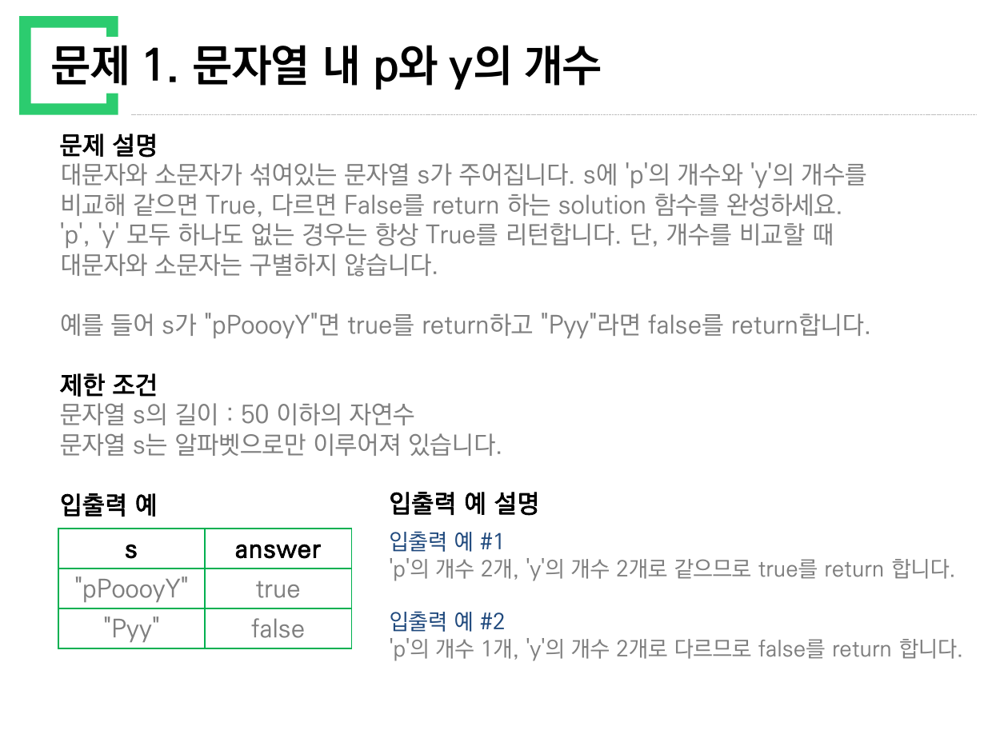
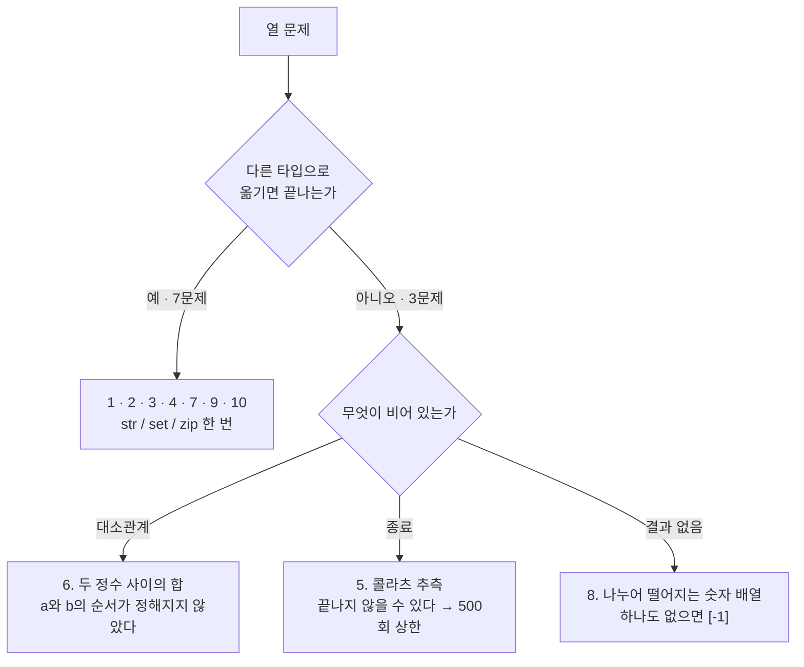
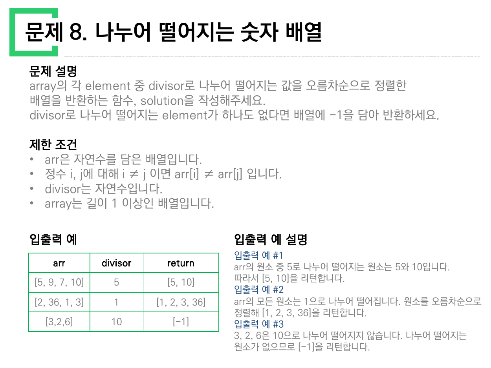
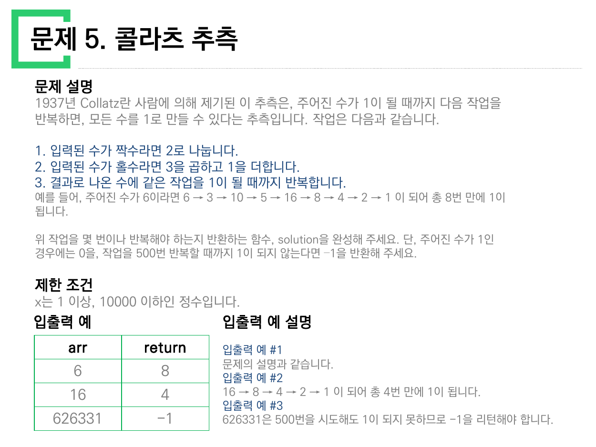
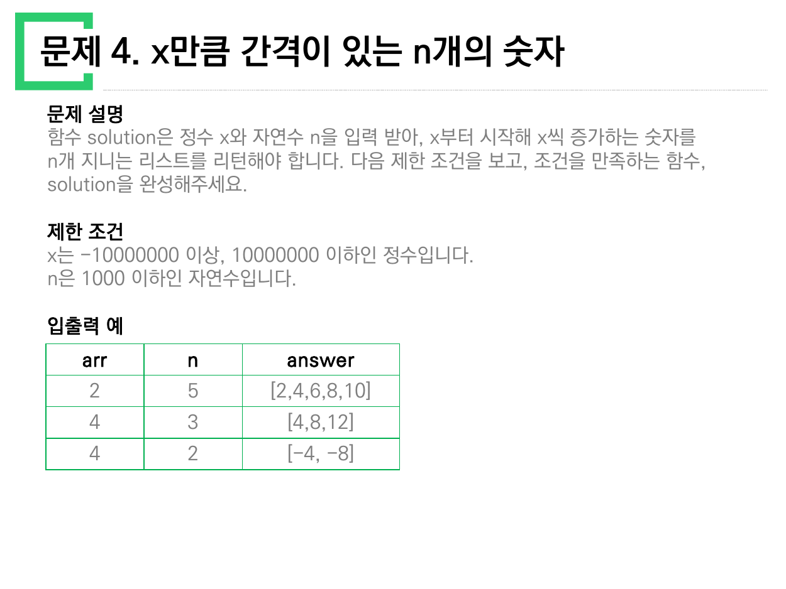
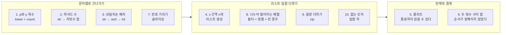

> [!abstract] 이 자료에는 풀이가 없다
> `문제풀이_1_10.pdf`는 10쪽이고, 한 쪽이 곧 한 문제다. 코드는 단 한 줄도 없다. 함수 이름이 `solution`이라는 것과 반환값이 무엇이어야 하는지만 적혀 있다.
>
> 그래서 이 정리는 "이 문제를 어떻게 푸는가"를 열 번 반복하지 않는다. 열 쪽이 **똑같은 세 덩어리**(문제 설명 · 제한 조건 · 입출력 예)로 짜여 있다는 사실에서 출발해, 그 세 덩어리가 이미 풀이를 얼마나 좁혀 놓았는지를 본다. 결론부터 적으면 열 문제는 두 무리로 갈린다 — **값의 타입 경계를 한 번 건너면 끝나는 일곱**, 그리고 **건너갈 데가 없어 조건 자체를 다뤄야 하는 셋**이다.

---

## 1. 열 쪽이 전부 같은 틀이다

원본을 훑으면 쪽마다 배치가 한 치도 다르지 않다.

| 덩어리 | 원본이 적는 것 | 읽는 쪽이 얻는 것 |
| --- | --- | --- |
| 문제 설명 | 무엇을 반환하는 함수인가 | 출력의 **타입** |
| 제한 조건 | 입력의 범위·길이·성질 | 어떤 순진한 풀이가 살아남는가 |
| 입출력 예 | 표 두세 행 + 행마다 한 문장 설명 | 애매한 문장의 **판정 기준** |



원본 1쪽. 오른쪽 "입출력 예 설명"이 `"pPoooyY"`가 왜 `true`인지를 **개수를 세어서** 알려준다. 이 열이 있는 쪽과 없는 쪽의 차이가 뒤에서 문제가 된다 — 설명이 붙은 행은 판정 기준이 확정되고, 붙지 않은 행은 그렇지 않다.

열 문제를 한 줄씩 옮기면 이렇다.

| 번호 | 원본 제목 | 입력 | 출력 |
| --- | --- | --- | --- |
| 1 | 문자열 내 p와 y의 개수 | 문자열 `s` | `true`/`false` |
| 2 | 하샤드 수 | 정수 `x` | `True`/`False` |
| 3 | 정수 내림차순으로 배치하기 | 정수 `n` | 정수 |
| 4 | x만큼 간격이 있는 n개의 숫자 | 정수 `x`, 자연수 `n` | 리스트 |
| 5 | 콜라츠 추측 | 정수 | 정수(횟수) 또는 `-1` |
| 6 | 두 정수 사이의 합 | 정수 `a`, `b` | 정수 |
| 7 | 핸드폰 번호 가리기 | 문자열 `phone_number` | 문자열 |
| 8 | 나누어 떨어지는 숫자 배열 | 배열 `array`, 정수 `divisor` | 배열 |
| 9 | 음양 더하기 | 배열 `absolutes`, 불리언 배열 `signs` | 정수 |
| 10 | 없는 숫자 더하기 | 배열 `numbers` | 정수 |

---

## 2. 일곱 문제는 경계를 한 번 건너면 끝난다

1·2·3·4·7·9·10번은 공통점이 있다. **주어진 값을 다른 타입으로 한 번 옮기면 문제가 사라진다.**

- 2번 하샤드 수 — 정수 `18`의 "자릿수의 합"은 정수 연산으로는 나눗셈을 반복해야 한다. 그러나 `str(18)`로 건너가면 `1`과 `8`이 그냥 두 글자다.
- 3번 내림차순 배치 — `118372`의 자릿수를 정렬하려면 정수를 문자열로, 정렬한 뒤 다시 정수로. **왕복 두 번**이다.
- 10번 없는 숫자 더하기 — "0부터 9까지 중 없는 것"은 리스트에 머무는 한 이중 반복이지만, 집합으로 건너가면 차집합 한 번이다.
- 9번 음양 더하기 — 두 배열을 나란히 놓는 순간(`zip`) 부호 결정이 한 줄이 된다.

경계를 건너면 왜 문제가 사라지는지, 어느 경계가 어느 문제에 열려 있는지를 아래에서 직접 옮겨 보자. 값과 표현을 바꿔 가며 각 문제가 **어느 칸에서 끝나는지** 확인할 수 있다.

```html preview h=520px
<div id="tc-root">
  <style>
    #tc-root{font-family:system-ui,-apple-system,"Segoe UI",sans-serif;color:var(--foreground);
      background:var(--card);border:1px solid var(--border);border-radius:10px;padding:16px}
    #tc-root h4{margin:0 0 4px;font-size:14px}
    #tc-root .sub{font-size:12px;opacity:.72;margin-bottom:14px;line-height:1.5}
    #tc-root .pick{display:flex;flex-wrap:wrap;gap:6px;margin-bottom:14px}
    #tc-root button{font:inherit;font-size:12px;padding:5px 10px;border-radius:7px;cursor:pointer;
      border:1px solid var(--border);background:transparent;color:var(--foreground)}
    #tc-root button.on{border-color:var(--chart-1);color:var(--chart-1)}
    #tc-root .row{display:flex;align-items:center;gap:10px;margin-bottom:12px;font-size:13px;flex-wrap:wrap}
    #tc-root input{font:inherit;font-size:13px;padding:5px 8px;border-radius:6px;
      border:1px solid var(--border);background:transparent;color:var(--foreground);width:180px}
    #tc-root .lanes{display:grid;grid-template-columns:1fr;gap:8px}
    #tc-root .lane{border:1px solid var(--border);border-radius:8px;padding:10px 12px}
    #tc-root .lane.hit{border-color:var(--chart-1)}
    #tc-root .lane .name{font-size:11px;letter-spacing:.04em;text-transform:uppercase;opacity:.7;margin-bottom:5px}
    #tc-root .val{font-family:ui-monospace,SFMono-Regular,Menlo,monospace;font-size:13px;word-break:break-all}
    #tc-root .note{font-size:12px;opacity:.78;margin-top:5px;line-height:1.5}
    #tc-root .done{font-size:11px;color:var(--chart-1);margin-top:5px}
  </style>
  <h4>타입 경계를 건너는 자리</h4>
  <div class="sub">문제를 고르고 입력을 바꿔 보라. 굵게 표시된 칸이 <b>그 문제가 실제로 끝나는 표현</b>이다.
  원본 입출력 예의 값이 기본으로 들어 있다.</div>
  <div class="pick" id="tc-pick"></div>
  <div class="row"><span>입력</span><input id="tc-in"><span id="tc-hint" style="opacity:.65;font-size:12px"></span></div>
  <div class="lanes" id="tc-lanes"></div>
  <script>
  (function(){
    const P = [
      {id:2, label:"2. 하샤드 수", def:"18", hint:"정수 x",
       lanes:["int","str","digits","int"], stop:2,
       note:"자릿수의 합은 문자열로 건너간 순간 한 줄이 된다.",
       fin:v=>{const d=[...String(v)].map(Number);const s=d.reduce((a,b)=>a+b,0);
               return "자릿수 합 "+s+" → "+v+" % "+s+" = "+(v%s)+" → "+(v%s===0?"True":"False");}},
      {id:3, label:"3. 내림차순 배치", def:"118372", hint:"정수 n",
       lanes:["int","str","digits","int"], stop:3,
       note:"문자열로 건너가 정렬하고, 정수로 되돌아와야 끝난다 — 왕복 두 번.",
       fin:v=>{const s=[...String(v)].sort().reverse().join("");return "정렬 후 "+s+" → int "+Number(s);}},
      {id:7, label:"7. 번호 가리기", def:"01033334444", hint:"문자열",
       lanes:["str","slice"], stop:1,
       note:"이미 문자열이다. 건너갈 필요 없이 뒤 4자리만 남기면 된다.",
       fin:v=>{const s=String(v);return "*".repeat(Math.max(0,s.length-4))+s.slice(-4);}},
      {id:10, label:"10. 없는 숫자 더하기", def:"1,2,3,4,6,7,8,0", hint:"쉼표로 구분한 배열",
       lanes:["list","set","diff"], stop:2,
       note:"리스트에 머물면 이중 반복, 집합으로 건너가면 차집합 한 번.",
       fin:v=>{const a=new Set(String(v).split(",").map(x=>Number(x.trim())));
               const miss=[...Array(10).keys()].filter(x=>!a.has(x));
               return "없는 숫자 "+(miss.join(", ")||"없음")+" → 합 "+miss.reduce((x,y)=>x+y,0);}}
    ];
    const LANE = {
      int:{name:"정수 그대로", show:v=>String(v)},
      str:{name:"문자열로", show:v=>JSON.stringify(String(v))},
      digits:{name:"자릿수 목록", show:v=>"["+[...String(v)].join(", ")+"]"},
      slice:{name:"슬라이싱", show:v=>"s[:-4] + s[-4:]"},
      list:{name:"리스트 그대로", show:v=>"["+String(v).split(",").map(x=>x.trim()).join(", ")+"]"},
      set:{name:"집합으로", show:v=>"{"+[...new Set(String(v).split(",").map(x=>x.trim()))].join(", ")+"}"},
      diff:{name:"차집합", show:v=>"set(range(10)) - numbers"}
    };
    let cur = 0;
    const pick = document.getElementById("tc-pick");
    const inp  = document.getElementById("tc-in");
    const hint = document.getElementById("tc-hint");
    const box  = document.getElementById("tc-lanes");
    P.forEach((p,i)=>{
      const b=document.createElement("button"); b.textContent=p.label;
      b.onclick=()=>{cur=i; inp.value=P[i].def; draw();}; pick.appendChild(b);
    });
    function draw(){
      const p=P[cur];
      [...pick.children].forEach((b,i)=>b.classList.toggle("on", i===cur));
      hint.textContent = p.hint;
      const v = inp.value.trim();
      box.innerHTML="";
      p.lanes.forEach((k,i)=>{
        const d=document.createElement("div"); d.className="lane"+(i===p.stop?" hit":"");
        let shown="";
        try{ shown = LANE[k].show(v); }catch(e){ shown="—"; }
        d.innerHTML = '<div class="name">'+LANE[k].name+'</div><div class="val">'+shown+'</div>'
          + (i===p.stop ? '<div class="done">여기서 끝난다 · '+p.fin(k==="int"||k==="digits"?Number(v)||v:v)+'</div>' : '');
        box.appendChild(d);
      });
      const n=document.createElement("div"); n.className="note"; n.textContent=p.note; box.appendChild(n);
    }
    inp.addEventListener("input", draw);
    inp.value = P[0].def; draw();
  })();
  </script>
</div>
```

4번(`x`부터 `x`씩 증가하는 `n`개)만 성격이 조금 다르다. 건너갈 타입이 없고 **만들어 낼** 타입이 있다. `[x*(i+1) for i in range(n)]` 한 줄이면 되지만, 그 한 줄이 성립하려면 `n`이 1000 이하라는 제한 조건이 필요하다. 리스트를 통째로 만드는 풀이는 `n`이 커지면 곧바로 무너지기 때문이다. 제한 조건이 풀이를 허가해 준 셈이다.

---

## 3. 나머지 셋은 건너갈 데가 없다

5·6·8번에는 옮겨 갈 타입이 없다. 대신 **조건이 하나씩 비어 있다.**



세 문제의 제한 조건을 원본에서 그대로 옮기면 비어 있던 자리가 무엇으로 메워졌는지 보인다.

| 번호 | 원본 제한 조건 중 결정적인 줄 | 이 줄이 없애는 것 |
| --- | --- | --- |
| 6 | "a와 b의 대소관계는 정해져있지 않습니다." | `range(a, b+1)`이 빈 범위가 되는 경우 |
| 6 | "a와 b가 같은 경우는 둘 중 아무 수나 리턴하세요." | 합이 아니라 그 수 자체를 돌려주는 예외 |
| 5 | "작업을 500번 반복할 때까지 1이 되지 않는다면 –1" | 무한 루프 |
| 8 | "divisor로 나누어 떨어지는 element가 하나도 없다면 배열에 -1을 담아 반환" | 빈 리스트 반환 |



원본 8쪽. `[3,2,6]`을 10으로 나누면 떨어지는 원소가 없고, 그때 답은 빈 배열이 아니라 `[-1]`이다. 이 행이 없으면 "빈 배열"과 "`[-1]`" 중 어느 쪽인지 알 방법이 없다. **입출력 예의 세 번째 행이 곧 명세다.**

6번은 더 노골적이다. 표에 `a=3, b=5 → 12`와 `a=5, b=3 → 12`가 나란히 놓여 있다. 두 행이 같은 답을 갖는다는 사실 하나로 "정렬해서 시작하라"는 지시가 완성된다.

---

## 4. 콜라츠 — 원본이 자기 제한 조건을 어겼다

5번은 이 자료에서 유일하게 **끝날지 알 수 없는** 문제다. 규칙은 세 줄이다.

1. 짝수면 2로 나눈다
2. 홀수면 3을 곱하고 1을 더한다
3. 1이 될 때까지 반복한다

원본이 든 예 `6`은 `6 → 3 → 10 → 5 → 16 → 8 → 4 → 2 → 1`로 8번 만에 끝난다. 파이썬으로 확인하면 그대로다. 문제는 세 번째 예다.



원본 5쪽.

> [!caution] 원본 오류 — 입출력 예가 자기 제한 조건을 벗어난다
> 제한 조건에는 **"x는 1 이상, 10000 이하인 정수입니다"** 라고 적혀 있다. 그런데 바로 아래 입출력 예 세 번째 행의 입력은 **626331**이다. 10000의 62배가 넘는다.
>
> 이 어긋남은 단순한 오타로 넘길 수 없다. 제한 조건이 참이라면 **`-1`을 반환하는 경우는 존재하지 않기 때문이다.** 1부터 10000 사이의 모든 수는 500번 안에 1에 도달한다(가장 오래 걸리는 `6171`이 261번). `-1` 반환 규칙을 설명하려면 10000을 넘는 예가 필요했고, 그래서 626331이 들어왔다. 규칙과 범위 중 하나가 잘못 옮겨진 것이다.
>
> 덧붙이면 626331은 **508번** 만에 1에 도달한다. 상한 500을 겨우 여덟 걸음 넘긴다 — 상한을 508로만 잡았어도 이 예는 `-1`이 아니게 된다.

아래에서 직접 돌려 보자. 상한을 움직이면 `-1`이 언제 사라지는지 볼 수 있다.

```html preview h=560px
<div id="cz-root">
  <style>
    #cz-root{font-family:system-ui,-apple-system,"Segoe UI",sans-serif;color:var(--foreground);
      background:var(--card);border:1px solid var(--border);border-radius:10px;padding:16px}
    #cz-root h4{margin:0 0 4px;font-size:14px}
    #cz-root .sub{font-size:12px;opacity:.72;margin-bottom:14px;line-height:1.5}
    #cz-root .ctl{display:flex;flex-wrap:wrap;gap:14px;align-items:center;margin-bottom:12px;font-size:13px}
    #cz-root input[type=text]{font:inherit;font-size:13px;padding:5px 8px;border-radius:6px;width:120px;
      border:1px solid var(--border);background:transparent;color:var(--foreground)}
    #cz-root input[type=range]{width:170px;accent-color:var(--chart-1)}
    #cz-root button{font:inherit;font-size:12px;padding:4px 9px;border-radius:6px;cursor:pointer;
      border:1px solid var(--border);background:transparent;color:var(--foreground)}
    #cz-root .stats{display:grid;grid-template-columns:repeat(auto-fit,minmax(120px,1fr));gap:8px;margin:12px 0}
    #cz-root .stat{border:1px solid var(--border);border-radius:8px;padding:9px 11px}
    #cz-root .stat .k{font-size:11px;opacity:.7}
    #cz-root .stat .v{font-size:17px;font-family:ui-monospace,SFMono-Regular,Menlo,monospace;margin-top:2px}
    #cz-root .stat.bad .v{color:var(--chart-1)}
    #cz-root svg{width:100%;height:190px;display:block;margin-top:6px}
    #cz-root .seq{font-family:ui-monospace,SFMono-Regular,Menlo,monospace;font-size:12px;
      line-height:1.7;margin-top:10px;word-break:break-all;opacity:.9;max-height:76px;overflow:auto}
  </style>
  <h4>콜라츠 시뮬레이터 — 상한 500이 하는 일</h4>
  <div class="sub">원본 입출력 예: <b>6 → 8</b>, <b>16 → 4</b>, <b>626331 → −1</b>. 세 값 모두 아래에서 재현된다.
  상한을 508 이상으로 올리면 626331의 −1이 사라진다.</div>
  <div class="ctl">
    <span>n</span><input type="text" id="cz-n" value="6">
    <button data-n="6">6</button><button data-n="16">16</button>
    <button data-n="27">27</button><button data-n="626331">626331</button>
    <span>상한 <b id="cz-caplab">500</b></span>
    <input type="range" id="cz-cap" min="50" max="700" step="1" value="500">
  </div>
  <div class="stats">
    <div class="stat"><div class="k">반환값</div><div class="v" id="cz-ret">—</div></div>
    <div class="stat"><div class="k">실제 걸린 횟수</div><div class="v" id="cz-real">—</div></div>
    <div class="stat"><div class="k">거쳐 간 최댓값</div><div class="v" id="cz-max">—</div></div>
    <div class="stat"><div class="k">홀수 단계 비율</div><div class="v" id="cz-odd">—</div></div>
  </div>
  <svg id="cz-svg" viewBox="0 0 720 190" preserveAspectRatio="none"></svg>
  <div class="seq" id="cz-seq"></div>
  <script>
  (function(){
    const nIn=document.getElementById("cz-n"), cap=document.getElementById("cz-cap");
    const caplab=document.getElementById("cz-caplab"), svg=document.getElementById("cz-svg");
    function run(n, limit){
      let seq=[n], c=0, odd=0;
      while(n!==1 && c<limit+2000){
        if(n%2===0){ n=n/2; } else { n=3*n+1; odd++; }
        seq.push(n); c++;
        if(seq.length>200000) break;
      }
      return {seq:seq, steps:c, odd:odd};
    }
    function draw(){
      const n=Math.max(1, Math.floor(Number(nIn.value)||1));
      const limit=Number(cap.value); caplab.textContent=limit;
      const r=run(n, limit);
      const ret = (r.steps>limit) ? "-1" : String(r.steps);
      document.getElementById("cz-ret").textContent=ret;
      document.getElementById("cz-ret").parentElement.classList.toggle("bad", ret==="-1");
      document.getElementById("cz-real").textContent=r.steps;
      document.getElementById("cz-max").textContent=Math.max(...r.seq).toLocaleString();
      document.getElementById("cz-odd").textContent=r.steps? Math.round(100*r.odd/r.steps)+"%" : "—";
      // 로그 스케일 꺾은선
      const W=720,H=190,pad=8;
      const pts=r.seq.slice(0, 1200);
      const lo=0, hi=Math.log10(Math.max(...pts))||1;
      const d=pts.map((v,i)=>{
        const x=pad+(W-2*pad)*(pts.length<2?0:i/(pts.length-1));
        const y=H-pad-(H-2*pad)*((Math.log10(v)-lo)/((hi-lo)||1));
        return (i?"L":"M")+x.toFixed(1)+" "+y.toFixed(1);
      }).join(" ");
      const cx = pad+(W-2*pad)*Math.min(1, limit/Math.max(1,pts.length-1));
      svg.innerHTML =
        '<path d="'+d+'" fill="none" stroke="var(--chart-1)" stroke-width="1.6"/>' +
        (r.steps>limit ? '<line x1="'+cx+'" y1="0" x2="'+cx+'" y2="'+H+'" stroke="var(--border)" '+
          'stroke-dasharray="4 4" stroke-width="1.5"/><text x="'+(cx+6)+'" y="16" fill="var(--foreground)" '+
          'font-size="11" opacity="0.75">상한 '+limit+'회</text>' : '') +
        '<text x="'+pad+'" y="14" fill="var(--foreground)" font-size="11" opacity="0.6">세로축: log₁₀(값)</text>';
      document.getElementById("cz-seq").textContent =
        r.seq.slice(0,40).join(" → ") + (r.seq.length>40 ? "  … (총 "+r.seq.length+"개)" : "");
    }
    nIn.addEventListener("input", draw);
    cap.addEventListener("input", draw);
    document.querySelectorAll("#cz-root button").forEach(b=>{
      b.onclick=()=>{ nIn.value=b.dataset.n; draw(); };
    });
    draw();
  })();
  </script>
</div>
```

`27`을 넣어 보면 111번을 거치는 동안 값이 **9232**까지 치솟는다. 입력이 10000 이하라도 중간값은 그 제한을 지키지 않는다는 뜻이다. 제한 조건이 걸리는 곳은 입력이지 계산 과정이 아니다.

---

## 5. 입출력 예 한 행에서 부호가 빠졌다

4번(`x`만큼 간격이 있는 `n`개의 숫자)의 입출력 예는 세 행이다.

| 원본 표 | `x` 열 | `n` | answer |
| --- | --- | --- | --- |
| 1행 | 2 | 5 | `[2,4,6,8,10]` |
| 2행 | 4 | 3 | `[4,8,12]` |
| 3행 | **4** | 2 | `[-4, -8]` |



원본 4쪽.

> [!caution] 원본 오류 — 3행의 입력에서 음수 부호가 빠졌다
> `x = 4, n = 2`라면 답은 `[4, 8]`이다. `[-4, -8]`이 나오려면 `x = -4`여야 한다. 파이썬으로 확인하면 `solution(4, 2) → [4, 8]`, `solution(-4, 2) → [-4, -8]`이다.
>
> 이 행은 제한 조건의 **"x는 -10000000 이상"** 이라는 대목, 즉 `x`가 음수일 수 있다는 사실을 보여주려고 놓인 행이다. 그 목적에 비추면 입력이 `-4`여야 맞다. 부호 하나가 빠지면서 이 문제에서 유일하게 음수를 다루는 행이 사라졌다.
>
> 이 쪽에는 "입출력 예 설명" 열이 없다. §1에서 짚은 대로 설명이 붙은 행은 판정 기준이 확정되고 붙지 않은 행은 그렇지 않은데, 하필 오류가 난 행이 설명 없는 쪽에 있다.

같은 쪽에 표기 문제가 하나 더 있다. 표의 첫 열 머리글이 **`arr`** 인데, 문제 설명은 매개변수를 `x`라고 부른다. 배열이 아니라 정수다.

---

## 6. 표기가 흔들리는 자리들

파이썬 과목의 자료인데도 반환값 표기가 쪽마다 다르다. 이것들은 오류라기보다 **원본이 다른 곳에서 옮겨 왔다는 흔적**이다.

| 쪽 | 표기 | 파이썬에서는 |
| --- | --- | --- |
| 1쪽 | `true` / `false`, 본문도 "true를 return하고" | `True` / `False` |
| 2쪽 | `True` / `False` | 일치 |
| 9쪽 | `signs`를 `[true,false,true]`로 표기 | `[True, False, True]` |
| 2·4·5쪽 | 입출력 예의 열 머리글이 `arr` | 매개변수는 각각 `x`, `x`·`n`, 정수 하나 |

머리글 `arr`가 세 쪽에 남아 있다는 것은 표 틀을 배열 문제에서 복사해 왔다는 뜻이다. 값 자체는 세 쪽 모두 맞으므로 풀이에 지장은 없지만, 문제 설명의 이름(`x`)과 표의 이름(`arr`)이 다르다는 점은 함수 시그니처를 적을 때 한 번 걸린다.

---

## 7. 열 문제를 다시 배열하면

원본의 순서(1→10)는 난이도 순도 주제 순도 아니다. 아래처럼 묶으면 무엇을 연습하는 자료인지가 드러난다.



`S3`의 두 문제만이 "반복을 어디서 멈출 것인가"를 묻는다. 나머지 여덟은 파이썬 내장 기능으로 한두 줄이면 끝난다. 이 자료가 **문법 연습이 아니라 표현 선택 연습**인 이유다.

---

## 8. 확인 문제

원본만 보고 답할 수 있는 것들이다.

1. 8번 문제에서 `arr`의 원소가 모두 서로 다르다는 제한 조건("정수 i, j에 대해 i ≠ j 이면 arr[i] ≠ arr[j]")은 풀이의 무엇을 없애 주는가?
2. 6번 문제에서 `a == b`인 경우를 따로 적어 둔 이유는 무엇인가? 적지 않으면 `range(min, max+1)` 풀이는 어떻게 되는가?
3. 5번 문제의 제한 조건대로 입력이 1~10000이라면, 반환값이 `-1`이 되는 입력이 존재하는가?
4. 3번 문제의 제한 조건은 `n ≤ 8000000000`이다. 이 값이 32비트 정수 범위를 넘는데, 파이썬에서는 왜 문제가 되지 않는가?
5. 10번 문제에서 `numbers`의 길이가 최대 9라는 제한이 뜻하는 것은? (0~9는 열 개다)

---

## 9. 이어지는 자료

- [02. 원본이 굵게 못 박아 둔 한 줄](<./02. 원본이 굵게 못 박아 둔 한 줄.md>) — 문제 11~20. 직관이 먼저 내놓는 답이 틀리는 지점만 모아 놓았다
- [03. 지뢰찾기 — 판 밖을 어떻게 다룰 것인가](<./03. 지뢰찾기 — 판 밖을 어떻게 다룰 것인가.md>) — 예제 일곱 개가 전부 경계 케이스인 과제
- [04. 중간고사 — 글로 준 문제와 그림으로 준 문제](<./04. 중간고사 — 글로 준 문제와 그림으로 준 문제.md>) — 명세가 비는 쪽과 과한 쪽

같은 도메인에서는 [01/coding-basics](../../coding-basics/README.md)의 알고리즘 연습 자료가 같은 문제들을 순서도로 다룬다.

---

## 근거 자료

`ComputerScience/01_programming-foundations/python-programming/sources/문제풀이_1_10.pdf` (10쪽) 전체.

| 쪽 | 내용 | 이 문서에서 쓴 곳 |
| --- | --- | --- |
| 1 | 문제 1 · 문자열 내 p와 y의 개수 | §1 배치, §6 표기 |
| 2 | 문제 2 · 하샤드 수 | §2 인터랙티브, §6 머리글 |
| 3 | 문제 3 · 정수 내림차순으로 배치하기 | §2 인터랙티브, §8 확인 문제 |
| 4 | 문제 4 · x만큼 간격이 있는 n개의 숫자 | §5 원본 오류 |
| 5 | 문제 5 · 콜라츠 추측 | §4 원본 오류 · 시뮬레이터 |
| 6 | 문제 6 · 두 정수 사이의 합 | §3 조건 표 |
| 7 | 문제 7 · 핸드폰 번호 가리기 | §2 인터랙티브 |
| 8 | 문제 8 · 나누어 떨어지는 숫자 배열 | §3 빈 결과 |
| 9 | 문제 9 · 음양 더하기 | §2, §6 표기 |
| 10 | 문제 10 · 없는 숫자 더하기 | §2 인터랙티브 |

인용한 슬라이드 이미지 4장은 위 PDF 1·4·5·8쪽을 125dpi로 렌더링한 것이다. 본문의 모든 계산값(콜라츠 걸음 수, 최댓값, 626331의 508회, 4번 문제의 `[4, 8]`)은 파이썬으로 직접 계산해 원본 표와 대조했다.
