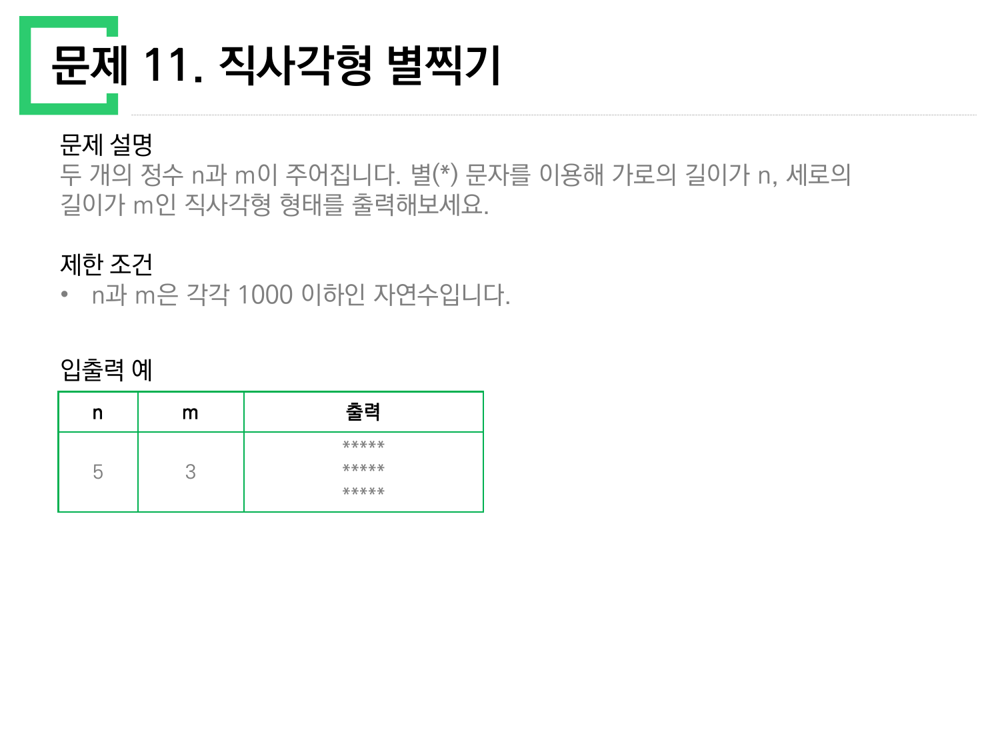
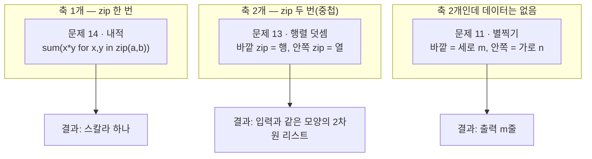
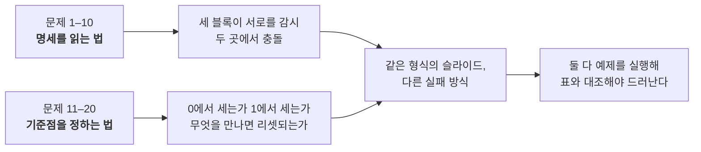

> [!abstract] 열 문제가 실은 한 문제다
> 앞의 열 문제(1–10)는 **명세를 읽는 법**을 물었다. 이번 열 장은 형식이 똑같은데 묻는 것이 바뀐다 — 거의 전부가 **"무엇을 세는가, 어디서부터 세는가"** 다.
>
> 문제 12는 글자 수의 홀짝을, 문제 17은 단어마다 다시 0에서 시작하는 인덱스를, 문제 18은 1에서 시작하는 이용 횟수를, 문제 19는 자릿수의 순서를, 문제 20은 약수의 개수를 센다. 문제 11·13·14는 축이 몇 개인지를 센다. 열 문제 중 여덟이 **세기(counting)의 기준점** 위에서 갈린다.
>
> 그래서 이 정리는 문제 번호가 아니라 **기준점의 종류**로 묶는다 — 0에서 시작하는 것, 1에서 시작하는 것, 무언가를 만날 때마다 리셋되는 것, 그리고 순서 자체가 답인 것.

---

## 1. 0에서 세는 것과 1에서 세는 것

파이썬 인덱스는 0에서 시작한다. 그런데 사람이 쓰는 "몇 번째"는 1에서 시작한다. 이 자료는 두 관습을 **같은 열 장 안에서 둘 다** 쓴다. 어느 쪽인지는 매번 원본이 직접 말해 준다.

### 1.1 원본이 못박은 자리 — 문제 17


설명은 "각 단어의 **짝수번째** 알파벳은 대문자로, **홀수번째** 알파벳은 소문자로"라고 한다. 일상 어법으로 "첫 번째 글자"는 홀수번째다. 그런데 예제는 `"try"` → `"TrY"` 로 **첫 글자가 대문자**다. 모순처럼 보인다.

원본은 이 충돌을 제한 조건에서 직접 해소한다.

> **"첫 번째 글자는 0번째 인덱스로 보아 짝수번째 알파벳으로 처리해야 합니다."**

즉 이 문제에서 "짝수번째"는 **파이썬 인덱스 기준**이다. 설명만 읽고 제한 조건을 건너뛰면 결과가 통째로 뒤집힌다.

같은 제한 조건의 첫 줄이 두 번째 기준점을 정한다.

> **"문자열 전체의 짝/홀수 인덱스가 아니라, 단어(공백을 기준)별로 짝/홀수 인덱스를 판단해야합니다."**

인덱스가 **공백을 만날 때마다 0으로 되돌아간다**는 뜻이다. `"try hello world"` 에서 `hello` 의 `h` 는 문자열 전체로는 4번째지만 단어 안에서는 0번째다.

```python
def solution(s):
    return " ".join(
        "".join(c.upper() if i % 2 == 0 else c.lower() for i, c in enumerate(word))
        for word in s.split(" ")
    )
```

`solution("try hello world")` → `'TrY HeLlO WoRlD'`. 원본 표와 일치한다.

> [!warning] `split()` 과 `split(" ")` 은 다르다
> 원본 설명은 "각 단어는 **하나 이상의** 공백문자로 구분되어 있습니다"라고 한다. 공백이 두 칸 이상일 수 있다는 뜻이다. 그런데 `s.split()` (인자 없음)은 연속 공백을 하나로 뭉개고 양끝 공백을 버린다.
>
> ```python
> s = "try  hello world"        # 공백 두 칸
> s.split()      # ['try', 'hello', 'world']  → 'TrY HeLlO WoRlD'  (공백 한 칸으로 줄었다)
> s.split(" ")   # ['try', '', 'hello', 'world'] → 'TrY  HeLlO WoRlD'  (원본 유지)
> ```
>
> 입출력 예에는 공백 한 칸짜리 문장 하나뿐이라 **예제로는 두 방식이 구별되지 않는다.** 제한 조건의 "하나 이상"이 유일한 단서다.

### 1.2 1에서 세는 자리 — 문제 18

문제 18(부족한 금액 계산하기)의 규칙은 정반대다. "놀이기구를 **N 번 째** 이용한다면 원래 이용료의 **N배**". 여기서 N은 1에서 시작한다 — 첫 이용이 0배일 리는 없다.

원본 예제로 확인한다. `price=3, money=20, count=4` → 총액 3+6+9+12 = **30**, 부족액 30−20 = **10**.

```python
def solution(price, money, count):
    total = sum(price * i for i in range(1, count + 1))
    return max(0, total - money)
```

`range(1, count+1)` 이 이 문제의 전부다. `range(count)` 로 쓰면 0배부터 시작해 총액이 3+6+9 = 18이 되고, 부족액이 0이 되어 버린다.

> [!note] 제한 조건이 알려 주는 자릿수
> `price ≤ 2,500`, `count ≤ 2,500` 이므로 최대 총액은 $2500 \times \frac{2500 \times 2501}{2} = 7{,}815{,}625{,}000$ 이다. `money` 최대가 10억이므로 부족액은 최대 약 **68억**까지 나온다. 32비트 정수 상한(2,147,483,647)을 훌쩍 넘는다. 파이썬은 정수 크기 제한이 없어 문제되지 않지만, **제한 조건은 원래 이 자릿수를 경고하려고 적힌 것**이다. (숫자 계산은 원본 제한 조건 값에서 유도한 보충 설명이다.)

### 1.3 길이의 홀짝 — 문제 12

문제 12(가운데 글자 가져오기)는 세는 대상이 **글자 수 자체**다. 길이가 홀수면 한 글자, 짝수면 두 글자를 돌려준다.

```python
def solution(s):
    return s[(len(s) - 1) // 2 : len(s) // 2 + 1]
```

한 줄로 홀짝을 모두 처리하는 이유는 정수 나눗셈의 성질에 있다.

| `s` | 길이 | `(len-1)//2` | `len//2+1` | 잘라낸 구간 | 결과 | 원본 표 |
| --- | --- | --- | --- | --- | --- | --- |
| `"abcde"` | 5 | 2 | 3 | `[2:3]` | `"c"` | `"c"` ✓ |
| `"qwer"` | 4 | 1 | 3 | `[1:3]` | `"we"` | `"we"` ✓ |

홀수 길이에서는 두 인덱스가 딱 한 칸 차이가 나고, 짝수 길이에서는 두 칸 차이가 난다. 분기문 없이 홀짝이 갈리는 셈이다.

---

## 2. 인덱스 판독기 — 어디서 0이 되는가

문자열을 넣으면 문제 17의 규칙대로 단어별 인덱스가 어떻게 리셋되는지 보여 준다. 기본값은 원본 입출력 예 그대로다.

```html preview h=520px
<div style="font-family:system-ui,-apple-system,sans-serif;padding:18px;color:var(--foreground)">
  <label for="inp" style="font-size:12.5px;font-weight:600">입력 문자열 s</label>
  <input id="inp" type="text" value="try hello world"
    style="width:100%;box-sizing:border-box;margin:6px 0 10px;padding:8px 10px;font-size:14px;font-family:ui-monospace,monospace;background:var(--card);color:var(--foreground);border:1px solid var(--border);border-radius:var(--radius)" />
  <div style="display:flex;gap:14px;flex-wrap:wrap;margin-bottom:12px;font-size:12.5px">
    <label style="cursor:pointer"><input type="radio" name="mode" value="word" checked /> 단어별 인덱스 <b>(원본 규칙)</b></label>
    <label style="cursor:pointer"><input type="radio" name="mode" value="whole" /> 문자열 전체 인덱스</label>
  </div>
  <div id="cells" style="display:flex;flex-wrap:wrap;gap:4px;margin-bottom:14px"></div>
  <div style="padding:11px 13px;background:var(--card);border:1px solid var(--border);border-radius:var(--radius)">
    <div style="font-size:11.5px;color:var(--muted-foreground);margin-bottom:5px">결과</div>
    <div id="res" style="font-family:ui-monospace,monospace;font-size:17px;font-weight:600;color:var(--chart-1);word-break:break-all"></div>
  </div>
  <div id="cmp" style="margin-top:10px;font-size:12.5px;line-height:1.7;color:var(--muted-foreground)"></div>

  <script>
    function build(s, mode) {
      var out = [], cells = [], gi = 0, li = 0;
      for (var k = 0; k < s.length; k++) {
        var ch = s[k];
        if (ch === ' ') { out.push(' '); cells.push({c:'␣', i:null}); li = 0; gi++; continue; }
        var idx = (mode === 'word') ? li : gi;
        var up = idx % 2 === 0;
        out.push(up ? ch.toUpperCase() : ch.toLowerCase());
        cells.push({c: up ? ch.toUpperCase() : ch.toLowerCase(), i: idx, up: up});
        li++; gi++;
      }
      return {text: out.join(''), cells: cells};
    }
    function render() {
      var s = document.getElementById('inp').value;
      var mode = document.querySelector('input[name=mode]:checked').value;
      var r = build(s, mode);
      document.getElementById('cells').innerHTML = r.cells.map(function (c) {
        if (c.i === null) {
          return '<div style="width:34px;text-align:center;padding:6px 0;border:1px dashed var(--border);' +
            'border-radius:var(--radius);font-size:13px;color:var(--muted-foreground)">␣<div style="font-size:10px">리셋</div></div>';
        }
        var col = c.up ? 'var(--chart-1)' : 'var(--chart-3)';
        return '<div style="width:34px;text-align:center;padding:6px 0;border:1px solid ' + col +
          ';border-radius:var(--radius);background:var(--card)">' +
          '<div style="font-family:ui-monospace,monospace;font-size:16px;font-weight:700;color:' + col + '">' + c.c + '</div>' +
          '<div style="font-size:10px;color:var(--muted-foreground)">' + c.i + '</div></div>';
      }).join('');
      document.getElementById('res').textContent = r.text;
      var w = build(s, 'word').text, g = build(s, 'whole').text;
      document.getElementById('cmp').innerHTML = (w === g)
        ? '이 입력에서는 두 방식의 결과가 <b>같다</b> — 단어 길이가 모두 홀수이거나 공백 위치가 우연히 맞은 경우다.'
        : '두 방식의 결과가 <b>다르다</b>. 단어별: <code>' + w + '</code> / 전체: <code>' + g + '</code>';
    }
    document.getElementById('inp').oninput = render;
    Array.prototype.forEach.call(document.getElementsByName('mode'), function (r) { r.onchange = render; });
    render();
  </script>
</div>
```

`"try hello world"` 에서는 두 방식의 결과가 갈린다. `try` 가 세 글자(홀수)라 그다음 단어의 전체 인덱스 시작점이 짝수가 아니게 되기 때문이다. **단어 길이가 짝수면 두 방식이 우연히 일치**하는데, 그 우연 때문에 잘못된 코드가 예제를 통과하는 일이 생긴다.

---

## 3. 축이 몇 개인가 — 문제 11·13·14

세 문제가 같은 재료(리스트)를 쓰면서 **반복문의 깊이**를 하나씩 바꾼다.



문제 11은 축이 둘이지만 데이터가 없다. `n`(가로)과 `m`(세로)이 곧 두 축이다. 원본 예제는 `n=5, m=3` 에서 **별 5개짜리 줄이 3줄**이다.

```python
n, m = 5, 3
for _ in range(m):
    print('*' * n)
```

> [!tip] 이름이 축을 뒤집는다
> 표 머리글이 `n | m | 출력` 순서라 무심코 `range(n)` 을 바깥 반복으로 쓰기 쉽다. 그러면 3개짜리 줄이 5줄 나온다. **바깥 반복은 세로(m), 안쪽은 가로(n)** 다 — 출력이 줄 단위로 나가기 때문이다. 원본이 "가로의 길이가 n, 세로의 길이가 m"이라고 먼저 못박은 이유가 여기 있다.

문제 13(행렬의 덧셈)은 축이 둘이고 데이터도 2차원이다.

```python
def solution(arr1, arr2):
    return [[a + b for a, b in zip(row1, row2)] for row1, row2 in zip(arr1, arr2)]
```

| `arr1` | `arr2` | 결과 | 원본 표 |
| --- | --- | --- | --- |
| `[[1,2],[2,3]]` | `[[3,4],[5,6]]` | `[[4,6],[7,9]]` | `[[4,6],[7,9]]` ✓ |
| `[[1],[2]]` | `[[3],[4]]` | `[[4],[6]]` | `[[4],[6]]` ✓ |

두 번째 예제가 중요하다. `[[1],[2]]` 는 **2행 1열**이다. 행과 열의 개수가 다른 경우를 원본이 일부러 넣었다 — 행 개수와 열 개수를 한 변수로 처리하면 여기서 깨진다.

문제 14(내적)는 축이 하나로 줄어든다.

```python
def solution(a, b):
    return sum(x * y for x, y in zip(a, b))
```

`[1,2,3,4] · [-3,-1,0,2]` = 1·(−3) + 2·(−1) + 3·0 + 4·2 = **3**. `[-1,0,1] · [1,0,-1]` = −1 + 0 − 1 = **−2**. 원본 설명의 계산식과 그대로 맞는다.



---

## 4. 앞을 돌아봐야 하는 문제 — 16

문제 16(같은 숫자는 싫어)은 **현재 원소만 봐서는 판단이 안 되는** 유일한 문제다. 앞 원소와 비교해야 한다.

```python
def solution(arr):
    result = []
    for v in arr:
        if not result or result[-1] != v:
            result.append(v)
    return result
```

| 입력 | 결과 | 원본 표 |
| --- | --- | --- |
| `[1,1,3,3,0,1,1]` | `[1,3,0,1]` | `[1,3,0,1]` ✓ |
| `[4,4,4,3,3]` | `[4,3]` | `[4,3]` ✓ |

> [!important] `set` 으로 풀면 왜 틀리는가
> 첫 예제의 답 `[1,3,0,1]` 에는 **1이 두 번** 있다. 연속이 아닌 중복은 남겨야 하기 때문이다. `sorted(set([1,1,3,3,0,1,1]))` 는 `[0,1,3]` 을 준다 — 개수도 순서도 다르다. 앞 노트의 문제 10이 `set` 의 여집합으로 한 줄에 끝났던 것과 정확히 대비되는 자리다. **"중복 제거"라는 같은 말이 두 문제에서 다른 연산을 가리킨다.**

`result[-1]` 대신 인덱스로 쓰면 경계가 드러난다. `arr[i-1] != arr[i]` 는 `i=0` 에서 `arr[-1]`(마지막 원소)을 읽어 버린다. 그래서 `i == 0` 을 따로 통과시켜야 한다 — 위 코드의 `not result` 가 그 일을 한다.

---

## 5. 순서 자체가 답인 문제 — 19


여기서 세는 것은 **자릿수의 위치**다. 원본이 표로 과정을 네 칸으로 쪼개 놓았다.

| N(10진법) | N(3진법) | 앞뒤반전(3진법) | 10진법 |
| --- | --- | --- | --- |
| 45 | 1200 | 0021 | 7 |
| 125 | 11122 | 22111 | 229 |

첫 줄의 `0021` 이 이 문제의 핵심이다. 뒤집으면 **앞자리에 0이 생긴다.** 수로서는 `21`(3진법)이지만, 원본은 자릿수를 맞춰 `0021` 로 적어 "뒤집기는 자릿수 배열의 조작"임을 보여 준다. 10진법으로 되돌리면 $2 \times 3 + 1 = 7$ 이다.

```python
def solution(n):
    digits = ''
    while n:
        digits = str(n % 3) + digits
        n //= 3
    return int(digits[::-1], 3)
```

```html preview h=540px
<div style="font-family:system-ui,-apple-system,sans-serif;padding:18px;color:var(--foreground)">
  <div style="display:flex;gap:8px;flex-wrap:wrap;align-items:center;margin-bottom:12px">
    <span style="font-size:12.5px;font-weight:600">원본 입출력 예:</span>
    <button class="pre" data-v="45" style="cursor:pointer">45 → 7</button>
    <button class="pre" data-v="125" style="cursor:pointer">125 → 229</button>
  </div>
  <label for="n3" style="font-size:12.5px;font-weight:600">자연수 n =
    <span id="n3v" style="color:var(--chart-1);font-size:19px;font-weight:700">45</span></label>
  <input id="n3" type="range" min="1" max="2000" step="1" value="45"
    style="width:100%;accent-color:var(--primary);margin:6px 0 14px" />
  <div id="steps" style="display:flex;flex-direction:column;gap:9px"></div>
  <div id="ans" style="margin-top:13px;padding:12px 14px;background:var(--card);border:1px solid var(--border);border-radius:var(--radius);font-size:14px;line-height:1.75"></div>

  <script>
    function toBase3(n) { var s = ''; while (n > 0) { s = (n % 3) + s; n = Math.floor(n / 3); } return s || '0'; }
    function fromBase3(s) { var v = 0; for (var i = 0; i < s.length; i++) v = v * 3 + (+s[i]); return v; }
    function chips(str, weights, color) {
      return str.split('').map(function (d, i) {
        return '<div style="text-align:center;min-width:46px;padding:5px 6px;border:1px solid ' + color +
          ';border-radius:var(--radius);background:var(--card)">' +
          '<div style="font-family:ui-monospace,monospace;font-size:18px;font-weight:700;color:' + color + '">' + d + '</div>' +
          '<div style="font-size:10px;color:var(--muted-foreground)">×3<sup>' + weights[i] + '</sup></div></div>';
      }).join('');
    }
    var sl = document.getElementById('n3');
    function draw() {
      var n = parseInt(sl.value, 10);
      document.getElementById('n3v').textContent = n.toLocaleString();
      var b = toBase3(n), rev = b.split('').reverse().join(''), out = fromBase3(rev);
      var wf = [], wr = [];
      for (var i = 0; i < b.length; i++) { wf.push(b.length - 1 - i); wr.push(b.length - 1 - i); }
      function row(label, html) {
        return '<div><div style="font-size:11.5px;color:var(--muted-foreground);margin-bottom:4px">' + label +
          '</div><div style="display:flex;gap:5px;flex-wrap:wrap">' + html + '</div></div>';
      }
      var terms = rev.split('').map(function (d, i) {
        return d + '×3' + (wr[i] === 0 ? '⁰' : (wr[i] === 1 ? '¹' : '^' + wr[i]));
      }).join(' + ');
      document.getElementById('steps').innerHTML =
        row('① ' + n.toLocaleString() + ' 을 3으로 계속 나눈 나머지 (3진법)', chips(b, wf, 'var(--chart-2)')) +
        row('② 자릿수 배열을 그대로 뒤집는다 — 앞자리에 0이 생길 수 있다', chips(rev, wr, 'var(--chart-1)'));
      document.getElementById('ans').innerHTML =
        '<div style="font-family:ui-monospace,monospace;font-size:13px;color:var(--muted-foreground);margin-bottom:6px">' +
        n + '<sub>(10)</sub> = ' + b + '<sub>(3)</sub> &nbsp;→&nbsp; 반전 ' + rev + '<sub>(3)</sub></div>' +
        '③ 10진법으로 되돌리기: ' + terms + ' = <b style="color:var(--chart-1);font-size:18px">' + out.toLocaleString() + '</b>';
    }
    Array.prototype.forEach.call(document.getElementsByClassName('pre'), function (b) {
      b.style.cssText = 'padding:5px 11px;font-size:12.5px;border:1px solid var(--border);border-radius:var(--radius);' +
        'background:var(--card);color:var(--foreground);cursor:pointer';
      b.onclick = function () { sl.value = b.getAttribute('data-v'); draw(); };
    });
    sl.oninput = draw;
    draw();
  </script>
</div>
```

45를 넣으면 `1200 → 0021 → 7`, 125를 넣으면 `11122 → 22111 → 229` 로 원본 표가 그대로 재현된다.

---

## 6. 개수의 홀짝이 성질을 드러내는 곳 — 문제 20


원본은 두 예제를 약수 표까지 붙여 자세히 풀어 놓았다.

| 수 | 약수 | 개수 | 홀짝 | 부호 |
| --- | --- | --- | --- | --- |
| 13 | 1, 13 | 2 | 짝 | + |
| 14 | 1, 2, 7, 14 | 4 | 짝 | + |
| 15 | 1, 3, 5, 15 | 4 | 짝 | + |
| **16** | 1, 2, 4, 8, 16 | **5** | **홀** | **−** |
| 17 | 1, 17 | 2 | 짝 | + |

13 + 14 + 15 − 16 + 17 = **43**. 두 번째 예제도 확인된다 — 24(8개, +), **25(3개, −)**, 26(4개, +), 27(4개, +) → 24 − 25 + 26 + 27 = **52**.

```python
def solution(left, right):
    total = 0
    for n in range(left, right + 1):
        count = len([d for d in range(1, n + 1) if n % d == 0])
        total += n if count % 2 == 0 else -n
    return total
```

> [!note] 보충 — 뺄셈이 붙는 수의 정체
> 원본은 "약수의 개수가 홀수"라고만 말하고 그 수가 어떤 수인지는 말하지 않는다. 1부터 30까지 직접 세어 보면 홀수 개인 수는 **1, 4, 9, 16, 25** — 전부 **완전제곱수**다. 약수는 보통 $d$ 와 $n/d$ 가 짝을 이루는데, $n$ 이 제곱수면 $\sqrt{n}$ 이 자기 자신과 짝이 되어 하나가 남기 때문이다. 이 관찰은 원본에 없는 보충 설명이며, 위 코드를 대체하지는 않는다 — 제한 조건이 `right ≤ 1000` 이라 약수를 직접 세도 충분히 빠르다.

---

## 7. 세는 대상 한눈에 보기

열 문제를 "무엇을 세는가"로 다시 배열하면 이렇게 된다.

| 문제 | 세는 대상 | 시작점 | 리셋되는가 |
| --- | --- | --- | --- |
| 11 · 직사각형 별찍기 | 줄 수(m)와 줄당 별 수(n) | 둘 다 반복 횟수 | 줄마다 |
| 12 · 가운데 글자 | 문자열 길이 | 길이는 1부터, 인덱스는 0부터 | — |
| 13 · 행렬의 덧셈 | 행 개수 · 열 개수 | 0 (인덱스) | 행마다 열이 |
| 14 · 내적 | 원소 개수 | 0 (인덱스) | — |
| 15 · 문자열 다루기 기본 | 문자열 길이 (4 또는 6) | 길이는 1부터 | — |
| 16 · 같은 숫자는 싫어 | 직전 원소와의 같음 | 0 (단, i=0은 예외) | — |
| 17 · 이상한 문자 만들기 | 단어 안에서의 위치 | **0** (원본이 명시) | **단어마다** |
| 18 · 부족한 금액 | 이용 횟수 N | **1** | — |
| 19 · 3진법 뒤집기 | 자릿수의 위치 | 0 (지수) | — |
| 20 · 약수의 개수와 덧셈 | 약수의 개수 | 1부터 n까지 검사 | 수마다 |

문제 15만 세기와 무관해 보이지만, 실은 **길이를 세는 문제**다.

```python
def solution(s):
    return len(s) in (4, 6) and s.isdigit()
```

`"a234"` → 길이 4지만 숫자가 아님 → `False`. `"1234"` → `True`. `"12345"` → 길이 5 → `False`. 원본 표와 일치한다.

제한 조건이 여기서도 일한다 — "s는 영문 알파벳 대소문자 또는 0부터 9까지 숫자로 이루어져 있습니다"가 `isdigit()` 의 잘 알려진 함정(`'²'.isdigit()` 이 `True` 인 것 같은 유니코드 숫자)을 애초에 배제한다.

---

## 8. 앞 장과의 대비

두 자료를 나란히 놓으면 성격이 갈린다.



앞 자료에서는 **원본 자체가 틀린** 두 곳(문제 4·5)이 나왔다. 이 자료에서는 그런 충돌이 없다 — 대신 **읽는 사람이 기준점을 잘못 잡을 수 있는 자리**(문제 17의 리셋, 문제 18의 1-기반, 문제 11의 축 순서, 문제 16의 `set` 유혹)가 놓여 있다. 원본은 그 자리마다 제한 조건 한 줄을 미리 깔아 두었다.

---

## 이어지는 문서

- [01. 문제 1–10 — 설명·제한 조건·입출력 예가 서로를 감시한다](<./01. 문제 1-10 — 설명·제한 조건·입출력 예가 서로를 감시한다.md>)
- [03. 지뢰찾기 — 여덟 칸을 세는 일이 아니라 격자 밖을 세지 않는 일](<./03. 지뢰찾기 — 여덟 칸을 세는 일이 아니라 격자 밖을 세지 않는 일.md>) — 문제 13의 2차원 리스트가 경계 문제로 확장된다
- [04. 23-2 중간고사 — 텍스트가 없는 두 장이 진짜 문제다](<./04. 23-2 중간고사 — 텍스트가 없는 두 장이 진짜 문제다.md>)

관련 과목: [01/data-structures](../../data-structures/README.md)의 리스트 순회, [01/coding-basics](../../coding-basics/README.md)의 반복 경계 문제.

---

## 근거 자료

`ComputerScience/01_programming-foundations/python-programming/sources/문제풀이_11_20.pdf` (10쪽) 전체.

| 쪽 | 문제 | 이 문서에서 다룬 곳 |
| --- | --- | --- |
| 1 | 직사각형 별찍기 | §3 (슬라이드 인용) · §7 |
| 2 | 가운데 글자 가져오기 | §1.3 · §7 |
| 3 | 행렬의 덧셈 | §3 |
| 4 | 내적 | §3 |
| 5 | 문자열 다루기 기본 | §7 |
| 6 | 같은 숫자는 싫어 | §4 |
| 7 | 이상한 문자 만들기 | §1.1 (슬라이드 인용) · §2 |
| 8 | 부족한 금액 계산하기 | §1.2 |
| 9 | 3진법 뒤집기 | §5 (슬라이드 인용) |
| 10 | 약수의 개수와 덧셈 | §6 (슬라이드 인용) |

모든 코드와 표는 파이썬 3.11로 실행해 원본 슬라이드의 입출력 예와 대조했다. 원본에 없는 내용은 §1.2의 자릿수 계산과 §6의 완전제곱수 관찰 두 곳뿐이며, 본문에 보충 설명임을 표시했다.
