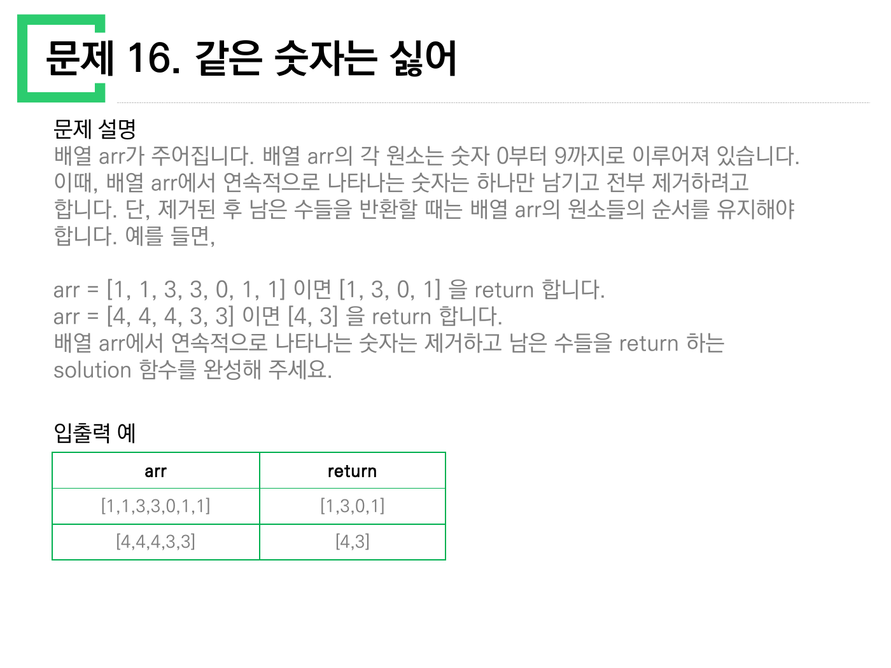
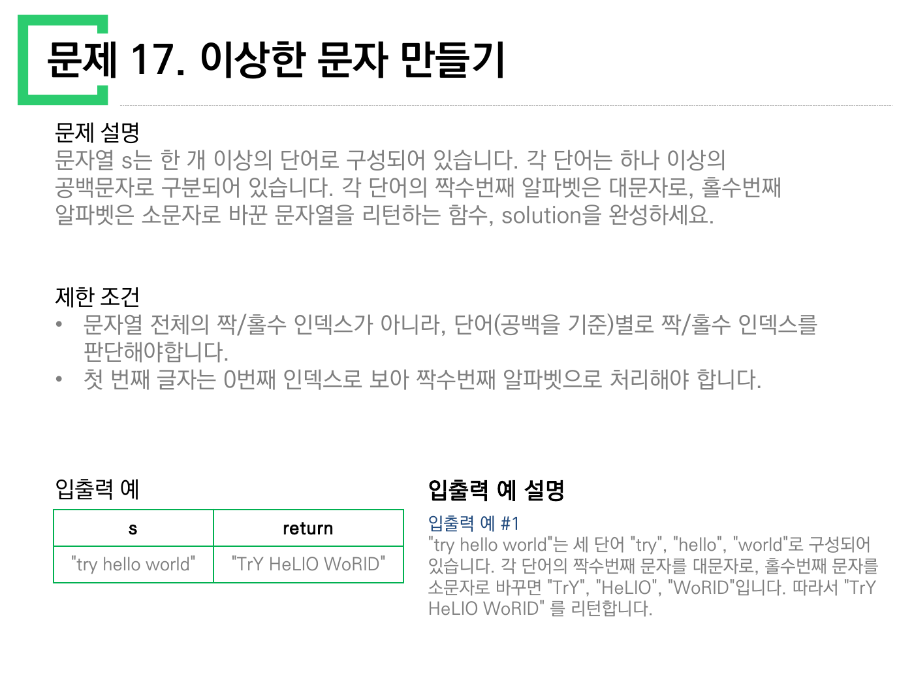
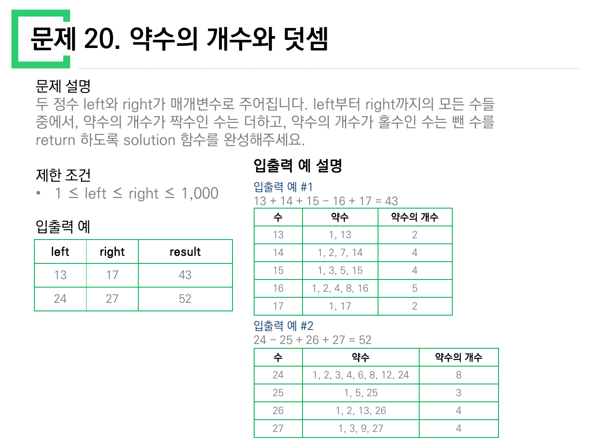
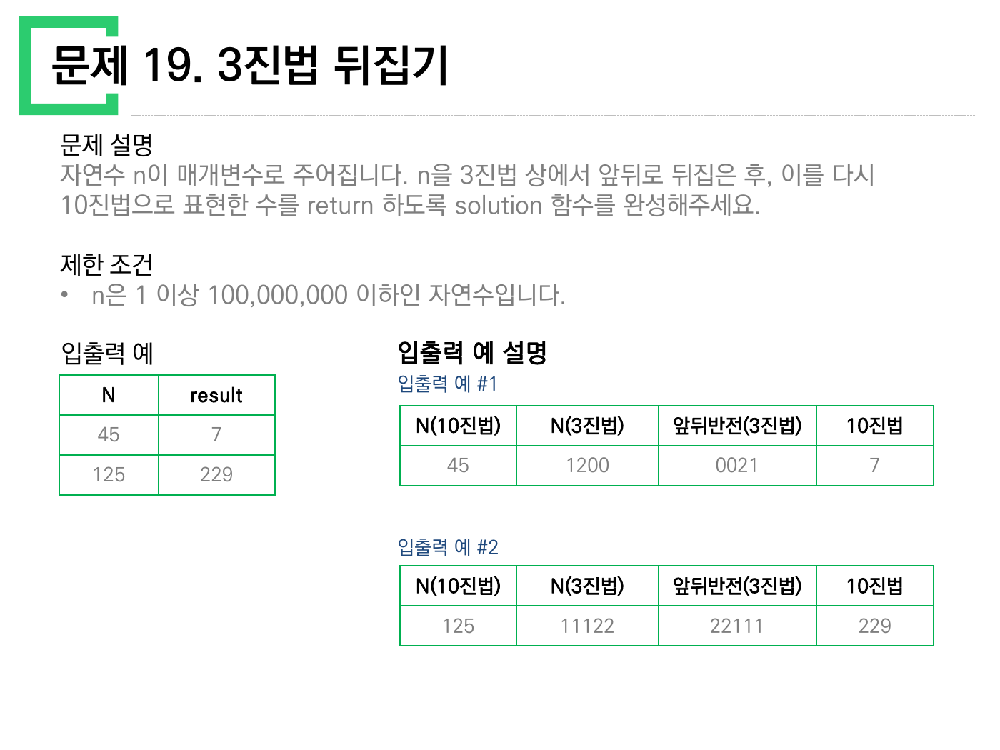
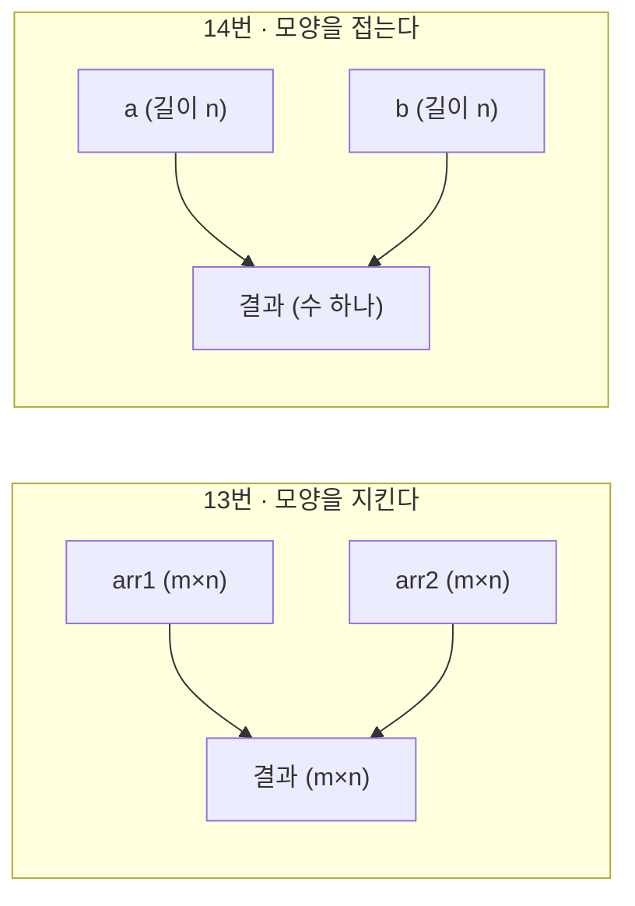
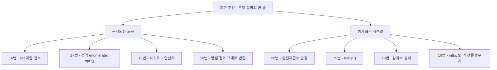

> [!abstract] 이 열 장이 실제로 하는 말
> 앞의 열 문제(1–10)가 **정수 하나를 어떤 모습으로 바꿔 볼 것인가**였다면, 이 열 문제는 대상이 **컨테이너**로 바뀐다. 리스트, 행렬, 단어로 쪼개진 문자열.
>
> 그리고 함정의 성격도 함께 바뀐다. 1–10에서는 값이 틀리는 것이 문제였다면, 여기서는 **파이썬이 제공하는 편리한 도구가 정답을 비껴간다.** 중복을 없애려면 `set`이 떠오르지만 16번은 `set`을 쓰면 틀리고, 공백으로 자르려면 `split()`이 떠오르지만 17번은 `split()`을 쓰면 공백이 사라진다. 약수를 세려면 1부터 n까지 돌면 되지만 20번은 그럴 필요가 없다.
>
> 매번 그 도구를 막는 것은 **제한 조건 칸이나 문제 설명의 마지막 한 줄**이다. 이 정리문서는 열 문제를 그 한 줄들로 꿰어 읽는다. 그리고 17번에서는, 원본이 그 한 줄을 굵게 써 놓고도 **자기가 든 유일한 예시로는 그 함정을 확인할 수 없다**는 사실을 확인한다.

---

## 1. 열 문제와, 그 문제를 막아선 한 줄

| # | 제목 | 순진하게 떠오르는 도구 | 그것을 막는 한 줄 |
| --- | --- | --- | --- |
| 11 | 직사각형 별찍기 | `'*' * n` 을 `n`번 | “가로의 길이가 n, **세로의 길이가 m**” — 표 머리글 순서가 `n, m` |
| 12 | 가운데 글자 가져오기 | `s[len(s)//2]` | “단어의 길이가 **짝수라면 가운데 두 글자**” |
| 13 | 행렬의 덧셈 | `arr1 + arr2` | 파이썬 `+`는 리스트를 **이어붙인다** — 원소별 덧셈이 아니다 |
| 14 | 내적 | (13번과 같은 입력 모양) | 결과가 **행렬이 아니라 수 하나** |
| 15 | 문자열 다루기 기본 | `s.isdigit()` | “길이가 **4 혹은 6**” — 길이 검사가 먼저다 |
| 16 | 같은 숫자는 싫어 | `set(arr)` | “**순서를 유지**해야 합니다” + “**연속적으로** 나타나는” |
| 17 | 이상한 문자 만들기 | 전역 `enumerate` | “문자열 전체의 짝/홀수 인덱스가 아니라, **단어별로**” |
| 18 | 부족한 금액 계산하기 | `필요액 - money` | “금액이 부족하지 **않으면 0**” |
| 19 | 3진법 뒤집기 | 문자열 뒤집고 `int(s, 3)` | 뒤집으면 **선행 0**이 생긴다 |
| 20 | 약수의 개수와 덧셈 | 1..n 전부 나눠 보기 | 약수 개수의 홀짝은 **다른 이름**을 갖고 있다 |

아래에서 이 표의 오른쪽 칸들을 하나씩 확인한다. 순서는 원본 쪽 순서가 아니라 **함정의 깊이 순**이다.

---

## 2. 16번 — `set`이 지우는 것은 중복이 아니라 순서다



> 원본 6쪽. 문제 설명 셋째 줄에 *“단, 제거된 후 남은 수들을 반환할 때는 배열 arr의 원소들의 순서를 유지해야 합니다”* 가 있다. 그리고 그 위 두 줄에는 *“**연속적으로** 나타나는 숫자는 하나만 남기고”* 가 있다.

이 두 줄이 각각 다른 도구를 막는다.

- **“연속적으로”** — 전체 중복 제거가 아니다. `[1,1,3,3,0,1,1]`의 답이 `[1,3,0,1]`이라는 것이 그 증거다. `1`이 결과에 **두 번** 남는다. 앞의 `1`과 뒤의 `1`은 서로 붙어 있지 않으므로 둘 다 살아남는다.
- **“순서를 유지”** — `set`은 순서를 보장하지 않는다(그리고 정수 원소일 때 CPython은 대개 정렬된 것처럼 보이는 순서를 내놓아 더 위험하다).

두 예시를 세 가지 도구로 각각 처리해 보면 차이가 즉시 드러난다.

```html preview h=480px
<div style="font-family:system-ui,-apple-system,sans-serif;padding:20px;color:var(--foreground)">
  <div id="q16chips" style="display:flex;gap:8px;flex-wrap:wrap;margin-bottom:14px"></div>
  <div id="q16in" style="font-family:ui-monospace,SFMono-Regular,Menlo,monospace;font-size:14px;margin-bottom:14px"></div>
  <div id="q16rows"></div>
  <div id="q16note" style="margin-top:14px;padding:11px 13px;background:var(--card);border:1px solid var(--border);border-radius:var(--radius);font-size:13px;line-height:1.75"></div>

  <script>
    var CASES = [
      { arr: [1, 1, 3, 3, 0, 1, 1], want: [1, 3, 0, 1] },
      { arr: [4, 4, 4, 3, 3], want: [4, 3] }
    ];
    var cur = 0;

    CASES.forEach(function (c, i) {
      var b = document.createElement('button');
      b.textContent = '원본 예 #' + (i + 1);
      b.style.cssText = 'padding:7px 13px;font-size:13px;border:1px solid var(--border);' +
        'border-radius:var(--radius);background:var(--card);color:var(--foreground);cursor:pointer';
      b.onclick = function () { cur = i; draw(); };
      document.getElementById('q16chips').appendChild(b);
    });

    function dedupAdjacent(a) {
      var r = [];
      a.forEach(function (x) { if (r.length === 0 || r[r.length - 1] !== x) r.push(x); });
      return r;
    }
    function dedupAll(a) {          // set() 흉내 — 중복을 전부 없앤다
      var seen = {}, r = [];
      a.forEach(function (x) { if (!seen[x]) { seen[x] = 1; r.push(x); } });
      return r;
    }
    function dedupSorted(a) {       // 정렬된 set() 흉내
      return dedupAll(a).slice().sort(function (p, q) { return p - q; });
    }
    var eq = function (a, b) { return a.length === b.length && a.every(function (v, i) { return v === b[i]; }); };

    function draw() {
      var c = CASES[cur];
      document.getElementById('q16in').innerHTML =
        '<span style="color:var(--muted-foreground)">입력 </span>[' + c.arr.join(', ') + ']' +
        '<span style="color:var(--muted-foreground)">　원본이 적은 답 </span><b style="color:var(--chart-1)">[' +
        c.want.join(', ') + ']</b>';

      var tools = [
        ['연속만 제거 (앞 원소와 비교)', dedupAdjacent(c.arr)],
        ['전체 중복 제거 (순서 유지)', dedupAll(c.arr)],
        ['sorted(set(arr))', dedupSorted(c.arr)]
      ];
      document.getElementById('q16rows').innerHTML = tools.map(function (t) {
        var ok = eq(t[1], c.want);
        return '<div style="display:flex;gap:12px;align-items:center;padding:10px 13px;margin-bottom:7px;' +
          'border:1px solid ' + (ok ? 'var(--chart-1)' : 'var(--border)') + ';border-radius:var(--radius);' +
          'background:var(--card)">' +
          '<span style="width:22px;font-size:15px;color:' + (ok ? 'var(--chart-1)' : 'var(--chart-5)') + '">' +
          (ok ? '✓' : '✕') + '</span>' +
          '<span style="flex:1;font-size:13px">' + t[0] + '</span>' +
          '<span style="font-family:ui-monospace,Menlo,monospace;font-size:13.5px;font-weight:600">[' +
          t[1].join(', ') + ']</span></div>';
      }).join('');

      document.getElementById('q16note').innerHTML = cur === 0
        ? '예 #1이 결정적이다. 정답 <b>[1, 3, 0, 1]</b> 에는 <b>1이 두 번</b> 들어 있다 — ' +
          '전체 중복 제거를 쓰는 순간 뒤의 1이 사라져 길이부터 어긋난다. ' +
          '“연속적으로”라는 부사 하나가 <code>set</code> 계열 도구 전부를 배제한다.'
        : '예 #2는 <b>세 도구가 모두 맞는 답을 낸다</b>. 연속 중복만 있고 떨어진 재등장이 없기 때문이다. ' +
          '<span style="color:var(--muted-foreground)">예 #2만 보고 도구를 고르면 예 #1에서 틀린다 — ' +
          '예시가 두 개인 이유가 여기 있다.</span>';
    }
    draw();
  </script>
</div>
```

원본이 예시를 **두 개** 든 이유가 여기서 드러난다. `[4,4,4,3,3] → [4,3]` 하나만 보면 `set`을 써도 맞는 답이 나온다. 두 예시를 함께 놓아야 도구가 갈린다.

---

## 3. 17번 — 원본이 경고한 함정을, 원본의 예시로는 확인할 수 없다



> 원본 7쪽. 제한 조건 칸이 두 줄인데 **둘 다 함정 경고**다 — *“문자열 전체의 짝/홀수 인덱스가 아니라, 단어(공백을 기준)별로 짝/홀수 인덱스를 판단해야합니다”*, *“첫 번째 글자는 0번째 인덱스로 보아 짝수번째 알파벳으로 처리해야 합니다”*.

원본이 이렇게까지 경고했다면, 그 경고가 필요한 이유를 예시가 보여 줘야 한다. 그런데 원본이 든 예시는 하나뿐이다 — `"try hello world"` → `"TrY HeLlO WoRlD"`.

두 방식으로 각각 계산해 보자.

| 방식 | `"try hello world"` 처리 결과 |
| --- | --- |
| **단어별** 인덱스 (원본이 요구한 것) | `TrY HeLlO WoRlD` |
| **전역** 인덱스 (원본이 금지한 것) | `TrY HeLlO WoRlD` |

같다. 우연이 아니다. `try`의 길이가 3(홀수)이므로 그 뒤 공백이 인덱스 3(홀수)에 놓이고, 다음 단어 `hello`는 인덱스 4(짝수)에서 시작한다. 공백까지 세는 전역 인덱스가 **마침 단어 경계에서 다시 짝수로 맞아떨어진** 것이다.

> [!warning] 원본의 구조적 허점 ① — 유일한 예시가 함정을 검증하지 못한다
> 원본 7쪽은 전역 인덱스를 쓰지 말라고 명시적으로 경고하지만, 제시한 단 하나의 예시 `"try hello world"` 는 **두 방식이 같은 답을 내는 입력**이다. 이 예시만으로 자기 코드를 검증한 사람은 잘못된 구현으로도 통과한다.
>
> 함정이 드러나려면 **길이가 짝수인 단어**가 앞에 와야 한다. 예컨대 `"ab cd"` 는 단어별로 처리하면 `Ab Cd`, 전역 인덱스로 처리하면 `Ab cD` 가 되어 **두 번째 단어의 대소문자가 통째로 뒤집힌다.** 이 짧은 입력 하나면 두 구현이 갈린다. 원본에 이 예시가 없다는 것이 이 문제의 약한 고리다.

경고문에 숨은 두 번째 함정도 있다. 원본은 *“각 단어는 **하나 이상의** 공백문자로 구분되어 있습니다”* 라고 적었다. 공백이 두 개 이상 연속될 수 있다는 뜻이다. 그런데 파이썬의 `s.split()`(인자 없는 호출)은 **연속 공백을 하나로 접고 양끝 공백을 버린다.** `"try  hello".split()` → `['try', 'hello']` 이므로, 다시 `' '.join(...)` 하면 공백이 두 개에서 한 개로 줄어 원문과 다른 문자열이 된다. 공백의 개수를 보존하려면 `s.split(' ')`처럼 **구분자를 명시**해야 한다. 원본은 이 사실을 말하지 않지만, “하나 이상의”라는 세 글자가 그것을 요구하고 있다.

```html preview h=520px
<div style="font-family:system-ui,-apple-system,sans-serif;padding:20px;color:var(--foreground)">
  <label for="q17in" style="font-size:13px;font-weight:600">입력 문자열</label>
  <input id="q17in" type="text" value="try hello world"
    style="width:100%;padding:8px 10px;font-size:15px;font-family:ui-monospace,Menlo,monospace;
           border:1px solid var(--border);border-radius:var(--radius);background:var(--card);color:var(--foreground)" />
  <div id="q17presets" style="display:flex;gap:6px;flex-wrap:wrap;margin:10px 0 16px"></div>

  <div id="q17out"></div>
  <div style="margin-top:14px">
    <div style="font-size:12.5px;color:var(--muted-foreground);margin-bottom:6px">글자별 인덱스 (위 = 단어별 / 아래 = 전역)</div>
    <div id="q17grid" style="display:flex;flex-wrap:wrap;gap:3px"></div>
  </div>
  <div id="q17verdict" style="margin-top:14px;padding:11px 13px;background:var(--card);border:1px solid var(--border);border-radius:var(--radius);font-size:13px;line-height:1.75"></div>

  <script>
    var el = document.getElementById('q17in');
    [['try hello world', '원본 예시'], ['ab cd', '두 방식이 갈리는 최소 예'],
     ['a bc def', '보충'], ['hi  there', '공백 두 칸']].forEach(function (p) {
      var b = document.createElement('button');
      b.textContent = '"' + p[0] + '" · ' + p[1];
      b.style.cssText = 'padding:6px 10px;font-size:12px;border:1px solid var(--border);border-radius:var(--radius);' +
        'background:var(--card);color:var(--foreground);cursor:pointer';
      b.onclick = function () { el.value = p[0]; upd(); };
      document.getElementById('q17presets').appendChild(b);
    });

    function byWord(s) {
      return s.split(' ').map(function (w) {
        return w.split('').map(function (c, i) { return i % 2 === 0 ? c.toUpperCase() : c.toLowerCase(); }).join('');
      }).join(' ');
    }
    function byGlobal(s) {
      return s.split('').map(function (c, i) {
        return c === ' ' ? c : (i % 2 === 0 ? c.toUpperCase() : c.toLowerCase());
      }).join('');
    }
    function bySplitNoArg(s) {       // s.split() 흉내 — 연속 공백을 접는다
      return s.trim().split(/\s+/).map(function (w) {
        return w.split('').map(function (c, i) { return i % 2 === 0 ? c.toUpperCase() : c.toLowerCase(); }).join('');
      }).join(' ');
    }

    function upd() {
      var s = el.value;
      var a = byWord(s), b = byGlobal(s), c = bySplitNoArg(s);
      var rows = [['단어별 인덱스 · 정답', a, true], ['전역 인덱스', b, b === a], ["split() 후 ' '.join", c, c === a]];
      document.getElementById('q17out').innerHTML = rows.map(function (r) {
        return '<div style="display:flex;gap:12px;align-items:center;padding:9px 13px;margin-bottom:6px;' +
          'border:1px solid ' + (r[2] ? 'var(--border)' : 'var(--chart-5)') + ';border-radius:var(--radius);background:var(--card)">' +
          '<span style="width:190px;font-size:12.5px;color:var(--muted-foreground)">' + r[0] + '</span>' +
          '<span style="flex:1;font-family:ui-monospace,Menlo,monospace;font-size:14px;white-space:pre">' +
          r[1].replace(/ /g, '·') + '</span>' +
          '<span style="color:' + (r[2] ? 'var(--chart-1)' : 'var(--chart-5)') + '">' + (r[2] ? '일치' : '다름') + '</span></div>';
      }).join('');

      var wi = 0;
      document.getElementById('q17grid').innerHTML = s.split('').map(function (ch, gi) {
        if (ch === ' ') { wi = 0; return '<div style="width:26px;text-align:center;color:var(--muted-foreground);font-size:11px">␣<br/>' + gi + '</div>'; }
        var w = wi++, tone = (w % 2 === gi % 2) ? 'var(--border)' : 'var(--chart-5)';
        return '<div style="width:26px;text-align:center;border:1px solid ' + tone + ';border-radius:4px;' +
          'font-size:11px;padding:2px 0;background:var(--card)"><b style="font-size:13px">' + ch + '</b><br/>' +
          '<span style="color:var(--chart-2)">' + w + '</span>/<span style="color:var(--chart-3)">' + gi + '</span></div>';
      }).join('');

      document.getElementById('q17verdict').innerHTML = (b === a)
        ? '이 입력에서는 두 방식이 <b>같은 답</b>을 낸다 — 전역 인덱스가 단어 경계마다 우연히 짝수로 맞아떨어졌다. ' +
          '<span style="color:var(--muted-foreground)">원본이 든 유일한 예시가 바로 이 경우다.</span>'
        : '두 방식이 <b style="color:var(--chart-5)">갈렸다</b>. 붉게 표시된 글자가 전역 인덱스에서 홀짝이 어긋난 자리다 — ' +
          '원본 제한 조건이 경고한 바로 그 상황이다.';
    }
    el.addEventListener('input', upd);
    upd();
  </script>
</div>
```

---

## 4. 20번 — 원본이 표로만 보여 주고 이름은 말하지 않는 것



> 원본 10쪽. 두 예시의 약수를 **전부 나열한 표**가 붙어 있다. 그 표를 그대로 옮기면 다음과 같다.

| 수 | 약수 | 개수 | 부호 |
| --- | --- | --- | --- |
| 13 | 1, 13 | 2 | + |
| 14 | 1, 2, 7, 14 | 4 | + |
| 15 | 1, 3, 5, 15 | 4 | + |
| **16** | 1, 2, 4, 8, 16 | **5** | **−** |
| 17 | 1, 17 | 2 | + |
| 24 | 1, 2, 3, 4, 6, 8, 12, 24 | 8 | + |
| **25** | 1, 5, 25 | **3** | **−** |
| 26 | 1, 2, 13, 26 | 4 | + |
| 27 | 1, 3, 9, 27 | 4 | + |

원본이 제시한 답 $13 + 14 + 15 - 16 + 17 = 43$ 과 $24 - 25 + 26 + 27 = 52$ 를 직접 계산해 확인했고, 표의 약수 목록도 전부 일치한다.

그런데 아홉 줄 중 개수가 홀수인 것은 **16과 25** 둘뿐이고, 이 둘은 $4^2$ 와 $5^2$ 다. 우연이 아니다.

약수는 원래 짝을 지어 나타난다. $d$가 $n$의 약수면 $n/d$도 약수이고, 둘을 한 쌍으로 묶으면 개수는 짝수가 된다. 이 짝짓기가 무너지는 경우는 딱 하나 — $d = n/d$, 즉 $d^2 = n$ 일 때다. 그때만 자기 자신과 짝을 이루는 약수가 하나 생겨 총 개수가 홀수가 된다.

$$\#\{d : d \mid n\} \text{ 가 홀수} \iff n \text{ 이 완전제곱수}$$

원본은 이 이름을 한 번도 쓰지 않는다. 약수를 나열한 표를 두 개 보여 줄 뿐이다. 그러나 이 동치를 알면 20번은 “약수를 세는 문제”에서 **“완전제곱수면 빼고 아니면 더하는 문제”**로 바뀌고, 각 수마다 $O(\sqrt{n})$ 이 걸리던 계산이 한 번의 제곱근 검사로 끝난다.

```html preview h=560px
<div style="font-family:system-ui,-apple-system,sans-serif;padding:20px;color:var(--foreground)">
  <div style="display:flex;gap:18px;flex-wrap:wrap;margin-bottom:8px">
    <div style="flex:1;min-width:170px">
      <label for="lv" style="font-size:12.5px;font-weight:600">left = <span id="lvv">13</span></label>
      <input id="lv" type="range" min="1" max="120" value="13" style="width:100%;accent-color:var(--primary)" />
    </div>
    <div style="flex:1;min-width:170px">
      <label for="rv" style="font-size:12.5px;font-weight:600">right = <span id="rvv">17</span></label>
      <input id="rv" type="range" min="1" max="120" value="17" style="width:100%;accent-color:var(--primary)" />
    </div>
  </div>
  <div id="q20presets" style="display:flex;gap:6px;flex-wrap:wrap;margin-bottom:14px"></div>

  <div id="q20cells" style="display:flex;flex-wrap:wrap;gap:5px;margin-bottom:14px"></div>
  <div id="q20sum" style="font-family:ui-monospace,Menlo,monospace;font-size:13px;line-height:1.9;word-break:break-all;margin-bottom:12px"></div>
  <div id="q20box" style="padding:11px 13px;background:var(--card);border:1px solid var(--border);border-radius:var(--radius);font-size:13px;line-height:1.75"></div>

  <script>
    var lv = document.getElementById('lv'), rv = document.getElementById('rv');
    [[13, 17, 43], [24, 27, 52], [1, 100, null]].forEach(function (p) {
      var b = document.createElement('button');
      b.textContent = p[2] === null ? ('1 ~ 100 · 보충') : ('원본 예 ' + p[0] + '–' + p[1] + ' → ' + p[2]);
      b.style.cssText = 'padding:6px 10px;font-size:12px;border:1px solid var(--border);border-radius:var(--radius);' +
        'background:var(--card);color:var(--foreground);cursor:pointer';
      b.onclick = function () { lv.value = p[0]; rv.value = p[1]; upd(); };
      document.getElementById('q20presets').appendChild(b);
    });

    function divisors(n) { var r = []; for (var d = 1; d <= n; d++) if (n % d === 0) r.push(d); return r; }

    function upd() {
      var l = Math.min(+lv.value, +rv.value), r = Math.max(+lv.value, +rv.value);
      document.getElementById('lvv').textContent = l;
      document.getElementById('rvv').textContent = r;

      var total = 0, terms = [], cells = [], oddOnes = [];
      for (var n = l; n <= r; n++) {
        var cnt = divisors(n).length, odd = cnt % 2 === 1;
        if (odd) { total -= n; oddOnes.push(n); } else { total += n; }
        terms.push((n === l ? (odd ? '-' : '') : (odd ? ' - ' : ' + ')) + n);
        cells.push('<div title="약수 ' + cnt + '개" style="width:42px;padding:4px 0;text-align:center;font-size:12px;' +
          'border:1px solid ' + (odd ? 'var(--chart-5)' : 'var(--border)') + ';border-radius:var(--radius);' +
          'background:' + (odd ? 'var(--chart-5)' : 'var(--card)') + ';color:' +
          (odd ? 'var(--background)' : 'var(--foreground)') + '"><b>' + n + '</b><br/>' +
          '<span style="opacity:.8">' + cnt + '</span></div>');
      }
      document.getElementById('q20cells').innerHTML = cells.join('');
      document.getElementById('q20sum').innerHTML =
        '<span style="color:var(--muted-foreground)">식 </span>' + terms.join('') +
        ' <span style="color:var(--muted-foreground)">=</span> <b style="font-size:16px;color:var(--chart-1)">' + total + '</b>';

      var squares = oddOnes.map(function (n) { return n + ' = ' + Math.round(Math.sqrt(n)) + '²'; });
      var allSquare = oddOnes.every(function (n) { var s = Math.round(Math.sqrt(n)); return s * s === n; });
      document.getElementById('q20box').innerHTML =
        '약수 개수가 <b>홀수</b>인 수 (빼는 항): ' +
        (squares.length ? '<b style="color:var(--chart-5)">' + squares.join(' · ') + '</b>' : '없음') +
        '<br/><span style="color:var(--muted-foreground)">' +
        (allSquare ? '구간을 어떻게 옮겨도 빼는 항은 언제나 완전제곱수뿐이다 — 약수 d와 n/d 의 짝짓기가 d = √n 에서만 무너지기 때문이다.'
                   : '') + '</span>';
    }
    lv.addEventListener('input', upd); rv.addEventListener('input', upd);
    upd();
  </script>
</div>
```

슬라이더를 어디로 옮겨도 붉게 칠해지는 칸은 1, 4, 9, 16, 25, 36, 49, 64, 81, 100 뿐이다. 원본 표가 보여 준 두 사례(16과 25)는 이 수열의 네 번째와 다섯 번째 항이었다.

---

## 5. 19번 — 뒤집으면 앞자리에 0이 생긴다



> 원본 9쪽. 설명 표가 네 칸이다 — **N(10진법) · N(3진법) · 앞뒤반전(3진법) · 10진법**.

| N(10진법) | N(3진법) | 앞뒤반전(3진법) | 10진법 |
| --- | --- | --- | --- |
| 45 | 1200 | **0021** | 7 |
| 125 | 11122 | 22111 | 229 |

첫 줄의 세 번째 칸을 보라. 원본은 굳이 **`0021`** 이라고 적었다. `21`이라 적지 않고 선행 0 두 개를 살려 둔 것이다. 이것이 이 문제의 유일한 기술적 요점이다.

45를 3진법으로 적으면 $1200_{(3)}$ 이다($27 + 2\cdot 9 = 45$). 원래 수의 **끝자리가 0**이었으므로, 뒤집으면 그 0이 **맨 앞으로** 온다. 수 체계에서 선행 0은 값을 바꾸지 않으므로 $0021_{(3)} = 21_{(3)} = 2\cdot3 + 1 = 7$ 이다.

즉 뒤집기는 자릿수를 보존하지 않는다. 45는 3진법 네 자리지만 답 7은 두 자리다. 문자열을 뒤집은 뒤 `int(s, 3)`으로 되돌리는 구현이라면 파이썬이 선행 0을 알아서 무시하므로 문제가 없지만, 나눗셈과 나머지로 직접 자릿수를 다루는 구현이라면 이 지점에서 값이 어긋나기 쉽다.

두 번째 줄은 대조군이다. $125 = 11122_{(3)}$ 은 끝자리가 0이 아니므로 선행 0이 생기지 않고, 뒤집힌 $22111_{(3)} = 2\cdot81 + 2\cdot27 + 9 + 3 + 1 = 229$ 로 자릿수도 그대로 다섯 자리다. 두 예시가 **선행 0이 생기는 경우와 생기지 않는 경우**를 하나씩 맡고 있다.

> [!note] 표기 불일치
> 원본 9쪽의 입출력 예 표 머리글은 `N`인데 문제 설명은 “자연수 `n`이 매개변수로 주어집니다”라고 소문자로 쓴다. 앞 묶음 4번의 `arr`/`x` 와 같은 종류의 어긋남이다(→ [01. 문제 1–10](<./01. 문제 1-10 — 정수를 바꿔 보는 아홉 가지와 끝을 모르는 하나.md>) §4).

---

## 6. 13번과 14번 — 같은 입력, 갈라지는 결과의 모양

두 문제는 나란히 놓였을 때 의미가 생긴다.

- **13번(행렬의 덧셈)**: `[[1,2],[2,3]]` + `[[3,4],[5,6]]` → `[[4,6],[7,9]]`. 입력의 모양(2×2)이 결과에 그대로 보존된다.
- **14번(내적)**: `[1,2,3,4]` · `[-3,-1,0,2]` → `3`. 길이 4짜리 두 배열이 **수 하나**로 접힌다.

원본 4쪽이 내적을 정의한 방식이 이 접힘을 그대로 보여 준다 — $a[0]b[0] + a[1]b[1] + \cdots + a[n-1]b[n-1]$. 곱셈은 원소별로 일어나지만 그다음 덧셈이 전부를 하나로 모은다. 원본이 든 두 예시를 계산하면 $1\cdot(-3) + 2\cdot(-1) + 3\cdot 0 + 4\cdot 2 = 3$, $(-1)\cdot1 + 0\cdot0 + 1\cdot(-1) = -2$ 로 표의 값과 같다.



13번의 함정은 파이썬의 `+`다. 리스트끼리 더하면 **이어붙이기**가 되어 `[[1,2],[2,3]] + [[3,4],[5,6]]` 은 4행짜리 리스트가 된다. 원소별 덧셈을 원하면 두 겹의 순회(또는 `zip`의 중첩)를 직접 써야 한다. 13번은 “행렬의 덧셈”이라는 이름 때문에 가장 쉬워 보이지만, **연산자 하나가 다른 뜻을 갖고 있다**는 점에서 이 묶음에서 가장 조용한 함정이다.

원본 3쪽이 든 두 번째 예시 `[[1],[2]] + [[3],[4]] → [[4],[6]]` 는 열이 하나인 경우다. 안쪽 리스트의 길이가 1이어도 여전히 **두 겹**이라는 점을 확인시킨다.

---

## 7. 18번 — “부족하지 않으면 0”이라는 한 줄

18번의 필요 금액은 $price \times 1 + price \times 2 + \cdots + price \times count$ 이므로

$$\text{필요액} = price \cdot \frac{count\,(count+1)}{2}$$

원본 8쪽의 예시 `price=3, money=20, count=4` 로 확인하면 $3 \cdot \frac{4 \cdot 5}{2} = 30$, 부족액은 $30 - 20 = 10$ 으로 표의 답과 같다. 원본이 설명 칸에 직접 `30 (= 3+6+9+12)` 이라 적어 둔 것과도 일치한다.

여기서 놓치기 쉬운 것이 마지막 한 줄 — *“단, 금액이 부족하지 않으면 0을 return 하세요.”* 뺄셈 결과를 그대로 반환하면 돈이 남을 때 **음수**가 나온다. 답은 `max(0, 필요액 - money)`다.

제한 조건도 읽어 둘 만하다. $price \le 2500$, $count \le 2500$ 이므로 최대 필요액은

$$2500 \times \frac{2500 \times 2501}{2} = 7{,}815{,}625{,}000$$

약 78억으로, 32비트 부호 있는 정수의 상한 $2^{31}-1 = 2{,}147{,}483{,}647$ 을 세 배 이상 넘는다. 파이썬의 정수는 크기 제한이 없어 이 문제가 드러나지 않지만, 같은 문제를 C나 자바로 옮기면 `long`이 필요하다. **제한 조건의 숫자는 자료형을 고르라는 지시**이기도 하다.

---

## 8. 나머지 셋 — 11, 12, 15

**11번(직사각형 별찍기)** 은 값이 아니라 **순서**가 함정이다. 문제는 “가로의 길이가 n, 세로의 길이가 m”이라 하고 표 머리글도 `n | m | 출력` 순인데, 예시는 `5, 3`에 대해 다섯 개짜리 줄이 세 줄이다. `n`이 한 줄의 길이, `m`이 줄 수다. 이 문제는 이 묶음에서 유일하게 **반환이 아니라 출력**을 요구한다 — 표의 세 번째 칸 이름이 `return`이 아니라 `출력`인 이유다.

**12번(가운데 글자 가져오기)** 은 길이의 홀짝으로 갈린다. `"abcde"`(5) → `"c"` 하나, `"qwer"`(4) → `"we"` 둘. 두 경우를 한 식으로 쓰면 `s[(len(s)-1)//2 : len(s)//2 + 1]` 이고, 원본의 두 예시로 확인하면 각각 `c`, `we` 가 나온다. 홀수면 시작과 끝이 같은 자리를 가리켜 한 글자, 짝수면 한 칸 벌어져 두 글자가 된다.

**15번(문자열 다루기 기본)** 은 검사 순서가 요점이다. 길이가 4 또는 6이면서 숫자로만 이루어져야 하므로, 원본이 든 `"12345"`(길이 5, 전부 숫자) → `False` 가 **길이 검사를 빠뜨리면 틀리는** 예시다. 여기서도 제한 조건이 도구를 허가한다 — *“s는 영문 알파벳 대소문자 또는 0부터 9까지 숫자로 이루어져 있습니다”* 덕분에 `isdigit()`을 안심하고 쓸 수 있다. 이 한 줄이 없다면 `isdigit()`은 `"²"`나 `"½"` 같은 유니코드 숫자 문자에도 참을 돌려주어 위험하다.

---

## 9. 이 열 장이 실제로 가르치는 것



앞 묶음이 “정수를 어떻게 바꿔 볼 것인가”였다면 이 묶음의 교훈은 하나로 줄어든다 — **문제 설명을 다 읽기 전에 도구를 고르지 마라.** `set`, `split()`, `+` 는 모두 파이썬에서 가장 먼저 배우는 도구들이고, 이 열 문제는 그 셋이 각각 틀리는 자리를 정확히 하나씩 배치해 두었다.

- 이전 → [01. 문제 1–10 — 정수를 바꿔 보는 아홉 가지와, 끝을 모르는 하나](<./01. 문제 1-10 — 정수를 바꿔 보는 아홉 가지와 끝을 모르는 하나.md>)
- 다음 → [03. 지뢰찾기와 중간고사 — 명세가 그림뿐일 때](<./03. 지뢰찾기와 중간고사 — 명세가 그림뿐일 때.md>)

### 다른 과목과의 연결

- 13번의 두 겹 순회는 다음 노트의 **지뢰찾기 격자**에서 8방향 이웃 검사로 확장된다.
- 20번의 “약수는 짝을 이룬다”는 [알고리즘 설계와 분석 03. 억지 기법과 완전 탐색](<../../../06_algorithms-graphics/algorithm-design-analysis/notes/03. 억지 기법과 완전 탐색.md>)에서 $O(n) \to O(\sqrt{n})$ 축소의 대표 사례로 다시 나온다.
- 16번의 “순서를 유지하는 중복 제거”는 [데이터 구조 02. 리스트 — 끝을 어떻게 표시할 것인가](<../../../01_programming-foundations/data-structures/notes/02. 리스트 — 끝을 어떻게 표시할 것인가.md>)의 순차 자료구조 성질에 기댄다.

---

## 근거 자료

`문제풀이_11_20.pdf` (10쪽, PowerPoint 프레젠테이션, 작성자 유병철)

| 쪽 | 내용 | 이 문서에서 쓴 자리 |
| --- | --- | --- |
| 1 | 문제 11 — 직사각형 별찍기 | §8 |
| 2 | 문제 12 — 가운데 글자 가져오기 | §8 |
| 3 | 문제 13 — 행렬의 덧셈 | §6 |
| 4 | 문제 14 — 내적 | §6 |
| 5 | 문제 15 — 문자열 다루기 기본 | §8 |
| 6 | 문제 16 — 같은 숫자는 싫어 | §2 (이미지 인용, 인터랙티브) |
| 7 | 문제 17 — 이상한 문자 만들기 | §3 (이미지 인용, 인터랙티브) |
| 8 | 문제 18 — 부족한 금액 계산하기 | §7 |
| 9 | 문제 19 — 3진법 뒤집기 | §5 (이미지 인용) |
| 10 | 문제 20 — 약수의 개수와 덧셈 | §4 (이미지 인용, 인터랙티브) |

> [!note] 계산 검증
> §4의 약수 표와 두 합(43, 52), §5의 3진법 변환(45 → 1200 → 0021 → 7, 125 → 11122 → 22111 → 229), §6의 내적 값(3, −2), §7의 필요액 30과 최대 필요액 7,815,625,000, §3의 두 인덱스 방식 비교는 모두 파이썬으로 계산해 원본 슬라이드의 표와 대조했다. 인터랙티브가 “원본 예”라 표시하는 값은 전부 슬라이드에 인쇄된 값이며, `"ab cd"` 등 “보충”으로 표시한 입력은 이 문서에서 함정을 드러내기 위해 추가한 것이다.
