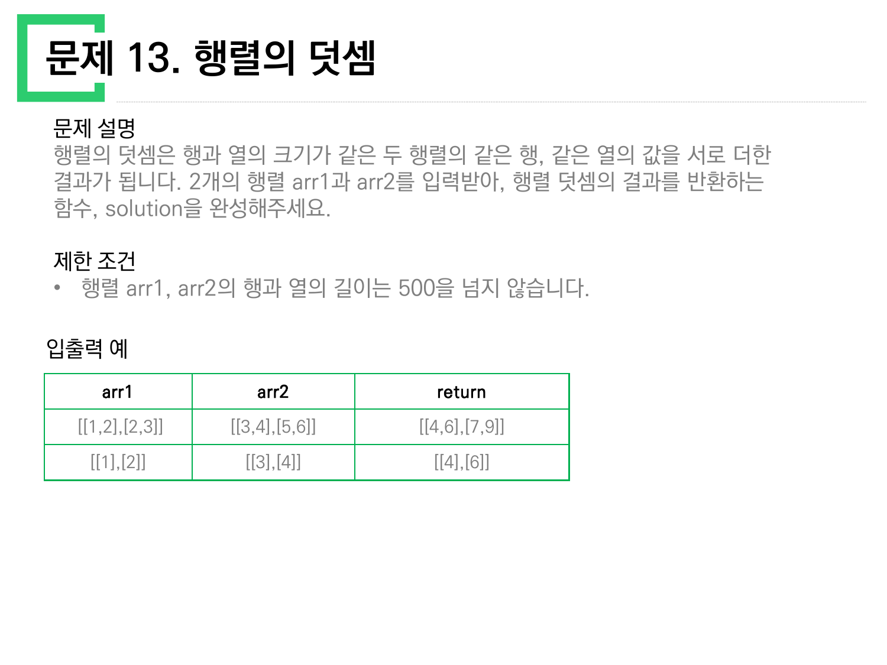
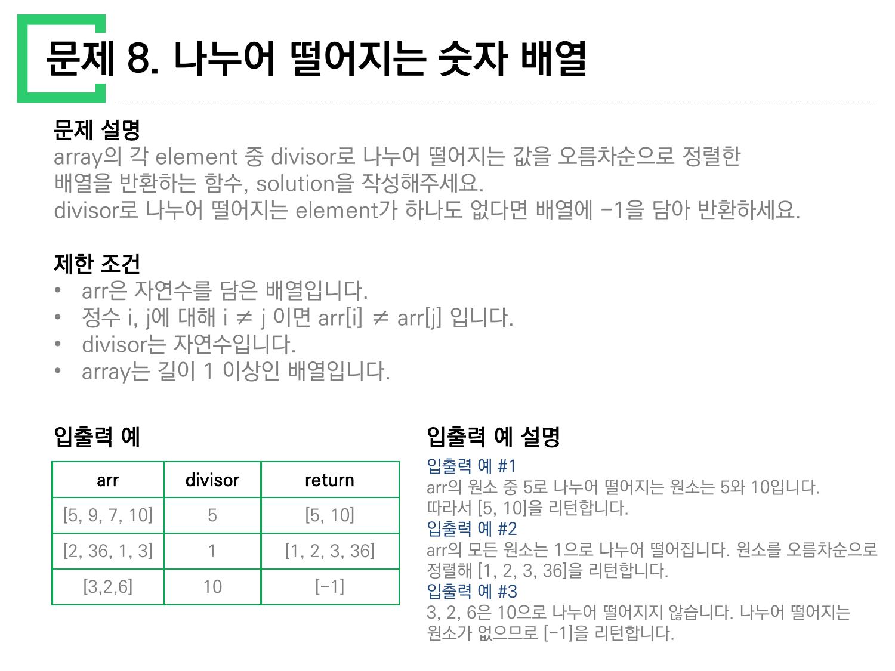
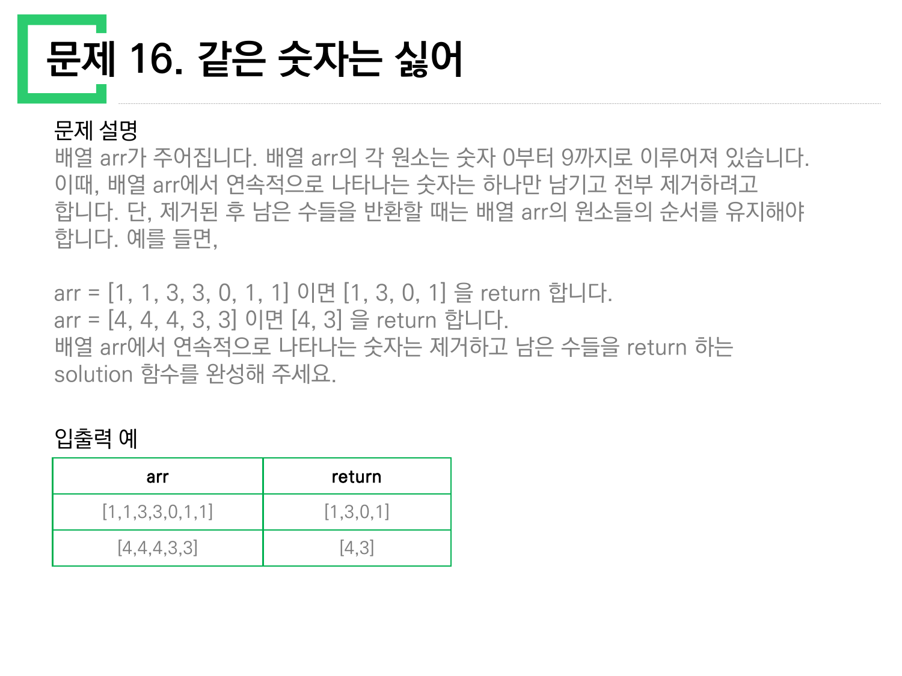
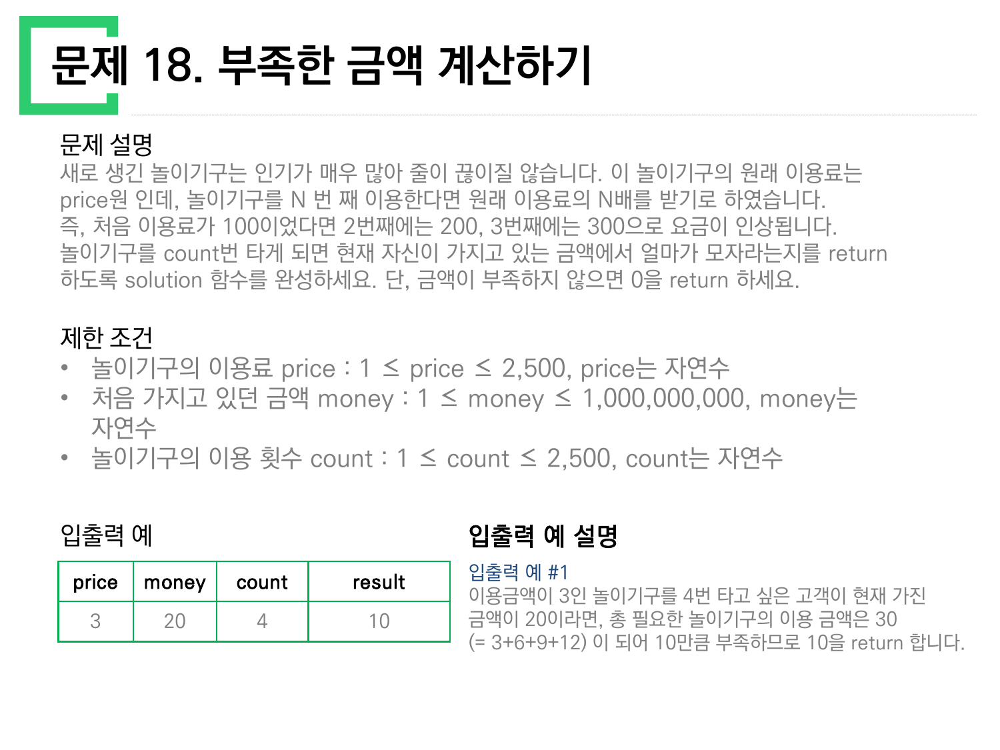
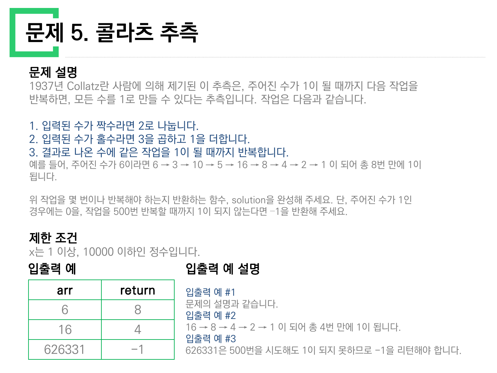

> [!abstract] 이 묶음이 실제로 하는 말
> [앞 문서](./01.%20%EC%84%B8%EB%8A%94%20%EB%AC%B8%EC%A0%9C%EC%99%80%20%EC%9E%90%EB%A5%B4%EB%8A%94%20%EB%AC%B8%EC%A0%9C%20%E2%80%94%20%ED%95%98%EB%82%98%EB%A5%BC%20%EB%82%B1%EB%82%B1%EC%9C%BC%EB%A1%9C%20%EC%AA%BC%EA%B0%9C%EA%B8%B0.md)의 아홉 문제가 *덩어리를 쪼개는* 일이었다면, 남은 열한 문제는 반대다 — **열을 짓거나, 열에서 골라내거나, 두 열을 나란히 놓는다.**
>
> 파이썬은 이 세 동작에 정확히 세 개의 내장을 내준다. `range`가 열을 짓고, `set`이 열에서 중복을 골라내고, `zip`이 두 열을 맞물린다. 열한 문제 중 아홉은 이 셋 중 하나를 고르면 사실상 끝난다.
>
> 남는 둘이 이 문서의 척추다. **16번은 셋 다 못 쓴다** — `set`을 쓰면 순서가 죽고, 순서를 지켜야만 답이 나오기 때문이다. 그리고 **5번과 18번은 몇 번 도는지를 입력이 정하지 않는다** — 도는 횟수를 상태가 정하고, 그래서 `range`가 아니라 `while`이 필요하다. 이 둘이 나머지 아홉과 갈라지는 자리가 곧 "반복문을 언제 쓰는가"의 경계다.

---

## 열한 문제를 세 내장으로 나누기

```mermaid
graph LR
  A["열한 문제"] --> R["range<br/>없던 열을 짓는다"]
  A --> Z["zip<br/>두 열을 맞물린다"]
  A --> S["set<br/>중복·소속을 본다"]
  A --> W["while<br/>도는 횟수를 상태가 정한다"]
  A --> X["어느 것도 못 쓴다"]

  R --> R1["4. x만큼 간격이 있는 n개"]
  R --> R2["6. 두 정수 사이의 합"]
  R --> R3["11. 직사각형 별찍기"]

  Z --> Z1["9. 음양 더하기"]
  Z --> Z2["13. 행렬의 덧셈"]
  Z --> Z3["14. 내적"]

  S --> S1["10. 없는 숫자 더하기"]
  S --> S2["8. 나누어 떨어지는 배열<br/>(거르기 + 정렬)"]

  W --> W1["5. 콜라츠 추측"]
  W --> W2["18. 부족한 금액 계산하기"]

  X --> X1["16. 같은 숫자는 싫어<br/>연속된 것만, 순서 유지"]

  style A fill:var(--card),stroke:var(--border),color:var(--foreground)
  style R fill:var(--card),stroke:var(--chart-1),color:var(--foreground)
  style Z fill:var(--card),stroke:var(--chart-2),color:var(--foreground)
  style S fill:var(--card),stroke:var(--chart-3),color:var(--foreground)
  style W fill:var(--card),stroke:var(--chart-5),color:var(--foreground)
  style X fill:var(--card),stroke:var(--chart-4),color:var(--foreground)
```

---

## range — 없던 열을 짓는다

### 4번, 그리고 원본의 부호 오류


> 함수 solution은 정수 x와 자연수 n을 입력 받아, x부터 시작해 x씩 증가하는 숫자를 n개 지니는 리스트를 리턴해야 합니다.

$x$부터 $x$씩 커지는 $n$개, 즉 $x, 2x, 3x, \dots, nx$다.

```python
def solution(x, n):
    return [x * (i + 1) for i in range(n)]
```

원본의 입출력 예는 세 줄이다.

| 열 이름(원본) | n | answer |
| --- | --- | --- |
| 2 | 5 | `[2,4,6,8,10]` |
| 4 | 3 | `[4,8,12]` |
| **4** | **2** | **`[-4, -8]`** |

앞의 두 줄은 맞는다. 셋째 줄은 맞지 않는다. $x = 4$, $n = 2$이면 $[4, 8]$이어야 한다. `[-4, -8]`이 나오려면 $x$가 **−4**여야 한다.

> [!caution] 원본 오류 — 문제 4 입출력 예 셋째 줄
> `1_10` 4쪽 입출력 예의 마지막 줄이 입력 `4`, `2`에 대해 `[-4, -8]`을 답으로 적었다. 직접 계산하면 $[4, 8]$이다. 입력이 `-4`로 적혔어야 한다 — 앞의 두 예가 양수만 다루므로, 이 줄은 `x는 -10000000 이상`이라는 제한 조건대로 **음수 입력을 보여 주려던 줄**이었을 것이다. 음수 부호 하나가 입력 칸에서 빠지고 출력 칸에만 남았다.
>
> 같은 표의 첫 열 머리는 `arr`인데 문제 설명의 매개변수는 `x`다. [01번 노트](./01.%20%EC%84%B8%EB%8A%94%20%EB%AC%B8%EC%A0%9C%EC%99%80%20%EC%9E%90%EB%A5%B4%EB%8A%94%20%EB%AC%B8%EC%A0%9C%20%E2%80%94%20%ED%95%98%EB%82%98%EB%A5%BC%20%EB%82%B1%EB%82%B1%EC%9C%BC%EB%A1%9C%20%EC%AA%BC%EA%B0%9C%EA%B8%B0.md)에서 본 문제 2·5와 같은 서식 복사 흔적이다.

`range(1, n+1)`로 바로 배수를 만들고 싶어지지만, 그러면 `x`가 음수일 때도 그대로 곱해져 문제가 없다. 정작 조심할 곳은 `x = 0`이다. 제한 조건이 `x는 -10000000 이상, 10000000 이하인 정수`이므로 0이 허용되고, 그때 답은 `[0, 0, ..., 0]`이다. "x씩 증가하는"이라는 말이 어긋나지만 식으로는 자연스럽게 처리된다.

### 6번 — 대소 관계가 정해져 있지 않다

`1_10` 6쪽 문제 6은 두 정수 $a$, $b$ 사이의 모든 정수의 합을 요구한다. 입출력 예는 `(3,5) → 12`, `(3,3) → 3`, `(5,3) → 12` 셋이다. 마지막 줄이 이 문제의 전부다.

> a와 b의 대소관계는 정해져있지 않습니다.

`range(a, b+1)`은 $a > b$면 **빈 열**을 내고 합이 0이 된다. 그러면 셋째 줄이 12가 아니라 0이 된다. 그래서 정렬이 먼저다.

```python
def solution(a, b):
    lo, hi = min(a, b), max(a, b)
    return sum(range(lo, hi + 1))
```

`(3,3)`은 `range(3,4)`가 `[3]`이므로 그대로 3이 나온다 — 원본의 `a와 b가 같은 경우는 둘 중 아무 수나 리턴하세요`라는 조항 역시 [01번 노트](./01.%20%EC%84%B8%EB%8A%94%20%EB%AC%B8%EC%A0%9C%EC%99%80%20%EC%9E%90%EB%A5%B4%EB%8A%94%20%EB%AC%B8%EC%A0%9C%20%E2%80%94%20%ED%95%98%EB%82%98%EB%A5%BC%20%EB%82%B1%EB%82%B1%EC%9C%BC%EB%A1%9C%20%EC%AA%BC%EA%B0%9C%EA%B8%B0.md)의 문제 1과 마찬가지로 일반 규칙이 이미 처리하는 잉여 조항이다.

> [!note] 등차수열 합으로 가면 반복이 사라진다
> 제한 조건은 $a, b$가 ±10,000,000이므로 최악의 경우 2천만 번을 돈다. 가우스의 식을 쓰면 한 번에 끝난다.
> $$\sum_{k=lo}^{hi} k = \frac{(lo + hi)(hi - lo + 1)}{2}$$
> $(3,5)$이면 $(3+5)\times3/2 = 12$, $(5,3)$이면 정렬 후 같은 값. 원본이 이 식을 언급하지는 않으므로 **보충 설명**임을 밝혀 둔다.

### 11번 — 열이 두 겹이다


원본은 `n`을 **가로**, `m`을 **세로**라 못 박고 `n=5, m=3`에 별 다섯 개짜리 줄 셋을 보인다. 가로가 먼저 오는 순서라 `for i in range(m)`이 바깥, 별 `n`개가 안쪽이다.

```python
n, m = map(int, input().strip().split(' '))
for _ in range(m):
    print('*' * n)
```

이 문제만 `return`이 없고 `print`로 끝난다. **스무 문제 중 유일하게 출력이 반환값이 아닌 문제**다. 이 성격은 [04번 노트](./04.%20%EC%A4%91%EA%B0%84%EA%B3%A0%EC%82%AC%20%E2%80%94%20return%EC%9D%B4%20%EC%82%AC%EB%9D%BC%EC%A7%84%20%EC%9E%90%EB%A6%AC%EC%97%90%20%EC%88%9C%EC%84%9C%EB%8F%84%EA%B0%80%20%EB%93%A4%EC%96%B4%EC%98%A8%EB%8B%A4.md)에서 다루는 중간고사 전체의 성격이기도 하다.

---

## zip — 두 열을 맞물린다

세 문제(9·13·14)가 같은 모양이다. **길이가 같은 두 열의 $i$번째끼리** 무언가를 한다.

| 문제 | 두 열 | 맞물려서 하는 일 | 결과 |
| --- | --- | --- | --- |
| 9. 음양 더하기 | `absolutes`, `signs` | 부호를 붙인다 | 스칼라(합) |
| 13. 행렬의 덧셈 | `arr1`, `arr2` | 같은 자리끼리 더한다 | 같은 모양의 2차원 열 |
| 14. 내적 | `a`, `b` | 곱해서 모두 더한다 | 스칼라(합) |

```python
# 9. 음양 더하기
def solution(absolutes, signs):
    return sum(a if s else -a for a, s in zip(absolutes, signs))

# 14. 내적
def solution(a, b):
    return sum(x * y for x, y in zip(a, b))

# 13. 행렬의 덧셈 — zip이 두 겹
def solution(arr1, arr2):
    return [[x + y for x, y in zip(r1, r2)]
            for r1, r2 in zip(arr1, arr2)]
```

원본의 입출력 예를 직접 계산해 대조했다.

- 9번: `[4,7,12]`와 `[true,false,true]` → $4 - 7 + 12 = 9$ ✓ / `[1,2,3]`과 `[false,false,true]` → $-1 - 2 + 3 = 0$ ✓
- 14번: `[1,2,3,4]`·`[-3,-1,0,2]` → $1(-3) + 2(-1) + 3(0) + 4(2) = -3 - 2 + 0 + 8 = 3$ ✓ / `[-1,0,1]`·`[1,0,-1]` → $-1 + 0 - 1 = -2$ ✓
- 13번: `[[1,2],[2,3]] + [[3,4],[5,6]] = [[4,6],[7,9]]` ✓ / `[[1],[2]] + [[3],[4]] = [[4],[6]]` ✓



13번의 두 번째 예제 `[[1],[2]]`가 조용히 하는 일이 있다. **열이 하나뿐인 2차원 리스트**라서, 안쪽 `zip`을 생략하고 `arr1[i] + arr2[i]`로 쓴 코드를 걸러 낸다. 그렇게 쓰면 리스트 이어붙이기가 되어 `[[1,3],[2,4]]`가 나온다. 첫 번째 예제 `[[1,2],[2,3]]`만으로는 이 실수가 드러나지 않는다 — 그때도 `[[1,2,3,4],[2,3,5,6]]`이라는 틀린 답이 나오긴 하지만 모양이 눈에 덜 띈다.

```html preview h=520px
<div style="font-family:system-ui,-apple-system,sans-serif;padding:20px;color:var(--foreground)">
  <div style="font-size:13px;font-weight:600;margin-bottom:10px">원본 입출력 예를 골라 두 풀이를 나란히 돌려 본다</div>
  <div style="display:flex;gap:8px;flex-wrap:wrap;margin-bottom:16px">
    <button class="ex" data-i="0" style="padding:8px 14px;border-radius:6px;border:1px solid var(--border);background:var(--card);color:var(--foreground);cursor:pointer;font-size:13px">[[1,2],[2,3]] + [[3,4],[5,6]]</button>
    <button class="ex" data-i="1" style="padding:8px 14px;border-radius:6px;border:1px solid var(--border);background:var(--card);color:var(--foreground);cursor:pointer;font-size:13px">[[1],[2]] + [[3],[4]]</button>
  </div>

  <div style="display:flex;gap:18px;flex-wrap:wrap">
    <div style="flex:1;min-width:270px;border:1px solid var(--chart-2);border-radius:8px;padding:14px;background:var(--card)">
      <div style="font-weight:700;color:var(--chart-2);margin-bottom:4px">zip을 두 겹으로</div>
      <div style="font-size:11px;opacity:.75;font-family:ui-monospace,Menlo,monospace;margin-bottom:10px">[[x+y for x,y in zip(r1,r2)] for r1,r2 in zip(a1,a2)]</div>
      <div id="good" style="font-family:ui-monospace,SFMono-Regular,Menlo,monospace;font-size:17px;font-weight:700"></div>
      <div id="goodv" style="font-size:12px;margin-top:8px"></div>
    </div>
    <div style="flex:1;min-width:270px;border:1px solid var(--chart-4);border-radius:8px;padding:14px;background:var(--card)">
      <div style="font-weight:700;color:var(--chart-4);margin-bottom:4px">안쪽 zip을 잊으면</div>
      <div style="font-size:11px;opacity:.75;font-family:ui-monospace,Menlo,monospace;margin-bottom:10px">[r1 + r2 for r1,r2 in zip(a1,a2)]</div>
      <div id="bad" style="font-family:ui-monospace,SFMono-Regular,Menlo,monospace;font-size:17px;font-weight:700"></div>
      <div id="badv" style="font-size:12px;margin-top:8px"></div>
    </div>
  </div>

  <div style="margin-top:16px;font-size:12px;opacity:.8">리스트에 붙은 <code>+</code>는 덧셈이 아니라 <b>이어붙이기</b>다. 파이썬은 오류를 내지 않고 조용히 다른 답을 준다.</div>
</div>
<script>
(function(){
  var CASES=[
    {a1:[[1,2],[2,3]], a2:[[3,4],[5,6]], want:[[4,6],[7,9]]},
    {a1:[[1],[2]],     a2:[[3],[4]],     want:[[4],[6]]}
  ];
  var G=document.getElementById('good'),B=document.getElementById('bad'),
      GV=document.getElementById('goodv'),BV=document.getElementById('badv');
  function show(i){
    var c=CASES[i];
    var good=c.a1.map(function(r,k){return r.map(function(x,j){return x+c.a2[k][j];});});
    var bad =c.a1.map(function(r,k){return r.concat(c.a2[k]);});
    var gs=JSON.stringify(good), bs=JSON.stringify(bad), ws=JSON.stringify(c.want);
    G.textContent=gs; B.textContent=bs;
    GV.innerHTML='원본 기대값 '+ws+' 와 <b style="color:var(--chart-2)">'+(gs===ws?'일치':'불일치')+'</b>';
    BV.innerHTML='원본 기대값 '+ws+' 와 <b style="color:var(--chart-4)">'+(bs===ws?'일치':'불일치')+'</b>';
    Array.prototype.forEach.call(document.querySelectorAll('.ex'),function(b){
      var on=(+b.dataset.i===i);
      b.style.borderColor = on?'var(--chart-1)':'var(--border)';
      b.style.fontWeight  = on?'700':'400';
    });
  }
  Array.prototype.forEach.call(document.querySelectorAll('.ex'),function(b){
    b.addEventListener('click',function(){show(+b.dataset.i);});
  });
  show(0);
})();
</script>
```

---

## set — 소속만 보고 순서는 버린다

### 10번 — set이 딱 맞는 유일한 문제

`11_20` 10쪽의 앞 문제, 문제 10 「없는 숫자 더하기」는 0~9 중 배열에 없는 숫자의 합을 요구한다.

```python
def solution(numbers):
    return sum(set(range(10)) - set(numbers))
```

`set`의 두 성질 — **중복을 지우고 순서를 버린다** — 이 문제에서는 둘 다 손해가 아니다. 제한 조건이 `numbers의 모든 원소는 서로 다릅니다`로 중복을 미리 없앴고, 답이 합이라 순서도 필요 없다. 원본 예제로 확인하면 `[1,2,3,4,6,7,8,0]`에 없는 것은 5와 9 → 14 ✓, `[5,8,4,0,6,7,9]`에 없는 것은 1·2·3 → 6 ✓.

$0+1+\cdots+9 = 45$이므로 `45 - sum(numbers)` 한 줄로도 끝난다. 이때는 `set`조차 필요 없다 — 중복이 없다는 제한 조건이 그것을 보장하기 때문이다.

### 8번 — 거르고 정렬한다



```python
def solution(arr, divisor):
    hit = sorted(x for x in arr if x % divisor == 0)
    return hit if hit else [-1]
```

원본 예제 세 줄을 직접 확인했다 — `[5,9,7,10]` ÷5 → `[5,10]` ✓, `[2,36,1,3]` ÷1 → `[1,2,3,36]` ✓, `[3,2,6]` ÷10 → 없음 → `[-1]` ✓.

세 번째 줄이 중요하다. **답이 빈 리스트가 될 수 없다.** 빈 리스트 대신 `[-1]`이라는 별도의 신호를 넣으라고 원본이 요구한다. 리스트를 돌려주는 함수가 "없음"을 어떻게 표현하는가는 설계 결정이고, 여기서는 문제가 그 결정을 대신 내려 준다.

---

## 셋 다 못 쓰는 하나 — 16번



> 배열 arr에서 **연속적으로** 나타나는 숫자는 하나만 남기고 전부 제거하려고 합니다. 단, 제거된 후 남은 수들을 반환할 때는 배열 arr의 원소들의 **순서를 유지**해야 합니다.

원본이 준 예는 두 줄이다.

- `[1, 1, 3, 3, 0, 1, 1]` → `[1, 3, 0, 1]`
- `[4, 4, 4, 3, 3]` → `[4, 3]`

첫 번째 줄이 이 문제의 전부다. 답에 **1이 두 번** 들어 있다. 앞의 1과 뒤의 1은 서로 떨어져 있으므로 "연속"이 아니고, 그래서 둘 다 살아남는다. `set`을 쓰면 이 두 번째 1이 사라진다. 순서도 사라진다.

| 방법 | `[1,1,3,3,0,1,1]`에 대한 결과 | 원본 기대값과 |
| --- | --- | --- |
| `set(arr)` | `{0, 1, 3}` (순서 없음) | 다르다 — 원소 수도 순서도 |
| `sorted(set(arr))` | `[0, 1, 3]` | 다르다 — 뒤의 1이 없다 |
| `list(dict.fromkeys(arr))` | `[1, 3, 0]` | 다르다 — 순서는 맞으나 뒤의 1이 없다 |
| **앞칸과 비교하며 훑기** | `[1, 3, 0, 1]` | **일치** |

`dict.fromkeys`는 파이썬에서 "순서를 지키면서 중복 제거"의 표준 관용구인데, 이 문제에서는 **그것조차 틀린다.** 지워야 할 것이 *중복*이 아니라 *연속*이기 때문이다. 중복은 열 전체를 봐야 알 수 있고, 연속은 바로 앞 한 칸만 보면 안다.

```python
def solution(arr):
    out = []
    for x in arr:
        if not out or out[-1] != x:   # 바로 앞 한 칸만 본다
            out.append(x)
    return out
```

`out[-1]`이 이 코드의 전부다. 이미 쌓아 둔 결과의 마지막 원소가 곧 "직전에 살아남은 값"이므로, 원본 배열을 되돌아볼 필요가 없다. **한 칸의 기억만으로 한 번에 훑는다.**

```html preview h=560px
<div style="font-family:system-ui,-apple-system,sans-serif;padding:20px;color:var(--foreground)">
  <div style="font-size:13px;font-weight:600;margin-bottom:8px">원본 입출력 예</div>
  <div style="display:flex;gap:8px;flex-wrap:wrap;margin-bottom:16px">
    <button class="c16" data-i="0" style="padding:8px 14px;border-radius:6px;border:1px solid var(--border);background:var(--card);color:var(--foreground);cursor:pointer;font-family:ui-monospace,Menlo,monospace;font-size:13px">[1,1,3,3,0,1,1]</button>
    <button class="c16" data-i="1" style="padding:8px 14px;border-radius:6px;border:1px solid var(--border);background:var(--card);color:var(--foreground);cursor:pointer;font-family:ui-monospace,Menlo,monospace;font-size:13px">[4,4,4,3,3]</button>
  </div>

  <div style="margin-bottom:6px;font-size:12px;opacity:.75">입력을 왼쪽부터 한 칸씩 훑는다. 색이 든 칸이 <code>out</code>에 들어간 값이다.</div>
  <div id="tape" style="display:flex;gap:6px;flex-wrap:wrap;margin-bottom:8px"></div>

  <table style="width:100%;border-collapse:collapse;font-family:ui-monospace,SFMono-Regular,Menlo,monospace;font-size:13px;margin-top:12px">
    <thead><tr style="border-bottom:1px solid var(--border);text-align:left">
      <th style="padding:6px 4px;font-weight:600">i</th><th style="padding:6px 4px;font-weight:600">x</th>
      <th style="padding:6px 4px;font-weight:600">out[-1]</th><th style="padding:6px 4px;font-weight:600">out[-1] != x ?</th>
      <th style="padding:6px 4px;font-weight:600">out</th>
    </tr></thead>
    <tbody id="trace16"></tbody>
  </table>

  <div style="display:flex;gap:12px;flex-wrap:wrap;margin-top:16px">
    <div style="flex:1;min-width:180px;padding:10px;border:1px solid var(--chart-2);border-radius:8px;background:var(--card);text-align:center">
      <div style="font-size:11px;opacity:.75">앞칸 비교</div><div id="r_ok" style="font-weight:700;color:var(--chart-2);font-family:ui-monospace,Menlo,monospace"></div>
    </div>
    <div style="flex:1;min-width:180px;padding:10px;border:1px solid var(--chart-4);border-radius:8px;background:var(--card);text-align:center">
      <div style="font-size:11px;opacity:.75">sorted(set(arr))</div><div id="r_set" style="font-weight:700;color:var(--chart-4);font-family:ui-monospace,Menlo,monospace"></div>
    </div>
    <div style="flex:1;min-width:180px;padding:10px;border:1px solid var(--chart-4);border-radius:8px;background:var(--card);text-align:center">
      <div style="font-size:11px;opacity:.75">dict.fromkeys</div><div id="r_dict" style="font-weight:700;color:var(--chart-4);font-family:ui-monospace,Menlo,monospace"></div>
    </div>
  </div>
</div>
<script>
(function(){
  var CASES=[{arr:[1,1,3,3,0,1,1],want:[1,3,0,1]},{arr:[4,4,4,3,3],want:[4,3]}];
  var TAPE=document.getElementById('tape'),TR=document.getElementById('trace16');
  function show(i){
    var arr=CASES[i].arr, want=CASES[i].want, out=[], rows='', keep=[];
    for(var k=0;k<arr.length;k++){
      var x=arr[k], last=(out.length?out[out.length-1]:null), take=(out.length===0||last!==x);
      if(take) out.push(x);
      keep.push(take);
      rows+='<tr style="border-bottom:1px solid var(--border)">'
        +'<td style="padding:5px 4px">'+k+'</td><td style="padding:5px 4px">'+x+'</td>'
        +'<td style="padding:5px 4px;opacity:.7">'+(last===null?'—':last)+'</td>'
        +'<td style="padding:5px 4px;color:'+(take?'var(--chart-2)':'var(--chart-4)')+';font-weight:700">'
          +(take?'담는다':'버린다')+'</td>'
        +'<td style="padding:5px 4px">['+out.join(', ')+']</td></tr>';
    }
    TR.innerHTML=rows;
    TAPE.innerHTML='';
    for(var k=0;k<arr.length;k++){
      var d=document.createElement('div');
      d.style.cssText='min-width:36px;text-align:center;padding:9px 6px;border-radius:6px;font-weight:700;'
        +'border:1px solid '+(keep[k]?'var(--chart-2)':'var(--border)')+';'
        +'background:'+(keep[k]?'var(--chart-2)':'var(--card)')+';'
        +'color:'+(keep[k]?'var(--card)':'var(--foreground)')+';opacity:'+(keep[k]?'1':'.5')+';';
      d.textContent=arr[k]; TAPE.appendChild(d);
    }
    var ss=arr.slice().sort(function(a,b){return a-b;}).filter(function(v,j,a){return j===0||a[j-1]!==v;});
    var dd=[]; arr.forEach(function(v){ if(dd.indexOf(v)<0) dd.push(v); });
    function mark(el,val){ var s=JSON.stringify(val), w=JSON.stringify(want);
      el.textContent=s+(s===w?'  ✓':'  ✗'); }
    mark(document.getElementById('r_ok'), out);
    mark(document.getElementById('r_set'), ss);
    mark(document.getElementById('r_dict'), dd);
    Array.prototype.forEach.call(document.querySelectorAll('.c16'),function(b){
      var on=(+b.dataset.i===i);
      b.style.borderColor=on?'var(--chart-1)':'var(--border)'; b.style.fontWeight=on?'700':'400';
    });
  }
  Array.prototype.forEach.call(document.querySelectorAll('.c16'),function(b){
    b.addEventListener('click',function(){show(+b.dataset.i);});
  });
  show(0);
})();
</script>
```

---

## 도는 횟수를 상태가 정할 때

아홉 문제는 몇 번 도는지가 입력에 적혀 있다 — `n`개, `left`에서 `right`까지, `count`번. 두 문제는 다르다.

### 18번 — 횟수는 주어지지만 누적이 답이다



> 이 놀이기구의 원래 이용료는 price원 인데, 놀이기구를 N 번 째 이용한다면 원래 이용료의 N배를 받기로 하였습니다.

$k$번째 탑승의 요금이 $k \times price$이므로 총액은 등차수열의 합이다.

$$\text{총액} = price \times (1 + 2 + \cdots + count) = price \times \frac{count(count+1)}{2}$$

원본 예제로 확인하면 $price=3$, $count=4$일 때 $3 + 6 + 9 + 12 = 30$이고, $3 \times 4 \times 5 / 2 = 30$ ✓. 가진 돈 20에서 30을 빼면 10이 부족하다 — 원본 답 `10`과 일치한다.

```python
def solution(price, money, count):
    total = price * count * (count + 1) // 2
    return max(0, total - money)
```

`max(0, ...)`가 원본의 `단, 금액이 부족하지 않으면 0을 return 하세요`를 그대로 옮긴 것이다. 제한 조건의 최댓값을 넣어 보면 $2500 \times 2500 \times 2501 / 2 \approx 78$억으로, `money`의 상한 10억보다 훨씬 크다 — 부족한 경우가 대부분이고 0이 나오는 경우가 오히려 드물다.

### 5번 — 도는 횟수를 아무도 모른다



콜라츠 추측은 이 스무 문제 중 유일하게 **끝난다는 보장이 없는** 절차다. 짝수면 반으로, 홀수면 3배 더하기 1. 1에 닿을 때까지 몇 번 걸리는지는 아무도 미리 계산할 수 없다. 그래서 이 문제만 `range`를 쓸 수 없다.

```python
def solution(num):
    for c in range(500):
        if num == 1:
            return c
        num = num // 2 if num % 2 == 0 else num * 3 + 1
    return -1
```

`range(500)`이 등장하긴 하지만 이 500은 **문제가 인위적으로 씌운 상한**이지 절차 자체가 요구한 횟수가 아니다. 원본이 그렇게 정한 이유가 여기 있다 — 상한이 없으면 프로그램이 끝난다는 것을 증명할 수 없다.

```html preview h=560px
<div style="font-family:system-ui,-apple-system,sans-serif;padding:20px;color:var(--foreground)">
  <div style="display:flex;gap:14px;flex-wrap:wrap;align-items:flex-end;margin-bottom:8px">
    <div>
      <div style="font-size:13px;font-weight:600;margin-bottom:5px">시작 수</div>
      <input id="cin" type="number" min="1" value="6"
             style="width:150px;font-size:20px;padding:6px 10px;border:1px solid var(--border);border-radius:6px;background:var(--card);color:var(--foreground)" />
    </div>
    <div style="display:flex;gap:6px;flex-wrap:wrap">
      <button class="cpre" data-v="6"      style="padding:7px 12px;border-radius:6px;border:1px solid var(--border);background:var(--card);color:var(--foreground);cursor:pointer;font-size:12px">6</button>
      <button class="cpre" data-v="16"     style="padding:7px 12px;border-radius:6px;border:1px solid var(--border);background:var(--card);color:var(--foreground);cursor:pointer;font-size:12px">16</button>
      <button class="cpre" data-v="27"     style="padding:7px 12px;border-radius:6px;border:1px solid var(--border);background:var(--card);color:var(--foreground);cursor:pointer;font-size:12px">27</button>
      <button class="cpre" data-v="626331" style="padding:7px 12px;border-radius:6px;border:1px solid var(--chart-4);background:var(--card);color:var(--foreground);cursor:pointer;font-size:12px">626331</button>
    </div>
  </div>
  <div style="font-size:12px;opacity:.7;margin-bottom:14px">원본 입출력 예: 6 → 8 · 16 → 4 · 626331 → −1</div>

  <div style="display:flex;gap:12px;flex-wrap:wrap;margin-bottom:14px">
    <div style="flex:1;min-width:150px;text-align:center;padding:12px;border:1px solid var(--border);border-radius:8px;background:var(--card)">
      <div style="font-size:11px;opacity:.75">문제의 답 (상한 500)</div>
      <div id="ans" style="font-size:26px;font-weight:700;color:var(--chart-1)"></div>
    </div>
    <div style="flex:1;min-width:150px;text-align:center;padding:12px;border:1px solid var(--border);border-radius:8px;background:var(--card)">
      <div style="font-size:11px;opacity:.75">실제 걸린 횟수</div>
      <div id="real" style="font-size:26px;font-weight:700;color:var(--chart-2)"></div>
    </div>
    <div style="flex:1;min-width:150px;text-align:center;padding:12px;border:1px solid var(--border);border-radius:8px;background:var(--card)">
      <div style="font-size:11px;opacity:.75">거쳐 간 최댓값</div>
      <div id="peak" style="font-size:26px;font-weight:700;color:var(--chart-3)"></div>
    </div>
  </div>

  <svg id="plot" viewBox="0 0 720 220" style="width:100%;height:auto;border:1px solid var(--border);border-radius:8px;background:var(--card)"></svg>
  <div style="font-size:12px;opacity:.75;margin-top:8px">가로축은 단계, 세로축은 그때의 값(로그 눈금). 점선이 원본의 500회 상한이다.</div>
</div>
<script>
(function(){
  var cin=document.getElementById('cin'),P=document.getElementById('plot'),
      A=document.getElementById('ans'),R=document.getElementById('real'),K=document.getElementById('peak');
  function seq(n,cap){
    var s=[n],c=0;
    while(n!==1 && c<cap){ n = (n%2===0)? n/2 : 3*n+1; s.push(n); c++; }
    return {seq:s, steps:(n===1?c:-1)};
  }
  function draw(){
    var n=parseInt(cin.value,10);
    if(!(n>=1)){A.textContent=R.textContent=K.textContent='—';P.innerHTML='';return;}
    var capped=seq(n,500), full=seq(n,100000);
    A.textContent = capped.steps<0 ? '−1' : capped.steps;
    R.textContent = full.steps<0 ? '?' : full.steps;
    var s=full.seq, peak=Math.max.apply(null,s);
    K.textContent = peak.toLocaleString();
    var W=720,H=220,pl=44,pr=12,pt=14,pb=26;
    var maxX=Math.max(1,s.length-1), lmax=Math.log(peak)||1;
    var pts=s.map(function(v,i){
      var x=pl+(W-pl-pr)*i/maxX;
      var y=pt+(H-pt-pb)*(1-Math.log(v)/lmax);
      return x.toFixed(1)+','+y.toFixed(1);
    }).join(' ');
    var capX = (500<=maxX) ? (pl+(W-pl-pr)*500/maxX) : null;
    P.innerHTML=
      '<line x1="'+pl+'" y1="'+(H-pb)+'" x2="'+(W-pr)+'" y2="'+(H-pb)+'" stroke="var(--border)"/>'
     +'<line x1="'+pl+'" y1="'+pt+'" x2="'+pl+'" y2="'+(H-pb)+'" stroke="var(--border)"/>'
     +'<polyline points="'+pts+'" fill="none" stroke="var(--chart-1)" stroke-width="2"/>'
     +(capX!==null?'<line x1="'+capX.toFixed(1)+'" y1="'+pt+'" x2="'+capX.toFixed(1)+'" y2="'+(H-pb)
        +'" stroke="var(--chart-4)" stroke-width="1.5" stroke-dasharray="5 4"/>'
       +'<text x="'+(capX+5).toFixed(1)+'" y="'+(pt+13)+'" font-size="11" fill="var(--chart-4)">500회</text>':'')
     +'<text x="6" y="'+(pt+10)+'" font-size="11" fill="var(--foreground)" opacity=".7">'+peak.toLocaleString()+'</text>'
     +'<text x="18" y="'+(H-pb+16)+'" font-size="11" fill="var(--foreground)" opacity=".7">0</text>'
     +'<text x="'+(W-pr-24)+'" y="'+(H-pb+16)+'" font-size="11" fill="var(--foreground)" opacity=".7">'+maxX+'</text>';
  }
  cin.addEventListener('input',draw);
  Array.prototype.forEach.call(document.querySelectorAll('.cpre'),function(b){
    b.addEventListener('click',function(){cin.value=b.dataset.v;draw();});
  });
  draw();
})();
</script>
```

> [!caution] 원본 오류 — 문제 5의 셋째 예제
> 두 가지가 동시에 어긋난다.
>
> **하나.** 제한 조건은 `x는 1 이상, 10000 이하인 정수입니다`인데 입출력 예의 입력은 **626331**이다. 상한의 62배가 넘는다.
>
> **둘.** 원본의 설명은 `626331은 500번을 시도해도 1이 되지 못하므로 -1을 리턴해야 합니다`라고 적었다. 그런데 직접 돌려 보면 626331은 **508단계 만에 1에 도달한다** — 위 그래프에서 실제 횟수 칸이 508을 가리킨다. 1이 되지 *못하는* 것이 아니라 500이라는 인위적 상한에 여덟 단계 차이로 걸린 것뿐이다.
>
> 두 번째 문장은 "콜라츠 추측의 반례가 있다"로 읽힐 여지가 있다. 1937년 이래 아직 반례는 발견되지 않았고, 626331은 그 후보가 아니다. 원본의 표현이 정확하려면 *500번 안에는 1이 되지 않으므로*여야 한다.

---

## 정리 — 이 묶음에서 가져갈 것

> [!tip] 세 문장 요약
>
> 1. **열한 문제 중 아홉은 내장 하나가 답이다.** `range`가 없던 열을 짓고(4·6·11), `zip`이 두 열을 맞물리고(9·13·14), `set`이 소속만 본다(8·10). 문제를 푸는 일이 곧 **어느 내장이 버리는 것을 감당할 수 있는지 판단하는 일**이다.
> 2. **16번만 셋 다 거부한다.** 지워야 할 것이 중복이 아니라 *연속*이기 때문이다. `set`도 `dict.fromkeys`도 순서를 넘어 열 전체를 보는 도구라서, 바로 앞 한 칸만 보는 `out[-1]` 비교로 내려와야 한다.
> 3. **5번과 18번은 도는 횟수의 성격이 다르다.** 18번은 횟수가 입력에 적혀 있어 닫힌 식으로 접을 수 있고, 5번은 아무도 모르기에 인위적 상한 500이 필요하다. 그 상한이 626331을 −1로 만들지만, 실제로는 508단계 만에 끝난다.

다음 문서는 이 스무 문제와 성격이 다른 과제 하나를 다룬다 — 2차원 격자에서 **가장자리 밖을 읽지 않는 일**이 전부인 문제다. [03. 지뢰찾기 게임판](./03.%20%EC%A7%80%EB%A2%B0%EC%B0%BE%EA%B8%B0%20%EA%B2%8C%EC%9E%84%ED%8C%90%20%E2%80%94%20%EA%B0%80%EC%9E%A5%EC%9E%90%EB%A6%AC%EA%B0%80%20%EC%A0%84%EB%B6%80%EB%8B%A4.md)

---

### 근거 자료

이 문서는 강의 원본 슬라이드 `문제풀이_1_10.pdf`(10쪽)와 `문제풀이_11_20.pdf`(10쪽)에 근거한다. 인용한 슬라이드는 `1_10` 4쪽(문제 4)·5쪽(문제 5)·8쪽(문제 8), `11_20` 1쪽(문제 11)·3쪽(문제 13)·6쪽(문제 16)·8쪽(문제 18)이다.

인터랙티브에 쓴 수치는 모두 원본 입출력 예에서 가져왔고, 쓰기 전에 파이썬으로 계산해 대조했다 — 행렬 덧셈 `[[1,2],[2,3]]+[[3,4],[5,6]]=[[4,6],[7,9]]` 및 `[[1],[2]]+[[3],[4]]=[[4],[6]]`, 연속 중복 제거 `[1,1,3,3,0,1,1]→[1,3,0,1]` 및 `[4,4,4,3,3]→[4,3]`, 내적 `3`·`−2`, 음양 더하기 `9`·`0`, 없는 숫자 `14`·`6`, 나누어 떨어지는 배열 `[5,10]`·`[1,2,3,36]`·`[-1]`, 부족한 금액 `10`(총액 30), 콜라츠 `6→8`·`16→4` 모두 일치를 확인했다.

원본 값과 어긋나는 것으로 확인된 두 곳은 본문에 Callout으로 기록했다 — 문제 4 입출력 예 셋째 줄의 부호, 문제 5 입출력 예 셋째 줄의 제한 조건 위반과 "1이 되지 못한다"는 서술. 626331의 실제 단계 수 508회와 등차수열 합 공식은 원본에 없는 보충이며 본문에 그 사실을 밝혔다.
