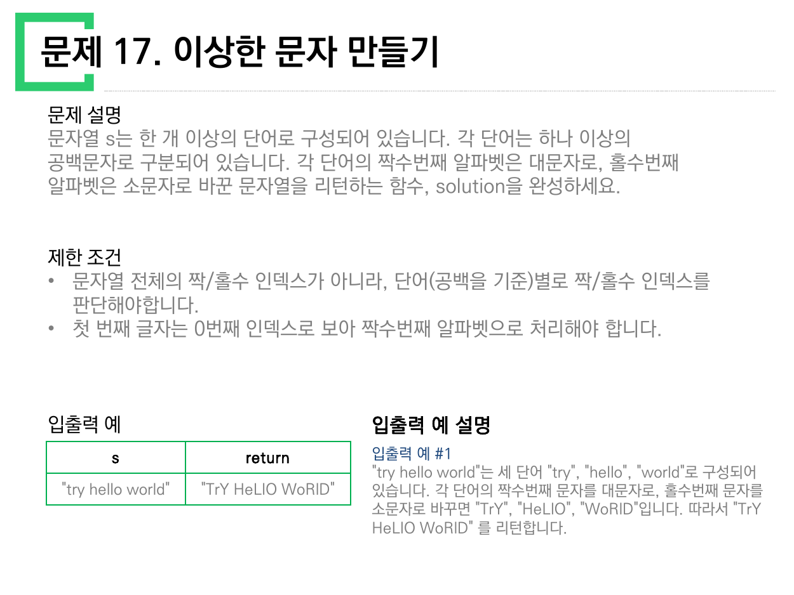
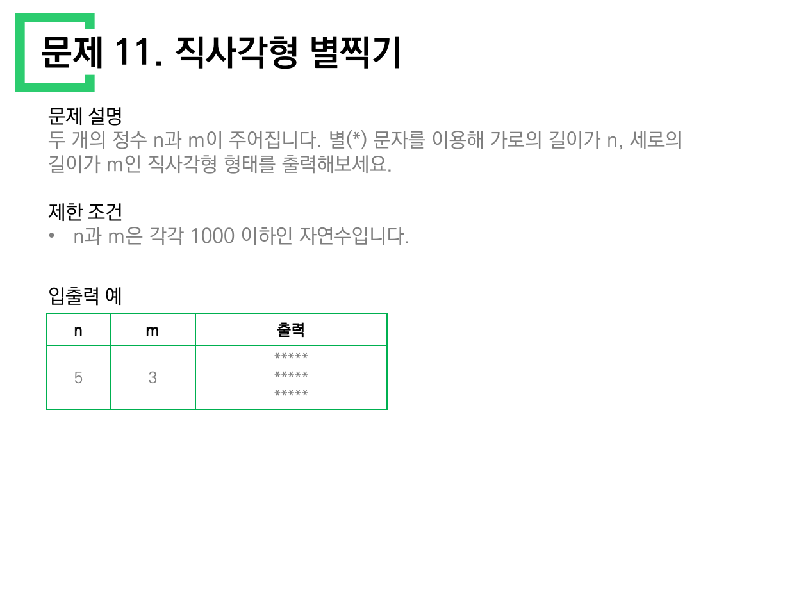
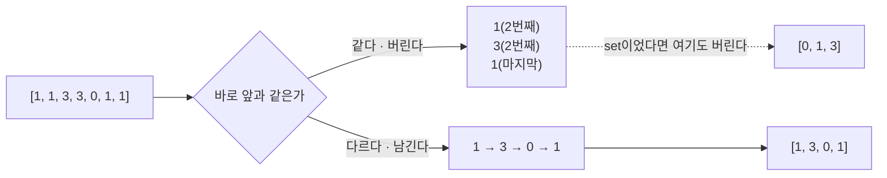
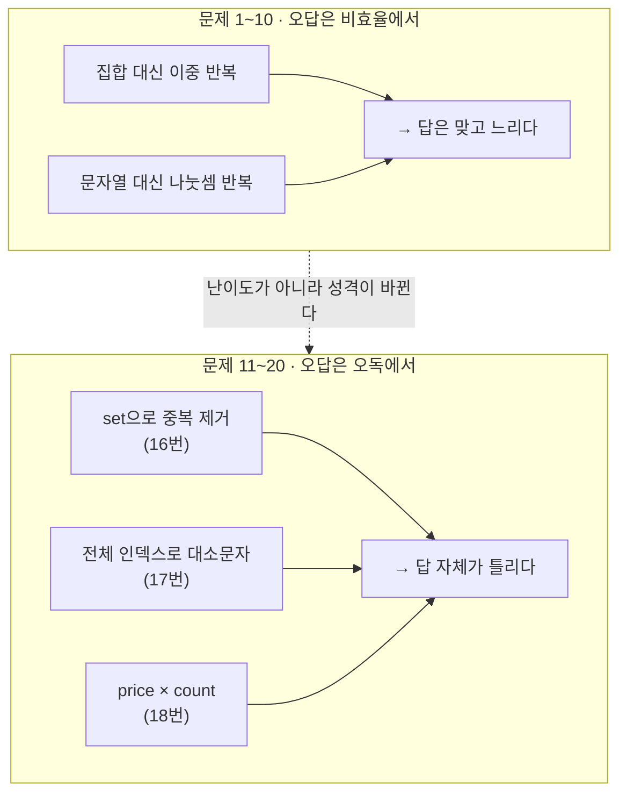

> [!abstract] 열 쪽 중 한 쪽에만 경고문이 있다
> `문제풀이_11_20.pdf`의 제한 조건 칸은 대부분 범위와 길이만 적는다. 그런데 17번 한 쪽만 다르다.
>
> > **"문자열 전체의 짝/홀수 인덱스가 아니라, 단어(공백을 기준)별로 짝/홀수 인덱스를 판단해야합니다."**
>
> 이 줄은 범위가 아니다. **"당신이 먼저 떠올릴 답이 틀렸다"** 는 경고다. 원본이 그 경고를 한 번만 적었다는 사실이 이 자료의 척추다 — 나머지 아홉 문제에도 같은 경고가 필요한 자리가 있는데, 거기에는 아무것도 적혀 있지 않다.
>
> 그래서 이 정리는 열 문제를 순서대로 풀지 않는다. **각 쪽에 없는 경고문을 복원한다.**



원본 7쪽. 제한 조건 두 줄이 모두 판정 기준이다. 둘째 줄 "첫 번째 글자는 0번째 인덱스로 보아 짝수번째 알파벳으로 처리해야 합니다"까지 읽어야 `"try"` → `"TrY"`가 나온다.

---

## 1. 복원한 경고문 열 줄

원본에 적혀 있지 않지만, 각 문제가 실제로 요구하는 경고를 한 줄씩 옮기면 이렇다.

| 번호 | 원본 제목 | 직관이 먼저 내놓는 한 줄 | 없는 경고문 |
| --- | --- | --- | --- |
| 11 | 직사각형 별찍기 | `return "*"*n` | **반환이 아니라 출력이다.** 이 자료에서 유일하게 `return`을 요구하지 않는 문제 |
| 12 | 가운데 글자 가져오기 | `s[len(s)//2]` | 길이가 짝수면 **두 글자**다 |
| 13 | 행렬의 덧셈 | `arr1 + arr2` | 리스트의 `+`는 이어붙이기다. 원소별 덧셈이 아니다 |
| 14 | 내적 | `sum(a) * sum(b)` | 곱한 뒤 더하는 것이지 더한 뒤 곱하는 것이 아니다 |
| 15 | 문자열 다루기 기본 | `s.isdigit()` | **길이도 봐야 한다.** 4 또는 6만 참 |
| 16 | 같은 숫자는 싫어 | `list(set(arr))` | **인접한** 중복만 지운다. 순서도 지켜야 한다 |
| 17 | 이상한 문자 만들기 | 전체 인덱스로 대소문자 | 단어별 인덱스 — *원본이 유일하게 적어 준 경고* |
| 18 | 부족한 금액 계산하기 | `price*count - money` | 요금이 **매번 인상**된다. 등차수열의 합 |
| 19 | 3진법 뒤집기 | 문자열 뒤집고 그대로 int | **밑이 3이다.** 그리고 뒤집으면 앞자리 0이 생긴다 |
| 20 | 약수의 개수와 덧셈 | 수마다 약수를 다 센다 | 약수 개수가 홀수인 수는 **완전제곱수뿐**이다 |

아래에서 이 중 성격이 다른 넷(11·16·17·20)을 원본 예시 값으로 하나씩 확인한다.

---

## 2. 11번 — 반환이 아니라 출력이다

스무 문제 가운데 유일하게 "return 하도록 solution 함수를 완성해주세요"라고 쓰지 않는 쪽이다.



원본 1쪽. 다른 열아홉 쪽의 표 머리글은 전부 `return` 또는 `result`인데 이 쪽만 **`출력`** 이다. 표 안에도 값이 아니라 화면 모양이 그려져 있다.

```text
 n      m        출력
                 *****
 5      3        *****
                 *****
```

`n = 5`가 가로, `m = 3`이 세로다. 별 `n`개짜리 줄을 `m`번 출력한다. 순서를 뒤집어 `n`번 반복하면 5줄 3개가 되어 **가로세로가 바뀐 직사각형**이 나온다. 이 문제에서 틀리는 거의 유일한 방법이다.

제한 조건은 "n과 m은 각각 1000 이하인 자연수"다. 최대 1000×1000이면 백만 글자를 화면에 찍는다는 뜻이므로, 줄 단위로 한 번에 출력하는 편이 낫다는 실용적 힌트이기도 하다.

---

## 3. 16번 — 중복 제거가 아니다

`set`을 떠올리게 만드는 제목이지만, 원본의 예시 두 행이 그것을 막는다.

![문제 16 — 두 번째 예시 [1,1,3,3,0,1,1] → [1,3,0,1]에서 1이 두 번 남는다](../assets/ch02-p06-같은-숫자는-싫어.png)

원본 6쪽.

| 입력 | 원본이 적은 답 | `set`으로 지웠다면 |
| --- | --- | --- |
| `[1, 1, 3, 3, 0, 1, 1]` | `[1, 3, 0, 1]` | `[0, 1, 3]` — 값도 순서도 다르다 |
| `[4, 4, 4, 3, 3]` | `[4, 3]` | `[3, 4]` — 순서가 뒤집힌다 |

첫 행이 결정적이다. 답에 `1`이 **두 번** 남는다. 앞의 `1`과 뒤의 `1` 사이에 `3`과 `0`이 끼어 있기 때문이다. 지워야 하는 것은 "같은 값"이 아니라 **"바로 앞과 같은 값"** 이다.

원본이 본문에 적어 둔 두 문장이 이것을 이미 말하고 있다 — "**연속적으로** 나타나는 숫자는 하나만 남기고", "제거된 후 남은 수들을 반환할 때는 배열 arr의 원소들의 **순서를 유지**해야 합니다". 제한 조건 칸이 아니라 문제 설명 안에 섞여 있어 놓치기 쉬울 뿐이다.



---

## 4. 17번 — 경고문이 가리지 못한 두 번째 함정

원본이 짚어 준 함정(전체 인덱스가 아니라 단어별 인덱스)은 명시적이다. 그런데 같은 쪽 문제 설명 첫 문단에 함정이 하나 더 숨어 있다.

> "각 단어는 **하나 이상의 공백문자**로 구분되어 있습니다."

공백이 둘 이상 연속될 수 있다는 뜻이다. 파이썬에서 `s.split()`은 인자 없이 부르면 **연속된 공백을 하나로 뭉치고 앞뒤 공백을 버린다.** 그러면 원래 공백 개수를 복원할 수 없어, 다시 이어 붙였을 때 원문과 다른 문자열이 나온다. `s.split(" ")`는 공백 하나마다 자르므로 빈 문자열이 그대로 남고, 다시 `" ".join(...)`으로 되돌리면 공백 개수가 보존된다.

아래에서 두 방식을 나란히 돌려 보라. 원본 예 `"try hello world"`에서는 둘의 결과가 같지만, 공백을 하나 더 넣는 순간 갈라진다.

```html preview h=560px
<div id="wc-root">
  <style>
    #wc-root{font-family:system-ui,-apple-system,"Segoe UI",sans-serif;color:var(--foreground);
      background:var(--card);border:1px solid var(--border);border-radius:10px;padding:16px}
    #wc-root h4{margin:0 0 4px;font-size:14px}
    #wc-root .sub{font-size:12px;opacity:.72;margin-bottom:14px;line-height:1.5}
    #wc-root input{font:inherit;font-size:13px;padding:6px 9px;border-radius:6px;width:100%;
      border:1px solid var(--border);background:transparent;color:var(--foreground);
      font-family:ui-monospace,SFMono-Regular,Menlo,monospace}
    #wc-root .pre{display:flex;gap:6px;flex-wrap:wrap;margin:10px 0 14px}
    #wc-root button{font:inherit;font-size:12px;padding:4px 9px;border-radius:6px;cursor:pointer;
      border:1px solid var(--border);background:transparent;color:var(--foreground)}
    #wc-root .two{display:grid;grid-template-columns:1fr;gap:10px}
    #wc-root .card{border:1px solid var(--border);border-radius:8px;padding:11px 13px}
    #wc-root .card.ok{border-color:var(--chart-1)}
    #wc-root .card .t{font-size:12px;margin-bottom:7px;font-family:ui-monospace,SFMono-Regular,Menlo,monospace}
    #wc-root .out{font-family:ui-monospace,SFMono-Regular,Menlo,monospace;font-size:14px;
      letter-spacing:.5px;word-break:break-all;line-height:1.6}
    #wc-root .out .up{color:var(--chart-1);font-weight:600}
    #wc-root .out .sp{opacity:.35}
    #wc-root .meta{font-size:11.5px;opacity:.75;margin-top:7px;line-height:1.5}
    #wc-root .verdict{margin-top:12px;font-size:12.5px;padding:9px 11px;border-radius:7px;
      border:1px dashed var(--border);line-height:1.55}
  </style>
  <h4>17번 · split() 과 split(" ") 는 언제 갈라지는가</h4>
  <div class="sub">각 단어의 0·2·4…번째 글자를 대문자, 1·3·5…번째를 소문자로 바꾼다.
  아래 문자열의 공백을 늘리거나 줄여 보라. 공백은 <span class="sp">␣</span> 로 표시된다.</div>
  <input id="wc-in" value="try hello world">
  <div class="pre">
    <button data-s="try hello world">원본 예시</button>
    <button data-s="try  hello   world">공백을 늘린 경우</button>
    <button data-s=" try hello ">앞뒤에 공백</button>
    <button data-s="a bc def">짧은 단어들</button>
  </div>
  <div class="two">
    <div class="card" id="wc-c1">
      <div class="t">s.split()  — 공백을 뭉친다</div>
      <div class="out" id="wc-o1"></div>
      <div class="meta" id="wc-m1"></div>
    </div>
    <div class="card ok" id="wc-c2">
      <div class="t">s.split(" ")  — 공백마다 자른다</div>
      <div class="out" id="wc-o2"></div>
      <div class="meta" id="wc-m2"></div>
    </div>
  </div>
  <div class="verdict" id="wc-v"></div>
  <script>
  (function(){
    const inp=document.getElementById("wc-in");
    function conv(w){
      return [...w].map((c,i)=> i%2===0 ? c.toUpperCase() : c.toLowerCase()).join("");
    }
    function paint(s){
      return [...s].map(c=> c===" " ? '<span class="sp">␣</span>'
        : (c===c.toUpperCase() && c!==c.toLowerCase() ? '<span class="up">'+c+'</span>' : c)).join("");
    }
    function draw(){
      const s = inp.value;
      const a = s.split(/\s+/).filter(x=>x.length>0).map(conv).join(" ");
      const b = s.split(" ").map(conv).join(" ");
      document.getElementById("wc-o1").innerHTML = paint(a) || "<i>(빈 문자열)</i>";
      document.getElementById("wc-o2").innerHTML = paint(b) || "<i>(빈 문자열)</i>";
      document.getElementById("wc-m1").textContent =
        "단어 "+s.split(/\s+/).filter(x=>x.length>0).length+"개 · 길이 "+a.length;
      document.getElementById("wc-m2").textContent =
        "조각 "+s.split(" ").length+"개(빈 조각 포함) · 길이 "+b.length;
      const same = a===b;
      const v=document.getElementById("wc-v");
      v.innerHTML = same
        ? "두 결과가 <b>같다</b>. 공백이 정확히 하나씩일 때만 그렇다 — 원본 예시가 바로 이 경우다."
        : "두 결과가 <b>다르다</b>. 입력 길이 "+s.length+" 에 대해 split() 결과는 "+a.length
          +"자, split(\" \") 결과는 "+b.length+"자. 원문의 공백 배치를 지키는 쪽은 아래다.";
    }
    inp.addEventListener("input", draw);
    document.querySelectorAll("#wc-root button").forEach(b=>{
      b.onclick=()=>{ inp.value=b.dataset.s; draw(); };
    });
    draw();
  })();
  </script>
</div>
```

원본 입출력 예는 공백이 정확히 하나씩인 `"try hello world"` 하나뿐이다. 그래서 **이 예시로는 두 방식이 구별되지 않는다.** 제한 조건의 "하나 이상의 공백문자"라는 다섯 글자만이 이 함정을 알려 준다.

---

## 5. 20번 — 약수를 세지 않아도 되는 문제

문제는 "약수의 개수가 짝수인 수는 더하고 홀수인 수는 뺀다"고 말한다. 원본은 친절하게 표를 붙여 두었다.


원본 10쪽. 표를 그대로 옮기면 이렇다.

| 수 | 원본이 적은 약수 | 개수 | 짝/홀 | 부호 |
| --- | --- | --- | --- | --- |
| 13 | 1, 13 | 2 | 짝 | `+` |
| 14 | 1, 2, 7, 14 | 4 | 짝 | `+` |
| 15 | 1, 3, 5, 15 | 4 | 짝 | `+` |
| **16** | 1, 2, 4, 8, 16 | **5** | **홀** | **`−`** |
| 17 | 1, 17 | 2 | 짝 | `+` |
| 24 | 1, 2, 3, 4, 6, 8, 12, 24 | 8 | 짝 | `+` |
| **25** | 1, 5, 25 | **3** | **홀** | **`−`** |
| 26 | 1, 2, 13, 26 | 4 | 짝 | `+` |
| 27 | 1, 3, 9, 27 | 4 | 짝 | `+` |

부호가 `−`인 수는 **16과 25**뿐이다. 둘 다 완전제곱수다. 우연이 아니다 — 약수는 `d`와 `n/d`가 짝을 이루므로 항상 짝수 개인데, `d = n/d`가 되는 수, 즉 `n`이 어떤 수의 제곱일 때만 그 하나가 짝을 잃고 개수가 홀수가 된다.

그러니 이 문제는 **약수를 한 번도 세지 않고** 풀 수 있다. `left`부터 `right`까지 전부 더한 뒤, 그 구간의 완전제곱수만 두 배로 빼면 된다. 제한 조건이 `right ≤ 1000`이므로 완전제곱수는 1부터 31²=961까지 **최대 31개**뿐이다.

아래에서 구간을 움직이며 확인해 보라. 원본의 두 예시(13~17 → 43, 24~27 → 52)가 그대로 재현된다.

```html preview h=520px
<div id="dv-root">
  <style>
    #dv-root{font-family:system-ui,-apple-system,"Segoe UI",sans-serif;color:var(--foreground);
      background:var(--card);border:1px solid var(--border);border-radius:10px;padding:16px}
    #dv-root h4{margin:0 0 4px;font-size:14px}
    #dv-root .sub{font-size:12px;opacity:.72;margin-bottom:14px;line-height:1.5}
    #dv-root .ctl{display:flex;flex-wrap:wrap;gap:14px;align-items:center;font-size:13px;margin-bottom:12px}
    #dv-root input[type=range]{width:200px;accent-color:var(--chart-1)}
    #dv-root button{font:inherit;font-size:12px;padding:4px 9px;border-radius:6px;cursor:pointer;
      border:1px solid var(--border);background:transparent;color:var(--foreground)}
    #dv-root .cells{display:flex;flex-wrap:wrap;gap:4px;margin:12px 0}
    #dv-root .cell{min-width:34px;text-align:center;padding:5px 6px;border-radius:6px;font-size:12px;
      border:1px solid var(--border);font-family:ui-monospace,SFMono-Regular,Menlo,monospace}
    #dv-root .cell.minus{border-color:var(--chart-1);color:var(--chart-1);font-weight:600}
    #dv-root .cell small{display:block;font-size:9.5px;opacity:.65;margin-top:1px}
    #dv-root .eq{font-family:ui-monospace,SFMono-Regular,Menlo,monospace;font-size:12.5px;
      line-height:1.7;word-break:break-all;border-top:1px dashed var(--border);padding-top:11px;margin-top:6px}
    #dv-root .res{font-size:20px;font-family:ui-monospace,SFMono-Regular,Menlo,monospace;
      color:var(--chart-1);margin-top:8px}
    #dv-root .alt{font-size:12px;opacity:.8;margin-top:8px;line-height:1.6}
  </style>
  <h4>20번 · 부호가 뒤집히는 수는 완전제곱수뿐이다</h4>
  <div class="sub">테두리가 강조된 칸이 약수 개수가 홀수인 수다. 구간을 넓혀 보면 그 칸이
  1, 4, 9, 16, 25, 36 … 에만 나타난다.</div>
  <div class="ctl">
    <span>left <b id="dv-ll">13</b></span><input type="range" id="dv-l" min="1" max="120" value="13">
    <span>right <b id="dv-rl">17</b></span><input type="range" id="dv-r" min="1" max="120" value="17">
    <button data-l="13" data-r="17">원본 예 1</button>
    <button data-l="24" data-r="27">원본 예 2</button>
    <button data-l="1" data-r="50">1 ~ 50</button>
  </div>
  <div class="cells" id="dv-cells"></div>
  <div class="eq" id="dv-eq"></div>
  <div class="res" id="dv-res"></div>
  <div class="alt" id="dv-alt"></div>
  <script>
  (function(){
    const L=document.getElementById("dv-l"), R=document.getElementById("dv-r");
    function ndiv(n){ let c=0; for(let i=1;i*i<=n;i++){ if(n%i===0){ c += (i*i===n)?1:2; } } return c; }
    function draw(){
      let l=Number(L.value), r=Number(R.value);
      if(l>r){ const t=l; l=r; r=t; }
      document.getElementById("dv-ll").textContent=Number(L.value);
      document.getElementById("dv-rl").textContent=Number(R.value);
      const box=document.getElementById("dv-cells"); box.innerHTML="";
      let total=0, terms=[], sq=[];
      for(let n=l;n<=r;n++){
        const c=ndiv(n), odd=(c%2===1);
        if(odd){ total-=n; sq.push(n); } else { total+=n; }
        if(r-l<=60){
          const d=document.createElement("div");
          d.className="cell"+(odd?" minus":"");
          d.innerHTML=n+"<small>"+c+"개</small>";
          box.appendChild(d);
        }
        if(terms.length<26) terms.push((odd?"− ":"+ ")+n);
      }
      const eq = terms.join(" ").replace(/^\+ /,"") + (r-l+1>26?" …":"");
      document.getElementById("dv-eq").textContent = eq;
      document.getElementById("dv-res").textContent = "= " + total;
      const plain = (l+r)*(r-l+1)/2;
      document.getElementById("dv-alt").innerHTML =
        "구간 전체의 합 <b>"+plain+"</b> 에서 완전제곱수 "+
        (sq.length? "<b>"+sq.join(", ")+"</b> 의 두 배 <b>"+(2*sq.reduce((a,b)=>a+b,0))+"</b>"
                  : "<b>없음(0)</b>")+
        " 을 빼도 같은 값이 나온다 → <b>"+(plain-2*sq.reduce((a,b)=>a+b,0))+"</b>";
    }
    L.addEventListener("input",draw); R.addEventListener("input",draw);
    document.querySelectorAll("#dv-root button").forEach(b=>{
      b.onclick=()=>{ L.value=b.dataset.l; R.value=b.dataset.r; draw(); };
    });
    draw();
  })();
  </script>
</div>
```

---

## 6. 19번 — 뒤집으면 앞자리에 0이 생긴다

원본이 표를 두 단으로 펼쳐 계산 과정을 다 보여 준다.


원본 9쪽. 표를 옮기면 이렇다.

| N(10진법) | N(3진법) | 앞뒤반전(3진법) | 10진법 |
| --- | --- | --- | --- |
| 45 | `1200` | `0021` | 7 |
| 125 | `11122` | `22111` | 229 |

첫 행이 이 문제의 전부를 담고 있다. `1200`을 뒤집으면 `0021`이고, **앞의 두 자리가 0**이다. 이 0들은 값에 아무 영향이 없으므로 `0021₃ = 2×3 + 1 = 7`이다. 3진법 자릿수를 리스트에 모을 때 낮은 자리부터 쌓아 두면(`n % 3` 하고 `n //= 3`) 그 리스트가 이미 뒤집힌 순서라서, 별도로 뒤집을 필요조차 없다. 그 리스트를 높은 자리부터 읽으면 답이 나온다.

둘째 행으로 자릿수를 확인해 두자. `11122₃ = 81 + 27 + 9 + 6 + 2 = 125`이고, `22111₃ = 162 + 54 + 9 + 3 + 1 = 229`다. 원본 값과 일치한다.

---

## 7. 18번 — 요금이 매번 오른다

"놀이기구를 N 번 째 이용한다면 원래 이용료의 N배를 받기로 하였습니다." 이 한 문장이 곱셈을 등차수열의 합으로 바꾼다.

원본 예: `price = 3, money = 20, count = 4`
→ 필요 금액 `3 + 6 + 9 + 12 = 30`
→ 부족액 `30 − 20 = 10`

원본이 "총 필요한 놀이기구의 이용 금액은 30 (= 3+6+9+12)" 이라고 괄호까지 열어 적어 준 덕분에 곱셈이 아니라는 것이 분명하다. 일반식은 다음과 같다.

$$\text{필요액} = price \times \frac{count \times (count+1)}{2}$$

제한 조건의 최댓값을 넣으면 `2500 × (2500×2501/2) = 7,815,625,000`이다. `money`의 최댓값 10억을 크게 넘으므로, 부족액이 **68억**을 넘길 수 있다. 파이썬 정수에는 상한이 없어 그대로 계산되지만, 반환값이 `money`의 범위 안에 있으리라 가정하고 자료형을 좁히면 곧바로 넘친다. 그리고 "금액이 부족하지 않으면 0"이라는 마지막 문장 때문에 음수를 그대로 돌려주면 안 된다.

---

## 8. 남은 다섯 문제 — 짧게

- **12번 가운데 글자** — `"abcde"` → `"c"`, `"qwer"` → `"we"`. 두 경우를 한 줄로 처리하려면 `s[(len(s)-1)//2 : len(s)//2 + 1]`이다. 홀수 길이면 시작과 끝이 같은 칸을 가리켜 한 글자, 짝수 길이면 두 칸을 가리킨다.
- **13번 행렬의 덧셈** — 리스트의 `+`는 이어붙이기이므로 행마다, 그리고 행 안에서 다시 원소마다 짝지어야 한다. 두 겹의 `zip`이다. 제한 조건은 "행과 열의 길이는 500을 넘지 않습니다" 하나뿐이고, **두 행렬의 크기가 같다는 보장은 문제 설명 첫 문장에만** 있다("행과 열의 크기가 같은 두 행렬").
- **14번 내적** — 13번과 같은 `zip`인데 한 겹이다. 원본이 `a[0]*b[0] + a[1]*b[1] + ... + a[n-1]*b[n-1]` 이라고 식을 통째로 적어 주었다. 검산: `1×(−3) + 2×(−1) + 3×0 + 4×2 = −3 − 2 + 0 + 8 = 3`.
- **15번 문자열 다루기 기본** — 조건이 둘("길이가 4 혹은 6" **그리고** "숫자로만 구성")이고, 입출력 예 세 행이 각각 다른 이유로 실패·성공한다. `"a234"`는 길이는 맞지만 글자가 섞였고, `"12345"`는 숫자지만 길이가 5다. 제한 조건이 "영문 알파벳 대소문자 또는 0부터 9까지 숫자"로 입력을 좁혀 두어서, 공백이나 부호를 걱정할 필요가 없다.
- **11번** — §2 참고.

---

## 9. 두 자료를 겹쳐 보면

`문제풀이_1_10`이 **표현을 고르는 연습**이었다면([01. 열 문제가 제한 조건에 숨겨 둔 것](<./01. 열 문제가 제한 조건에 숨겨 둔 것.md>)), 이 자료는 **문제 설명을 정확히 읽는 연습**이다. 둘의 차이는 오답이 나오는 위치에서 드러난다.



11~20의 오답은 실행해도 예외가 나지 않는다. 값만 조용히 틀린다. 그래서 입출력 예를 **전부** 통과시켜 보는 습관이 이 자료의 진짜 요구다 — 16번은 첫 행에서, 15번은 셋째 행에서, 20번은 16과 25에서만 갈라진다.

---

## 10. 확인 문제

1. 16번에서 `[4, 4, 4, 3, 3]`을 `set`으로 처리하면 무엇이 어긋나는가? 값과 순서 두 가지를 모두 말하라
2. 17번의 입출력 예가 `"try hello world"` 하나뿐인데, 이 예시로 검증되지 않는 제한 조건은 무엇인가?
3. 20번에서 `left = 1, right = 1000`일 때 부호가 `−`인 수는 몇 개인가?
4. 19번에서 3진법 표기가 `1200`인 수를 뒤집어 `0021`로 읽을 때, 앞의 `00`을 버려도 되는 이유는?
5. 18번에서 `count = 1`이면 필요 금액은 얼마인가? 등차수열 식이 이 경우에도 성립하는지 확인하라
6. 11번은 왜 이 자료에서 유일하게 표 머리글이 `return`이 아닌가?

---

## 11. 이어지는 자료

- [01. 열 문제가 제한 조건에 숨겨 둔 것](<./01. 열 문제가 제한 조건에 숨겨 둔 것.md>) — 문제 1~10
- [03. 지뢰찾기 — 판 밖을 어떻게 다룰 것인가](<./03. 지뢰찾기 — 판 밖을 어떻게 다룰 것인가.md>) — 13번의 2차원 리스트가 격자 문제로 이어진다
- [04. 중간고사 — 글로 준 문제와 그림으로 준 문제](<./04. 중간고사 — 글로 준 문제와 그림으로 준 문제.md>)

---

## 근거 자료

`ComputerScience/01_programming-foundations/python-programming/sources/문제풀이_11_20.pdf` (10쪽) 전체.

| 쪽 | 내용 | 이 문서에서 쓴 곳 |
| --- | --- | --- |
| 1 | 문제 11 · 직사각형 별찍기 | §2 |
| 2 | 문제 12 · 가운데 글자 가져오기 | §8 |
| 3 | 문제 13 · 행렬의 덧셈 | §8 |
| 4 | 문제 14 · 내적 | §8 |
| 5 | 문제 15 · 문자열 다루기 기본 | §8 |
| 6 | 문제 16 · 같은 숫자는 싫어 | §3 |
| 7 | 문제 17 · 이상한 문자 만들기 | §0 · §4 인터랙티브 |
| 8 | 문제 18 · 부족한 금액 계산하기 | §7 |
| 9 | 문제 19 · 3진법 뒤집기 | §6 |
| 10 | 문제 20 · 약수의 개수와 덧셈 | §5 인터랙티브 |

인용한 슬라이드 4장은 위 PDF 1·6·7·9·10쪽 가운데 네 쪽을 125dpi로 렌더링한 것이다. 약수 개수·완전제곱수 판정·3진법 변환·등차수열 합(7,815,625,000)은 파이썬으로 계산해 원본 표와 대조했다. 이 자료에서는 원본의 값이 어긋나는 곳을 찾지 못했다 — 열 쪽의 입출력 예가 모두 정확하다.
