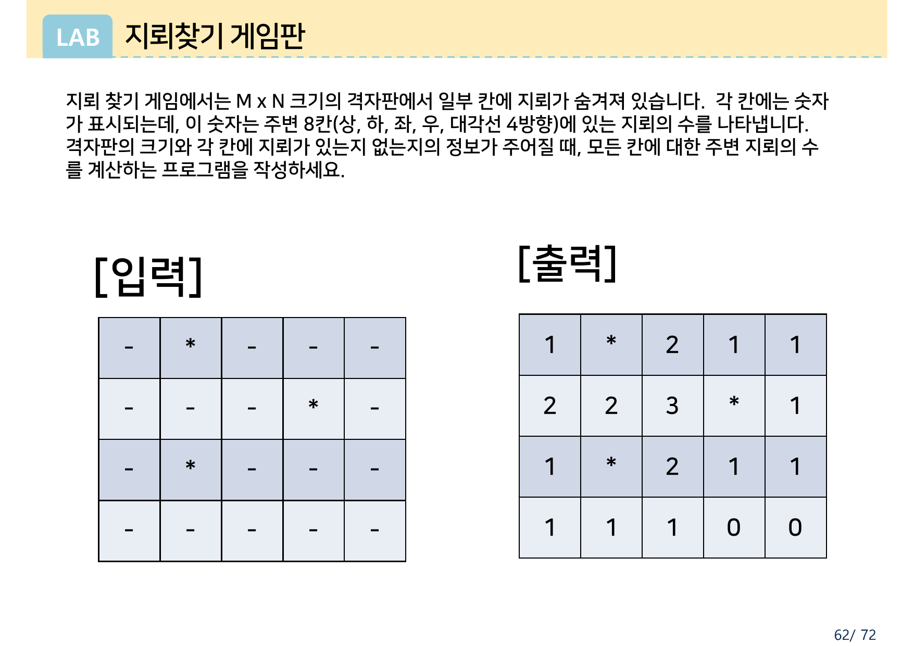
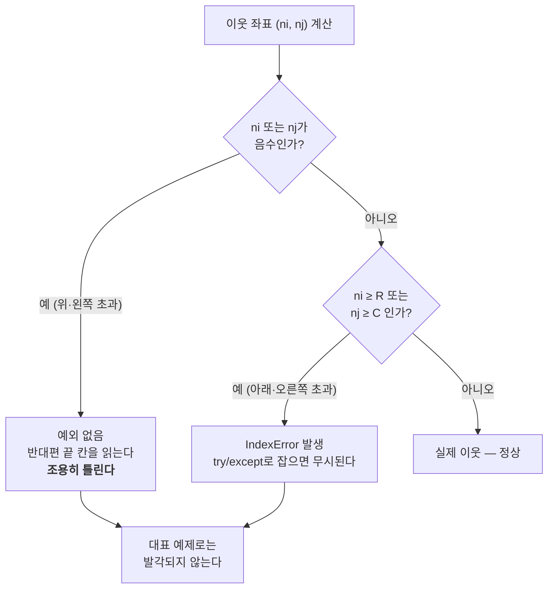
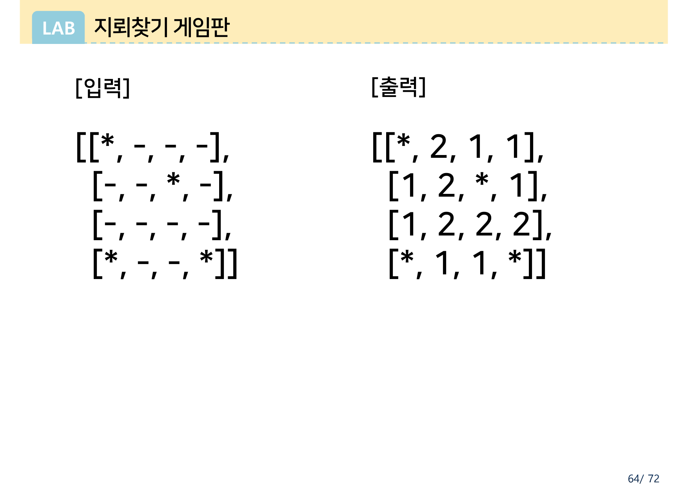
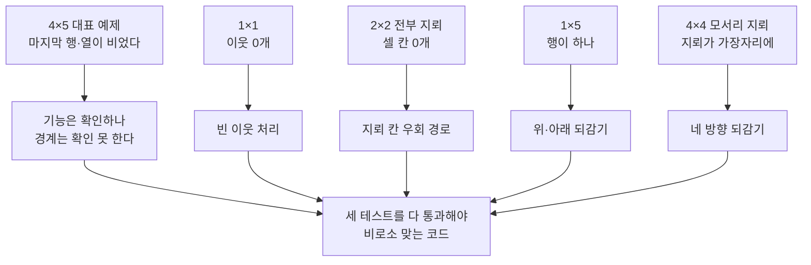

> [!abstract] 네 쪽짜리 과제가 세 쪽을 테스트에 쓴다
> 이 과제는 4쪽이다. 그중 **문제 설명은 1쪽뿐**이고 2쪽은 같은 문제를 격자 그림으로 다시 보여 준다. 남은 3·4쪽은 전부 **추가 테스트 케이스**다 — 1×1, 2×2 전부 지뢰, 1×5 한 줄, 4×4 모서리 지뢰. 네 쪽 중 두 쪽이 테스트인 과제는 흔치 않다.
>
> 이 배치가 과제의 의도를 말해 준다. **"주변 8칸의 지뢰를 세라"는 요구 자체는 쉽다.** 어려운 것은 격자 가장자리에서 **여덟 칸이 다 존재하지는 않는다**는 사실이다. 그리고 파이썬에서는 그 실수가 예외로 터지지 않고 **조용히 틀린 숫자**로 나타난다 — 음수 인덱스가 반대편 끝을 가리키기 때문이다.
>
> 결정적으로, 1쪽의 대표 예제는 **경계 검사가 빠진 코드도 통과시킨다.** 아래 §4에서 실행으로 확인한다. 3·4쪽의 테스트는 그 틈을 메우려고 놓인 것이다.

---

## 1. 요구 사항 — 한 문장과 격자 하나


원본의 요구는 세 문장이다.

> 지뢰 찾기 게임에서는 M x N 크기의 격자판에서 일부 칸에 지뢰가 숨겨져 있습니다. 각 칸에는 숫자가 표시되는데, 이 숫자는 **주변 8칸(상, 하, 좌, 우, 대각선 4방향)** 에 있는 지뢰의 수를 나타냅니다. 격자판의 크기와 각 칸에 지뢰가 있는지 없는지의 정보가 주어질 때, **모든 칸**에 대한 주변 지뢰의 수를 계산하는 프로그램을 작성하세요.

입력과 출력이 리스트 리터럴로 나란히 주어진다.

```text
[입력]                      [출력]
[[-, *, -, -, -],          [[1, *, 2, 1, 1],
 [-, -, -, *, -],           [2, 2, 3, *, 1],
 [-, *, -, -, -],           [1, *, 2, 1, 1],
 [-, -, -, -, -]]           [1, 1, 1, 0, 0]]
```

여기서 조용히 정해지는 규칙이 둘 있다.

1. **지뢰 칸은 숫자가 아니라 `*` 를 그대로 남긴다.** 요구 문장은 "모든 칸에 대한 주변 지뢰의 수"라고 했지만, 출력을 보면 `*` 자리는 세지 않고 그대로다.
2. **출력의 모양은 입력과 같다.** M×N 이 그대로 M×N 이다.

2쪽은 같은 예제를 표 형태로 다시 그린다.



같은 내용을 두 표현(리스트 리터럴 / 격자 표)으로 보여 주는 것은, **리스트의 `[i][j]` 와 격자의 (행, 열)이 같은 것**임을 익히게 하려는 배치로 읽힌다.

> [!note] 2쪽 파일에 남은 제작 흔적
> 2쪽의 PDF에는 **표 그래픽 아래에 1쪽의 리스트 텍스트가 지워지지 않고 남아 있다.** 화면·인쇄로는 보이지 않고(표가 덮고 있다) 텍스트 추출을 해야만 드러난다. 추출된 조각은 표의 값과 어긋나 보이지만, 두 층이 겹쳐 뒤섞인 것이라 어느 쪽이 원본인지 단정할 수 없다. **눈에 보이는 표(위 이미지)의 값은 아래 §3의 검산과 정확히 일치**하므로, 내용상의 오류는 아니고 슬라이드 제작 과정의 잔여물로 보인다.

---

## 2. 여덟 방향은 델타 여덟 개다

`(i, j)` 를 중심으로 한 여덟 이웃은 행·열 증분의 조합으로 적는다.

```python
DELTAS = [(-1, -1), (-1, 0), (-1, 1),
          ( 0, -1),          ( 0, 1),
          ( 1, -1), ( 1, 0), ( 1, 1)]
```

또는 이중 반복으로 만들고 자기 자신만 빼는 방식도 있다.

```python
for di in (-1, 0, 1):
    for dj in (-1, 0, 1):
        if di == 0 and dj == 0:
            continue
        ...
```

두 방식은 같다. 원본이 "상, 하, 좌, 우, 대각선 4방향"이라고 굳이 나눠 적은 것은 **4방향(상하좌우)만 세는 흔한 실수와 구별**하기 위해서다. 대각선을 빼면 위 예제의 `(1,2)` 칸이 3이 아니라 1이 된다.

---

## 3. 대표 예제 손검산

`(i, j)` 를 0-기반으로 놓고, 지뢰는 `(0,1)`, `(1,3)`, `(2,1)` 세 개다.

| 칸 | 존재하는 이웃 | 그중 지뢰 | 값 |
| --- | --- | --- | --- |
| (0,0) | 3개 (모서리) | (0,1) | **1** |
| (0,2) | 5개 (가장자리) | (0,1), (1,3) | **2** |
| (1,2) | 8개 (내부) | (0,1), (1,3), (2,1) | **3** |
| (3,3) | 5개 (가장자리) | 없음 | **0** |
| (3,4) | 3개 (모서리) | 없음 | **0** |

모서리 칸의 이웃은 **3개**, 가장자리는 **5개**, 내부만 **8개**다. 4×5 격자 20칸 중 내부 칸은 (1,1)~(2,3)의 여섯 칸뿐 — **14칸이 경계에 걸린다.** 이 비율이 이 과제가 경계 문제인 이유다.

```python
def solution(board):
    R, C = len(board), len(board[0])
    result = []
    for i in range(R):
        row = []
        for j in range(C):
            if board[i][j] == '*':
                row.append('*')
                continue
            count = 0
            for di in (-1, 0, 1):
                for dj in (-1, 0, 1):
                    if di == 0 and dj == 0:
                        continue
                    ni, nj = i + di, j + dj
                    if 0 <= ni < R and 0 <= nj < C and board[ni][nj] == '*':
                        count += 1
            row.append(count)
        result.append(row)
    return result
```

이 코드로 원본 1쪽 예제를 돌리면 출력이 정확히 일치한다.

```text
[[1, '*', 2, 1, 1],
 [2, 2, 3, '*', 1],
 [1, '*', 2, 1, 1],
 [1, 1, 1, 0, 0]]
```

핵심 한 줄은 `if 0 <= ni < R and 0 <= nj < C` 다. 이 줄을 빼면 어떻게 되는지가 이 과제의 전부다.

---

## 4. 경계 검사를 빼면 — 조용히 틀린다

파이썬 리스트는 음수 인덱스를 허용한다. `board[-1]` 은 오류가 아니라 **마지막 행**이다. 그래서 격자 왼쪽·위쪽으로 넘어간 좌표는 예외를 내지 않고 **반대편 끝을 읽는다.** 오른쪽·아래쪽으로 넘어간 좌표만 `IndexError` 가 난다.



이 비대칭이 위험하다. **오른쪽·아래는 시끄럽게 실패하고 왼쪽·위는 조용히 실패한다.** 조용한 쪽만 남기면 코드는 돌아가는데 답만 틀린다.

경계 검사를 뺀 코드(`try/except IndexError` 로 감싸기만 한 코드)를 원본의 다섯 테스트에 모두 돌린 결과는 이렇다.

| 원본 테스트 | 쪽 | 결과 |
| --- | --- | --- |
| 4×5 대표 예제 | 1·2쪽 | **통과** — 틀린 코드가 정답을 낸다 |
| 1×1 `[[-]]` | 3쪽 | **통과** |
| 2×2 전부 지뢰 | 3쪽 | **통과** |
| 1×5 `[[-,*,-,*,-]]` | 3쪽 | **적발** |
| 4×4 모서리 지뢰 | 4쪽 | **적발** |

> [!important] 대표 예제가 결함을 가려 준 이유
> 1쪽 예제에서 **마지막 행(3행)과 마지막 열(4열)에 지뢰가 하나도 없다.** 위쪽으로 넘어간 `ni = -1` 은 마지막 행을 읽고, 왼쪽으로 넘어간 `nj = -1` 은 마지막 열을 읽는데, 둘 다 비어 있으니 잘못 센 지뢰가 0개다. **우연히 맞은 것이다.** 지뢰 배치가 조금만 달랐어도 틀렸다.

적발된 두 테스트의 실제 값이다.

**1×5 한 줄짜리 격자** — 위아래가 통째로 자기 자신이다.

| | 정답 | 경계 검사 없는 코드 |
| --- | --- | --- |
| `[[-,*,-,*,-]]` | `[[1, *, 2, *, 1]]` | `[[2, *, 4, *, 2]]` |

행이 하나뿐이라 `ni = -1` 도 `ni = 0`(자기 행)을 가리킨다. 위·아래·대각선까지 전부 같은 줄을 다시 읽어 **모든 숫자가 정확히 두 배**가 되었다.

**4×4 모서리 지뢰** — 지뢰가 `(0,0)`, `(1,2)`, `(3,0)`, `(3,3)` 이다.

| 행 | 정답 | 경계 검사 없는 코드 |
| --- | --- | --- |
| 0 | `[*, 2, 1, 1]` | `[*, 3, 2, 2]` |
| 1 | `[1, 2, *, 1]` | `[1, 2, *, 1]` |
| 2 | `[1, 2, 2, 2]` | `[2, 2, 2, 2]` |
| 3 | `[*, 1, 1, *]` | `[*, 1, 1, *]` |

0행이 3행의 지뢰 두 개를 위쪽 이웃으로 잘못 세었고, `(2,0)` 은 왼쪽 이웃으로 `(2,3)`… 이 아니라 3행 지뢰를 한 번 더 세었다. **틀린 자리가 전부 위·왼쪽 경계**라는 점이 §4 앞머리의 비대칭을 그대로 보여 준다.

---

## 5. 격자 편집기 — 경계 검사를 켜고 꺼 보기

칸을 클릭해 지뢰를 놓거나 지운다. 오른쪽 격자는 **경계 검사가 있는 정답**, 왼쪽 격자는 **경계 검사를 뺀 결과**다. 다른 칸은 붉게 표시된다. 프리셋은 원본 다섯 테스트 그대로다.

```html preview h=620px
<div style="font-family:system-ui,-apple-system,sans-serif;padding:18px;color:var(--foreground)">
  <div style="display:flex;gap:7px;flex-wrap:wrap;margin-bottom:13px;align-items:center">
    <span style="font-size:12.5px;font-weight:600">원본 테스트:</span>
    <button class="ps" data-k="main" style="cursor:pointer">4×5 대표 (1·2쪽)</button>
    <button class="ps" data-k="one"  style="cursor:pointer">1×1 (3쪽)</button>
    <button class="ps" data-k="all"  style="cursor:pointer">2×2 전부지뢰 (3쪽)</button>
    <button class="ps" data-k="row"  style="cursor:pointer">1×5 (3쪽)</button>
    <button class="ps" data-k="four" style="cursor:pointer">4×4 (4쪽)</button>
  </div>
  <p style="font-size:12.5px;color:var(--muted-foreground);margin:0 0 12px">
    아래 <b>입력 격자</b>의 칸을 클릭하면 지뢰(*)를 놓거나 지운다.
  </p>

  <div style="display:flex;gap:22px;flex-wrap:wrap;align-items:flex-start">
    <div>
      <div style="font-size:11.5px;font-weight:700;margin-bottom:5px;color:var(--muted-foreground)">입력 격자 (클릭 가능)</div>
      <div id="src"></div>
    </div>
    <div>
      <div style="font-size:11.5px;font-weight:700;margin-bottom:5px;color:var(--chart-5)">경계 검사 없음</div>
      <div id="bad"></div>
    </div>
    <div>
      <div style="font-size:11.5px;font-weight:700;margin-bottom:5px;color:var(--chart-2)">경계 검사 있음 (정답)</div>
      <div id="good"></div>
    </div>
  </div>

  <div id="verdict" style="margin-top:15px;padding:11px 13px;background:var(--card);border:1px solid var(--border);border-radius:var(--radius);font-size:13px;line-height:1.7"></div>

  <script>
    var P = {
      main: [[0,1,0,0,0],[0,0,0,1,0],[0,1,0,0,0],[0,0,0,0,0]],
      one:  [[0]],
      all:  [[1,1],[1,1]],
      row:  [[0,1,0,1,0]],
      four: [[1,0,0,0],[0,0,1,0],[0,0,0,0],[1,0,0,1]]
    };
    var board = JSON.parse(JSON.stringify(P.main));

    function count(b, i, j, guard) {
      var R = b.length, C = b[0].length, c = 0;
      for (var di = -1; di <= 1; di++) {
        for (var dj = -1; dj <= 1; dj++) {
          if (di === 0 && dj === 0) continue;
          var ni = i + di, nj = j + dj;
          if (guard) {
            if (ni >= 0 && ni < R && nj >= 0 && nj < C && b[ni][nj]) c++;
          } else {
            // 파이썬 음수 인덱스: 반대편 끝으로 되감긴다. 상한 초과는 IndexError → 무시.
            var wi = ni < 0 ? R + ni : ni, wj = nj < 0 ? C + nj : nj;
            if (wi >= 0 && wi < R && wj >= 0 && wj < C && ni < R && nj < C && b[wi][wj]) c++;
          }
        }
      }
      return c;
    }
    function solve(b, guard) {
      return b.map(function (r, i) {
        return r.map(function (v, j) { return v ? '*' : count(b, i, j, guard); });
      });
    }
    function cell(txt, bg, border, extra) {
      return '<div ' + (extra || '') + ' style="width:36px;height:36px;display:flex;align-items:center;justify-content:center;' +
        'font-family:ui-monospace,monospace;font-size:16px;font-weight:700;border:1px solid ' + border +
        ';background:' + bg + ';border-radius:4px">' + txt + '</div>';
    }
    function gridHtml(rows, mapper) {
      return rows.map(function (r, i) {
        return '<div style="display:flex;gap:3px;margin-bottom:3px">' +
          r.map(function (v, j) { return mapper(v, i, j); }).join('') + '</div>';
      }).join('');
    }
    function render() {
      var g = solve(board, true), b = solve(board, false);
      document.getElementById('src').innerHTML = gridHtml(board, function (v, i, j) {
        return cell(v ? '*' : '·', v ? 'var(--chart-5)' : 'var(--card)', 'var(--border)',
          'data-i="' + i + '" data-j="' + j + '" class="sc" title="클릭해 지뢰 배치"');
      });
      var diff = 0;
      document.getElementById('bad').innerHTML = gridHtml(b, function (v, i, j) {
        var same = String(v) === String(g[i][j]);
        if (!same) diff++;
        return cell(v, same ? 'var(--card)' : 'var(--chart-5)', same ? 'var(--border)' : 'var(--chart-5)');
      });
      document.getElementById('good').innerHTML = gridHtml(g, function (v) {
        return cell(v, 'var(--card)', 'var(--border)');
      });
      var R = board.length, C = board[0].length, total = R * C;
      var inner = Math.max(0, R - 2) * Math.max(0, C - 2);
      document.getElementById('verdict').innerHTML = (diff === 0
        ? '<b style="color:var(--chart-2)">두 결과가 같다.</b> 이 배치에서는 경계 검사가 빠진 코드도 정답을 낸다 — 되감겨 읽히는 마지막 행·열에 지뢰가 없기 때문이다. 이런 배치만 테스트하면 결함을 못 찾는다.'
        : '<b style="color:var(--chart-5)">' + diff + '개 칸이 다르다.</b> 경계 검사가 없으면 위·왼쪽으로 넘어간 좌표가 반대편 끝을 읽는다. 붉은 칸이 그렇게 잘못 센 자리다.')
        + '<br/><span style="color:var(--muted-foreground);font-size:12.5px">격자 ' + R + '×' + C + ' = ' + total +
        '칸 중 여덟 이웃이 모두 존재하는 내부 칸은 <b>' + inner + '칸</b>, 경계에 걸린 칸은 <b>' + (total - inner) + '칸</b>이다.</span>';
      Array.prototype.forEach.call(document.getElementsByClassName('sc'), function (el) {
        el.style.cursor = 'pointer';
        el.onclick = function () {
          var i = +el.getAttribute('data-i'), j = +el.getAttribute('data-j');
          board[i][j] = board[i][j] ? 0 : 1;
          render();
        };
      });
    }
    Array.prototype.forEach.call(document.getElementsByClassName('ps'), function (b) {
      b.style.cssText = 'padding:5px 11px;font-size:12.5px;border:1px solid var(--border);border-radius:var(--radius);' +
        'background:var(--card);color:var(--foreground);cursor:pointer';
      b.onclick = function () { board = JSON.parse(JSON.stringify(P[b.getAttribute('data-k')])); render(); };
    });
    render();
  </script>
</div>
```

프리셋을 차례로 눌러 보면 원본의 배치 의도가 드러난다. 앞의 세 테스트는 두 격자가 같고, **1×5와 4×4에서만 붉은 칸이 나타난다.**

---

## 6. 다섯 테스트가 각각 잡는 것


3쪽의 세 테스트는 크기를 극단으로 민다.

| 테스트 | 입력 | 출력 | 이것이 확인하는 것 |
| --- | --- | --- | --- |
| 1×1 | `[[-]]` | `[[0]]` | 이웃이 **하나도 없는** 칸에서 0을 낼 수 있는가. `len(board[0])` 이 죽지 않는가 |
| 2×2 전부 지뢰 | `[[*,*],[*,*]]` | `[[*,*],[*,*]]` | **세지 않고 그대로 두는** 경로가 있는가. 숫자 계산이 한 번도 실행되지 않는 입력 |
| 1×5 | `[[-,*,-,*,-]]` | `[[1,*,2,*,1]]` | **행이 하나일 때** 위·아래 이웃을 자기 자신으로 착각하지 않는가 |



4쪽의 4×4는 성격이 다르다. 크기는 평범한데 **지뢰를 네 모서리 쪽에 몰아 놓았다.** `(0,0)`, `(3,0)`, `(3,3)` 이 격자 모서리이고 `(1,2)` 만 안쪽이다. 되감기 오류가 반드시 값에 반영되도록 만든 배치다.



> [!tip] 이 과제에서 배우는 진짜 습관
> **작동하는 예제 하나로는 아무것도 증명되지 않는다.** 원본 1쪽 예제는 4×5 격자에 지뢰 3개, 20칸 전부를 검산할 수 있는 좋은 예제인데도 **경계 결함을 통과시킨다.** 3·4쪽처럼 **극단(가장 작게)** 과 **편향(값이 경계에 몰리게)** 두 방향으로 테스트를 만들어야 결함이 드러난다.

---

## 7. 경계를 다루는 세 가지 방법

원본은 방법을 지정하지 않는다. 실제로 쓸 수 있는 선택지는 셋이다.

**① 좌표를 검사한다 (§3의 코드).** 가장 직접적이다. 조건 네 개를 매번 확인한다.

```python
if 0 <= ni < R and 0 <= nj < C and board[ni][nj] == '*':
```

**② 격자를 한 겹 두른다 (패딩).** 바깥에 지뢰 없는 테두리를 추가하면 경계 검사가 사라진다. 대신 인덱스가 1칸 밀린다.

```python
pad = [['-'] * (C + 2)] + [['-'] + row + ['-'] for row in board] + [['-'] * (C + 2)]
# 이제 원래 (i, j)는 pad[i+1][j+1]
```

**③ 지뢰에서 거꾸로 뿌린다.** 칸마다 이웃을 보는 대신, 지뢰마다 여덟 이웃의 카운터를 1씩 올린다. 지뢰가 적을 때 유리하지만, 뿌리는 쪽에서도 결국 경계를 확인해야 한다.

> [!caution] ②의 함정 — `[['-'] * C] * (R+2)`
> 패딩을 만들 때 `[row] * n` 으로 행을 복제하면 **같은 리스트 객체가 n번 참조**된다. 한 칸을 바꾸면 모든 행이 바뀐다. 이 과제처럼 격자를 만들 때 흔히 나오는 실수이고, 원본에는 언급이 없다(보충 설명). 안전한 형태는 `[['-'] * C for _ in range(R)]` 이다.

세 방법 모두 §5의 다섯 테스트를 통과해야 한다. 원본이 테스트를 넉넉히 준 덕분에, **어느 방법을 골랐든 스스로 검증할 수 있다.**

---

## 이어지는 문서

- [02. 문제 11–20 — 무엇을 어디서부터 세는가](<./02. 문제 11-20 — 무엇을 어디서부터 세는가.md>) — 문제 13의 행렬 덧셈이 2차원 리스트의 출발점이다
- [04. 23-2 중간고사 — 텍스트가 없는 두 장이 진짜 문제다](<./04. 23-2 중간고사 — 텍스트가 없는 두 장이 진짜 문제다.md>)
- [01. 문제 1–10 — 설명·제한 조건·입출력 예가 서로를 감시한다](<./01. 문제 1-10 — 설명·제한 조건·입출력 예가 서로를 감시한다.md>)

관련 과목: [01/data-structures](../../data-structures/README.md)의 2차원 배열과 인덱스, [06/algorithm-design-analysis](../../../06_algorithms-graphics/algorithm-design-analysis/README.md)의 억지 기법(모든 칸 × 여덟 이웃 = $O(MN)$ 완전 탐색).

---

## 근거 자료

`ComputerScience/01_programming-foundations/python-programming/sources/과제 02_지뢰찾기-1.pdf` (4쪽) 전체.

| 쪽 | 내용 | 이 문서에서 다룬 곳 |
| --- | --- | --- |
| 1 | 문제 설명 + 4×5 예제 (리스트 표기) | §1 (슬라이드 인용) · §3 |
| 2 | 같은 예제 (격자 표 표기) | §1 (슬라이드 인용) |
| 3 | 테스트 3종 — 1×1, 2×2 전부 지뢰, 1×5 | §6 (슬라이드 인용) · §4 |
| 4 | 테스트 — 4×4 모서리 지뢰 | §6 (슬라이드 인용) · §4 |

원본의 다섯 입출력 쌍을 모두 파이썬 3.11로 검증했고(전부 일치), 경계 검사를 뺀 코드로도 같은 다섯 개를 돌려 §4의 통과·적발 표를 얻었다. 원본에 없는 내용은 §7의 세 가지 구현 방법과 리스트 복제 함정(보충 설명임을 표시)뿐이다.
