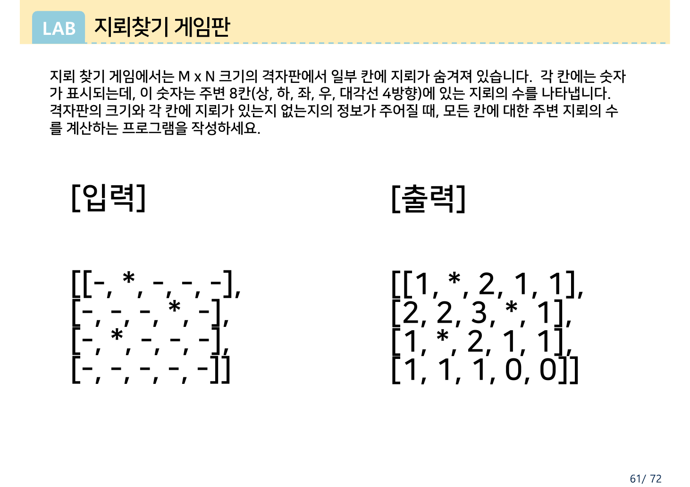
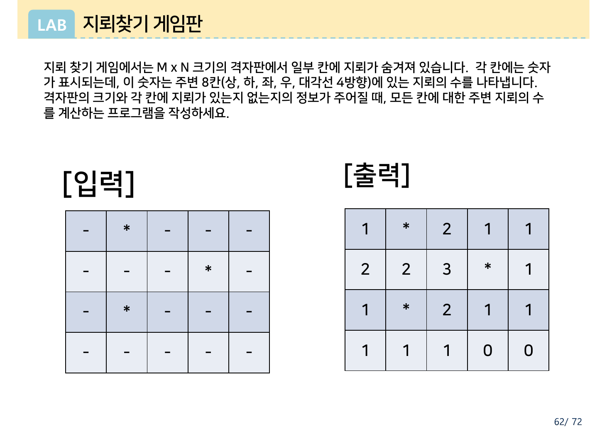
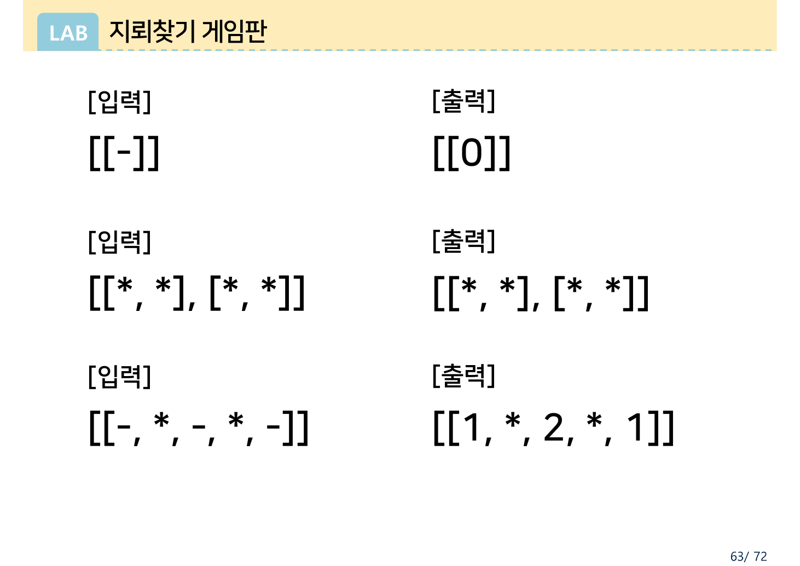
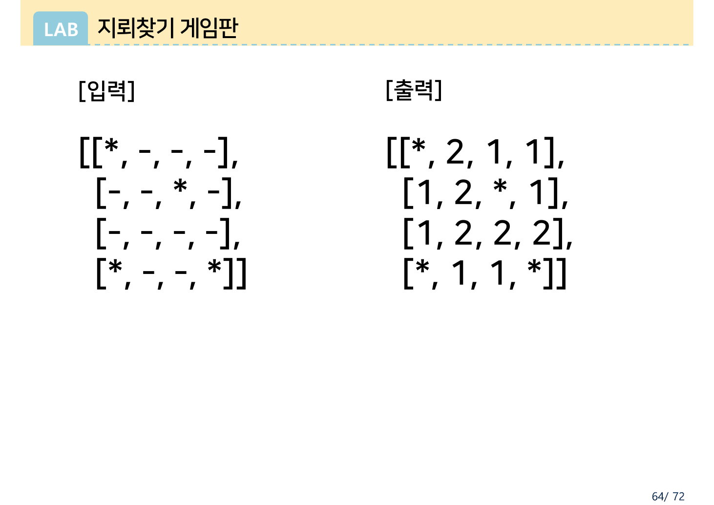
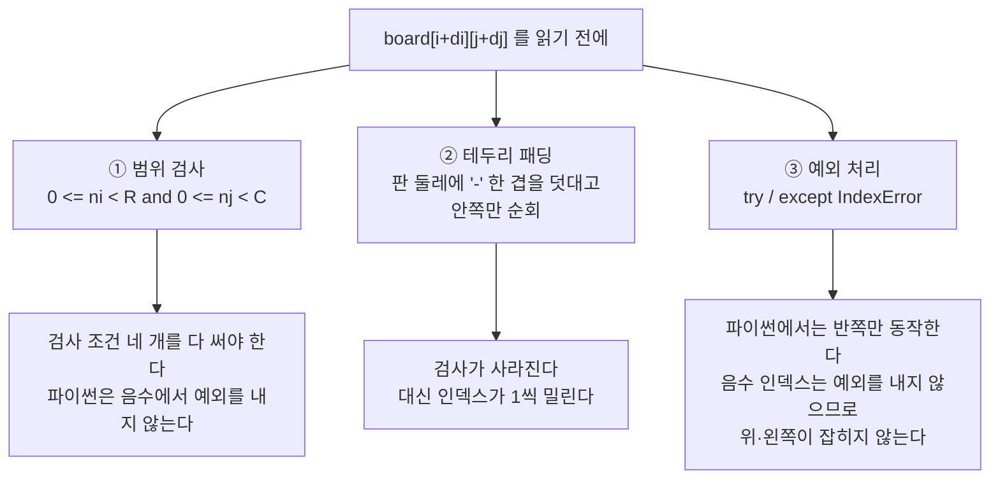

> [!abstract] 네 쪽에 예제가 일곱 개, 풀이는 0개
> `과제 02_지뢰찾기-1.pdf`는 4쪽이다. 문제 설명 문단은 **1쪽과 2쪽에 글자 하나 다르지 않게 두 번** 나오고, 3·4쪽에는 설명이 아예 없다. 남는 것은 입력·출력 쌍뿐이고 그게 일곱 개다.
>
> 예제가 일곱 개인 과제에서 물어야 할 것은 "어떻게 푸는가"가 아니라 **"왜 일곱 개인가"** 다. 아래에서 일곱 개를 전부 직접 계산해 보면 답이 나온다 — 1쪽의 대표 예제 하나로는 **가장 흔한 버그가 잡히지 않기 때문**이다. 나머지 여섯은 그 버그를 잡으려고 놓여 있다.

읽기 전에 이 PDF의 출처를 한 번 짚어 둔다.

> [!note] 이 PDF는 어느 장에서 잘려 나왔는가
> PDF 메타데이터의 원본 파일명은 `Chapter 07_리스트, 튜플, 딕셔너리.pptx`이고, 3·4쪽 오른쪽 아래에 **62/72 · 63/72 · 64/72** 라는 슬라이드 번호가 남아 있다. 즉 이 과제는 리스트 단원 72장 중 마지막 세 장을 떼어 온 것이다. 격자 문제가 왜 하필 리스트·튜플·딕셔너리 장의 끝에 붙어 있는지는 §6에서 다시 본다.

---

## 1. 규칙은 한 문장뿐이다

원본이 두 번 반복해 적은 문단에서 규칙에 해당하는 부분은 이 한 줄이다.

> "각 칸에는 숫자가 표시되는데, 이 숫자는 **주변 8칸(상, 하, 좌, 우, 대각선 4방향)에 있는 지뢰의 수**를 나타냅니다."

여기서 정해지지 않은 것이 둘 있고, 그것을 정해 주는 것이 예제다.

| 정해지지 않은 것 | 어느 예제가 정하는가 |
| --- | --- |
| 지뢰 칸 자체에는 무엇을 쓰는가 | 3쪽 `[[*, *], [*, *]]` → 출력도 `[[*, *], [*, *]]` — 그대로 `*` |
| 주변 8칸 중 판 밖이 있으면 | 3쪽 `[[-]]` → `[[0]]` — 없는 칸은 0으로 센다 |

문제 설명은 두 경우를 한 번도 언급하지 않는다. 오직 예제만이 답한다.

---

## 2. 같은 예제를 두 번, 다른 표기로

1쪽과 2쪽은 같은 5×4 예제인데 표기가 다르다.



```text
[입력]                    [출력]
[[-, *, -, -, -],        [[1, *, 2, 1, 1],
 [-, -, -, *, -],         [2, 2, 3, *, 1],
 [-, *, -, -, -],         [1, *, 2, 1, 1],
 [-, -, -, -, -]]         [1, 1, 1, 0, 0]]
```



같은 값인데 2쪽은 표 격자로 그렸다. 이 반복이 우연은 아닐 것이다. 지뢰찾기 판은 **사람에게는 격자**이지만 **파이썬에서는 리스트의 리스트**이고, 그 사이를 오가는 것이 이 과제의 첫 관문이다. `board[i][j]`에서 `i`가 행(세로), `j`가 열(가로)이라는 것을 격자 그림과 대조하지 않으면 행과 열이 뒤집힌다.

원본 표기에서 하나 주의할 점: 입력의 빈 칸은 `-`이고 지뢰는 `*`다. 둘 다 문자다. 그런데 출력에서 빈 칸은 **정수** `0`~`8`로 바뀌고 지뢰만 문자 `*`로 남는다. 한 리스트 안에 정수와 문자가 섞인다.

---

## 3. 일곱 예제가 각각 잡아내는 것

전부 파이썬으로 계산해 원본 출력과 대조했다. 일곱 개 모두 원본 값과 일치한다.

| 쪽 | 크기 | 지뢰 위치 | 이 예제가 시험하는 것 |
| --- | --- | --- | --- |
| 1·2 | 5×4 | (0,1) (1,3) (2,1) | 일반적인 경우 — 내부·변·모서리가 모두 들어 있다 |
| 3 | 1×1 | 없음 | 이웃이 **하나도 없다**. 8칸이 전부 판 밖 |
| 3 | 2×2 | 네 칸 전부 | 셀 자체가 지뢰일 때 숫자를 쓰지 않는다 |
| 3 | 1×5 | (0,1) (0,3) | **행이 하나** — 위아래가 전부 판 밖 |
| 4 | 4×4 | (0,0) (1,2) (3,0) (3,3) | **모서리 세 곳이 지뢰** |





3쪽과 4쪽에는 설명이 한 글자도 없다. 그런데 세 예제가 하필 1×1, 2×2, 1×5이고 4쪽이 하필 모서리에 지뢰를 몰아 놓았다는 것은, 이 예제들이 **아무 판이나 고른 것이 아니라는** 뜻이다.

---

## 4. 판 위에서 직접 세어 보기

아래에서 칸을 눌러 지뢰를 놓거나 지울 수 있다. 원본 예제 네 개가 버튼으로 들어 있고, 어느 칸에 마우스를 올리면 그 칸이 실제로 본 이웃이 표시된다.

```html preview h=620px
<div id="ms-root">
  <style>
    #ms-root{font-family:system-ui,-apple-system,"Segoe UI",sans-serif;color:var(--foreground);
      background:var(--card);border:1px solid var(--border);border-radius:10px;padding:16px}
    #ms-root h4{margin:0 0 4px;font-size:14px}
    #ms-root .sub{font-size:12px;opacity:.72;margin-bottom:12px;line-height:1.5}
    #ms-root .ctl{display:flex;flex-wrap:wrap;gap:6px;align-items:center;margin-bottom:14px;font-size:12px}
    #ms-root button{font:inherit;font-size:12px;padding:4px 9px;border-radius:6px;cursor:pointer;
      border:1px solid var(--border);background:transparent;color:var(--foreground)}
    #ms-root button.on{border-color:var(--chart-1);color:var(--chart-1)}
    #ms-root .boards{display:flex;flex-wrap:wrap;gap:22px;align-items:flex-start}
    #ms-root .bwrap .cap{font-size:11px;letter-spacing:.04em;text-transform:uppercase;
      opacity:.7;margin-bottom:6px}
    #ms-root table{border-collapse:collapse}
    #ms-root td{width:36px;height:36px;text-align:center;vertical-align:middle;
      border:1px solid var(--border);font-family:ui-monospace,SFMono-Regular,Menlo,monospace;
      font-size:14px;cursor:pointer;user-select:none}
    #ms-root td.mine{color:var(--chart-1);font-weight:700}
    #ms-root td.zero{opacity:.42}
    #ms-root td.nb{background:var(--border)}
    #ms-root td.self{outline:2px solid var(--chart-1);outline-offset:-2px}
    #ms-root .out td{cursor:default}
    #ms-root .info{margin-top:14px;font-size:12.5px;line-height:1.65;border-top:1px dashed var(--border);
      padding-top:11px}
    #ms-root code{font-family:ui-monospace,SFMono-Regular,Menlo,monospace;font-size:12px}
    #ms-root .lit{font-family:ui-monospace,SFMono-Regular,Menlo,monospace;font-size:11.5px;
      opacity:.85;margin-top:8px;word-break:break-all;line-height:1.6}
  </style>
  <h4>지뢰 격자판 — 8방향으로 세어 보기</h4>
  <div class="sub">왼쪽 판의 칸을 <b>클릭</b>하면 지뢰가 놓이고 지워진다. 오른쪽 결과 칸에
  <b>마우스를 올리면</b> 그 칸이 실제로 들여다본 이웃이 왼쪽 판에 표시된다.</div>
  <div class="ctl">
    <span style="opacity:.7">원본 예제</span>
    <button data-k="a">1·2쪽 5×4</button>
    <button data-k="b">3쪽 1×1</button>
    <button data-k="c">3쪽 2×2 전부 지뢰</button>
    <button data-k="d">3쪽 1×5</button>
    <button data-k="e">4쪽 4×4</button>
  </div>
  <div class="boards">
    <div class="bwrap"><div class="cap">입력</div><table id="ms-in"></table></div>
    <div class="bwrap"><div class="cap">출력</div><table id="ms-out" class="out"></table></div>
  </div>
  <div class="info" id="ms-info"></div>
  <div class="lit" id="ms-lit"></div>
  <script>
  (function(){
    const P = {
      a:[["-","*","-","-","-"],["-","-","-","*","-"],["-","*","-","-","-"],["-","-","-","-","-"]],
      b:[["-"]],
      c:[["*","*"],["*","*"]],
      d:[["-","*","-","*","-"]],
      e:[["*","-","-","-"],["-","-","*","-"],["-","-","-","-"],["*","-","-","*"]]
    };
    let key="a", g = P.a.map(r=>r.slice());
    const tin=document.getElementById("ms-in"), tout=document.getElementById("ms-out");
    function count(i,j){
      let c=0, nb=[];
      for(let di=-1;di<=1;di++) for(let dj=-1;dj<=1;dj++){
        if(di===0&&dj===0) continue;
        const ni=i+di, nj=j+dj;
        if(ni<0||nj<0||ni>=g.length||nj>=g[0].length) continue;
        nb.push([ni,nj]);
        if(g[ni][nj]==="*") c++;
      }
      return {c:c, nb:nb};
    }
    function highlight(i,j){
      const cells=tin.querySelectorAll("td");
      cells.forEach(td=>td.classList.remove("nb","self"));
      if(i===null){ document.getElementById("ms-info").innerHTML=defaultInfo(); return; }
      const r=count(i,j);
      r.nb.forEach(([a,b])=>{
        const td=tin.querySelector('td[data-i="'+a+'"][data-j="'+b+'"]');
        if(td) td.classList.add("nb");
      });
      const self=tin.querySelector('td[data-i="'+i+'"][data-j="'+j+'"]');
      if(self) self.classList.add("self");
      document.getElementById("ms-info").innerHTML =
        "칸 <code>board["+i+"]["+j+"]</code> · 판 안에 있는 이웃 <b>"+r.nb.length+"칸</b>"
        + " (8칸 중 <b>"+(8-r.nb.length)+"칸</b>이 판 밖)"
        + (g[i][j]==="*" ? " · 이 칸은 지뢰이므로 세지 않고 <code>*</code> 를 그대로 쓴다"
                         : " · 그중 지뢰 <b>"+r.c+"개</b>");
    }
    function defaultInfo(){
      const R=g.length, C=g[0].length, m=g.flat().filter(x=>x==="*").length;
      const corner = 2*2*2 <= 0 ? 0 : (R>1&&C>1?4:(R===1&&C===1?1:2));
      return "판 크기 <b>"+R+" × "+C+"</b> · 지뢰 <b>"+m+"개</b> · "
        + "이웃이 8칸을 다 갖는 내부 칸은 <b>"+Math.max(0,(R-2))*Math.max(0,(C-2))+"칸</b>, "
        + "나머지 <b>"+(R*C-Math.max(0,(R-2))*Math.max(0,(C-2)))+"칸</b>은 판 밖을 마주한다.";
    }
    function render(){
      const R=g.length, C=g[0].length;
      tin.innerHTML=""; tout.innerHTML="";
      for(let i=0;i<R;i++){
        const r1=tin.insertRow(), r2=tout.insertRow();
        for(let j=0;j<C;j++){
          const a=r1.insertCell(), b=r2.insertCell();
          a.dataset.i=i; a.dataset.j=j;
          a.textContent=g[i][j];
          if(g[i][j]==="*") a.classList.add("mine");
          a.onclick=()=>{ g[i][j] = g[i][j]==="*" ? "-" : "*"; render(); };
          if(g[i][j]==="*"){ b.textContent="*"; b.classList.add("mine"); }
          else { const v=count(i,j).c; b.textContent=v; if(v===0) b.classList.add("zero"); }
          b.onmouseenter=()=>highlight(i,j);
          b.onmouseleave=()=>highlight(null);
        }
      }
      document.getElementById("ms-info").innerHTML=defaultInfo();
      const outLit = g.map((row,i)=>"["+row.map((v,j)=> v==="*" ? "*" : count(i,j).c).join(", ")+"]").join(",\n ");
      document.getElementById("ms-lit").textContent = "[출력]  ["+outLit+"]";
    }
    document.querySelectorAll("#ms-root button").forEach(b=>{
      b.onclick=()=>{ key=b.dataset.k; g=P[key].map(r=>r.slice());
        document.querySelectorAll("#ms-root button").forEach(x=>x.classList.toggle("on", x===b));
        render(); };
    });
    document.querySelector('#ms-root button[data-k="a"]').classList.add("on");
    render();
  })();
  </script>
</div>
```

`1×1` 판을 골라 보면 이웃이 **0칸**이라고 나온다. 8칸이 전부 판 밖이다. `1×5`를 고르면 어느 칸이든 이웃이 최대 2칸이다. 위아래 여섯 칸이 통째로 사라진다.

---

## 5. 파이썬에서 판 밖이 위험한 이유

대부분의 언어에서 `board[-1][2]`는 예외로 터진다. **파이썬은 아니다.** 음수 인덱스는 뒤에서부터 세는 정상적인 문법이라 조용히 마지막 행을 돌려준다. 그래서 이웃을 셀 때 범위 검사를 이렇게 쓰면 안 된다.

```python
# 위험 — 위쪽과 왼쪽이 새어 나간다
if ni < R and nj < C:
    ...
```

`ni`가 `-1`일 때 이 조건은 참이고, `board[-1]`은 **판의 마지막 행**이다. 격자가 원통처럼 이어져 버린다. 반대편 끝의 지뢰가 이쪽 끝 칸에 세어진다.

여기서 원본 예제가 왜 일곱 개인지가 드러난다. 이 버그를 넣은 채 1·2쪽의 5×4 예제를 돌려 보면 **정답이 그대로 나온다.**

| 예제 | 올바른 출력 | 범위 검사를 반쪽만 했을 때 | 잡히는가 |
| --- | --- | --- | --- |
| 1·2쪽 5×4 | `[[1,*,2,1,1],[2,2,3,*,1],[1,*,2,1,1],[1,1,1,0,0]]` | 같음 | **못 잡는다** |
| 3쪽 1×1 | `[[0]]` | `[[0]]` | 못 잡는다 |
| 3쪽 2×2 지뢰 | `[[*,*],[*,*]]` | 같음 | 못 잡는다 |
| 3쪽 1×5 | `[[1,*,2,*,1]]` | `[[2,*,4,*,2]]` | **잡는다** |
| 4쪽 4×4 | `[[*,2,1,1],[1,2,*,1],[1,2,2,2],[*,1,1,*]]` | `[[*,3,2,2],[1,2,*,1],[2,2,2,2],[*,1,1,*]]` | **잡는다** |

5×4 예제가 이 버그를 못 잡는 이유는 지뢰의 위치에 있다. 마지막 행(3행)에도, 마지막 열(4열)에도 지뢰가 하나도 없다. 그래서 위로 새어 나가 마지막 행을 읽어도, 왼쪽으로 새어 나가 마지막 열을 읽어도 세어질 지뢰가 없다. **우연히 안전한 판**이다.

1×5는 정반대다. 행이 하나뿐이라 `ni = -1`이 곧 자기 자신의 행이고, 그 행에 지뢰가 둘 있다. 가운데 칸의 답이 2에서 4로, 정확히 두 배가 된다.

```html preview h=520px
<div id="wr-root">
  <style>
    #wr-root{font-family:system-ui,-apple-system,"Segoe UI",sans-serif;color:var(--foreground);
      background:var(--card);border:1px solid var(--border);border-radius:10px;padding:16px}
    #wr-root h4{margin:0 0 4px;font-size:14px}
    #wr-root .sub{font-size:12px;opacity:.72;margin-bottom:12px;line-height:1.5}
    #wr-root .ctl{display:flex;flex-wrap:wrap;gap:8px;align-items:center;margin-bottom:14px;font-size:12.5px}
    #wr-root button{font:inherit;font-size:12px;padding:4px 9px;border-radius:6px;cursor:pointer;
      border:1px solid var(--border);background:transparent;color:var(--foreground)}
    #wr-root button.on{border-color:var(--chart-1);color:var(--chart-1)}
    #wr-root label{display:inline-flex;gap:6px;align-items:center;cursor:pointer;
      border:1px solid var(--border);padding:4px 10px;border-radius:6px}
    #wr-root .grids{display:flex;gap:26px;flex-wrap:wrap}
    #wr-root .cap{font-size:11px;letter-spacing:.04em;text-transform:uppercase;opacity:.7;margin-bottom:6px}
    #wr-root table{border-collapse:collapse}
    #wr-root td{width:34px;height:34px;text-align:center;border:1px solid var(--border);
      font-family:ui-monospace,SFMono-Regular,Menlo,monospace;font-size:13px}
    #wr-root td.mine{color:var(--chart-1);font-weight:700}
    #wr-root td.diff{background:var(--chart-1);color:var(--card);font-weight:700}
    #wr-root .msg{margin-top:14px;font-size:12.5px;line-height:1.65;border-top:1px dashed var(--border);padding-top:11px}
    #wr-root pre{font-family:ui-monospace,SFMono-Regular,Menlo,monospace;font-size:11.5px;
      background:transparent;border:1px solid var(--border);border-radius:7px;padding:10px 12px;
      overflow-x:auto;margin:10px 0 0;line-height:1.55}
  </style>
  <h4>범위 검사를 반쪽만 하면 — 원본 예제 다섯 개로 확인</h4>
  <div class="sub">아래 체크를 끄면 <code>ni &lt; R and nj &lt; C</code> 만 검사한다.
  음수 인덱스가 그대로 통과해 격자가 반대편으로 이어진다. 달라진 칸이 강조된다.</div>
  <div class="ctl">
    <button data-k="a">5×4</button><button data-k="b">1×1</button>
    <button data-k="c">2×2</button><button data-k="d">1×5</button><button data-k="e">4×4</button>
    <label><input type="checkbox" id="wr-guard" checked> 음수도 검사한다 (<code>0 &lt;= ni</code>)</label>
  </div>
  <div class="grids">
    <div><div class="cap">입력</div><table id="wr-a"></table></div>
    <div><div class="cap">출력</div><table id="wr-b"></table></div>
    <div><div class="cap">올바른 출력</div><table id="wr-c"></table></div>
  </div>
  <div class="msg" id="wr-msg"></div>
  <pre id="wr-code"></pre>
  <script>
  (function(){
    const P = {
      a:[["-","*","-","-","-"],["-","-","-","*","-"],["-","*","-","-","-"],["-","-","-","-","-"]],
      b:[["-"]], c:[["*","*"],["*","*"]], d:[["-","*","-","*","-"]],
      e:[["*","-","-","-"],["-","-","*","-"],["-","-","-","-"],["*","-","-","*"]]
    };
    let key="d";
    function solve(g, guard){
      const R=g.length, C=g[0].length;
      return g.map((row,i)=>row.map((v,j)=>{
        if(v==="*") return "*";
        let c=0;
        for(let di=-1;di<=1;di++) for(let dj=-1;dj<=1;dj++){
          if(di===0&&dj===0) continue;
          const ni=i+di, nj=j+dj;
          if(ni>=R||nj>=C) continue;
          if(guard && (ni<0||nj<0)) continue;
          const rr = ni<0 ? R+ni : ni, cc = nj<0 ? C+nj : nj;   // 파이썬 음수 인덱스
          if(g[rr][cc]==="*") c++;
        }
        return c;
      }));
    }
    function fill(t, m, ref){
      t.innerHTML="";
      m.forEach((row,i)=>{
        const tr=t.insertRow();
        row.forEach((v,j)=>{
          const td=tr.insertCell(); td.textContent=v;
          if(v==="*") td.classList.add("mine");
          if(ref && String(ref[i][j])!==String(v)) td.classList.add("diff");
        });
      });
    }
    function draw(){
      const g=P[key], guard=document.getElementById("wr-guard").checked;
      const good=solve(g,true), got=solve(g,guard);
      fill(document.getElementById("wr-a"), g, null);
      fill(document.getElementById("wr-b"), got, good);
      fill(document.getElementById("wr-c"), good, null);
      const diff = got.flat().filter((v,i)=>String(v)!==String(good.flat()[i])).length;
      document.getElementById("wr-msg").innerHTML = guard
        ? "검사가 온전하다. 세 판이 모두 같다."
        : (diff===0
            ? "이 예제에서는 <b>버그가 드러나지 않는다</b> — 마지막 행·마지막 열에 지뢰가 없어서 새어 나가도 셀 것이 없다."
            : "<b>"+diff+"칸</b>이 틀렸다. 이 예제가 버그를 잡아낸다.");
      document.getElementById("wr-code").textContent = guard
        ? "for di in (-1, 0, 1):\n    for dj in (-1, 0, 1):\n        if di == 0 and dj == 0:\n            continue\n        ni, nj = i + di, j + dj\n        if 0 <= ni < R and 0 <= nj < C:      # 네 방향 모두 막는다\n            if board[ni][nj] == '*':\n                count += 1"
        : "for di in (-1, 0, 1):\n    for dj in (-1, 0, 1):\n        if di == 0 and dj == 0:\n            continue\n        ni, nj = i + di, j + dj\n        if ni < R and nj < C:                # 음수가 새어 나간다\n            if board[ni][nj] == '*':         # board[-1] 은 마지막 행\n                count += 1";
    }
    document.querySelectorAll("#wr-root button").forEach(b=>{
      b.onclick=()=>{ key=b.dataset.k;
        document.querySelectorAll("#wr-root button").forEach(x=>x.classList.toggle("on", x===b));
        draw(); };
    });
    document.getElementById("wr-guard").addEventListener("change", draw);
    document.querySelector('#wr-root button[data-k="d"]').classList.add("on");
    draw();
  })();
  </script>
</div>
```

판 밖을 다루는 방법은 크게 셋이고, 원본은 어느 쪽도 지정하지 않는다.



③이 다른 언어에서는 통하는데 파이썬에서만 통하지 않는다는 점이 이 과제의 핵심이다. `IndexError`는 인덱스가 **길이 이상**일 때만 난다.

---

## 6. 왜 리스트·튜플·딕셔너리 장의 끝인가

이 과제가 72장짜리 리스트 단원의 62~64쪽이라는 사실(§0의 메타데이터)은 우연이 아니다. 8방향 이웃을 다루는 관용적인 파이썬 코드가 정확히 그 단원의 세 자료형을 한 줄씩 쓴다.

| 자료형 | 이 과제에서 맡는 일 |
| --- | --- |
| **리스트** | 판 자체(`list[list[str]]`)와 결과 판 |
| **튜플** | 방향 델타 `(-1,-1), (-1,0), … , (1,1)` 여덟 개 — 값이 바뀌지 않으므로 튜플이 맞다 |
| **딕셔너리** | 지뢰 좌표를 `{(i, j): True}`로 두면 판을 훑지 않고 이웃만 조회할 수 있다 |

델타 여덟 개를 손으로 나열하는 대신 이중 반복으로 만들면 `(0, 0)`이 함께 생기므로 그것만 걸러야 한다 — 인터랙티브의 코드 상자에서 `if di == 0 and dj == 0: continue` 한 줄이 그 일을 한다.

한 가지 더. 결과 판을 만들 때 `[[0] * C] * R`로 쓰면 **같은 리스트 하나가 R번 참조**되어 한 칸을 바꾸면 모든 행이 함께 바뀐다. 리스트 단원이 반드시 짚고 넘어가는 함정이고, 이 과제는 그 함정을 밟을 자리를 정확히 제공한다. `[[0] * C for _ in range(R)]`가 맞다.

---

## 7. 확인 문제

1. 5×4 예제(1·2쪽)에서 음수 인덱스 버그가 드러나지 않는 이유를 지뢰의 좌표로 설명하라
2. `[[*, *], [*, *]]`의 출력이 입력과 같은 이유는? 이 예제가 없으면 무엇을 알 수 없는가
3. `M × N` 판에서 이웃이 8칸을 온전히 갖는 칸은 몇 개인가? `M = 1`이면 그 값은?
4. 4쪽 예제에서 `board[0][1]`의 답이 2인 과정을 이웃 다섯 칸으로 적어 보라
5. `[[0] * C] * R`로 결과 판을 만들면 4쪽 예제에서 어떤 출력이 나오는가?
6. 델타를 튜플이 아니라 리스트로 두면 무엇이 달라지는가? 동작에는 차이가 없는데도 튜플을 쓰는 이유는?

---

## 8. 이어지는 자료

- [02. 원본이 굵게 못 박아 둔 한 줄](<./02. 원본이 굵게 못 박아 둔 한 줄.md>) — 13번 행렬의 덧셈이 같은 2차원 리스트를 다룬다
- [04. 중간고사 — 글로 준 문제와 그림으로 준 문제](<./04. 중간고사 — 글로 준 문제와 그림으로 준 문제.md>) — 중간고사 1·2번도 리스트를 훑는 문제다
- 자료구조 과목의 [01/data-structures](../../data-structures/README.md)에서 같은 2차원 인덱싱이 트리의 배열 표현으로 다시 등장한다

---

## 근거 자료

`ComputerScience/01_programming-foundations/python-programming/sources/과제 02_지뢰찾기-1.pdf` (4쪽) 전체.

| 쪽 | 내용 | 이 문서에서 쓴 곳 |
| --- | --- | --- |
| 1 | 문제 설명 + 5×4 예제(중첩 리스트 표기) | §2 |
| 2 | 같은 문제 설명 + 같은 예제(격자 표기) | §2 |
| 3 | 1×1 · 2×2 전부 지뢰 · 1×5 세 예제 | §1 · §3 · §5 |
| 4 | 4×4 모서리 예제 | §3 · §5 |

인용한 슬라이드 4장은 위 PDF 네 쪽을 125dpi로 렌더링한 것이다. 본문의 모든 출력 값(일곱 예제의 정답, 범위 검사를 반쪽만 했을 때의 1×5 `[[2,*,4,*,2]]`와 4×4 첫 행 `[*,3,2,2]`)은 파이썬으로 두 방식을 각각 구현해 계산했고, 정답 쪽은 원본 출력과 한 칸씩 대조해 전부 일치함을 확인했다. 원본에서 값이 어긋나는 곳은 찾지 못했다.
