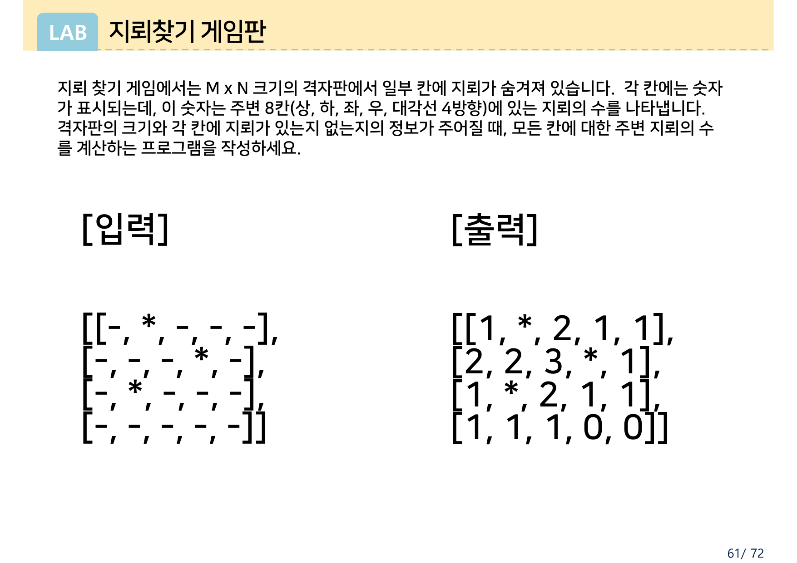
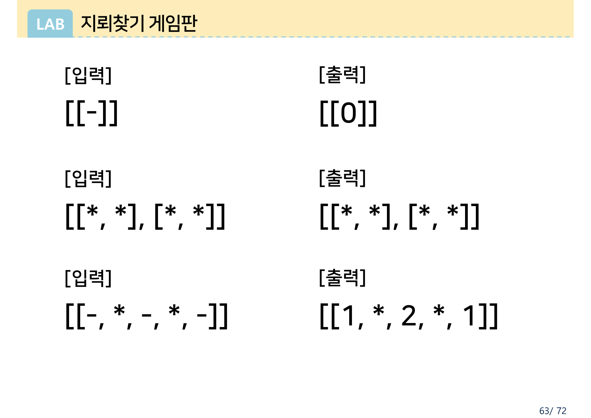

> [!abstract] 이 과제가 실제로 하는 말
> 원본 `과제 02_지뢰찾기-1.pdf`는 네 쪽뿐이고 그중 두 쪽은 같은 예제의 표기만 바꾼 것이다. 남는 것은 문제 정의 한 문단과 **예제 다섯 개**다. 코드도, 힌트도, 해설도 없다.
>
> 그 다섯 예제가 이 과제의 내용 전부다. 8방향을 세는 일 자체는 세 줄이면 끝나기 때문이다 — 어려운 것은 세는 일이 아니라 **격자 밖을 읽지 않는 일**이고, 파이썬에서 그것이 특히 위험하다. 다른 언어에서 배열 밖 접근은 대개 프로그램을 멈추게 하지만, **파이썬의 음수 인덱스는 조용히 반대편 끝을 읽는다.** 틀린 코드가 예외도 내지 않고 그럴듯한 숫자를 낸다.
>
> 이 문서가 실측으로 보이는 사실이 하나 있다. 원본 1쪽의 가장 큰 예제(5×4)는 **가장 흔한 경계 버그를 잡지 못한다.** 그 버그를 잡는 것은 3쪽에 모아 둔 작디작은 예제 셋이다. 교수가 3쪽을 왜 따로 만들었는지가 거기서 드러난다.
>
> 슬라이드 오른쪽 아래의 쪽 번호가 `62/72`, `63/72`, `64/72`다. 이 네 쪽은 72쪽짜리 「Chapter 07\_리스트, 튜플, 딕셔너리」 강의에서 떼어 온 조각이다.

---

## 규칙은 한 문단, 예제는 다섯 개



> 지뢰 찾기 게임에서는 M x N 크기의 격자판에서 일부 칸에 지뢰가 숨겨져 있습니다. 각 칸에는 숫자가 표시되는데, 이 숫자는 **주변 8칸(상, 하, 좌, 우, 대각선 4방향)**에 있는 지뢰의 수를 나타냅니다.

규칙에서 뽑을 것은 두 가지뿐이다.

1. **지뢰가 아닌 칸**에만 숫자를 쓴다. 지뢰 칸은 `*` 그대로 둔다.
2. 그 숫자는 **주변 8칸**의 지뢰 수다. 자기 자신은 세지 않는다.

8방향은 행 방향 $\{-1, 0, +1\}$과 열 방향 $\{-1, 0, +1\}$의 아홉 조합에서 자기 자신 $(0,0)$을 뺀 것이다.

```mermaid
graph TB
  subgraph 이웃["(i, j)의 주변 8칸"]
    NW["(i−1, j−1)"] --- N["(i−1, j)"] --- NE["(i−1, j+1)"]
    W["(i, j−1)"] --- C["(i, j)<br/>자기 자신 — 세지 않는다"] --- E["(i, j+1)"]
    SW["(i+1, j−1)"] --- S["(i+1, j)"] --- SE["(i+1, j+1)"]
  end
  style C fill:var(--muted),stroke:var(--chart-4),color:var(--foreground)
  style NW fill:var(--card),stroke:var(--chart-1),color:var(--foreground)
  style N  fill:var(--card),stroke:var(--chart-1),color:var(--foreground)
  style NE fill:var(--card),stroke:var(--chart-1),color:var(--foreground)
  style W  fill:var(--card),stroke:var(--chart-1),color:var(--foreground)
  style E  fill:var(--card),stroke:var(--chart-1),color:var(--foreground)
  style SW fill:var(--card),stroke:var(--chart-1),color:var(--foreground)
  style S  fill:var(--card),stroke:var(--chart-1),color:var(--foreground)
  style SE fill:var(--card),stroke:var(--chart-1),color:var(--foreground)
```

원본 1쪽의 예제를 그대로 옮기면 이렇다.

```text
[입력]                    [출력]
[[-, *, -, -, -],        [[1, *, 2, 1, 1],
 [-, -, -, *, -],         [2, 2, 3, *, 1],
 [-, *, -, -, -],         [1, *, 2, 1, 1],
 [-, -, -, -, -]]         [1, 1, 1, 0, 0]]
```

16개의 숫자 칸을 하나씩 세어 원본과 대조했고 **전부 일치한다**. 2쪽은 같은 예제를 격자 표로 다시 그린 것으로 값이 동일하다.

아래에서 칸을 눌러 지뢰를 놓고 지울 수 있다. 원본의 다섯 예제는 버튼으로 불러온다.

```html preview h=620px
<div style="font-family:system-ui,-apple-system,sans-serif;padding:20px;color:var(--foreground)">
  <div style="font-size:13px;font-weight:600;margin-bottom:8px">원본이 준 다섯 예제</div>
  <div id="presets" style="display:flex;gap:7px;flex-wrap:wrap;margin-bottom:18px"></div>

  <div style="display:flex;gap:26px;flex-wrap:wrap;align-items:flex-start">
    <div>
      <div style="font-size:12px;font-weight:700;opacity:.8;margin-bottom:8px">[입력] — 칸을 눌러 지뢰를 놓거나 지운다</div>
      <div id="gin"></div>
    </div>
    <div>
      <div style="font-size:12px;font-weight:700;opacity:.8;margin-bottom:8px">[출력] — 주변 8칸의 지뢰 수</div>
      <div id="gout"></div>
    </div>
  </div>

  <div id="match" style="margin-top:18px;padding:11px;border:1px solid var(--border);border-radius:8px;background:var(--card);font-size:13px;text-align:center"></div>
</div>
<script>
(function(){
  var PRESETS=[
    {name:'1쪽 · 5×4',   rows:['-*---','---*-','-*---','-----'], want:['1*211','223*1','1*211','11100']},
    {name:'3쪽 · 1×1',   rows:['-'],                             want:['0']},
    {name:'3쪽 · 2×2 전부 지뢰', rows:['**','**'],               want:['**','**']},
    {name:'3쪽 · 1×5',   rows:['-*-*-'],                         want:['1*2*1']},
    {name:'4쪽 · 4×4',   rows:['*---','--*-','----','*--*'],     want:['*211','12*1','1222','*11*']}
  ];
  var cur=0, board=null;
  var GI=document.getElementById('gin'),GO=document.getElementById('gout'),
      PB=document.getElementById('presets'),MT=document.getElementById('match');

  function solve(b){
    var M=b.length,N=b[0].length,out=[];
    for(var i=0;i<M;i++){ var row=[];
      for(var j=0;j<N;j++){
        if(b[i][j]==='*'){row.push('*');continue;}
        var c=0;
        for(var di=-1;di<=1;di++) for(var dj=-1;dj<=1;dj++){
          if(di===0&&dj===0) continue;
          var ni=i+di,nj=j+dj;
          if(ni<0||ni>=M||nj<0||nj>=N) continue;   // 네 방향 모두 막는다
          if(b[ni][nj]==='*') c++;
        }
        row.push(String(c));
      } out.push(row);
    } return out;
  }
  function cell(txt,kind,onclick){
    var d=document.createElement('div');
    var bg='var(--card)', fg='var(--foreground)', bd='var(--border)';
    if(kind==='mine'){ bg='var(--chart-4)'; fg='var(--card)'; bd='var(--chart-4)'; }
    else if(kind==='zero'){ fg='var(--muted-foreground,var(--foreground))'; }
    else if(kind==='num'){ bd='var(--chart-1)'; fg='var(--chart-1)'; }
    d.style.cssText='width:44px;height:44px;display:inline-flex;align-items:center;justify-content:center;'
      +'margin:2px;border-radius:6px;font-size:19px;font-weight:700;font-family:ui-monospace,Menlo,monospace;'
      +'border:1px solid '+bd+';background:'+bg+';color:'+fg+';'
      +(kind==='zero'?'opacity:.45;':'')+(onclick?'cursor:pointer;':'');
    d.textContent=txt;
    if(onclick) d.addEventListener('click',onclick);
    return d;
  }
  function render(){
    GI.innerHTML=''; GO.innerHTML='';
    var out=solve(board);
    board.forEach(function(r,i){
      var ri=document.createElement('div'), ro=document.createElement('div');
      ri.style.whiteSpace='nowrap'; ro.style.whiteSpace='nowrap';
      r.forEach(function(v,j){
        ri.appendChild(cell(v, v==='*'?'mine':'plain', function(){
          board[i][j] = (board[i][j]==='*') ? '-' : '*'; render();
        }));
        var o=out[i][j];
        ro.appendChild(cell(o, o==='*'?'mine':(o==='0'?'zero':'num'), null));
      });
      GI.appendChild(ri); GO.appendChild(ro);
    });
    var got=out.map(function(r){return r.join('');}).join('|');
    var want=PRESETS[cur].want.join('|');
    var pristine=(board.map(function(r){return r.join('');}).join('|')===PRESETS[cur].rows.join('|'));
    MT.innerHTML = pristine
      ? (got===want
          ? '<b style="color:var(--chart-2)">원본 '+PRESETS[cur].name+' 의 [출력]과 일치</b>'
          : '<b style="color:var(--chart-4)">원본 기대값과 불일치</b>')
      : '<span style="opacity:.75">직접 편집한 판이다. 원본 예제로 되돌리려면 위 버튼을 누른다.</span>';
  }
  PRESETS.forEach(function(p,k){
    var b=document.createElement('button');
    b.textContent=p.name;
    b.style.cssText='padding:8px 13px;border-radius:6px;border:1px solid var(--border);'
      +'background:var(--card);color:var(--foreground);cursor:pointer;font-size:12.5px';
    b.addEventListener('click',function(){
      cur=k; board=p.rows.map(function(r){return r.split('');});
      Array.prototype.forEach.call(PB.children,function(x,q){
        x.style.borderColor=(q===k)?'var(--chart-1)':'var(--border)';
        x.style.fontWeight=(q===k)?'700':'400';
      });
      render();
    });
    PB.appendChild(b);
  });
  PB.children[0].click();
})();
</script>
```

---

## 세는 일은 세 줄로 끝난다

```python
def solution(board):
    M, N = len(board), len(board[0])
    out = []
    for i in range(M):
        row = []
        for j in range(N):
            if board[i][j] == '*':
                row.append('*')
                continue
            cnt = 0
            for di in (-1, 0, 1):
                for dj in (-1, 0, 1):
                    if di == 0 and dj == 0:
                        continue
                    ni, nj = i + di, j + dj
                    if 0 <= ni < M and 0 <= nj < N:      # ← 이 한 줄이 전부다
                        cnt += (board[ni][nj] == '*')
            row.append(str(cnt))
        out.append(row)
    return out
```

스물세 줄 중 실질적으로 판단이 들어간 곳은 **`if 0 <= ni < M and 0 <= nj < N`** 한 줄뿐이다. 나머지는 규칙을 그대로 옮겨 적은 것이다. 그러니 이 과제는 사실상 그 한 줄을 쓰는 과제다.

그런데 그 한 줄은 네 개의 조건을 담고 있고, 흔히 그중 절반을 빠뜨린다.

| 빠뜨린 조건 | 파이썬이 하는 일 |
| --- | --- |
| `ni < M` (행 위쪽 한계) | `IndexError` — 프로그램이 멈춘다. **바로 발견된다** |
| `nj < N` (열 오른쪽 한계) | `IndexError` — 마찬가지 |
| `0 <= ni` (행 아래쪽 한계) | 오류 없음. `board[-1]`이 **마지막 행**을 읽는다 |
| `0 <= nj` (열 왼쪽 한계) | 오류 없음. `row[-1]`이 **마지막 열**을 읽는다 |

위 둘과 아래 둘의 운명이 다르다. **넘치는 쪽은 시끄럽게 죽고, 모자라는 쪽은 조용히 틀린다.** 파이썬의 음수 인덱스가 격자를 도넛처럼 감아 버리기 때문이다.

---

## 큰 예제가 놓치고 작은 예제가 잡는다

여기서 이 과제 자료의 구조가 설명된다. 상한만 검사하고 하한을 빠뜨린 코드를 원본의 다섯 예제에 각각 돌려 보았다.

```python
if ni < M and nj < N:      # 음수를 막지 않았다
```

| 원본 예제 | 올바른 답 | 하한을 빠뜨린 코드 | 잡히는가 |
| --- | --- | --- | --- |
| 1쪽 · 5×4 | `1*211 / 223*1 / 1*211 / 11100` | `1*211 / 223*1 / 1*211 / 11100` | **못 잡는다** |
| 3쪽 · 1×1 `[[-]]` | `0` | `0` | 못 잡는다 |
| 3쪽 · 2×2 전부 지뢰 | `** / **` | `** / **` | 못 잡는다 |
| **3쪽 · 1×5** | `1*2*1` | **`2*4*2`** | **잡는다** |
| **4쪽 · 4×4** | `*211 / 12*1 / 1222 / *11*` | **`*322 / 12*1 / 2222 / *11*`** | **잡는다** |

가장 크고 그럴듯한 1쪽의 5×4 예제가 **버그를 그대로 통과시킨다.** 우연이 아니라 그 판의 생김새 때문이다. 마지막 행(`-----`)과 마지막 열(`-`, `-`, `-`, `-`)에 지뢰가 하나도 없어서, 음수 인덱스가 감아 읽어도 세어질 지뢰가 없다.

반면 3쪽의 1×5 예제 `[[-, *, -, *, -]]`에서는 판이 **행이 하나뿐**이다. 행 인덱스 −1이 곧 그 유일한 행 자신이므로 좌우 이웃이 두 번씩 세어진다. 그래서 `1*2*1`이어야 할 답이 정확히 두 배인 `2*4*2`가 된다.



4쪽의 4×4 예제는 다른 각도로 잡는다. 네 귀퉁이 중 셋에 지뢰가 있어서 감아 읽으면 반대편 귀퉁이의 지뢰가 세어진다. 예를 들어 `(0,1)` 칸은 정답이 2인데 3이 나온다 — 행 −1이 마지막 행 `*--*`을 가리켜 `(3,0)`의 지뢰가 하나 더 붙는다.


> [!important] 3쪽과 4쪽이 왜 따로 있는가
> 원본 3쪽은 예제를 **셋** 모아 두었고 셋 다 극단적으로 작다 — 1×1, 2×2, 1×5. 1쪽의 5×4 예제로 충분해 보이는데도 굳이 이런 판을 따로 실은 이유가 위 표에 있다. **일반적인 판은 경계 버그를 숨긴다.** 격자가 크고 가장자리가 비어 있으면 잘못된 코드도 맞는 답을 낸다.
>
> 이 세 판은 각각 다른 것을 시험한다.
>
> - **1×1** — 여덟 방향이 모두 밖이다. 이웃이 하나도 없는 경우에 0이 나오는가
> - **2×2 전부 지뢰** — 숫자 칸이 하나도 없다. 지뢰 칸을 건너뛰는가 (`continue`가 없으면 `*` 자리에 숫자가 찍힌다)
> - **1×5** — 위아래가 전부 밖이다. 음수 행 인덱스를 막았는가
>
> 아래 비교기에서 세 판을 각각 세 가지 코드에 돌려 볼 수 있다.

---

## 세 가지 방어, 그리고 세 번째의 함정

경계를 막는 방법은 셋이 있고, 셋째가 특히 위험하다.

**하나 · 범위 검사.** 위에 쓴 방식이다. 네 조건을 모두 적으면 정확하고, 읽는 사람이 무엇을 막았는지 바로 안다.

**둘 · 패딩.** 격자 둘레에 지뢰 아닌 칸을 한 줄 두른 뒤 안쪽만 훑는다. 경계 검사가 아예 사라진다.

```python
def solution(board):
    M, N = len(board), len(board[0])
    pad = [['-'] * (N + 2)] + [['-'] + r + ['-'] for r in board] + [['-'] * (N + 2)]
    out = []
    for i in range(1, M + 1):
        row = []
        for j in range(1, N + 1):
            if pad[i][j] == '*':
                row.append('*')
                continue
            row.append(str(sum(pad[i+di][j+dj] == '*'
                               for di in (-1,0,1) for dj in (-1,0,1)) ))
        out.append(row)
    return out
```

패딩을 쓰면 `di == 0 and dj == 0`을 빼는 일조차 필요 없어진다 — 자기 자신이 지뢰면 어차피 `continue`로 빠져나가므로, 아홉 칸을 다 세어도 자기 칸은 지뢰가 아니라 0을 더한다.

**셋 · 슬라이스.** 가장 짧아 보이는 방법이고, 가장 조용히 틀린다.

```python
cnt = sum(r[j-1:j+2].count('*') for r in board[i-1:i+2])   # 위험
```

$i = 0$일 때 `board[-1:2]`가 된다. 파이썬은 이것을 "마지막에서 하나 전부터 인덱스 2까지"로 읽고, 4행짜리 판이면 시작이 3이 되어 **빈 리스트**를 내놓는다. 예외도 경고도 없다. 결과는 첫 행과 첫 열이 통째로 0이 되는 것이다.

원본 1쪽 예제에 이 코드를 돌리면 이렇게 나온다.

```text
정답        슬라이스 코드
1*211       0*000     ← 첫 행이 전부 0
223*1       023*1     ← 첫 열이 0
1*211       0*211
11100       01100
```

슬라이스를 쓰려면 시작을 손으로 걷어 올려야 한다.

```python
cnt = sum(r[max(0, j-1):j+2].count('*') for r in board[max(0, i-1):i+2])
```

끝 쪽은 걷어 올릴 필요가 없다. **슬라이스는 상한을 넘겨도 조용히 잘라 주기 때문**이다 — `[0:99]`는 오류가 아니라 있는 데까지 준다. 인덱스와 슬라이스가 정확히 반대로 행동한다는 점이 이 과제에서 가장 헷갈리는 대목이다.

| | 상한을 넘길 때 | 하한을 넘길 때 |
| --- | --- | --- |
| **인덱스** `a[k]` | `IndexError` — 멈춘다 | 감아서 반대편을 읽는다 |
| **슬라이스** `a[p:q]` | 알아서 잘라 준다 | 감아서 엉뚱한 구간을 잡는다 |

```html preview h=600px
<div style="font-family:system-ui,-apple-system,sans-serif;padding:20px;color:var(--foreground)">
  <div style="font-size:13px;font-weight:600;margin-bottom:8px">원본 예제를 세 가지 코드에 각각 돌려 본다</div>
  <div id="p3" style="display:flex;gap:7px;flex-wrap:wrap;margin-bottom:18px"></div>

  <div style="display:flex;gap:16px;flex-wrap:wrap">
    <div style="flex:1;min-width:190px;border:1px solid var(--chart-2);border-radius:8px;padding:13px;background:var(--card)">
      <div style="font-weight:700;color:var(--chart-2);font-size:13px">네 조건 모두</div>
      <div style="font-size:10.5px;opacity:.7;font-family:ui-monospace,Menlo,monospace;margin:4px 0 10px">0&lt;=ni&lt;M and 0&lt;=nj&lt;N</div>
      <pre id="o_ok" style="margin:0;font-family:ui-monospace,Menlo,monospace;font-size:15px;line-height:1.5;letter-spacing:2px"></pre>
      <div id="v_ok" style="font-size:11.5px;margin-top:9px"></div>
    </div>
    <div style="flex:1;min-width:190px;border:1px solid var(--chart-4);border-radius:8px;padding:13px;background:var(--card)">
      <div style="font-weight:700;color:var(--chart-4);font-size:13px">하한을 빠뜨림</div>
      <div style="font-size:10.5px;opacity:.7;font-family:ui-monospace,Menlo,monospace;margin:4px 0 10px">ni&lt;M and nj&lt;N</div>
      <pre id="o_up" style="margin:0;font-family:ui-monospace,Menlo,monospace;font-size:15px;line-height:1.5;letter-spacing:2px"></pre>
      <div id="v_up" style="font-size:11.5px;margin-top:9px"></div>
    </div>
    <div style="flex:1;min-width:190px;border:1px solid var(--chart-4);border-radius:8px;padding:13px;background:var(--card)">
      <div style="font-weight:700;color:var(--chart-4);font-size:13px">슬라이스, 클램프 없음</div>
      <div style="font-size:10.5px;opacity:.7;font-family:ui-monospace,Menlo,monospace;margin:4px 0 10px">board[i-1:i+2]</div>
      <pre id="o_sl" style="margin:0;font-family:ui-monospace,Menlo,monospace;font-size:15px;line-height:1.5;letter-spacing:2px"></pre>
      <div id="v_sl" style="font-size:11.5px;margin-top:9px"></div>
    </div>
  </div>

  <div id="note3" style="margin-top:16px;padding:11px;border:1px solid var(--border);border-radius:8px;background:var(--card);font-size:12.5px;line-height:1.7"></div>
</div>
<script>
(function(){
  var CASES=[
    {name:'1쪽 · 5×4', rows:['-*---','---*-','-*---','-----'], want:['1*211','223*1','1*211','11100'],
     note:'가장 큰 예제인데 <b>세 코드가 모두 통과</b>하지는 않는다 — 슬라이스만 걸린다. 마지막 행과 마지막 열에 지뢰가 없어, 음수 인덱스가 감아 읽어도 셀 지뢰가 없기 때문이다.'},
    {name:'3쪽 · 1×1', rows:['-'], want:['0'],
     note:'여덟 방향이 전부 밖이다. 이웃이 하나도 없을 때 0이 나오는지만 본다. 세 코드 모두 통과한다.'},
    {name:'3쪽 · 2×2 전부 지뢰', rows:['**','**'], want:['**','**'],
     note:'숫자 칸이 하나도 없는 유일한 예제다. 지뢰 칸을 건너뛰지 않는 코드라면 여기서 <code>*</code> 자리에 숫자가 찍힌다.'},
    {name:'3쪽 · 1×5', rows:['-*-*-'], want:['1*2*1'],
     note:'행이 하나뿐이라 행 인덱스 −1이 <b>그 행 자신</b>을 가리킨다. 좌우 이웃이 두 번씩 세어져 답이 정확히 두 배가 된다.'},
    {name:'4쪽 · 4×4', rows:['*---','--*-','----','*--*'], want:['*211','12*1','1222','*11*'],
     note:'네 귀퉁이 중 셋에 지뢰가 있다. 감아 읽으면 반대편 귀퉁이의 지뢰가 붙어 (0,1)이 2가 아니라 3이 된다.'}
  ];
  function solve(b,mode){
    var M=b.length,N=b[0].length,out=[];
    for(var i=0;i<M;i++){var row=[];
      for(var j=0;j<N;j++){
        if(b[i][j]==='*'){row.push('*');continue;}
        var c=0;
        if(mode==='sl'){
          var r0=i-1, r1=i+2, c0=j-1, c1=j+2;
          // 파이썬 슬라이스의 음수 시작을 그대로 흉내낸다
          var rs = pySlice(b, r0, r1);
          for(var t=0;t<rs.length;t++){
            var cs = pySlice(rs[t], c0, c1);
            for(var u=0;u<cs.length;u++) if(cs[u]==='*') c++;
          }
          if(b[i][j]!=='*'){/* 자기 자신은 지뢰가 아니므로 더해지지 않는다 */}
        } else {
          for(var di=-1;di<=1;di++) for(var dj=-1;dj<=1;dj++){
            if(di===0&&dj===0) continue;
            var ni=i+di,nj=j+dj;
            if(mode==='ok'){ if(ni<0||ni>=M||nj<0||nj>=N) continue; }
            else { if(ni>=M||nj>=N) continue;
                   if(ni<0) ni=M+ni; if(nj<0) nj=N+nj; }   // 파이썬 음수 인덱스
            if(b[ni][nj]==='*') c++;
          }
        }
        row.push(String(c));
      } out.push(row);
    } return out;
  }
  function pySlice(a,p,q){                       // 음수 시작을 길이 기준으로 되돌린다
    var n=a.length, s=(p<0? n+p : p), e=(q<0? n+q : q);
    if(s<0) s=0; if(e>n) e=n; if(e<s) e=s;
    return a.slice(s,e);
  }
  var PB=document.getElementById('p3'),NT=document.getElementById('note3');
  function show(k){
    var c=CASES[k], b=c.rows.map(function(r){return r.split('');});
    [['ok','o_ok','v_ok'],['up','o_up','v_up'],['sl','o_sl','v_sl']].forEach(function(t){
      var res=solve(b,t[0]).map(function(r){return r.join('');});
      document.getElementById(t[1]).textContent=res.join('\n');
      var ok=(res.join('|')===c.want.join('|'));
      document.getElementById(t[2]).innerHTML= ok
        ? '<b style="color:var(--chart-2)">원본 [출력]과 일치</b>'
        : '<b style="color:var(--chart-4)">불일치 — 기대 '+c.want.join(' / ')+'</b>';
    });
    NT.innerHTML=c.note;
    Array.prototype.forEach.call(PB.children,function(x,q){
      x.style.borderColor=(q===k)?'var(--chart-1)':'var(--border)';
      x.style.fontWeight=(q===k)?'700':'400';
    });
  }
  CASES.forEach(function(c,k){
    var b=document.createElement('button'); b.textContent=c.name;
    b.style.cssText='padding:8px 13px;border-radius:6px;border:1px solid var(--border);'
      +'background:var(--card);color:var(--foreground);cursor:pointer;font-size:12.5px';
    b.addEventListener('click',function(){show(k);}); PB.appendChild(b);
  });
  show(3);
})();
</script>
```

---

## 원본에서 발견한 것

> [!note] 1쪽과 2쪽은 같은 예제다
> 2쪽은 1쪽의 5×4 예제를 격자 표로 다시 그린 것이고 값은 동일하다. PDF에서 텍스트를 뽑으면 표 이미지 위에 리스트 표기의 텍스트 레이어가 겹쳐 있어 두 표기가 뒤엉켜 나오지만, 슬라이드를 그림으로 확인하면 `1*211 / 223*1 / 1*211 / 11100` 으로 1쪽과 정확히 같다. **추출 텍스트만 믿으면 두 쪽이 서로 다른 답을 준 것처럼 보인다.**

<!-- -->
> [!note] 출력 표기가 예제마다 흔들린다
> 1·3·4쪽은 `[[1, *, 2, 1, 1], ...]` 처럼 파이썬 리스트 표기를 쓰는데, 2쪽만 격자 표다. 그리고 `-`(빈 칸)와 `*`(지뢰)는 문자인데 결과의 숫자는 표기상 정수로 적혀 있다 — `[1, *, 2, 1, 1]`처럼 한 리스트 안에 정수와 문자가 섞인다. 실제로 구현할 때 결과를 `str`로 통일할지 혼합 리스트로 둘지는 원본이 정해 주지 않는다.

<!-- -->
> [!note] 입력 형식이 명시되지 않았다
> 문제 설명은 `격자판의 크기와 각 칸에 지뢰가 있는지 없는지의 정보가 주어질 때`라고만 적는다. M과 N을 따로 받는지, 2차원 리스트 하나로 받는지, 표준 입력인지 함수 인자인지가 정해져 있지 않다. 예제가 전부 2차원 리스트 꼴이라 그것이 사실상의 명세다.

---

## 정리 — 이 과제에서 가져갈 것

> [!tip] 세 문장 요약
>
> 1. **8방향을 세는 것은 세 줄이고, 이 과제의 전부는 경계 한 줄이다.** `0 <= ni < M and 0 <= nj < N`이 담은 네 조건 중 상한 둘은 빠뜨리면 `IndexError`로 즉시 드러나고, 하한 둘은 빠뜨려도 파이썬이 격자를 감아 읽어 **조용히 다른 답**을 낸다.
> 2. **인덱스와 슬라이스는 정확히 반대로 행동한다.** 인덱스는 상한을 넘기면 죽고 하한을 넘기면 감는다. 슬라이스는 상한을 넘겨도 알아서 잘라 주고 하한을 넘기면 감는다. 그래서 `board[i-1:i+2]`는 `max(0, i-1)`이 필요하고 `i+2`는 필요 없다.
> 3. **원본 3쪽이 이 과제의 채점 기준이다.** 1쪽의 큰 예제는 하한 누락 버그를 통과시킨다 — 마지막 행과 열이 비어 있어서다. 1×1·전부 지뢰인 2×2·행이 하나뿐인 1×5, 이 셋이 각각 "이웃 없음"·"숫자 칸 없음"·"음수 행 인덱스"를 겨냥한다.

다음 문서는 이 과목의 마지막 자료인 23-2 중간고사를 다룬다. 지금까지의 스물한 문제가 모두 값을 **돌려주는** 함수였다면, 시험 여덟 문항은 전부 화면과 **대화하는** 프로그램이다. [04. 중간고사](./04.%20%EC%A4%91%EA%B0%84%EA%B3%A0%EC%82%AC%20%E2%80%94%20return%EC%9D%B4%20%EC%82%AC%EB%9D%BC%EC%A7%84%20%EC%9E%90%EB%A6%AC%EC%97%90%20%EC%88%9C%EC%84%9C%EB%8F%84%EA%B0%80%20%EB%93%A4%EC%96%B4%EC%98%A8%EB%8B%A4.md)

---

### 근거 자료

이 문서는 강의 원본 `과제 02_지뢰찾기-1.pdf`(4쪽)에 근거한다. 인용한 슬라이드는 1쪽(문제 정의와 5×4 예제), 3쪽(1×1·2×2·1×5 세 예제), 4쪽(4×4 예제)이다. 2쪽은 1쪽과 같은 예제를 격자 표로 다시 그린 것이라 따로 인용하지 않았다.

원본이 준 다섯 예제의 출력을 전부 파이썬으로 계산해 슬라이드 값과 대조했고 **다섯 모두 일치**했다. 본문의 비교표에 실린 "하한을 빠뜨린 코드"와 "슬라이스 코드"의 결과 역시 같은 다섯 예제에 실제로 돌려 얻은 값이다 — 1×5에서 `2*4*2`, 4×4에서 `*322 / 12*1 / 2222 / *11*`, 5×4 슬라이스에서 `0*000 / 023*1 / 0*211 / 01100`.

원본에 없는 보충은 세 가지이며 본문에 그 사실을 밝혔다 — 패딩 방식과 슬라이스 방식의 코드, 인덱스와 슬라이스의 경계 동작 대조표, 그리고 "1쪽 예제가 하한 누락을 잡지 못한다"는 실측 결과다.
