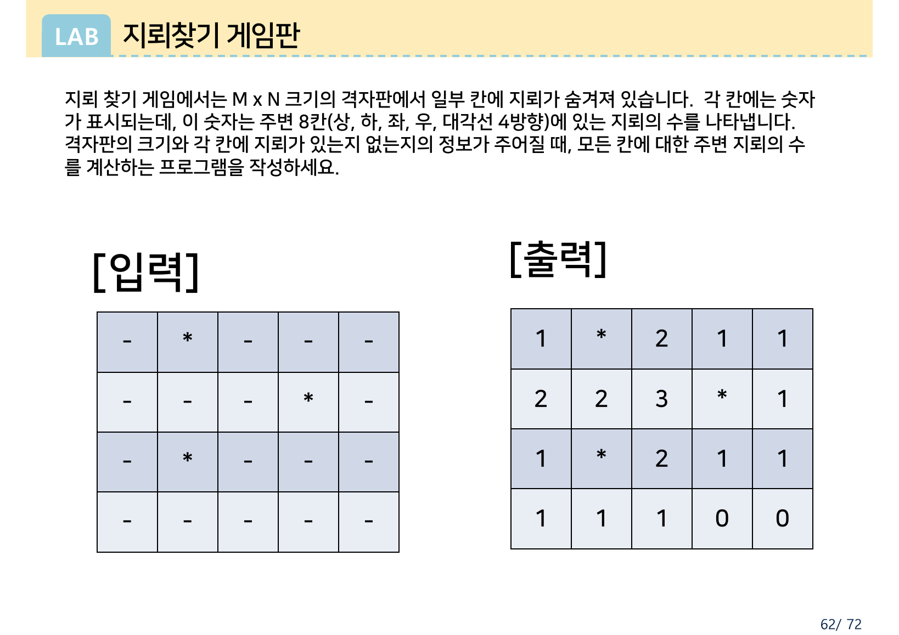
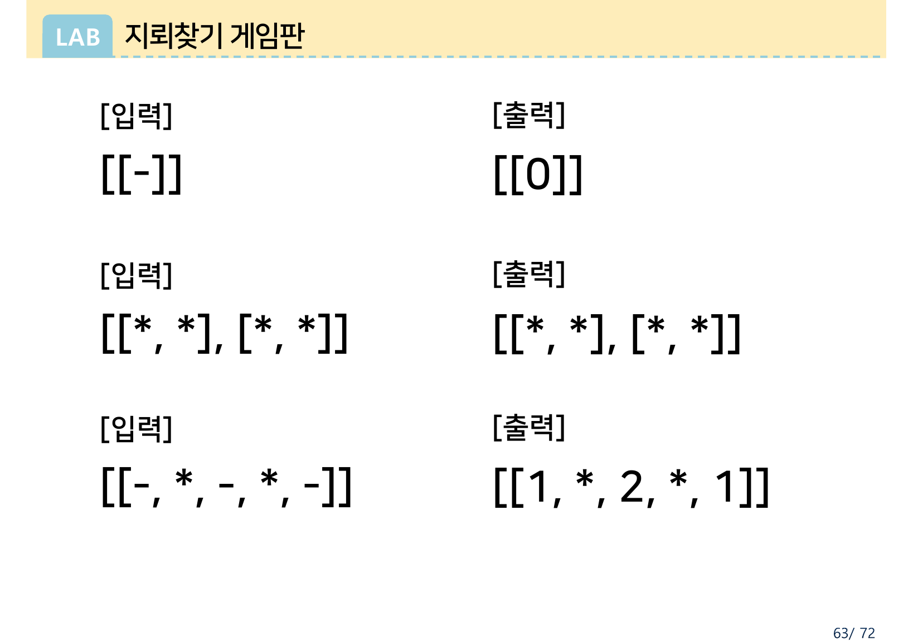
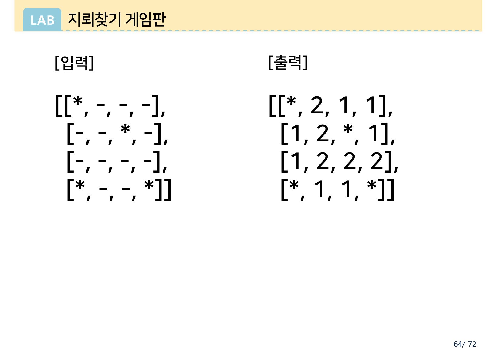
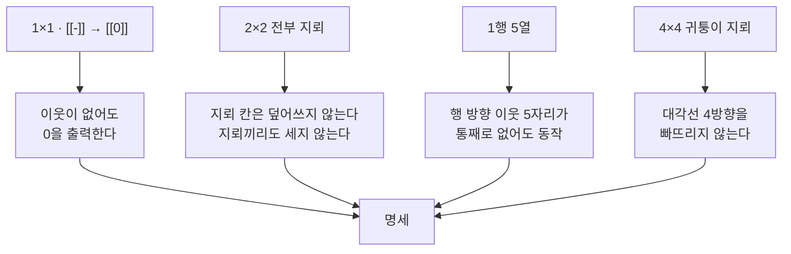
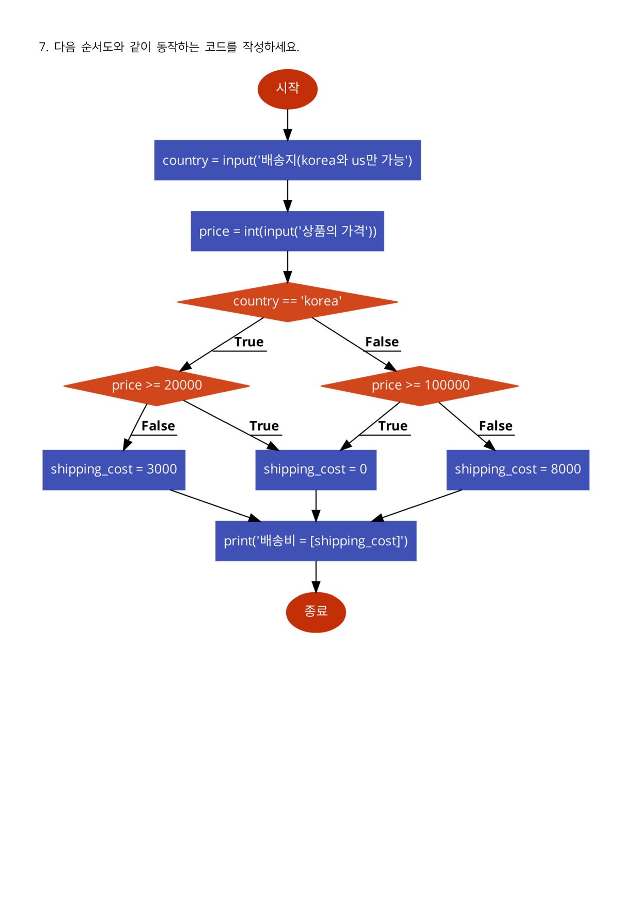
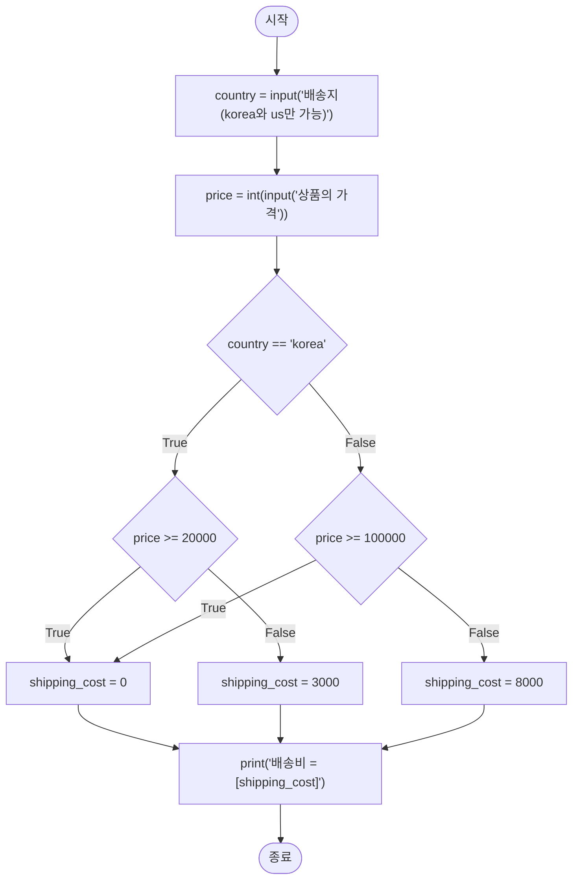
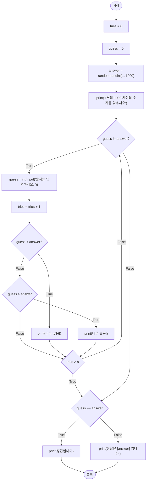

> [!abstract] 두 자료를 함께 읽는 이유
> 이 두 PDF는 성격이 전혀 다르다. 하나는 교재의 LAB 과제이고 하나는 시험지다. 그런데 **명세를 전달하는 방식**이 같다 — 둘 다 결정적인 대목에서 **글을 쓰지 않는다.**
>
> 지뢰찾기는 문제 설명이 네 줄이고 나머지 세 쪽은 전부 **입력/출력 격자 그림**이다. 중간고사 7번과 8번은 문장이 *“다음 순서도와 같이 동작하는 코드를 작성하세요”* 한 줄뿐이고, 나머지는 통째로 **순서도 그림**이다.
>
> 명세가 그림일 때 두 가지 일이 벌어진다. 좋은 쪽은, 예시가 곧 테스트 케이스가 되어 **경계 조건이 눈에 보이게** 된다는 것이다. 나쁜 쪽은, 그림이 말하지 않은 것은 **아무도 검증하지 않는다**는 것이다. 이 정리문서의 마지막 절은 그 나쁜 쪽의 사례다 — 8번 순서도가 요구하는 게임은 **이길 수 없게 설계되어 있다.**

---

## 1. 지뢰찾기 — 네 줄의 설명과 네 개의 격자

원본 1쪽의 설명은 이것이 전부다.

> 지뢰 찾기 게임에서는 M x N 크기의 격자판에서 일부 칸에 지뢰가 숨겨져 있습니다. 각 칸에는 숫자가 표시되는데, 이 숫자는 주변 8칸(상, 하, 좌, 우, 대각선 4방향)에 있는 지뢰의 수를 나타냅니다. 격자판의 크기와 각 칸에 지뢰가 있는지 없는지의 정보가 주어질 때, 모든 칸에 대한 주변 지뢰의 수를 계산하는 프로그램을 작성하세요.

읽고 나면 대뜸 정해지지 않는 것들이 남는다. **지뢰 칸에는 무엇을 쓰는가?** 격자 밖은 어떻게 세는가? 지뢰가 하나도 없으면? 전부 지뢰면? 설명은 답하지 않는다. 대신 원본은 남은 세 쪽에 **격자 네 개**를 늘어놓는다. 그 네 개가 답이다.



> 원본 2쪽. 1쪽이 같은 예제를 대괄호 리스트로 적었다면, 2쪽은 **같은 예제를 격자 표로** 다시 그렸다. 리스트와 격자, 두 표현을 나란히 놓은 것이 이 과제의 유일한 “설명”이다.

### 원본 예제를 손으로 검산하면

지뢰는 (0,1), (1,3), (2,1) 세 곳이다. 각 칸에서 주변 8칸의 지뢰를 세면

| 행 | 계산 | 결과 |
| --- | --- | --- |
| 0 | (0,0)은 (0,1) 하나 → 1 · (0,2)는 (0,1)·(1,3) → 2 · (0,3)은 (1,3) → 1 · (0,4)는 (1,3) → 1 | `1 * 2 1 1` |
| 1 | (1,0)은 (0,1)·(2,1) → 2 · (1,1)도 → 2 · (1,2)는 (0,1)·(1,3)·(2,1) → 3 · (1,4)는 (1,3) → 1 | `2 2 3 * 1` |
| 2 | (2,0)은 (2,1) → 1 · (2,2)는 (1,3)·(2,1) → 2 · (2,3)은 (1,3) → 1 · (2,4)는 (1,3) → 1 | `1 * 2 1 1` |
| 3 | (3,0)·(3,1)·(3,2)는 (2,1) → 각 1 · (3,3)·(3,4)는 이웃에 지뢰 없음 → 0 | `1 1 1 0 0` |

원본 1쪽·2쪽의 출력과 정확히 일치한다. 여기서 이미 두 가지가 정해진다 — **지뢰 칸에는 숫자가 아니라 `*`를 그대로 둔다**(출력 격자의 (0,1)이 `*`), 그리고 **격자 밖은 지뢰가 없는 것으로 센다**(모서리 칸의 값이 작아지는 이유).

### 나머지 세 격자가 각각 못 박는 것



> 원본 3쪽. 한 쪽에 테스트 케이스 세 개가 압축되어 있다. 이 셋은 예시가 아니라 **명세의 나머지 절반**이다.

| 원본 3쪽의 입력 | 출력 | 이 케이스가 정하는 것 |
| --- | --- | --- |
| `[[-]]` | `[[0]]` | 이웃이 하나도 없는 1×1 격자에서도 **빈칸에는 0을 쓴다** — 빈 문자열이나 `-`가 아니다 |
| `[[*, *], [*, *]]` | `[[*, *], [*, *]]` | 모든 칸이 지뢰면 **숫자가 하나도 나오지 않는다** — 지뢰 칸은 세지도, 세어지지도 않는다 |
| `[[-, *, -, *, -]]` | `[[1, *, 2, *, 1]]` | 1행짜리 격자 — **위아래 다섯 방향이 통째로 없는데도** 좌우만으로 정상 동작해야 한다 |



> 원본 4쪽. 4×4 격자에 지뢰가 **세 귀퉁이와 한복판**에 놓여 있다. 앞의 세 케이스가 “격자의 모양”을 시험했다면, 이 케이스는 “지뢰의 위치”를 시험한다.

원본 4쪽의 입력은 (0,0)·(1,2)·(3,0)·(3,3)에 지뢰가 있고, 출력은

```text
*  2  1  1
1  2  *  1
1  2  2  2
*  1  1  *
```

이 격자의 값을 전부 검산한 결과 원본과 일치했다. 특히 (2,3) = 2 가 확인 사항이다 — 이 칸은 대각선으로 (1,2)와 (3,3) **두 개**의 지뢰에 닿는다. 대각선을 빠뜨린 구현은 여기서 1이 나온다.

### 네 케이스를 직접 돌려 보기

격자를 클릭해 지뢰를 켜고 끌 수 있다. 위쪽 버튼은 원본 네 케이스를 그대로 불러오며, 계산 결과를 **원본에 인쇄된 출력과 대조해** 일치 여부를 표시한다.

```html preview h=620px
<div style="font-family:system-ui,-apple-system,sans-serif;padding:20px;color:var(--foreground)">
  <div id="mspresets" style="display:flex;gap:6px;flex-wrap:wrap;margin-bottom:14px"></div>

  <div style="display:flex;gap:26px;flex-wrap:wrap;align-items:flex-start">
    <div>
      <div style="font-size:12.5px;color:var(--muted-foreground);margin-bottom:6px">입력 — 칸을 눌러 지뢰를 켜고 끈다</div>
      <div id="msin"></div>
    </div>
    <div>
      <div style="font-size:12.5px;color:var(--muted-foreground);margin-bottom:6px">출력 — 주변 8칸의 지뢰 수</div>
      <div id="msout"></div>
    </div>
    <div style="min-width:150px">
      <div style="font-size:12.5px;color:var(--muted-foreground);margin-bottom:6px">선택한 칸이 보는 이웃</div>
      <div id="msnb"></div>
    </div>
  </div>

  <div id="msverdict" style="margin-top:16px;padding:11px 13px;background:var(--card);border:1px solid var(--border);border-radius:var(--radius);font-size:13px;line-height:1.75"></div>

  <script>
    var CASES = [
      { name: '원본 1·2쪽 · 4×5', g: [[0,1,0,0,0],[0,0,0,1,0],[0,1,0,0,0],[0,0,0,0,0]],
        want: [['1','*','2','1','1'],['2','2','3','*','1'],['1','*','2','1','1'],['1','1','1','0','0']] },
      { name: '원본 3쪽 · 1×1', g: [[0]], want: [['0']] },
      { name: '원본 3쪽 · 전부 지뢰', g: [[1,1],[1,1]], want: [['*','*'],['*','*']] },
      { name: '원본 3쪽 · 1행 5열', g: [[0,1,0,1,0]], want: [['1','*','2','*','1']] },
      { name: '원본 4쪽 · 4×4', g: [[1,0,0,0],[0,0,1,0],[0,0,0,0],[1,0,0,1]],
        want: [['*','2','1','1'],['1','2','*','1'],['1','2','2','2'],['*','1','1','*']] }
    ];
    var cur = 0, grid = null, sel = null;

    CASES.forEach(function (c, i) {
      var b = document.createElement('button');
      b.textContent = c.name;
      b.style.cssText = 'padding:6px 10px;font-size:12px;border:1px solid var(--border);border-radius:var(--radius);' +
        'background:var(--card);color:var(--foreground);cursor:pointer';
      b.onclick = function () { cur = i; grid = c.g.map(function (r) { return r.slice(); }); sel = null; draw(); };
      document.getElementById('mspresets').appendChild(b);
    });

    var D = [[-1,-1],[-1,0],[-1,1],[0,-1],[0,1],[1,-1],[1,0],[1,1]];
    function solve(g) {
      var R = g.length, C = g[0].length;
      return g.map(function (row, i) {
        return row.map(function (v, j) {
          if (v) return '*';
          var n = 0;
          D.forEach(function (d) {
            var y = i + d[0], x = j + d[1];
            if (y >= 0 && y < R && x >= 0 && x < C && g[y][x]) n++;
          });
          return String(n);
        });
      });
    }
    function cell(txt, bg, fg, extra) {
      return '<div ' + (extra || '') + ' style="width:38px;height:38px;display:flex;align-items:center;' +
        'justify-content:center;font-weight:700;font-size:15px;border:1px solid var(--border);' +
        'border-radius:4px;background:' + bg + ';color:' + fg + '">' + txt + '</div>';
    }
    function board(rows, id) {
      return '<div style="display:flex;flex-direction:column;gap:4px" id="' + id + '">' +
        rows.map(function (r) { return '<div style="display:flex;gap:4px">' + r.join('') + '</div>'; }).join('') + '</div>';
    }

    function draw() {
      var out = solve(grid);
      var R = grid.length, C = grid[0].length;

      var inRows = grid.map(function (row, i) {
        return row.map(function (v, j) {
          var isSel = sel && sel[0] === i && sel[1] === j;
          return cell(v ? '*' : '·', v ? 'var(--chart-5)' : 'var(--card)',
            v ? 'var(--background)' : 'var(--muted-foreground)',
            'data-i="' + i + '" data-j="' + j + '" class="mscell"' +
            (isSel ? ' data-sel="1"' : ''));
        });
      });
      document.getElementById('msin').innerHTML = board(inRows, 'msinb');

      var outRows = out.map(function (row, i) {
        return row.map(function (v, j) {
          var mine = v === '*';
          return cell(v, mine ? 'var(--chart-5)' : (v === '0' ? 'var(--card)' : 'var(--chart-1)'),
            (mine || v !== '0') ? 'var(--background)' : 'var(--muted-foreground)');
        });
      });
      document.getElementById('msout').innerHTML = board(outRows, 'msoutb');

      if (sel) {
        var i = sel[0], j = sel[1], seen = [];
        D.forEach(function (d) {
          var y = i + d[0], x = j + d[1];
          if (y < 0 || y >= R || x < 0 || x >= C) seen.push(['격자 밖', 'var(--muted-foreground)']);
          else seen.push([(grid[y][x] ? '지뢰' : '빈칸') + ' (' + y + ',' + x + ')',
            grid[y][x] ? 'var(--chart-5)' : 'var(--muted-foreground)']);
        });
        document.getElementById('msnb').innerHTML =
          '<div style="font-size:12px;line-height:1.9">(' + i + ',' + j + ') 의 이웃 8자리<br/>' +
          seen.map(function (s) { return '<span style="color:' + s[1] + '">· ' + s[0] + '</span>'; }).join('<br/>') +
          '<br/><b>→ ' + out[i][j] + '</b></div>';
      } else {
        document.getElementById('msnb').innerHTML =
          '<div style="font-size:12px;color:var(--muted-foreground)">왼쪽 격자의 칸을 누르면<br/>그 칸이 보는 여덟 자리를 보여 준다.<br/>격자 밖은 “없는 것”으로 센다.</div>';
      }

      Array.prototype.forEach.call(document.querySelectorAll('.mscell'), function (el) {
        el.style.cursor = 'pointer';
        if (el.dataset.sel) el.style.outline = '2px solid var(--chart-2)';
        el.onclick = function (e) {
          var i = +el.dataset.i, j = +el.dataset.j;
          if (e.shiftKey) { sel = [i, j]; } else { grid[i][j] = grid[i][j] ? 0 : 1; sel = [i, j]; }
          draw();
        };
      });

      var want = CASES[cur].want, same = grid.length === want.length &&
        out.every(function (r, i) { return r.every(function (v, j) { return v === want[i][j]; }); });
      var mines = grid.reduce(function (a, r) { return a + r.reduce(function (x, y) { return x + y; }, 0); }, 0);
      document.getElementById('msverdict').innerHTML =
        '격자 ' + R + '×' + C + ' · 지뢰 ' + mines + '개 · ' +
        (same ? '<b style="color:var(--chart-1)">원본에 인쇄된 출력과 일치</b>'
              : '<span style="color:var(--muted-foreground)">원본 케이스에서 벗어난 격자 (직접 편집한 상태)</span>') +
        '<br/><span style="color:var(--muted-foreground)">칸을 누르면 지뢰가 토글되고, Shift+클릭하면 지뢰를 바꾸지 않고 그 칸의 이웃만 살펴본다.</span>';
    }

    grid = CASES[0].g.map(function (r) { return r.slice(); });
    draw();
  </script>
</div>
```

### 네 케이스가 만드는 명세

네 격자를 다 통과시키려면 구현이 다음 네 가지를 모두 갖춰야 한다. 문장으로는 어디에도 적혀 있지 않은 것들이다.



이것이 **예시가 명세를 대신하는** 방식이다. 잘 고른 네 개의 입력이 네 줄의 산문보다 정확하다.

---

## 2. 중간고사 — 여덟 문항이 요구하는 것

23-2 중간고사는 3쪽에 여덟 문항이다. 1쪽에 1–6번(글), 2쪽에 7번, 3쪽에 8번(각각 순서도 하나씩).

| # | 요구 | 이 문항의 핵심 |
| --- | --- | --- |
| 1 | 첫 글자와 끝 글자가 같은 문자열 세기 | 예시가 `['aba','xyz','abc','121']` → 2 — `'121'`이 포함된다 |
| 2 | 두 리스트의 공통 항목 유무 | *“(반복문을 활용하세요.)”* 라고 도구를 지정한다 |
| 3 | 로또 번호 6개 생성 | `randint`를 권하면서 “중복되면 안됩니다”를 요구한다 |
| 4 | 정체를 밝히지 않은 급수의 계산 | §3 |
| 5 | 복권 1등상·2등상·미당첨 판정 | §4 |
| 6 | 주사위 3회 합산 (1과 6의 특수 규칙) | §4 |
| 7 | 순서도 → 코드 (배송비) | §5 |
| 8 | 순서도 → 코드 (숫자 맞히기) | §6 |

1번은 `'121'`이 답에 포함된다는 점이 조용한 함정이다. “문자열”이라는 말에 알파벳만 떠올리면 2가 아니라 1을 세게 된다. 2번은 도구를 지정한 문항 — 파이썬에는 `set(list1) & set(list2)` 라는 한 줄짜리 답이 있지만 괄호 안의 지시가 그것을 막는다([02. 문제 11–20](<./02. 문제 11-20 — 제한 조건 칸에 숨은 함정.md>) §2의 `set` 이야기와 정확히 반대 방향이다).

3번은 문항 자체가 모순에 가깝다. `random.randint(1, 45)`는 **독립 추출**이라 중복이 나올 수 있는데, 문제는 “숫자가 중복되면 안됩니다”를 요구한다. 두 요구를 함께 만족하려면 뽑은 뒤 확인하고 다시 뽑는 재추첨 구조가 필요하다. 문항은 이 구조를 언급하지 않고 `randint` 한 줄만 힌트로 준다 — **힌트가 답을 절반만 알려 주는** 형태다.

---

## 3. 4번 — 이름을 말하지 않은 급수

원본 1쪽의 4번은 문장이 두 줄이다. *“다음의 규칙을 갖는 수식을 계산하는 코드를 작성하세요.”* 그리고 수식.

$$3 + \frac{4}{2 \times 3 \times 4} - \frac{4}{4 \times 5 \times 6} + \frac{4}{6 \times 7 \times 8} - \frac{4}{8 \times 9 \times 10} + \cdots$$

문항은 **이 급수가 무엇으로 수렴하는지 말하지 않는다.** “규칙을 갖는 수식”이라고만 한다. 규칙 자체는 읽어 낼 수 있다 — 분자는 항상 4이고, 분모는 짝수 $n = 2, 4, 6, 8, \dots$ 에 대해 $n(n+1)(n+2)$ 이며, 부호가 번갈아 바뀐다. $k$번째 항($k = 1, 2, 3, \dots$)을 쓰면

$$S = 3 + \sum_{k=1}^{\infty} (-1)^{k+1}\,\frac{4}{2k\,(2k+1)\,(2k+2)}$$

이 급수는 **닐라칸타(Nilakantha) 급수**로 알려진 $\pi$ 의 표현이다. 15세기 인도의 수학자 닐라칸타 소마야지가 제시했다. 문항이 이 이름을 밝히지 않았으므로, 답을 코드로 계산해 본 학생만 화면에 3.14159…가 찍히는 것을 보고 정체를 알게 된다. 시험 문항으로서는 꽤 좋은 설계다 — **계산해 봐야 알 수 있는 것**을 물었다.

> [!note] 원본에는 없는 이름
> “닐라칸타 급수”와 “$\pi$로 수렴한다”는 서술은 원본 시험지에 없다. 원본은 수식만 제시한다. 이 절의 나머지는 그 수식을 실제로 계산한 결과이며, 계산 자체는 원본 수식을 그대로 옮긴 것이다.

```html preview h=560px
<div style="font-family:system-ui,-apple-system,sans-serif;padding:20px;color:var(--foreground)">
  <label for="ksl" style="font-size:13px;font-weight:600">더할 항의 개수 k = <span id="kvv">6</span></label>
  <input id="ksl" type="range" min="1" max="120" value="6" style="width:100%;accent-color:var(--primary)" />

  <div id="pistat" style="display:flex;gap:24px;flex-wrap:wrap;margin:14px 0 12px;font-size:13px"></div>
  <svg id="piplot" viewBox="0 0 640 250" width="100%" role="img" aria-label="부분합이 원주율로 수렴하는 그래프"></svg>
  <div id="piterms" style="margin-top:10px;font-family:ui-monospace,Menlo,monospace;font-size:12px;line-height:1.9;color:var(--muted-foreground)"></div>
  <div id="pibox" style="margin-top:12px;padding:11px 13px;background:var(--card);border:1px solid var(--border);border-radius:var(--radius);font-size:13px;line-height:1.75"></div>

  <script>
    var PI = Math.PI, sl = document.getElementById('ksl');
    function partial(K) {
      var s = 3, hist = [3];
      for (var k = 1; k <= K; k++) {
        var n = 2 * k, t = 4 / (n * (n + 1) * (n + 2));
        s += (k % 2 === 1) ? t : -t;
        hist.push(s);
      }
      return hist;
    }
    function upd() {
      var K = +sl.value, h = partial(K), s = h[h.length - 1], err = Math.abs(s - PI);
      document.getElementById('kvv').textContent = K;
      document.getElementById('pistat').innerHTML =
        [['부분합', s.toFixed(9), 'var(--chart-1)'],
         ['π', PI.toFixed(9), 'var(--chart-2)'],
         ['오차', err.toExponential(2), 'var(--chart-5)'],
         ['맞는 소수 자리', Math.max(0, Math.floor(-Math.log10(err))), 'var(--chart-3)']]
        .map(function (r) {
          return '<span><span style="color:var(--muted-foreground)">' + r[0] +
            '</span><br/><b style="color:' + r[2] + ';font-size:15px;font-family:ui-monospace,Menlo,monospace">' +
            r[1] + '</b></span>';
        }).join('');

      var W = 640, H = 250, pad = 34, lo = 3.130, hi = 3.170;
      var y = function (v) { return H - pad - (v - lo) / (hi - lo) * (H - 2 * pad); };
      var x = function (i) { return pad + i / Math.max(1, h.length - 1) * (W - 2 * pad); };
      var poly = h.map(function (v, i) { return x(i).toFixed(1) + ',' + y(Math.min(hi, Math.max(lo, v))).toFixed(1); }).join(' ');
      document.getElementById('piplot').innerHTML =
        '<line x1="' + pad + '" y1="' + y(PI).toFixed(1) + '" x2="' + (W - pad) + '" y2="' + y(PI).toFixed(1) +
        '" stroke="var(--chart-2)" stroke-width="1.5" stroke-dasharray="5 4"/>' +
        '<text x="' + (W - pad) + '" y="' + (y(PI) - 7).toFixed(1) + '" text-anchor="end" font-size="11" fill="var(--chart-2)">π = 3.14159265…</text>' +
        '<polyline points="' + poly + '" fill="none" stroke="var(--chart-1)" stroke-width="2"/>' +
        h.map(function (v, i) {
          if (h.length > 40 && i % Math.ceil(h.length / 40) !== 0) return '';
          return '<circle cx="' + x(i).toFixed(1) + '" cy="' + y(Math.min(hi, Math.max(lo, v))).toFixed(1) +
            '" r="2.4" fill="var(--chart-1)"/>';
        }).join('') +
        '<text x="' + pad + '" y="' + (H - 10) + '" font-size="11" fill="var(--muted-foreground)">항 0 (= 3)</text>' +
        '<text x="' + (W - pad) + '" y="' + (H - 10) + '" text-anchor="end" font-size="11" fill="var(--muted-foreground)">항 ' + K + '</text>';

      var show = [];
      for (var k = 1; k <= Math.min(K, 4); k++) {
        var n = 2 * k;
        show.push((k % 2 === 1 ? '+' : '−') + ' 4/(' + n + '×' + (n + 1) + '×' + (n + 2) + ')');
      }
      document.getElementById('piterms').textContent = '3 ' + show.join(' ') + (K > 4 ? ' … (총 ' + K + '항)' : '');

      document.getElementById('pibox').innerHTML =
        '부분합이 π를 <b>위아래로 번갈아 지나며</b> 좁혀 든다 — 부호가 교대하는 급수의 전형적인 모습이고, ' +
        '덕분에 연속한 두 부분합이 언제나 π를 사이에 끼운다.<br/>' +
        '<span style="color:var(--muted-foreground)">소수점 여섯 자리를 맞추려면 79항이 필요하다. ' +
        '원본 시험지는 몇 항까지 더하라고 말하지 않으므로, 종료 조건을 스스로 정해야 하는 것이 이 문항의 숨은 요구다.</span>';
    }
    sl.addEventListener('input', upd);
    upd();
  </script>
</div>
```

마지막 줄이 이 문항의 실제 난점이다. 원본은 수식 끝에 `⋯` 만 적어 두었을 뿐 **몇 항까지 더할지 말하지 않는다.** 무한급수를 코드로 옮기려면 반드시 종료 조건이 필요한데, 그것을 학생이 정해야 한다. 앞 노트 5번(콜라츠)의 “500번”과 정확히 같은 문제이고([01. 문제 1–10](<./01. 문제 1-10 — 정수를 바꿔 보는 아홉 가지와 끝을 모르는 하나.md>) §3), 이번에는 그 상한조차 주어지지 않았다.

---

## 4. 5번과 6번 — 규칙이 예시와 어긋나는 자리

### 5번 복권 — “일치”가 두 가지 뜻으로 쓰인다

원본의 규칙은 이렇다. *“2자리가 전부 당첨 번호와 일치하면 ‘1등상’이고, 2자리 중 하나만 일치하면 ‘2등상’이다. 일치하는 숫자가 없으면 ‘미당첨’이다.”*

그리고 실행 예가 둘 붙어 있다.

| 입력 | 당첨 번호 | 원본이 적은 결과 |
| --- | --- | --- |
| 28 | 83 | 미당첨 |
| 32 | 33 | 2등상 |

두 번째는 명확하다. 32와 33은 **십의 자리**가 둘 다 3이므로 한 자리 일치 → 2등상.

문제는 첫 번째다. 28과 83에는 **숫자 8이 양쪽에 다 있다.** 그런데 결과는 미당첨이다. 즉 원본이 말하는 “일치”는 **같은 자릿수 위치에서의 일치**를 뜻한다. 28의 십의 자리는 2, 83의 십의 자리는 8 — 다르다. 28의 일의 자리는 8, 83의 일의 자리는 3 — 다르다. 그래서 미당첨.

> [!warning] 원본의 모호함 ① — “일치하는 숫자가 없으면”
> 규칙 문장의 세 번째 줄은 *“일치하는 숫자가 없으면”* 이라고 **숫자**를 주어로 쓴다. 문자 그대로 읽으면 28과 83은 숫자 8을 공유하므로 미당첨이 아니어야 한다. 실행 예가 미당첨이라 적혀 있으니 의도는 **자릿수 위치별 비교**가 분명하지만, 규칙 문장만으로는 그렇게 읽히지 않는다. 이 문항에서 규칙을 결정하는 것은 문장이 아니라 **예시**다.

두 자리 수 $x$를 위치별로 비교하려면 `x // 10` 과 `x % 10` 으로 쪼개거나 문자열로 바꿔 인덱스로 비교한다. [01. 문제 1–10](<./01. 문제 1-10 — 정수를 바꿔 보는 아홉 가지와 끝을 모르는 하나.md>) §2의 환승이 그대로 다시 나온다.

### 6번 주사위 — 규칙 세 줄이 만드는 미정의 상태

원본의 규칙은 “주사위 3번, 점수 합산, 단 **1이 나오면 다음 숫자는 합계에서 제외**하고, **6이 나오면 다음 숫자를 2배로 더한다**”이다. 예시 두 개도 확인된다.

- `1, 2, 3 → 4` : $1 + 0 + 3 = 4$ (1 자체는 더해지고, 다음의 2가 제외됨)
- `6, 3, 2 → 14` : $6 + 6 + 2 = 14$ (6 자체는 더해지고, 다음의 3이 두 배)

여기까지는 일관되다. 그런데 규칙이 커버하지 않는 조합이 실제로 존재한다.

| 나온 눈 | 규칙이 말하지 않는 것 |
| --- | --- |
| `6, 1, x` | 1은 “2배로 더하기”의 대상인가(→ 2), 아니면 1로 더하는가? 그리고 그 1은 다음을 제외시키는가? |
| `1, 6, x` | 6이 제외되었는데, 그 6은 여전히 다음을 두 배로 만드는가? |
| `1, 1, x` | 두 번째 1은 제외되었는데도 세 번째를 제외시키는가? |
| `x, y, 1` 또는 `x, y, 6` | 세 번째 눈의 특수 효과는 적용할 다음이 없다 — 그냥 버려지는가? |

세 번을 굴리므로 이런 조합이 나올 확률은 낮지 않다. 원본은 세 줄로 규칙을 적고 예시 두 개를 들었을 뿐이어서, 이 네 경우의 답은 채점자와 학생이 서로 다르게 정할 수 있다.

> [!note] 원본 오타
> 6번 지문의 *“1 + 0 + 3이 되어 **합게**가 4입니다”* — `합계`의 오타다. 같은 문장 뒤쪽에는 “합계가 14가 됩니다”로 바르게 적혀 있어, 한 문항 안에서 표기가 갈린다.

---

## 5. 7번 — 그림이 명세일 때 ①



> 원본 2쪽. 문장은 *“다음 순서도와 같이 동작하는 코드를 작성하세요.”* 한 줄이고 나머지는 전부 그림이다.

순서도를 그대로 옮기면 이렇다.



배송비 표로 정리하면

| 배송지 | 가격 | 배송비 |
| --- | --- | --- |
| korea | 20,000 이상 | 0 |
| korea | 20,000 미만 | 3,000 |
| korea 아님 | 100,000 이상 | 0 |
| korea 아님 | 100,000 미만 | 8,000 |

그림에서 직접 읽어야 하는 것이 두 가지 있다.

**첫째, 두 True 가지가 같은 상자로 모인다.** `price >= 20000`의 True와 `price >= 100000`의 True가 **하나의 `shipping_cost = 0` 상자**를 공유한다. 코드로 옮기면 이 상자는 두 번 나타나거나(중첩 `if`), 조건을 합쳐 한 번 나타난다(`(korea and price>=20000) or (not korea and price>=100000)`). 그림은 후자를 암시하지만 강제하지는 않는다.

**둘째, `input` 결과의 검증이 없다.** 첫 상자의 프롬프트는 *“배송지(korea와 us만 가능)”* 라고 말하지만, 순서도에 `us`인지 확인하는 판단 상자는 **없다.** `japan`을 입력해도 `country == 'korea'` 가 거짓이므로 조용히 미국 요금이 적용된다. 프롬프트 문구가 제약을 말하고 순서도가 그것을 지키지 않는 것 — 이것도 그림이 명세일 때 흔히 생기는 틈이다.

> [!note] 표기 관습
> `print('배송비 = [shipping_cost]')` 의 대괄호는 **변수 값을 끼워 넣으라**는 순서도의 표기 관습이며, 파이썬 문법이 아니다. 이 문자열을 그대로 파이썬에 옮기면 `[shipping_cost]` 라는 글자가 출력된다. f-스트링이나 `+` 연결로 바꿔야 한다. 8번 순서도의 `print(정답은 [answer] 입니다.)` 도 같은 관습이며, 그쪽은 따옴표조차 없다 — 같은 순서도 안에서 `input('숫자를 입력하시오: ')` 는 따옴표를 쓰고 `print(너무 낮음!)` 은 쓰지 않아 **표기가 일관되지 않다.**

---

## 6. 8번 — 그림이 명세일 때 ②, 그리고 이길 수 없는 게임


> 원본 3쪽. 이 문항은 시험지 전체에서 가장 복잡한 제어 흐름을 담고 있고, 그것을 전부 그림으로만 전달한다.

순서도를 옮기면 이렇다.



### 그림에서 읽어야 하는 세 가지

**① `guess = 0` 은 장식이 아니다.** 루프의 첫 판단이 `guess != answer?` 인데, `answer`는 1–1000 사이이므로 `guess`를 0으로 초기화해 두면 **첫 진입이 항상 참**이 된다. 초기화를 빠뜨리면 이름이 없는 변수를 읽게 된다. 순서도의 두 번째 상자가 이 역할을 한다.

**② 판단이 두 번 나온다.** `guess != answer?` 와 `guess == answer` 가 둘 다 있다. 앞의 것은 루프를 계속할지 정하고, 뒤의 것은 **루프가 왜 끝났는지**를 가른다 — 맞혀서 끝났는지, 횟수를 다 써서 끝났는지. 두 종료 경로가 한 판단으로 합쳐지는 구조다.

**③ `tries > 8` 은 아홉 번을 뜻한다.** `tries`는 입력 직후에 1 증가하므로, `tries > 8` 이 처음 참이 되는 시점은 `tries == 9` 다. 즉 플레이어는 **최대 아홉 번** 입력할 수 있다.

### 아홉 번으로 1–1000을 맞힐 수 있는가

없다. 한 번 물을 때마다 “낮다 / 높다 / 맞다” 셋 중 하나를 듣지만, 게임을 끝내지 않는 응답은 **낮다·높다 둘뿐**이다. 따라서 $t$번의 추측으로 구별할 수 있는 후보의 최대 개수는 $2^t$ 를 넘지 못한다.

$$2^9 = 512 \;<\; 1000$$

아무리 잘 골라도 아홉 번으로는 **512개**까지만 확정할 수 있는데 후보는 1000개다. 필요한 최소 횟수는 $\lceil \log_2 1000 \rceil = 10$ 이다. 순서도는 그보다 **한 번 적게** 준다.

```html preview h=520px
<div style="font-family:system-ui,-apple-system,sans-serif;padding:20px;color:var(--foreground)">
  <div style="display:flex;gap:18px;flex-wrap:wrap;margin-bottom:12px">
    <div style="flex:1;min-width:190px">
      <label for="rng" style="font-size:12.5px;font-weight:600">후보 범위 1 ~ <span id="rngv">1000</span></label>
      <input id="rng" type="range" min="2" max="2000" value="1000" style="width:100%;accent-color:var(--primary)" />
    </div>
    <div style="flex:1;min-width:190px">
      <label for="trs" style="font-size:12.5px;font-weight:600">허용 횟수 tries &gt; <span id="trsv">8</span> → <span id="trsn">9</span>번</label>
      <input id="trs" type="range" min="1" max="16" value="8" style="width:100%;accent-color:var(--primary)" />
    </div>
  </div>

  <div id="bars" style="margin:10px 0"></div>
  <div id="bsteps" style="font-family:ui-monospace,Menlo,monospace;font-size:12px;line-height:1.85;color:var(--muted-foreground);margin-bottom:12px"></div>
  <div id="bverdict" style="padding:12px 14px;border-radius:var(--radius);font-size:13.5px;line-height:1.75;border:1px solid var(--border);background:var(--card)"></div>

  <script>
    var rng = document.getElementById('rng'), trs = document.getElementById('trs');
    function upd() {
      var N = +rng.value, limit = +trs.value, allowed = limit + 1;
      var need = Math.ceil(Math.log(N) / Math.log(2));
      var cover = Math.pow(2, allowed);
      document.getElementById('rngv').textContent = N.toLocaleString();
      document.getElementById('trsv').textContent = limit;
      document.getElementById('trsn').textContent = allowed;

      var maxw = Math.max(N, cover);
      function bar(label, val, color) {
        return '<div style="margin-bottom:8px"><div style="font-size:12px;color:var(--muted-foreground);margin-bottom:3px">' +
          label + ' — <b style="color:' + color + '">' + val.toLocaleString() + '</b></div>' +
          '<div style="height:18px;border-radius:4px;background:' + color + ';width:' +
          Math.max(1.5, val / maxw * 100) + '%"></div></div>';
      }
      document.getElementById('bars').innerHTML =
        bar('맞혀야 하는 후보의 수', N, 'var(--chart-3)') +
        bar(allowed + '번으로 구별 가능한 최대 후보 수 (2^' + allowed + ')', cover, 'var(--chart-1)');

      var lo = 1, hi = N, steps = [], t = 0;
      while (lo < hi && t < 24) {
        var mid = Math.floor((lo + hi) / 2);
        steps.push('#' + (t + 1) + ' [' + lo + ', ' + hi + '] → ' + mid);
        hi = mid; t++;                    // 최악의 경우: 항상 아래쪽 절반이 남는다
      }
      document.getElementById('bsteps').textContent =
        '최악의 이분 탐색: ' + steps.slice(0, 6).join('  ') + (steps.length > 6 ? '  … 총 ' + steps.length + '단계' : '');

      var ok = cover >= N;
      document.getElementById('bverdict').innerHTML = ok
        ? '<b style="color:var(--chart-1)">가능</b> — ' + allowed + '번이면 최대 ' + cover.toLocaleString() +
          '개까지 구별할 수 있고 후보는 ' + N.toLocaleString() + '개다. 필요한 최소 횟수는 ⌈log₂ ' + N + '⌉ = <b>' + need + '</b>번.'
        : '<b style="color:var(--chart-5)">불가능</b> — ' + allowed + '번으로는 최대 ' + cover.toLocaleString() +
          '개까지만 구별되는데 후보가 ' + N.toLocaleString() + '개다. 필요한 최소 횟수는 ⌈log₂ ' + N + '⌉ = <b>' + need +
          '</b>번으로, <b>' + (need - allowed) + '번</b> 모자란다.<br/>' +
          '<span style="color:var(--muted-foreground)">원본 순서도의 설정(범위 1–1000, tries &gt; 8)이 바로 이 상태다.</span>';
    }
    rng.addEventListener('input', upd); trs.addEventListener('input', upd);
    upd();
  </script>
</div>
```

슬라이더를 원본 값(범위 1000, `tries > 8`)에 두면 **불가능**이 뜬다. `tries > 9` 로 한 칸만 올리거나 범위를 1–512 이하로 줄이면 가능으로 바뀐다.

> [!warning] 원본의 설계 결함 ② — 아홉 번으로는 1–1000을 확정할 수 없다
> 8번 순서도는 범위를 1–1000으로 정하고 시도 횟수를 `tries > 8`, 즉 **아홉 번**으로 제한한다. 그러나 “낮다/높다” 두 갈래 응답으로 아홉 번에 구별할 수 있는 후보는 최대 $2^9 = 512$ 개다. 최적으로 플레이해도 **운이 나쁘면 반드시 진다.**
>
> 순서도가 `guess == answer` 가 거짓일 때 `print(정답은 [answer] 입니다.)` 로 답을 알려 주며 끝나도록 설계된 것을 보면, 지는 경우를 상정하기는 했다. 다만 그것이 **실력과 무관하게 강제되는 경우**가 있다는 사실까지 의도했는지는 순서도만으로 알 수 없다.
>
> 이 결함은 코드를 작성하는 학생에게는 아무 영향이 없다. 문항이 요구한 것은 “순서도대로 동작하는 코드”이지 “이길 수 있는 게임”이 아니기 때문이다. **그림이 명세일 때, 그림이 말하지 않은 것은 검토되지 않는다** — 이 노트의 제목이 뜻하는 바가 이것이다.

---

## 7. 두 자료가 함께 가르치는 것

지뢰찾기와 중간고사 7·8번은 같은 자리에 서 있다.

| | 지뢰찾기 | 중간고사 7·8번 |
| --- | --- | --- |
| 명세의 형태 | 설명 4줄 + 격자 그림 4개 | 문장 1줄 + 순서도 1개 |
| 그림이 잘한 일 | 경계 조건(1×1, 전부 지뢰, 1행) 을 **눈에 보이게** 못 박았다 | 제어 흐름의 합류·분기를 한눈에 보였다 |
| 그림이 놓친 일 | (없음 — 네 케이스가 명세를 다 덮는다) | 입력 검증 부재, 출력 표기 불일치, **아홉 번의 불가능성** |

차이는 **그림이 무엇을 그렸는가**에서 온다. 지뢰찾기의 그림은 **입력과 출력의 쌍** — 즉 검증 가능한 사실을 그렸다. 순서도는 **절차** — 즉 “이렇게 하라”는 지시를 그렸다. 전자는 틀리면 대조해서 알 수 있지만, 후자는 절차를 충실히 옮겨도 결과가 타당한지는 따로 따져 봐야 한다.

- 이전 → [02. 문제 11–20 — 제한 조건 칸에 숨은 함정](<./02. 문제 11-20 — 제한 조건 칸에 숨은 함정.md>)

### 다른 과목과의 연결

- 순서도를 코드로 옮기는 훈련 자체는 [코딩 기초 04. 순서도 작성 실습](<../../../01_programming-foundations/coding-basics/notes/04. 순서도 작성 실습.md>)에서 본격적으로 다룬다.
- §6의 $\lceil \log_2 n \rceil$ 하한은 [알고리즘 설계와 분석 04. 축소 정복 기법](<../../../06_algorithms-graphics/algorithm-design-analysis/notes/04. 축소 정복 기법.md>)의 이진 탐색 절과 같은 논리다 — 한 번의 비교가 후보를 절반으로 줄인다.
- 지뢰찾기의 8방향 이웃 순회는 [알고리즘 설계와 분석 03. 억지 기법과 완전 탐색](<../../../06_algorithms-graphics/algorithm-design-analysis/notes/03. 억지 기법과 완전 탐색.md>)의 격자 탐색과 같은 구조다.

---

## 근거 자료

`과제 02_지뢰찾기-1.pdf` (4쪽). PDF 메타데이터의 원본 파일명은 `Chapter 07_리스트, 튜플, 딕셔너리.pptx` 이고, 2쪽 우하단에 원 슬라이드의 쪽 번호 `62/72` 가 남아 있다 — 교재 7장에서 네 쪽만 떼어 낸 자료다.

| 쪽 | 내용 | 이 문서에서 쓴 자리 |
| --- | --- | --- |
| 1 | 문제 설명 + 4×5 예제 (리스트 표기) | §1 검산표 |
| 2 | 같은 예제 (격자 표기) | §1 (이미지 인용) |
| 3 | 경계 케이스 3개 — 1×1 · 전부 지뢰 · 1행 5열 | §1 (이미지 인용, 인터랙티브) |
| 4 | 4×4 귀퉁이 지뢰 케이스 | §1 (이미지 인용, 인터랙티브) |

`23-2 중간고사.pdf` (3쪽, 8문항)

| 쪽 | 내용 | 이 문서에서 쓴 자리 |
| --- | --- | --- |
| 1 | 1–6번 (문자열 세기 · 공통 항목 · 로또 · 급수 · 복권 · 주사위) | §2 · §3 · §4 |
| 2 | 7번 — 배송비 순서도 | §5 (이미지 인용) |
| 3 | 8번 — 숫자 맞히기 순서도 | §6 (이미지 인용, 인터랙티브) |

> [!note] 계산 검증
> §1의 네 격자는 원본에 인쇄된 출력과 하나하나 대조해 전부 일치함을 확인했다(인터랙티브가 그 대조를 화면에서 다시 수행한다). §3의 부분합·오차·“79항에서 소수 여섯 자리”는 원본 수식을 그대로 코드로 옮겨 계산했고, §6의 $2^9 = 512$·$\lceil \log_2 1000 \rceil = 10$ 도 확인했다. 인터랙티브의 프리셋은 전부 원본 격자·원본 순서도의 값이다.
