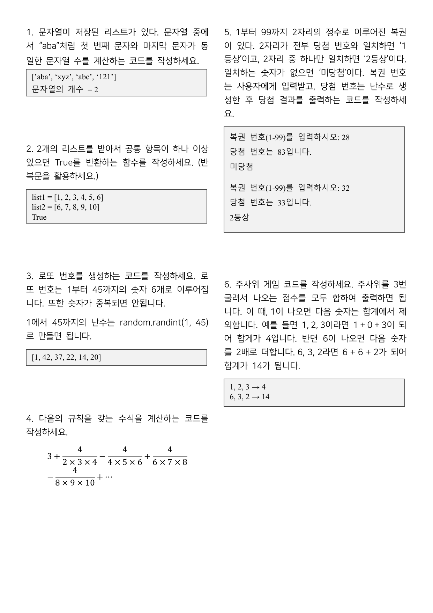
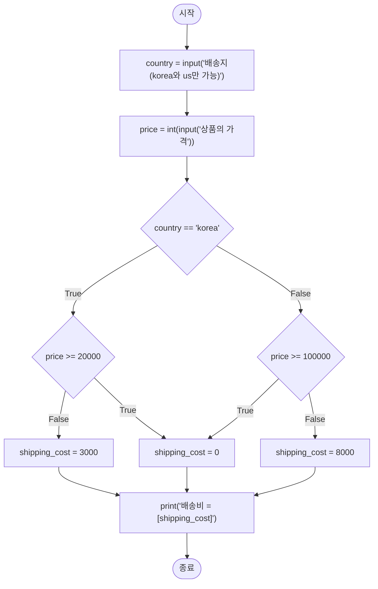
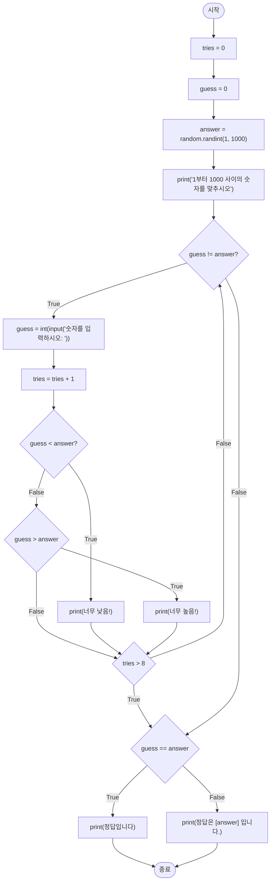
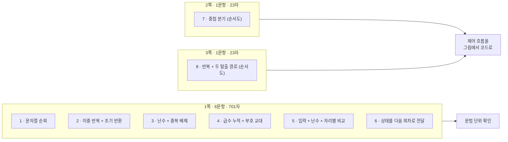

> [!abstract] 세 쪽의 글자 수가 701 / 23 / 23 이다
> 이 시험지는 3쪽이고 8문항이다. 그런데 **1쪽 한 장에 여섯 문항이 들어가고**, 2쪽과 3쪽은 각각 문항이 **하나뿐**이다. 텍스트를 추출하면 쪽별 글자 수가 **701자 / 23자 / 23자** 로 나온다. 2·3쪽의 23자는 각각 `7. 다음 순서도와 같이 동작하는 코드를 작성하세요.` 한 줄이 전부다.
>
> 나머지는 전부 **그림**이다. 시험지의 절반이 텍스트 추출로는 보이지 않는다. 두 순서도를 열어 보면 이유를 알 수 있다 — 앞의 여섯 문항은 각각 서너 줄이면 풀리는데, **7·8번은 노드가 각각 열 개, 열여섯 개**다. 배점이 쪽 배분에 그대로 드러나 있다.
>
> 그래서 이 정리는 1번부터 순서대로 가지 않는다. **1쪽의 여섯 문항을 한 절로 묶고**, 순서도 두 장을 각각 한 절씩 놓는다.

---

## 1. 1쪽 — 여섯 문항이 한 화면에



여섯 문항이 2열로 배치되어 있고, 각 문항은 **요구 한 문단 + 회색 상자 안의 실행 예** 형식이다. 앞의 두 자료(문제풀이 슬라이드)가 `제한 조건` 을 따로 두었던 것과 달리, 여기서는 **회색 상자가 제한 조건의 자리를 대신한다.**

| 번호 | 요구 | 회색 상자가 확정하는 것 |
| --- | --- | --- |
| 1 | 첫 문자와 마지막 문자가 같은 문자열의 개수 | `['aba','xyz','abc','121'] → 2` — `'121'` 이 포함되므로 **숫자 문자열도 센다** |
| 2 | 두 리스트의 공통 항목이 하나 이상이면 True | 반환이 개수가 아니라 **`True`** |
| 3 | 로또 번호 6개, 중복 금지 | 출력이 **정렬되지 않은** 리스트 `[1, 42, 37, 22, 14, 20]` |
| 4 | 규칙을 갖는 수식 계산 | 상자가 없다 — 수식 그림이 명세 전부다 |
| 5 | 복권 1등상/2등상/미당첨 | 두 실행 예가 **비교 방식**을 확정한다 (§1.2) |
| 6 | 주사위 3번 합, 1과 6의 특수 규칙 | `1,2,3 → 4` 와 `6,3,2 → 14` |

### 1.1 1·2번 — 반복문을 쓰라고 못박은 문항

1번은 리스트의 각 문자열에서 `s[0] == s[-1]` 을 확인하고 개수를 센다. 상자의 `'121'` 이 중요하다 — 알파벳만 세는 것이 아니다.

```python
words = ['aba', 'xyz', 'abc', '121']
count = 0
for w in words:
    if w[0] == w[-1]:
        count += 1
print('문자열의 개수 =', count)   # 2
```

`'aba'`(a…a)와 `'121'`(1…1) 둘이므로 **2**. 상자와 일치한다.

2번은 요구 끝에 **"(반복문을 활용하세요.)"** 라는 괄호가 붙어 있다. `set(list1) & set(list2)` 한 줄이면 끝나는 문제인데 그 길을 막은 것이다. 출제 의도가 문법이 아니라 **반복과 조기 종료**에 있음을 드러낸다.

```python
def has_common(list1, list2):
    for a in list1:
        for b in list2:
            if a == b:
                return True
    return False

has_common([1,2,3,4,5,6], [6,7,8,9,10])   # True  (6이 공통)
```

`return True` 의 위치가 이 문제의 답이다. 찾는 즉시 빠져나가야 하고, 두 반복이 **다 끝난 뒤에야** `False` 를 돌려준다. `else` 로 `False` 를 돌려주는 자리를 안쪽 반복에 두면 첫 원소만 보고 끝난다.

### 1.2 5번 — 실행 예가 비교 방식을 정한다

5번의 회색 상자 두 개는 앞 자료의 `입출력 예` 와 똑같은 일을 한다.

```text
복권 번호(1-99)를 입력하시오: 28      복권 번호(1-99)를 입력하시오: 32
당첨 번호는 83입니다.                  당첨 번호는 33입니다.
미당첨                                2등상
```

첫 예가 결정적이다. 28과 83은 **숫자 8을 공유**한다. 그런데 결과가 미당첨이다. 즉 이 문제의 "일치"는 **자릿수를 포함하는가**가 아니라 **같은 자리에 같은 숫자인가**다. 둘째 예가 확인해 준다 — 32와 33은 십의 자리 3이 같아 2등상이다.

```python
import random

user = input('복권 번호(1-99)를 입력하시오: ')
win = random.randint(1, 99)
print(f'당첨 번호는 {win}입니다.')

u, w = user.zfill(2), str(win).zfill(2)
match = sum(1 for a, b in zip(u, w) if a == b)
print('1등상' if match == 2 else '2등상' if match == 1 else '미당첨')
```

> [!warning] 원본 오류 ① — 5번의 "1부터 99까지 2자리의 정수"
> 문제 첫 줄이 **"1부터 99까지 2자리의 정수로 이루어진 복권"** 이라고 한다. 그런데 1부터 9까지는 **한 자리**다. 범위와 자릿수 규정이 충돌한다.
>
> 이 충돌이 그냥 넘어가지 않는 이유는 규칙이 자릿수에 매달려 있기 때문이다. "2자리가 전부 일치 → 1등상, 2자리 중 하나만 일치 → 2등상"인데, 당첨 번호가 `7` 이고 입력이 `70` 이라면 자릿수가 달라 비교 자체가 정의되지 않는다. 범위를 `10~99` 로 읽거나 위 코드처럼 **`zfill(2)` 로 두 자리를 맞춰야** 규칙이 성립한다. 원본은 어느 쪽도 지시하지 않는다.

### 1.3 3번 — 힌트가 절반만 주어졌다

3번은 두 가지를 요구한다. **1~45의 숫자 6개**, 그리고 **중복 금지**. 그런데 원본이 준 힌트는 이것뿐이다.

> 1에서 45까지의 난수는 `random.randint(1, 45)` 로 만들면 됩니다.

`randint` 는 매번 독립적으로 뽑으므로 중복을 막지 못한다. 6개를 뽑을 때 전부 다를 확률은 $\frac{45}{45}\cdot\frac{44}{45}\cdots\frac{40}{45} \approx 0.70$ 이다 — **열 번 중 세 번은 중복이 난다.** 힌트만 그대로 따르면 요구의 절반을 어긴다.

```python
import random

numbers = []
while len(numbers) < 6:
    n = random.randint(1, 45)
    if n not in numbers:
        numbers.append(n)
print(numbers)   # 예: [1, 42, 37, 22, 14, 20]
```

`if n not in numbers` 가 힌트에 없는 부분이고, 이 문항의 실제 채점 지점이다. 상자의 예시 출력 `[1, 42, 37, 22, 14, 20]` 이 **정렬되어 있지 않다**는 점도 단서다 — 뽑은 순서를 그대로 두라는 뜻이므로 `sorted()` 를 붙이면 안 된다.

### 1.4 6번 — 상태를 다음 회차로 넘기는 문제

주사위를 3번 굴리는데, **직전 눈이 다음 눈의 처리를 바꾼다.**

- 1이 나오면 **다음 숫자는 합계에서 제외**
- 6이 나오면 **다음 숫자를 2배로** 더한다

원본의 두 예로 규칙을 굳힌다.

| 굴림 | 계산 | 합계 |
| --- | --- | --- |
| 1, 2, 3 | 1 + **0** + 3 | **4** |
| 6, 3, 2 | 6 + **6**(=3×2) + 2 | **14** |

```python
def dice(rolls):
    total, mode = 0, None
    for v in rolls:
        if mode == 'skip':
            pass                    # 더하지 않는다
        elif mode == 'double':
            total += v * 2
        else:
            total += v
        mode = 'skip' if v == 1 else 'double' if v == 6 else None
    return total

dice([1, 2, 3])   # 4
dice([6, 3, 2])   # 14
```

마지막 줄의 순서가 중요하다. **효과를 먼저 적용하고, 그다음에 이번 눈이 다음 회차에 남길 효과를 정한다.** 순서를 뒤집으면 `1` 이 나온 회차에서 자기 자신이 제외되어 `1,2,3` 이 `0+0+3 = 3` 이 된다.

> [!caution] 원본 오타 ② — 6번의 "합게"
> "1 + 0 + 3이 되어 **합게**가 4입니다"에서 `합게` 는 `합계` 의 오타다. 같은 문항의 두 번째 예에서는 "합계가 14가 됩니다"로 바르게 적었다.

---

## 2. 4번 — 수식 하나가 문항 전부

4번은 회색 상자가 없다. 요구가 "다음의 규칙을 갖는 수식을 계산하는 코드를 작성하세요"이고, 그 아래에 수식 그림만 있다.

$$3 + \frac{4}{2 \times 3 \times 4} - \frac{4}{4 \times 5 \times 6} + \frac{4}{6 \times 7 \times 8} - \frac{4}{8 \times 9 \times 10} + \cdots$$

규칙을 뜯어보면 세 가지가 동시에 움직인다.

1. **분자는 항상 4**로 고정
2. **분모는 연속한 세 정수의 곱**이고, 첫 수가 2, 4, 6, 8 … 짝수로 증가
3. **부호가 +, −, +, − 로 번갈아** 나타난다

$k$ 번째 항($k = 1, 2, 3, \dots$)의 짝수를 $a = 2k$ 라 하면 항은 $\dfrac{(-1)^{k+1} \cdot 4}{a(a+1)(a+2)}$ 이다.

```python
def calc(terms):
    total = 3.0
    sign = 1
    for k in range(1, terms + 1):
        a = 2 * k
        total += sign * 4 / (a * (a + 1) * (a + 2))
        sign = -sign
    return total
```

원본은 "…"로 끝날 뿐 **몇 항까지 더하는지 말하지 않는다.** 이 미지정이 이 문항의 유일한 애매함이고, 실행하면 이유가 드러난다.

| 항 수 | 부분합 | 오차 |
| --- | --- | --- |
| 1 | 3.166666667 | 2.51 × 10⁻² |
| 2 | 3.133333333 | 8.26 × 10⁻³ |
| 3 | 3.145238095 | 3.65 × 10⁻³ |
| 5 | 3.142712843 | 1.12 × 10⁻³ |
| 10 | 3.141406718 | 1.86 × 10⁻⁴ |
| 100 | 3.141592410972 | 2.43 × 10⁻⁷ |
| 1000 | 3.141592653341 | 2.49 × 10⁻¹⁰ |

> [!note] 보충 — 이 급수가 무엇으로 가나
> 부분합은 **원주율 $\pi = 3.141592653589793\ldots$** 로 수렴한다. 이 형태는 닐라칸타(Nilakantha) 급수로 알려져 있다. **원본 시험지는 이 사실을 한 글자도 말하지 않는다** — 요구는 "수식을 계산하는 코드"뿐이다. 다만 항을 몇 개까지 더할지 정하려면 수렴 여부를 봐야 하므로 여기에 적어 둔다. 위 표의 값은 파이썬 3.11로 계산해 `math.pi` 와 비교한 것이다.

부호가 번갈아 나오는 급수라 **부분합이 참값을 위아래로 감싸며** 좁혀 든다. 홀수 번째 항까지 더하면 참값보다 크고, 짝수 번째까지 더하면 작다. 아래에서 직접 볼 수 있다.

```html preview h=560px
<div style="font-family:system-ui,-apple-system,sans-serif;padding:18px;color:var(--foreground)">
  <label for="k" style="font-size:12.5px;font-weight:600">더한 항의 수 =
    <span id="kv" style="color:var(--chart-1);font-size:19px;font-weight:700">5</span></label>
  <input id="k" type="range" min="1" max="60" step="1" value="5"
    style="width:100%;accent-color:var(--primary);margin:6px 0 12px" />
  <svg id="sv" viewBox="0 0 660 260" width="100%" role="img" aria-label="부분합이 참값을 위아래로 감싸며 수렴하는 그래프"></svg>
  <div id="box" style="margin-top:10px;padding:12px 14px;background:var(--card);border:1px solid var(--border);border-radius:var(--radius);font-size:13px;line-height:1.8"></div>
  <div id="terms" style="margin-top:9px;font-family:ui-monospace,monospace;font-size:12px;color:var(--muted-foreground);line-height:1.9;word-break:break-all"></div>

  <script>
    var PI = Math.PI;
    function partials(K) {
      var out = [], t = 3, s = 1, tr = [];
      for (var k = 1; k <= K; k++) {
        var a = 2 * k, v = s * 4 / (a * (a + 1) * (a + 2));
        t += v; s = -s;
        out.push(t); tr.push({a: a, v: v});
      }
      return {sums: out, terms: tr};
    }
    var sl = document.getElementById('k');
    function draw() {
      var K = parseInt(sl.value, 10), r = partials(K), sums = r.sums;
      document.getElementById('kv').textContent = K;
      var W = 660, H = 260, PAD = 46, TOP = 18;
      var lo = Math.min.apply(null, sums.concat([PI])), hi = Math.max.apply(null, sums.concat([PI]));
      var span = Math.max(hi - lo, 1e-9), pad = span * 0.18;
      lo -= pad; hi += pad;
      function X(i) { return PAD + (K < 2 ? 0.5 : i / (K - 1)) * (W - PAD - 16); }
      function Y(v) { return H - 26 - ((v - lo) / (hi - lo)) * (H - 26 - TOP); }
      var poly = sums.map(function (v, i) { return X(i) + ',' + Y(v); }).join(' ');
      var dots = sums.map(function (v, i) {
        return '<circle cx="' + X(i) + '" cy="' + Y(v) + '" r="3" fill="' +
          (v > PI ? 'var(--chart-1)' : 'var(--chart-2)') + '"/>';
      }).join('');
      document.getElementById('sv').innerHTML =
        '<line x1="' + PAD + '" y1="' + Y(PI) + '" x2="' + (W - 12) + '" y2="' + Y(PI) +
        '" stroke="var(--chart-5)" stroke-width="1.5" stroke-dasharray="5 4"/>' +
        '<text x="' + (W - 12) + '" y="' + (Y(PI) - 7) + '" text-anchor="end" font-size="11.5" fill="var(--chart-5)">π = 3.14159265…</text>' +
        '<polyline points="' + poly + '" fill="none" stroke="var(--foreground)" stroke-width="1.4" opacity="0.55"/>' + dots +
        '<text x="6" y="' + (TOP + 8) + '" font-size="10.5" fill="var(--muted-foreground)">' + hi.toFixed(6) + '</text>' +
        '<text x="6" y="' + (H - 26) + '" font-size="10.5" fill="var(--muted-foreground)">' + lo.toFixed(6) + '</text>';
      var last = sums[K - 1], err = Math.abs(last - PI);
      document.getElementById('box').innerHTML =
        '<b>' + K + '항까지의 부분합 = <span style="color:var(--chart-1);font-size:17px">' + last.toFixed(9) + '</span></b>' +
        ' &nbsp;·&nbsp; 오차 ' + err.toExponential(2) +
        '<br/><span style="color:var(--muted-foreground);font-size:12.5px">마지막 항의 부호가 ' +
        (K % 2 === 1 ? '<b>+</b> 라 부분합이 π보다 <b>크다</b>' : '<b>−</b> 라 부분합이 π보다 <b>작다</b>') +
        ' — 홀수 항(위쪽 점)과 짝수 항(아래쪽 점)이 번갈아 참값을 감싼다.</span>';
      var show = r.terms.slice(0, 6).map(function (t, i) {
        return (i === 0 ? '3 ' : '') + (t.v >= 0 ? '+ ' : '− ') + '4/(' + t.a + '×' + (t.a + 1) + '×' + (t.a + 2) + ')';
      }).join(' ');
      document.getElementById('terms').textContent = show + (K > 6 ? ' … (총 ' + K + '항)' : '');
    }
    sl.oninput = draw;
    draw();
  </script>
</div>
```

---

## 3. 7번 순서도 — 배송비


노드 열 개짜리 순서도다. 원본 노드를 그대로 옮기면 이렇다.



읽을 때 놓치기 쉬운 세 가지가 있다.

**① `shipping_cost = 0` 상자는 하나뿐이다.** 두 분기의 True가 **같은 상자로 합류**한다. 순서도에서 화살표 두 개가 한 상자로 들어오는 것은 "코드에서도 한 줄이면 된다"는 뜻이 아니라, **두 조건 중 하나만 참이어도 같은 결과**라는 뜻이다.

**② `True`/`False` 화살표의 좌우가 두 마름모에서 서로 반대다.** 왼쪽 마름모(`price >= 20000`)는 False가 왼쪽, True가 오른쪽으로 간다. 오른쪽 마름모(`price >= 100000`)는 True가 왼쪽, False가 오른쪽이다. **위치가 아니라 라벨을 읽어야 한다.**

**③ 조건이 `>=` 다.** 정확히 20,000원이면 무료다.

```python
country = input('배송지(korea와 us만 가능)')
price = int(input('상품의 가격'))

if country == 'korea':
    shipping_cost = 0 if price >= 20000 else 3000
else:
    shipping_cost = 0 if price >= 100000 else 8000

print(f'배송비 = {shipping_cost}')
```

네 가지 경우를 표로 굳혀 두면 실수가 없다.

| country | price | 조건 | shipping_cost |
| --- | --- | --- | --- |
| `korea` | 19,999 | `price >= 20000` False | **3000** |
| `korea` | 20,000 | `price >= 20000` True | **0** |
| 그 외 | 99,999 | `price >= 100000` False | **8000** |
| 그 외 | 100,000 | `price >= 100000` True | **0** |

```html preview h=470px
<div style="font-family:system-ui,-apple-system,sans-serif;padding:18px;color:var(--foreground)">
  <div style="display:flex;gap:20px;flex-wrap:wrap;margin-bottom:14px">
    <div style="min-width:190px">
      <div style="font-size:12.5px;font-weight:600;margin-bottom:6px">country</div>
      <div style="display:flex;gap:7px">
        <button class="cb" data-v="korea" style="cursor:pointer">korea</button>
        <button class="cb" data-v="us" style="cursor:pointer">us</button>
        <button class="cb" data-v="japan" style="cursor:pointer">japan</button>
      </div>
    </div>
    <div style="flex:1;min-width:230px">
      <label for="pr" style="font-size:12.5px;font-weight:600">price = <span id="prv" style="color:var(--chart-1);font-weight:700">20000</span> 원</label>
      <input id="pr" type="range" min="0" max="150000" step="1000" value="20000" style="width:100%;accent-color:var(--primary);margin-top:5px" />
    </div>
  </div>
  <div id="path" style="display:flex;flex-direction:column;gap:6px;margin-bottom:13px"></div>
  <div id="res" style="padding:13px 15px;background:var(--card);border:1px solid var(--border);border-radius:var(--radius);font-family:ui-monospace,monospace;font-size:16px;font-weight:700"></div>
  <div id="warn" style="margin-top:10px;font-size:12.5px;line-height:1.7;color:var(--muted-foreground)"></div>

  <script>
    var country = 'korea';
    var pr = document.getElementById('pr');
    function step(txt, hit) {
      return '<div style="padding:7px 11px;border:1px solid ' + (hit ? 'var(--chart-1)' : 'var(--border)') +
        ';border-left:4px solid ' + (hit ? 'var(--chart-1)' : 'var(--border)') +
        ';border-radius:var(--radius);background:var(--card);font-size:13px;' +
        (hit ? 'font-weight:600' : 'opacity:.45') + '">' + txt + '</div>';
    }
    function draw() {
      var price = parseInt(pr.value, 10);
      document.getElementById('prv').textContent = price.toLocaleString();
      var isK = country === 'korea';
      var cost = isK ? (price >= 20000 ? 0 : 3000) : (price >= 100000 ? 0 : 8000);
      document.getElementById('path').innerHTML =
        step("country == 'korea' → <b>" + (isK ? 'True' : 'False') + '</b>', true) +
        step('price >= 20000 → ' + (isK ? '<b>' + (price >= 20000) + '</b>' : '(평가하지 않음)'), isK) +
        step('price >= 100000 → ' + (!isK ? '<b>' + (price >= 100000) + '</b>' : '(평가하지 않음)'), !isK) +
        step('shipping_cost = ' + cost, true);
      document.getElementById('res').innerHTML =
        '배송비 = <span style="color:' + (cost === 0 ? 'var(--chart-2)' : 'var(--chart-1)') + '">' + cost.toLocaleString() + '</span>';
      document.getElementById('warn').innerHTML = isK ? '' :
        "country 가 <code>" + country + "</code> 인데도 <b>미국 기준</b>이 적용된다 — 순서도에 <code>country == 'korea'</code> 판정 하나뿐이라 그 외는 전부 같은 갈래로 간다.";
    }
    Array.prototype.forEach.call(document.getElementsByClassName('cb'), function (b) {
      b.style.cssText = 'padding:5px 12px;font-size:12.5px;border:1px solid var(--border);border-radius:var(--radius);' +
        'background:var(--card);color:var(--foreground);cursor:pointer';
      b.onclick = function () {
        country = b.getAttribute('data-v');
        Array.prototype.forEach.call(document.getElementsByClassName('cb'), function (x) {
          x.style.borderColor = 'var(--border)'; x.style.fontWeight = '400';
        });
        b.style.borderColor = 'var(--chart-1)'; b.style.fontWeight = '700';
        draw();
      };
      if (b.getAttribute('data-v') === 'korea') { b.style.borderColor = 'var(--chart-1)'; b.style.fontWeight = '700'; }
    });
    pr.oninput = draw;
    draw();
  </script>
</div>
```

`japan` 을 눌러 보면 순서도의 빈틈이 보인다.

> [!caution] 원본의 빈틈 ③ — 검증 없는 입력
> 입력 프롬프트는 **"배송지(korea와 us만 가능)"** 라고 안내하지만, 순서도에는 `country == 'korea'` 판정 **하나뿐**이다. `us` 든 `japan` 이든 오타든 전부 같은 갈래(100,000원 기준)로 흘러간다. 안내문이 약속한 제약을 흐름이 강제하지 않는다.
>
> 함께 볼 것 — 출력 상자가 `print('배송비 = [shipping_cost]')` 로 되어 있다. 파이썬에서 작은따옴표 안의 `[shipping_cost]` 는 **변수가 아니라 글자 그대로** 출력된다. 순서도에서 값을 대괄호로 표시하는 것은 흔한 관행이라 **표기의 문제로 보이지만**, 코드로 옮길 때는 f-string(`f'배송비 = {shipping_cost}'`)이 필요하다는 점이 문항에 드러나 있지 않다.

---

## 4. 8번 순서도 — 숫자 맞히기


노드가 열여섯 개이고 **되돌아가는 화살표가 둘**이다. 순서도가 시험지 한 쪽을 다 쓴 이유다.



### 4.1 두 번 묻는 이유

`guess != answer?` 와 `guess == answer` 가 같은 것을 두 번 묻는 것처럼 보인다. 그러나 **탈출 경로가 둘**이라 둘 다 필요하다.

- 맞혀서 나가는 길: `tries > 8` 이 False → 위로 돌아감 → `guess != answer?` 가 False → 아래 `guess == answer` 로
- 횟수를 다 써서 나가는 길: `tries > 8` 이 True → 곧장 `guess == answer` 로

두 길이 **같은 지점**(`guess == answer`)에서 만나고, 거기서 승패를 가른다. 마지막 시도에 맞힌 경우까지 `정답입니다` 로 처리된다.

`guess = 0` 이라는 초기화도 여기서 일한다. `answer` 는 1 이상이므로 첫 판정 `guess != answer?` 가 **반드시 True** 가 되어 루프에 들어간다.

```python
import random

tries = 0
guess = 0
answer = random.randint(1, 1000)
print('1부터 1000 사이의 숫자를 맞추시오')

while guess != answer:
    guess = int(input('숫자를 입력하시오: '))
    tries = tries + 1
    if guess < answer:
        print('너무 낮음!')
    elif guess > answer:
        print('너무 높음!')
    if tries > 8:
        break

if guess == answer:
    print('정답입니다')
else:
    print(f'정답은 {answer} 입니다.')
```

`if tries > 8: break` 를 반복 **끝**에 둔 것이 순서도와 맞는다. 순서도에서 `tries > 8` 판정이 세 갈래(낮음·높음·같음)가 모두 합류한 뒤에 있기 때문이다.

### 4.2 허용 횟수는 9회다

`tries` 는 입력 직후 1 증가하고, `tries > 8` 이 참일 때 빠져나간다. `tries = 9` 가 되는 순간이 첫 참이므로 **입력은 9번까지** 받는다. 조건에 적힌 숫자는 8인데 실제 시도는 9회다.

> [!warning] 원본 오류 ④ — 9회로는 1~1000을 보장할 수 없다
> `너무 낮음 / 너무 높음 / 정답` 세 가지 응답을 받는 추측 게임에서, $k$ 번의 추측으로 확실히 좁힐 수 있는 후보의 최대 개수는 $2^k - 1$ 이다.
>
> - $k = 9$ → $2^9 - 1 = 511$
> - $k = 10$ → $2^{10} - 1 = 1023$
>
> 범위가 1~1000이므로 **9회로는 최선의 전략(이분 탐색)을 써도 못 맞히는 경우가 반드시 존재한다.** 최소 10회가 필요하다. 순서도의 조건이 `tries > 9` 였다면 딱 맞았을 것이다.
>
> 이 어긋남이 프로그램을 망가뜨리지는 않는다 — 못 맞히면 `정답은 [answer] 입니다.` 로 끝나도록 흐름이 설계되어 있기 때문이다. 다만 **범위와 횟수가 서로 맞춰지지 않았다**는 점은 짚어 둘 만하다. (511과 1023은 파이썬으로 계산해 확인했다.)

### 4.3 순서도에서 코드로 옮기는 규칙

두 순서도를 옮기고 나면 대응이 정리된다.

| 순서도 요소 | 파이썬 |
| --- | --- |
| 마름모 + 두 화살표 | `if` / `else` |
| 마름모 세 개가 사슬로 연결 | `if` / `elif` / `else` |
| 화살표가 **위로** 되돌아감 | `while` 반복 |
| 되돌아가는 화살표를 **건너뛰는** 갈래 | `break` |
| 화살표 여럿이 한 상자로 합류 | 같은 문장을 여러 갈래가 공유 — 반복 대입 대신 분기 이후 한 줄 |
| 시작 전 상자들 | 반복 진입 **전** 초기화 (`tries = 0`, `guess = 0`) |

7번에는 되돌아가는 화살표가 없어 `if` 만으로 끝나고, 8번에는 둘 있어 `while` 과 `break` 가 둘 다 나온다. **한 쪽에 하나씩 배치한 이유가 여기 있다** — 앞 문항이 분기, 뒤 문항이 반복이다.

---

## 5. 시험지가 요구하는 것을 한 장으로



여덟 문항 중 **넷(3·5·8번)이 `random` 을 쓰고, 셋(4·6·8번)이 이전 값을 다음 계산으로 넘긴다.** 두 축이 이 시험의 범위다 — 난수를 다루는 법, 그리고 상태를 반복 사이로 옮기는 법.

---

## 이어지는 문서

- [01. 문제 1–10 — 설명·제한 조건·입출력 예가 서로를 감시한다](<./01. 문제 1-10 — 설명·제한 조건·입출력 예가 서로를 감시한다.md>) — 5번 복권의 "실행 예가 명세를 확정한다"가 그대로 반복된다
- [02. 문제 11–20 — 무엇을 어디서부터 세는가](<./02. 문제 11-20 — 무엇을 어디서부터 세는가.md>) — 6번 주사위의 1-기반 회차 세기
- [03. 지뢰찾기 — 여덟 칸을 세는 일이 아니라 격자 밖을 세지 않는 일](<./03. 지뢰찾기 — 여덟 칸을 세는 일이 아니라 격자 밖을 세지 않는 일.md>)

관련 과목: [01/coding-basics](../../coding-basics/README.md)의 순서도 작성 예제(같은 기호 체계를 반대 방향 — 코드에서 순서도로 — 으로 연습한다).

---

## 근거 자료

`ComputerScience/01_programming-foundations/python-programming/sources/23-2 중간고사.pdf` (3쪽) 전체.

| 쪽 | 문항 | 추출 글자 수 | 이 문서에서 다룬 곳 |
| --- | --- | --- | --- |
| 1 | 1 ~ 6번 | 701자 | §1 (슬라이드 인용) · §2 |
| 2 | 7번 (배송비 순서도) | 23자 — 나머지는 그림 | §3 (슬라이드 인용) |
| 3 | 8번 (숫자 맞히기 순서도) | 23자 — 나머지는 그림 | §4 (슬라이드 인용) |

두 순서도는 노드와 화살표 라벨을 한 개씩 대조해 Mermaid로 옮겼고, 옮긴 코드를 파이썬 3.11로 실행해 회색 상자의 실행 예(1번 `2`, 6번 `4`·`14`, 5번의 두 판정)와 대조했다. §2의 급수 표와 §4.2의 $2^k - 1$ 계산도 실행으로 확인했다. 원본에 없는 내용은 §2의 수렴값 언급과 §4.2의 하한 계산 두 곳이며, 본문에 보충 설명임을 표시했다.
