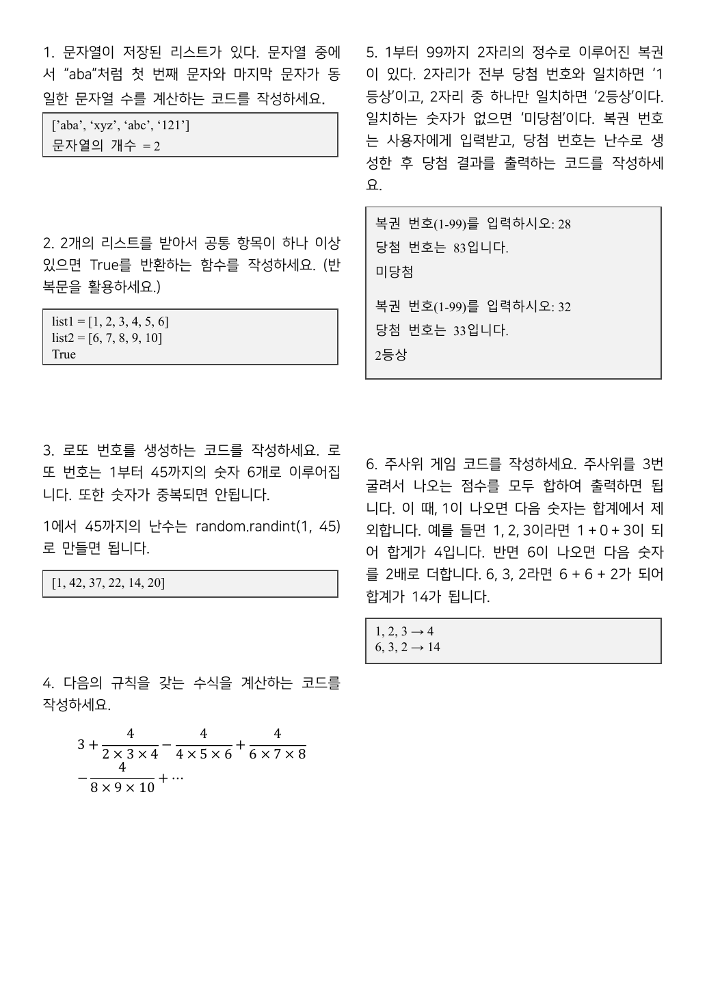
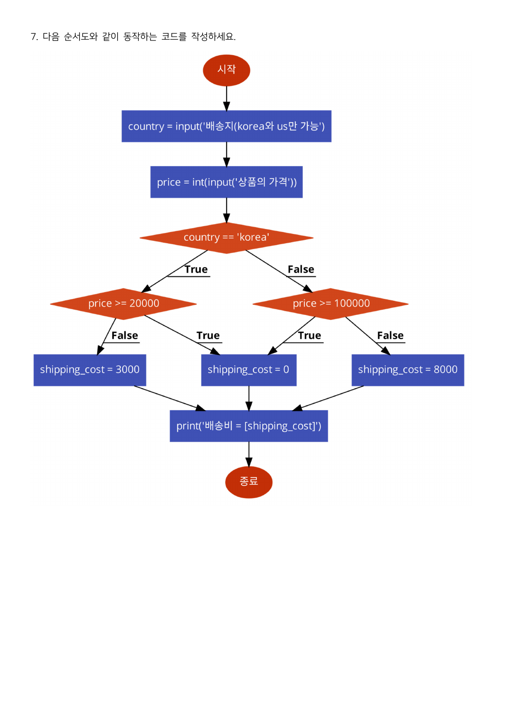
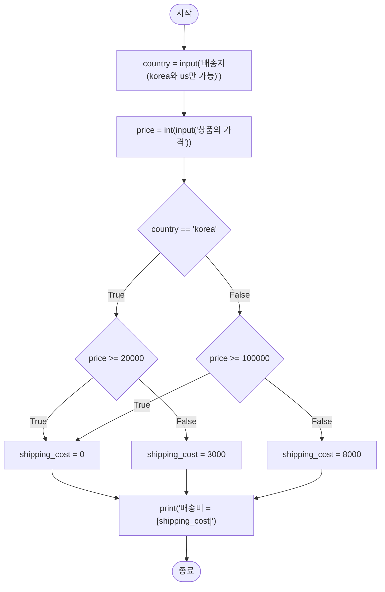
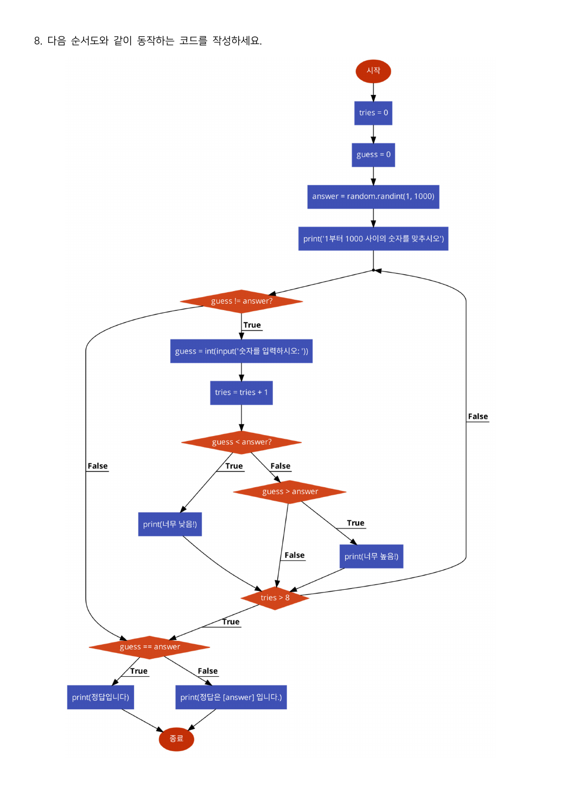
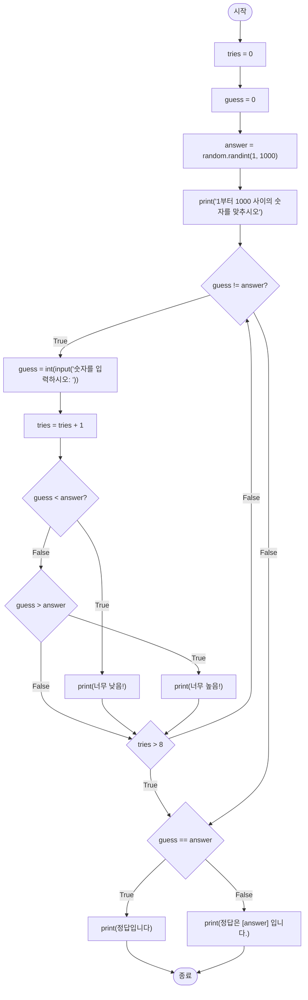
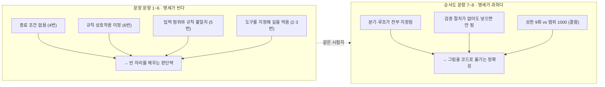

> [!abstract] 같은 시험지에 두 가지 언어가 있다
> `23-2 중간고사.pdf`는 3쪽, 8문항이다. 그런데 문항이 주어지는 방식이 두 가지다.
>
> - **1~6번** — 문장으로 준다. 1쪽에 두 단으로 빽빽하게 들어간다.
> - **7~8번** — 순서도로 준다. 한 쪽에 한 문항씩 그림만 있다.
>
> 이 차이가 그냥 형식의 차이가 아니다. **문장 문항은 명세가 비고, 순서도 문항은 명세가 과하다.** 문장 문항 여섯 개는 종료 조건·판정 기준·규칙의 우선순위를 말하지 않아 응시자가 스스로 정해야 한다. 순서도 문항 둘은 반대로 분기와 루프를 한 칸도 남김없이 지정해 옮겨 적기만 하면 되는데, 대신 **그 명세 자체가 요구를 만족시키지 못한다.**
>
> 이 정리는 여덟 문항을 그 두 무리로 갈라, 각각이 무엇을 시험하는지를 본다.

---

## 1. 시험지의 배치



원본 1쪽. 문항마다 출력 예가 회색 상자로 붙어 있고, 그 상자가 사실상 유일한 명세다. 4번만 상자 대신 수식이 놓인다.

| 문항 | 형식 | 다루는 것 | 실행 예 |
| --- | --- | --- | --- |
| 1 | 문장 | 리스트 순회 + 문자열 인덱싱 | `['aba','xyz','abc','121']` → 2 |
| 2 | 문장 | 두 리스트의 공통 원소 (반복문 지정) | `[1..6]`, `[6..10]` → `True` |
| 3 | 문장 | 난수 + 중복 제거 | `[1, 42, 37, 22, 14, 20]` |
| 4 | 문장 | 무한급수의 부분합 | 수식만 |
| 5 | 문장 | 입력 + 난수 + 자릿수 비교 | 2회 실행 예 |
| 6 | 문장 | 조건이 다음 항에 영향을 주는 반복 | `1,2,3 → 4` / `6,3,2 → 14` |
| 7 | 순서도 | 중첩 분기 | 없음 |
| 8 | 순서도 | 반복 + 이분 탐색 게임 | 없음 |

---

## 2. 문장 문항 — 비어 있는 자리들

### 1번 · 첫 글자와 끝 글자가 같은 문자열

`['aba', 'xyz', 'abc', '121']`에서 답이 2다. `'aba'`와 `'121'`이 조건을 만족한다. 여기서 말하지 않은 것이 하나 있다 — **길이가 1인 문자열**이다. `'a'`는 첫 글자와 끝 글자가 같은 글자 하나이므로 조건상 참이지만, 예시에 그런 원소가 없어 확인할 수 없다. 빈 문자열 `''`은 인덱싱 자체가 예외를 낸다.

### 2번 · 공통 항목이 하나 이상

문제가 괄호로 **"(반복문을 활용하세요.)"** 를 못 박는다. `set(list1) & set(list2)` 한 줄이면 끝나는 문제인데 그 길을 명시적으로 막았다. 즉 이 문항이 채점하는 것은 답이 아니라 **이중 반복과 조기 반환**이다. 예시 `list1 = [1,2,3,4,5,6]`, `list2 = [6,7,8,9,10]`은 공통 원소가 `6` 하나뿐이고 그것도 각 리스트의 **끝쪽**에 있어, 조기 반환이 언제 일어나는지가 드러난다.

### 3번 · 로또 번호

문제가 힌트까지 준다 — "1에서 45까지의 난수는 `random.randint(1, 45)`로 만들면 됩니다." 그런데 `randint`는 중복을 막아 주지 않는다. **"숫자가 중복되면 안됩니다"** 라는 요구와 힌트로 준 도구 사이의 간격이 이 문항의 전부다. 여섯 개를 채울 때까지 다시 뽑거나, 뽑힌 수를 빼고 다시 뽑아야 한다.

출력 예 `[1, 42, 37, 22, 14, 20]`은 **정렬되어 있지 않다.** 정렬을 요구하지 않는다는 뜻으로 읽는 편이 안전하다.

### 5번 · 복권

두 번의 실행 예가 붙어 있다.

```text
복권 번호(1-99)를 입력하시오: 28      복권 번호(1-99)를 입력하시오: 32
당첨 번호는 83입니다.                  당첨 번호는 33입니다.
미당첨                                2등상
```

`32`와 `33`은 십의 자리 `3`이 같아서 2등상이다. `28`과 `83`은 — 숫자 `8`이 양쪽에 다 있는데도 미당첨이다. 두 예를 나란히 놓아야 **자리를 맞춰 비교한다**는 규칙이 확정된다. `8`이 한쪽은 일의 자리, 한쪽은 십의 자리라 일치로 치지 않는다.

> [!caution] 원본 오류 — "1부터 99까지 2자리의 정수"
> 문항 첫 문장은 **"1부터 99까지 2자리의 정수로 이루어진 복권"** 이다. 그런데 1부터 9까지는 두 자리가 아니다. 입력 안내문도 `복권 번호(1-99)`라고 1부터 열어 둔다.
>
> 이 어긋남이 문제가 되는 이유는 판정 규칙이 **자릿수 위치**에 걸려 있기 때문이다. 사용자가 `7`을 넣으면 십의 자리가 없다. `07`로 볼 것인가, 아니면 애초에 입력받지 않을 것인가가 정해지지 않는다. 범위를 `10-99`로 적었어야 문장과 규칙이 맞는다.

### 6번 · 주사위 세 번

규칙은 두 개고, 예도 두 개다.

| 굴림 | 계산 | 합계 |
| --- | --- | --- |
| 1, 2, 3 | 1 + 0 + 3 | 4 |
| 6, 3, 2 | 6 + 6 + 2 | 14 |

첫 예에서 `1` 자체는 합계에 **들어간다**(1 + 0 + 3). 제외되는 것은 그 다음 숫자다. 둘째 예에서 `6` 다음의 `3`이 두 배가 되어 6이 된다.

> [!caution] 원본 오탈자 — "합게가 4입니다"
> 6번 본문에 **"합게가 4입니다"** 로 적혀 있다. 바로 다음 문장은 "합계가 14가 됩니다"로 올바르다. 같은 문항 안에서 두 표기가 섞였다.

오탈자보다 큰 문제는 규칙이 서로 겹치는 자리다.

> [!warning] 명세가 비어 있는 세 자리
> 6번의 두 규칙은 세 경우에 대해 아무 말도 하지 않는다.
>
> 1. **세 번째 굴림이 1이거나 6일 때** — "다음 숫자"가 없다. 규칙이 그냥 소멸하는가?
> 2. **`6` 다음에 `1`이 나올 때** — `1`을 두 배로 더한 뒤(2), 그 다음도 제외해야 하는가? 두 규칙이 한 숫자에 겹친다
> 3. **`1` 다음에 `6`이 나올 때** — `6`은 제외 대상인데, 그러면 그 `6`의 "두 배" 규칙도 함께 사라지는가?
>
> 예시 두 개(`1,2,3`과 `6,3,2`)는 셋 중 어느 경우도 건드리지 않는다. 주사위 셋을 굴리는 216가지 중 이런 경우가 상당수인데, 채점 기준이 문항 안에 없다.

---

## 3. 4번 · 종료 조건이 없는 급수

문항은 식만 준다.

$$3 + \frac{4}{2 \times 3 \times 4} - \frac{4}{4 \times 5 \times 6} + \frac{4}{6 \times 7 \times 8} - \frac{4}{8 \times 9 \times 10} + \cdots$$

규칙을 뽑아내면 이렇다. $k$번째 항($k = 1, 2, 3, \dots$)의 분모는 $2k \times (2k+1) \times (2k+2)$이고, 부호는 $+, -, +, -$ 로 번갈아 간다. 분자는 항상 4다.

이 급수는 원주율의 **닐라칸타(Nilakantha) 급수**로 알려진 것이고 $\pi$로 수렴한다. 원본은 그 사실을 적지 않는다 — "다음의 규칙을 갖는 수식을 계산하는 코드를 작성하세요"가 전부다.

> [!warning] 무엇을 만족하면 멈추는가
> 식 끝의 `⋯` 이 유일한 종료 안내다. 항 수를 정해 주지도 않고, 오차 한계를 주지도 않는다. 응시자는 **반복 횟수를 스스로 정해야** 하고, 정답 값이 무엇인지도 알 수 없다(원본은 실행 예 상자를 이 문항에만 붙이지 않았다).

아래에서 항을 하나씩 더해 보라. 원본이 적어 준 네 항의 값이 그대로 들어 있다.

```html preview h=560px
<div id="pi-root">
  <style>
    #pi-root{font-family:system-ui,-apple-system,"Segoe UI",sans-serif;color:var(--foreground);
      background:var(--card);border:1px solid var(--border);border-radius:10px;padding:16px}
    #pi-root h4{margin:0 0 4px;font-size:14px}
    #pi-root .sub{font-size:12px;opacity:.72;margin-bottom:12px;line-height:1.5}
    #pi-root .ctl{display:flex;gap:14px;align-items:center;font-size:13px;flex-wrap:wrap;margin-bottom:12px}
    #pi-root input[type=range]{width:230px;accent-color:var(--chart-1)}
    #pi-root .stats{display:grid;grid-template-columns:repeat(auto-fit,minmax(140px,1fr));gap:8px;margin-bottom:10px}
    #pi-root .stat{border:1px solid var(--border);border-radius:8px;padding:9px 11px}
    #pi-root .stat .k{font-size:11px;opacity:.7}
    #pi-root .stat .v{font-size:16px;font-family:ui-monospace,SFMono-Regular,Menlo,monospace;margin-top:2px}
    #pi-root .stat .v.hi{color:var(--chart-1)}
    #pi-root svg{width:100%;height:200px;display:block;margin-top:4px}
    #pi-root table{border-collapse:collapse;width:100%;margin-top:12px;font-size:12px}
    #pi-root th,#pi-root td{border:1px solid var(--border);padding:5px 8px;text-align:right;
      font-family:ui-monospace,SFMono-Regular,Menlo,monospace}
    #pi-root th{font-family:inherit;text-align:center;opacity:.8;font-weight:600}
  </style>
  <h4>4번 · 닐라칸타 급수는 몇 항에서 멈춰야 하는가</h4>
  <div class="sub">첫 항은 상수 3이고, 그 뒤로 4/(2·3·4), 4/(4·5·6), 4/(6·7·8) … 이 부호를 바꿔 가며 더해진다.
  점선은 π다. 항을 더할수록 위아래로 진동하며 좁혀 든다.</div>
  <div class="ctl">
    <span>항 수 <b id="pi-kl">4</b></span>
    <input type="range" id="pi-k" min="1" max="200" value="4">
  </div>
  <div class="stats">
    <div class="stat"><div class="k">부분합</div><div class="v hi" id="pi-sum">—</div></div>
    <div class="stat"><div class="k">π 와의 차</div><div class="v" id="pi-err">—</div></div>
    <div class="stat"><div class="k">맞는 소수 자리</div><div class="v" id="pi-dig">—</div></div>
    <div class="stat"><div class="k">마지막 항의 크기</div><div class="v" id="pi-last">—</div></div>
  </div>
  <svg id="pi-svg" viewBox="0 0 720 200" preserveAspectRatio="none"></svg>
  <table id="pi-tab"></table>
  <script>
  (function(){
    const K=document.getElementById("pi-k"), PI=Math.PI;
    function terms(k){
      const out=[]; let s=3;
      for(let i=1;i<=k;i++){
        const n=2*i, d=n*(n+1)*(n+2), t=(i%2===1?1:-1)*4/d;
        s+=t; out.push({i:i, d:d, t:t, s:s});
      }
      return out;
    }
    function draw(){
      const k=Number(K.value); document.getElementById("pi-kl").textContent=k;
      const T=terms(k), last=T[T.length-1];
      const err=Math.abs(last.s-PI);
      document.getElementById("pi-sum").textContent=last.s.toFixed(9);
      document.getElementById("pi-err").textContent=err.toExponential(3);
      document.getElementById("pi-dig").textContent=Math.max(0,Math.floor(-Math.log10(err)));
      document.getElementById("pi-last").textContent=Math.abs(last.t).toExponential(3);
      // 그래프
      const W=720,H=200,pad=22;
      const all=terms(Math.max(k,8));
      const vals=all.map(x=>x.s);
      const lo=Math.min(PI,...vals), hi=Math.max(PI,...vals), span=(hi-lo)||1;
      const X=i=> pad + (W-2*pad)*(all.length<2?0:i/(all.length-1));
      const Y=v=> H-pad - (H-2*pad)*((v-lo)/span);
      const path=all.slice(0,k).map((x,i)=>(i?"L":"M")+X(i).toFixed(1)+" "+Y(x.s).toFixed(1)).join(" ");
      const dots=all.slice(0,k).map((x,i)=>'<circle cx="'+X(i).toFixed(1)+'" cy="'+Y(x.s).toFixed(1)+
        '" r="2.6" fill="var(--chart-1)"/>').join("");
      document.getElementById("pi-svg").innerHTML =
        '<line x1="'+pad+'" y1="'+Y(PI).toFixed(1)+'" x2="'+(W-pad)+'" y2="'+Y(PI).toFixed(1)+
          '" stroke="var(--border)" stroke-dasharray="5 4" stroke-width="1.5"/>'+
        '<text x="'+(W-pad-4)+'" y="'+(Y(PI)-6).toFixed(1)+'" text-anchor="end" font-size="11" '+
          'fill="var(--foreground)" opacity="0.65">π = 3.14159265…</text>'+
        '<path d="'+path+'" fill="none" stroke="var(--chart-1)" stroke-width="1.7"/>'+dots;
      // 표 — 앞 6항
      const rows=T.slice(0,6).map(x=>
        "<tr><td>"+x.i+"</td><td>"+(2*x.i)+"·"+(2*x.i+1)+"·"+(2*x.i+2)+" = "+x.d+"</td><td>"+
        (x.t>0?"+":"−")+" 4/"+x.d+"</td><td>"+x.s.toFixed(9)+"</td></tr>").join("");
      document.getElementById("pi-tab").innerHTML =
        "<tr><th>k</th><th>분모</th><th>항</th><th>부분합</th></tr>"+rows;
    }
    K.addEventListener("input",draw); draw();
  })();
  </script>
</div>
```

원본이 적어 준 네 항까지의 부분합은 **3.1396825…** 이고 π와의 차는 약 0.0019다. 소수 둘째 자리까지만 맞는다. 100항을 더해도 오차는 $2.4 \times 10^{-7}$ 수준이라, 이 급수는 **수렴이 매우 느리다**. 반복 횟수를 응시자가 정하게 둔 문항에서, 몇 번을 골라도 "정답"과 딱 맞기는 어렵다는 뜻이다.

---

## 4. 순서도 문항 — 옮겨 적기만 하면 되는 대신

### 7번 · 배송비



순서도를 그대로 옮기면 이렇다.



분기가 결정하는 값은 셋뿐이다.

| 배송지 | 가격 | 배송비 |
| --- | --- | --- |
| korea | 20000 이상 | 0 |
| korea | 20000 미만 | 3000 |
| us | 100000 이상 | 0 |
| us | 100000 미만 | 8000 |

순서도에서 눈여겨볼 것은 **`shipping_cost = 0` 상자가 하나뿐**이라는 점이다. 두 갈래의 True가 같은 상자로 모인다. 즉 무료 배송이라는 결과는 하나이고, 그 문턱만 나라별로 다르다.

`country`는 문자열로 그냥 받고 검증하지 않는다. 안내문이 "korea와 us만 가능"이라고 말하지만 순서도에는 재입력 루프가 없으므로, `'japan'`을 넣으면 `country == 'korea'`가 거짓이 되어 **미국 규칙이 적용된다.** 순서도를 그대로 옮기는 것이 문항의 요구이므로 검증을 덧붙이면 오히려 순서도와 달라진다.

### 8번 · 숫자 맞히기





루프 구조를 읽어 두자.

- `guess = 0`으로 시작한다. `answer`는 1 이상이므로 첫 검사 `guess != answer`는 반드시 참이고, 루프에 한 번은 들어간다.
- 나가는 길이 **둘**이다. 맞혔거나(`guess != answer`가 거짓), 시행이 다 됐거나(`tries > 8`이 참).
- 두 길이 같은 마름모 `guess == answer`로 모여 마지막 메시지를 고른다. 그래서 정답 출력과 실패 출력을 한 곳에서 처리한다.
- `tries > 8`이 참이 되는 것은 `tries`가 9가 되는 순간이다. 즉 **최대 9번 입력받는다.**

> [!caution] 순서도의 결함 — 1부터 1000을 9번에 맞힐 수 없다
> 이 게임에서 응답은 "너무 낮음 / 너무 높음 / 정답" 세 가지다. 매번 최선으로 반씩 자르는 이분 탐색으로도 $k$번의 추측으로 구별할 수 있는 값은 최대 $2^k - 1$개다.
>
> - 9번 → $2^9 - 1 = 511$개
> - 10번 → $2^{10} - 1 = 1023$개
>
> `answer`의 범위는 1~1000이므로 **10번이 필요하다.** 순서도의 상한 `tries > 8`은 9번만 허용하므로, 완벽하게 플레이해도 답을 놓치는 경우가 존재한다. `tries > 9`였거나 범위가 1~500이었다면 맞아떨어진다.
>
> 문항 자체는 "순서도와 같이 동작하는 코드를 작성하세요"이므로 이 결함이 채점에 영향을 주지는 않는다. 그러나 순서도가 지정한 명세가 게임으로서는 성립하지 않는다는 점은 짚어 둘 만하다 — **명세를 과하게 준 쪽에서 오히려 결함이 나왔다.**

아래에서 범위와 시행 상한을 움직이며 확인해 보라.

```html preview h=540px
<div id="bs-root">
  <style>
    #bs-root{font-family:system-ui,-apple-system,"Segoe UI",sans-serif;color:var(--foreground);
      background:var(--card);border:1px solid var(--border);border-radius:10px;padding:16px}
    #bs-root h4{margin:0 0 4px;font-size:14px}
    #bs-root .sub{font-size:12px;opacity:.72;margin-bottom:12px;line-height:1.5}
    #bs-root .ctl{display:flex;gap:16px;align-items:center;flex-wrap:wrap;font-size:13px;margin-bottom:12px}
    #bs-root input[type=range]{width:200px;accent-color:var(--chart-1)}
    #bs-root button{font:inherit;font-size:12px;padding:4px 9px;border-radius:6px;cursor:pointer;
      border:1px solid var(--border);background:transparent;color:var(--foreground)}
    #bs-root .verdict{border:1px solid var(--border);border-radius:8px;padding:11px 13px;font-size:13px;
      line-height:1.6;margin-bottom:12px}
    #bs-root .verdict.bad{border-color:var(--chart-1)}
    #bs-root .verdict b{color:var(--chart-1)}
    #bs-root svg{width:100%;height:180px;display:block}
    #bs-root .trace{font-family:ui-monospace,SFMono-Regular,Menlo,monospace;font-size:11.5px;
      line-height:1.7;margin-top:10px;opacity:.9;max-height:96px;overflow:auto}
  </style>
  <h4>8번 · 시행 상한과 탐색 범위</h4>
  <div class="sub">막대는 각 시행 횟수로 <b>구별할 수 있는 값의 개수</b>(2ᵏ − 1)다.
  점선이 순서도가 정한 범위 크기다. 막대가 점선에 닿아야 그 게임은 항상 이길 수 있다.</div>
  <div class="ctl">
    <span>범위 1 ~ <b id="bs-nl">1000</b></span><input type="range" id="bs-n" min="10" max="2000" step="10" value="1000">
    <span>tries &gt; <b id="bs-tl">8</b></span><input type="range" id="bs-t" min="1" max="14" value="8">
    <button data-n="1000" data-t="8">원본 순서도</button>
    <button data-n="500" data-t="8">범위를 500으로</button>
    <button data-n="1000" data-t="9">상한을 9로</button>
  </div>
  <div class="verdict" id="bs-v"></div>
  <svg id="bs-svg" viewBox="0 0 720 180"></svg>
  <div class="trace" id="bs-tr"></div>
  <script>
  (function(){
    const N=document.getElementById("bs-n"), T=document.getElementById("bs-t");
    function draw(){
      const n=Number(N.value), t=Number(T.value), k=t+1;   // tries > t  →  최대 t+1 회
      document.getElementById("bs-nl").textContent=n;
      document.getElementById("bs-tl").textContent=t;
      const cap=Math.pow(2,k)-1;
      const need=Math.ceil(Math.log2(n+1));
      const ok=cap>=n;
      const v=document.getElementById("bs-v");
      v.classList.toggle("bad",!ok);
      v.innerHTML = "입력은 최대 <b>"+k+"회</b>. 그것으로 구별할 수 있는 값은 2<sup>"+k+"</sup> − 1 = <b>"
        + cap.toLocaleString()+"개</b>인데 범위에는 <b>"+n.toLocaleString()+"개</b>가 있다. → "
        + (ok ? "항상 맞힐 수 있다." : "<b>부족하다.</b> 최소 "+need+"회가 필요하다 (지금은 "+k+"회).");
      // 막대
      const W=720,H=180,pad=26, KM=14;
      const maxV=Math.max(n, Math.pow(2,Math.min(KM,k+2))-1);
      let bars="";
      for(let i=1;i<=KM;i++){
        const val=Math.pow(2,i)-1;
        const x=pad+(W-2*pad)*(i-1)/(KM-1)-11;
        const h=(H-2*pad)*Math.min(1,val/maxV);
        bars+='<rect x="'+x.toFixed(1)+'" y="'+(H-pad-h).toFixed(1)+'" width="22" height="'+h.toFixed(1)+
          '" fill="'+(i===k?"var(--chart-1)":"var(--border)")+'"/>'+
          '<text x="'+(x+11).toFixed(1)+'" y="'+(H-pad+13)+'" text-anchor="middle" font-size="10" '+
          'fill="var(--foreground)" opacity="'+(i===k?"0.95":"0.5")+'">'+i+'</text>';
      }
      const ly=H-pad-(H-2*pad)*Math.min(1,n/maxV);
      document.getElementById("bs-svg").innerHTML = bars +
        '<line x1="'+pad+'" y1="'+ly.toFixed(1)+'" x2="'+(W-pad)+'" y2="'+ly.toFixed(1)+
        '" stroke="var(--foreground)" stroke-dasharray="5 4" stroke-width="1.4" opacity="0.8"/>'+
        '<text x="'+(pad+4)+'" y="'+(ly-6).toFixed(1)+'" font-size="11" fill="var(--foreground)" '+
        'opacity="0.8">범위 크기 '+n.toLocaleString()+'</text>'+
        '<text x="'+(W-pad)+'" y="'+(H-4)+'" text-anchor="end" font-size="10" fill="var(--foreground)" '+
        'opacity="0.55">가로축: 허용된 입력 횟수 k</text>';
      // 최악의 경우 추적
      let lo=1, hi=n, steps=[];
      for(let i=1;i<=k && lo<=hi;i++){
        const mid=Math.floor((lo+hi)/2);
        steps.push(i+"회: ["+lo+", "+hi+"] → "+mid+" 을(를) 시도, 남는 폭 "+Math.max(mid-lo, hi-mid));
        if(mid-lo >= hi-mid){ hi=mid-1; } else { lo=mid+1; }
      }
      const remain=Math.max(0,hi-lo+1);
      document.getElementById("bs-tr").textContent =
        steps.join("\n") + "\n→ " + k + "회를 다 쓰고도 후보가 " + remain + "개 남는다"
        + (remain>0 ? " (맞히지 못하는 경우가 있다)" : " (반드시 맞힌다)");
    }
    N.addEventListener("input",draw); T.addEventListener("input",draw);
    document.querySelectorAll("#bs-root button").forEach(b=>{
      b.onclick=()=>{ N.value=b.dataset.n; T.value=b.dataset.t; draw(); };
    });
    draw();
  })();
  </script>
</div>
```

"범위를 500으로" 버튼을 누르면 막대가 점선을 넘어선다. 상한 `tries > 8`을 그대로 두고도 항상 이길 수 있는 게임이 된다.

---

## 5. 두 형식이 시험하는 것



문장 문항에서 감점은 **못 채운 자리**에서 나오고, 순서도 문항에서 감점은 **덧붙인 것**에서 나온다. 7번에서 입력 검증을 친절하게 넣으면 순서도와 다른 코드가 된다.

---

## 6. 원본에서 확인한 것들 — 한눈에

| 종류 | 문항 | 내용 |
| --- | --- | --- |
| 오탈자 | 6번 | "합**게**가 4입니다" — 다음 문장은 "합계"로 올바르다 |
| 논리 불일치 | 5번 | "1부터 99까지 **2자리**의 정수" — 1~9는 두 자리가 아니고, 판정은 자릿수 위치로 한다 |
| 명세 공백 | 4번 | 종료 조건도 항 수도 오차 한계도 없다. 실행 예 상자도 이 문항에만 없다 |
| 명세 공백 | 6번 | 세 번째 굴림이 1·6일 때, `6` 다음이 `1`일 때, `1` 다음이 `6`일 때가 정의되지 않았다 |
| 설계 결함 | 8번(순서도) | 범위 1~1000에 시행 상한 9회. 이분 탐색으로도 10회가 필요하다 |
| 명세 공백 | 7번(순서도) | "korea와 us만 가능"이라 안내하지만 검증 분기가 없다 |

---

## 7. 확인 문제

1. 7번 순서도에서 `country`에 `'Korea'`(대문자 K)를 넣으면 배송비는 얼마가 되는가?
2. 8번 순서도에서 `guess = 0`으로 초기화하는 줄을 지우면 무슨 일이 생기는가?
3. 8번에서 `tries > 8`이 참이 되는 것은 몇 번째 입력 뒤인가? 그때까지 입력을 몇 번 받았는가?
4. 4번 급수에서 다섯 번째 항의 분모는 얼마인가? 부호는?
5. 5번에서 사용자가 `7`을 입력했을 때 순서대로 무엇을 결정해야 하는가?
6. 2번이 "반복문을 활용하세요"를 못 박지 않았다면 어떤 한 줄로 끝나는가? 그 한 줄이 리스트가 아주 클 때 반복문 풀이보다 유리한 이유는?
7. 6번에서 `6, 1, 5`가 나왔다면 합계는 얼마여야 하는가? 답이 하나로 정해지는가?

---

## 8. 이어지는 자료

- [01. 열 문제가 제한 조건에 숨겨 둔 것](<./01. 열 문제가 제한 조건에 숨겨 둔 것.md>) — 5번 콜라츠도 종료 조건이 없어 상한을 준 문제였다
- [02. 원본이 굵게 못 박아 둔 한 줄](<./02. 원본이 굵게 못 박아 둔 한 줄.md>) — 명세를 정확히 읽는 연습
- [03. 지뢰찾기 — 판 밖을 어떻게 다룰 것인가](<./03. 지뢰찾기 — 판 밖을 어떻게 다룰 것인가.md>) — 중간고사 1·2번의 리스트 순회가 2차원으로 넘어간다

순서도를 코드로 옮기는 훈련은 [01/coding-basics](../../coding-basics/README.md)의 순서도 자료가 더 길게 다룬다.

---

## 근거 자료

`ComputerScience/01_programming-foundations/python-programming/sources/23-2 중간고사.pdf` (3쪽) 전체.

| 쪽 | 내용 | 이 문서에서 쓴 곳 |
| --- | --- | --- |
| 1 | 1~6번 문항(두 단 배치) + 실행 예 상자 | §1 · §2 · §3 |
| 2 | 7번 배송비 순서도 | §4 |
| 3 | 8번 숫자 맞히기 순서도 | §4 |

원본 1쪽은 `pdftotext` 추출에서 4번 문항의 분수식이 뭉개져 나오므로, 1쪽도 이미지로 렌더링해 수식을 직접 확인했다. 2·3쪽은 텍스트가 각각 23자뿐이고 내용이 전부 그림 안에 있어 이미지로만 읽을 수 있다.

인용한 슬라이드 3장은 위 PDF 세 쪽을 125dpi로 렌더링한 것이다. 급수의 부분합(4항까지 3.1396825…, 100항에서 오차 2.4×10⁻⁷)과 이분 탐색의 한계($2^9 - 1 = 511 < 1000 \le 2^{10} - 1 = 1023$)는 파이썬으로 계산해 확인했다. 두 순서도는 상자·마름모·화살표를 하나씩 대조해 Mermaid로 옮겼다.
