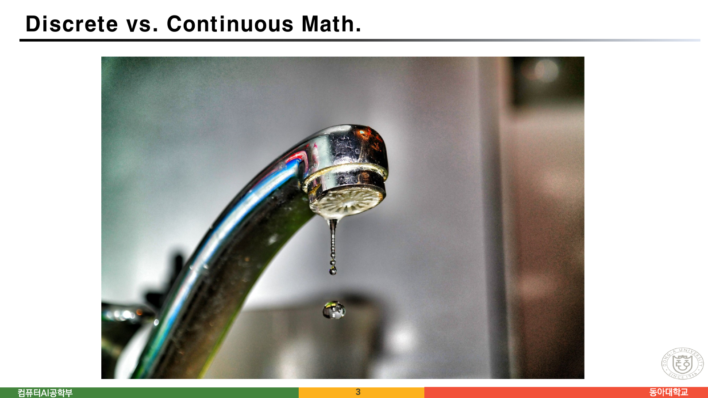
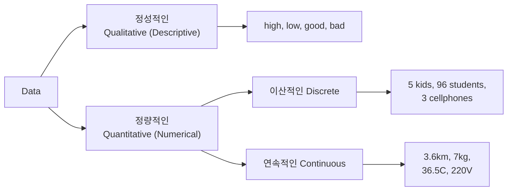
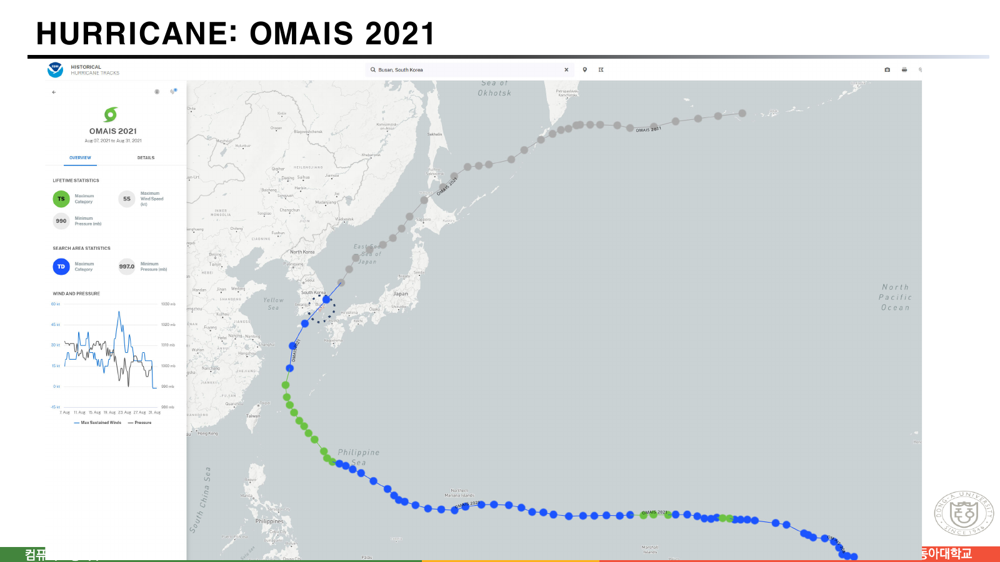
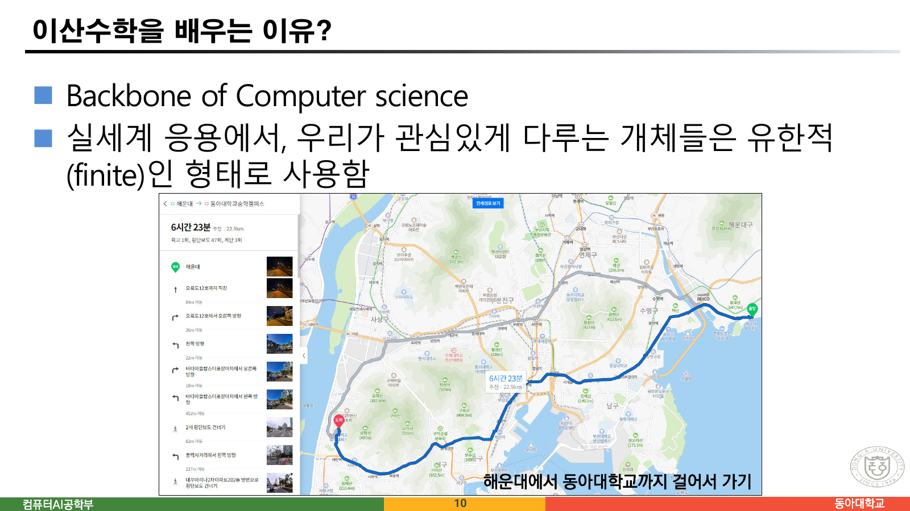
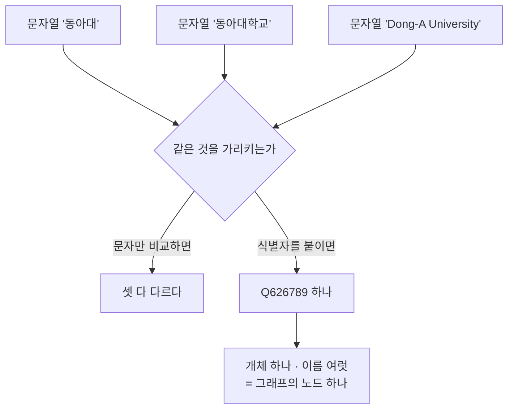

> [!abstract] 두 장의 사진이 과목 전체의 전제다
> `1 이산수학 소개.pdf`는 24쪽이고, 그중 **10쪽까지가 내용**이며 나머지 14쪽은 강의계획·평가·수강 안내다. 그 10쪽 안에서도 2쪽과 3쪽은 제목 한 줄과 **사진 한 장**이 전부다. 텍스트로는 각각 40자와 40자, 같은 제목 `Discrete vs. Continuous Math.` 뿐이다.
>
> 두 사진은 맥주를 따르는 장면과 수도꼭지에서 물방울이 떨어지는 장면이다. 둘 다 물이다. 차이는 물에 있지 않고 **무엇으로 셀 수 있는가**에 있다 — 한쪽은 잔에 찬 양(연속)으로만 말할 수 있고, 다른 쪽은 방울 개수(이산)로 셀 수 있다.
>
> 이 정리는 그 한 장면을 척추로 삼는다. 이후 다섯 쪽(4~10쪽)에 실린 태풍 궤적·공공데이터 표·도보 경로·지식그래프는 모두 **같은 대상을 이산으로 바꾸어 놓은 사례**이고, 이 과목이 왜 컴퓨터 과학의 기초인지에 대한 답도 거기서 나온다.

---

## 1. 두 장의 사진




두 쪽에는 설명이 한 줄도 없다. 그러나 물어야 할 것은 분명하다 — **"이 장면에서 셀 수 있는 것이 무엇인가?"**

| | 2쪽 (흐르는 맥주) | 3쪽 (떨어지는 물방울) |
| --- | --- | --- |
| 셀 수 있는 것 | 없다 | 방울의 개수 |
| 잴 수 있는 것 | 부피·높이·유량 | (방울마다) 부피 |
| 두 값 사이 | 언제나 값이 있다 | 다음 방울까지 아무것도 없다 |
| 수학 | 미적분·해석학 | 이산수학 |

핵심은 **"두 값 사이에 무엇이 있는가"** 다. 잔에 250mL와 251mL가 있으면 그 사이 250.4mL도 반드시 있다. 방울 3개와 4개 사이에는 3.5개가 없다. 이 차이 하나가 쓸 수 있는 도구를 통째로 갈라 놓는다.

원본 9쪽은 그 갈림을 데이터의 분류로 다시 그린다.



원본 9쪽을 그대로 옮긴 것이다. 이 그림에서 눈여겨볼 것은 **이산과 연속의 갈림이 '정량적인' 아래에만 있다**는 점이다. `high`·`low` 같은 정성적 값은 애초에 그 질문의 대상이 아니다. 그런데 그런 값도 컴퓨터는 다뤄야 하고, 그때 쓰는 것이 8쪽의 지식그래프다(§4).

---

## 2. 태풍 — 같은 화면에 둘이 다 있다

4쪽은 NOAA의 과거 태풍 궤적 서비스에서 **OMAIS 2021**을 띄운 화면이다.



한 화면 안에 두 표현이 같이 있다.

- **지도 위 궤적** — 태풍이 실제로 지나간 길은 끊김 없는 곡선이다. 그런데 화면에 찍힌 것은 **점의 나열**이다. 관측 시각마다 위치를 하나씩 찍고 선으로 이었다.
- **왼쪽 아래 그래프** — `Max Sustained Winds`와 `Pressure`를 8월 7일부터 31일까지 꺾은선으로 그렸다. 이쪽도 관측점을 이은 것이다.

원본 6쪽은 여기에 생각할 거리를 붙인다.

> ◼ `https://coast.noaa.gov/hurricanes/` — "MAEMI 2003" 검색
> ⚫ **Continuous versus Discrete movement**
> ◼ 생각해 볼 점
> ⚫ 태풍이 이동지점에서 선제조치 / 대응 방안을 설계
> ⚫ 태풍의 이동경로 혹은 도달시간 예측

"선제조치를 설계"하려면 **어느 지점에서 무엇을 할지**를 정해야 한다. 연속 곡선에는 '지점'이 없다 — 지점을 세려면 먼저 궤적을 점으로 끊어야 한다. 대응 계획이라는 실무가 이산화를 요구하는 것이지, 태풍이 원래 이산적인 것이 아니다.

---

## 3. 22.9km와 횡단보도 47회

10쪽은 이 자료에서 가장 구체적인 한 장이다. 제목은 **"이산수학을 배우는 이유?"** 이고, 본문은 두 줄이다.

> ◼ Backbone of Computer science
> ◼ 실세계 응용에서, 우리가 관심있게 다루는 개체들은 **유한적(finite)인 형태**로 사용함

그 아래에 지도 앱의 도보 경로 화면이 붙어 있다 — **해운대에서 동아대학교까지 걸어서 가기**.



화면에 적힌 값을 그대로 옮기면 이렇다.

| 화면이 보여주는 값 | 성격 |
| --- | --- |
| **6시간 23분** | 연속량(시간)을 분 단위로 끊은 값 |
| **22.9km** | 연속량(거리)을 100m 단위로 끊은 값 |
| **육교 1회 · 횡단보도 47회 · 계단 3회** | 처음부터 **개수** |
| 안내 단계 (94m 이동 → 36m 이동 → 22m 이동 → 19m 이동 → 452m 이동 → …) | 연속 경로를 유한한 단계로 분해 |

오른쪽 요약 세 값이 이 슬라이드의 요점이다. 횡단보도 47회는 반올림한 값이 아니다. **처음부터 셀 수 있는 것**이고, 47.5회는 존재하지 않는다. 그리고 실제로 이 경로를 걷는 사람에게 의미 있는 정보는 22.9km보다 "횡단보도를 47번 건넌다"는 쪽에 가깝다.

아래에서 같은 전환을 직접 해 보자. 세 가지 실물 자료를 놓고 **얼마나 잘게 끊을 것인가**를 움직이면, 이산화가 무엇을 남기고 무엇을 버리는지가 보인다.

```html preview h=600px
<div id="dz-root">
  <style>
    #dz-root{font-family:system-ui,-apple-system,"Segoe UI",sans-serif;color:var(--foreground);
      background:var(--card);border:1px solid var(--border);border-radius:10px;padding:16px}
    #dz-root h4{margin:0 0 4px;font-size:14px}
    #dz-root .sub{font-size:12px;opacity:.72;margin-bottom:12px;line-height:1.5}
    #dz-root .ctl{display:flex;gap:8px;flex-wrap:wrap;align-items:center;margin-bottom:12px;font-size:12.5px}
    #dz-root button{font:inherit;font-size:12px;padding:4px 9px;border-radius:6px;cursor:pointer;
      border:1px solid var(--border);background:transparent;color:var(--foreground)}
    #dz-root button.on{border-color:var(--chart-1);color:var(--chart-1)}
    #dz-root input[type=range]{width:190px;accent-color:var(--chart-1)}
    #dz-root svg{width:100%;height:230px;display:block;border:1px solid var(--border);border-radius:8px}
    #dz-root .stats{display:grid;grid-template-columns:repeat(auto-fit,minmax(130px,1fr));gap:8px;margin-top:12px}
    #dz-root .stat{border:1px solid var(--border);border-radius:8px;padding:9px 11px}
    #dz-root .stat .k{font-size:11px;opacity:.7}
    #dz-root .stat .v{font-size:16px;font-family:ui-monospace,SFMono-Regular,Menlo,monospace;margin-top:2px}
    #dz-root .stat .v.hi{color:var(--chart-1)}
    #dz-root .note{font-size:12px;opacity:.8;margin-top:11px;line-height:1.6;
      border-top:1px dashed var(--border);padding-top:10px}
  </style>
  <h4>연속을 이산으로 — 얼마나 잘게 끊을 것인가</h4>
  <div class="sub">회색 곡선이 "실제로 일어난 일", 강조된 점과 선이 "우리가 가진 자료"다.
  샘플 수를 줄이면 자료는 가벼워지고 대신 사이가 사라진다.</div>
  <div class="ctl">
    <button data-k="gas">한국가스공사 월별 생산량</button>
    <button data-k="wind">태풍 OMAIS 풍속</button>
    <button data-k="walk">해운대 → 동아대 도보</button>
    <span>샘플 <b id="dz-nl">9</b>개</span>
    <input type="range" id="dz-n" min="2" max="24" value="9">
  </div>
  <svg id="dz-svg" viewBox="0 0 720 230" preserveAspectRatio="none"></svg>
  <div class="stats">
    <div class="stat"><div class="k">저장하는 값의 개수</div><div class="v hi" id="dz-cnt">—</div></div>
    <div class="stat"><div class="k">두 값 사이의 간격</div><div class="v" id="dz-gap">—</div></div>
    <div class="stat"><div class="k">놓치는 최대 오차</div><div class="v" id="dz-err">—</div></div>
    <div class="stat"><div class="k">단위</div><div class="v" id="dz-unit">—</div></div>
  </div>
  <div class="note" id="dz-note"></div>
  <script>
  (function(){
    // 가스 생산량은 원본 5쪽 공공데이터포털 미리보기의 2016년 1~9월 값 그대로
    const GAS = [4288593,3592400,3201669,2135286,1989360,2076852,2300665,2278564,2046908];
    const SETS = {
      gas:{
        label:"한국가스공사 월별 천연가스 생산량 (2016년 1~9월, 단위 톤)",
        unit:"톤/월", xs:GAS.map((_,i)=>i), ys:GAS, xlab:m=>(m+1)+"월",
        note:"원본 5쪽의 공공데이터포털 미리보기에 실린 실제 값이다. 생산은 매 순간 이어지지만 "+
             "공개되는 자료는 <b>월 단위 합계 아홉 개</b>뿐이다. 8월 12일의 생산량은 이 자료에 없다."
      },
      wind:{
        label:"태풍 OMAIS 2021 · 최대 풍속의 개형 (원본 4쪽 그래프의 모양을 옮긴 것)",
        unit:"kt", xs:null, ys:null,
        gen:t=>18+37*Math.exp(-Math.pow((t-0.42)*3.1,2))+9*Math.sin(t*13)*Math.exp(-t*1.2),
        note:"원본 4쪽 왼쪽 아래 그래프에 대응한다. 요약값은 <b>Maximum Wind Speed 55kt</b>, "+
             "<b>Minimum Pressure 990mb</b> 두 개뿐이다 — 스물다섯 날의 곡선이 숫자 두 개로 줄어든 셈이다. "+
             "(곡선의 모양은 원본 그래프를 따라 그린 것이며, 관측값 자체는 아니다.)"
      },
      walk:{
        label:"해운대 → 동아대학교 승학캠퍼스 · 누적 거리 22.9km",
        unit:"km", xs:null, ys:null,
        gen:t=>22.9*t,
        note:"원본 10쪽의 경로다. 실제 걸음은 끊김이 없지만 안내는 <b>유한한 단계</b>로 온다 — "+
             "94m 이동, 36m 이동, 22m 이동, 19m 이동, 452m 이동 … 그리고 요약은 "+
             "<b>6시간 23분 · 22.9km · 육교 1회 · 횡단보도 47회 · 계단 3회</b>다."
      }
    };
    let key="gas";
    const N=document.getElementById("dz-n");
    function series(k){
      const s=SETS[k];
      if(s.ys) return {xs:s.ys.map((_,i)=>i/(s.ys.length-1)), ys:s.ys.slice()};
      const xs=[],ys=[];
      for(let i=0;i<=300;i++){ const t=i/300; xs.push(t); ys.push(s.gen(t)); }
      return {xs,ys};
    }
    function draw(){
      const s=SETS[key], full=series(key), n=Number(N.value);
      document.getElementById("dz-nl").textContent=n;
      const W=720,H=230,pad=26;
      const lo=Math.min(...full.ys), hi=Math.max(...full.ys), span=(hi-lo)||1;
      const X=t=>pad+(W-2*pad)*t, Y=v=>H-pad-(H-2*pad)*((v-lo)/span);
      const curve=full.xs.map((t,i)=>(i?"L":"M")+X(t).toFixed(1)+" "+Y(full.ys[i]).toFixed(1)).join(" ");
      // 샘플
      const samp=[];
      for(let i=0;i<n;i++){
        const t=(n===1)?0:i/(n-1);
        let idx=Math.round(t*(full.xs.length-1));
        samp.push({t:full.xs[idx], v:full.ys[idx]});
      }
      const poly=samp.map((p,i)=>(i?"L":"M")+X(p.t).toFixed(1)+" "+Y(p.v).toFixed(1)).join(" ");
      const dots=samp.map(p=>'<circle cx="'+X(p.t).toFixed(1)+'" cy="'+Y(p.v).toFixed(1)+
        '" r="3.4" fill="var(--chart-1)"/>').join("");
      document.getElementById("dz-svg").innerHTML =
        '<path d="'+curve+'" fill="none" stroke="var(--border)" stroke-width="3"/>'+
        '<path d="'+poly+'" fill="none" stroke="var(--chart-1)" stroke-width="1.6" '+
          'stroke-dasharray="5 3"/>'+dots+
        '<text x="'+pad+'" y="16" font-size="11" fill="var(--foreground)" opacity="0.75">'+s.label+'</text>';
      // 오차: 표본 선형보간과 원곡선의 최대 차
      let maxe=0;
      for(let i=0;i<full.xs.length;i++){
        const t=full.xs[i];
        let j=0; while(j<samp.length-2 && samp[j+1].t<t) j++;
        const a=samp[j], b=samp[Math.min(j+1,samp.length-1)];
        const u=(b.t===a.t)?0:(t-a.t)/(b.t-a.t);
        maxe=Math.max(maxe, Math.abs(full.ys[i]-(a.v+(b.v-a.v)*u)));
      }
      document.getElementById("dz-cnt").textContent=n;
      document.getElementById("dz-gap").textContent=
        key==="gas" ? (8/(n-1)).toFixed(2)+" 개월" : (100/(n-1)).toFixed(1)+" %";
      document.getElementById("dz-err").textContent=
        (maxe>=1000 ? Math.round(maxe).toLocaleString() : maxe.toFixed(2));
      document.getElementById("dz-unit").textContent=s.unit;
      document.getElementById("dz-note").innerHTML=s.note;
    }
    document.querySelectorAll("#dz-root button").forEach(b=>{
      b.onclick=()=>{ key=b.dataset.k;
        document.querySelectorAll("#dz-root button").forEach(x=>x.classList.toggle("on",x===b));
        N.max = (key==="gas") ? 9 : 24;
        if(Number(N.value)>Number(N.max)) N.value=N.max;
        draw(); };
    });
    N.addEventListener("input",draw);
    document.querySelector('#dz-root button[data-k="gas"]').classList.add("on");
    draw();
  })();
  </script>
</div>
```

가스 생산량 자료는 샘플을 9개보다 늘릴 수 없다. 원본 5쪽의 공공데이터포털 화면에 **월별 값 아홉 개가 전부**이기 때문이다. 연속량을 이미 누군가가 끊어서 공개한 자료를 받는 것이고, 그 간격을 우리가 되돌릴 방법은 없다. 이산수학이 다루는 대상이 대개 이런 모양이다.

---

## 4. 이름 셋을 하나로 묶는 문제

7~8쪽은 갑자기 지식그래프로 넘어간다. 7쪽이 정의를 두 줄로 준다.

> ◼ Knowledge base
> ⚫ A store of information or data
> ⚫ A set of facts, assumptions, and rules

8쪽은 그것을 한 가지 물음으로 좁힌다 — **"동아대 / 동아대학교 / Dong-A University … 웹 상에서 어떻게 식별할까?"** 화면에는 세 출처가 나란히 놓인다. 위키백과의 `Dong-a University`, 뉴스 기사의 `동아대`, 그리고 위키데이터의 `Dong-A University (Q626789)`.

앞의 둘은 **문자열**이고 마지막 하나는 **식별자**다. 이 차이가 §1의 갈림과 같은 종류다.



문자열끼리는 "비슷하다"는 말밖에 할 수 없다. 개체마다 **셀 수 있는 이름표**를 하나씩 붙이면 그 순간 노드가 되고, 노드 사이의 관계가 간선이 된다. 이것이 이 과목의 5~7장(관계·그래프·지식그래프)이 하는 일이고, 첫 강의가 그 목적지를 미리 보여 준 것이다.

원본 8쪽 화면의 위키데이터 항목이 그 구조를 그대로 드러낸다 — `English: Dong-A University`, `Korean: 동아대학교`, `Also known as: 동아대`, 그리고 `instance of: private university`. 이름은 여러 개, 개체는 하나, 관계는 화살표 하나다.

---

## 5. 강의계획서가 예고한 것과 남은 자료

11~12쪽은 2주차부터 14주차까지의 계획표다. 그대로 옮기면 이렇다.

| 주 | 학습목표 | 학습내용 | 과제 |
| --- | --- | --- | --- |
| 2 | 논리와 명제 | 논리와 명제, 추론, 술어 논리 | — |
| 3 | 부울대수, 증명법 | 부울식 표현, 증명의 방법론 | 과제 #1 |
| 4 | 집합 및 집합 연산 | 집합의 표현/연산/수의 표현 | 과제 #2 |
| 5 | 관계 | 관계와 이항 관계, 합성 관계 | 과제 #3 |
| 6 | 트리와 그래프 | 트리 개념, 표현, 이진 트리, 이진 트리의 탐방 | 과제 #4 |
| 7 | 그래프와 행렬: 고급 | 파라미터 최적화 | 과제 #5 |
| 9 | 트리와 그래프 | 그래프의 기본 개념, 용어, 탐색, 무향/가중치 그래프, 스패닝 트리, 이종동형 그래프 | 과제 #6 |
| 10 | 행렬 | 행렬과 행렬의 연산, 행렬식의 개념, 역행렬 | 과제 #7 |
| 11 | 함수 | 함수의 정의, 단사/전사/전단사 함수, 함수 그래프 | 과제 #8 |
| 12 | 순열과 조합, 확률 | 등차수열, 등비수열, 이항정리, 확률 | 과제 #9 |
| 13 | 오토마타 | 오토마타, 형식언어 | 과제 #10 |
| 14 | 고급: 자연어 기반 지식베이스 구축 | 자연어 분석도구를 통한 명제/논리 추출, 지식베이스 구축 | — |

12쪽 아래에는 한 줄이 더 있다 — **"12-14주에는 지식그래프, RDF 모델링, RDF/SPARQL 기초에 대해 학습"**. 그런데 같은 표의 12·13주 칸은 "순열과 조합, 확률"과 "오토마타"다. 표와 각주가 서로 다른 주제를 같은 주에 배정한다.

> [!caution] 원본 불일치 — 과제 개수가 두 곳에서 다르다
> 11~12쪽 계획표는 **과제 #1부터 #10까지 열 개**를 주차마다 배정한다. 그런데 20쪽 "과제 및 시험"은 이렇게 적는다.
>
> > ◼ **2개의 개별 과제 (10%)**
> > ⚫ 다수의 문제를 수기로 답안을 작성
> > ⚫ S03-423으로 오프라인 제출
>
> 열 개와 두 개다. 남은 자료를 보면 실제 제출물은 `Discrete_Mathematics__Homework_I` 하나이고 그 안에 18문항이 들어 있으므로, 20쪽 쪽이 실제에 가깝다. 11~12쪽의 "과제 #N"은 주차별 연습 문제를 가리키는 표 서식으로 보인다.
>
> 21쪽도 같은 자리에서 흔들린다. 굵은 항목은 "**과제 2개 미제출시**: 받을 수 있는 성적이 제한됨"인데, 그 아래 두 줄은 "과제 1개 미제출이더라도, A+ 부여"와 "과제 2개 미제출시 우수한 성적이라도 A"다. 제목이 다루는 경우(2개 미제출)와 본문이 다루는 경우(1개·2개)가 어긋난다.

같은 안내 묶음에서 표기 실수도 하나 눈에 띈다.

> [!note] 사소한 오류 — 같은 제목이 두 번
> 22쪽과 23쪽의 제목이 둘 다 **"협력과 학업의 진정성 (1)"** 이다. 23쪽은 (2)여야 한다. 내용은 다르다 — 22쪽은 금지 사항(직접 복사 금지, 출처 표기, 파일 공유 금지), 23쪽은 허용 사항(토의·상위 수준 의사코드·디버깅 도움)이다.

계획표와 실제로 남은 강의 자료를 맞춰 보면 이렇게 된다.

| 계획표의 주제 | 남아 있는 자료 |
| --- | --- |
| 논리와 명제 · 증명법 | `수학적 모델과 논리.pdf` (91쪽) |
| 집합 및 집합 연산 | `집합 및 집합연산.pdf` (46쪽) |
| 관계 · 합성 관계 · 함수 | `4 관계 및 함수.pdf` (125쪽) |
| 그래프 · 탐색 · 스패닝 트리 · 착색 | `5 그래프.pdf` (65쪽) + Appendix 1·2 |
| 트리 · 탐방 | `6 트리.pdf` (38쪽) |
| 지식그래프 · RDF | `7 지식그래프 소개.pdf` (12쪽) |
| **행렬 · 역행렬** | 없음 |
| **순열과 조합, 확률** | 없음 |
| **오토마타, 형식언어** | 없음 |

계획표의 14개 주제 중 **세 개(행렬, 순열·조합·확률, 오토마타)에 해당하는 자료가 없다.** 이 과목의 정리문서가 여섯 편인 이유이기도 하다.

---

## 6. "셀 수 있다"가 곧 컴퓨터가 다룰 수 있다

13~14쪽은 강의 목표를 넷으로 적는다.

| 목표 | 원본 문장 |
| --- | --- |
| 수학적인 추론 | 수학적인 논증(argument)과 증명(proof)을 읽고, 이해하고, 생성할 수 있다 |
| 조합적인 분석 | 다른 종류의 개체를 세기 위한 방법론 |
| 이산 구조 | Set, Permutation, Relations, Graphs, Trees |
| 알고리즘 사고력 | 알고리즘을 지정하고, 시간과 메모리를 분석하고, 올바른 정답을 생성하는지 증명하는 것 |

네 항목이 §1의 물음과 이어진다. **셀 수 있는 것만 자료구조에 담을 수 있고, 자료구조에 담긴 것만 알고리즘이 다룰 수 있으며, 유한한 단계로 끝나는 것만 증명할 수 있다.** 16쪽이 이후 과목 목록을 길게 나열하는 것(Computer Architecture, Data Structures, Algorithms, Compilers, Databases, AI, Networking, Graphics …)은 그 셋이 컴퓨터 과학 전반의 전제이기 때문이다.

24쪽의 마지막 조언 네 줄 중 하나가 이 과목의 성격을 요약한다 — **"용어는 가능한 영어로 외울려고 노력한다."** 남은 여섯 편의 자료가 전부 한국어 설명과 영어 원서 슬라이드를 섞어 쓴다. 같은 개념이 `반사 관계`와 `Reflexive Relation`으로 두 번 나오고, 표기가 갈리는 자리마다 원어를 알아야 무엇이 같은 말인지 판별할 수 있다.

---

## 7. 확인 문제

1. 2쪽과 3쪽의 사진에서 각각 셀 수 있는 것과 잴 수 있는 것을 하나씩 들어 보라
2. 10쪽 화면에서 "22.9km"와 "횡단보도 47회"는 성격이 어떻게 다른가? 둘 중 반올림된 값은 어느 쪽인가
3. 8쪽의 세 화면이 같은 대학을 가리킨다는 것을 컴퓨터가 알려면 무엇이 필요한가
4. 9쪽의 분류에서 `36.5C`(체온)는 연속으로 분류되어 있다. 그런데 체온계가 표시하는 값은 이산이다. 왜 그런가
5. 11~12쪽 계획표의 주제 중 남아 있는 자료가 없는 것 셋을 들어 보라
6. 20쪽과 11~12쪽에서 과제의 개수가 다르다. 실제 자료(`Discrete_Mathematics__Homework_I`)에 비추면 어느 쪽이 맞는가

---

## 8. 이어지는 자료

- [02. 기호가 말과 어긋나는 자리](<./02. 기호가 말과 어긋나는 자리.md>) — 2·3주차 논리와 증명법
- [03. 없는 칸 하나 — 집합의 네 종류 중 하나는 비어 있다](<./03. 없는 칸 하나 — 집합의 네 종류 중 하나는 비어 있다.md>) — 4주차 집합
- [04. 목차에 없는 함수](<./04. 목차에 없는 함수.md>) — 5주차 관계
- [05. 필요조건을 충분조건으로 쓴 자리](<./05. 필요조건을 충분조건으로 쓴 자리.md>) — 그래프
- [06. 같은 트리를 세 번 읽으면](<./06. 같은 트리를 세 번 읽으면.md>) — 트리와 지식그래프

---

## 근거 자료

`ComputerScience/02_math-theory/discrete-mathematics/sources/1 이산수학 소개.pdf` (24쪽) 전체.

| 쪽 | 내용 | 이 문서에서 쓴 곳 |
| --- | --- | --- |
| 2·3 | Discrete vs. Continuous — 사진 두 장 | §1 |
| 4 | HURRICANE: OMAIS 2021 (NOAA 화면) | §2 · 인터랙티브 |
| 5 | 집계/통계 데이터 (공공데이터포털 · 한국가스공사) | 인터랙티브 원본 값 |
| 6 | Hurricanes trajectory — 생각해 볼 점 | §2 |
| 7·8 | Knowledge graph / 동아대 식별 문제 | §4 |
| 9 | 데이터(Data) 분류 | §1 |
| 10 | 이산수학을 배우는 이유 (도보 경로) | §3 |
| 11·12 | 강의계획 (2~14주) | §5 |
| 13·14 | 이산 수학의 강의 목표 | §6 |
| 16 | 환영합니다 — 후속 과목 목록 | §6 |
| 20·21 | 과제 및 시험 / 성적 부여 | §5 원본 불일치 |
| 22·23 | 협력과 학업의 진정성 | §5 사소한 오류 |
| 24 | 큰 성취를 하는 방법 | §6 |

인용한 슬라이드 4장은 위 PDF 2·3·4·10쪽을 120dpi로 렌더링한 것이다. 인터랙티브의 가스 생산량 아홉 값(4288593, 3592400, 3201669, 2135286, 1989360, 2076852, 2300665, 2278564, 2046908)은 원본 5쪽 미리보기 표를 그대로 옮긴 것이고, 도보 경로의 요약값과 태풍의 요약값(최대 풍속 55kt, 최저 기압 990mb)도 원본 화면에서 읽은 값이다. 태풍 풍속 곡선의 모양만은 원본 그래프의 개형을 따라 그린 것이며 관측값 자체가 아니라는 점을 인터랙티브 안에 명시했다.
