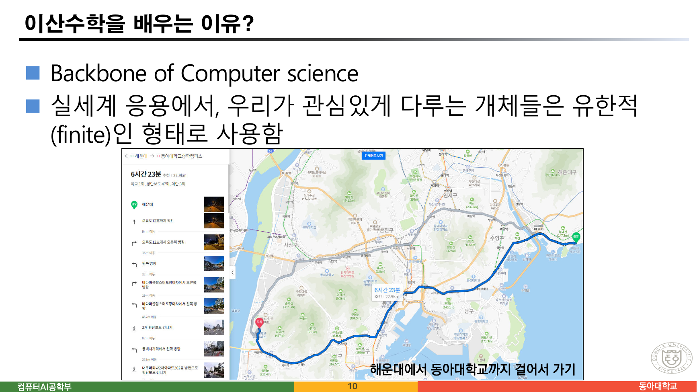
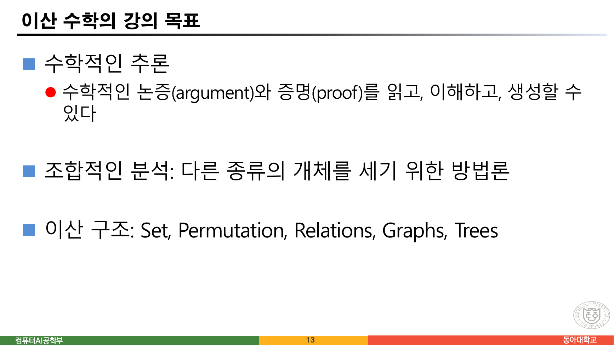
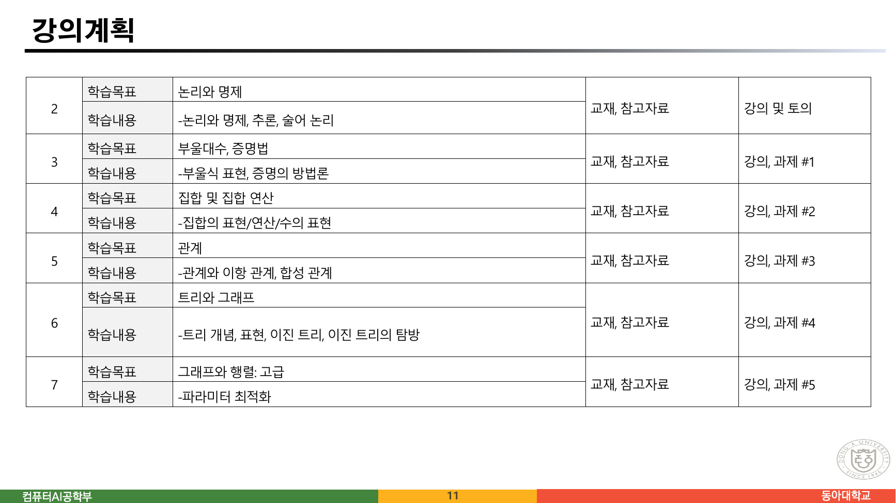
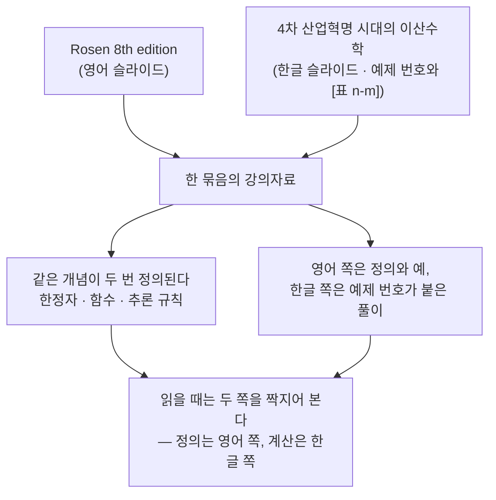
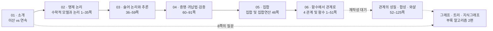

> [!abstract] 24쪽 중 수학은 열 쪽이다
> 이 첫 자료는 24쪽인데, **개념을 다루는 것은 2~14쪽의 열세 쪽뿐**이고 15~24쪽 열 쪽은 통째로 강의 운영(커뮤니케이션·성적·학업 진정성)이다. 그마저도 2~8쪽은 태풍 궤적과 지식 그래프 사진이 대부분이라 글자가 40자를 넘지 않는다.
>
> 그렇다고 버릴 자료가 아니다. **11·12쪽의 강의계획표**가 이 과목 전체의 설계도이기 때문이다. 그 표는 2주부터 14주까지 열세 개 주제를 약속하는데, `sources/` 에 실제로 남은 PDF는 11편이다. **약속과 실물을 한 줄씩 맞춰 보면 세 주제가 통째로 비어 있고, 반대로 계획에 없던 자료 세 편이 들어와 있다.**
>
> 그래서 이 정리의 척추는 "이산수학이란 무엇인가"가 아니라 **"이 강의가 무엇을 하겠다고 했고, 우리 손에 무엇이 남았는가"** 다. 그것이 앞으로 읽을 열 편의 지도가 된다.

---

## 1. 이산과 연속을 가르는 자리

원본은 정의로 시작하지 않는다. 2~6쪽에 **태풍 사진**을 붙여 놓고 6쪽에서 링크 하나와 문장 하나를 던진다.

> ◼ <https://coast.noaa.gov/hurricanes/#map=4/32/-80>
> ⚫ "MAEMI 2003" 검색
> ⚫ **Continuous versus Discrete movement**
>
> ◼ 생각해 볼 점
> ⚫ 태풍이 이동지점에서 선제조치 / 대응 방안을 설계
> ⚫ 태풍의 이동경로 혹은 도달시간 예측

태풍은 **연속적으로** 움직인다. 그런데 우리가 손에 쥘 수 있는 것은 관측소가 **몇 시간마다 찍어 둔 점**뿐이다. 4쪽의 `HURRICANE: OMAIS 2021`, 5쪽의 `집계 / 통계 데이터` 가 그 점들이다. 대응 방안을 설계하려면 그 점들 위에서 계산해야 한다.

9쪽이 이 대비를 표로 정리한다.


원본이 든 예를 그대로 옮기면 이렇다.

| 갈래 | 원본이 든 예 |
| --- | --- |
| 정성적인(Qualitative, Descriptive) | high, low, good, bad |
| 정량적인(Quantitative, Numerical) → 이산적인(Discrete) | 5 kids, 96 students, 3 cellphones |
| 정량적인(Quantitative, Numerical) → 연속적인(Continuous) | 3.6km, 7kg, 36.5C, 220V |

세 예를 나란히 놓으면 갈림의 기준이 보인다. **"반 개"가 말이 되는가.** 아이 2.5명은 없고 학생 96.3명도 없지만, 3.6km와 7kg 사이에는 값이 무한히 많다.

```html preview h=500px
<div style="font-family:system-ui,-apple-system,sans-serif;padding:18px;color:var(--foreground)">
  <p style="font-size:12.5px;color:var(--muted-foreground);margin:0 0 12px">
    원본 9쪽의 예 아홉 개다. 각 카드를 눌러 어느 갈래인지 맞혀 보라 — 기준은 “그 값의 <b>반</b>이 말이 되는가”다.
  </p>
  <div id="cards" style="display:grid;grid-template-columns:repeat(auto-fill,minmax(150px,1fr));gap:10px"></div>
  <div id="score" style="margin-top:14px;padding:11px 13px;background:var(--card);border:1px solid var(--border);border-radius:var(--radius);font-size:13px;line-height:1.75"></div>

  <script>
    var ITEMS = [
      {v:'high',          k:'qual', why:'정성적 — 순서는 있으나 수가 아니다'},
      {v:'low',           k:'qual', why:'정성적'},
      {v:'good',          k:'qual', why:'정성적'},
      {v:'bad',           k:'qual', why:'정성적'},
      {v:'5 kids',        k:'disc', why:'이산적 — 아이 2.5명은 없다'},
      {v:'96 students',   k:'disc', why:'이산적 — 학생 96.3명은 없다'},
      {v:'3 cellphones',  k:'disc', why:'이산적'},
      {v:'3.6 km',        k:'cont', why:'연속적 — 3.6과 3.7 사이에 값이 무한히 많다'},
      {v:'7 kg',          k:'cont', why:'연속적'},
      {v:'36.5 C',        k:'cont', why:'연속적 — 체온은 눈금 사이에도 존재한다'},
      {v:'220 V',         k:'cont', why:'연속적'}
    ];
    var NAME = {qual:'정성적', disc:'이산적', cont:'연속적'};
    var COL  = {qual:'var(--chart-4)', disc:'var(--chart-1)', cont:'var(--chart-2)'};
    var shown = {};
    function render() {
      document.getElementById('cards').innerHTML = ITEMS.map(function (it, i) {
        var open = shown[i];
        return '<div class="ic" data-i="' + i + '" style="cursor:pointer;padding:11px 12px;border:1px solid ' +
          (open ? COL[it.k] : 'var(--border)') + ';border-radius:var(--radius);background:var(--card)">' +
          '<div style="font-family:ui-monospace,monospace;font-size:15px;font-weight:700">' + it.v + '</div>' +
          (open
            ? '<div style="font-size:11px;font-weight:700;color:' + COL[it.k] + ';margin-top:5px">' + NAME[it.k] + '</div>' +
              '<div style="font-size:11.5px;color:var(--muted-foreground);margin-top:3px;line-height:1.55">' + it.why + '</div>'
            : '<div style="font-size:11.5px;color:var(--muted-foreground);margin-top:5px">눌러서 확인</div>') +
          '</div>';
      }).join('');
      var n = Object.keys(shown).length;
      var c = {qual:0, disc:0, cont:0};
      ITEMS.forEach(function (it) { c[it.k]++; });
      document.getElementById('score').innerHTML =
        '<b>' + n + ' / ' + ITEMS.length + '</b> 확인함 &nbsp;·&nbsp; 원본 9쪽의 분포: 정성적 <b>' + c.qual +
        '</b> · 이산적 <b>' + c.disc + '</b> · 연속적 <b>' + c.cont + '</b>' +
        '<br/><span style="color:var(--muted-foreground);font-size:12.5px">이산수학이 다루는 것은 가운데 갈래다. ' +
        '10쪽이 그 이유를 한 줄로 적었다 — “실세계 응용에서, 우리가 관심있게 다루는 개체들은 <b>유한적(finite)</b>인 형태로 사용함”.</span>';
      Array.prototype.forEach.call(document.getElementsByClassName('ic'), function (el) {
        el.onclick = function () { shown[el.getAttribute('data-i')] = true; render(); };
      });
    }
    render();
  </script>
</div>
```

10쪽이 이유를 한 문장으로 못박는다.



> ◼ Backbone of Computer science
> ◼ 실세계 응용에서, 우리가 관심있게 다루는 개체들은 **유한적(finite)인 형태로 사용함**
>
> (아래 그림 설명) 해운대에서 동아대학교까지 걸어서 가기

마지막 줄이 태풍 예와 짝을 이룬다. 해운대에서 동아대까지 가는 길은 지도 위의 연속된 곡선이지만, **실제로 계산하는 것은 교차로라는 유한한 점과 그 사이를 잇는 유한한 길**이다. 이 강의 후반의 그래프·트리가 정확히 그 형태다.

---

## 2. 지식 그래프 — 첫 시간에 이미 끝을 보여 준다

7·8쪽은 앞뒤 맥락 없이 지식 그래프를 꺼낸다.

> **Knowledge base**
> ⚫ A store of information or data
> ⚫ A set of facts, assumptions, and rules
>
> **Knowledge graph**
> ◼ 동아대 / 동아대학교 / Dong-A University
> ⚫ **웹 상에서 어떻게 식별할까?**

8쪽의 질문이 이 강의의 마지막 목적지다. 같은 대상을 가리키는 세 이름을 **웹 상에서 하나로 묶으려면** 이름 대신 식별자가 필요하고, 그 식별자를 잇는 것이 관계이며, 관계들의 모음이 그래프다. 12쪽 강의계획의 맨 아래 줄이 이를 확인해 준다.

> 12-14주에는 지식그래프, RDF 모델링, RDF/SPARQL 기초에 대해 학습

즉 **첫 시간의 8쪽 질문에 마지막 3주가 답한다.** 14쪽도 강의 목표의 마지막 항목으로 "지식그래프 기초와 사용"을 적어 두었다.



13·14쪽이 목표를 네 갈래로 나눈다.

| 목표 | 원본 서술 | 이 과목에서 실제로 나타나는 곳 |
| --- | --- | --- |
| 수학적인 추론 | 논증(argument)과 증명(proof)을 읽고, 이해하고, 생성 | 2장 논리 — 추론의 법칙, 증명 방법 다섯 가지 |
| 조합적인 분석 | 다른 종류의 개체를 세기 위한 방법론 | 3장 집합 — 포함배제의 원리 |
| 이산 구조 | Set, Permutation, Relations, Graphs, Trees | 3~6장 전체 |
| 알고리즘 사고력 | 알고리즘 지정 · 시간과 메모리 분석 · 정답 생성 증명 | 와샬 알고리즘, 플로이드-워셜, 웰치-포웰 |

여기서 **Permutation(순열)** 이 눈에 걸린다. 목표에 이산 구조로 적혀 있지만, 아래 §3에서 보듯 순열을 다루는 자료가 남아 있지 않다.

---

## 3. 강의계획표와 자료를 맞춰 본다



11·12쪽의 두 표가 2주부터 14주까지를 채운다(8주와 15주는 표에 없다 — 통상 시험 주간이다). 원본 표의 학습목표를 그대로 옮기고, `sources/` 폴더에 실제로 있는 PDF와 맞춰 보았다.

```html preview h=620px
<div style="font-family:system-ui,-apple-system,sans-serif;padding:18px;color:var(--foreground)">
  <div style="display:flex;gap:8px;flex-wrap:wrap;margin-bottom:13px">
    <button class="wf" data-f="all"  style="cursor:pointer">전체 13주</button>
    <button class="wf" data-f="have" style="cursor:pointer">자료가 있다</button>
    <button class="wf" data-f="none" style="cursor:pointer">자료가 없다</button>
    <button class="wf" data-f="extra" style="cursor:pointer">계획에 없던 자료</button>
  </div>
  <div id="wl" style="display:flex;flex-direction:column;gap:7px"></div>
  <div id="wsum" style="margin-top:14px;padding:12px 14px;background:var(--card);border:1px solid var(--border);border-radius:var(--radius);font-size:13px;line-height:1.8"></div>

  <script>
    var W = [
      {w:'2주',  goal:'논리와 명제',            pdf:'수학적 모델과 논리.pdf (91쪽)',  s:'have'},
      {w:'3주',  goal:'부울대수, 증명법',        pdf:'수학적 모델과 논리.pdf — 증명법만',  s:'part'},
      {w:'4주',  goal:'집합 및 집합 연산',       pdf:'집합 및 집합연산.pdf (46쪽)',   s:'have'},
      {w:'5주',  goal:'관계',                  pdf:'4 관계 및 함수.pdf (125쪽)',    s:'have'},
      {w:'6주',  goal:'트리와 그래프',           pdf:'6 트리.pdf (38쪽)',            s:'have'},
      {w:'7주',  goal:'그래프와 행렬: 고급',      pdf:'— (학습내용은 “파라미터 최적화”)', s:'none'},
      {w:'9주',  goal:'트리와 그래프',           pdf:'5 그래프.pdf (65쪽)',           s:'have'},
      {w:'10주', goal:'행렬',                  pdf:'—',                            s:'none'},
      {w:'11주', goal:'함수',                  pdf:'4 관계 및 함수.pdf 앞부분',       s:'have'},
      {w:'12주', goal:'순열과 조합, 확률',       pdf:'—',                            s:'none'},
      {w:'13주', goal:'오토마타',               pdf:'—',                            s:'none'},
      {w:'14주', goal:'자연어 기반 지식베이스 구축', pdf:'7 지식그래프 소개.pdf (12쪽)',   s:'have'},
      {w:'—',   goal:'계획에 없음',             pdf:'Appendix 1 Floyd Warshall (10쪽)', s:'extra'},
      {w:'—',   goal:'계획에 없음',             pdf:'Appendix 2 Welch-Powell (7쪽)',   s:'extra'},
      {w:'—',   goal:'계획에 없음',             pdf:'Discrete_Mathematics__Homework_I (4쪽)', s:'extra'},
      {w:'—',   goal:'같은 내용 중복',           pdf:'5 그래프 2.pdf — 텍스트가 “5 그래프.pdf”와 완전히 같다', s:'extra'}
    ];
    var C = {have:'var(--chart-2)', part:'var(--chart-4)', none:'var(--chart-5)', extra:'var(--chart-3)'};
    var L = {have:'자료 있음', part:'일부만', none:'자료 없음', extra:'계획 밖'};
    function render(f) {
      var rows = W.filter(function (r) {
        return f === 'all' || (f === 'have' && (r.s === 'have' || r.s === 'part')) ||
               (f === 'none' && r.s === 'none') || (f === 'extra' && r.s === 'extra');
      });
      document.getElementById('wl').innerHTML = rows.map(function (r) {
        return '<div style="display:flex;gap:11px;align-items:baseline;padding:8px 12px;border:1px solid var(--border);' +
          'border-left:4px solid ' + C[r.s] + ';border-radius:var(--radius);background:var(--card)">' +
          '<div style="min-width:38px;font-size:12.5px;font-weight:700;color:var(--muted-foreground)">' + r.w + '</div>' +
          '<div style="min-width:160px;font-size:13.5px;font-weight:600">' + r.goal + '</div>' +
          '<div style="flex:1;min-width:180px;font-size:12.5px;color:var(--muted-foreground)">' + r.pdf + '</div>' +
          '<div style="font-size:10.5px;font-weight:700;color:' + C[r.s] + '">' + L[r.s] + '</div></div>';
      }).join('');
      document.getElementById('wsum').innerHTML =
        '계획표의 <b>13개 주제</b> 중 자료가 남은 것은 <b style="color:var(--chart-2)">8개</b>, ' +
        '일부만 남은 것이 <b style="color:var(--chart-4)">1개</b>(부울대수), ' +
        '통째로 없는 것이 <b style="color:var(--chart-5)">4개</b>(그래프와 행렬 고급 · 행렬 · 순열과 조합·확률 · 오토마타)다.<br/>' +
        '반대로 <b style="color:var(--chart-3)">계획에 없던 자료 4편</b>이 들어와 있다 — 부록 알고리즘 두 편, 과제 한 편, ' +
        '그리고 <b>내용이 같은 그래프 파일이 두 개</b>다.';
    }
    Array.prototype.forEach.call(document.getElementsByClassName('wf'), function (b) {
      b.style.cssText = 'padding:6px 12px;font-size:12.5px;border:1px solid var(--border);border-radius:var(--radius);' +
        'background:var(--card);color:var(--foreground);cursor:pointer';
      b.onclick = function () { render(b.getAttribute('data-f')); };
    });
    render('all');
  </script>
</div>
```

> [!warning] 원본 오류 ① — 7주차의 학습목표와 학습내용이 어긋난다
> 11쪽 7주차 칸은 학습목표를 **"그래프와 행렬: 고급"** 이라 적어 놓고, 바로 아래 학습내용에는 **"-파라미터 최적화"** 만 적었다. 파라미터 최적화는 그래프도 행렬도 아니다. 앞뒤 주차의 칸들이 모두 "학습목표 = 학습내용의 요약"인데 이 칸만 그렇지 않다.

표 안에서 걸리는 자리가 하나 더 있다.

> [!caution] 원본 표기 중복 — "트리와 그래프"가 두 번
> 11쪽 6주차와 12쪽 9주차의 학습목표가 둘 다 **"트리와 그래프"** 다. 학습내용을 보면 6주차는 트리(개념·표현·이진 트리·탐방), 9주차는 그래프(기본 개념·용어·탐색·무향/가중치·스패닝 트리)로 서로 다른데, 목표 칸의 라벨만 같다.

표 밖에서는 파일 목록 자체가 눈에 걸린다.

> [!note] 자료가 두 벌인 그래프 파일
> `sources/` 에 `5 그래프.pdf` 와 `5 그래프 2.pdf` 가 함께 있다. 두 파일은 크기가 같고(5,591,661바이트) 쪽수도 같으며(65쪽), **추출한 텍스트가 파일명 줄을 빼면 완전히 동일**하다. 렌더링한 쪽 이미지도 바이트 단위로 같았다. 내용이 같은 두 벌이므로 하나만 읽으면 된다.

---

## 4. 교재가 두 계열이다

19쪽이 교재를 세 줄로 적는다.

> ◼ 교재
> ⚫ **Rosen의 이산수학 8th edition***
> ⚫ **4차 산업혁명 시대의 이산수학**
> ⚫ 이산수학 tool 중심으로 이해하는 새로운 시각

이 세 줄이 앞으로 읽을 자료의 성격을 설명해 준다. 뒤에 나올 슬라이드들은 **영어 슬라이드와 한글 슬라이드가 번갈아 나오고, 같은 개념을 두 번 정의**한다. 예를 들어 2장에서는 한정자를 41쪽(한글)과 42쪽(영어)에서 각각 정의하고, 4장에서는 함수의 정의가 11쪽과 25쪽에 두 번 나온다. 이 이중 구조는 두 교재를 한 슬라이드 묶음에 합친 흔적으로 읽힌다.



이 짝짓기가 실제로 유용하다. 뒤 장들에서 **영어 슬라이드가 정의를 주고 한글 슬라이드가 그 정의로 푼 예제를 준다.** 한쪽만 읽으면 정의는 알지만 계산을 못 하거나, 계산은 따라 하지만 왜 그런지 모르게 된다.

---

## 5. 나머지 열 쪽 — 운영 규칙

15~24쪽은 수학이 아니다. 그래도 두 가지는 짚어 둘 만하다.

**20쪽 배점.** 개별 과제 2개(10%) + 중간·기말 각 40%(80%) + 출석 5% + 참여도 5% = **100%**. 합이 맞는다. 시험은 각각 "15문제 내외"다.

**21쪽 성적 부여.** 여기가 어긋난다.

> ◼ 과제 2개 미제출시: 받을 수 있는 성적이 제한됨
> ⚫ 과제 1개 미제출이더라도, A+ 부여
> ⚫ 과제 2개 미제출시 우수한 성적이라도 A

세 줄이 서로 맞물리지 않는다.

> [!warning] 원본 오류 ② — 21쪽 성적 제한 규칙
> 큰 항목은 **"과제 2개 미제출시"** 만을 조건으로 걸어 놓고, 하위 두 줄은 1개 미제출과 2개 미제출을 **둘 다** 다룬다. 큰 항목이 "과제 미제출시"여야 아래 두 줄을 포괄한다.
>
> 내용도 읽기 어렵다 — "1개 미제출이더라도 A+ 부여"는 제한이 아니라 면제이고, "2개 미제출시 우수한 성적이라도 A"가 유일한 제한이다. 즉 실제 제한은 **A+ 를 A로 한 칸 내리는 것** 하나뿐인데, 항목 제목은 그보다 강한 어조다.

같은 묶음의 뒤쪽에는 제목 오타가 있다.

> [!caution] 원본 오타 ③ — 쪽 제목이 둘 다 "(1)"
> 22쪽과 23쪽의 제목이 모두 **"협력과 학업의 진정성 (1)"** 이다. 23쪽이 (2)여야 한다. 내용은 서로 다르다 — 22쪽은 금지 사항(복사 금지·출처 표기·파일 공유 금지), 23쪽은 허용 범위(토의·상위 수준 의사코드·디버깅 도움과 공동 작업자 등록)다.

**16쪽의 "15주 동안"** 도 계획표(2~14주)와 정확히 맞지는 않는다. 8주와 15주가 계획표에 없는 것을 감안하면 시험 주간을 포함한 학기 전체를 가리키는 표현으로 읽힌다.

**24쪽**은 마지막 장이면서 이 강의의 태도를 보여 준다.

> ◼ 수업에 제때 온다 — 첫 5분이 마지막 5분보다 중요하다
> ◼ 수업 시간동안 노트북은 필요없다
> ◼ 적극적인 수업 참여를 통해, 추가 점수를 획득한다
> ◼ **용어는 가능한 영어로 외울려고 노력한다.**

마지막 줄이 §4의 이중 교재 구조와 이어진다. 뒤 자료에서 **한글 용어와 영어 용어가 늘 나란히 나오는** 이유다 — 논리곱(conjunction), 진부분집합(proper subset), 유향 그래프(directed graph).

---

## 6. 이 자료로 만든 읽기 지도

강의계획과 실제 자료를 합치면 앞으로 읽을 순서가 나온다.



첫 자료의 8쪽 질문("동아대 / 동아대학교 / Dong-A University — 웹 상에서 어떻게 식별할까?")이 마지막 자료까지 이어지는 점선이 이 과목의 형태다.

---

## 이어지는 문서

- [02. 명제 논리 — 논리를 파서 문제로 다시 쓴다](<./02. 명제 논리 — 논리를 파서 문제로 다시 쓴다.md>)
- [03. 술어 논리와 논리적 추론 — 같은 규칙을 두 벌로 가르치는 자료](<./03. 술어 논리와 논리적 추론 — 같은 규칙을 두 벌로 가르치는 자료.md>)
- [05. 집합 — 정의 네 줄 중 하나는 존재하지 않는 집합이다](<./05. 집합 — 정의 네 줄 중 하나는 존재하지 않는 집합이다.md>)

관련 과목: [01/data-structures](../../../01_programming-foundations/data-structures/README.md)(트리·그래프의 구현), [06/algorithm-design-analysis](../../../06_algorithms-graphics/algorithm-design-analysis/README.md)(플로이드-워셜과 동적 계획법).

---

## 근거 자료

`ComputerScience/02_math-theory/discrete-mathematics/sources/1 이산수학 소개.pdf` (24쪽) 전체.

| 쪽 | 내용 | 이 문서에서 다룬 곳 |
| --- | --- | --- |
| 2–6 | Discrete vs. Continuous, 태풍 궤적 | §1 |
| 7–8 | Knowledge base / Knowledge graph | §2 |
| 9 | 데이터의 네 갈래 | §1 (슬라이드 인용) |
| 10 | 이산수학을 배우는 이유 | §1 (슬라이드 인용) |
| 11–12 | 강의계획 2~14주 | §3 (슬라이드 인용) |
| 13–14 | 강의 목표 네 갈래 | §2 (슬라이드 인용) |
| 16–24 | 강의 운영 · 교재 · 성적 · 학업 진정성 | §4 · §5 |

§3의 대조표는 `sources/` 폴더의 PDF 11편을 실제로 열어 쪽수를 세고, 두 그래프 파일은 추출 텍스트와 렌더 이미지를 바이트 단위로 비교해 확인했다. 원본에 없는 내용은 §4의 "두 교재를 합친 흔적"이라는 해석이며, 그 근거(같은 개념이 두 번 정의되는 쪽 번호)를 함께 적었다.
