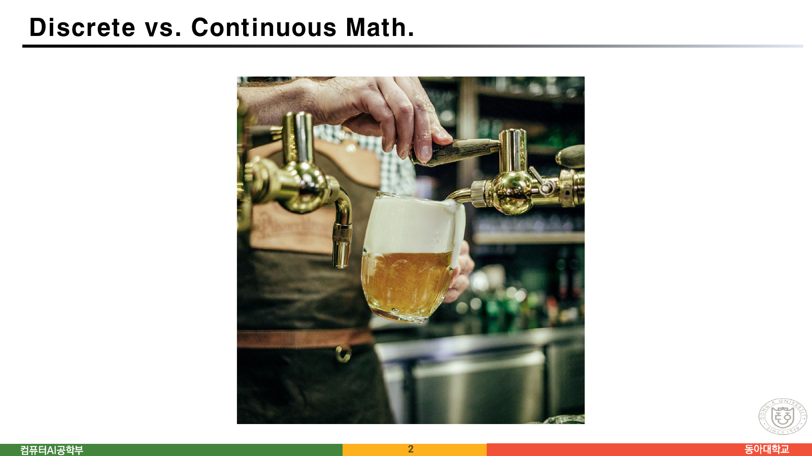
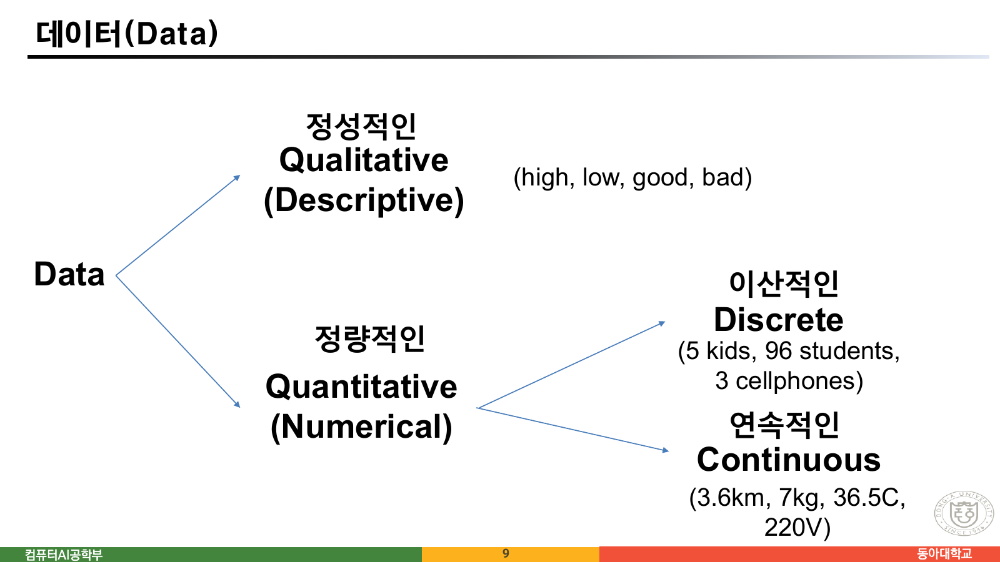
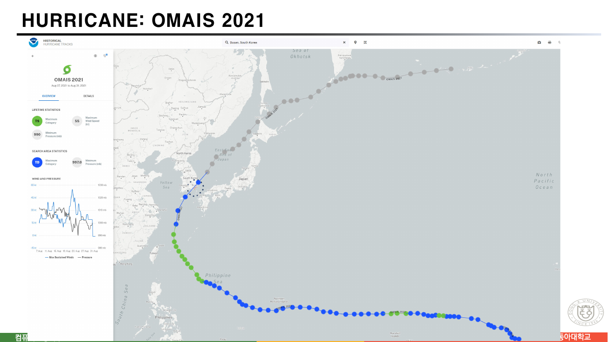
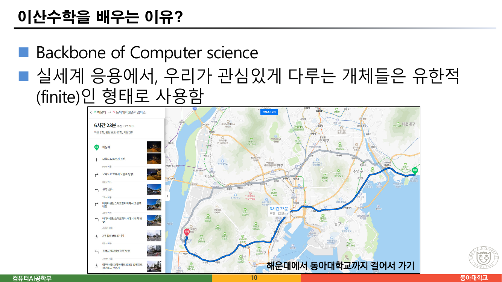
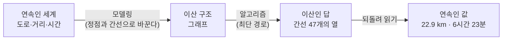
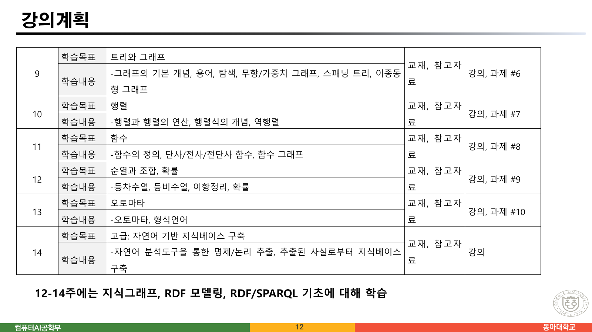
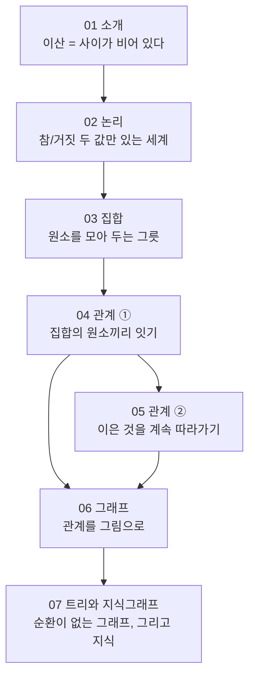

> [!abstract] 이 24쪽이 실제로 하는 말
> 첫 강의는 “이산수학이란 무엇인가”를 **정의로 시작하지 않는다.** 2쪽과 3쪽에는 제목 `Discrete vs. Continuous Math.` 아래에 **사진 한 장씩만** 있다. 글자가 없다. 하나는 맥주가 잔에 흘러드는 사진이고, 하나는 수도꼭지에서 물방울이 떨어지는 사진이다.
>
> 그 두 장이 이 강의 전체의 대비를 세운다. **끊기지 않는 것과, 낱개로 셀 수 있는 것.** 그리고 4쪽부터 10쪽까지는 같은 대비를 실제 데이터로 세 번 더 보여 준다 — 태풍의 궤적, 천연가스 월별 생산량, 해운대에서 동아대까지 걸어가는 길.
>
> 이 정리문서는 그 순서를 따라간다. 마지막에는 11·12쪽의 강의계획서를 열어, **약속한 14주와 실제로 남은 자료 열 편**을 나란히 놓는다. 그 대조가 이 과목 전체 정리문서의 지도가 된다.

---

## 1. 정의 대신 사진 두 장




> 원본 2쪽과 3쪽. 두 장 모두 제목은 똑같이 `Discrete vs. Continuous Math.` 이고, 본문 텍스트는 **한 글자도 없다.** 추출 도구가 이 두 쪽에서 읽어 낸 문자는 제목과 학교 이름을 합쳐 40자뿐이다.

두 사진의 차이를 말로 옮기면 이렇게 된다.

| | 맥주 (2쪽) | 물방울 (3쪽) |
| --- | --- | --- |
| 양이 변하는 방식 | 끊기지 않고 이어진다 | 한 방울씩 건너뛴다 |
| “지금 얼마나?”에 답하는 수 | 실수 — 337.42 mL | 정수 — 여덟 방울 |
| 중간값 | 두 값 사이에 언제나 또 다른 값이 있다 | 세 방울과 네 방울 사이에는 아무것도 없다 |
| 다루는 도구 | 미적분 — 극한, 미분, 적분 | 이산수학 — 셈, 논리, 그래프 |

세 번째 줄이 결정적이다. **연속은 “사이”가 언제나 채워져 있고, 이산은 “사이”가 비어 있다.** 이 한 줄의 차이에서 이 과목의 모든 도구가 갈라져 나온다. 두 값 사이가 비어 있기 때문에 극한을 취할 수 없고, 대신 **하나씩 세고, 짝지어 보고, 연결되어 있는지 묻는** 방법이 필요해진다.

9쪽은 이 구분을 데이터의 분류로 다시 정리한다.



> 원본 9쪽. `Data`가 정성적(Qualitative)과 정량적(Quantitative)으로 갈리고, 정량적인 쪽이 다시 이산적(Discrete)과 연속적(Continuous)으로 갈린다. 원본이 든 예는 그대로 옮기면 — 정성적: `high, low, good, bad` / 이산적: `5 kids, 96 students, 3 cellphones` / 연속적: `3.6km, 7kg, 36.5C, 220V`.

원본이 든 예시들을 직접 분류해 보면 경계가 어디에 있는지 감이 잡힌다. 아래 도구의 항목은 전부 9쪽 슬라이드에 인쇄된 것들이며, “왜 그쪽인가”를 판별하는 질문은 **“두 값 사이에 값이 있는가”** 하나다.

```html preview h=480px
<div style="font-family:system-ui,-apple-system,sans-serif;padding:20px;color:var(--foreground)">
  <p style="font-size:13px;color:var(--muted-foreground);margin:0 0 14px">
    원본 9쪽이 든 예시들. 각 항목을 눌러 어느 갈래인지 확인한다.
  </p>
  <div id="dcchips" style="display:flex;gap:8px;flex-wrap:wrap;margin-bottom:16px"></div>
  <div id="dcbox" style="padding:13px 15px;background:var(--card);border:1px solid var(--border);border-radius:var(--radius);font-size:13.5px;line-height:1.8;min-height:96px"></div>

  <script>
    var ITEMS = [
      ['high', 'qual', '순서는 있어도 수가 아니다 — 정량화하려면 척도를 따로 정해야 한다'],
      ['low', 'qual', '“low보다 조금 높은 값”을 수로 적을 방법이 슬라이드에는 없다'],
      ['good', 'qual', '서술적(Descriptive) — 값이 아니라 이름이다'],
      ['bad', 'qual', '정성적인 값끼리는 더하거나 평균 낼 수 없다'],
      ['5 kids', 'disc', '아이 5명과 6명 사이에 5.4명은 없다'],
      ['96 students', 'disc', '학생 수는 언제나 자연수 — 세는 대상이다'],
      ['3 cellphones', 'disc', '휴대폰 3대와 4대 사이가 비어 있다'],
      ['3.6 km', 'cont', '3.6과 3.7 사이에 3.61, 3.612, … 가 끝없이 있다'],
      ['7 kg', 'cont', '측정 정밀도를 올리면 자릿수가 계속 늘어난다'],
      ['36.5 C', 'cont', '체온은 재는 값 — 세는 값이 아니다'],
      ['220 V', 'cont', '전압은 연속적으로 변한다 (계기가 반올림해 보여 줄 뿐)']
    ];
    var LABEL = {
      qual: ['정성적 Qualitative', 'var(--chart-4)'],
      disc: ['이산적 Discrete', 'var(--chart-1)'],
      cont: ['연속적 Continuous', 'var(--chart-2)']
    };
    var box = document.getElementById('dcbox');
    ITEMS.forEach(function (it) {
      var b = document.createElement('button');
      b.textContent = it[0];
      b.style.cssText = 'padding:7px 12px;font-size:13px;border:1px solid var(--border);border-radius:var(--radius);' +
        'background:var(--card);color:var(--foreground);cursor:pointer';
      b.onclick = function () {
        var L = LABEL[it[1]];
        box.innerHTML = '<div style="font-size:17px;font-weight:700;margin-bottom:6px">' + it[0] + '</div>' +
          '<div style="display:inline-block;padding:3px 10px;border-radius:999px;background:' + L[1] +
          ';color:var(--background);font-size:12px;font-weight:600;margin-bottom:8px">' + L[0] + '</div>' +
          '<div style="color:var(--muted-foreground)">' + it[2] + '</div>';
      };
      document.getElementById('dcchips').appendChild(b);
    });
    box.innerHTML = '<span style="color:var(--muted-foreground)">위 항목 중 하나를 눌러 보라. ' +
      '판별 질문은 하나다 — <b style="color:var(--foreground)">두 값 사이에 값이 있는가?</b></span>';
  </script>
</div>
```

---

## 2. 태풍 — 연속을 이산으로 바꾸는 순간



> 원본 4쪽. NOAA의 `Historical Hurricane Tracks`에서 2021년 태풍 OMAIS의 경로를 띄운 화면 캡처다. 왼쪽 패널에 `Aug 07, 2021 to Aug 31, 2021`, 최대 등급 TS, 최대 풍속 55 kt, 최저 기압 990 mb가 적혀 있다.

이 한 장이 이 강의의 핵심 장면이다. 태풍은 **끊기지 않고 움직인다** — 그 경로는 시간에 대해 연속인 곡선이다. 그런데 화면에 보이는 것은 **점의 열**이다. 관측소가 여섯 시간마다 한 번씩 위치를 기록했기 때문이다.

6쪽은 이 점을 학생에게 직접 확인시킨다. NOAA 사이트 주소를 적어 두고 `“MAEMI 2003” 검색`, 그리고 `Continuous versus Discrete movement`라고만 써 놓았다. 이어서 **생각해 볼 점** 두 줄이 붙는다.

> ⚫ 태풍이 이동지점에서 선제조치 / 대응 방안을 설계
> ⚫ 태풍의 이동경로 혹은 도달시간 예측

두 줄 모두 **점으로만 알고 있는 것에서 점 사이를 되짚는 일**이다. 이것이 이산수학이 다루는 문제의 전형이다.

### 샘플링 — 무엇이 남고 무엇이 사라지는가

아래 도구는 매끄러운 궤적 하나를 정해진 개수의 점으로 샘플링한다. 점의 개수를 줄이면 무엇이 먼저 사라지는지 눈으로 볼 수 있다.

```html preview h=560px
<div style="font-family:system-ui,-apple-system,sans-serif;padding:20px;color:var(--foreground)">
  <label for="nsamp" style="font-size:13px;font-weight:600">
    관측 횟수 N = <span id="nsampv">40</span>
    <span style="font-weight:400;color:var(--muted-foreground)"> — 6시간 간격이면 약 <span id="days">10</span>일치</span>
  </label>
  <input id="nsamp" type="range" min="3" max="80" value="40" style="width:100%;accent-color:var(--primary)" />

  <div style="display:flex;gap:14px;flex-wrap:wrap;margin:12px 0 8px;font-size:13px">
    <label style="display:flex;gap:6px;align-items:center;cursor:pointer">
      <input id="showcurve" type="checkbox" checked /> 실제(연속) 경로 보이기
    </label>
    <label style="display:flex;gap:6px;align-items:center;cursor:pointer">
      <input id="showlines" type="checkbox" checked /> 관측점을 직선으로 잇기
    </label>
  </div>

  <svg id="sampsvg" viewBox="0 0 640 300" width="100%" role="img" aria-label="연속 경로와 이산 관측점의 비교"></svg>
  <div id="sampbox" style="margin-top:12px;padding:12px 14px;background:var(--card);border:1px solid var(--border);border-radius:var(--radius);font-size:13px;line-height:1.75"></div>

  <script>
    // 태풍 궤적을 흉내 낸 매끄러운 곡선 (원본 지도의 모양이 아니라 샘플링을 보이기 위한 도형)
    function pathPoint(t) {           // t ∈ [0,1]
      var x = 40 + t * 560;
      var y = 210 - 120 * Math.sin(Math.PI * t) + 34 * Math.sin(7.5 * Math.PI * t) * t;
      return [x, y];
    }
    var sl = document.getElementById('nsamp'),
        cc = document.getElementById('showcurve'),
        cl = document.getElementById('showlines');

    function draw() {
      var N = +sl.value;
      document.getElementById('nsampv').textContent = N;
      document.getElementById('days').textContent = (N * 6 / 24).toFixed(1);

      var dense = [], i;
      for (i = 0; i <= 400; i++) dense.push(pathPoint(i / 400));
      var samp = [];
      for (i = 0; i < N; i++) samp.push(pathPoint(N === 1 ? 0 : i / (N - 1)));

      // 직선 보간이 실제 경로에서 얼마나 벗어나는가
      var maxErr = 0;
      for (i = 0; i <= 400; i++) {
        var t = i / 400, seg = Math.min(N - 2, Math.floor(t * (N - 1)));
        if (seg < 0) continue;
        var a = samp[seg], b = samp[seg + 1];
        var t0 = seg / (N - 1), t1 = (seg + 1) / (N - 1);
        var u = (t - t0) / (t1 - t0);
        var ly = a[1] + (b[1] - a[1]) * u;
        maxErr = Math.max(maxErr, Math.abs(ly - dense[i][1]));
      }

      var svg = '<rect x="0" y="0" width="640" height="300" fill="none"/>';
      if (cc.checked) {
        svg += '<polyline points="' + dense.map(function (p) { return p[0].toFixed(1) + ',' + p[1].toFixed(1); }).join(' ') +
          '" fill="none" stroke="var(--chart-2)" stroke-width="2.5" opacity="0.5"/>';
      }
      if (cl.checked) {
        svg += '<polyline points="' + samp.map(function (p) { return p[0].toFixed(1) + ',' + p[1].toFixed(1); }).join(' ') +
          '" fill="none" stroke="var(--chart-1)" stroke-width="1.6" stroke-dasharray="4 3"/>';
      }
      svg += samp.map(function (p) {
        return '<circle cx="' + p[0].toFixed(1) + '" cy="' + p[1].toFixed(1) + '" r="3.4" fill="var(--chart-1)"/>';
      }).join('');
      svg += '<text x="40" y="24" font-size="11.5" fill="var(--muted-foreground)">' +
        '<tspan fill="var(--chart-2)">— 실제 이동(연속)</tspan>   ' +
        '<tspan fill="var(--chart-1)">● 관측 기록(이산)</tspan></text>';
      document.getElementById('sampsvg').innerHTML = svg;

      document.getElementById('sampbox').innerHTML =
        '관측점 <b>' + N + '개</b> · 직선으로 이었을 때 실제 경로와 가장 크게 벌어지는 거리 <b style="color:' +
        (maxErr > 30 ? 'var(--chart-5)' : 'var(--chart-1)') + '">' + maxErr.toFixed(1) + ' px</b><br/>' +
        '<span style="color:var(--muted-foreground)">' +
        (N >= 45
          ? '촘촘히 재면 점의 열만 보고도 원래 곡선을 거의 되살릴 수 있다. 그래도 되살린 것은 <b>추정</b>이지 기록이 아니다.'
          : N >= 15
            ? '작은 흔들림이 먼저 사라진다 — 남은 것은 큰 흐름뿐이다. 예측 문제는 이 잃어버린 흔들림을 어떻게 다룰지의 문제다.'
            : '점이 너무 적으면 경로의 방향조차 어긋난다. 관측 간격은 “얼마나 자주 재는가”가 아니라 <b>무엇을 볼 수 있는가</b>를 정한다.') +
        '</span>';
    }
    sl.addEventListener('input', draw);
    cc.addEventListener('change', draw);
    cl.addEventListener('change', draw);
    draw();
  </script>
</div>
```

> [!note] 이 그림에 대하여
> 위 곡선은 원본 지도의 실제 좌표가 아니라 **샘플링의 효과를 보이기 위해 이 문서에서 만든 도형**이다. 원본 4쪽이 제공하는 수치는 관측 기간(8월 7일–31일), 최대 풍속 55 kt, 최저 기압 990 mb 뿐이며, 궤적의 좌표값은 슬라이드에 인쇄되어 있지 않다.

5쪽은 같은 이야기를 표로 반복한다. 공공데이터포털의 `한국가스공사_월별 천연가스 생산량` 화면인데, 미리보기 표의 첫 줄들이 `2016 / 01 / 4288593`, `2016 / 02 / 3592400`, `2016 / 03 / 3201669` 식으로 이어진다. 가스는 **파이프 안에서 연속으로 흐르지만**, 우리가 손에 넣는 데이터는 **월 단위로 접힌 정수** 하나씩이다. 2쪽 맥주 사진의 데이터판이다.

---

## 3. 걸어서 22.9 km — 이산이 답을 주는 자리



> 원본 10쪽. 제목은 `이산수학을 배우는 이유?` 이고, 본문은 두 줄뿐이다 — `Backbone of Computer science`, `실세계 응용에서, 우리가 관심있게 다루는 개체들은 유한적(finite)인 형태로 사용함`. 나머지는 지도 캡처다.

캡처된 경로 안내 화면이 보여 주는 값들을 그대로 옮기면 이렇다.

| 값 | 종류 |
| --- | --- |
| 6시간 23분 | 연속 — 시간은 끊기지 않는다 (표시가 분 단위로 반올림될 뿐) |
| 22.9 km | 연속 — 재는 값 |
| **육교 1회** | **이산** — 세는 값 |
| **횡단보도 47회** | **이산** |
| **계단 3회** | **이산** |

한 화면 안에 두 종류의 수가 섞여 있고, **길찾기 알고리즘이 실제로 계산한 것은 아래쪽 세 줄**이다. 지도는 도로를 정점과 간선으로 바꾼 다음, 간선을 골라 이어 붙여 경로를 만든다. 22.9 km는 그렇게 고른 간선들의 가중치 합이고, 횡단보도 47회는 고른 간선의 **개수**다.



13쪽과 14쪽이 이 그림을 그대로 강의 목표로 적어 놓았다.

- **수학적인 추론** — 논증(argument)과 증명(proof)을 읽고, 이해하고, 생성할 수 있다
- **조합적인 분석** — 다른 종류의 개체를 세기 위한 방법론
- **이산 구조** — Set, Permutation, Relations, Graphs, Trees
- **알고리즘 사고력** — 알고리즘을 지정하고, 시간과 메모리를 분석하고, 올바른 정답을 내는지 증명하는 것
- **응용과 모델링** — 화학·생물학·언어학·지리학·비즈니스, 그리고 **지식그래프 기초와 사용**

세 번째 줄이 나머지 강의의 목차와 정확히 같다. **Set → Relations → Graphs → Trees.** 이 순서가 이 과목 정리문서 02번부터 07번까지의 순서이기도 하다.

7쪽과 8쪽은 다섯 번째 줄의 예고편이다. `Knowledge base`를 *“A store of information or data / A set of facts, assumptions, and rules”* 라 정의한 뒤, 8쪽에서 단 한 줄을 던진다 — *“동아대 / 동아대학교 / Dong-A University … 웹 상에서 어떻게 식별할까?”* 세 이름이 같은 대상을 가리킨다는 사실을 기계가 알게 하려면 무엇이 필요한가. 이 질문은 [07. 트리와 지식그래프](<./07. 트리와 지식그래프 — 선형으로 펴면 무엇이 사라지는가.md>)에서 다시 열린다.

---

## 4. 강의계획서가 약속한 것과 실제로 남은 것

11쪽과 12쪽은 주차별 강의계획 표다. 2주차부터 14주차까지가 적혀 있다(1주차와 8주차는 표에 없다 — 오리엔테이션과 중간고사 자리다).



> 원본 12쪽. 표 아래에 이런 한 줄이 붙어 있다 — **“12-14주에는 지식그래프, RDF 모델링, RDF/SPARQL 기초에 대해 학습”**.

원본 표를 그대로 옮기고, 그 옆에 `sources/` 에 실제로 남아 있는 자료를 붙이면 이렇게 된다.

| 주 | 학습목표 (원본) | 남아 있는 자료 | 이 과목 정리문서 |
| --- | --- | --- | --- |
| 2 | 논리와 명제 | `수학적 모델과 논리` (91쪽) | [02](<./02. 논리 — 진리표를 그리기 전에 괄호부터 정한다.md>) |
| 3 | 부울대수, 증명법 | 같은 자료의 뒷부분 | [02](<./02. 논리 — 진리표를 그리기 전에 괄호부터 정한다.md>) |
| 4 | 집합 및 집합 연산 | `집합 및 집합연산` (46쪽) | [03](<./03. 집합 — 한 슬라이드 위에서 두 정의가 어긋난다.md>) |
| 5 | 관계 | `4 관계 및 함수` (125쪽) | [04](<./04. 관계 ① — 제목의 절반이 앞머리 열여섯 장에서 끝난다.md>) · [05](<./05. 관계 ② — 무한 번 반복하지 않고 도달 가능성을 묻는 법.md>) |
| 6 | 트리와 그래프 | `6 트리` (38쪽) | [07](<./07. 트리와 지식그래프 — 선형으로 펴면 무엇이 사라지는가.md>) |
| 7 | **그래프와 행렬: 고급** | — | — |
| 9 | 트리와 그래프 | `5 그래프` (65쪽) + `Appendix 2` | [06](<./06. 그래프 — 탐욕이 최소를 준다는 약속.md>) |
| 10 | **행렬** | — | — |
| 11 | **함수** | `4 관계 및 함수` 앞 16장 | [04](<./04. 관계 ① — 제목의 절반이 앞머리 열여섯 장에서 끝난다.md>) §1 |
| 12 | **순열과 조합, 확률** | — | — |
| 13 | **오토마타** | — | — |
| 14 | 자연어 기반 지식베이스 구축 | `7 지식그래프 소개` (12쪽) | [07](<./07. 트리와 지식그래프 — 선형으로 펴면 무엇이 사라지는가.md>) |

굵게 표시한 다섯 주차 — **행렬, 그래프와 행렬 고급, 순열과 조합·확률, 오토마타** — 에 해당하는 슬라이드가 `sources/` 에 없다. 자료가 없는 것이 곧 강의를 하지 않았다는 뜻은 아니지만, **이 정리문서 묶음이 근거로 삼을 수 있는 범위**는 남아 있는 자료가 정한다. 그래서 이 과목의 정리문서 일곱 편은 위 표의 오른쪽 열이 채워진 주차만 다룬다.

> [!warning] 원본의 모순 ① — 12–14주가 두 번 다르게 적혀 있다
> 12쪽 표는 12주차를 **순열과 조합·확률**, 13주차를 **오토마타**로 배정한다. 그런데 같은 쪽 아래에 *“12-14주에는 지식그래프, RDF 모델링, RDF/SPARQL 기초에 대해 학습”* 이라는 한 줄이 따로 붙어 있다. **표와 각주가 12주와 13주를 서로 다른 주제에 배정한다.** 각주 쪽이 뒤에 덧붙여진 것으로 보이는데, 표는 그대로 남았다.
>
> 실제로 남은 자료를 보면 각주 쪽이 우세하다 — 순열·조합·오토마타 슬라이드는 없고 `7 지식그래프 소개`는 있다. 다만 그 12쪽짜리 자료에도 **RDF와 SPARQL은 한 번도 나오지 않는다.** 각주의 약속 세 가지 중 첫 번째만 자료로 남았다.

같은 표 안에도 어긋난 칸이 둘 더 있다.

> [!warning] 원본의 오류 ② — 7주차의 학습목표와 학습내용이 어긋난다
> 11쪽 7주차 칸은 학습목표를 **“그래프와 행렬: 고급”** 이라 적고, 바로 옆 학습내용 칸에는 **“-파라미터 최적화”** 라고 적었다. 다른 열두 주차는 목표와 내용이 같은 주제를 가리키는데 이 한 칸만 무관하다. 파라미터 최적화는 이 과목의 다른 어느 주차에도 등장하지 않는다.

그리고 같은 제목이 두 주차에 걸쳐 있다.

> [!warning] 원본의 오류 ③ — 6주차와 9주차의 학습목표가 같다
> 11쪽 6주차와 12쪽 9주차가 둘 다 **“트리와 그래프”** 다. 학습내용을 보면 6주차는 트리 쪽(트리 개념·표현·이진 트리·탐방), 9주차는 그래프 쪽(기본 개념·용어·탐색·스패닝 트리)이므로 실제 내용은 갈라져 있는데, 목표 칸만 복사되었다. 남은 자료의 파일명 `6 트리` / `5 그래프` 와도 순서가 뒤집혀 있다.

---

## 5. 15쪽 이후 — 강의 안내

15쪽부터 24쪽까지 열 장은 수업 운영에 관한 것이다. 내용을 다루지는 않지만, 이 과목이 자기 자신을 어떻게 규정하는지를 보여 주므로 요점만 옮긴다.

- **속도** — 17쪽: *“책 한권 전체 내용을 다 살펴보는 것이 목표이기 때문에, 빠른 수업 속도 진행이 될 것으로 예상”*
- **교재** — 19쪽: Rosen의 이산수학 8판, 『4차 산업혁명 시대의 이산수학』, 『이산수학 tool 중심으로 이해하는 새로운 시각』 **세 권**
- **평가** — 20쪽: 개별 과제 2개 10% + 중간 40% + 기말 40% + 출석 5% + 참여도 5% = 100%
- **당부** — 24쪽: *“용어는 가능한 영어로 외울려고 노력한다.”*

19쪽의 교재가 **세 권**이라는 사실이 이 과목 자료의 성격을 그대로 설명한다. 뒤에서 보겠지만 슬라이드마다 **Rosen의 영문 원본 슬라이드와 한국어 교재 슬라이드가 나란히 붙어 있고**, 두 계열이 같은 개념을 두 번 정의한다. 때로는 두 정의가 서로 다른 말을 한다 — 그 어긋남이 [03. 집합](<./03. 집합 — 한 슬라이드 위에서 두 정의가 어긋난다.md>)의 척추가 된다.

> [!note] 원본의 사소한 흠 넷
>
> - 22쪽과 23쪽의 제목이 **둘 다 “협력과 학업의 진정성 (1)”** 이다. 뒤쪽은 (2)여야 한다.
> - 21쪽 성적 부여 항목의 논리가 닫히지 않는다. 머리글은 *“과제 2개 미제출시: 받을 수 있는 성적이 제한됨”* 인데, 그 아래 첫 줄은 *“과제 1개 미제출이더라도, A+ 부여”* 로 제한이 없고, 둘째 줄만 *“과제 2개 미제출시 우수한 성적이라도 A”* 다. 머리글이 두 줄 중 한 줄만 요약한다.
> - 24쪽 `외울려고` → `외우려고`.
> - 17쪽의 `불평, 불만, No이해, 조언은 개별적으로 찾아올 것` 에서 `No이해`는 표기 관습이 다른 자리다(다른 곳은 모두 한글 또는 영어 단어).

---

## 6. 이 과목을 읽는 순서

첫 강의가 세운 대비 — **사이가 채워진 것과 사이가 비어 있는 것** — 이 나머지 여섯 편에서 어떻게 이어지는지 미리 적어 둔다.



각 단계가 앞 단계 위에 얹힌다. 논리의 참/거짓이 집합의 소속 판정이 되고, 소속 판정이 곱집합의 부분집합(관계)이 되고, 관계가 곧 그래프의 간선이 되며, 순환 없는 그래프가 트리다. 원본 9쪽 미리보기가 적은 대로 — *“근현대 수학의 중요한 개념인 함수도 이항 관계의 특별한 경우이다 … 그래프도 관계들을 표현하기 위한 개념이다.”*

### 다른 과목과의 연결

- 10쪽의 최단 경로 문제는 [알고리즘 설계와 분석 08. 탐욕적 기법](<../../../06_algorithms-graphics/algorithm-design-analysis/notes/08. 탐욕적 기법.md>)의 다익스트라 절에서 알고리즘으로 다뤄진다.
- 13쪽의 “이산 구조: Set, Permutation, Relations, Graphs, Trees”는 [데이터 구조 07. 트리 — 자식이 둘을 넘으면 감당이 안 된다](<../../../01_programming-foundations/data-structures/notes/07. 트리 — 자식이 둘을 넘으면 감당이 안 된다.md>)에서 자료구조로 구현된다.

---

## 근거 자료

`1 이산수학 소개.pdf` (24쪽, PowerPoint 프레젠테이션, 컴퓨터AI공학부 천세진)

| 쪽 | 내용 | 이 문서에서 쓴 자리 |
| --- | --- | --- |
| 2 · 3 | Discrete vs. Continuous — 사진 두 장 | §1 (이미지 인용) |
| 4 · 6 | 태풍 OMAIS 2021 궤적과 “생각해 볼 점” | §2 (이미지 인용) |
| 5 | 한국가스공사 월별 천연가스 생산량 | §2 |
| 7 · 8 | Knowledge graph / Knowledge base | §3 |
| 9 | 데이터의 분류 | §1 (이미지 인용, 인터랙티브) |
| 10 | 해운대 → 동아대 도보 경로 | §3 (이미지 인용) |
| 11 · 12 | 주차별 강의계획 | §4 (이미지 인용, 원본 모순 ①②③) |
| 13 · 14 | 이산 수학의 강의 목표 | §3 |
| 15–24 | 강의 안내 (교재·평가·성적·수업 태도) | §5 |

> [!note] 계산 검증
> §1 인터랙티브의 예시 열한 개는 전부 원본 9쪽에 인쇄된 것이다. §2 인터랙티브의 곡선은 원본 좌표가 아니라 이 문서에서 만든 도형이며(위 Callout에 명시), 표시되는 최대 오차는 그 도형 위에서 계산한 값이다. §3의 표(6시간 23분·22.9 km·육교 1회·횡단보도 47회·계단 3회)와 §4의 주차별 표는 원본 슬라이드에서 그대로 옮겼다.
