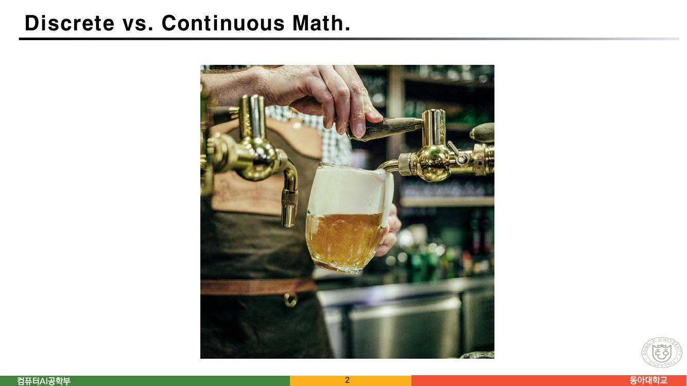
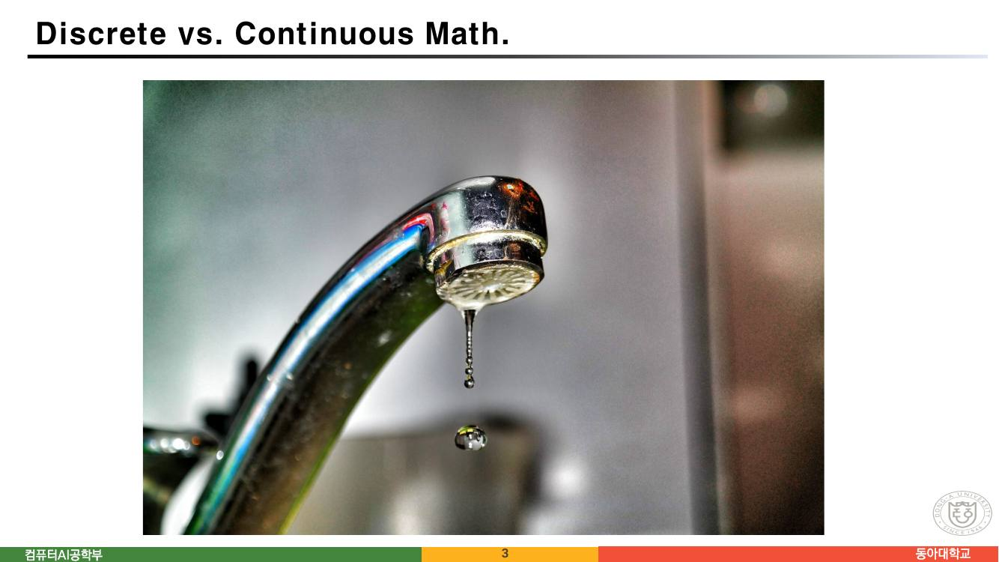
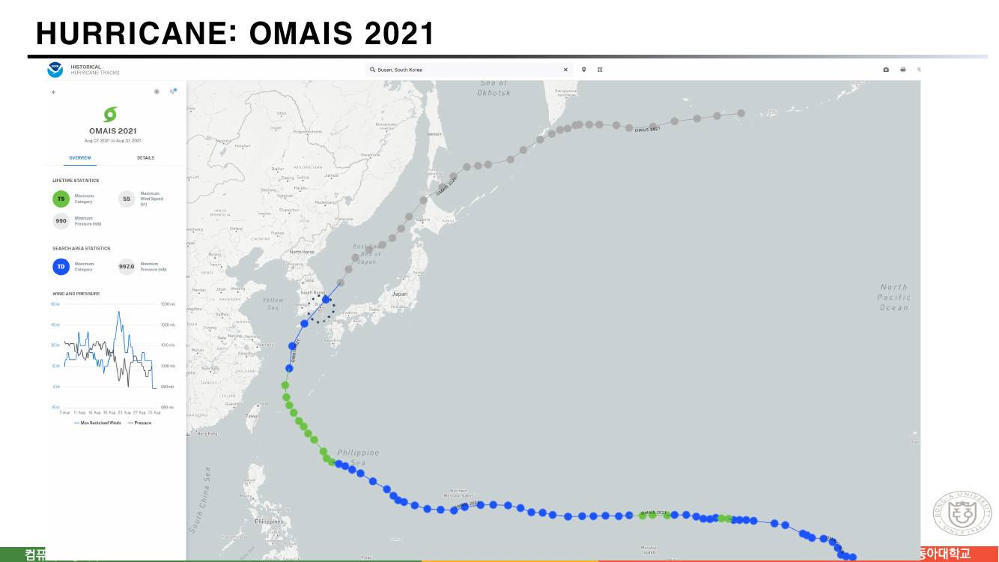
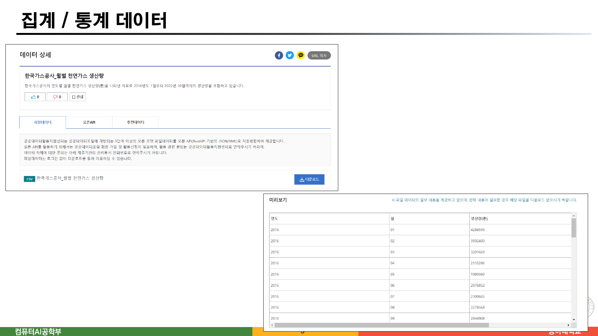
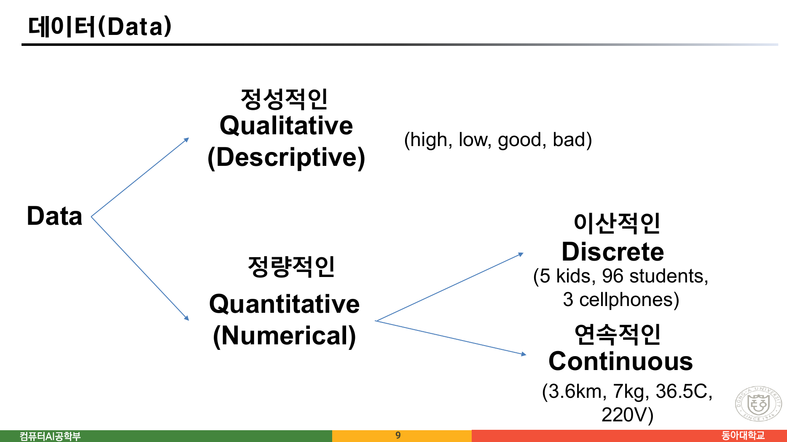
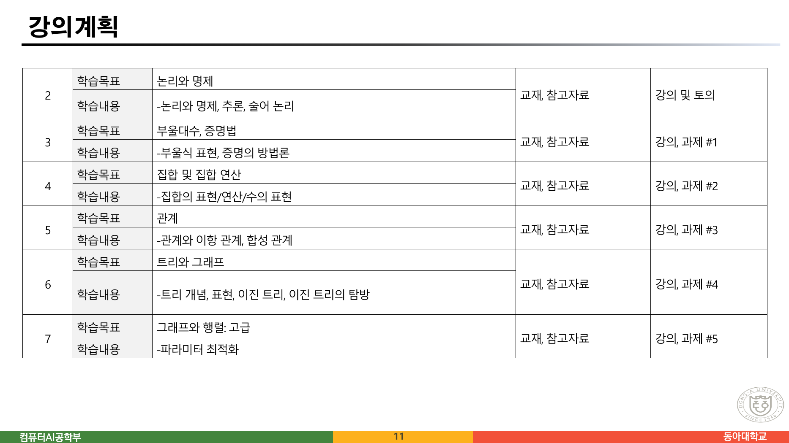
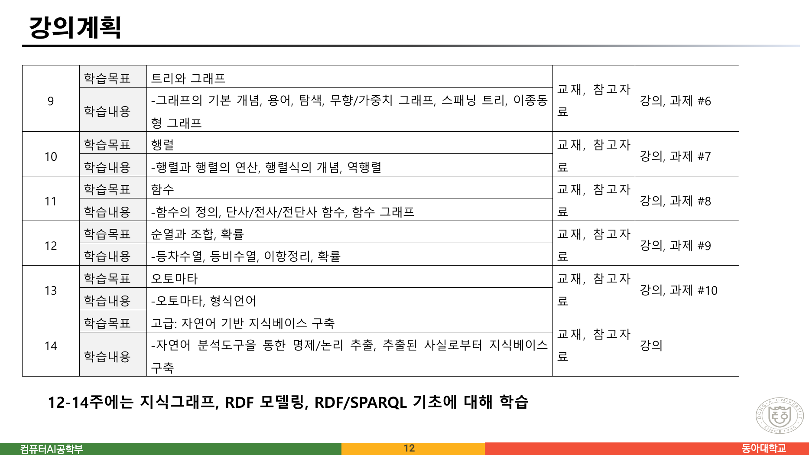

> [!abstract] 이 장이 실제로 하는 말
> 이산수학 첫 시간의 슬라이드는 24쪽이고, 그중 10쪽(15~24쪽)은 강의 운영 안내다. 남는 14쪽에서 **정의는 단 한 줄도 나오지 않는다.** "이산(discrete)이란 ○○이다"라는 문장이 없다.
>
> 대신 2쪽과 3쪽이 **똑같은 제목** 아래 사진을 한 장씩 놓는다 — `Discrete vs. Continuous Math.` 2쪽은 맥주가 탭에서 잔으로 흘러내리는 사진, 3쪽은 수도꼭지 끝에서 물방울이 떨어지는 사진이다. 캡션도, 화살표도, 설명도 없다. 어느 쪽이 discrete이고 어느 쪽이 continuous인지조차 적혀 있지 않다.
>
> 이 문서는 그 두 장을 이 강의의 척추로 읽는다. 4쪽(태풍 궤적)과 5쪽(월별 가스 생산량 CSV)이 같은 구조를 두 번 더 반복하기 때문이다. **세 쌍 모두 "연속적인 무언가"와 "그것을 기록한 이산적인 무언가"의 짝**이고, 그러므로 이 강의의 첫 메시지는 *이산은 대상이 가진 성질이 아니라 우리가 기록하는 방식*이라는 것이다.
>
> 그런데 다섯 쪽 뒤 9쪽에서 강의는 정반대를 말한다. 그 어긋남과, 11·12쪽 강의계획이 실제 강의자료와 맞지 않는다는 사실이 이 문서의 나머지다.

---

## 같은 제목, 다른 사진





두 쪽의 슬라이드 텍스트를 그대로 뽑으면 이렇다.

```text
page 2 : Discrete vs. Continuous Math.   컴퓨터AI공학부  2  동아대학교
page 3 : Discrete vs. Continuous Math.   컴퓨터AI공학부  3  동아대학교
```

제목 말고는 아무 글자도 없다. 그런데 두 사진이 담고 있는 것은 **같은 종류의 물질**이다 — 흐르는 액체. 맥주는 탭에서 잔까지 끊기지 않는 줄기로 이어지고, 수도꼭지의 물은 방울로 떨어진다.

여기서 곧바로 떠오르는 반문이 이 강의의 핵심이다. **수도꼭지를 더 열면 그 물도 줄기가 된다.** 반대로 맥주 탭을 아주 조금만 열면 맥주도 방울로 떨어진다. 즉 두 사진의 차이는 액체의 정체가 아니라 **그것이 우리에게 어떻게 도달하는가**에 있다.

원본은 이 반문을 적지 않았다. 하지만 다음 두 장이 같은 구조를 반복하면서 그 해석을 강하게 지지한다.

---

## 같은 구조를 두 번 더

### 4쪽 — 태풍은 연속으로 움직이고, 기록은 점으로 남는다



NOAA의 `Historical Hurricane Tracks` 화면이다. 2021년 태풍 OMAIS가 북태평양에서 한반도 쪽으로 올라온 경로가 **점의 사슬**로 그려져 있다. 왼쪽 패널에는 최대 풍속 55kt, 최저 기압 990mb 같은 요약값과 시간에 따른 풍속·기압 꺾은선이 있다.

태풍 자체는 바다 위를 끊김 없이 이동한다. 그러나 화면에 남은 것은 **관측 시각마다 하나씩 찍힌 점**이고, 점과 점 사이는 직선으로 이어져 있다. 실제 경로가 그 직선이었을 리는 없다.

다음 쪽(6쪽)에서 원본은 이 화면으로 무엇을 하라고 하는지 밝힌다.

> ◼ <https://coast.noaa.gov/hurricanes/#map=4/32/-80>
> ⚫ "MAEMI 2003" 검색
> ⚫ **Continuous versus Discrete movement**
>
> ◼ 생각해 볼 점
> ⚫ 태풍이 이동지점에서 선제조치 / 대응 방안을 설계
> ⚫ 태풍의 이동경로 혹은 도달시간 예측

`Continuous versus Discrete movement` — 이 한 줄이 2·3쪽 사진의 자막 역할을 뒤늦게 한다. **움직임 자체는 연속이고, 그것을 다루는 방식이 이산이다.** 그리고 "생각해 볼 점" 두 줄은 왜 그래야 하는지를 말한다. 선제조치를 설계하려면 *어느 지점*, *어느 시각*이라는 낱개의 대상이 있어야 한다. 연속적인 궤적에는 "지점"이 없다.

### 5쪽 — 흐르는 가스를 한 달에 한 줄로



공공데이터 포털의 `한국가스공사_월별 천연가스 생산량` 데이터 상세 화면과 그 미리보기 표다. 표의 열은 `연도 | 월 | 생산량(톤)`이고, 첫 줄부터 이렇게 이어진다.

| 연도 | 월 | 생산량(톤) |
| --- | --- | --- |
| 2016 | 01 | 4288593 |
| 2016 | 02 | 3592400 |
| 2016 | 03 | 3201669 |
| 2016 | 04 | 2135286 |
| 2016 | 05 | 1989360 |
| 2016 | 06 | 2076852 |
| 2016 | 07 | 2300665 |
| 2016 | 08 | 2278564 |
| 2016 | 09 | 2046908 |

천연가스는 배관을 타고 **끊임없이** 흐른다. 그런데 데이터는 한 달에 한 줄이다. 1월 중 어느 날 얼마나 흘렀는지는 이 표에 없다 — 애초에 기록되지 않았다.

세 쌍을 나란히 놓으면 구조가 같다.

| 원본 쪽 | 연속인 것 | 이산으로 남은 것 | 사이에서 잃은 것 |
| --- | --- | --- | --- |
| 2·3쪽 | 흘러내리는 맥주 | 떨어지는 물방울 | 방울과 방울 사이의 물 |
| 4쪽 | 바다 위 태풍의 이동 | 관측 시각마다의 점 | 점과 점 사이의 실제 경로 |
| 5쪽 | 배관을 흐르는 가스 | 월별 생산량 한 줄 | 그 달 안의 날짜별 변동 |

세 번째 칸이 언제나 무언가를 잃는다. **이산화는 공짜가 아니고, 무엇을 버릴지 정하는 일이 곧 이산 구조를 설계하는 일이다.** 이것이 원본이 정의 없이 사진으로 던진 첫 질문이다.

아래에서 표본 간격을 바꿔 가며 무엇이 사라지는지 직접 볼 수 있다.

```html preview h=560px
<div style="font-family:system-ui,-apple-system,sans-serif;padding:20px;color:var(--foreground)">
  <div style="font-size:12.5px;opacity:.8;margin-bottom:12px">
    아래 곡선은 <b>보충 설명을 위해 지어낸 예시</b>다 — 원본 슬라이드에 이런 그래프는 없다.
    연속인 무언가를 일정 간격으로 찍었을 때 무엇이 남고 무엇이 사라지는지만 보여 준다.
  </div>

  <label for="dt" style="font-size:13px;font-weight:600">표본 간격 = <span id="dtv" style="color:var(--chart-1);font-size:18px">6</span> 시간</label>
  <input id="dt" type="range" min="1" max="48" value="6" style="width:100%;accent-color:var(--chart-1);margin:8px 0 14px" />

  <svg id="samp" viewBox="0 0 720 260" style="width:100%;height:auto;border:1px solid var(--border);border-radius:8px;background:var(--card)"></svg>

  <div style="display:flex;gap:12px;flex-wrap:wrap;margin-top:14px">
    <div style="flex:1;min-width:170px;text-align:center;padding:11px;border:1px solid var(--border);border-radius:8px;background:var(--card)">
      <div style="font-size:11px;opacity:.75">남긴 점의 수</div>
      <div id="npts" style="font-size:23px;font-weight:700;color:var(--chart-1)"></div>
    </div>
    <div style="flex:1;min-width:170px;text-align:center;padding:11px;border:1px solid var(--border);border-radius:8px;background:var(--card)">
      <div style="font-size:11px;opacity:.75">점을 이은 선과 실제 곡선의 최대 차</div>
      <div id="err" style="font-size:23px;font-weight:700;color:var(--chart-4)"></div>
    </div>
  </div>
  <div style="font-size:12.5px;opacity:.8;margin-top:12px">
    간격을 넓히면 점이 줄고 차이가 커진다. 원본 4쪽의 태풍 궤적도 <b>점과 점을 직선으로 이은 그림</b>이며,
    실제 경로는 그 직선 위에 있지 않았다.
  </div>
</div>
<script>
(function(){
  var dt=document.getElementById('dt'),dtv=document.getElementById('dtv'),
      SV=document.getElementById('samp'),NP=document.getElementById('npts'),ER=document.getElementById('err');
  var T=120;                                  // 가상의 관측 구간(시간)
  function f(t){ return 50 + 26*Math.sin(t/13) + 13*Math.sin(t/4.1+1) + 6*Math.sin(t/1.7); }
  function draw(){
    var step=+dt.value; dtv.textContent=step;
    var W=720,H=260,pl=42,pr=14,pt=16,pb=28;
    function X(t){ return pl+(W-pl-pr)*t/T; }
    function Y(v){ return pt+(H-pt-pb)*(1-(v-0)/110); }
    var dense='';
    for(var t=0;t<=T;t+=0.5) dense+= X(t).toFixed(1)+','+Y(f(t)).toFixed(1)+' ';
    var xs=[]; for(var t=0;t<=T+1e-9;t+=step) xs.push(Math.min(t,T));
    if(xs[xs.length-1]<T) xs.push(T);
    var sparse=xs.map(function(t){return X(t).toFixed(1)+','+Y(f(t)).toFixed(1);}).join(' ');
    var dots=xs.map(function(t){return '<circle cx="'+X(t).toFixed(1)+'" cy="'+Y(f(t)).toFixed(1)
      +'" r="4" fill="var(--chart-1)"/>';}).join('');
    // 이은 선과 실제 곡선의 최대 차
    var maxd=0;
    for(var i=0;i<xs.length-1;i++){
      var a=xs[i],b=xs[i+1],fa=f(a),fb=f(b);
      for(var t=a;t<=b;t+=0.25){
        var lin=fa+(fb-fa)*((t-a)/(b-a||1));
        maxd=Math.max(maxd,Math.abs(f(t)-lin));
      }
    }
    SV.innerHTML=
       '<line x1="'+pl+'" y1="'+(H-pb)+'" x2="'+(W-pr)+'" y2="'+(H-pb)+'" stroke="var(--border)"/>'
      +'<line x1="'+pl+'" y1="'+pt+'" x2="'+pl+'" y2="'+(H-pb)+'" stroke="var(--border)"/>'
      +'<polyline points="'+dense.trim()+'" fill="none" stroke="var(--chart-3)" stroke-width="1.6" opacity=".55"/>'
      +'<polyline points="'+sparse+'" fill="none" stroke="var(--chart-1)" stroke-width="2"/>'
      +dots
      +'<text x="'+(pl+6)+'" y="'+(pt+12)+'" font-size="11.5" fill="var(--chart-3)">연속 — 실제로 일어난 일</text>'
      +'<text x="'+(pl+6)+'" y="'+(pt+28)+'" font-size="11.5" fill="var(--chart-1)">이산 — 기록으로 남은 것</text>'
      +'<text x="'+(pl+2)+'" y="'+(H-pb+16)+'" font-size="11" fill="var(--foreground)" opacity=".6">0h</text>'
      +'<text x="'+(W-pr-26)+'" y="'+(H-pb+16)+'" font-size="11" fill="var(--foreground)" opacity=".6">'+T+'h</text>';
    NP.textContent=xs.length;
    ER.textContent=maxd.toFixed(1);
  }
  dt.addEventListener('input',draw); draw();
})();
</script>
```

---

## 그런데 9쪽이 앞의 네 장을 배반한다



9쪽은 데이터를 네 갈래로 나눈 트리 하나다. 원본을 그대로 옮기면 이렇다.

```mermaid
graph LR
  D["Data"] --> Q["정성적인<br/>Qualitative<br/>(Descriptive)"]
  D --> N["정량적인<br/>Quantitative<br/>(Numerical)"]
  Q --> QE["high, low, good, bad"]
  N --> DI["이산적인 Discrete"]
  N --> CO["연속적인 Continuous"]
  DI --> DIE["5 kids, 96 students,<br/>3 cellphones"]
  CO --> COE["3.6km, 7kg, 36.5C, 220V"]

  style D  fill:var(--card),stroke:var(--border),color:var(--foreground)
  style Q  fill:var(--card),stroke:var(--chart-3),color:var(--foreground)
  style N  fill:var(--card),stroke:var(--chart-3),color:var(--foreground)
  style DI fill:var(--card),stroke:var(--chart-1),color:var(--foreground)
  style CO fill:var(--card),stroke:var(--chart-2),color:var(--foreground)
  style QE fill:var(--muted),stroke:var(--border),color:var(--foreground)
  style DIE fill:var(--muted),stroke:var(--border),color:var(--foreground)
  style COE fill:var(--muted),stroke:var(--border),color:var(--foreground)
```

이 그림에서 Discrete와 Continuous는 **데이터가 타고난 속성**이다. 어떤 데이터는 이산이고 어떤 데이터는 연속이며, 둘은 갈라진 가지다. `5 kids`는 이산이고 `3.6km`는 연속이다.

앞의 네 장과 정면으로 다르다. 2~6쪽에서는 *같은 대상*이 관찰 방식에 따라 연속으로도 이산으로도 나타났다. 태풍은 연속으로 움직이면서 이산으로 기록된다. 9쪽의 트리에는 그런 자리가 없다 — 태풍의 위치는 Continuous 가지에 들어가고, 거기서 끝이다.

> [!warning] 예시 자체가 트리를 흔든다
> 9쪽이 Continuous의 예로 든 넷 중 `36.5C`(체온)와 `220V`(전압)를 보자. 체온계는 소수 한 자리까지만 표시하고, 가정용 전압은 규격상 220이라는 **하나의 값**으로 불린다. 실제로 손에 들어오는 형태는 이미 이산이다.
>
> 반대로 Discrete의 예 `96 students`는 학생 수이지만, 학과의 재학생 수를 *시간에 대한 함수*로 보면 입학·휴학·자퇴가 아무 때나 일어나 값이 계단으로 변한다 — 그래도 시각 자체는 연속이다. 무엇이 이산인지는 **무엇을 세는가**에 달렸지 데이터에 붙어 있지 않다.
>
> 원본이 이 긴장을 의식하고 배치했는지는 알 수 없다. 다만 2~6쪽을 먼저 읽고 9쪽을 보면 두 장이 서로 다른 말을 한다는 것은 분명하다. 이 강의를 읽을 때 **어느 쪽이 이 과목의 실제 태도인지**는 뒤에 나오는 집합·관계·그래프가 답한다 — 그것들은 모두 "무엇을 낱개로 셀 것인가"를 먼저 정하고 시작하는 구조다.

---

## 그래서 이산수학을 왜 배우는가

10쪽이 이유를 두 줄로 적는다.

> ◼ **Backbone of Computer science**
> ◼ 실세계 응용에서, 우리가 관심있게 다루는 개체들은 **유한적(finite)인 형태**로 사용함
>
> (슬라이드 하단) 해운대에서 동아대학교까지 걸어서 가기

세 번째 줄이 앞 두 줄의 예다. 해운대에서 동아대까지의 실제 이동은 연속이지만, 길찾기는 **교차로라는 유한한 개체들**과 그 사이의 연결로 바뀐 뒤에야 계산할 수 있다. 4쪽의 태풍이 "지점"을 필요로 했던 것과 같은 이유다.

7·8쪽은 그 유한한 개체를 무엇으로 부를지에 대한 예고다.

> **Knowledge base** — A store of information or data / A set of facts, assumptions, and rules
>
> **동아대 / 동아대학교 / Dong-A University** — 웹 상에서 어떻게 식별할까?

8쪽의 질문이 이 과목 후반부(지식그래프)의 씨앗이다. 같은 대학을 가리키는 세 이름을 **하나의 개체**로 묶으려면, 이름이 아니라 식별자를 두고 그 식별자들 사이의 관계를 적어야 한다. 집합·관계·그래프가 전부 그 일을 하는 도구다.

13·14쪽이 이 과목의 목표를 네 항목으로 정리한다.

| 목표 | 원본 문구 |
| --- | --- |
| 수학적인 추론 | 수학적인 논증(argument)와 증명(proof)를 읽고, 이해하고, 생성할 수 있다 |
| 조합적인 분석 | 다른 종류의 개체를 세기 위한 방법론 |
| 이산 구조 | Set, Permutation, Relations, Graphs, Trees |
| 알고리즘 사고력 | 알고리즘 지정, 시간·메모리 분석, 정답 생성 증명 |
| 응용과 모델링 | 화학·생물학·언어학·지리학·비즈니스, 그리고 **지식그래프 기초와 사용** |

세 번째 항목 `Set, Permutation, Relations, Graphs, Trees`가 곧 이 과목의 목차다.

---

## 강의계획이 실제 강의자료와 맞지 않는다

11·12쪽은 2주부터 14주까지의 계획표다. 원본을 그대로 옮긴다.





| 주 | 학습목표 | 학습내용 | 방식 |
| --- | --- | --- | --- |
| 2 | 논리와 명제 | 논리와 명제, 추론, 술어 논리 | 강의 및 토의 |
| 3 | 부울대수, 증명법 | 부울식 표현, 증명의 방법론 | 강의, 과제 #1 |
| 4 | 집합 및 집합 연산 | 집합의 표현/연산/수의 표현 | 강의, 과제 #2 |
| 5 | 관계 | 관계와 이항 관계, 합성 관계 | 강의, 과제 #3 |
| 6 | **트리와 그래프** | 트리 개념, 표현, 이진 트리, 이진 트리의 탐방 | 강의, 과제 #4 |
| 7 | 그래프와 행렬: 고급 | 파라미터 최적화 | 강의, 과제 #5 |
| 9 | **트리와 그래프** | 그래프의 기본 개념, 용어, 탐색, 무향/가중치 그래프, 스패닝 트리, 이종동형 그래프 | 강의, 과제 #6 |
| 10 | 행렬 | 행렬과 행렬의 연산, 행렬식의 개념, 역행렬 | 강의, 과제 #7 |
| 11 | 함수 | 함수의 정의, 단사/전사/전단사 함수, 함수 그래프 | 강의, 과제 #8 |
| 12 | 순열과 조합, 확률 | 등차수열, 등비수열, 이항정리, 확률 | 강의, 과제 #9 |
| 13 | 오토마타 | 오토마타, 형식언어 | 강의, 과제 #10 |
| 14 | 고급: 자연어 기반 지식베이스 구축 | 자연어 분석도구를 통한 명제/논리 추출, 추출된 사실로부터 지식베이스 구축 | 강의 |

이 표를 이 과목에 실제로 배포된 PDF 목록과 맞춰 보면 여러 군데가 어긋난다.

```html preview h=620px
<div style="font-family:system-ui,-apple-system,sans-serif;padding:20px;color:var(--foreground)">
  <div style="font-size:13px;font-weight:600;margin-bottom:10px">원본 11·12쪽의 강의계획 ↔ 실제 배포된 강의자료</div>
  <div style="font-size:12px;opacity:.75;margin-bottom:14px">행을 누르면 어긋난 지점의 설명이 아래에 나온다.</div>

  <table style="width:100%;border-collapse:collapse;font-size:13px">
    <thead><tr style="border-bottom:1px solid var(--border);text-align:left">
      <th style="padding:7px 5px;font-weight:600">주</th>
      <th style="padding:7px 5px;font-weight:600">계획표의 학습목표</th>
      <th style="padding:7px 5px;font-weight:600">대응하는 강의자료 PDF</th>
      <th style="padding:7px 5px;font-weight:600"></th>
    </tr></thead>
    <tbody id="plan"></tbody>
  </table>

  <div id="pnote" style="margin-top:16px;padding:13px;border:1px solid var(--border);border-radius:8px;background:var(--card);font-size:12.5px;line-height:1.8;min-height:52px"></div>
</div>
<script>
(function(){
  var ROWS=[
    {w:'2',  goal:'논리와 명제',            pdf:'수학적 모델과 논리 (91쪽)', bad:false,
     note:'계획표는 2주와 3주로 나눴지만 실제 자료는 「수학적 모델과 논리」 한 편(91쪽)에 명제·추론·증명·프로그램 검증·지식베이스가 모두 들어 있다.'},
    {w:'3',  goal:'부울대수, 증명법',        pdf:'수학적 모델과 논리 (같은 편)', bad:true,
     note:'<b>부울대수를 학습목표로 내걸었는데, 배포된 어떤 PDF에도 부울대수를 따로 다룬 장이 없다.</b> 「집합 및 집합연산」의 대수적 성질(멱등·분배·드모르간)이 그 자리를 대신한다.'},
    {w:'4',  goal:'집합 및 집합 연산',       pdf:'집합 및 집합연산 (46쪽)', bad:false, note:'계획과 자료가 일치한다.'},
    {w:'5',  goal:'관계',                  pdf:'4 관계 및 함수 (125쪽) 앞부분', bad:true,
     note:'계획표는 <b>관계를 5주, 함수를 11주</b>로 여섯 주 떨어뜨려 놓았는데, 실제 자료는 「4 관계 및 함수」 한 편으로 붙어 있다.'},
    {w:'6',  goal:'트리와 그래프',           pdf:'6 트리 (38쪽)', bad:true,
     note:'<b>6주와 9주의 학습목표가 「트리와 그래프」로 똑같다.</b> 학습내용은 6주가 트리, 9주가 그래프로 갈라지므로 목표 칸 하나가 잘못 복사된 것으로 보인다.'},
    {w:'7',  goal:'그래프와 행렬: 고급',      pdf:'Appendix 1·2 (플로이드-워셜, 웰치-포웰)', bad:false,
     note:'학습내용이 "파라미터 최적화" 한 줄뿐이라 무엇을 다루는지 계획표만으로는 알 수 없다. 배포 자료 중 두 부록이 이 자리에 해당한다.'},
    {w:'9',  goal:'트리와 그래프',           pdf:'5 그래프 (65쪽)', bad:true,
     note:'6주와 같은 목표. 그리고 이 자료는 <b>같은 내용이 「5 그래프.pdf」와 「5 그래프 2.pdf」 두 파일로 중복 배포</b>되어 있다 — 65쪽·추출 텍스트 전체가 완전히 동일하다.'},
    {w:'10', goal:'행렬',                  pdf:'(해당 PDF 없음)', bad:true,
     note:'<b>행렬을 한 주 통째로 배정했는데 행렬만 다룬 강의자료가 배포 목록에 없다.</b> 그래프의 인접행렬이 「5 그래프」 안에서 다뤄질 뿐이다.'},
    {w:'11', goal:'함수',                  pdf:'4 관계 및 함수 (125쪽) 뒷부분', bad:true,
     note:'5주의 관계와 같은 PDF다. 계획표상 여섯 주 간격이지만 자료는 한 편이다.'},
    {w:'12', goal:'순열과 조합, 확률',       pdf:'(해당 PDF 없음)', bad:true,
     note:'<b>계획표 아래에 적힌 문장과 정면으로 충돌한다</b> — 같은 12쪽 맨 아래에 "12-14주에는 지식그래프, RDF 모델링, RDF/SPARQL 기초에 대해 학습"이라고 적혀 있는데, 표의 12주는 순열·조합·확률이다.'},
    {w:'13', goal:'오토마타',               pdf:'(해당 PDF 없음)', bad:true,
     note:'12주와 마찬가지다. 표에는 오토마타·형식언어인데 아래 문장은 이 주도 지식그래프라고 말한다.'},
    {w:'14', goal:'자연어 기반 지식베이스 구축', pdf:'7 지식그래프 소개 (12쪽)', bad:false,
     note:'표와 아래 문장이 유일하게 일치하는 주다. 실제 자료 「7 지식그래프 소개」가 여기 대응한다.'}
  ];
  var TB=document.getElementById('plan'), NT=document.getElementById('pnote');
  ROWS.forEach(function(r,i){
    var tr=document.createElement('tr');
    tr.style.cssText='border-bottom:1px solid var(--border);cursor:pointer';
    tr.innerHTML='<td style="padding:7px 5px">'+r.w+'</td>'
      +'<td style="padding:7px 5px">'+r.goal+'</td>'
      +'<td style="padding:7px 5px;opacity:.85">'+r.pdf+'</td>'
      +'<td style="padding:7px 5px;text-align:right;font-weight:700;color:'
        +(r.bad?'var(--chart-4)':'var(--chart-2)')+'">'+(r.bad?'어긋남':'일치')+'</td>';
    tr.addEventListener('click',function(){
      NT.innerHTML='<b>'+r.w+'주 · '+r.goal+'</b><br/>'+r.note;
      Array.prototype.forEach.call(TB.children,function(x){ x.style.background='transparent'; });
      tr.style.background='var(--muted)';
    });
    TB.appendChild(tr);
  });
  TB.children[9].click();
})();
</script>
```

> [!caution] 원본 오류 — 12쪽, 같은 쪽 안에서 표와 문장이 충돌한다
> 12쪽 표는 **12주 순열과 조합·확률**, **13주 오토마타**, **14주 지식베이스 구축**이라 적어 놓고, 같은 쪽 맨 아래에 이렇게 덧붙인다.
>
> > 12-14주에는 지식그래프, RDF 모델링, RDF/SPARQL 기초에 대해 학습
>
> 표대로면 지식그래프는 14주 한 주뿐이고, 문장대로면 세 주 전부다. 배포된 강의자료에 순열·조합·확률과 오토마타를 다룬 PDF가 **하나도 없다**는 점을 보면 문장 쪽이 실제 운영에 가깝고, 표는 이전 학기 계획을 그대로 둔 것으로 보인다.

<!-- -->
> [!caution] 원본 오류 — 6주와 9주의 학습목표가 같다
> 둘 다 `트리와 그래프`다. 학습내용은 6주가 트리(개념·표현·이진 트리·탐방), 9주가 그래프(기본 개념·탐색·스패닝 트리·이종동형)로 갈라지므로, 6주의 목표는 `트리`, 9주는 `그래프`여야 자연스럽다.

<!-- -->
> [!caution] 배포 자료 자체의 중복 — 「5 그래프.pdf」와 「5 그래프 2.pdf」
> 두 파일은 파일 크기(5,591,661바이트)와 쪽수(65쪽)가 같고, 추출한 텍스트가 **전 페이지 완전히 일치**한다. 파일 해시만 다르다(저장 시각 등 메타데이터 차이). 실질적으로 같은 자료가 두 번 배포되어 있다.

<!-- -->
> [!caution] 원본 오류 — 22쪽과 23쪽의 제목이 둘 다 「협력과 학업의 진정성 (1)」
> 연속한 두 쪽이 같은 번호를 달고 있다. 23쪽이 `(2)`여야 한다.

<!-- -->
> [!note] 평가 항목과 협력 규정이 서로 다른 과목을 가정한다
> 20쪽의 평가는 `2개의 개별 과제(10%)` + `필답시험 각 40%` + `출석 5%` + `참여도 5%`로, 합이 정확히 100%다. 그런데 22·23쪽의 협력 규정은 `모든 **프로젝트**는`, `다른 **코드**의 소스를 참고하였다면`, `상위 수준의 **pseudocode**`, `**코드** 내의 공유된 사용자 표기`처럼 **코드를 제출하는 프로젝트 과목**을 전제한다. 20쪽이 말하는 과제는 `다수의 문제를 수기로 답안을 작성`해 오프라인 제출하는 것이다.

<!-- -->
> [!note] 21쪽 — 명시한 벌칙이 한 단계뿐이다
> 제목은 `과제 2개 미제출시: 받을 수 있는 성적이 제한됨`인데, 이어지는 두 줄은 `과제 1개 미제출이더라도, A+ 부여` / `과제 2개 미제출시 우수한 성적이라도 A`다. 즉 둘 다 안 내도 A는 받는다. "제한"의 실질은 A+와 A 사이 한 등급 차이다.

---

## 정리 — 이 장에서 가져갈 것

> [!tip] 세 문장 요약
>
> 1. **첫 시간은 정의를 주지 않고 사진 두 장을 준다.** 같은 제목 `Discrete vs. Continuous Math.` 아래 흘러내리는 맥주와 떨어지는 물방울이 놓이고, 4·5쪽이 태풍 궤적과 월별 CSV로 같은 짝을 두 번 더 만든다. 세 쌍이 말하는 것은 **이산이 대상의 성질이 아니라 기록하는 방식**이라는 것이며, 6쪽의 `Continuous versus Discrete movement`가 그 자막이다.
> 2. **이산화는 언제나 무언가를 버린다.** 방울과 방울 사이의 물, 점과 점 사이의 실제 경로, 한 달 안의 날짜별 변동. 무엇을 버릴지 정하는 일이 이산 구조를 설계하는 일이고, 10쪽의 `우리가 관심있게 다루는 개체들은 유한적(finite)인 형태로 사용함`이 그 이유를 말한다 — 유한한 개체가 없으면 계산할 것도 없다.
> 3. **9쪽 데이터 분류표는 그 태도와 다르다.** 거기서 Discrete와 Continuous는 데이터가 타고난 속성으로 갈라진 가지이고, 관찰 방식이 들어설 자리가 없다. 이 과목의 실제 태도가 어느 쪽인지는 뒤따르는 집합·관계·그래프가 답한다 — 전부 "무엇을 낱개로 셀 것인가"를 먼저 정하고 시작하는 구조다.

다음 문서는 2주차 자료 「수학적 모델과 논리」로 들어간다. 이 장이 사진으로 던진 질문 — *무엇을 낱개로 볼 것인가* — 에 대해 논리학이 내놓는 첫 답은 **명제**다. 참이거나 거짓인 문장 하나가 더 이상 쪼개지지 않는 낱개가 된다.

---

### 근거 자료

이 문서는 강의 원본 `1 이산수학 소개.pdf`(24쪽)에 근거한다. 인용한 슬라이드는 2쪽·3쪽(같은 제목의 두 사진), 4쪽(HURRICANE: OMAIS 2021), 5쪽(집계/통계 데이터), 9쪽(데이터의 분류), 11·12쪽(강의계획)이다.

본문에 옮긴 표와 목록은 모두 슬라이드 원문 그대로다 — 5쪽 CSV 미리보기의 아홉 줄(2016년 01월 4288593톤 … 09월 2046908톤), 9쪽 분류 트리의 네 가지와 그 예시, 11·12쪽 강의계획 12개 행, 13·14쪽 강의 목표, 20·21쪽 평가 비율. 20쪽의 비율 합이 100%임을 확인했다.

강의계획과 배포 자료의 대조표는 이 과목 `sources/` 폴더의 PDF 11편을 실제로 확인해 만든 것이다. 「5 그래프.pdf」와 「5 그래프 2.pdf」가 같은 내용이라는 것은 두 파일의 추출 텍스트를 `diff`로 비교해 차이가 없음을 확인한 결과다.

표본화 인터랙티브의 곡선은 **원본에 없는 보충**이며 그 사실을 인터랙티브 안에 명시했다 — 원본 슬라이드에는 그런 그래프가 없고, 4쪽의 태풍 궤적이 점과 점을 직선으로 이은 그림이라는 사실만이 근거다. 9쪽 분류표에 대한 반문(체온·전압이 이미 이산으로 도달한다는 지적)도 보충이며 본문에 그렇게 밝혔다.
