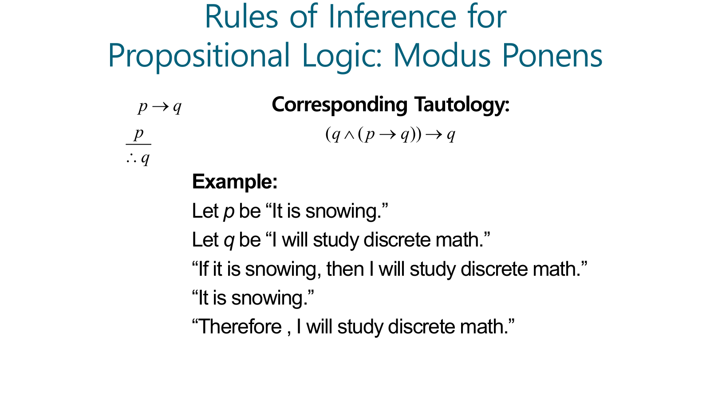
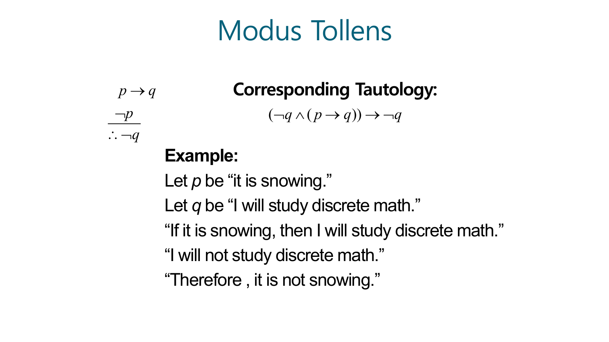
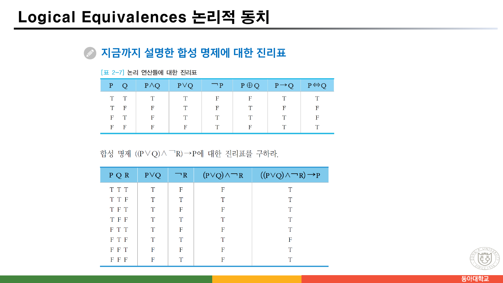
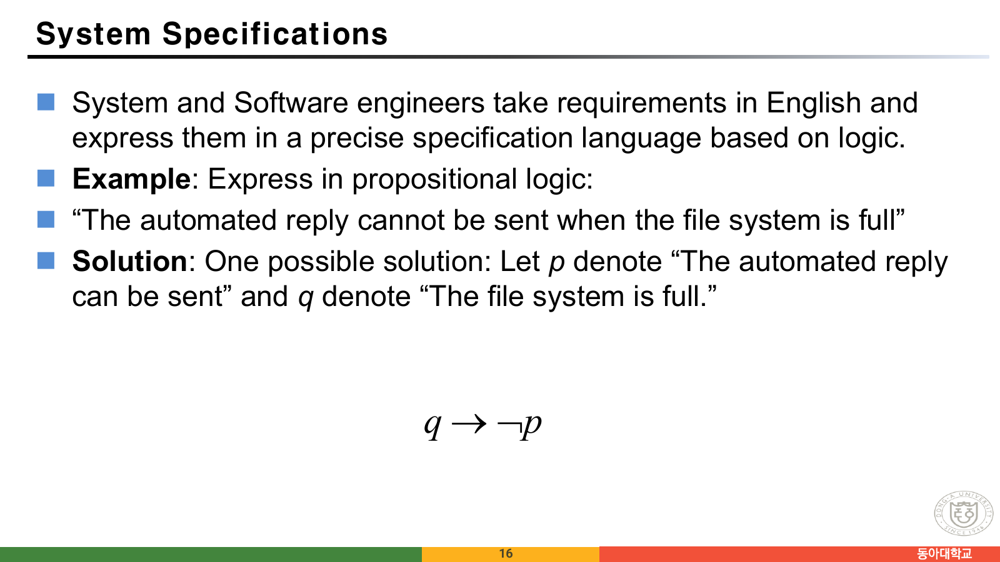
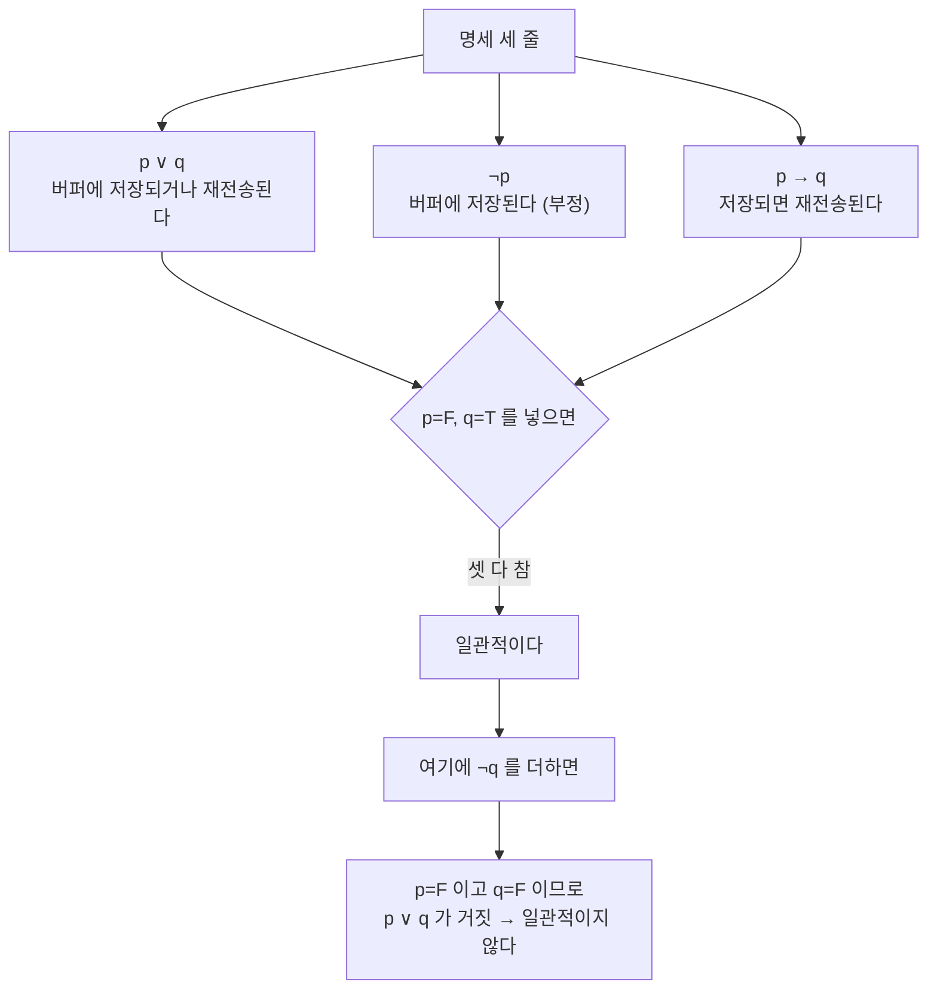

> [!abstract] 같은 규칙을 세 번 적는 자료
> `수학적 모델과 논리.pdf`는 91쪽이고, 성격이 다른 두 계열이 섞여 있다. 한국어 교재 슬라이드(파란 제목, `[정의 2-x]`·`[예제 2-x]` 상자)와 영어 원서 슬라이드(Rosen 계열, 흰 배경)가 번갈아 나온다. 그래서 같은 개념이 **최대 세 번** 나온다 — 한국어 문장으로, 영어 문장으로, 그리고 기호식으로.
>
> 세 표현이 일치하는지를 확인하는 것이 이 자료를 읽는 가장 확실한 방법이고, 실제로 **한 장에서 어긋난다.** 51·52쪽 추론 규칙 슬라이드에서 기호식이 바로 아래 자기 예시와 다른 말을 한다. 52쪽에 적힌 기호형은 아예 **타당하지 않은 추론**이고, 그 밑의 영어 예시는 정확하다.
>
> 이 정리는 그 한 장을 지렛대로 삼는다. 왜 기호와 말이 갈라질 수 있는지가 곧 이 장의 주제 — 논리 함축이 의미가 아니라 진리값만 다룬다는 사실 — 이기 때문이다.

---

## 1. 함축은 뜻을 보지 않는다

13쪽이 이 장 전체의 전제를 세 줄로 적는다.

> • 수학적 논리에서의 논리 함축은 자연 언어에서의 의미와는 상당한 차이가 있다.
> • 자연 언어에서는 "오늘 비가 오면, 야구 경기는 연기한다"라는 것은 가정과 결론 사이의 **인과 관계**를 나타내지만, 수학적 논리에서의 논리 함축 P → Q는 **P와 Q가 서로 연관이 없을지라도** 임의의 두 명제를 결합할 수 있다.
> • 왜냐하면 명제에서는 명제의 의미나 구조와 관계없이 **오직 명제들의 진리값만을 다루기 때문**이다.

14쪽은 영어 슬라이드로 같은 말을 하면서 예를 셋 든다.

- "If the moon is made of green cheese, then I have more money than Bill Gates."
- "If the moon is made of green cheese then I'm on welfare."
- "If 1 + 1 = 3, then your grandma wears combat boots."

셋 다 참이다. 전건이 거짓이므로 후건이 무엇이든 함축은 참이다. 이것이 §4에서 다룰 **vacuous 증명**의 근거이기도 하다.

12쪽이 정의를 한 문장으로 준다.

> 임의의 명제 P와 Q에 대해서 논리 함축 P → Q의 진리값은 **P가 참이고 Q가 거짓일 경우에만 거짓**이 되고, 그 이외의 경우에는 모두 참이 된다.

그리고 13쪽이 역·이·대우를 정리한다.

| 이름 | 식 | 원래 명제와의 관계 |
| --- | --- | --- |
| 원 명제 | P → Q | — |
| 역 (converse) | Q → P | 동치가 **아니다** |
| 이 (inverse) | ¬P → ¬Q | 동치가 **아니다** |
| 대우 (contrapositive) | ¬Q → ¬P | **동치다** |

원본이 마지막에 못을 박는다 — "명제가 참이면 대우도 반드시 참이 된다." 이 한 줄이 §4의 대우 증명법과 §2의 오류를 판정하는 기준이 된다.

---

## 2. 51·52쪽 — 기호가 예시를 배신한다

두 쪽은 나란히 놓인 같은 서식의 슬라이드다. 왼쪽에 규칙을 기호로, 가운데에 "Corresponding Tautology"를, 아래에 눈 오는 날 예시를 적는다.



51쪽을 그대로 옮기면 이렇다.

| 자리 | 원본이 적은 것 | 맞는가 |
| --- | --- | --- |
| 규칙 | `p → q`, `p`, ∴ `q` | 맞다 |
| Corresponding Tautology | **`(q ∧ (p → q)) → q`** | 어긋난다 |
| 예시 | "눈이 오면 이산수학을 공부한다" + "눈이 온다" ∴ "이산수학을 공부한다" | 맞다 |

> [!caution] 원본 오류 — 51쪽 항진식의 첫 `q`는 `p`여야 한다
> 모두스 포넨스에 대응하는 항진식은 $(p \wedge (p \rightarrow q)) \rightarrow q$ 다. 원본은 첫 항을 `q`로 적었다.
>
> 까다로운 점은 **`(q ∧ (p → q)) → q` 역시 항진식이라는 것**이다. `q ∧ (무엇이든) → q`는 언제나 참이므로 네 행 모두 T가 나온다. 그래서 "항진식인가"만 확인하면 오류가 드러나지 않는다. 문제는 이 식이 **아무것도 정당화하지 않는다**는 데 있다 — 결론 `q`를 전제 안에 이미 넣어 두었기 때문이다. 모두스 포넨스가 정당한 이유는 `p`와 `p→q`만으로 `q`가 따라 나오기 때문이고, 그 사실은 원본의 식으로는 표현되지 않는다.

52쪽은 더 심하다.



| 자리 | 원본이 적은 것 | 맞는 것 |
| --- | --- | --- |
| 규칙 | `p → q`, **`¬p`**, ∴ **`¬q`** | `p → q`, `¬q`, ∴ `¬p` |
| Corresponding Tautology | **`(¬q ∧ (p → q)) → ¬q`** | `(¬q ∧ (p → q)) → ¬p` |
| 예시 | "눈이 오면 이산수학을 공부한다" + "**이산수학을 공부하지 않는다**" ∴ "**눈이 오지 않는다**" | 예시가 맞다 |

> [!caution] 원본 오류 — 52쪽 기호형은 타당하지 않은 추론이다
> 원본이 왼쪽에 적은 형태 `p → q`, `¬p` ∴ `¬q` 는 **전건 부정의 오류(denying the antecedent)** 다. 반례가 하나 있다.
>
> `p` = 거짓, `q` = 참일 때 — 전제 `p → q`는 참(전건이 거짓), 전제 `¬p`도 참. 그런데 결론 `¬q`는 거짓이다. 전제가 모두 참인데 결론이 거짓이므로 이 추론은 타당하지 않다.
>
> 예시로 옮기면 이렇게 된다. "눈이 오면 이산수학을 공부한다"가 참이고 "눈이 오지 않는다"도 참일 때, **눈이 오지 않아도 이산수학을 공부할 수 있다.** 결론 "이산수학을 공부하지 않는다"는 따라 나오지 않는다.
>
> 결정적인 것은, **같은 슬라이드 아래쪽의 영어 예시는 정확하다**는 점이다. "I will not study discrete math"(¬q) → "Therefore, it is not snowing"(¬p). 왼쪽의 기호와 아래쪽의 말이 서로 다른 추론을 적고 있고, 말 쪽이 맞다. 항진식도 결론이 `¬q`로 적혀 있어 51쪽과 같은 방식으로 무의미해졌다.

아래에서 두 형태를 진리표로 직접 비교해 보라. "타당하다"는 것이 무엇을 뜻하는지 — **전제가 모두 참인 모든 행에서 결론도 참인가** — 를 행 단위로 확인할 수 있다.

```html preview h=620px
<div id="inf-root">
  <style>
    #inf-root{font-family:system-ui,-apple-system,"Segoe UI",sans-serif;color:var(--foreground);
      background:var(--card);border:1px solid var(--border);border-radius:10px;padding:16px}
    #inf-root h4{margin:0 0 4px;font-size:14px}
    #inf-root .sub{font-size:12px;opacity:.72;margin-bottom:12px;line-height:1.55}
    #inf-root .pick{display:flex;gap:6px;flex-wrap:wrap;margin-bottom:12px}
    #inf-root button{font:inherit;font-size:12px;padding:4px 9px;border-radius:6px;cursor:pointer;
      border:1px solid var(--border);background:transparent;color:var(--foreground)}
    #inf-root button.on{border-color:var(--chart-1);color:var(--chart-1)}
    #inf-root .rule{font-family:ui-monospace,SFMono-Regular,Menlo,monospace;font-size:13px;
      border:1px solid var(--border);border-radius:8px;padding:10px 13px;margin-bottom:12px;line-height:1.8}
    #inf-root .rule .bar{border-top:1px solid var(--border);display:block;margin:4px 0 4px;width:120px}
    #inf-root table{border-collapse:collapse;width:100%;font-size:12.5px}
    #inf-root th,#inf-root td{border:1px solid var(--border);padding:5px 8px;text-align:center;
      font-family:ui-monospace,SFMono-Regular,Menlo,monospace}
    #inf-root th{font-family:inherit;opacity:.85;font-weight:600}
    #inf-root tr.crit td{background:var(--border)}
    #inf-root tr.bad td{border-color:var(--chart-1);color:var(--chart-1);font-weight:700}
    #inf-root .verdict{margin-top:12px;font-size:13px;padding:10px 12px;border-radius:8px;
      border:1px solid var(--border);line-height:1.6}
    #inf-root .verdict.bad{border-color:var(--chart-1)}
    #inf-root .verdict b{color:var(--chart-1)}
  </style>
  <h4>추론 규칙 판정기 — 전제가 모두 참인 행에서 결론도 참인가</h4>
  <div class="sub">회색 행이 <b>전제가 모두 참인 행</b>이다. 그 행에서 결론이 하나라도 거짓이면 그 추론은 타당하지 않다.
  아래 목록의 처음 둘은 원본 51·52쪽에 적힌 형태, 셋째는 52쪽이 적었어야 할 형태다.</div>
  <div class="pick" id="inf-pick"></div>
  <div class="rule" id="inf-rule"></div>
  <table id="inf-tab"></table>
  <div class="verdict" id="inf-v"></div>
  <script>
  (function(){
    const imp=(a,b)=>(!a)||b;
    const R=[
      {name:"51쪽 · Modus Ponens", prem:["p → q","p"], conc:"q",
       pf:[(p,q)=>imp(p,q),(p,q)=>p], cf:(p,q)=>q,
       note:"원본 51쪽의 규칙 상자. 이 형태는 타당하다 — 항진식 표기만 어긋났다."},
      {name:"52쪽 · 원본에 적힌 기호형", prem:["p → q","¬p"], conc:"¬q",
       pf:[(p,q)=>imp(p,q),(p,q)=>!p], cf:(p,q)=>!q,
       note:"원본 52쪽 왼쪽 상자를 그대로 옮긴 것. 전건 부정의 오류다."},
      {name:"52쪽 · Modus Tollens (맞는 형태)", prem:["p → q","¬q"], conc:"¬p",
       pf:[(p,q)=>imp(p,q),(p,q)=>!q], cf:(p,q)=>!p,
       note:"52쪽 아래의 영어 예시가 실제로 말하는 형태. 타당하다."},
      {name:"53쪽 · Hypothetical Syllogism", prem:["p → q","q → r"], conc:"p → r", three:true,
       pf:[(p,q,r)=>imp(p,q),(p,q,r)=>imp(q,r)], cf:(p,q,r)=>imp(p,r),
       note:"원본 53쪽. 세 변수를 쓴다."},
      {name:"56쪽 · Resolution", prem:["¬p ∨ r","p ∨ q"], conc:"q ∨ r", three:true,
       pf:[(p,q,r)=>(!p)||r,(p,q,r)=>p||q], cf:(p,q,r)=>q||r,
       note:"원본 56쪽. \"Resolution plays an important role in AI and is used in Prolog.\""}
    ];
    let cur=0;
    const pick=document.getElementById("inf-pick");
    R.forEach((r,i)=>{
      const b=document.createElement("button"); b.textContent=r.name;
      b.onclick=()=>{cur=i; draw();}; pick.appendChild(b);
    });
    function T(v){ return v?"T":"F"; }
    function draw(){
      const r=R[cur];
      [...pick.children].forEach((b,i)=>b.classList.toggle("on",i===cur));
      document.getElementById("inf-rule").innerHTML =
        r.prem.map(x=>x+"<br>").join("") + '<span class="bar"></span>∴ ' + r.conc;
      const vars = r.three ? ["p","q","r"] : ["p","q"];
      const rows=[];
      const n = r.three?8:4;
      for(let m=0;m<n;m++){
        const bits = vars.map((_,i)=>!((m>>(vars.length-1-i))&1));
        const P = r.pf.map(f=>f(...bits));
        const C = r.cf(...bits);
        rows.push({bits:bits, P:P, C:C, crit:P.every(x=>x)});
      }
      let html = "<tr>"+vars.map(v=>"<th>"+v+"</th>").join("")+
        r.prem.map(x=>"<th>"+x+"</th>").join("")+"<th>∴ "+r.conc+"</th></tr>";
      let bad=0;
      rows.forEach(row=>{
        const isBad = row.crit && !row.C;
        if(isBad) bad++;
        html += '<tr class="'+(isBad?"bad":(row.crit?"crit":""))+'">'
          + row.bits.map(b=>"<td>"+T(b)+"</td>").join("")
          + row.P.map(b=>"<td>"+T(b)+"</td>").join("")
          + "<td>"+T(row.C)+"</td></tr>";
      });
      document.getElementById("inf-tab").innerHTML=html;
      const v=document.getElementById("inf-v");
      v.classList.toggle("bad", bad>0);
      const crit=rows.filter(x=>x.crit).length;
      v.innerHTML = (bad===0
        ? "전제가 모두 참인 행이 <b>"+crit+"개</b>이고 그 행에서 결론이 전부 참이다 → <b>타당한 추론</b>이다."
        : "전제가 모두 참인 행 "+crit+"개 중 <b>"+bad+"개</b>에서 결론이 거짓이다 → <b>타당하지 않다</b>. "+
          "그 행이 반례다.") + "<br><span style='opacity:.8'>"+r.note+"</span>";
    }
    draw();
  })();
  </script>
</div>
```

52쪽 형태를 고르면 `p=F, q=T` 행이 반례로 잡힌다. 원본의 규칙 상자가 남긴 유일한 실수다.

---

## 3. 우선순위 — 괄호를 없애려고 표를 만든다

24쪽부터 31쪽까지 여덟 쪽이 한 가지 일에 쓰인다. 합성 명제에 괄호를 다 치면 읽기 어려우니, **우선순위와 결합법칙**으로 괄호 없이 읽는 방법을 세우는 것이다.

원본 24쪽이 우선순위를 한 줄로 준다.

$$\neg \;>\; \wedge \;>\; \vee \;>\; \rightarrow \;>\; \Leftrightarrow$$

그리고 결합법칙을 덧붙인다 — **`¬`는 오른쪽 결합, 나머지는 왼쪽 결합.** 이 규칙으로 24쪽의 예제를 풀면 이렇게 된다.

$$P \wedge Q \rightarrow \neg P \vee Q \wedge R \;\;\equiv\;\; (P \wedge Q) \rightarrow ((\neg P) \vee (Q \wedge R))$$

25~31쪽은 이것을 **연산자 우선순위표**와 스택 두 개(연산자 스택·피연산자 스택)로 자동화한다. 표의 각 칸은 "스택 속 연산자(열)와 입력 연산자(행) 중 누가 먼저인가"를 담는다. 26쪽이 첫 칸을 정하는 과정을 그대로 보여 준다.

> ✓ 스택 속에는 연산자 `¬`가 있고, 입력에도 `¬`가 있는 경우이다. 같은 연산자이므로 우선순위가 같다. 따라서 결합법칙을 살펴봐야 한다. **오른쪽 결합 법칙을 가지므로 입력에 `¬` 연산을 먼저 수행해야 한다.**

32쪽은 이 여덟 쪽을 과제로 바꾼다.

> **실습** — 일반적인 합성 명제에 대해 진리표를 구하는 프로그램을 작성하라. (2주)
> • 명제 변수는 많아야 3개, 논리 연산자도 많아야 4종류(and, or, not, implication)
> • 합성 명제 `P∧Q → ¬P∨Q∧R` 에 대해 진리표를 만들라

아래에서 그 진리표를 직접 만들어 보자. 괄호를 바꿔 가며 **우선순위가 실제로 답을 바꾸는지** 확인할 수 있다.

```html preview h=640px
<div id="tt-root">
  <style>
    #tt-root{font-family:system-ui,-apple-system,"Segoe UI",sans-serif;color:var(--foreground);
      background:var(--card);border:1px solid var(--border);border-radius:10px;padding:16px}
    #tt-root h4{margin:0 0 4px;font-size:14px}
    #tt-root .sub{font-size:12px;opacity:.72;margin-bottom:12px;line-height:1.55}
    #tt-root .pick{display:flex;gap:6px;flex-wrap:wrap;margin-bottom:12px}
    #tt-root button{font:inherit;font-size:12px;padding:4px 9px;border-radius:6px;cursor:pointer;
      border:1px solid var(--border);background:transparent;color:var(--foreground)}
    #tt-root button.on{border-color:var(--chart-1);color:var(--chart-1)}
    #tt-root .expr{font-family:ui-monospace,SFMono-Regular,Menlo,monospace;font-size:14px;
      margin-bottom:4px}
    #tt-root .paren{font-family:ui-monospace,SFMono-Regular,Menlo,monospace;font-size:12px;
      opacity:.75;margin-bottom:12px}
    #tt-root table{border-collapse:collapse;width:100%;font-size:12.5px}
    #tt-root th,#tt-root td{border:1px solid var(--border);padding:4px 7px;text-align:center;
      font-family:ui-monospace,SFMono-Regular,Menlo,monospace}
    #tt-root th{font-family:inherit;opacity:.85;font-weight:600;font-size:11.5px}
    #tt-root td.res{font-weight:700}
    #tt-root td.res.f{color:var(--chart-1)}
    #tt-root .verdict{margin-top:12px;font-size:12.5px;line-height:1.6;
      border-top:1px dashed var(--border);padding-top:10px}
  </style>
  <h4>진리표 만들기 — 원본 32쪽 실습 과제</h4>
  <div class="sub">우선순위는 원본 24쪽 그대로 <b>¬ &gt; ∧ &gt; ∨ &gt; →</b> 이고 <b>¬</b> 만 오른쪽 결합이다.
  아래 식을 골라 진리표를 확인하라. 마지막 두 항목은 <b>괄호를 다르게 친 같은 글자열</b>이다.</div>
  <div class="pick" id="tt-pick"></div>
  <div class="expr" id="tt-expr"></div>
  <div class="paren" id="tt-paren"></div>
  <table id="tt-tab"></table>
  <div class="verdict" id="tt-v"></div>
  <script>
  (function(){
    const imp=(a,b)=>(!a)||b;
    const E=[
      {t:"P∧Q → ¬P∨Q∧R", p:"(P∧Q) → ((¬P)∨(Q∧R))",
       cols:["P∧Q","¬P","Q∧R","¬P∨(Q∧R)"],
       f:(P,Q,R)=>[P&&Q, !P, Q&&R, (!P)||(Q&&R)],
       r:(P,Q,R)=>imp(P&&Q, (!P)||(Q&&R)),
       n:"원본 24·32쪽의 예제. 우선순위 규칙대로 괄호를 넣으면 이 식이 된다."},
      {t:"(P∨Q)∧¬R → P", p:"((P∨Q)∧(¬R)) → P",
       cols:["P∨Q","¬R","(P∨Q)∧¬R"],
       f:(P,Q,R)=>[P||Q, !R, (P||Q)&&(!R)],
       r:(P,Q,R)=>imp((P||Q)&&(!R), P),
       n:"원본 23쪽에 진리표가 그대로 실려 있는 식이다. 아래 표와 원본 표가 한 칸도 다르지 않다 — F가 나오는 행은 P F · Q T · R F 하나뿐이다."},
      {t:"우선순위대로 읽은 P∧Q → ¬P∨Q∧R", p:"(P∧Q) → ((¬P)∨(Q∧R))",
       cols:["좌변 P∧Q","우변 ¬P∨(Q∧R)"],
       f:(P,Q,R)=>[P&&Q,(!P)||(Q&&R)],
       r:(P,Q,R)=>imp(P&&Q,(!P)||(Q&&R)),
       n:"우선순위를 지킨 해석."},
      {t:"괄호를 잘못 친 ((P∧Q)→¬P)∨(Q∧R)", p:"((P∧Q)→(¬P))∨(Q∧R)",
       cols:["(P∧Q)→¬P","Q∧R"],
       f:(P,Q,R)=>[imp(P&&Q,!P), Q&&R],
       r:(P,Q,R)=>imp(P&&Q,!P)||(Q&&R),
       n:"→ 가 ∨ 보다 먼저 묶였다고 잘못 읽은 경우. 위 항목과 결과가 달라지는 행을 찾아보라."}
    ];
    let cur=0;
    const pick=document.getElementById("tt-pick");
    E.forEach((e,i)=>{
      const b=document.createElement("button"); b.textContent=e.t.length>22?e.t.slice(0,22)+"…":e.t;
      b.title=e.t; b.onclick=()=>{cur=i;draw();}; pick.appendChild(b);
    });
    function T(v){return v?"T":"F";}
    function draw(){
      const e=E[cur];
      [...pick.children].forEach((b,i)=>b.classList.toggle("on",i===cur));
      document.getElementById("tt-expr").textContent=e.t;
      document.getElementById("tt-paren").textContent="괄호를 모두 넣으면  "+e.p;
      let html="<tr><th>P</th><th>Q</th><th>R</th>"+e.cols.map(c=>"<th>"+c+"</th>").join("")+
        "<th>결과</th></tr>";
      let tcount=0;
      for(let m=0;m<8;m++){
        const P=!((m>>2)&1), Q=!((m>>1)&1), R=!(m&1);
        const mid=e.f(P,Q,R), res=e.r(P,Q,R);
        if(res) tcount++;
        html+="<tr><td>"+T(P)+"</td><td>"+T(Q)+"</td><td>"+T(R)+"</td>"+
          mid.map(v=>"<td>"+T(v)+"</td>").join("")+
          '<td class="res'+(res?"":" f")+'">'+T(res)+"</td></tr>";
      }
      document.getElementById("tt-tab").innerHTML=html;
      document.getElementById("tt-v").innerHTML =
        "여덟 행 중 참인 행 <b>"+tcount+"개</b>. "+
        (tcount===8 ? "모든 행이 참이므로 <b>항진(tautology) 명제</b>다. "
         : tcount===0 ? "모든 행이 거짓이므로 <b>모순(contradiction) 명제</b>다. "
         : "참인 행과 거짓인 행이 섞여 있으므로 <b>사건(contingency) 명제</b>다. ")
        + e.n;
    }
    draw();
  })();
  </script>
</div>
```



원본 23쪽의 두 번째 표를 위 인터랙티브의 두 번째 항목과 비교해 보면 여덟 행이 그대로 일치한다. 거짓이 나오는 행은 `P=F, Q=T, R=F` 하나뿐이다. 33쪽이 이 결과에 이름을 붙인다 — 모든 행이 참이면 **항진(tautology)**, 모두 거짓이면 **모순(contradiction)**, 섞여 있으면 **사건(contingency)** 명제다.

---

## 4. 영어를 기호로 옮기는 세 문제

16·17·20쪽은 자연어 명세를 논리식으로 바꾸는 연습이다. 이 자료에서 실무에 가장 가까운 대목이다.



**16쪽** — "The automated reply cannot be sent when the file system is full"
`p` = "The automated reply **can** be sent", `q` = "The file system is full"
답: $q \rightarrow \neg p$

여기서 조심할 것이 하나 있다. `p`를 **긍정형**으로 두었다는 점이다. `p`를 "보낼 수 없다"로 두면 답은 `q → p`가 되어 겉보기가 완전히 달라진다. 명제 변수를 무엇으로 잡느냐가 식의 모양을 바꾼다.

**20쪽** — "You can access the Internet from campus **only if** you are a computer science major **or** you are not a freshman."
`a`, `c`, `f`를 각각 접속 가능·전산 전공·신입생으로 두면 답은 $a \rightarrow (c \vee \neg f)$ 다. 15쪽이 `p → q`를 읽는 여러 가지 방식을 모아 두는데, 그중 **"p only if q"** 가 `p → q`이지 `q → p`가 아니라는 것이 이 문제의 전부다.

**17쪽** — 일관성(consistency) 판정이다. 정의를 먼저 준다.

> A list of propositions is **consistent** if it is possible to assign truth values to the proposition variables so that **each proposition is true.**

세 명세를 기호로 옮기면 `p ∨ q`, `¬p`, `p → q` 이고, `p = F, q = T`를 넣으면 셋 다 참이므로 일관적이다. 여기에 "The diagnostic message is not retransmitted"(`¬q`)를 더하면 만족하는 배정이 사라진다. 원본이 그 이유를 적지는 않지만 확인은 간단하다 — `¬p`와 `¬q`가 참이면 `p ∨ q`가 거짓이 된다.



이 판정이 곧 §3의 진리표다. "만족하는 배정이 있는가"는 진리표에서 **모든 명세가 동시에 T인 행이 있는가**와 같은 물음이다.

---

## 5. 술어와 한정자 — 명제가 되려면 변수를 묶어야 한다

37~46쪽이 술어 논리를 다룬다. 핵심은 38쪽 한 줄이다.

> 술어는 명제로 바꿀 수 있다. 이렇게 하기 위해서는 술어의 **개별 변수를 한정시켜** 주어야 한다.

40쪽의 영어 슬라이드가 예를 준다. `P(x)`를 "x > 0", 정의역을 정수라 하면 `P(-3)`은 거짓, `P(0)`은 거짓, `P(3)`은 참이다. `P(x)` 자체는 참도 거짓도 아니므로 명제가 아니다. 8쪽이 이미 그것을 말해 두었다 — `x+1=2`는 명제가 **아니고**, `1+0=1`은 명제다.

변수를 묶는 방법은 둘이다.

| 한정자 | 기호 | 읽기 | 뜻 |
| --- | --- | --- | --- |
| 전체 한정자 | ∀ | 임의의 · 모든 | x의 모든 값에 대해 P(x)가 참 |
| 존재 한정자 | ∃ | 어떤 · 적어도 하나 | P(x)가 참이 되는 x가 존재 |
| 유일 한정자 | ∃! | ~에 대한 유일한 x가 존재 | 참이 되는 x가 유일하게 존재 |

44쪽이 한정자의 드모르간 법칙을 준다.

$$\neg \forall x\, P(x) \equiv \exists x\, \neg P(x), \qquad \neg \exists x\, P(x) \equiv \forall x\, \neg P(x)$$

이 두 줄이 §6의 반례 증명법으로 바로 이어진다. "모든 x에 대해 P(x)"가 거짓임을 보이려면 P(x)가 거짓인 x를 **하나만** 찾으면 된다는 것이 왼쪽 식이다.

> [!note] 같은 슬라이드가 두 번 나온다
> 41쪽과 43쪽은 제목·본문이 같은 슬라이드다. 43쪽에만 오른쪽 위에 "C#, 접근 한정자 (Access quantifier)"라는 메모와 출처(Microsoft C# 설명서)가 덧붙어 있다. 46쪽은 아예 다른 개념인 **수식어(qualifier)** 를 다루는데, 제목이 `Qualifier` 한 단어라 앞의 `Quantifier`와 한 글자 차이다. C 구조체의 멤버 참조(`A.C.F`)를 예로 드는 내용이라 한정자와는 관계가 없다.
>
> 자료 뒷부분에도 같은 반복이 있다. **73쪽과 74쪽**("프로그램 검증 : 매우 어려운 문제"), **76쪽과 77쪽**("정적인 방법"), **78쪽과 79쪽**("정적인 방법 / Note")이 각각 제목·텍스트가 동일한 쌍이다. 애니메이션 단계를 쪽으로 나눈 결과로 보인다.

---

## 6. 증명 방법 다섯 가지

63~69쪽이 증명법을 정리한다. 63쪽이 출발점을 잡는다 — **"증명 문제 : 논리 함축 P → Q 를 증명하는 것이 대부분"**. 그러면 §1의 함축 진리표가 그대로 전략표가 된다.

| 방법 | 원본 설명 | §1의 어느 칸을 쓰는가 |
| --- | --- | --- |
| **vacuous** | P가 거짓이라는 것만 보이면 된다 | P=F인 두 행은 무조건 T |
| **trivial** | Q가 참이라는 것만 보이면 된다 | Q=T인 두 행은 무조건 T |
| **직접 증명** | P가 참일 때 Q도 참임을 보인다 | 유일하게 F가 될 수 있는 칸을 막는다 |
| **간접 증명 ① 대우** | ¬Q → ¬P가 참임을 보인다 | 13쪽의 "대우는 동치" |
| **간접 증명 ② 배리법** | ¬P가 거짓임을 보인다 | 귀류법 |
| **간접 증명 ③ 존재 증명** | P(x)가 참인 x가 존재함을 보인다 | ∃x P(x) |
| **반증 ① 반례** | ∀x P(x)가 거짓임을 ∃x ¬P(x)로 보인다 | 44쪽 드모르간 |
| **반증 ② 모순** | 명제가 참이라 가정해 모순을 이끈다 | — |

원본이 붙인 예시 셋이 각각 어느 방법인지가 이 절의 핵심이다.

- 65쪽 직접 증명 — `6x + 9y = 101` → `x 또는 y가 정수가 아님`. 좌변은 3의 배수인데 101은 3의 배수가 아니다.
- 66쪽 대우 증명 — 옆에 `(6, 28, 496, 8128, ....)`가 적혀 있다. 완전수 목록이다.
- 67쪽 배리법 — 원본이 전제를 직접 적어 두었다: **"전제 (~P) : 가장 큰 소수는 존재한다"**. 유클리드의 소수 무한 증명이다.

여기서 vacuous 증명과 §1의 "달에 치즈가 있다면" 예시가 같은 자리라는 점을 짚어 두자. 전건이 거짓이면 함축이 자동으로 참이라는 사실은, 논리학에서 **증명 전략**이 되고 일상 언어에서는 **이상한 문장**이 된다. 같은 규칙의 두 얼굴이다.

70~72쪽은 수학적 귀납법으로 넘어가고, 73~83쪽은 프로그램 검증(정적 방법 / 동적 방법)을 다룬다. 84~89쪽은 지식 베이스 시스템과 전문가 시스템으로 마무리되며, 90·91쪽은 부록으로 `SymPy`와 `CLIPS`를 한 줄씩만 언급한다.

---

## 7. 확인 문제

1. 52쪽의 기호형 `p → q`, `¬p` ∴ `¬q` 가 타당하지 않음을 보이는 반례를 `p`, `q`의 진리값으로 적어 보라
2. `(q ∧ (p → q)) → q` 는 항진식이다. 그런데도 이 식이 모두스 포넨스를 정당화하지 못하는 이유는?
3. 16쪽에서 `p`를 "The automated reply **cannot** be sent"로 잡으면 답은 어떻게 바뀌는가
4. `P∧Q → ¬P∨Q∧R` 을 우선순위 규칙대로 괄호를 넣어 적어 보라. `¬`가 오른쪽 결합이라는 것이 이 식에서 실제로 쓰이는가
5. 17쪽의 세 명세에 `¬q`를 더하면 일관성이 깨진다. 어느 명제가 먼저 거짓이 되는가
6. "모든 백조는 희다"가 거짓임을 보이려면 무엇을 하나 찾으면 되는가? 44쪽의 어느 식이 그것을 보장하는가
7. 65쪽의 `6x + 9y = 101`이 직접 증명의 예인 이유는? 이 명제를 vacuous 증명으로 처리할 수는 없는가

---

## 8. 이어지는 자료

- [01. 같은 물인데 하나는 흐르고 하나는 떨어진다](<./01. 같은 물인데 하나는 흐르고 하나는 떨어진다.md>) — 이 강의가 서 있는 전제
- [03. 없는 칸 하나 — 집합의 네 종류 중 하나는 비어 있다](<./03. 없는 칸 하나 — 집합의 네 종류 중 하나는 비어 있다.md>) — 집합의 상등을 진리표로 증명하는 대목이 §3과 직접 이어진다
- [04. 목차에 없는 함수](<./04. 목차에 없는 함수.md>) — 관계의 성질을 판정하는 일이 §2의 타당성 판정과 같은 구조다

같은 도메인 밖에서는 [06/algorithm-design-analysis](../../../06_algorithms-graphics/algorithm-design-analysis/README.md)의 02장이 같은 증명 도구(대우·귀류법)를 복잡도 증명에 쓴다.

---

## 근거 자료

`ComputerScience/02_math-theory/discrete-mathematics/sources/수학적 모델과 논리.pdf` (91쪽).

| 쪽 | 내용 | 이 문서에서 쓴 곳 |
| --- | --- | --- |
| 4·6·7 | 수학적 모델 / 정의·문장·명제 | §0 |
| 8 | 명제와 명제가 아닌 것 | §5 |
| 9~12 | 논리 연산자 · 진리표 · 논리 함축 | §1 |
| 13·14 | 함축과 자연 언어의 차이, 역·이·대우 | §1 |
| 15 | Different Ways of Expressing p → q | §4 |
| 16·17·19·20 | 시스템 명세 · 일관성 · 영어 문장 번역 | §4 |
| 22·23 | 논리적 동치 · 합성 명제 진리표 | §3 |
| 24~31 | 연산자 우선순위표와 스택 연산 | §3 |
| 32 | 실습 — 진리표 프로그램 | §3 인터랙티브 |
| 33 | 항진·모순·사건 명제 | §3 |
| 37~46 | 술어 · 한정자 · 한정자의 드모르간 | §5 |
| 49~56 | 추론 규칙(대체·긍정 논법·부정 논법·삼단논법·Resolution) | §2 인터랙티브 |
| 63~69 | 증명 방법 다섯 가지 | §6 |
| 70~72 | 수학적 귀납법 | §6 |
| 73~83 | 프로그램 검증(정적·동적) | §5 중복 슬라이드 |
| 84~91 | 지식 베이스 시스템 · 부록(SymPy, CLIPS) | §6 |

인용한 슬라이드 3장은 위 PDF 16·23·51·52쪽 중 세 쪽을 120dpi로 렌더링한 것이다.

본문의 진리표 값은 모두 파이썬으로 여덟 행을 계산해 원본과 대조했다. 23쪽의 `((P∨Q)∧¬R)→P` 표는 여덟 행이 원본과 완전히 일치했다. 51·52쪽의 오류는 텍스트 추출이 아니라 **슬라이드 이미지를 직접 확인**해 판정했다 — 이 자료의 영어 슬라이드는 `¬`·`∧`·`∀`·`∃` 기호가 유니코드로 추출되지 않아 텍스트만 읽으면 판별할 수 없기 때문이다.
