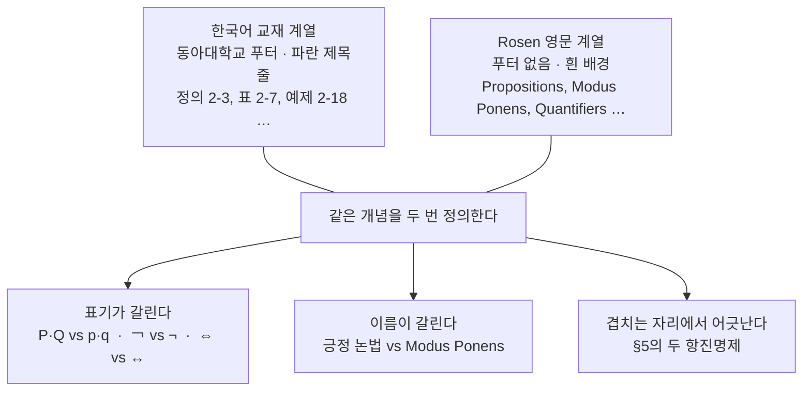
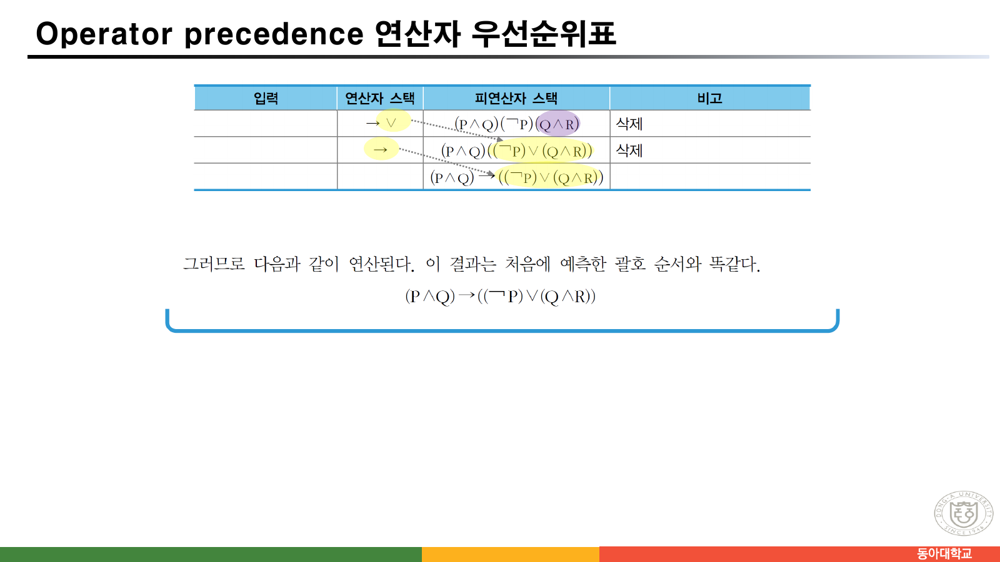
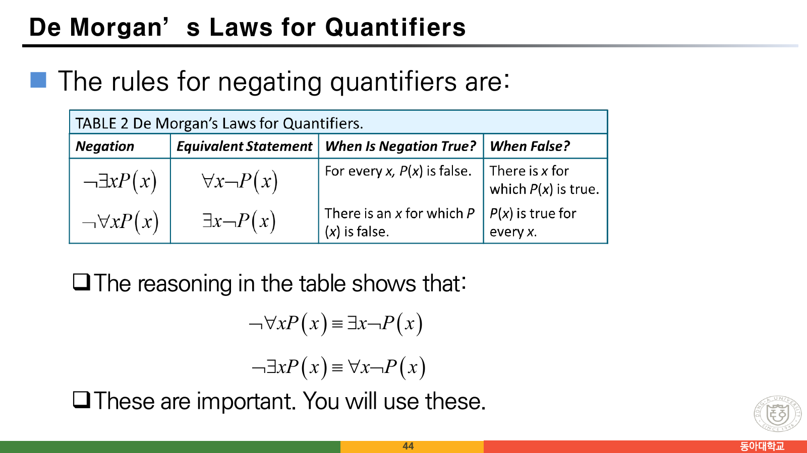
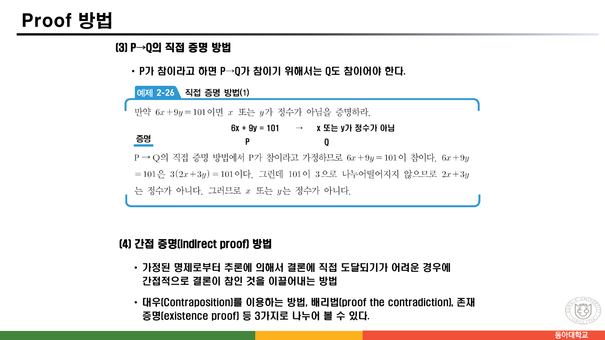
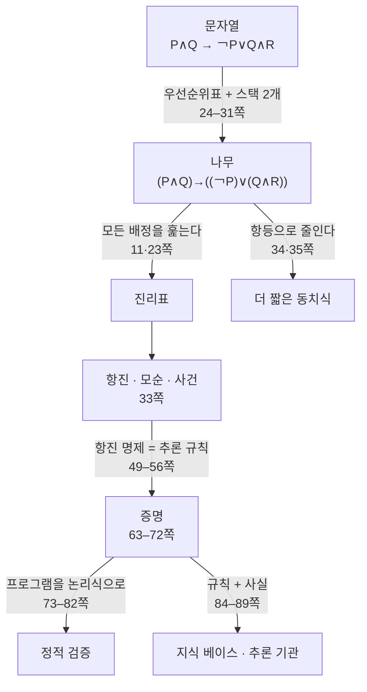

> [!abstract] 이 91쪽이 실제로 하는 말
> 논리를 가르치는 자료는 보통 진리표에서 시작해 추론 규칙으로 끝난다. 이 자료도 그렇게 보이지만, **분량의 무게 중심이 엉뚱한 데 있다.** 진리표 자체에는 두 장(11·23쪽)을 쓰고, **연산자 우선순위표를 만들고 스택 두 개로 괄호를 붙이는 데 아홉 장(24–32쪽)을 쓴다.** 그리고 32쪽에서 이렇게 못 박는다 — *“일반적인 합성 명제에 대해 진리표를 구하는 프로그램을 작성하라. **(2주)**”*
>
> 그러니 이 자료의 질문은 “이 명제가 참인가”가 아니라 **“이 명제를 기계가 어떻게 읽는가”** 다. `P∧Q → ￢P∨Q∧R` 이라는 문자열을 받았을 때 기계는 어디에 괄호를 넣어야 하는지 모른다. 그것을 정하는 것이 우선순위표이고, 그것을 실행하는 것이 두 개의 스택이다. 진리표는 괄호가 정해진 **다음에야** 그릴 수 있다.
>
> 같은 시선이 뒤쪽 절반을 관통한다 — 증명(63–69쪽), 수학적 귀납법(70–72쪽), **프로그램 검증**(73–82쪽), 그리고 지식 베이스 시스템(84–89쪽). 마지막 두 쪽의 부록이 `SymPy`와 `CLIPS`인 것도 우연이 아니다.
>
> 그리고 이 자료에는 **두 계열의 슬라이드가 겹쳐 있다.** 한국어 교재 슬라이드(동아대학교 푸터가 붙은 것)와 Rosen의 영문 슬라이드(푸터가 없는 것)가 번갈아 나온다. 두 계열이 만나는 자리에서 어긋남이 생기는데, 그 중 두 건은 **추론 규칙의 항진명제에서 글자 하나가 잘못 적힌 것**이다.

---

## 1. 자료의 지형 — 두 계열이 겹쳐 있다

2쪽 목차는 네 절이다.

| 절 | 제목 | 쪽 |
| --- | --- | --- |
| 2.1 | 수학적 모델 | 4–8 |
| 2.2 | 논리적 추론 | 9–62 |
| 2.3 | 증명 기술과 프로그램 검증 | 63–82 |
| 2.4 | 응용: 지식 베이스 시스템 | 84–89 |

그런데 쪽을 하나씩 넘겨 보면 **디자인이 서로 다른 두 종류의 슬라이드**가 번갈아 나온다.



19쪽의 교재 목록이 세 권이었던 것([01. 이산수학 소개](<./01. 이산수학 소개 — 맥주잔과 수도꼭지 사이에서.md>) §5)을 떠올리면 자연스러운 결과다. 겹침 자체는 흠이 아니다 — 같은 개념을 두 표기로 보는 것은 오히려 이득이다. 문제는 **한 손으로 옮겨 적는 과정에서 기호가 미끄러진 자리**들이고, 이 정리문서는 그 자리를 하나씩 짚는다.

한국어 계열이 쓰는 기호와 Rosen 계열이 쓰는 기호를 미리 맞춰 둔다.

| 뜻 | 한국어 계열 | Rosen 계열 | 이 문서 |
| --- | --- | --- | --- |
| 부정 | `￢P` | `¬p` | ¬ |
| 논리곱 | `P∧Q` | `p ∧ q` | ∧ |
| 논리합 | `P∨Q` | `p ∨ q` | ∨ |
| 배타적 논리합 | `P⊕Q` | (없음) | ⊕ |
| 함축 | `P→Q` | `p → q` | → |
| 동치 | `P⇔Q` | `p ↔ q` (biconditional) | ⇔ |

---

## 2. 명제 — 참이거나 거짓인 것만

8쪽(Rosen 계열)이 정의를 가장 짧게 준다.

> A proposition is a declarative sentence that is either true or false.

그리고 명제인 것과 아닌 것을 다섯 개씩 나란히 놓는다.

| 명제인 것 | 명제가 아닌 것 | 아닌 이유 |
| --- | --- | --- |
| The Moon is made of green cheese. | Sit down! | 명령문 — 참·거짓을 물을 수 없다 |
| Trenton is the capital of New Jersey. | What time is it? | 의문문 |
| Toronto is the capital of Canada. | x + 1 = 2 | **x의 값이 정해지지 않았다** |
| 1 + 0 = 1 | x + y = z | 같은 이유 |
| 0 + 0 = 2 | | |

왼쪽 열의 마지막 둘이 좋은 짝이다. `1+0=1`은 참, `0+0=2`는 거짓 — **거짓인 문장도 명제**다. 명제인지 아닌지를 가르는 것은 참인지가 아니라 **참·거짓을 물을 수 있는지**다.

오른쪽 열의 `x+1=2`가 나중에 술어(predicate)로 되살아난다. 37쪽에서 이것을 `T(x)` 꼴로 적고, 41쪽에서 한정자를 붙여 다시 명제로 만든다(→ §6).

7쪽(한국어 계열)이 같은 이야기를 다른 각도로 한다. **진리값**은 T(또는 1)와 F(또는 0), **명제 변수**는 “진리값이 아직 밝혀지지 않은 임의의 명제”로 P, Q, R로 적는다. 그리고 **합성 명제**를 “주어진 명제들을 합성하여 새로운 명제를 만드는 것”이라 정의한다. 이 세 개념이 §3의 진리표를 지탱한다.

### 함축이 자연어와 어긋나는 자리

12·13쪽이 이 자료에서 가장 공들여 설명하는 대목이다. 논리 함축 `P → Q`는 **P가 참이고 Q가 거짓일 때만 거짓**이고 나머지는 모두 참이다. 13쪽이 왜 그런지를 직설적으로 적는다.

> 자연 언어에서는 “오늘 비가 오면, 야구 경기는 연기한다”라는 것은 가정과 결론 사이의 인과 관계를 나타내지만, 수학적 논리에서의 논리 함축 P → Q는 **P와 Q가 서로 연관이 없을지라도** 임의의 두 명제를 결합할 수 있다.
> 왜냐하면 명제에서는 명제의 의미나 구조와 관계없이 **오직 명제들의 진리값만을** 다루기 때문이다.

14쪽(Rosen 계열)은 같은 말을 농담 세 개로 확인시킨다.

- “If the moon is made of green cheese, then I have more money than Bill Gates.”
- “If the moon is made of green cheese then I’m on welfare.”
- “If 1 + 1 = 3, then your grandma wears combat boots.”

셋 다 **참**이다. 전건이 거짓이면 함축은 무조건 참이기 때문이다. 이 성질이 나중에 증명 방법 중 하나(vacuous proof, 64쪽)로 되돌아온다.

13쪽은 이어서 역·이·대우를 정의한다. `P → Q`에 대해

| 이름 | 식 | `P → Q`와의 관계 |
| --- | --- | --- |
| 역 (converse) | `Q → P` | 동치가 **아니다** |
| 이 (inverse) | `¬P → ¬Q` | 동치가 **아니다** |
| **대우 (contrapositive)** | `¬Q → ¬P` | **언제나 동치** |

마지막 줄이 66쪽의 대우 증명법과 §7의 modus tollens를 떠받친다. 원본의 표현대로 — *“명제가 참이면 대우도 반드시 참이 된다.”*

### 명세를 논리식으로 옮기기

16·17쪽(Rosen 계열)이 이 성질을 실무 쪽으로 끌고 온다.

16쪽은 이렇게 시작한다 — *“System and Software engineers take requirements in English and express them in a precise specification language based on logic.”* 그리고 예를 하나 든다.

> “The automated reply cannot be sent when the file system is full”

`p` = “The automated reply can be sent”, `q` = “The file system is full” 로 두면 답은 **`q → ¬p`** 다. “보낼 수 **없다**”가 `¬p` 이고, “가득 찰 때”가 전건이 된다. 한국어의 “~할 때”가 논리에서는 “~이면”이 되는 자리다.

17쪽은 한 걸음 더 나간다. 명제들의 목록이 **일관적(consistent)** 이라는 것은 “모든 명제를 동시에 참으로 만드는 진리값 배정이 존재한다”는 뜻이다. 원본의 연습 문제를 그대로 옮기면

- `p ∨ q` — 진단 메시지가 버퍼에 저장되거나 재전송된다
- `¬p` — (원문 세 번째 줄) 진단 메시지가 버퍼에 저장된다
- `p → q` — 저장되면 재전송된다

`p = 거짓, q = 참` 이면 셋 다 참이므로 **일관적**이다. 그런데 `¬q`(재전송되지 않는다)를 더하면 만족하는 배정이 사라져 **일관적이지 않게** 된다. 요구사항 명세를 논리식으로 옮기면 **“이 요구들이 서로 모순인가”를 기계적으로 판정할 수 있다** — 이것이 이 자료가 논리를 가르치는 이유다.

---

## 3. 진리표 — 두 장이면 끝난다

11쪽이 진리표를 정의하고, 23쪽이 지금까지 나온 연산자 전부에 대한 표를 한 장에 담는다.

![23쪽 — [표 2-7] 논리 연산들에 대한 진리표와 3변수 예제](../assets/ch02-p23-논리연산-진리표.png)

> 원본 23쪽. 위쪽이 이항 연산 여섯 개의 진리표, 아래쪽이 합성 명제 `((P∨Q)∧￢R)→P` 의 진리표다.

위쪽 표를 그대로 옮기면 이렇다.

| P | Q | P∧Q | P∨Q | ¬P | P⊕Q | P→Q | P⇔Q |
| --- | --- | --- | --- | --- | --- | --- | --- |
| T | T | T | T | F | F | T | T |
| T | F | F | T | F | T | F | F |
| F | T | F | T | T | T | T | F |
| F | F | F | F | T | F | T | T |

여덟 열을 모두 검산했고 **전부 정확하다.** 눈여겨볼 자리는 두 군데다.

- `P⊕Q`(배타적 논리합)와 `P⇔Q`(동치)의 열이 **정확히 반대**다. 배타적 논리합은 “다를 때 참”, 동치는 “같을 때 참”이므로 $P \oplus Q \equiv \lnot(P \Leftrightarrow Q)$ 다.
- `P→Q` 열에서 F가 딱 한 줄(TF)뿐이다. 12쪽의 정의가 그대로 표로 나타난 자리다.

아래쪽 예제 `((P∨Q)∧¬R)→P` 의 결과열도 검산했다 — `T T T T T F T T`. 원본과 일치한다. 거짓이 되는 유일한 줄은 `P=F, Q=T, R=F` 다. 이때 전건 `(P∨Q)∧¬R`이 참인데 후건 `P`가 거짓이므로 함축이 무너진다.

### 직접 만들어 보기

아래 도구는 명제를 입력받아 진리표를 만든다. **32쪽 실습이 요구하는 프로그램의 축소판**이다 — 명제 변수 세 개(P, Q, R), 연산자 네 종류(¬ ∧ ∨ →)에 동치(⇔)를 더했고, 24쪽이 정한 우선순위와 결합법칙을 그대로 따른다.

```html preview h=620px
<div style="font-family:system-ui,-apple-system,sans-serif;padding:20px;color:var(--foreground)">
  <label for="expr" style="font-size:13px;font-weight:600">합성 명제</label>
  <input id="expr" type="text" value="((P∨Q)∧¬R)→P"
    style="width:100%;padding:9px 11px;font-size:16px;font-family:ui-monospace,Menlo,monospace;
           border:1px solid var(--border);border-radius:var(--radius);background:var(--card);color:var(--foreground)" />
  <div id="ops" style="display:flex;gap:5px;flex-wrap:wrap;margin:9px 0"></div>
  <div id="presets" style="display:flex;gap:6px;flex-wrap:wrap;margin-bottom:14px"></div>

  <div id="parsed" style="font-family:ui-monospace,Menlo,monospace;font-size:13.5px;padding:9px 12px;
       background:var(--card);border:1px solid var(--border);border-radius:var(--radius);margin-bottom:12px"></div>
  <div id="table" style="overflow-x:auto"></div>
  <div id="verdict" style="margin-top:12px;padding:11px 13px;background:var(--card);border:1px solid var(--border);
       border-radius:var(--radius);font-size:13px;line-height:1.75"></div>

  <script>
    var el = document.getElementById('expr');

    '¬ ∧ ∨ → ⇔ ( ) P Q R'.split(' ').forEach(function (s) {
      var b = document.createElement('button');
      b.textContent = s;
      b.style.cssText = 'width:34px;height:32px;font-size:15px;border:1px solid var(--border);' +
        'border-radius:var(--radius);background:var(--card);color:var(--foreground);cursor:pointer';
      b.onclick = function () { el.value += s; run(); el.focus(); };
      document.getElementById('ops').appendChild(b);
    });
    var C = document.createElement('button');
    C.textContent = '지우기';
    C.style.cssText = 'padding:0 10px;height:32px;font-size:12px;border:1px solid var(--border);' +
      'border-radius:var(--radius);background:var(--card);color:var(--muted-foreground);cursor:pointer';
    C.onclick = function () { el.value = ''; run(); };
    document.getElementById('ops').appendChild(C);

    [['((P∨Q)∧¬R)→P', '원본 23쪽 예제'],
     ['P∧Q→¬P∨Q∧R', '원본 24·32쪽 실습 명제'],
     ['P→Q⇔¬Q→¬P', '대우 (13쪽)'],
     ['P⇔Q', '동치 (22쪽)']].forEach(function (p) {
      var b = document.createElement('button');
      b.textContent = p[0] + ' · ' + p[1];
      b.style.cssText = 'padding:6px 10px;font-size:12px;border:1px solid var(--border);border-radius:var(--radius);' +
        'background:var(--card);color:var(--foreground);cursor:pointer';
      b.onclick = function () { el.value = p[0]; run(); };
      document.getElementById('presets').appendChild(b);
    });

    // 24쪽의 우선순위: ¬ > ∧ > ∨ > → > ⇔ · ¬는 오른쪽 결합, 나머지는 왼쪽 결합
    function parse(src) {
      var s = src.replace(/\s+/g, '').replace(/￢/g, '¬').replace(/~/g, '¬')
                 .replace(/&/g, '∧').replace(/\|/g, '∨').replace(/<->/g, '⇔').replace(/->/g, '→');
      var i = 0;
      function peek() { return s[i]; }
      function eat(c) { if (s[i] === c) { i++; return true; } return false; }
      function atom() {
        if (eat('(')) { var e = equiv(); if (!eat(')')) throw new Error('닫는 괄호가 없다'); return e; }
        var c = peek();
        if (c === 'P' || c === 'Q' || c === 'R') { i++; return { t: 'v', v: c }; }
        throw new Error('P, Q, R 또는 ( 가 와야 하는 자리: “' + (c || '끝') + '”');
      }
      function neg() { if (eat('¬')) return { t: '¬', a: neg() }; return atom(); }
      function bin(sub, ops) {
        var l = sub();
        while (ops.indexOf(peek()) >= 0) { var o = s[i++]; l = { t: o, a: l, b: sub() }; }
        return l;
      }
      var conj = function () { return bin(neg, ['∧']); };
      var disj = function () { return bin(conj, ['∨']); };
      var impl = function () { return bin(disj, ['→']); };
      var equiv = function () { return bin(impl, ['⇔']); };
      var r = equiv();
      if (i < s.length) throw new Error('남는 글자: “' + s.slice(i) + '”');
      return r;
    }
    function show(n) {
      if (n.t === 'v') return n.v;
      if (n.t === '¬') return '(¬' + show(n.a) + ')';
      return '(' + show(n.a) + n.t + show(n.b) + ')';
    }
    function evl(n, e) {
      if (n.t === 'v') return e[n.v];
      if (n.t === '¬') return !evl(n.a, e);
      var a = evl(n.a, e), b = evl(n.b, e);
      if (n.t === '∧') return a && b;
      if (n.t === '∨') return a || b;
      if (n.t === '→') return (!a) || b;
      return a === b;
    }
    function subs(n, acc) {                 // 중간 열을 모으기
      if (n.t === 'v') return acc;
      if (n.t === '¬') { subs(n.a, acc); }
      else { subs(n.a, acc); subs(n.b, acc); }
      var k = show(n);
      if (acc.indexOf(k) < 0) acc.push(k);
      return acc;
    }

    function run() {
      var ast;
      try { ast = parse(el.value); }
      catch (err) {
        document.getElementById('parsed').innerHTML =
          '<span style="color:var(--chart-5)">읽을 수 없다 — ' + err.message + '</span>';
        document.getElementById('table').innerHTML = '';
        document.getElementById('verdict').innerHTML = '';
        return;
      }
      document.getElementById('parsed').innerHTML =
        '<span style="color:var(--muted-foreground)">우선순위를 적용해 괄호를 채우면 </span><b>' + show(ast) + '</b>';

      var used = ['P', 'Q', 'R'].filter(function (v) { return el.value.indexOf(v) >= 0; });
      if (!used.length) used = ['P'];
      var cols = subs(ast, []), rows = [], t = 0, f = 0;
      var combos = Math.pow(2, used.length);
      for (var m = 0; m < combos; m++) {
        var env = {};
        used.forEach(function (v, k) { env[v] = !((m >> (used.length - 1 - k)) & 1); });
        var vals = cols.map(function (c) { return null; });
        var out = evl(ast, env);
        out ? t++ : f++;
        rows.push({ env: env, cols: cols.map(function (c) { return c; }), out: out, env2: env });
      }
      function cellEval(colStr, env) {         // 중간 열 값 = 그 부분식을 다시 파싱해 평가
        return evl(parse(colStr), env);
      }
      var head = used.concat(cols).map(function (h, idx) {
        var last = idx === used.length + cols.length - 1;
        return '<th style="padding:6px 11px;border-bottom:2px solid var(--border);font-family:ui-monospace,Menlo,monospace;' +
          'font-size:12.5px;white-space:nowrap;' + (last ? 'color:var(--chart-1)' : '') + '">' + h + '</th>';
      }).join('');
      var body = rows.map(function (r) {
        var tds = used.map(function (v) {
          return '<td style="padding:5px 11px;text-align:center;font-weight:600;color:var(--muted-foreground)">' +
            (r.env[v] ? 'T' : 'F') + '</td>';
        }).concat(cols.map(function (c, idx) {
          var val = cellEval(c, r.env), last = idx === cols.length - 1;
          return '<td style="padding:5px 11px;text-align:center;font-weight:' + (last ? '700' : '400') +
            ';color:' + (last ? (val ? 'var(--chart-1)' : 'var(--chart-5)') : 'var(--foreground)') + '">' +
            (val ? 'T' : 'F') + '</td>';
        })).join('');
        return '<tr style="border-bottom:1px solid var(--border)">' + tds + '</tr>';
      }).join('');
      document.getElementById('table').innerHTML =
        '<table style="border-collapse:collapse;font-size:13px;min-width:100%"><thead><tr>' +
        head + '</tr></thead><tbody>' + body + '</tbody></table>';

      var kind = f === 0 ? ['항진(tautology) 명제', 'var(--chart-1)', '모든 줄이 참이다 — 33쪽 [정의 2-3]']
        : t === 0 ? ['모순(contradiction) 명제', 'var(--chart-5)', '모든 줄이 거짓이다 — 33쪽 [정의 2-4]']
        : ['사건(contingency) 명제', 'var(--chart-3)', '항진도 모순도 아니다 — 33쪽'];
      document.getElementById('verdict').innerHTML =
        '변수 ' + used.length + '개 → 줄 <b>' + combos + '</b>개 · 참 ' + t + ' · 거짓 ' + f +
        '<br/>이 명제는 <b style="color:' + kind[1] + '">' + kind[0] + '</b>다. ' +
        '<span style="color:var(--muted-foreground)">(' + kind[2] + ')</span>';
    }
    el.addEventListener('input', run);
    run();
  </script>
</div>
```

33쪽이 이 도구의 마지막 줄에 이름을 붙여 준다 — **항진(tautology)**, **모순(contradiction)**, **사건(contingency)** 명제. 세 번째 것의 정의는 소거법이다. *“항진 명제도 아니고 모순 명제도 아닌 명제.”*

---

## 4. 아홉 장을 쓴 자리 — 우선순위와 스택 두 개

여기가 이 자료의 진짜 무게 중심이다. 24쪽이 문제를 이렇게 세운다.

> 우선순위를 위해서 괄호를 사용하기도 하지만, 이 방법은 합성 명제가 길고 복잡하다면 **너무나 많은 괄호 때문에 가독성(readability)이 떨어진다.**

그래서 괄호를 생략하되 읽는 방법을 고정한다. 원본이 정한 규칙은 두 줄이다.

$$\lnot \;>\; \land \;>\; \lor \;>\; \to \;>\; \Leftrightarrow$$

> ✓ 이러한 연산자 우선순위를 유지하고 **￢(부정)은 오른쪽 결합법칙**을, **나머지 연산자들은 왼쪽 결합법칙**을 갖는다고 하자.

그리고 곧바로 답을 미리 말해 버린다 — `P∧Q → ￢P∨Q∧R` 에 괄호를 채우면 `(P∧Q) → ((￢P)∨(Q∧R))` 다. 남은 아홉 장은 **그 답을 기계가 어떻게 스스로 얻는가**에 쓰인다.

### 우선순위표라는 물건

25–28쪽이 만드는 것은 정방 행렬이다. **행은 입력에 있는 연산자, 열은 스택에 있는 연산자**이고, 각 칸에는 “누가 먼저인가”가 들어간다. 원본 26쪽이 1행 1열을 직접 채워 보인다.

> 스택 속에는 연산자 ¬가 있고, 입력에도 연산자가 ¬가 있는 경우이다. 이 경우에 누굴 먼저 연산해야 할까?
> 같은 연산자이므로 연산자 우선순위가 같다. 따라서 결합법칙이 무엇인지 살펴봐야 한다. **오른쪽 결합 법칙을 가지므로 입력에 ¬ 연산을 먼저 수행해야 한다.**

27쪽이 나머지 주대각 원소를 채운다 — `∧`, `∨`, `→` 는 왼쪽 결합이므로 같은 연산자끼리는 **스택 쪽이 이긴다.** 그리고 다른 연산자끼리는 우선순위 순서대로 채운다.

이 규칙 세 줄을 표로 정리하면 이렇다.

| 상황 | 누가 먼저인가 |
| --- | --- |
| 우선순위가 다르다 | **높은 쪽이 먼저** |
| 같은 연산자이고 왼쪽 결합(`∧ ∨ →`) | **스택에 있는 것이 먼저** |
| 같은 연산자이고 오른쪽 결합(`¬`) | **입력에 있는 것이 먼저** |

### 스택 두 개로 굴려 보기

29–31쪽이 이 표를 들고 `P∧Q → ￢P∨Q∧R` 를 실제로 처리한다. 스택은 두 개 — **연산자 스택**과 **피연산자 스택**이다.



> 원본 31쪽. 표의 마지막 세 줄이 `→ ∨` / `→` / (빈칸) 순으로 연산자 스택이 비어 가는 과정을 보이고, 피연산자 스택이 `(P∧Q)((￢P)(Q∧R))` 에서 `(P∧Q)→((￢P)∨(Q∧R))` 로 합쳐진다. 아래에 결론이 한 줄 붙는다 — **“그러므로 다음과 같이 연산된다. 이 결과는 처음에 예측한 괄호 순서와 똑같다.”**

아래 도구가 그 과정을 재현한다. **결합 순서를 바꿔 가며 같은 문자열이 어떻게 다르게 읽히는지** 확인할 수 있다.

```html preview h=560px
<div style="font-family:system-ui,-apple-system,sans-serif;padding:20px;color:var(--foreground)">
  <div style="font-size:13px;color:var(--muted-foreground);margin-bottom:10px">
    24쪽의 규칙(¬ &gt; ∧ &gt; ∨ &gt; → &gt; ⇔)이 문자열을 어떻게 나무로 바꾸는가.
    아래 순서대로 연산자가 결합된다.
  </div>
  <div id="prpresets" style="display:flex;gap:6px;flex-wrap:wrap;margin-bottom:14px"></div>
  <div id="prexpr" style="font-family:ui-monospace,Menlo,monospace;font-size:20px;letter-spacing:1px;margin-bottom:14px"></div>
  <div id="prsteps"></div>
  <div id="prfinal" style="margin-top:12px;padding:11px 13px;background:var(--card);border:1px solid var(--border);
       border-radius:var(--radius);font-size:13.5px;line-height:1.8"></div>

  <script>
    // 결합 순서를 손으로 적어 둔 것 — 원본 24·31쪽이 도달한 순서 그대로
    var CASES = [
      {
        label: '원본 24·32쪽 실습 명제',
        raw: 'P ∧ Q → ￢ P ∨ Q ∧ R',
        steps: [
          ['￢ 가 가장 높다 — ￢P 를 먼저 묶는다', 'P ∧ Q → (￢P) ∨ Q ∧ R'],
          ['∧ 이 다음 — 왼쪽부터 P∧Q', '(P∧Q) → (￢P) ∨ Q ∧ R'],
          ['남은 ∧ — Q∧R', '(P∧Q) → (￢P) ∨ (Q∧R)'],
          ['∨ 이 다음', '(P∧Q) → ((￢P)∨(Q∧R))'],
          ['마지막이 →', '(P∧Q)→((￢P)∨(Q∧R))']
        ],
        note: '원본 24쪽이 미리 적어 둔 답, 그리고 31쪽이 스택으로 도달한 답이 이것으로 같다.'
      },
      {
        label: '원본 23쪽 진리표 예제',
        raw: '( P ∨ Q ) ∧ ￢ R → P',
        steps: [
          ['괄호가 이미 있는 자리는 그대로', '(P∨Q) ∧ ￢R → P'],
          ['￢ 를 묶는다', '(P∨Q) ∧ (￢R) → P'],
          ['∧ 이 → 보다 높다', '((P∨Q)∧(￢R)) → P'],
          ['마지막이 →', '((P∨Q)∧(￢R))→P']
        ],
        note: '괄호가 하나만 있어도 나머지는 우선순위가 결정한다.'
      },
      {
        label: '괄호를 다 빼면',
        raw: 'P ∨ Q ∧ R',
        steps: [
          ['∧ 이 ∨ 보다 높다', 'P ∨ (Q∧R)'],
          ['남은 ∨', 'P∨(Q∧R)']
        ],
        note: '(P∨Q)∧R 로 읽으면 P=T, Q=F, R=F 에서 답이 갈린다 — 앞은 T, 뒤는 F. 우선순위 한 줄이 진리표를 바꾼다.'
      }
    ];
    var cur = 0;
    CASES.forEach(function (c, i) {
      var b = document.createElement('button');
      b.textContent = c.label;
      b.style.cssText = 'padding:6px 11px;font-size:12px;border:1px solid var(--border);border-radius:var(--radius);' +
        'background:var(--card);color:var(--foreground);cursor:pointer';
      b.onclick = function () { cur = i; draw(); };
      document.getElementById('prpresets').appendChild(b);
    });
    function draw() {
      var c = CASES[cur];
      document.getElementById('prexpr').innerHTML =
        '<span style="color:var(--muted-foreground);font-size:13px">입력 </span>' + c.raw;
      document.getElementById('prsteps').innerHTML = c.steps.map(function (s, i) {
        return '<div style="display:flex;gap:14px;align-items:center;padding:9px 13px;margin-bottom:6px;' +
          'border:1px solid var(--border);border-left:3px solid var(--chart-1);border-radius:var(--radius);background:var(--card)">' +
          '<span style="width:22px;height:22px;border-radius:50%;background:var(--chart-1);color:var(--background);' +
          'display:flex;align-items:center;justify-content:center;font-size:12px;font-weight:700;flex:none">' + (i + 1) + '</span>' +
          '<span style="flex:1;font-size:12.5px;color:var(--muted-foreground)">' + s[0] + '</span>' +
          '<span style="font-family:ui-monospace,Menlo,monospace;font-size:14px;font-weight:600">' + s[1] + '</span></div>';
      }).join('');
      document.getElementById('prfinal').innerHTML = c.note;
    }
    draw();
  </script>
</div>
```

세 번째 예가 이 절이 왜 필요한지를 한 줄로 말한다. `P∨Q∧R` 을 `(P∨Q)∧R` 로 읽으면 `P=T, Q=F, R=F` 에서 참이 거짓으로 뒤집힌다. **우선순위는 취향이 아니라 진리값을 정하는 규칙이다.**

### 그리고 2주짜리 숙제

32쪽이 이 아홉 장의 목적지다.

> 일반적인 합성 명제에 대해 진리표를 구하는 프로그램을 작성하라. **(2주)**
> • 명제 변수는 많아야 3개로 제한하고, 논리 연산자도 많아야 4종류만 허용한다.
> • 세 개의 명제 P, Q, R이 있고, 논리연산자는 and, or, not, implication 네 가지가 있다.
> • 합성 명제 `P∧Q →￢P∨Q∧R` 에 대해 진리표를 만들라.

§3의 도구가 하는 일이 정확히 이것이다. 그리고 그 도구를 만들려면 §4의 우선순위 규칙이 먼저 있어야 한다 — **자료의 순서가 곧 구현의 순서다.**

---

## 5. 항등 — 진리표를 그리지 않고 답에 이르는 길

34쪽이 논리적 동치를 “P와 Q가 똑같은 진리값을 갖는 것”으로 정의하고, **명제를 간단히 하는 데 쓴다**고 못 박는다. 35쪽이 그 시범이다.

![35쪽 — [예제 2-18] 항등을 이용한 간단화](../assets/ch02-p35-항등을-이용한-간단화.png)

> 원본 35쪽. `[(A→B)∨(A→D)]→(B∨D)` 를 아홉 걸음에 걸쳐 `A∨B∨D` 로 줄인다. 각 걸음 오른쪽에 [표 2-8]의 항등 번호가 붙어 있다.

원본의 아홉 걸음을 그대로 옮기면 이렇다.

| # | 식 | 근거 |
| --- | --- | --- |
| 0 | `[(A→B)∨(A→D)]→(B∨D)` | 출발 |
| 1 | `[(¬A∨B)∨(¬A∨D)]→(B∨D)` | 18 (함축 → 논리합) |
| 2 | `[(¬A∨¬A)∨(B∨D)]→(B∨D)` | 5와 3 (결합·교환) |
| 3 | `[¬A∨(B∨D)]→(B∨D)` | 1 (멱등) |
| 4 | `¬[¬A∨(B∨D)]∨(B∨D)` | 18 |
| 5 | `[¬(¬A)∧¬(B∨D)]∨(B∨D)` | 7 (드모르간) |
| 6 | `[A∧¬(B∨D)]∨(B∨D)` | 17 (이중부정) |
| 7 | `[A∨(B∨D)]∧[¬(B∨D)∨(B∨D)]` | 10 (분배) |
| 8 | `(A∨B∨D)∧1` | 15 (보수) |
| 9 | `A∨B∨D` | 12 (항등원) |

**아홉 걸음 전체를 진리표로 검산했다.** 여덟 줄 모두에서 출발식과 `A∨B∨D` 의 진리값이 일치한다 — 유도는 정확하다.

7번 걸음이 이 유도의 심장이다. $X = B \lor D$ 로 두면 `[A∧¬X]∨X` 이고, 분배법칙을 쓰면

$$(A \lor X) \land (\lnot X \lor X) \;=\; (A \lor X) \land 1 \;=\; A \lor X$$

이 패턴 $ (A \land \lnot X) \lor X \equiv A \lor X$ 는 **흡수의 변형**으로 자주 나온다. 진리표로 확인하면 여덟 줄이지만, 항등으로는 세 줄이면 끝난다. 34쪽이 “명제들을 간단히 할 때 사용한다”고 적은 것이 이 뜻이다.

멱등법칙에는 34쪽이 따로 한 줄 설명을 붙였다 — *“연산을 여러 번 적용하더라도 결과가 달라지지 않는 성질.”* 2번 걸음의 `¬A∨¬A → ¬A` 가 바로 그것이다.

---

## 6. 술어와 한정자 — 명제가 아니던 것을 명제로

8쪽에서 “명제가 아닌 것”으로 밀려났던 `x+1=2`가 여기서 돌아온다.

37쪽이 술어를 정의한다. *“`x is tall.` 이라는 문장에서 x를 변수라고 하고 tall을 술어라고 한다.”* 기호로는 `T(x)`이고, 괄호 안의 x를 **개별 변수(individual variable)** 라 한다. 40쪽(Rosen 계열)이 같은 것을 명제 함수로 부르며 예를 준다 — `P(x)`를 “x > 0”, 정의역(domain, U)을 정수라 하면 `P(-3)` 거짓, `P(0)` 거짓, `P(3)` 참.

38쪽이 술어를 명제로 바꾸는 두 가지 길을 적는다.

1. **개별 변수를 한 개의 값으로 한정** — `P(3)` 처럼 값을 넣는다
2. **한정자로 한정** — `∀x P(x)`, `∃x P(x)`

41쪽이 한정자 셋을 정의한다.

| 한정자 | 기호 | 읽는 법 | 뜻 |
| --- | --- | --- | --- |
| 전체 한정자 | `∀` | “임의의”, “모든” | x의 **모든** 값에 대해 P(x)가 참 |
| 존재 한정자 | `∃` | “어떤”, “적어도 하나에 대해서” | P(x)가 참이 되는 x가 **존재**한다 |
| 유일 한정자 | `∃!` | “~에 대한 유일한 x가 존재한다” | 참이 되는 x가 **유일하게** 존재 |

42쪽은 Rosen 계열이 같은 내용을 영어로 반복하며 퍼스(Charles Peirce, 1839–1914)의 이름을 붙인다.

44쪽이 이 절에서 실무적으로 가장 자주 쓰이는 규칙을 준다.



> 원본 44쪽. 표 아래 결론이 두 줄로 적혀 있고, 그 아래에 *“These are important. **You will use these.**”* 가 붙었다.

$$\lnot \forall x\, P(x) \;\equiv\; \exists x\, \lnot P(x) \qquad\qquad \lnot \exists x\, P(x) \;\equiv\; \forall x\, \lnot P(x)$$

말로 옮기면 — **“모두 그렇지는 않다”는 “그렇지 않은 것이 하나 있다”와 같고, “하나도 없다”는 “모두 아니다”와 같다.** 원본 표의 오른쪽 두 칸이 이것을 자연어로 다시 적어 준다: `¬∃xP(x)`가 참인 때는 “For every x, P(x) is false”, 거짓인 때는 “There is x for which P(x) is true”.

이 규칙이 69쪽의 **반례에 의한 반증**으로 곧장 이어진다. `∀x P(x)` 가 거짓임을 보이려면 `∃x ¬P(x)` 를 보이면 되고, 그 x가 반례다.

> [!note] 원본의 중복과 오기 — 41·43쪽
> 41쪽과 43쪽은 **본문이 완전히 같은 슬라이드**다. 43쪽에만 오른쪽 위에 한 줄이 더 붙어 있다 — `C#, 접근 한정자 (Access quantifier)`, 출처는 `Microsoft - C# 설명서`.
>
> 그런데 C#에서 `public` · `private` 따위를 부르는 이름은 **access modifier**(접근 **제한자**/**한정자**로 번역)이지 *access quantifier*가 아니다. quantifier(한정자)와 modifier/qualifier는 다른 말이며, 공교롭게도 바로 다음 46쪽의 제목이 **`Qualifier 수식어`** 다. 41–46쪽이 quantifier와 qualifier를 나란히 놓는 구성이라 이 오기가 더 헷갈리게 작동한다.
>
> 46쪽 자체는 논리와 무관한 내용이다 — 레코드 A 안의 B·C, B 안의 D·E … 라는 계층에서 F를 `A, C, F`로 부르는 **완전 수식어**와 `F`로 부르는 **부분 수식어**를 구분한다. 구조체 멤버 참조(`.`)의 이야기이고, 술어 논리의 한정자와는 이름만 닮았다.

---

## 7. 추론 — 같은 규칙을 두 번 배우는 곳, 그리고 어긋나는 곳

여기가 두 계열이 가장 촘촘하게 겹치는 구간이다. 49·50쪽이 한국어 표로 추론 규칙 아홉 개를 주고, 51–56쪽이 Rosen 슬라이드로 같은 규칙 여섯 개를 다시 준다.

![49쪽 — [표 2-9] 항진 명제의 형태를 이용하는 추론의 법칙](../assets/ch02-p49-추론규칙-표-2-9.png)

> 원본 49쪽. 세 열이다 — **추론의 법칙**(기호), **항진 명제의 형태**, **이름**. 왼쪽에는 같은 내용을 한국어 문장으로 풀어 놓았고, 세 번째 줄(전건 긍정)에는 빨간 테두리가 쳐져 있다.

원본 49·50쪽의 아홉 규칙을 한 표로 모으면 이렇다.

| 전제 | 결론 | 항진 명제의 형태 | 이름 |
| --- | --- | --- | --- |
| P | P∨Q | `P → (P∨Q)` | 선언적 부가 (disjunctive addition) |
| P∧Q | P | `(P∧Q) → P` | 단순화 (simplification) |
| P, P→Q | Q | `[P∧(P→Q)] → Q` | **전건 긍정 (modus ponens)** · 긍정 논법 |
| ¬Q, P→Q | ¬P | `[¬Q∧(P→Q)] → ¬P` | **후건 부정 (modus tollens)** · 부정 논법 |
| P∨Q, ¬P | Q | — | 선언적 삼단논법 |
| P→Q, Q→R | P→R | — | 가언적 삼단논법 |
| P, Q | P∧Q | — | 논리곱 |
| P→Q, R→S, P∨R | Q∨S | — | 구성적 양도논법 |
| P→Q, R→S, ¬Q∨¬S | ¬P∨¬R | — | 파괴적 양도논법 |

> [!warning] 원본 오류 ① — 49쪽 마지막 줄의 한국어 문장이 기호와 반대다
> 표의 네 번째 줄(후건 부정)에서 **기호 칸**은 `¬Q`, `P→Q` 에서 `∴ ¬P` 를 유도한다고 정확히 적었다. 그런데 **바로 왼쪽의 한국어 문장 칸**은 이렇게 적혀 있다.
>
> > q가 아니다 / p이면 q이다 / 따라서 **p이다**
>
> `∴ ¬P` 여야 하므로 **“따라서 p가 아니다”** 가 되어야 한다. 같은 행 안에서 기호와 문장이 정반대를 말한다. 위 세 줄(선언적 부가·단순화·전건 긍정)은 기호와 문장이 일치하므로, 이 한 줄만 부정이 떨어져 나갔다.
>
> 같은 표에 표기 흠이 셋 더 있다 — 이름 칸의 `simplication`(→ simplification), `modus tollen`(→ modus tollens), 그리고 첫 줄의 한국어 문장이 `p이다 / 따라서 p 또는 **Q**이다` 로 소문자 p와 대문자 Q를 섞어 쓴다.

이어서 Rosen 계열의 두 장이 나온다. 그리고 **두 장 모두 항진 명제에서 글자 하나가 어긋난다.**


> 원본 51쪽과 52쪽. 각 슬라이드는 왼쪽에 추론의 꼴, 가운데에 `Corresponding Tautology`, 아래에 눈 오는 날 예제를 담고 있다.

두 슬라이드에 인쇄된 것을 그대로 옮기고, 옆에 있어야 할 것을 나란히 놓는다.

| 51쪽 Modus Ponens | 인쇄된 것 | 있어야 할 것 |
| --- | --- | --- |
| 추론의 꼴 | `p→q`, `p` ⟹ `∴ q` | ✅ 정확 |
| Corresponding Tautology | **`(q ∧ (p → q)) → q`** | `(p ∧ (p → q)) → q` |
| 예제 | 눈이 온다 / 눈이 오면 공부한다 / 따라서 공부한다 | ✅ 정확 |

| 52쪽 Modus Tollens | 인쇄된 것 | 있어야 할 것 |
| --- | --- | --- |
| 추론의 꼴 | `p→q`, **`¬p`** ⟹ **`∴ ¬q`** | `p→q`, `¬q` ⟹ `∴ ¬p` |
| Corresponding Tautology | **`(¬q ∧ (p → q)) → ¬q`** | `(¬q ∧ (p → q)) → ¬p` |
| 예제 | 눈이 오면 공부한다 / 공부하지 **않는다** / 따라서 눈이 오지 **않는다** | ✅ 정확 |

> [!warning] 원본 오류 ② — 51·52쪽의 항진 명제가 modus ponens/tollens가 아니다
> 51쪽의 `(q ∧ (p → q)) → q` 와 52쪽의 `(¬q ∧ (p → q)) → ¬q` 는 **둘 다 실제로 항진 명제이긴 하다.** 전건이 이미 후건을 품고 있으므로(`q ∧ … → q`) 언제나 참이다. 그래서 눈에 잘 띄지 않는다.
>
> 그러나 **아무것도 말하지 않는 항진 명제**다. 추론 규칙의 요점은 “가진 것에서 **새로운 것**을 얻는다”인데, 인쇄된 식은 “q를 가지면 q를 얻는다”로 읽힌다. 49쪽 한국어 표가 적은 올바른 형태 `[P∧(P→Q)]→Q`, `[¬Q∧(P→Q)]→¬P` 와 대조하면 차이가 분명해진다.
>
> 52쪽은 더 깊다. **추론의 꼴 자체가 전제와 결론을 맞바꿔 놓았다** — `¬p` 를 전제로 두고 `¬q` 를 결론으로 적었다. 그런데 **같은 슬라이드 아래 영어 예제는 정확하다**(“공부하지 않는다” = `¬q` 가 전제, “눈이 오지 않는다” = `¬p` 가 결론). 기호와 예제가 서로를 반박한다.
>
> 참고로 인쇄된 꼴 `p→q`, `¬p` ⟹ `¬q` 는 **부정 논법의 오류(denying the antecedent)** 로 알려진 대표적인 오추론이다 — 눈이 오지 않아도 공부할 수 있다.

아래 도구로 네 형태를 직접 비교할 수 있다. 항진 명제인지, 그리고 **쓸모 있는 규칙인지**는 다른 질문이다.

```html preview h=560px
<div style="font-family:system-ui,-apple-system,sans-serif;padding:20px;color:var(--foreground)">
  <div id="mtchips" style="display:flex;gap:6px;flex-wrap:wrap;margin-bottom:14px"></div>
  <div id="mtform" style="font-family:ui-monospace,Menlo,monospace;font-size:17px;margin-bottom:12px"></div>
  <div id="mttab" style="overflow-x:auto;margin-bottom:12px"></div>
  <div id="mtbox" style="padding:12px 14px;background:var(--card);border:1px solid var(--border);
       border-radius:var(--radius);font-size:13px;line-height:1.8"></div>

  <script>
    var FORMS = [
      { name: '49쪽 표 · 전건 긍정', f: '(p ∧ (p → q)) → q',
        ev: function (p, q) { return !(p && ((!p) || q)) || q; },
        ok: true, why: '전제 p 와 p→q 에서 <b>새로운</b> q 를 얻는다. 이것이 modus ponens 다.' },
      { name: '51쪽에 인쇄된 것', f: '(q ∧ (p → q)) → q',
        ev: function (p, q) { return !(q && ((!p) || q)) || q; },
        ok: false, why: '항진 명제이긴 하다 — 전건이 이미 q 를 품고 있으니 당연히 참이다. 그러나 <b>아무것도 새로 말하지 않는다.</b> 전제의 p 가 q 로 잘못 적혔다.' },
      { name: '49쪽 표 · 후건 부정', f: '(¬q ∧ (p → q)) → ¬p',
        ev: function (p, q) { return !((!q) && ((!p) || q)) || (!p); },
        ok: true, why: '결론을 부정해서 전제를 부정한다. 13쪽의 대우가 그대로 규칙이 된 것이다.' },
      { name: '52쪽에 인쇄된 것', f: '(¬q ∧ (p → q)) → ¬q',
        ev: function (p, q) { return !((!q) && ((!p) || q)) || (!q); },
        ok: false, why: '역시 항진 명제이지만 후건이 전건의 일부다. 결론의 ¬p 가 ¬q 로 잘못 적혔다.' },
      { name: '참고 · 후건 긍정(오추론)', f: '(q ∧ (p → q)) → p',
        ev: function (p, q) { return !(q && ((!p) || q)) || p; },
        ok: false, why: '<b>항진 명제가 아니다.</b> p=F, q=T 에서 거짓 — 공부했다고 눈이 온 것은 아니다.' },
      { name: '참고 · 전건 부정(오추론)', f: '(¬p ∧ (p → q)) → ¬q',
        ev: function (p, q) { return !((!p) && ((!p) || q)) || (!q); },
        ok: false, why: '<b>항진 명제가 아니다.</b> p=F, q=T 에서 거짓 — 52쪽에 인쇄된 추론의 꼴이 이 모양이다.' }
    ];
    var cur = 0;
    FORMS.forEach(function (F, i) {
      var b = document.createElement('button');
      b.textContent = F.name;
      b.style.cssText = 'padding:6px 11px;font-size:12px;border:1px solid var(--border);border-radius:var(--radius);' +
        'background:var(--card);color:var(--foreground);cursor:pointer';
      b.onclick = function () { cur = i; draw(); };
      document.getElementById('mtchips').appendChild(b);
    });
    function draw() {
      var F = FORMS[cur], rows = [], allT = true;
      [[1, 1], [1, 0], [0, 1], [0, 0]].forEach(function (pq) {
        var v = F.ev(!!pq[0], !!pq[1]);
        if (!v) allT = false;
        rows.push([pq[0] ? 'T' : 'F', pq[1] ? 'T' : 'F', v]);
      });
      document.getElementById('mtform').textContent = F.f;
      document.getElementById('mttab').innerHTML =
        '<table style="border-collapse:collapse;font-size:13.5px"><thead><tr>' +
        ['p', 'q', '식의 값'].map(function (h) {
          return '<th style="padding:6px 18px;border-bottom:2px solid var(--border);font-family:ui-monospace,Menlo,monospace">' + h + '</th>';
        }).join('') + '</tr></thead><tbody>' +
        rows.map(function (r) {
          return '<tr style="border-bottom:1px solid var(--border)"><td style="padding:5px 18px;text-align:center;color:var(--muted-foreground)">' +
            r[0] + '</td><td style="padding:5px 18px;text-align:center;color:var(--muted-foreground)">' + r[1] +
            '</td><td style="padding:5px 18px;text-align:center;font-weight:700;color:' +
            (r[2] ? 'var(--chart-1)' : 'var(--chart-5)') + '">' + (r[2] ? 'T' : 'F') + '</td></tr>';
        }).join('') + '</tbody></table>';
      document.getElementById('mtbox').innerHTML =
        '<b style="color:' + (allT ? 'var(--chart-1)' : 'var(--chart-5)') + '">' +
        (allT ? '항진 명제다 (네 줄 모두 T)' : '항진 명제가 아니다') + '</b> · ' +
        '<b style="color:' + (F.ok ? 'var(--chart-1)' : 'var(--chart-3)') + '">' +
        (F.ok ? '쓸모 있는 추론 규칙' : '추론 규칙으로는 쓸 수 없다') + '</b><br/>' +
        '<span style="color:var(--muted-foreground)">' + F.why + '</span>';
    }
    draw();
  </script>
</div>
```

두 판정이 **따로 논다**는 것이 이 도구의 요점이다. 51·52쪽에 인쇄된 두 식은 “항진 명제 ✓ / 추론 규칙 ✗”이고, 후건 긍정·전건 부정은 “항진 명제 ✗ / 추론 규칙 ✗”이다. **항진 명제인지 확인하는 것만으로는 추론 규칙을 검증할 수 없다.**

53–56쪽은 나머지 규칙을 같은 형식으로 준다 — 가언적 삼단논법, 단순화, 논리곱, 그리고 **resolution**. 56쪽이 마지막 것에 한 줄을 덧붙인다: *“Resolution plays an important role in AI and is used in Prolog.”* 형태는

$$\frac{\lnot p \lor r,\quad p \lor q}{\therefore\; q \lor r}$$

48쪽(Rosen 계열)은 규칙들을 술어 논리로 확장해 소크라테스 삼단논법을 적는다.

$$\frac{\forall x\,(\mathrm{Man}(x) \to \mathrm{Mortal}(x)),\quad \mathrm{Man}(\mathrm{Socrates})}{\therefore\; \mathrm{Mortal}(\mathrm{Socrates})}$$

---

## 8. 증명 — 다섯 개의 문, 그리고 하나의 함정

63쪽이 증명 문제를 한 줄로 규정한다 — *“증명 문제 : 논리 함축 P → Q 를 증명하는 것이 대부분.”* 그리고 64–69쪽이 다섯 가지 방법을 준다.

| # | 방법 | 요령 | 근거가 되는 성질 |
| --- | --- | --- | --- |
| 1 | **vacuous** | P가 **거짓**임만 보이면 된다 | 전건이 거짓이면 함축은 참 (12쪽) |
| 2 | **trivial** | Q가 **참**임만 보이면 된다 | 후건이 참이면 함축은 참 |
| 3 | **직접 증명** | P가 참이라 하고 Q를 이끌어낸다 | — |
| 4 | **간접 증명** | 대우 / 배리법 / 존재 증명 | 대우 동치 (13쪽) |
| 5 | **반증** | 반례 / 모순 | 한정자 드모르간 (44쪽) |

1번과 2번이 §2의 “함축이 자연어와 어긋난다”를 그대로 증명 도구로 바꾼 것이다. 14쪽의 달나라 치즈 농담이 여기서 쓸모를 얻는다.



> 원본 65쪽. 직접 증명 항목 아래에 예제 하나가 적혀 있다 — `6x + 9y = 101` → `x 또는 y가 정수가 아님`, 그리고 그 아래 P와 Q 라벨이 붙어 있다.

이 예제는 짧지만 완결적이다. $6x + 9y = 3(2x + 3y)$ 이므로 x, y가 모두 정수라면 좌변은 **3의 배수**다. 그런데 $101 = 3 \times 33 + 2$ 로 3의 배수가 아니다. 따라서 x, y가 모두 정수일 수는 없다. 원본이 계수를 6과 9로 고른 것은 **둘의 최대공약수가 3**이기 때문이고, 101을 고른 것은 **3으로 나누어떨어지지 않기** 때문이다.

66–68쪽이 간접 증명 셋을 다룬다.

- **대우 이용** — `P→Q` 대신 `¬Q→¬P` 를 증명한다. 슬라이드에 `(6, 28, 496, 8128, ....)` 이 적혀 있는데, **완전수(perfect number)** 의 나열이다.
- **배리법(귀류법)** — “P가 참임을 보이는데 ¬P가 거짓임을 보이는 것”. 예제로 `전제 (~P) : 가장 큰 소수는 존재한다` 가 적혀 있다 — 유클리드의 소수 무한 증명이다.
- **존재 증명** — `∃x P(x)` 를 보이는 것.

69쪽이 반증 둘을 정리한다. 반례에 의한 반증이 44쪽의 드모르간을 그대로 쓴다 — *“`∀x P(x)` 의 형태를 가진 명제가 거짓임을 증명하는데 편리한 방법으로서 명제의 부정 `∃x ¬P(x)` 가 참임을 보이면 된다. 이때 x를 반례라 한다.”*

70–72쪽이 수학적 귀납법으로 넘어가며 연역법과 귀납법을 대비시키는데, 70쪽 아래에 붙은 예시는 **가언적 삼단논법**(`p→q`, `q→r` ⟹ `p→r`)이다. 49·50쪽에서 이미 나온 규칙이 연역의 대표로 다시 인용된 것이다.

---

## 9. 프로그램 검증과 지식 베이스 — 논리가 향하는 곳

73쪽이 짧게 선언한다 — *“프로그램 검증(program verification) : 매우 어려운 문제.”* 그리고 75–82쪽이 검증 방법을 정적/동적으로 나눈다.

| | 정적(static) 방법 | 동적(dynamic) 방법 |
| --- | --- | --- |
| 실행 | 하지 않는다 | 실제로 돌린다 |
| 커버리지 | **모든 경로**를 분석 | 넣어 본 입력만 |
| 82쪽이 적은 장점 | *“모든 경로에 대해 분석하므로 TC(Test case)에 영향 없고, Case 작성 소요 시간과 비용 절감”* | — |
| 82쪽이 적은 제약 | — | *“실제 동작 시 수행되므로 동적 분석 도구 연결 인터페이스 존재 필요(파일, 시리얼 등)”* |

정적 방법이 “모든 경로”를 다룰 수 있는 것은 프로그램을 **논리식으로 바꿔서** 다루기 때문이다. 그 논리식이 이 자료의 앞 절반이다.

84–89쪽이 마지막 응용이다. 지식 베이스 시스템 — **사실(fact)들의 데이터베이스 + 추론 규칙(rule)의 지식 기반 + 추론 기관(inference engine) + 사용자 인터페이스.** 87쪽이 이렇게 적는다.

> 추론 기관은 전문가 시스템에게 **문제를 풀 수 있는 능력을 부여한다.**

88쪽이 흐름을 세 줄로 요약한다 — 사용자가 요구를 전달하면 → 추론 기관이 규칙과 사실을 탐색해 **새로운 사실을 추론**하고 → 그것을 사용자에게 돌려준다. §7의 추론 규칙들이 실제로 실행되는 자리가 여기다.

90·91쪽의 부록 두 장이 도구 이름만 적고 끝난다 — **`SymPy`** 와 **`CLIPS`**. 앞의 것은 파이썬 기호 계산 라이브러리(§3의 실습을 라이브러리로 하면 이것), 뒤의 것은 규칙 기반 전문가 시스템 셸(§9의 추론 기관을 실제로 돌리는 것)이다. 두 이름이 이 91쪽 전체의 두 갈래를 그대로 가리킨다.

85쪽이 마지막에 한 줄 덧붙인다 — *“최근의 인공지능 : 기계학습과 딥 러닝이 대세.”* 규칙을 손으로 적는 방식에서 데이터로 학습하는 방식으로 무게가 옮겨 갔다는 뜻이고, 그럼에도 이 강의가 규칙 쪽을 가르치는 이유는 [01. 이산수학 소개](<./01. 이산수학 소개 — 맥주잔과 수도꼭지 사이에서.md>) §3에서 본 대로 **“증명을 읽고, 이해하고, 생성할 수 있다”** 가 이 과목의 첫 번째 목표이기 때문이다.

> [!note] 원본의 중복 슬라이드 넷
> 이 자료에는 **본문이 완전히 같은 슬라이드 쌍**이 네 군데 있다.
>
> | 쌍 | 제목 |
> | --- | --- |
> | 41 · 43 | Quantifier (43쪽에만 C# 각주 추가) |
> | 73 · 74 | Program Verification — “매우 어려운 문제” |
> | 76 · 77 | 정적인 방법 |
> | 78 · 79 | 정적인 방법 / Note |
>
> 76–79쪽은 텍스트가 각각 10자·10자·14자·14자여서 내용이 전부 이미지에 들어 있다. 넘겨 읽으면 같은 장이 두 번 지나가는 것처럼 보인다.

---

## 10. 이 91쪽이 실제로 가르치는 것



이 그림의 왼쪽 위 화살표 하나가 이 자료를 다른 논리 강의와 갈라놓는다. 대부분의 논리 강의는 명제가 이미 나무 꼴로 주어졌다고 가정하고 시작한다. 이 자료는 **문자열에서 시작한다.** 그래서 아홉 장이 필요했고, 2주짜리 실습이 붙었고, 마지막이 프로그램 검증과 추론 기관으로 끝난다.

그 대가도 있다. 기호를 손으로 옮겨 적는 자리가 많아지고, 그중 세 자리에서 글자가 미끄러졌다(§7의 오류 ①②). 공교롭게도 **미끄러진 세 자리가 모두 추론 규칙**이다 — 이 자료가 가장 강조한 부분이기도 하다.

- 다음 → [03. 집합 — 한 슬라이드 위에서 두 정의가 어긋난다](<./03. 집합 — 한 슬라이드 위에서 두 정의가 어긋난다.md>)
- 이전 → [01. 이산수학 소개 — 맥주잔과 수도꼭지 사이에서](<./01. 이산수학 소개 — 맥주잔과 수도꼭지 사이에서.md>)

### 다른 과목과의 연결

- §4의 우선순위표와 스택 두 개는 [데이터 구조 05. 표기법 변환 — 괄호를 없애는 두 가지 길](<../../../01_programming-foundations/data-structures/notes/05. 표기법 변환 — 괄호를 없애는 두 가지 길.md>)의 중위→후위 변환과 같은 알고리즘이다.
- §8의 증명 방법 다섯 가지는 [알고리즘 설계와 분석 02. 알고리즘 효율성 분석과 점근적 표기법](<../../../06_algorithms-graphics/algorithm-design-analysis/notes/02. 알고리즘 효율성 분석과 점근적 표기법.md>)의 빅오 정의 증명에서 그대로 쓰인다.
- §9의 정적/동적 검증 대비는 [알고리즘 설계와 분석 01. 알고리즘의 개요와 문제 해결 프레임워크](<../../../06_algorithms-graphics/algorithm-design-analysis/notes/01. 알고리즘의 개요와 문제 해결 프레임워크.md>)의 “알고리즘이 올바른 답을 내는지 증명하는 것”과 이어진다.

---

## 근거 자료

`수학적 모델과 논리.pdf` (91쪽, PowerPoint 프레젠테이션, 컴퓨터AI공학부 천세진)

| 쪽 | 내용 | 이 문서에서 쓴 자리 |
| --- | --- | --- |
| 2 · 4 | 목차와 수학적 모델의 개념 | §1 |
| 7 · 8 · 10 | 명제 · 진리값 · 명제 변수 · 합성 명제 | §2 |
| 9 · 11 | 논리 연산자 목록, 진리표의 정의 | §2 · §3 |
| 12 · 13 · 14 | 논리 함축, 역·이·대우, 자연어와의 차이 | §2 |
| 16 · 17 | 요구사항 명세와 일관성 | §2 |
| 19 · 20 | 영어 문장을 논리식으로 옮기기 | §2 |
| 22 · 23 | 논리적 동치, [표 2-7] 진리표 | §3 (이미지 인용, 인터랙티브) |
| 24–31 | 연산자 우선순위표와 스택 두 개 | §4 (이미지 인용, 인터랙티브) |
| 32 | 진리표 프로그램 실습 (2주) | §4 |
| 33 | 항진 · 모순 · 사건 명제 | §3 |
| 34 · 35 | 항등과 [예제 2-18] | §5 (이미지 인용) |
| 37–46 | 술어, 명제 함수, 한정자, 드모르간 | §6 (이미지 인용, 원본 오기) |
| 48–56 | 추론 규칙 (한국어 표 + Rosen 슬라이드) | §7 (이미지 인용 ×3, 원본 오류 ①②, 인터랙티브) |
| 63–72 | 증명 방법 다섯 · 수학적 귀납법 | §8 (이미지 인용) |
| 73–82 | 프로그램 검증 (정적 · 동적) | §9 |
| 84–91 | 지식 베이스 시스템 · SymPy · CLIPS | §9 |

> [!note] 계산 검증
> §3의 [표 2-7] 여덟 열과 `((P∨Q)∧¬R)→P` 의 결과열(`T T T T T F T T`), §5의 [예제 2-18] 아홉 걸음이 모두 `A∨B∨D` 와 동치라는 사실, §7의 여섯 형태에 대한 항진 여부 판정은 전부 파이썬으로 여덟 줄(또는 네 줄) 전수 계산해 원본 슬라이드와 대조했다. §3 인터랙티브의 파서는 24쪽이 정한 우선순위와 결합법칙을 그대로 구현한 것이고, 프리셋 네 개 중 앞의 둘은 원본에 인쇄된 명제다.
