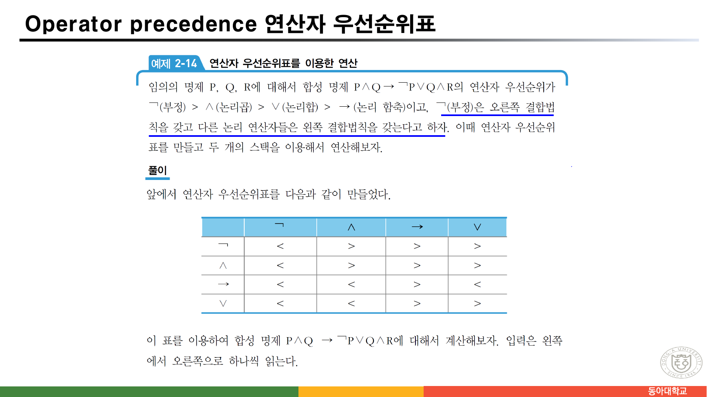
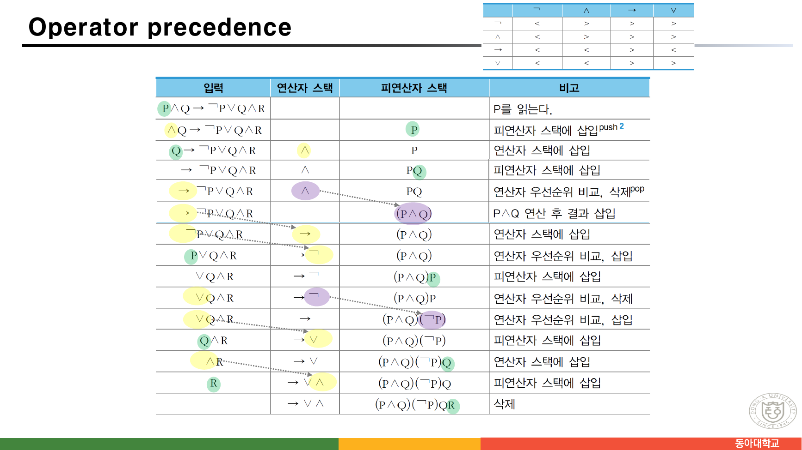
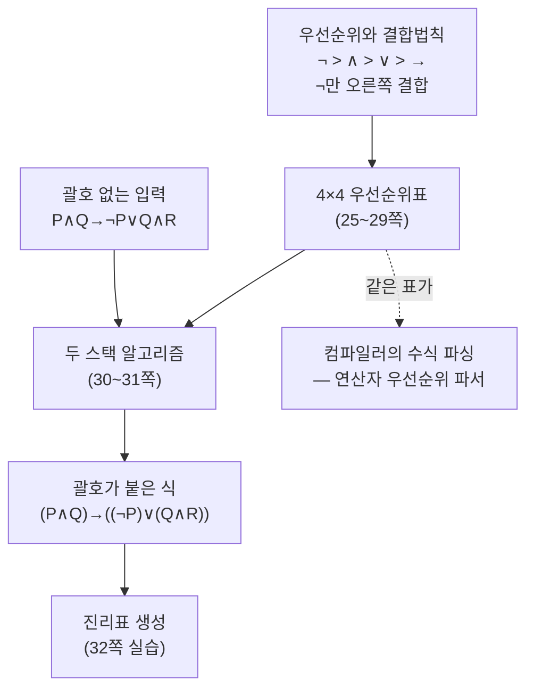
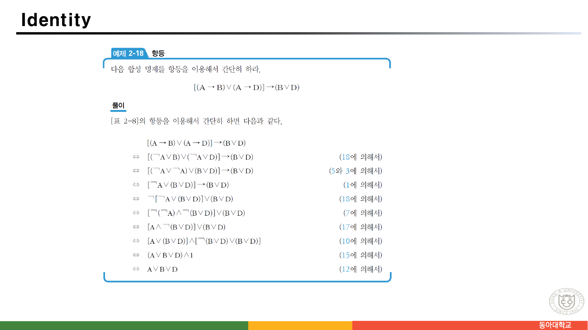

> [!abstract] 여덟 쪽을 스택에 쓴다
> 명제 논리를 가르치는 자료는 대개 진리표를 그리고 동치 법칙 목록을 주고 끝난다. 이 자료는 다르다. **24쪽부터 31쪽까지 여덟 장**을 통째로 **연산자 우선순위표를 만들고 두 개의 스택으로 합성 명제를 계산하는 데** 쓴다. 그리고 32쪽 실습이 이렇게 끝난다 — "일반적인 합성 명제에 대해 **진리표를 구하는 프로그램**을 작성하라."
>
> 즉 이 강의는 명제 논리를 **논리학의 문제가 아니라 파싱(parsing)의 문제**로 다시 쓴다. `¬ > ∧ > ∨ > →` 라는 우선순위와 결합법칙만 주어지면, `P∧Q → ¬P∨Q∧R` 이 어떤 괄호 구조인지는 사람이 눈으로 세는 것이 아니라 **표를 보고 스택을 밀고 당겨** 정해진다. 그것이 이 장의 무게 중심이다.
>
> 그래서 이 정리는 연산자 하나하나의 진리표를 나열하는 대신, **"괄호 없이 쓴 식을 기계가 어떻게 읽는가"** 를 척추로 놓는다.

---

## 1. 명제란 무엇이 아닌가

7·8쪽이 명제를 정의하는데, **아닌 것의 목록이 더 많은 것을 말해 준다.**

> A proposition is a declarative sentence that is either true or false.
>
> **Examples of propositions**: The Moon is made of green cheese. / Trenton is the capital of New Jersey. / Toronto is the capital of Canada. / `1+0=1` / `0+0=2`
>
> **Examples that are not propositions**: Sit down! / What time is it? / `x+1=2` / `x+y=z`

명제 목록에 `0+0=2` 와 "Toronto is the capital of Canada"(거짓이다)가 **들어 있다**는 점이 핵심이다. 참일 필요가 없다 — **참인지 거짓인지 정해지기만 하면** 된다.

비명제 목록의 넷은 서로 다른 이유로 탈락한다.

| 비명제 | 탈락 이유 |
| --- | --- |
| Sit down! | 명령문 — 참·거짓을 물을 수 없다 |
| What time is it? | 의문문 — 마찬가지 |
| `x+1=2` | 변수 `x` 가 정해지지 않아 진리값이 없다 |
| `x+y=z` | 변수가 셋 |

아래 두 줄이 중요하다. **변수가 든 문장은 아직 명제가 아니다.** 이것이 뒤 장(37쪽 이후)에서 술어와 한정자가 필요해지는 이유이고, 37쪽이 `x is tall.` 을 `T(x)` 로 적으며 다시 꺼내는 지점이다.

7쪽은 세 용어를 정리한다.

- **진리값(truth value)** — 참 T(또는 1), 거짓 F(또는 0)
- **명제 변수(propositional variable)** — 진리값이 아직 밝혀지지 않은 임의의 명제. `P, Q, R, …`
- **합성 명제** — 주어진 명제들을 합성하여 만든 새 명제

---

## 2. 여섯 연산자와 한 장의 진리표

9쪽이 연산자를 열거하고, 23쪽이 그것들을 한 표에 모은다.


원본 [표 2-7]을 그대로 옮긴다.

| P | Q | P∧Q | P∨Q | ¬P | P⊕Q | P→Q | P⇔Q |
| --- | --- | --- | --- | --- | --- | --- | --- |
| T | T | T | T | F | F | T | T |
| T | F | F | T | F | T | F | F |
| F | T | F | T | T | T | T | F |
| F | F | F | F | T | F | T | T |

같은 쪽 아래에 합성 명제 `((P∨Q)∧¬R)→P` 의 진리표가 여덟 줄로 붙어 있다. **여덟 줄 중 F는 딱 한 줄**(`P=F, Q=T, R=F`)이다.

```html preview h=620px
<div style="font-family:system-ui,-apple-system,sans-serif;padding:18px;color:var(--foreground)">
  <div style="display:flex;gap:8px;flex-wrap:wrap;margin-bottom:12px">
    <span style="font-size:12.5px;font-weight:600;align-self:center">원본 23쪽:</span>
    <button class="ex" data-e="basic" style="cursor:pointer">[표 2-7] 연산자 여섯</button>
    <button class="ex" data-e="comp"  style="cursor:pointer">((P∨Q)∧¬R)→P</button>
    <span style="font-size:12.5px;font-weight:600;align-self:center;margin-left:8px">24쪽:</span>
    <button class="ex" data-e="prec"  style="cursor:pointer">P∧Q→¬P∨Q∧R</button>
  </div>
  <div style="overflow-x:auto">
    <table id="tt" style="border-collapse:collapse;font-family:ui-monospace,monospace;font-size:13px"></table>
  </div>
  <div id="note" style="margin-top:13px;padding:11px 13px;background:var(--card);border:1px solid var(--border);border-radius:var(--radius);font-size:13px;line-height:1.75"></div>

  <script>
    function N(x){return !x;}
    var EX = {
      basic: {
        vars:['P','Q'],
        cols:[['P∧Q',function(P,Q){return P&&Q;}],['P∨Q',function(P,Q){return P||Q;}],
              ['¬P',function(P){return N(P);}],['P⊕Q',function(P,Q){return P!==Q;}],
              ['P→Q',function(P,Q){return N(P)||Q;}],['P⇔Q',function(P,Q){return P===Q;}]],
        note:'원본 [표 2-7] 그대로다. <b>P→Q 열</b>만 눈여겨보라 — P가 참이고 Q가 거짓인 <b>둘째 줄에서만</b> 거짓이고 나머지 셋은 모두 참이다. 12쪽이 이것을 한 문장으로 적었다.'
      },
      comp: {
        vars:['P','Q','R'],
        cols:[['P∨Q',function(P,Q){return P||Q;}],['¬R',function(P,Q,R){return N(R);}],
              ['(P∨Q)∧¬R',function(P,Q,R){return (P||Q)&&N(R);}],
              ['((P∨Q)∧¬R)→P',function(P,Q,R){return N((P||Q)&&N(R))||P;}]],
        note:'원본 23쪽 아래 표다. 여덟 줄 중 <b>거짓은 한 줄뿐</b>(P=F, Q=T, R=F) — 전건 <code>(P∨Q)∧¬R</code>이 참이면서 후건 <code>P</code>가 거짓인 유일한 조합이다.'
      },
      prec: {
        vars:['P','Q','R'],
        cols:[['P∧Q',function(P,Q){return P&&Q;}],['¬P',function(P){return N(P);}],
              ['Q∧R',function(P,Q,R){return Q&&R;}],
              ['(¬P)∨(Q∧R)',function(P,Q,R){return N(P)||(Q&&R);}],
              ['(P∧Q)→((¬P)∨(Q∧R))',function(P,Q,R){return N(P&&Q)||(N(P)||(Q&&R));}]],
        note:'24쪽이 “괄호를 이용해서 표시하면 <code>(P∧Q)→((¬P)∨(Q∧R))</code>”라고 적은 그 식이다. 아래 §4에서 이 괄호를 <b>사람이 아니라 표와 스택이</b> 붙이는 과정을 본다.'
      }
    };
    function render(key) {
      var e = EX[key], nv = e.vars.length, rows = [];
      for (var m = 0; m < (1 << nv); m++) {
        var vals = [];
        for (var b = 0; b < nv; b++) vals.push(!((m >> (nv - 1 - b)) & 1));
        rows.push(vals);
      }
      var head = '<tr>' + e.vars.map(function (v) {
        return '<th style="padding:6px 12px;border-bottom:2px solid var(--border);font-weight:700">' + v + '</th>';
      }).join('') + e.cols.map(function (c) {
        return '<th style="padding:6px 12px;border-bottom:2px solid var(--border);border-left:1px solid var(--border);font-weight:700">' + c[0] + '</th>';
      }).join('') + '</tr>';
      var body = rows.map(function (r) {
        function cell(v, extra) {
          return '<td style="padding:5px 12px;text-align:center;border-bottom:1px solid var(--border);' + (extra || '') +
            'color:' + (v ? 'var(--chart-2)' : 'var(--chart-5)') + ';font-weight:600">' + (v ? 'T' : 'F') + '</td>';
        }
        return '<tr>' + r.map(function (v) { return cell(v); }).join('') +
          e.cols.map(function (c, i) {
            return cell(c[1].apply(null, r), 'border-left:1px solid var(--border);' +
              (i === e.cols.length - 1 ? 'background:var(--card);' : ''));
          }).join('') + '</tr>';
      }).join('');
      document.getElementById('tt').innerHTML = head + body;
      document.getElementById('note').innerHTML = e.note;
    }
    Array.prototype.forEach.call(document.getElementsByClassName('ex'), function (b) {
      b.style.cssText = 'padding:6px 12px;font-size:12.5px;border:1px solid var(--border);border-radius:var(--radius);' +
        'background:var(--card);color:var(--foreground);cursor:pointer';
      b.onclick = function () { render(b.getAttribute('data-e')); };
    });
    render('basic');
  </script>
</div>
```

---

## 3. 함축이 자연어와 갈라지는 자리

12·13쪽이 이 장에서 가장 조심스럽게 쓰인 부분이다.

> **논리 함축 P → Q의 진리값은 P가 참이고 Q가 거짓일 경우에만 거짓**이 되고, 그 이외의 경우에는 모두 참이 된다.

13쪽이 왜 그래도 되는지를 설명한다.

> 자연 언어에서는 "오늘 비가 오면, 야구 경기는 연기한다"라는 것은 가정과 결론 사이의 **인과 관계**를 나타내지만, 수학적 논리에서의 논리 함축 P → Q는 **P와 Q가 서로 연관이 없을지라도** 임의의 두 명제를 결합할 수 있다.
> 왜냐하면 명제에서는 **명제의 의미나 구조와 관계없이 오직 명제들의 진리값만을** 다루기 때문이다.

14쪽이 그 자유를 극단적인 예로 보여 준다.

> "If the moon is made of green cheese, then I have more money than Bill Gates."
> "If the moon is made of green cheese then I'm on welfare."
> "If 1 + 1 = 3, then your grandma wears combat boots."

세 문장 모두 **참인 명제**다. 전건이 거짓이기 때문이다(달은 치즈가 아니고 1+1≠3). 자연어로는 헛소리이지만 논리식으로는 흠이 없다.

### 3.1 역·이·대우

13쪽이 세 변형을 한 자리에 모은다.

| 이름 | 형태 | P → Q 와의 관계 |
| --- | --- | --- |
| 원 명제 | P → Q | — |
| 역(converse) | Q → P | 동치가 **아니다** |
| 이(inverse) | ¬P → ¬Q | 동치가 **아니다** |
| 대우(contrapositive) | ¬Q → ¬P | **항상 동치** |

원본이 마지막 줄을 못박는다 — "명제가 참이면 **대우도 반드시 참**이 된다." 이 한 줄이 뒤 66쪽의 증명 방법(대우를 이용하는 간접 증명)의 근거가 된다.

### 3.2 요구사항을 논리식으로

16·17쪽이 논리를 실무로 끌고 나온다.


> System and Software engineers take requirements in English and express them in a precise specification language based on logic.
>
> "The automated reply **cannot** be sent when the file system is full"
> Let `p` = "The automated reply **can** be sent", `q` = "The file system is full."
> → **q → ¬p**

`p` 를 **긍정형**("can be sent")으로 잡아 놓고 요구사항의 부정을 `¬p` 로 옮긴 것이 핵심이다. `p` 를 "cannot be sent"로 잡으면 식이 `q → p` 가 되어 같은 뜻이 되지만, **명제 변수를 긍정으로 두는 습관**이 뒤에서 부정을 계산할 때 헷갈리지 않게 한다.

17쪽은 한 걸음 더 간다 — **명세들이 서로 모순되지 않는지(consistent)** 를 묻는다.

> **Definition**: A list of propositions is consistent if it is possible to assign truth values to the proposition variables so that each proposition is true.
>
> 명세: `p ∨ q`, `¬p`, `p → q` &nbsp;→&nbsp; `p = F, q = T` 로 두면 셋 다 참이다. **일관적이다.**
> 여기에 "The diagnostic message is not retransmitted"(`¬q`)를 추가하면 **만족시키는 배정이 없다. 일관적이지 않다.**

명세 검토가 곧 **충족 가능성(satisfiability) 문제**라는 사실을 한 쪽으로 보여 준다. 뒤 73쪽부터 나오는 프로그램 검증 절의 예고편이다.

---

## 4. 괄호를 사람이 아니라 표가 붙인다

24쪽이 문제를 제기한다.

> 우선순위를 위해서 괄호를 사용하기도 하지만, 이 방법은 합성 명제가 길고 복잡하다면 **너무나 많은 괄호 때문에 가독성(readability)이 떨어진다.**
>
> 논리 연산자들의 우선 순위: **¬(부정) > ∧(논리곱) > ∨(논리합) > →(논리 함축) > ⇔(논리적 동치)**
> ¬(부정)은 **오른쪽 결합법칙**을, 나머지 연산자들은 **왼쪽 결합법칙**을 갖는다고 하자.
>
> 그러면 합성 명제 `P∧Q → ¬P∨Q∧R` 에 괄호를 이용해서 표시하면 `(P∧Q) → ((¬P)∨(Q∧R))` 다.

여기까지는 흔한 서술이다. 그런데 25쪽부터 **그 괄호를 붙이는 절차를 기계화**하기 시작한다.

### 4.1 우선순위표를 채운다

25~28쪽이 규칙 두 개로 4×4 표를 채운다.

> 1) 연산자가 **동일**할 때 — 오른쪽 결합 법칙: **입력 연산자 우선** / 왼쪽 결합 법칙: **스택 연산자 우선**
> 2) 연산자가 **다를** 때 — 우선순위가 높은 쪽

26쪽이 첫 칸을 손으로 풀어 보인다. 스택에 `¬` 가 있고 입력에도 `¬` 가 있으면, 같은 연산자이므로 결합법칙을 본다. `¬` 는 오른쪽 결합이므로 **입력 쪽을 먼저** 연산한다.



29쪽에 완성된 표가 있다. 열이 **입력** 연산자, 행이 **스택** 연산자다.

| 스택 \ 입력 | ¬ | ∧ | → | ∨ |
| --- | --- | --- | --- | --- |
| **¬** | `<` | `>` | `>` | `>` |
| **∧** | `<` | `>` | `>` | `>` |
| **→** | `<` | `<` | `>` | `<` |
| **∨** | `<` | `<` | `>` | `>` |

읽는 법: `<` 는 **입력이 우선** → 입력 연산자를 스택에 밀어 넣는다(push). `>` 는 **스택이 우선** → 스택 위의 연산자를 꺼내(pop) 연산한다.

열여섯 칸이 모두 §4.1의 두 규칙과 맞는지 하나씩 확인했고, 어긋나는 칸은 없었다. 예를 들어 `(스택 →, 입력 ∨)` 는 `∨` 가 `→` 보다 우선순위가 높으므로 입력 우선 = `<` 이고, 표에도 `<` 로 적혀 있다.

> [!tip] `¬` 열이 전부 `<` 인 이유
> 첫 열(입력이 `¬`)이 네 칸 모두 `<` 다. `¬` 는 우선순위가 가장 높으므로 **무엇이 스택에 있든 밀어 넣는다.** 유일하게 자기 자신과 만나는 칸(`¬`,`¬`)도 오른쪽 결합이라 역시 `<` 다 — `¬¬P` 를 안쪽부터 계산해야 하기 때문이다.

### 4.2 두 스택으로 실제로 굴려 본다



30쪽은 표만 있고 설명이 없다. 그 표가 이 장의 결론이다 — **입력을 왼쪽에서 오른쪽으로 한 글자씩 읽으며, 피연산자는 피연산자 스택에 넣고, 연산자는 우선순위표를 보고 밀거나 꺼낸다.**

아래는 29쪽의 표를 그대로 코드로 옮겨 `P∧Q → ¬P∨Q∧R` 을 굴린 것이다. 각 줄이 30쪽 표의 한 행에 대응한다.

```html preview h=640px
<div style="font-family:system-ui,-apple-system,sans-serif;padding:18px;color:var(--foreground)">
  <div style="display:flex;gap:9px;flex-wrap:wrap;align-items:center;margin-bottom:12px">
    <button id="prev" style="cursor:pointer">◀ 이전</button>
    <button id="next" style="cursor:pointer">다음 ▶</button>
    <button id="all"  style="cursor:pointer">끝까지</button>
    <button id="rst"  style="cursor:pointer">처음으로</button>
    <span id="cnt" style="font-size:12.5px;color:var(--muted-foreground)"></span>
  </div>
  <div style="font-family:ui-monospace,monospace;font-size:17px;font-weight:700;margin-bottom:12px;letter-spacing:.06em">
    <span id="done" style="color:var(--muted-foreground)"></span><span id="cur" style="color:var(--chart-1);background:var(--card);padding:0 3px;border-radius:3px"></span><span id="rest"></span>
  </div>
  <div style="display:flex;gap:18px;flex-wrap:wrap;margin-bottom:12px">
    <div style="flex:1;min-width:180px">
      <div style="font-size:11.5px;font-weight:700;color:var(--muted-foreground);margin-bottom:5px">연산자 스택</div>
      <div id="ops" style="min-height:42px;padding:9px 11px;border:1px solid var(--border);border-radius:var(--radius);background:var(--card);font-family:ui-monospace,monospace;font-size:18px;letter-spacing:.22em"></div>
    </div>
    <div style="flex:2;min-width:250px">
      <div style="font-size:11.5px;font-weight:700;color:var(--muted-foreground);margin-bottom:5px">피연산자 스택</div>
      <div id="vals" style="min-height:42px;padding:9px 11px;border:1px solid var(--border);border-radius:var(--radius);background:var(--card);font-family:ui-monospace,monospace;font-size:15px;word-break:break-all"></div>
    </div>
  </div>
  <div id="why" style="padding:11px 13px;border:1px solid var(--border);border-left:4px solid var(--chart-3);border-radius:var(--radius);background:var(--card);font-size:13px;line-height:1.7;min-height:22px"></div>

  <script>
    var TBL = {
      '¬¬':'<','¬∧':'>','¬→':'>','¬∨':'>',
      '∧¬':'<','∧∧':'>','∧→':'>','∧∨':'>',
      '→¬':'<','→∧':'<','→→':'>','→∨':'<',
      '∨¬':'<','∨∧':'<','∨→':'>','∨∨':'>'
    };
    var OPS = '¬∧∨→';
    var EXPR = 'P∧Q→¬P∨Q∧R'.split('');
    function build() {
      var ops = [], vals = [], i = 0, steps = [];
      function snap(note, cur) {
        steps.push({i:i, cur:cur, ops:ops.slice(), vals:vals.slice(), note:note});
      }
      snap('시작 — 입력을 왼쪽에서 오른쪽으로 하나씩 읽는다', -1);
      while (i < EXPR.length) {
        var t = EXPR[i];
        if (OPS.indexOf(t) < 0) {
          vals.push(t); i++;
          snap('<b>' + t + '</b> 는 피연산자 → 피연산자 스택에 삽입(push)', i - 1);
          continue;
        }
        if (ops.length && TBL[ops[ops.length - 1] + t] === '>') {
          var o = ops.pop(), a, b;
          if (o === '¬') { a = vals.pop(); vals.push('(¬' + a + ')'); }
          else { b = vals.pop(); a = vals.pop(); vals.push('(' + a + o + b + ')'); }
          snap('스택의 <b>' + o + '</b> 와 입력의 <b>' + t + '</b> → 표에서 <b>&gt;</b> (스택 우선) → ' + o + ' 를 꺼내 연산 후 삽입', i);
        } else {
          var top = ops.length ? ops[ops.length - 1] : null;
          ops.push(t); i++;
          snap(top ? '스택의 <b>' + top + '</b> 와 입력의 <b>' + t + '</b> → 표에서 <b>&lt;</b> (입력 우선) → ' + t + ' 를 스택에 삽입'
                   : '연산자 스택이 비었다 → <b>' + t + '</b> 삽입', i - 1);
        }
      }
      while (ops.length) {
        var o2 = ops.pop(), a2, b2;
        if (o2 === '¬') { a2 = vals.pop(); vals.push('(¬' + a2 + ')'); }
        else { b2 = vals.pop(); a2 = vals.pop(); vals.push('(' + a2 + o2 + b2 + ')'); }
        snap('입력이 끝났다 → 남은 <b>' + o2 + '</b> 를 꺼내 연산(삭제)', -1);
      }
      return steps;
    }
    var S = build(), k = 0;
    function draw() {
      var s = S[k];
      document.getElementById('done').textContent = EXPR.slice(0, s.cur < 0 ? s.i : s.cur).join('');
      document.getElementById('cur').textContent  = s.cur >= 0 ? EXPR[s.cur] : '';
      document.getElementById('rest').textContent = EXPR.slice(s.cur < 0 ? s.i : s.cur + 1).join('');
      document.getElementById('ops').textContent  = s.ops.join('') || '(비어 있음)';
      document.getElementById('vals').textContent = s.vals.join('  ') || '(비어 있음)';
      document.getElementById('why').innerHTML    = s.note;
      document.getElementById('cnt').textContent  = (k + 1) + ' / ' + S.length + ' 단계';
    }
    ['prev','next','all','rst'].forEach(function (id) {
      var b = document.getElementById(id);
      b.style.cssText = 'padding:6px 12px;font-size:12.5px;border:1px solid var(--border);border-radius:var(--radius);' +
        'background:var(--card);color:var(--foreground);cursor:pointer';
    });
    document.getElementById('prev').onclick = function () { if (k > 0) k--; draw(); };
    document.getElementById('next').onclick = function () { if (k < S.length - 1) k++; draw(); };
    document.getElementById('all').onclick  = function () { k = S.length - 1; draw(); };
    document.getElementById('rst').onclick  = function () { k = 0; draw(); };
    draw();
  </script>
</div>
```


31쪽이 결론을 적는다.

> 그러므로 다음과 같이 연산된다. **이 결과는 처음에 예측한 괄호 순서와 똑같다.**
> `(P∧Q) → ((¬P)∨(Q∧R))`

29쪽의 표를 그대로 코드로 옮겨 굴린 결과가 정확히 이 식이었다. 피연산자 스택은 `P` → `P Q` → `(P∧Q)` → `(P∧Q) P` → `(P∧Q) (¬P)` → `(P∧Q) (¬P) Q` → `(P∧Q) (¬P) Q R` → `(P∧Q) (¬P) (Q∧R)` → `(P∧Q) ((¬P)∨(Q∧R))` → `(P∧Q)→((¬P)∨(Q∧R))` 순으로 움직였고, 30·31쪽 표의 피연산자 스택 열과 한 칸씩 일치한다.



### 4.3 실습이 이 절의 목적지다

32쪽이 여덟 쪽을 한 과제로 묶는다.

> 일반적인 합성 명제에 대해 **진리표를 구하는 프로그램**을 작성하라. (2주)
> ❖ 조건
> • 명제 변수는 많아야 3개로 제한하고, 논리 연산자도 많아야 4종류만 허용한다.
> • 세 개의 명제 P, Q, R이 있고, 논리연산자는 and, or, not, implication 네 가지가 있다.
> • **단, 현재 우리가 사용하고 있는 논리 연산자의 우선 순위와 결합 법칙대로 작성한다.**
> • 합성 명제 `P∧Q → ¬P∨Q∧R` 에 대해 진리표를 만들라.

조건이 왜 그렇게 잡혔는지가 §4의 표에서 나온다. **연산자 네 종류**(`¬ ∧ ∨ →`)는 29쪽 표가 정확히 4×4이기 때문이고, **명제 변수 세 개**는 진리표가 여덟 줄로 끝나기 때문이다. 실습 과제가 앞의 여덟 쪽을 그대로 구현 명세로 쓰고 있다.

> [!important] 왜 이 순서인가
> 진리표를 만들려면 먼저 **식을 읽어야** 한다. 괄호가 없는 입력을 받으면 `P∧Q→¬P∨Q∧R` 이 `((P∧Q)→(¬P))∨(Q∧R)` 인지 `(P∧Q)→((¬P)∨(Q∧R))` 인지부터 정해야 하고, 그 판정을 사람 눈이 아니라 표로 하겠다는 것이 24~31쪽의 전부다. 논리 교과서가 아니라 **컴파일러 강의의 한 절**을 명제 논리로 옮겨 놓은 셈이다.

---

## 5. 항진·모순·사건, 그리고 동치를 쓰는 법

33쪽이 합성 명제를 진리값의 모양으로 셋으로 나눈다.

- **항진(tautology) 명제** — 모든 배정에서 참
- **모순(contradiction) 명제** — 모든 배정에서 거짓
- **사건(contingency) 명제** — 항진도 모순도 아닌 명제

22쪽이 동치를 정의해 두었다.

> 논리적 동치 P⇔Q의 진리값은 P와 Q가 모두 참이거나 모두 거짓일 경우에만 참이 되고, 그 이외의 경우에는 모두 거짓이 된다.
> **P⇔Q는 논리 함축 P→Q와 논리 함축 Q→P의 논리곱이다.**

34쪽이 동치의 쓰임새를 한 줄로 말한다 — "논리적으로 동치인 명제로 **명제들을 간단히 할 때** 사용한다." 그리고 35쪽이 실제로 간단히 해 보인다.



원본 [예제 2-18]의 열 줄을 그대로 옮긴다. 오른쪽 괄호 안의 번호는 [표 2-8] 항등 목록의 번호다.

| | 식 | 근거 |
| --- | --- | --- |
| | `[(A→B)∨(A→D)] → (B∨D)` | (원식) |
| ⇔ | `[(¬A∨B)∨(¬A∨D)] → (B∨D)` | 18 |
| ⇔ | `[(¬A∨¬A)∨(B∨D)] → (B∨D)` | 5와 3 |
| ⇔ | `[¬A∨(B∨D)] → (B∨D)` | 1 |
| ⇔ | `¬[¬A∨(B∨D)] ∨ (B∨D)` | 18 |
| ⇔ | `[¬(¬A)∧¬(B∨D)] ∨ (B∨D)` | 7 |
| ⇔ | `[A∧¬(B∨D)] ∨ (B∨D)` | 17 |
| ⇔ | `[A∨(B∨D)] ∧ [¬(B∨D)∨(B∨D)]` | 10 |
| ⇔ | `(A∨B∨D) ∧ 1` | 15 |
| ⇔ | **`A∨B∨D`** | 12 |

열 줄을 전부 진리표로 확인했다. **A, B, D 여덟 조합에서 열 개 식의 진리값이 모두 같았고**, 그 값은 `A∨B∨D` 와 일치한다 — 즉 `A=B=D=F` 인 한 줄에서만 거짓이다.

> [!tip] 세 번째 줄의 도약
> `(¬A∨B)∨(¬A∨D)` 에서 `(¬A∨¬A)∨(B∨D)` 로 가는 자리가 이 유도의 요령이다. **∨의 결합·교환법칙으로 같은 항끼리 모은 다음**(5와 3), 멱등법칙 `¬A∨¬A ⇔ ¬A`(1)로 접는다. 34쪽이 멱등법칙을 "연산을 여러 번 적용하더라도 결과가 달라지지 않는 성질"이라고 미리 정의해 둔 것이 여기서 쓰인다.
>
> 여덟 번째 줄의 분배법칙(10)도 방향이 거꾸로다 — 보통 `A∧(B∨C)` 를 펼치는데, 여기서는 `[X∧Y]∨Z` 를 `[X∨Z]∧[Y∨Z]` 로 **묶는 쪽**으로 쓴다. 그래야 `¬(B∨D)∨(B∨D)` 가 나와서 보원법칙(15)으로 `1` 이 된다.

---

## 6. 이 장이 남긴 것

명제 논리 35쪽의 무게를 다시 재면 이렇다.

| 쪽 | 내용 | 비중 |
| --- | --- | --- |
| 6–11 | 정의·연산자·진리표 | 6쪽 |
| 12–20 | 함축, 자연어 번역, 시스템 명세 | 9쪽 |
| **24–32** | **우선순위표와 두 스택, 그리고 실습** | **9쪽** |
| 21–23, 33–35 | 동치·항진/모순·항등 | 6쪽 |

**함축을 다루는 쪽수와 파싱을 다루는 쪽수가 같다.** 여느 자료라면 우선순위는 "괄호를 아껴 쓰기 위한 관례" 한 줄로 지나가는 자리인데, 이 강의는 거기서 멈춰 표를 만들고 스택을 굴린다. 32쪽 실습이 그 이유를 밝힌다 — 이 과목의 논리는 **읽고 이해하는 대상이 아니라 프로그램이 처리해야 할 입력**이다.

---

## 이어지는 문서

- [01. 이산수학 소개 — 강의계획서가 약속한 것과 자료가 남긴 것](<./01. 이산수학 소개 — 강의계획서가 약속한 것과 자료가 남긴 것.md>)
- [03. 술어 논리와 논리적 추론 — 같은 규칙을 두 벌로 가르치는 자료](<./03. 술어 논리와 논리적 추론 — 같은 규칙을 두 벌로 가르치는 자료.md>) — 8쪽의 비명제 `x+1=2` 가 여기서 술어가 된다
- [04. 증명·귀납법·프로그램 검증 — 논리가 시스템으로 건너가려 할 때](<./04. 증명·귀납법·프로그램 검증 — 논리가 시스템으로 건너가려 할 때.md>) — 13쪽의 대우가 증명 방법이 된다

관련 과목: [01/data-structures](../../../01_programming-foundations/data-structures/README.md)의 스택과 중위→후위 변환(§4의 두 스택 알고리즘과 같은 문제다), [05/programming-languages](../../../05_software-engineering/programming-languages/README.md)의 파싱.

---

## 근거 자료

`ComputerScience/02_math-theory/discrete-mathematics/sources/수학적 모델과 논리.pdf` 의 1~35쪽.

| 쪽 | 내용 | 이 문서에서 다룬 곳 |
| --- | --- | --- |
| 4 | 수학적 모델의 개념 | §1 도입 |
| 6–8 | 정의·문장·명제, 명제가 아닌 것 | §1 |
| 9–11 | 논리 연산자와 진리표 | §2 |
| 12–14 | 논리 함축, 역·이·대우 | §3 |
| 16–17 | 시스템 명세와 일관성 | §3.2 (슬라이드 인용) |
| 19–20 | 영어 문장을 논리식으로 | §3.2 |
| 22–23 | 논리적 동치, 종합 진리표 | §2 (슬라이드 인용) · §5 |
| 24–31 | 연산자 우선순위표와 두 스택 | §4 (슬라이드 3장 인용) |
| 32 | 실습 — 진리표 생성 프로그램 | §4.3 |
| 33–35 | 항진/모순/사건, 항등 | §5 (슬라이드 인용) |

29쪽의 우선순위표 열여섯 칸을 25~28쪽의 규칙과 대조했고, 그 표를 코드로 옮겨 `P∧Q→¬P∨Q∧R` 을 굴린 결과가 31쪽의 `(P∧Q)→((¬P)∨(Q∧R))` 와 일치함을 확인했다. 23쪽의 두 진리표와 35쪽 [예제 2-18]의 열 줄도 모두 진리표로 검산해 원본과 일치함을 확인했다. 원본에 없는 내용은 §4.2의 단계별 주석과 §5의 "세 번째 줄의 도약" 해설이며, 둘 다 원본 슬라이드의 값만 사용한다.
