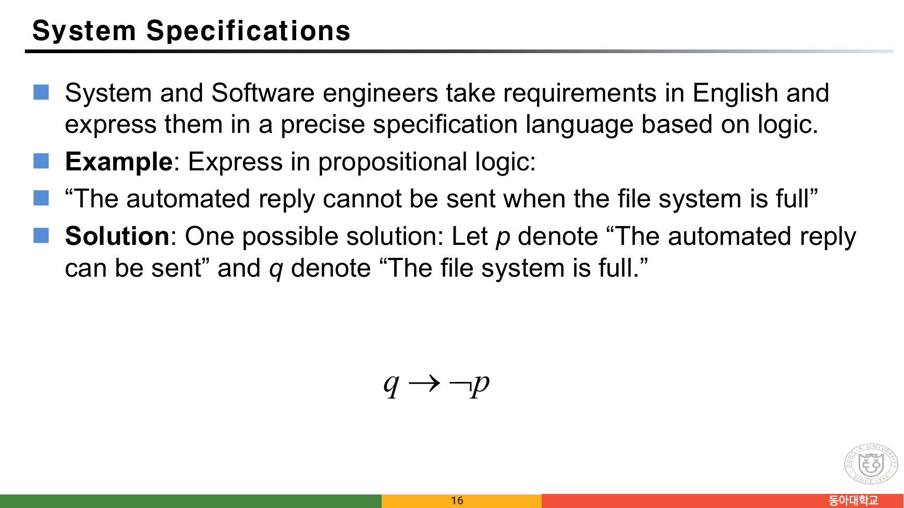
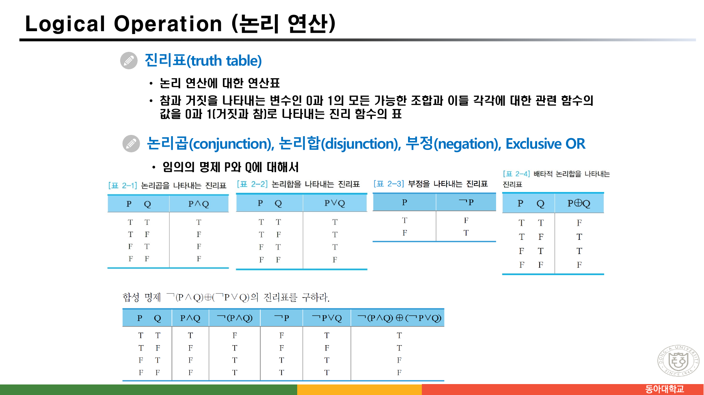
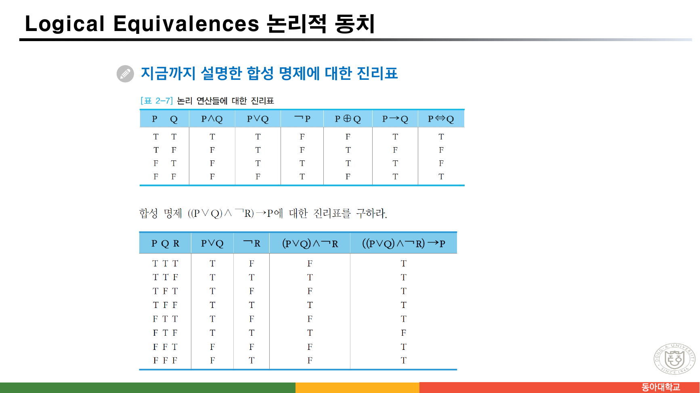
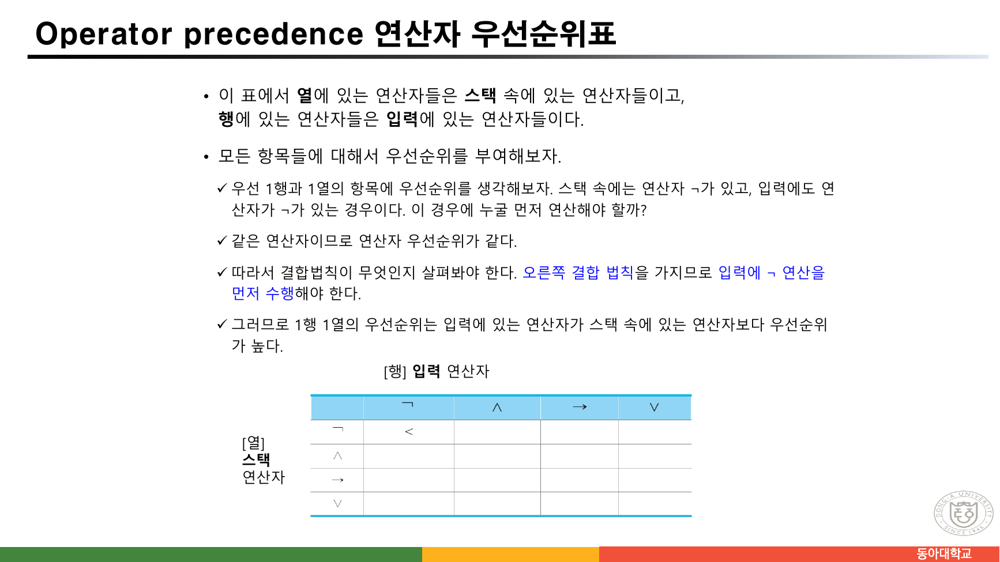
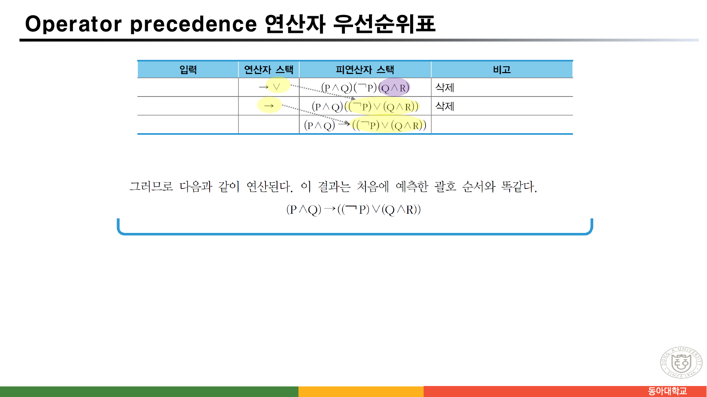
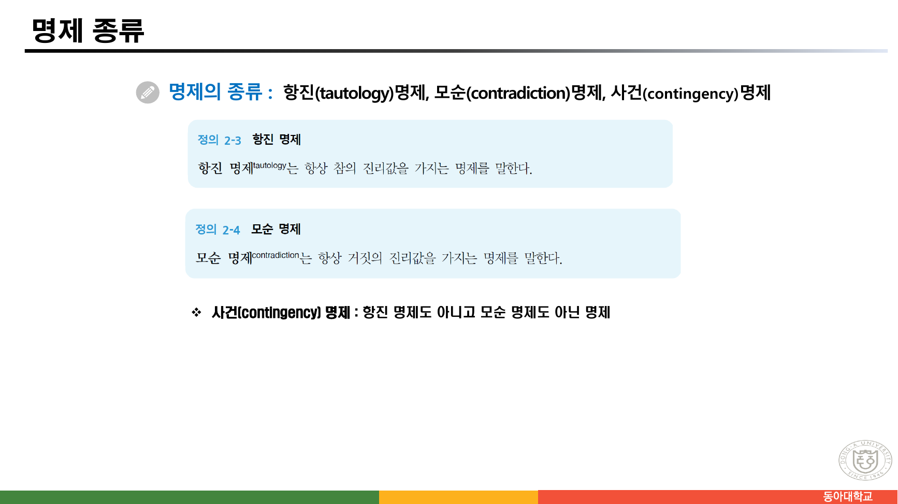

> [!abstract] 이 묶음이 실제로 하는 말
> 「수학적 모델과 논리」는 91쪽짜리 한 파일이지만, 슬라이드를 넘겨 보면 **두 종류가 블록으로 번갈아** 나온다.
>
> 한쪽은 한국어 교재 슬라이드다. `[표 2-1] 논리곱을 나타내는 진리표`, `[정의 2-3] 항진 명제`, `[예제 2-14] 연산자 우선순위표를 이용한 연산`처럼 **장·절 번호가 붙은 도표**를 쓴다. 다른 쪽은 영어 슬라이드다. 번호가 없고, `Propositions`, `System Specifications`, `Translating English Sentences` 같은 제목 아래 예문을 늘어놓는다.
>
> 두 계열은 같은 것을 가르치지 않는다. **영어 쪽은 논리를 *의미*로 가르친다** — 영어 문장을 명제로 옮기고, 시스템 요구사항이 서로 모순되지 않는지 따진다. **한국어 쪽은 논리를 *계산*으로 가르친다** — 진리표를 채우고, 연산자에 우선순위를 매기고, 스택 두 개로 합성 명제를 파싱한다.
>
> 그 차이가 가장 크게 벌어지는 곳이 24~31쪽 여덟 장이다. 이 여덟 장은 논리학이 아니라 **컴파일러 이야기**이고, 로젠 교과서에는 대응하는 내용이 없다. 그리고 32쪽 실습이 두 계열을 하나로 묶는다 — *"일반적인 합성 명제에 대해 진리표를 구하는 프로그램을 작성하라."* 의미를 파싱으로 환원하는 것이 이 장이 실제로 시키는 일이다.

---

## 두 계열이 어디서 갈리는가

1~35쪽을 언어와 도표 번호 기준으로 나누면 블록이 뚜렷하다.

```mermaid
graph TD
  A["수학적 모델과 논리 · 1~35쪽"] --> K1["1~7쪽 · 한국어<br/>수학적 모델, 정의·문장·명제"]
  A --> E1["8쪽 · 영어<br/>Propositions"]
  A --> K2["9쪽 · 한국어<br/>논리 연산자 목록"]
  A --> E2["10쪽 · 영어<br/>Propositional Logic"]
  A --> K3["11~13쪽 · 한국어<br/>진리표, 논리 함축"]
  A --> E3["14~21쪽 · 영어 블록<br/>Understanding Implication<br/>System Specifications<br/>Translating English Sentences"]
  A --> K4["22~35쪽 · 한국어 블록<br/>논리적 동치<br/>연산자 우선순위표<br/>실습 · 명제 종류 · 항등"]

  style A  fill:var(--card),stroke:var(--border),color:var(--foreground)
  style K1 fill:var(--card),stroke:var(--chart-1),color:var(--foreground)
  style K2 fill:var(--card),stroke:var(--chart-1),color:var(--foreground)
  style K3 fill:var(--card),stroke:var(--chart-1),color:var(--foreground)
  style K4 fill:var(--card),stroke:var(--chart-1),color:var(--foreground)
  style E1 fill:var(--card),stroke:var(--chart-2),color:var(--foreground)
  style E2 fill:var(--card),stroke:var(--chart-2),color:var(--foreground)
  style E3 fill:var(--card),stroke:var(--chart-2),color:var(--foreground)
```

두 계열이 연달아 붙은 자리를 보면 차이가 드러난다.

**9쪽(한국어)** — 논리 연산자를 이렇게 나열한다.

> 논리 연산자(and, or, not, exclusive or, imply, equal)
> • 논리곱(conjunction, AND, ∧) • 논리합(disjunction, OR, ∨) • 부정(negation, NOT, ￢)
> • **배타적 논리합(exclusive or, XOR, ⊕)** • 논리 함축(implication, →)
> • 전제(premise) • 결론(conclusion) • 역(converse) • 대우(contraposition) • 이(inverse)
> • **동치(equivalence, ⇔)**

**10쪽(영어)** — 바로 다음 장이 같은 목록을 다시 낸다.

> Compound Propositions; constructed from logical connectives and other propositions
> ⚫ Negation ¬ ⚫ Conjunction ∧ ⚫ Disjunction ∨ ⚫ Implication → ⚫ **Biconditional ↔**

두 목록이 다르다. 9쪽에는 있는 **XOR(⊕)이 10쪽에 없고**, 같은 연산을 9쪽은 `동치(equivalence, ⇔)`, 10쪽은 `Biconditional ↔`이라 부른다. **이름도 기호도 다르다.** 그리고 9쪽은 `전제·결론·역·대우·이`를 연산자 목록 안에 섞어 넣었는데, 이 다섯은 연산자가 아니라 함축의 부품과 변형이다.

> [!note] 어느 쪽 기호를 쓸 것인가
> 뒤로 갈수록 두 기호가 섞여 나온다. 22쪽(한국어)은 `논리적 동치 P⇔Q`, 23쪽 표는 `P⇔Q` 열을 쓰고, 영어 계열은 계속 `↔`를 쓴다. 이 문서는 **원본이 쓴 자리의 기호를 그대로** 옮긴다. 참고로 많은 교재가 `⇔`는 메타 수준의 "동치이다"(외부 진술)로, `↔`는 명제를 만드는 연산자로 구별하지만, 이 자료는 그 구별을 하지 않고 둘을 같은 것으로 쓴다.

---

## 영어 계열이 하는 일 — 문장을 명제로 옮기기

### 함축은 인과관계가 아니다 (13·14쪽이 같은 말을 두 번)

두 계열이 유일하게 같은 주제를 연달아 다루는 곳이다. **13쪽(한국어)**은 이렇게 쓴다.

> 자연 언어에서는 "오늘 비가 오면, 야구 경기는 연기한다"라는 것은 가정과 결론 사이의 인과 관계를 나타내지만, 수학적 논리에서의 논리 함축 P → Q는 **P와 Q가 서로 연관이 없을지라도** 임의의 두 명제를 결합할 수 있다. 왜냐하면 명제에서는 명제의 의미나 구조와 관계없이 **오직 명제들의 진리값만을** 다루기 때문이다.

**14쪽(영어)**은 같은 말을 예문으로 한다.

> In p → q there does not need to be any connection between the antecedent or the consequent. The "meaning" of p → q depends only on the truth values of p and q.
> ⚫ "If the moon is made of green cheese, then I have more money than Bill Gates."
> ⚫ "If the moon is made of green cheese then I'm on welfare."
> ⚫ "If 1 + 1 = 3, then your grandma wears combat boots."

한국어 쪽은 **왜 그런지**를 설명하고("진리값만을 다루기 때문"), 영어 쪽은 **얼마나 이상해질 수 있는지**를 보인다. 세 예문 모두 전건이 거짓이라 어떤 후건을 붙여도 참인 명제가 된다.

이 성질이 뒤에 나올 증명법의 첫 두 항목(vacuous 증명·trivial 증명)의 뿌리다. 전건이 거짓이면 그것만으로 함축이 참이 되므로 결론을 볼 필요조차 없다.

### 명세를 논리로 적으면 무엇이 좋은가 (16·17쪽)



16쪽의 문제는 이렇다.

> "The automated reply **cannot** be sent **when** the file system is full"
> Let *p* denote "The automated reply **can** be sent" and *q* denote "The file system is full."

답은 $q \to \neg p$다. 여기서 두 번의 뒤집기가 일어난다.

1. `when`은 조건을 도입하므로 **파일 시스템이 가득 참**이 전건이 된다 — 영어 문장의 어순과 반대다
2. `cannot`은 부정이지만, $p$를 "보낼 수 **있다**"로 잡았으므로 결론 쪽에 $\neg$가 붙는다

$p$를 "보낼 수 없다"로 잡았다면 답은 $q \to p$가 되었을 것이다. **명제 변수를 어떻게 잡느냐가 답의 모양을 정한다**는 것이 이 예의 진짜 교훈이고, 슬라이드가 `One possible solution`이라 적은 이유이기도 하다.

17쪽은 한 걸음 더 간다. 명세 여러 줄이 **동시에 참일 수 있는가**(consistent)를 묻는다.

> ⚫ "The diagnostic message is stored in the buffer or it is retransmitted." → $p \lor q$
> ⚫ "The diagnostic message is stored in the buffer." → $\neg p$
> ⚫ "If the diagnostic message is stored in the buffer, then it is retransmitted." → $p \to q$

$p$ = 버퍼에 저장된다, $q$ = 재전송된다. 세 식을 모두 참으로 만드는 배정이 있는지 확인하면, $p =$ 거짓, $q =$ 참일 때 $p \lor q = \text{T}$, $\neg p = \text{T}$, $p \to q = \text{T}$로 모두 참이다. 그러므로 **일관적**이다. 여기에 `"The diagnostic message is not retransmitted"` 즉 $\neg q$를 더하면, $q$가 거짓이어야 하는데 그러면 $p \lor q$를 참으로 만들 $p$가 참이어야 하고 $\neg p$와 충돌한다 — **비일관적**이다. 직접 확인해도 원본의 결론과 같다.

> [!warning] 두 번째 줄의 번역이 원문과 어긋난다
> 17쪽은 두 번째 명세를 `"The diagnostic message is stored in the buffer."`라고 적어 놓고, 아래 Solution에서는 그것을 $\neg p$로 옮긴다. $p$의 정의가 바로 그 문장(`"The diagnostic message is stored in the buffer."`)이므로, 이 줄은 $p$이지 $\neg p$가 아니다. 예제가 성립하려면 두 번째 명세가 `"The diagnostic message is **not** stored in the buffer."`여야 한다.
>
> 실제로 $p$로 놓고 계산하면 세 식 $p \lor q$, $p$, $p \to q$는 $p = q = \text{참}$에서 모두 참이 되어 여전히 일관적이지만, 거기에 $\neg q$를 더해도 **$p$가 참이고 $q$가 거짓일 때 $p \to q$가 거짓**이 되어 비일관이라는 결론 자체는 같아진다. 결론은 같고 중간의 배정만 달라지므로 강의 중에는 눈에 띄지 않는다.

---

## 한국어 계열이 하는 일 — 진리표를 채우기

### 11쪽 — 네 개의 기본 진리표와 첫 합성 명제



`[표 2-1]`부터 `[표 2-4]`까지 네 개의 기본 진리표를 나란히 놓고, 그 아래에서 곧바로 합성 명제 하나를 시킨다.

> 합성 명제 $\neg(P \land Q) \oplus (\neg P \lor Q)$의 진리표를 구하라.

원본이 채운 표를 그대로 옮기고 직접 계산해 대조했다.

| P | Q | P∧Q | ¬(P∧Q) | ¬P | ¬P∨Q | ¬(P∧Q) ⊕ (¬P∨Q) |
| --- | --- | --- | --- | --- | --- | --- |
| T | T | T | F | F | T | **T** |
| T | F | F | T | F | F | **T** |
| F | T | F | T | T | T | **F** |
| F | F | F | T | T | T | **F** |

네 줄 모두 원본 값과 일치한다. 이 예제가 하필 XOR을 쓴 이유는 방금 `[표 2-4]`에서 배타적 논리합을 정의했기 때문이다 — 영어 계열 슬라이드에는 XOR이 아예 없으므로 이 예제는 한국어 계열에서만 가능하다.

### 23쪽 — 여섯 연산을 한 표로, 그리고 변수 셋



`[표 2-7]`은 지금까지의 여섯 연산을 한 표에 모은다.

| P | Q | P∧Q | P∨Q | ¬P | P⊕Q | P→Q | P⇔Q |
| --- | --- | --- | --- | --- | --- | --- | --- |
| T | T | T | T | F | F | T | T |
| T | F | F | T | F | T | F | F |
| F | T | F | T | T | T | T | F |
| F | F | F | F | T | F | T | T |

같은 쪽 아래에서 변수가 셋으로 늘어난다 — $((P \lor Q) \land \neg R) \to P$.

| P | Q | R | P∨Q | ¬R | (P∨Q)∧¬R | ((P∨Q)∧¬R)→P |
| --- | --- | --- | --- | --- | --- | --- |
| T | T | T | T | F | F | T |
| T | T | F | T | T | T | T |
| T | F | T | T | F | F | T |
| T | F | F | T | T | T | T |
| F | T | T | T | F | F | T |
| **F** | **T** | **F** | T | T | **T** | **F** |
| F | F | T | F | F | F | T |
| F | F | F | F | T | F | T |

두 표 모두 계산해 원본과 일치함을 확인했다. 여덟 줄 중 **거짓이 되는 줄이 정확히 하나**(P=F, Q=T, R=F)라는 점이 이 예제의 요점이다. 항진도 모순도 아닌 명제, 곧 33쪽이 정의할 **사건(contingency) 명제**의 예다.

아래에서 임의의 합성 명제의 진리표를 직접 만들어 볼 수 있다. 32쪽 실습이 요구한 프로그램이 바로 이것이다.

```html preview h=640px
<div style="font-family:system-ui,-apple-system,sans-serif;padding:20px;color:var(--foreground)">
  <div style="font-size:13px;font-weight:600;margin-bottom:8px">원본에 실린 합성 명제</div>
  <div id="fx" style="display:flex;gap:7px;flex-wrap:wrap;margin-bottom:14px"></div>

  <label for="expr" style="font-size:13px;font-weight:600">직접 입력 (변수 P Q R · 연산자 <code>~ &amp; | ^ &gt; =</code> · 괄호)</label>
  <input id="expr" type="text" value="~(P&Q)^(~P|Q)"
         style="display:block;width:100%;max-width:520px;margin-top:6px;font-size:16px;padding:8px 10px;border:1px solid var(--border);border-radius:6px;background:var(--card);color:var(--foreground);font-family:ui-monospace,SFMono-Regular,Menlo,monospace" />
  <div style="font-size:11.5px;opacity:.7;margin-top:6px">
    <code>~</code>=￢ &nbsp; <code>&amp;</code>=∧ &nbsp; <code>|</code>=∨ &nbsp; <code>^</code>=⊕ &nbsp; <code>&gt;</code>=→ &nbsp; <code>=</code>=⇔ &nbsp;|&nbsp;
    우선순위는 원본 24쪽 그대로 ￢ &gt; ∧ &gt; ∨ &gt; → &gt; ⇔
  </div>

  <div id="tt" style="margin-top:18px;overflow-x:auto"></div>

  <div id="kind" style="margin-top:14px;padding:12px;border:1px solid var(--border);border-radius:8px;background:var(--card);text-align:center;font-size:15px;font-weight:700"></div>
  <div id="cmp" style="margin-top:10px;font-size:12.5px;text-align:center"></div>
</div>
<script>
(function(){
  var PRE={'~':5,'&':4,'|':3,'>':2,'=':1};
  function tokenize(s){
    var t=[],i=0;
    while(i<s.length){
      var c=s[i];
      if(/\s/.test(c)){i++;continue;}
      if(/[PQR]/.test(c)){t.push({k:'v',v:c});i++;continue;}
      if('~&|^>=()'.indexOf(c)>=0){ t.push({k:c==='('||c===')'?c:'op',v:c}); i++; continue; }
      throw new Error('알 수 없는 문자: '+c);
    }
    return t;
  }
  function prec(o){ return o==='^'?3:PRE[o]; }        // ⊕는 ∨와 같은 자리로 둔다
  function toRPN(t){                                   // 원본 24쪽의 우선순위·결합법칙을 따른다
    var out=[],st=[];
    t.forEach(function(x){
      if(x.k==='v'){out.push(x);return;}
      if(x.k==='('){st.push(x);return;}
      if(x.k===')'){ while(st.length&&st[st.length-1].k!=='(') out.push(st.pop());
                     if(!st.length) throw new Error('괄호가 맞지 않는다'); st.pop(); return; }
      while(st.length && st[st.length-1].k==='op'){
        var top=st[st.length-1].v;
        var higher = (x.v==='~') ? (prec(top)>prec(x.v))        // ￢는 오른쪽 결합
                                 : (prec(top)>=prec(x.v));      // 나머지는 왼쪽 결합
        if(higher) out.push(st.pop()); else break;
      }
      st.push(x);
    });
    while(st.length){ var s=st.pop(); if(s.k==='(') throw new Error('괄호가 맞지 않는다'); out.push(s); }
    return out;
  }
  function evalRPN(r,env){
    var st=[];
    r.forEach(function(x){
      if(x.k==='v'){ st.push(env[x.v]); return; }
      if(x.v==='~'){ var a=st.pop(); st.push(!a); return; }
      var b=st.pop(), a=st.pop();
      if(a===undefined||b===undefined) throw new Error('피연산자가 모자란다');
      switch(x.v){
        case '&': st.push(a&&b); break;
        case '|': st.push(a||b); break;
        case '^': st.push(a!==b); break;
        case '>': st.push(!a||b); break;
        case '=': st.push(a===b); break;
      }
    });
    if(st.length!==1) throw new Error('식이 완결되지 않았다');
    return st[0];
  }
  var CASES=[
    {label:'11쪽 · ￢(P∧Q) ⊕ (￢P∨Q)', e:'~(P&Q)^(~P|Q)', want:'TTFF'},
    {label:'23쪽 · ((P∨Q)∧￢R) → P',   e:'((P|Q)&~R)>P',  want:'TTTTTFTT'},
    {label:'24쪽 · P∧Q → ￢P∨Q∧R',     e:'P&Q>~P|Q&R',    want:null},
    {label:'항진 명제의 예 · P ∨ ￢P',   e:'P|~P',          want:null},
    {label:'모순 명제의 예 · P ∧ ￢P',   e:'P&~P',          want:null}
  ];
  var EX=document.getElementById('expr'),TT=document.getElementById('tt'),
      KD=document.getElementById('kind'),CM=document.getElementById('cmp'),FX=document.getElementById('fx');
  var curWant=CASES[0].want;
  function sym(s){ return s.replace(/~/g,'￢').replace(/&/g,'∧').replace(/\|/g,'∨')
                    .replace(/\^/g,'⊕').replace(/>/g,'→').replace(/=/g,'⇔'); }
  function draw(){
    var s=EX.value;
    var rpn;
    try{ rpn=toRPN(tokenize(s)); }
    catch(err){ TT.innerHTML='<div style="color:var(--chart-4);font-size:13px">'+err.message+'</div>';
                KD.textContent=''; CM.textContent=''; return; }
    var vars=['P','Q','R'].filter(function(v){ return s.indexOf(v)>=0; });
    if(!vars.length){ TT.innerHTML='<div style="opacity:.7;font-size:13px">변수가 없다</div>';KD.textContent='';CM.textContent='';return; }
    var rows=[], vals=[];
    var n=Math.pow(2,vars.length);
    for(var m=0;m<n;m++){
      var env={};
      vars.forEach(function(v,i){ env[v] = !((m>>(vars.length-1-i)) & 1); });  // T가 먼저
      var r;
      try{ r=evalRPN(rpn,env); }
      catch(err){ TT.innerHTML='<div style="color:var(--chart-4);font-size:13px">'+err.message+'</div>';
                  KD.textContent='';CM.textContent='';return; }
      vals.push(r);
      rows.push(vars.map(function(v){return env[v];}).concat([r]));
    }
    var head=vars.map(function(v){return '<th style="padding:7px 12px;font-weight:600">'+v+'</th>';}).join('')
      +'<th style="padding:7px 12px;font-weight:600;color:var(--chart-1)">'+sym(s)+'</th>';
    var body=rows.map(function(r){
      return '<tr style="border-bottom:1px solid var(--border)">'+r.map(function(b,i){
        var last=(i===r.length-1);
        return '<td style="padding:6px 12px;text-align:center;font-family:ui-monospace,Menlo,monospace;'
          +(last?'font-weight:700;color:'+(b?'var(--chart-2)':'var(--chart-4)')+';':'opacity:.85;')+'">'
          +(b?'T':'F')+'</td>';
      }).join('')+'</tr>';
    }).join('');
    TT.innerHTML='<table style="border-collapse:collapse;font-size:14px;min-width:min(100%,340px)">'
      +'<thead><tr style="border-bottom:1px solid var(--border)">'+head+'</tr></thead><tbody>'+body+'</tbody></table>';
    var allT=vals.every(function(b){return b;}), allF=vals.every(function(b){return !b;});
    KD.innerHTML = allT ? '<span style="color:var(--chart-2)">항진(tautology) 명제 — 항상 참</span>'
                 : allF ? '<span style="color:var(--chart-4)">모순(contradiction) 명제 — 항상 거짓</span>'
                 : '<span style="color:var(--chart-1)">사건(contingency) 명제 — 항진도 모순도 아니다</span>';
    var got=vals.map(function(b){return b?'T':'F';}).join('');
    CM.innerHTML = curWant
      ? ('원본이 실은 결과 열 <code>'+curWant+'</code> 와 '
         +(got===curWant?'<b style="color:var(--chart-2)">일치</b>':'<b style="color:var(--chart-4)">불일치</b>'))
      : '<span style="opacity:.6">원본에 결과 열이 실려 있지 않은 식이다</span>';
  }
  CASES.forEach(function(c){
    var b=document.createElement('button'); b.textContent=c.label;
    b.style.cssText='padding:7px 12px;border-radius:6px;border:1px solid var(--border);'
      +'background:var(--card);color:var(--foreground);cursor:pointer;font-size:12px';
    b.addEventListener('click',function(){
      EX.value=c.e; curWant=c.want; draw();
      Array.prototype.forEach.call(FX.children,function(x){ x.style.borderColor='var(--border)'; x.style.fontWeight='400'; });
      b.style.borderColor='var(--chart-1)'; b.style.fontWeight='700';
    });
    FX.appendChild(b);
  });
  EX.addEventListener('input',function(){ curWant=null; draw(); });
  FX.children[0].click();
})();
</script>
```

---

## 24~31쪽 — 논리학이 아니라 컴파일러

여기서부터 여덟 장이 이 파일에서 가장 이질적인 부분이다.

24쪽은 우선순위를 정한다.

> 논리 연산자들의 우선 순위: **￢(부정) > ∧(논리곱) > ∨(논리합) > → (논리 함축) > ⇔(논리적 동치)**
> 이러한 연산자 우선순위를 유지하고 ￢(부정)은 **오른쪽 결합법칙**을, 나머지 연산자들은 **왼쪽 결합법칙**을 갖는다고 하자.
> 그러면 합성 명제 P∧Q → ￢P∨Q∧R에 괄호를 이용해서 표시하면 **(P∧Q) → ((￢P)∨(Q∧R))** 다.

여기까지는 평범하다. 그런데 25쪽이 방향을 튼다.

> 연산자 우선순위표를 만들기 위해서는 주어진 합성 명제에서 사용하는 연산자들을 **정방 행렬**로 나열한다. […] 그리고 **두 개의 스택(연산자, 피연산자)**을 사용한다고 가정한다.

괄호를 눈으로 치는 대신 **표 하나와 스택 두 개로 기계가 치게 만들겠다**는 것이다. 이것은 논리학의 주제가 아니라 컴파일러의 연산자 우선순위 파싱이다. 영어 계열 슬라이드에는 대응하는 내용이 없다.

### 표는 무엇을 담는가



칸 하나를 채우는 규칙은 26쪽이 첫 칸으로 시범을 보인다.

> 스택 속에는 연산자 ￢가 있고, 입력에도 연산자가 ￢가 있는 경우이다. […] 같은 연산자이므로 연산자 우선순위가 같다. 따라서 결합법칙이 무엇인지 살펴봐야 한다. **오른쪽 결합 법칙**을 가지므로 **입력에 ￢ 연산을 먼저 수행**해야 한다.

그래서 그 칸은 `<`가 된다. 표의 읽는 법은 이렇다.

| 칸의 값 | 뜻 | 파서가 하는 일 |
| --- | --- | --- |
| `<` | 스택의 연산자보다 **입력**의 연산자가 세다 | 입력 연산자를 스택에 **밀어 넣는다**(push) |
| `>` | **스택**의 연산자가 세다 | 스택에서 **꺼내 연산한다**(pop) |

> [!caution] 원본 오류 — 26쪽의 행·열 라벨이 서로 바뀌어 있다
> 26쪽 본문은 이렇게 적는다.
>
> > 이 표에서 **열**에 있는 연산자들은 **스택** 속에 있는 연산자들이고, **행**에 있는 연산자들은 **입력**에 있는 연산자들이다.
>
> 그런데 같은 쪽 그림에서 `[행] 입력 연산자`는 표의 **위쪽**(= 열 머리)에, `[열] 스택 연산자`는 표의 **왼쪽**(= 행 머리)에 붙어 있다. 한국어에서 행은 가로줄, 열은 세로줄이므로 **두 라벨이 정확히 뒤바뀌었다.** 그림의 배치가 맞고 글자가 틀렸다 — 실제로 29쪽의 완성된 표는 위쪽이 입력, 왼쪽이 스택으로 동작한다.
>
> 이 실수는 한 문장 뒤에서 스스로 드러난다. 같은 쪽 마지막 줄이 *"그러므로 **1행 1열**의 우선순위는…"*이라 적는데, 첫 칸을 가리키는 데는 두 표현이 필요하지 않다 — 뒤바뀐 라벨을 그대로 쓰면 "1행"과 "1열"이 같은 축을 두 번 가리키게 된다.

### 완성된 표


원본 29쪽의 표를 그대로 옮긴다. 가로가 **입력**, 세로가 **스택**이다.

| 스택＼입력 | ￢ | ∧ | → | ∨ |
| --- | --- | --- | --- | --- |
| **￢** | `<` | `>` | `>` | `>` |
| **∧** | `<` | `>` | `>` | `>` |
| **→** | `<` | `<` | `>` | `<` |
| **∨** | `<` | `<` | `>` | `>` |

열여섯 칸을 하나씩 24쪽의 규칙(`￢ > ∧ > ∨ > →`, ￢만 오른쪽 결합)으로 다시 유도해 원본과 대조했고 **전부 일치한다**. 규칙은 두 줄로 요약된다.

- 스택과 입력의 연산자가 **다르면** 우선순위가 높은 쪽이 이긴다
- **같으면** 결합법칙이 정한다 — 왼쪽 결합이면 스택(`>`), 오른쪽 결합이면 입력(`<`)

주대각선을 보면 규칙이 눈에 띈다. `￢`만 `<`이고 나머지 셋은 전부 `>`다. **￢가 유일한 오른쪽 결합 연산자**라는 사실이 표의 대각선에 그대로 찍혀 있다.

### 두 스택이 실제로 도는 모습




30·31쪽이 `P∧Q → ￢P∨Q∧R`를 왼쪽부터 한 글자씩 읽으며 두 스택이 어떻게 변하는지 열여덟 단계로 추적한다. 마지막에 남는 것은 이것이다.

$$(P \land Q) \to ((\neg P) \lor (Q \land R))$$

31쪽이 덧붙인다 — *"이 결과는 처음에 예측한 괄호 순서와 똑같다."* 24쪽에서 사람이 눈으로 친 괄호와 정확히 같다. 그 일치가 이 여덟 장의 결론이다. **우선순위와 결합법칙이라는 두 규칙만 있으면, 괄호는 표 하나로 대체된다.**

아래에서 원본 30·31쪽의 추적을 한 단계씩 재생할 수 있다.

```html preview h=620px
<div style="font-family:system-ui,-apple-system,sans-serif;padding:20px;color:var(--foreground)">
  <div style="font-size:13px;font-weight:600;margin-bottom:4px">입력 · 원본 29쪽의 합성 명제</div>
  <div style="font-family:ui-monospace,Menlo,monospace;font-size:19px;font-weight:700;color:var(--chart-1);margin-bottom:14px">P∧Q → ￢P∨Q∧R</div>

  <div style="display:flex;gap:8px;flex-wrap:wrap;align-items:center;margin-bottom:16px">
    <button id="bprev" style="padding:8px 14px;border-radius:6px;border:1px solid var(--border);background:var(--card);color:var(--foreground);cursor:pointer;font-size:13px">◀ 이전</button>
    <button id="bnext" style="padding:8px 14px;border-radius:6px;border:1px solid var(--chart-1);background:var(--card);color:var(--foreground);cursor:pointer;font-size:13px;font-weight:700">다음 ▶</button>
    <span id="stepv" style="font-size:13px;opacity:.8;margin-left:4px"></span>
  </div>

  <div style="display:flex;gap:14px;flex-wrap:wrap;margin-bottom:14px">
    <div style="flex:1;min-width:180px;border:1px solid var(--border);border-radius:8px;padding:12px;background:var(--card)">
      <div style="font-size:11.5px;opacity:.75;margin-bottom:5px">남은 입력</div>
      <div id="s_in" style="font-family:ui-monospace,Menlo,monospace;font-size:17px;font-weight:700;min-height:24px"></div>
    </div>
    <div style="flex:1;min-width:150px;border:1px solid var(--chart-3);border-radius:8px;padding:12px;background:var(--card)">
      <div style="font-size:11.5px;opacity:.75;margin-bottom:5px">연산자 스택</div>
      <div id="s_op" style="font-family:ui-monospace,Menlo,monospace;font-size:17px;font-weight:700;color:var(--chart-3);min-height:24px"></div>
    </div>
    <div style="flex:1.6;min-width:230px;border:1px solid var(--chart-2);border-radius:8px;padding:12px;background:var(--card)">
      <div style="font-size:11.5px;opacity:.75;margin-bottom:5px">피연산자 스택</div>
      <div id="s_val" style="font-family:ui-monospace,Menlo,monospace;font-size:16px;font-weight:700;color:var(--chart-2);min-height:24px;word-break:break-all"></div>
    </div>
  </div>

  <div id="s_note" style="padding:12px;border:1px solid var(--border);border-radius:8px;background:var(--card);font-size:13px;min-height:22px"></div>

  <div style="margin-top:14px;font-size:12px;opacity:.75">원본 30·31쪽의 표를 그대로 옮긴 것이다. 「비고」 열의 문구도 원문 그대로다.</div>
</div>
<script>
(function(){
  // 원본 30·31쪽 표를 그대로 옮긴 18단계
  var S=[
    {i:'P∧Q → ￢P∨Q∧R', o:'',        v:'',                          n:'P를 읽는다.'},
    {i:'∧Q → ￢P∨Q∧R',  o:'',        v:'P',                         n:'피연산자 스택에 삽입 (push)'},
    {i:'Q → ￢P∨Q∧R',   o:'∧',       v:'P',                         n:'연산자 스택에 삽입'},
    {i:'→ ￢P∨Q∧R',     o:'∧',       v:'PQ',                        n:'피연산자 스택에 삽입'},
    {i:'→ ￢P∨Q∧R',     o:'∧',       v:'PQ',                        n:'연산자 우선순위 비교, 삭제 (pop)'},
    {i:'→ ￢P∨Q∧R',     o:'',        v:'(P∧Q)',                     n:'P∧Q 연산 후 결과 삽입'},
    {i:'￢P∨Q∧R',       o:'→',       v:'(P∧Q)',                     n:'연산자 스택에 삽입'},
    {i:'P∨Q∧R',         o:'→￢',     v:'(P∧Q)',                     n:'연산자 우선순위 비교, 삽입'},
    {i:'∨Q∧R',          o:'→￢',     v:'(P∧Q)P',                    n:'피연산자 스택에 삽입'},
    {i:'∨Q∧R',          o:'→￢',     v:'(P∧Q)P',                    n:'연산자 우선순위 비교, 삭제'},
    {i:'∨Q∧R',          o:'→',       v:'(P∧Q)(￢P)',                n:'연산자 우선순위 비교, 삽입'},
    {i:'Q∧R',           o:'→∨',      v:'(P∧Q)(￢P)',                n:'피연산자 스택에 삽입'},
    {i:'∧R',            o:'→∨',      v:'(P∧Q)(￢P)Q',               n:'연산자 스택에 삽입'},
    {i:'R',             o:'→∨∧',     v:'(P∧Q)(￢P)Q',               n:'피연산자 스택에 삽입'},
    {i:'',              o:'→∨∧',     v:'(P∧Q)(￢P)QR',              n:'삭제'},
    {i:'',              o:'→∨',      v:'(P∧Q)(￢P)(Q∧R)',           n:'삭제'},
    {i:'',              o:'→',       v:'(P∧Q)((￢P)∨(Q∧R))',        n:'삭제'},
    {i:'',              o:'',        v:'(P∧Q)→((￢P)∨(Q∧R))',       n:'끝났다. 24쪽에서 사람이 친 괄호와 똑같다.'}
  ];
  var k=0;
  var I=document.getElementById('s_in'),O=document.getElementById('s_op'),
      V=document.getElementById('s_val'),N=document.getElementById('s_note'),
      SV=document.getElementById('stepv');
  function draw(){
    var s=S[k];
    I.textContent=s.i||'(비었다)';
    O.textContent=s.o||'(비었다)';
    V.textContent=s.v||'(비었다)';
    N.innerHTML=(k===S.length-1?'<b style="color:var(--chart-2)">':'')+s.n+(k===S.length-1?'</b>':'');
    SV.textContent=(k+1)+' / '+S.length+' 단계';
    document.getElementById('bprev').disabled=(k===0);
    document.getElementById('bnext').disabled=(k===S.length-1);
    [['bprev',k===0],['bnext',k===S.length-1]].forEach(function(p){
      document.getElementById(p[0]).style.opacity=p[1]?'.4':'1';
    });
  }
  document.getElementById('bprev').addEventListener('click',function(){ if(k>0){k--;draw();} });
  document.getElementById('bnext').addEventListener('click',function(){ if(k<S.length-1){k++;draw();} });
  draw();
})();
</script>
```

### 32쪽 — 두 계열이 만나는 실습

> **일반적인 합성 명제에 대해 진리표를 구하는 프로그램을 작성하라. (2주)**
> • 명제 변수는 많아야 3개로 제한하고, 논리 연산자도 많아야 4종류만 허용한다.
> • 세 개의 명제 P, Q, R이 있고, 논리연산자는 and, or, not, implication 네 가지가 있다.
> • 단, 현재 우리가 사용하고 있는 논리 연산자의 우선 순위와 결합 법칙대로 작성한다.
> • 합성 명제 P∧Q →￢P∨Q∧R 에 대해 진리표를 만들라.

이 한 장이 앞의 모든 것을 하나로 묶는다. 진리표(11·23쪽)와 파싱(24~31쪽)이 각각 필요한 이유가 여기 있다 — **문자열로 들어온 명제를 표로 바꾸려면 먼저 구조를 알아내야 하고, 구조를 알아내는 일이 파싱이다.** 위의 첫 번째 인터랙티브가 정확히 이 실습의 결과물이며, 그 안의 `toRPN` 함수가 24쪽의 우선순위와 결합법칙을 그대로 구현한 것이다.

> [!note] 실습이 네 연산자로 줄인다
> 24쪽의 우선순위 목록은 `￢ > ∧ > ∨ > → > ⇔` 다섯이지만, 32쪽 실습과 29쪽 예제는 모두 `⇔`를 빼고 넷만 쓴다. `⊕`도 빠져 있다 — 11쪽에서 정의하고 23쪽 표에 넣어 놓고 우선순위는 한 번도 정해 주지 않았다. **⊕의 우선순위가 이 자료 어디에도 없다.**

---

## 33~35쪽 — 표를 다 채우고 나면 무엇을 아는가



33쪽이 진리표의 결과 열만 보고 명제를 세 갈래로 나눈다.

| 종류 | 원본 정의 | 결과 열의 모양 |
| --- | --- | --- |
| 항진(tautology) 명제 | 항상 참의 진리값을 가지는 명제 | 전부 T |
| 모순(contradiction) 명제 | 항상 거짓의 진리값을 가지는 명제 | 전부 F |
| 사건(contingency) 명제 | 항진 명제도 아니고 모순 명제도 아닌 명제 | 섞여 있다 |

23쪽 아래에서 계산한 $((P \lor Q) \land \neg R) \to P$는 여덟 줄 중 한 줄만 F였으므로 세 번째에 해당한다. 위 인터랙티브가 식을 바꿀 때마다 이 세 갈래 중 어디인지 판정한다.

34쪽이 이 분류를 실제로 쓰는 방법을 말한다.

> 논리적 동치(equivalence)란 P와 Q가 똑같은 진리값을 갖는 것을 말하고 **논리적으로 동치인 명제로 명제들을 간단히 할 때** 사용한다.
> 멱등법칙(idempotent law) : 연산을 여러 번 적용하더라도 결과가 달라지지 않는 성질

즉 $P \Leftrightarrow Q$가 항진 명제라면 어디서든 $P$를 $Q$로 바꿔 써도 된다. 진리표는 그 사실을 확인하는 장치이고, 동치 법칙들은 **진리표를 매번 다시 그리지 않기 위한 지름길**이다. 22쪽이 그 관계를 먼저 못 박아 두었다.

> P⇔Q는 논리 함축 P→Q와 논리 함축 Q→P의 논리곱이다.

동치를 함축 두 개로 환원했으므로, 새 연산을 배운 것이 아니라 이미 가진 것으로 이름을 하나 더 만든 셈이다.

---

## 정리 — 이 묶음에서 가져갈 것

> [!tip] 세 문장 요약
>
> 1. **한 파일에 두 계열의 슬라이드가 블록으로 붙어 있다.** 영어 계열(8·10·14~21쪽)은 논리를 *의미*로 가르쳐 영어 문장을 명제로 옮기고 명세의 일관성을 따지고, 한국어 교재 계열은 논리를 *계산*으로 가르쳐 진리표를 채우고 연산자에 우선순위를 매긴다. 9쪽과 10쪽이 같은 연산자 목록을 다르게 적는 것(XOR의 유무, ⇔ 대 ↔)이 그 증거다.
> 2. **24~31쪽 여덟 장은 논리학이 아니라 컴파일러다.** 우선순위와 결합법칙 두 규칙을 16칸짜리 정방 행렬로 만들고, 스택 두 개로 `P∧Q → ￢P∨Q∧R`를 열여덟 단계에 걸쳐 파싱한다. 결과 `(P∧Q) → ((￢P)∨(Q∧R))`가 24쪽에서 사람이 눈으로 친 괄호와 정확히 같다는 것이 이 여덟 장의 결론이다.
> 3. **32쪽 실습이 두 계열을 하나로 묶는다.** 문자열로 들어온 합성 명제의 진리표를 구하려면 먼저 구조를 알아내야 하고, 그것이 파싱이다. 의미(진리값)와 형태(괄호 구조)는 이 장에서 서로의 전제가 된다.

다음 문서는 같은 파일의 36쪽 이후 — 명제 하나로는 표현할 수 없는 문장("모든 사람은 죽는다")을 다루기 위해 **술어와 한정자**가 등장하고, 그 뒤로 추론 규칙과 증명법이 이어진다.

---

### 근거 자료

이 문서는 강의 원본 `수학적 모델과 논리.pdf`의 1~35쪽에 근거한다. 인용한 슬라이드는 11쪽(네 기본 진리표와 합성 명제), 16쪽(System Specifications), 23쪽(논리 연산 전체 진리표), 26쪽(행·열 라벨), 29쪽(완성된 우선순위표), 30·31쪽(두 스택 추적과 최종 결과)이다.

본문에 옮긴 진리표는 모두 계산해 원본과 대조했다 — 11쪽의 $\neg(P \land Q) \oplus (\neg P \lor Q)$ 네 줄(T·T·F·F), 23쪽 `[표 2-7]`의 여섯 연산 네 줄, 23쪽 $((P \lor Q) \land \neg R) \to P$의 여덟 줄(여섯 번째 줄만 F), 17쪽 명세 일관성 판정(P=거짓·Q=참에서 세 식 모두 참, $\neg q$ 추가 시 충족 배정 없음). 29쪽 우선순위표는 열여섯 칸을 24쪽의 규칙으로 다시 유도해 전부 일치함을 확인했다. 두 스택 추적 인터랙티브의 열여덟 단계는 30·31쪽 표의 각 행과 「비고」 문구를 그대로 옮긴 것이다.

원본에 없는 보충은 세 가지이며 본문에 밝혔다 — 16쪽에서 명제 변수를 반대로 잡으면 답이 $q \to p$가 된다는 지적, 29쪽 표의 주대각선이 ￢의 오른쪽 결합성을 드러낸다는 관찰, 그리고 진리표 인터랙티브의 파서 구현이다. 발견한 원본 오류 두 건(26쪽 행·열 라벨의 뒤바뀜, 17쪽 두 번째 명세의 부정 누락)은 Callout으로 기록했다.
