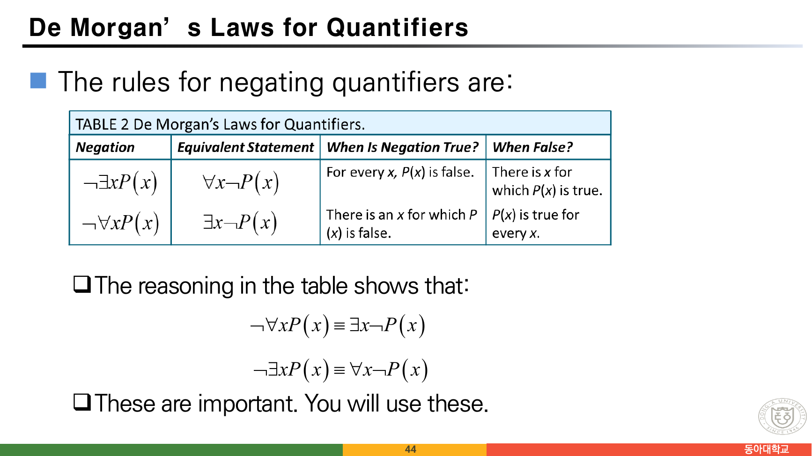
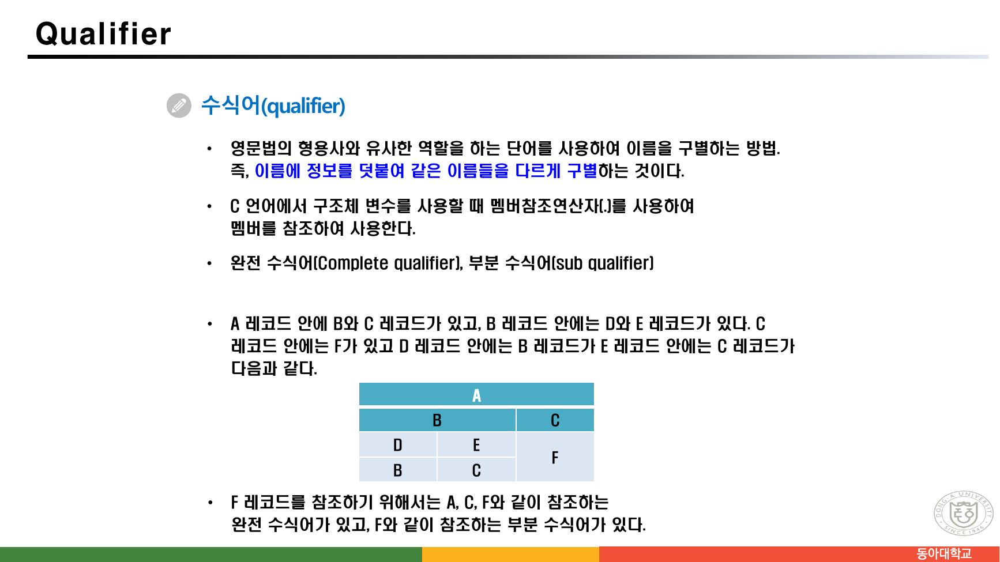
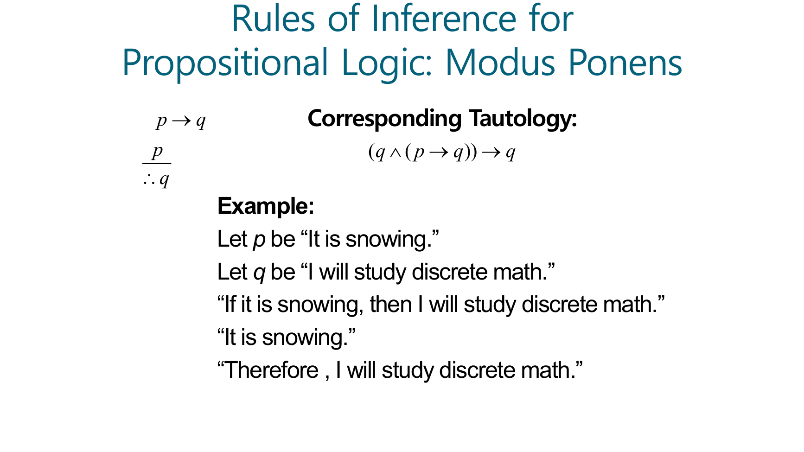
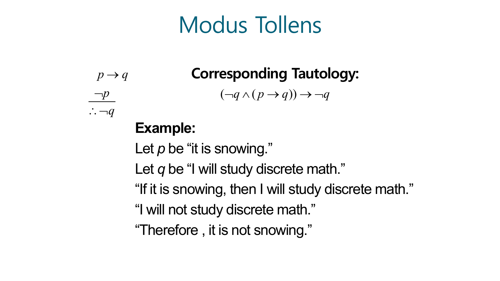
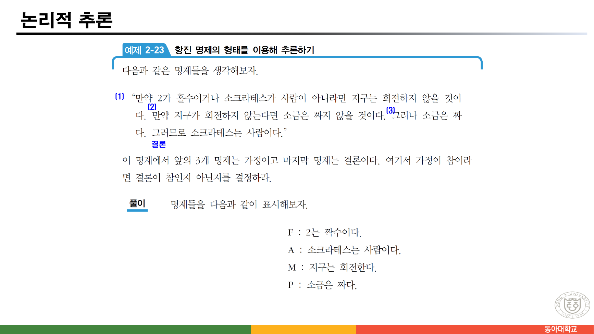
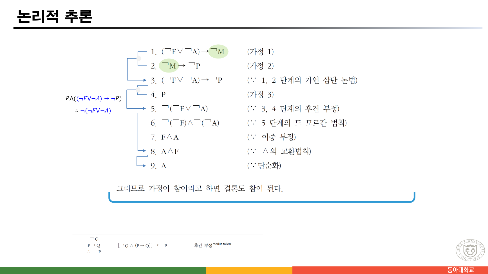

> [!abstract] 이 묶음이 실제로 하는 말
> [앞 문서](./02.%20%ED%95%9C%20%ED%8C%8C%EC%9D%BC%EC%97%90%20%EC%B1%85%20%EB%91%90%20%EA%B6%8C%20%E2%80%94%20%EC%9D%98%EB%AF%B8%EB%A1%9C%20%EA%B0%80%EB%A5%B4%EC%B9%98%EB%8A%94%20%EB%85%BC%EB%A6%AC%EC%99%80%20%ED%8C%8C%EC%8B%B1%EC%9C%BC%EB%A1%9C%20%EA%B0%80%EB%A5%B4%EC%B9%98%EB%8A%94%20%EB%85%BC%EB%A6%AC.md)까지의 명제 논리는 문장 하나를 통째로 $P$라는 글자 한 개로 바꿔 놓고 진리값만 따졌다. 그러면 "모든 사람은 죽는다"와 "소크라테스는 사람이다"에서 "소크라테스는 죽는다"를 끌어낼 수 없다 — 세 문장이 $P$, $Q$, $R$이라는 무관한 글자 셋이 되어 버리기 때문이다.
>
> 36쪽부터 그 벽을 넘기 위해 **문장 안쪽을 쪼갠다.** 술어와 변수로 나누고(37~40쪽), 변수를 한정자로 묶고(41~45쪽), 그 다음 추론 규칙으로 넘어간다(47~59쪽).
>
> 이 스물네 장을 관통하는 한 단어가 있다. **대체(substitution)**다. 40쪽은 *"변수를 각각 정의역의 값으로 바꾸면 명제가 된다"*고 하고, 49쪽은 추론의 기본 법칙 첫 줄을 아예 `대체(substitution)`로 시작한다. 추론 규칙이란 결국 **"이 모양이 보이면 저 모양으로 바꿔도 된다"**는 허가증 목록이고, 59쪽의 아홉 단계 증명은 그 허가증을 아홉 번 쓴 기록이다.
>
> 그런데 그 허가증 중 하나가 이 파일 안에서 **두 번, 서로 다르게** 발급된다. 49쪽(한국어 `[표 2-9]`)의 후건 부정과 52쪽(영어 Modus Tollens)이 정면으로 충돌하고, **52쪽의 기호식은 타당하지 않은 논증**이다. 같은 슬라이드의 영어 예문은 정확하다는 점이 이 오류를 더 흥미롭게 만든다.

---

## 명제를 쪼개면 무엇이 나오는가

37쪽이 술어를 이렇게 도입한다.

> "$x$ is tall."이라는 문장에서 $x$를 변수라고 하고 tall을 **술어**라고 한다. 술어의 특별한 표현 방법으로 T(x)라고 표현할 수 있는데 여기서 T를 술어라 하고 x를 **개별 변수(individual variable)**라고 한다.
>
> [사전] Predicate : 문장 속에서 주어에 대해 진술하는 동사 이하 부분

40쪽(영어)이 그 결과를 정확히 말한다.

> Propositional functions become propositions (and have truth values) when their variables are each replaced by a value from the domain (or bound by a quantifier). […] let P(x) denote "x > 0" and the domain be the integers. Then: **P(-3) is false. P(0) is false. P(3) is true.**

여기서 이 블록의 첫 번째 대체가 일어난다. $P(x)$는 참도 거짓도 아니지만, $x$ 자리에 정의역의 값 하나를 **대체**하면 참·거짓이 정해진 명제가 된다. 38쪽(한국어)이 같은 말을 하며 두 번째 길을 덧붙인다.

> 술어의 개별 변수를 한정시켜주는 방법에는 개별 변수를 **한 개의 값으로 한정**시켜 주는 방법과 개별 변수를 그 변수의 **한정자에 의해서 한정**하는 두 가지 방법이 있다.

값 하나로 대체하거나, 한정자로 묶거나 — 둘 중 하나를 해야 명제가 된다.

### 한정자 셋

41쪽이 한정자 세 개를 정의한다. 로젠 쪽(42쪽)은 둘만 다루는데, 한국어 슬라이드는 하나를 더 넣는다.

| 한정자 | 기호 | 원본이 적은 읽는 법 | 뜻 |
| --- | --- | --- | --- |
| 전체 한정자 | $\forall$ | "임의의" 혹은 "모든" | $x$의 모든 값들에 대해서 $P(x)$는 참이다 |
| 존재 한정자 | $\exists$ | "어떤" 혹은 "적어도 하나에 대해서" | $P(x)$가 참이 되는 $x$의 값이 존재한다 |
| **유일 한정자** | $\exists!$ | "～에 대한 유일한 x가 존재한다" | $P(x)$가 참이 되는 $x$의 값이 **유일하게** 존재한다 |

42쪽(영어)은 `The two most important quantifiers are: Universal Quantifier / Existential Quantifier` 라며 둘만 세고, 샤를 퍼스(Charles Peirce, 1839–1914)의 초상을 함께 싣는다.

> [!note] 41쪽과 43쪽이 거의 같은 슬라이드다
> 43쪽은 41쪽의 세 한정자 설명을 그대로 반복하면서 오른쪽 위에 한 줄을 덧붙인다 — `C#, 접근 한정자 (Access quantifier)`, 출처는 `Microsoft - C# 설명서`. 그런데 C#에서 `public`·`private` 따위를 부르는 정식 용어는 **access modifier**(접근 한정자/접근 제한자)이며, `quantifier`가 아니다. 논리학의 quantifier와는 관계가 없는 단어를 이름이 비슷하다는 이유로 나란히 놓은 것으로 보인다.

### 한정자의 드모르간 법칙



44쪽이 이 블록에서 가장 실용적인 두 줄을 준다.

$$\neg \forall x\, P(x) \equiv \exists x\, \neg P(x) \qquad\qquad \neg \exists x\, P(x) \equiv \forall x\, \neg P(x)$$

슬라이드의 표가 왜 그런지를 말로 풀어 준다.

| 부정 | 동치인 문장 | 부정이 참일 때 | 거짓일 때 |
| --- | --- | --- | --- |
| $\neg \exists x P(x)$ | $\forall x \neg P(x)$ | For every $x$, $P(x)$ is false. | There is $x$ for which $P(x)$ is true. |
| $\neg \forall x P(x)$ | $\exists x \neg P(x)$ | There is an $x$ for which $P(x)$ is false. | $P(x)$ is true for every $x$. |

슬라이드는 이 두 줄에 `These are important. You will use these.`라고 못 박는다. 실제로 뒤에 나오는 **반례에 의한 반증**(69쪽)이 이 법칙을 그대로 쓴다 — $\forall x P(x)$가 거짓임을 보이려면 $\exists x \neg P(x)$가 참임을 보이면 되고, 그 $x$가 반례다.

```mermaid
graph LR
  A["￢∀x P(x)<br/>「모든 x가 P」가 거짓"] -->|드모르간| B["∃x ￢P(x)<br/>P가 아닌 x가 하나 있다"]
  B --> C["그 x 하나를 제시하면 끝<br/>= 반례에 의한 반증"]
  D["￢∃x P(x)<br/>「P인 x가 있다」가 거짓"] -->|드모르간| E["∀x ￢P(x)<br/>모든 x가 P가 아니다"]
  E --> F["하나 제시로는 안 된다<br/>전체를 논증해야 한다"]

  style A fill:var(--card),stroke:var(--chart-1),color:var(--foreground)
  style B fill:var(--card),stroke:var(--chart-1),color:var(--foreground)
  style C fill:var(--card),stroke:var(--chart-2),color:var(--foreground)
  style D fill:var(--card),stroke:var(--chart-3),color:var(--foreground)
  style E fill:var(--card),stroke:var(--chart-3),color:var(--foreground)
  style F fill:var(--card),stroke:var(--chart-4),color:var(--foreground)
```

**부정이 한정자를 뒤집는다**는 것이 요점이고, 그 비대칭이 증명의 난이도를 가른다. $\forall$을 깨는 데는 한 개면 되고, $\exists$를 깨는 데는 전부가 필요하다.

### 그런데 46쪽이 다른 이야기를 한다



45쪽까지가 한정자(**Quantifier**)였는데, 46쪽 제목은 **Qualifier**이고 내용은 논리학이 아니다.

> **수식어(qualifier)** — 영문법의 형용사와 유사한 역할을 하는 단어를 사용하여 이름을 구별하는 방법. […] **C 언어에서 구조체 변수를 사용할 때 멤버참조연산자(.)**를 사용하여 멤버를 참조하여 사용한다.
> • 완전 수식어(Complete qualifier), 부분 수식어(sub qualifier)
> • F 레코드를 참조하기 위해서는 **A, C, F**와 같이 참조하는 완전 수식어가 있고, **F**와 같이 참조하는 부분 수식어가 있다.

슬라이드의 표를 그대로 읽으면 A 안에 B와 C가 있고, B 안에 D와 E가, C 안에 F가 있다. 그러므로 F에 이르는 완전한 경로는 `A.C.F`이고, 이름이 유일하다면 `F`만으로도 가리킬 수 있다.

> [!warning] 이름이 비슷할 뿐 관계가 없는 두 단어
> **Quantifier(한정자)**는 변수가 정의역의 어느 범위를 도는지를 정하는 논리 기호($\forall$, $\exists$)이고, **Qualifier(수식어)**는 같은 이름을 구별하기 위해 경로를 덧붙이는 표기법(`A.C.F`)이다. 하는 일이 전혀 다르다.
>
> 다만 이 두 장을 나란히 놓고 보면 우연이 아닌 공통점이 하나 보이기는 한다. 둘 다 **이름 하나만으로는 무엇을 가리키는지 정해지지 않는 상황**을 다룬다 — $P(x)$의 $x$가 무엇인지 정해야 명제가 되듯, `F`가 어느 F인지 정해야 참조가 된다. [01번 노트](./01.%20%EC%B2%AB%20%EC%8B%9C%EA%B0%84%EC%97%90%20%EC%A0%95%EC%9D%98%20%EB%8C%80%EC%8B%A0%20%EC%82%AC%EC%A7%84%20%EB%91%90%20%EC%9E%A5%20%E2%80%94%20%EC%9D%B4%EC%82%B0%EC%9D%80%20%EB%8C%80%EC%83%81%EC%9D%B4%20%EC%95%84%EB%8B%88%EB%9D%BC%20%EA%B8%B0%EB%A1%9D%20%EB%B0%A9%EC%8B%9D%EC%9D%B4%EB%8B%A4.md)에서 본 8쪽의 질문 — *"동아대 / 동아대학교 / Dong-A University를 웹 상에서 어떻게 식별할까?"* — 과도 이어진다. 원본이 그 연결을 명시하지는 않았으므로 **보충 해석**임을 밝혀 둔다.

---

## 추론 — 대체 허가증의 목록

47쪽부터 논리적 추론이다. 48쪽(영어)이 예고편을 낸다.

$$\begin{array}{l} \forall x\,(\mathrm{Man}(x) \to \mathrm{Mortal}(x)) \\ \mathrm{Man}(\mathrm{Socrates}) \\ \hline \mathrm{Mortal}(\mathrm{Socrates}) \end{array}$$

앞서 명제 논리로는 못 했던 삼단논법이 술어와 한정자를 얻고 나서야 적힌다. 이것이 36~45쪽이 필요했던 이유다.

### 49쪽 — 표 2-9

![49쪽 — [표 2-9] 항진 명제의 형태를 이용하는 추론의 법칙](../assets/ch02-p49-추론의-법칙-표2-9.png)

49쪽은 추론의 기본 법칙을 `대체(substitution)`로 시작한다 — *"한 명제에 있는 어떤 표현을 그것과 똑같은 의미를 지닌 다른 표현으로 나타내는 것."* 그리고 `[표 2-9]`가 규칙 넷을 준다. 49·50쪽의 표를 합쳐 원본 그대로 옮긴다.

| 우리말 형태 | 기호 | 항진 명제의 형태 | 이름 |
| --- | --- | --- | --- |
| p이다 / 따라서 p 또는 Q이다 | $P \;\therefore\; P \lor Q$ | $P \to (P \lor Q)$ | 선언적 부가 (disjunctive addition) |
| p이면서 q이다 / 따라서 p이다 | $P \land Q \;\therefore\; P$ | $(P \land Q) \to P$ | 단순화 (simplification) |
| p이다 / p이면 q이다 / 따라서 q이다 | $P,\; P \to Q \;\therefore\; Q$ | $[P \land (P \to Q)] \to Q$ | **전건 긍정** (modus ponens, 긍정 논법) |
| q가 아니다 / p이면 q이다 / 따라서 p가 아니다 | $\neg Q,\; P \to Q \;\therefore\; \neg P$ | $[\neg Q \land (P \to Q)] \to \neg P$ | **후건 부정** (modus tollens, 부정 논법) |
| p 또는 q이다 / p가 아니다 / 따라서 q이다 | — | — | 선언적 삼단논법 |
| p이면 q, q이면 r / 따라서 p이면 r | — | — | 가언 삼단논법 |
| p이다 / q이다 / 따라서 p이고 q이다 | — | — | 연언 |
| p이면 q, r이면 s / p이거나 r / 따라서 q이거나 s | — | — | 구성적 양도논법 |
| p이면 q, r이면 s / q가 아니거나 s가 아니다 / 따라서 p가 아니거나 r이 아니다 | — | — | 파괴적 양도논법 |

네 규칙의 항진 명제 형태를 모두 진리표로 확인했고 **전부 항진 명제다.** 특히 후건 부정 $[\neg Q \land (P \to Q)] \to \neg P$는 네 줄 모두 참이다.

> [!note] 49쪽의 잔오류 셋
>
> - `단순화^simplication` — `simplification`의 철자가 빠졌다
> - `후건 부정^modus tollen` — `modus tollens`의 `s`가 빠졌다. 59쪽 하단에도 같은 철자로 다시 나온다
> - 첫 행의 우리말 `p이다 / 따라서 p 또는 **Q**이다` — 앞은 소문자 `p`, 뒤는 대문자 `Q`로 대소문자가 섞였다. 표의 기호 열은 `P ∴ P∨Q`로 둘 다 대문자다

### 51·52쪽 — 같은 규칙, 다시 그리고 다르게

두 장 뒤에서 영어 계열이 같은 두 규칙을 다시 낸다. 그리고 여기서 어긋난다.



51쪽의 규칙 자체는 옳다 — $p \to q$, $p$ $\therefore$ $q$. 그런데 `Corresponding Tautology`로 적힌 식이 이것이다.

$$(q \land (p \to q)) \to q$$

첫 항이 $p$여야 하는데 $q$로 적혀 있다. 물론 이 식도 항진 명제이기는 하다 — 무엇이든 $q$와 논리곱한 뒤 $q$를 결론으로 내는 식은 언제나 참이다. 그러나 그것은 전건 긍정과 아무 상관 없이 참인 것이고, **전건 긍정에 대응하는 항진 명제가 아니다.** 옳은 식은 49쪽이 적은 $[P \land (P \to Q)] \to Q$다.



52쪽은 더 나아간다. 왼쪽에 적힌 규칙이 이렇다.

$$\begin{array}{l} p \to q \\ \neg p \\ \hline \therefore \neg q \end{array} \qquad \text{Corresponding Tautology: } (\neg q \land (p \to q)) \to \neg q$$

$p$와 $q$가 서로 바뀌었다. 49쪽의 옳은 형태는 $p \to q$, $\neg q$ $\therefore$ $\neg p$다.

> [!caution] 원본 오류 — 52쪽의 후건 부정은 타당하지 않은 논증이다
> 52쪽이 적은 규칙 $p \to q,\ \neg p \ \therefore\ \neg q$는 이름이 따로 있는 **오류 추론**이다 — 전건 부정의 오류(denying the antecedent). 진리표로 확인하면 $p =$ 거짓, $q =$ 참일 때 두 전제 $p \to q$와 $\neg p$가 모두 참인데 결론 $\neg q$는 거짓이다. 즉 $(\neg p \land (p \to q)) \to \neg q$는 **항진 명제가 아니다.**
>
> 함께 적힌 `Corresponding Tautology` $(\neg q \land (p \to q)) \to \neg q$는 항진 명제이긴 하지만 51쪽과 같은 이유로 공허하게 참일 뿐이다 — 결론 $\neg q$가 전건 안에 그대로 들어 있다. 옳은 식은 $(\neg q \land (p \to q)) \to \neg p$이며, 49쪽이 정확히 그렇게 적었다.
>
> **그런데 같은 슬라이드의 영어 예문은 정확하다.** *"If it is snowing, then I will study discrete math." / "I will not study discrete math." / "Therefore, it is not snowing."* — 이것은 $p \to q$, $\neg q$ $\therefore$ $\neg p$로, 왼쪽 기호식과 반대다. 왼쪽 기호식대로라면 결론이 *"눈이 오지 않는다"*가 아니라 *"이산수학을 공부하지 않을 것이다"*여야 한다.
>
> 정리하면 이 파일 안에서 후건 부정이 **세 번** 적히는데(49쪽 표, 52쪽 기호식, 52쪽 예문, 그리고 59쪽 하단에 49쪽 표의 그 행이 다시 인용된다), **52쪽의 기호식 하나만 틀렸다.**

아래에서 네 규칙의 항진 여부를 직접 확인할 수 있다.

```html preview h=600px
<div style="font-family:system-ui,-apple-system,sans-serif;padding:20px;color:var(--foreground)">
  <div style="font-size:13px;font-weight:600;margin-bottom:10px">원본에 적힌 식들을 진리표로 검증한다</div>
  <div id="rlist" style="display:flex;flex-direction:column;gap:8px;margin-bottom:16px"></div>

  <div id="rtable" style="overflow-x:auto"></div>
  <div id="rverdict" style="margin-top:14px;padding:12px;border:1px solid var(--border);border-radius:8px;background:var(--card);font-size:13.5px;line-height:1.8"></div>
</div>
<script>
(function(){
  var imp=function(a,b){return (!a)||b;};
  var RULES=[
    {src:'49쪽 [표 2-9] · 전건 긍정', f:'[P ∧ (P→Q)] → Q',
     fn:function(P,Q){return imp(P&&imp(P,Q),Q);}, ok:true,
     note:'전건 긍정(modus ponens)에 정확히 대응하는 항진 명제다.'},
    {src:'49쪽 [표 2-9] · 후건 부정', f:'[￢Q ∧ (P→Q)] → ￢P',
     fn:function(P,Q){return imp((!Q)&&imp(P,Q),!P);}, ok:true,
     note:'후건 부정(modus tollens)에 정확히 대응하는 항진 명제다. 59쪽 하단이 이 행을 다시 인용한다.'},
    {src:'51쪽 영어 · Modus Ponens가 적은 식', f:'(Q ∧ (P→Q)) → Q',
     fn:function(P,Q){return imp(Q&&imp(P,Q),Q);}, ok:true,
     note:'항진 명제이기는 하다 — 그러나 결론 Q가 전건 안에 그대로 들어 있어 공허하게 참일 뿐이고, 전건 긍정과는 무관하다. 첫 항이 P여야 한다.'},
    {src:'52쪽 영어 · Modus Tollens가 적은 식', f:'(￢Q ∧ (P→Q)) → ￢Q',
     fn:function(P,Q){return imp((!Q)&&imp(P,Q),!Q);}, ok:true,
     note:'51쪽과 같은 사정이다. 결론 ￢Q가 전건에 들어 있어 공허하게 참이다. 결론은 ￢P여야 한다.'},
    {src:'52쪽 영어 · 왼쪽에 적힌 규칙 자체', f:'(￢P ∧ (P→Q)) → ￢Q',
     fn:function(P,Q){return imp((!P)&&imp(P,Q),!Q);}, ok:false,
     note:'<b style="color:var(--chart-4)">항진 명제가 아니다.</b> P=거짓, Q=참인 줄에서 전제 둘이 모두 참인데 결론이 거짓이다. 이 규칙은 「전건 부정의 오류」라는 이름이 따로 있는 잘못된 추론이다.'}
  ];
  var L=document.getElementById('rlist'),T=document.getElementById('rtable'),V=document.getElementById('rverdict');
  function show(i){
    var r=RULES[i], rows='', bad=[];
    [[true,true],[true,false],[false,true],[false,false]].forEach(function(pq){
      var P=pq[0],Q=pq[1],v=r.fn(P,Q);
      if(!v) bad.push('P='+(P?'T':'F')+', Q='+(Q?'T':'F'));
      rows+='<tr style="border-bottom:1px solid var(--border)'+(v?'':';background:var(--muted)')+'">'
        +'<td style="padding:6px 14px;text-align:center;font-family:ui-monospace,Menlo,monospace">'+(P?'T':'F')+'</td>'
        +'<td style="padding:6px 14px;text-align:center;font-family:ui-monospace,Menlo,monospace">'+(Q?'T':'F')+'</td>'
        +'<td style="padding:6px 14px;text-align:center;font-family:ui-monospace,Menlo,monospace;font-weight:700;color:'
          +(v?'var(--chart-2)':'var(--chart-4)')+'">'+(v?'T':'F')+'</td></tr>';
    });
    T.innerHTML='<table style="border-collapse:collapse;font-size:14px">'
      +'<thead><tr style="border-bottom:1px solid var(--border)">'
      +'<th style="padding:7px 14px;font-weight:600">P</th><th style="padding:7px 14px;font-weight:600">Q</th>'
      +'<th style="padding:7px 14px;font-weight:600;color:var(--chart-1)">'+r.f+'</th></tr></thead>'
      +'<tbody>'+rows+'</tbody></table>';
    V.innerHTML = (bad.length
        ? '<b style="color:var(--chart-4)">항진 명제가 아니다</b> — 거짓이 되는 줄: '+bad.join(' · ')
        : '<b style="color:var(--chart-2)">항진 명제다</b> — 네 줄 모두 참')
      +'<br/>'+r.note;
    Array.prototype.forEach.call(L.children,function(x,q){
      x.style.borderColor=(q===i)?'var(--chart-1)':'var(--border)';
      x.style.fontWeight=(q===i)?'700':'400';
    });
  }
  RULES.forEach(function(r,i){
    var b=document.createElement('button');
    b.innerHTML='<span style="opacity:.75;font-size:11.5px">'+r.src+'</span><br/>'
      +'<span style="font-family:ui-monospace,Menlo,monospace;font-size:14px">'+r.f+'</span>';
    b.style.cssText='text-align:left;padding:9px 13px;border-radius:6px;border:1px solid var(--border);'
      +'background:var(--card);color:var(--foreground);cursor:pointer;line-height:1.5';
    b.addEventListener('click',function(){show(i);});
    L.appendChild(b);
  });
  show(4);
})();
</script>
```

---

## 59쪽 — 허가증 아홉 장으로 만든 증명

57쪽이 문제를 낸다.



> **[예제 2-23] 항진 명제의 형태를 이용해 추론하기**
> ⑴ "만약 2가 홀수이거나 소크라테스가 사람이 아니라면 지구는 회전하지 않을 것이다.
> ⑵ 만약 지구가 회전하지 않는다면 소금은 짜지 않을 것이다.
> ⑶ 그러나 소금은 짜다. 그러므로 소크라테스는 사람이다."
>
> 앞의 3개 명제는 가정이고 마지막 명제는 결론이다. 여기서 가정이 참이라면 결론이 참인지 아닌지를 결정하라.
>
> **[풀이]** F : 2는 짝수이다. / A : 소크라테스는 사람이다. / M : 지구는 회전한다. / P : 소금은 짜다.

기호 정의에서 눈여겨볼 것이 있다. 문제는 *"2가 **홀**수이거나"*라고 하는데 $F$는 *"2는 **짝**수이다"*로 잡았다. 그래서 그 조각이 $\neg F$가 된다. 마찬가지로 *"지구는 회전하지 않을 것"*이 $\neg M$, *"소금은 짜지 않을 것"*이 $\neg P$다. 58쪽이 그 결과를 정리한다.

$$\text{1. } (\neg F \lor \neg A) \to \neg M \qquad \text{2. } \neg M \to \neg P \qquad \text{3. } P \qquad \text{4. } A\;(\text{결론})$$



```html preview h=620px
<div style="font-family:system-ui,-apple-system,sans-serif;padding:20px;color:var(--foreground)">
  <div style="font-size:13px;font-weight:600;margin-bottom:4px">원본 59쪽의 아홉 단계</div>
  <div style="font-size:12px;opacity:.75;margin-bottom:14px">줄을 누르면 그 단계에서 쓴 규칙과, 그 규칙이 [표 2-9]의 어느 행인지가 아래에 나온다.</div>

  <table style="width:100%;border-collapse:collapse;font-size:13.5px">
    <thead><tr style="border-bottom:1px solid var(--border);text-align:left">
      <th style="padding:7px 6px;font-weight:600;width:34px">#</th>
      <th style="padding:7px 6px;font-weight:600">명제</th>
      <th style="padding:7px 6px;font-weight:600">근거</th>
    </tr></thead>
    <tbody id="proof"></tbody>
  </table>

  <div id="pn" style="margin-top:16px;padding:13px;border:1px solid var(--border);border-radius:8px;background:var(--card);font-size:13px;line-height:1.85;min-height:56px"></div>
</div>
<script>
(function(){
  var P=[
    {s:'(￢F ∨ ￢A) → ￢M', why:'가정 1',
     n:'"2가 홀수이거나 소크라테스가 사람이 아니라면 지구는 회전하지 않을 것이다." F는 <b>2는 짝수이다</b>로 잡았으므로 "2가 홀수"가 ￢F가 된다.'},
    {s:'￢M → ￢P', why:'가정 2',
     n:'"지구가 회전하지 않는다면 소금은 짜지 않을 것이다."'},
    {s:'(￢F ∨ ￢A) → ￢P', why:'∵ 1, 2 단계의 가언 삼단논법',
     n:'A→B 와 B→C 에서 A→C 를 얻는다. [표 2-9]의 <b>가언 삼단논법</b> 행이다. 여기서 중간항 ￢M이 사라진다.'},
    {s:'P', why:'가정 3',
     n:'"그러나 소금은 짜다."'},
    {s:'￢(￢F ∨ ￢A)', why:'∵ 3, 4 단계의 후건 부정',
     n:'3단계가 X→￢P 이고 4단계가 P 즉 ￢(￢P) 이므로, <b>후건 부정</b>으로 ￢X를 얻는다. 49쪽 [표 2-9]의 형태 [￢Q ∧ (P→Q)] → ￢P 를 그대로 쓴 것이며, <b>52쪽의 기호식대로였다면 이 단계는 성립하지 않는다.</b>'},
    {s:'￢(￢F) ∧ ￢(￢A)', why:'∵ 5 단계의 드 모르간 법칙',
     n:'￢(X ∨ Y) = ￢X ∧ ￢Y. 부정이 논리합을 논리곱으로 뒤집는다.'},
    {s:'F ∧ A', why:'∵ 이중 부정',
     n:'￢(￢F) = F. 여기서 <b>F도 함께 증명된다</b> — "2는 짝수이다"가 결론의 부산물로 따라 나온다.'},
    {s:'A ∧ F', why:'∵ ∧의 교환법칙',
     n:'왜 굳이 자리를 바꾸는가? [표 2-9]의 <b>단순화</b>는 P∧Q에서 <b>왼쪽 P만</b> 꺼내도록 정의되어 있다. A를 얻으려면 A를 왼쪽으로 옮겨야 한다.'},
    {s:'A', why:'∵ 단순화',
     n:'"소크라테스는 사람이다." 결론에 도달했다. 원본은 이렇게 맺는다 — <b>"그러므로 가정이 참이라고 하면 결론도 참이 된다."</b>'}
  ];
  var TB=document.getElementById('proof'),NT=document.getElementById('pn');
  P.forEach(function(p,i){
    var tr=document.createElement('tr');
    tr.style.cssText='border-bottom:1px solid var(--border);cursor:pointer';
    tr.innerHTML='<td style="padding:7px 6px;opacity:.7">'+(i+1)+'</td>'
      +'<td style="padding:7px 6px;font-family:ui-monospace,Menlo,monospace;font-weight:700;color:var(--chart-1)">'+p.s+'</td>'
      +'<td style="padding:7px 6px;opacity:.85;font-size:12.5px">'+p.why+'</td>';
    tr.addEventListener('click',function(){
      NT.innerHTML='<b>'+(i+1)+'단계 · '+p.why+'</b><br/>'+p.n;
      Array.prototype.forEach.call(TB.children,function(x){x.style.background='transparent';});
      tr.style.background='var(--muted)';
    });
    TB.appendChild(tr);
  });
  TB.children[4].click();
})();
</script>
```

이 논증이 실제로 타당한지 네 변수 16줄을 전부 확인했다. 가정 셋을 모두 참으로 만드는 배정은 **정확히 하나**뿐이다.

$$F = \text{참},\quad A = \text{참},\quad M = \text{참},\quad P = \text{참}$$

즉 가정이 결론 $A$만 강제하는 것이 아니라 **네 변수를 전부 못 박는다.** 7단계에서 $F \land A$가 나온 것이 우연이 아닌 이유다 — "2는 짝수이다"라는, 우리가 이미 아는 사실이 증명의 부산물로 따라 나온다.

> [!tip] 8단계가 이 증명에서 가장 배울 것이 많다
> $F \land A$에서 곧장 $A$로 가지 않고 굳이 $A \land F$로 자리를 바꾼다. `[표 2-9]`의 **단순화**가 $P \land Q \;\therefore\; P$, 즉 **왼쪽 것만** 꺼내도록 정의되어 있기 때문이다.
>
> 사람은 $F \land A$를 보면 $A$를 곧바로 읽어 내지만, 규칙 목록에는 그런 허가증이 없다. 그래서 교환법칙이라는 허가증을 한 장 더 써서 모양을 맞춘 뒤에야 꺼낼 수 있다. **증명이 사람의 직관이 아니라 허가증 목록 위에서 돌아간다**는 사실이 이 한 단계에 압축되어 있다. [02번 노트](./02.%20%ED%95%9C%20%ED%8C%8C%EC%9D%BC%EC%97%90%20%EC%B1%85%20%EB%91%90%20%EA%B6%8C%20%E2%80%94%20%EC%9D%98%EB%AF%B8%EB%A1%9C%20%EA%B0%80%EB%A5%B4%EC%B9%98%EB%8A%94%20%EB%85%BC%EB%A6%AC%EC%99%80%20%ED%8C%8C%EC%8B%B1%EC%9C%BC%EB%A1%9C%20%EA%B0%80%EB%A5%B4%EC%B9%98%EB%8A%94%20%EB%85%BC%EB%A6%AC.md)의 연산자 우선순위표가 괄호를 기계에게 넘긴 것과 같은 방향이다.

---

## 정리 — 이 묶음에서 가져갈 것

> [!tip] 세 문장 요약
>
> 1. **명제를 쪼개야 "모든"과 "어떤"을 말할 수 있다.** $P(x)$는 참도 거짓도 아니고, 정의역의 값 하나를 대체하거나 한정자로 묶어야 명제가 된다(38·40쪽). 그러고 나서야 48쪽의 소크라테스 삼단논법이 적힌다.
> 2. **44쪽의 두 줄이 증명 전략을 가른다.** $\neg\forall x P(x) \equiv \exists x \neg P(x)$이므로 "모든"을 깨는 데는 반례 하나면 되고, $\neg\exists x P(x) \equiv \forall x \neg P(x)$이므로 "어떤"을 깨는 데는 전체가 필요하다. 슬라이드가 `You will use these`라고 못 박은 이유가 69쪽의 반증법에서 드러난다.
> 3. **후건 부정이 이 파일에 네 번 적히고, 52쪽 기호식 하나만 틀렸다.** 49쪽 표와 59쪽 인용은 $p \to q,\ \neg q \therefore \neg p$로 정확하고, 52쪽 왼쪽 기호식만 $p \to q,\ \neg p \therefore \neg q$로 $p$와 $q$가 뒤바뀌어 있다. 이것은 전건 부정의 오류이며 $P=$거짓, $Q=$참에서 반례가 나온다. 정작 같은 슬라이드의 영어 예문은 옳다.

다음 문서는 60쪽 이후 — 증명의 다섯 가지 방법(vacuous·trivial·직접·간접·반증), 수학적 귀납법, 프로그램 검증, 그리고 이 장의 마지막인 지식 베이스 시스템으로 이어진다.

---

### 근거 자료

이 문서는 강의 원본 `수학적 모델과 논리.pdf`의 36~59쪽에 근거한다. 인용한 슬라이드는 44쪽(한정자의 드모르간 법칙), 46쪽(Qualifier), 49쪽(`[표 2-9]`), 51쪽(Modus Ponens), 52쪽(Modus Tollens), 57쪽(예제 2-23), 59쪽(아홉 단계 증명)이다.

본문의 판정은 모두 진리표로 확인한 결과다 — 49쪽 표의 전건 긍정·후건 부정 두 형태는 항진 명제이고, 51·52쪽이 `Corresponding Tautology`로 적은 두 식도 (공허하게나마) 항진 명제이며, 52쪽 왼쪽에 적힌 규칙 $(\neg p \land (p \to q)) \to \neg q$만이 항진 명제가 아니다($p=$거짓, $q=$참에서 거짓). 예제 2-23의 논증은 네 변수 16줄을 전부 확인해 타당함을 확인했고, 가정 셋을 동시에 참으로 만드는 배정이 $F=A=M=P=$참 하나뿐임도 같은 방법으로 얻었다.

원본에 없는 보충은 세 가지이며 본문에 밝혔다 — 52쪽 규칙에 「전건 부정의 오류」라는 이름이 따로 있다는 사실, 46쪽의 Qualifier와 41쪽의 Quantifier가 "이름 하나로는 대상이 정해지지 않는다"는 점에서만 통한다는 해석, 그리고 8단계에서 교환법칙이 필요한 이유에 대한 설명이다. C#의 정식 용어가 `access modifier`라는 지적(43쪽 관련)도 보충이다.
