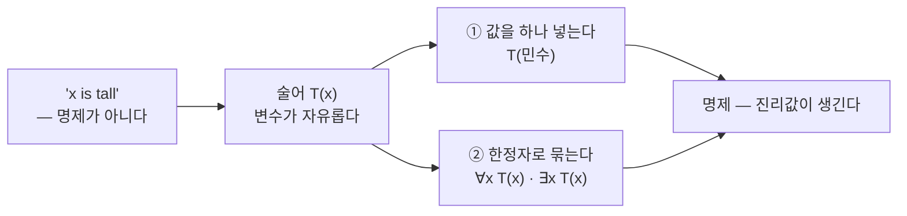
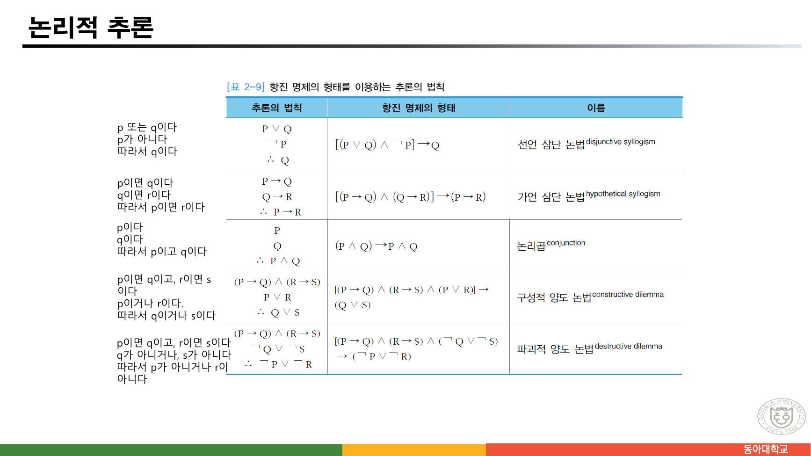
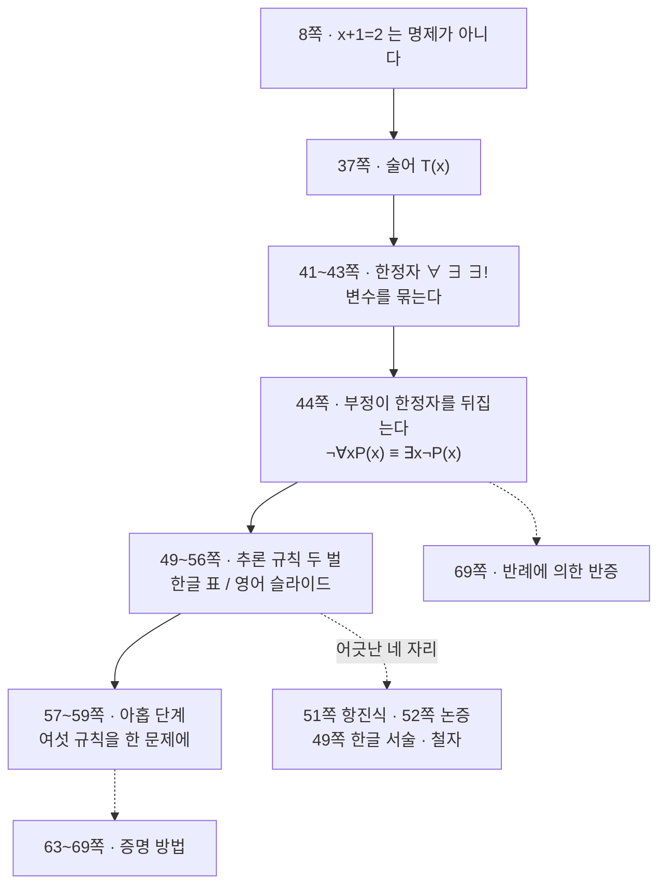

> [!abstract] 같은 규칙이 두 번 나온다 — 그리고 두 벌이 서로를 교정한다
> 36쪽부터 59쪽까지 스물네 쪽에서 **한정자도 두 번, 추론 규칙도 두 번** 정의된다. 41쪽(한글)과 42쪽(영어)이 전체·존재 한정자를 각각 설명하고, 43쪽은 41쪽을 그대로 다시 띄운다. 49·50쪽의 한글 표 [표 2-9]가 추론 규칙 아홉 개를 한 장에 담는데, 51~56쪽의 영어 슬라이드가 그중 여섯 개를 한 쪽씩 다시 설명한다.
>
> 이 중복이 우연한 낭비가 아니다. **두 벌이 서로 다른 자리에서 틀리기 때문에, 한쪽만 읽으면 반드시 틀린 것을 배운다.** 49쪽의 한글 설명은 후건 부정의 결론을 "따라서 p이다"로 적어 부호를 잃었고(같은 줄의 기호는 맞다), 52쪽의 영어 슬라이드는 **논증 자체가 부당한 형태**로 적혀 있다(같은 쪽의 예문은 맞다). 진리표로 반례까지 확인했다.
>
> 그래서 이 정리의 척추는 "추론 규칙 목록"이 아니라 **"같은 규칙의 두 판본을 겹쳐 놓고 어긋난 곳을 찾는 일"** 이다.

---

## 1. 변수가 든 문장을 되살리기

8쪽에서 `x+1=2` 는 명제가 아니었다. 변수 `x` 가 정해지지 않아 참·거짓을 말할 수 없었기 때문이다. 37쪽이 그 문장을 다시 꺼낸다.

> "𝑥 is tall."이라는 문장에서 𝑥를 **변수**라고 하고 tall을 **술어**라고 한다. 술어의 특별한 표현 방법으로 **T(x)** 라고 표현할 수 있는데 여기서 T를 술어라 하고 x를 **개별 변수(individual variable)** 라고 한다.
>
> [사전] Predicate : 문장 속에서 주어에 대해 진술하는 동사 이하 부분

40쪽이 술어를 명제로 바꾸는 첫 방법을 보여 준다.

> For example, let P(x) denote "x > 0" and the domain be the integers. Then:
> P(-3) is **false**. P(0) is **false**. P(3) is **true**.

**값을 하나 넣으면** 진리값이 생긴다. 38쪽이 방법이 둘임을 말한다.

> 술어의 개별 변수를 한정시켜주는 방법에는 개별 변수를 **한 개의 값으로 한정**시켜 주는 방법과 개별 변수를 그 변수의 **한정자에 의해서 한정**하는 두 가지 방법이 있다.

두 번째 방법이 한정자다.

### 1.1 세 개의 한정자

41쪽이 셋을 정의한다(43쪽이 같은 내용을 반복한다).

| 한정자 | 기호 | 원본의 읽는 법 | 뜻 |
| --- | --- | --- | --- |
| 전체 한정자 | ∀ | "임의의" 혹은 "모든" | 𝒙의 **모든** 값들에 대해서 P(𝒙)는 참이다 |
| 존재 한정자 | ∃ | "어떤" 혹은 "적어도 하나에 대해서" | P(𝒙)가 참이 되는 𝒙의 값이 **존재**한다 |
| 유일 한정자 | ∃! | "~에 대한 유일한 x가 존재한다" | P(𝒙)가 참이 되는 𝒙의 값이 **유일하게** 존재한다 |

42쪽이 영어로 같은 것을 말하며 한정자가 왜 필요한지를 덧붙인다.

> We need quantifiers to express the meaning of English words including **all** and **some**:
> • "All men are Mortal." • "Some cats do not have fur."
> The quantifiers are said to **bind** the variable x in these expressions.

`bind` 라는 말이 요점이다. 한정자가 변수를 **묶으면** 그 변수는 더 이상 자유롭지 않고, 문장 전체가 다시 명제가 된다.



### 1.2 부정을 안으로 밀어 넣기

44쪽이 이 절에서 가장 실용적인 한 장이다.


원본 TABLE 2를 그대로 옮긴다.

| 부정 | 동치인 문장 | 부정이 참일 때 | 거짓일 때 |
| --- | --- | --- | --- |
| ¬∃x P(x) | ∀x ¬P(x) | For every x, P(x) is false. | There is x for which P(x) is true. |
| ¬∀x P(x) | ∃x ¬P(x) | There is an x for which P(x) is false. | P(x) is true for every x. |

그리고 슬라이드가 결론을 두 줄로 다시 적고 못박는다.

> ¬∀x P(x) ≡ ∃x ¬P(x)
> ¬∃x P(x) ≡ ∀x ¬P(x)
> **These are important. You will use these.**

**부정이 한정자를 통과하면 한정자가 뒤집힌다.** "모두 참"의 부정은 "모두 거짓"이 아니라 "**하나라도** 거짓"이다. 이 한 줄이 69쪽의 반례에 의한 반증(∀x P(x)를 반박하려면 ∃x ¬P(x)를 보이면 된다)의 근거가 되고, 아래 §4의 아홉 단계 추론에서도 6단계에 그대로 쓰인다.

---

## 2. 추론이란 무엇인가

47~50쪽이 추론으로 넘어간다. 48쪽이 형식을 보여 준다.

> ∀x ( Man(x) → Mortal(x) )
> Man(Socrates)
> ────────────────
> ∴ Mortal(Socrates)

가로줄 **위가 전제, 아래가 결론**이다. 49쪽이 추론의 바탕이 되는 조작 하나를 먼저 정의한다.

> ❖ **대체(substitution)** : 한 명제에 있는 어떤 표현을 그것과 똑같은 의미를 지닌 다른 표현으로 나타내는 것

동치인 것끼리 갈아 끼울 수 있다는 이 허가가 §4의 아홉 단계에서 드 모르간·이중 부정·교환법칙을 쓸 수 있게 해 준다.

---

## 3. 두 벌의 추론 규칙표



49·50쪽의 [표 2-9]가 규칙 아홉 개를 세 열로 담는다 — **자연어 서술 / 기호 형태 / 항진 명제의 형태와 이름**. 51~56쪽의 영어 슬라이드가 그중 여섯 개를 한 쪽씩 다시 다룬다.

두 벌을 겹쳐 놓고, 각 규칙의 **논증이 실제로 타당한지**와 **항진 명제 형태가 그 규칙을 제대로 나타내는지**를 진리표로 판정했다.

```html preview h=640px
<div style="font-family:system-ui,-apple-system,sans-serif;padding:18px;color:var(--foreground)">
  <p style="font-size:12.5px;color:var(--muted-foreground);margin:0 0 12px">
    각 행은 원본에 적힌 그대로다. <b>판정</b>은 진리표 네 줄(또는 여덟 줄)을 전부 훑어 전제가 모두 참인데 결론이 거짓인 배정이 있는지를 본 결과다.
  </p>
  <div id="rows" style="display:flex;flex-direction:column;gap:8px"></div>
  <div id="tt" style="margin-top:14px"></div>

  <script>
    function I(a,b){return (!a)||b;}
    var R = [
      {src:'49쪽 한글표', name:'전건 긍정 (modus ponens)',
       prem:['P→Q','P'], conc:'Q', pf:[function(p,q){return I(p,q);},function(p,q){return p;}], cf:function(p,q){return q;},
       taut:'[P ∧ (P→Q)] → Q', ok:true, cmt:'논증도 항진식도 옳다.'},
      {src:'51쪽 영어', name:'Modus Ponens',
       prem:['p→q','p'], conc:'q', pf:[function(p,q){return I(p,q);},function(p,q){return p;}], cf:function(p,q){return q;},
       taut:'(q ∧ (p→q)) → q', ok:'taut',
       cmt:'논증은 옳다. 그러나 항진 명제가 <b>(q ∧ …)</b> 로 시작한다 — 전제는 <b>p</b>인데 q를 적었다. 이 식도 항진식이긴 하나(X∧Y→X) 전건 긍정을 나타내지 않는다.'},
      {src:'49쪽 한글표', name:'후건 부정 (modus tollens) — 기호 열',
       prem:['P→Q','¬Q'], conc:'¬P', pf:[function(p,q){return I(p,q);},function(p,q){return !q;}], cf:function(p,q){return !p;},
       taut:'[¬Q ∧ (P→Q)] → ¬P', ok:true, cmt:'기호 열과 항진식은 옳다. 다만 같은 줄의 <b>한글 서술</b>이 “따라서 p이다”로 적혀 부호를 잃었다.'},
      {src:'52쪽 영어', name:'Modus Tollens — 슬라이드에 적힌 형태',
       prem:['p→q','¬p'], conc:'¬q', pf:[function(p,q){return I(p,q);},function(p,q){return !p;}], cf:function(p,q){return !q;},
       taut:'(¬q ∧ (p→q)) → ¬q', ok:false,
       cmt:'<b>부당하다.</b> 전제 두 개가 참인데 결론이 거짓인 배정이 있다. 전건을 부정해 후건을 부정하는 잘못된 꼴이다. 같은 쪽의 영어 예문(“I will not study… therefore it is not snowing”)은 올바른 후건 부정이다.'},
      {src:'50쪽 한글표', name:'선언 삼단 논법 (disjunctive syllogism)',
       prem:['P∨Q','¬P'], conc:'Q', pf:[function(p,q){return p||q;},function(p,q){return !p;}], cf:function(p,q){return q;},
       taut:'[(P∨Q) ∧ ¬P] → Q', ok:true, cmt:'옳다.'},
      {src:'50쪽 한글표', name:'가언 삼단 논법 (hypothetical syllogism)',
       prem:['P→Q','Q→R'], conc:'P→R', three:true,
       pf:[function(p,q,r){return I(p,q);},function(p,q,r){return I(q,r);}], cf:function(p,q,r){return I(p,r);},
       taut:'[(P→Q) ∧ (Q→R)] → (P→R)', ok:true, cmt:'옳다. §4의 3단계에서 실제로 쓰인다.'},
      {src:'50쪽 한글표', name:'논리곱 (conjunction)',
       prem:['P','Q'], conc:'P∧Q', pf:[function(p,q){return p;},function(p,q){return q;}], cf:function(p,q){return p&&q;},
       taut:'(P∧Q) → P∧Q', ok:true, cmt:'옳다.'},
      {src:'54쪽 영어', name:'Simplification',
       prem:['p∧q'], conc:'p', pf:[function(p,q){return p&&q;}], cf:function(p,q){return p;},
       taut:'(p∧q) → p', ok:true, cmt:'옳다. §4의 9단계에서 쓰인다.'}
    ];
    function check(r) {
      var n = r.three ? 3 : 2, bad = [];
      for (var m = 0; m < (1 << n); m++) {
        var v = [];
        for (var b = 0; b < n; b++) v.push(!((m >> (n - 1 - b)) & 1));
        var allP = r.pf.every(function (f) { return f.apply(null, v); });
        if (allP && !r.cf.apply(null, v)) bad.push(v);
      }
      return bad;
    }
    document.getElementById('rows').innerHTML = R.map(function (r) {
      var bad = check(r);
      var color = bad.length ? 'var(--chart-5)' : (r.ok === 'taut' ? 'var(--chart-4)' : 'var(--chart-2)');
      var verdict = bad.length
        ? '논증 부당 — 반례 ' + bad.map(function (v) {
            return '(' + (r.three ? 'p,q,r' : 'p,q') + ')=(' + v.map(function (x) { return x ? 'T' : 'F'; }).join(',') + ')';
          }).join(' ')
        : (r.ok === 'taut' ? '논증은 타당 · 항진식 표기가 어긋남' : '논증 타당');
      return '<div style="padding:10px 13px;border:1px solid var(--border);border-left:4px solid ' + color +
        ';border-radius:var(--radius);background:var(--card)">' +
        '<div style="display:flex;gap:10px;flex-wrap:wrap;align-items:baseline">' +
        '<span style="font-size:10.5px;font-weight:700;color:var(--muted-foreground)">' + r.src + '</span>' +
        '<span style="font-size:13.5px;font-weight:600">' + r.name + '</span>' +
        '<span style="font-size:10.5px;font-weight:700;color:' + color + ';margin-left:auto">' + verdict + '</span></div>' +
        '<div style="font-family:ui-monospace,monospace;font-size:12.5px;margin:6px 0 4px;color:var(--muted-foreground)">' +
        r.prem.join(' , ') + ' &nbsp;∴&nbsp; ' + r.conc + ' &nbsp;&nbsp;|&nbsp;&nbsp; ' + r.taut + '</div>' +
        '<div style="font-size:12.5px;line-height:1.6">' + r.cmt + '</div></div>';
    }).join('');
  </script>
</div>
```

### 3.1 51쪽 — 논증은 맞고 항진식이 틀렸다

영어 슬라이드 "Rules of Inference for Propositional Logic: Modus Ponens"는 논증을 바르게 적는다 — `p→q`, `p`, `∴ q`. 그런데 그 옆의 **Corresponding Tautology** 가 이렇다.

$$(q \wedge (p \rightarrow q)) \rightarrow q$$

첫 항이 `p` 여야 하는데 `q` 다. 이 식도 항진식이기는 하다 — `X∧Y → X` 꼴이라 무조건 참이다. 하지만 **아무 정보도 담지 않는다.** 전건 긍정의 항진 명제는 `(p ∧ (p→q)) → q` 여야 하고, 49쪽의 한글 표는 이것을 `[P ∧ (P→Q)] → Q` 로 **바르게** 적었다.

> [!warning] 원본 오류 ① — 51쪽 Corresponding Tautology
> `(q ∧ (p → q)) → q` 의 첫 항이 `p` 여야 한다. 같은 규칙을 다루는 49쪽 한글 표의 `[P ∧ (P→Q)] → Q` 가 옳은 형태다. 두 판본이 있어서 오류가 드러난 자리다.

### 3.2 52쪽 — 논증 자체가 부당하다


52쪽 "Modus Tollens"는 더 심각하다. 논증 블록이 이렇게 적혀 있다.

$$\frac{p \rightarrow q \qquad \neg p}{\therefore\ \neg q}$$

전제가 `¬q` 여야 하는데 `¬p` 이고, 결론이 `¬p` 여야 하는데 `¬q` 다. **p와 q가 서로 바뀌었다.** 그 결과 남는 것은 후건 부정이 아니라 **전건 부정(denying the antecedent)** — 논리학에서 대표적으로 부당한 형식이다.

진리표 네 줄을 전부 확인하면 반례가 하나 나온다.

| p | q | 전제 p→q | 전제 ¬p | 결론 ¬q | |
| --- | --- | --- | --- | --- | --- |
| T | T | T | F | F | 전제가 거짓이라 무관 |
| T | F | F | F | T | 전제가 거짓이라 무관 |
| **F** | **T** | **T** | **T** | **F** | **전제 둘 다 참인데 결론이 거짓 → 부당** |
| F | F | T | T | T | — |

Corresponding Tautology도 함께 어긋난다 — `(¬q ∧ (p→q)) → ¬q` 로 적혀 있으나 결론은 `¬p` 여야 한다. 51쪽의 잘못된 식에 부정을 씌워 만든 흔적으로 보인다.

> [!warning] 원본 오류 ② — 52쪽 Modus Tollens의 논증과 항진식
> 슬라이드에 적힌 논증 `p→q, ¬p ∴ ¬q` 는 **부당하다**(반례 `p=F, q=T`). 올바른 후건 부정은 `p→q, ¬q ∴ ¬p` 이고, 항진식은 `(¬q ∧ (p→q)) → ¬p` 다.
>
> 흥미롭게도 **같은 쪽의 예문은 옳다** — "If it is snowing, then I will study discrete math." / "**I will not study discrete math.**"(= ¬q) / "Therefore, **it is not snowing.**"(= ¬p). 기호와 예문이 서로 다른 규칙을 말하고 있다.

### 3.3 49쪽 — 이번엔 한글이 틀렸다

49쪽 [표 2-9]의 마지막 행은 세 열이 각각 다른 말을 한다.

| 열 | 내용 | 판정 |
| --- | --- | --- |
| 자연어 서술 | "q가 아니다 / p이면 q이다 / **따라서 p이다**" | **틀렸다** — "따라서 p가 **아니다**"여야 한다 |
| 기호 형태 | `¬Q`, `P→Q`, `∴ ¬P` | 옳다 |
| 항진 명제 | `[¬Q ∧ (P→Q)] → ¬P` | 옳다 |

> [!caution] 원본 오류 ③ — 49쪽 후건 부정의 한글 서술
> "따라서 p이다"에서 부정이 빠졌다. 바로 옆 칸의 기호 `∴ ¬P` 가 옳으므로, 한 줄 안에서 자연어와 기호가 서로 다른 결론을 말한다.

같은 쪽에 표기 오류도 몇 개 있다.

- **`simplication`** (단순화) — `simplification` 의 철자 오류
- **`modus tollen`** — `modus tollens`(52쪽 영어 슬라이드는 바르게 적었다)
- 첫 행의 한글 서술 "p이다 / 따라서 p 또는 **Q**이다" — 소문자 p와 대문자 Q를 섞어 썼다
- 항진식 `[¬Q ∧|(P → Q)] → ¬P` 에 세로줄 `|` 이 끼어 있다(바로 위 행은 `[P ∧ (P → Q)] → Q` 로 정상)

> [!tip] 두 판본을 겹쳐 읽는 법
> 이 자료에서 추론 규칙은 **어느 한쪽만 믿으면 안 된다.** 실제로 확인해 보면 배치가 이렇다 — 49쪽은 **기호가 맞고 한글이 틀렸고**, 51·52쪽은 **예문이 맞고 기호가 틀렸다.** 두 벌을 겹쳐서 **세 표현(한글 서술 / 기호 / 예문)이 모두 같은 것을 말하는지** 확인하는 것이 안전한 독법이다.

---

## 4. 아홉 단계 — 소크라테스를 사람으로 만들기

57~59쪽이 앞의 규칙들을 한 문제에 몰아 쓴다. 이 세 쪽에는 어긋난 곳이 없었다.


문제는 이렇다.

> **[1]** "만약 2가 홀수이거나 소크라테스가 사람이 아니라면 지구는 회전하지 않을 것이다. **[2]** 만약 지구가 회전하지 않는다면 소금은 짜지 않을 것이다. **[3]** 그러나 소금은 짜다. 그러므로 소크라테스는 사람이다."
>
> 이 명제에서 앞의 3개 명제는 가정이고 마지막 명제는 결론이다. 여기서 가정이 참이라면 결론이 참인지 아닌지를 결정하라.
>
> **풀이** — F : 2는 짝수이다. / A : 소크라테스는 사람이다. / M : 지구는 회전한다. / P : 소금은 짜다.

기호를 잡는 방식이 §3의 16쪽(시스템 명세)과 같다. **네 명제 변수를 모두 긍정형으로 잡는다.** "2가 홀수이다"는 별도의 변수가 아니라 `¬F` 이고, "지구가 회전하지 않는다"는 `¬M` 이다. 그래서 세 가정이 이렇게 된다.

| 가정 | 자연어 | 기호 |
| --- | --- | --- |
| 1 | 2가 홀수이거나 소크라테스가 사람이 아니라면 지구는 회전하지 않는다 | (¬F ∨ ¬A) → ¬M |
| 2 | 지구가 회전하지 않는다면 소금은 짜지 않다 | ¬M → ¬P |
| 3 | 소금은 짜다 | P |
| 결론 | 소크라테스는 사람이다 | A |

59쪽이 아홉 줄로 결론에 도달한다. 각 줄의 근거가 §3의 규칙들이다.

```html preview h=560px
<div style="font-family:system-ui,-apple-system,sans-serif;padding:18px;color:var(--foreground)">
  <div style="display:flex;gap:9px;flex-wrap:wrap;align-items:center;margin-bottom:13px">
    <button id="pv" style="cursor:pointer">◀ 이전</button>
    <button id="nx" style="cursor:pointer">다음 ▶</button>
    <button id="al" style="cursor:pointer">전체 보기</button>
    <span id="pos" style="font-size:12.5px;color:var(--muted-foreground)"></span>
  </div>
  <div id="steps" style="display:flex;flex-direction:column;gap:5px"></div>
  <div id="exp" style="margin-top:13px;padding:11px 13px;background:var(--card);border:1px solid var(--border);border-left:4px solid var(--chart-3);border-radius:var(--radius);font-size:13px;line-height:1.75"></div>

  <script>
    var ST = [
      {n:1, f:'(¬F ∨ ¬A) → ¬M', why:'(가정 1)',
       exp:'“2가 홀수이거나 소크라테스가 사람이 아니라면 지구는 회전하지 않는다.” F가 “2는 <b>짝</b>수이다”이므로 “홀수”는 ¬F로 적는다.'},
      {n:2, f:'¬M → ¬P', why:'(가정 2)',
       exp:'“지구가 회전하지 않는다면 소금은 짜지 않다.”'},
      {n:3, f:'(¬F ∨ ¬A) → ¬P', why:'(∵ 1, 2 단계의 가언 삼단 논법)',
       exp:'1의 결론 ¬M이 2의 전제와 같으므로 이어 붙인다 — [(X→Y) ∧ (Y→Z)] → (X→Z). 50쪽 표의 <b>가언 삼단 논법</b>이다.'},
      {n:4, f:'P', why:'(가정 3)',
       exp:'“그러나 소금은 짜다.”'},
      {n:5, f:'¬(¬F ∨ ¬A)', why:'(∵ 3, 4 단계의 후건 부정)',
       exp:'3은 “…이면 ¬P”라 말하는데 4가 P다. 후건이 거짓이므로 전건도 거짓이다 — <b>후건 부정</b>. 49쪽 표의 기호 열 <code>∴¬P</code> 형태가 여기서 그대로 쓰인다(같은 표의 한글 서술은 §3.3에서 본 대로 부호를 잃었다).'},
      {n:6, f:'¬(¬F) ∧ ¬(¬A)', why:'(∵ 5 단계의 드 모르간 법칙)',
       exp:'부정이 ∨를 통과하면 ∧가 된다 — ¬(X∨Y) ⇔ ¬X ∧ ¬Y. §1.2의 한정자 드모르간과 같은 모양이다.'},
      {n:7, f:'F ∧ A', why:'(∵ 이중 부정)',
       exp:'¬(¬X) ⇔ X. 여기서 <b>결론보다 많은 것</b>이 얻어진다 — 2가 짝수라는 것까지 함께 증명되었다.'},
      {n:8, f:'A ∧ F', why:'(∵ ∧의 교환법칙)',
       exp:'단순화는 <b>앞쪽 항</b>을 남기므로, 필요한 A를 앞으로 옮긴다.'},
      {n:9, f:'A', why:'(∵ 단순화)',
       exp:'(X∧Y) → X. 54쪽 영어 슬라이드의 <b>Simplification</b>이다. 결론 A — “소크라테스는 사람이다”에 도달했다.'}
    ];
    var k = 0, showAll = false;
    function draw() {
      document.getElementById('steps').innerHTML = ST.map(function (s, i) {
        var on = showAll || i <= k;
        var cur = !showAll && i === k;
        return '<div style="display:flex;gap:12px;align-items:baseline;padding:6px 11px;border:1px solid ' +
          (cur ? 'var(--chart-1)' : 'var(--border)') + ';border-radius:var(--radius);background:var(--card);' +
          (on ? '' : 'opacity:.28;') + '">' +
          '<span style="min-width:18px;font-size:12px;font-weight:700;color:var(--muted-foreground)">' + s.n + '.</span>' +
          '<span style="font-family:ui-monospace,monospace;font-size:14.5px;font-weight:600;min-width:160px;color:' +
          (cur ? 'var(--chart-1)' : 'var(--foreground)') + '">' + (on ? s.f : '···') + '</span>' +
          '<span style="font-size:12px;color:var(--muted-foreground)">' + (on ? s.why : '') + '</span></div>';
      }).join('');
      document.getElementById('exp').innerHTML = showAll
        ? '아홉 단계 전체다. 쓰인 규칙은 <b>가언 삼단 논법 · 후건 부정 · 드 모르간 · 이중 부정 · 교환법칙 · 단순화</b> 여섯 가지이고, 모두 49·50쪽 [표 2-9]와 §5(34~35쪽)의 항등에서 왔다. 59쪽이 마지막에 이렇게 적는다 — “그러므로 가정이 참이라고 하면 결론도 참이 된다.”'
        : ST[k].exp;
      document.getElementById('pos').textContent = showAll ? '전체 9단계' : (k + 1) + ' / 9 단계';
    }
    ['pv','nx','al'].forEach(function (id) {
      var b = document.getElementById(id);
      b.style.cssText = 'padding:6px 12px;font-size:12.5px;border:1px solid var(--border);border-radius:var(--radius);' +
        'background:var(--card);color:var(--foreground);cursor:pointer';
    });
    document.getElementById('pv').onclick = function () { showAll = false; if (k > 0) k--; draw(); };
    document.getElementById('nx').onclick = function () { showAll = false; if (k < 8) k++; draw(); };
    document.getElementById('al').onclick = function () { showAll = true; draw(); };
    draw();
  </script>
</div>
```

59쪽 왼쪽 여백에 요약이 적혀 있다.

$$P \wedge ((\neg F \vee \neg A) \rightarrow \neg P) \quad \therefore\ \neg(\neg F \vee \neg A)$$

3·4·5단계를 한 줄로 압축한 것이다. 그다음 6~9단계는 순수한 **동치 변형과 단순화**뿐이다 — 즉 이 문제의 추론다운 부분은 앞의 다섯 단계에서 끝나고, 나머지 넷은 껍질을 벗기는 일이다.

> [!note] 7단계가 결론보다 많이 준다
> 7단계에서 얻은 것은 `F ∧ A` — "2는 짝수이다 **그리고** 소크라테스는 사람이다"다. 문제가 요구한 것은 `A` 하나뿐이므로 8·9단계는 그 절반을 버리는 과정이다. 가정 세 개가 **두 사실을 동시에 함축**하고 있었던 셈이다.

---

## 5. 한정자(quantifier)와 수식어(qualifier)

46쪽이 이 구간에서 가장 이질적인 한 장이다. 45쪽까지 한정자(**quan**tifier)를 다루다가, 46쪽이 갑자기 수식어(**qual**ifier)로 넘어간다.

> **수식어(qualifier)** — 영문법의 형용사와 유사한 역할을 하는 단어를 사용하여 이름을 구별하는 방법. 즉, 이름에 정보를 덧붙여 같은 이름들을 다르게 구별하는 것이다.
> C 언어에서 구조체 변수를 사용할 때 **멤버참조연산자(.)** 를 사용하여 멤버를 참조하여 사용한다.
> 완전 수식어(Complete qualifier), 부분 수식어(sub qualifier)

예도 논리와 무관하다 — A 레코드 안에 B와 C가 있고, B 안에 D와 E가 있는 트리에서 `F` 레코드를 `A, C, F` 로 참조하면 **완전 수식어**, `F` 로만 참조하면 **부분 수식어**라는 것이다.

논리의 한정자와는 다른 개념인데 이름이 비슷해 나란히 놓인 것으로 보인다. 43쪽에도 같은 성격의 곁가지가 있다 — 한정자 슬라이드 오른쪽 위에 "C#, 접근 한정자(Access quantifier) [출처] Microsoft - C# 설명서"라는 상자가 붙어 있다.

> [!caution] 용어 주의 — quantifier / qualifier / modifier
> C#에서 `public`·`private` 은 영어로 **access modifier**(접근 한정자로 번역되기도 한다)이고, C의 `const`·`volatile` 은 **type qualifier** 다. 논리의 **quantifier**(∀, ∃)와는 전혀 다른 것이다. 43·46쪽이 이 셋을 한 자리에 모아 놓았으므로 읽을 때 섞이지 않도록 주의해야 한다. 이 문단은 원본에 없는 보충 설명이다.
>
> 다만 이 곁가지가 무의미하지는 않다. 8쪽의 지식 그래프 질문("동아대 / 동아대학교 / Dong-A University — 웹 상에서 어떻게 식별할까?")과 46쪽의 **완전 수식어**(`A, C, F`)는 같은 문제를 가리킨다 — **이름만으로는 대상을 특정할 수 없으니 경로를 붙인다**는 것. 이것이 이 강의 마지막의 RDF·URI로 이어진다.

---

## 6. 이 구간이 남긴 것



두 벌로 가르치는 구성이 낭비처럼 보이지만, **오류를 드러내 준 것도 그 중복**이다. 51쪽의 항진식이 이상하다는 것은 49쪽 표와 나란히 놓아야 보이고, 49쪽 한글이 부호를 잃은 것은 52쪽 예문과 맞춰 봐야 드러난다.

---

## 이어지는 문서

- [02. 명제 논리 — 논리를 파서 문제로 다시 쓴다](<./02. 명제 논리 — 논리를 파서 문제로 다시 쓴다.md>) — 8쪽의 비명제 목록과 13쪽의 대우가 여기서 이어진다
- [04. 증명·귀납법·프로그램 검증 — 논리가 시스템으로 건너가려 할 때](<./04. 증명·귀납법·프로그램 검증 — 논리가 시스템으로 건너가려 할 때.md>) — §1.2의 드모르간이 69쪽 반증법의 근거가 된다
- [05. 집합 — 정의 네 줄 중 하나는 존재하지 않는 집합이다](<./05. 집합 — 정의 네 줄 중 하나는 존재하지 않는 집합이다.md>) — 25쪽 Truth Sets of Quantifiers가 집합으로 이어진다

관련 과목: [03/artificial-intelligence](../../../03_ai-ml-data/artificial-intelligence/README.md)의 논리 기반 추론, [06/algorithm-design-analysis](../../../06_algorithms-graphics/algorithm-design-analysis/README.md)의 증명 기법.

---

## 근거 자료

`ComputerScience/02_math-theory/discrete-mathematics/sources/수학적 모델과 논리.pdf` 의 36~59쪽.

| 쪽 | 내용 | 이 문서에서 다룬 곳 |
| --- | --- | --- |
| 37–40 | 술어, 명제 함수, 개별 변수 | §1 |
| 41–43 | 한정자 ∀ ∃ ∃! (41쪽과 43쪽이 같은 내용) | §1.1 |
| 44 | 한정자의 드 모르간 법칙 | §1.2 (슬라이드 인용) |
| 46 | 수식어(qualifier) — 완전/부분 | §5 |
| 47–48 | 추론의 형식, 소크라테스 논증 | §2 |
| 49–50 | [표 2-9] 추론의 법칙 아홉 개 | §3 (슬라이드 인용) |
| 51–56 | Modus Ponens ~ Resolution (영어 슬라이드 여섯 장) | §3.1 · §3.2 |
| 57–59 | [예제 2-23] 아홉 단계 추론 | §4 (슬라이드 2장 인용) |

§3의 판정표는 각 논증의 전제와 결론을 진리표 전체(2변수 네 줄, 3변수 여덟 줄)에 대해 평가해 "전제가 모두 참인데 결론이 거짓인 배정"을 찾은 결과다. 52쪽 논증의 반례 `p=F, q=T` 는 그렇게 나왔다. 51·52쪽의 Corresponding Tautology 두 개도 항진식 여부를 따로 확인했다(둘 다 항진식이지만 해당 규칙을 나타내지 않는다). §4의 아홉 단계는 59쪽 슬라이드의 각 줄과 근거 표기를 그대로 옮긴 것이다. 원본에 없는 내용은 §5의 용어 주의 문단과 §4의 "7단계가 결론보다 많이 준다"는 관찰이며, 본문에 표시했다.
