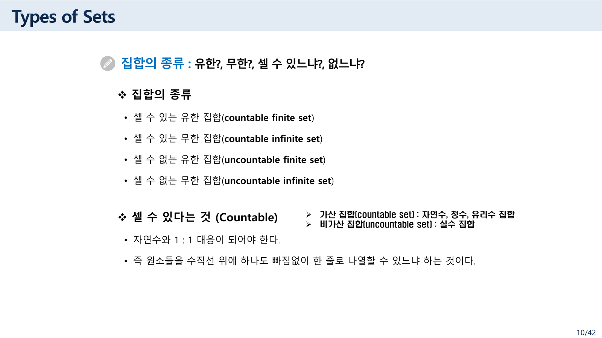
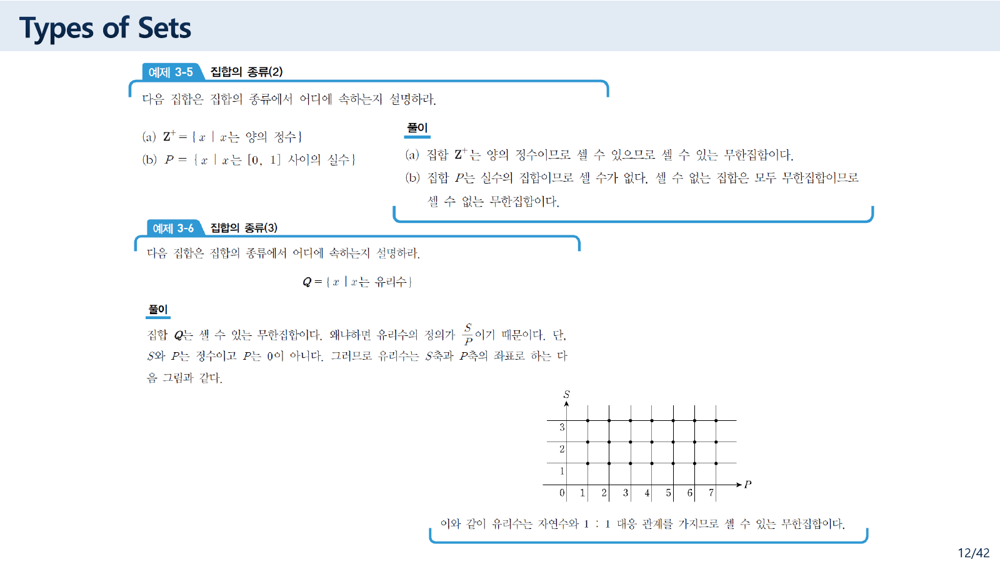
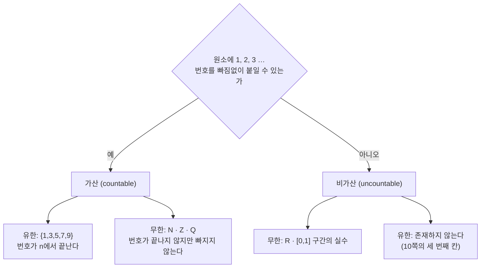
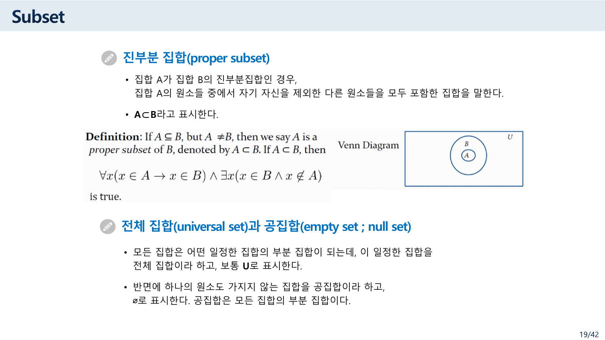
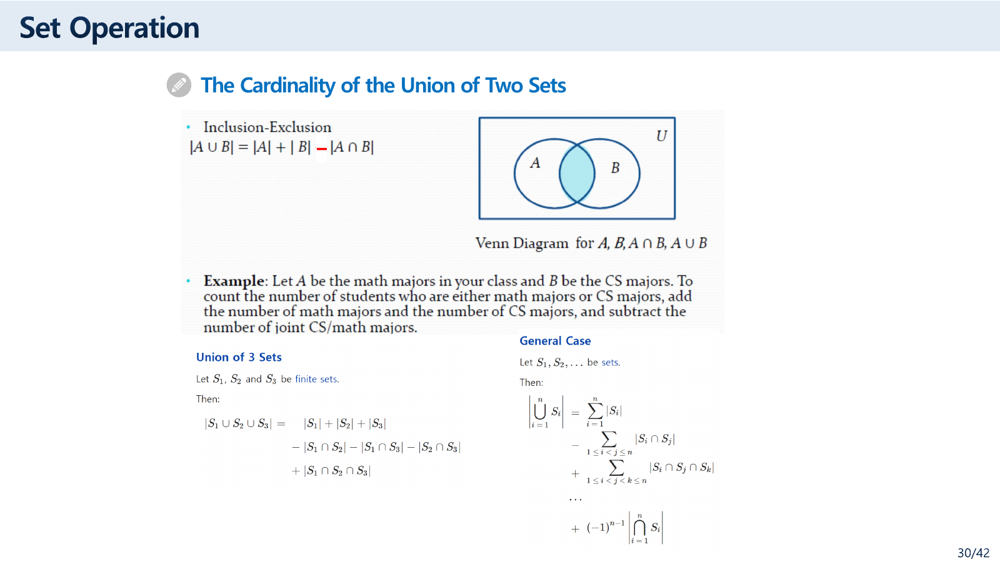

> [!abstract] 표에 칸이 하나 더 있다
> `집합 및 집합연산.pdf` 10쪽은 집합의 종류를 네 개로 나열한다. 유한/무한과 셀 수 있음/없음을 곱한 2 × 2다. 깔끔한 분류처럼 보인다.
>
> 그런데 12쪽 예제 3-5의 풀이가 한 줄을 덧붙인다 — **"셀 수 없는 집합은 모두 무한집합이므로"**. 이 한 줄이 10쪽의 네 칸 중 하나를 지운다. **셀 수 없는 유한 집합은 존재하지 않는다.** 유한하면 원소를 번호대로 다 세면 끝나기 때문이다.
>
> 이 정리는 그 빈 칸에서 출발한다. "셀 수 있다"가 무엇을 뜻하는지, 어떤 무한이 셀 수 있고 어떤 무한이 그렇지 않은지가 이 자료의 첫 절반을 결정하고, 나머지 절반(연산과 대수적 성질)은 그 위에서 **크기를 세는 규칙** — 포함배제의 원리 — 으로 수렴한다.

---

## 1. 지워지는 칸



원본 10쪽을 그대로 옮기면 이렇다.

> ❖ 집합의 종류
> • 셀 수 있는 유한 집합(countable finite set)
> • 셀 수 있는 무한 집합(countable infinite set)
> • **셀 수 없는 유한 집합(uncountable finite set)**
> • 셀 수 없는 무한 집합(uncountable infinite set)
>
> ❖ 셀 수 있다는 것 (Countable)
> • 자연수와 1 : 1 대응이 되어야 한다.
> • 즉 원소들을 수직선 위에 하나도 빠짐없이 한 줄로 나열할 수 있느냐 하는 것이다.
>
> ➢ 가산 집합(countable set) : 자연수, 정수, 유리수 집합
> ➢ 비가산 집합(uncountable set) : 실수 집합

두 쪽 뒤에서 이 표가 무너진다.



> [!caution] 원본 오류 — "셀 수 없는 유한 집합"은 존재할 수 없다
> 12쪽 예제 3-5 (b)의 풀이가 이렇게 적는다.
>
> > 집합 P는 실수의 집합이므로 셀 수가 없다. **셀 수 없는 집합은 모두 무한집합이므로** 셀 수 없는 무한집합이다.
>
> 이 문장이 참이면 10쪽의 세 번째 항목 `uncountable finite set`은 **원소가 하나도 없는 분류**가 된다. 유한 집합은 원소가 n개이므로 1번부터 n번까지 번호를 붙이면 그것이 곧 나열이고, 정의상 셀 수 있다.
>
> 10쪽의 분류는 두 축을 곱해 네 칸을 만들었지만 실제로 채워지는 칸은 셋이다. 두 축이 독립이 아니기 때문이다 — **유한이면 반드시 가산**이므로 "유한 × 비가산"은 비어 있다.
>
> | | 셀 수 있다 | 셀 수 없다 |
> | --- | --- | --- |
> | **유한** | {1, 3, 5, 7, 9} | **존재하지 않는다** |
> | **무한** | Z⁺, N, Z, Q | R |

11쪽은 이 혼동을 스스로 경계하기도 한다.

> • 그런데 가장 많이 혼동하는 개념은 무한집합을 셀 수 없는 집합으로 생각하는 것이다. **무한 집합과 셀 수 없다는 것은 전혀 다른 측도**라는 것만 기억하면 된다.
> • 대천 앞바다의 모래알은 셀 수 있나요? → 당연히 셀 수 있지요. 시간이 조금 걸릴 뿐이죠.

모래알 비유가 정확히 그 지점을 짚는다. "셀 수 있다"는 **끝낼 수 있다**는 뜻이 아니라 **번호를 붙일 수 있다**는 뜻이다. 그렇게 읽으면 유한 집합이 비가산일 수 없다는 것도 즉시 따라 나온다.

12쪽 예제 3-6이 그 반대편을 보여 준다. 유리수 Q는 무한하지만 가산이다. 원본은 유리수를 두 정수의 비로 보고 격자점으로 그린 다음 이렇게 적는다 — **"이와 같이 유리수는 자연수와 1 : 1 대응 관계를 가지므로 셀 수 있는 무한집합이다."**



11쪽은 무한의 정의도 함께 준다 — **"집합 A의 적당한 진부분 집합 S가 존재해서, A와 S 사이에 일대일 대응이 존재하면 A를 무한집합"**. 짝수 집합이 자연수 전체와 일대일 대응한다는 사실이 그 예다. 유한 집합에서는 이런 일이 절대 일어나지 않는다.

---

## 2. 부분집합과 진부분집합 — 정의가 두 번 나온다

이 자료는 진부분집합을 두 곳에서 정의하는데, 두 정의가 같지 않다.

### 11쪽 (아래 각주)

> ➢ 진부분 집합 (proper subset) : 집합 A가 집합 B의 부분집합이지만, 서로 같지 않을 때, 즉 **A ⊂ B이고 A ≠ B**일 때

### 19쪽 (본문)



> 진부분 집합(proper subset)
> • 집합 A가 집합 B의 진부분집합인 경우, **집합 A의 원소들 중에서 자기 자신을 제외한 다른 원소들을 모두 포함한 집합**을 말한다.
> • A ⊂ B라고 표시한다.

두 번째 문장이 문제다.

> [!caution] 원본 오류 — 19쪽의 문장이 정의가 되지 않는다
> 19쪽 문장은 주어와 서술이 맞지 않는다. "집합 A가 B의 진부분집합인 경우"로 시작해 놓고 "**집합 A의** 원소들 중에서"라고 A를 다시 주어로 삼는다. 그리고 "자기 자신을 제외한"이 무엇을 가리키는지가 정해지지 않는다 — 원소를 제외한다는 것인지, 집합 B 자신을 제외한다는 것인지.
>
> 11쪽의 각주가 맞는 정의다. $A \subset B$ 이고 $A \neq B$. 19쪽은 "B의 부분집합 중에서 B 자신을 제외한 것"을 적으려다 주어가 뒤바뀐 것으로 보인다.

같은 쪽이 전체집합과 공집합을 이어서 정의하고, **"공집합은 모든 집합의 부분 집합이다"** 로 마무리한다. 15쪽의 영어 슬라이드가 여기에 조심할 것을 하나 덧붙인다.

> The empty set is different from a set containing the empty set. **∅ ≠ {∅}**

왼쪽은 원소가 0개, 오른쪽은 원소가 1개(그 원소가 공집합)다. 같은 쪽이 "Sets can be elements of sets"라며 `{{1,2,3}, a, {b,c}}`와 `{N, Z, Q, R}`을 예로 든다. 20쪽의 멱집합이 바로 이 성질 위에서 정의된다 — **A의 모든 부분집합을 모은 집합** P(A)는 원소가 집합인 집합이다.

---

## 3. 두 집합이 같다는 것을 증명하는 세 가지 길

36~38쪽이 같은 등식을 **세 번** 증명한다. 등식은 드모르간 법칙이다.

$$\overline{A \cup B} \;=\; \overline{A} \cap \overline{B}$$

| 방법 | 원본 쪽 | 하는 일 |
| --- | --- | --- |
| ① 벤 다이어그램 | 36 | 양변이 칠하는 영역이 같음을 눈으로 확인 |
| ② 서로가 서로의 부분집합 | 37 | 좌 ⊆ 우와 좌 ⊇ 우를 각각 원소 단위로 보인다 |
| ③ 진리표 | 38 | `x ∈ A`, `x ∈ B`를 명제로 두고 진리표로 확인 |

세 방법의 위계가 이 절의 요점이다. ①은 두 집합일 때만 그림이 그려지고 셋을 넘으면 벤 다이어그램이 복잡해진다. ②는 개수 제한이 없지만 사람이 문장을 써야 한다. ③은 **[02. 기호가 말과 어긋나는 자리](<./02. 기호가 말과 어긋나는 자리.md>)의 진리표를 그대로 재사용**한다 — 원소 하나를 잡고 "A에 속하는가"를 명제 변수로 두면, 집합의 등식이 논리식의 동치로 바뀐다.

아래에서 세 방법을 나란히 확인해 보자. 원소가 어느 칸에 있느냐(네 가지 경우)가 진리표의 네 행에 그대로 대응한다.

```html preview h=640px
<div id="dm-root">
  <style>
    #dm-root{font-family:system-ui,-apple-system,"Segoe UI",sans-serif;color:var(--foreground);
      background:var(--card);border:1px solid var(--border);border-radius:10px;padding:16px}
    #dm-root h4{margin:0 0 4px;font-size:14px}
    #dm-root .sub{font-size:12px;opacity:.72;margin-bottom:12px;line-height:1.55}
    #dm-root .pick{display:flex;gap:6px;flex-wrap:wrap;margin-bottom:12px}
    #dm-root button{font:inherit;font-size:12px;padding:4px 9px;border-radius:6px;cursor:pointer;
      border:1px solid var(--border);background:transparent;color:var(--foreground)}
    #dm-root button.on{border-color:var(--chart-1);color:var(--chart-1)}
    #dm-root .row{display:flex;gap:18px;flex-wrap:wrap;align-items:flex-start}
    #dm-root svg{width:330px;height:200px;border:1px solid var(--border);border-radius:8px}
    #dm-root table{border-collapse:collapse;font-size:12.5px;flex:1;min-width:280px}
    #dm-root th,#dm-root td{border:1px solid var(--border);padding:4px 7px;text-align:center;
      font-family:ui-monospace,SFMono-Regular,Menlo,monospace}
    #dm-root th{font-family:inherit;font-size:11px;font-weight:600;opacity:.85}
    #dm-root td.y{color:var(--chart-1);font-weight:700}
    #dm-root .eq{margin-top:12px;font-size:13px;font-family:ui-monospace,SFMono-Regular,Menlo,monospace}
    #dm-root .verdict{margin-top:10px;font-size:12.5px;line-height:1.6;
      border-top:1px dashed var(--border);padding-top:10px}
  </style>
  <h4>집합의 등식을 진리표로 — 원본 36~38쪽의 세 번째 방법</h4>
  <div class="sub">벤 다이어그램에서 <b>강조된 영역</b>이 좌변이고, 표의 마지막 두 열이 좌변과 우변이다.
  네 행은 원소가 있을 수 있는 네 자리(A만 · B만 · 둘 다 · 둘 다 아님)에 하나씩 대응한다.</div>
  <div class="pick" id="dm-pick"></div>
  <div class="row">
    <svg id="dm-svg" viewBox="0 0 330 200"></svg>
    <table id="dm-tab"></table>
  </div>
  <div class="eq" id="dm-eq"></div>
  <div class="verdict" id="dm-v"></div>
  <script>
  (function(){
    const L=[
      {t:"드모르간 ①", eq:"(A ∪ B)ᶜ = Aᶜ ∩ Bᶜ",
       lhs:(a,b)=>!(a||b), rhs:(a,b)=>(!a)&&(!b),
       lc:"(A∪B)ᶜ", rc:"Aᶜ ∩ Bᶜ",
       n:"원본 37쪽이 원소 단위로, 38쪽이 진리표로 증명하는 등식이다."},
      {t:"드모르간 ②", eq:"(A ∩ B)ᶜ = Aᶜ ∪ Bᶜ",
       lhs:(a,b)=>!(a&&b), rhs:(a,b)=>(!a)||(!b),
       lc:"(A∩B)ᶜ", rc:"Aᶜ ∪ Bᶜ",
       n:"39쪽 쌍대성(duality)에 의해 ①에서 ∪ 와 ∩ 를 맞바꾼 것이다."},
      {t:"대칭 차집합", eq:"A ⊕ B = (A−B) ∪ (B−A)",
       lhs:(a,b)=>a!==b, rhs:(a,b)=>(a&&!b)||(b&&!a),
       lc:"A ⊕ B", rc:"(A−B)∪(B−A)",
       n:"원본 34쪽의 정의. 배타적 논리합 ⊕ 와 같은 자리다."},
      {t:"흡수법칙", eq:"A ∪ (A ∩ B) = A",
       lhs:(a,b)=>a||(a&&b), rhs:(a,b)=>a,
       lc:"A∪(A∩B)", rc:"A",
       n:"40쪽 대수적 성질 표에 실린 항목."},
      {t:"성립하지 않는 식", eq:"(A ∪ B)ᶜ = Aᶜ ∪ Bᶜ  (틀린 식)",
       lhs:(a,b)=>!(a||b), rhs:(a,b)=>(!a)||(!b),
       lc:"(A∪B)ᶜ", rc:"Aᶜ ∪ Bᶜ",
       n:"∩ 을 ∪ 로 잘못 쓴 경우. 어느 행에서 갈라지는지 확인해 보라."}
    ];
    let cur=0;
    const pick=document.getElementById("dm-pick");
    L.forEach((x,i)=>{
      const b=document.createElement("button"); b.textContent=x.t;
      b.onclick=()=>{cur=i;draw();}; pick.appendChild(b);
    });
    function draw(){
      const e=L[cur];
      [...pick.children].forEach((b,i)=>b.classList.toggle("on",i===cur));
      document.getElementById("dm-eq").textContent=e.eq;
      // 벤 다이어그램: 네 영역을 클립 없이 개별 path로 근사 → 원 두 개 + 채움
      const regions=[
        {k:"onlyA", a:true,  b:false},
        {k:"both",  a:true,  b:true },
        {k:"onlyB", a:false, b:true },
        {k:"none",  a:false, b:false}
      ];
      let fills="";
      regions.forEach(r=>{
        if(!e.lhs(r.a,r.b)) return;
        if(r.k==="none"){
          fills += '<rect x="6" y="6" width="318" height="188" fill="var(--chart-1)" opacity="0.16"/>';
        } else if(r.k==="onlyA"){
          fills += '<circle cx="130" cy="100" r="66" fill="var(--chart-1)" opacity="0.30"/>';
        } else if(r.k==="onlyB"){
          fills += '<circle cx="200" cy="100" r="66" fill="var(--chart-1)" opacity="0.30"/>';
        } else {
          fills += '<circle cx="130" cy="100" r="66" fill="var(--chart-1)" opacity="0.30"/>'+
                   '<circle cx="200" cy="100" r="66" fill="var(--chart-1)" opacity="0.30"/>';
        }
      });
      // both 만 강조해야 하는 경우를 위한 보정: 교집합만일 때는 두 원을 겹쳐 그린 뒤 바깥을 지울 수 없으므로 표기로 보완
      const marks = regions.filter(r=>e.lhs(r.a,r.b)).map(r=>r.k).join(", ");
      document.getElementById("dm-svg").innerHTML =
        '<rect x="6" y="6" width="318" height="188" fill="none" stroke="var(--border)"/>'+
        fills+
        '<circle cx="130" cy="100" r="66" fill="none" stroke="var(--foreground)" stroke-width="1.3" opacity="0.75"/>'+
        '<circle cx="200" cy="100" r="66" fill="none" stroke="var(--foreground)" stroke-width="1.3" opacity="0.75"/>'+
        '<text x="86" y="105" font-size="14" fill="var(--foreground)">A</text>'+
        '<text x="238" y="105" font-size="14" fill="var(--foreground)">B</text>'+
        '<text x="14" y="22" font-size="11" fill="var(--foreground)" opacity="0.7">U</text>'+
        '<text x="14" y="188" font-size="10.5" fill="var(--foreground)" opacity="0.7">좌변이 참인 영역: '+marks+'</text>';
      // 표
      let html="<tr><th>x∈A</th><th>x∈B</th><th>"+e.lc+"</th><th>"+e.rc+"</th><th>같은가</th></tr>";
      let same=true;
      [[true,true],[true,false],[false,true],[false,false]].forEach(([a,b])=>{
        const l=e.lhs(a,b), r=e.rhs(a,b), ok=(l===r);
        if(!ok) same=false;
        html+="<tr><td>"+(a?"T":"F")+"</td><td>"+(b?"T":"F")+"</td>"+
          '<td class="'+(l?"y":"")+'">'+(l?"T":"F")+"</td>"+
          '<td class="'+(r?"y":"")+'">'+(r?"T":"F")+"</td>"+
          "<td>"+(ok?"✓":"✗")+"</td></tr>";
      });
      document.getElementById("dm-tab").innerHTML=html;
      document.getElementById("dm-v").innerHTML =
        (same ? "네 행 모두 좌변과 우변이 같다 → <b>두 집합은 같다</b>."
              : "어긋나는 행이 있다 → <b>두 집합은 같지 않다</b>. 그 행에 해당하는 원소가 반례다.")
        + " " + e.n;
    }
    draw();
  })();
  </script>
</div>
```

37쪽 증명은 원소 단위로 두 방향을 보인다. 텍스트로 옮기면 이렇다(위 첨자 바를 `ᶜ`로 표기했다).

> (1) $x \in (A \cup B)^c$ 라 가정하자. 그러면 $x \notin A \cup B$ 이므로 $x \notin A$ 이고 $x \notin B$ 이다. (왜냐하면 만일 $x \in A$ 혹은 $x \in B$ 라면 $x \in A \cup B$ 이기 때문이다.) 또한 $x \in A^c$ 이고 $x \in B^c$ 이다. 그러므로 $x \in A^c \cap B^c$ 이다.
> (2) $x \in A^c \cap B^c$ 이라 가정하자. 그러면 $x \in A^c$ 이고 $x \in B^c$ 이므로 $x \notin A$ 이고 $x \notin B$ 이다. 또한 $x \notin A \cup B$ 이다. 그러므로 $x \in (A \cup B)^c$ 이다.

두 방향이 대칭이고, 각 줄이 §1의 정의만 쓴다. 39쪽은 여기에 **쌍대성(duality)** 을 덧붙인다 — ∪와 ∩, U와 ∅를 서로 바꾸면 성립하는 등식이 다시 성립하는 등식이 된다. 그래서 위 인터랙티브의 드모르간 ②는 ①을 증명하면 따로 증명할 필요가 없다.

---

## 4. 크기를 세는 규칙

41~44쪽이 이 자료의 도착점이다. 41쪽이 문제를 세운다.

> • 집합 S가 S₁, S₂, …, Sₙ으로 분할되어 있거나 상호 서로소라면, |S| = |S₁| + |S₂| + ⋯ + |Sₙ| 이다.
> • **그러나 일반적으로 집합은 상호 서로소가 아니다.**
> • 즉, 상호 서로소가 아닌 집합 S의 크기를 구하는 것이 포함배제의 원리!

31~33쪽에서 미리 정리해 둔 개념이 여기에 쓰인다. **상호 서로소(mutually disjoint)** 는 어느 둘을 잡아도 교집합이 공집합인 것이고, **분할(partition)** 은 "어떤 집합을 공집합이 아닌 상호 서로소인 부분 집합으로 나누는 것"이다. 분할이면 더하기만 하면 되지만, 겹치면 뺀 다음 다시 더해야 한다.



30쪽이 두 집합·세 집합·일반형을 한 쪽에 모아 놓는다.

$$|A \cup B| = |A| + |B| - |A \cap B|$$

$$|S_1 \cup S_2 \cup S_3| = |S_1|+|S_2|+|S_3| - |S_1 \cap S_2| - |S_1 \cap S_3| - |S_2 \cap S_3| + |S_1 \cap S_2 \cap S_3|$$

42쪽은 세 집합 공식을 두 집합 공식만으로 **유도**해 보인다. `A ∪ B ∪ C = A ∪ (B ∪ C)`로 묶고 두 집합 공식을 두 번 쓴 뒤 분배법칙으로 정리하면 위 식이 나온다.

아래에서 원본 46쪽 Review Questions의 값으로 확인해 보자. 원소를 눌러 A와 B의 소속을 바꾸면 각 항이 즉시 다시 계산된다.

```html preview h=600px
<div id="ie-root">
  <style>
    #ie-root{font-family:system-ui,-apple-system,"Segoe UI",sans-serif;color:var(--foreground);
      background:var(--card);border:1px solid var(--border);border-radius:10px;padding:16px}
    #ie-root h4{margin:0 0 4px;font-size:14px}
    #ie-root .sub{font-size:12px;opacity:.72;margin-bottom:12px;line-height:1.55}
    #ie-root .pick{display:flex;gap:6px;flex-wrap:wrap;margin-bottom:12px}
    #ie-root button{font:inherit;font-size:12px;padding:4px 9px;border-radius:6px;cursor:pointer;
      border:1px solid var(--border);background:transparent;color:var(--foreground)}
    #ie-root .grid{display:flex;gap:5px;flex-wrap:wrap;margin-bottom:14px}
    #ie-root .el{width:44px;text-align:center;padding:6px 0;border-radius:7px;cursor:pointer;
      border:1px solid var(--border);font-family:ui-monospace,SFMono-Regular,Menlo,monospace;font-size:13px;
      user-select:none}
    #ie-root .el small{display:block;font-size:9px;opacity:.7;margin-top:1px;letter-spacing:.5px}
    #ie-root .el.a{border-color:var(--chart-1)}
    #ie-root .el.b{background:var(--border)}
    #ie-root .el.ab{border-color:var(--chart-1);background:var(--border);font-weight:700}
    #ie-root .sets{font-family:ui-monospace,SFMono-Regular,Menlo,monospace;font-size:12.5px;
      line-height:1.9;margin-bottom:12px}
    #ie-root .calc{border:1px solid var(--border);border-radius:8px;padding:11px 13px;
      font-family:ui-monospace,SFMono-Regular,Menlo,monospace;font-size:13px;line-height:1.9}
    #ie-root .calc b{color:var(--chart-1)}
    #ie-root .warn{margin-top:10px;font-size:12.5px;line-height:1.6;opacity:.85}
  </style>
  <h4>포함배제의 원리 — 원본 46쪽 Review Questions의 값으로</h4>
  <div class="sub">칸을 누르면 그 원소의 소속이 <b>없음 → A → A와 B → B → 없음</b> 순으로 바뀐다.
  기본값은 원본 그대로 U = {0…10}, A = {1,2,3,4,5}, B = {4,5,6,7,8} 이다.</div>
  <div class="pick">
    <button id="ie-reset">원본 값으로 되돌리기</button>
    <button id="ie-disj">서로소로 만들기</button>
    <button id="ie-same">A = B 로 만들기</button>
  </div>
  <div class="grid" id="ie-grid"></div>
  <div class="sets" id="ie-sets"></div>
  <div class="calc" id="ie-calc"></div>
  <div class="warn" id="ie-warn"></div>
  <script>
  (function(){
    const U=[0,1,2,3,4,5,6,7,8,9,10];
    let inA=new Set([1,2,3,4,5]), inB=new Set([4,5,6,7,8]);
    function state(x){ return (inA.has(x)?1:0)+(inB.has(x)?2:0); }
    function cycle(x){
      const s=state(x);
      inA.delete(x); inB.delete(x);
      if(s===0){ inA.add(x); }
      else if(s===1){ inA.add(x); inB.add(x); }
      else if(s===3){ inB.add(x); }
      draw();
    }
    function fmt(s){ return "{"+[...s].sort((a,b)=>a-b).join(", ")+"}"; }
    function draw(){
      const g=document.getElementById("ie-grid"); g.innerHTML="";
      U.forEach(x=>{
        const d=document.createElement("div");
        const s=state(x);
        d.className="el"+(s===1?" a":s===2?" b":s===3?" ab":"");
        d.innerHTML=x+"<small>"+(s===0?"—":s===1?"A":s===2?"B":"A·B")+"</small>";
        d.onclick=()=>cycle(x);
        g.appendChild(d);
      });
      const inter=new Set([...inA].filter(x=>inB.has(x)));
      const uni=new Set([...inA,...inB]);
      const compA=U.filter(x=>!inA.has(x));
      document.getElementById("ie-sets").innerHTML =
        "U = "+fmt(new Set(U))+"   |U| = "+U.length+"<br>"+
        "A = "+fmt(inA)+"   |A| = "+inA.size+"<br>"+
        "B = "+fmt(inB)+"   |B| = "+inB.size+"<br>"+
        "A ∪ B = "+fmt(uni)+"     A ∩ B = "+fmt(inter)+"<br>"+
        "Aᶜ = "+fmt(new Set(compA));
      document.getElementById("ie-calc").innerHTML =
        "|A ∪ B| = |A| + |B| − |A ∩ B|<br>"+
        "&nbsp;&nbsp;&nbsp;&nbsp;&nbsp;&nbsp;&nbsp;&nbsp;= "+inA.size+" + "+inB.size+" − "+inter.size+
        " = <b>"+(inA.size+inB.size-inter.size)+"</b><br>"+
        "직접 세면 |A ∪ B| = <b>"+uni.size+"</b>"+
        (uni.size===inA.size+inB.size-inter.size ? "  ✓ 일치" : "  ✗");
      document.getElementById("ie-warn").innerHTML =
        inter.size===0
          ? "지금은 A와 B가 <b>서로소</b>다. 빼는 항이 0이므로 그냥 더하면 된다 — 41쪽이 말한 분할의 경우다."
          : "겹치는 원소가 "+inter.size+"개다. 그냥 더하면 그 "+inter.size+
            "개를 두 번 세게 되므로 한 번 빼야 한다.";
    }
    document.getElementById("ie-reset").onclick=()=>{
      inA=new Set([1,2,3,4,5]); inB=new Set([4,5,6,7,8]); draw(); };
    document.getElementById("ie-disj").onclick=()=>{
      inA=new Set([1,2,3]); inB=new Set([6,7,8]); draw(); };
    document.getElementById("ie-same").onclick=()=>{
      inA=new Set([2,4,6,8]); inB=new Set([2,4,6,8]); draw(); };
    draw();
  })();
  </script>
</div>
```

원본 46쪽이 답을 적어 둔 세 문제가 그대로 재현된다 — `A ∪ B = {1,2,3,4,5,6,7,8}`, `A ∩ B = {4,5}`, `Aᶜ = {0,6,7,8,9,10}`. 포함배제로 계산하면 `5 + 5 − 2 = 8`이고 직접 센 값과 같다.

30쪽이 붙여 둔 예가 이 공식이 왜 필요한지를 한 줄로 말한다.

> Let A be the math majors in your class and B be the CS majors. To count the number of students who are either math majors or CS majors, add the number of math majors and the number of CS majors, and **subtract the number of joint CS/math majors.**

---

## 5. 연산들 — 어디까지가 정의이고 어디부터가 정리인가

28~34쪽이 연산을 차례로 정의한다.

| 연산 | 원본 표기 | 조건제시법 |
| --- | --- | --- |
| 합집합 | A ∪ B | $\{x \mid x \in A \text{ 또는 } x \in B\}$ |
| 교집합 | A ∩ B | $\{x \mid x \in A \text{ 이고 } x \in B\}$ |
| 여집합 | Complement | (29쪽) |
| 차집합 | Difference | (29쪽) |
| 대칭 차집합 | A ⊕ B | $\{x \mid x \in A-B \;\vee\; x \in B-A\}$ |

정의가 전부 **논리 연산자로 적혀 있다**는 점을 놓치지 않는 것이 좋다. 합집합의 정의에 `또는`이, 교집합에 `이고`가, 대칭 차집합에 `∨`가 들어간다. 그래서 §3에서 집합의 등식이 진리표로 증명되는 것이고, 34쪽의 대칭 차집합 기호 `⊕`가 배타적 논리합의 기호와 같은 것도 우연이 아니다.

25쪽이 그 다리를 명시적으로 놓는다 — **Truth Sets of Quantifiers**, 즉 "명제 P(x)가 참이 되는 원소들로 이루어지는 집합". 술어를 주면 집합이 나오고, 집합을 주면 술어가 나온다.

35쪽의 영어 슬라이드가 이 장의 후반부를 요약한다.

> The algebra of sets defines the properties and laws of sets, the set-theoretic operations of union, intersection, and complementation and the relations of set equality and set inclusion. It also provides **systematic procedures for evaluating expressions**, and performing calculations, involving these operations and relations.

이 자료의 뒤쪽 네 장은 그 체계에서 조금 벗어나 있다.

> [!note] 쪽 번호와 내용이 어긋나는 뒷부분
> 이 자료의 쪽 번호는 `n/42` 형식인데 PDF는 46쪽이다. 그래서 뒤쪽 네 장이 **43/42, 44/42, 45/42, 46/42** 로 분모를 넘어간다. 나중에 슬라이드를 덧붙이면서 총쪽수를 고치지 않은 것으로 보인다.
>
> 그중 **45쪽**은 내용도 집합과 무관하다. 제목은 `Algebraic Property of a Set`인데 본문은 "시스템 프로그래머와 응용 프로그래머 비교 설명"이고, 운영체제·컴파일러 개발자와 한글·오피스·포토샵 개발자를 나누는 이야기다. 앞뒤 어느 절과도 이어지지 않는다.

---

## 6. 확인 문제

1. 10쪽의 네 종류 중 실제로 채워지지 않는 칸은 어느 것이고, 그 이유는 무엇인가
2. 12쪽은 유리수 집합 Q가 가산이라고 한다. "무한한데 셀 수 있다"는 말이 모순이 아닌 이유를 11쪽의 무한 정의로 설명하라
3. `∅`와 `{∅}`의 원소 개수는 각각 몇 개인가? `P(∅)`는 무엇인가
4. 19쪽과 11쪽의 진부분집합 정의 중 어느 쪽이 맞는가? 틀린 쪽의 문장이 정의가 되지 못하는 이유는
5. `(A ∪ B)ᶜ = Aᶜ ∪ Bᶜ` 는 성립하지 않는다. 반례가 되는 원소의 자리(A만·B만·둘 다·둘 다 아님 중 하나)를 진리표로 찾아보라
6. |A| = 5, |B| = 5인데 |A ∪ B| = 10이 나왔다. A와 B에 대해 무엇을 알 수 있는가
7. 30쪽의 세 집합 공식에서 마지막 항 `+|S₁ ∩ S₂ ∩ S₃|`의 부호가 `+`인 이유를 벤 다이어그램의 가운데 영역으로 설명하라

---

## 7. 이어지는 자료

- [02. 기호가 말과 어긋나는 자리](<./02. 기호가 말과 어긋나는 자리.md>) — §3의 진리표 증명이 그 문서의 §3을 그대로 쓴다
- [04. 목차에 없는 함수](<./04. 목차에 없는 함수.md>) — 곱집합(23·24쪽)이 관계의 정의로 이어진다
- [01. 같은 물인데 하나는 흐르고 하나는 떨어진다](<./01. 같은 물인데 하나는 흐르고 하나는 떨어진다.md>) — 가산·비가산이 첫 강의의 이산·연속과 어떻게 다른 물음인지

---

## 근거 자료

`ComputerScience/02_math-theory/discrete-mathematics/sources/집합 및 집합연산.pdf` (46쪽).

| 쪽 | 내용 | 이 문서에서 쓴 곳 |
| --- | --- | --- |
| 3 | 미리보기 — 칸토르, 스푸트니크 이후 집합론 | §0 |
| 5~8 | 집합의 정의, 원소나열법·조건제시법, 자주 쓰는 집합 | §1 |
| 9~12 | 집합의 크기, 집합의 종류, 예제 3-5·3-6 | §1 원본 오류 |
| 13~15 | 집합의 상등, 순서 무관, ∅ ≠ {∅} | §2 |
| 16~20 | 부분집합·진부분집합·전체집합·공집합·멱집합 | §2 원본 오류 |
| 21~25 | 튜플, 곱집합, Truth Sets of Quantifiers | §5 |
| 28~30 | 합집합·교집합·여집합·차집합, 합집합의 크기 | §4 · §5 |
| 31~33 | 상호 서로소, 가족 집합, 분할 | §4 |
| 34 | 대칭 차집합 | §5 |
| 35~40 | 집합 대수, 상등 증명 세 방법, 쌍대성 | §3 |
| 41·42 | 포함배제의 원리와 세 집합으로의 확장 | §4 |
| 43~45 | 일반화된 합집합·교집합, (무관한 내용) | §5 |
| 46 | Review Questions | §4 인터랙티브 |

인용한 슬라이드 4장은 위 PDF 10·12·19·30쪽을 120dpi로 렌더링한 것이다. 인터랙티브의 기본값(U = {0…10}, A = {1,2,3,4,5}, B = {4,5,6,7,8})과 답(A ∪ B, A ∩ B, Aᶜ)은 원본 46쪽에 적힌 값 그대로이고, 진리표는 네 행을 직접 계산해 대조했다. 4쪽과 27쪽은 텍스트가 0자인 표지 슬라이드다.
