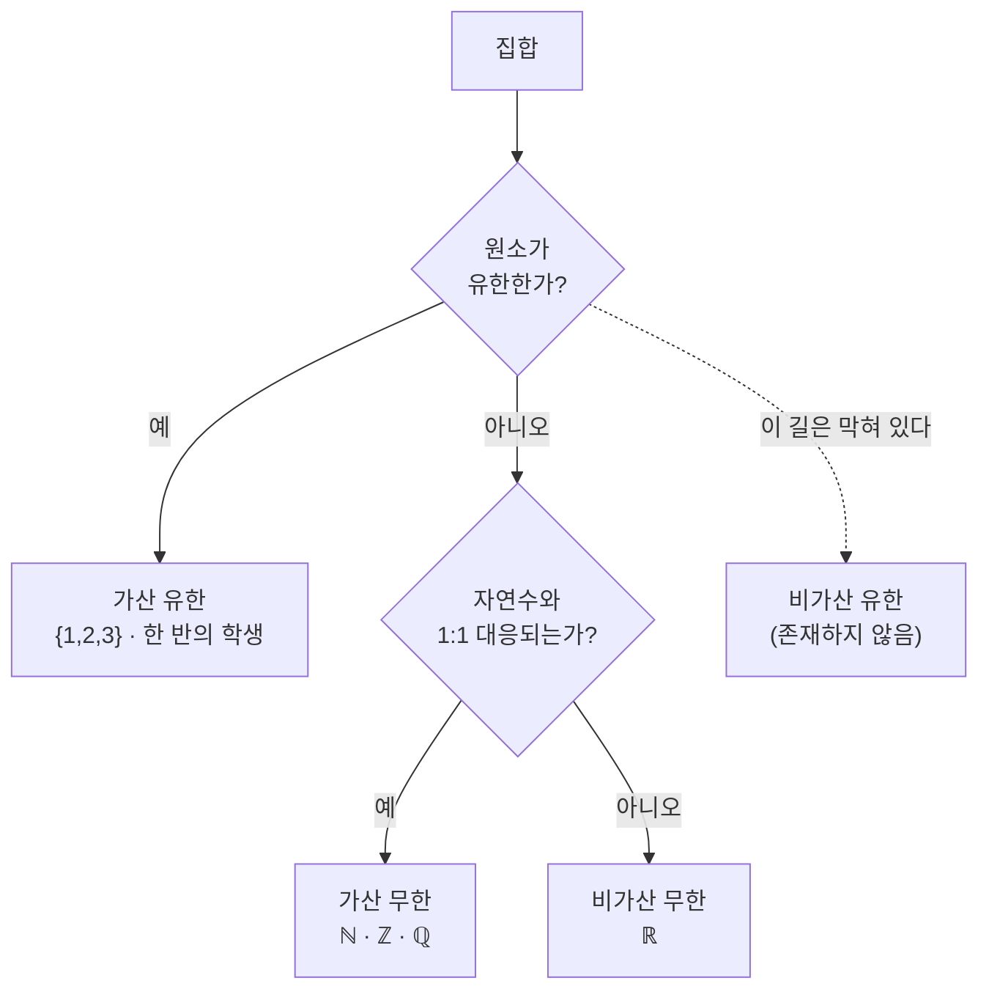
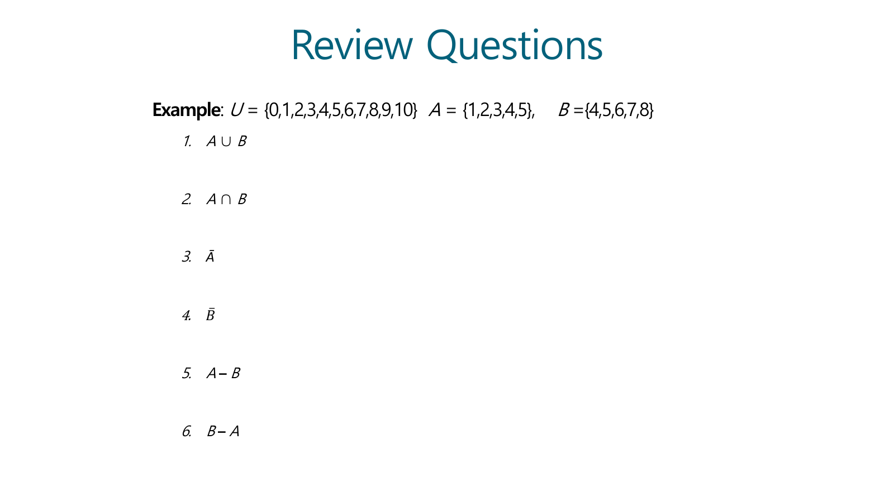
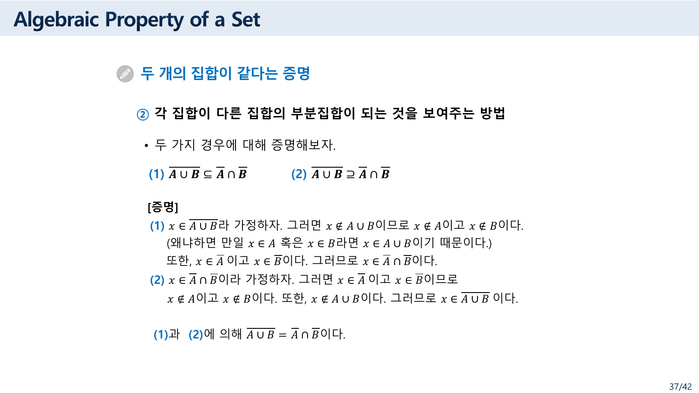
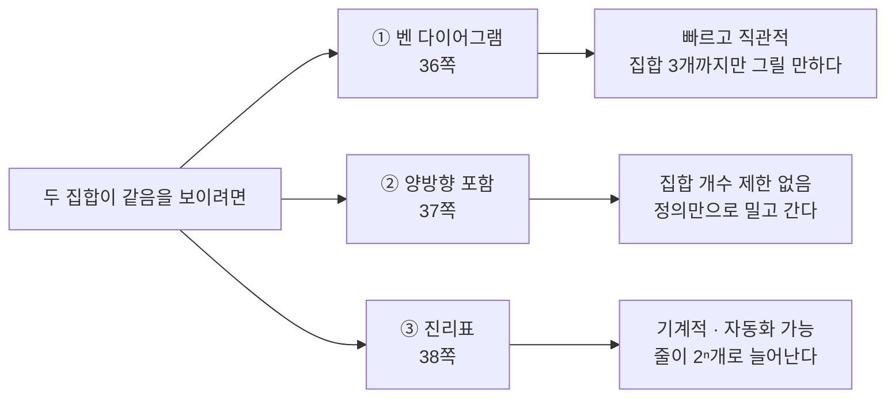
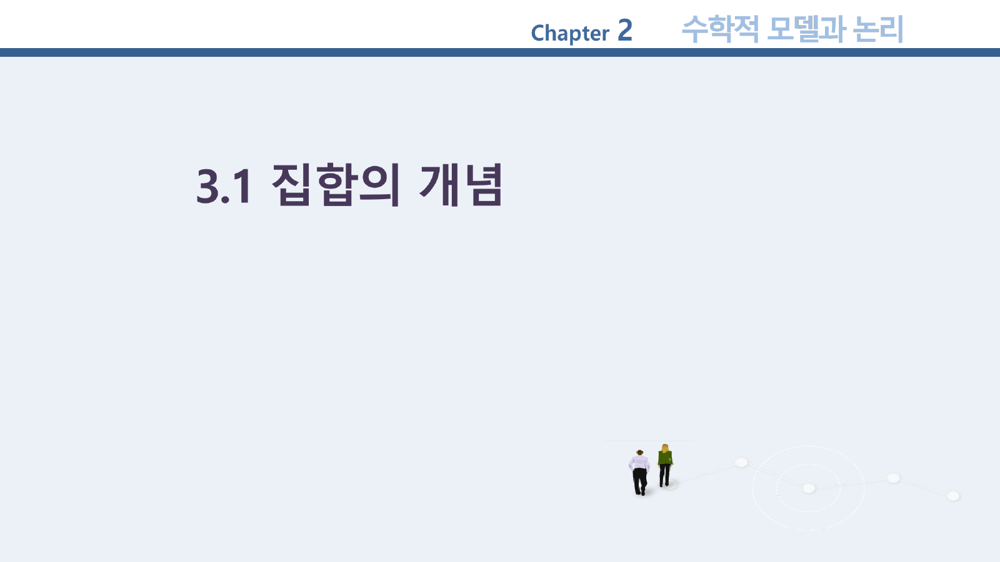
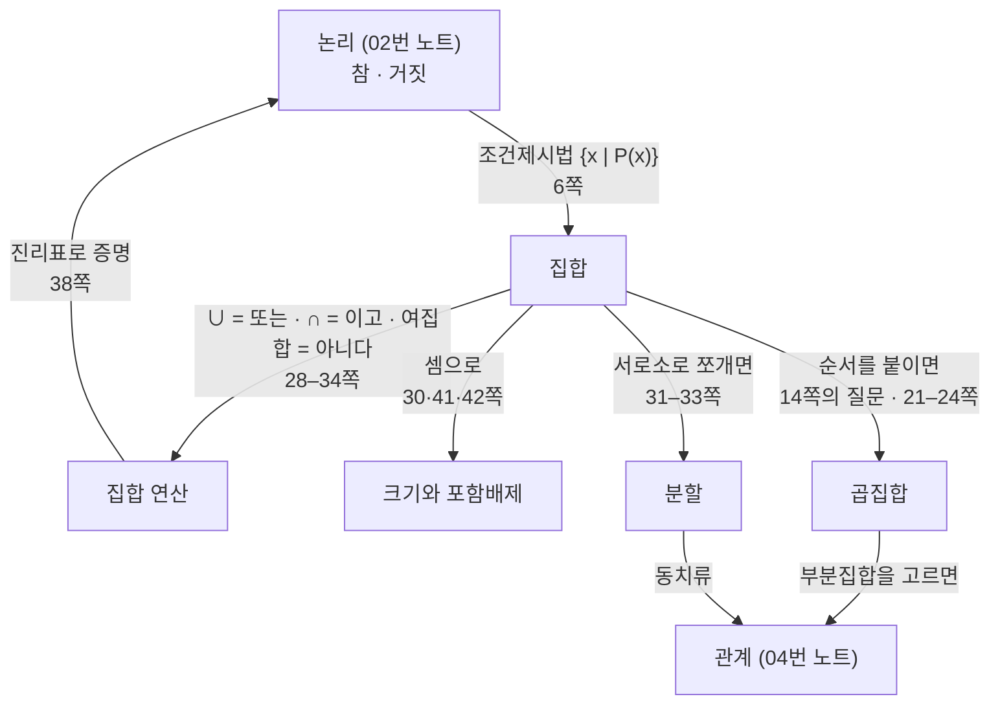

> [!abstract] 이 46쪽이 실제로 하는 말
> 집합은 이 과목에서 처음으로 **두 계열의 자료가 정면으로 부딪히는** 자리다. 한국어 교재 슬라이드가 개념을 풀어 쓰고, 그 아래에 Rosen 교재의 영문 정의 상자가 스크린샷으로 붙는다. 대부분의 쪽에서는 두 계열이 같은 말을 두 번 하지만, **19쪽에서는 서로 다른 말을 한다.**
>
> 그 쪽의 한국어 문장은 진부분집합을 이렇게 정의한다 — *“집합 A의 원소들 중에서 자기 자신을 제외한 다른 원소들을 모두 포함한 집합.”* 바로 아래 영문 상자는 이렇게 정의한다 — *“If A ⊆ B, but A ≠ B, then we say A is a proper subset of B.”* 두 번째 것이 맞고, 첫 번째 것은 문장이 성립하지 않는다. 게다가 **같은 자료 11쪽에는 올바른 한국어 정의가 이미 적혀 있다.**
>
> 이 정리문서는 그 어긋남을 실마리 삼는다. 집합론은 정의가 짧아서 오히려 한 단어가 흔들리면 전부가 흔들린다 — 10쪽에서는 **존재할 수 없는 종류**가 목록에 들어가고, 34쪽에서는 괄호 하나가 짝을 잃는다. 반대로 37쪽의 드모르간 증명은 한 줄도 흐트러짐 없이 정확하다. 두 얼굴을 함께 본다.

---

## 1. 집합이라는 그릇 — 두 가지 적는 법

3쪽이 집합을 *“공통적인 성질을 가진 객체들의 모임”* 이라 소개하고, 곧바로 역사를 붙인다.

> 집합이란 개념은 19세기 말에 독일의 수학자 칸토르(Georg Cantor)에 의해 최초로 제안되었다. 이러한 집합론이 주목받기 시작한 것은 **1957년 소련이 미국보다 먼저 최초의 인공위성인 스푸트니크(Sputnik) 1호를 발사하면서부터**이다. 이 사건 이후 미국에서 과학 및 수학 교육의 혁신을 위해 집합론이 대두되었다.

수학 개념이 **교육 정책의 결과로 교과서에 들어왔다**는 이야기다. 그리고 마지막 줄이 이 강의가 집합을 다루는 이유를 적는다 — *“처리 대상이 되는 자료를 집합으로 명확하게 표현하면 컴퓨터가 자료를 처리하기에 편리하기 때문이다.”*

6쪽이 집합을 적는 두 가지 방법을 준다.

| 방법 | 원본 표기 | 예 |
| --- | --- | --- |
| 원소나열법 (Roster Method) | 원소를 그대로 나열 | `S = {1, 3, 5, 7, 9}` |
| 조건제시법 (set builder notation) | 공통 성질을 기술 | `A = {x｜P(x)}`, 단 P(x)는 **명제** |

두 번째 줄이 [02. 논리](<./02. 논리 — 진리표를 그리기 전에 괄호부터 정한다.md>)와 직접 이어진다. 조건제시법의 조건은 아무 문장이 아니라 **명제**여야 한다 — 참·거짓이 정해지는 문장이어야 한다. `{x | x는 큰 수}` 는 집합이 아니고 `{x | x > 100}` 은 집합인 이유가 그것이다.

7·8쪽이 자주 쓰는 집합을 이름 붙인다. 두 계열이 나란히 나오는데, **목록이 조금 다르다.**

| 기호 | 7쪽 (한국어) | 8쪽 (Rosen) |
| --- | --- | --- |
| `Z⁺` | 양의 정수 | positive integers |
| `N` | **양의 정수 또는 0** | natural numbers = {0,1,2,3,…} |
| `Z` | 정수 | integers |
| `R` | 실수 | real numbers |
| `R⁺` | (없음) | **positive real numbers** |
| `Q` | 유리수 | rational numbers |
| `C` | 복소수 | complex numbers |

`N`에 0을 포함시키는 관습을 두 계열이 함께 따르고 있어 다행이다(0을 빼는 교과서도 많다). 8쪽에만 `R⁺` 가 추가되어 있다.

15쪽(Rosen 계열)이 초보자가 가장 자주 틀리는 두 가지를 한 장에 못 박는다.

> Sets can be elements of sets. `{{1,2,3}, a, {b,c}}` · `{N, Z, Q, R}`
> The empty set is different from a set containing the empty set. **`∅ ≠ {∅}`**

두 번째 줄이 중요하다. `∅`는 원소가 **0개**인 집합이고 `{∅}`는 원소가 **1개**(그 원소가 공집합)인 집합이다. 크기가 다르므로 같을 수 없다.

14쪽이 또 하나의 기본을 확인시킨다 — *“집합의 원소들은 순서에 상관없다. 즉, 집합의 원소들은 순서를 갖지 않는다.”* 그리고 오른쪽 여백에 손글씨처럼 질문 하나가 붙어 있다: **“집합의 원소들이 순서를 가진다면?”** 그 답이 다음 노트의 첫 절, **순서쌍과 곱집합**이다([04. 관계 ①](<./04. 관계 ① — 제목의 절반이 앞머리 열여섯 장에서 끝난다.md>) §2).

---

## 2. 10쪽 — 목록에 없는 칸이 하나 있어야 한다


> 원본 10쪽. 제목은 `Types of Sets`, 부제는 *“집합의 종류 : 유한?, 무한?, 셀 수 있느냐?, 없느냐?”* 다.

원본이 나열한 네 종류는 이렇다.

- 셀 수 있는 유한 집합 (countable finite set)
- 셀 수 있는 무한 집합 (countable infinite set)
- **셀 수 없는 유한 집합 (uncountable finite set)**
- 셀 수 없는 무한 집합 (uncountable infinite set)

그리고 오른쪽에 예를 붙인다 — *가산 집합(countable set): 자연수, 정수, 유리수 집합 / 비가산 집합(uncountable set): 실수 집합.*

“셀 수 있다”의 뜻도 정확히 적혀 있다 — *“자연수와 1 : 1 대응이 되어야 한다. 즉 원소들을 수직선 위에 하나도 빠짐없이 한 줄로 나열할 수 있느냐 하는 것이다.”*

> [!warning] 원본 오류 ① — “셀 수 없는 유한 집합”은 존재하지 않는다
> 유한집합은 원소가 $n$개이므로 $\{1, 2, \dots, n\}$ 과 1:1 대응된다. 자연수의 **부분집합**과 대응되면 그것이 곧 가산이다. 즉 **모든 유한집합은 자동으로 셀 수 있다.** 세 번째 항목에 해당하는 집합은 하나도 없다.
>
> 원본이 네 항목을 나열한 것은 “유한/무한”과 “가산/비가산”을 **독립된 두 축**으로 놓고 조합했기 때문인데, 두 축은 독립이 아니다. `유한 ⟹ 가산` 이라는 한 방향 함의가 걸려 있어 네 칸 중 한 칸이 비게 된다.
>
> 원본이 잘못 놓은 축을 바로잡으면 다음 세 칸이 된다.
>
> | | 유한 | 무한 |
> | --- | --- | --- |
> | **가산** | {1,2,3} · 한 반의 학생 | ℕ, ℤ, ℚ |
> | **비가산** | **존재하지 않는다** | ℝ, ℝ의 구간, 멱집합 $\mathcal{P}(\mathbb{N})$ |

11쪽이 바로 다음에 오는 경고와 나란히 읽으면 이 오류가 더 뚜렷해진다.

> 그런데 가장 많이 혼동하는 개념은 **무한집합을 셀 수 없는 집합으로 생각하는 것**이다. 무한 집합과 셀 수 없다는 것은 **전혀 다른 측도**라는 것만 기억하면 된다.

“전혀 다른 측도”는 정확한 경고다 — 무한집합 중에도 셀 수 있는 것(ℕ, ℚ)과 없는 것(ℝ)이 있다. 다만 **반대 방향으로는 다른 측도가 아니다.** 유한이면 반드시 가산이다. 11쪽이 한 방향의 독립성을 강조하다가 10쪽에서 양방향 독립으로 미끄러졌다.

같은 11쪽이 무한집합의 정의를 데데킨트 방식으로 준다 — *“집합 A의 적당한 진부분 집합(proper subset) S가 존재해서, A와 S 사이에 일대일 대응이 존재하면 A를 무한집합이라고 한다.”* 유한집합에서는 절대 일어날 수 없는 일이 무한집합에서는 일어난다는 뜻이고, 짝수 전체가 자연수 전체와 같은 크기라는 유명한 사실이 여기서 나온다.

그리고 이 무거운 정의 바로 아래에 한 줄이 붙는다.

> 대천 앞바다의 모래알은 셀 수 있나요? → **당연히 셀 수 있지요. 시간이 조금 걸릴 뿐이죠.**

“셀 수 있다”가 “세는 데 시간이 얼마나 걸리는가”와 무관하다는 것을 한 문장으로 못 박는다.



---

## 3. 19쪽 — 같은 슬라이드가 두 번 다른 말을 한다


> 원본 19쪽. 위쪽 두 줄이 한국어 정의, 그 아래 회색 상자가 Rosen 교재에서 캡처한 영문 정의와 벤 다이어그램, 그리고 아래쪽이 전체 집합과 공집합의 정의다.

같은 화면에 실린 두 정의를 나란히 옮긴다.

| | 원본에 적힌 것 |
| --- | --- |
| **한국어 (위)** | 집합 A가 집합 B의 진부분집합인 경우, **집합 A의 원소들 중에서 자기 자신을 제외한 다른 원소들을 모두 포함한 집합**을 말한다. |
| **영문 상자 (아래)** | If $A \subseteq B$, but $A \ne B$, then we say $A$ is a *proper subset* of $B$, denoted by $A \subset B$. If $A \subset B$, then $\forall x(x \in A \to x \in B) \land \exists x(x \in B \land x \notin A)$ is true. |

> [!warning] 원본 오류 ② — 19쪽 한국어 정의가 성립하지 않는다
> 한국어 문장은 주어가 A인데 서술은 “A의 원소들 중에서 … 포함한 **집합**”으로 끝나 무엇을 정의하는지 닫히지 않는다. 게다가 “자기 자신을 제외한”은 **원소** 이야기인지 **집합** 이야기인지도 불분명하다. 어느 쪽으로 읽어도 진부분집합의 뜻이 나오지 않는다.
>
> 바로 아래 영문 상자가 정확한 정의를 준다 — **A ⊆ B 이고 A ≠ B.** 술어 논리로 적힌 두 번째 줄이 특히 좋다. 앞의 연언지 `∀x(x∈A → x∈B)` 가 “부분집합”이고, 뒤의 연언지 `∃x(x∈B ∧ x∉A)` 가 “**같지는 않다**”를 존재 한정자로 표현한다 — B에는 있고 A에는 없는 원소가 **적어도 하나** 있다는 뜻이다.
>
> 결정적으로, **같은 자료 11쪽에 올바른 한국어 정의가 이미 있다.**
>
> > 진부분 집합 (proper subset) : 집합 A가 집합 B의 부분집합이지만, 서로 같지 않을 때, 즉 **A⊂B이고 A≠B**일 때
>
> 11쪽과 19쪽이 같은 용어를 두 번 정의하는데, 앞의 것이 맞고 뒤의 것이 무너졌다.

같은 쪽 아래쪽에 전체 집합과 공집합이 정의된다.

- **전체 집합(universal set)** — “모든 집합은 어떤 일정한 집합의 부분 집합이 되는데, 이 일정한 집합”. 보통 `U`.
- **공집합(empty set; null set)** — “하나의 원소도 가지지 않는 집합”. `∅`. 그리고 **“공집합은 모든 집합의 부분 집합이다.”**

마지막 줄이 자주 되묻게 되는 자리다. 왜 공집합이 모든 집합의 부분집합인가? `∅ ⊆ A` 는 `∀x(x ∈ ∅ → x ∈ A)` 이고, 전건 `x ∈ ∅` 는 **어떤 x에 대해서도 거짓**이다. [02. 논리](<./02. 논리 — 진리표를 그리기 전에 괄호부터 정한다.md>) §2에서 본 대로 전건이 거짓이면 함축은 참이므로, 이 명제는 A가 무엇이든 참이다. 64쪽이 이름 붙인 **vacuous proof**의 교과서적 사례다.

20쪽이 멱집합을 정의한다 — *“A가 집합이라 할 때, A의 모든 부분 집합을 모은 집합을 A의 멱집합이라 하고, P(A)로 표시한다.”* 원소가 $n$개면 각 원소를 넣거나 빼는 선택이 독립이므로 $|\mathcal{P}(A)| = 2^n$ 이다.

21·22쪽이 튜플을, 23·24쪽이 곱집합(Cartesian product)을 소개한다. 데카르트(René Descartes, 1596–1650)의 이름이 붙는 자리이고, 이 개념이 다음 노트 전체의 출발점이 된다.

25쪽이 이 절과 [02. 논리](<./02. 논리 — 진리표를 그리기 전에 괄호부터 정한다.md>) §6을 잇는다 — **Truth Sets of Quantifiers**, 곧 *“명제 P(x)가 참이 되는 원소들로 이루어지는 집합.”* 술어와 집합이 같은 것의 두 얼굴임을 보이는 대목이다.

---

## 4. 연산 — 원소를 조합해 새 집합을 만든다

28쪽이 연산을 *“주어진 집합들의 원소를 조합함으로써 새로운 집합을 만드는 것”* 이라 정의한 뒤, 28–34쪽이 다섯 가지를 차례로 준다.

| 연산 | 기호 | 원본의 정의 |
| --- | --- | --- |
| 합집합 | `A∪B` | `{x｜x∈A 또는 x∈B}` |
| 교집합 | `A∩B` | `{x｜x∈A 이고 x∈B}` |
| 여집합 | `Ā` | (29쪽, `Complement`) |
| 차집합 | `A−B` | (29쪽, `Difference`) |
| 대칭 차집합 | `A⊕B` | `{x｜(x∈A이고 x∉B) 또는 (x∈B이고 x∉A)}` |

각 정의의 오른쪽 항이 전부 **논리 연산자**로 되어 있다는 점에 주목할 만하다. 합집합은 `또는`, 교집합은 `이고`, 여집합은 `아니다`. 집합 연산은 **논리 연산을 원소 하나하나에 적용한 것**이고, 그래서 §5에서 진리표로 집합 등식을 증명할 수 있게 된다. 34쪽이 대칭 차집합에 `⊕` 를 쓰는 것도 배타적 논리합과 같은 기호다.

46쪽이 이 연산들을 구체적인 수로 확인시킨다.



> 원본 46쪽. `U = {0,1,2,3,4,5,6,7,8,9,10}`, `A = {1,2,3,4,5}`, `B = {4,5,6,7,8}` 에 대해 여섯 문제와 답이 붙어 있다.

원본의 여섯 답을 전부 검산했고, **모두 정확하다.**

| # | 식 | 원본의 답 | 검산 |
| --- | --- | --- | --- |
| 1 | `A ∪ B` | `{1,2,3,4,5,6,7,8}` | ✅ |
| 2 | `A ∩ B` | `{4,5}` | ✅ |
| 3 | `Ā` | `{0,6,7,8,9,10}` | ✅ `U − A` |
| 4 | `B̄` | `{0,1,2,3,9,10}` | ✅ `U − B` |
| 5 | `A − B` | `{1,2,3}` | ✅ |
| 6 | `B − A` | `{6,7,8}` | ✅ |

5번과 6번이 짝을 이루는 것이 좋다. `A−B ≠ B−A` 이므로 차집합은 **교환법칙이 성립하지 않는다.** 그리고 두 답의 합집합 `{1,2,3,6,7,8}` 이 곧 대칭 차집합 `A⊕B` 다 — 34쪽의 정의가 그대로 계산되는 자리다.

아래 도구로 원본의 `U`, `A`, `B` 위에서 모든 연산을 직접 확인할 수 있다. 원소를 눌러 A와 B의 구성을 바꾸면 여섯 답이 함께 움직인다.

```html preview h=620px
<div style="font-family:system-ui,-apple-system,sans-serif;padding:20px;color:var(--foreground)">
  <div style="font-size:13px;color:var(--muted-foreground);margin-bottom:10px">
    U = {0 … 10}. 각 원소를 눌러 <b style="color:var(--chart-1)">A</b>·<b style="color:var(--chart-2)">B</b> 소속을 바꾼다.
    (한 번 누르면 A, 두 번 누르면 A∩B, 세 번 누르면 B, 네 번 누르면 어느 쪽도 아님)
  </div>
  <div id="setcells" style="display:flex;gap:6px;flex-wrap:wrap;margin-bottom:12px"></div>
  <button id="setreset" style="padding:6px 12px;font-size:12px;border:1px solid var(--border);border-radius:var(--radius);
    background:var(--card);color:var(--foreground);cursor:pointer;margin-bottom:16px">원본 46쪽 값으로 되돌리기</button>

  <svg id="venn" viewBox="0 0 480 230" width="100%" style="max-width:520px" role="img" aria-label="A와 B의 벤 다이어그램"></svg>
  <div id="setrows" style="margin-top:12px"></div>

  <script>
    var U = [0,1,2,3,4,5,6,7,8,9,10];
    var A0 = [1,2,3,4,5], B0 = [4,5,6,7,8];
    var st = {};                               // 0=없음 1=A 2=A∩B 3=B
    function reset() {
      U.forEach(function (n) {
        var a = A0.indexOf(n) >= 0, b = B0.indexOf(n) >= 0;
        st[n] = a && b ? 2 : a ? 1 : b ? 3 : 0;
      });
      draw();
    }
    document.getElementById('setreset').onclick = reset;

    function inA(n) { return st[n] === 1 || st[n] === 2; }
    function inB(n) { return st[n] === 3 || st[n] === 2; }
    function fmt(a) { return '{' + a.join(', ') + '}'; }

    function draw() {
      document.getElementById('setcells').innerHTML = U.map(function (n) {
        var s = st[n];
        var bg = s === 1 ? 'var(--chart-1)' : s === 3 ? 'var(--chart-2)' : s === 2 ? 'var(--chart-4)' : 'var(--card)';
        var fg = s === 0 ? 'var(--muted-foreground)' : 'var(--background)';
        return '<button data-n="' + n + '" class="setc" style="width:42px;height:42px;font-size:16px;font-weight:700;' +
          'border:1px solid var(--border);border-radius:var(--radius);background:' + bg + ';color:' + fg + ';cursor:pointer">' + n + '</button>';
      }).join('');
      Array.prototype.forEach.call(document.querySelectorAll('.setc'), function (b) {
        b.onclick = function () { var n = +b.dataset.n; st[n] = (st[n] + 1) % 4; draw(); };
      });

      var A = U.filter(inA), B = U.filter(inB);
      var onlyA = U.filter(function (n) { return inA(n) && !inB(n); });
      var both = U.filter(function (n) { return inA(n) && inB(n); });
      var onlyB = U.filter(function (n) { return inB(n) && !inA(n); });
      var none = U.filter(function (n) { return !inA(n) && !inB(n); });

      function txt(list, cx, cy) {
        return list.map(function (n, i) {
          return '<text x="' + (cx + ((i % 3) - 1) * 20) + '" y="' + (cy + Math.floor(i / 3) * 19) +
            '" text-anchor="middle" font-size="13" font-weight="600" fill="var(--foreground)">' + n + '</text>';
        }).join('');
      }
      document.getElementById('venn').innerHTML =
        '<rect x="6" y="6" width="468" height="218" rx="6" fill="none" stroke="var(--border)"/>' +
        '<text x="16" y="24" font-size="12" fill="var(--muted-foreground)">U</text>' +
        '<circle cx="185" cy="118" r="82" fill="var(--chart-1)" fill-opacity="0.18" stroke="var(--chart-1)" stroke-width="1.6"/>' +
        '<circle cx="295" cy="118" r="82" fill="var(--chart-2)" fill-opacity="0.18" stroke="var(--chart-2)" stroke-width="1.6"/>' +
        '<text x="128" y="52" font-size="14" font-weight="700" fill="var(--chart-1)">A</text>' +
        '<text x="352" y="52" font-size="14" font-weight="700" fill="var(--chart-2)">B</text>' +
        txt(onlyA, 148, 108) + txt(both, 240, 108) + txt(onlyB, 332, 108) + txt(none, 440, 200);

      var rows = [
        ['A', A], ['B', B],
        ['A ∪ B', U.filter(function (n) { return inA(n) || inB(n); })],
        ['A ∩ B', both],
        ['Ā', U.filter(function (n) { return !inA(n); })],
        ['B̄', U.filter(function (n) { return !inB(n); })],
        ['A − B', onlyA],
        ['B − A', onlyB],
        ['A ⊕ B', onlyA.concat(onlyB).sort(function (x, y) { return x - y; })],
        ['|A| + |B| − |A∩B|', [A.length + B.length - both.length]]
      ];
      document.getElementById('setrows').innerHTML =
        '<table style="border-collapse:collapse;font-size:13.5px;width:100%">' +
        rows.map(function (r, i) {
          var last = i === rows.length - 1;
          return '<tr style="border-bottom:1px solid var(--border)">' +
            '<td style="padding:5px 10px;font-family:ui-monospace,Menlo,monospace;color:var(--muted-foreground);white-space:nowrap">' + r[0] + '</td>' +
            '<td style="padding:5px 10px;font-family:ui-monospace,Menlo,monospace">' +
            (last ? '<b style="color:var(--chart-1)">' + r[1][0] + '</b> <span style="color:var(--muted-foreground)">= |A∪B| = ' +
              U.filter(function (n) { return inA(n) || inB(n); }).length + '</span>' : fmt(r[1])) + '</td></tr>';
        }).join('') + '</table>';
    }
    reset();
  </script>
</div>
```

마지막 줄이 30쪽의 내용이다 — **두 집합 합집합의 크기.** 어떤 원소 배치에서도 $|A| + |B| - |A \cap B| = |A \cup B|$ 가 성립한다. 교집합을 두 번 세었으니 한 번 빼 준다는 것이고, 이것이 §6의 포함배제 원리의 가장 작은 경우다.

31–33쪽이 집합을 셋 이상으로 확장한다. **상호 서로소(mutually disjoint)**, **가족 집합(family set)** — *“공집합이 아닌 두 개 이상의 집합들의 모임”* — 그리고 **분할(partition)** 이다. 32쪽이 분할을 한 줄로 요약한다.

> 분할이란 어떤 집합을 **공집합이 아닌 상호 서로소인 부분 집합**으로 나누는 것

33쪽에 “7개의 블록으로 구성된 분할”이 그려져 있다. 이 개념이 [04. 관계 ①](<./04. 관계 ① — 제목의 절반이 앞머리 열여섯 장에서 끝난다.md>)의 **동치류**에서 정확히 되살아난다 — 동치 관계는 집합을 분할하고, 분할은 동치 관계를 만든다.

> [!note] 34쪽의 괄호가 짝을 잃었다
> 대칭 차집합의 정의가 원본에 이렇게 적혀 있다.
>
> ```text
> A⊕B ＝ {𝒙｜𝒙 ∈A이고 𝒙 ∉ B) 또는 (𝒙 ∈ B이고 𝒙 ∉ A)}
> ```
>
> `𝒙 ∈A` 앞의 여는 괄호가 빠졌다. 뒤쪽 절은 `(…)` 로 제대로 묶여 있으므로 앞쪽도 `(𝒙 ∈A이고 𝒙 ∉ B)` 여야 짝이 맞는다. 바로 아랫줄의 두 번째 표현 `{𝒙｜𝒙 ∈ A−B ∨ 𝒙 ∈ B−A}` 는 정확하다.

---

## 5. 두 집합이 같음을 보이는 세 가지 방법

36쪽이 방법 셋을 나열하고, 세 방법 모두 **같은 명제** 하나를 증명한다 — 드모르간 법칙 $\overline{A \cup B} = \bar{A} \cap \bar{B}$.

1. 벤 다이어그램을 이용하는 방법 (36쪽)
2. 각 집합이 다른 집합의 부분집합이 되는 것을 보여 주는 방법 (37쪽)
3. 진리표를 이용하는 방법 (38쪽)

### ② 양방향 포함으로



> 원본 37쪽. (1) $\overline{A \cup B} \subseteq \bar{A} \cap \bar{B}$ 와 (2) $\overline{A \cup B} \supseteq \bar{A} \cap \bar{B}$ 를 각각 증명하고, 둘로부터 등식을 얻는다.

원본의 두 문단을 옮기면 이렇다.

**(1)** $x \in \overline{A \cup B}$ 라 가정하자. 그러면 $x \notin A \cup B$ 이므로 $x \notin A$ 이고 $x \notin B$ 이다. *(왜냐하면 만일 $x \in A$ 혹은 $x \in B$ 라면 $x \in A \cup B$ 이기 때문이다.)* 또한 $x \in \bar{A}$ 이고 $x \in \bar{B}$ 이다. 그러므로 $x \in \bar{A} \cap \bar{B}$ 이다.

**(2)** $x \in \bar{A} \cap \bar{B}$ 라 가정하자. 그러면 $x \in \bar{A}$ 이고 $x \in \bar{B}$ 이므로 $x \notin A$ 이고 $x \notin B$ 이다. 또한 $x \notin A \cup B$ 이다. 그러므로 $x \in \overline{A \cup B}$ 이다.

**두 문단 모두 한 걸음도 어긋남 없이 정확하다.** 괄호 안의 부연이 특히 좋다 — “$x \notin A \cup B$ 에서 $x \notin A$ 이고 $x \notin B$”로 넘어가는 걸음은 사실 합집합 정의의 **대우**이고, 원본이 그 근거를 괄호에 적어 두었다.

집합 등식을 이렇게 증명하는 이유는 “같다”의 정의 자체에 있다. 두 집합이 같다는 것은 서로가 서로의 부분집합이라는 뜻이므로, 정의를 두 번 확인하는 것이 곧 증명이다.

> [!note] 이 쪽은 이미지를 봐야 한다
> 37쪽의 텍스트를 추출 도구로 뽑으면 **윗줄(overline)이 전부 사라진다.** 그러면 “$x \in \overline{A \cup B}$ 라 가정하자. 그러면 $x \notin A \cup B$ 이므로” 가 “$x \in A \cup B$ 라 가정하자. 그러면 $x \notin A \cup B$ 이므로” 로 읽혀 자기모순처럼 보인다. 이 자료를 텍스트로만 읽으면 정확한 증명이 엉터리로 보이는 대표적인 자리다.

### ③ 진리표로

38쪽이 같은 등식을 진리표로 증명한다. 원리는 §4에서 본 대로다 — 집합 연산이 논리 연산과 1:1로 대응하므로, `x ∈ A` 를 명제 변수로 놓으면 집합 등식이 **논리적 동치**가 된다.

| `x∈A` | `x∈B` | `x∈A∪B` | $x \in \overline{A \cup B}$ | $x \in \bar{A}$ | $x \in \bar{B}$ | $x \in \bar{A} \cap \bar{B}$ |
| --- | --- | --- | --- | --- | --- | --- |
| T | T | T | **F** | F | F | **F** |
| T | F | T | **F** | F | T | **F** |
| F | T | T | **F** | T | F | **F** |
| F | F | F | **T** | T | T | **T** |

네 번째와 일곱 번째 열이 완전히 같으므로 두 집합은 같다. [02. 논리](<./02. 논리 — 진리표를 그리기 전에 괄호부터 정한다.md>) §3의 [표 2-7]에서 본 드모르간 법칙 $\lnot(P \lor Q) \equiv \lnot P \land \lnot Q$ 와 **글자만 바뀐 같은 표**다.

### 세 방법의 차이



세 방법은 규모에 따라 갈린다. 벤 다이어그램은 집합이 넷을 넘으면 원으로 그릴 수 없고, 진리표는 집합이 $n$개면 $2^n$ 줄이 되며, 양방향 포함만이 개수에 무관하다. 그리고 세 번째 방법이 [02. 논리](<./02. 논리 — 진리표를 그리기 전에 괄호부터 정한다.md>) §4의 진리표 프로그램으로 자동화되는 길이다.

39쪽이 여기에 **쌍대성(Duality)** 을 덧붙인다. 항등식에서 `∪`↔`∩`, `∅`↔`U` 를 서로 맞바꾸면 또 다른 참인 항등식이 나온다. 40쪽이 그 짝을 명시한다 — *“합집합의 항등원은 ∅이고, 교집합의 항등원은 전체집합인 U가 된다.”* $A \cup \emptyset = A$ 와 $A \cap U = A$ 가 쌍대인 한 쌍이다.

---

## 6. 포함배제 — 두 번 센 것을 빼고, 두 번 뺀 것을 더한다

41쪽이 문제를 정확히 세운다.

> 집합 $S$ 가 $S_1, S_2, \dots, S_n$ 으로 분할되어 있거나 상호 서로소라면, $|S| = |S_1| + |S_2| + \cdots + |S_n|$ 이다.
> 그러나 **일반적으로 집합은 상호 서로소가 아니다.**
> 즉, 상호 서로소가 아닌 집합 $S$ 의 크기를 구하는 것이 **포함배제의 원리**!

두 집합이면 §4에서 이미 본 $|A \cup B| = |A| + |B| - |A \cap B|$([정리 3-4])다. 42쪽이 이것만 써서 세 집합으로 확장한다.

![42쪽 — [정리 3-4]로 [정리 3-5]를 유도하기](../assets/ch03-p42-포함배제-세-집합-유도.png)

> 원본 42쪽. 여섯 걸음의 유도이고, 각 걸음의 근거가 오른쪽에 적혀 있다.

원본의 유도를 그대로 옮긴다(크기 기호는 생략되어 있으므로 $|{\cdot}|$ 를 붙여 읽는다).

| # | 식 | 근거 |
| --- | --- | --- |
| 0 | $\lvert A \cup B \cup C \rvert$ | 출발 |
| 1 | $= \lvert A \cup (B \cup C) \rvert$ | 결합법칙 |
| 2 | $= \lvert A \rvert + \lvert B \cup C \rvert - \lvert A \cap (B \cup C) \rvert$ | [정리 3-4] |
| 3 | $= \lvert A \rvert + \lvert B \rvert + \lvert C \rvert - \lvert B \cap C \rvert - \lvert A \cap (B \cup C) \rvert$ | [정리 3-4] |
| 4 | $= \cdots - \lvert (A \cap B) \cup (A \cap C) \rvert$ | 분배법칙 |
| 5 | $= \cdots - \lvert A \cap B \rvert - \lvert A \cap C \rvert + \lvert (A \cap B) \cap (A \cap C) \rvert$ | [정리 3-4] |
| 6 | $= \lvert A \rvert + \lvert B \rvert + \lvert C \rvert - \lvert A \cap B \rvert - \lvert B \cap C \rvert - \lvert A \cap C \rvert + \lvert A \cap B \cap C \rvert$ | 교환·멱등법칙 |

마지막 걸음의 근거가 정확하다. $(A \cap B) \cap (A \cap C)$ 를 교환법칙으로 $A \cap A \cap B \cap C$ 로 만들고 **멱등법칙** $A \cap A = A$ 를 쓰면 $A \cap B \cap C$ 가 된다. 유도 전체를 검산했고 정확하다.

두 집합의 식 하나를 **네 번 반복해서** 세 집합의 식을 얻는다는 것이 이 유도의 요점이다. 같은 방식을 계속하면 $n$개의 일반식이 나오고, 부호가 홀수 개 교집합에는 `+`, 짝수 개 교집합에는 `−` 로 번갈아 붙는다.

$$\left| \bigcup_{i=1}^{n} A_i \right| = \sum_i |A_i| - \sum_{i<j} |A_i \cap A_j| + \sum_{i<j<k} |A_i \cap A_j \cap A_k| - \cdots$$

아래 도구로 세 집합 위에서 각 항이 무엇을 세고 무엇을 지우는지 볼 수 있다.

```html preview h=560px
<div style="font-family:system-ui,-apple-system,sans-serif;padding:20px;color:var(--foreground)">
  <div style="font-size:13px;color:var(--muted-foreground);margin-bottom:12px">
    일곱 영역의 원소 개수를 조절하면 포함배제 식의 각 항이 어떻게 상쇄되는지 보인다.
  </div>
  <div id="iesliders" style="display:flex;gap:14px;flex-wrap:wrap;margin-bottom:14px"></div>
  <svg id="ievenn" viewBox="0 0 460 250" width="100%" style="max-width:520px" role="img" aria-label="세 집합의 벤 다이어그램"></svg>
  <div id="ieterms" style="margin-top:12px"></div>
  <div id="iebox" style="margin-top:10px;padding:11px 13px;background:var(--card);border:1px solid var(--border);
       border-radius:var(--radius);font-size:13px;line-height:1.8"></div>

  <script>
    // 일곱 영역: a=A만 b=B만 c=C만 ab bc ac abc
    var R = { a: 4, b: 3, c: 5, ab: 2, bc: 2, ac: 1, abc: 1 };
    var POS = { a: [140, 88], b: [318, 88], c: [229, 190], ab: [229, 82], bc: [274, 141], ac: [184, 141], abc: [229, 126] };
    var LBL = { a: 'A만', b: 'B만', c: 'C만', ab: 'A∩B만', bc: 'B∩C만', ac: 'A∩C만', abc: 'A∩B∩C' };

    Object.keys(R).forEach(function (k) {
      var w = document.createElement('div');
      w.style.cssText = 'flex:1;min-width:120px';
      w.innerHTML = '<label style="font-size:12px;font-weight:600">' + LBL[k] +
        ' = <span id="v_' + k + '">' + R[k] + '</span></label>' +
        '<input id="s_' + k + '" type="range" min="0" max="9" value="' + R[k] + '" style="width:100%;accent-color:var(--primary)" />';
      document.getElementById('iesliders').appendChild(w);
    });
    Object.keys(R).forEach(function (k) {
      document.getElementById('s_' + k).addEventListener('input', function () {
        R[k] = +this.value; document.getElementById('v_' + k).textContent = R[k]; draw();
      });
    });

    function draw() {
      var A = R.a + R.ab + R.ac + R.abc, B = R.b + R.ab + R.bc + R.abc, C = R.c + R.ac + R.bc + R.abc;
      var AB = R.ab + R.abc, BC = R.bc + R.abc, AC = R.ac + R.abc, ABC = R.abc;
      var union = R.a + R.b + R.c + R.ab + R.bc + R.ac + R.abc;
      var formula = A + B + C - AB - BC - AC + ABC;

      document.getElementById('ievenn').innerHTML =
        ['A,150,105,var(--chart-1)', 'B,308,105,var(--chart-2)', 'C,229,178,var(--chart-3)'].map(function (s) {
          var p = s.split(',');
          return '<circle cx="' + p[1] + '" cy="' + p[2] + '" r="76" fill="' + p[3] +
            '" fill-opacity="0.16" stroke="' + p[3] + '" stroke-width="1.6"/>';
        }).join('') +
        '<text x="72" y="52" font-size="14" font-weight="700" fill="var(--chart-1)">A</text>' +
        '<text x="384" y="52" font-size="14" font-weight="700" fill="var(--chart-2)">B</text>' +
        '<text x="229" y="248" font-size="14" font-weight="700" fill="var(--chart-3)">C</text>' +
        Object.keys(R).map(function (k) {
          return '<text x="' + POS[k][0] + '" y="' + POS[k][1] + '" text-anchor="middle" font-size="14" ' +
            'font-weight="700" fill="var(--foreground)">' + R[k] + '</text>';
        }).join('');

      var terms = [['|A|', A, '+'], ['|B|', B, '+'], ['|C|', C, '+'],
                   ['|A∩B|', AB, '−'], ['|B∩C|', BC, '−'], ['|A∩C|', AC, '−'], ['|A∩B∩C|', ABC, '+']];
      document.getElementById('ieterms').innerHTML =
        '<div style="display:flex;gap:6px;flex-wrap:wrap;align-items:center;font-family:ui-monospace,Menlo,monospace;font-size:14px">' +
        terms.map(function (t, i) {
          return (i ? '<span style="color:var(--muted-foreground)">' + t[2] + '</span>' : '') +
            '<span style="padding:4px 9px;border-radius:var(--radius);border:1px solid var(--border);background:var(--card);color:' +
            (t[2] === '+' ? 'var(--chart-1)' : 'var(--chart-5)') + '">' + t[0] + '=' + t[1] + '</span>';
        }).join('') +
        '<span style="color:var(--muted-foreground)">=</span><b style="font-size:17px">' + formula + '</b></div>';

      document.getElementById('iebox').innerHTML =
        '실제 합집합의 크기 <b>' + union + '</b> · 포함배제 식의 값 <b style="color:' +
        (union === formula ? 'var(--chart-1)' : 'var(--chart-5)') + '">' + formula + '</b> — ' +
        (union === formula ? '언제나 일치한다.' : '불일치') + '<br/>' +
        '<span style="color:var(--muted-foreground)">가운데 칸(A∩B∩C = ' + R.abc +
        ')은 앞의 세 항에서 <b>세 번</b> 더해지고 가운데 세 항에서 <b>세 번</b> 빠지므로 0이 된다. ' +
        '그래서 마지막에 한 번 더해 주어야 한다 — 이것이 마지막 항의 존재 이유다.</span>';
    }
    draw();
  </script>
</div>
```

마지막 항의 존재 이유가 도구의 마지막 줄이다. 세 원이 겹치는 한복판은 $|A|, |B|, |C|$ 에서 **세 번 더해지고** $|A\cap B|, |B\cap C|, |A\cap C|$ 에서 **세 번 빠져** 0이 된다. 한 번 세야 하므로 $+|A\cap B\cap C|$ 를 붙인다.

44쪽이 일반화된 합집합·교집합을, 43쪽이 그 사이를 채운다. 그리고 45쪽에는 이 자료의 주제와 관련 없는 슬라이드가 하나 끼어 있다 — **시스템 프로그래머와 응용 프로그래머의 비교.** 운영체제·컴파일러를 만드는 사람과 한글·포토샵을 만드는 사람을 구분하는 내용으로, 집합론과 이어지는 대목이 없다.

> [!note] 쪽 번호가 자료 길이를 따라가지 못한다
> 이 자료의 푸터는 `N/42` 꼴인데, 실제 쪽 수는 **46쪽**이다. 그래서 마지막 네 쪽의 푸터가 `43/42`, `44/42`, `45/42`, `46/42` 가 된다. 슬라이드를 나중에 덧붙이면서 총 쪽 수 필드를 갱신하지 않은 결과이며, 같은 습관이 [06. 그래프](<./06. 그래프 — 탐욕이 최소를 준다는 약속.md>)의 `100/99` 와 [07. 트리](<./07. 트리와 지식그래프 — 선형으로 펴면 무엇이 사라지는가.md>)의 `75/72` 에서도 반복된다.

표지 슬라이드에도 같은 종류의 흔적이 남아 있다.

> [!note] 4쪽과 27쪽의 표지가 다른 장을 가리킨다
> 
>
> 4쪽과 27쪽은 절 표지 슬라이드이고, 추출 도구가 읽은 문자 수가 **0자**다. 이미지를 열어 보면 왼쪽 아래에 `3.1 집합의 개념`(4쪽) / `3.2 집합의 연산`(27쪽)이 적혀 있는데, **오른쪽 위 머리글이 `Chapter 2  수학적 모델과 논리`** 다. 앞 장의 표지 템플릿을 복사해 오면서 머리글을 고치지 않았다. 3장 자료 안에서 유일하게 “Chapter 2”라고 적힌 두 쪽이다.

---

## 7. 이 46쪽이 실제로 가르치는 것



집합에서 뻗어 나가는 화살표가 셋이다. 하나는 논리로 되돌아가고(진리표 증명), 하나는 셈으로 가고(포함배제), 나머지 둘이 다음 노트로 이어진다 — **곱집합의 부분집합이 관계**이고, **분할이 동치 관계**다. 14쪽 여백의 질문 “집합의 원소들이 순서를 가진다면?”이 그 다리를 놓는다.

이 자료의 어긋남들도 한 방향을 가리킨다. 10쪽의 “셀 수 없는 유한 집합”, 19쪽의 무너진 정의, 34쪽의 짝 잃은 괄호 — 셋 다 **정의를 다시 적어 옮기는 자리**에서 생겼다. 반대로 37쪽의 증명처럼 정의를 **사용하는** 자리에서는 한 걸음도 어긋나지 않았다. 정의가 짧을수록 옮겨 적을 때 더 조심해야 한다는 것이 이 46쪽이 부수적으로 남기는 교훈이다.

- 다음 → [04. 관계 ① — 제목의 절반이 앞머리 열여섯 장에서 끝난다](<./04. 관계 ① — 제목의 절반이 앞머리 열여섯 장에서 끝난다.md>)
- 이전 → [02. 논리 — 진리표를 그리기 전에 괄호부터 정한다](<./02. 논리 — 진리표를 그리기 전에 괄호부터 정한다.md>)

### 다른 과목과의 연결

- §5의 진리표 증명은 [02. 논리](<./02. 논리 — 진리표를 그리기 전에 괄호부터 정한다.md>) §3의 [표 2-7]과 같은 표다.
- §2의 “셀 수 있다 = 자연수와 1:1 대응”은 [알고리즘 설계와 분석 10. NP-완전성과 근사 알고리즘](<../../../06_algorithms-graphics/algorithm-design-analysis/notes/10. NP-완전성과 근사 알고리즘.md>)에서 문제 자체를 집합으로 다루는 논의의 전제가 된다.
- §4의 집합 연산을 실제 자료구조로 구현하는 이야기는 [데이터 구조 02. 리스트 — 끝을 어떻게 표시할 것인가](<../../../01_programming-foundations/data-structures/notes/02. 리스트 — 끝을 어떻게 표시할 것인가.md>)와 맞물린다.

---

## 근거 자료

`집합 및 집합연산.pdf` (46쪽, PowerPoint 프레젠테이션, 컴퓨터AI공학부 천세진)

| 쪽 | 내용 | 이 문서에서 쓴 자리 |
| --- | --- | --- |
| 2 · 3 | 목차와 미리보기 (칸토르 · 스푸트니크) | §1 |
| 4 · 27 | 절 표지 (3.1 · 3.2) | §6 (이미지 인용, 머리글 오류) |
| 5–8 | 집합과 원소, 두 가지 표기법, 자주 쓰는 집합 | §1 |
| 9–12 | 크기와 집합의 종류 | §2 (이미지 인용, 원본 오류 ①) |
| 13–15 | 집합의 상등, 순서 없음, `∅ ≠ {∅}` | §1 |
| 16–20 | 부분집합 · 진부분집합 · 전체집합 · 공집합 · 멱집합 | §3 (이미지 인용, 원본 오류 ②) |
| 21–25 | 튜플 · 곱집합 · 한정자의 진리 집합 | §3 |
| 28–34 | 합·교·여·차·대칭 차집합 | §4 (34쪽 괄호 오류) |
| 30 | 두 집합 합집합의 크기 | §4 (인터랙티브) |
| 31–33 | 상호 서로소 · 가족 집합 · 분할 | §4 |
| 36–40 | 두 집합이 같다는 증명 세 가지 · 쌍대성 | §5 (이미지 인용) |
| 41–44 | 포함배제의 원리와 세 집합으로의 확장 | §6 (이미지 인용, 인터랙티브) |
| 45 | 시스템 프로그래머와 응용 프로그래머 | §6 |
| 46 | Review Questions | §4 (이미지 인용) |

> [!note] 계산 검증
> §4의 46쪽 여섯 문제, §5의 드모르간 진리표 네 줄, §6의 세 집합 포함배제 유도 여섯 걸음을 모두 계산해 원본과 대조했고 전부 일치했다. §4·§6의 인터랙티브는 원본의 `U`/`A`/`B` 와 원본 유도식을 초깃값으로 쓰며, 사용자가 값을 바꾸어도 항등식이 유지되는지를 매번 다시 확인해 표시한다.
