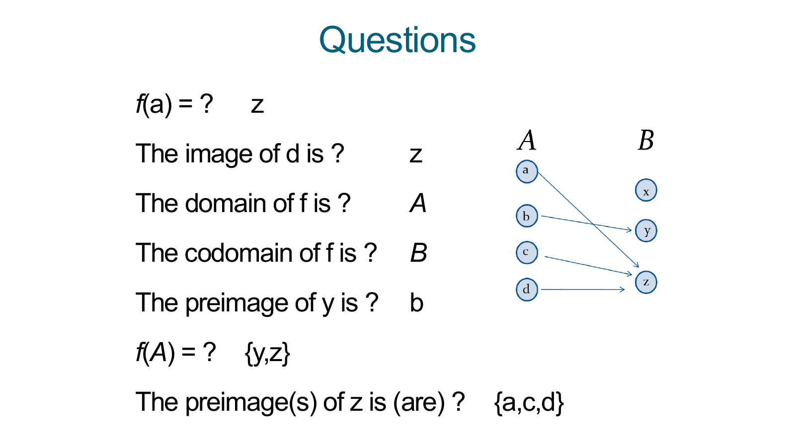
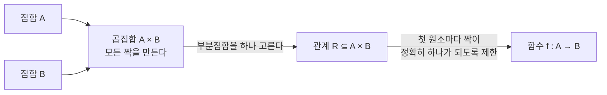
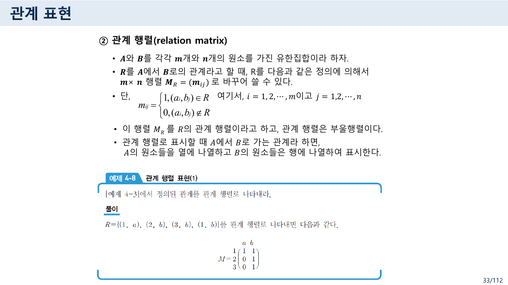
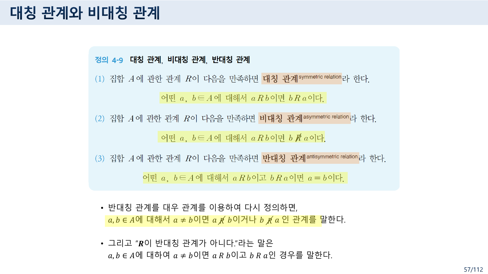
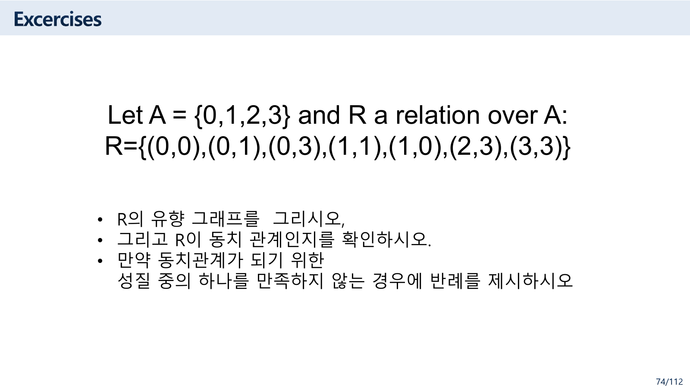
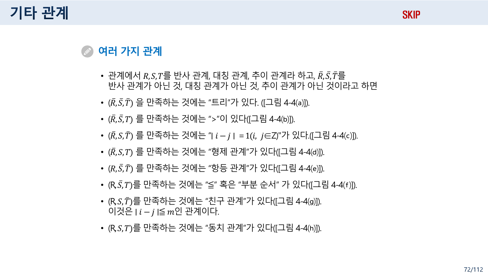
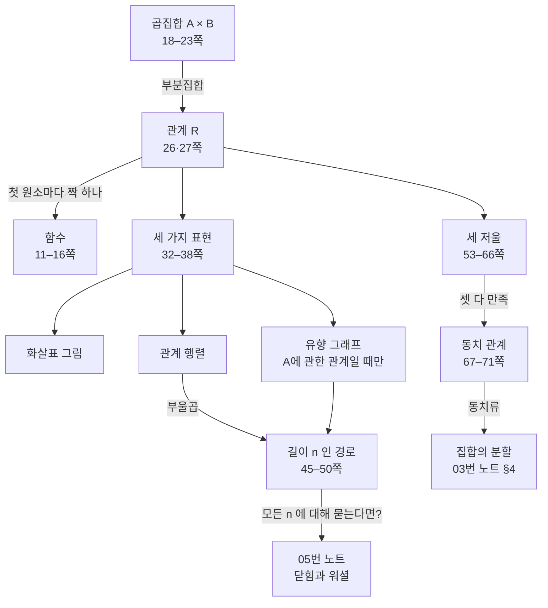

> [!abstract] 이 자료의 구조가 말하는 것
> 자료의 제목은 **`4 관계(Relation)와 함수(Functions)`** 다. 그런데 7쪽 목차에는 이렇게 적혀 있다.
>
> > 4.1 곱집합 / 4.2 관계와 관계 표현 / 4.3 경로 / 4.4 관계의 성질 / 4.5 역관계와 합성 관계 / 4.6 연결 관계와 Warshall 알고리즘
>
> **여섯 절 어디에도 함수가 없다.** 실제로 함수는 목차 **앞**의 열여섯 장(1–16쪽)에 몰려 있고, 17쪽 절 표지가 나온 뒤로는 125쪽 끝까지 한 번도 돌아오지 않는다.
>
> 이것을 편집 실수로 볼 수도 있지만, 9쪽 미리보기가 정확히 그 구조를 설명한다 — *“근현대 수학의 중요한 개념인 **함수도 이항 관계의 특별한 경우**이다.”* 함수를 먼저 보여 준 뒤 그것을 품는 더 큰 개념으로 넘어가는 배치이고, 그래서 함수는 **다시 다룰 필요가 없다.** 12쪽이 그 포함 관계를 식으로 못 박아 둔다.
>
> 이 정리문서는 그 열여섯 장에서 출발해 “함수가 무엇을 포기하면 관계가 되는가”를 따라간다. 그리고 관계를 그리는 세 가지 방법, 관계를 재는 세 개의 저울(반사·대칭·추이)까지가 이 노트의 범위다. 워셜 알고리즘과 닫힘은 [05번 노트](<./05. 관계 ② — 무한 번 반복하지 않고 도달 가능성을 묻는 법.md>)로 넘긴다.

---

## 1. 함수가 무엇을 포기하면 관계가 되는가


> 원본 7쪽. 제목에 있던 `함수`가 목차에서 사라진 자리다. 푸터는 `7/112` 인데 이 자료의 실제 쪽 수는 **125쪽**이다.

11·12·13쪽(Rosen 계열)이 함수를 정의한다. 11쪽의 정의는 표준적이다.

> Let A and B be nonempty sets. A function $f$ from A to B, denoted $f: A \to B$ is an assignment of **each** element of A to **exactly one** element of B.

12쪽이 이 정의를 관계의 말로 다시 쓴다. **이 한 장이 자료 전체의 구조를 담고 있다.**

> A function $f: A \to B$ can also be defined as **a subset of $A \times B$ (a relation)**. This subset is restricted to be a relation where **no two elements of the relation have the same first element.**

기호로는 두 줄이다.

$$\forall x\,\bigl(x \in A \to \exists y\,(y \in B \land (x,y) \in f)\bigr)$$

$$\forall x, y_1, y_2\,\bigl((x,y_1) \in f \land (x,y_2) \in f \to y_1 = y_2\bigr)$$

첫 줄이 **모든 x에 대해 짝이 적어도 하나**(전체성), 둘째 줄이 **많아야 하나**(일가성)다. 관계는 이 두 조건을 **둘 다 요구하지 않는다.** 그래서 다음 표가 성립한다.

| | 관계 $R \subseteq A \times B$ | 함수 $f : A \to B$ |
| --- | --- | --- |
| 짝이 없는 원소 | 있어도 된다 | **안 된다** |
| 짝이 둘 이상인 원소 | 있어도 된다 | **안 된다** |
| 정의역 | 짝이 있는 첫 원소들만 (`Dom(R)`) | **A 전체** |

26쪽(한국어 계열)이 같은 이야기를 관계 쪽에서 한다.

- **R의 정의역(domain)** — R에 속한 순서쌍에서 모든 첫 번째 원소의 집합. `Dom(R)`
- **R의 치역(range)** — 모든 두 번째 원소의 집합. `Ran(R)`
- **공변역(codomain)** — B 집합의 전체 원소. 치역은 공변역의 부분집합

관계에서는 `Dom(R)`이 A의 부분집합일 뿐이지만, 함수에서는 `Dom(f) = A` 다. **함수는 정의역이 꽉 찬 관계**다.

13쪽이 용어를 마저 붙인다 — image(상), preimage(원상), range. 그리고 함수의 상등을 정의한다: *“Two functions are equal when they have the same domain, the same codomain and map each element of the domain to the same element.”* 공변역까지 같아야 한다는 조건이 붙는 것이 관계와 다른 점이다.

15·16쪽이 짧은 확인 문제를 준다.



> 원본 15쪽. 화살표 그림 하나와 일곱 개의 질문, 그리고 답이 오른쪽에 함께 적혀 있다.

원본의 답에서 함수를 역산하면 $f(a) = z$, $f(b) = y$, $f(c) = z$, $f(d) = z$ 다. 이 함수로 일곱 답을 모두 검산했고 전부 일치한다.

| 질문 | 원본의 답 | 확인 |
| --- | --- | --- |
| `f(a) = ?` | `z` | ✅ |
| `The image of d is ?` | `z` | ✅ |
| `The domain of f is ?` | `A` | ✅ |
| `The codomain of f is ?` | `B` | ✅ |
| `The preimage of y is ?` | `b` | ✅ y로 가는 것은 b뿐 |
| `f(A) = ?` | `{y,z}` | ✅ 치역 — B 전체가 아니다 |
| `The preimage(s) of z is (are) ?` | `{a,c,d}` | ✅ **셋** |

마지막 두 줄이 함수의 비대칭성을 보여 준다. **정방향은 하나로 정해지고, 역방향은 여러 개일 수 있다.** `f(a)`는 z 하나지만 z의 원상은 셋이다. 그래서 원본이 마지막 질문에서 `preimage(s) … is (are)` 라고 단수·복수를 병기했다.

16쪽이 이것을 집합으로 확장한다 — $f(S) = \{f(s) \mid s \in S\}$. 원본의 두 답 `f({a,b,c}) = {y,z}` 와 `f({c,d}) = {z}` 도 위 함수로 검산되며 정확하다. 두 번째가 특히 좋다 — 원소 **두 개**를 넣었는데 결과가 **한 개**다. 상을 취하면 크기가 줄어들 수 있다.

2쪽은 이 모든 것에 앞서 `function` 이라는 단어의 사전적 뜻부터 편다 — *“an activity or purpose natural to or intended for a person or thing”*, 동의어로 `behavior, task, activity, action`. 5쪽은 파이썬 함수를, 6쪽은 인스타그램 소개문을 붙이고 `Main functions?` 라고만 묻는다. 수학의 함수와 프로그래밍의 함수와 일상어의 기능을 같은 이름으로 부른다는 사실을 먼저 짚고 넘어가는 구성이다.

---

## 2. 곱집합 — 모든 짝을 먼저 만든다

[03. 집합](<./03. 집합 — 한 슬라이드 위에서 두 정의가 어긋난다.md>) §1에서 본 14쪽 여백의 질문 — “집합의 원소들이 순서를 가진다면?” — 에 대한 답이 여기다.

18쪽이 순서쌍을 정의하고, 19쪽이 예를 준다 — `A = {x, y, z}`, `B = {1, 2, 3}` 의 곱집합 $A \times B$. 아홉 개의 순서쌍이 만들어진다.

$$A \times B = \{(x,1),(x,2),(x,3),(y,1),(y,2),(y,3),(z,1),(z,2),(z,3)\}$$

20·21쪽이 확장한다. $A \times B \times C$ 는 세 집합에서 하나씩 뽑은 삼중쌍의 집합이고, 일반적으로

$$A_1 \times A_2 \times \cdots \times A_n \;=\; \prod_{i=1}^{n} A_i$$

이며, 같은 집합이면 $A \times A = A^2$, $\mathbb{R}^3 = \mathbb{R} \times \mathbb{R} \times \mathbb{R}$ 로 줄여 쓴다.

크기는 곱으로 커진다. $|A \times B| = |A| \cdot |B|$ 이므로 위 예에서 $3 \times 3 = 9$ 다. 그리고 이 아홉 개 중 **아무 부분집합이나 고르면 그것이 관계**다. 부분집합의 개수는 $2^9 = 512$ 개 — 세 원소 집합 사이에도 512가지 관계가 있다.



이 그림의 마지막 화살표가 §1의 12쪽이다. **함수는 관계에 제약을 하나 더 건 것**이고, 관계는 곱집합에 제약을 아예 걸지 않은 것이다.

26·27쪽이 이항 관계를 정의하고 n항으로 확장한 뒤, 딱 잘라 선언한다 — *“우리는 이항 관계만을 다루므로 앞으로 관계라고 하면 이항 관계를 말한다.”* 그리고 26쪽의 마지막 줄이 이 노트 나머지의 무대를 정한다.

> $A = B$ 이면, 즉 $R$ 이 $A$ 에서 $A$ 로 가는 관계($R \subseteq A \times A$)이면 $R$ 을 **A에 관한 관계**라 한다.

같은 집합 안에서의 관계여야 “반사적인가”, “대칭인가”를 물을 수 있다. 서로 다른 두 집합 사이의 관계에서는 $(a,a)$ 라는 순서쌍 자체가 성립하지 않는다.

---

## 3. 세 가지로 그리기 — 그리고 33쪽의 어긋남

32–38쪽이 관계를 표현하는 세 가지 방법을 준다.

| 방법 | 정의 (원본) | 쓸 수 있는 조건 |
| --- | --- | --- |
| **화살표 그림** (32쪽) | 두 개의 원에 A와 B의 원소를 써넣고, 관계가 있으면 화살표를 그린다 | 언제나 |
| **관계 행렬** (33쪽) | $m \times n$ 부울 행렬 $M_R = (m_{ij})$ | 언제나 |
| **유향 그래프** (35쪽) | 원소를 정점으로, $(a_i, a_j) \in R$ 이면 화살표로 잇는다 | **A에 관한 관계일 때만** |

세 번째 줄의 조건이 35쪽에 명시되어 있다 — *“관계를 유향 그래프로 표시하기 위해서는 A에서 A로 가는 관계인 A에 관한 관계일 때만 가능하다.”* 정점이 한 종류여야 화살표를 그릴 수 있기 때문이다.



> 원본 33쪽. 위쪽에 $m_{ij}$ 의 정의가, 아래쪽에 “어떻게 배치하는가”가 적혀 있다.

원본의 정의는 이렇다.

$$m_{ij} = \begin{cases} 1, & (a_i,\, b_j) \in R \\ 0, & (a_i,\, b_j) \notin R \end{cases} \qquad i = 1,\dots,m,\quad j = 1,\dots,n$$

$i$ 가 A의 원소를 세고 $j$ 가 B의 원소를 세며, 행렬은 $m \times n$ 이다. 행렬의 관례상 **첫 번째 첨자가 행, 두 번째가 열**이므로 **A가 행, B가 열**이다.

그런데 같은 슬라이드의 마지막 줄이 이렇게 적혀 있다.

> 관계 행렬로 표시할 때 A에서 B로 가는 관계라 하면, **A의 원소들을 열에 나열하고 B의 원소들은 행에 나열**하여 표시한다.

위쪽 정의와 이 문장이 서로 반대다.

> [!warning] 원본 오류 ① — 33쪽에서 행과 열이 뒤바뀌었다
> 같은 슬라이드 위쪽의 정의($M_R$ 은 $m \times n$ 행렬, $m_{ij} = 1 \iff (a_i, b_j) \in R$)에 따르면 **A가 행, B가 열**이다. 그런데 아래쪽 서술은 그 반대로 적혀 있다.
>
> 두 서술을 다 따르면 $M_R$ 이 $n \times m$ 이 되어 크기부터 어긋나고, 이후 [05번 노트](<./05. 관계 ② — 무한 번 반복하지 않고 도달 가능성을 묻는 법.md>)에서 다룰 **합성 관계의 부울곱** $M_{S \circ R} = M_R \odot M_S$ 이 성립하지 않게 된다(행렬 곱은 앞 행렬의 열 수와 뒤 행렬의 행 수가 맞아야 한다).
>
> 자료 뒤쪽에서 실제로 행렬을 다룰 때는 **정의 쪽**을 따른다. 89쪽이 “A에서 B로 가는 R은 m×n 관계행렬 $M_R$”, “B에서 C로 가는 S는 n×s 관계행렬 $M_S$” 라 적어 A를 행으로 두고 있고, [05번 노트](<./05. 관계 ② — 무한 번 반복하지 않고 도달 가능성을 묻는 법.md>) §3의 워셜 예제도 그렇다. 어긋난 것은 33쪽 마지막 한 줄뿐이다.

30·31쪽이 항등 관계를 정의한다 — $I_A = \{(a,a) \mid a \in A\}$. 관계 행렬로는 **단위행렬**이고, 유향 그래프로는 모든 정점에 자기 자신으로 가는 화살표가 하나씩 달린 그림이다. 이 관계가 §5에서 다시 나온다.

### 세 표현을 나란히 놓고 보기

```html preview h=640px
<div style="font-family:system-ui,-apple-system,sans-serif;padding:20px;color:var(--foreground)">
  <div style="font-size:13px;color:var(--muted-foreground);margin-bottom:10px">
    A = {0, 1, 2, 3} 에 관한 관계. 행렬 칸을 눌러 순서쌍을 넣고 뺀다.
  </div>
  <div id="relpresets" style="display:flex;gap:6px;flex-wrap:wrap;margin-bottom:14px"></div>

  <div style="display:flex;gap:30px;flex-wrap:wrap;align-items:flex-start">
    <div>
      <div style="font-size:12.5px;color:var(--muted-foreground);margin-bottom:6px">② 관계 행렬 M<sub>R</sub></div>
      <div id="relmat"></div>
    </div>
    <div>
      <div style="font-size:12.5px;color:var(--muted-foreground);margin-bottom:6px">③ 유향 그래프</div>
      <svg id="reldg" viewBox="0 0 230 230" width="230" height="230" role="img" aria-label="관계의 유향 그래프"></svg>
    </div>
    <div style="flex:1;min-width:200px">
      <div style="font-size:12.5px;color:var(--muted-foreground);margin-bottom:6px">① 순서쌍 목록</div>
      <div id="relpairs" style="font-family:ui-monospace,Menlo,monospace;font-size:13px;line-height:1.9;
           padding:9px 11px;background:var(--card);border:1px solid var(--border);border-radius:var(--radius);min-height:60px"></div>
      <div id="relprops" style="margin-top:10px"></div>
    </div>
  </div>

  <script>
    var N = 4, M = [];
    function clear() { M = []; for (var i = 0; i < N; i++) M.push([0,0,0,0]); }
    clear();

    var PRESETS = [
      ['원본 74쪽 연습문제', [[0,0],[0,1],[0,3],[1,1],[1,0],[2,3],[3,3]]],
      ['항등 관계 I (30쪽)', [[0,0],[1,1],[2,2],[3,3]]],
      ['≤ (72쪽 · R S̄ T)', [[0,0],[0,1],[0,2],[0,3],[1,1],[1,2],[1,3],[2,2],[2,3],[3,3]]],
      ['&gt; (72쪽 · R̄ S̄ T)', [[1,0],[2,0],[2,1],[3,0],[3,1],[3,2]]],
      ['|i−j| = 1 (72쪽 · R̄ S T̄)', [[0,1],[1,0],[1,2],[2,1],[2,3],[3,2]]],
      ['비우기', []]
    ];
    PRESETS.forEach(function (p) {
      var b = document.createElement('button');
      b.innerHTML = p[0];
      b.style.cssText = 'padding:6px 10px;font-size:12px;border:1px solid var(--border);border-radius:var(--radius);' +
        'background:var(--card);color:var(--foreground);cursor:pointer';
      b.onclick = function () { clear(); p[1].forEach(function (q) { M[q[0]][q[1]] = 1; }); draw(); };
      document.getElementById('relpresets').appendChild(b);
    });

    function draw() {
      // 행렬
      var h = '<table style="border-collapse:collapse;font-size:13px"><tr><td></td>';
      for (var j = 0; j < N; j++) h += '<td style="padding:2px 6px;text-align:center;color:var(--muted-foreground);font-size:11px">' + j + '</td>';
      h += '</tr>';
      for (var i = 0; i < N; i++) {
        h += '<tr><td style="padding:2px 6px;color:var(--muted-foreground);font-size:11px">' + i + '</td>';
        for (j = 0; j < N; j++) {
          h += '<td><button class="relc" data-i="' + i + '" data-j="' + j + '" style="width:34px;height:34px;' +
            'border:1px solid var(--border);border-radius:4px;cursor:pointer;font-weight:700;font-size:14px;background:' +
            (M[i][j] ? 'var(--chart-1)' : 'var(--card)') + ';color:' +
            (M[i][j] ? 'var(--background)' : 'var(--muted-foreground)') + '">' + M[i][j] + '</button></td>';
        }
        h += '</tr>';
      }
      document.getElementById('relmat').innerHTML = h + '</table>';
      Array.prototype.forEach.call(document.querySelectorAll('.relc'), function (b) {
        b.onclick = function () { M[+b.dataset.i][+b.dataset.j] ^= 1; draw(); };
      });

      // 유향 그래프
      var C = [[60,60],[170,60],[170,170],[60,170]], svg = '';
      svg += '<defs><marker id="arw" viewBox="0 0 10 10" refX="9" refY="5" markerWidth="6" markerHeight="6" orient="auto">' +
        '<path d="M0,0 L10,5 L0,10 z" fill="var(--chart-2)"/></marker></defs>';
      for (var i2 = 0; i2 < N; i2++) for (var j2 = 0; j2 < N; j2++) {
        if (!M[i2][j2]) continue;
        var a = C[i2], b2 = C[j2];
        if (i2 === j2) {
          var dx = a[0] < 115 ? -1 : 1, dy = a[1] < 115 ? -1 : 1;
          svg += '<path d="M' + (a[0] + dx * 14) + ',' + (a[1] + dy * 6) + ' q' + (dx * 26) + ',' + (dy * 26) +
            ' ' + (dx * -6) + ',' + (dy * 32) + '" fill="none" stroke="var(--chart-2)" stroke-width="1.6" marker-end="url(#arw)"/>';
        } else {
          var ang = Math.atan2(b2[1] - a[1], b2[0] - a[0]), off = 6;
          var sx = a[0] + Math.cos(ang) * 20 - Math.sin(ang) * off, sy = a[1] + Math.sin(ang) * 20 + Math.cos(ang) * off;
          var ex = b2[0] - Math.cos(ang) * 22 - Math.sin(ang) * off, ey = b2[1] - Math.sin(ang) * 22 + Math.cos(ang) * off;
          svg += '<line x1="' + sx.toFixed(1) + '" y1="' + sy.toFixed(1) + '" x2="' + ex.toFixed(1) + '" y2="' + ey.toFixed(1) +
            '" stroke="var(--chart-2)" stroke-width="1.6" marker-end="url(#arw)"/>';
        }
      }
      svg += C.map(function (p, k) {
        return '<circle cx="' + p[0] + '" cy="' + p[1] + '" r="19" fill="var(--card)" stroke="var(--border)" stroke-width="1.5"/>' +
          '<text x="' + p[0] + '" y="' + (p[1] + 5) + '" text-anchor="middle" font-size="14" font-weight="700" fill="var(--foreground)">' + k + '</text>';
      }).join('');
      document.getElementById('reldg').innerHTML = svg;

      // 순서쌍과 성질
      var pairs = [];
      for (i2 = 0; i2 < N; i2++) for (j2 = 0; j2 < N; j2++) if (M[i2][j2]) pairs.push('(' + i2 + ',' + j2 + ')');
      document.getElementById('relpairs').innerHTML = pairs.length
        ? 'R = {' + pairs.join(', ') + '}<br/><span style="color:var(--muted-foreground)">|R| = ' + pairs.length + '</span>'
        : '<span style="color:var(--muted-foreground)">R = ∅ (공관계)</span>';

      var refl = [], irr = [], sym = [], anti = [], tra = [];
      for (i2 = 0; i2 < N; i2++) {
        if (!M[i2][i2]) refl.push(i2);
        if (M[i2][i2]) irr.push(i2);
      }
      for (i2 = 0; i2 < N; i2++) for (j2 = 0; j2 < N; j2++) {
        if (M[i2][j2] && !M[j2][i2]) sym.push('(' + i2 + ',' + j2 + ')');
        if (i2 !== j2 && M[i2][j2] && M[j2][i2] && anti.length < 3) anti.push('(' + i2 + ',' + j2 + ')');
        if (!M[i2][j2]) continue;
        for (var k2 = 0; k2 < N; k2++) if (M[j2][k2] && !M[i2][k2] && tra.length < 3)
          tra.push('(' + i2 + ',' + j2 + ')·(' + j2 + ',' + k2 + ') 인데 (' + i2 + ',' + k2 + ') 없음');
      }
      var rows = [
        ['반사 (53쪽)', refl.length === 0, refl.length ? '(' + refl[0] + ',' + refl[0] + ') 가 없다' : '주대각이 모두 1'],
        ['비반사', irr.length === 0, irr.length ? '(' + irr[0] + ',' + irr[0] + ') 가 있다' : '주대각이 모두 0'],
        ['대칭 (58쪽)', sym.length === 0, sym.length ? sym[0] + ' 의 짝이 없다' : '행렬이 주대각에 대해 대칭'],
        ['반대칭 (59쪽)', anti.length === 0, anti.length ? anti[0] + ' 와 그 역이 둘 다 있다' : 'a≠b 인 양방향 쌍이 없다'],
        ['추이 (65쪽)', tra.length === 0, tra.length ? tra[0] : '두 걸음이 언제나 한 걸음으로 줄어든다']
      ];
      var isEq = rows[0][1] && rows[2][1] && rows[4][1];
      document.getElementById('relprops').innerHTML = rows.map(function (r) {
        return '<div style="display:flex;gap:9px;align-items:flex-start;padding:5px 9px;margin-bottom:4px;font-size:12.5px;' +
          'border:1px solid var(--border);border-radius:var(--radius);background:var(--card)">' +
          '<span style="width:16px;color:' + (r[1] ? 'var(--chart-1)' : 'var(--chart-5)') + '">' + (r[1] ? '✓' : '✕') + '</span>' +
          '<span style="width:82px;font-weight:600">' + r[0] + '</span>' +
          '<span style="flex:1;color:var(--muted-foreground)">' + r[2] + '</span></div>';
      }).join('') +
        '<div style="margin-top:7px;padding:8px 11px;border-radius:var(--radius);font-size:13px;border:1px solid ' +
        (isEq ? 'var(--chart-1)' : 'var(--border)') + ';background:var(--card)">' +
        (isEq ? '<b style="color:var(--chart-1)">동치 관계다</b> — 반사·대칭·추이를 모두 만족한다 (67쪽)'
              : '동치 관계가 <b>아니다</b> — 반사·대칭·추이 중 하나 이상이 깨졌다') + '</div>';
    }
    clear(); PRESETS[0][1].forEach(function (q) { M[q[0]][q[1]] = 1; }); draw();
  </script>
</div>
```

세 표현이 **같은 정보를 세 방식으로 담고 있다**는 것이 이 도구의 요점이다. 행렬 칸 하나를 바꾸면 순서쌍 목록과 그래프의 화살표가 함께 움직인다. 그리고 47쪽이 왜 행렬을 권하는지도 여기서 드러난다.

> 유향 그래프를 이용할 때는 사람이 하나씩 찾아가므로 복잡한 그래프에서는 잘못 계산할 수도 있다. 반면에, **관계 행렬을 이용하면 프로그램을 이용해서 자동적으로 계산할 수 있다. 따라서 관계 행렬을 이용하는 방법을 추천한다.**

이 문장이 [05번 노트](<./05. 관계 ② — 무한 번 반복하지 않고 도달 가능성을 묻는 법.md>)의 워셜 알고리즘으로 곧장 이어진다.

---

## 4. 경로 — 화살표를 여러 번 따라가기

40쪽이 경로를 정의하고 [그림 4-1]로 예를 든다.

> $a$ 부터 시작해 $b$ 까지 가는 경로가 있는지 알아보는 것이다.
> [그림 4-1]에서 정점 1부터 시작하여 정점 3에서 끝나는 **길이가 4인 경로** $\pi_1 = 1, 2, 5, 4, 3$ 과 자신부터 시작하여 자신에서 끝나는 경로 $\pi_2 = 1, 2, 5, 1$ 과 $\pi_3 = 2, 2$ 등을 찾을 수 있다.

길이를 세는 방식에 주의한다. $\pi_1$ 은 정점이 다섯 개인데 길이가 **4**다. **길이는 정점의 수가 아니라 간선의 수**다. 그리고 $\pi_3 = 2, 2$ 는 정점 2에서 자기 자신으로 가는 화살표 하나 — 길이 1의 경로다.

41쪽이 순환을 정의한다 — *“경로 $\pi_2, \pi_3$ 과 같이 자신에서 시작하여 자신에서 끝나는 경로.”*

45쪽이 이 절의 도구를 꺼낸다 — **부울곱(Boolean Product)**. 관계 행렬을 곱하되 곱셈 자리에 `∧`, 덧셈 자리에 `∨` 를 쓰는 연산이다.

$$(M_R \odot M_R)_{ij} = \bigvee_{k} \bigl(m_{ik} \land m_{kj}\bigr)$$

$i$ 에서 $k$ 로 가는 화살표가 있고 $k$ 에서 $j$ 로 가는 화살표가 있는 $k$ 가 **하나라도** 있으면 1이 된다 — 정확히 **길이 2인 경로가 있는가**를 묻는 식이다. 그래서 47쪽이 정리한다.

> [예제 4-16]의 결과는 [예제 4-15]의 결과와 같다. 이는 [정리 4-2]와 같이 **길이가 $n$ 인 경로를 찾을 때 유향 그래프를 이용해서 찾을 수도 있고 관계 행렬을 이용해서 찾을 수 있기** 때문이다.

일반적으로 $M_R^{[n]}$ 의 $(i,j)$ 성분이 1이면 $i$ 에서 $j$ 로 가는 **길이 정확히 $n$ 인** 경로가 존재한다. 이 사실이 [05번 노트](<./05. 관계 ② — 무한 번 반복하지 않고 도달 가능성을 묻는 법.md>) §1의 출발점이다 — “도달 가능한가”를 물으려면 모든 $n$ 에 대해 이것을 확인해야 하고, 그래서 **무한 번 반복**이라는 문제가 생긴다.

48쪽이 경로의 합성을, 50쪽이 역경로를 정의한다.

- **합성** $\pi_1 \cdot \pi_2$ — $a$ 에서 $b$ 로 가는 길이 $n$ 의 경로와 $b$ 에서 $c$ 로 가는 길이 $m$ 의 경로를 이어 붙여 길이 $m+n$ 의 경로를 만든다. 조건은 하나 — *“$\pi_1$ 의 끝나는 정점과 $\pi_2$ 의 시작 정점이 같을 때만 가능하다.”*
- **역경로** $\pi^{-1}$ — $\pi = a, x_1, \dots, x_{n-1}, b$ 에 대해 $\pi^{-1} = b, x_{n-1}, \dots, x_1, a$

두 번째가 §5의 대칭 관계와 이어진다. 관계가 대칭이면 모든 경로의 역경로도 관계 안에 있다.

---

## 5. 세 개의 저울 — 반사·대칭·추이

52쪽(Rosen 계열)이 남은 절의 목차를 준다 — Reflexive / Symmetric and Antisymmetric / Transitive / Combining Relations. 그리고 53–66쪽이 하나씩 정의한다.

| 성질 | 원본의 정의 (Rosen 계열) | 관계 행렬에서 | 유향 그래프에서 |
| --- | --- | --- | --- |
| **반사 (reflexive)** | $\forall x\,\bigl(x \in U \to (x,x) \in R\bigr)$ | 주대각이 **모두 1** | 모든 정점에 길이 1인 순환 |
| **비반사 (irreflexive)** | (한국어 계열, 55쪽) | 주대각이 **모두 0** | 길이 1인 순환이 하나도 없음 |
| **대칭 (symmetric)** | $\forall x \forall y\,\bigl((x,y) \in R \to (y,x) \in R\bigr)$ | 주대각에 대해 **대칭 행렬** | 화살표가 언제나 쌍으로 |
| **반대칭 (antisymmetric)** | $\forall x \forall y\,\bigl((x,y) \in R \land (y,x) \in R \to x = y\bigr)$ | $i \ne j$ 인 양방향 쌍이 없음 | 서로 마주 보는 화살표 없음 |
| **추이 (transitive)** | $\forall x \forall y \forall z\,\bigl((x,y) \in R \land (y,z) \in R \to (x,z) \in R\bigr)$ | $M_R^{[2]} \le M_R$ | 두 걸음이 언제나 한 걸음으로 |

56쪽이 행렬·그래프 쪽 대응을 명시한다 — *“반사 관계의 관계 행렬은 주대각 원소가 모두 1이고, 비반사 관계의 관계 행렬은 주대각 원소가 모두 0임을 알 수 있다.”*

55쪽에는 짧지만 결정적인 경고가 손글씨처럼 붙어 있다.

> [예제 4-19]의 (c)에서 보듯이 **반사 관계가 아니면 비반사 관계가 되고 비반사 관계가 아니면 반사 관계라고 잘못 알고 있으면 안 된다.**

반사와 비반사는 **서로의 부정이 아니다.** 주대각에 1이 하나라도 있고 0도 하나라도 있으면 **둘 다 아니다.** 위 도구에서 `(0,0)` 만 켜고 나머지 주대각을 끄면 두 판정이 동시에 ✕가 되는 것을 볼 수 있다.



> 원본 57쪽. [정의 4-9]가 세 가지를 한 상자에 담고, 아래에 반대칭의 대우 형태가 붙어 있다.

이 쪽이 헷갈리기 쉬운 세 이름을 한 화면에 모아 준다.

| 이름 | 조건 | 예 |
| --- | --- | --- |
| 대칭 (symmetric) | $aRb$ 이면 $bRa$ | `=`, 형제 관계 |
| **비대칭 (asymmetric)** | $aRb$ 이면 $b \not R a$ | `<`, `>` |
| 반대칭 (antisymmetric) | $aRb$ 이고 $bRa$ 이면 $a = b$ | `≤`, `⊆` |

비대칭과 반대칭의 차이가 미묘하다. 비대칭은 $a = b$ 인 경우까지 금지하므로 **비반사**이기도 하다($aRa$ 이면 $a \not R a$ 여야 하므로 모순). 반대칭은 $(a,a)$ 를 허용한다 — `≤` 가 반대칭이지만 비대칭은 아닌 이유다.

원본이 반대칭의 대우 형태를 따로 적어 둔 것도 도움이 된다.

> $a, b \in A$ 에 대해서 $a \ne b$ 이면 $a \not R b$ **이거나** $b \not R a$ 인 관계를 말한다.

$aRb \land bRa \to a=b$ 의 대우는 $a \ne b \to \lnot(aRb \land bRa) = (\lnot aRb) \lor (\lnot bRa)$ 다. [02. 논리](<./02. 논리 — 진리표를 그리기 전에 괄호부터 정한다.md>) §2의 드모르간이 그대로 적용된 자리이며, **원본의 서술은 정확하다.**

63·64쪽이 대칭 관계에서 무향 그래프로 넘어간다. 대칭이면 화살표가 언제나 쌍으로 있으므로 화살표를 지우고 선으로만 그려도 정보가 사라지지 않는다. 63쪽이 좋은 한 줄을 덧붙인다 — *“무향 그래프는 화살표가 없는 것이 아니라 **양쪽 방향을 의미한다.**”* 그리고 64쪽이 **연결(connected)** 을 정의하는데, 이것이 [06. 그래프](<./06. 그래프 — 탐욕이 최소를 준다는 약속.md>)의 주제로 이어진다.

67–71쪽이 세 성질을 모두 만족하는 관계에 이름을 붙인다 — **동치 관계**. 67쪽이 그 그래프의 모습을 셋으로 정리한다.

1. R는 반사 관계이므로 **모든 정점들은 길이가 1인 순환**을 가진다
2. R는 대칭 관계이므로 유향 그래프가 아닌 **무향 그래프**를 갖는다
3. R는 추이 관계이므로 a→b, b→c 가 있으면 **a→c도 존재**한다

세 조건을 합치면 그래프가 **완전 부분그래프 여러 덩어리**로 쪼개진다. 71쪽이 그 덩어리에 이름을 준다 — **동치류(equivalence class)**.

$$[a] = \{x \in A \mid x\,R\,a\}$$

그리고 한 줄을 덧붙인다 — *“동치류 $[a]$ 는 결코 공집합이 될 수 없다. 왜냐하면 $R$ 가 반사 관계이므로 $a \in [a]$ 이기 때문이다.”* 반사성이 여기서 쓰인다.

동치류들은 서로소이고 합치면 A 전체가 된다 — 곧 [03. 집합](<./03. 집합 — 한 슬라이드 위에서 두 정의가 어긋난다.md>) §4의 **분할**이다. 동치 관계와 분할은 같은 것의 두 이름이다.

### 74쪽 연습문제 — 세 저울이 모두 기울어지는 예



> 원본 74쪽. `A = {0,1,2,3}`, `R = {(0,0),(0,1),(0,3),(1,1),(1,0),(2,3),(3,3)}` 에 대해 세 가지를 요구한다 — 유향 그래프를 그리고, 동치 관계인지 확인하고, **아니라면 반례를 제시하라.**

이 관계를 세 저울에 올려 보면 **셋 다 기운다.**

| 성질 | 판정 | 반례 |
| --- | --- | --- |
| 반사 | ✗ | $(2,2) \notin R$ — 원소 2에 자기 화살표가 없다 |
| 대칭 | ✗ | $(0,3) \in R$ 인데 $(3,0) \notin R$. $(2,3)$ 도 마찬가지 |
| 추이 | ✗ | $(1,0) \in R$ 이고 $(0,3) \in R$ 인데 $(1,3) \notin R$ |

§3의 도구 첫 번째 프리셋이 이 관계다. 눌러서 확인하면 세 판정이 모두 ✕로 뜨고 각각의 반례가 함께 표시된다. 대칭성은 $(0,1)$ 과 $(1,0)$ 이 짝을 이루고 있어 얼핏 성립하는 듯 보이지만, $(0,3)$ 한 쌍이 어긋나면 그것으로 끝이다 — **성질은 하나라도 어긋나면 무너진다.**

---

## 6. 72쪽 — 여덟 칸의 표, 그리고 한 칸의 오류



> 원본 72쪽. 제목 오른쪽에 빨간 **`SKIP`** 이 붙어 있다. 다음 73쪽에도 같은 표시가 있다.

반사(R)·대칭(S)·추이(T) 세 성질이 각각 있거나 없으므로 조합은 $2^3 = 8$ 가지다. 원본이 여덟 칸을 모두 채웠다(윗줄은 “아니다”를 뜻한다).

| # | 조합 | 원본이 든 예 | 확인 |
| --- | --- | --- | --- |
| 1 | $\bar{R}\,\bar{S}\,\bar{T}$ | 트리 (부모-자식 관계) | ✅ 자기 부모 아님 · 자식이 부모의 부모 아님 · 조부모는 부모 아님 |
| 2 | $\bar{R}\,\bar{S}\,T$ | `>` | ✅ $a \not> a$ · $a>b$ 면 $b \not> a$ · 추이 성립 |
| 3 | $\bar{R}\,S\,\bar{T}$ | $\lvert i-j \rvert = 1$ | ✅ $\lvert i-i \rvert = 0 \ne 1$ · 대칭 · $\lvert 1-2 \rvert = \lvert 2-3 \rvert = 1$ 이나 $\lvert 1-3 \rvert = 2$ |
| 4 | $\bar{R}\,S\,T$ | 형제 관계 | ✅ 자기 형제 아님 · 대칭 |
| 5 | $R\,\bar{S}\,\bar{T}$ | **항등 관계** | ❌ **§ 아래 참조** |
| 6 | $R\,\bar{S}\,T$ | `≤` 혹은 부분 순서 | ✅ 반사 · 반대칭 · 추이 |
| 7 | $R\,S\,\bar{T}$ | 친구 관계 = $\lvert i-j \rvert \le m$ | ✅ $0 \le m$ · 대칭 · $m=1$ 일 때 1–2–3 이 반례 |
| 8 | $R\,S\,T$ | 동치 관계 | ✅ 정의 그대로 |

> [!warning] 원본 오류 ② — 항등 관계는 대칭이면서 추이다
> 72쪽은 $R\,\bar{S}\,\bar{T}$(반사적이지만 대칭도 아니고 추이도 아닌) 칸의 예로 **항등 관계**를 들었다. 그런데 항등 관계 $I_A = \{(a,a) \mid a \in A\}$ 는 세 성질을 **전부** 만족한다.
>
> - 반사 — 정의 그대로 모든 $a$ 에 대해 $(a,a) \in I$ ✅
> - **대칭** — $(a,b) \in I$ 이면 $a = b$ 이므로 $(b,a) = (a,a) \in I$ ✅
> - **추이** — $(a,b), (b,c) \in I$ 이면 $a = b = c$ 이므로 $(a,c) \in I$ ✅
>
> 즉 항등 관계가 들어가야 할 칸은 여덟 번째($R\,S\,T$)다. 실제로 **항등 관계는 가장 작은 동치 관계**이며, 그 사실은 이 자료 자신의 122–124쪽 “가장 작은 동치 관계”가 다루는 주제이기도 하다.
>
> §3 도구의 두 번째 프리셋(`항등 관계 I`)을 눌러 보면 다섯 판정 중 반사·대칭·추이 셋이 모두 ✓ 로 뜨고 “동치 관계다”가 표시된다. 원본의 분류와 정면으로 어긋난다.
>
> 그 칸을 채울 예가 없는 것은 아니다. $A = \{1,2,3\}$ 위에서 $R = \{(1,1),(2,2),(3,3),(1,2),(2,3)\}$ 은 반사적이지만 대칭이 아니고($(2,1)$ 없음) 추이도 아니다($(1,3)$ 없음).
>
> 이 두 쪽이 **`SKIP`** 으로 표시되어 있다는 점은 덧붙일 만하다. 강의에서 건너뛴 슬라이드이므로 수업 중에 정정될 기회가 없었다.

---

## 7. 여기까지의 지도



이 노트의 범위는 오른쪽 아래 두 상자 직전까지다. 마지막 화살표 — *“모든 $n$ 에 대해 묻는다면?”* — 이 다음 노트의 첫 질문이 된다. 45쪽의 부울곱은 길이가 **정확히 $n$** 인 경로만 찾아 주므로, “언젠가 도달할 수 있는가”를 물으려면 $n = 1, 2, 3, \dots$ 를 끝없이 확인해야 한다. 118쪽이 그 문제를 딱 잘라 적는다 — *“관계 행렬을 이용하는 방법: **무한번 반복 계산해야 한다는 문제점**.”*

- 다음 → [05. 관계 ② — 무한 번 반복하지 않고 도달 가능성을 묻는 법](<./05. 관계 ② — 무한 번 반복하지 않고 도달 가능성을 묻는 법.md>)
- 이전 → [03. 집합 — 한 슬라이드 위에서 두 정의가 어긋난다](<./03. 집합 — 한 슬라이드 위에서 두 정의가 어긋난다.md>)

### 다른 과목과의 연결

- §5의 유향 그래프 표현은 [06. 그래프](<./06. 그래프 — 탐욕이 최소를 준다는 약속.md>)에서 그래프 자체가 주인공이 되면서 인접 행렬로 이름을 바꾼다.
- §3의 관계 행렬을 실제 자료구조로 저장하는 이야기는 [데이터 구조 07. 트리 — 자식이 둘을 넘으면 감당이 안 된다](<../../../01_programming-foundations/data-structures/notes/07. 트리 — 자식이 둘을 넘으면 감당이 안 된다.md>)의 배열 인덱스 대응과 같은 발상이다.
- §1의 “함수는 제약을 더 건 관계”라는 관점은 [알고리즘 설계와 분석 06. 공간으로 시간 벌기](<../../../06_algorithms-graphics/algorithm-design-analysis/notes/06. 공간으로 시간 벌기.md>)의 해싱에서 “키 → 주소” 함수가 왜 충돌할 수 있는지를 설명해 준다.

---

## 근거 자료

`4 관계 및 함수.pdf` 의 **1–74쪽** (전체 125쪽 중, PowerPoint 프레젠테이션, 컴퓨터AI공학부 천세진)

| 쪽 | 내용 | 이 문서에서 쓴 자리 |
| --- | --- | --- |
| 2 · 5 · 6 | `function` 의 사전적 뜻 · 파이썬 함수 · 인스타그램 | §1 |
| 7 | 목차 여섯 절 | §1 (이미지 인용) |
| 8 · 9 · 10 | 미리보기 — 관계란, 응용 분야 | §1 · §2 |
| 11–14 · 25 | 함수의 정의와 용어 (11쪽과 25쪽은 동일 슬라이드) | §1 |
| 15 · 16 | 함수 확인 문제 | §1 (이미지 인용) |
| 18–23 | 순서쌍과 곱집합 | §2 |
| 26 · 27 | 이항 관계, 정의역·치역·공변역 | §1 · §2 |
| 30 · 31 | 항등 관계 | §3 · §6 |
| 32–38 | 세 가지 표현 | §3 (이미지 인용, 원본 오류 ①, 인터랙티브) |
| 40–50 | 경로 · 순환 · 부울곱 · 합성 · 역경로 | §4 |
| 52–66 | 반사 · 대칭 · 반대칭 · 추이 | §5 (이미지 인용) |
| 67–71 | 동치 관계와 동치류 | §5 |
| 72 · 73 | 여덟 가지 조합 (SKIP 표시) | §6 (이미지 인용, 원본 오류 ②) |
| 74 | 연습문제 | §5 (이미지 인용, 인터랙티브) |

> [!note] 계산 검증
> §1의 일곱 답과 두 개의 상(image), §5의 74쪽 연습문제 세 반례, §6의 여덟 조합 각각의 예를 전부 손으로 검증했다. §3 인터랙티브의 다섯 프리셋은 모두 원본에 인쇄된 관계이며(74쪽 연습문제, 30쪽 항등 관계, 72쪽의 `≤`·`>`·`|i−j|=1`), 도구가 표시하는 판정은 프리셋을 누를 때마다 정의로부터 다시 계산된다.
