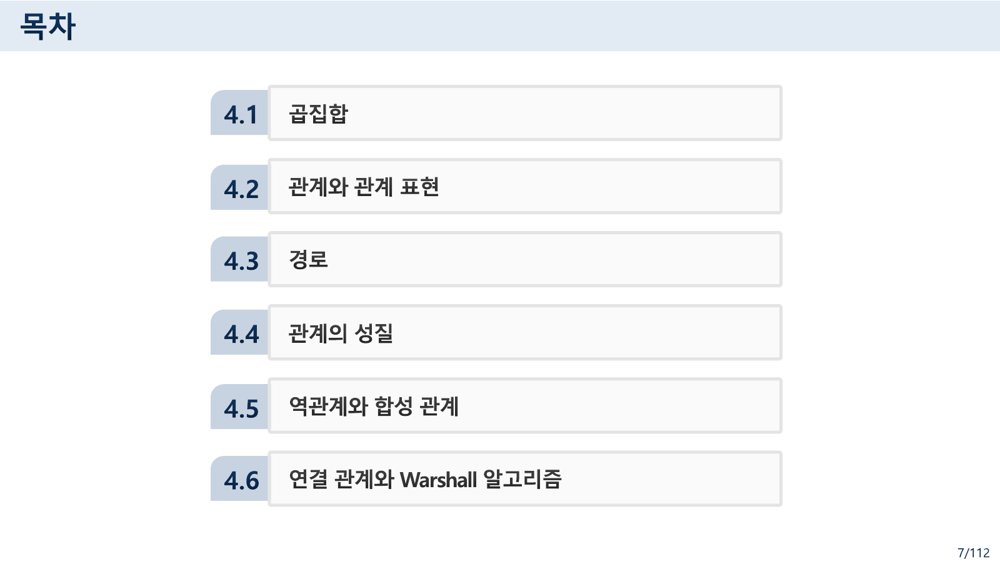
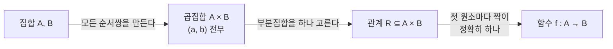
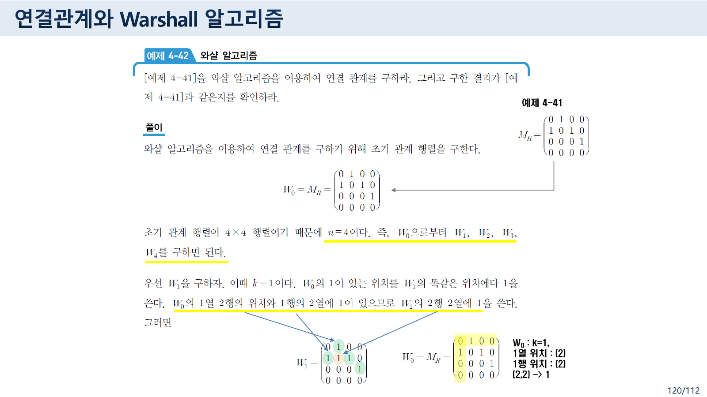
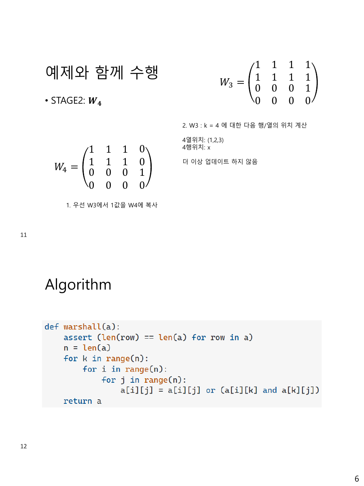

> [!abstract] 제목과 목차가 다른 것을 약속한다
> `4 관계 및 함수.pdf`는 125쪽으로 이 과목에서 가장 두꺼운 자료다. 표지는 **"4 관계(Relation)와 함수(Functions)"**. 그런데 7쪽 목차는 여섯 절을 이렇게 적는다.
>
> > 4.1 곱집합 · 4.2 관계와 관계 표현 · 4.3 경로 · 4.4 관계의 성질 · 4.5 역관계와 합성 관계 · 4.6 연결 관계와 Warshall 알고리즘
>
> **함수가 없다.** 그런데 목차보다 앞선 2·5·6쪽과, 목차 바로 뒤 11~16쪽, 그리고 25쪽에 함수 슬라이드가 놓여 있다. 목차에 없는 내용이 목차 앞뒤를 감싸고 있는 셈이다.
>
> 이 배치가 사실은 이 자료가 하려는 말과 정확히 맞아떨어진다. 9쪽이 그것을 한 줄로 적는다 — **"근현대 수학의 중요한 개념인 함수도 이항 관계의 특별한 경우이다."** 함수는 별도의 절이 아니라 관계의 한 부분집합이고, 12쪽이 그 조건을 기호로 못 박는다. 이 정리는 그 구조를 따라간다.



---

## 1. 곱집합에서 관계까지 — 세 단계

18~21쪽과 26·27쪽이 정의를 쌓아 올린다. 세 단계로 정리하면 이렇다.



- **곱집합** — 18쪽: "순서쌍들로 이루어진 집합을 곱집합이라 한다." 19쪽이 A = {x, y, z}, B = {1, 2, 3}의 A × B를 격자로 그린다. 원소는 9개다.
- **관계** — 26쪽: R ⊆ A × B. 그리고 정의역 `Dom(R)`(첫 원소들의 집합), 치역 `Ran(R)`(둘째 원소들의 집합), 공변역(B 전체)을 구분한다. **치역은 공변역의 부분집합**이다.
- **함수** — 12쪽이 영어 슬라이드로 조건을 적는다.

$$\forall x \,[\, x \in A \rightarrow \exists y \,(\, y \in B \wedge (x,y) \in f \,)\,]$$
$$\forall x, y_1, y_2 \,[\, (x,y_1) \in f \wedge (x,y_2) \in f \rightarrow y_1 = y_2 \,]$$

앞 줄은 "모든 x에 짝이 있다"(빠짐이 없다), 뒷 줄은 "짝이 둘일 수 없다"(겹침이 없다). 두 줄을 합치면 12쪽 본문의 문장이 된다 — *"a function f from A to B contains one, and only one ordered pair (a, b) for every element a ∈ A."*

27쪽이 이항 관계를 삼항·n항으로 확장할 수 있음을 밝히고는 못을 박는다 — **"우리는 이항 관계만을 다루므로 앞으로 관계라고 하면 이항 관계를 말한다."**

> [!note] 같은 슬라이드가 두 번 나온다
> 11쪽과 25쪽은 제목(`Functions 1`)과 본문이 **글자 하나 다르지 않은 같은 슬라이드**다. 11쪽은 목차 직후, 25쪽은 곱집합 절이 끝난 자리에 놓여 있다. 함수를 어디에 둘지 정하지 못한 흔적으로 보인다.
>
> 쪽 번호도 어긋난다. 이 자료의 쪽 번호는 `n/112` 형식인데 PDF는 **125쪽**이다. 그래서 뒤쪽 열세 장이 `113/112`부터 `125/112`까지 분모를 넘어간다. 72·73쪽에는 오른쪽 위에 **`SKIP`** 이라는 표시가 붙어 있어 강의에서 건너뛴 것으로 보인다.

---

## 2. 관계를 그리는 세 가지 방법

32~38쪽이 표현 방법을 셋으로 나눈다.

| 방법 | 원본 설명 | 조건 |
| --- | --- | --- |
| ① 화살표 그림 | 두 원에 A와 B의 원소를 써넣고 관계가 있으면 화살표를 그린다 | A ≠ B여도 된다 |
| ② 관계 행렬 | $m_{ij} = 1$ if $(a_i, b_j) \in R$, else 0 인 m × n 부울 행렬 | A ≠ B여도 된다 |
| ③ 유향 그래프 | A의 원소를 정점으로, $(a_i, a_j) \in R$ 이면 간선을 그린다 | **A에서 A로 가는 관계일 때만** |

③의 제약이 중요하다. 35쪽이 직접 적는다 — "관계를 유향 그래프로 표시하기 위해서는 **A에서 A로 가는 관계인 A에 관한 관계일 때만 가능**하다." 정점 하나가 시점 역할과 종점 역할을 겸해야 하기 때문이다.

세 표현이 같은 것을 말한다는 사실이 §3의 판정을 쉽게 만든다. 56쪽이 그 대응을 정리한다.

| 성질 | 관계 행렬에서 | 유향 그래프에서 |
| --- | --- | --- |
| 반사 | 주대각 원소가 **모두 1** | 모든 정점에 길이 1인 순환(self-loop) |
| 비반사 | 주대각 원소가 **모두 0** | 길이 1인 순환을 갖는 정점이 하나도 없음 |
| 대칭 | 대칭 행렬 | 화살표가 언제나 쌍으로 (= 무향 그래프로 그릴 수 있다) |

55쪽이 여기에 경고를 붙인다.

> [예제 4-19]의 (c)에서 보듯이 **반사 관계가 아니면 비반사 관계가 되고 비반사 관계가 아니면 반사 관계라고 잘못 알고 있으면 안 된다.**

주대각선에 1과 0이 섞여 있으면 반사도 비반사도 아니다. 두 성질은 서로의 부정이 아니라 **양 끝**이다.

---

## 3. 판정해 보기 — 원본 74쪽 연습문제

74쪽은 이 자료에서 유일하게 "직접 해 보라"고 요구하는 슬라이드다.


> Let A = {0,1,2,3} and R a relation over A:
> R = {(0,0),(0,1),(0,3),(1,1),(1,0),(2,3),(3,3)}
>
> • R의 유향 그래프를 그리시오,
> • 그리고 R이 동치 관계인지를 확인하시오.
> • 만약 동치관계가 되기 위한 성질 중의 하나를 만족하지 않는 경우에 반례를 제시하시오

67쪽이 동치 관계의 조건을 셋으로 준다 — **반사 · 대칭 · 추이**. 셋을 다 만족해야 한다. 아래에서 원소를 눌러 관계를 바꿔 가며 세 성질을 판정해 보자. 74쪽의 R이 기본값으로 들어 있다.

```html preview h=680px
<div id="rel-root">
  <style>
    #rel-root{font-family:system-ui,-apple-system,"Segoe UI",sans-serif;color:var(--foreground);
      background:var(--card);border:1px solid var(--border);border-radius:10px;padding:16px}
    #rel-root h4{margin:0 0 4px;font-size:14px}
    #rel-root .sub{font-size:12px;opacity:.72;margin-bottom:12px;line-height:1.55}
    #rel-root .pick{display:flex;gap:6px;flex-wrap:wrap;margin-bottom:12px}
    #rel-root button{font:inherit;font-size:12px;padding:4px 9px;border-radius:6px;cursor:pointer;
      border:1px solid var(--border);background:transparent;color:var(--foreground)}
    #rel-root .row{display:flex;gap:20px;flex-wrap:wrap;align-items:flex-start}
    #rel-root table.m{border-collapse:collapse}
    #rel-root table.m td,#rel-root table.m th{border:1px solid var(--border);width:34px;height:34px;
      text-align:center;font-family:ui-monospace,SFMono-Regular,Menlo,monospace;font-size:13px}
    #rel-root table.m th{background:transparent;opacity:.7;font-size:11.5px}
    #rel-root table.m td{cursor:pointer;user-select:none}
    #rel-root table.m td.on{color:var(--chart-1);font-weight:700;border-color:var(--chart-1)}
    #rel-root table.m td.diag{background:var(--border)}
    #rel-root svg{width:250px;height:230px;border:1px solid var(--border);border-radius:8px}
    #rel-root .props{display:grid;grid-template-columns:1fr;gap:7px;min-width:260px;flex:1}
    #rel-root .p{border:1px solid var(--border);border-radius:8px;padding:8px 11px;font-size:12.5px;line-height:1.5}
    #rel-root .p.ok{border-color:var(--chart-1)}
    #rel-root .p .n{font-weight:600;margin-bottom:2px}
    #rel-root .p .c{opacity:.82;font-family:ui-monospace,SFMono-Regular,Menlo,monospace;font-size:11.5px}
    #rel-root .verdict{margin-top:12px;font-size:13px;border-top:1px dashed var(--border);
      padding-top:10px;line-height:1.6}
    #rel-root .verdict b{color:var(--chart-1)}
  </style>
  <h4>관계의 성질 판정기 — 원본 74쪽 연습문제</h4>
  <div class="sub">행렬 칸을 누르면 그 순서쌍이 들어가고 빠진다. 회색 칸은 주대각선(반사성이 걸리는 자리)이다.
  오른쪽에 세 성질의 판정과 <b>반례</b>가 함께 나온다.</div>
  <div class="pick">
    <button id="rl-orig">원본 74쪽의 R</button>
    <button id="rl-eq">가장 작은 동치 관계로</button>
    <button id="rl-id">항등 관계로</button>
    <button id="rl-empty">비우기</button>
  </div>
  <div class="row">
    <div>
      <table class="m" id="rl-mat"></table>
      <div style="font-size:11px;opacity:.7;margin-top:6px">행 = 첫 원소, 열 = 둘째 원소</div>
    </div>
    <svg id="rl-svg" viewBox="0 0 250 230"></svg>
    <div class="props" id="rl-props"></div>
  </div>
  <div class="verdict" id="rl-v"></div>
  <script>
  (function(){
    const A=[0,1,2,3];
    const ORIG=[[0,0],[0,1],[0,3],[1,1],[1,0],[2,3],[3,3]];
    let R=new Set(ORIG.map(p=>p.join(",")));
    const has=(i,j)=>R.has(i+","+j);
    function toggle(i,j){ const k=i+","+j; R.has(k)?R.delete(k):R.add(k); draw(); }
    function draw(){
      // 행렬
      let h="<tr><th></th>"+A.map(j=>"<th>"+j+"</th>").join("")+"</tr>";
      A.forEach(i=>{
        h+="<tr><th>"+i+"</th>";
        A.forEach(j=>{
          h+='<td data-i="'+i+'" data-j="'+j+'" class="'+(has(i,j)?"on ":"")+(i===j?"diag":"")+'">'+
             (has(i,j)?1:0)+"</td>";
        });
        h+="</tr>";
      });
      const mat=document.getElementById("rl-mat"); mat.innerHTML=h;
      mat.querySelectorAll("td").forEach(td=>{
        td.onclick=()=>toggle(Number(td.dataset.i),Number(td.dataset.j));
      });
      // 유향 그래프
      const pos={0:[62,58],1:[188,58],2:[62,168],3:[188,168]};
      let g='<defs><marker id="ah" markerWidth="7" markerHeight="7" refX="6" refY="3" orient="auto">'+
            '<path d="M0,0 L0,6 L6,3 z" fill="var(--chart-1)"/></marker></defs>';
      A.forEach(i=>A.forEach(j=>{
        if(!has(i,j)) return;
        const [x1,y1]=pos[i], [x2,y2]=pos[j];
        if(i===j){
          g+='<circle cx="'+x1+'" cy="'+(y1-24)+'" r="13" fill="none" stroke="var(--chart-1)" '+
             'stroke-width="1.5" marker-end="url(#ah)"/>';
        } else {
          const dx=x2-x1, dy=y2-y1, L=Math.hypot(dx,dy), ux=dx/L, uy=dy/L;
          const sx=x1+ux*17, sy=y1+uy*17, ex=x2-ux*19, ey=y2-uy*19;
          const mx=(sx+ex)/2 - uy*10, my=(sy+ey)/2 + ux*10;
          g+='<path d="M'+sx+' '+sy+' Q'+mx+' '+my+' '+ex+' '+ey+'" fill="none" '+
             'stroke="var(--chart-1)" stroke-width="1.4" marker-end="url(#ah)"/>';
        }
      }));
      A.forEach(i=>{
        const [x,y]=pos[i];
        g+='<circle cx="'+x+'" cy="'+y+'" r="15" fill="var(--card)" stroke="var(--foreground)" stroke-width="1.3"/>'+
           '<text x="'+x+'" y="'+(y+4.5)+'" text-anchor="middle" font-size="13" fill="var(--foreground)">'+i+'</text>';
      });
      document.getElementById("rl-svg").innerHTML=g;
      // 성질
      const missRef=A.filter(a=>!has(a,a));
      const missSym=[]; A.forEach(i=>A.forEach(j=>{ if(has(i,j)&&!has(j,i)) missSym.push("("+i+","+j+")∈R 인데 ("+j+","+i+")∉R"); }));
      const missTr=[];
      A.forEach(i=>A.forEach(j=>A.forEach(k=>{
        if(has(i,j)&&has(j,k)&&!has(i,k)) missTr.push("("+i+","+j+")·("+j+","+k+")∈R 인데 ("+i+","+k+")∉R");
      })));
      const P=[
        {n:"반사 (reflexive)", ok:missRef.length===0,
         c: missRef.length? "반례 — "+missRef.map(a=>"("+a+","+a+")∉R").join(", ") : "주대각 원소가 모두 1"},
        {n:"대칭 (symmetric)", ok:missSym.length===0,
         c: missSym.length? "반례 — "+missSym.slice(0,3).join(" / ")+(missSym.length>3?" 외 "+(missSym.length-3)+"건":"") : "행렬이 대칭이다"},
        {n:"추이 (transitive)", ok:missTr.length===0,
         c: missTr.length? "반례 — "+missTr.slice(0,3).join(" / ")+(missTr.length>3?" 외 "+(missTr.length-3)+"건":"") : "빠진 지름길이 없다"}
      ];
      document.getElementById("rl-props").innerHTML = P.map(p=>
        '<div class="p'+(p.ok?" ok":"")+'"><div class="n">'+(p.ok?"✓ ":"✗ ")+p.n+'</div>'+
        '<div class="c">'+p.c+'</div></div>').join("");
      const all=P.every(p=>p.ok);
      document.getElementById("rl-v").innerHTML =
        "순서쌍 <b>"+R.size+"개</b>. "+
        (all ? "세 성질을 모두 만족하므로 <b>동치 관계</b>다."
             : "만족하지 않는 성질이 "+P.filter(p=>!p.ok).length+"개 있으므로 <b>동치 관계가 아니다</b>.")
        + (R.size===16 ? "  (A×A 전체 — 동치류가 {0,1,2,3} 하나뿐인 가장 거친 동치 관계다.)" : "");
    }
    document.getElementById("rl-orig").onclick=()=>{ R=new Set(ORIG.map(p=>p.join(","))); draw(); };
    document.getElementById("rl-eq").onclick=()=>{
      R=new Set(); A.forEach(i=>A.forEach(j=>R.add(i+","+j))); draw(); };
    document.getElementById("rl-id").onclick=()=>{
      R=new Set(A.map(a=>a+","+a)); draw(); };
    document.getElementById("rl-empty").onclick=()=>{ R=new Set(); draw(); };
    draw();
  })();
  </script>
</div>
```

원본 R을 넣으면 **세 성질이 모두 깨진다.** 반례를 하나씩 적으면 이렇다.

| 성질 | 반례 |
| --- | --- |
| 반사 | `(2,2) ∉ R` — A의 원소 2에 자기 자신으로 가는 쌍이 없다 |
| 대칭 | `(0,3) ∈ R` 인데 `(3,0) ∉ R` (`(2,3)`도 마찬가지) |
| 추이 | `(1,0) ∈ R` 이고 `(0,3) ∈ R` 인데 `(1,3) ∉ R` |

여기서 한 가지가 더 드러난다. **"가장 작은 동치 관계로" 버튼**을 누르면 관계가 A × A 전체(16개)가 된다. 즉 이 R을 담는 가장 작은 동치 관계는 모든 원소를 한 덩어리로 묶는다. 이유는 사슬을 따라가면 보인다 — `0`은 `1`과 묶이고(`(0,1)`), `0`은 `3`과 묶이며(`(0,3)`), `3`은 `2`와 묶인다(`(2,3)`의 대칭). 넷이 전부 이어진다. 그래서 동치류는 `{0,1,2,3}` 하나뿐이다. 122~125쪽의 "가장 작은 동치 관계" 절이 다루는 것이 이 계산이다.

71쪽이 동치류의 성질을 하나 짚어 둔다 — **"동치류 [a]는 결코 공집합(∅)이 될 수 없다. 왜냐하면 R가 반사 관계이므로 a ∈ [a]이기 때문이다."** 반사성이 있어야 동치류가 빈칸을 만들지 않는다.

---

## 4. 역관계와 여관계 — 값으로 확인하기

76~81쪽이 관계를 뒤집거나 뒤집는 연산을 정의하고, 78쪽에 계산 결과를 그대로 적어 둔다. 집합 A = {a, b, c, d, e} 위의 관계 R에 대해 원본이 적은 값은 이렇다.

> R의 **여관계**: {(a,a), (a,c), (b,a), (b,b), (c,a), (c,b), (c,d), (c,e), (d,a), (d,b), (d,e), (e,a), (e,b), (e,c), (e,d)}
> R의 **역관계**: {(b,a), (d,a), (e,a), (c,b), (d,b), (e,b), (c,c), (c,d), (d,d), (e,e)}
> R과 S의 교집합: {(a,b), (b,e), (c,c), (e,e)}

역관계 $R^{-1} = \{(b,a) \mid (a,b) \in R\}$ 이므로, 역관계를 다시 뒤집으면 원래 R이 나온다.

$$R = \{(a,b),\, (a,d),\, (a,e),\, (b,c),\, (b,d),\, (b,e),\, (c,c),\, (d,c),\, (d,d),\, (e,e)\}$$

원소가 10개다. A × A의 크기는 25이므로 여관계 $\bar{R} = (A \times A) - R$ 는 **15개**여야 하고, 원본이 적은 목록도 정확히 15개다. 실제로 계산해 대조하면 15개가 한 쌍도 어긋나지 않는다. 76쪽이 두 관계의 교집합·합집합을 정의하는 방식도 §5의 논리 연산 그대로다 — `a(R ∩ S)b`는 "a R b **이고** a S b", `a(R ∪ S)b`는 "a R b **또는** a S b".

82~95쪽은 합성 관계로 넘어간다. 85쪽이 합성 가능 조건을 못 박는다.

> 집합 A에서 집합 B로의 관계 R과 집합 B에서 집합 C로의 관계 S가 있을 때, 관계 R에 대해서 공변역이면서 관계 S에 대해서는 정의역인 집합 B가 있기 때문에 관계 R과 S는 합성 가능
>
> • R : A → B 와 S : C → B 의 경우는 R의 공변역(B)과 S의 정의역(C)이 같지 않으므로 합성관계가 성립될 수 없다.
> • **합성관계는 교환법칙이 성립하지 않음**

89쪽이 계산 방법을 준다 — **관계 S∘R은 두 관계행렬 $M_R$과 $M_S$의 부울곱**이다. 곱셈 대신 `∧`, 덧셈 대신 `∨`를 쓰는 행렬 곱이다. 45쪽이 이미 Boolean Product를 소개해 두었고, 47쪽이 그것을 쓰는 이유를 적는다.

> • 유향 그래프를 이용할 때는 사람이 하나씩 찾아가므로 복잡한 그래프에서는 잘못 계산할 수도 있다.
> • 반면에, 관계 행렬을 이용하면 프로그램을 이용해서 자동적으로 계산할 수 있다. **따라서 관계 행렬을 이용하는 방법을 추천한다.**

---

## 5. Warshall — 무한 번 반복하지 않기

97~121쪽이 닫힘(closure)과 Warshall 알고리즘을 다룬다. 118쪽이 문제를 세운다.

> 연결 관계를 구하는 방법
> · 1) 유향 그래프를 이용하는 방법 : 복잡해지면 완전하게 구하는 것이 어려움
> · 2) 관계 행렬을 이용하는 방법 : **무한번 반복 계산해야 한다는 문제점**
> ❖ 1)과 2)의 문제점을 해결하는 방법이 Warshall 법칙

"무한번"이라는 말은 정의를 그대로 따랐을 때의 이야기다. 추이 닫힘 $R^{\infty} = R \cup R^2 \cup R^3 \cup \cdots$ 를 정의대로 계산하면 언제 멈춰야 할지가 정의에 없다. (실제로는 정점이 n개면 $R^n$까지만 보면 되지만, 원본은 그 정리를 명시하지 않고 바로 Warshall로 넘어간다.)

Warshall은 그것을 **n번의 갱신**으로 끝낸다. 부록 `Appendix 1`이 절차를 네 단계로 적는다.

> • STAGE0: N × N 행렬이라면 $W_N$ 까지 구한다
> • STAGE1: $W_{k-1}$ 의 1을 $W_k$ 로 옮겨 쓴다
> • STAGE2: $W_{k-1}$ 에서, 값이 1인 **k열의 위치**(p₁, p₂, …)와 **k행의 위치**(q₁, q₂, …)를 나열한다
> • STAGE3: $W_k$ 의 (pᵢ, qⱼ) 위치를 모두 1로 변경한다

뜻은 간단하다 — **"k를 경유해서 갈 수 있으면 직행 간선을 그어라."** k열에 1이 있는 행 pᵢ는 "pᵢ에서 k로 갈 수 있다"는 뜻이고, k행에 1이 있는 열 qⱼ는 "k에서 qⱼ로 갈 수 있다"는 뜻이다.




원본 120·121쪽(그리고 Appendix 1의 같은 예제)이 쓰는 관계 행렬은 이것이다.

$$M_R = W_0 = \begin{pmatrix} 0&1&0&0 \\ 1&0&1&0 \\ 0&0&0&1 \\ 0&0&0&0 \end{pmatrix}$$

아래에서 단계를 하나씩 밟아 보자. 원본이 적어 둔 "k열 위치 / k행 위치"가 그대로 표시된다.

```html preview h=620px
<div id="ws-root">
  <style>
    #ws-root{font-family:system-ui,-apple-system,"Segoe UI",sans-serif;color:var(--foreground);
      background:var(--card);border:1px solid var(--border);border-radius:10px;padding:16px}
    #ws-root h4{margin:0 0 4px;font-size:14px}
    #ws-root .sub{font-size:12px;opacity:.72;margin-bottom:12px;line-height:1.55}
    #ws-root .ctl{display:flex;gap:8px;flex-wrap:wrap;align-items:center;margin-bottom:14px;font-size:12.5px}
    #ws-root button{font:inherit;font-size:12px;padding:4px 10px;border-radius:6px;cursor:pointer;
      border:1px solid var(--border);background:transparent;color:var(--foreground)}
    #ws-root button.on{border-color:var(--chart-1);color:var(--chart-1)}
    #ws-root .row{display:flex;gap:24px;flex-wrap:wrap;align-items:flex-start}
    #ws-root table{border-collapse:collapse}
    #ws-root td,#ws-root th{border:1px solid var(--border);width:34px;height:34px;text-align:center;
      font-family:ui-monospace,SFMono-Regular,Menlo,monospace;font-size:13px}
    #ws-root th{opacity:.65;font-size:11px}
    #ws-root td.one{color:var(--chart-1);font-weight:700}
    #ws-root td.new{background:var(--chart-1);color:var(--card);font-weight:700}
    #ws-root td.kline{background:var(--border)}
    #ws-root .cap{font-size:11px;letter-spacing:.04em;text-transform:uppercase;opacity:.7;margin-bottom:6px}
    #ws-root .info{font-size:12.5px;line-height:1.75;min-width:250px;flex:1;
      font-family:ui-monospace,SFMono-Regular,Menlo,monospace}
    #ws-root .info b{color:var(--chart-1)}
    #ws-root .note{margin-top:12px;font-size:12.5px;line-height:1.6;
      border-top:1px dashed var(--border);padding-top:10px}
  </style>
  <h4>Warshall 알고리즘 — 원본 120·121쪽의 예제</h4>
  <div class="sub">k를 하나씩 올리며 <b>k를 경유하는 경로</b>를 직행 간선으로 바꾼다.
  회색 줄이 k행과 k열, 굵게 강조된 칸이 이번 단계에서 새로 1이 된 자리다.</div>
  <div class="ctl">
    <span>단계</span>
    <button data-k="0">W₀ (=M_R)</button><button data-k="1">k=1 → W₁</button>
    <button data-k="2">k=2 → W₂</button><button data-k="3">k=3 → W₃</button>
    <button data-k="4">k=4 → W₄</button>
  </div>
  <div class="row">
    <div><div class="cap">행렬</div><table id="ws-tab"></table></div>
    <div class="info" id="ws-info"></div>
  </div>
  <div class="note" id="ws-note"></div>
  <script>
  (function(){
    const M0=[[0,1,0,0],[1,0,1,0],[0,0,0,1],[0,0,0,0]];
    function upto(k){
      let W=M0.map(r=>r.slice()), steps=[];
      for(let s=0;s<k;s++){
        const col=[], row=[];
        for(let i=0;i<4;i++) if(W[i][s]) col.push(i);
        for(let j=0;j<4;j++) if(W[s][j]) row.push(j);
        const added=[];
        col.forEach(i=>row.forEach(j=>{ if(!W[i][j]){ added.push([i,j]); } }));
        col.forEach(i=>row.forEach(j=>{ W[i][j]=1; }));
        steps.push({k:s+1, col:col.map(x=>x+1), row:row.map(x=>x+1), added:added});
      }
      return {W:W, steps:steps};
    }
    let k=0;
    function draw(){
      document.querySelectorAll("#ws-root button").forEach(b=>
        b.classList.toggle("on", Number(b.dataset.k)===k));
      const r=upto(k), last=r.steps[r.steps.length-1];
      const addedSet=new Set((last?last.added:[]).map(p=>p.join(",")));
      let h="<tr><th></th>"+[1,2,3,4].map(j=>"<th>"+j+"</th>").join("")+"</tr>";
      for(let i=0;i<4;i++){
        h+="<tr><th>"+(i+1)+"</th>";
        for(let j=0;j<4;j++){
          const isNew=addedSet.has(i+","+j);
          const kline = k>0 && (i===k-1 || j===k-1);
          h+='<td class="'+(isNew?"new ":(r.W[i][j]?"one ":""))+(kline&&!isNew?"kline":"")+'">'+r.W[i][j]+"</td>";
        }
        h+="</tr>";
      }
      document.getElementById("ws-tab").innerHTML=h;
      document.getElementById("ws-info").innerHTML = k===0
        ? "W₀ = M_R<br>관계 R의 관계 행렬 그대로다.<br>간선: 1→2, 2→1, 2→3, 3→4"
        : "k = "+last.k+"<br>"+
          last.k+"열 위치 : ("+last.col.join(",")+")<br>"+
          last.k+"행 위치 : ("+last.row.join(",")+")<br>"+
          (last.added.length
            ? "새로 1이 되는 자리 :<br>&nbsp;&nbsp;<b>"+
              last.added.map(p=>"("+(p[0]+1)+","+(p[1]+1)+")").join(", ")+"</b>"
            : "<b>더 이상 업데이트 하지 않음</b>");
      const notes={
        0:"출발 행렬. 정점 1에서 2, 2에서 1과 3, 3에서 4로 가는 간선이 있다.",
        1:"원본 120쪽과 같다 — 1열 위치 (2), 1행 위치 (2), 따라서 (2,2)가 1이 된다. 2→1→2 라는 왕복이 생겼다는 뜻이다.",
        2:"원본 121쪽 위쪽과 같다 — 2열 위치 (1,2), 2행 위치 (1,2,3). 여섯 자리가 1이 되고 그중 (1,1),(1,3),(2,3)이 새로 붙는다.",
        3:"원본 121쪽 아래쪽과 같다 — 3열 위치 (1,2), 3행 위치 (4). (1,4)와 (2,4)가 추가된다.",
        4:"4열 위치는 (1,2,3)이지만 4행에 1이 하나도 없다. 정점 4에서 나가는 간선이 없으므로 경유가 불가능하다 — 갱신 없음. 이것이 최종 추이 닫힘 R∞ 이다."
      };
      document.getElementById("ws-note").textContent=notes[k];
    }
    document.querySelectorAll("#ws-root button").forEach(b=>{
      b.onclick=()=>{ k=Number(b.dataset.k); draw(); };
    });
    draw();
  })();
  </script>
</div>
```

원본이 적어 둔 세 단계와 한 칸도 다르지 않다.

| 단계 | 원본이 적은 것 | 계산 결과 |
| --- | --- | --- |
| k=1 | 1열 위치 (2), 1행 위치 (2) → (2,2) → 1 | 일치 |
| k=2 | 2열 위치 (1,2), 2행 위치 (1,2,3) → (1,1)(1,2)(1,3)(2,1)(2,2)(2,3) | 일치 |
| k=3 | 3열 위치 (1,2), 3행 위치 (4) → (1,4)(2,4) 추가 | 일치 |



> [!caution] 부록의 마지막 단계에 옮겨 적기 실수가 있다
> `Appendix 1 Floyd Warshall Algorithm.pdf` 6쪽(슬라이드 11)은 k=4 단계를 다룬다. 설명은 정확하다 — "4열위치: (1,2,3), 4행위치: x, **더 이상 업데이트 하지 않음**". 그런데 그 옆에 그려진 $W_4$ 행렬이 이렇다.
>
> $$W_4 = \begin{pmatrix}1&1&1&\mathbf{0}\\1&1&1&\mathbf{0}\\0&0&0&1\\0&0&0&0\end{pmatrix}$$
>
> 같은 쪽 오른쪽 위의 $W_3$ 는 (1,4)와 (2,4)가 1이다. "$W_3$ 에서 1값을 $W_4$ 에 복사"한다고 적어 놓고 **그 두 칸을 빠뜨렸다.** $W_4$ 는 $W_3$ 와 같아야 한다.
>
> $$W_4 = W_3 = \begin{pmatrix}1&1&1&1\\1&1&1&1\\0&0&0&1\\0&0&0&0\end{pmatrix}$$
>
> 표시된 행렬은 사실 $W_2$ 다. 단계 이름도 어긋난다 — 정의는 STAGE0~3인데 예제는 "STAGE1: 4×4이기 때문에 W₄까지 계산함"(정의의 STAGE0), "STAGE2: W₁"(정의의 STAGE1·2)처럼 **한 칸씩 밀려** 있다.

Appendix 1은 이어서 같은 아이디어를 가중치 그래프로 확장한 **Floyd-Warshall**로 넘어간다. 인접 행렬의 0 대신 ∞를 쓰고, 부울 OR 대신 `min`을, AND 대신 `+`를 쓰면 "갈 수 있는가"가 "얼마에 갈 수 있는가"가 된다. 3쪽의 시작 행렬이 그 예다.

| | 0 | 1 | 2 | 3 |
| --- | --- | --- | --- | --- |
| **0** | 0 | 6 | 5 | INF |
| **1** | INF | 0 | 4 | 3 |
| **2** | INF | INF | 0 | 2 |
| **3** | INF | INF | INF | 0 |

---

## 6. 과제 I가 요구하는 것

`Discrete_Mathematics__Homework_I (1).pdf`(4쪽, 2024년 11월 4일)는 이 자료의 내용을 그대로 묻는다. 총 **18문항 · 문항당 10점 · 180점** 이고, 세 시나리오로 나뉜다.

| 절 | 시나리오 | 묻는 것 | 이 자료의 어디 |
| --- | --- | --- | --- |
| 1.1 | 항공 노선 A→B→C→D→E→A | 유향 그래프로 표현, 강연결 여부, 강연결 요소 | §2 유향 그래프 |
| 1.2 | A→D, B→E 항공편 추가 | BFS로 A에서 E까지 최단 경로 | 그래프 자료 |
| 1.3 | 같은 그래프 | **Warshall 알고리즘으로 추이 닫힘**, 도달 가능성 해석 | §5 |
| 2.1 | Alice→Bob→Charlie→Alice, Alice→Dana | 대칭/반대칭 판정, 순환 찾기 | §3 |
| 2.2 | 같은 네트워크 | 추이성으로 팔로 추천이 가능한가 | §3 |
| 3.1 | 사원 E1~E4의 이메일 권한 | 인접 행렬 작성, 완전 그래프인지 | §2 관계 행렬 |
| 3.2 | 같은 시스템 | 반사·대칭인가, 반사를 허용하면 무엇이 바뀌나 | §3 |
| 3.3 | E1이 전원에게 공지 | 완전성이 정보 전달을 보장하는가, 간선 하나가 끊기면 | §5 |

1.1의 노선은 `A→B→C→D→E→A`로 다섯 정점이 하나의 순환을 이룬다. 어느 공항에서 출발해도 순환을 따라 모든 공항에 갈 수 있으므로 **강연결이고 강연결 요소는 하나**다. 1.2에서 `A→D`와 `B→E`가 더해지면 A에서 E로 가는 최단 경로는 `A→B→E`(2편)이거나 `A→D→E`(2편)다. 원래 경로 `A→B→C→D→E`는 4편이었다.

3.1의 "각 사원은 자기 자신을 제외한 모든 사원에게 메일을 보낼 수 있다"는 조건은 **주대각이 0이고 나머지가 전부 1인 4 × 4 행렬**을 만든다. §2의 표에 비추면 이것은 **비반사**이고 **대칭**이다.

과제 안내문에는 이 과목의 성격을 보여 주는 조건이 둘 붙어 있다.

> (주의사항) **ChatGPT 등의 거대언어모델 사용, 다른 학우에 의한 도움 등은 가능하지만, 출처를 남기지 않는 경우는 과제점수는 0점 처리함.** 수기형태로 작성된 문서가 아닌 hwp, word 등의 타이핑(Typing)을 통한 문서 작성은 0점으로 처리함.

도구를 금지하는 대신 **출처 표기를 요구**하고, 대신 답안은 손으로 쓰게 한다. 첫 강의 자료 22·23쪽의 학업 진정성 조항과 같은 방침이다.

---

## 7. 확인 문제

1. 자료의 제목에는 함수가 있는데 목차에는 없다. 9쪽의 어느 문장이 그 배치를 설명하는가
2. 12쪽의 두 논리식 중 "함수는 한 입력에 두 출력을 줄 수 없다"에 해당하는 것은 어느 쪽인가
3. 관계를 유향 그래프로 그릴 수 있으려면 어떤 조건이 필요한가? 왜 그런가
4. 74쪽의 R이 추이 관계가 아님을 보이는 반례를 하나 적어 보라
5. 74쪽의 R을 담는 가장 작은 동치 관계의 동치류는 몇 개인가? 왜 그렇게 되는가
6. 관계 행렬의 주대각선에 1과 0이 섞여 있다면 그 관계는 반사인가, 비반사인가, 아니면 어느 쪽도 아닌가
7. Warshall의 k번째 단계에서 "k열 위치"와 "k행 위치"가 각각 뜻하는 것을 경로의 말로 옮겨 보라
8. Appendix 1의 W₄ 행렬이 W₃와 달라진 곳은 어디인가? 어느 쪽이 맞는가

---

## 8. 이어지는 자료

- [03. 없는 칸 하나](<./03. 없는 칸 하나 — 집합의 네 종류 중 하나는 비어 있다.md>) — 곱집합의 정의가 여기서 왔다
- [05. 필요조건을 충분조건으로 쓴 자리](<./05. 필요조건을 충분조건으로 쓴 자리.md>) — 유향 그래프·인접 행렬·강연결이 그래프 자료에서 다시 나온다
- [06. 같은 트리를 세 번 읽으면](<./06. 같은 트리를 세 번 읽으면.md>) — 72쪽이 "트리"를 관계의 한 조합으로 분류한다

---

## 근거 자료

`ComputerScience/02_math-theory/discrete-mathematics/sources/4 관계 및 함수.pdf` (125쪽) 및 `Discrete_Mathematics__Homework_I (1).pdf` (4쪽), `Appendix 1 Floyd Warshall Algorithm.pdf` (10쪽) 중 Warshall 부분.

| 쪽 | 내용 | 이 문서에서 쓴 곳 |
| --- | --- | --- |
| 2·5·6 | Function의 사전적 정의, 파이썬 함수, 인스타그램 | §0 |
| 7~10 | 목차, 미리보기 | §0 |
| 11~16 · 25 | 함수의 정의·표현·정의역/공변역/치역 | §1 |
| 18~24 | 순서쌍과 곱집합, n차 확장 | §1 |
| 26~31 | 이항 관계, 삼항 관계, 항등 관계 | §1 |
| 32~38 | 화살표 그림 · 관계 행렬 · 유향 그래프 | §2 |
| 40~50 | 경로, 순환, Boolean Product, 경로의 합성, 역경로 | §4 |
| 52~66 | 반사·비반사·대칭·반대칭·추이 관계 | §2 · §3 |
| 67~74 | 동치 관계, 동치류, 여러 가지 관계, 연습문제 | §3 |
| 76~81 | 역관계와 여관계 | §4 |
| 82~95 | 합성 관계와 거듭제곱 | §4 |
| 97~117 | 반사 닫힘 · 대칭 닫힘 · 추이 닫힘 | §5 |
| 118~121 | 연결 관계와 Warshall 알고리즘 | §5 인터랙티브 |
| 122~125 | 가장 작은 동치 관계 | §3 |

인용한 슬라이드 3장은 위 PDF 7·74·120·121쪽 중 세 쪽을 120dpi로 렌더링한 것이다.

본문의 계산은 전부 파이썬으로 확인했다 — 74쪽 R의 세 성질과 반례, 그 R을 담는 가장 작은 동치 관계(A × A 전체 16쌍), 78쪽의 역관계에서 복원한 R(10쌍)과 여관계(15쌍)의 일치, Warshall 세 단계의 갱신 위치, 그리고 Appendix 1의 W₄가 W₃와 같아야 한다는 점. 이 자료는 영어 슬라이드의 `∀`·`∃`·`∧`·`¬` 기호가 텍스트 추출에서 사라지므로, 논리식이 실린 쪽(12·53·58·59·65쪽)은 슬라이드 이미지로 확인했다.
