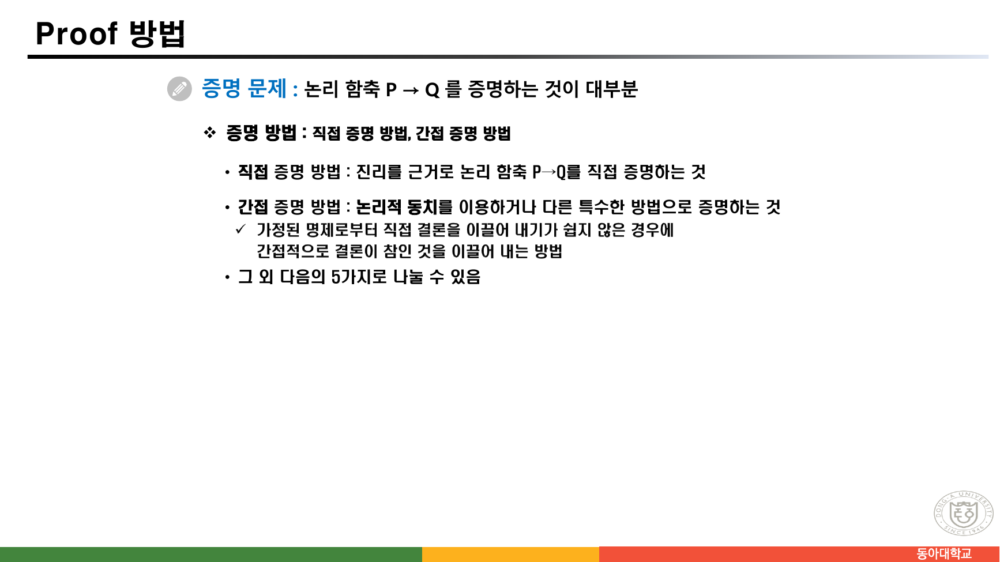
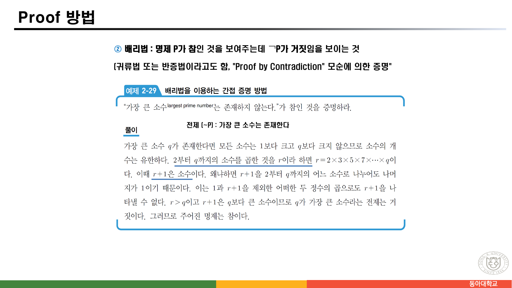
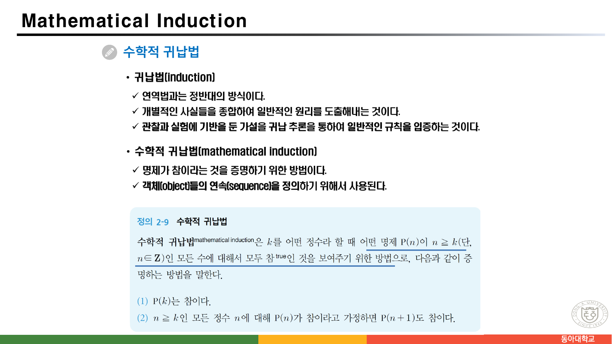
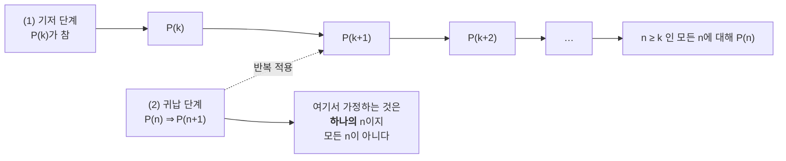
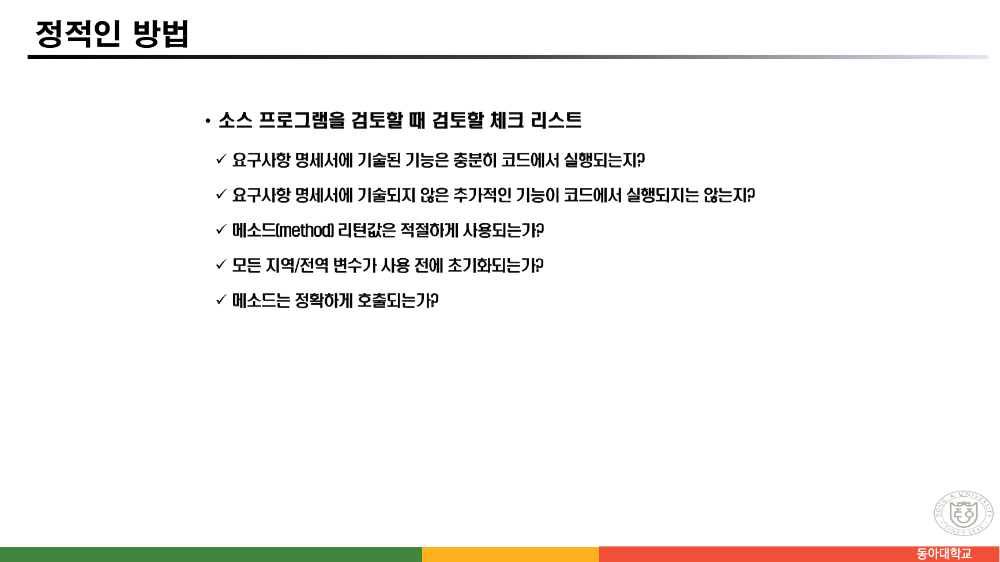
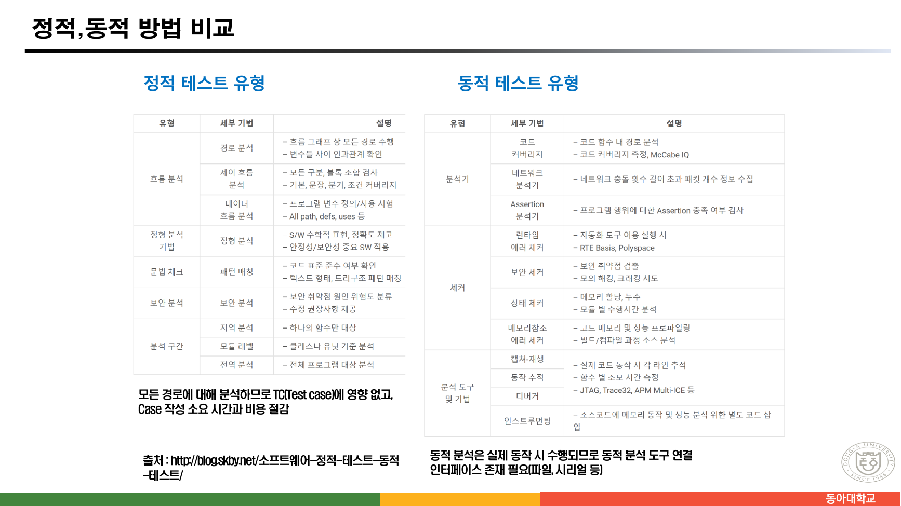
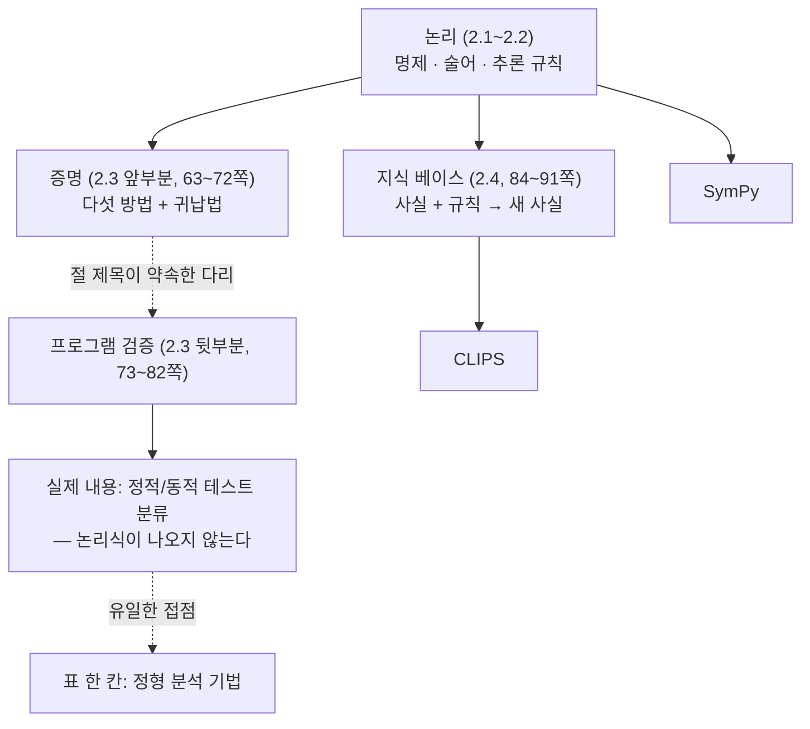

> [!abstract] 절 제목이 약속한 다리가 놓이지 않는다
> 2쪽의 목차는 이 장의 셋째 절을 **"2.3 증명 기술과 프로그램 검증"** 이라 적었다. 두 낱말을 한 절 제목에 묶어 놓았으니, 증명 기술이 프로그램 검증으로 이어지는 다리가 있으리라 기대하게 된다.
>
> 그런데 실제로는 63~72쪽이 증명 방법 다섯 가지와 수학적 귀납법을 다루고, 73쪽에서 "프로그램 검증(program verification) : 매우 어려운 문제"라는 한 줄이 나온 다음, 74~82쪽은 **소프트웨어 테스팅 분류표**로 넘어간다. 정적 분석·동적 분석·코드 커버리지·디버거 — **논리식이 한 번도 등장하지 않는다.** 82쪽의 표 두 개는 출처가 개인 기술 블로그다.
>
> 그래서 이 정리의 척추는 **"논리가 시스템으로 건너가려다 어디서 멈추는가"** 다. 앞의 열 쪽(증명)은 촘촘하고, 뒤의 열 쪽(검증)은 다른 분야의 자료로 채워져 있으며, 마지막 여덟 쪽(지식 베이스)에서 다시 논리로 돌아온다.

---

## 1. 증명해야 할 것은 대개 함축이다

63쪽이 문제를 정의한다.



> **증명 문제 : 논리 함축 P → Q 를 증명하는 것이 대부분**
>
> ❖ 증명 방법 : 직접 증명 방법, 간접 증명 방법
> • **직접 증명 방법** : 진리를 근거로 논리 함축 P→Q를 직접 증명하는 것
> • **간접 증명 방법** : 논리적 동치를 이용하거나 다른 특수한 방법으로 증명하는 것

첫 줄이 앞 절과 이 절을 잇는다. **12쪽에서 배운 함축의 진리표가 곧 증명 전략의 목록이 된다.** `P → Q` 는 `P` 가 참이고 `Q` 가 거짓일 때만 거짓이므로, 참임을 보이는 길이 세 갈래다 — `P` 가 거짓임을 보이거나, `Q` 가 참임을 보이거나, `P` 가 참일 때 `Q` 도 참임을 보이거나.

64·65쪽이 그 세 갈래에 이름을 붙이고, 65·69쪽이 나머지 둘을 더한다.

```html preview h=600px
<div style="font-family:system-ui,-apple-system,sans-serif;padding:18px;color:var(--foreground)">
  <p style="font-size:12.5px;color:var(--muted-foreground);margin:0 0 12px">
    원본 64~69쪽의 다섯 가지 방법이다. 각 방법이 진리표의 <b>어느 칸을 겨냥</b>하는지 함께 표시했다.
  </p>
  <div style="display:flex;gap:20px;flex-wrap:wrap;align-items:flex-start">
    <div>
      <div style="font-size:11.5px;font-weight:700;color:var(--muted-foreground);margin-bottom:6px">P → Q 의 진리표</div>
      <table style="border-collapse:collapse;font-family:ui-monospace,monospace;font-size:13px">
        <tr><th style="padding:5px 12px;border-bottom:2px solid var(--border)">P</th>
            <th style="padding:5px 12px;border-bottom:2px solid var(--border)">Q</th>
            <th style="padding:5px 12px;border-bottom:2px solid var(--border);border-left:1px solid var(--border)">P→Q</th></tr>
        <tbody id="tbody"></tbody>
      </table>
    </div>
    <div style="flex:1;min-width:260px;display:flex;flex-direction:column;gap:7px" id="mlist"></div>
  </div>
  <div id="det" style="margin-top:14px;padding:12px 14px;background:var(--card);border:1px solid var(--border);border-left:4px solid var(--chart-1);border-radius:var(--radius);font-size:13px;line-height:1.8"></div>

  <script>
    var M = [
      {k:'vacuous', n:'(1) vacuous 증명', p:64, rows:[2,3],
       q:'P가 <b>거짓</b>이라 하면 P→Q는 항상 참이다. 그래서 P→Q가 참인 것을 보이기 위해 <b>P가 거짓이라는 것만</b> 보이면 된다.',
       e:'전건이 거짓인 두 줄(P=F)에서는 Q가 무엇이든 함축이 참이다. 14쪽의 “If 1 + 1 = 3, then your grandma wears combat boots.”가 바로 이 경우다.'},
      {k:'trivial', n:'(2) trivial 증명', p:64, rows:[0,2],
       q:'Q가 <b>참</b>이라고 하면 P→Q는 참이다. 그래서 P→Q가 참인 것을 보이기 위해 <b>Q가 참이라는 것만</b> 보이면 된다.',
       e:'후건이 참인 두 줄(Q=T)에서는 P가 무엇이든 함축이 참이다.'},
      {k:'direct', n:'(3) 직접 증명', p:65, rows:[0],
       q:'P가 참이라고 하면 P→Q가 참이기 위해서는 <b>Q도 참이어야 한다</b>.',
       e:'원본이 든 예 — <code>6x + 9y = 101 → x 또는 y가 정수가 아님</code>. 왼쪽이 P, 오른쪽이 Q다. P가 성립한다고 가정하고 Q를 이끌어낸다.'},
      {k:'indirect', n:'(4) 간접 증명', p:65, rows:[1],
       q:'가정된 명제로부터 추론에 의해서 결론에 직접 도달되기가 어려운 경우에 간접적으로 결론이 참인 것을 이끌어내는 방법. <b>대우 · 배리법 · 존재 증명</b> 세 가지로 나뉜다.',
       e:'세 갈래 중 대우(66쪽)는 P=T·Q=F인 <b>유일한 거짓 칸</b>을 반대편에서 막는다 — ¬Q→¬P를 증명하면 그 칸이 생길 수 없다. 배리법(67쪽)은 ¬P가 거짓임을 보이고, 존재 증명(68쪽)은 ∃x P(x)를 실물로 보인다.'},
      {k:'disproof', n:'(5) 반증', p:69, rows:[1],
       q:'어떤 명제가 <b>거짓임</b>을 밝히기 위한 방법. ① 반례에 의한 반증 ② 모순에 의한 반증.',
       e:'① ∀x P(x)가 거짓임을 보이려면 그 부정 <b>∃x ¬P(x)</b>가 참임을 보이면 되고, 그 x를 <b>반례</b>라 한다 — 44쪽의 한정자 드 모르간이 여기서 쓰인다. ② 명제가 참이라 가정해 이미 아는 사실과 모순되는 결론을 유도한다.'}
    ];
    var sel = 0;
    var ROWS = [[true,true,true],[true,false,false],[false,true,true],[false,false,true]];
    function draw() {
      var hl = M[sel].rows;
      document.getElementById('tbody').innerHTML = ROWS.map(function (r, i) {
        var on = hl.indexOf(i) >= 0;
        function td(v, l) {
          return '<td style="padding:5px 12px;text-align:center;border-bottom:1px solid var(--border);' +
            (l ? 'border-left:1px solid var(--border);' : '') +
            (on ? 'background:var(--card);' : 'opacity:.4;') + 'color:' +
            (v ? 'var(--chart-2)' : 'var(--chart-5)') + ';font-weight:600">' + (v ? 'T' : 'F') + '</td>';
        }
        return '<tr>' + td(r[0]) + td(r[1]) + td(r[2], true) + '</tr>';
      }).join('');
      document.getElementById('mlist').innerHTML = M.map(function (m, i) {
        return '<div class="mi" data-i="' + i + '" style="cursor:pointer;padding:9px 12px;border:1px solid ' +
          (i === sel ? 'var(--chart-1)' : 'var(--border)') + ';border-left:4px solid ' +
          (i === sel ? 'var(--chart-1)' : 'var(--border)') + ';border-radius:var(--radius);background:var(--card)">' +
          '<div style="font-size:13.5px;font-weight:600">' + m.n +
          ' <span style="font-size:11px;font-weight:400;color:var(--muted-foreground)">' + m.p + '쪽</span></div></div>';
      }).join('');
      document.getElementById('det').innerHTML =
        '<div style="font-size:13px;margin-bottom:7px">' + M[sel].q + '</div>' +
        '<div style="font-size:12.5px;color:var(--muted-foreground);line-height:1.7">' + M[sel].e + '</div>';
      Array.prototype.forEach.call(document.getElementsByClassName('mi'), function (el) {
        el.onclick = function () { sel = +el.getAttribute('data-i'); draw(); };
      });
    }
    draw();
  </script>
</div>
```

> [!note] (1)과 (2)는 증명이 아니라 우회로다
> vacuous 증명과 trivial 증명은 `Q` 의 내용을 한 번도 보지 않는다. 전건이 거짓이거나 후건이 참이면 **둘 사이의 관계와 무관하게** 함축이 참이 되기 때문이다. 13쪽이 "P와 Q가 서로 연관이 없을지라도 임의의 두 명제를 결합할 수 있다"고 적었던 그 성질이 여기서 증명 전략이 된다.

---

## 2. 배리법 — 유클리드의 논증이 어디까지 유효한가



67쪽이 배리법을 정의하고 예제 하나를 붙인다.

> ② **배리법** : 명제 P가 참인 것을 보여주는데 ¬P가 거짓임을 보이는 것
> (귀류법 또는 반증법이라고도 함, "Proof by Contradiction" 모순에 의한 증명)
>
> **[예제 2-29]** "가장 큰 소수(largest prime number)는 존재하지 않는다."가 참인 것을 증명하라.
> **전제(~P) : 가장 큰 소수는 존재한다**
>
> **풀이** — 가장 큰 소수 `q` 가 존재한다면 모든 소수는 1보다 크고 `q` 보다 크지 않으므로 소수의 개수는 유한하다. **2부터 `q` 까지의 소수를 곱한 것을 `r` 이라 하면** `r = 2×3×5×7×⋯×q` 이다. 이때 **`r+1` 은 소수이다.** 왜냐하면 `r+1` 을 2부터 `q` 까지의 어느 소수로 나누어도 나머지가 1이기 때문이다. 이는 1과 `r+1` 을 제외한 어떠한 두 정수의 곱으로도 `r+1` 을 나타낼 수 없다. `r > q` 이고 `r+1` 은 `q` 보다 큰 소수이므로 `q` 가 가장 큰 소수라는 전제는 거짓이다. 그러므로 주어진 명제는 참이다.

이 논증은 **가정 안에서는 옳다.** "`q` 가 가장 큰 소수"라는 전제가 살아 있는 동안에는 소수 전체가 `{2, 3, 5, …, q}` 이므로, 그 어느 것으로도 나누어지지 않는 `r+1` 은 소수일 수밖에 없다.

문제는 그 문장이 **가정 밖으로 나가는 순간 거짓이 된다**는 것이다. 실제로 계산해 보면 바로 드러난다.

```html preview h=520px
<div style="font-family:system-ui,-apple-system,sans-serif;padding:18px;color:var(--foreground)">
  <p style="font-size:12.5px;color:var(--muted-foreground);margin:0 0 12px">
    <b>보충 검증(원본에 없는 계산)</b> — “2부터 q까지의 소수를 곱한 것 + 1”을 실제로 소인수분해했다.
    원본의 가정(“q가 가장 큰 소수”)이 <b>없는</b> 현실 세계에서 무슨 일이 일어나는지 보라.
  </p>
  <label for="qi" style="font-size:12.5px;font-weight:600">q = <span id="qv" style="color:var(--chart-1);font-size:18px;font-weight:700">13</span> 까지의 소수를 곱한다</label>
  <input id="qi" type="range" min="0" max="10" step="1" value="5" style="width:100%;accent-color:var(--primary);margin:6px 0 14px" />
  <div id="calc" style="padding:12px 14px;background:var(--card);border:1px solid var(--border);border-radius:var(--radius);font-size:13px;line-height:1.9;font-family:ui-monospace,monospace;word-break:break-all"></div>
  <div id="msg" style="margin-top:11px;padding:11px 13px;border:1px solid var(--border);border-left:4px solid var(--chart-3);border-radius:var(--radius);background:var(--card);font-size:13px;line-height:1.75"></div>

  <script>
    var P = [2,3,5,7,11,13,17,19,23,29,31];
    function factor(n) {
      var f = [], d = 2n, x = n;
      while (d * d <= x) { while (x % d === 0n) { f.push(d); x /= d; } d += 1n; }
      if (x > 1n) f.push(x);
      return f;
    }
    var sl = document.getElementById('qi');
    function draw() {
      var k = parseInt(sl.value, 10), q = P[k];
      document.getElementById('qv').textContent = q;
      var r = 1n;
      for (var i = 0; i <= k; i++) r *= BigInt(P[i]);
      var fs = factor(r + 1n), prime = fs.length === 1;
      var big = fs.every(function (f) { return f > BigInt(q); });
      document.getElementById('calc').innerHTML =
        'r = ' + P.slice(0, k + 1).join(' × ') + ' = <b>' + r.toString() + '</b><br/>' +
        'r + 1 = <b style="color:var(--chart-1)">' + (r + 1n).toString() + '</b><br/>' +
        '소인수분해: ' + fs.join(' × ') +
        ' &nbsp;<span style="color:' + (prime ? 'var(--chart-2)' : 'var(--chart-5)') + ';font-weight:700">(' +
        (prime ? '소수' : '합성수') + ')</span>';
      document.getElementById('msg').innerHTML = prime
        ? 'r+1이 <b>소수</b>다 — 슬라이드의 문장 “r+1은 소수이다”가 이 값에서는 그대로 맞는다.'
        : 'r+1이 <b style="color:var(--chart-5)">합성수</b>다. 슬라이드가 적은 “r+1은 소수이다”는 <b>일반적으로는 성립하지 않는다</b>. ' +
          '다만 소인수가 모두 q = ' + q + ' 보다 ' + (big ? '<b>크다</b>' : '크지는 않다') +
          ' — 그래서 “q가 가장 큰 소수”라는 전제와는 여전히 모순이 생긴다. 논증의 결론은 안전하고, <b>중간 문장 하나만 과하게 강했던 것</b>이다.';
    }
    sl.oninput = draw;
    draw();
  </script>
</div>
```

`q = 13` 에서 `r = 30030`, `r+1 = 30031 = 59 × 509` 다. **소수가 아니다.** 그러나 두 소인수 59와 509가 모두 13보다 크므로, "13이 가장 큰 소수"라는 전제와는 여전히 모순이다.

> [!tip] 원본의 문장은 왜 더 강한가
> 배리법의 가정("`q` 가 가장 큰 소수") 아래에서는 `q` 보다 큰 소수가 아예 없으므로 `r+1` 의 소인수가 존재할 자리가 없고, 따라서 `r+1` 자신이 소수여야 한다 — 원본의 문장은 그 안에서 옳다.
>
> 하지만 **가정을 빼고 읽으면 틀린 문장**이 되므로, 배리법 예제를 인용할 때는 어디까지가 가정 안인지 표시해 두는 편이 안전하다. 더 튼튼한 형태는 "`r+1` 의 **모든 소인수는 `q` 보다 크다**"이고, 위 계산기가 그것을 확인해 준다. 이 문단과 계산은 원본에 없는 보충이다.

이 예제 주변에는 용어가 겹치는 자리도 하나 있다.

> [!caution] 원본 용어 충돌 — 반증법 / 반증
> 67쪽은 배리법을 "**귀류법 또는 반증법**이라고도 함"이라 적는다. 그런데 두 쪽 뒤 69쪽은 **"어떤 명제가 거짓임을 밝히기 위해 반증을 이용하는 방법"** 이라며 `disproof, proof against` 를 병기한다. 즉 같은 자료 안에서 **"반증"이 두 가지를 가리킨다** — 67쪽에서는 `proof by contradiction`(참을 증명하는 방법), 69쪽에서는 `disproof`(거짓을 증명하는 방법). 정반대 목적의 두 방법이다.

---

## 3. 수학적 귀납법 — 정의 한 줄이 흔들린다

70쪽이 귀납법과 연역법을 대비하며 시작한다.

> 새로운 결과를 얻기 위한 대표적인 논증 방법 : **연역법, 귀납법**
> (연역법의 예로) p이면 q이다 / q이면 r이다 / 따라서 p이면 r이다

71쪽이 귀납법과 수학적 귀납법을 구분한다.



> **귀납법(induction)** — 연역법과는 정반대의 방식이다. 개별적인 사실들을 종합하여 일반적인 원리를 도출해내는 것이다. 관찰과 실험에 기반을 둔 가설을 귀납 추론을 통하여 일반적인 규칙을 입증하는 것이다.
>
> **수학적 귀납법(mathematical induction)** — 명제가 참이라는 것을 증명하기 위한 방법이다. 객체(object)들의 연속(sequence)을 정의하기 위해서 사용된다.
>
> **[정의 2-9]** 수학적 귀납법은 `k` 를 어떤 정수라 할 때 어떤 명제 P(n)이 `n ≥ k`(단, `n ∈ Z`)인 모든 수에 대해서 모두 참인 것을 보여주기 위한 방법으로, 다음과 같이 증명하는 방법을 말한다.
> (1) P(`k`)는 참이다.
> (2) `n ≥ k` 인 **모든 정수 `n` 에 대해 P(`n`)가 참이라고 가정하면** P(`n+1`)도 참이다.

여기서 (2)의 문장이 문제가 된다.

> [!warning] 원본 오류 — [정의 2-9] (2)의 가정 범위
> (2)가 **"`n ≥ k` 인 모든 정수 `n` 에 대해 P(`n`)가 참이라고 가정하면"** 으로 적혀 있다. 이대로 읽으면 증명할 것을 이미 다 가정하는 셈이라 정의가 공허해진다.
>
> 올바른 형태는 "`n ≥ k` 인 **임의의(어떤 하나의)** 정수 `n` 에 대해 P(`n`)가 참이라고 가정하면 P(`n+1`)도 참이다"이다. 하나를 골라 가정하고 다음 하나를 이끌어내는 것이 귀납 단계이고, 그 고리가 (1)의 출발점에서 시작해 위로 이어진다. "모든"과 "임의의"의 차이가 정의 전체를 좌우한다.

두 단계가 하는 일은 이렇게 갈린다.



원본은 정의 뒤에 예제를 72쪽 한 장으로 붙이고 곧바로 프로그램 검증으로 넘어간다. **귀납법에 배정된 분량은 세 쪽(70~72쪽)** 이다 — 증명 방법 다섯 가지에 일곱 쪽(63~69쪽)을 쓴 것과 비교하면 짧다.

---

## 4. 다리가 끊기는 자리

73쪽과 74쪽은 **완전히 같은 내용**이다. 두 쪽 모두 제목이 `Program Verification` 이고 본문이 한 줄이다.

> 프로그램 검증(program verification) : **매우 어려운 문제**

그리고 75쪽부터 성격이 바뀐다.



77쪽의 내용은 이렇다.

> **소스 프로그램을 검토할 때 검토할 체크 리스트**
> ✓ 요구사항 명세서에 기술된 기능은 충분히 코드에서 실행되는지?
> ✓ 요구사항 명세서에 기술되지 않은 추가적인 기능이 코드에서 실행되지는 않는지?
> ✓ 메소드(method) 리턴값은 적절하게 사용되는가?
> ✓ 모든 지역/전역 변수가 사용 전에 초기화되는가?
> ✓ 메소드는 정확하게 호출되는가?

**코드 리뷰 체크리스트다.** 앞의 열 쪽에서 배운 함축·대우·귀납법이 여기서 한 번도 쓰이지 않는다. 82쪽에서 그 성격이 확정된다.



82쪽은 표 두 개를 나란히 놓는다.

| 정적 테스트 유형 | 동적 테스트 유형 |
| --- | --- |
| 흐름 분석(경로 분석 · 제어 흐름 분석 · 데이터 흐름 분석) | 분석기(코드 커버리지 · 네트워크 분석기 · Assertion 분석기) |
| 정형 분석 기법(S/W 수학적 표현, 정확도 제고) | 체커(런타임 에러 · 보안 · 상태 · 메모리참조 에러) |
| 문법 체크(패턴 매칭) | 분석 도구 및 기법(캡쳐-재생 · 동작 추적 · 디버거 · 인스트루먼팅) |
| 보안 분석 · 분석 구간(지역/모듈/전역) | — |

> 출처 : `http://blog.skby.net/소프트웨어-정적-테스트-동적-테스트/`

표 안의 한 칸이 앞 절과 이어질 뻔한다.

> [!important] 절 제목이 약속한 다리
> 표 안에 **"정형 분석 기법 — S/W 수학적 표현, 정확도 제고, 안정성/보안성 중요 SW 적용"** 이라는 한 줄이 있다. 이 한 칸이 앞의 논리와 이어지는 유일한 지점인데, 그 자리에서 더 나아가지 않는다.
>
> 즉 **"증명 기술과 프로그램 검증"이라는 절 제목이 약속한 다리 — 논리식으로 프로그램의 성질을 증명하는 방법 — 는 이 자료에 없다.** 대신 검증을 소프트웨어 공학의 테스트 분류로 대체했다. 이 절을 읽을 때는 그 점을 알고 읽어야, 앞의 열 쪽과 뒤의 열 쪽 사이에서 잃어버린 연결을 찾느라 헤매지 않는다.

75~81쪽에도 같은 성격의 반복이 보인다 — 76·77쪽이 `정적인 방법`, 78·79쪽이 `정적인 방법 / Note`, 80쪽이 `동적인 방법`, 81쪽이 `동적인 방법 / Note` 로, 제목만 있는 쪽이 여럿이다.

---

## 5. 마지막 여덟 쪽에서 논리로 돌아온다

84쪽부터 목차의 넷째 절 **"2.4 응용 : 지식 베이스 시스템"** 이 시작되고, 여기서 논리가 다시 나타난다.

87쪽이 전문가 시스템의 구성을 넷으로 나눈다.

> 전문가 시스템은 **사실(fact)** 들을 저장하는 데이터베이스, **추론 규칙(rule)** 을 가지고 있는 지식 기반 시스템, 그리고 사실들과 규칙으로부터 **새로운 사실을 추론하는 추론 기관(inference engine)**, 사용자들의 요구 사항들을 받는 사용자 인터페이스 등으로 구성되어 있다.
> **추론 기관은 전문가 시스템에게 문제를 풀 수 있는 능력을 부여한다.**

88쪽이 그 흐름을 세 단계로 적는다.

> • 사용자가 추론 기관에 사용자 요구 사항들을 전달하면
> • 주어진 문제의 해결을 위해 추론 기관은 지식 기반 시스템에 있는 **규칙들과 사실들을 저장하고 있는 데이터베이스를 탐색하고 새로운 사실들을 추론**하고 제어한다.
> • 이렇게 해서 얻어진 새로운 사실들을 사용자에게 다시 전달해주는 시스템이다.

**사실 + 규칙 → 새로운 사실.** 이것이 §3의 아홉 단계 추론(전제 세 개 + 규칙 여섯 개 → 결론 `A`)을 기계가 자동으로 하는 것이다. 84쪽이 그 실행 주체를 에이전트라 부르고 위키백과 정의를 인용한다 — "에이전트는 **지식베이스와 추론 기능**을 가지며 사용자, 자원, 또는 다른 에이전트와의 정보교환과 통신을 통해 문제해결을 도모한다."

마지막 두 쪽(90·91쪽)이 도구 이름만 남기고 끝난다.

> **Appendix** ◼ SymPy &nbsp;&nbsp;/&nbsp;&nbsp; **Appendix** ◼ CLIPS

둘의 성격이 정확히 이 장의 두 축이다 — **SymPy** 는 파이썬 기호 수학 라이브러리(논리식을 다루는 도구), **CLIPS** 는 규칙 기반 전문가 시스템 셸(사실과 규칙으로 추론하는 도구)이다. 32쪽 실습("진리표를 구하는 프로그램")과 87쪽 추론 기관이 각각 이 두 도구로 이어진다.



---

## 6. 이 구간이 남긴 것

| 쪽 | 내용 | 쪽수 |
| --- | --- | --- |
| 63–69 | 증명 방법 다섯 가지 | 7 |
| 70–72 | 수학적 귀납법 | 3 |
| 73–83 | 프로그램 검증(= 소프트웨어 테스트 분류) | 11 |
| 84–91 | 지식 베이스 시스템 · Appendix | 8 |

**가장 많은 쪽수를 받은 것은 프로그램 검증인데, 그 열한 쪽에서 논리는 한 번도 쓰이지 않는다.** 반면 증명 방법 일곱 쪽은 앞 절의 진리표·대우·한정자 드모르간을 빠짐없이 다시 쓴다. 이 장을 공부할 때 실제로 손에 남는 것은 63~72쪽 열 쪽이고, 나머지는 이 과목이 어디로 이어지는지를 가리키는 표지판으로 읽는 편이 정확하다.

---

## 이어지는 문서

- [03. 술어 논리와 논리적 추론 — 같은 규칙을 두 벌로 가르치는 자료](<./03. 술어 논리와 논리적 추론 — 같은 규칙을 두 벌로 가르치는 자료.md>) — 44쪽 한정자 드모르간이 §1의 반례 반증으로 이어진다
- [02. 명제 논리 — 논리를 파서 문제로 다시 쓴다](<./02. 명제 논리 — 논리를 파서 문제로 다시 쓴다.md>) — 12·13쪽 함축의 진리표가 §1의 다섯 방법을 만든다
- [05. 집합 — 정의 네 줄 중 하나는 존재하지 않는 집합이다](<./05. 집합 — 정의 네 줄 중 하나는 존재하지 않는 집합이다.md>)

관련 과목: [03/artificial-intelligence](../../../03_ai-ml-data/artificial-intelligence/README.md)(추론 기관·전문가 시스템), [06/algorithm-design-analysis](../../../06_algorithms-graphics/algorithm-design-analysis/README.md)(귀납법으로 알고리즘 정확성 증명).

---

## 근거 자료

`ComputerScience/02_math-theory/discrete-mathematics/sources/수학적 모델과 논리.pdf` 의 60~91쪽.

| 쪽 | 내용 | 이 문서에서 다룬 곳 |
| --- | --- | --- |
| 63 | 증명 문제와 두 갈래 | §1 (슬라이드 인용) |
| 64–65 | vacuous · trivial · 직접 · 간접 증명 | §1 |
| 66 | 대우를 이용하는 방법 | §1 |
| 67 | 배리법 — [예제 2-29] 가장 큰 소수 | §2 (슬라이드 인용) |
| 68–69 | 존재 증명, 반증 두 가지 | §1 · §2 |
| 70–72 | 수학적 귀납법 | §3 (슬라이드 인용) |
| 73–83 | 프로그램 검증 — 정적/동적 테스트 | §4 (슬라이드 2장 인용) |
| 84–89 | 지식 베이스 시스템, 전문가 시스템 | §5 |
| 90–91 | Appendix — SymPy, CLIPS | §5 |

§2의 소인수분해는 `q` 를 2부터 31까지 바꿔 가며 `2×3×⋯×q + 1` 을 직접 인수분해한 결과다(`q=13` → `30031 = 59 × 509`). 이 계산과 그에 딸린 해설은 **원본에 없는 보충**이며 본문에 표시했다. 나머지는 모두 원본 슬라이드의 문장과 표를 그대로 옮기고 쪽수를 밝혔다.
