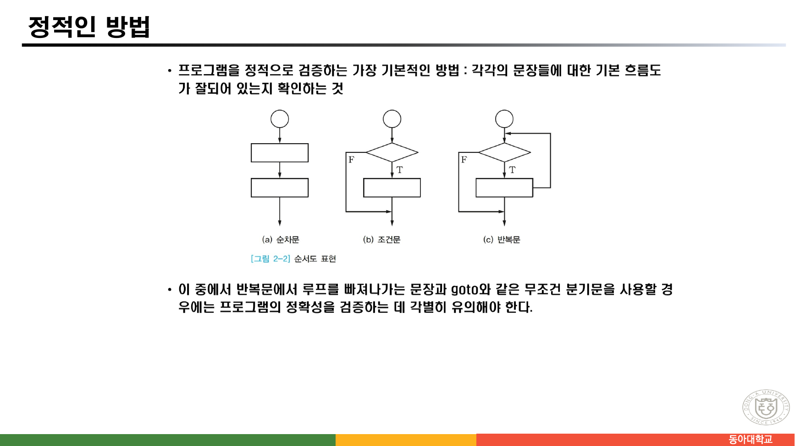
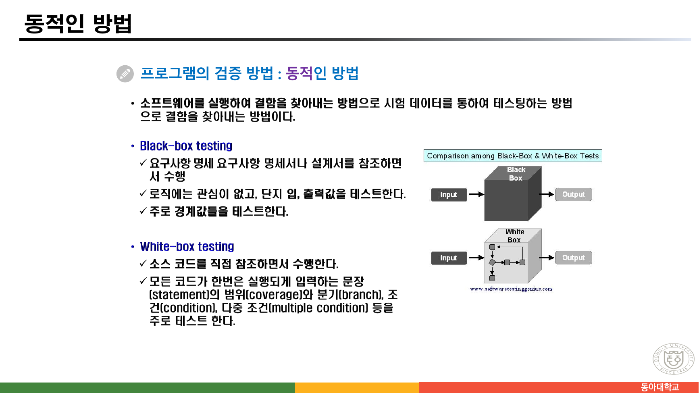

> [!abstract] 이 묶음이 실제로 하는 말
> 이 파일의 목차(2쪽)는 세 번째 절을 이렇게 적었다 — **`2.3 증명 기술과 프로그램 검증`**. 한 절 안에 두 단어가 들어 있고, 슬라이드도 정확히 둘로 갈린다.
>
> **61~72쪽**은 수학이다. 논리 함축을 증명하는 다섯 가지 방법을 세고, 반증을 두 갈래로 나누고, 수학적 귀납법으로 $1+2+\cdots+n = n(n+1)/2$를 증명한다.
>
> **73~83쪽**은 소프트웨어 공학이다. 순서도의 세 가지 기본 도형, 정적 테스트와 동적 테스트의 분류표, 소스코드 체크리스트, 블랙박스와 화이트박스. 출처로 붙은 링크는 두 번 모두 같은 기술 블로그다.
>
> **그런데 두 덩어리를 잇는 말이 한 줄도 없다.** 증명이 프로그램에 대해 무엇을 보장하는지, 테스트가 그것을 대신할 수 있는지 — 이 절이 이름으로 약속한 연결이 슬라이드에서는 빠져 있다. 둘의 차이는 사실 한 문장이면 된다. **증명은 모든 경우를 덮고, 테스트는 고른 경우만 덮는다.**
>
> 그리고 이 묶음에는 그 차이를 몸으로 보여 주는 슬라이드가 하나 있다. 67쪽의 배리법 예제는 "증명"이라는 제목을 달고 있지만, 그 안의 한 문장이 **틀렸다.** 어디서 틀리는지는 $q=13$에서 확인된다.

---

## 다섯 가지 증명법 — 무엇을 보이면 끝나는가

63쪽이 증명을 두 갈래로 나눈다.

> **직접 증명 방법** : 진리를 근거로 논리 함축 P→Q를 직접 증명하는 것
> **간접 증명 방법** : 논리적 동치를 이용하거나 다른 특수한 방법으로 증명하는 것

그리고 64~69쪽이 그것을 다섯으로 세분한다. 각 방법이 요구하는 일을 한 줄로 정리하면 이렇다.

| 원본 번호 | 방법 | $P \to Q$를 참으로 만들기 위해 보여야 하는 것 |
| --- | --- | --- |
| (1) | vacuous 증명 | $P$가 **거짓**임만 보이면 된다 |
| (2) | trivial 증명 | $Q$가 **참**임만 보이면 된다 |
| (3) | 직접 증명 | $P$를 참이라 두고 $Q$가 참임을 이끌어 낸다 |
| (4)① | 대우를 이용하는 방법 | $\neg Q \to \neg P$가 참임을 보인다 |
| (4)② | 배리법(귀류법) | $\neg P$가 거짓임을 보인다 |
| (4)③ | 존재 증명 | $P(x)$가 참인 $x$가 존재함을 보인다 |
| (5)① | 반례에 의한 반증 | $\forall x P(x)$가 거짓임을 보이려 $\exists x \neg P(x)$를 보인다 |
| (5)② | 모순에 의한 반증 | 명제가 참이라 가정해 아는 사실과 모순을 이끈다 |

앞의 두 개가 이 목록에서 제일 이상하게 보인다. 64쪽이 그 근거를 적는다.

> **(1) P→Q의 vacuous 증명 방법** — P가 거짓이라 하면 P→Q는 항상 참이다. 그래서 P→Q가 참인 것을 보이기 위해 P가 거짓이라는 것만 보이면 된다.
> **(2) P→Q의 trivial 증명 방법** — Q가 참이라고 하면 P→Q는 참이다.

이것은 [02번 노트](./02.%20%ED%95%9C%20%ED%8C%8C%EC%9D%BC%EC%97%90%20%EC%B1%85%20%EB%91%90%20%EA%B6%8C%20%E2%80%94%20%EC%9D%98%EB%AF%B8%EB%A1%9C%20%EA%B0%80%EB%A5%B4%EC%B9%98%EB%8A%94%20%EB%85%BC%EB%A6%AC%EC%99%80%20%ED%8C%8C%EC%8B%B1%EC%9C%BC%EB%A1%9C%20%EA%B0%80%EB%A5%B4%EC%B9%98%EB%8A%94%20%EB%85%BC%EB%A6%AC.md)에서 본 14쪽의 되풀이다 — *"If 1 + 1 = 3, then your grandma wears combat boots."* 전건이 거짓이면 후건을 볼 필요가 없다는 성질이 거기서는 농담이었고, 여기서는 증명 기법의 이름이 된다.

```html preview h=560px
<div style="font-family:system-ui,-apple-system,sans-serif;padding:20px;color:var(--foreground)">
  <div style="font-size:13px;font-weight:600;margin-bottom:6px">P → Q 를 참으로 만드는 길은 몇 개인가</div>
  <div style="font-size:12px;opacity:.75;margin-bottom:14px">P와 Q의 진리값을 눌러 바꾸면, 그 상황에서 원본 64~66쪽의 어느 방법이 통하는지가 표시된다.</div>

  <div style="display:flex;gap:20px;flex-wrap:wrap;margin-bottom:18px">
    <div>
      <div style="font-size:12px;opacity:.75;margin-bottom:6px">P (전건)</div>
      <button id="bp" style="padding:10px 22px;border-radius:6px;border:1px solid var(--chart-1);background:var(--card);color:var(--foreground);cursor:pointer;font-size:18px;font-weight:700;font-family:ui-monospace,Menlo,monospace">T</button>
    </div>
    <div>
      <div style="font-size:12px;opacity:.75;margin-bottom:6px">Q (후건)</div>
      <button id="bq" style="padding:10px 22px;border-radius:6px;border:1px solid var(--chart-2);background:var(--card);color:var(--foreground);cursor:pointer;font-size:18px;font-weight:700;font-family:ui-monospace,Menlo,monospace">T</button>
    </div>
    <div style="flex:1;min-width:200px">
      <div style="font-size:12px;opacity:.75;margin-bottom:6px">P → Q</div>
      <div id="res" style="font-size:26px;font-weight:700;font-family:ui-monospace,Menlo,monospace"></div>
    </div>
  </div>

  <div id="ways" style="display:flex;flex-direction:column;gap:8px"></div>

  <div style="margin-top:16px;font-size:12.5px;opacity:.8;line-height:1.7">
    네 줄 중 <b>P=T, Q=F</b> 한 줄에서만 P→Q가 거짓이다. 나머지 세 줄에서는 어떤 방법이든 성립하며,
    그중 두 줄은 <b>Q를 아예 보지 않고도</b>(vacuous) 혹은 <b>P를 아예 보지 않고도</b>(trivial) 끝난다.
  </div>
</div>
<script>
(function(){
  var P=true,Q=true;
  var BP=document.getElementById('bp'),BQ=document.getElementById('bq'),
      R=document.getElementById('res'),W=document.getElementById('ways');
  var METHODS=[
    {n:'(1) vacuous 증명', can:function(p,q){return !p;},
     why:function(p,q){return !p ? 'P가 거짓이므로 Q를 볼 필요 없이 P→Q가 참이다.'
                                 : 'P가 참이므로 이 방법을 쓸 수 없다.';}},
    {n:'(2) trivial 증명', can:function(p,q){return q;},
     why:function(p,q){return q ? 'Q가 참이므로 P를 볼 필요 없이 P→Q가 참이다.'
                                : 'Q가 거짓이므로 이 방법을 쓸 수 없다.';}},
    {n:'(3) 직접 증명', can:function(p,q){return (!p)||q;},
     why:function(p,q){return ((!p)||q) ? 'P를 참이라 두고 Q에 도달할 수 있다.'
                                        : 'P가 참인데 Q가 거짓이므로 도달할 수 없다 — 명제 자체가 거짓이다.';}},
    {n:'(4)① 대우 ￢Q→￢P', can:function(p,q){return (!p)||q;},
     why:function(p,q){return ((!p)||q) ? '￢Q→￢P 도 같은 진리값이므로 이쪽을 증명해도 된다.'
                                        : '￢Q가 참인데 ￢P가 거짓이라 대우도 거짓이다.';}},
    {n:'(4)② 배리법(￢P가 거짓임을 보임)', can:function(p,q){return (!p)||q;},
     why:function(p,q){return ((!p)||q) ? '명제를 부정했을 때 모순이 나온다.'
                                        : '명제가 거짓이므로 부정에서 모순이 나오지 않는다.';}}
  ];
  function draw(){
    BP.textContent=P?'T':'F'; BQ.textContent=Q?'T':'F';
    var v=(!P)||Q;
    R.innerHTML='<span style="color:'+(v?'var(--chart-2)':'var(--chart-4)')+'">'+(v?'T':'F')+'</span>'
      +'<span style="font-size:12px;font-weight:400;opacity:.75;font-family:system-ui;margin-left:10px">'
      +(v?'참인 명제다':'거짓인 명제다 — 증명할 것이 없다')+'</span>';
    W.innerHTML='';
    METHODS.forEach(function(m){
      var ok=m.can(P,Q);
      var d=document.createElement('div');
      d.style.cssText='padding:10px 13px;border-radius:8px;border:1px solid '
        +(ok?'var(--chart-2)':'var(--border)')+';background:var(--card);'
        +(ok?'':'opacity:.55;');
      d.innerHTML='<b style="color:'+(ok?'var(--chart-2)':'var(--foreground)')+'">'+m.n+'</b>'
        +'<span style="font-size:12.5px;opacity:.85;margin-left:10px">'+m.why(P,Q)+'</span>';
      W.appendChild(d);
    });
  }
  BP.addEventListener('click',function(){P=!P;draw();});
  BQ.addEventListener('click',function(){Q=!Q;draw();});
  draw();
})();
</script>
```

### 65쪽 — 직접 증명이 실제로 도는 모습

![65쪽 — [예제 2-26] 직접 증명 방법](../assets/ch02-p65-직접증명-예제2-26.png)

> **[예제 2-26]** 만약 $6x + 9y = 101$이면 $x$ 또는 $y$가 정수가 아님을 증명하라.
>
> **[증명]** P → Q의 직접 증명 방법에서 P가 참이라고 가정하므로 $6x+9y=101$이 참이다. $6x+9y=101$은 $3(2x+3y)=101$이다. 그런데 101이 3으로 나누어떨어지지 않으므로 $2x+3y$는 정수가 아니다. 그러므로 $x$ 또는 $y$는 정수가 아니다.

핵심은 $6$과 $9$가 둘 다 3의 배수라는 것이고, 101을 3으로 나눈 나머지가 2라는 것이다($101 = 3 \times 33 + 2$). 그러므로 $2x + 3y = 101/3$은 정수일 수 없다.

마지막 한 걸음이 눈에 띈다. *"$2x+3y$가 정수가 아니다"*에서 *"$x$ 또는 $y$가 정수가 아니다"*로 가는 대목은, 실은 **대우**를 쓴 것이다 — $x$와 $y$가 **둘 다** 정수라면 $2x+3y$도 정수일 수밖에 없으므로. 슬라이드는 이 단계를 "직접 증명" 안에서 조용히 지나간다.

### 66쪽 — 대우로 뒤집기

![66쪽 — [정의 2-8] 완전수와 [예제 2-28] 대우를 이용하는 증명](../assets/ch02-p66-대우증명-완전수.png)

> **[정의 2-8] 완전수** — 완전수(perfect number)는 그의 약수(divisor)들 중 자신을 제외한 모든 약수들의 합과 같은 수이다. (6, 28, 496, 8128, ….)
>
> **[예제 2-28]** "완전수는 소수가 아니다."가 참인 것을 증명하라.
> **[증명]** 이 명제의 대우는 "소수는 완전수가 아니다."이다. $q$를 소수라고 하면 $q \geq 2$이고 $q$의 약수는 1과 $q$이다. 이때 $q$를 제외한 약수는 1밖에 없으므로 합은 1이다. 따라서 $q$는 완전수가 아니다.

정의 2-8이 든 네 수를 직접 계산해 확인했다.

| 완전수 | 자신을 제외한 약수 | 합 |
| --- | --- | --- |
| 6 | 1, 2, 3 | 6 |
| 28 | 1, 2, 4, 7, 14 | 28 |
| 496 | 1, 2, 4, 8, 16, 31, 62, 124, 248 | 496 |
| 8128 | 1, 2, 4, 8, 16, 32, 64, 127, 254, 508, 1016, 2032, 4064 | 8128 |

증명이 대우를 쓴 이유가 여기서 분명해진다. "완전수는 소수가 아니다"를 직접 증명하려면 **모든 완전수**를 손에 쥐어야 하는데, 완전수가 무한히 많은지조차 아직 아무도 모른다. 반면 대우 "소수는 완전수가 아니다"는 소수 하나를 임의로 잡고 약수를 세면 끝난다. **대우를 쓰는 실익은 논리가 아니라 다루기 쉬운 쪽을 고르는 데 있다.**

---

## 67쪽 — "증명"이라 적혀 있어도 틀릴 수 있다

![67쪽 — [예제 2-29] 배리법. 밑줄 친 문장이 이 묶음의 문제다](../assets/ch02-p67-배리법-가장-큰-소수-오류.png)

> **[예제 2-29]** "가장 큰 소수(largest prime number)는 존재하지 않는다."가 참인 것을 증명하라.
> **전제 (~P) : 가장 큰 소수는 존재한다**
>
> **[풀이]** 가장 큰 소수 $q$가 존재한다면 모든 소수는 1보다 크고 $q$보다 크지 않으므로 소수의 개수는 유한하다. **2부터 $q$까지의 소수를 곱한 것을 $r$이라 하면** $r = 2 \times 3 \times 5 \times 7 \times \cdots \times q$이다. **이때 $r+1$은 소수이다.** 왜냐하면 $r+1$을 2부터 $q$까지의 어느 소수로 나누어도 나머지가 1이기 때문이다. 이는 1과 $r+1$을 제외한 어떠한 두 정수의 곱으로도 $r+1$을 나타낼 수 없다. $r > q$이고 **$r+1$은 $q$보다 큰 소수이므로** $q$가 가장 큰 소수라는 전제는 거짓이다. 그러므로 주어진 명제는 참이다.

**"이때 $r+1$은 소수이다"** 라는 문장이 틀렸다.

$r+1$을 2부터 $q$까지의 어느 소수로 나누어도 나머지가 1이라는 것까지는 맞다. 그러나 거기서 따라 나오는 것은 *"$r+1$은 $q$ 이하의 소인수를 갖지 않는다"*이지 *"$r+1$은 소수다"*가 아니다. $r+1$은 **$q$보다 큰 두 소수의 곱**일 수 있다.

$q = 13$에서 실제로 그렇게 된다.

$$r = 2 \times 3 \times 5 \times 7 \times 11 \times 13 = 30030, \qquad r + 1 = 30031 = 59 \times 509$$

30031은 2·3·5·7·11·13 어느 것으로도 나누어떨어지지 않지만(그래서 슬라이드의 "나머지가 1"은 맞다), 소수가 아니다. 59와 509의 곱이다. 슬라이드가 밑줄까지 그어 강조한 **"1과 $r+1$을 제외한 어떠한 두 정수의 곱으로도 $r+1$을 나타낼 수 없다"**가 여기서 깨진다.

```html preview h=560px
<div style="font-family:system-ui,-apple-system,sans-serif;padding:20px;color:var(--foreground)">
  <div style="font-size:13px;font-weight:600;margin-bottom:8px">
    q 를 늘려 가며 r = 2×3×⋯×q 와 r+1 을 실제로 계산한다
  </div>
  <label for="qi" style="font-size:13px">가장 큰 소수라고 가정한 q = <span id="qv" style="color:var(--chart-1);font-size:19px;font-weight:700">13</span></label>
  <input id="qi" type="range" min="0" max="10" value="5" style="width:100%;accent-color:var(--chart-1);margin:8px 0 16px" />

  <div style="display:flex;gap:12px;flex-wrap:wrap;margin-bottom:14px">
    <div style="flex:1;min-width:190px;padding:12px;border:1px solid var(--border);border-radius:8px;background:var(--card)">
      <div style="font-size:11.5px;opacity:.75">r = 2 × 3 × ⋯ × q</div>
      <div id="rv" style="font-size:20px;font-weight:700;font-family:ui-monospace,Menlo,monospace;color:var(--chart-3);word-break:break-all"></div>
    </div>
    <div style="flex:1;min-width:190px;padding:12px;border:1px solid var(--border);border-radius:8px;background:var(--card)">
      <div style="font-size:11.5px;opacity:.75">r + 1</div>
      <div id="r1v" style="font-size:20px;font-weight:700;font-family:ui-monospace,Menlo,monospace;color:var(--chart-1);word-break:break-all"></div>
    </div>
  </div>

  <div id="claim" style="padding:13px;border-radius:8px;border:1px solid var(--border);background:var(--card);font-size:13.5px;line-height:1.85"></div>

  <div style="margin-top:14px;padding:13px;border-radius:8px;border:1px solid var(--chart-2);background:var(--card);font-size:13px;line-height:1.85">
    <b style="color:var(--chart-2)">고쳐 쓰면 이렇게 된다</b><br/>
    r+1 은 2부터 q 까지의 어느 소수로도 나누어떨어지지 않는다. 그런데 1보다 큰 모든 정수는 소인수를 적어도 하나 가진다.
    그러므로 <b>r+1 의 소인수는 모두 q 보다 크다</b> — r+1 자신이 소수일 필요는 없다.
    그런 소인수가 하나라도 있으면 그것이 q 보다 큰 소수이므로 전제가 깨진다.
    <div id="fix" style="margin-top:8px;padding-top:8px;border-top:1px solid var(--border)"></div>
  </div>
</div>
<script>
(function(){
  var PR=[2,3,5,7,11,13,17,19,23,29,31];
  var qi=document.getElementById('qi'),qv=document.getElementById('qv'),
      RV=document.getElementById('rv'),R1=document.getElementById('r1v'),
      C=document.getElementById('claim'),F=document.getElementById('fix');
  function factor(n){
    var f=[],m=n,d=2;
    while(d*d<=m){ while(m%d===0){f.push(d);m/=d;} d++; }
    if(m>1) f.push(m);
    return f;
  }
  function draw(){
    var k=+qi.value, q=PR[k];
    qv.textContent=q;
    var r=1, used=[];
    for(var i=0;i<=k;i++){ r*=PR[i]; used.push(PR[i]); }
    RV.textContent=r.toLocaleString();
    R1.textContent=(r+1).toLocaleString();
    var f=factor(r+1), prime=(f.length===1);
    var rem = used.map(function(p){ return p+'로 나눈 나머지 '+((r+1)%p); }).join(' · ');
    C.innerHTML='<b>슬라이드의 주장:</b> "이때 r+1은 소수이다"<br/>'
      +'<span style="font-size:12px;opacity:.8">'+rem+' &nbsp;— 2부터 '+q+'까지 전부 나머지 1이다(여기까지는 슬라이드가 맞다).</span><br/><br/>'
      +'<b>실제 소인수분해:</b> '+(r+1).toLocaleString()+' = <span style="font-family:ui-monospace,Menlo,monospace;font-weight:700;color:'
        +(prime?'var(--chart-2)':'var(--chart-4)')+'">'+f.join(' × ')+'</span><br/>'
      +'<b style="color:'+(prime?'var(--chart-2)':'var(--chart-4)')+'">'
      +(prime? '이번에는 r+1이 정말 소수다 — 주장이 우연히 맞는 경우다.'
             : '★ r+1은 소수가 아니다. 슬라이드의 주장이 여기서 깨진다.')+'</b>';
    var minf=Math.min.apply(null,f);
    F.innerHTML='지금 값에서 r+1의 가장 작은 소인수는 <b style="font-family:ui-monospace,Menlo,monospace">'+minf.toLocaleString()
      +'</b> 이고, 이것은 q = '+q+' 보다 <b style="color:var(--chart-2)">'+(minf>q?'크다':'크지 않다')+'</b>. '
      +(minf>q?'고친 형태의 논증은 이번에도 성립한다.':'');
  }
  qi.addEventListener('input',draw); draw();
})();
</script>
```

> [!caution] 원본 오류 — 67쪽 「$r+1$은 소수이다」는 성립하지 않는다
> $q$를 2부터 키워 가며 확인하면 이렇다.
>
> | $q$ | $r+1$ | 소수인가 |
> | --- | --- | --- |
> | 2 | 3 | 예 |
> | 3 | 7 | 예 |
> | 5 | 31 | 예 |
> | 7 | 211 | 예 |
> | 11 | 2311 | 예 |
> | **13** | **30031** | **아니오 — 59 × 509** |
> | 17 | 510511 | 아니오 — 19 × 97 × 277 |
> | 19 | 9699691 | 아니오 |
>
> $q$가 11까지는 우연히 맞아떨어져서 오류가 눈에 띄지 않는다. **13에서 처음 깨진다.**
>
> 결론 자체는 옳다 — 가장 큰 소수는 존재하지 않는다. 무너지는 것은 중간 한 문장이고, 고치는 방법도 간단하다. *"$r+1$은 소수이다"*를 *"$r+1$의 소인수는 모두 $q$보다 크다"*로 바꾸면 된다. 1보다 큰 모든 정수는 소인수를 적어도 하나 가지므로 그런 소인수가 반드시 존재하고, 그것이 $q$보다 크므로 전제가 깨진다.
>
> 이 오류는 유클리드의 증명을 요약할 때 흔히 저지르는 것이고, 유클리드 자신은 이런 주장을 하지 않았다. 그리고 이 슬라이드가 지금 이 묶음에서 갖는 의미가 하나 더 있다 — **"증명"이라는 표제가 붙어 있다는 사실만으로는 아무것도 보장되지 않는다는 것.** 뒤이어 나올 프로그램 검증의 문제의식이 바로 그것이다.

---

## 72쪽 — 귀납법: 무한을 두 걸음으로

![72쪽 — [예제 2-33] 수학적 귀납법](../assets/ch02-p72-수학적-귀납법-예제2-33.png)

70쪽이 먼저 큰 틀을 잡는다 — *"새로운 결과를 얻기 위한 대표적인 논증 방법 : **연역법, 귀납법**"*. 그리고 72쪽이 $1+2+\cdots+n = \dfrac{n(n+1)}{2}$를 증명한다.

**(1) 기초 단계** — $P(1)$: 좌변 $= 1$, 우변 $= \dfrac{1 \cdot (1+1)}{2} = 1$. 그러므로 $P(1)$은 참이다.

**(2) 귀납적 단계** — $1+2+\cdots+n = \dfrac{n(n+1)}{2}$라 할 때 $P(n+1)$이 참임을 보인다.

$$\begin{aligned}
1+2+\cdots+n+(n+1) &= [1+2+\cdots+n] + (n+1) \\
&= \frac{n(n+1)}{2} + (n+1) &&(\because \text{가정에서 성립}) \\
&= \frac{n(n+1) + 2(n+1)}{2} \\
&= \frac{(n+1)(n+2)}{2}
\end{aligned}$$

마지막 줄이 $P(n+1)$의 우변, 즉 $\dfrac{(n+1)((n+1)+1)}{2}$와 같다. 그러므로 $P(n)$이 참이면 $P(n+1)$도 참이다.

증명의 각 줄을 직접 계산해 확인했다. 세 번째 줄에서 네 번째 줄로 가는 대목이 이 증명의 유일한 대수 조작인데, $n(n+1)+2(n+1)$에서 $(n+1)$을 묶어 내면 $(n+1)(n+2)$가 된다.

> [!note] 귀납법이 앞의 다섯 방법과 다른 점
> 63~69쪽의 다섯 방법은 명제 **하나**를 증명한다. 귀납법은 명제가 **무한히 많을 때** 쓴다 — $P(1), P(2), P(3), \dots$ 를 한꺼번에 다뤄야 하는 상황이다. 그래서 무한한 확인을 유한한 두 걸음(기초 단계 + 귀납적 단계)으로 바꾸는 장치이고, 이것이 다음 절이 "프로그램 검증"으로 넘어가는 자연스러운 다리가 될 수 있었다. **반복문은 회수가 미리 정해지지 않은 무한한 확인이기 때문이다.** 슬라이드는 그 연결을 만들지 않는다.

---

## 73쪽부터 — 다리가 끊긴 자리

73쪽과 74쪽은 **글자가 똑같다.**

```text
page 73 : Program Verification | 프로그램 검증(program verification) : 매우 어려운 문제
page 74 : Program Verification | 프로그램 검증(program verification) : 매우 어려운 문제
```

그리고 75쪽부터 방향이 바뀐다.



76쪽이 내놓는 것은 순서도의 세 가지 기본 도형이다 — (a) 순차문, (b) 조건문, (c) 반복문. 그리고 한 줄을 덧붙인다.

> 이 중에서 반복문에서 루프를 빠져나가는 문장과 **goto와 같은 무조건 분기문**을 사용할 경우에는 프로그램의 정확성을 검증하는 데 각별히 유의해야 한다.

이 문장이 앞 절과 이어질 수 있었던 마지막 지점이다. 반복문이 몇 번 도는지 미리 모른다는 것, 그래서 모든 실행 경로를 다 볼 수 없다는 것 — 72쪽의 귀납법이 정확히 그런 상황을 위한 도구다. 그러나 슬라이드는 그 연결을 만들지 않고 소프트웨어 테스팅으로 넘어간다.




78쪽은 Clean Code 기반 소스코드 평가 체크리스트와 시큐어코딩 취약점 점검 체크리스트를, 82쪽은 정적/동적 테스트 유형 분류표를 싣는다. 두 쪽 모두 출처가 같은 기술 블로그(`blog.skby.net`)로 명시되어 있다.

82쪽의 두 문장이 두 방식의 차이를 요약한다.

> (정적) **모든 경로에 대해 분석하므로** TC(Test case)에 영향 없고, Case 작성 소요 시간과 비용 절감
> (동적) 동적 분석은 **실제 동작 시 수행되므로** 동적 분석 도구 연결 인터페이스 존재 필요(파일, 시리얼 등)

```mermaid
graph TD
  A["2.3절 · 증명 기술과 프로그램 검증"] --> B["61~72쪽 · 증명"]
  A --> C["73~83쪽 · 검증"]

  B --> B1["다섯 가지 증명법<br/>vacuous · trivial · 직접 · 간접 · 반증"]
  B --> B2["수학적 귀납법<br/>무한한 확인을 두 걸음으로"]

  C --> C1["정적인 방법<br/>순서도 · 소스코드 체크리스트"]
  C --> C2["동적인 방법<br/>블랙박스 · 화이트박스"]

  B2 -.->|"슬라이드에 없는 다리"| C1
  B1 -.->|"슬라이드에 없는 다리"| C2

  style A  fill:var(--card),stroke:var(--border),color:var(--foreground)
  style B  fill:var(--card),stroke:var(--chart-1),color:var(--foreground)
  style C  fill:var(--card),stroke:var(--chart-3),color:var(--foreground)
  style B1 fill:var(--card),stroke:var(--chart-1),color:var(--foreground)
  style B2 fill:var(--card),stroke:var(--chart-1),color:var(--foreground)
  style C1 fill:var(--card),stroke:var(--chart-3),color:var(--foreground)
  style C2 fill:var(--card),stroke:var(--chart-3),color:var(--foreground)
```

> [!important] 빠져 있는 한 문장 — 증명과 테스트는 무엇이 다른가
> 두 덩어리를 잇는 말이 슬라이드에 없으므로, 여기서 **보충**한다.
>
> **증명은 모든 경우를 덮는다.** 72쪽의 귀납법은 $n$이 아무리 커도 $1+2+\cdots+n = n(n+1)/2$임을 보장한다. $n = 10^{100}$을 넣어 보지 않아도 된다.
>
> **테스트는 고른 경우만 덮는다.** 80쪽의 블랙박스 테스트가 *"주로 경계값들을 테스트한다"*고 적은 이유가 여기 있다 — 전부 볼 수 없으니 틀리기 쉬운 자리를 고르는 것이다.
>
> 그래서 **테스트가 통과했다는 것은 결함이 없다는 증명이 아니다.** 이 묶음이 그 사실의 실물 예를 이미 하나 갖고 있다 — 67쪽의 *"$r+1$은 소수이다"*는 $q$가 2·3·5·7·11일 때 전부 참이다. 다섯 번의 "테스트"를 통과한 셈이고, 13에서 깨진다.
>
> 정식 다리는 **프로그램의 형식 검증**(호어 논리, 루프 불변식)이며, 82쪽 표의 `정형 분석 기법 — S/W 수학적 표현, 정확도 제고`라는 한 줄이 그것을 가리킨다. 이 슬라이드에서 논리와 프로그램이 다시 만나는 지점은 그 한 칸뿐이다.

---

## 84~91쪽 — 2.4절, 논리가 데이터가 되는 곳

마지막 여덟 장은 `2.4 응용 : 지식 베이스 시스템`이다. 87쪽이 전문가 시스템의 구성을 적는다.

> 전문가 시스템은 **사실(fact)들을 저장하는 데이터베이스**, **추론 규칙(rule)을 가지고 있는 지식 기반 시스템**, 그리고 사실들과 규칙으로부터 새로운 사실을 추론하는 **추론 기관(inference engine)**, 사용자들의 요구 사항들을 받는 **사용자 인터페이스** 등으로 구성되어 있다. 추론 기관은 전문가 시스템에게 문제를 풀 수 있는 능력을 부여한다.

88쪽이 그 흐름을 세 문장으로 정리한다.

> • 사용자가 추론 기관에 사용자 요구 사항들을 전달하면
> • 주어진 문제의 해결을 위해 추론 기관은 지식 기반 시스템에 있는 규칙들과 사실들을 저장하고 있는 데이터베이스를 탐색하고 새로운 사실들을 추론하고 제어한다.
> • 이렇게 해서 얻어진 새로운 사실들을 사용자에게 다시 전달해주는 시스템이다.

여기서 이 장 전체가 한 바퀴를 돈다. **[03번 노트](./03.%20%EB%8C%80%EC%B2%B4%ED%95%A0%20%EC%88%98%20%EC%9E%88%EB%8A%94%20%EA%B2%83%EB%93%A4%20%E2%80%94%20%EC%88%A0%EC%96%B4%C2%B7%ED%95%9C%EC%A0%95%EC%9E%90%C2%B7%EC%B6%94%EB%A1%A0%2C%20%EA%B7%B8%EB%A6%AC%EA%B3%A0%20%EB%91%90%20%EB%B2%88%20%EC%A0%81%ED%9E%8C%20%ED%9B%84%EA%B1%B4%20%EB%B6%80%EC%A0%95.md)에서 사람이 손으로 아홉 단계를 밟았던 그 일**(59쪽의 예제 2-23)을 기계가 대신하는 것이 추론 기관이다. `[표 2-9]`의 추론 규칙 목록이 곧 규칙 데이터베이스이고, 전제가 곧 사실이다.

85쪽이 그 뒤를 잇는다 — *"최근의 인공지능 : **기계학습과 딥 러닝이 대세**"*. 규칙을 사람이 적어 넣는 방식에서 데이터로부터 뽑아내는 방식으로 옮겨 갔다는 뜻이고, [01번 노트](./01.%20%EC%B2%AB%20%EC%8B%9C%EA%B0%84%EC%97%90%20%EC%A0%95%EC%9D%98%20%EB%8C%80%EC%8B%A0%20%EC%82%AC%EC%A7%84%20%EB%91%90%20%EC%9E%A5%20%E2%80%94%20%EC%9D%B4%EC%82%B0%EC%9D%80%20%EB%8C%80%EC%83%81%EC%9D%B4%20%EC%95%84%EB%8B%88%EB%9D%BC%20%EA%B8%B0%EB%A1%9D%20%EB%B0%A9%EC%8B%9D%EC%9D%B4%EB%8B%A4.md)에서 본 강의계획 14주의 `자연어 분석도구를 통한 명제/논리 추출, 추출된 사실로부터 지식베이스 구축`이 바로 그 작업이다.

마지막 두 쪽(90·91쪽)은 부록이며 제목만 있다 — `Appendix ◼ SymPy`, `Appendix ◼ CLIPS`. SymPy는 파이썬 기호수학 라이브러리이고 CLIPS는 규칙 기반 전문가 시스템 셸이다. 32쪽 실습(진리표 프로그램)을 실제로 만들 때 쓰라는 뜻으로 붙인 것으로 보이나, 슬라이드에 설명은 없다.

---

## 정리 — 이 묶음에서 가져갈 것

> [!tip] 세 문장 요약
>
> 1. **다섯 가지 증명법은 결국 "무엇을 보이면 끝나는가"의 목록이다.** vacuous는 $P$가 거짓임만, trivial은 $Q$가 참임만 보이면 되고, 대우는 논리적으로 같은 두 명제 중 다루기 쉬운 쪽을 고르는 기법이다(66쪽이 완전수 대신 소수를 잡은 이유). 귀납법만은 성격이 달라서, 명제가 무한히 많을 때 그 무한을 두 걸음으로 접는다.
> 2. **67쪽은 "증명"이라 적힌 것도 틀릴 수 있음을 스스로 보여 준다.** *"$r+1$은 소수이다"*는 $q$가 11까지 우연히 맞다가 **13에서 깨진다** — $30031 = 59 \times 509$. 결론은 옳고 중간 한 문장이 무너지며, *"$r+1$의 소인수는 모두 $q$보다 크다"*로 바꾸면 복구된다.
> 3. **2.3절은 이름으로 약속한 연결을 만들지 않는다.** 앞은 수학적 증명, 뒤는 소프트웨어 테스팅이고 사이에 다리가 없다. 빠진 한 문장은 이것이다 — **증명은 모든 경우를 덮고 테스트는 고른 경우만 덮는다.** 67쪽이 그 차이의 실물 예다. 다섯 번 통과한 주장이 여섯 번째에서 깨졌다.

이로써 「수학적 모델과 논리」 91쪽을 세 문서로 모두 다뤘다. 다음은 4주차 자료 「집합 및 집합 연산」이다. 논리에서 참·거짓을 다뤘다면, 집합은 **소속 여부**를 다룬다 — 그리고 둘이 같은 구조를 갖는다는 사실이 그 자료의 마지막 대목에서 진리표로 드러난다.

---

### 근거 자료

이 문서는 강의 원본 `수학적 모델과 논리.pdf`의 60~91쪽에 근거한다. 인용한 슬라이드는 65쪽(예제 2-26), 66쪽(정의 2-8과 예제 2-28), 67쪽(예제 2-29), 72쪽(예제 2-33), 76쪽(순서도 표현), 80쪽(블랙박스·화이트박스), 82쪽(정적·동적 테스트 비교)이다.

계산으로 확인한 것은 다음과 같다 — 정의 2-8이 든 완전수 네 개(6·28·496·8128)의 진약수 합이 각각 자신과 같음, 예제 2-26의 $101 = 3 \times 33 + 2$, 예제 2-33 귀납적 단계의 각 등식, 그리고 67쪽 반례 표의 모든 값($q=13$에서 $r+1 = 30031 = 59 \times 509$, $q=17$에서 $510511 = 19 \times 97 \times 277$, $q=19$에서 $9699691$이 합성수). 인터랙티브의 소인수분해는 실행 시점에 계산된다.

원본에 없는 보충은 세 가지이며 본문에 밝혔다 — 67쪽 오류의 올바른 수정문(*"$r+1$의 소인수는 모두 $q$보다 크다"*), 증명과 테스트가 덮는 범위의 차이, 그리고 형식 검증(호어 논리·루프 불변식)이 두 절을 잇는 정식 다리라는 지적이다. 73쪽과 74쪽의 본문이 완전히 같다는 것은 추출 텍스트를 대조해 확인했다.
