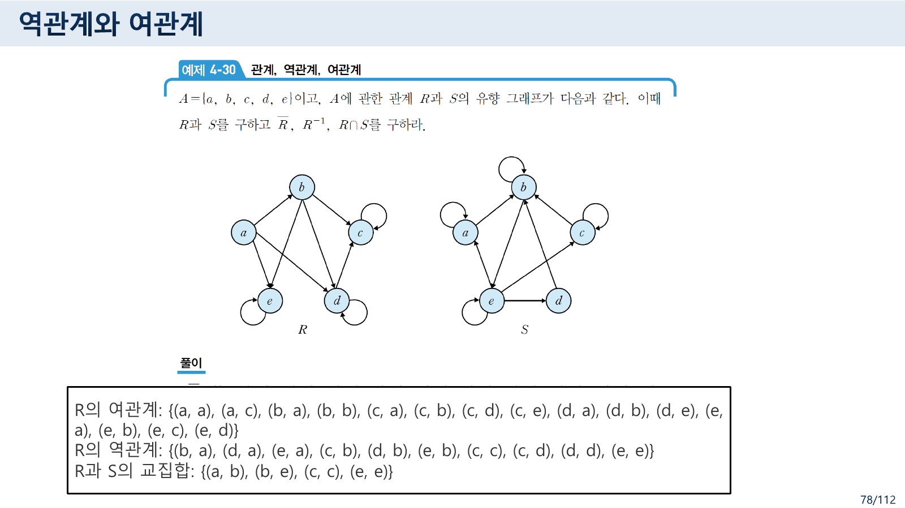
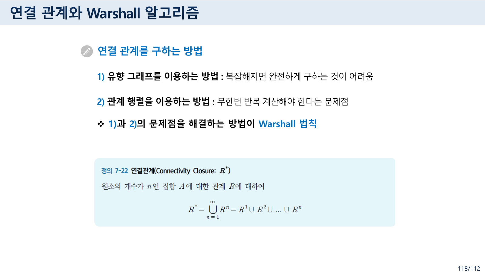
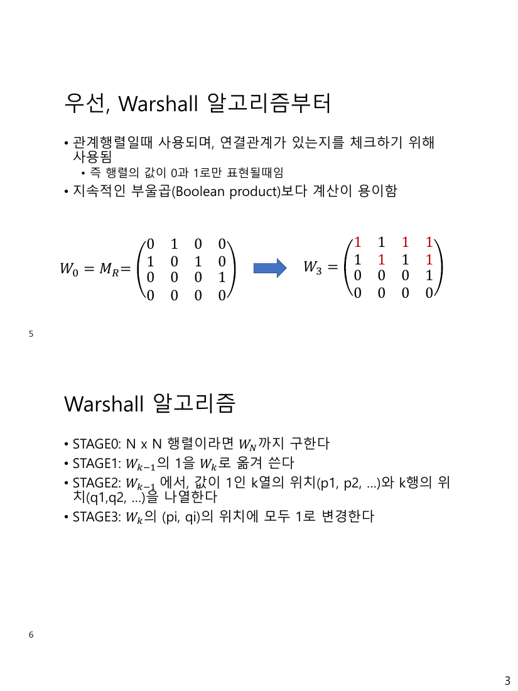
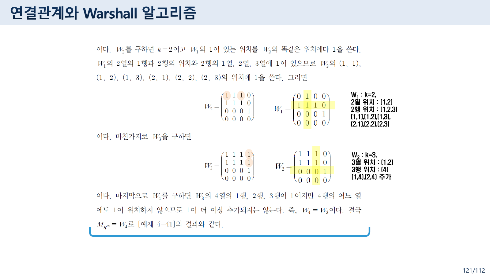
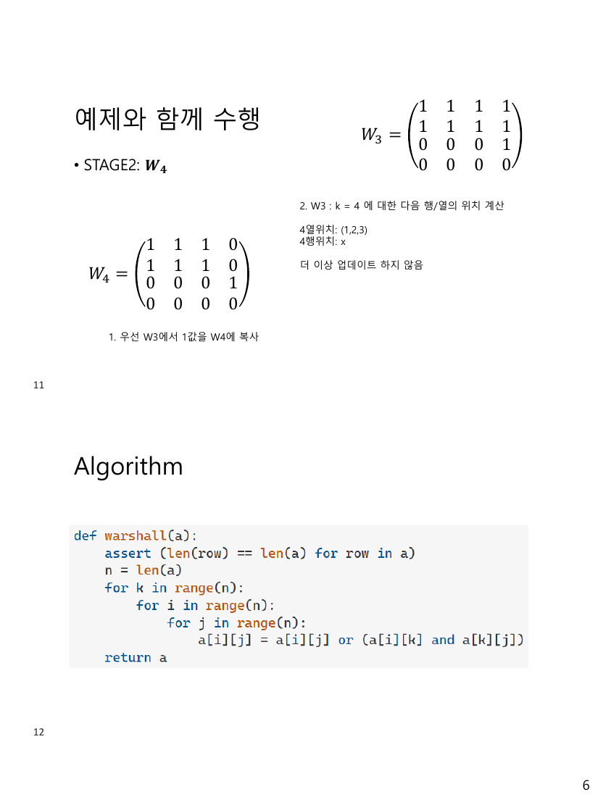
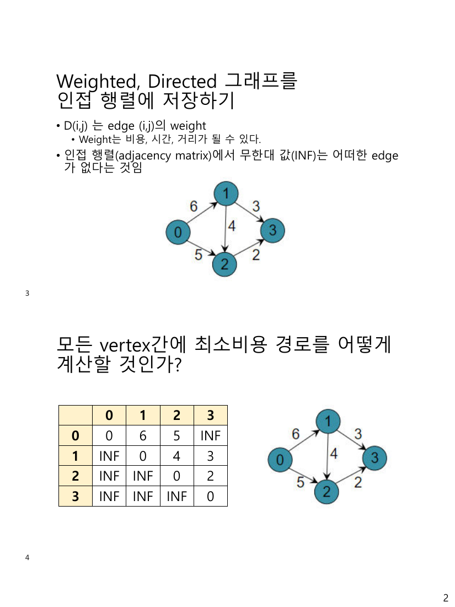
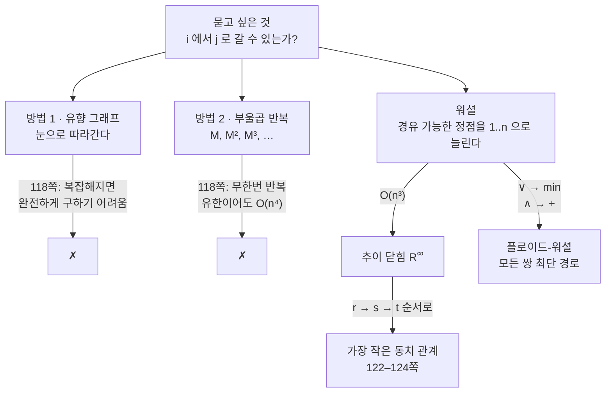

> [!abstract] 이 51쪽이 실제로 하는 말
> [04번 노트](<./04. 관계 ① — 제목의 절반이 앞머리 열여섯 장에서 끝난다.md>) §4에서 도구 하나를 얻었다. 관계 행렬을 **부울곱**으로 $n$번 곱하면 “길이가 정확히 $n$인 경로가 있는가”를 알 수 있다.
>
> 그런데 실제로 묻고 싶은 것은 그것이 아니다. **“언젠가 도달할 수 있는가”** 다. 그러려면 $n = 1, 2, 3, \dots$ 을 전부 확인해야 한다. 118쪽이 이 곤경을 두 줄로 적는다.
>
> > 1) 유향 그래프를 이용하는 방법 : 복잡해지면 완전하게 구하는 것이 어려움
> > 2) 관계 행렬을 이용하는 방법 : **무한번 반복 계산해야 한다는 문제점**
> > ❖ 1)과 2)의 문제점을 해결하는 방법이 **Warshall 법칙**
>
> 워셜 알고리즘은 “경로의 길이”를 세는 대신 **“어떤 정점을 거쳐도 되는가”** 를 하나씩 늘려 간다. 거쳐도 되는 정점을 1번부터 $n$번까지 차례로 허락하면 $n$번 만에 끝난다. 무한이 $n$으로 접히는 것이다.
>
> 그리고 이 접기는 가중치 위에서도 똑같이 작동한다. `∨`를 `min` 으로, `∧`를 `+` 로 바꾸면 그대로 **플로이드-워셜**이 된다. 부록 10쪽이 그 둘을 한 파일에 넣어 둔 이유다.

---

## 1. 그 전에 — 관계에 할 수 있는 네 가지 연산

76–95쪽이 관계끼리의 연산을 정리한다. 관계는 곱집합의 **부분집합**이므로 집합 연산이 그대로 통한다.

| 연산 | 정의 | 원본 |
| --- | --- | --- |
| 교집합 | $a(R \cap S)b \iff aRb$ **이고** $aSb$ | 76쪽 |
| 합집합 | $a(R \cup S)b \iff aRb$ **또는** $aSb$ | 76쪽 |
| **여관계** $\bar{R}$ | $a\bar{R}b \iff (a,b) \notin R$ | 76–81쪽 |
| **역관계** $R^{-1}$ | $(b,a) \in R^{-1} \iff (a,b) \in R$ | 76–81쪽 |
| **합성** $S \circ R$ | $a$ 에서 $b$ 로 $R$, $b$ 에서 $c$ 로 $S$ 면 $a$ 에서 $c$ 로 | 82–95쪽 |

여관계와 역관계는 이름이 비슷하지만 하는 일이 전혀 다르다. **여관계는 있고 없음을 뒤집고, 역관계는 방향을 뒤집는다.** 관계 행렬로 보면 여관계는 0과 1을 맞바꾸는 것이고, 역관계는 **전치(transpose)** 다.



> 원본 78쪽. 집합 `{a, b, c, d, e}` 위의 관계 하나에 대해 세 결과를 나열한다.

원본이 적은 세 줄을 그대로 옮긴다.

```text
R의 여관계: {(a,a),(a,c),(b,a),(b,b),(c,a),(c,b),(c,d),(c,e),(d,a),(d,b),(d,e),(e,a),(e,b),(e,c),(e,d)}
R의 역관계: {(b,a),(d,a),(e,a),(c,b),(d,b),(e,b),(c,c),(c,d),(d,d),(e,e)}
R과 S의 교집합: {(a,b),(b,e),(c,c),(e,e)}
```

역관계를 다시 뒤집으면 원래의 $R$ 이 나온다.

$$R = \{(a,b),(a,d),(a,e),(b,c),(b,d),(b,e),(c,c),(d,c),(d,d),(e,e)\}$$

**검산했다.** $|A| = 5$ 이므로 $A \times A$ 는 25쌍이고, $|R| = 10$ 이니 여관계는 15쌍이어야 한다 — 원본이 적은 여관계가 정확히 15쌍이다. 그리고 다섯 행을 하나씩 확인하면 $R$ 과 $\bar R$ 이 겹치지 않으면서 합쳐서 25쌍을 정확히 덮는다.

| 첫 원소 | $R$ 에 있는 짝 | $\bar{R}$ 에 있는 짝 | 합 |
| --- | --- | --- | --- |
| a | b, d, e | a, c | 5 |
| b | c, d, e | a, b | 5 |
| c | c | a, b, d, e | 5 |
| d | c, d | a, b, e | 5 |
| e | e | a, b, c, d | 5 |

세 번째 줄(`R과 S의 교집합`)의 네 쌍도 모두 $R$ 에 들어 있어 모순이 없다. **78쪽은 정확하다.**

### 합성 — 두 걸음을 한 걸음으로

85쪽이 합성이 가능한 조건을 못 박는다.

> 집합 A에서 집합 B로의 관계 R과 집합 B에서 집합 C로의 관계 S가 있을 때, **관계 R에 대해서 공변역이면서 관계 S에 대해서는 정의역인 집합 B**가 있기 때문에 관계 R과 S는 합성 가능
> … R의 공변역(집합 B)과 S의 정의역(집합 C)이 같지 않으므로 합성관계가 성립될 수 없다.
> **합성관계는 교환법칙이 성립하지 않음**

[04번 노트](<./04. 관계 ① — 제목의 절반이 앞머리 열여섯 장에서 끝난다.md>) §4의 경로 합성 조건 — *“$\pi_1$ 의 끝나는 정점과 $\pi_2$ 의 시작 정점이 같을 때만”* — 과 정확히 같은 조건이다.

89쪽이 합성을 행렬로 옮긴다.

> 집합 A에서 집합 B로 가는 관계 R은 $m \times n$ 크기의 관계행렬 $M_R$ 로 작성
> 집합 B에서 집합 C로 가는 관계 S는 $n \times s$ 크기의 관계행렬 $M_S$ 로 작성
> 관계 $S \circ R$ 은 이 두 관계행렬 $M_R$ 과 $M_S$ 의 **부울곱**으로 구함

여기서 A가 **행**, B가 **열**로 쓰이고 있다. [04번 노트](<./04. 관계 ① — 제목의 절반이 앞머리 열여섯 장에서 끝난다.md>) §3에서 33쪽의 마지막 줄이 그 반대로 적혀 있다고 지적했는데, 실제 계산은 이 89쪽 쪽을 따른다. $m \times n$ 과 $n \times s$ 를 곱해 $m \times s$ 를 얻는 형태여야만 크기가 맞기 때문이다.

부울곱의 정의는 [04번 노트](<./04. 관계 ① — 제목의 절반이 앞머리 열여섯 장에서 끝난다.md>) §4에서 본 그대로다.

$$(M_R \odot M_S)_{ij} \;=\; \bigvee_{k=1}^{n} \bigl( (M_R)_{ik} \land (M_S)_{kj} \bigr)$$

곱셈 자리에 `∧`, 덧셈 자리에 `∨` 가 들어간 행렬 곱이다. 자기 자신과 계속 곱하면 $M_R^{[2]}, M_R^{[3]}, \dots$ 이 되고 각각 길이 2, 3, … 인 경로를 뜻한다.

---

## 2. 닫힘 — 없는 것을 최소한으로 채워 넣기

97쪽이 이 절을 이전 강의와 잇는다 — *“이미 1장에서, 산술 연산에 대한 닫힘부터 집합에서의 닫힘 성질들을 설명했다.”*

닫힘(closure)이란 **어떤 성질을 만족하도록 원소를 최소한만 더 넣은 것**이다. 98–117쪽이 세 가지를 다룬다.

| 닫힘 | 무엇을 채우는가 | 행렬로는 |
| --- | --- | --- |
| **반사 닫힘** $r(R)$ | 빠진 $(a,a)$ 를 전부 넣는다 | $M_R \lor I$ (주대각을 1로) |
| **대칭 닫힘** $s(R)$ | $(a,b)$ 가 있으면 $(b,a)$ 를 넣는다 | $M_R \lor M_R^{\mathsf{T}}$ |
| **추이 닫힘** $t(R)$ | 두 걸음이면 한 걸음도 넣는다 | **어렵다 — §3** |

앞의 둘은 한 번에 끝난다. $(a,a)$ 를 넣는다고 새로 $(a,a)$ 가 필요해지지는 않고, $(b,a)$ 를 넣는다고 새 대칭 쌍이 생기지도 않는다. **한 번 채우면 닫힌다.**

추이 닫힘은 다르다. $(a,b)$ 와 $(b,c)$ 때문에 $(a,c)$ 를 넣으면, 그 $(a,c)$ 와 기존의 $(c,d)$ 때문에 $(a,d)$ 가 또 필요해진다. **채우면 또 채워야 한다.** 105쪽이 그 결과에 이름을 붙인다.

> [정리 4-8]에 의하면 $R$ 의 추이 닫힘은 **연결 관계 $R^\infty$** 라는 것을 알았다.

$R^\infty$ 는 “길이가 1 이상인 어떤 경로라도 있으면 이어진 것으로 본다”는 관계다. 식으로 쓰면

$$R^\infty = R \cup R^2 \cup R^3 \cup \cdots \qquad\text{즉}\qquad M_{R^\infty} = M_R \lor M_R^{[2]} \lor M_R^{[3]} \lor \cdots$$

여기서 오른쪽 항이 **끝나지 않는다.** 118쪽의 “무한번 반복 계산해야 한다는 문제점”이 이 식이다.



> 원본 118쪽. 두 방법의 문제점을 각각 한 줄로 적고, 해결책으로 워셜을 제시한다.

물론 유한집합이면 실제로는 유한 번에 멈춘다. 정점이 $n$개면 단순 경로의 길이가 $n-1$ 을 넘을 수 없으므로 $M_R^{[n]}$ 까지만 계산하면 된다. 그러나 **그 방법도 부울곱을 $n-1$번 해야 하고**, 부울곱 한 번이 $O(n^3)$ 이므로 전체가 $O(n^4)$ 이 된다. 워셜은 이것을 $O(n^3)$ 으로 줄인다.

---

## 3. 워셜 — 거쳐도 되는 정점을 하나씩 늘린다

워셜 알고리즘의 발상은 **경로의 길이를 세지 않는 것**이다. 대신 이렇게 묻는다.

> $1$번부터 $k$번까지의 정점만 **중간 경유지로** 써도 된다고 할 때, $i$ 에서 $j$ 로 갈 수 있는가?

$k = 0$ 이면 중간 경유를 못 하므로 원래 관계 그대로다($W_0 = M_R$). $k = n$ 이면 모든 정점을 경유해도 되므로 그것이 곧 도달 가능성이다($W_n = M_{R^\infty}$). $k$ 를 0에서 $n$ 까지 **한 칸씩** 올리면 된다.

$k$ 를 한 칸 올릴 때 새로 생기는 경로는 **반드시 $k$번 정점을 지난다.** 그러니 “$i \to k$ 로 갈 수 있고 $k \to j$ 로 갈 수 있으면 $i \to j$ 로 갈 수 있다”만 채우면 된다.

$$W_k[i][j] \;=\; W_{k-1}[i][j] \;\lor\; \bigl(W_{k-1}[i][k] \land W_{k-1}[k][j]\bigr)$$

원본은 이 식을 행렬 조작의 절차로 풀어 쓴다. Appendix 1의 6번 슬라이드에 네 단계가 적혀 있다.



> `Appendix 1 Floyd Warshall Algorithm.pdf` 3쪽(5·6번 슬라이드). 위쪽이 $W_0 = M_R$ 과 최종 $W_3$, 아래쪽이 STAGE 0–3의 절차다.

| 원본이 적은 단계 | 하는 일 |
| --- | --- |
| STAGE0 | $N \times N$ 행렬이라면 $W_N$ 까지 구한다 |
| STAGE1 | $W_{k-1}$ 의 1을 $W_k$ 로 옮겨 쓴다 |
| STAGE2 | $W_{k-1}$ 에서, 값이 1인 **$k$열의 위치** $(p_1, p_2, \dots)$ 와 **$k$행의 위치** $(q_1, q_2, \dots)$ 를 나열한다 |
| STAGE3 | $W_k$ 의 $(p_i, q_i)$ 위치에 모두 1로 변경한다 |

STAGE2의 “$k$열의 위치”가 $k$로 **들어오는** 정점들이고, “$k$행의 위치”가 $k$에서 **나가는** 정점들이다. 그 두 목록의 **모든 조합**이 새로 이어지는 쌍이다.

> [!warning] 원본 표기 오류 ① — STAGE3의 첨자가 짝지어져 있다
> STAGE3이 *“$W_k$ 의 $(p_i, q_i)$ 의 위치에 모두 1로 변경한다”* 라고 적었다. 두 첨자가 **같은 $i$** 다. 그러면 $p$ 목록과 $q$ 목록을 순서대로 짝지어 대각선만 채운다는 뜻이 되어, 두 목록의 길이가 다르면 성립하지도 않는다.
>
> 채워야 하는 것은 **곱집합** $\{p_1, p_2, \dots\} \times \{q_1, q_2, \dots\}$ 전체다. 첨자를 다르게 써서 $(p_i, q_j)$ 라 해야 한다.
>
> 실제로 원본 자신의 예제가 그렇게 계산한다. $k=2$ 단계에서 2열 위치가 `(1,2)` 두 개, 2행 위치가 `(1,2,3)` 세 개인데, 갱신 목록은 `(1,1),(1,2),(1,3),(2,1),(2,2),(2,3)` 여섯 개다 — $2 \times 3 = 6$, 곧 모든 조합이다. **절차의 서술만 첨자를 잘못 적었고 예제는 정확하다.**

단계 이름도 정의한 대로 쓰이지 않는다.

> [!warning] 원본 오류 ② — STAGE 번호가 한 칸씩 밀렸다
> 5·6번 슬라이드가 STAGE0부터 STAGE3까지 넷을 정의했는데, 7번 슬라이드부터는 이렇게 쓴다.
>
> > • **STAGE1**: 4 X 4 이기 때문에, $W_4$ 까지 계산함
> > • **STAGE2**: $W_1$
>
> 첫 줄은 STAGE**0**의 설명(“$N \times N$ 이면 $W_N$ 까지”)이고, 둘째 줄의 `STAGE2: W₁` 은 단계 이름이 아니라 **지금 계산 중인 행렬 이름**이다. 그 아래에 `1. 우선 W0에서 1값을 W1에 복사`(= STAGE1)와 `2. W0 : k=1에 대한 다음 행/열의 위치 계산`(= STAGE2)이 따로 번호를 달고 나온다. 정의한 이름과 사용하는 이름이 어긋나 있어, 슬라이드를 따라 읽으면 단계를 잃기 쉽다.

### 원본 예제 4-41을 직접 굴려 보기

원본이 쓰는 관계 행렬은 이것이다(자료 121쪽의 `예제 4-41` 과 부록의 예제가 **같은 것**이다).

$$W_0 = M_R = \begin{pmatrix} 0&1&0&0 \\ 1&0&1&0 \\ 0&0&0&1 \\ 0&0&0&0 \end{pmatrix}$$

곧 $1 \to 2$, $2 \to 1$, $2 \to 3$, $3 \to 4$ 네 개의 화살표다.



> 원본 121쪽. 각 단계마다 “$k$열 위치 / $k$행 위치 / 갱신할 자리”가 나란히 적혀 있다.

```html preview h=620px
<div style="font-family:system-ui,-apple-system,sans-serif;padding:20px;color:var(--foreground)">
  <div style="display:flex;gap:12px;align-items:center;flex-wrap:wrap;margin-bottom:14px">
    <button id="wprev" class="wbtn">← 이전</button>
    <div id="wlabel" style="font-family:ui-monospace,Menlo,monospace;font-size:16px;font-weight:700;min-width:70px"></div>
    <button id="wnext" class="wbtn">다음 →</button>
    <button id="wreset" class="wbtn">처음으로</button>
  </div>
  <style>.wbtn{padding:7px 13px;font-size:13px;border:1px solid var(--border);border-radius:var(--radius);
    background:var(--card);color:var(--foreground);cursor:pointer}</style>

  <div style="display:flex;gap:26px;flex-wrap:wrap;align-items:flex-start">
    <div>
      <div style="font-size:12.5px;color:var(--muted-foreground);margin-bottom:6px">행렬 W<sub id="wsub">0</sub></div>
      <div id="wmat"></div>
    </div>
    <div>
      <div style="font-size:12.5px;color:var(--muted-foreground);margin-bottom:6px">도달 가능성 그래프</div>
      <svg id="wdg" viewBox="0 0 230 230" width="230" height="230" role="img" aria-label="워셜 단계별 도달 가능성"></svg>
    </div>
    <div style="flex:1;min-width:210px">
      <div id="wexplain" style="padding:11px 13px;background:var(--card);border:1px solid var(--border);
           border-radius:var(--radius);font-size:13px;line-height:1.85"></div>
    </div>
  </div>

  <script>
    var M0 = [[0,1,0,0],[1,0,1,0],[0,0,0,1],[0,0,0,0]];
    var STEPS = [];
    (function build() {
      var W = M0.map(function (r) { return r.slice(); });
      STEPS.push({ k: 0, W: W.map(function (r) { return r.slice(); }), col: [], row: [], add: [] });
      for (var k = 0; k < 4; k++) {
        var prev = STEPS[STEPS.length - 1].W;
        var col = [], row = [];
        for (var i = 0; i < 4; i++) { if (prev[i][k]) col.push(i); if (prev[k][i]) row.push(i); }
        var Wn = prev.map(function (r) { return r.slice(); }), add = [];
        col.forEach(function (p) {
          row.forEach(function (q) { if (!Wn[p][q]) add.push([p, q]); Wn[p][q] = 1; });
        });
        STEPS.push({ k: k + 1, W: Wn, col: col, row: row, add: add });
      }
    })();
    var idx = 0;

    function draw() {
      var S = STEPS[idx];
      document.getElementById('wlabel').textContent = 'W' + S.k;
      document.getElementById('wsub').textContent = S.k;

      var addSet = {};
      S.add.forEach(function (a) { addSet[a[0] + ',' + a[1]] = 1; });
      var h = '<table style="border-collapse:collapse;font-size:13px"><tr><td></td>';
      for (var j = 0; j < 4; j++) h += '<td style="padding:2px 6px;text-align:center;font-size:11px;color:' +
        (S.k && j === S.k - 1 ? 'var(--chart-2)' : 'var(--muted-foreground)') + '">' + (j + 1) + '</td>';
      h += '</tr>';
      for (var i = 0; i < 4; i++) {
        h += '<tr><td style="padding:2px 6px;font-size:11px;color:' +
          (S.k && i === S.k - 1 ? 'var(--chart-2)' : 'var(--muted-foreground)') + '">' + (i + 1) + '</td>';
        for (j = 0; j < 4; j++) {
          var isNew = addSet[i + ',' + j];
          h += '<td><div style="width:36px;height:36px;display:flex;align-items:center;justify-content:center;' +
            'border:1px solid ' + (isNew ? 'var(--chart-1)' : 'var(--border)') + ';border-radius:4px;font-weight:700;font-size:14px;' +
            'background:' + (isNew ? 'var(--chart-1)' : S.W[i][j] ? 'var(--card)' : 'transparent') + ';color:' +
            (isNew ? 'var(--background)' : S.W[i][j] ? 'var(--foreground)' : 'var(--muted-foreground)') + '">' +
            S.W[i][j] + '</div></td>';
        }
        h += '</tr>';
      }
      document.getElementById('wmat').innerHTML = h + '</table>';

      var C = [[60,60],[170,60],[170,170],[60,170]], svg =
        '<defs><marker id="wa" viewBox="0 0 10 10" refX="9" refY="5" markerWidth="6" markerHeight="6" orient="auto">' +
        '<path d="M0,0 L10,5 L0,10 z" fill="var(--chart-2)"/></marker>' +
        '<marker id="wb" viewBox="0 0 10 10" refX="9" refY="5" markerWidth="6" markerHeight="6" orient="auto">' +
        '<path d="M0,0 L10,5 L0,10 z" fill="var(--chart-1)"/></marker></defs>';
      for (var a = 0; a < 4; a++) for (var b = 0; b < 4; b++) {
        if (!S.W[a][b]) continue;
        var isNew2 = addSet[a + ',' + b], col = isNew2 ? 'var(--chart-1)' : 'var(--chart-2)', mk = isNew2 ? 'wb' : 'wa';
        var P = C[a], Q = C[b];
        if (a === b) {
          var dx = P[0] < 115 ? -1 : 1, dy = P[1] < 115 ? -1 : 1;
          svg += '<path d="M' + (P[0] + dx * 14) + ',' + (P[1] + dy * 6) + ' q' + (dx * 26) + ',' + (dy * 26) +
            ' ' + (dx * -6) + ',' + (dy * 32) + '" fill="none" stroke="' + col + '" stroke-width="1.6" marker-end="url(#' + mk + ')"/>';
        } else {
          var an = Math.atan2(Q[1] - P[1], Q[0] - P[0]), of = 6;
          svg += '<line x1="' + (P[0] + Math.cos(an) * 20 - Math.sin(an) * of).toFixed(1) +
            '" y1="' + (P[1] + Math.sin(an) * 20 + Math.cos(an) * of).toFixed(1) +
            '" x2="' + (Q[0] - Math.cos(an) * 22 - Math.sin(an) * of).toFixed(1) +
            '" y2="' + (Q[1] - Math.sin(an) * 22 + Math.cos(an) * of).toFixed(1) +
            '" stroke="' + col + '" stroke-width="1.6" marker-end="url(#' + mk + ')"/>';
        }
      }
      svg += C.map(function (p, n) {
        var isK = S.k && n === S.k - 1;
        return '<circle cx="' + p[0] + '" cy="' + p[1] + '" r="19" fill="' + (isK ? 'var(--chart-3)' : 'var(--card)') +
          '" stroke="var(--border)" stroke-width="1.5"/><text x="' + p[0] + '" y="' + (p[1] + 5) +
          '" text-anchor="middle" font-size="14" font-weight="700" fill="' +
          (isK ? 'var(--background)' : 'var(--foreground)') + '">' + (n + 1) + '</text>';
      }).join('');
      document.getElementById('wdg').innerHTML = svg;

      var f = function (a) { return a.length ? '(' + a.map(function (x) { return x + 1; }).join(', ') + ')' : 'x'; };
      document.getElementById('wexplain').innerHTML = S.k === 0
        ? '<b>출발</b> — W₀ = M<sub>R</sub>. 중간 경유 없이 화살표 한 개로 갈 수 있는 자리만 1이다.<br/>' +
          '<span style="color:var(--muted-foreground)">R = {(1,2), (2,1), (2,3), (3,4)}</span>'
        : '<b>k = ' + S.k + '</b> — 이제 정점 <b style="color:var(--chart-3)">' + S.k + '</b>번을 경유해도 된다.<br/>' +
          '<span style="color:var(--muted-foreground)">' + S.k + '열 위치(= ' + S.k + '로 들어오는 곳)</span> <b>' + f(S.col) + '</b><br/>' +
          '<span style="color:var(--muted-foreground)">' + S.k + '행 위치(= ' + S.k + '에서 나가는 곳)</span> <b>' + f(S.row) + '</b><br/>' +
          '<span style="color:var(--muted-foreground)">두 목록의 모든 조합 ' + S.col.length + ' × ' + S.row.length + ' = ' +
          (S.col.length * S.row.length) + '자리를 1로</span><br/>' +
          (S.add.length
            ? '새로 켜진 자리 <b style="color:var(--chart-1)">' +
              S.add.map(function (a) { return '(' + (a[0] + 1) + ',' + (a[1] + 1) + ')'; }).join(' ') + '</b>'
            : '<b>새로 켜지는 자리가 없다</b> — 이미 다 켜져 있거나 나가는 화살표가 없다') +
          (S.k === 4 ? '<br/><br/><b style="color:var(--chart-1)">완료.</b> W₄ 가 곧 추이 닫힘 R<sup>∞</sup> 다.' : '');
    }
    document.getElementById('wprev').onclick = function () { idx = Math.max(0, idx - 1); draw(); };
    document.getElementById('wnext').onclick = function () { idx = Math.min(STEPS.length - 1, idx + 1); draw(); };
    document.getElementById('wreset').onclick = function () { idx = 0; draw(); };
    draw();
  </script>
</div>
```

각 단계의 결과를 원본과 대조했고 전부 일치한다.

| $k$ | $k$열 위치 | $k$행 위치 | 새로 켜지는 자리 | $W_k$ |
| --- | --- | --- | --- | --- |
| 1 | (2) | (2) | (2,2) | `0100 / 1110 / 0001 / 0000` |
| 2 | (1,2) | (1,2,3) | (1,1),(1,2),(1,3),(2,1),(2,2),(2,3) | `1110 / 1110 / 0001 / 0000` |
| 3 | (1,2) | (4) | (1,4),(2,4) | `1111 / 1111 / 0001 / 0000` |
| 4 | (1,2,3) | **없음** | (없음) | `1111 / 1111 / 0001 / 0000` |

마지막 단계가 무의미해 보이지만 그렇지 않다. 정점 4에서 나가는 화살표가 하나도 없어서 아무것도 추가되지 않았을 뿐이고, 만약 4에서 나가는 화살표가 있었다면 여기서 켜졌을 것이다. **$k$ 를 $n$까지 다 돌아야 한다.**

최종 $W_4$ 를 읽으면 — 정점 1과 2는 서로에게도, 3에게도, 4에게도 갈 수 있다. 정점 3은 4에만 갈 수 있고, 정점 4는 아무 데도 못 간다. 원래 관계의 화살표 네 개가 도달 가능성으로는 **아홉 개**가 되었다.

### 부록 11번 슬라이드에서 어긋난 자리



> `Appendix 1 Floyd Warshall Algorithm.pdf` 6쪽. 위가 $k=4$ 단계, 아래가 파이썬 구현이다.

이 마지막 단계에서 행렬 하나가 어긋난다.

> [!warning] 원본 오류 ③ — 부록 11번 슬라이드의 $W_4$ 가 $W_2$ 다
> 이 슬라이드는 오른쪽 위에 $W_3 = \begin{pmatrix}1&1&1&1\\1&1&1&1\\0&0&0&1\\0&0&0&0\end{pmatrix}$ 를 정확히 싣고, 왼쪽에 “**1. 우선 W3에서 1값을 W4에 복사**” 라는 설명과 함께 $W_4$ 를 보인다. 그런데 인쇄된 $W_4$ 는
>
> $$W_4 \;=\; \begin{pmatrix}1&1&1&\mathbf{0}\\1&1&1&\mathbf{0}\\0&0&0&1\\0&0&0&0\end{pmatrix}$$
>
> 네 번째 열의 두 자리가 **0** 이다. 이는 $W_3$ 이 아니라 **한 단계 전의 $W_2$** 를 복사한 것이다. 같은 슬라이드가 “더 이상 업데이트 하지 않음”이라 적으므로 이 행렬이 곧 최종 답으로 읽히는데, 정답은 $W_3$ 과 같은 $\begin{pmatrix}1&1&1&1\\1&1&1&1\\0&0&0&1\\0&0&0&0\end{pmatrix}$ 다.
>
> 앞 슬라이드(10번, $k=3$)의 왼쪽 행렬이 $W_2$ 를 보이는 구도였는데 그 행렬이 그대로 남고 라벨만 $W_4$ 로 바뀐 것으로 보인다. 위 인터랙티브를 마지막 단계까지 넘겨 보면 정답을 확인할 수 있다 — 1행 4열과 2행 4열은 $k=3$ 단계에서 이미 켜졌고 다시 꺼질 수 없다.

같은 슬라이드 아래의 파이썬 구현은 **정확하다.**

```python
def warshall(a):
    assert (len(row) == len(a) for row in a)
    n = len(a)
    for k in range(n):
        for i in range(n):
            for j in range(n):
                a[i][j] = a[i][j] or (a[i][k] and a[k][j])
    return a
```

삼중 반복문의 **가장 바깥이 `k`** 라는 점이 핵심이다. `i`, `j` 를 바깥에 두면 “$k$까지 경유 허용”이라는 불변식이 깨져 답이 틀린다. 그리고 세 겹이므로 $O(n^3)$ — §2에서 본 부울곱 반복의 $O(n^4)$ 보다 한 차원 낮다.

---

## 4. 같은 접기를 가중치 위에서 — 플로이드-워셜

부록 2번 슬라이드가 문제를 바꿔 세운다.

> Directed, weighted graph $G=(V,E)$ 가 주어졌을 때, 그래프 내 vertices의 모든 상간에 **최소 경로비용**을 계산
> 이용 사례: 도로망(Road map) — 각 위치는 vertex이고, 위치간 연결하는 도로는 edge로 표현

“있는가/없는가”가 “얼마나 드는가”로 바뀌었을 뿐 구조는 같다. 워셜의 갱신식에서 `∨` 를 `min` 으로, `∧` 를 `+` 로 바꾸면 그대로 된다.

$$D_k[i][j] \;=\; \min\Bigl( D_{k-1}[i][j],\; D_{k-1}[i][k] + D_{k-1}[k][j] \Bigr)$$

| | 워셜 | 플로이드-워셜 |
| --- | --- | --- |
| 행렬의 값 | 0 또는 1 | 가중치 (또는 ∞) |
| “이어 붙이기” | `∧` (둘 다 있어야) | `+` (비용을 더한다) |
| “더 나은 것 고르기” | `∨` (하나라도 있으면) | `min` (더 싼 쪽) |
| “없음” | 0 | **INF** |
| 답 | 도달 가능성 | 모든 쌍 최단 비용 |

3번 슬라이드가 마지막 줄을 명시한다 — *“인접 행렬(adjacency matrix)에서 무한대 값(INF)는 어떠한 edge가 없다는 것임.”* 0이 아니라 ∞ 를 써야 하는 이유는 `min` 이 0을 “가장 싼 길”로 오해하기 때문이다.



> `Appendix 1` 2쪽. 아래에 4번 슬라이드의 초기 행렬이 있다.

원본이 준 초기 행렬은 이것이다(정점 번호는 0–3).

| | 0 | 1 | 2 | 3 |
| --- | --- | --- | --- | --- |
| **0** | 0 | 6 | 5 | INF |
| **1** | INF | 0 | 4 | 3 |
| **2** | INF | INF | 0 | 2 |
| **3** | INF | INF | INF | 0 |

```html preview h=560px
<div style="font-family:system-ui,-apple-system,sans-serif;padding:20px;color:var(--foreground)">
  <div style="display:flex;gap:12px;align-items:center;flex-wrap:wrap;margin-bottom:14px">
    <button id="fprev" class="fbtn">← 이전</button>
    <div id="flabel" style="font-family:ui-monospace,Menlo,monospace;font-size:15px;font-weight:700;min-width:120px"></div>
    <button id="fnext" class="fbtn">다음 →</button>
  </div>
  <style>.fbtn{padding:7px 13px;font-size:13px;border:1px solid var(--border);border-radius:var(--radius);
    background:var(--card);color:var(--foreground);cursor:pointer}</style>
  <div style="display:flex;gap:26px;flex-wrap:wrap;align-items:flex-start">
    <div id="fmat"></div>
    <div style="flex:1;min-width:230px">
      <div id="fexp" style="padding:11px 13px;background:var(--card);border:1px solid var(--border);
           border-radius:var(--radius);font-size:13px;line-height:1.85"></div>
    </div>
  </div>

  <script>
    var I = Infinity;
    var D0 = [[0,6,5,I],[I,0,4,3],[I,I,0,2],[I,I,I,0]];
    var SNAP = [{ k: -1, D: D0.map(function (r) { return r.slice(); }), ch: [] }];
    (function () {
      var D = D0.map(function (r) { return r.slice(); });
      for (var k = 0; k < 4; k++) {
        var ch = [];
        for (var i = 0; i < 4; i++) for (var j = 0; j < 4; j++) {
          if (D[i][k] + D[k][j] < D[i][j]) { ch.push([i, j, D[i][j], D[i][k] + D[k][j]]); D[i][j] = D[i][k] + D[k][j]; }
        }
        SNAP.push({ k: k, D: D.map(function (r) { return r.slice(); }), ch: ch });
      }
    })();
    var p = 0;
    function fm(x) { return x === I ? 'INF' : x; }
    function draw() {
      var S = SNAP[p], cset = {};
      S.ch.forEach(function (c) { cset[c[0] + ',' + c[1]] = c; });
      document.getElementById('flabel').textContent = S.k < 0 ? '초기 D' : 'k = ' + S.k;
      var h = '<table style="border-collapse:collapse;font-size:13px"><tr><td></td>';
      for (var j = 0; j < 4; j++) h += '<td style="padding:2px 8px;text-align:center;font-size:11px;color:' +
        (j === S.k ? 'var(--chart-3)' : 'var(--muted-foreground)') + '">' + j + '</td>';
      h += '</tr>';
      for (var i = 0; i < 4; i++) {
        h += '<tr><td style="padding:2px 8px;font-size:11px;color:' +
          (i === S.k ? 'var(--chart-3)' : 'var(--muted-foreground)') + '">' + i + '</td>';
        for (j = 0; j < 4; j++) {
          var isC = cset[i + ',' + j];
          h += '<td><div style="min-width:48px;height:36px;display:flex;align-items:center;justify-content:center;' +
            'border:1px solid ' + (isC ? 'var(--chart-1)' : 'var(--border)') + ';border-radius:4px;font-weight:700;font-size:13.5px;' +
            'background:' + (isC ? 'var(--chart-1)' : 'var(--card)') + ';color:' +
            (isC ? 'var(--background)' : S.D[i][j] === I ? 'var(--muted-foreground)' : 'var(--foreground)') + '">' +
            fm(S.D[i][j]) + '</div></td>';
        }
        h += '</tr>';
      }
      document.getElementById('fmat').innerHTML = h + '</table>';
      document.getElementById('fexp').innerHTML = S.k < 0
        ? '<b>초기 상태</b> — 원본 4번 슬라이드의 인접 행렬 그대로. 대각선은 0(자기 자신), 간선이 없는 자리는 <b>INF</b>.<br/>' +
          '<span style="color:var(--muted-foreground)">간선: 0→1(6), 0→2(5), 1→2(4), 1→3(3), 2→3(2)</span>'
        : '<b>정점 ' + S.k + '을 경유지로 허용</b><br/>' +
          (S.ch.length
            ? S.ch.map(function (c) {
                return '(' + c[0] + ',' + c[1] + ') : ' + fm(c[2]) + ' → <b style="color:var(--chart-1)">' + c[3] + '</b>' +
                  ' <span style="color:var(--muted-foreground)">(' + c[0] + '→' + S.k + '→' + c[1] + ')</span>';
              }).join('<br/>')
            : '<span style="color:var(--muted-foreground)">더 짧아지는 경로가 없다.</span>') +
          (S.k === 3 ? '<br/><br/><b style="color:var(--chart-1)">완료.</b> 처음에 INF였던 (0,3)만 값을 얻었고, ' +
            '한 번은 9(0→1→3), 다시 7(0→2→3)로 줄었다.' : '');
    }
    document.getElementById('fprev').onclick = function () { p = Math.max(0, p - 1); draw(); };
    document.getElementById('fnext').onclick = function () { p = Math.min(SNAP.length - 1, p + 1); draw(); };
    draw();
  </script>
</div>
```

이 예제에서 값이 바뀌는 자리는 **딱 하나**다 — $(0,3)$. $k=1$ 에서 INF가 9로($0 \to 1 \to 3$ = 6+3), $k=2$ 에서 9가 7로($0 \to 2 \to 3$ = 5+2) 줄어든다. 같은 칸이 **두 번** 갱신된다는 것이 이 알고리즘의 성격을 잘 보여 준다. 중간에 얻은 9는 답이 아니었고, 경유지를 하나 더 허락하자 더 나은 길이 나타났다. 그래서 $k$ 를 끝까지 돌리기 전에는 어떤 칸도 확정할 수 없다.

19번 슬라이드가 성능을 적는다 — *“시간복잡도 $|V^3|$ · 병렬처리가 가능하기 때문에 유용하게 사용됨 · OpenMP 혹은 GPU 연산 가능 · **All Pairs Shortest Paths (APSP)** 라고 대신 이야기함.”* 표기는 $O(|V|^3)$ 이 정확하다.

> [!note] 원본이 말해 놓고 보이지 않은 것 — 음의 가중치
> 2번 슬라이드는 이렇게 시작한다 — *“Negative-weight edges 가 존재할 수 있음 · 예로, **-4, -1**”.* 그런데 4번 슬라이드부터 끝까지 이어지는 **유일한 예제에는 음수 가중치가 하나도 없다.** 언급한 성질을 예제가 한 번도 시험하지 않는다.
>
> 더 중요한 것은 함께 적혔어야 할 조건이 빠진 점이다. 플로이드-워셜이 음의 가중치를 다룰 수 있는 것은 맞지만, **음의 순환(negative cycle)이 없어야 한다.** 순환을 돌 때마다 비용이 줄어들면 최단 거리가 $-\infty$ 로 발산해 “최단 경로”라는 말 자체가 성립하지 않는다. 이 자료에는 그 단서가 나오지 않는다.
>
> 참고로 다익스트라는 음수 간선 자체를 허용하지 않는다([06. 그래프](<./06. 그래프 — 탐욕이 최소를 준다는 약속.md>) §5). 두 알고리즘의 진짜 차이가 여기 있는데, 부록은 그 대비를 적지 않는다.
>
> 2번 슬라이드에는 표기 흠도 하나 있다 — *“그래프 내 vertices의 모든 **상간**에”* 는 “모든 **쌍 간**에”여야 한다.

---

## 5. 122–124쪽 — 가장 작은 동치 관계

닫힘 세 가지를 배운 목적지가 여기다. 어떤 관계 $R$ 이 주어졌을 때, **$R$ 을 포함하는 가장 작은 동치 관계**는 무엇인가?

동치 관계이려면 반사·대칭·추이를 모두 만족해야 하므로 세 닫힘을 모두 취해야 한다. 그런데 **순서가 중요하다.**

$$t\bigl(s(r(R))\bigr)$$

반사 → 대칭 → 추이 순으로 취해야 한다. 이유는 각 닫힘이 **앞의 성질을 깨뜨리지 않는가**에 있다.

| 순서 | 결과 |
| --- | --- |
| 반사 닫힘 뒤 대칭 닫힘 | $(a,a)$ 를 넣어도 대칭성은 안 깨진다 ✅ |
| 대칭 닫힘 뒤 추이 닫힘 | $(a,c)$ 를 넣으면 $(c,a)$ 가 필요해 보이지만, $(a,b),(b,c)$ 가 있으면 대칭 닫힘이 이미 $(c,b),(b,a)$ 를 넣어 두었으므로 추이 닫힘이 $(c,a)$ 도 함께 넣는다 ✅ |
| **추이 먼저, 대칭 나중** | 대칭 닫힘이 새 쌍을 넣으면 추이성이 다시 깨진다 ❌ |

그래서 $s(t(R))$ 은 동치 관계가 아닐 수 있고, $t(s(r(R)))$ 만 안전하다. 그리고 그 추이 닫힘을 계산하는 것이 §3의 워셜이다 — **이 자료의 마지막 세 쪽이 앞의 스무 쪽을 한 식으로 모은다.**

[04번 노트](<./04. 관계 ① — 제목의 절반이 앞머리 열여섯 장에서 끝난다.md>) §5에서 본 대로 동치 관계는 집합을 분할한다. 그러니 $t(s(r(R)))$ 을 구한다는 것은 **“$R$ 로 이어진 것들을 같은 덩어리로 묶으면 몇 덩어리가 되는가”** 를 묻는 것이고, 이는 [06. 그래프](<./06. 그래프 — 탐욕이 최소를 준다는 약속.md>)의 **연결 요소(connected component)** 와 같은 개념이다. 관계·그래프·분할이 여기서 한 점으로 모인다.

---

## 6. 이 51쪽이 실제로 가르치는 것



이 그림의 왼쪽 두 갈래가 막힌 길이고, 아래쪽 갈래가 뚫린 길이다. 뚫린 이유는 **묻는 방식을 바꿨기 때문**이다. “길이가 얼마인 경로가 있는가”는 답이 무한히 많은 질문이고, “$k$번까지 경유해도 되는가”는 답이 $n$개뿐인 질문이다. 같은 문제를 **유한한 질문의 열**로 다시 세우는 것 — 그것이 이 51쪽의 기법이다.

그리고 오른쪽 아래 화살표가 이 노트에서 가장 값어치 있는 관찰이다. `∨`/`∧` 를 `min`/`+` 로 바꾸는 것만으로 도달 가능성 문제가 최단 경로 문제가 된다. 두 연산 쌍이 같은 대수적 구조(반환, semiring)를 이루기 때문인데, 원본은 그 이름을 말하지 않고 **두 알고리즘을 한 파일에 넣어 두는 것으로** 그 사실을 보여 준다.

- 다음 → [06. 그래프 — 탐욕이 최소를 준다는 약속](<./06. 그래프 — 탐욕이 최소를 준다는 약속.md>)
- 이전 → [04. 관계 ① — 제목의 절반이 앞머리 열여섯 장에서 끝난다](<./04. 관계 ① — 제목의 절반이 앞머리 열여섯 장에서 끝난다.md>)

### 다른 과목과의 연결

- §3·§4의 삼중 반복문은 [알고리즘 설계와 분석 07. 동적 계획법](<../../../06_algorithms-graphics/algorithm-design-analysis/notes/07. 동적 계획법.md>)의 대표 사례다 — $k$ 를 늘려 가며 부분 문제의 답을 재사용하는 전형적인 상향식 테이블화다.
- §4의 `min`/`+` 로의 치환은 [알고리즘 설계와 분석 06. 공간으로 시간 벌기](<../../../06_algorithms-graphics/algorithm-design-analysis/notes/06. 공간으로 시간 벌기.md>)에서 전처리한 표를 재사용하는 발상과 이어진다.
- §2의 “한 번 채우면 닫히는 것과 채울수록 더 필요해지는 것”의 대비는 [데이터 구조 08. BST와 AVL — 균형을 지키려면 무엇을 내어주어야 하는가](<../../../01_programming-foundations/data-structures/notes/08. BST와 AVL — 균형을 지키려면 무엇을 내어주어야 하는가.md>)의 회전 연쇄와 성격이 같다.

---

## 근거 자료

`4 관계 및 함수.pdf` 의 **75–125쪽** (전체 125쪽 중)

| 쪽 | 내용 | 이 문서에서 쓴 자리 |
| --- | --- | --- |
| 76–81 | 관계의 교집합·합집합, 역관계와 여관계 | §1 (이미지 인용 — 78쪽) |
| 82–95 | 합성 관계, 합성 가능 조건, 부울곱으로의 표현 | §1 |
| 97–101 | 닫힘의 개념, 반사 닫힘, 대칭 닫힘 | §2 |
| 102–117 | 추이 닫힘과 연결 관계 $R^\infty$ | §2 |
| 118–121 | 연결 관계를 구하는 방법과 워셜 알고리즘 (예제 4-41) | §3 (이미지 인용 ×2, 인터랙티브) |
| 122–124 | 가장 작은 동치 관계 | §5 |

`Appendix 1 Floyd Warshall Algorithm.pdf` (10쪽 · 20슬라이드, 파일 제목 `Floyd-Warshall`)

| 슬라이드 | 내용 | 이 문서에서 쓴 자리 |
| --- | --- | --- |
| 2 | 플로이드-워셜의 정의와 이용 사례 | §4 (음의 가중치 언급) |
| 3 · 4 | 가중치 그래프의 인접 행렬 저장, 초기 행렬 | §4 (이미지 인용, 인터랙티브) |
| 5 · 6 | 워셜 알고리즘의 STAGE 0–3 | §3 (이미지 인용, 원본 오류 ①②) |
| 7–11 | 예제 4-41 단계별 실행 | §3 (이미지 인용, **원본 오류 ③**) |
| 12 | 파이썬 구현 | §3 |
| 13–18 | 플로이드-워셜 단계별 실행 | §4 |
| 19 · 20 | 성능과 참고 문헌 | §4 |

> [!note] 계산 검증
> §1의 78쪽 세 줄(여관계 15쌍 · 역관계 10쌍 · 교집합 4쌍), §3의 워셜 네 단계 전체, §4의 플로이드-워셜 네 단계 전체를 파이썬으로 재현해 원본 슬라이드와 한 칸씩 대조했다. 그 과정에서 부록 11번 슬라이드의 $W_4$ 만 어긋났고 나머지는 전부 일치했다. 두 인터랙티브의 초기 행렬은 원본에 인쇄된 값 그대로이며, 각 단계의 결과는 알고리즘 정의로부터 매번 다시 계산된다.
