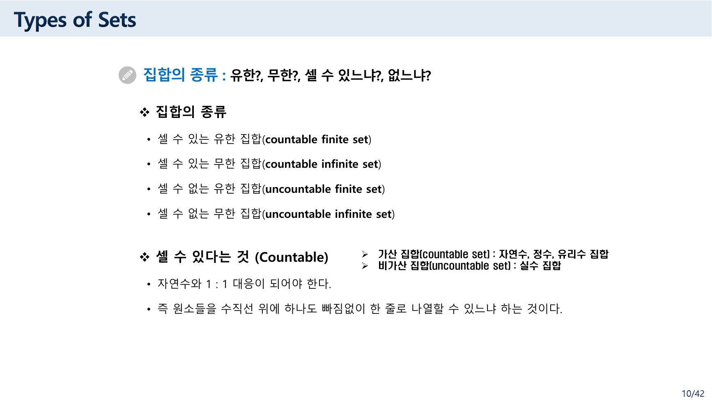
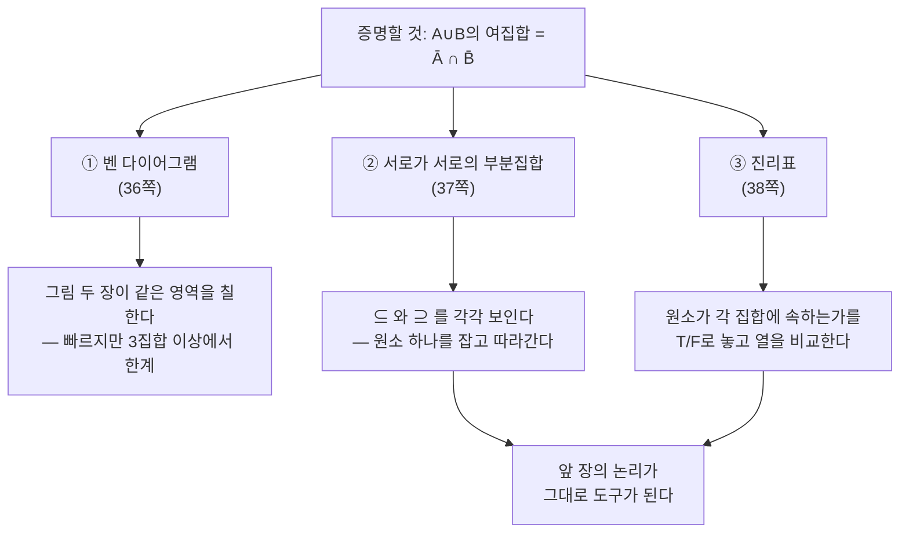
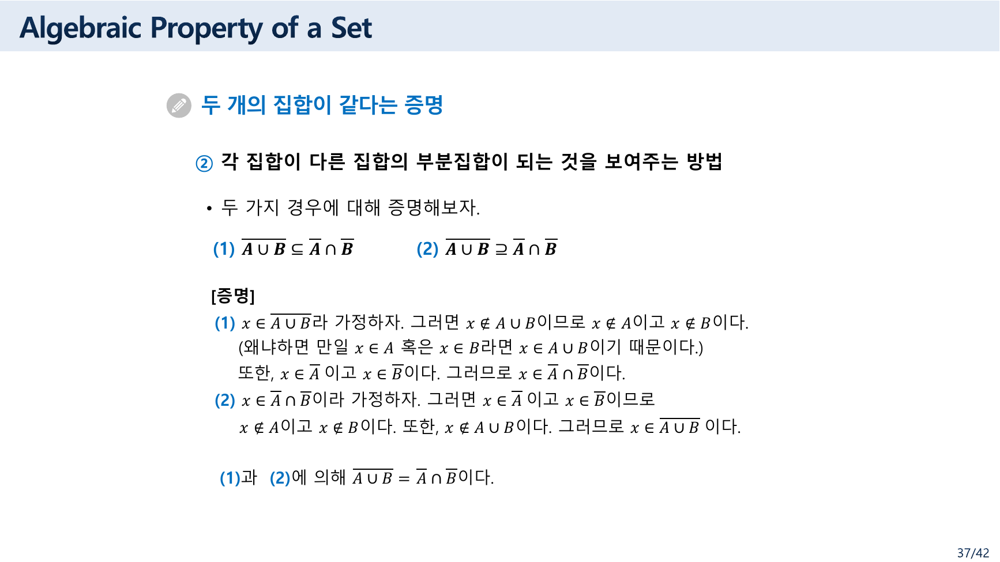
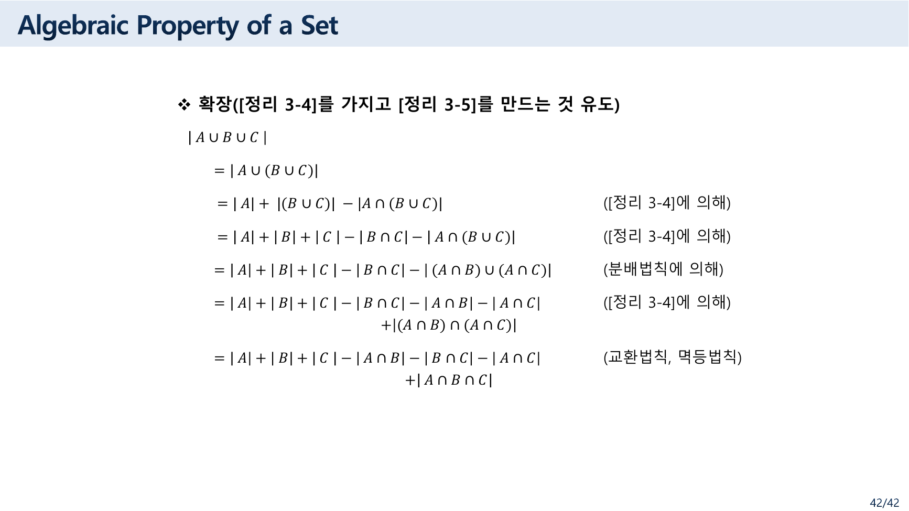
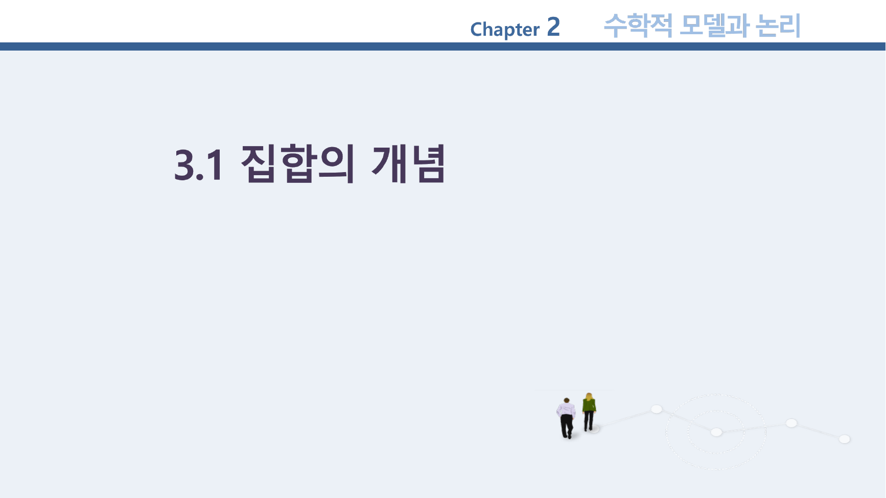
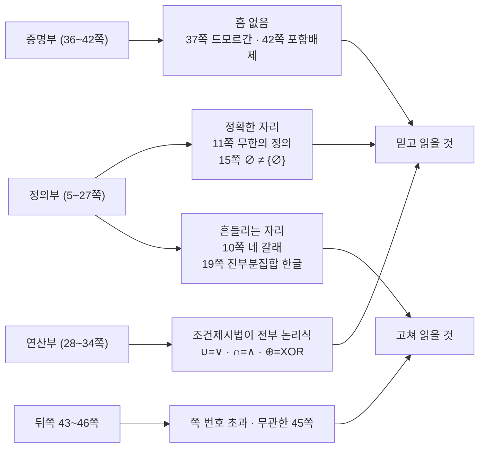

> [!abstract] 네 칸을 그렸는데 한 칸은 채울 수 없다
> 10쪽이 집합의 종류를 네 줄로 나눈다 — 셀 수 있는 유한 / 셀 수 있는 무한 / **셀 수 없는 유한** / 셀 수 없는 무한. 두 축(유한·무한 × 가산·비가산)을 곱해 만든 깔끔한 사분면처럼 보인다.
>
> 그런데 **셋째 줄에 해당하는 집합은 존재하지 않는다.** 원소가 유한 개면 하나씩 세면 언젠가 끝나므로 반드시 가산이다. 사분면의 한 칸은 영원히 빈칸이다.
>
> 이 자료는 이런 식으로 **정의가 흔들리는 자리와 매우 정확한 자리가 섞여** 있다. 19쪽의 진부분집합 한글 설명은 뜻이 통하지 않는데 바로 아래 영어 정의 상자는 완벽하고, 37쪽의 드 모르간 증명과 42쪽의 포함배제 확장은 한 줄도 흠이 없다. 그래서 이 정리는 개념을 차례로 나열하는 대신 **"어느 문장을 믿고 어느 문장을 고쳐 읽어야 하는가"** 를 척추로 삼는다.

---

## 1. 집합을 적는 두 가지 방법

6쪽이 표기법 둘을 준다.

| 방법 | 원본 설명 | 예 |
| --- | --- | --- |
| **원소나열법** (Roster Method) | S의 원소들을 나열하는 방법 | `S = {1, 3, 5, 7, 9}` |
| **조건제시법** (set builder notation) | 집합 내의 공통적인 성질을 기술하여 정의하는 방법 | `A = {x \| P(x)}`, 단 P(x)는 **명제** |

조건제시법의 단서 — "단, `P(x)` 는 명제"— 가 앞 장과 이어진다. 37쪽에서 배운 술어가 여기서 집합을 만드는 도구가 된다. 실제로 논리 자료 25쪽이 `Truth Sets of Quantifiers` 라는 제목으로 **"명제 P(x)가 참이 되는 원소들로 이루어지는 집합"** 을 정의해 두었다.

7·8쪽이 자주 쓰는 집합을 한글판·영어판으로 각각 적는다.

| 기호 | 원본 정의 |
| --- | --- |
| `Z⁺` | 양의 정수 = {1, 2, 3, …} |
| `N` | 양의 정수 **또는 0** = {0, 1, 2, 3, …} |
| `Z` | 정수 = {…, −2, −1, 0, 1, 2, …} |
| `R` | 실수 (8쪽은 `R⁺` 양의 실수도 함께 적는다) |
| `Q` | 유리수 |
| `C` | 복소수 |

`N` 에 0을 포함시킨 것이 명시되어 있다 — 자료마다 갈리는 관습이라 못박아 둔 것이 도움이 된다.

---

## 2. 사분면의 빈칸



10쪽이 문제의 네 줄을 적는다.

> ❖ 집합의 종류
> • 셀 수 있는 유한 집합(countable finite set)
> • 셀 수 있는 무한 집합(countable infinite set)
> • **셀 수 없는 유한 집합(uncountable finite set)**
> • 셀 수 없는 무한 집합(uncountable infinite set)
>
> ❖ 셀 수 있다는 것 (Countable)
> • **자연수와 1 : 1 대응이 되어야 한다.**
> • 즉 원소들을 수직선 위에 하나도 빠짐없이 한 줄로 나열할 수 있느냐 하는 것이다.
>
> ➢ 가산 집합(countable set) : 자연수, 정수, 유리수 집합
> ➢ 비가산 집합(uncountable set) : 실수 집합

이 정의를 그대로 적용하면 넷째 줄에서 걸린다.

> [!warning] 원본 오류 ① — "셀 수 없는 유한 집합"은 존재하지 않는다
> 셋째 줄 `uncountable finite set` 은 **비어 있는 분류**다. 같은 쪽이 "셀 수 있다 = 자연수와 1:1 대응이 된다 = 원소들을 한 줄로 나열할 수 있다"고 정의했는데, 원소가 유한 개인 집합은 언제나 그렇게 나열할 수 있다. **유한하면 반드시 가산**이다.
>
> 두 축을 곱해 네 칸을 만든 형식은 깔끔하지만, 이 경우 한 칸은 채워질 수 없다. 실제로 존재하는 것은 **세 종류**다.

```html preview h=480px
<div style="font-family:system-ui,-apple-system,sans-serif;padding:18px;color:var(--foreground)">
  <p style="font-size:12.5px;color:var(--muted-foreground);margin:0 0 12px">
    원본 10쪽의 네 갈래를 사분면으로 놓고, 같은 쪽이 든 예(가산: 자연수·정수·유리수 / 비가산: 실수)를 채웠다.
  </p>
  <div style="display:grid;grid-template-columns:110px 1fr 1fr;gap:6px;align-items:stretch">
    <div></div>
    <div style="text-align:center;font-size:12.5px;font-weight:700;padding-bottom:4px">유한(finite)</div>
    <div style="text-align:center;font-size:12.5px;font-weight:700;padding-bottom:4px">무한(infinite)</div>

    <div style="display:flex;align-items:center;font-size:12.5px;font-weight:700">셀 수 있다<br/>(countable)</div>
    <div class="q" data-k="cf"></div>
    <div class="q" data-k="ci"></div>

    <div style="display:flex;align-items:center;font-size:12.5px;font-weight:700">셀 수 없다<br/>(uncountable)</div>
    <div class="q" data-k="uf"></div>
    <div class="q" data-k="ui"></div>
  </div>
  <div id="d" style="margin-top:14px;padding:12px 14px;background:var(--card);border:1px solid var(--border);border-left:4px solid var(--chart-1);border-radius:var(--radius);font-size:13px;line-height:1.8"></div>

  <script>
    var Q = {
      cf:{t:'셀 수 있는 유한 집합', ex:'{1, 3, 5, 7, 9}', ok:true,
          d:'원소가 몇 개인지 세면 끝난다. 원본 6쪽의 <code>S = {1, 3, 5, 7, 9}</code> 가 여기 든다.'},
      ci:{t:'셀 수 있는 무한 집합', ex:'자연수 N · 정수 Z · 유리수 Q', ok:true,
          d:'끝은 없지만 <b>한 줄로 나열할 수 있다</b>. 원본이 “가산 집합 : 자연수, 정수, 유리수 집합”이라 적은 세 가지다. 정수는 0, 1, −1, 2, −2, … 로 늘어놓으면 빠짐이 없다.'},
      uf:{t:'셀 수 없는 유한 집합', ex:'—', ok:false,
          d:'<b style="color:var(--chart-5)">존재하지 않는다.</b> 원소가 유한 개면 그 개수만큼 세고 멈추면 되므로 언제나 자연수와 1:1 대응이 된다. 원본 10쪽이 이 줄을 네 갈래 중 하나로 적어 두었으나, 실제로 이 칸에 들어갈 집합은 없다.'},
      ui:{t:'셀 수 없는 무한 집합', ex:'실수 R', ok:true,
          d:'원본이 “비가산 집합 : 실수 집합”이라 적었다. 아무리 촘촘히 나열해도 빠지는 값이 남는다.'}
    };
    var sel = 'cf';
    function draw() {
      Array.prototype.forEach.call(document.getElementsByClassName('q'), function (el) {
        var k = el.getAttribute('data-k'), q = Q[k], on = k === sel;
        el.style.cssText = 'cursor:pointer;padding:13px 14px;border:1px solid ' +
          (on ? 'var(--chart-1)' : 'var(--border)') + ';border-radius:var(--radius);background:var(--card);' +
          (q.ok ? '' : 'border-style:dashed;opacity:.75;');
        el.innerHTML = '<div style="font-size:12.5px;font-weight:600;line-height:1.4">' + q.t + '</div>' +
          '<div style="font-family:ui-monospace,monospace;font-size:13px;margin-top:6px;color:' +
          (q.ok ? 'var(--chart-2)' : 'var(--chart-5)') + '">' + q.ex + '</div>' +
          (q.ok ? '' : '<div style="font-size:11px;color:var(--chart-5);margin-top:4px;font-weight:700">채울 수 없는 칸</div>');
        el.onclick = function () { sel = k; draw(); };
      });
      document.getElementById('d').innerHTML = '<b>' + Q[sel].t + '</b><br/>' + Q[sel].d;
    }
    draw();
  </script>
</div>
```

11쪽은 반대로 매우 정확하다.

> ❖ **무한(infinite)** — 원소의 개수가 무한히 많다는 것으로 집합 A의 적당한 **진부분 집합** S가 존재해서, A와 S 사이에 **일대일 대응이 존재하면** A를 무한집합이라고 한다.
> • 그런데 가장 많이 혼동하는 개념은 무한집합을 셀 수 없는 집합으로 생각하는 것이다. **무한 집합과 셀 수 없다는 것은 전혀 다른 측도**라는 것만 기억하면 된다.
> • 대천 앞바다의 모래알은 셀 수 있나요? → 당연히 셀 수 있지요. **시간이 조금 걸릴 뿐이죠.**

무한을 "자기 진부분집합과 크기가 같은 집합"으로 정의한 것(데데킨트 무한)은 정확하고, 두 개념을 혼동하지 말라는 경고까지 붙어 있다. **바로 앞 쪽의 넷째 줄이 그 경고를 스스로 어긴 셈**이다.

---

## 3. 부분집합 — 한 쪽 안에서 한글과 영어가 갈린다


19쪽 위쪽 한글 설명은 이렇다.

> **진부분 집합(proper subset)**
> • 집합 A가 집합 B의 진부분집합인 경우, **집합 A의 원소들 중에서 자기 자신을 제외한 다른 원소들을 모두 포함한 집합**을 말한다.
> • A⊂B라고 표시한다.

바로 아래 영어 정의 상자는 이렇다.

> **Definition**: If `A ⊆ B`, but `A ≠ B`, then we say A is a *proper subset* of B, denoted by `A ⊂ B`. If `A ⊂ B`, then
> $$\forall x (x \in A \rightarrow x \in B) \wedge \exists x (x \in B \wedge x \notin A)$$
> is true.

두 설명이 같은 것을 말하지 않는다.

> [!warning] 원본 오류 ② — 19쪽 진부분집합의 한글 설명
> "집합 A의 원소들 중에서 자기 자신을 제외한 다른 원소들을 모두 포함한 집합"은 뜻이 통하지 않는다. 진부분집합은 **A의 원소를 덜어내는 것이 아니라 B가 A보다 원소를 더 갖는 것**이고, 바로 아래 영어 상자가 그것을 정확히 적었다 — `A ⊆ B` 이면서 `A ≠ B`.
>
> 11쪽에도 올바른 정의가 있다 — "집합 A가 집합 B의 부분집합이지만, 서로 같지 않을 때, 즉 **A⊂B이고 A≠B**일 때". 즉 같은 자료 안에 정확한 정의가 두 군데 있고 19쪽 한글만 어긋난다.

영어 상자의 논리식이 이 개념을 가장 분명하게 말한다. 앞 절에서 배운 한정자로 읽으면 이렇다 — **∀ 부분**이 "A의 모든 원소가 B에 있다"(부분집합), **∃ 부분**이 "B에는 A에 없는 원소가 적어도 하나 있다"(진부분).

### 3.1 두 집합이 같다는 것

13·14쪽이 집합의 등호를 정의하고 함정 하나를 짚는다.

> • [예제 3-8]에서 집합 A와 집합 B가 같은 집합임을 확인했다. 그런데 **원소들을 나열한 순서를 보면 집합 A와 집합 B는 다르다.**
> • 집합의 원소들은 **순서에 상관없다.** 즉, 집합의 원소들은 순서를 갖지 않는다.
> (여백의 Note) 집합의 원소들이 **순서를 가진다면?**

여백의 질문이 21쪽으로 이어진다 — 순서를 가지면 **튜플(Tuple)** 이고, 튜플들을 모으면 23쪽의 **곱집합(Cartesian Product)** 이다. 곱집합이 다음 장(관계)의 출발점이 되므로, 이 한 줄의 Note가 두 장을 잇는 다리다.

15쪽이 초보자가 가장 자주 틀리는 두 가지를 적는다.

> Sets can be elements of sets. — `{{1,2,3}, a, {b,c}}` · `{N, Z, Q, R}`
> The empty set is different from a set containing the empty set. — **`∅ ≠ {∅}`**

`∅` 는 원소가 0개이고 `{∅}` 는 원소가 1개다. 20쪽의 멱집합에서 이 구분이 곧바로 쓰인다 — `P(∅) = {∅}` 이므로 원소가 하나다.

---

## 4. 연산 — 새 집합을 만드는 다섯 가지

28~34쪽이 연산을 정의한다. 28쪽이 목적을 한 줄로 적는다 — "**주어진 집합들의 원소를 조합함으로써 새로운 집합을 만드는 것**".

| 연산 | 기호 | 원본의 조건제시법 |
| --- | --- | --- |
| 합집합(union) | A∪B | `{x \| x∈A 또는 x∈B}` |
| 교집합(intersection) | A∩B | `{x \| x∈A 이고 x∈B}` |
| 여집합(complement) | Ā | (29쪽 그림) |
| 차집합(difference) | A−B | (29쪽 그림) |
| 대칭 차집합(symmetric difference) | A⊕B | `{x \| (x∈A이고 x∉B) 또는 (x∈B이고 x∉A)}` = `{x \| x∈A−B ∨ x∈B−A}` |

**조건제시법의 오른쪽이 전부 논리식**이라는 점을 보라. 합집합은 `∨`, 교집합은 `∧`, 대칭 차집합은 `⊕`(배타적 논리합) — 앞 장에서 배운 연산자가 그대로 집합 연산이 된다. 34쪽이 대칭 차집합의 기호로 `⊕` 를 쓴 것이 그 대응을 드러낸다.

30쪽이 크기를 다룬다(`The Cardinality of the Union of Two Sets`). 46쪽의 Review Questions가 구체적인 값을 준다.

> `U = {0,1,2,3,4,5,6,7,8,9,10}`, `A = {1,2,3,4,5}`, `B = {4,5,6,7,8}`
>
> 1. `A ∪ B` → `{1,2,3,4,5,6,7,8}`
> 2. `A ∩ B` → `{4,5}`
> 3. `Ā` → `{0,6,7,8,9,10}`

```html preview h=600px
<div style="font-family:system-ui,-apple-system,sans-serif;padding:18px;color:var(--foreground)">
  <p style="font-size:12.5px;color:var(--muted-foreground);margin:0 0 12px">
    원본 46쪽 Review Questions의 값 그대로다 — <code>U={0…10}</code>, <code>A={1,2,3,4,5}</code>, <code>B={4,5,6,7,8}</code>.
    연산을 골라 보라. 아래 원소 칸이 결과에 따라 칠해진다.
  </p>
  <div style="display:flex;gap:7px;flex-wrap:wrap;margin-bottom:14px" id="ops"></div>
  <svg id="venn" viewBox="0 0 460 200" width="100%" style="max-width:460px" role="img" aria-label="A와 B의 벤 다이어그램"></svg>
  <div style="display:flex;gap:5px;flex-wrap:wrap;margin:12px 0" id="cells"></div>
  <div id="out" style="padding:12px 14px;background:var(--card);border:1px solid var(--border);border-radius:var(--radius);font-size:13px;line-height:1.85"></div>

  <script>
    var U = [0,1,2,3,4,5,6,7,8,9,10], A = [1,2,3,4,5], B = [4,5,6,7,8];
    function inA(x){return A.indexOf(x)>=0;} function inB(x){return B.indexOf(x)>=0;}
    var OPS = [
      {k:'AuB', l:'A ∪ B',  f:function(x){return inA(x)||inB(x);}, src:'46쪽 1번 → {1,2,3,4,5,6,7,8}'},
      {k:'AnB', l:'A ∩ B',  f:function(x){return inA(x)&&inB(x);}, src:'46쪽 2번 → {4,5}'},
      {k:'Ac',  l:'Ā',      f:function(x){return !inA(x);},        src:'46쪽 3번 → {0,6,7,8,9,10}'},
      {k:'AmB', l:'A − B',  f:function(x){return inA(x)&&!inB(x);},src:'29쪽 Difference'},
      {k:'sym', l:'A ⊕ B',  f:function(x){return inA(x)!==inB(x);},src:'34쪽 대칭 차집합'}
    ];
    var sel = 0;
    function draw() {
      var op = OPS[sel], res = U.filter(op.f);
      document.getElementById('ops').innerHTML = OPS.map(function (o, i) {
        return '<button class="ob" data-i="' + i + '" style="cursor:pointer;padding:6px 13px;font-size:13px;font-family:ui-monospace,monospace;' +
          'border:1px solid ' + (i === sel ? 'var(--chart-1)' : 'var(--border)') + ';border-radius:var(--radius);' +
          'background:var(--card);color:' + (i === sel ? 'var(--chart-1)' : 'var(--foreground)') +
          ';font-weight:' + (i === sel ? '700' : '400') + '">' + o.l + '</button>';
      }).join('');
      function region(pred, fill) {
        return U.filter(pred).filter(op.f).length;
      }
      var onlyA = U.filter(function(x){return inA(x)&&!inB(x);}),
          both  = U.filter(function(x){return inA(x)&&inB(x);}),
          onlyB = U.filter(function(x){return !inA(x)&&inB(x);}),
          out   = U.filter(function(x){return !inA(x)&&!inB(x);});
      function hue(list) { return list.length && list.every(op.f) ? 'var(--chart-1)' : (list.some(op.f) ? 'var(--chart-4)' : 'none'); }
      document.getElementById('venn').innerHTML =
        '<rect x="4" y="4" width="452" height="192" fill="' + (out.every(op.f)&&out.length ? 'var(--chart-1)' : 'none') +
        '" fill-opacity="0.16" stroke="var(--border)"/>' +
        '<text x="12" y="20" font-size="12" fill="var(--muted-foreground)">U</text>' +
        '<circle cx="185" cy="100" r="78" fill="' + hue(onlyA) + '" fill-opacity="0.22" stroke="var(--chart-2)" stroke-width="1.6"/>' +
        '<circle cx="275" cy="100" r="78" fill="' + hue(onlyB) + '" fill-opacity="0.22" stroke="var(--chart-3)" stroke-width="1.6"/>' +
        '<text x="120" y="100" font-size="13" fill="var(--chart-2)" font-weight="700">A</text>' +
        '<text x="330" y="100" font-size="13" fill="var(--chart-3)" font-weight="700">B</text>' +
        '<text x="150" y="107" font-size="12" fill="var(--foreground)">' + onlyA.join(' ') + '</text>' +
        '<text x="212" y="107" font-size="12" fill="var(--foreground)">' + both.join(' ') + '</text>' +
        '<text x="285" y="107" font-size="12" fill="var(--foreground)">' + onlyB.join(' ') + '</text>' +
        '<text x="20" y="185" font-size="12" fill="var(--muted-foreground)">' + out.join(' ') + '</text>';
      document.getElementById('cells').innerHTML = U.map(function (x) {
        var on = op.f(x);
        return '<div style="width:34px;height:34px;display:flex;align-items:center;justify-content:center;' +
          'font-family:ui-monospace,monospace;font-size:14px;font-weight:700;border-radius:4px;border:1px solid ' +
          (on ? 'var(--chart-1)' : 'var(--border)') + ';background:var(--card);color:' +
          (on ? 'var(--chart-1)' : 'var(--muted-foreground)') + ';opacity:' + (on ? '1' : '.4') + '">' + x + '</div>';
      }).join('');
      document.getElementById('out').innerHTML =
        '<b style="font-family:ui-monospace,monospace;font-size:15px">' + op.l + ' = {' + res.join(', ') + '}</b>' +
        ' &nbsp;·&nbsp; 원소 <b>' + res.length + '</b>개' +
        '<br/><span style="color:var(--muted-foreground);font-size:12.5px">' + op.src + '</span>' +
        '<br/><span style="font-size:12.5px">|A| + |B| − |A∩B| = 5 + 5 − 2 = <b>8</b> = |A∪B| ' +
        '&nbsp;— 41쪽의 포함배제의 원리가 이 값에서 확인된다.</span>';
      Array.prototype.forEach.call(document.getElementsByClassName('ob'), function (b) {
        b.onclick = function () { sel = +b.getAttribute('data-i'); draw(); };
      });
    }
    draw();
  </script>
</div>
```

31·32쪽이 두 개 이상으로 확장한다 — **상호 서로소(mutually disjoint)** 와 **분할(partition)**.

> ❖ **가족 집합(family set)** : 공집합이 아닌 두 개 이상의 집합들의 모임
> • 즉, **분할이란 어떤 집합을 공집합이 아닌 상호 서로소인 부분 집합으로 나누는 것**을 말한다.

분할은 다음 장(관계)에서 동치류와 짝을 이루므로 여기서 정의해 둔 것이다. 33쪽이 "7개의 블록으로 구성된 분할"을 그림으로 보인다.

---

## 5. 같음을 증명하는 세 가지 길

36쪽이 방법 세 가지를 제시하고 37·38쪽이 그중 둘을 실행한다.

> **두 개의 집합이 같다는 증명**
> ❖ 벤 다이어그램을 이용하는 방법
> ❖ 각 집합이 다른 집합의 부분집합이 되는 것을 보여주는 방법
> ❖ 진리표를 이용하여 $\overline{A \cup B} = \overline{A} \cap \overline{B}$ 를 증명하는 방법

세 방법이 모두 **같은 명제**(드 모르간 법칙)를 증명한다. 방법 자체를 비교하는 것이 목적이라는 뜻이다.



### 5.1 두 번째 방법 — 원소 하나를 잡고 따라가기



37쪽의 증명을 원본 그대로 옮긴다.

> (1) $\overline{A \cup B} \subseteq \overline{A} \cap \overline{B}$ &nbsp;&nbsp;&nbsp; (2) $\overline{A \cup B} \supseteq \overline{A} \cap \overline{B}$
>
> **[증명]**
> (1) $x \in \overline{A \cup B}$ 라 가정하자. 그러면 $x \notin A \cup B$ 이므로 $x \notin A$ 이고 $x \notin B$ 이다. (왜냐하면 만일 $x \in A$ 혹은 $x \in B$ 라면 $x \in A \cup B$ 이기 때문이다.) 또한, $x \in \overline{A}$ 이고 $x \in \overline{B}$ 이다. 그러므로 $x \in \overline{A} \cap \overline{B}$ 이다.
> (2) $x \in \overline{A} \cap \overline{B}$ 이라 가정하자. 그러면 $x \in \overline{A}$ 이고 $x \in \overline{B}$ 이므로 $x \notin A$ 이고 $x \notin B$ 이다. 또한, $x \notin A \cup B$ 이다. 그러므로 $x \in \overline{A \cup B}$ 이다.
>
> (1)과 (2)에 의해 $\overline{A \cup B} = \overline{A} \cap \overline{B}$ 이다.

두 방향이 **정확히 서로의 역순**이다. (1)은 `∈ 여집합 → ∉ 합집합 → ∉A 이고 ∉B → ∈Ā 이고 ∈B̄`, (2)는 그 화살표를 거꾸로 따라간다. 괄호 안의 한 줄("왜냐하면 만일 x∈A 혹은 x∈B라면…")이 (1)에만 붙어 있는데, 그 자리가 논리적으로 유일하게 설명이 필요한 지점이다 — 합집합의 정의를 대우로 쓰는 곳이기 때문이다.

> [!note] 추출 텍스트에 속지 말 것
> 이 슬라이드를 텍스트로만 뽑으면 **여집합의 윗줄(bar)이 사라져** `A ∪ B = A ∩ B` 처럼 보이고 증명도 모순처럼 읽힌다. 실제 슬라이드에는 모든 자리에 윗줄이 정확히 그려져 있다. 이 자료는 여집합·절댓값 기호가 그림으로 처리된 곳이 많아, **기호가 이상하면 원본 이미지를 확인해야 한다.**

### 5.2 세 번째 방법 — 진리표

38쪽이 진리표로 같은 것을 보인다. 원소 하나가 A에 속하는가·B에 속하는가를 T/F로 놓으면 집합 연산이 논리 연산이 되고, 두 열이 같은지만 보면 된다.

| x∈A | x∈B | x∈A∪B | x∈ A∪B의 여집합 | x∈Ā | x∈B̄ | x∈Ā∩B̄ |
| --- | --- | --- | --- | --- | --- | --- |
| T | T | T | F | F | F | F |
| T | F | T | F | F | T | F |
| F | T | T | F | T | F | F |
| F | F | F | **T** | T | T | **T** |

넷째 열과 마지막 열이 네 줄 모두 같다. **집합의 등식이 명제의 동치로 환원**되는 것이 이 방법의 요점이고, 39쪽의 쌍대성(Duality)과 40쪽의 항등원 이야기(합집합의 항등원은 `∅`, 교집합의 항등원은 전체집합 `U`)가 그 연장선이다.

---

## 6. 포함배제 — 겹친 만큼 빼고, 뺀 만큼 더한다

41쪽이 문제를 세운다.

> **포함배제의 원리(the inclusion-exclusion principle)**
> • 집합 `S` 가 `S₁, S₂, …, Sₙ` 으로 분할되어 있거나 상호 서로소라면, `|S| = |S₁| + |S₂| + ⋯ + |Sₙ|` 이다.
> • 그러나 **일반적으로 집합은 상호 서로소가 아니다.**
> • 즉, 상호 서로소가 아닌 집합 `S` 의 크기를 구하는 것이 포함배제의 원리!



42쪽이 두 집합의 [정리 3-4]에서 세 집합의 [정리 3-5]를 유도한다. 원본의 여섯 줄을 그대로 옮긴다.

| | 식 | 근거 |
| --- | --- | --- |
| | `\|A∪B∪C\|` | |
| = | `\|A∪(B∪C)\|` | (결합) |
| = | `\|A\| + \|B∪C\| − \|A∩(B∪C)\|` | [정리 3-4] |
| = | `\|A\| + \|B\| + \|C\| − \|B∩C\| − \|A∩(B∪C)\|` | [정리 3-4] |
| = | `\|A\| + \|B\| + \|C\| − \|B∩C\| − \|(A∩B)∪(A∩C)\|` | 분배법칙 |
| = | `\|A\| + \|B\| + \|C\| − \|B∩C\| − \|A∩B\| − \|A∩C\| + \|(A∩B)∩(A∩C)\|` | [정리 3-4] |
| = | `\|A\| + \|B\| + \|C\| − \|A∩B\| − \|B∩C\| − \|A∩C\| + \|A∩B∩C\|` | 교환법칙, 멱등법칙 |

**같은 정리를 세 번 쓰는 것**이 이 유도의 구조다. 두 집합짜리 공식 `|X∪Y| = |X| + |Y| − |X∩Y|` 를 (1) `A` 와 `B∪C` 에, (2) `B` 와 `C` 에, (3) `A∩B` 와 `A∩C` 에 차례로 적용한다. 마지막 줄의 `(A∩B)∩(A∩C) = A∩B∩C` 가 멱등법칙(`A∩A = A`)으로 정리되는 자리다.

이 유도에는 흠이 없었다. 다만 텍스트만 추출하면 절댓값 막대가 사라져 집합과 크기가 뒤섞여 보이므로(§5.1의 Note와 같은 이유), 슬라이드 이미지를 함께 봐야 읽힌다.

---

## 7. 자료 자체에 남은 흔적

내용과 무관하지만 이 파일을 다룰 때 알아 두면 좋은 것들이다.



> [!caution] 원본 오류 ③ — 절 표지의 머리글이 앞 장 것이다
> 텍스트가 0자인 쪽은 4쪽과 27쪽 두 장이고, 둘 다 절 표지다(각각 `3.1 집합의 개념`, `3.2 집합의 연산`). 그런데 두 쪽 모두 오른쪽 위 머리글이 **`Chapter 2 수학적 모델과 논리`** 다. 앞 장의 표지 슬라이드를 복제해 제목만 바꾼 흔적이다.

쪽 번호에서도 같은 성격의 흔적이 보인다.

> [!caution] 원본 오류 ④ — 쪽 번호가 총 쪽수를 넘는다
> 모든 쪽의 오른쪽 아래에 `n/42` 가 찍혀 있는데, 파일은 **46쪽**이다. 그래서 마지막 네 쪽이 `43/42`, `44/42`, `45/42`, `46/42` 로 표시된다. 42쪽 이후 네 장이 나중에 덧붙은 것으로 보인다.

그 덧붙은 자리에 내용이 어긋난 쪽도 하나 있다.

> [!caution] 원본 오류 ⑤ — 45쪽이 집합과 무관하다
> 45쪽 제목은 `Algebraic Property of a Set` 인데 내용은 **"시스템 프로그래머와 응용 프로그래머 비교 설명"** 이다. 운영체제·컴파일러를 만드는 사람과 한글·오피스·크롬·포토샵을 만드는 사람의 차이를 여덟 줄로 설명한다. 집합의 대수적 성질과는 아무 관련이 없다. §7의 쪽 번호 문제와 같은 자리(43쪽 이후)에서 일어난 일이다.

---

## 8. 이 자료가 남긴 것



정의를 다루는 앞부분에 오류가 몰려 있고, **실제로 계산하고 증명하는 뒷부분(36~42쪽)에는 흠이 없다.** 그래서 이 자료는 정의를 외우는 데 쓰기보다 **증명 세 가지 방법과 포함배제 유도를 따라가는 데** 쓰는 편이 안전하다. 정의가 필요할 때는 11쪽(무한)과 19쪽의 **영어 상자**를 근거로 삼으면 된다.

---

## 이어지는 문서

- [04. 증명·귀납법·프로그램 검증 — 논리가 시스템으로 건너가려 할 때](<./04. 증명·귀납법·프로그램 검증 — 논리가 시스템으로 건너가려 할 때.md>) — §5의 세 증명 방법이 63쪽 증명 분류의 실물이다
- [06. 함수에서 관계로 — 자료가 자기 목차를 거꾸로 간다](<./06. 함수에서 관계로 — 자료가 자기 목차를 거꾸로 간다.md>) — 14쪽 Note("원소가 순서를 가진다면?")가 곱집합으로 이어진다
- [03. 술어 논리와 논리적 추론 — 같은 규칙을 두 벌로 가르치는 자료](<./03. 술어 논리와 논리적 추론 — 같은 규칙을 두 벌로 가르치는 자료.md>) — 조건제시법의 `P(x)` 가 술어다

관련 과목: [01/data-structures](../../../01_programming-foundations/data-structures/README.md)(집합 자료구조), [05/database-systems](../../../05_software-engineering/database-systems/README.md)(관계 대수의 합·교·차집합).

---

## 근거 자료

`ComputerScience/02_math-theory/discrete-mathematics/sources/집합 및 집합연산.pdf` (46쪽) 전체.

| 쪽 | 내용 | 이 문서에서 다룬 곳 |
| --- | --- | --- |
| 3 | 미리보기 — 칸토어, 스푸트니크 | (배경) |
| 4 · 27 | 절 표지 (텍스트 0자) | §7 (슬라이드 인용) |
| 5–8 | 집합과 원소, 두 표기법, 자주 쓰는 집합 | §1 |
| 10–11 | 집합의 종류, 가산/비가산, 무한의 정의 | §2 (슬라이드 인용) |
| 13–15 | 집합의 같음, 순서 없음, ∅ ≠ {∅} | §3.1 |
| 16–25 | 부분집합·진부분집합·멱집합·튜플·곱집합 | §3 (슬라이드 인용) |
| 28–34 | 합·교·여·차·대칭 차집합, 서로소, 분할 | §4 |
| 36–40 | 두 집합이 같다는 증명 세 가지, 쌍대성 | §5 (슬라이드 인용) |
| 41–42 | 포함배제의 원리와 세 집합 확장 | §6 (슬라이드 인용) |
| 45–46 | (무관한 쪽) · Review Questions | §7 · §4 |

§4의 인터랙티브 값은 46쪽 Review Questions의 `U`, `A`, `B` 를 그대로 썼고 세 답(`A∪B`, `A∩B`, `Ā`)이 원본과 일치함을 확인했다. §5.2의 진리표와 §6의 유도는 원본 38·42쪽 슬라이드 이미지를 보고 옮겼다. §2의 "유한하면 반드시 가산"이라는 지적은 같은 쪽의 정의("자연수와 1:1 대응")에서 직접 따라 나오는 것이며, 그 밖에 원본에 없는 내용은 넣지 않았다.
