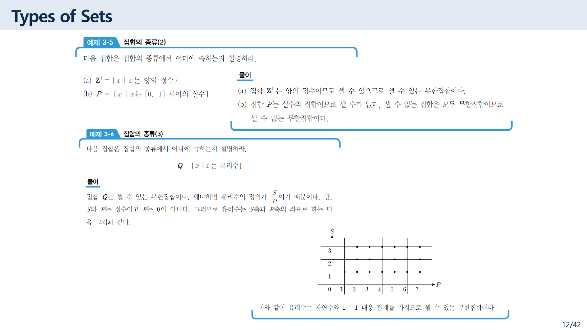
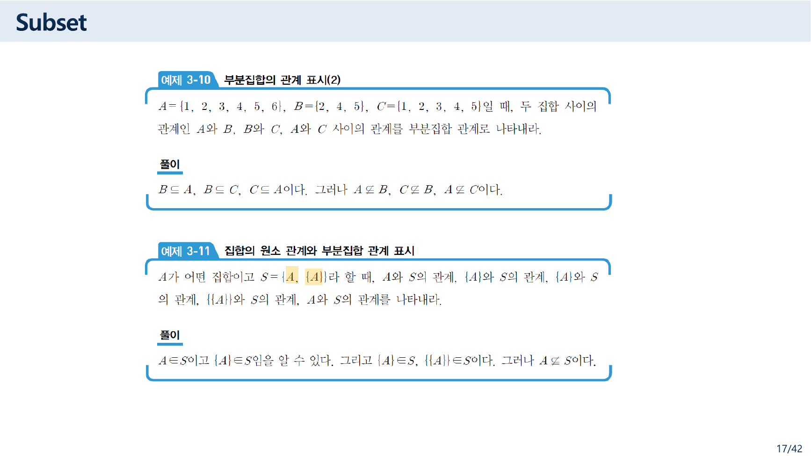
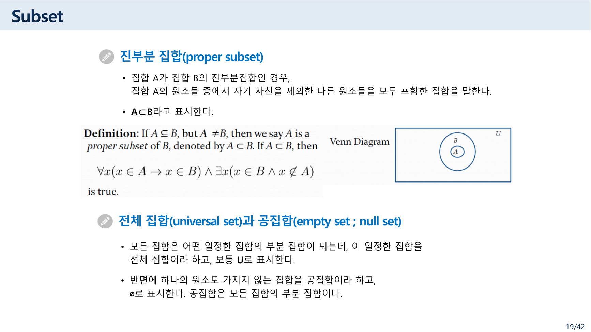
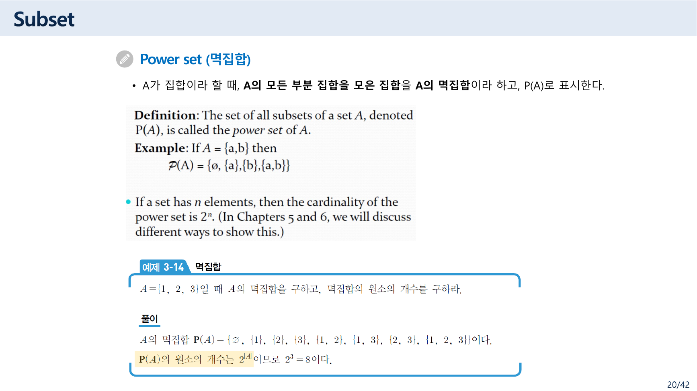
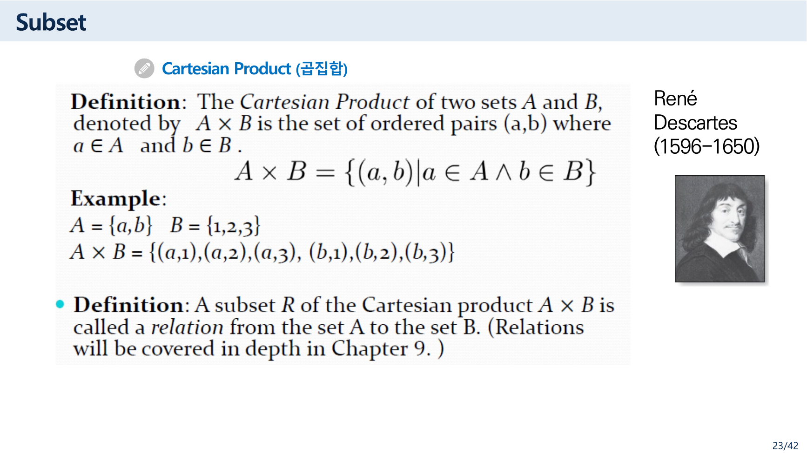

> [!abstract] 이 묶음이 실제로 하는 말
> 집합의 정의는 3쪽에 한 줄로 끝난다 — *"공통적인 성질을 가진 객체들의 모임."* 그런데 이 자료는 그 뒤로 여섯 쪽(9~14쪽)을 **"셀 수 있는가"**에 쓴다. 정의보다 셈이 훨씬 긴 자료다.
>
> 왜 그런가. 14쪽이 이유를 흘린다 — *"집합의 원소들은 순서에 상관없다. 즉, 집합의 원소들은 순서를 갖지 않는다."* 집합은 **순서를 버리고 중복을 버린** 자료형이고, 그렇게 버렸기 때문에 남는 질문이 딱 하나가 된다. **몇 개인가.** [01번 노트](./01.%20%EC%B2%AB%20%EC%8B%9C%EA%B0%84%EC%97%90%20%EC%A0%95%EC%9D%98%20%EB%8C%80%EC%8B%A0%20%EC%82%AC%EC%A7%84%20%EB%91%90%20%EC%9E%A5%20%E2%80%94%20%EC%9D%B4%EC%82%B0%EC%9D%80%20%EB%8C%80%EC%83%81%EC%9D%B4%20%EC%95%84%EB%8B%88%EB%9D%BC%20%EA%B8%B0%EB%A1%9D%20%EB%B0%A9%EC%8B%9D%EC%9D%B4%EB%8B%A4.md)에서 본 첫 시간의 질문 — *무엇을 낱개로 셀 것인가* — 이 여기서 도구를 얻는다.
>
> 그런데 10쪽이 내놓은 네 갈래 분류에 **존재할 수 없는 칸이 하나** 들어 있다. 그리고 19쪽에서는 진부분집합의 한국어 정의와 바로 아래 영어 정의가 서로 다른 말을 한다.
>
> 마지막에 반전이 있다. 14쪽에서 순서를 버린 자료형이, 21~24쪽에서 **튜플과 곱집합으로 순서를 되사 온다.** 그리고 그 되사 온 자리 위에서 다음 장의 주제인 **관계(relation)**가 정의된다.

---

## 정의보다 긴 셈 — 그리고 비어 있는 칸


10쪽이 집합을 네 갈래로 나눈다.

> ❖ 집합의 종류
> • 셀 수 있는 유한 집합(countable finite set)
> • 셀 수 있는 무한 집합(countable infinite set)
> • **셀 수 없는 유한 집합(uncountable finite set)**
> • 셀 수 없는 무한 집합(uncountable infinite set)

`유한/무한` 두 값과 `셀 수 있다/없다` 두 값을 곱해 넷을 만든 것이다. 그런데 셋째 칸은 **채울 수 없다.**

> [!caution] 원본 오류 — 「셀 수 없는 유한 집합」은 존재하지 않는다
> 유한집합은 원소가 $n$개인 집합이고, 그 원소들에 $1, 2, \dots, n$이라는 번호를 붙일 수 있다. 즉 **유한하다는 것 자체가 셀 수 있다는 뜻**이다. 셀 수 없으려면 무한해야 한다.
>
> 실제로 같은 쪽 오른쪽 상자가 이 사실을 스스로 적어 놓았다.
>
> > ➢ 가산 집합(countable set) : 자연수, 정수, 유리수 집합
> > ➢ 비가산 집합(uncountable set) : **실수 집합**
>
> 비가산의 예로 든 것이 실수 집합 하나이고, 그것은 무한집합이다. 유한한 비가산 집합의 예는 이 자료 어디에도 없다 — 있을 수가 없기 때문이다.
>
> 네 칸을 두 칸으로 줄이면 `셀 수 있는 유한 / 셀 수 있는 무한 / 셀 수 없는 (무한)` 세 갈래가 된다. 원본이 곱셈으로 표를 만들다가 실제로 존재하는 조합을 확인하지 않은 것으로 보인다.

11쪽이 무한의 정의를 내놓는데, 이 자료에서 가장 밀도 높은 한 문장이다.

> 원소의 개수가 무한히 많다는 것으로 집합 A의 적당한 **진부분 집합(proper subset) S가 존재해서, A와 S 사이에 일대일 대응이 존재하면** A를 무한집합이라고 한다.

이것이 데데킨트의 정의다. 자연수 전체와 짝수 전체 사이에 $n \leftrightarrow 2n$이라는 일대일 대응이 있고, 짝수는 자연수의 진부분집합이다 — 그러므로 자연수는 무한하다. **유한집합에서는 절대 일어날 수 없는 일**(진부분집합은 반드시 원소가 더 적다)이 무한의 정의가 된다.

그리고 같은 쪽이 곧바로 흔한 오해를 끊는다.

> 그런데 가장 많이 혼동하는 개념은 무한집합을 셀 수 없는 집합으로 생각하는 것이다. **무한 집합과 셀 수 없다는 것은 전혀 다른 측도**라는 것만 기억하면 된다.
> 대천 앞바다의 모래알은 셀 수 있나요? → 당연히 셀 수 있지요. **시간이 조금 걸릴 뿐이죠.**

마지막 한 줄이 "셀 수 있다"의 뜻을 정확히 짚는다. **끝날 때까지 세라는 것이 아니라, 번호를 붙일 수 있느냐**를 묻는 것이다.



12쪽의 두 예제가 그 판정을 실제로 한다.

| 예제 | 집합 | 원본의 판정 | 근거 |
| --- | --- | --- | --- |
| 3-5 (a) | $\mathbf{Z}^+ = \{x \mid x$는 양의 정수$\}$ | 셀 수 있는 무한집합 | 양의 정수이므로 셀 수 있다 |
| 3-5 (b) | $P = \{x \mid x$는 $[0, 1]$ 사이의 실수$\}$ | 셀 수 없는 무한집합 | 실수의 집합이므로 셀 수가 없다 |
| 3-6 | $Q = \{x \mid x$는 유리수$\}$ | 셀 수 있는 무한집합 | $S$축과 $P$축의 격자점에 대응시킬 수 있다 |

3-6의 근거가 재미있다. 유리수를 $\frac{S}{P}$($S, P$는 정수, $P \neq 0$)로 보고 **격자점 그림**을 그린 뒤 이렇게 맺는다 — *"이와 같이 유리수는 자연수와 1:1 대응 관계를 가지므로 셀 수 있는 무한집합이다."* 칸토어의 대각선 나열을 그림 한 장으로 압축한 것이다.

3-5 (b)가 결정적이다. $[0, 1]$은 **길이가 1인 유한한 구간**인데 그 안의 실수는 셀 수 없다. 유한한 크기와 셀 수 있음이 무관하다는 사실이 여기서 드러나고, 그것이 10쪽 셋째 칸이 왜 비어 있는지를 뒤집어 말해 준다 — 셀 수 없음은 **원소의 개수**가 무한할 때만 생기고, 구간의 길이와는 관계가 없다.

```html preview h=580px
<div style="font-family:system-ui,-apple-system,sans-serif;padding:20px;color:var(--foreground)">
  <div style="font-size:13px;font-weight:600;margin-bottom:10px">10쪽의 네 칸에 원본이 든 예를 넣어 본다</div>
  <div style="font-size:12px;opacity:.75;margin-bottom:14px">칸을 누르면 그 칸에 들어갈 수 있는 집합이 있는지 확인된다.</div>

  <table style="width:100%;border-collapse:collapse;font-size:13.5px;max-width:620px">
    <thead><tr>
      <th style="padding:8px;border:1px solid var(--border);background:var(--muted)"></th>
      <th style="padding:8px;border:1px solid var(--border);background:var(--muted)">유한</th>
      <th style="padding:8px;border:1px solid var(--border);background:var(--muted)">무한</th>
    </tr></thead>
    <tbody>
      <tr>
        <th style="padding:8px;border:1px solid var(--border);background:var(--muted);text-align:left">셀 수 있다</th>
        <td id="c00" class="cell" style="padding:16px 8px;border:1px solid var(--border);text-align:center;cursor:pointer"></td>
        <td id="c01" class="cell" style="padding:16px 8px;border:1px solid var(--border);text-align:center;cursor:pointer"></td>
      </tr>
      <tr>
        <th style="padding:8px;border:1px solid var(--border);background:var(--muted);text-align:left">셀 수 없다</th>
        <td id="c10" class="cell" style="padding:16px 8px;border:1px solid var(--border);text-align:center;cursor:pointer"></td>
        <td id="c11" class="cell" style="padding:16px 8px;border:1px solid var(--border);text-align:center;cursor:pointer"></td>
      </tr>
    </tbody>
  </table>

  <div id="cellnote" style="margin-top:16px;padding:13px;border:1px solid var(--border);border-radius:8px;background:var(--card);font-size:13px;line-height:1.85;min-height:60px"></div>
</div>
<script>
(function(){
  var CELLS={
    c00:{name:'셀 수 있는 유한 집합 (countable finite set)', ok:true,
      ex:'{1, 3, 5, 7, 9} · 예제 3-14의 A = {1, 2, 3}',
      n:'원소가 n개이면 1부터 n까지 번호를 붙이면 끝난다. <b>유한하면 반드시 셀 수 있다.</b>'},
    c01:{name:'셀 수 있는 무한 집합 (countable infinite set)', ok:true,
      ex:'예제 3-5(a) Z⁺ = 양의 정수 전체 · 예제 3-6 Q = 유리수 전체',
      n:'번호는 끝없이 이어지지만 하나도 빠뜨리지 않고 붙일 수 있다. 유리수가 여기 들어간다는 것이 12쪽 격자점 그림의 요점이다.'},
    c10:{name:'셀 수 없는 유한 집합 (uncountable finite set)', ok:false,
      ex:'— 원본에도 없고, 존재할 수 없다 —',
      n:'<b style="color:var(--chart-4)">이 칸은 채울 수 없다.</b> 유한하다는 것은 원소가 n개라는 뜻이고, 그러면 1부터 n까지 번호를 붙일 수 있으므로 셀 수 있다. 10쪽이 두 축을 곱해 표를 만들면서 실제로 존재하는 조합인지 확인하지 않은 자리다.'},
    c11:{name:'셀 수 없는 무한 집합 (uncountable infinite set)', ok:true,
      ex:'예제 3-5(b) [0, 1] 사이의 실수 · 10쪽의 「비가산 집합: 실수 집합」',
      n:'[0, 1]은 길이가 1인 <b>유한한 구간</b>인데 그 안의 실수는 셀 수 없다 — 구간의 길이와 원소의 개수는 다른 이야기다.'}
  };
  var N=document.getElementById('cellnote');
  Object.keys(CELLS).forEach(function(id){
    var c=CELLS[id], el=document.getElementById(id);
    el.innerHTML='<div style="font-size:22px;font-weight:700;color:'
      +(c.ok?'var(--chart-2)':'var(--chart-4)')+'">'+(c.ok?'있다':'없다')+'</div>';
    el.style.background = c.ok ? 'var(--card)' : 'var(--muted)';
    el.addEventListener('click',function(){
      N.innerHTML='<b>'+c.name+'</b><br/><span style="font-family:ui-monospace,Menlo,monospace;font-size:12.5px;opacity:.85">'
        +c.ex+'</span><br/>'+c.n;
      Object.keys(CELLS).forEach(function(k){
        document.getElementById(k).style.outline = (k===id) ? '2px solid var(--chart-1)' : 'none';
      });
    });
  });
  document.getElementById('c10').click();
})();
</script>
```

---

## 원소인가 부분집합인가 — 이 자료가 가장 공들이는 구분

16~20쪽이 부분집합을 다루는데, 실제 무게 중심은 **$\in$과 $\subseteq$를 헷갈리지 않는 것**에 있다.



**[예제 3-10]** $A = \{1,2,3,4,5,6\}$, $B = \{2,4,5\}$, $C = \{1,2,3,4,5\}$일 때 관계를 부분집합 관계로 나타내라.

원본의 답은 $B \subseteq A$, $B \subseteq C$, $C \subseteq A$이고 $A \nsubseteq B$, $C \nsubseteq B$, $A \nsubseteq C$다. 여섯 관계를 하나씩 확인했고 모두 맞다 — $B$의 원소 2·4·5가 $A$와 $C$에 모두 들어 있고, $C$의 원소 1~5가 $A$에 들어 있으며, $A$에만 있는 6이 세 개의 부정을 만든다.

**[예제 3-11]**이 이 자료에서 가장 어려운 문제다. $A$가 어떤 집합이고 $S = \{A, \{A\}\}$일 때의 관계를 묻는다. 원본의 답은 이렇다.

$$A \in S, \quad \{A\} \in S, \quad \{A\} \subseteq S, \quad \{\{A\}\} \subseteq S, \quad \text{그러나 } A \nsubseteq S$$

앞의 넷은 정확하다. $S$의 원소가 **두 개**($A$와 $\{A\}$)이므로 $A \in S$이고 $\{A\} \in S$다. 그리고 $\{A\}$는 $S$의 원소 하나($A$)만 담은 집합이므로 $\{A\} \subseteq S$이고, 같은 이유로 $\{\{A\}\} \subseteq S$다.

**$\in$은 한 겹, $\subseteq$는 안쪽을 다 본다** — 이것이 이 예제가 훈련시키는 감각이다.

> [!warning] 마지막 한 줄은 언제나 참은 아니다
> 원본은 `그러나 $A \nsubseteq S$이다`로 못 박는다. 그런데 $A$는 문제에서 *"어떤 집합"*이라고만 했으므로 무엇이든 될 수 있고, **$A = \varnothing$이면 이 주장이 깨진다.**
>
> $A = \varnothing$일 때 $S = \{\varnothing, \{\varnothing\}\}$이고, 공집합은 모든 집합의 부분집합이므로 $\varnothing \subseteq S$, 즉 $A \subseteq S$다. 19쪽이 *"공집합은 모든 집합의 부분 집합이다"*라고 직접 적어 놓았으므로 같은 자료 안에서 충돌한다.
>
> 원본이 말하려던 것은 *"$A \in S$라고 해서 $A \subseteq S$가 따라 나오지는 않는다"*이며, 그 취지에서는 옳다. 다만 `이다`가 아니라 `일반적으로 성립하지 않는다`여야 정확하다.

### 19쪽 — 한 슬라이드에 두 개의 정의



이 슬라이드에는 진부분집합의 정의가 **두 번** 나온다. 위쪽 한국어 글머리표는 이렇다.

> 집합 A가 집합 B의 진부분집합인 경우, **집합 A의 원소들 중에서 자기 자신을 제외한 다른 원소들을 모두 포함한 집합**을 말한다.

바로 아래 영어 상자는 이렇다.

> **Definition**: If $A \subseteq B$, but $A \neq B$, then we say $A$ is a *proper subset* of $B$, denoted by $A \subset B$. If $A \subset B$, then $\forall x(x \in A \to x \in B) \land \exists x(x \in B \land x \notin A)$ is true.

<!-- -->
> [!caution] 원본 오류 — 19쪽 한국어 정의가 뜻이 통하지 않는다
> 영어 정의는 정확하다 — $A \subseteq B$이면서 $A \neq B$, 그리고 술어로 쓰면 *"$A$의 모든 원소가 $B$에 있고, $B$에 있으면서 $A$에 없는 원소가 적어도 하나 존재한다."*
>
> 반면 한국어 문장은 성립하지 않는다. **"집합 A의 원소들 중에서 자기 자신을 제외한"**이 무엇을 가리키는지 알 수 없다 — 집합의 원소 중에 "자기 자신"이라는 것은 없다. 진부분집합에서 빠지는 것은 **$A$의 원소**가 아니라 **$B$에는 있고 $A$에는 없는 원소**이며, 문장의 주어와 목적어가 뒤엉켰다.
>
> 게다가 이 자료는 **$\subset$ 기호를 두 가지 뜻으로 쓴다.** 11쪽은 *"집합 A가 집합 B의 부분집합이지만, 서로 같지 않을 때, 즉 $A \subset B$이고 $A \neq B$일 때"*라고 하여 $\subset$을 **보통의 부분집합**으로 쓰고 $A \neq B$를 따로 붙인다. 19쪽은 $\subset$ 자체를 **진부분집합**의 기호로 쓴다. 같은 기호가 자료 안에서 다른 뜻을 갖는다.

### 20쪽 — 멱집합



> **[예제 3-14]** $A = \{1, 2, 3\}$일 때 $A$의 멱집합을 구하고, 멱집합의 원소의 개수를 구하라.
> **[풀이]** $P(A) = \{\varnothing, \{1\}, \{2\}, \{3\}, \{1,2\}, \{1,3\}, \{2,3\}, \{1,2,3\}\}$이다. $P(A)$의 원소의 개수는 $2^{|A|}$이므로 $2^3 = 8$이다.

여덟 개를 세어 확인했다 — 원소 0개짜리 1개, 1개짜리 3개, 2개짜리 3개, 3개짜리 1개. 합이 8이다.

$2^{|A|}$가 나오는 이유를 슬라이드는 설명하지 않는다(영어 상자가 *"In Chapters 5 and 6, we will discuss different ways to show this."*라고 미룬다). 보충하면 이렇다 — **부분집합 하나를 고르는 일은 원소마다 "넣을까 말까"를 정하는 일**이고, 원소가 $n$개이면 그 결정이 $n$번, 각각 2가지이므로 $2^n$이다. 곧 부분집합 하나가 길이 $n$짜리 0/1 문자열 하나와 정확히 짝을 이룬다.

```html preview h=560px
<div style="font-family:system-ui,-apple-system,sans-serif;padding:20px;color:var(--foreground)">
  <label for="ns" style="font-size:13px;font-weight:600">A의 원소 개수 n = <span id="nsv" style="color:var(--chart-1);font-size:19px">3</span></label>
  <input id="ns" type="range" min="0" max="5" value="3" style="width:100%;max-width:340px;accent-color:var(--chart-1);margin:8px 0 6px" />
  <div style="font-size:12px;opacity:.75;margin-bottom:14px">원본 예제 3-14: A = {1, 2, 3} 일 때 |P(A)| = 2³ = 8</div>

  <div style="display:flex;gap:12px;flex-wrap:wrap;margin-bottom:16px">
    <div style="flex:1;min-width:160px;text-align:center;padding:11px;border:1px solid var(--border);border-radius:8px;background:var(--card)">
      <div style="font-size:11px;opacity:.75">A</div>
      <div id="setA" style="font-size:16px;font-weight:700;font-family:ui-monospace,Menlo,monospace;color:var(--chart-3)"></div>
    </div>
    <div style="flex:1;min-width:160px;text-align:center;padding:11px;border:1px solid var(--border);border-radius:8px;background:var(--card)">
      <div style="font-size:11px;opacity:.75">|P(A)| = 2ⁿ</div>
      <div id="cnt" style="font-size:22px;font-weight:700;color:var(--chart-1)"></div>
    </div>
  </div>

  <div style="font-size:12.5px;opacity:.85;margin-bottom:8px">
    부분집합 하나 = 원소마다 <b>넣을까(1) 말까(0)</b>를 정한 결과. 그래서 0/1 문자열 하나와 정확히 짝을 이룬다.
  </div>
  <div id="subs" style="display:flex;flex-direction:column;gap:4px;font-family:ui-monospace,SFMono-Regular,Menlo,monospace;font-size:13px"></div>
</div>
<script>
(function(){
  var ns=document.getElementById('ns'),nsv=document.getElementById('nsv'),
      SA=document.getElementById('setA'),C=document.getElementById('cnt'),S=document.getElementById('subs');
  function draw(){
    var n=+ns.value; nsv.textContent=n;
    var el=[]; for(var i=1;i<=n;i++) el.push(i);
    SA.textContent = n===0 ? '∅' : '{'+el.join(', ')+'}';
    C.textContent = Math.pow(2,n)+' 개';
    var rows='';
    for(var m=0;m<Math.pow(2,n);m++){
      var bits='', mem=[];
      for(var i=0;i<n;i++){
        var on=((m>>(n-1-i))&1)===1;
        bits+= on?'1':'0';
        if(on) mem.push(el[i]);
      }
      rows+='<div style="display:flex;gap:14px;align-items:center;padding:4px 9px;border-radius:5px;background:var(--card);border:1px solid var(--border)">'
        +'<span style="color:var(--chart-3);letter-spacing:3px;min-width:56px">'+(bits||'—')+'</span>'
        +'<span style="color:var(--chart-1);font-weight:700">'+(mem.length?'{'+mem.join(', ')+'}':'∅')+'</span></div>';
    }
    S.innerHTML=rows;
  }
  ns.addEventListener('input',draw); draw();
})();
</script>
```

---

## 순서를 되사 오다 — 튜플과 곱집합

14쪽이 집합의 성질을 못 박았다.

> [예제 3-8]에서 집합 A와 집합 B가 같은 집합임을 확인했다. 그런데 원소들을 나열한 순서를 보면 집합 A와 집합 B는 다르다. **집합의 원소들은 순서에 상관없다. 즉, 집합의 원소들은 순서를 갖지 않는다.**
>
> (오른쪽 Note) **집합의 원소들이 순서를 가진다면?**

오른쪽에 붙은 그 한 줄짜리 물음이 21쪽으로 이어진다. 21·22쪽의 제목이 **Tuples**이고, 23쪽이 곱집합이다.



> **Definition**: The Cartesian Product of two sets $A$ and $B$, denoted by $A \times B$ is the set of ordered pairs $(a,b)$ where $a \in A$ and $b \in B$.
> $$A \times B = \{(a, b) \mid a \in A \land b \in B\}$$
> **Example**: $A = \{a,b\}$, $B = \{1,2,3\}$
> $A \times B = \{(a,1),(a,2),(a,3),\ (b,1),(b,2),(b,3)\}$

원소가 여섯 개다 — $|A| \times |B| = 2 \times 3 = 6$. 직접 세어 확인했다.

여기서 구조가 완성된다.

```mermaid
graph LR
  A["집합<br/>순서 없음 · 중복 없음"] -->|"14쪽: 순서를 버린다"| B["남는 질문은<br/>「몇 개인가」뿐"]
  A -->|"21~22쪽: 튜플"| C["순서쌍 (a, b)<br/>순서가 있다"]
  C -->|"23쪽: 곱집합"| D["A × B<br/>모든 순서쌍의 집합"]
  D -->|"23쪽 아래: 부분집합"| E["관계 R ⊆ A × B"]
  E -.->|"다음 자료"| F["「4 관계 및 함수」"]

  style A fill:var(--card),stroke:var(--chart-1),color:var(--foreground)
  style B fill:var(--card),stroke:var(--chart-3),color:var(--foreground)
  style C fill:var(--card),stroke:var(--chart-2),color:var(--foreground)
  style D fill:var(--card),stroke:var(--chart-2),color:var(--foreground)
  style E fill:var(--card),stroke:var(--chart-4),color:var(--foreground)
  style F fill:var(--muted),stroke:var(--border),color:var(--foreground)
```

23쪽 마지막 줄이 그 결론을 적는다.

> **Definition**: A subset $R$ of the Cartesian product $A \times B$ is called a *relation* from the set A to the set B.

**관계란 곱집합의 부분집합이다.** 집합이 14쪽에서 순서를 버렸기 때문에 21~23쪽에서 순서쌍을 새로 만들어야 했고, 그 위에서 관계가 정의된다. 다음 자료 「4 관계 및 함수」 전체가 이 한 줄에서 출발한다.

> [!note] 23쪽의 「Chapter 9」는 이 과목의 9장이 아니다
> 같은 줄이 *"(Relations will be covered in depth in **Chapter 9**.)"*라고 덧붙이는데, 이 자료는 3장이고 다음 자료는 「4 관계 및 함수」다. 영어 슬라이드가 원 교재(로젠 8판)의 장 번호를 그대로 달고 온 것이다. [01번 노트](./01.%20%EC%B2%AB%20%EC%8B%9C%EA%B0%84%EC%97%90%20%EC%A0%95%EC%9D%98%20%EB%8C%80%EC%8B%A0%20%EC%82%AC%EC%A7%84%20%EB%91%90%20%EC%9E%A5%20%E2%80%94%20%EC%9D%B4%EC%82%B0%EC%9D%80%20%EB%8C%80%EC%83%81%EC%9D%B4%20%EC%95%84%EB%8B%88%EB%9D%BC%20%EA%B8%B0%EB%A1%9D%20%EB%B0%A9%EC%8B%9D%EC%9D%B4%EB%8B%A4.md)에서 본 강의계획의 어긋남과 같은 종류다.

25쪽이 논리와 집합을 잇는 개념 하나를 더 놓는다 — **Truth Sets of Quantifiers**, *"명제 P(x)가 참이 되는 원소들로 이루어지는 집합."* [03번 노트](./03.%20%EB%8C%80%EC%B2%B4%ED%95%A0%20%EC%88%98%20%EC%9E%88%EB%8A%94%20%EA%B2%83%EB%93%A4%20%E2%80%94%20%EC%88%A0%EC%96%B4%C2%B7%ED%95%9C%EC%A0%95%EC%9E%90%C2%B7%EC%B6%94%EB%A1%A0%2C%20%EA%B7%B8%EB%A6%AC%EA%B3%A0%20%EB%91%90%20%EB%B2%88%20%EC%A0%81%ED%9E%8C%20%ED%9B%84%EA%B1%B4%20%EB%B6%80%EC%A0%95.md)의 술어 $P(x)$가 여기서 집합이 된다 — $\forall x P(x)$는 진리 집합이 정의역 전체라는 뜻이고, $\exists x P(x)$는 진리 집합이 비어 있지 않다는 뜻이다.

26쪽의 `[정리 3-1] 부분집합의 성질` 네 항목도 확인했다.

| | 원본 | 확인 |
| --- | --- | --- |
| (1) | 모든 집합 $A$에 대해서 $A \subseteq A$ | 참 — 자기 자신의 모든 원소는 자기 자신에 있다 |
| (2) | 모든 집합 $A$에 대해서 $\varnothing \subseteq A \subseteq U$ | 참 — 공집합은 조건을 공허하게 만족하고, $U$는 전체 집합이다 |
| (3) | $A \subseteq B$이고 $B \subseteq C$이면 $A \subseteq C$ | 참 — 포함 관계의 추이성 |
| (4) | $A = B$일 필요충분조건은 $A \subseteq B$이고 $B \subseteq A$ | 참 — 다음 묶음의 37쪽 증명이 정확히 이것을 쓴다 |

(4)가 특히 중요하다. **두 집합이 같음을 증명하는 표준 방법**이 여기서 나오고, [다음 문서](./06.%20%EC%A7%91%ED%95%A9%EC%9D%98%20%EB%8C%80%EC%88%98%EB%8A%94%20%EB%85%BC%EB%A6%AC%EC%9D%98%20%EB%8C%80%EC%88%98%EB%8B%A4%20%E2%80%94%20%EA%B0%99%EC%9D%80%20%EB%B2%95%EC%B9%99%EC%9D%84%20%EC%84%B8%20%EB%B2%88%20%EC%A6%9D%EB%AA%85%ED%95%98%EA%B8%B0.md)의 37쪽이 그 방법으로 드모르간 법칙을 증명한다.

---

## 원본에서 발견한 것

> [!caution] 4쪽 — 절 표지의 머리말이 앞 자료 그대로다
> 3.1절 표지 슬라이드의 오른쪽 위 머리말이 **`Chapter 2 수학적 모델과 논리`**로 되어 있다. 이 자료는 3장(집합)이고 표지 본문도 `3.1 집합의 개념`이다. 앞 파일의 서식이 그대로 남았다.


> [!caution] 10쪽 — 「셀 수 없는 유한 집합」이라는 존재할 수 없는 분류
> 유한하면 반드시 셀 수 있으므로 이 칸은 채울 수 없다. 같은 쪽 오른쪽 상자가 비가산의 예로 실수 집합 하나만 들고 있다는 점이 그것을 뒷받침한다.

<!-- -->
> [!caution] 19쪽 — 진부분집합의 한국어 정의가 성립하지 않는다
> *"집합 A의 원소들 중에서 자기 자신을 제외한 다른 원소들을 모두 포함한 집합"*은 뜻이 통하지 않는다. 바로 아래 영어 정의($A \subseteq B$이고 $A \neq B$)가 정확하다.

<!-- -->
> [!caution] 11쪽과 19쪽 — $\subset$ 기호를 다른 뜻으로 쓴다
> 11쪽은 $\subset$을 보통의 부분집합으로 쓰고 $A \neq B$를 따로 붙이며, 19쪽은 $\subset$ 자체를 진부분집합의 기호로 쓴다.

<!-- -->
> [!note] 17쪽 예제 3-11 — $A \nsubseteq S$는 일반적으로만 참이다
> $A = \varnothing$이면 $A \subseteq S$가 되어 깨진다. 19쪽이 *"공집합은 모든 집합의 부분 집합이다"*라고 적어 두었으므로 자료 안에서 충돌한다.

<!-- -->
> [!note] 23쪽 — 원 교재의 장 번호가 그대로 남았다
> *"Relations will be covered in depth in Chapter 9"*는 로젠 8판의 장 번호이며, 이 과목에서 관계는 다음 자료(「4 관계 및 함수」)에서 다룬다.

---

## 정리 — 이 묶음에서 가져갈 것

> [!tip] 세 문장 요약
>
> 1. **집합은 순서와 중복을 버린 자료형이고, 그래서 남는 질문이 「몇 개인가」뿐이다.** 이 자료가 정의(3쪽 한 줄)보다 가산성(9~14쪽 여섯 쪽)에 훨씬 많은 지면을 쓰는 이유다. 그리고 "셀 수 있다"는 다 세라는 뜻이 아니라 **번호를 붙일 수 있느냐**는 뜻이다 — 11쪽의 *"대천 앞바다의 모래알… 시간이 조금 걸릴 뿐"*이 그 감각이다.
> 2. **10쪽의 네 칸 중 하나는 채울 수 없다.** 유한하면 반드시 셀 수 있으므로 「셀 수 없는 유한 집합」은 존재하지 않는다. 반대로 예제 3-5(b)의 $[0,1]$은 길이가 유한한데 셀 수 없다 — 구간의 길이와 원소의 개수는 다른 이야기다.
> 3. **14쪽에서 버린 순서를 21~23쪽이 되사 온다.** 튜플이 순서를 넣고, 곱집합이 모든 순서쌍을 모으고, 그 부분집합이 **관계(relation)**가 된다. 다음 자료 「4 관계 및 함수」 전체가 23쪽 마지막 한 줄에서 출발한다.

다음 문서는 같은 자료의 28쪽 이후 — 집합 연산과 대수적 성질이다. 거기서 이 과목의 두 장이 한 지점에서 만난다. **집합이 같음을 증명하는 세 번째 방법이 진리표**이고, 그것은 집합의 대수가 [명제 논리의 대수](./02.%20%ED%95%9C%20%ED%8C%8C%EC%9D%BC%EC%97%90%20%EC%B1%85%20%EB%91%90%20%EA%B6%8C%20%E2%80%94%20%EC%9D%98%EB%AF%B8%EB%A1%9C%20%EA%B0%80%EB%A5%B4%EC%B9%98%EB%8A%94%20%EB%85%BC%EB%A6%AC%EC%99%80%20%ED%8C%8C%EC%8B%B1%EC%9C%BC%EB%A1%9C%20%EA%B0%80%EB%A5%B4%EC%B9%98%EB%8A%94%20%EB%85%BC%EB%A6%AC.md)와 같은 구조라는 뜻이다.

---

### 근거 자료

이 문서는 강의 원본 `집합 및 집합연산.pdf`의 1~27쪽에 근거한다. 인용한 슬라이드는 4쪽(3.1절 표지), 10쪽(집합의 종류), 12쪽(예제 3-5·3-6), 17쪽(예제 3-10·3-11), 19쪽(진부분집합), 20쪽(멱집합), 23쪽(곱집합과 관계)이다.

원본의 값은 모두 확인했다 — 예제 3-10의 여섯 부분집합 관계, 예제 3-14의 멱집합 여덟 원소와 $2^3 = 8$, 23쪽 곱집합 예제의 여섯 순서쌍($2 \times 3$), 26쪽 `[정리 3-1]` 네 항목. 인터랙티브의 멱집합 목록은 0/1 비트열로 그때그때 생성하며, $n=3$에서 원본 예제 3-14와 같은 여덟 개가 나온다.

원본에 없는 보충은 세 가지이며 본문에 밝혔다 — 10쪽 셋째 칸이 왜 비어 있는지에 대한 논증, 멱집합의 크기가 $2^n$인 이유(원소마다 넣을까 말까를 정하는 $n$번의 결정), 그리고 예제 3-11의 $A \nsubseteq S$가 $A = \varnothing$에서 깨진다는 지적이다.
