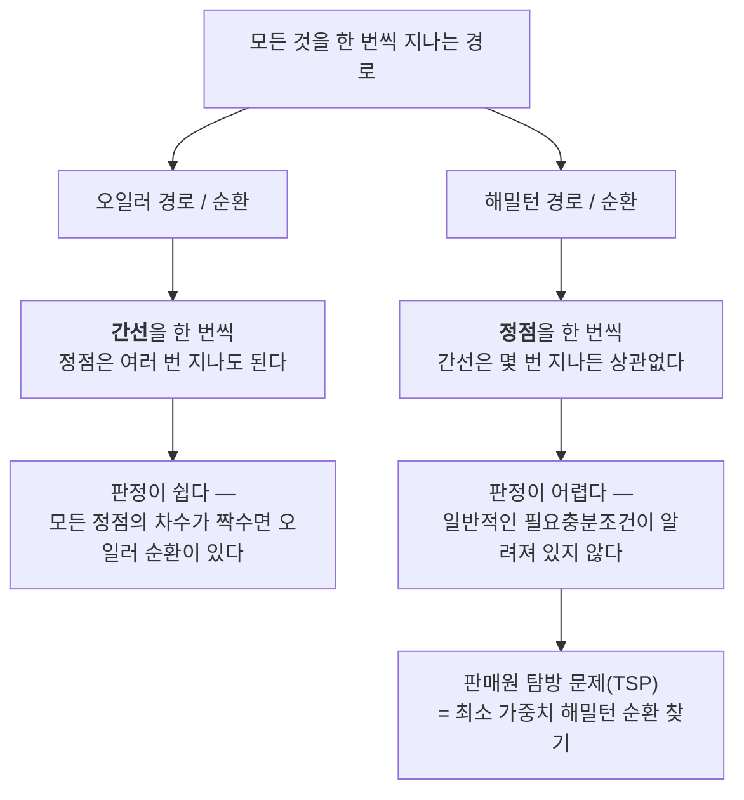
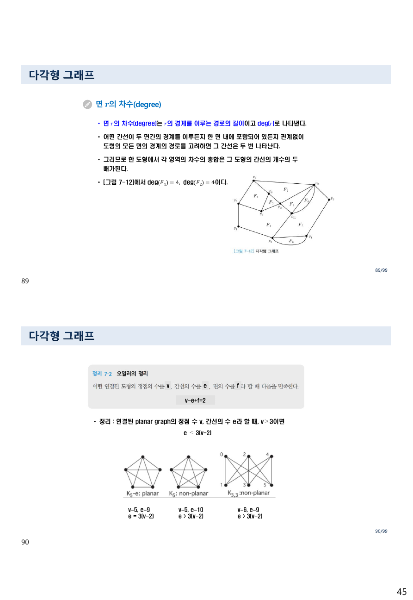
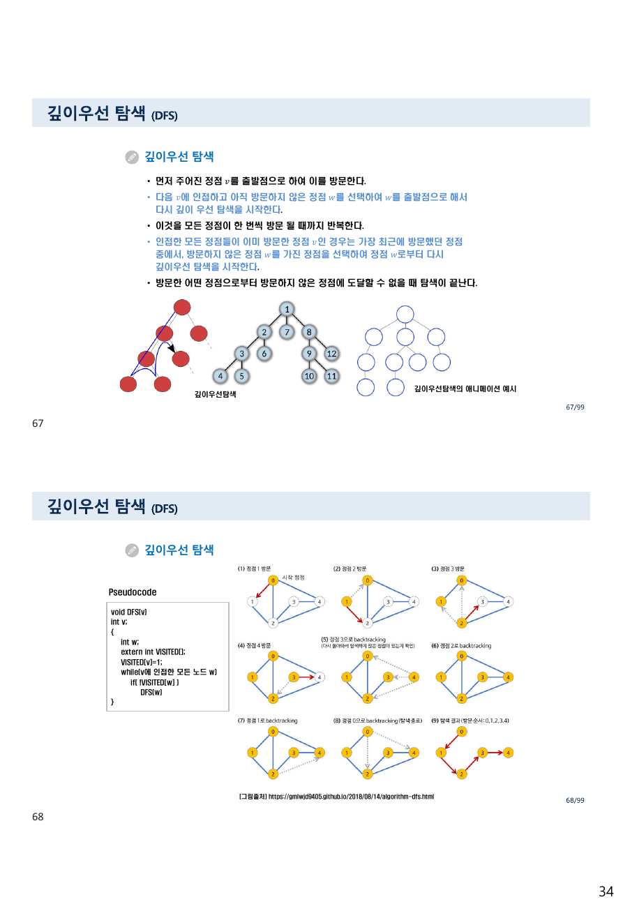
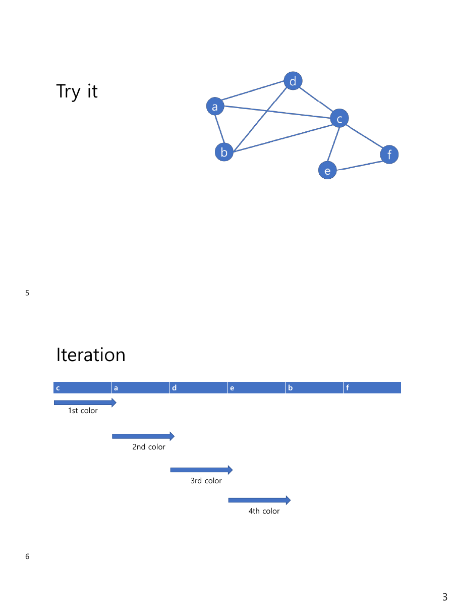

> [!abstract] 한 칸의 부등호가 이 자료의 가장 중요한 구분을 뒤집는다
> `5 그래프.pdf`는 슬라이드 두 장이 한 쪽에 들어간 배포용 인쇄본이라 PDF는 65쪽이고 슬라이드 번호는 `99`까지 간다. 그 90번 슬라이드가 평면 그래프의 판정 기준을 세운다.
>
> > 정리 : 연결된 planar graph의 정점 수 v, 간선의 수 e라 할 때, v ≥ 3이면 **e ≤ 3(v−2)**
>
> 그리고 아래에 세 그래프를 나란히 놓고 각각에 이 식을 적용한다. 앞의 둘은 맞고 **세 번째가 틀린다.** K₃,₃은 v=6, e=9이므로 `3(v−2) = 12`, 즉 `e ≤ 3(v−2)`를 **만족**하는데 슬라이드는 `e > 3(v−2)`라고 적었다.
>
> 이 한 칸이 우연한 오타로만 볼 수 없는 이유는, 그것이 이 부등식의 성격 자체를 가리기 때문이다. `e ≤ 3(v−2)`는 **필요조건**이다. 어기면 비평면이 확정되지만, 지켜도 평면이라는 보장은 없다. K₃,₃이 정확히 그 반례이고, 그래서 91쪽이 다른 논증(면의 차수)으로 K₃,₃의 비평면성을 따로 증명하며, 92쪽이 쿠라토프스키 정리를 꺼낸다.
>
> 이 정리는 그 구조 — **무엇이 확정하고 무엇이 확정하지 않는가** — 를 척추로 삼아 자료를 읽는다.

---

## 1. 정의부터 흔들린다

이 자료는 제목·목차·내용이 서로 다른 장 번호를 쓴다.

| 자리 | 적힌 것 |
| --- | --- |
| 표지 | **5 트리와 그래프** (2024-2) |
| 목차 | **7.1** Basic concept of graphs · **7.2** 여러 가지 그래프 · **7.3** 평면 그래프 · **7.4** 정점의 착색 |
| 본문 참조 | [정의 7-1], [그림 7-3], [정리 7-2] … |
| 트리 슬라이드(56번) | "**8장 트리 학습**" |

파일명은 "5", 표지는 "5 트리와 그래프", 목차와 본문은 "7장", 그리고 트리는 8장으로 미룬다. 교재의 장 번호(7·8)와 강의 순서 번호(5·6)가 섞인 결과로 보인다. 실제로 트리는 별도 자료 `6 트리.pdf`에서 다루므로, 이 자료는 **그래프만** 다룬다.

정의 자체도 한 번 무너졌다가 복구된다. 6쪽(슬라이드 6) **다중 그래프**가 그렇다.

> • 간선 e₅, e₆, e₇ 은 같은 정점 A와 D에 있는 간선들이다.
> • 이는 **[정의 7-1]의 그래프 정의에 어긋난다.**

간선을 정점의 **집합** `{u,v}`로 정의하면 같은 쌍을 여러 번 담을 수 없다. 그래서 다중 그래프(multigraph)와 유사 그래프(pseudograph, 루프까지 허용)를 별도로 정의해야 한다. 7쪽의 영어 슬라이드가 그 상황을 요약한다.

> Remark: **There is no standard terminology for graph theory.** So, it is crucial that you understand the terminology being used whenever you read material about graphs.

---

## 2. 두 가지 표현과 그 대가

24~31쪽이 그래프를 저장하는 방법을 둘 준다.

| | 인접 리스트 | 인접 행렬 |
| --- | --- | --- |
| 공간 | 정점 수와 간선 수의 합에 비례 | 언제나 정점 수의 제곱에 비례 |
| 장점 | 간선이 적을 때 유리 | 정점 번호만 알면 배열 접근 한 번 |
| 단점 | 어떤 정점을 찾으려면 처음부터 검색 | 간선이 적으면 낭비 |
| 무향 그래프에서 | — | **대칭 행렬**이 된다 |

29쪽이 대칭성의 이유를 적는다 — "노드 i에서 노드 j로 가는 간선이 있다는 말은 노드 j에서 노드 i로 가는 간선도 존재한다는 의미가 된다." 30쪽의 영어 슬라이드가 하나를 더 붙인다 — 단순 그래프에는 루프가 없으므로 **주대각 원소가 전부 0**이다.

31쪽은 세 번째 표현인 **결합 행렬(incidence matrix)** 을 소개한다. 인접 행렬이 정점 × 정점이라면 결합 행렬은 **정점 × 간선**이고, `mᵢⱼ = 1`은 "간선 eⱼ가 정점 vᵢ에 붙어 있다"는 뜻이다. 다중 간선을 표현할 수 있다는 것이 이 표현의 존재 이유다 — 같은 두 정점을 잇는 간선이 셋이면 열이 세 개 생긴다.

32~36쪽은 차수를 정리한다.

- **무향 그래프** — 정점이 가진 간선의 개수. 자기 자신으로 가는 순환이 있으면 그 정점의 차수는 **2**다(양쪽 끝이 같은 정점에 붙으므로).
- **유향 그래프** — 외차수(out-degree, 시점인 간선 수)와 내차수(in-degree, 종점인 간선 수)로 나뉜다.
- **악수 정리(Handshaking Theorem)** — 무향 그래프에서 **모든 정점의 차수의 합은 간선 개수의 두 배**다. 차수 0인 정점은 고립(isolated) 정점이다.

36쪽이 유향 그래프의 차수를 값으로 적어 둔다.

$$\deg^-(a)=2,\ \deg^-(b)=2,\ \deg^-(c)=3,\ \deg^-(d)=2,\ \deg^-(e)=3,\ \deg^-(f)=0$$
$$\deg^+(a)=4,\ \deg^+(b)=1,\ \deg^+(c)=2,\ \deg^+(d)=2,\ \deg^+(e)=3,\ \deg^+(f)=0$$

두 줄의 합이 각각 **12**로 같다. 유향 그래프에서는 내차수 합 = 외차수 합 = 간선 수이므로 간선이 12개다. 슬라이드의 값이 그 조건을 만족한다.

---

## 3. 이름이 붙은 그래프들

44~54쪽이 특별한 그래프를 정리한다. 여기서 세는 규칙 몇 개가 뒤의 평면성 판정에 쓰인다.

| 이름 | 표기 | 정점 수 | 간선 수 | 차수 |
| --- | --- | --- | --- | --- |
| 완전 그래프 | $K_n$ | n | $\dfrac{n(n-1)}{2}$ | 모든 정점이 $n-1$ |
| 순환 그래프 | $C_n$ | n | n | 모두 2 |
| 바퀴 그래프 | $W_n$ | n+1 | 2n | 허브는 n, 나머지는 3 |
| 완전 이분 그래프 | $K_{m,n}$ | m+n | **m × n** | W쪽은 n, X쪽은 m |

44쪽이 $K_5$를 예로 든다 — "5개의 정점을 가진 완전 그래프 · 각 정점에서 차수를 구해보면 **4차** · n개의 정점을 갖는 완전 그래프는 모든 정점들이 (n−1) 차수를 가진다." 간선 수는 $5 \times 4 / 2 = 10$이다.

51·53쪽의 이분 그래프가 §5의 핵심 반례가 된다. 정의는 "정점 집합을 두 덩어리 W와 X로 나눌 수 있고, 같은 덩어리 안의 두 정점은 간선을 공유하지 않는다"이고, 완전 이분 그래프 $K_{m,n}$은 W의 모든 정점이 X의 모든 정점과 이어진다. 52쪽이 쓰임새를 든다 — 직무 배정(일과 사람), 결혼 문제(남과 여). 한쪽 안에서는 간선이 없다는 성질이 매칭 문제의 형태를 정한다.

56쪽은 트리를 한 줄로 정의하고 다음 자료로 넘긴다 — "In graph theory, a tree is an undirected graph in which **any two vertices are connected by exactly one path**", 그리고 `Vertices : V, Edges : V−1`.

---

## 4. 오일러와 해밀턴 — 무엇을 한 번씩 지나는가

57~63쪽이 두 개념을 나란히 놓는다. 차이는 **무엇을 한 번씩 지나느냐** 하나다.



57쪽이 오일러 그래프를 한붓그리기로 설명하고, 59쪽이 판정 기준을 준다 — **"[예제 7-15]의 그래프는 오일러 그래프이다. 왜냐하면 모든 정점들의 차수가 짝수이기 때문이다."** 이 기준이 성립하는 이유는 §2의 악수 정리와 같은 자리에서 나온다. 한 정점에 들어갔으면 나와야 하므로 그 정점의 간선은 짝을 지어 쓰이고, 시작점과 끝점이 같은 순환이라면 모든 정점에서 그렇게 되어야 한다.

60쪽이 대비를 한 줄로 적는다.

> 오일러 경로, 오일러 순환과는 다르게 해밀턴 경로, 해밀턴 순환은 **같은 모서리를 몇 번을 지나든 상관없이 꼭짓점들만 한 번씩 지나면 됨**

61쪽은 해밀턴의 12면체 수수께끼를 소개하고, 64쪽이 그것을 실무 문제로 잇는다.

> 판매원 탐방 문제(traveling salesperson problem)는 가중치 그래프 G가 주어지면 G 안에서 **최소 길이를 가지는 해밀턴 순환**을 찾는 문제이다. … 완전 그래프에서 전체 가중치가 가장 적은 해밀턴 순환을 찾는 것과 같다.

두 문제의 난이도 차이가 이 대비의 요점이다. 오일러는 차수만 세면 되고, 해밀턴은 그런 지름길이 없다.

---

## 5. 평면성 — 어기면 확정, 지켜도 미정

84~92쪽이 평면 그래프를 다룬다. 순서를 따라가면 판정 도구가 셋 쌓인다.

**① 오일러의 정리 (90쪽)** — 어떤 연결된 도형의 정점 v, 간선 e, 면 f에 대해
$$v - e + f = 2$$

**② 면의 차수 (89쪽)** — 면 r의 차수는 그 경계를 이루는 경로의 길이다. 그리고 원본이 핵심을 적는다 — "어떤 간선이 두 면 간의 경계를 이루든지 한 면 내에 포함되어 있든지 관계없이 도형의 모든 면의 경계의 경로를 고려하면 **그 간선은 두 번 나타난다.** 그러므로 한 도형에서 각 영역의 차수의 총합은 그 도형의 간선의 개수의 **두 배**가 된다."

**③ 부등식 (90쪽)** — v ≥ 3인 연결 평면 그래프는 $e \le 3(v-2)$.

③이 ①과 ②에서 어떻게 나오는지를 따라가면, 이 부등식이 왜 **필요조건일 뿐인지**가 보인다. 단순 그래프에서는 모든 면의 차수가 최소 3이므로 $2e = \sum \deg(면) \ge 3f$, 즉 $f \le 2e/3$. 이것을 ①에 넣으면 $2 = v - e + f \le v - e + 2e/3$, 정리하면 $e \le 3v - 6 = 3(v-2)$다.

핵심은 **"모든 면의 차수가 최소 3"** 이라는 가정이다. 그런데 이분 그래프에는 삼각형이 없으므로 모든 면의 차수가 최소 **4**다. 같은 계산을 4로 하면 $e \le 2(v-2)$라는 더 빡빡한 부등식이 나온다.



원본이 세 그래프에 적용한 결과를 그대로 옮기면 이렇다.

| 그래프 | 원본이 적은 v, e | 원본이 적은 판정 | 실제 $3(v-2)$ | 맞는가 |
| --- | --- | --- | --- | --- |
| $K_5 - e$ (planar) | v=5, e=9 | `e = 3(v−2)` | 9 | 맞다 |
| $K_5$ (non-planar) | v=5, e=10 | `e > 3(v−2)` | 9 | 맞다 |
| $K_{3,3}$ (non-planar) | v=6, e=9 | **`e > 3(v−2)`** | **12** | **틀리다** |

> [!caution] 원본 오류 — K₃,₃은 e ≤ 3(v−2)를 만족한다
> $K_{3,3}$은 v = 6, e = 9이므로 $3(v-2) = 3 \times 4 = 12$이고 $9 \le 12$다. 원본이 적은 `e > 3(v−2)`는 성립하지 않는다.
>
> 그런데 $K_{3,3}$은 비평면이 맞다. 즉 이 그래프는 **부등식을 통과하고도 비평면인 예**이고, 정확히 그 이유로 이 부등식이 충분조건이 될 수 없음을 보여 주는 표준 반례다. 세 그래프를 나란히 놓은 슬라이드의 의도가 "부등식으로 비평면을 판정한다"였다면, 세 번째 그래프는 그 의도를 **반증하러** 온 것이다.
>
> 이분 그래프에는 홀수 길이 순환이 없어 모든 면의 차수가 4 이상이므로, 맞는 판정식은 $e \le 2(v-2)$ 다. $K_{3,3}$에 넣으면 $2 \times 4 = 8 < 9$ 이므로 **이쪽 부등식은 어긴다** → 비평면이 확정된다.
>
> 바로 다음 91쪽이 실제로 그 계산을 손으로 한다 — "각 면의 차수가 4 이상임을 알 수 있다. 따라서 각 면의 차수의 총합이 20 이상이어야 하므로 10개 이상의 간선을 가져야 하는데 K₃,₃의 간선을 9개라는 사실과 모순된다." 90쪽의 표가 91쪽의 논증과 다른 말을 하고 있는 셈이다.

아래에서 세 부등식을 함께 확인해 보자. 원본의 세 그래프가 버튼으로 들어 있다.

```html preview h=600px
<div id="pl-root">
  <style>
    #pl-root{font-family:system-ui,-apple-system,"Segoe UI",sans-serif;color:var(--foreground);
      background:var(--card);border:1px solid var(--border);border-radius:10px;padding:16px}
    #pl-root h4{margin:0 0 4px;font-size:14px}
    #pl-root .sub{font-size:12px;opacity:.72;margin-bottom:12px;line-height:1.55}
    #pl-root .ctl{display:flex;gap:14px;flex-wrap:wrap;align-items:center;font-size:12.5px;margin-bottom:14px}
    #pl-root button{font:inherit;font-size:12px;padding:4px 9px;border-radius:6px;cursor:pointer;
      border:1px solid var(--border);background:transparent;color:var(--foreground)}
    #pl-root button.on{border-color:var(--chart-1);color:var(--chart-1)}
    #pl-root input[type=range]{width:150px;accent-color:var(--chart-1)}
    #pl-root label{display:inline-flex;gap:6px;align-items:center;border:1px solid var(--border);
      padding:4px 10px;border-radius:6px;cursor:pointer}
    #pl-root .tests{display:grid;grid-template-columns:1fr;gap:8px}
    #pl-root .t{border:1px solid var(--border);border-radius:8px;padding:10px 12px;font-size:12.5px;line-height:1.6}
    #pl-root .t.fail{border-color:var(--chart-1)}
    #pl-root .t .h{font-weight:600;margin-bottom:3px}
    #pl-root .t .f{font-family:ui-monospace,SFMono-Regular,Menlo,monospace;font-size:12px;opacity:.9}
    #pl-root .t .r{margin-top:4px}
    #pl-root .t .r b{color:var(--chart-1)}
    #pl-root .concl{margin-top:12px;font-size:13px;border-top:1px dashed var(--border);
      padding-top:11px;line-height:1.65}
    #pl-root .concl b{color:var(--chart-1)}
  </style>
  <h4>평면성 부등식 — 어기면 확정, 지켜도 미정</h4>
  <div class="sub">v와 e를 움직여 보라. 세 검사는 모두 <b>필요조건</b>이다 — 어기면 비평면이 확정되지만,
  전부 통과해도 평면이라는 보장은 없다.</div>
  <div class="ctl">
    <button data-v="5" data-e="9"  data-b="0">K₅ − e (평면)</button>
    <button data-v="5" data-e="10" data-b="0">K₅ (비평면)</button>
    <button data-v="6" data-e="9"  data-b="1">K₃,₃ (비평면)</button>
    <span>v <b id="pl-vl">5</b></span><input type="range" id="pl-v" min="3" max="14" value="5">
    <span>e <b id="pl-el">9</b></span><input type="range" id="pl-e" min="2" max="60" value="9">
    <label><input type="checkbox" id="pl-b"> 이분 그래프다 (삼각형이 없다)</label>
  </div>
  <div class="tests" id="pl-tests"></div>
  <div class="concl" id="pl-concl"></div>
  <script>
  (function(){
    const V=document.getElementById("pl-v"), E=document.getElementById("pl-e"),
          B=document.getElementById("pl-b");
    function draw(){
      const v=Number(V.value), e=Number(E.value), bip=B.checked;
      document.getElementById("pl-vl").textContent=v;
      document.getElementById("pl-el").textContent=e;
      const maxE = v*(v-1)/2;
      const tests=[
        {h:"① 단순 그래프의 간선 상한", f:"e ≤ v(v−1)/2 = "+maxE,
         ok:e<=maxE, why:"정점이 v개면 서로 다른 쌍이 이만큼뿐이다."},
        {h:"② 평면성 부등식 (원본 90쪽)", f:"e ≤ 3(v−2) = "+(3*(v-2)),
         ok:(v<3)||(e<=3*(v-2)),
         why:"모든 면의 차수가 3 이상이라는 가정 + 오일러 공식 v−e+f=2 에서 나온다."},
        {h:"③ 이분 그래프의 평면성 부등식", f:"e ≤ 2(v−2) = "+(2*(v-2)),
         ok:(!bip)||(v<3)||(e<=2*(v-2)), skip:!bip,
         why:"삼각형이 없으면 면의 차수가 4 이상이므로 상한이 더 빡빡해진다."},
        {h:"④ 오일러 공식이 주는 면의 개수", f:"f = 2 − v + e = "+(2-v+e),
         ok:(2-v+e)>=1, why:"평면에 그렸다면 바깥 영역을 포함해 면이 최소 1개는 있어야 한다."}
      ];
      document.getElementById("pl-tests").innerHTML = tests.map(t=>
        '<div class="t'+((!t.skip && !t.ok)?" fail":"")+'">'+
        '<div class="h">'+(t.skip?"— ":(t.ok?"✓ ":"✗ "))+t.h+"</div>"+
        '<div class="f">'+t.f+"  (지금 e = "+e+")</div>"+
        '<div class="r">'+(t.skip? "<span style='opacity:.7'>이분 그래프일 때만 적용된다.</span>"
          : (t.ok? "통과" : "<b>위반 → 비평면이 확정된다</b>"))+
        " <span style='opacity:.7'>· "+t.why+"</span></div></div>").join("");
      const violated=tests.filter(t=>!t.skip && !t.ok).length;
      document.getElementById("pl-concl").innerHTML = violated
        ? "위반한 검사가 <b>"+violated+"개</b> 있다 → 이 그래프는 <b>평면일 수 없다</b>."
        : "모든 검사를 통과했다. 그렇다고 평면인 것은 <b>아니다</b> — "+
          "K₃,₃(v=6, e=9)는 ②를 통과하지만 비평면이다. "+
          "확정하려면 92쪽의 쿠라토프스키 정리가 필요하다.";
    }
    [V,E].forEach(x=>x.addEventListener("input",draw));
    B.addEventListener("change",draw);
    document.querySelectorAll("#pl-root button").forEach(b=>{
      b.onclick=()=>{ V.value=b.dataset.v; E.value=b.dataset.e; B.checked=b.dataset.b==="1";
        document.querySelectorAll("#pl-root button").forEach(x=>x.classList.toggle("on",x===b));
        draw(); };
    });
    draw();
  })();
  </script>
</div>
```

"K₃,₃" 버튼을 누르면 검사 ②는 통과하고 검사 ③만 걸린다. 이분 그래프 체크를 끄면 아무 검사도 걸리지 않는다 — 그때가 바로 원본 90쪽의 상황이고, "부등식만으로는 판정할 수 없다"는 사실이 그대로 드러난다.

92쪽이 그래서 마지막 도구를 꺼낸다.

> **Kuratowski's theorem:** A finite graph is planar **if and only if** it does not contain a subgraph that is a subdivision of the complete graph $K_5$ or the complete bipartite graph $K_{3,3}$.

`if and only if`가 붙은 유일한 판정이다. 앞의 부등식들이 필요조건이었던 자리에서, 이 정리만이 필요충분조건을 준다.

---

## 6. 탐색 — 의사코드 두 개

66~70쪽이 DFS와 BFS를 다룬다. 설명은 정확하다.

- **DFS** — "v에 인접하고 아직 방문하지 않은 정점 w를 선택하여 w를 출발점으로 해서 다시 깊이 우선 탐색을 시작한다." 막히면 "가장 최근에 방문했던 정점 중에서, 방문하지 않은 정점 w를 가진 정점을 선택"해 되돌아간다.
- **BFS** — "v에 인접한 정점 w들을 먼저 모두 방문하고 그 다음으로 w에 인접하고 아직 방문하지 않은 정점들을 모두 방문한다."

두 절차의 차이는 **되돌아갈 자리를 어디에 담느냐** 하나다. DFS는 재귀(=스택), BFS는 큐를 쓴다. 원본 BFS 의사코드가 `InitializeQueue(q)`, `EnQueue`, `DeQueue`를 명시한다.



> [!caution] 원본 오류 — BFS 의사코드가 C도 파이썬도 아니다
> 원본이 68·70쪽에 실은 의사코드는 C 문법(`void BFS(v)`, `int v;`, `extern struct queue *q;`, 중괄호)으로 쓰였는데 그 안에 파이썬 문법이 섞여 있다.
>
> ```c
> while(v에 인접한 모든 노드 w){
>     if( !VISITED[w] ):          // ← 콜론은 파이썬 문법이다
>          EnQueue(q,w);
>          VISITED[w]=1;          // ← 중괄호가 없어 if 에 묶이지 않는다
>     }
> }
> ```
>
> 문제가 둘이다. 첫째, `if(...)` 뒤의 **콜론**은 C에서 문법 오류다. 둘째, 콜론을 지우고 C로 읽으면 `if`에 묶이는 것은 `EnQueue(q,w);` 한 줄뿐이므로 **`VISITED[w]=1;`이 조건과 무관하게 실행된다** — 이미 방문한 노드도 다시 표시되며, 더 중요하게는 코드의 의도가 드러나지 않는다. 중괄호 개수도 맞지 않아 함수 끝에 `}`가 하나 남는다.
>
> DFS 쪽도 `if( !VISITED[w] ) DFS(w)` 에서 세미콜론이 빠져 있고, 두 코드 모두 `while(v에 인접한 모든 노드 w)`처럼 **조건식 자리에 한국어 문장**이 들어가 있다. 의사코드로 읽으면 뜻은 통하지만, C 문법을 그대로 쓴 자리에 파이썬 문법이 섞인 것은 옮겨 적기 실수로 보인다.

71~82쪽은 최단 경로(Dijkstra)로 넘어가 그래프 G11에 대해 초기 상태부터 네 단계를 그림으로 따라간다. 출처는 `IT CookBook, C로 배우는 쉬운 자료구조(개정3판), 2016`이다. 집합 S에 정점을 하나씩 넣으며 `distance` 배열을 갱신하는 표준 절차이고, 정점이 추가되는 순서는 **A → C → E → B → D**다.

---

## 7. 착색 — 그리디가 최소를 준다는 보장은 없다

94~99쪽과 부록 `Appendix 2 Welch-Powell Algorithms.pdf`(7쪽)가 정점 착색을 다룬다.

94쪽이 정의를 준다 — "인접된 정점이 서로 다른 색을 가지도록 G의 정점들에 색을 할당하는 것"이고, 필요한 최소 색 수가 **착색수** $\chi(G)$다. 95쪽이 값 몇 개를 준다.

| 그래프 | 착색수 |
| --- | --- |
| $K_3$을 포함하는 그래프 | 최소 3 |
| 짝수 길이 순환 $C_n$ | 2 |
| 홀수 길이 순환 $C_n$ | 3 |
| 페테르센 그래프 | 3 |

96쪽이 **Welch-Powell 알고리즘**을 다섯 단계로 적는다.

> 1) Find the degree of each vertex
> 2) **List the vertices in order of descending degrees.**
> 3) Color the first vertex with color 1.
> 4) Move down the list and color all the vertices **not connected to the colored vertex**, with the same color.
> 5) Repeat step 4 on all uncolored vertices with a new color, in descending order of degrees until all the vertices are colored

부록이 이것을 파이썬으로 구현하고 예제 그래프에 적용한다.



그래프의 간선을 읽으면 이렇다.

| 정점 | 이웃 | 차수 |
| --- | --- | --- |
| a | b, c, d | 3 |
| b | a, c, d | 3 |
| c | a, b, d, e, f | **5** |
| d | a, b, c | 3 |
| e | c, f | 2 |
| f | c, e | 2 |

`a, b, c, d` 넷이 서로 모두 이어져 있다 — $K_4$가 통째로 들어 있다. 그래서 이 그래프의 착색수는 **최소 4**이고, 실제로 4로 충분하다.

아래에서 두 순서를 비교해 보라. 원본 슬라이드가 적은 순서와 알고리즘 2)단계가 요구하는 순서다.

```html preview h=620px
<div id="wp-root">
  <style>
    #wp-root{font-family:system-ui,-apple-system,"Segoe UI",sans-serif;color:var(--foreground);
      background:var(--card);border:1px solid var(--border);border-radius:10px;padding:16px}
    #wp-root h4{margin:0 0 4px;font-size:14px}
    #wp-root .sub{font-size:12px;opacity:.72;margin-bottom:12px;line-height:1.55}
    #wp-root .ctl{display:flex;gap:6px;flex-wrap:wrap;margin-bottom:12px}
    #wp-root button{font:inherit;font-size:12px;padding:4px 9px;border-radius:6px;cursor:pointer;
      border:1px solid var(--border);background:transparent;color:var(--foreground)}
    #wp-root button.on{border-color:var(--chart-1);color:var(--chart-1)}
    #wp-root .row{display:flex;gap:20px;flex-wrap:wrap;align-items:flex-start}
    #wp-root svg{width:320px;height:230px;border:1px solid var(--border);border-radius:8px}
    #wp-root .side{flex:1;min-width:270px;font-size:12.5px;line-height:1.7}
    #wp-root .seq{display:flex;gap:4px;flex-wrap:wrap;margin:6px 0 10px}
    #wp-root .seq .v{padding:5px 9px;border:1px solid var(--border);border-radius:6px;
      font-family:ui-monospace,SFMono-Regular,Menlo,monospace;font-size:12.5px}
    #wp-root .cls{margin-top:8px;font-family:ui-monospace,SFMono-Regular,Menlo,monospace;font-size:12px;line-height:1.9}
    #wp-root .warn{margin-top:12px;font-size:12.5px;line-height:1.6;
      border-top:1px dashed var(--border);padding-top:10px}
    #wp-root .warn b{color:var(--chart-1)}
  </style>
  <h4>Welch-Powell 착색 — 순서가 규칙을 지키는가</h4>
  <div class="sub">차수 내림차순으로 나열하고, 한 색으로 칠할 수 있는 정점을 목록 순서대로 몰아 칠한다.
  아래 두 순서를 번갈아 보라.</div>
  <div class="ctl">
    <button data-o="cadebf">원본 슬라이드의 순서 (c, a, d, e, b, f)</button>
    <button data-o="cabdef">차수 내림차순 (c, a, b, d, e, f)</button>
  </div>
  <div class="row">
    <svg id="wp-svg" viewBox="0 0 320 230"></svg>
    <div class="side">
      <div>나열 순서</div>
      <div class="seq" id="wp-seq"></div>
      <div id="wp-check"></div>
      <div class="cls" id="wp-cls"></div>
    </div>
  </div>
  <div class="warn" id="wp-warn"></div>
  <script>
  (function(){
    const ADJ={a:["b","c","d"], b:["a","c","d"], c:["a","b","d","e","f"],
               d:["a","b","c"], e:["c","f"], f:["c","e"]};
    const POS={a:[68,86], d:[196,48], c:[248,110], b:[92,158], e:[196,192], f:[286,166]};
    const PAL=["var(--chart-1)","var(--chart-2, #7aa2c8)","var(--chart-3, #9c8fbe)","var(--chart-4, #77b39a)","var(--chart-5, #c9a86a)"];
    let order="cadebf";
    function welch(list){
      const color={}; let c=0;
      while(Object.keys(color).length<list.length){
        let painted=false;
        list.forEach(v=>{
          if(color[v]!==undefined) return;
          const clash = ADJ[v].some(u=>color[u]===c);
          if(!clash){ color[v]=c; painted=true; }
        });
        if(!painted) break;
        c++;
      }
      return {color:color, n:c};
    }
    function draw(){
      document.querySelectorAll("#wp-root button").forEach(b=>
        b.classList.toggle("on", b.dataset.o===order));
      const list=order.split("");
      const {color,n}=welch(list);
      // 그래프
      let g="";
      const seen=new Set();
      Object.keys(ADJ).forEach(u=>ADJ[u].forEach(v=>{
        const k=[u,v].sort().join(""); if(seen.has(k)) return; seen.add(k);
        g+='<line x1="'+POS[u][0]+'" y1="'+POS[u][1]+'" x2="'+POS[v][0]+'" y2="'+POS[v][1]+
           '" stroke="var(--border)" stroke-width="1.6"/>';
      }));
      Object.keys(ADJ).forEach(v=>{
        const [x,y]=POS[v], ci=color[v];
        g+='<circle cx="'+x+'" cy="'+y+'" r="17" fill="'+(ci===undefined?"var(--card)":PAL[ci%PAL.length])+
           '" stroke="var(--foreground)" stroke-width="1.2" opacity="'+(ci===undefined?1:0.9)+'"/>'+
           '<text x="'+x+'" y="'+(y+5)+'" text-anchor="middle" font-size="13" '+
           'fill="var(--foreground)" font-weight="600">'+v+'</text>'+
           '<text x="'+x+'" y="'+(y+30)+'" text-anchor="middle" font-size="10" '+
           'fill="var(--foreground)" opacity="0.75">차수 '+ADJ[v].length+'</text>';
      });
      document.getElementById("wp-svg").innerHTML=g;
      document.getElementById("wp-seq").innerHTML =
        list.map(v=>'<div class="v">'+v+" ("+ADJ[v].length+")</div>").join("");
      // 내림차순 검사
      const degs=list.map(v=>ADJ[v].length);
      let desc=true, badAt=-1;
      for(let i=1;i<degs.length;i++) if(degs[i]>degs[i-1]){ desc=false; badAt=i; break; }
      document.getElementById("wp-check").innerHTML = desc
        ? "차수가 내림차순이다 — 알고리즘 2)단계를 지킨다."
        : "<b style='color:var(--chart-1)'>차수가 내림차순이 아니다</b> — "+
          list[badAt-1]+"("+degs[badAt-1]+"차) 다음에 "+list[badAt]+"("+degs[badAt]+"차)가 온다.";
      // 색 묶음
      const groups={};
      Object.keys(color).forEach(v=>{ (groups[color[v]]=groups[color[v]]||[]).push(v); });
      document.getElementById("wp-cls").innerHTML =
        Object.keys(groups).sort().map(k=>"색 "+(Number(k)+1)+" = {"+groups[k].sort().join(", ")+"}").join("<br>")+
        "<br>사용한 색 : <b>"+n+"개</b>";
      document.getElementById("wp-warn").innerHTML =
        "이 그래프는 a·b·c·d 넷이 서로 모두 이어져 있어 <b>K₄</b> 를 포함한다. "+
        "그러므로 착색수는 최소 4이고, 두 순서 모두 4색으로 끝난다 — "+
        "이 예제에서는 순서가 결과를 바꾸지 않는다. "+
        "다만 원본 슬라이드가 적은 순서 <b>c, a, d, e, b, f</b> 는 알고리즘 2)단계의 "+
        "\"차수 내림차순\"을 지키지 않는다(e는 2차, b는 3차).";
    }
    document.querySelectorAll("#wp-root button").forEach(b=>{
      b.onclick=()=>{ order=b.dataset.o; draw(); };
    });
    draw();
  })();
  </script>
</div>
```

> [!caution] 부록 Welch-Powell 자료에서 확인한 것들
> **① 나열 순서가 차수 내림차순이 아니다.** 3쪽 "Iteration" 슬라이드는 정점을 `c, a, d, e, b, f` 순으로 늘어놓는다. 차수는 각각 5, 3, 3, **2**, **3**, 2다. `e`(2차)가 `b`(3차)보다 앞에 왔으므로 알고리즘 2)단계를 어긴다. 같은 슬라이드의 파이썬 코드는 `sorted(..., key=lambda x: len(graph[x]), reverse=True)`로 정렬하므로 코드와 그림이 어긋난다.
>
> **② 그림이 알고리즘 4)단계를 반영하지 않는다.** 같은 슬라이드는 `c`·`a`·`d`·`e`에 1st~4th color를 하나씩 배정하는 것처럼 그려 놓았다. 그런데 4)단계는 "이미 칠한 정점과 인접하지 않은 정점을 **모두 같은 색으로**"이므로, `e`는 `a`(2번 색)와 인접하지 않아 2번 색을 받아야 한다. 규칙대로 하면 색 묶음은 `{c} / {a, e} / {d, f} / {b}` 네 덩어리이고, `b`와 `f`도 색을 받는다.
>
> **③ 그래프 딕셔너리 코드에 괄호가 빠졌다.** 2쪽(슬라이드 4)의 예시가 `'b' : [ 'c', 'f'` 로 끝난다. 닫는 대괄호가 없다.
>
> **④ "Optimize some codes" 슬라이드 두 장이 코드를 바꾸지 않는다.** 6·7쪽(슬라이드 13·14)은 제목이 최적화인데 본문 코드가 12쪽(슬라이드 12)의 전체 코드와 **한 글자도 다르지 않다.** 오른쪽에 `Generator expression using set`, `next(generator expression with a condition)`라는 주석만 붙어 있다. 강의 중에 구두로 고칠 자리를 표시해 둔 것으로 보인다.

원본 코드의 그리디 방식은 **최소 색 수를 보장하지 않는다.** 이 예제에서는 $K_4$가 하한을 4로 못 박고 그리디도 4를 쓰므로 우연히 최적이지만, 일반적으로는 순서에 따라 더 많은 색을 쓸 수 있다. 96쪽이 "This algorithm is also used to find the chromatic number of a graph"라고 적은 것은 그런 뜻에서 조심해서 읽어야 한다 — 이 절차가 주는 것은 착색수의 **상한**이다.

---

## 8. 지식그래프로 새는 절

12~23쪽(슬라이드 13~23)은 그래프 이론 한가운데에 지식그래프가 여덟 장 끼어 있다. 목차의 네 절 어디에도 없는 내용이다.

| 슬라이드 | 내용 |
| --- | --- |
| 16 | 카카오엔터프라이즈의 지식그래프 플랫폼 |
| 17·18 | Data Graphs — "지식그래프의 기초 · 개체와 관계를 표현하는 직관적인 추상화 · **데이터 추가를 위한 스키마가 필요없음**" |
| 19 | 그래프 구조 기반 데이터 모델 다섯 가지 |
| 20~23 | 각 모델의 예 — 천세진 / 이산수학을 노드로 |

19쪽이 다섯 모델을 나열한다.

- Directed edge-labelled (multi)graphs (multi-relational graphs)
- Heterogeneous graphs (heterogeneous information network)
- Property graphs
- Hypergraphs (edges connecting set of nodes)
- Hypernodes (nested graphs in a node)

20~22쪽이 같은 사실 하나(`천세진 —teaches→ 이산수학`)를 세 모델로 그려 차이를 보인다. 첫째는 `type` 간선으로 종류를 붙이고, 둘째는 노드 이름에 `천세진 : 사람`처럼 타입을 박아 넣으며, 셋째는 노드와 간선에 속성을 단다(`type = 사람`, `year = 2021`, `term = 가을학기`). 같은 정보를 어디에 둘 것인가의 차이다. 이 내용은 별도 자료 `7 지식그래프 소개.pdf`에서 다시 다뤄지며, 그쪽 정리는 [06. 같은 트리를 세 번 읽으면](<./06. 같은 트리를 세 번 읽으면.md>)에 있다.

---

## 9. 확인 문제

1. $K_{3,3}$에 대해 $3(v-2)$와 $2(v-2)$를 각각 계산하고, 어느 부등식이 이 그래프를 걸러 내는지 말하라
2. 90쪽의 부등식 $e \le 3(v-2)$가 필요조건일 뿐인 이유를 "모든 면의 차수가 3 이상"이라는 가정으로 설명하라
3. 오일러 순환이 존재하는지 판정하는 기준은? 해밀턴 순환에는 왜 그런 간단한 기준이 없는가
4. 무향 그래프에서 자기 자신으로 가는 순환이 있으면 그 정점의 차수를 왜 2로 세는가
5. 36쪽의 내차수 합과 외차수 합이 둘 다 12다. 그래프의 간선은 몇 개인가
6. $K_{m,n}$의 간선 수는? $K_{3,3}$과 $K_{5,3}$에 각각 넣어 보라
7. Welch-Powell 알고리즘이 착색수를 항상 찾아 주지 못하는 이유는? 부록 예제에서 그래도 최적이 나온 이유는
8. BFS 의사코드에서 `VISITED[w]=1;`이 `if` 블록 안에 들어가지 않으면 무엇이 잘못되는가

---

## 10. 이어지는 자료

- [04. 목차에 없는 함수](<./04. 목차에 없는 함수.md>) — 유향 그래프와 인접 행렬이 관계 행렬과 같은 것이라는 점
- [06. 같은 트리를 세 번 읽으면](<./06. 같은 트리를 세 번 읽으면.md>) — 56쪽이 예고한 트리, 그리고 §8의 지식그래프
- [01. 같은 물인데 하나는 흐르고 하나는 떨어진다](<./01. 같은 물인데 하나는 흐르고 하나는 떨어진다.md>) — 이 과목이 그래프에 도착하는 이유

같은 도메인 밖에서는 [06/algorithm-design-analysis](../../../06_algorithms-graphics/algorithm-design-analysis/README.md)가 DFS·BFS·최단 경로를 알고리즘 설계 관점에서 다시 다룬다.

---

## 근거 자료

`ComputerScience/02_math-theory/discrete-mathematics/sources/5 그래프.pdf` (65쪽, 슬라이드 99장), `Appendix 1 Floyd Warshall Algorithm.pdf` (10쪽) 중 Floyd-Warshall 부분, `Appendix 2 Welch-Powell Algorithms.pdf` (7쪽).

| 슬라이드 | 내용 | 이 문서에서 쓴 곳 |
| --- | --- | --- |
| 2·3 | 목차 · Preview(쾨니히스베르크, 응용 분야) | §1 |
| 5~11 | 그래프의 정의, 다중 그래프, 유사 그래프, 무향/유향 | §1 |
| 13~23 | 지식그래프와 그래프 데이터 모델 다섯 가지 | §8 |
| 24~31 | 인접 리스트 · 인접 행렬 · 결합 행렬 | §2 |
| 32~36 | 차수, 악수 정리, 유향 그래프의 내차수·외차수 | §2 |
| 37~43 | 경로, 단순 경로, 순환, 연결, 강연결 요소 | §2 |
| 44~56 | 완전·순환·바퀴·정규·동형·부분·이분·희소/밀집·가중치 그래프, 트리 | §3 |
| 57~65 | 오일러 그래프, 해밀턴 그래프, 판매원 탐방 문제 | §4 |
| 66~70 | DFS · BFS와 의사코드 | §6 원본 오류 |
| 75~82 | Dijkstra 최단 경로 (그래프 G11) | §6 |
| 84~92 | 교점·교선, 평면 그래프, 다각형 그래프, 면의 차수, 오일러 정리, 비평면 그래프, 쿠라토프스키 | §5 원본 오류 |
| 94~99 | n-색 가능, 착색수, Welch-Powell | §7 |

> [!note] 같은 파일이 두 번 들어 있다
> `sources/` 에는 `5 그래프.pdf`와 `5 그래프 2.pdf`가 따로 있다. 두 파일은 크기가 5,591,661바이트로 같고, 65쪽의 추출 텍스트가 한 글자도 다르지 않으며, 렌더링한 페이지 이미지의 해시도 전부 일치한다. PDF 메타데이터의 생성 시각만 1초 차이(`23:51:24` vs `23:51:25`)다. **같은 자료를 두 번 내려받은 것**으로, 내용상 새로운 것은 없다.

인용한 슬라이드 3장은 `5 그래프.pdf` 45·34쪽과 `Appendix 2` 3쪽을 120dpi로 렌더링한 것이다.

본문의 계산은 파이썬으로 확인했다 — $K_5$·$K_{3,3}$·$K_5-e$ 의 $3(v-2)$와 $2(v-2)$ 값, 36쪽 내차수·외차수 합이 각각 12로 일치한다는 것, 부록 예제 그래프의 여섯 정점 차수(a·b·d 각 3, c 5, e·f 각 2)와 Welch-Powell 두 순서의 착색 결과가 모두 4색이라는 것, 그리고 그 그래프가 $K_4$를 포함한다는 것.
