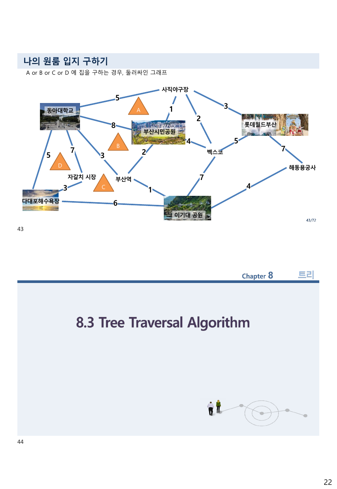
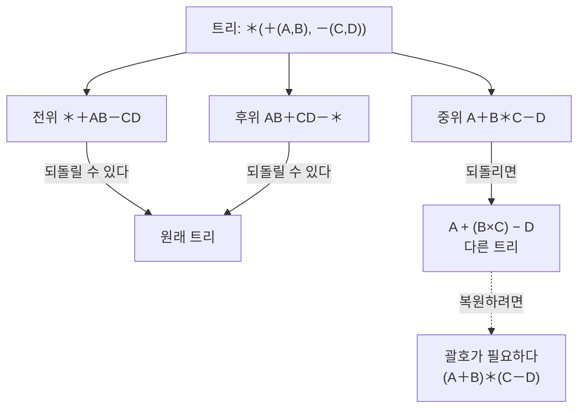
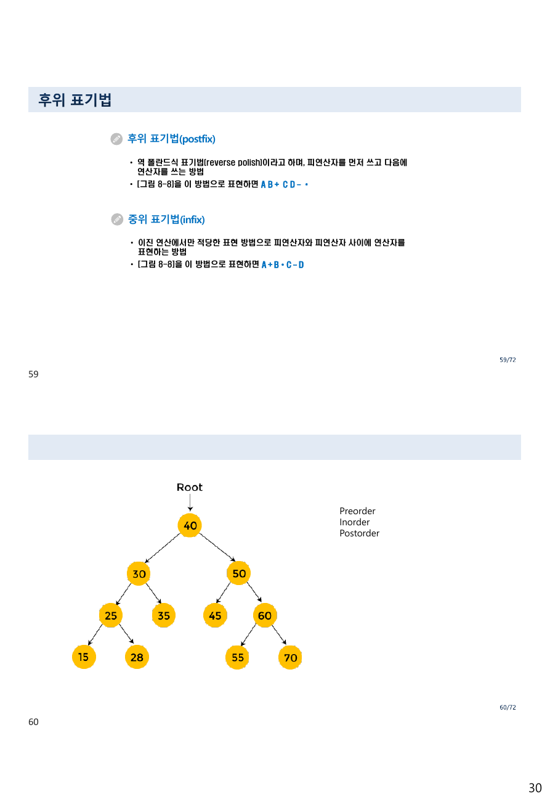
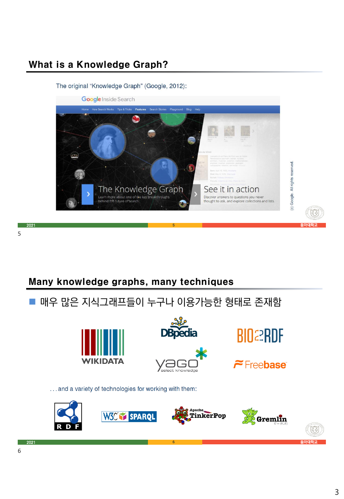
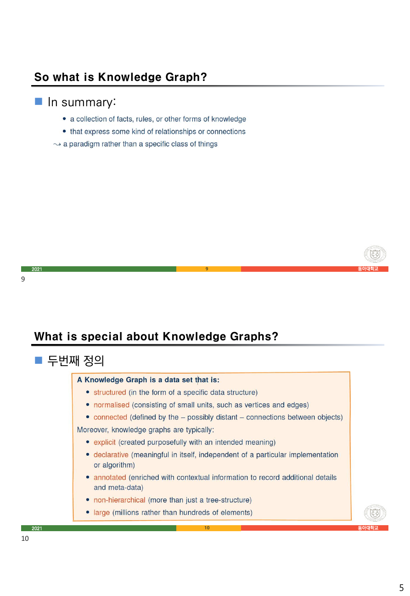
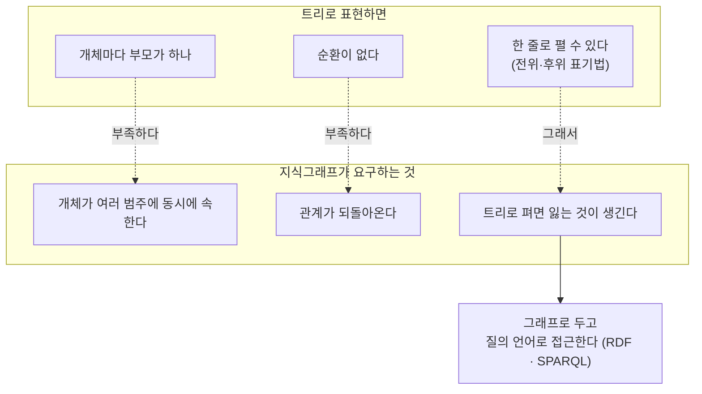

> [!abstract] 세 답 중 하나만 되돌아오지 못한다
> `6 트리.pdf` 58·59번 슬라이드는 하나의 이진 트리(그림 8-8)를 세 가지 표기법으로 적는다.
>
> | 표기법 | 원본이 적은 답 |
> | --- | --- |
> | 폴란드식(전위) | `＊＋AB－CD` |
> | 역폴란드식(후위) | `A B＋ C D－＊` |
> | 중위 | `A＋B＊C－D` |
>
> 앞의 둘은 이 한 줄만 보고 원래 트리를 정확히 복원할 수 있다. 세 번째는 그러지 못한다. `A＋B＊C－D`를 보통의 우선순위로 읽으면 `A + (B×C) − D`가 되어, 원래 트리가 뜻하던 `(A+B) × (C−D)`와 **다른 값을 낸다.**
>
> 이것은 오타가 아니라 중위 표기법의 성질이다. 트리를 왼쪽-루트-오른쪽 순으로 읽어 내려가면 괄호가 함께 나오지 않으므로, 트리의 모양이 문자열에 남지 않는다. 그래서 괄호가 필요한 것이고, 앞선 자료([02. 기호가 말과 어긋나는 자리](<./02. 기호가 말과 어긋나는 자리.md>) §3)가 연산자 우선순위표를 여덟 쪽에 걸쳐 만든 이유도 여기에 있다.
>
> 이 정리는 **"한 줄로 펴면 무엇이 남고 무엇이 사라지는가"** 를 척추로 삼는다. 트리 자료의 마지막 절(탐방과 표기법)이 그 물음이고, 뒤에 붙는 `7 지식그래프 소개.pdf`가 같은 물음을 반대편에서 던진다 — 지식그래프는 스스로를 **"more than just a tree-structure"** 라고 정의한다.

---

## 1. 트리는 무엇을 금지하는가

9번 슬라이드가 정의를 세 가지로 준다. 셋은 서로 동치다.

> • A tree is a **connected** graph **without cycles**
> • A tree is a connected graph on n vertices with **n−1 edges**
> • A graph is a tree if and only if there is a **unique simple path** ~~but~~ between any pair of its vertices

(세 번째 줄에는 `path` 뒤에 `but`이 잘못 끼어 있다 — 원본의 오타다.)

셋 다 "연결"과 "순환 없음"을 다르게 말한 것이다. 간선이 n−1개보다 적으면 끊기고, 많으면 순환이 생긴다. 10번 슬라이드가 트리가 **아닌** 세 경우를 그림으로 든다.

| 원본이 든 반례 | 어긴 것 |
| --- | --- |
| 내차수 0인 정점이 2개 | 루트가 둘이라 연결되지 않는다 |
| 내차수 2인 정점(d)이 있음 | 부모가 둘 — 유일한 경로가 깨진다 |
| 순환을 하나 가짐 | 순환 없음을 어긴다 |

12~16번 슬라이드가 용어를 쌓는다.

| 용어 | 원본 정의 | 그림 8-1의 값 |
| --- | --- | --- |
| 루트 | 시작 노드 | $v_4$ |
| 부모·자식·형제 | $(v_1, v)\in T$ 이면 $v$가 $v_1$의 자식 | $v_2$의 자식은 $v_1, v_3$ |
| 터미널(잎) 노드 | 자식이 없는 정점 | $v_8, v_9, v_{10}, v_1, v_3$ |
| 레벨 | 루트가 0, 자식은 부모+1 | $v_4$는 0, $v_1 \cdot v_3$는 2, $v_9 \cdot v_{10}$은 3 |
| 높이 | 정점들 중 최고 레벨 | 3 |
| 정점의 차수 | 그 노드의 **자식 수** | $v_4$의 차수는 3 |
| 트리의 차수 | 모든 정점 차수의 최댓값 | 3 |

여기서 **정점의 차수 정의가 그래프 자료와 다르다**는 점을 놓치면 안 된다. [05. 필요조건을 충분조건으로 쓴 자리](<./05. 필요조건을 충분조건으로 쓴 자리.md>) §2에서 무향 그래프의 차수는 "붙어 있는 간선의 개수"였는데, 트리에서는 "자식의 개수"다. 부모로 가는 간선은 세지 않는다.

> [!caution] 원본 오류 — n-트리와 완전 n-트리를 같은 것으로 적었다
> 15번 슬라이드가 세 줄을 연달아 적는다.
>
> > • **n-트리** : 모든 정점들이 **기껏해야** n개의 자식들을 가진 트리
> > • 터미널 노드들을 제외한 모든 정점들의 자식들이 **정확히** n개일 때, **완전 n-트리**라고 한다
> > • n = 2일 때 **2진 트리 혹은 완전 2진 트리**라고 한다
>
> 앞의 두 줄은 두 개념을 정확히 구분한다 — "기껏해야"와 "정확히"의 차이다. 그런데 세 번째 줄이 그 구분을 지운다. n = 2일 때 앞의 정의는 **2진 트리**를 주고, 뒤의 정의는 **완전 2진 트리**를 준다. 둘은 같은 것이 아니다.
>
> 자식이 하나뿐인 노드가 있는 트리는 2진 트리이지만 완전 2진 트리가 아니다. 세 번째 줄은 "n = 2일 때 각각 2진 트리, 완전 2진 트리라고 한다"로 적혔어야 한다.

---

## 2. 스패닝 트리 — 그래프에서 순환만 걷어내기

27~42번 슬라이드가 스패닝 트리와 최소 스패닝 트리(MST)를 다룬다. 27번이 정의한다.

> 그래프 G 안에 있는 **모든 정점을 다 포함하면서 트리가 되는 연결 부분 그래프** … 컴퓨터 인터넷 네트워크와 자동차 내비게이션 등에 많이 사용된다.

28번이 만드는 방법 하나를 보인다 — **순환을 이루는 간선을 하나씩 제거**한다. 그래프 G에서 `{a,e}`를 지워 순환 하나를 없애고, `{e,f}`를 지워 두 번째를, `{c,g}`를 지워 세 번째를 없애면 스패닝 트리가 된다. 29번이 덧붙인다 — "It is **not only** spanning tree of graph G", 즉 스패닝 트리는 유일하지 않다.

31·32번은 DFS와 BFS로 스패닝 트리를 만드는 방법을 보인다. DFS는 `f, g, h, k, j`로 길을 뻗다가 되돌아와 `h, i`를 붙이고 다시 `f, d, e, c, a`, 그다음 `c, b`로 간다. BFS는 루트 `e`에서 레벨 1(`b, d, f, i`), 레벨 2(`a, c, h, j, g, k`), 레벨 3(`l, m`) 순으로 붙인다. 같은 그래프에서 서로 다른 트리가 나온다.

43번 슬라이드가 이 절의 실습 자료다.



> **나의 원룸 입지 구하기** — A or B or C or D 에 집을 구하는 경우, 둘러싸인 그래프

정점 열 개(동아대학교·사직야구장·부산시민공원·롯데월드부산·벡스코·자갈치시장·부산역·다대포해수욕장·이기대공원·해동용궁사)와 가중치 붙은 간선 열일곱 개, 그리고 A·B·C·D라는 후보 위치가 표시되어 있다.

> [!note] 물음이 적혀 있지 않다
> 이 슬라이드에는 **문제 문장이 없다.** "A or B or C or D에 집을 구하는 경우"라는 상황만 있고, 무엇을 구하라는 것인지가 적히지 않았다. 다음 슬라이드는 곧바로 `8.3 Tree Traversal Algorithm` 표지로 넘어간다.
>
> 이 절(8.2 레이블을 갖는 트리와 최소 스패닝 트리)의 자리에 놓인 것으로 보아 MST 또는 최단 경로 연습으로 의도된 것으로 읽힌다. 아래 인터랙티브는 그 두 가지를 모두 계산해 둔다.

```html preview h=680px
<div id="mst-root">
  <style>
    #mst-root{font-family:system-ui,-apple-system,"Segoe UI",sans-serif;color:var(--foreground);
      background:var(--card);border:1px solid var(--border);border-radius:10px;padding:16px}
    #mst-root h4{margin:0 0 4px;font-size:14px}
    #mst-root .sub{font-size:12px;opacity:.72;margin-bottom:12px;line-height:1.55}
    #mst-root .ctl{display:flex;gap:6px;flex-wrap:wrap;align-items:center;margin-bottom:12px;font-size:12.5px}
    #mst-root button{font:inherit;font-size:12px;padding:4px 9px;border-radius:6px;cursor:pointer;
      border:1px solid var(--border);background:transparent;color:var(--foreground)}
    #mst-root button.on{border-color:var(--chart-1);color:var(--chart-1)}
    #mst-root svg{width:100%;height:360px;border:1px solid var(--border);border-radius:8px}
    #mst-root .stats{display:grid;grid-template-columns:repeat(auto-fit,minmax(150px,1fr));gap:8px;margin-top:12px}
    #mst-root .stat{border:1px solid var(--border);border-radius:8px;padding:9px 11px}
    #mst-root .stat .k{font-size:11px;opacity:.7}
    #mst-root .stat .v{font-size:16px;font-family:ui-monospace,SFMono-Regular,Menlo,monospace;margin-top:2px}
    #mst-root .stat .v.hi{color:var(--chart-1)}
    #mst-root .list{margin-top:11px;font-size:12px;line-height:1.8;
      font-family:ui-monospace,SFMono-Regular,Menlo,monospace;opacity:.9;
      border-top:1px dashed var(--border);padding-top:10px}
  </style>
  <h4>원룸 입지 그래프 — 최소 스패닝 트리와 최단 경로</h4>
  <div class="sub">정점 10개 · 간선 17개. 가중치는 원본 슬라이드에 적힌 숫자를 그대로 옮긴 것이다.
  강조된 간선이 선택된 것이다.</div>
  <div class="ctl">
    <button data-m="all">원본 그래프</button>
    <button data-m="mst">최소 스패닝 트리 (Kruskal)</button>
    <button data-m="sp">동아대학교에서의 최단 경로</button>
  </div>
  <svg id="mst-svg" viewBox="0 0 760 360"></svg>
  <div class="stats" id="mst-stats"></div>
  <div class="list" id="mst-list"></div>
  <script>
  (function(){
    const P={
      "동아대학교":[86,120],"사직야구장":[336,44],"부산시민공원":[330,142],"롯데월드부산":[606,96],
      "벡스코":[498,180],"자갈치 시장":[196,258],"부산역":[300,246],"다대포해수욕장":[70,300],
      "이기대 공원":[452,300],"해동용궁사":[694,220]
    };
    const E=[
      ["동아대학교","사직야구장",5],["사직야구장","부산시민공원",1],["사직야구장","벡스코",2],
      ["사직야구장","롯데월드부산",3],["동아대학교","부산시민공원",8],["부산시민공원","벡스코",4],
      ["벡스코","롯데월드부산",5],["롯데월드부산","해동용궁사",7],["동아대학교","다대포해수욕장",5],
      ["동아대학교","자갈치 시장",7],["동아대학교","부산역",3],["부산시민공원","부산역",2],
      ["자갈치 시장","다대포해수욕장",3],["다대포해수욕장","이기대 공원",6],["부산역","이기대 공원",1],
      ["벡스코","이기대 공원",7],["이기대 공원","해동용궁사",4]
    ];
    const V=Object.keys(P);
    function kruskal(){
      const par={}; V.forEach(v=>par[v]=v);
      const find=x=>{ while(par[x]!==x){ par[x]=par[par[x]]; x=par[x]; } return x; };
      const T=[]; let tot=0;
      [...E].sort((a,b)=>a[2]-b[2]).forEach(([a,b,w])=>{
        const ra=find(a), rb=find(b);
        if(ra!==rb){ par[ra]=rb; T.push([a,b,w]); tot+=w; }
      });
      return {T:T, tot:tot};
    }
    function dijkstra(src){
      const adj={}; V.forEach(v=>adj[v]=[]);
      E.forEach(([a,b,w])=>{ adj[a].push([b,w]); adj[b].push([a,w]); });
      const d={}, prev={}; V.forEach(v=>d[v]=Infinity); d[src]=0;
      const seen=new Set();
      while(seen.size<V.length){
        let u=null;
        V.forEach(v=>{ if(!seen.has(v) && (u===null || d[v]<d[u])) u=v; });
        if(u===null || d[u]===Infinity) break;
        seen.add(u);
        adj[u].forEach(([v,w])=>{ if(d[u]+w<d[v]){ d[v]=d[u]+w; prev[v]=u; } });
      }
      return {d:d, prev:prev};
    }
    let mode="all";
    function draw(){
      document.querySelectorAll("#mst-root button").forEach(b=>
        b.classList.toggle("on", b.dataset.m===mode));
      let chosen=new Set(), labels={};
      let stats="", list="";
      if(mode==="mst"){
        const r=kruskal();
        r.T.forEach(([a,b])=>chosen.add([a,b].sort().join("|")));
        stats = [["선택된 간선","9개 (정점 10개 − 1)"],["총 가중치", r.tot, true],
                 ["버린 간선", (E.length-r.T.length)+"개"],["순환", "없음"]];
        list = "선택 순서 (가중치 오름차순) — " +
               r.T.map(([a,b,w])=>a+"—"+b+" ("+w+")").join(", ");
      } else if(mode==="sp"){
        const r=dijkstra("동아대학교");
        V.forEach(v=>{ if(r.prev[v]) chosen.add([v,r.prev[v]].sort().join("|")); labels[v]=r.d[v]; });
        const far=V.reduce((m,v)=>r.d[v]>r.d[m]?v:m, V[0]);
        stats = [["출발","동아대학교"],["가장 먼 곳", far+" ("+r.d[far]+")", true],
                 ["평균 거리", (V.reduce((s,v)=>s+r.d[v],0)/V.length).toFixed(1)],
                 ["트리 간선", chosen.size+"개"]];
        list = "각 정점까지의 최단 거리 — " +
               V.slice().sort((a,b)=>r.d[a]-r.d[b]).map(v=>v+" "+r.d[v]).join(" · ");
      } else {
        E.forEach(([a,b])=>chosen.add([a,b].sort().join("|")));
        const deg={}; V.forEach(v=>deg[v]=0);
        E.forEach(([a,b])=>{ deg[a]++; deg[b]++; });
        const tot=E.reduce((s,e)=>s+e[2],0);
        stats = [["정점", V.length+"개"],["간선", E.length+"개"],
                 ["가중치 합", tot],["차수 합", Object.values(deg).reduce((a,b)=>a+b,0)+" (= 2×17)"]];
        list = "차수 — " + V.map(v=>v+" "+deg[v]).join(" · ");
      }
      let g="";
      E.forEach(([a,b,w])=>{
        const on=chosen.has([a,b].sort().join("|"));
        const [x1,y1]=P[a],[x2,y2]=P[b];
        g+='<line x1="'+x1+'" y1="'+y1+'" x2="'+x2+'" y2="'+y2+
           '" stroke="'+(on?"var(--chart-1)":"var(--border)")+'" stroke-width="'+(on?2.6:1.3)+'"/>';
        const mx=(x1+x2)/2, my=(y1+y2)/2;
        g+='<circle cx="'+mx+'" cy="'+my+'" r="9" fill="var(--card)" stroke="'+
           (on?"var(--chart-1)":"var(--border)")+'" stroke-width="1"/>'+
           '<text x="'+mx+'" y="'+(my+3.6)+'" text-anchor="middle" font-size="10" '+
           'fill="var(--foreground)" opacity="'+(on?1:0.6)+'">'+w+'</text>';
      });
      V.forEach(v=>{
        const [x,y]=P[v];
        g+='<circle cx="'+x+'" cy="'+y+'" r="7" fill="var(--foreground)" opacity="0.85"/>'+
           '<text x="'+x+'" y="'+(y-12)+'" text-anchor="middle" font-size="11" '+
           'fill="var(--foreground)">'+v+(labels[v]!==undefined?" ["+labels[v]+"]":"")+'</text>';
      });
      document.getElementById("mst-svg").innerHTML=g;
      document.getElementById("mst-stats").innerHTML = stats.map(s=>
        '<div class="stat"><div class="k">'+s[0]+'</div><div class="v'+(s[2]?" hi":"")+'">'+s[1]+'</div></div>'
      ).join("");
      document.getElementById("mst-list").textContent=list;
    }
    document.querySelectorAll("#mst-root button").forEach(b=>{
      b.onclick=()=>{ mode=b.dataset.m; draw(); };
    });
    draw();
  })();
  </script>
</div>
```

계산 결과를 정리하면 이렇다.

- **MST의 총 가중치는 24**이고 간선 아홉 개(= 정점 10개 − 1)를 쓴다. 원본 그래프의 가중치 합은 71이므로, 순환을 만드는 여덟 간선(합 47)이 버려진다.
- **동아대학교에서 가장 먼 곳**은 롯데월드부산과 해동용궁사(각 8)다. 흥미롭게도 지도상 훨씬 가까워 보이는 자갈치 시장(7)이나 벡스코(7)와 큰 차이가 없다 — 부산역을 지나는 짧은 간선들(3, 1, 2) 덕분이다.

MST와 최단 경로 트리가 **다른 트리**라는 점을 확인해 두면 좋다. MST는 전체 간선 합을 최소화하고, 최단 경로 트리는 한 출발점에서의 각 거리를 최소화한다. 목적이 다르므로 답도 다르다.

---

## 3. 세 가지 순회 — 트리를 한 줄로 펴기

45~55번 슬라이드가 이진 트리 순회를 다룬다. 46번이 세 작업으로 정리한다.

| 작업 | 뜻 |
| --- | --- |
| **D** | 현재 노드의 데이터 읽기 |
| **L** | 왼쪽 서브트리로 이동 |
| **R** | 오른쪽 서브트리로 이동 |

세 순회는 D를 어디에 두느냐로 갈린다.

| 순회 | 순서 | D의 위치 |
| --- | --- | --- |
| 전위(preorder) | **D** → L → R | 가장 먼저 |
| 중위(inorder) | L → **D** → R | 가운데 |
| 후위(postorder) | L → R → **D** | 가장 나중 |

45번 슬라이드가 가장 작은 예로 확인한다. 루트가 `+`, 자식이 `1`과 `2`인 트리에서 전위는 `+12`, 중위는 `1+2`, 후위는 `12+`다.

60번 슬라이드는 답이 없는 연습문제다. 이진 탐색 트리 하나를 그려 놓고 오른쪽에 `Preorder / Inorder / Postorder` 세 단어만 적어 두었다. 아래에서 직접 확인해 보자.

```html preview h=640px
<div id="tv-root">
  <style>
    #tv-root{font-family:system-ui,-apple-system,"Segoe UI",sans-serif;color:var(--foreground);
      background:var(--card);border:1px solid var(--border);border-radius:10px;padding:16px}
    #tv-root h4{margin:0 0 4px;font-size:14px}
    #tv-root .sub{font-size:12px;opacity:.72;margin-bottom:12px;line-height:1.55}
    #tv-root .ctl{display:flex;gap:6px;flex-wrap:wrap;align-items:center;margin-bottom:12px;font-size:12.5px}
    #tv-root button{font:inherit;font-size:12px;padding:4px 9px;border-radius:6px;cursor:pointer;
      border:1px solid var(--border);background:transparent;color:var(--foreground)}
    #tv-root button.on{border-color:var(--chart-1);color:var(--chart-1)}
    #tv-root svg{width:100%;height:250px;border:1px solid var(--border);border-radius:8px}
    #tv-root .out{margin-top:12px;font-family:ui-monospace,SFMono-Regular,Menlo,monospace;
      font-size:13.5px;line-height:2;word-break:break-all}
    #tv-root .out .lab{font-family:inherit;font-size:11.5px;opacity:.7;display:inline-block;width:92px}
    #tv-root .out .hi{color:var(--chart-1);font-weight:700}
    #tv-root .note{margin-top:12px;font-size:12.5px;line-height:1.65;
      border-top:1px dashed var(--border);padding-top:10px}
    #tv-root .note b{color:var(--chart-1)}
  </style>
  <h4>순회 세 가지 — 어느 것이 트리를 되돌려 주는가</h4>
  <div class="sub">첫 트리는 원본 60번 슬라이드의 이진 탐색 트리, 둘째는 58·59번의 산술식 트리(그림 8-8)다.
  버튼으로 순회를 고르면 방문 순서대로 번호가 붙는다.</div>
  <div class="ctl">
    <button data-t="bst">60번 슬라이드의 BST</button>
    <button data-t="expr">그림 8-8 산술식 트리</button>
    <span style="opacity:.5">|</span>
    <button data-o="pre">전위 D→L→R</button>
    <button data-o="in">중위 L→D→R</button>
    <button data-o="post">후위 L→R→D</button>
  </div>
  <svg id="tv-svg" viewBox="0 0 760 250"></svg>
  <div class="out" id="tv-out"></div>
  <div class="note" id="tv-note"></div>
  <script>
  (function(){
    const TREES={
      bst:{root:"40",
        ch:{"40":["30","50"],"30":["25","35"],"50":["45","60"],"25":["15","28"],"60":["55","70"]},
        note:"이진 탐색 트리에서는 <b>중위 순회가 정렬된 순서</b>를 준다 — "+
             "15 25 28 30 35 40 45 50 55 60 70. 왼쪽이 자기보다 작고 오른쪽이 크다는 성질이 그대로 나온다."},
      expr:{root:"*",
        ch:{"*":["+","−"],"+":["A","B"],"−":["C","D"]},
        note:"원본 58·59번 슬라이드의 그림 8-8이다. 전위 <b>＊＋AB－CD</b>, 후위 <b>AB＋CD－＊</b>는 "+
             "괄호 없이도 트리가 하나로 정해진다. 중위 <b>A＋B＊C－D</b>는 그렇지 않다 — "+
             "보통의 우선순위로 읽으면 A+(B×C)−D 가 되어 원래 트리 (A+B)×(C−D) 와 다른 식이 된다."}
    };
    let key="bst", ord="pre";
    function walk(t, n, mode, out){
      if(n===undefined||n===null) return;
      const c=t.ch[n]||[];
      if(mode==="pre") out.push(n);
      if(c[0]) walk(t,c[0],mode,out);
      if(mode==="in") out.push(n);
      if(c[1]) walk(t,c[1],mode,out);
      if(mode==="post") out.push(n);
    }
    function layout(t){
      const pos={}, depth={};
      let x=0;
      (function rec(n,d){
        const c=t.ch[n]||[];
        depth[n]=d;
        if(c[0]) rec(c[0],d+1);
        pos[n]=[x++, d];
        if(c[1]) rec(c[1],d+1);
      })(t.root,0);
      return {pos:pos, n:x};
    }
    function draw(){
      document.querySelectorAll("#tv-root button[data-t]").forEach(b=>
        b.classList.toggle("on", b.dataset.t===key));
      document.querySelectorAll("#tv-root button[data-o]").forEach(b=>
        b.classList.toggle("on", b.dataset.o===ord));
      const t=TREES[key], L=layout(t);
      const W=760,H=250, padX=40, padY=34;
      const maxD=Math.max(...Object.values(L.pos).map(p=>p[1]));
      const X=i=>padX+(W-2*padX)*(L.n<2?0.5:i/(L.n-1));
      const Y=d=>padY+(H-2*padY)*(maxD<1?0:d/maxD);
      const seq=[]; walk(t,t.root,ord,seq);
      const idx={}; seq.forEach((n,i)=>idx[n]=i+1);
      let g="";
      Object.keys(t.ch).forEach(p=>{
        (t.ch[p]||[]).forEach(c=>{
          if(!c) return;
          g+='<line x1="'+X(L.pos[p][0])+'" y1="'+Y(L.pos[p][1])+'" x2="'+X(L.pos[c][0])+
             '" y2="'+Y(L.pos[c][1])+'" stroke="var(--border)" stroke-width="1.6"/>';
        });
      });
      Object.keys(L.pos).forEach(n=>{
        const [i,d]=L.pos[n], x=X(i), y=Y(d);
        g+='<circle cx="'+x+'" cy="'+y+'" r="17" fill="var(--card)" stroke="var(--chart-1)" stroke-width="1.6"/>'+
           '<text x="'+x+'" y="'+(y+5)+'" text-anchor="middle" font-size="13" '+
           'fill="var(--foreground)" font-weight="600">'+n+'</text>'+
           '<text x="'+(x+20)+'" y="'+(y-13)+'" font-size="11" fill="var(--chart-1)">'+idx[n]+'</text>';
      });
      document.getElementById("tv-svg").innerHTML=g;
      const all={};
      ["pre","in","post"].forEach(m=>{ const s=[]; walk(t,t.root,m,s); all[m]=s; });
      const nm={pre:"전위 preorder", in:"중위 inorder", post:"후위 postorder"};
      document.getElementById("tv-out").innerHTML =
        ["pre","in","post"].map(m=>
          '<div><span class="lab">'+nm[m]+'</span>'+
          '<span class="'+(m===ord?"hi":"")+'">'+all[m].join(" ")+'</span></div>').join("");
      document.getElementById("tv-note").innerHTML=t.note;
    }
    document.querySelectorAll("#tv-root button").forEach(b=>{
      b.onclick=()=>{ if(b.dataset.t) key=b.dataset.t; if(b.dataset.o) ord=b.dataset.o; draw(); };
    });
    draw();
  })();
  </script>
</div>
```

60번 슬라이드의 트리에 대한 세 답은 이렇다.

| 순회 | 결과 |
| --- | --- |
| 전위 | 40 30 25 15 28 35 50 45 60 55 70 |
| 중위 | **15 25 28 30 35 40 45 50 55 60 70** (정렬됨) |
| 후위 | 15 28 25 35 30 45 55 70 60 50 40 |

중위 순회가 정렬된 순서를 준다는 것이 이진 탐색 트리의 정의에서 곧바로 따라 나온다 — 왼쪽 서브트리의 모든 값이 루트보다 작고 오른쪽이 크므로, L → D → R 순으로 읽으면 오름차순이 된다.

---

## 4. 표기법 — 괄호가 사라지는 자리

56~59번 슬라이드가 순회를 표기법으로 바꾼다.

> [!caution] 원본 오류 — 56번 슬라이드의 중위 표기법 설명
> 56번 슬라이드가 세 표기법을 나란히 정의한다.
>
> > ❖ 전위 표기법(prefix) • 트리로 표현된 자료를 **전위** 탐방하여 찾은 자료들을 선형으로 나열
> > ❖ 후위 표기법(postfix) • **후위** 탐방하여 찾은 자료들을 선형으로 나열
> > ❖ 중위 표기법(infix) • **전위** 탐방하여 찾은 자료들을 선형으로 나열
>
> 세 번째는 **중위** 탐방이어야 한다. 첫 항목을 복사해 붙인 흔적으로 보인다. 여섯 슬라이드 뒤 65번이 같은 대응을 다시 적는데, 그쪽은 정확하다 — "중위로 탐방해서 자료를 찾으면 중위 표기법이 된다."

58번은 전위 표기법을 세 가지로 세분한다. 같은 트리(그림 8-8)에 대해 이렇다.

| 표기 | 결과 | 설명 |
| --- | --- | --- |
| 일반 전위 표기법 | `＊(＋(A, B), －(C, D))` | 연산자 뒤 피연산자를 괄호로 묶는다 |
| 케임브리지 폴란드식 | `(＊(＋AB)(－CD))` | 콤마를 빼고 연산 기호를 괄호 안으로 |
| 폴란드식 | `＊＋AB－CD` | 괄호까지 제거 |

셋은 정보량이 같다. 괄호를 다 지워도 복원할 수 있기 때문이다. 연산자가 이항이라는 것만 알면 `＊＋AB－CD`를 왼쪽부터 읽으며 트리를 정확히 되돌릴 수 있다. 원본이 "일반적으로 전위 표기법을 표현하는 방법은 폴란드식 표기법이다"라고 적는 이유다.

59번의 후위 표기법(`A B＋ C D－＊`)도 마찬가지다. 그런데 같은 쪽의 중위 표기법에서 사정이 달라진다.





59번 슬라이드가 중위 표기법을 이렇게 정의한다 — "**이진 연산에서만 적당한** 표현 방법으로 피연산자와 피연산자 사이에 연산자를 표현하는 방법". "적당한(suitable)"이라는 말이 이 절의 결론이다. 사람이 읽기에는 중위가 가장 자연스럽지만, **트리를 잃지 않으려면 괄호나 우선순위 규칙이 함께 있어야 한다.**

24번 슬라이드가 그 반대 방향의 절차를 준다. 괄호가 있는 산술식 `(3－(2*x))＋((x－2)－(3＋x))`를 트리로 바꾸려면 **중심 연산자(central operator)** 를 찾는다 — "산술식에서 마지막으로 연산이 되는 연산자(이 식에서는 ＋)". 그것을 루트로 삼고 좌우 부분식을 재귀적으로 처리한다. 괄호가 중심 연산자를 알려 주는 것이고, 괄호가 없으면 [02. 기호가 말과 어긋나는 자리](<./02. 기호가 말과 어긋나는 자리.md>) §3의 우선순위표가 그 일을 대신한다.

> [!note] 사소한 오류 — 알고리즘 8-1의 오탈자
> 23번 슬라이드의 `MᴺD` 계산 알고리즘에 `CALL PRINT ('ANSWER IS TOO **LAGER**')`가 있다. `LARGER`의 오타다. 같은 알고리즘은 N > 0 갈래에서만 `S > MAX` 검사를 하고, N ≤ 0 갈래(역수를 곱하는 쪽)에서는 검사하지 않는다.

---

## 5. 결정 트리 — 트리가 하한을 준다

19·20번 슬라이드가 결정 트리를 다룬다. 정의는 "each internal vertex corresponds to a decision, with a subtree at these vertices for each possible outcome"이고, 20번이 고전적인 문제를 푼다.

> Problem : Suppose there are seven coins, all with the same weight, and a counterfeit coin that weighs less than the others. How many weighings are necessary using a balance scale to determine which of the eight coins is the counterfeit one?

풀이의 구조가 이 절의 요점이다.

1. 양팔 저울의 결과는 **세 가지**(왼쪽이 무겁다 / 오른쪽이 무겁다 / 같다)이므로 결정 트리는 **3진 트리**다.
2. 가능한 답이 8가지이므로 잎이 최소 8개 있어야 한다.
3. 필요한 최대 저울질 횟수 = 트리의 **높이**.
4. 잎이 8개인 3진 트리의 높이는 최소 $\lceil \log_3 8 \rceil = 2$.

**따라서 최소 두 번의 저울질이 필요하다.** 트리의 구조가 알고리즘의 하한을 준 것이고, 이는 자료구조 과목과 알고리즘 과목에서 정렬의 하한 $\Omega(n \log n)$을 증명하는 방식과 같은 논법이다.

64번 슬라이드에 그 답의 형태가 남아 있다 — `A=B=C, G=H` / `A,B,C 중 하나` / `D,E,F 중 하나` / `G,H 중 하나` / `D=E=F, G=H`. 여덟 개를 3-3-2로 나눈 첫 저울질의 결과 세 갈래다.

---

## 6. 트리로는 부족한 것 — 지식그래프

별도 자료 `7 지식그래프 소개.pdf`(12쪽, 슬라이드 24장)는 이 과목의 마지막 주제다. 목표가 두 줄이다.

> ◼ Graph 기반 지식 표현에 대한 기본 개념 이해
> ◼ 그래프 데이터 관리 접근법과 Query Language에 대한 기초 학습



5번 슬라이드는 구글이 2012년에 발표한 원래의 "Knowledge Graph"를 보여 주고, 6번은 지금 공개되어 있는 것들을 늘어놓는다 — **Wikidata, DBpedia, BIO2RDF, YAGO, Freebase**, 그리고 다루는 기술로 **RDF, SPARQL, Apache TinkerPop, Gremlin**. [01. 같은 물인데 하나는 흐르고 하나는 떨어진다](<./01. 같은 물인데 하나는 흐르고 하나는 떨어진다.md>) §4에서 본 위키데이터의 `Q626789`가 이 목록의 첫 항목에 해당한다.

9·10번 슬라이드가 정의를 두 번 준다.



**첫 번째 정의(9번)** — 짧다.

> • a collection of facts, rules, or other forms of knowledge
> • that express some kind of relationships or connections
> ↝ **a paradigm rather than a specific class of things**

**두 번째 정의(10번)** — 항목이 여덟이다.

> A Knowledge Graph is a data set that is:
> • **structured** (in the form of a specific data structure)
> • **normalised** (consisting of small units, such as vertices and edges)
> • **connected** (defined by the – possibly distant – connections between objects)
>
> Moreover, knowledge graphs are typically:
> • **explicit** (created purposefully with an intended meaning)
> • **declarative** (meaningful in itself, independent of a particular implementation or algorithm)
> • **annotated** (enriched with contextual information to record additional details and meta-data)
> • **non-hierarchical** (**more than just a tree-structure**)
> • **large** (millions rather than hundreds of elements)

일곱 번째 항목이 이 문서의 척추와 정면으로 맞물린다. **non-hierarchical — "단순한 트리 구조 이상"**. 지식그래프가 트리를 명시적으로 넘어서겠다고 선언하는 이유는 §1의 정의에 있다. 트리는 부모가 하나뿐이고 순환이 없다. 그런데 실제 지식은 그렇지 않다 — 한 개체가 여러 상위 범주에 동시에 속하고(다중 부모), 관계는 되돌아온다(A가 B의 저자이고 B가 A를 인용한다).



이것이 §4의 중위 표기법 문제와 같은 구조다. **표현을 단순한 형태로 펴면 무언가가 사라진다.** 중위 표기법은 괄호를 잃었고, 트리는 다중 부모와 순환을 잃는다. 잃지 않으려면 원래 구조를 유지하고 그 위에서 질의하는 수밖에 없다 — 슬라이드 6번이 나열한 `SPARQL`과 `Gremlin`이 그 도구다.

11~13번 슬라이드는 지식그래프가 **아닌** 것들을 (Counter-)Examples로 보이고, 14~18번은 다시 그래프의 기본 개념(정점·간선·유향 그래프)으로 돌아간다. 첫 강의 자료가 지식그래프에서 시작해 이산 구조로 들어갔던 것과 정확히 반대 방향이다.

---

## 7. 확인 문제

1. 트리의 세 정의(연결 + 순환 없음 / n−1 간선 / 유일한 단순 경로)가 서로 동치인 이유를 하나씩 설명하라
2. 15번 슬라이드의 "n = 2일 때 2진 트리 혹은 완전 2진 트리라고 한다"가 왜 문제인가? 두 개념이 다른 예를 하나 들어 보라
3. 트리에서 정점의 차수는 그래프에서의 차수와 어떻게 다른가
4. 원룸 입지 그래프의 MST 총 가중치는 24다. 정점이 10개일 때 MST의 간선은 몇 개인가? 왜 그런가
5. 같은 그래프에서 MST와 최단 경로 트리가 다를 수 있는 이유는?
6. 60번 슬라이드의 BST에서 중위 순회가 정렬된 순서를 주는 이유를 BST의 정의로 설명하라
7. `＊＋AB－CD`(전위)만 보고 원래 트리를 복원해 보라. 같은 일을 `A＋B＊C－D`(중위)로 할 수 없는 이유는?
8. 여덟 개 중 가벼운 가짜 동전 하나를 찾는 데 왜 3진 트리를 쓰는가? 잎이 8개면 높이의 하한은?
9. 지식그래프의 두 번째 정의에서 `non-hierarchical` 항목이 트리와 어떻게 대비되는가

---

## 8. 이어지는 자료

- [05. 필요조건을 충분조건으로 쓴 자리](<./05. 필요조건을 충분조건으로 쓴 자리.md>) — 56번 슬라이드가 예고한 트리가 여기서 이어진다
- [04. 목차에 없는 함수](<./04. 목차에 없는 함수.md>) — 72쪽이 트리를 "반사·대칭·추이를 모두 만족하지 않는 관계"로 분류한다
- [01. 같은 물인데 하나는 흐르고 하나는 떨어진다](<./01. 같은 물인데 하나는 흐르고 하나는 떨어진다.md>) — 첫 강의의 지식그래프 물음이 §6에서 닫힌다

자료구조 과목의 [01/data-structures](../../../01_programming-foundations/data-structures/README.md) 07·08번 정리가 같은 트리 구조를 구현 관점에서 다룬다.

---

## 근거 자료

`ComputerScience/02_math-theory/discrete-mathematics/sources/6 트리.pdf` (38쪽, 슬라이드 72장)와 `7 지식그래프 소개.pdf` (12쪽, 슬라이드 24장).

| 슬라이드 | 내용 | 이 문서에서 쓴 곳 |
| --- | --- | --- |
| 2~7 (트리) | 목차, 미리보기, 트리 구조 예(조직도·폴더) | §1 |
| 9~18 | 트리의 정의, 용어, n-트리, 부분 트리, 표현 방법 | §1 원본 오류 |
| 19·20 · 64 | 결정 트리와 가짜 동전 문제 | §5 |
| 22~26 | 레이블을 갖는 트리, 알고리즘 8-1·8-2, 순서 트리 | §4 |
| 27~32 | 스패닝 트리, DFS·BFS 스패닝 트리 | §2 |
| 33~43 | MST(Kruskal·Prim), 원룸 입지 그래프 | §2 인터랙티브 |
| 45~55 | 전위·중위·후위 순회 | §3 인터랙티브 |
| 56~60 | 표기법(polish·reverse polish·infix), BST 연습문제 | §3 · §4 원본 오류 |
| 65~68 | 트리 탐방 알고리즘 8-4 | §4 |
| 5·6 (지식그래프) | 구글의 Knowledge Graph, 공개 지식그래프 목록 | §6 |
| 9·10 | 지식그래프의 두 정의 | §6 |
| 11~13 | (Counter-)Examples | §6 |
| 14~24 | 그래프의 기본 개념 재정리 | §6 |

인용한 슬라이드 3장은 `6 트리.pdf` 22쪽(슬라이드 43)과 `7 지식그래프 소개.pdf` 3·5쪽을 120dpi로 렌더링한 것이다.

본문의 계산은 파이썬으로 확인했다 — 원룸 입지 그래프의 MST 총 가중치 24와 선택된 간선 아홉 개, 동아대학교에서 각 정점까지의 최단 거리(부산역 3, 이기대 공원 4, 다대포·사직·시민공원 5, 벡스코·자갈치 7, 롯데월드·해동용궁사 8), 그리고 60번 슬라이드 BST의 세 순회 결과(중위가 정렬된 순서와 일치함까지). 간선과 가중치는 43번 슬라이드의 그림에서 하나씩 읽어 옮겼다.
