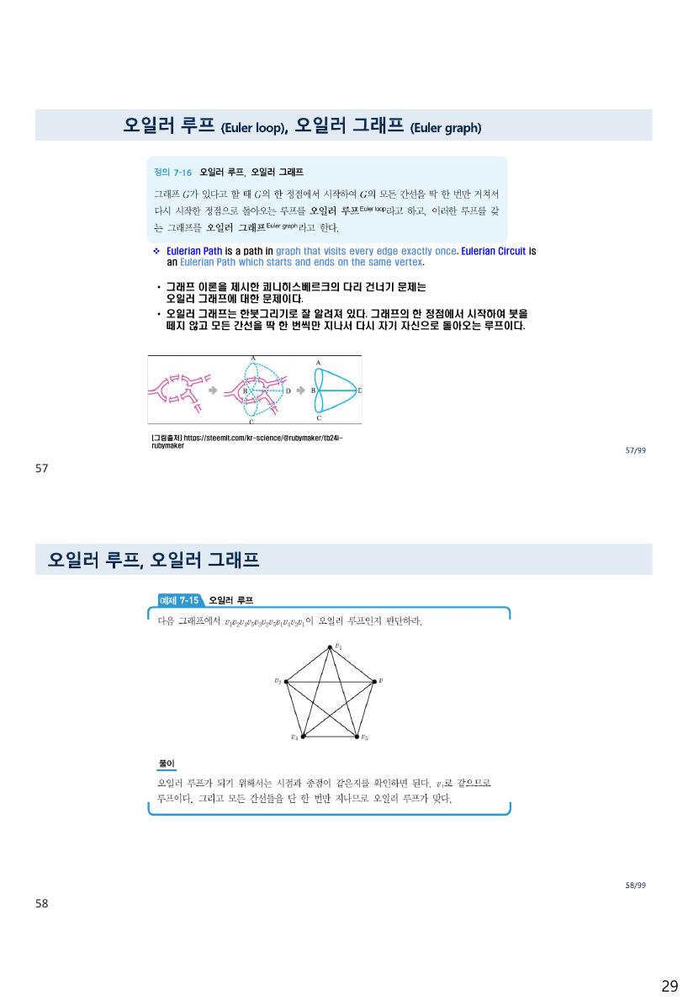
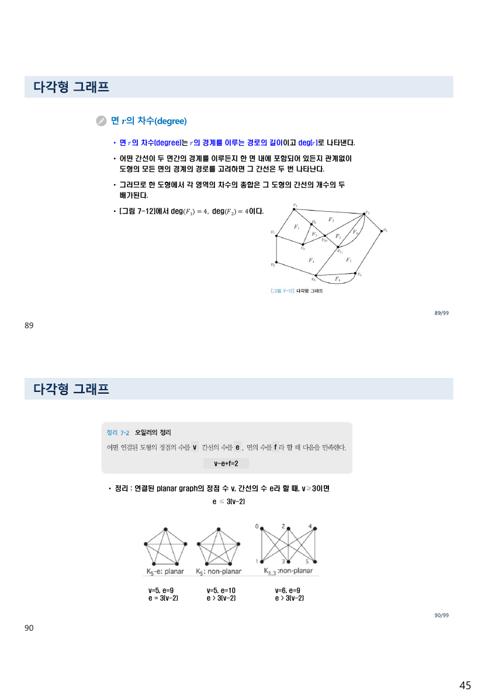
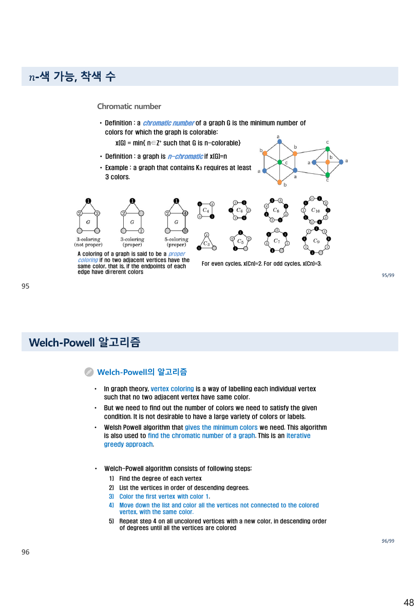
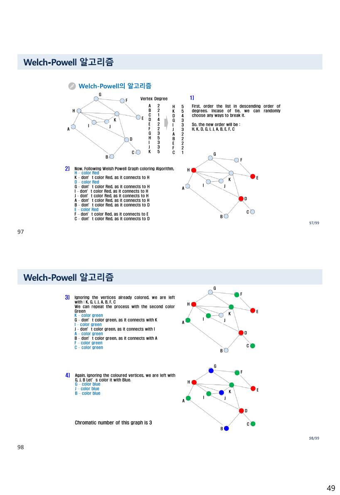
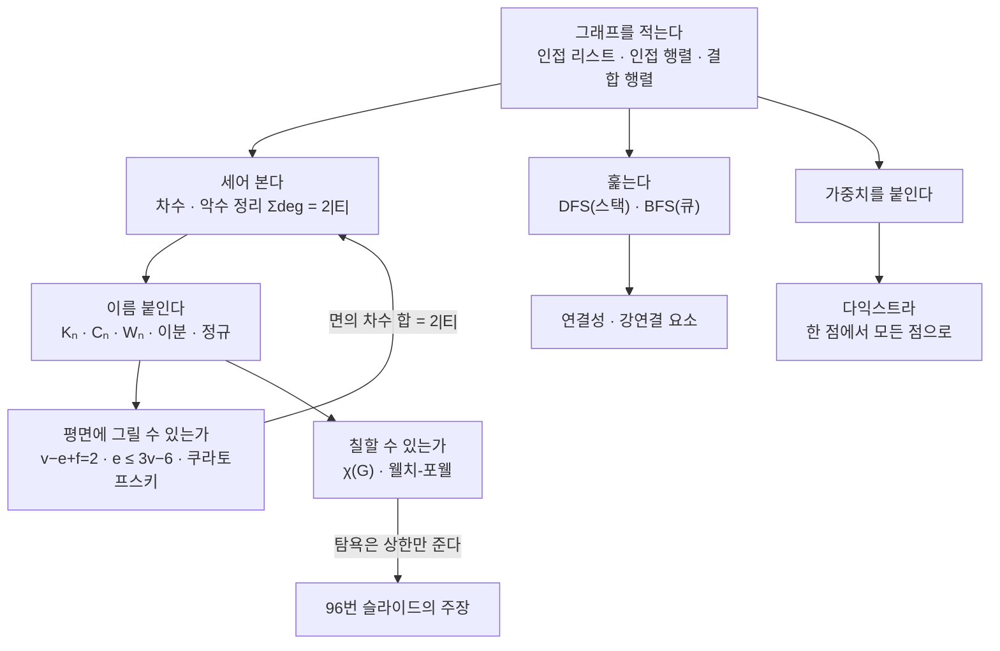

> [!abstract] 이 자료가 어디로 가는가
> 65쪽에 129장의 슬라이드가 들어 있는 이 자료의 목차는 네 절이다 — **기본 개념 / 여러 가지 그래프 / 평면 그래프 / 정점의 착색.** 그리고 마지막 절이 도착지다. 94번 슬라이드가 착색수 $\chi(G)$ 를 정의한 뒤 한 줄로 예고한다 — *“그래프 $G$ 를 착색할 때 **웰치-포웰(Welch-Powell)의 알고리즘**을 적용할 수 있다.”* 남은 열네 장이 그 알고리즘과 파이썬 구현에 쓰인다.
>
> 96번 슬라이드가 그 알고리즘을 이렇게 소개한다.
>
> > Welsh Powell algorithm that **gives the minimum colors we need**. This algorithm is also used to **find the chromatic number** of a graph. This is an **iterative greedy approach**.
>
> 마지막 문장과 앞의 두 문장이 서로를 반박한다. **탐욕(greedy)은 최소를 보장하지 않는다.** 그리고 반례는 멀리 갈 것도 없다 — **바로 앞 95번 슬라이드**가 *“For even cycles, $\chi(C_n) = 2$”* 라고 적어 두었는데, 육각형 $C_6$ 에 웰치-포웰을 적용하면 **정점 순서에 따라 3색이 나온다.**
>
> 이 정리문서는 그 자리로 가는 길이다. 그래프를 적는 법, 재는 법, 훑는 법, 가중치를 붙여 최단 경로를 구하는 법, 평면에 그릴 수 있는지 묻는 법을 원본 예제로 검산하며 지나간 뒤, 마지막에 그 한 줄을 다룬다.

---

## 1. 자료의 겉과 속이 다르다

표지 슬라이드는 **`5 트리와 그래프`** 라 적혀 있고 `2024-2` 가 붙어 있다. 그런데 바로 다음 목차는 이렇다.

| 절 | 제목 |
| --- | --- |
| 7.1 | Basic concept of graphs |
| 7.2 | 여러 가지 그래프 |
| 7.3 | 평면 그래프 |
| 7.4 | 정점의 착색 |

**트리에 관한 절이 없다.** 그리고 56번 슬라이드가 트리를 한 장 소개하면서 오른쪽 위에 이렇게 적어 둔다 — **`8장 트리 학습`**. 트리는 이 자료가 아니라 별도의 `6 트리` 자료(교재 8장)에서 다룬다는 뜻이다([07. 트리와 지식그래프](<./07. 트리와 지식그래프 — 선형으로 펴면 무엇이 사라지는가.md>)).

> [!note] 원본의 이름 붙이기 세 겹
> 이 과목의 자료는 **파일 번호 · 교재 장 번호 · 제목**이 서로 어긋난다.
>
> | 파일 | 표지 제목 | 목차의 장 | 실제 내용 |
> | --- | --- | --- | --- |
> | `5 그래프.pdf` | 5 **트리와** 그래프 | 7.1–7.4 | 그래프만 |
> | `6 트리.pdf` | 6 트리(Tree) | 8.1–8.3 | 트리 |
> | `4 관계 및 함수.pdf` | 4 관계와 **함수** | 4.1–4.6 | 관계 (함수는 앞머리 16장) |
>
> 세 자료 모두 **제목에 있는 것이 목차에 없다.** 파일 번호는 강의 진행 순서, 절 번호는 교재의 장 번호이므로 둘이 다른 것은 자연스럽지만, 제목까지 어긋난 것은 표지를 복사해 쓴 흔적으로 보인다.
>
> 쪽 번호 푸터도 같은 상태다. 이 자료의 푸터는 `N/99` 인데 실제 슬라이드는 **129장**이라, 뒤쪽 서른 장의 푸터가 `100/99` 부터 `129/99` 까지 간다. 같은 습관을 [03. 집합](<./03. 집합 — 한 슬라이드 위에서 두 정의가 어긋난다.md>)(`46/42`)과 [07. 트리](<./07. 트리와 지식그래프 — 선형으로 펴면 무엇이 사라지는가.md>)(`75/72`)에서도 본다.
>
> 그리고 **116–129번 슬라이드는 별도 파일 `Appendix 2 Welch-Powell Algorithms.pdf`(14슬라이드)와 완전히 같은 내용**이다. 부록이 본 자료의 꼬리에 통째로 붙어 있다.

3번 슬라이드가 이 장의 응용 범위를 나열하는데, 목록이 길다 — 통신 네트워크 전송, 소셜 네트워크 분석, 논리 회로 설계, 최단 경로, 시스템 흐름도, 컴파일러 최적화, 작업 계획 분석, 분자 구조식, 유한 오토마타, 지하철 노선도, 자동차 내비게이션, 지도 색칠, 회로도의 평면 구현. **마지막 두 개가 7.3절과 7.4절의 동기**다.

---

## 2. 그래프를 적는 세 가지 방법

[04. 관계 ①](<./04. 관계 ① — 제목의 절반이 앞머리 열여섯 장에서 끝난다.md>) §3에서 관계를 세 가지로 그렸다. 그래프도 마찬가지인데, 이름이 바뀐다.

| 표현 | 정의 | 공간 | 원본 |
| --- | --- | --- | --- |
| **인접 리스트** | 각 정점마다 이웃 정점들의 리스트 | $O(\lvert V \rvert + \lvert E \rvert)$ | 25–27번 |
| **인접 행렬** | $M[i][j] = 1$ 이면 간선 있음 | $O(\lvert V \rvert^2)$ | 28–30번 |
| **결합 행렬** (incidence) | 행이 정점, 열이 **간선** | $O(\lvert V \rvert \cdot \lvert E \rvert)$ | 31번 |

25번 슬라이드가 인접 리스트의 장단을 적는다 — *“전체 $O(\lvert V \rvert + \lvert E \rvert)$ 의 기억 공간을 사용한다는 장점이 있고, 어떤 정점을 찾을 때 처음부터 검색해야 하는 단점.”* 29번이 인접 행렬 쪽을 적는다 — *“간선의 수가 많을수록 매우 적합하고, 정점의 번호가 주어지면 배열의 접근만으로 바로 찾을 수 있다. 반면에, 간선의 수가 작다면 적합하지 않고 항상 $O(\lvert V \rvert^2)$ 만큼의 기억 공간을 사용한다.”*

29번은 무향 그래프의 인접 행렬이 **대칭**임을 설명하고, 30번(Rosen 계열)이 한 줄을 덧붙인다 — *“since there are no loops, each diagonal entry $a_{ii}$ … is 0.”* 단순 그래프라면 주대각이 0이라는 뜻인데, 이것은 [04. 관계 ①](<./04. 관계 ① — 제목의 절반이 앞머리 열여섯 장에서 끝난다.md>) §5의 **비반사 관계**와 같은 조건이다.

31번의 결합 행렬은 이 자료에서 유일하게 등장하는 세 번째 표현이다. 행이 정점, **열이 간선**이며 $m_{ij} = 1$ 이면 간선 $e_j$ 가 정점 $v_i$ 에 붙어 있다는 뜻이다. 원본이 든 단순 그래프 예제의 행렬은

$$\begin{pmatrix} 1&1&0&0&0&0 \\ 0&0&1&1&0&1 \\ 0&0&0&0&1&1 \\ 1&0&1&0&0&0 \\ 0&1&0&1&1&0 \end{pmatrix}$$

**각 열의 1의 개수가 정확히 2** 다 — 간선 하나는 정점 둘에 붙기 때문이다. 이 성질이 §3의 악수 정리를 곧바로 준다.

6·7번 슬라이드가 정의를 벗어나는 그래프들을 정리한다.

- **다중 그래프(multigraph)** — 같은 두 정점 사이에 간선이 여럿. 6번이 *“이는 [정의 7-1]의 그래프 정의에 어긋난다”* 고 명시한다. 간선 집합 $E$ 가 $(a,b),(a,b),(a,b)$ 를 부분집합으로 가지려면 **집합이 아니라 다중집합**이어야 하기 때문이다.
- **루프(loop)** — 정점을 자기 자신에 잇는 간선.
- **유사 그래프(pseudograph)** — 루프와 다중 간선을 모두 허용.

그리고 7번이 이 자료에서 가장 유용한 경고를 남긴다.

> **Remark:** There is no standard terminology for graph theory. So, it is crucial that you understand the terminology being used whenever you read material about graphs.

이 경고는 지켜지는 편이다. 예컨대 37번이 정의하는 “루프”와 “순환”은 앞의 7번이 말한 루프(자기 간선)와 **다른 뜻**이다. 37번에서는

- **개경로(open path)** — $v_p \ne v_q$
- **루프(loop)** — $v_p = v_q$, 곧 시작과 끝이 같은 경로
- **고유 경로(proper path)** — 정점이 모두 다른 개경로
- **순환(cycle)** — 중간 정점이 모두 다른 루프

39번이 유향 그래프 예로 이 넷을 확인시킨다. $\langle a,c\rangle$, $\langle a,b,c\rangle$ 는 단순 경로이고 $\langle a,c,a,c\rangle$, $\langle a,b,b,c\rangle$ 는 아니다. $\langle a,c,a\rangle$ 와 $\langle a,b,c,a\rangle$ 는 순환이며, $\langle a,c,a,c,a\rangle$ 와 $\langle a,b,b,c,a\rangle$ 는 **루프이지만 순환은 아니다.**

---

## 3. 차수 — 세는 것만으로 알 수 있는 것

32번이 차수를 정의한다. 유향 그래프에서는 둘로 갈린다.

- **외차수(out-degree)** — 정점 $a$ 가 **시점**인 간선의 개수, $\deg^+(a)$
- **내차수(in-degree)** — 정점 $a$ 가 **종점**인 간선의 개수, $\deg^-(a)$

무향 그래프에서는 “정점이 가지고 있는 간선의 개수”다. 그리고 33번이 이 절의 핵심 사실을 적는다.

> 무향 그래프에서 **모든 정점의 차수의 합은 간선 개수의 두 배**가 된다.
> 또한, 차수 0인 정점을 **고립(isolated) 정점**이라고 한다

$$\sum_{v \in V} \deg(v) \;=\; 2\lvert E \rvert$$

34번(Rosen 계열)이 이것을 **악수 정리(Handshaking Theorem)** 라 부르며 그림을 준다 — *“vertices represent the people at a party and an edge connects two people who have shaken hands.”* 악수 한 번은 두 사람의 악수 횟수를 각각 1씩 올리므로 총합이 짝수다. §2의 결합 행렬에서 각 열의 1이 두 개였던 것과 정확히 같은 사실이다.

이 정리의 따름정리가 있다 — **차수가 홀수인 정점은 반드시 짝수 개**다. 총합이 짝수여야 하기 때문이다. 34번 슬라이드 아래에 `even degree` / `odd degree` 두 그림이 붙어 있는 것이 이 대비다.

36번이 유향 그래프의 예를 준다.

$$\deg^-: a=2,\; b=2,\; c=3,\; d=2,\; e=3,\; f=0 \qquad \deg^+: a=4,\; b=1,\; c=2,\; d=2,\; e=3,\; f=0$$

**검산했다.** 내차수의 합은 $2+2+3+2+3+0 = 12$, 외차수의 합도 $4+1+2+2+3+0 = 12$ 로 같다. 유향 그래프에서는 두 합이 각각 $\lvert E \rvert$ 와 같아야 하므로 이 그래프의 간선은 12개다. 그리고 $f$ 는 내차수·외차수가 모두 0이므로 **고립 정점**이다.

> [!note] 32번 슬라이드의 표현이 한 걸음 부족하다
> *“만약 무향 그래프에서 자신의 정점에서 시작해서 다시 자기 자신으로 돌아오는 순환을 가지는 경우 **그 정점의 차수는 2이다.**”*
>
> 루프가 차수에 **2를 더한다**는 것이 정확한 서술이다. 루프가 하나 달린 정점에 다른 간선이 세 개 더 있으면 차수는 2가 아니라 5다. 원문대로 읽으면 루프가 다른 간선을 지워 버리는 것처럼 들린다. 루프가 2를 더하는 이유는 악수 정리를 지키기 위해서다 — 루프 한 개는 간선 한 개이므로 차수 합에 2를 기여해야 한다.

44번이 완전 그래프 $K_n$ 을 다룬다. 정점이 $n$개면 모든 정점이 나머지 $n-1$ 개와 이어지므로

$$\lvert E(K_n) \rvert = \frac{n(n-1)}{2}$$

원본이 $K_5$ 를 예로 들며 *“각 정점에서 차수를 구해보면 4차이다 … 그래서 이런 그래프를 **4차의 완전 그래프**라 한다”* 고 적는다. 악수 정리로 검산하면 $5 \times 4 / 2 = 10$ 개의 간선이다.

45·46번이 이름 붙인 그래프를 더 준다.

| 이름 | 표기 | 정의 | 정규 차수 |
| --- | --- | --- | --- |
| 완전 그래프 | $K_n$ | 모든 정점이 서로 이어짐 | $n-1$ |
| 순환 그래프 | $C_n$ | $v_k$ 와 $v_{k+1}$ 이 이어짐(mod $n$) | 2 |
| 바퀴 그래프 | $W_n$ | $C_n$ 에 모든 정점과 이어진 허브 하나 추가, **정점 $n+1$개** | — |
| 정규 그래프 | — | 모든 정점의 차수가 같음 | — |

46번의 예 셋 중 세 번째가 확인할 만하다 — *“$W_3$ is regular of degree 3.”* $W_3$ 은 $C_3$(삼각형)에 허브 하나를 더한 것이므로 정점 4개이고, 허브의 차수는 3, 삼각형의 각 정점은 이웃 둘 + 허브 = 3. 곧 $W_3 = K_4$ 다. ✅

51–53번이 **이분 그래프**를 다룬다. 정점 집합을 $W$ 와 $X$ 로 나누어 같은 쪽끼리는 간선이 없는 그래프이고, 완전 이분 그래프 $K_{m,n}$ 은 간선이 $m \times n$ 개다. 52번이 왜 중요한지를 적는다 — **작업 배정**(직원과 업무를 잇는다)과 **결혼 문제**. 그리고 $K_{3,3}$ 이 §6에서 결정적인 역할을 한다.

54번의 밀집도 정의도 유용하다 — 간선 수를 최대 가능 간선 수로 나눈 값이고, 완전 그래프에서 1이다. 이 값이 §2에서 인접 행렬과 인접 리스트 중 무엇을 고를지의 기준이 된다.

---

## 4. 훑기 — 깊이 먼저와 너비 먼저

66번이 문제를 세운다 — *“정점 $v$ 로부터 시작하여 도달할 수 있는 $G$ 의 모든 정점을 탐색하는 것.”* 두 방법이 있다.

| | 깊이우선 탐색 (DFS) | 너비우선 탐색 (BFS) |
| --- | --- | --- |
| 원본의 서술 | *“$v$ 에 인접하고 아직 방문하지 않은 정점 $w$ 를 선택하여 $w$ 를 출발점으로 해서 **다시 깊이 우선 탐색**을 시작한다”* (67번) | *“$v$ 에 인접한 정점 $w$ 들을 **먼저 모두 방문**하고 그 다음으로 $w$ 에 인접한 …”* (69번) |
| 되돌아오기 | *“인접한 모든 정점들이 이미 방문한 정점인 경우는 가장 최근에 방문했던 정점 중에서 …”* | 없음 |
| 자료구조 | 재귀 (호출 스택) | **큐** |

68번과 70번이 의사 코드를 준다. DFS는 재귀 한 줄로 끝나지만 BFS는 `InitializeQueue` · `EnQueue` · `DeQueue` 가 필요하다. **두 알고리즘의 차이는 “다음에 어디를 볼지”를 담아 두는 그릇의 차이**다 — 스택이면 깊이 우선, 큐면 너비 우선.

![36쪽(71번 슬라이드) — [그림 7-9]와 두 탐색의 결과](../assets/ch06-p36-DFS-BFS-그림7-9.png)

> 원본 71번 슬라이드. `v1` 을 뿌리로 하는 그래프에 대해 두 탐색의 방문 순서를 적어 두었다.

원본이 적은 두 결과는 이렇다.

- 깊이우선: $v_1, v_2, v_4, v_8, v_5, v_6, v_3, v_7$
- 너비우선: $v_1, v_2, v_3, v_4, v_5, v_6, v_7, v_8$

[그림 7-9]의 구조는 — $v_1$ 아래에 $v_2, v_3$, $v_2$ 아래에 $v_4, v_5$, $v_3$ 아래에 $v_6, v_7$, 그리고 $v_4, v_5, v_6, v_7$ 이 모두 $v_8$ 에 모인다. **두 결과를 이 그래프 위에서 재현했고 원본과 정확히 일치한다.**

```html preview h=600px
<div style="font-family:system-ui,-apple-system,sans-serif;padding:20px;color:var(--foreground)">
  <div style="display:flex;gap:10px;flex-wrap:wrap;align-items:center;margin-bottom:14px">
    <button id="bdfs" class="tbtn">깊이우선 (DFS)</button>
    <button id="bbfs" class="tbtn">너비우선 (BFS)</button>
    <span style="flex:1"></span>
    <button id="bstep" class="tbtn">한 걸음</button>
    <button id="ball" class="tbtn">끝까지</button>
    <button id="brst" class="tbtn">처음으로</button>
  </div>
  <style>.tbtn{padding:7px 13px;font-size:13px;border:1px solid var(--border);border-radius:var(--radius);
    background:var(--card);color:var(--foreground);cursor:pointer}
    .tbtn[data-on="1"]{background:var(--chart-1);color:var(--background);border-color:var(--chart-1);font-weight:600}</style>

  <div style="display:flex;gap:26px;flex-wrap:wrap;align-items:flex-start">
    <svg id="tsvg" viewBox="0 0 340 300" width="340" role="img" aria-label="그림 7-9 그래프와 탐색 순서"></svg>
    <div style="flex:1;min-width:220px">
      <div id="torder" style="font-family:ui-monospace,Menlo,monospace;font-size:14px;line-height:1.9;
           padding:10px 12px;background:var(--card);border:1px solid var(--border);border-radius:var(--radius);min-height:52px"></div>
      <div id="tbox" style="margin-top:10px;padding:11px 13px;background:var(--card);border:1px solid var(--border);
           border-radius:var(--radius);font-size:13px;line-height:1.8"></div>
    </div>
  </div>

  <script>
    var ADJ = { 1:[2,3], 2:[1,4,5], 3:[1,6,7], 4:[2,8], 5:[2,8], 6:[3,8], 7:[3,8], 8:[4,5,6,7] };
    var POS = { 1:[170,32], 2:[105,100], 3:[240,100], 4:[62,172], 5:[130,172], 6:[212,172], 7:[280,172], 8:[170,250] };
    var WANT = { dfs: [1,2,4,8,5,6,3,7], bfs: [1,2,3,4,5,6,7,8] };
    var mode = 'dfs', seq = [], shown = 0;

    function dfs() {
      var vis = {}, out = [];
      (function go(v) { vis[v] = 1; out.push(v); ADJ[v].forEach(function (w) { if (!vis[w]) go(w); }); })(1);
      return out;
    }
    function bfs() {
      var vis = { 1: 1 }, q = [1], out = [];
      while (q.length) { var v = q.shift(); out.push(v); ADJ[v].forEach(function (w) { if (!vis[w]) { vis[w] = 1; q.push(w); } }); }
      return out;
    }
    function setMode(m) {
      mode = m; seq = m === 'dfs' ? dfs() : bfs(); shown = 0;
      document.getElementById('bdfs').dataset.on = m === 'dfs' ? '1' : '0';
      document.getElementById('bbfs').dataset.on = m === 'bfs' ? '1' : '0';
      draw();
    }
    function draw() {
      var order = seq.slice(0, shown), rank = {};
      order.forEach(function (v, i) { rank[v] = i + 1; });
      var svg = '';
      Object.keys(ADJ).forEach(function (v) {
        ADJ[v].forEach(function (w) {
          if (+v >= w) return;
          svg += '<line x1="' + POS[v][0] + '" y1="' + POS[v][1] + '" x2="' + POS[w][0] + '" y2="' + POS[w][1] +
            '" stroke="var(--border)" stroke-width="1.6"/>';
        });
      });
      Object.keys(POS).forEach(function (v) {
        var r = rank[v], on = !!r;
        svg += '<circle cx="' + POS[v][0] + '" cy="' + POS[v][1] + '" r="19" fill="' +
          (on ? 'var(--chart-1)' : 'var(--card)') + '" stroke="var(--border)" stroke-width="1.5"/>' +
          '<text x="' + POS[v][0] + '" y="' + (POS[v][1] + 5) + '" text-anchor="middle" font-size="13" font-weight="700" fill="' +
          (on ? 'var(--background)' : 'var(--muted-foreground)') + '">v' + v + '</text>' +
          (on ? '<circle cx="' + (POS[v][0] + 17) + '" cy="' + (POS[v][1] - 15) + '" r="9" fill="var(--chart-3)"/>' +
            '<text x="' + (POS[v][0] + 17) + '" y="' + (POS[v][1] - 11) + '" text-anchor="middle" font-size="10" ' +
            'font-weight="700" fill="var(--background)">' + r + '</text>' : '');
      });
      document.getElementById('tsvg').innerHTML = svg;
      document.getElementById('torder').innerHTML = order.length
        ? order.map(function (v) { return 'v' + v; }).join(' → ')
        : '<span style="color:var(--muted-foreground)">“한 걸음”을 눌러 시작한다</span>';

      var done = shown === 8;
      var same = done && seq.join() === WANT[mode].join();
      document.getElementById('tbox').innerHTML = done
        ? '<b style="color:' + (same ? 'var(--chart-1)' : 'var(--chart-5)') + '">' +
          (same ? '원본 71번 슬라이드가 적은 순서와 일치한다.' : '원본과 다르다') + '</b><br/>' +
          '<span style="color:var(--muted-foreground)">' +
          (mode === 'dfs'
            ? 'v8 까지 내려간 뒤 되돌아 나오면서 v5·v6 을 줍고, v6 에서 v3 으로 <b>올라간다</b>. ' +
              'v3 이 v1 의 이웃인데도 <b>일곱 번째</b>에야 방문되는 것이 깊이우선의 성격이다.'
            : 'v1 의 이웃 v2·v3 을 먼저 다 방문하고 그 다음 층으로 내려간다. ' +
              '번호 순서와 방문 순서가 우연히 같아졌는데, 이는 그래프가 층으로 잘 나뉘어 있기 때문이다.') + '</span>'
        : '<span style="color:var(--muted-foreground)">' +
          (mode === 'dfs' ? '스택(재귀 호출)에 담아 가장 최근 것부터 꺼낸다.' : '큐에 담아 먼저 넣은 것부터 꺼낸다.') +
          ' 진행 ' + shown + ' / 8</span>';
    }
    document.getElementById('bdfs').onclick = function () { setMode('dfs'); };
    document.getElementById('bbfs').onclick = function () { setMode('bfs'); };
    document.getElementById('bstep').onclick = function () { shown = Math.min(8, shown + 1); draw(); };
    document.getElementById('ball').onclick = function () { shown = 8; draw(); };
    document.getElementById('brst').onclick = function () { shown = 0; draw(); };
    setMode('dfs');
  </script>
</div>
```

두 순서를 끝까지 돌려 비교하면 성격 차이가 뚜렷하다. DFS에서 $v_3$ 은 뿌리 $v_1$ 의 **직접 이웃**인데도 일곱 번째에 방문된다 — $v_2$ 쪽으로 끝까지 내려갔다가 $v_8$ 을 거쳐 $v_6$ 으로, 다시 $v_6$ 의 이웃으로 $v_3$ 에 도달하기 때문이다. BFS에서는 두 번째다.

41·42번이 연결성을 정의한다. 42번(Rosen 계열)이 유향 그래프의 **강연결(strongly connected)** 을 준다 — *“there is a path in each direction between each pair of vertices.”* 그리고 **강연결 요소(strongly connected component)** 가 그래프를 분할한다고 적는데, 이것이 [05. 관계 ②](<./05. 관계 ② — 무한 번 반복하지 않고 도달 가능성을 묻는 법.md>) §5의 “가장 작은 동치 관계”와 같은 이야기다 — 서로 오갈 수 있음은 동치 관계이고, 동치류가 곧 강연결 요소다.

47–49번의 **동형 그래프(isomorphic graph)** 는 “그림이 달라도 같은 그래프”를 다룬다. 48번에 `전단사` 라는 낱말이 붙어 있는데, 두 그래프가 동형이라는 것은 정점 사이에 간선을 보존하는 **전단사 함수**가 있다는 뜻이다 — [04. 관계 ①](<./04. 관계 ① — 제목의 절반이 앞머리 열여섯 장에서 끝난다.md>) §1의 함수가 여기서 쓰인다.



> 원본 57번 슬라이드. 쾨니히스베르크의 다리 문제를 언급하며 오일러 그래프를 정의한다 — *“그래프의 한 정점에서 시작하여 붓을 떼지 않고 모든 간선을 딱 한 번씩만 지나서 다시 자기 자신으로 돌아오는 루프.”*

57–60번이 오일러와 해밀턴을 다룬다.

| | 오일러 (Euler) | 해밀턴 (Hamilton) |
| --- | --- | --- |
| 한 번씩 지나는 대상 | **간선** | **정점** |
| 원본의 서술 | *“붓을 떼지 않고 모든 간선을 딱 한 번씩만 지나서”* (57번) | *“같은 모서리를 몇 번을 지나든 상관없이 꼭짓점들만 한 번씩”* (60번) |
| 판정 | **모든 정점의 차수가 짝수** (59번) | 쉬운 판정법이 없다 |

59번이 오일러 판정을 한 줄로 준다 — *“[예제 7-15]의 그래프는 오일러 그래프이다. 왜냐하면 **모든 정점들의 차수가 짝수**이기 때문이다.”* 이유는 직관적이다. 어떤 정점에 들어갔으면 나와야 하므로 간선을 짝으로 소비한다.

해밀턴 쪽은 판정법이 없고, 61번이 그 유래를 적는다 — 해밀턴(W. R. Hamilton, 1805–1865)의 12면체 수수께끼. 그리고 64번이 여기에 가중치를 붙여 **판매원 탐방 문제(TSP)** 로 만든다.

> 가중치 그래프 $G$ 가 주어지면 $G$ 안에서 **최소 길이를 가지는 해밀턴 순환**을 찾는 문제

오일러 회로는 차수만 세면 판정되는데 해밀턴 순환은 그렇지 않고, 거기에 최소화까지 얹으면 계산하기 어려운 문제가 된다. 이 대비가 [알고리즘 설계와 분석 10. NP-완전성과 근사 알고리즘](<../../../06_algorithms-graphics/algorithm-design-analysis/notes/10. NP-완전성과 근사 알고리즘.md>)의 출발점이다.

---

## 5. 다익스트라 — 모든 경로를 세지 않는 법

72번이 문제와 그 순진한 해법, 그리고 그 해법이 무너지는 이유를 한 장에 담는다.

> 그러면 최단 경로를 어떻게 하면 찾을 수 있을까? 그것에 대한 명백한 해답은 **모든 경로에 대해서 거리를 계산하는 것**이다.
> 그러나 이 방법은 $n$ 개의 정점들이 있을 때 정점 $a$ 로부터 정점 $b$ 로의 경로는 $(n-2)!$ 이상이 존재하므로 만일 $n = 30$ 일 경우에 … **엄청난 시간을 요구**할 것이다.

$28! \approx 3 \times 10^{29}$ 이므로 정말 그렇다. 그래서 다익스트라가 필요하다. 74번이 알고리즘의 핵심 한 줄을 적는다.

> 현재 알고 있는 `distance[w]` 를 **새로 추가된 정점 $u$ 를 거쳐서 가는** `distance[u] + weight[u][w]` 를 계산한 경로와 비교해 경로가 단축되면 `distance[w]` 를 단축된 경로값으로 수정

[05. 관계 ②](<./05. 관계 ② — 무한 번 반복하지 않고 도달 가능성을 묻는 법.md>) §4의 플로이드-워셜 갱신식과 형태가 같다. 다만 다익스트라는 **한 시작점에서만** 구하고(One-to-All), 경유지를 아무렇게나 늘리는 대신 **거리가 가장 작은 정점부터 확정**한다.

![52쪽(104번 슬라이드) — [그림 7-10] 가중치 그래프](../assets/ch06-p52-그림7-10-가중치-그래프.png)

> 원본 104번 슬라이드. 그래프의 간선 가중치가 인쇄되어 있고, 위에 답이 미리 적혀 있다 — *“[그림 7-10]에서 $A$ 부터 $F$ 까지의 최단 경로의 가중치는 **6**이며 정점 $A, D, E, F$ 로 구성됨을 알 수 있다.”*

원본 그림에서 읽은 간선은 일곱 개다.

| 간선 | 가중치 | | 간선 | 가중치 |
| --- | --- | --- | --- | --- |
| A–B | 2 | | C–F | 5 |
| A–D | 3 | | D–E | 2 |
| B–C | 1 | | E–F | 1 |
| B–E | 4 | | **G** | 고립 정점 |

106–111번 슬라이드가 단계별 실행을 보인다. 원본이 각 단계에 적은 서술과 거리 배열을 그대로 재현해 검산했고, **여섯 단계 모두 일치한다.**

```html preview h=620px
<div style="font-family:system-ui,-apple-system,sans-serif;padding:20px;color:var(--foreground)">
  <div style="display:flex;gap:10px;align-items:center;flex-wrap:wrap;margin-bottom:14px">
    <button id="dprev" class="dbtn">← 이전</button>
    <div id="dlabel" style="font-size:14px;font-weight:700;min-width:110px"></div>
    <button id="dnext" class="dbtn">다음 →</button>
    <button id="drst" class="dbtn">처음으로</button>
  </div>
  <style>.dbtn{padding:7px 13px;font-size:13px;border:1px solid var(--border);border-radius:var(--radius);
    background:var(--card);color:var(--foreground);cursor:pointer}</style>

  <div style="display:flex;gap:26px;flex-wrap:wrap;align-items:flex-start">
    <svg id="dsvg" viewBox="0 0 340 230" width="340" role="img" aria-label="그림 7-10 위의 다익스트라 진행"></svg>
    <div style="flex:1;min-width:230px">
      <div id="dtab"></div>
      <div id="dbox" style="margin-top:11px;padding:11px 13px;background:var(--card);border:1px solid var(--border);
           border-radius:var(--radius);font-size:13px;line-height:1.8"></div>
    </div>
  </div>

  <script>
    var W = { 'A-B':2, 'A-D':3, 'B-C':1, 'B-E':4, 'C-F':5, 'D-E':2, 'E-F':1 };
    var V = ['A','B','C','D','E','F','G'];
    var POS = { A:[34,116], B:[110,52], C:[196,52], D:[110,182], E:[196,182], F:[276,116], G:[310,44] };
    var ADJ = {};
    V.forEach(function (v) { ADJ[v] = []; });
    Object.keys(W).forEach(function (k) {
      var p = k.split('-'); ADJ[p[0]].push([p[1], W[k]]); ADJ[p[1]].push([p[0], W[k]]);
    });

    // 원본 단계 순서: A, B, D(C와 동률에서 임의로 D), C, E, F
    var PICK = ['A','B','D','C','E','F'];
    var NOTE = [
      'X = A 일 때 d[X] = 0, 간선이 없으면 ∞, 있으면 그 가중치를 넣는다. (원본 단계 0)',
      'B 가 A 에 가장 가까운 미탐색 정점이다. C 와 E 에 도달할 수 있으므로 거리를 3 과 6 으로 고친다. (단계 1)',
      '남은 정점 중 C 와 D 가 <b>둘 다 3</b> 으로 가장 가깝다. 원본은 “임의로 D 를 선택해서 탐색한다”고 적는다. E 가 6 에서 5 로 바뀐다. (단계 2)',
      'C 를 탐색한다. F 가 C 를 통해 도달되므로 거리를 8 로 바꾼다. (단계 3)',
      'E 를 탐색하고 F 로의 거리를 <b>8 에서 6 으로</b> 바꾼다. (단계 4)',
      'F 를 탐색한다. 도달될 수 있는 정점이 없으므로 <b>G 는 탐색되지 않는다.</b> (단계 5)'
    ];
    var SNAP = [];
    (function () {
      var d = {}, done = {};
      V.forEach(function (v) { d[v] = Infinity; });
      d.A = 0;
      SNAP.push({ pick: null, d: Object.assign({}, d), done: {} });
      // 단계 0: A 를 확정하고 이웃 갱신
      for (var s = 0; s < PICK.length; s++) {
        var u = PICK[s];
        done[u] = 1;
        ADJ[u].forEach(function (nb) { if (d[u] + nb[1] < d[nb[0]]) d[nb[0]] = d[u] + nb[1]; });
        SNAP.push({ pick: u, d: Object.assign({}, d), done: Object.assign({}, done) });
      }
    })();
    var i = 0;

    function draw() {
      var S = SNAP[i], svg = '';
      Object.keys(W).forEach(function (k) {
        var p = k.split('-'), a = POS[p[0]], b = POS[p[1]];
        svg += '<line x1="' + a[0] + '" y1="' + a[1] + '" x2="' + b[0] + '" y2="' + b[1] +
          '" stroke="var(--border)" stroke-width="1.6"/>' +
          '<text x="' + ((a[0] + b[0]) / 2) + '" y="' + ((a[1] + b[1]) / 2 - 5) +
          '" text-anchor="middle" font-size="12" font-weight="700" fill="var(--chart-3)">' + W[k] + '</text>';
      });
      V.forEach(function (v) {
        var isDone = S.done[v], isPick = S.pick === v;
        svg += '<circle cx="' + POS[v][0] + '" cy="' + POS[v][1] + '" r="18" fill="' +
          (isPick ? 'var(--chart-1)' : isDone ? 'var(--chart-2)' : 'var(--card)') +
          '" stroke="var(--border)" stroke-width="1.5"/>' +
          '<text x="' + POS[v][0] + '" y="' + (POS[v][1] + 5) + '" text-anchor="middle" font-size="13" font-weight="700" fill="' +
          (isDone || isPick ? 'var(--background)' : 'var(--muted-foreground)') + '">' + v + '</text>' +
          '<text x="' + POS[v][0] + '" y="' + (POS[v][1] + 34) + '" text-anchor="middle" font-size="11.5" ' +
          'font-weight="700" fill="var(--foreground)">' + (S.d[v] === Infinity ? '∞' : S.d[v]) + '</text>';
      });
      document.getElementById('dsvg').innerHTML = svg;
      document.getElementById('dlabel').textContent = S.pick ? '단계 ' + i + ' · ' + S.pick + ' 확정' : '초기 상태';

      document.getElementById('dtab').innerHTML =
        '<table style="border-collapse:collapse;font-size:13.5px"><tr>' +
        V.map(function (v) {
          return '<th style="padding:5px 12px;border-bottom:2px solid var(--border);color:' +
            (S.done[v] ? 'var(--chart-2)' : 'var(--muted-foreground)') + '">' + v + '</th>';
        }).join('') + '</tr><tr>' +
        V.map(function (v) {
          return '<td style="padding:6px 12px;text-align:center;font-weight:700;color:' +
            (S.d[v] === Infinity ? 'var(--muted-foreground)' : S.pick === v ? 'var(--chart-1)' : 'var(--foreground)') + '">' +
            (S.d[v] === Infinity ? '∞' : S.d[v]) + '</td>';
        }).join('') + '</tr></table>';

      document.getElementById('dbox').innerHTML = NOTE[i] +
        (i === SNAP.length - 1
          ? '<br/><br/><b style="color:var(--chart-1)">A → F 의 최단 거리는 6</b>, 경로는 A → D → E → F. ' +
            '<span style="color:var(--muted-foreground)">원본 104번 슬라이드가 적어 둔 답과 같다. ' +
            'G 는 어느 정점과도 이어져 있지 않아 끝까지 ∞ 로 남는다.</span>'
          : '');
    }
    document.getElementById('dprev').onclick = function () { i = Math.max(0, i - 1); draw(); };
    document.getElementById('dnext').onclick = function () { i = Math.min(SNAP.length - 1, i + 1); draw(); };
    document.getElementById('drst').onclick = function () { i = 0; draw(); };
    draw();
  </script>
</div>
```

두 자리가 이 예제의 교육적 요점이다.

- **단계 2의 동률.** C와 D가 둘 다 거리 3이다. 원본은 *“임의로 D를 선택해서 탐색한다”* 고 적는다. 어느 쪽을 골라도 최종 답은 같다 — 동률이면 순서가 결과를 바꾸지 않는다.
- **단계 3과 4에서 F가 두 번 갱신된다.** C를 통해 8, 그다음 E를 통해 6. 중간에 얻은 8은 답이 아니었다. **확정되기 전의 거리는 “지금까지 알려진 최선”일 뿐**이라는 것을 보여 준다.

72번이 마지막으로 다익스트라라는 사람을 소개하는데, 여기에 사소한 흠이 있다 — *“Dijkstra는 네덜란드 사람으로 **이론 물리학자**이며 1972년 ACM으로부터 그 유명한 튜링(Alan Turing)상을 수상했다.”* 튜링상 수상은 정확하다. 다만 그는 이론물리학을 공부한 뒤 컴퓨터 과학으로 옮겨 그 분야를 세운 사람이므로, “이론 물리학자”라는 소개는 그의 학부 전공만 가리킨다.

---

## 6. 평면 그래프 — 그리고 90번 슬라이드의 부등호

84번이 문제를 세운다. 그래프를 평면에 그릴 때 간선이 교차하는 점을 **교점**, 교차하는 간선을 **교선**이라 한다. 85번이 정의를 준다.

> a graph is **planar** if it can be drawn without edge crossing in the plane

그리고 도구가 하나 나온다. 89번이 **면의 차수**를 정의하고 — *“면 $r$ 의 차수는 $r$ 의 경계를 이루는 경로의 길이”* — 결정적인 사실을 적는다.

> 어떤 간선이 두 면간의 경계를 이루든지 한 면 내에 포함되어 있든지 관계없이 도형의 모든 면의 경계의 경로를 고려하면 **그 간선은 두 번 나타난다.** 그러므로 한 도형에서 각 영역의 차수의 총합은 그 도형의 **간선의 개수의 두 배**가 된다.

$$\sum_{r} \deg(r) \;=\; 2\lvert E \rvert$$

§3의 악수 정리와 **똑같은 모양**이다. 정점에 대해 성립하던 것이 면에 대해서도 성립한다.

90번이 오일러의 정리를 준다.

$$v - e + f = 2$$



> 원본 90번 슬라이드. 오일러 공식 아래에 부등식 하나와 그림 세 개가 있다.

원본이 적은 부등식은 이렇다.

> 정리 : 연결된 planar graph의 정점 수 $v$, 간선의 수 $e$ 라 할 때, $v \ge 3$ 이면 $e \le 3(v-2)$

이 부등식은 정확하다. $3(v-2) = 3v - 6$ 은 표준적인 평면 그래프 한계다. 유도는 두 사실을 합친다 — 단순 그래프의 각 면은 차수가 3 이상이므로 $2e \ge 3f$ 이고, 오일러 공식에서 $f = 2 - v + e$ 이므로 $2e \ge 3(2 - v + e)$, 정리하면 $e \le 3v - 6$.

그리고 세 예가 붙어 있다.

| 그림 | 원본이 적은 것 | 검산 |
| --- | --- | --- |
| $K_5 - e$ : planar | $v=5,\ e=9,\ e = 3(v-2)$ | $3(5-2) = 9$ ✅ 등호 성립 |
| $K_5$ : non-planar | $v=5,\ e=10,\ e > 3(v-2)$ | $10 > 9$ ✅ |
| $K_{3,3}$ : non-planar | $v=6,\ e=9,\ \mathbf{e > 3(v-2)}$ | $3(6-2) = 12$ 이고 $9 < 12$ ❌ |

> [!warning] 원본 오류 ① — $K_{3,3}$ 은 $e \le 3(v-2)$ 를 **만족한다**
> 세 번째 예의 라벨 `e > 3(v−2)` 는 산술적으로 거짓이다. $K_{3,3}$ 은 $v=6$, $e=9$ 이고 $3(v-2) = 12$ 이므로 $9 \le 12$ — **부등식을 어기지 않는다.** 그런데도 $K_{3,3}$ 은 평면 그래프가 아니다.
>
> 이것은 사소한 오기가 아니라 **판정법의 한계를 드러내는 자리**다. $e \le 3v-6$ 은 평면성의 **필요조건**일 뿐 충분조건이 아니다. 이 부등식을 통과해도 비평면일 수 있고, $K_{3,3}$ 이 바로 그 사례다.
>
> 진짜 이유는 **이분 그래프라서 삼각형이 없다**는 데 있다. 삼각형이 없으면 모든 면의 차수가 4 이상이므로 $2e \ge 4f$ 가 되고, 여기에 오일러 공식을 넣으면 더 강한 한계가 나온다.
>
> $$e \le 2v - 4$$
>
> $K_{3,3}$ 에 넣으면 $2(6) - 4 = 8$ 인데 $e = 9 > 8$ 이므로 **이 부등식은 어긴다.** 그래서 비평면이다.
>
> 놀라운 것은 **바로 다음 91번 슬라이드가 이 논증을 정확히 적어 두었다**는 점이다.
>
> > $K_{3,3}$ 은 6개의 정점과 9개의 간선을 가지므로 $K_{3,3}$ 이 평면 그래프라면 오일러의 식에 의해 **5개의 면**을 가져야 한다.
> > $A_1, A_2, A_3$ 의 정점은 서로 연결하지 않고 $B_1, B_2, B_3$ 의 정점을 서로 연결되지 않기 때문에 **각 면의 차수가 4 이상**임을 알 수 있다.
> > 따라서 각 면의 차수의 총합이 **20 이상**이어야 하므로 **10개 이상의 간선**을 가져야 하는데 $K_{3,3}$ 의 간선을 9개라는 사실과 모순된다. 그러므로 $K_{3,3}$ 은 비평면 그래프이다.
>
> 검산해 보면 정확하다 — $f = 2 - 6 + 9 = 5$, 면 차수 합 $\ge 4 \times 5 = 20$, 따라서 $2e \ge 20$ 이고 $e \ge 10$. 그런데 $e = 9$ 다. **모순이 성립한다.**
>
> 90번 슬라이드의 라벨은 91번의 이 논증을 90번의 부등식으로 잘못 요약한 결과다.

92번이 마무리로 **쿠라토프스키의 정리**를 준다.

> A finite graph is planar **if and only if** it does not contain a subgraph that is a subdivision of the complete graph $K_5$ or the complete bipartite graph $K_{3,3}$.

“if and only if”가 핵심이다. 90번의 부등식은 한쪽 방향만 주지만 이 정리는 **완전한 판정**을 준다. 그리고 그 판정에 등장하는 두 그래프가 90번이 예로 든 바로 그 둘이다 — 90번은 두 “최소 비평면 그래프”를 보여 주면서 정작 $K_{3,3}$ 을 잡아내지 못하는 부등식으로 설명하려 한 셈이다.

91번이 이 정리의 역사도 적는다 — *“1930년 폴란드의 수학자 쿠라토프스키(K. Kuratowski)에 의해 해결되었다.”*

---

## 7. 착색 — 그리고 “최소”라는 말

94번이 정의를 준다.

> 그래프 $G$ 의 **정점 착색**은 인접된 정점이 서로 다른 색을 가지도록 $G$ 의 정점들에 색을 할당하는 것이다.
> $n$ 가지의 색으로 $G$ 의 착색이 가능하면 $G$ 는 **$n$-색 가능**이라고 하며, $G$ 를 착색하는 데 필요한 **최소의 색의 가지 수**를 $G$ 의 **착색수(chromatic number)** 라 하고 $\chi(G)$ 로 표시한다.
> 이와 같은 정점의 착색은 **레지스터 할당 문제** 등에 응용된다.

마지막 줄이 컴파일러 쪽 응용이다. 변수를 정점으로, 동시에 살아 있는 변수 쌍을 간선으로 두면 레지스터 배정이 정확히 착색 문제가 된다.

95번이 몇 가지 값을 준다.

- $K_3$ 를 포함하면 최소 3색이 필요하다
- **For even cycles, $\chi(C_n) = 2$. For odd cycles, $\chi(C_n) = 3$.**
- 페테르센 그래프는 3색으로 칠할 수 있고 그것이 최소다

두 번째 줄을 기억해 두자. **짝수 순환의 착색수는 2다.**



> 원본 96번 슬라이드. 위쪽 세 문장이 알고리즘을 소개하고, 아래쪽 다섯 단계가 절차다.

절차 다섯 단계는 이렇다.

1. Find the degree of each vertex
2. List the vertices in **order of descending degrees**
3. Color the first vertex with color 1
4. Move down the list and color **all the vertices not connected to the colored vertex**, with the same color
5. Repeat step 4 on all uncolored vertices with a new color, in descending order of degrees until all the vertices are colored

절차 자체는 정확하다. 문제는 그 위의 소개 문장이다.

> [!warning] 원본 오류 ② — 탐욕 알고리즘은 최소 색 수를 주지 않는다
> 96번 슬라이드는 이렇게 적는다 — *“Welsh Powell algorithm that **gives the minimum colors we need**. This algorithm is also used to **find the chromatic number** of a graph. This is an iterative **greedy** approach.”*
>
> 세 번째 문장이 앞의 두 문장을 반박한다. 탐욕 알고리즘은 각 단계에서 지역적으로 최선인 선택을 할 뿐이므로 전역 최적을 보장하지 않는다. 웰치-포웰이 주는 것은 $\chi(G)$ 가 아니라 **$\chi(G)$ 의 상한**이다.
>
> 반례는 이 자료 안에 이미 있다. **95번 슬라이드가 $\chi(C_6) = 2$ 라고 적어 두었다.** 그런데 $C_6$ 의 여섯 정점은 모두 차수가 2라서 2단계의 “차수 내림차순 정렬”이 순서를 정해 주지 못하고, 96번 자신이 *“Incase of tie, we can randomly choose any ways to break it”* 이라 허락한 임의의 순서를 잘못 고르면 **3색이 나온다.**

### 반례를 직접 돌려 보기

```html preview h=580px
<div style="font-family:system-ui,-apple-system,sans-serif;padding:20px;color:var(--foreground)">
  <div style="font-size:13px;color:var(--muted-foreground);margin-bottom:12px">
    육각형 C₆ (원본 95번 슬라이드: χ(C₆) = 2). 정점 순서를 바꾸면 웰치-포웰이 내놓는 색의 수가 달라진다.
  </div>
  <div id="wpord" style="display:flex;gap:6px;flex-wrap:wrap;margin-bottom:14px"></div>

  <div style="display:flex;gap:26px;flex-wrap:wrap;align-items:flex-start">
    <svg id="wpsvg" viewBox="0 0 250 250" width="250" role="img" aria-label="C6 의 착색 결과"></svg>
    <div style="flex:1;min-width:230px">
      <div id="wplog" style="font-size:13px;line-height:1.9;padding:11px 13px;background:var(--card);
           border:1px solid var(--border);border-radius:var(--radius)"></div>
      <div id="wpbox" style="margin-top:11px;padding:12px 14px;border-radius:var(--radius);font-size:13.5px;
           line-height:1.8;border:1px solid var(--border);background:var(--card)"></div>
    </div>
  </div>

  <script>
    var ADJ6 = { 1:[2,6], 2:[1,3], 3:[2,4], 4:[3,5], 5:[4,6], 6:[5,1] };
    var PAL = ['var(--chart-1)', 'var(--chart-2)', 'var(--chart-3)', 'var(--chart-4)', 'var(--chart-5)'];
    var NAME = ['1번 색', '2번 색', '3번 색', '4번 색', '5번 색'];
    var ORDERS = [
      { label: '1 2 3 4 5 6', order: [1,2,3,4,5,6] },
      { label: '1 4 2 5 3 6', order: [1,4,2,5,3,6] },
      { label: '2 5 1 4 3 6', order: [2,5,1,4,3,6] },
      { label: '1 3 5 2 4 6', order: [1,3,5,2,4,6] }
    ];
    var cur = 0;
    ORDERS.forEach(function (o, i) {
      var b = document.createElement('button');
      b.textContent = '순서 ' + o.label;
      b.style.cssText = 'padding:6px 11px;font-size:12.5px;font-family:ui-monospace,Menlo,monospace;' +
        'border:1px solid var(--border);border-radius:var(--radius);background:var(--card);color:var(--foreground);cursor:pointer';
      b.onclick = function () { cur = i; draw(); };
      document.getElementById('wpord').appendChild(b);
    });

    function welchPowell(order) {
      var cm = {}, color = 0, rest = order.slice(), log = [];
      while (rest.length) {
        var pass = [], next = [];
        rest.forEach(function (v) {
          var clash = ADJ6[v].filter(function (w) { return pass.indexOf(w) >= 0; });
          if (clash.length === 0) { cm[v] = color; pass.push(v); log.push([v, color, null]); }
          else { next.push(v); log.push([v, null, clash[0]]); }
        });
        rest = next; color++;
      }
      return { cm: cm, k: color, log: log };
    }

    function draw() {
      var O = ORDERS[cur], R = welchPowell(O.order);
      var svg = '';
      Object.keys(ADJ6).forEach(function (v) {
        ADJ6[v].forEach(function (w) {
          if (+v >= w) return;
          var a = pos(+v), b = pos(w);
          svg += '<line x1="' + a[0] + '" y1="' + a[1] + '" x2="' + b[0] + '" y2="' + b[1] +
            '" stroke="var(--border)" stroke-width="1.8"/>';
        });
      });
      Object.keys(ADJ6).forEach(function (v) {
        var p = pos(+v), c = R.cm[v];
        svg += '<circle cx="' + p[0] + '" cy="' + p[1] + '" r="20" fill="' + PAL[c] +
          '" stroke="var(--border)" stroke-width="1.5"/>' +
          '<text x="' + p[0] + '" y="' + (p[1] + 5) + '" text-anchor="middle" font-size="14" font-weight="700" ' +
          'fill="var(--background)">' + v + '</text>';
      });
      document.getElementById('wpsvg').innerHTML = svg;

      document.getElementById('wplog').innerHTML = R.log.map(function (l) {
        return l[1] !== null
          ? '<span style="color:' + PAL[l[1]] + ';font-weight:700">정점 ' + l[0] + ' → ' + NAME[l[1]] + '</span>'
          : '<span style="color:var(--muted-foreground)">정점 ' + l[0] + ' — 정점 ' + l[2] + ' 와 인접해 이번 색은 건너뜀</span>';
      }).join('<br/>');

      document.getElementById('wpbox').innerHTML =
        '이 순서로 웰치-포웰이 쓴 색 <b style="font-size:16px;color:' +
        (R.k === 2 ? 'var(--chart-1)' : 'var(--chart-5)') + '">' + R.k + '개</b> · ' +
        '실제 착색수 <b>χ(C₆) = 2</b><br/>' +
        (R.k === 2
          ? '<span style="color:var(--muted-foreground)">이 순서에서는 운 좋게 최소를 맞혔다.</span>'
          : '<span style="color:var(--chart-5)"><b>최소가 아니다.</b></span> ' +
            '<span style="color:var(--muted-foreground)">여섯 정점의 차수가 모두 2라 96번 슬라이드의 2단계가 순서를 정해 주지 못하고, ' +
            '같은 슬라이드가 허락한 임의의 tie-break 가 이 결과를 만든다. ' +
            '95번 슬라이드가 적은 “For even cycles, χ(Cₙ)=2” 와 어긋난다.</span>');
    }
    function pos(v) {
      var a = (v - 1) * Math.PI / 3 - Math.PI / 2;
      return [125 + 88 * Math.cos(a), 125 + 88 * Math.sin(a)];
    }
    draw();
  </script>
</div>
```

네 개의 순서 중 절반이 3색을 낸다. 특히 `1 4 2 5 3 6` 은 마주 보는 정점을 번갈아 고르는 자연스러운 순서인데도 3색이 나온다 — 1과 4가 같은 색을 받고, 2와 5가 다음 색을 받은 뒤, 3과 6이 남기 때문이다.

$C_6$ 은 **이분 그래프**(51번 슬라이드의 정의대로 정점을 홀수/짝수 두 쪽으로 나눌 수 있다)이므로 2색이면 충분하다. 순서만 잘 골랐다면(`1 3 5 2 4 6`) 2색이 나온다. **결과가 순서에 달려 있다는 것 자체가 “최소를 보장한다”는 주장의 반박**이다 — 최소라면 순서와 무관해야 한다.

정확히 말하면 웰치-포웰이 주는 것은 상한이다. 정점을 차수 내림차순으로 $d_1 \ge d_2 \ge \cdots$ 라 할 때

$$\chi(G) \;\le\; \max_{i} \min\{ d_i + 1,\; i \}$$

97·98번 슬라이드가 정점 11개짜리 예제로 알고리즘을 실행해 보인다.



> 원본 97·98번 슬라이드. 차수 표에서 순서를 만들고(`H, K, D, G, I, J, A, B, E, F, C`), 빨강 → 초록 → 파랑 세 번의 통과로 칠한다.

원본이 적은 차수는 `A2 B2 C1 D4 E2 F2 G3 H5 I3 J3 K5` 이고, 이를 내림차순으로 정렬한 순서 `H(5) K(5) D(4) G(3) I(3) J(3) A(2) B(2) E(2) F(2) C(1)` 은 **정확하다.** 차수 합이 32이므로 간선은 16개다. 세 번의 통과 결과는

| 색 | 원본이 칠한 정점 |
| --- | --- |
| Red | H, D, E |
| Green | K, I, A, F, C |
| Blue | G, J, B |

그리고 *“Chromatic number of this graph is 3”* 으로 끝난다. **3색으로 칠했다는 것은 $\chi \le 3$ 을 보인 것**이고, $\chi = 3$ 이려면 2색으로 칠할 수 없음을 따로 보여야 한다(삼각형이나 홀수 순환을 하나 찾으면 된다). 원본은 그 단계를 적지 않는다.

### 부록의 6정점 예제

부록 `Appendix 2`(= 본 자료 116–129번 슬라이드)는 6정점 그래프 하나로 파이썬 구현을 유도한다. 그래프의 간선은 아홉 개다 — `a–b, a–c, a–d, b–c, b–d, c–d, c–e, c–f, e–f`. 차수는 `a3 b3 c5 d3 e2 f2` 이고 합이 18이므로 간선 9개다.

이 그래프에서는 **4색이 필요하다.** 이유가 분명하다 — $\{a, b, c, d\}$ 의 여섯 쌍이 모두 이어져 있어 **$K_4$** 를 이룬다. $K_4$ 는 네 정점이 서로 인접하므로 각각 다른 색이어야 하고, 따라서 $\chi \ge 4$ 다. 그리고 실제로 4색이면 충분하므로 $\chi = 4$ 다.

부록이 보이는 `Iteration` 슬라이드의 정점 순서는 **`c a d e b f`** 다. 여기에 한 가지 걸리는 점이 있다.

> [!note] 부록의 순서가 차수 내림차순이 아니다
> 차수는 `c5 a3 b3 d3 e2 f2` 이므로 내림차순 정렬은 `c, {a,b,d}, {e,f}` 순이어야 한다. 그런데 슬라이드가 적은 순서는 `c a d **e** b f` 로, **차수 2인 `e` 가 차수 3인 `b` 보다 앞에** 온다. 알고리즘 1단계(“차수가 내림차순이 되게 배열한다”)와도, 12번 슬라이드의 코드 `sorted(list(graph.keys()), key=lambda x: len(graph[x]), reverse=True)` 와도 맞지 않는다.
>
> 그리고 그 순서를 코드대로 실행하면 색 배정은 `c=0, a=1, d=2, e=1, b=3, f=2` 가 된다 — **`e` 는 `a` 와 같은 2번 색을 받는다**(둘은 인접하지 않으므로). 그런데 `Iteration` 슬라이드는 `e` 위에 `4th color` 화살표를 놓았다. 어느 쪽으로 읽어도 슬라이드의 그림과 코드의 동작이 맞아떨어지지 않는다.
>
> 다만 **총 색 수 4는 어느 순서로 해도 같다.** $K_4$ 가 하한을 4로 못 박고 있기 때문이다. 이 예제에서는 탐욕이 우연히 최적을 맞힌다 — 그래서 이 예제만으로는 §7 첫머리의 주장을 검증할 수 없고, 앞의 $C_6$ 같은 반례가 필요하다.
>
> 코드를 소개하는 4번 슬라이드에는 타이핑 흠도 하나 있다 — `‘b’ : [ ‘c’, ‘f’` 에서 닫는 대괄호 `]` 가 빠졌다.

12번 슬라이드의 전체 코드는 정확하다.

```python
def color_nodes(graph):
    nodes = sorted(list(graph.keys()), key=lambda x: len(graph[x]), reverse=True)
    color_map = {}
    for node in nodes:
        available_colors = [True] * len(nodes)
        for neighbor in graph[node]:
            if neighbor in color_map:
                color = color_map[neighbor]
                available_colors[color] = False
        for color, is_colorable in enumerate(available_colors):
            if is_colorable:
                color_map[node] = color
                break
    return color_map
```

다만 이 코드는 96번이 적은 **웰치-포웰과 다른 알고리즘**이다. 웰치-포웰은 “한 색으로 칠할 수 있는 정점을 전부 훑고 나서 다음 색으로 넘어가는” 색 단위 반복이고, 이 코드는 “정점마다 쓸 수 있는 가장 작은 번호의 색을 고르는” 정점 단위 탐욕이다. 결과가 같을 때가 많지만 같은 알고리즘은 아니다.

13·14번 슬라이드는 `Optimize some codes` 라는 제목으로 두 번 더 나오는데, **본문 코드는 12번과 완전히 같고** 오른쪽에 주석만 붙어 있다 — `Generator expression using set`, `next (generator expression with a condition)`. 최적화한 코드 자체는 끝내 등장하지 않는다.

---

## 8. 이 자료가 실제로 가르치는 것



이 그림에서 두 화살표가 이 자료의 성격을 말한다.

**평면 그래프에서 차수로 되돌아오는 화살표.** 89번이 “면의 차수 합 = 간선 수의 두 배”를 세운 순간, 33번의 악수 정리를 면에 대해 다시 쓴 것이 된다. 같은 세는 논증이 정점에서 면으로 옮겨 갈 뿐이다. 그리고 그 논증에서 $e \le 3v-6$ 이 나오고, $K_{3,3}$ 처럼 삼각형이 없으면 $e \le 2v-4$ 로 강해진다. **90번의 오류는 이 두 부등식 중 약한 쪽만 들고 강한 쪽이 필요한 그래프를 설명하려 한 데서 생겼다.**

**착색에서 “상한만 준다”로 가는 화살표.** 96번의 주장은 이 자료 안에서 스스로 반박된다. 그리고 그 반박이 흥미로운 이유는, 이 자료가 마지막 열네 장을 **파이썬 구현**에 쓰기 때문이다. 알고리즘을 코드로 옮기면 “돌아간다”는 것은 확인되지만 “최적이다”는 확인되지 않는다. 최적성은 실행이 아니라 **증명**으로만 얻어지고, 그 증명 도구가 [02. 논리](<./02. 논리 — 진리표를 그리기 전에 괄호부터 정한다.md>) §8이었다.

- 다음 → [07. 트리와 지식그래프 — 선형으로 펴면 무엇이 사라지는가](<./07. 트리와 지식그래프 — 선형으로 펴면 무엇이 사라지는가.md>)
- 이전 → [05. 관계 ② — 무한 번 반복하지 않고 도달 가능성을 묻는 법](<./05. 관계 ② — 무한 번 반복하지 않고 도달 가능성을 묻는 법.md>)

### 다른 과목과의 연결

- §5의 다익스트라는 [알고리즘 설계와 분석 08. 탐욕적 기법](<../../../06_algorithms-graphics/algorithm-design-analysis/notes/08. 탐욕적 기법.md>)에서 “탐욕이 증명적으로 올바른 사례”로 다뤄진다. §7의 웰치-포웰과 정확히 대비되는 자리다 — **같은 탐욕이 한쪽에서는 최적이고 한쪽에서는 아니다.**
- §7의 그래프 색칠은 [알고리즘 설계와 분석 09. 백트래킹과 분기 한정](<../../../06_algorithms-graphics/algorithm-design-analysis/notes/09. 백트래킹과 분기 한정.md>)에서 $\chi$ 를 실제로 구하는 방법으로 다시 나온다.
- §4의 DFS/BFS는 [알고리즘 설계와 분석 03. 억지 기법과 완전 탐색](<../../../06_algorithms-graphics/algorithm-design-analysis/notes/03. 억지 기법과 완전 탐색.md>)의 그래프 탐색과 같다.
- §2의 인접 행렬은 [04. 관계 ①](<./04. 관계 ① — 제목의 절반이 앞머리 열여섯 장에서 끝난다.md>) §3의 관계 행렬과 같은 물건이다.

---

## 근거 자료

`5 그래프.pdf` (65쪽 · 129슬라이드, 2슬라이드/쪽 유인물 배치)

| 슬라이드 | 내용 | 이 문서에서 쓴 자리 |
| --- | --- | --- |
| 1–4 | 표지 · 목차 7.1–7.4 · 응용 분야 | §1 |
| 5–8 | 그래프의 정의 · 다중 그래프 · 유사 그래프 | §2 |
| 9–16 | 무향/유향 그래프 · 지식그래프 예고 | §2 |
| 17–24 | 데이터 그래프와 그래프 데이터 모델 다섯 종류 | §2 |
| 25–31 | 인접 리스트 · 인접 행렬 · 결합 행렬 | §2 |
| 32–36 | 차수 · 악수 정리 · 유향 그래프의 내외차수 | §3 |
| 37–40 | 경로 · 루프 · 순환 · 단순 경로 | §2 |
| 41–43 | 연결 · 강연결 · 강연결 요소 | §4 |
| 44–56 | $K_n$ · $C_n$ · $W_n$ · 정규 · 동형 · 이분 · 밀집도 · 가중치 | §3 |
| 57–65 | 오일러 · 해밀턴 · 판매원 탐방 문제 | §4 |
| 66–71 | DFS · BFS · [그림 7-9] 예제 | §4 (이미지 인용, 인터랙티브) |
| 72–82 · 102–111 | 다익스트라와 [그림 7-10] 단계별 실행 | §5 (이미지 인용, 인터랙티브) |
| 84–92 | 평면 그래프 · 오일러 공식 · 쿠라토프스키 | §6 (이미지 인용, **원본 오류 ①**) |
| 94–99 | 착색수 · 웰치-포웰 · 11정점 예제 | §7 (이미지 인용 ×2, **원본 오류 ②**, 인터랙티브) |
| 113–115 | DFS/BFS 보충 (geeksforgeeks) | §4 |
| 116–129 | 웰치-포웰 파이썬 구현 (부록과 동일) | §7 |

`Appendix 2 Welch-Powell Algorithms.pdf` (7쪽 · 14슬라이드) — 위 116–129번 슬라이드와 같은 내용

> [!note] 계산 검증
> §3의 내외차수 합(각 12), §4의 DFS/BFS 순서 두 줄, §5의 다익스트라 여섯 단계 전체와 최종 답(A→F = 6, 경로 A,D,E,F), §6의 세 예에 대한 $3(v-2)$ 값과 $K_{3,3}$ 의 면 차수 논증, §7의 $C_6$ 네 순서에 대한 웰치-포웰 실행 결과와 11정점 예제의 차수 정렬을 모두 파이썬으로 계산해 원본 슬라이드와 대조했다. 인터랙티브 세 개의 그래프는 각각 [그림 7-9], [그림 7-10], 그리고 95번 슬라이드가 언급한 $C_6$ 이며, 가중치와 간선은 원본 그림에서 읽은 값 그대로다.
