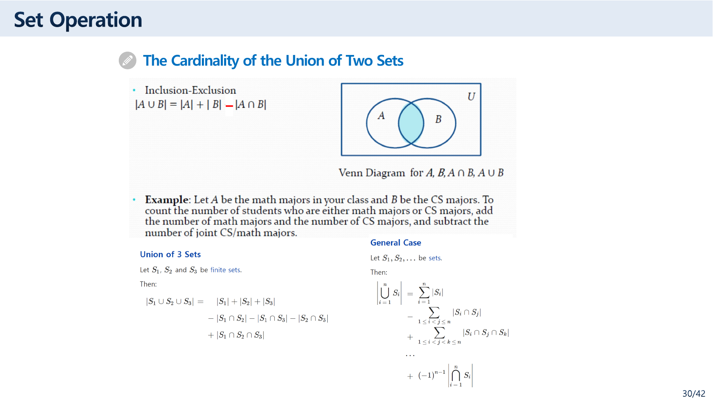
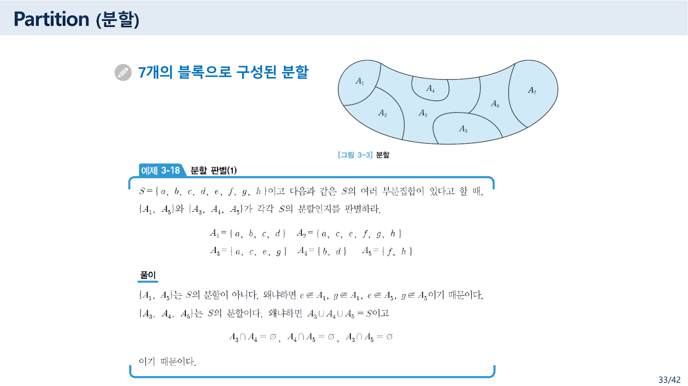
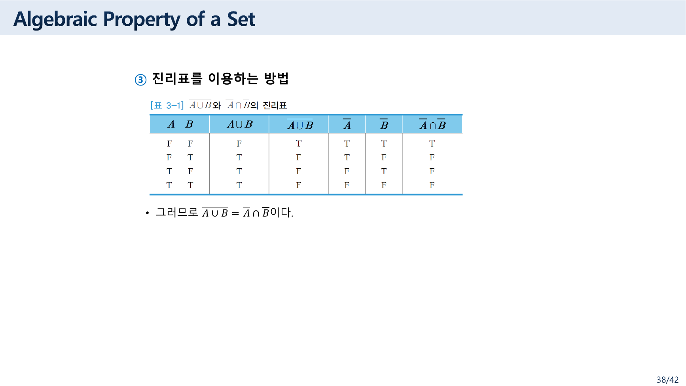
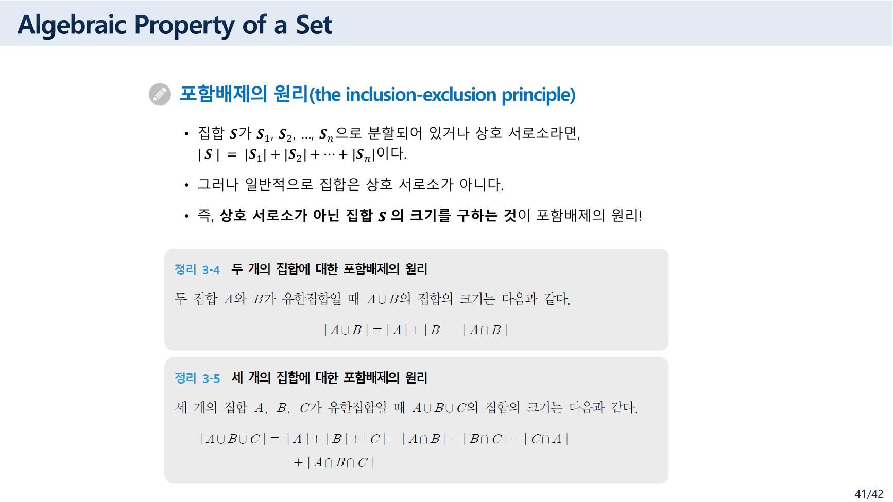
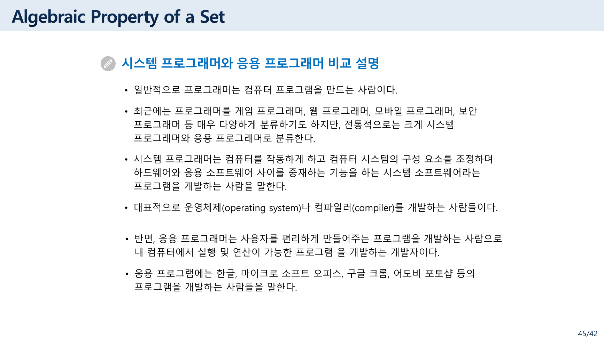

> [!abstract] 이 묶음이 실제로 하는 말
> 36~38쪽에서 이 자료가 이상한 일을 한다. **같은 법칙 하나를 세 번 증명한다.**
>
> 36쪽은 `두 개의 집합이 같다는 증명` 방법을 셋 제시하고 — 벤 다이어그램, 각 집합이 다른 집합의 부분집합임을 보이기, 그리고 **진리표** — 37·38쪽이 그중 둘을 실제로 수행한다. 대상은 매번 같다. 드모르간 법칙 $\overline{A \cup B} = \bar{A} \cap \bar{B}$ 하나다.
>
> 세 번째 방법이 이 문서의 척추다. **집합에 대한 명제를 진리표로 증명할 수 있다는 것**은 우연이 아니다. 원소 $x$ 하나를 잡고 *"$x \in A$인가"*를 물으면 그것은 참·거짓을 갖는 명제이고, $\cup$은 $\lor$, $\cap$은 $\land$, 여집합은 $\neg$로 그대로 옮겨 간다. 그러므로 **집합의 대수와 명제 논리의 대수는 같은 구조**이며, [02번 노트](./02.%20%ED%95%9C%20%ED%8C%8C%EC%9D%BC%EC%97%90%20%EC%B1%85%20%EB%91%90%20%EA%B6%8C%20%E2%80%94%20%EC%9D%98%EB%AF%B8%EB%A1%9C%20%EA%B0%80%EB%A5%B4%EC%B9%98%EB%8A%94%20%EB%85%BC%EB%A6%AC%EC%99%80%20%ED%8C%8C%EC%8B%B1%EC%9C%BC%EB%A1%9C%20%EA%B0%80%EB%A5%B4%EC%B9%98%EB%8A%94%20%EB%85%BC%EB%A6%AC.md)에서 채운 진리표가 여기서 그대로 재사용된다.
>
> 39쪽이 그 대칭에 **쌍대(duality)**라는 이름을 붙이면서 이 장이 완성된다. 그리고 마지막 41~42쪽의 포함배제의 원리가 [앞 문서](./05.%20%EC%A7%91%ED%95%A9%EC%9D%80%20%EC%88%9C%EC%84%9C%EC%99%80%20%EC%A4%91%EB%B3%B5%EC%9D%84%20%EB%B2%84%EB%A6%B0%EB%8B%A4%20%E2%80%94%20%EA%B7%B8%EB%A6%AC%EA%B3%A0%20%EB%B9%84%EC%96%B4%20%EC%9E%88%EB%8A%94%20%EC%B9%B8%20%ED%95%98%EB%82%98.md)의 질문 — *몇 개인가* — 로 되돌아온다.

---

## 연산 다섯 개, 그리고 겹침의 문제

28~34쪽이 연산을 정의한다. 모두 조건제시법 한 줄로 끝난다.

| 연산 | 기호 | 원본의 정의 |
| --- | --- | --- |
| 합집합 | $A \cup B$ | $\{x \mid x \in A$ 또는 $x \in B\}$ |
| 교집합 | $A \cap B$ | $\{x \mid x \in A$ 이고 $x \in B\}$ |
| 여집합 | $\bar{A}$ | (Complement) |
| 차집합 | $A - B$ | (Difference) |
| 대칭 차집합 | $A \oplus B$ | $\{x \mid (x \in A$ 이고 $x \notin B)$ 또는 $(x \in B$ 이고 $x \notin A)\} = \{x \mid x \in A-B \lor x \in B-A\}$ |

**정의문에 이미 논리 연산자가 들어 있다.** 합집합의 정의에 `또는`이, 교집합의 정의에 `이고`가, 대칭 차집합의 정의에 `∨`가 그대로 적혀 있다. 34쪽이 쓴 `A⊕B`라는 기호도 [02번 노트](./02.%20%ED%95%9C%20%ED%8C%8C%EC%9D%BC%EC%97%90%20%EC%B1%85%20%EB%91%90%20%EA%B6%8C%20%E2%80%94%20%EC%9D%98%EB%AF%B8%EB%A1%9C%20%EA%B0%80%EB%A5%B4%EC%B9%98%EB%8A%94%20%EB%85%BC%EB%A6%AC%EC%99%80%20%ED%8C%8C%EC%8B%B1%EC%9C%BC%EB%A1%9C%20%EA%B0%80%EB%A5%B4%EC%B9%98%EB%8A%94%20%EB%85%BC%EB%A6%AC.md) 11쪽의 배타적 논리합과 같은 기호다. 뒤에 나올 진리표 증명의 근거가 여기 이미 깔려 있다.



30쪽이 곧바로 **겹침** 문제를 던진다.

$$|A \cup B| = |A| + |B| - |A \cap B|$$

영어 슬라이드가 붙인 예가 직관적이다 — *"$A$를 수학 전공자, $B$를 컴퓨터과학 전공자라 하자. 둘 중 하나라도 전공한 학생 수를 세려면 수학 전공자 수와 CS 전공자 수를 더한 뒤 **양쪽을 다 전공한 학생 수를 빼야** 한다."* 두 번 세어진 사람을 한 번 빼는 것이다.

같은 쪽이 이미 일반형까지 낸다 — 세 집합의 경우와 $n$개 집합의 경우($(-1)^{n-1}$ 항까지). 여기서 이 자료의 구조가 다시 드러난다. **포함배제의 원리가 이 파일에 두 번 나온다** — 30쪽(영어 슬라이드)과 41~42쪽(한국어 `[정리 3-4]`·`[정리 3-5]`). 두 번째가 첫 번째보다 뒤에서 처음부터 다시 설명한다.

### 겹치지 않게 자르기 — 분할

31~33쪽이 반대 방향을 다룬다. 겹침을 빼는 대신 **애초에 겹치지 않게 자르는** 것이다.



> 즉, **분할이란 어떤 집합을 공집합이 아닌 상호 서로소인 부분 집합으로 나누는 것**을 말한다.

`[그림 3-3]`이 한 덩어리를 $A_1$부터 $A_7$까지 일곱 블록으로 자른 그림을 보인다. 그리고 `[예제 3-18]`이 판별을 시킨다.

$S = \{a, b, c, d, e, f, g, h\}$이고
$A_1 = \{a,b,c,d\}$, $A_2 = \{a,c,e,f,g,h\}$, $A_3 = \{a,c,e,g\}$, $A_4 = \{b,d\}$, $A_5 = \{f,h\}$일 때,

| 후보 | 원본의 판정 | 직접 확인 |
| --- | --- | --- |
| $\{A_1, A_5\}$ | 분할이 **아니다** | $A_1 \cup A_5 = \{a,b,c,d,f,h\}$ — $e$와 $g$가 빠진다 |
| $\{A_3, A_4, A_5\}$ | 분할이다 | $A_3 \cup A_4 \cup A_5 = \{a,c,e,g\} \cup \{b,d\} \cup \{f,h\} = S$이고, 셋이 서로소다 |

원본이 든 근거도 그대로다 — *"$e \notin A_1$, $g \notin A_1$, $e \notin A_5$, $g \notin A_5$이기 때문이다"*, 그리고 *"$A_3 \cap A_4 = \varnothing$, $A_4 \cap A_5 = \varnothing$, $A_3 \cap A_5 = \varnothing$이기 때문이다."* 두 조건을 모두 확인했고 일치한다.

분할이 되려면 **덮어야 하고**(합집합이 $S$) **겹치지 않아야 한다**(쌍마다 서로소). 첫 후보는 첫째 조건에서, 그리고 41쪽의 포함배제 원리 첫 줄이 왜 *"집합 $S$가 $S_1, \dots, S_n$으로 분할되어 있거나 상호 서로소라면 $|S| = |S_1| + \cdots + |S_n|$이다"*로 시작하는지가 여기서 설명된다 — **분할되어 있으면 빼야 할 겹침이 없으니 그냥 더하면 된다.**

---

## 같은 법칙, 세 번의 증명

36쪽이 방법 셋을 제시한다.

> ❖ 벤 다이어그램을 이용하는 방법
> ❖ 각 집합이 다른 집합의 부분집합이 되는 것을 보여주는 방법
> ❖ **진리표를 이용하여 $\overline{A \cup B} = \bar{A} \cap \bar{B}$를 증명하는 방법**

### 두 번째 — 양쪽 포함을 보이기


[앞 문서](./05.%20%EC%A7%91%ED%95%A9%EC%9D%80%20%EC%88%9C%EC%84%9C%EC%99%80%20%EC%A4%91%EB%B3%B5%EC%9D%84%20%EB%B2%84%EB%A6%B0%EB%8B%A4%20%E2%80%94%20%EA%B7%B8%EB%A6%AC%EA%B3%A0%20%EB%B9%84%EC%96%B4%20%EC%9E%88%EB%8A%94%20%EC%B9%B8%20%ED%95%98%EB%82%98.md)에서 본 `[정리 3-1]` (4)가 여기서 쓰인다 — *"$A = B$일 필요충분조건은 $A \subseteq B$이고 $B \subseteq A$이다."* 그래서 두 방향을 따로 증명한다.

**(1) $\overline{A \cup B} \subseteq \bar{A} \cap \bar{B}$**
$x \in \overline{A \cup B}$라 가정하자. 그러면 $x \notin A \cup B$이므로 $x \notin A$이고 $x \notin B$이다. (왜냐하면 만일 $x \in A$ 혹은 $x \in B$라면 $x \in A \cup B$이기 때문이다.) 또한 $x \in \bar{A}$이고 $x \in \bar{B}$이다. 그러므로 $x \in \bar{A} \cap \bar{B}$이다.

**(2) $\overline{A \cup B} \supseteq \bar{A} \cap \bar{B}$**
$x \in \bar{A} \cap \bar{B}$이라 가정하자. 그러면 $x \in \bar{A}$이고 $x \in \bar{B}$이므로 $x \notin A$이고 $x \notin B$이다. 또한 $x \notin A \cup B$이다. 그러므로 $x \in \overline{A \cup B}$이다.

두 방향이 **같은 문장을 반대로 읽은 것**이라는 점이 눈에 띈다. 괄호 안의 한 줄 — *"만일 $x \in A$ 혹은 $x \in B$라면 $x \in A \cup B$이기 때문이다"* — 가 실은 합집합의 정의를 그대로 뒤집은 것이고, 그것이 이 증명의 전부다.

> [!note] 추출한 텍스트만 보면 증명이 무너져 보인다
> 이 슬라이드는 윗줄(overline)로 여집합을 표시하는데, PDF에서 텍스트를 뽑으면 그 윗줄이 사라진다. 그러면 (1)의 첫 문장이 *"$x \in A \cup B$라 가정하자. 그러면 $x \notin A \cup B$이므로"*처럼 자기모순으로 읽힌다. **슬라이드는 정확하고, 추출이 기호를 잃은 것이다.** 이 자료를 텍스트로만 읽으면 증명 전체가 틀린 것처럼 보인다.

### 세 번째 — 진리표



`[표 3-1]`을 그대로 옮기고 직접 계산해 대조했다.

| $A$ | $B$ | $A \cup B$ | $\overline{A \cup B}$ | $\bar{A}$ | $\bar{B}$ | $\bar{A} \cap \bar{B}$ |
| --- | --- | --- | --- | --- | --- | --- |
| F | F | F | **T** | T | T | **T** |
| F | T | T | **F** | T | F | **F** |
| T | F | T | **F** | F | T | **F** |
| T | T | T | **F** | F | F | **F** |

네 줄 모두 원본과 일치하고, 넷째 열과 일곱째 열이 완전히 같다. 그러므로 $\overline{A \cup B} = \bar{A} \cap \bar{B}$다.

> [!important] 이 표가 성립한다는 사실 자체가 이 장의 결론이다
> 집합에 대한 명제를 왜 **참·거짓의 표**로 증명할 수 있는가. 원소 $x$ 하나를 고정하고 *"$x \in A$인가?"*를 물으면 그것은 참이거나 거짓인 명제이기 때문이다. 그러면 사전이 하나 생긴다.
>
> | 집합 | 논리 |
> | --- | --- |
> | $x \in A \cup B$ | $(x \in A) \lor (x \in B)$ |
> | $x \in A \cap B$ | $(x \in A) \land (x \in B)$ |
> | $x \in \bar{A}$ | $\neg(x \in A)$ |
> | $A = B$ | $(x \in A) \Leftrightarrow (x \in B)$가 항진 명제 |
>
> 두 집합이 같다는 것은 **모든 $x$에 대해 소속 여부가 일치한다**는 뜻이고, "모든 경우에 대해 일치"는 곧 진리표의 두 열이 같다는 뜻이다. 그래서 [02번 노트](./02.%20%ED%95%9C%20%ED%8C%8C%EC%9D%BC%EC%97%90%20%EC%B1%85%20%EB%91%90%20%EA%B6%8C%20%E2%80%94%20%EC%9D%98%EB%AF%B8%EB%A1%9C%20%EA%B0%80%EB%A5%B4%EC%B9%98%EB%8A%94%20%EB%85%BC%EB%A6%AC%EC%99%80%20%ED%8C%8C%EC%8B%B1%EC%9C%BC%EB%A1%9C%20%EA%B0%80%EB%A5%B4%EC%B9%98%EB%8A%94%20%EB%85%BC%EB%A6%AC.md)에서 만든 진리표 도구가 그대로 여기 쓰인다.
>
> 38쪽의 표는 $\neg(A \lor B) \equiv \neg A \land \neg B$라는 명제 논리의 드모르간 법칙과 **글자만 다르고 값이 완전히 같다.**

아래에서 집합의 항등식 하나를 골라 세 방법을 나란히 볼 수 있다.

```html preview h=640px
<div style="font-family:system-ui,-apple-system,sans-serif;padding:20px;color:var(--foreground)">
  <div style="font-size:13px;font-weight:600;margin-bottom:10px">39쪽 [정리 3-2]의 법칙을 골라 진리표로 확인한다</div>
  <div id="lawbtns" style="display:flex;gap:7px;flex-wrap:wrap;margin-bottom:16px"></div>

  <div style="display:flex;gap:16px;flex-wrap:wrap;align-items:flex-start">
    <div style="flex:1;min-width:280px;overflow-x:auto">
      <div id="tt3"></div>
    </div>
    <div style="flex:1;min-width:230px">
      <div style="padding:12px;border:1px solid var(--border);border-radius:8px;background:var(--card);font-size:12.5px;line-height:1.85">
        <div style="font-weight:700;margin-bottom:6px">논리로 옮기면</div>
        <div id="logic" style="font-family:ui-monospace,Menlo,monospace;font-size:13px;color:var(--chart-3)"></div>
      </div>
      <div id="dual" style="margin-top:12px;padding:12px;border:1px solid var(--chart-2);border-radius:8px;background:var(--card);font-size:12.5px;line-height:1.85"></div>
    </div>
  </div>

  <div id="verd3" style="margin-top:14px;padding:12px;border:1px solid var(--border);border-radius:8px;background:var(--card);text-align:center;font-size:15px;font-weight:700"></div>
</div>
<script>
(function(){
  var LAWS=[
    {n:'드 모르간 (38쪽)', l:'￢(A∪B)', r:'Ā∩B̄',
     lf:function(a,b){return !(a||b);}, rf:function(a,b){return (!a)&&(!b);},
     lg:'￢(p ∨ q) ≡ ￢p ∧ ￢q',
     du:'쌍대는 <b>￢(A∩B) = Ā∪B̄</b> — 39쪽 드 모르간 법칙의 나머지 한 줄이다.'},
    {n:'드 모르간 (쌍대)', l:'￢(A∩B)', r:'Ā∪B̄',
     lf:function(a,b){return !(a&&b);}, rf:function(a,b){return (!a)||(!b);},
     lg:'￢(p ∧ q) ≡ ￢p ∨ ￢q',
     du:'쌍대는 위의 <b>￢(A∪B) = Ā∩B̄</b> — 둘이 서로의 쌍대다.'},
    {n:'분배법칙', l:'A∩(B∪C)', r:'(A∩B)∪(A∩C)',
     lf:function(a,b,c){return a&&(b||c);}, rf:function(a,b,c){return (a&&b)||(a&&c);},
     lg:'p ∧ (q ∨ r) ≡ (p ∧ q) ∨ (p ∧ r)',
     du:'∪과 ∩을 바꾸면 <b>A∪(B∩C) = (A∪B)∩(A∪C)</b> — 39쪽이 두 줄을 나란히 싣는다.'},
    {n:'멱등법칙', l:'A∪A', r:'A',
     lf:function(a){return a||a;}, rf:function(a){return a;},
     lg:'p ∨ p ≡ p',
     du:'쌍대는 <b>A∩A = A</b>.'},
    {n:'여법칙', l:'A∪Ā', r:'U',
     lf:function(a){return a||(!a);}, rf:function(a){return true;},
     lg:'p ∨ ￢p ≡ T (배중률)',
     du:'∪↔∩, U↔∅ 을 바꾸면 <b>A∩Ā = ∅</b> — 논리의 모순율에 해당한다.'},
    {n:'흡수 아닌 예 · 항등법칙', l:'A∩U', r:'A',
     lf:function(a){return a&&true;}, rf:function(a){return a;},
     lg:'p ∧ T ≡ p',
     du:'쌍대는 <b>A∪∅ = A</b> — 39쪽 (7)의 네 줄이 서로 쌍을 이룬다.'}
  ];
  var B=document.getElementById('lawbtns'),T=document.getElementById('tt3'),
      L=document.getElementById('logic'),D=document.getElementById('dual'),V=document.getElementById('verd3');
  function show(i){
    var w=LAWS[i], n=w.lf.length;
    var names=['A','B','C'].slice(0,n), rows='', same=true;
    var combos=[];
    for(var m=0;m<Math.pow(2,n);m++){
      var v=[]; for(var k=0;k<n;k++) v.push(((m>>(n-1-k))&1)===0);   // T 먼저
      combos.push(v);
    }
    combos.forEach(function(v){
      var lv=w.lf.apply(null,v), rv=w.rf.apply(null,v);
      if(lv!==rv) same=false;
      rows+='<tr style="border-bottom:1px solid var(--border)">'
        + v.map(function(x){return '<td style="padding:6px 12px;text-align:center;font-family:ui-monospace,Menlo,monospace;opacity:.85">'+(x?'T':'F')+'</td>';}).join('')
        + '<td style="padding:6px 12px;text-align:center;font-family:ui-monospace,Menlo,monospace;font-weight:700;color:var(--chart-1)">'+(lv?'T':'F')+'</td>'
        + '<td style="padding:6px 12px;text-align:center;font-family:ui-monospace,Menlo,monospace;font-weight:700;color:var(--chart-2)">'+(rv?'T':'F')+'</td></tr>';
    });
    T.innerHTML='<table style="border-collapse:collapse;font-size:13.5px">'
      +'<thead><tr style="border-bottom:1px solid var(--border)">'
      + names.map(function(x){return '<th style="padding:7px 12px;font-weight:600">x ∈ '+x+'</th>';}).join('')
      + '<th style="padding:7px 12px;font-weight:600;color:var(--chart-1)">'+w.l+'</th>'
      + '<th style="padding:7px 12px;font-weight:600;color:var(--chart-2)">'+w.r+'</th>'
      + '</tr></thead><tbody>'+rows+'</tbody></table>';
    L.innerHTML=w.lg;
    D.innerHTML='<b style="color:var(--chart-2)">쌍대 (39쪽 정의 3-6)</b><br/>'+w.du;
    V.innerHTML = same
      ? '<span style="color:var(--chart-2)">두 열이 모든 줄에서 같다 — '+w.l+' = '+w.r+' 이다</span>'
      : '<span style="color:var(--chart-4)">두 열이 다르다</span>';
    Array.prototype.forEach.call(B.children,function(x,q){
      x.style.borderColor=(q===i)?'var(--chart-1)':'var(--border)';
      x.style.fontWeight=(q===i)?'700':'400';
    });
  }
  LAWS.forEach(function(w,i){
    var b=document.createElement('button'); b.textContent=w.n;
    b.style.cssText='padding:8px 13px;border-radius:6px;border:1px solid var(--border);'
      +'background:var(--card);color:var(--foreground);cursor:pointer;font-size:12.5px';
    b.addEventListener('click',function(){show(i);}); B.appendChild(b);
  });
  show(0);
})();
</script>
```

---

## 39쪽 — 대칭에 이름을 붙이다

![39쪽 — 쌍대(duality)와 [정리 3-2] 집합 연산에 대한 성질](../assets/ch03-p39-쌍대와-집합-연산의-법칙.png)

> **[정의 3-6] 쌍대** — 집합에 관한 명제에서 **합집합($\cup$)과 교집합($\cap$)**, **전체 집합($U$)과 공집합($\varnothing$)**을 서로 바꾼 명제를 원래 명제의 **쌍대(duality)**라고 한다.

그리고 `[정리 3-2]`가 법칙 일곱 묶음을 낸다. 원본 그대로 옮긴다.

| | 법칙 | 왼쪽 | 오른쪽 (쌍대) |
| --- | --- | --- | --- |
| (1) | 교환법칙 | $A \cup B = B \cup A$ | $A \cap B = B \cap A$ |
| (2) | 결합법칙 | $A \cup (B \cup C) = (A \cup B) \cup C$ | $A \cap (B \cap C) = (A \cap B) \cap C$ |
| (3) | 분배법칙 | $A \cap (B \cup C) = (A \cap B) \cup (A \cap C)$ | $A \cup (B \cap C) = (A \cup B) \cap (A \cup C)$ |
| (4) | 멱등법칙 | $A \cup A = A$ | $A \cap A = A$ |
| (5) | 여법칙 | $\bar{\bar{A}} = A$, $A \cup \bar{A} = U$, $\bar{\varnothing} = U$ | $A \cap \bar{A} = \varnothing$, $\bar{U} = \varnothing$ |
| (6) | 드 모르간 법칙 | $\overline{A \cup B} = \bar{A} \cap \bar{B}$ | $\overline{A \cap B} = \bar{A} \cup \bar{B}$ |
| (7) | 항등법칙 | $A \cup U = U$, $A \cup \varnothing = A$ | $A \cap U = A$, $A \cap \varnothing = \varnothing$ |

**표의 두 열이 정확히 서로의 쌍대다.** 이것이 쌍대성이 실제로 하는 일이다 — 한 줄을 증명하면 다른 줄은 공짜로 따라온다. 37·38쪽이 드모르간 법칙을 **한 줄만** 증명하고 넘어간 이유가 여기 있다.

> [!tip] 쌍대성이 왜 성립하는가
> 원본은 정의만 주고 이유를 말하지 않으므로 **보충**한다. 위의 사전으로 옮기면 $\cup \leftrightarrow \cap$은 논리에서 $\lor \leftrightarrow \land$이고, $U \leftrightarrow \varnothing$은 $T \leftrightarrow F$다. 그런데 논리 연산의 진리표에서 $\lor$와 $\land$는 **참·거짓을 통째로 뒤집으면 서로가 된다**($\neg(p \lor q) = \neg p \land \neg q$가 바로 그 사실이다). 그러므로 명제 하나가 항진이면 그 쌍대도 항진이고, 집합 항등식 하나가 참이면 쌍대도 참이다.
>
> 40쪽이 쌍대성의 한 사례에 이름을 붙여 준다 — *"합집합의 항등원은 $\varnothing$이고, 교집합의 항등원은 전체집합인 $U$가 된다."* 표 (7)의 $A \cup \varnothing = A$와 $A \cap U = A$가 그것이고, 둘은 서로의 쌍대다.

---

## 41~42쪽 — 다시 「몇 개인가」로



> 집합 $S$가 $S_1, S_2, \dots, S_n$으로 **분할되어 있거나 상호 서로소라면**, $|S| = |S_1| + |S_2| + \cdots + |S_n|$이다.
> 그러나 일반적으로 집합은 상호 서로소가 아니다.
> 즉, **상호 서로소가 아닌 집합 $S$의 크기를 구하는 것**이 포함배제의 원리!

$$\text{[정리 3-4]}\quad |A \cup B| = |A| + |B| - |A \cap B|$$
$$\text{[정리 3-5]}\quad |A \cup B \cup C| = |A| + |B| + |C| - |A \cap B| - |B \cap C| - |C \cap A| + |A \cap B \cap C|$$

42쪽이 `[정리 3-4]`로부터 `[정리 3-5]`를 유도하는 다섯 줄을 보인다. 마지막 두 줄이 핵심이다.

$$\begin{aligned}
&= |A| + |B| + |C| - |B \cap C| - |A \cap B| - |A \cap C| + |(A \cap B) \cap (A \cap C)| \\
&= |A| + |B| + |C| - |A \cap B| - |B \cap C| - |A \cap C| + |A \cap B \cap C| \quad (\text{교환법칙, 멱등법칙})
\end{aligned}$$

마지막 변형이 39쪽의 법칙을 쓴다. $(A \cap B) \cap (A \cap C)$에서 결합·교환법칙으로 $A \cap A \cap B \cap C$를 만들고, 멱등법칙 $A \cap A = A$로 $A \cap B \cap C$가 된다. **39쪽의 대수적 성질이 41쪽의 셈에 실제로 쓰이는 자리**이며, 이 자료에서 두 절이 만나는 유일한 지점이다.

30쪽의 영어 슬라이드가 이미 같은 내용을 냈다는 점을 다시 짚어 둔다. 이 자료는 포함배제의 원리를 **두 번**, 서로 다른 표기와 서로 다른 설명으로 낸다.

```mermaid
graph TD
  A["「몇 개인가」"] --> B["겹치지 않게 잘라 두었다면<br/>31~33쪽 · 분할"]
  A --> C["겹쳐 있다면<br/>30·41~42쪽 · 포함배제"]
  B --> B1["그냥 더한다<br/>|S| = |S₁| + ⋯ + |Sₙ|"]
  C --> C1["두 번 센 것을 뺀다<br/>|A∪B| = |A|+|B|−|A∩B|"]
  C1 --> C2["세 집합으로 확장<br/>42쪽 · 39쪽의 멱등법칙을 쓴다"]

  style A  fill:var(--card),stroke:var(--border),color:var(--foreground)
  style B  fill:var(--card),stroke:var(--chart-2),color:var(--foreground)
  style C  fill:var(--card),stroke:var(--chart-1),color:var(--foreground)
  style B1 fill:var(--card),stroke:var(--chart-2),color:var(--foreground)
  style C1 fill:var(--card),stroke:var(--chart-1),color:var(--foreground)
  style C2 fill:var(--card),stroke:var(--chart-1),color:var(--foreground)
```

---

## 원본에서 발견한 것



> [!caution] 43~45쪽 — 쪽 번호가 총 쪽수를 넘는다
> 슬라이드 오른쪽 아래의 쪽 표시가 `43/42`, `44/42`, `45/42`다. 이 파일은 실제로 46쪽인데 표시는 `/42`로 고정되어 있다. 슬라이드를 넷 더 넣고 총 쪽수만 갱신하지 않은 것이다.

<!-- -->
> [!caution] 45쪽 — 집합과 무관한 내용이 한 장 들어 있다
> `Algebraic Property of a Set`이라는 제목 아래 내용이 **시스템 프로그래머와 응용 프로그래머 비교 설명**이다. 운영체제·컴파일러를 만드는 사람과 한글·오피스·크롬·포토샵을 만드는 사람의 차이를 여덟 줄에 걸쳐 설명한다. 집합의 대수적 성질과 아무 관계가 없다.

<!-- -->
> [!note] 진리표의 줄 순서가 앞 자료와 반대다
> 38쪽 `[표 3-1]`은 `F F`부터 시작해 `T T`로 끝나는데, [02번 노트](./02.%20%ED%95%9C%20%ED%8C%8C%EC%9D%BC%EC%97%90%20%EC%B1%85%20%EB%91%90%20%EA%B6%8C%20%E2%80%94%20%EC%9D%98%EB%AF%B8%EB%A1%9C%20%EA%B0%80%EB%A5%B4%EC%B9%98%EB%8A%94%20%EB%85%BC%EB%A6%AC%EC%99%80%20%ED%8C%8C%EC%8B%B1%EC%9C%BC%EB%A1%9C%20%EA%B0%80%EB%A5%B4%EC%B9%98%EB%8A%94%20%EB%85%BC%EB%A6%AC.md)에서 본 「수학적 모델과 논리」 23쪽 `[표 2-7]`은 `T T`부터 시작한다. 같은 과목의 두 자료가 진리표 관습을 반대로 쓴다. 두 표를 나란히 비교할 때 줄이 어긋나 보인다.

<!-- -->
> [!note] 포함배제의 원리가 두 번 나온다
> 30쪽(영어 슬라이드, 일반형 $n$개까지)과 41~42쪽(한국어 `[정리 3-4]`·`[정리 3-5]`)이 같은 내용을 다룬다. [01번 노트](./01.%20%EC%B2%AB%20%EC%8B%9C%EA%B0%84%EC%97%90%20%EC%A0%95%EC%9D%98%20%EB%8C%80%EC%8B%A0%20%EC%82%AC%EC%A7%84%20%EB%91%90%20%EC%9E%A5%20%E2%80%94%20%EC%9D%B4%EC%82%B0%EC%9D%80%20%EB%8C%80%EC%83%81%EC%9D%B4%20%EC%95%84%EB%8B%88%EB%9D%BC%20%EA%B8%B0%EB%A1%9D%20%EB%B0%A9%EC%8B%9D%EC%9D%B4%EB%8B%A4.md)·[02번 노트](./02.%20%ED%95%9C%20%ED%8C%8C%EC%9D%BC%EC%97%90%20%EC%B1%85%20%EB%91%90%20%EA%B6%8C%20%E2%80%94%20%EC%9D%98%EB%AF%B8%EB%A1%9C%20%EA%B0%80%EB%A5%B4%EC%B9%98%EB%8A%94%20%EB%85%BC%EB%A6%AC%EC%99%80%20%ED%8C%8C%EC%8B%B1%EC%9C%BC%EB%A1%9C%20%EA%B0%80%EB%A5%B4%EC%B9%98%EB%8A%94%20%EB%85%BC%EB%A6%AC.md)에서 본 두 계열 슬라이드의 병존이 이 자료에서도 같은 방식으로 나타난다.

<!-- -->
> [!note] 37쪽의 증명은 텍스트 추출에서 무너진다
> 여집합의 윗줄이 사라져 *"$x \in A \cup B$라 가정하자. 그러면 $x \notin A \cup B$이므로"*처럼 읽힌다. 슬라이드 자체는 정확하다. 이 자료를 텍스트로만 다루는 도구에 넘길 때 주의해야 한다.

---

## 정리 — 이 묶음에서 가져갈 것

> [!tip] 세 문장 요약
>
> 1. **집합의 대수는 명제 논리의 대수와 같은 구조다.** 36쪽이 두 집합이 같음을 증명하는 세 번째 방법으로 **진리표**를 든 것이 그 증거이고, 38쪽 `[표 3-1]`은 명제 논리의 드모르간 법칙 표와 값이 완전히 같다. 원소 하나를 잡고 *"$x \in A$인가"*를 물으면 $\cup$은 $\lor$, $\cap$은 $\land$, 여집합은 $\neg$가 된다.
> 2. **39쪽의 쌍대성이 그 대칭에 이름을 붙인다.** $\cup \leftrightarrow \cap$, $U \leftrightarrow \varnothing$을 바꾼 명제가 쌍대이고, `[정리 3-2]`의 표는 두 열이 정확히 서로의 쌍대다. 그래서 37·38쪽이 드모르간 법칙을 한 줄만 증명하고 넘어갈 수 있다.
> 3. **셈의 문제는 겹침을 어떻게 다루느냐로 갈린다.** 미리 겹치지 않게 잘라 두었으면(분할) 그냥 더하고, 겹쳐 있으면 두 번 센 것을 뺀다(포함배제). 그리고 42쪽에서 세 집합으로 확장할 때 **39쪽의 멱등법칙이 실제로 쓰인다** — 이 자료의 대수 절과 셈 절이 만나는 유일한 지점이다.

이 문서로 「집합 및 집합 연산」 46쪽을 두 문서에 나누어 모두 다뤘다. 다음 자료는 「4 관계 및 함수」(125쪽)이며, [앞 문서](./05.%20%EC%A7%91%ED%95%A9%EC%9D%80%20%EC%88%9C%EC%84%9C%EC%99%80%20%EC%A4%91%EB%B3%B5%EC%9D%84%20%EB%B2%84%EB%A6%B0%EB%8B%A4%20%E2%80%94%20%EA%B7%B8%EB%A6%AC%EA%B3%A0%20%EB%B9%84%EC%96%B4%20%EC%9E%88%EB%8A%94%20%EC%B9%B8%20%ED%95%98%EB%82%98.md)에서 본 23쪽의 한 줄 — *"곱집합 $A \times B$의 부분집합 $R$를 $A$에서 $B$로의 관계라 한다"* — 에서 출발한다.

---

### 근거 자료

이 문서는 강의 원본 `집합 및 집합연산.pdf`의 28~46쪽에 근거한다. 인용한 슬라이드는 30쪽(합집합의 크기), 33쪽(분할과 예제 3-18), 37쪽(부분집합 양방향 증명), 38쪽(`[표 3-1]` 진리표), 39쪽(쌍대와 `[정리 3-2]`), 41쪽(포함배제의 원리), 45쪽(쪽 번호와 주제 이탈)이다.

원본의 값은 모두 확인했다 — 38쪽 `[표 3-1]`의 네 줄 일곱 열, 예제 3-18의 두 판정($A_1 \cup A_5$가 $e$·$g$를 빠뜨리고, $A_3 \cup A_4 \cup A_5 = S$이며 셋이 쌍마다 서로소), 39쪽 `[정리 3-2]` 일곱 묶음의 좌우 대응, 42쪽 유도의 마지막 두 줄에서 $(A \cap B) \cap (A \cap C) = A \cap B \cap C$가 되는 근거(결합·교환·멱등). 인터랙티브의 진리표는 실행 시점에 계산하며, 드모르간 항목이 38쪽 표와 같은 값을 낸다.

원본에 없는 보충은 세 가지이며 본문에 밝혔다 — 집합 연산과 논리 연산의 대응 사전, 쌍대성이 성립하는 이유, 그리고 37쪽 증명이 텍스트 추출에서 무너지는 현상에 대한 설명이다.
