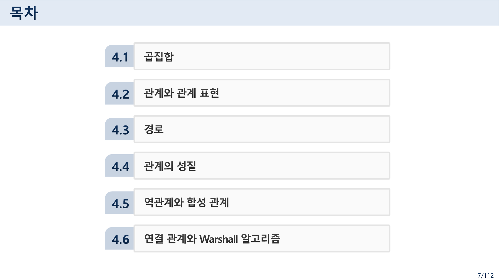
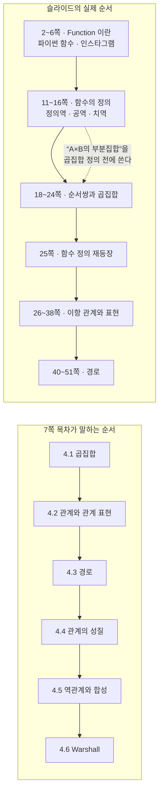
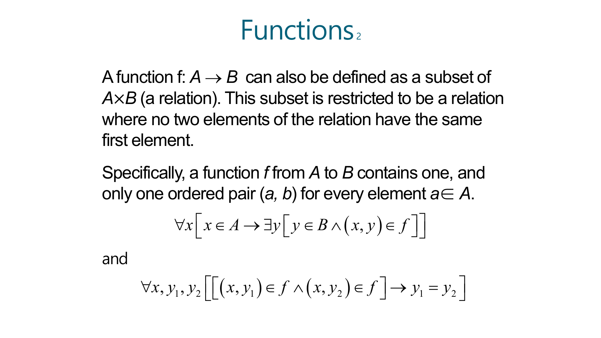
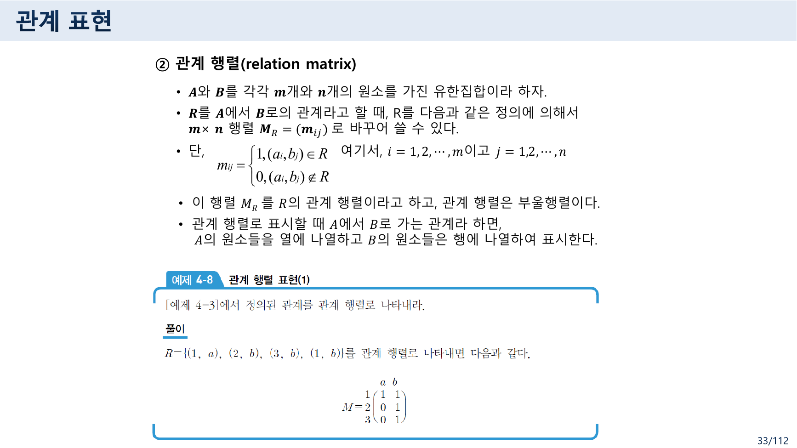
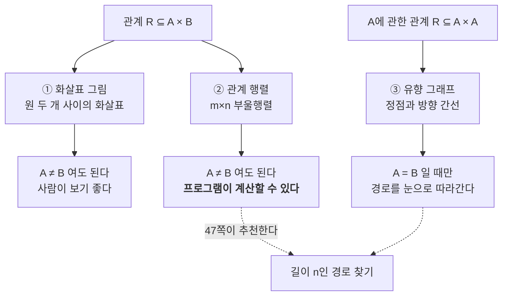
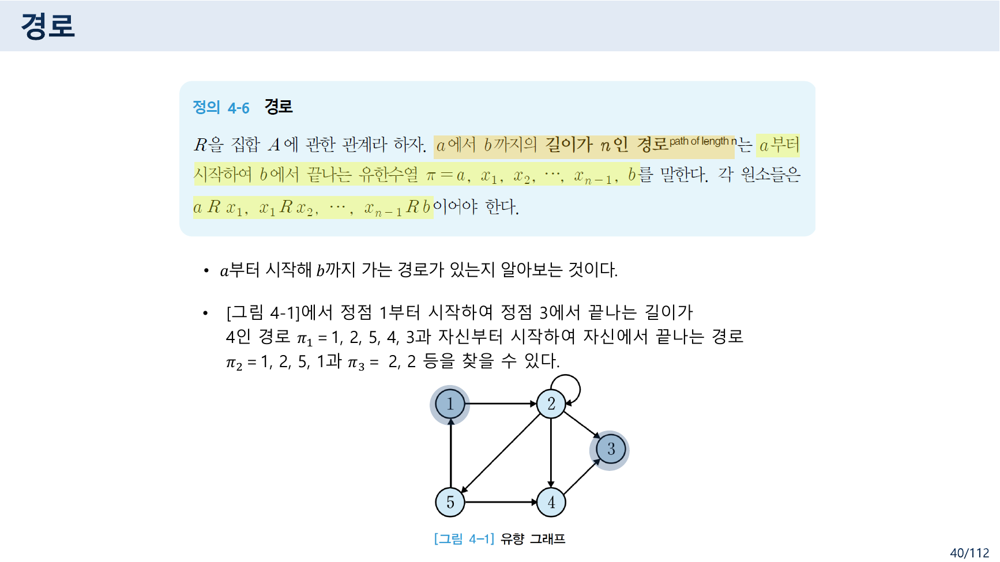
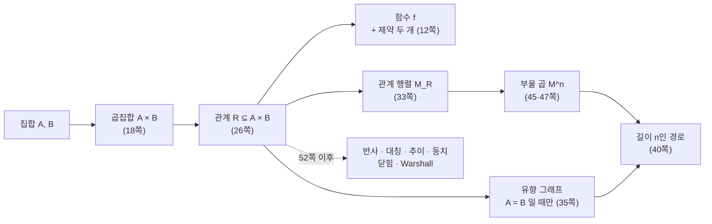

> [!abstract] 결론을 먼저 보여 주고 정의를 나중에 한다
> 7쪽의 목차는 이 장을 여섯 절로 나눈다 — **4.1 곱집합 → 4.2 관계와 관계 표현 → 4.3 경로 → 4.4 관계의 성질 → 4.5 역관계와 합성 관계 → 4.6 연결 관계와 Warshall 알고리즘**. 함수는 절 번호를 받지 못했다.
>
> 그런데 슬라이드는 그 순서로 가지 않는다. **2~6쪽이 Function의 사전적 뜻과 파이썬 함수와 인스타그램**으로 시작하고, 11~16쪽이 함수의 정의·정의역·공역·치역을 다룬 다음, **18쪽에서야 곱집합**이 나온다. 그리고 25쪽에서 함수의 정의를 한 번 더 띄운다.
>
> 이 역주행이 그냥 편집 실수는 아닌 듯하다. 9쪽 미리보기가 이렇게 적어 두었기 때문이다 — "**근현대 수학의 중요한 개념인 함수도 이항 관계의 특별한 경우이다.**" 아는 것(함수)에서 출발해 그것을 품는 더 큰 것(관계)으로 올라가겠다는 배치다. 다만 그 대가로 **12쪽이 아직 정의되지 않은 곱집합을 써서 함수를 정의한다.**
>
> 그래서 이 정리는 자료의 쪽 순서를 그대로 따라가되, **"지금 이 정의가 무엇에 기대고 있는가"** 를 매번 표시한다.

---

## 1. 목차와 실제 순서



두 순서를 나란히 놓으면 이렇다.



2쪽이 사전 뜻풀이로 시작한다.

> "an activity or purpose natural to or intended for a person or thing." — 사람이나 사물에 자연스럽거나 의도된 활동이나 목적
> "**a relationship or expression involving one or more variables.**" — 한 개 이상의 변수를 포함하는 관계나 표현
> Synonyms(동의어): behavior, task, activity, action

둘째 뜻풀이 안에 이미 **relationship** 이라는 낱말이 들어 있다. 5쪽이 파이썬 함수를, 6쪽이 인스타그램을 꺼내며 "**Main functions?**" 라고 묻는 것도 같은 흐름이다 — 일상어의 "기능"과 수학의 "함수"가 같은 단어라는 데서 출발한다.

8쪽이 관계를 예로 설명한다.

> "𝑥는 𝑦를 사랑한다."고 하면 𝑥와 𝑦는 관계가 있는 것이다. "𝑥는 𝑦의 형이다."도 𝑥와 𝑦는 관계가 있는 것이다. "𝑥는 𝑦보다 크다."고 하면 𝑥와 𝑦는 관계가 있는 것이다.
> 즉, 관계란 일반적으로 **원소와 원소 사이에 이루어지는 것**을 말한다.
> 두 집합에 있는 원소와 원소 관계를 **이항 관계**라 하고, 세 개의 집합에 있는 원소와 원소 사이의 관계를 **삼항 관계**라 한다.

9쪽이 왜 배우는지를 세 줄로 적는다.

> ❖ 페이스북과 같은 대부분의 소셜 네트워크 서비스에서는 사람들과의 관계를 이용하여 친구 추천이나 공통 성질을 가진 군 등 여러 가지 필요한 정보들을 추출하여 활용한다.
> ❖ 근현대 수학의 중요한 개념인 **함수도 이항 관계의 특별한 경우**이다. 우리가 컴퓨터에서 사용하고 있는 개념인 **부울 대수도 이항 관계**에서 많은 제약 조건을 만족하는 개념이다.
> ❖ **그래프도 관계들을 표현하기 위한 개념**이다.

세 줄이 이 장의 지도다 — 함수도, 부울 대수도, 그래프도 전부 관계의 특수한 경우다. 그렇다면 관계를 먼저 정의하는 편이 자연스러운데, 슬라이드는 반대로 간다.

---

## 2. 함수 — 정의가 두 번 나온다

11쪽과 25쪽에 **완전히 같은 정의**가 실린다.

> **Definition**: Let A and B be nonempty sets. A function `f` from A to B, denoted `f: A → B` is an assignment of each element of A to **exactly one** element of B. We write `f(a) = b` if `b` is the **unique** element of B assigned by the function `f` to the element `a` of A.
> • Functions are sometimes called **mappings** or **transformations**.

핵심은 `exactly one` 이다. A의 원소마다 B의 원소가 **하나 있어야 하고, 하나뿐이어야** 한다.

### 2.1 12쪽 — 곱집합 없이 곱집합을 쓴다



12쪽이 같은 정의를 집합의 말로 다시 쓴다.

> A function `f: A → B` can also be defined as **a subset of A × B (a relation)**. This subset is restricted to be a relation where **no two elements of the relation have the same first element**.
> Specifically, a function `f` from A to B contains one, and only one ordered pair `(a, b)` for every element `a ∈ A`.
> $$\forall x\, [\, x \in A \rightarrow \exists y\, [\, y \in B \wedge (x,y) \in f \,]\,]$$
> $$\forall x, y_1, y_2\, [\, (x,y_1) \in f \wedge (x,y_2) \in f \rightarrow y_1 = y_2 \,]$$

이 한 쪽이 이 자료 전체의 요약이다. **함수 = 곱집합의 부분집합 + 제약 조건 두 개.**

| 논리식 | 뜻 | 이것이 없으면 |
| --- | --- | --- |
| 첫째 줄 (∀x ∃y) | A의 **모든** 원소에 짝이 있다 | 정의역에 빈 자리가 생긴다 — 부분 함수 |
| 둘째 줄 (y₁ = y₂) | 짝은 **하나뿐**이다 | 한 입력에 출력이 여럿 — 그냥 관계 |

> [!caution] 순서의 문제 — 여기서 `A × B` 는 아직 정의되지 않았다
> 12쪽이 `A × B` 를 아무 설명 없이 쓴다. 곱집합의 정의는 **여섯 쪽 뒤인 18쪽**에 나온다. 괄호로 `(a relation)`이라 덧붙였지만 이항 관계의 정의도 26쪽에 가서야 나온다.
>
> 읽는 순서를 바꾸면 이 문제가 사라진다 — **18~24쪽(곱집합) → 26~27쪽(이항 관계) → 11~16쪽(함수)** 순으로 읽으면 모든 용어가 쓰이기 전에 정의된다. 7쪽 목차가 정확히 그 순서다.

```html preview h=620px
<div style="font-family:system-ui,-apple-system,sans-serif;padding:18px;color:var(--foreground)">
  <p style="font-size:12.5px;color:var(--muted-foreground);margin:0 0 12px">
    A = {a, b, c, d}, B = {y, z} 로 두고 <b>A×B의 부분집합</b>을 직접 만들어 보라(칸을 클릭). 12쪽의 두 조건을 실시간으로 판정한다.
    <b>원본 15쪽</b> 버튼은 그 슬라이드의 답(f(a)=z, d의 상 = z, f(A)={y,z}, z의 원상 = {a,c,d})과 같은 대응이다.
  </p>
  <div style="display:flex;gap:8px;flex-wrap:wrap;margin-bottom:13px">
    <button class="pb" data-k="orig"  style="cursor:pointer">원본 15쪽의 f</button>
    <button class="pb" data-k="multi" style="cursor:pointer">한 입력에 둘</button>
    <button class="pb" data-k="miss"  style="cursor:pointer">짝이 없는 원소</button>
    <button class="pb" data-k="clear" style="cursor:pointer">모두 지우기</button>
  </div>
  <div style="overflow-x:auto"><table id="grid" style="border-collapse:collapse;font-family:ui-monospace,monospace;font-size:14px"></table></div>
  <div id="chk" style="margin-top:14px;display:flex;flex-direction:column;gap:7px"></div>
  <div id="info" style="margin-top:11px;padding:11px 13px;background:var(--card);border:1px solid var(--border);border-radius:var(--radius);font-size:13px;line-height:1.8"></div>

  <script>
    var A = ['a','b','c','d'], B = ['y','z'];
    var PRE = {
      orig:  [['a','z'],['b','y'],['c','z'],['d','z']],
      multi: [['a','z'],['a','y'],['b','y'],['c','z'],['d','z']],
      miss:  [['a','z'],['c','z'],['d','z']],
      clear: []
    };
    var S = {};
    function key(x,y){return x+'|'+y;}
    function setPre(k){ S = {}; PRE[k].forEach(function(p){ S[key(p[0],p[1])] = true; }); draw(); }
    function draw() {
      var head = '<tr><th style="padding:6px 12px"></th>' + B.map(function (b) {
        return '<th style="padding:6px 14px;border-bottom:2px solid var(--border);color:var(--chart-3)">' + b + '</th>';
      }).join('') + '</tr>';
      var body = A.map(function (a) {
        return '<tr><th style="padding:6px 12px;text-align:right;color:var(--chart-2)">' + a + '</th>' +
          B.map(function (b) {
            var on = S[key(a,b)];
            return '<td class="cc" data-a="' + a + '" data-b="' + b + '" style="cursor:pointer;padding:0;border:1px solid var(--border)">' +
              '<div style="width:52px;height:38px;display:flex;align-items:center;justify-content:center;background:' +
              (on ? 'var(--chart-1)' : 'var(--card)') + ';color:' + (on ? 'var(--card)' : 'var(--muted-foreground)') +
              ';font-weight:700">' + (on ? '●' : '·') + '</div></td>';
          }).join('') + '</tr>';
      }).join('');
      document.getElementById('grid').innerHTML = head + body;

      var pairs = [];
      A.forEach(function (a) { B.forEach(function (b) { if (S[key(a,b)]) pairs.push([a,b]); }); });
      var noPartner = A.filter(function (a) { return !B.some(function (b) { return S[key(a,b)]; }); });
      var multi = A.filter(function (a) { return B.filter(function (b) { return S[key(a,b)]; }).length > 1; });
      function row(ok, t, d) {
        return '<div style="padding:9px 12px;border:1px solid var(--border);border-left:4px solid ' +
          (ok ? 'var(--chart-2)' : 'var(--chart-5)') + ';border-radius:var(--radius);background:var(--card)">' +
          '<span style="font-size:12.5px;font-weight:700;color:' + (ok ? 'var(--chart-2)' : 'var(--chart-5)') + '">' +
          (ok ? '만족' : '위반') + '</span> <span style="font-size:13px;font-weight:600">' + t + '</span>' +
          '<div style="font-size:12.5px;color:var(--muted-foreground);margin-top:3px">' + d + '</div></div>';
      }
      document.getElementById('chk').innerHTML =
        row(noPartner.length === 0, '∀x [x∈A → ∃y ((x,y)∈f)] — 모든 원소에 짝이 있다',
            noPartner.length ? '짝이 없는 원소: <b>' + noPartner.join(', ') + '</b>' : 'A의 네 원소 모두 짝이 있다.') +
        row(multi.length === 0, '(x,y₁)∈f ∧ (x,y₂)∈f → y₁ = y₂ — 짝이 하나뿐이다',
            multi.length ? '짝이 둘 이상인 원소: <b>' + multi.join(', ') + '</b>' : '중복된 첫 원소가 없다.');

      var isFn = noPartner.length === 0 && multi.length === 0;
      var range = B.filter(function (b) { return A.some(function (a) { return S[key(a,b)]; }); });
      document.getElementById('info').innerHTML =
        '<b>부분집합 f ⊆ A×B</b> = { ' + (pairs.length ? pairs.map(function (p) { return '(' + p[0] + ',' + p[1] + ')'; }).join(', ') : '') + ' }' +
        ' &nbsp;·&nbsp; |A×B| = ' + (A.length * B.length) + ' 중 ' + pairs.length + '개<br/>' +
        '<b style="color:' + (isFn ? 'var(--chart-2)' : 'var(--chart-5)') + '">' +
        (isFn ? '함수다.' : '함수가 아니다 — 관계일 뿐이다.') + '</b>' +
        (isFn ? ' 정의역 = A = {' + A.join(', ') + '}, 공역 = B = {' + B.join(', ') +
                '}, 치역 f(A) = {' + range.join(', ') + '}' : '') +
        '<br/><span style="font-size:12.5px;color:var(--muted-foreground)">13쪽 — “The <b>range</b> of f is the set of all images of points in A under f.” 치역은 공역의 부분집합이다.</span>';

      Array.prototype.forEach.call(document.getElementsByClassName('cc'), function (td) {
        td.onclick = function () {
          var k = key(td.getAttribute('data-a'), td.getAttribute('data-b'));
          if (S[k]) delete S[k]; else S[k] = true;
          draw();
        };
      });
    }
    Array.prototype.forEach.call(document.getElementsByClassName('pb'), function (b) {
      b.style.cssText = 'padding:6px 12px;font-size:12.5px;border:1px solid var(--border);border-radius:var(--radius);' +
        'background:var(--card);color:var(--foreground);cursor:pointer';
      b.onclick = function () { setPre(b.getAttribute('data-k')); };
    });
    setPre('orig');
  </script>
</div>
```

### 2.2 이름 여섯 개

13쪽이 용어를 한 번에 정리한다.

| 용어 | 원본 정의 |
| --- | --- |
| domain (정의역) | A |
| codomain (공역) | B |
| image (상) | `f(a) = b` 일 때 `b` 는 `a` 의 상 |
| preimage (원상) | 같은 상황에서 `a` 는 `b` 의 원상 |
| range (치역) | A의 모든 점의 상들의 집합, `f(A)` 로 표기 |
| 두 함수가 같다 | 정의역·공역이 같고 정의역의 각 원소를 같은 원소로 보낼 때 |

15쪽이 그림 하나로 여섯 용어를 모두 묻고 답을 적어 둔다.

> `f(a) = ?` → **z** · The image of `d` is ? → **z** · The domain of f is ? → **A** · The codomain of f is ? → **B**
> The preimage of `y` is ? → **b** · `f(A) = ?` → **{y, z}** · The preimage(s) of `z` is (are) ? → **{a, c, d}**

**상은 하나, 원상은 여럿일 수 있다**는 비대칭이 마지막 두 줄에 있다. `z` 의 원상이 셋(`a, c, d`)이어도 함수는 성립한다 — 금지된 것은 한 입력에 출력이 여럿인 경우뿐이다.

16쪽이 이것을 집합으로 확장한다.

> If `f : A → B` and `S` is a subset of A, then `f(S) = { f(s) | s ∈ S }`
> `f({a,b,c})` is ? → **{y, z}** &nbsp;&nbsp; `f({c,d})` is ? → **{z}**

14쪽은 함수를 명시하는 세 가지 방법을 든다 — **명시적 서술**(학생과 학점의 대응), **수식**(`f(x) = x + 1`), 그리고 **컴퓨터 프로그램**(n번째 피보나치 수를 만드는 자바 프로그램). 마지막 것이 이 강의가 함수를 보는 관점이다.

---

## 3. 순서쌍과 곱집합

18쪽이 드디어 곱집합을 정의한다.

> 순서쌍 (𝒂, 𝒃, 𝒄)는 세 개의 집합 각각에서 원소를 하나씩 뽑아 표현한 것으로 첫 번째 원소는 𝒂, 두 번째 원소는 𝒃, 세 번째 원소는 𝒄이다.
> 이런 순서쌍들로 이루어진 집합을 **곱집합**이라 한다. (Product set 또는 Cartesian product)

19쪽이 예를 든다 — `A = {x, y, z}`, `B = {1, 2, 3}` 의 곱집합 `A × B`. 원소는 3 × 3 = 9개다.

21쪽이 표기를 확장한다.

> 집합 `A₁, A₂, ⋯, Aₙ` 에 대해서 `a₁∈A₁, ⋯, aₙ∈Aₙ` 인 `n` 차의 순서쌍을 곱집합이라 하고, `A₁ × A₂ × ⋯ × Aₙ` 또는 $\prod_{i=1}^{n} A_i$ 로 나타낸다.
> 만약 집합 `A` 와 `B` 가 같은 집합이라면 `A × A` 대신에 **`A²`** 으로 쓰며, 마찬가지로 `A × A × ⋯ × A` 대신에 **`Aⁿ`** 을 쓴다. 예를 들면, `R³` 은 `R × R × R` 을 나타낸다.

`R³` 이라는 익숙한 기호가 곱집합의 특수한 경우라는 것 — 3차원 공간의 점 하나가 실수 세 개의 순서쌍이라는 사실이 여기서 설명된다.

23쪽에 데카르트(René Descartes, 1596–1650)의 초상이 붙어 있다. **Cartesian** 이 그의 이름에서 왔음을 보이는 배치다.

> [!tip] 앞 장과의 연결
> 집합 자료 14쪽의 여백 Note가 "집합의 원소들이 **순서를 가진다면?**"이라 물었고, 21·22쪽에서 그 답이 **튜플(Tuple)** 이었다. 여기 18쪽의 순서쌍이 그 튜플이고, 튜플들을 모은 것이 곱집합이다. 두 장이 그 한 줄로 이어진다.

---

## 4. 관계 = 곱집합의 부분집합

26·27쪽이 이항 관계를 정의하고 용어를 붙인다.

> • **𝑹의 정의역(domain)** : 𝑅에 속한 순서쌍에서 **모든 첫 번째 원소의 집합**이고 `Dom(𝑅)` 로 표기
> • **𝑹의 치역(range)** : 𝑅에 속한 순서쌍에서 **모든 두 번째 원소의 집합**이고 `Ran(𝑅)` 로 표기
> • **공변역(codomain)** : `B` 집합의 전체 원소로서 **치역은 공변역의 부분집합**이 된다.
> • `𝐴 = 𝐵` 이면, 즉 𝑅이 𝐴에서 𝐴로 가는 관계(`𝑅 ⊆ 𝐴 × 𝐴`)이면 𝑅는 **𝐴에 관한 관계**라 한다.
>
> • 이항 관계를 확장하면 세 집합 `𝑨, 𝑩, 𝑪` 에 대해 **삼항 관계** 𝑹은 `𝑨×𝑩×𝑪` 의 부분 집합들이고 … 이런 관계는 **𝒏항 관계**까지 확장 가능하다.
> • **우리는 이항 관계만을 다루므로 앞으로 관계라고 하면 이항 관계를 말한다.**

여기서 §2와 정확히 대응되는 구조가 보인다.

| | 관계 R | 함수 f |
| --- | --- | --- |
| 무엇인가 | `A × B` 의 부분집합 | `A × B` 의 부분집합 |
| 정의역 | `Dom(R)` — 실제로 등장한 첫 원소들 | `A` 전체 (모든 원소에 짝이 있어야 하므로) |
| 제약 | 없음 | 첫 원소가 겹치면 안 된다 |

**정의역의 뜻이 미묘하게 다르다.** 관계에서는 "실제로 쓰인 첫 원소들"이지만, 함수에서는 A 전체다. 함수의 첫째 조건(모든 원소에 짝)이 있어야 둘이 같아진다.

30·31쪽이 **항등 관계**를 다룬다 — `A` 에 관한 관계 중 자기 자신끼리만 짝지은 것으로, 다음 장(관계의 성질)에서 반사 관계의 기준이 된다.

---

## 5. 관계를 그리는 세 가지 방법

32쪽이 방법 셋을 나열한다.

> 집합 사이의 관계를 표시하는 방법 : **화살표 그림, 관계 행렬, 유향 그래프**
> ① **화살표 그림(arrow diagram)** — 서로 다른 두 개의 원에 각각 A의 원소와 B의 원소를 써넣은 후 `𝑎∈𝐴` 와 `𝑏∈𝐵` 가 관계가 있으면 `𝑎` 로부터 `𝑏` 로 화살표를 그리는 방법



33쪽이 두 번째를 정의한다.

> ② **관계 행렬(relation matrix)** — `𝑨` 와 `𝑩` 를 각각 `𝒎` 개와 `𝒏` 개의 원소를 가진 유한집합이라 하자. `𝑹` 를 `𝑨` 에서 `𝑩` 로의 관계라고 할 때, `𝑚 × 𝑛` 행렬 `𝑴_R = (𝑚ᵢⱼ)` 로 바꾸어 쓸 수 있다.
> $$m_{ij} = \begin{cases} 1, & (a_i, b_j) \in R \\ 0, & (a_i, b_j) \notin R \end{cases} \quad (i = 1,\dots,m,\ j = 1,\dots,n)$$
> • 이 행렬을 `R` 의 관계 행렬이라고 하고, 관계 행렬은 **부울행렬**이다.
> • 관계 행렬로 표시할 때 `A` 에서 `B` 로 가는 관계라 하면, **`A` 의 원소들을 열에 나열하고 `B` 의 원소들은 행에 나열하여 표시한다.**

마지막 줄이 나머지와 어긋난다.

> [!warning] 원본 오류 ① — 33쪽의 행과 열이 뒤바뀌었다
> 마지막 줄이 "A의 원소들을 **열**에, B의 원소들을 **행**에"라고 적었으나, **같은 쪽의 정의와 예제가 모두 그 반대**다.
>
> - 정의: `m_ij = 1 ⟺ (a_i, b_j) ∈ R` 이고 `i` 가 1부터 `m`(= |A|), `j` 가 1부터 `n`(= |B|)이다. 즉 **A가 행 인덱스, B가 열 인덱스**다.
> - 같은 쪽 [예제 4-8]: `R = {(1,a), (2,b), (3,b), (1,b)}` 의 행렬이 행 라벨 `1, 2, 3`(= A), 열 라벨 `a, b`(= B)로 그려져 있다.
>
> $$M = \begin{pmatrix} 1 & 1 \\ 0 & 1 \\ 0 & 1 \end{pmatrix} \quad \begin{matrix} \leftarrow (1,a),(1,b) \in R \\ \leftarrow (2,b) \in R \\ \leftarrow (3,b) \in R \end{matrix}$$
>
> 예제의 행렬 값 자체는 정확하다. **문장 한 줄만 행과 열을 바꿔 적었다.**

35쪽이 세 번째를 정의하고 중요한 제한을 붙인다.

> ③ **유향 그래프(Directed graph)** — `𝑅` 을 `𝐴` 에 관한 관계라 하자. `𝐴` 의 원소를 **정점(vertex)** 으로 표시하고, `𝑎ᵢ R 𝑎ⱼ` 이면 정점 `𝑎ᵢ` 에서 정점 `𝑎ⱼ` 까지의 **방향을 갖는 간선(edge)** 으로 묶는다.
> • 관계를 유향 그래프로 표시하기 위해서는 **`𝑨` 에서 `𝑨` 로 가는 관계인 `𝑨` 에 관한 관계일 때만 가능하다.**

마지막 줄이 세 방법을 가른다. **화살표 그림과 관계 행렬은 `A ≠ B` 여도 되지만, 유향 그래프는 `A = B` 일 때만 그릴 수 있다.** 정점 하나가 출발점이자 도착점 역할을 해야 하기 때문이다.



---

## 6. 경로 — 눈으로 따라가기와 행렬로 계산하기



40쪽이 경로를 정의하고 그림 4-1로 예를 든다.

> **[정의 4-6] 경로** — `R` 을 집합 `A` 에 관한 관계라 하자. `a` 에서 `b` 까지의 **길이가 `n` 인 경로**는 `a` 부터 시작하여 `b` 에서 끝나는 유한수열 `π = a, x₁, x₂, ⋯, x_{n−1}, b` 를 말한다. 각 원소들은 `a R x₁, x₁ R x₂, ⋯, x_{n−1} R b` 이어야 한다.
>
> • [그림 4-1]에서 정점 1부터 시작하여 정점 3에서 끝나는 길이가 4인 경로 `π₁ = 1, 2, 5, 4, 3` 과, 자신부터 시작하여 자신에서 끝나는 경로 `π₂ = 1, 2, 5, 1` 과 `π₃ = 2, 2` 등을 찾을 수 있다.

41쪽이 뒤의 둘에 이름을 준다 — "**순환(cycle)** : 경로 `π₂`, `π₃` 과 같이 자신에서 시작하여 자신에서 끝나는 경로".

그림 4-1의 간선을 하나씩 읽으면 관계가 이렇다.

$$R = \{(1,2),\ (2,2),\ (2,3),\ (2,4),\ (2,5),\ (5,1),\ (5,4),\ (4,3)\}$$

세 경로를 이 간선 목록으로 확인했다.

| 경로 | 필요한 간선 | 길이 | 결과 |
| --- | --- | --- | --- |
| π₁ = 1, 2, 5, 4, 3 | (1,2) (2,5) (5,4) (4,3) | 4 | 모두 존재 ✓ |
| π₂ = 1, 2, 5, 1 | (1,2) (2,5) (5,1) | 3 | 모두 존재 ✓ (순환) |
| π₃ = 2, 2 | (2,2) | 1 | 존재 ✓ (순환) |

**길이는 정점의 개수가 아니라 간선의 개수**다. π₁ 은 정점 다섯 개를 지나지만 길이는 4다.

### 6.1 행렬로 세는 편이 낫다

45쪽이 `Boolean Product` 를 꺼내고, 47쪽이 왜 그것을 쓰는지 적는다.

> • [예제 4-16]의 결과는 [예제 4-15]의 결과와 같다.
> • 이는 [정리 4-2]와 같이 **길이가 𝑛인 경로를 찾을 때 유향 그래프를 이용해서 찾을 수도 있고 관계 행렬을 이용해서 찾을 수 있기** 때문이다.
> • 유향 그래프를 이용할 때는 **사람이 하나씩 찾아가므로 복잡한 그래프에서는 잘못 계산**할 수도 있다.
> • 반면에, 관계 행렬을 이용하면 **프로그램을 이용해서 자동적으로 계산**할 수 있다. 따라서 **관계 행렬을 이용하는 방법을 추천한다.**

아래는 그림 4-1의 관계 행렬을 부울 곱으로 거듭제곱한 결과다. `M^n` 의 `(i, j)` 자리가 1이면 **`i` 에서 `j` 로 가는 길이 `n` 인 경로가 있다**는 뜻이다.

```html preview h=620px
<div style="font-family:system-ui,-apple-system,sans-serif;padding:18px;color:var(--foreground)">
  <div style="display:flex;gap:9px;flex-wrap:wrap;align-items:center;margin-bottom:13px">
    <span style="font-size:12.5px;font-weight:600">길이 n =</span>
    <button class="nb" data-n="1" style="cursor:pointer">1</button>
    <button class="nb" data-n="2" style="cursor:pointer">2</button>
    <button class="nb" data-n="3" style="cursor:pointer">3</button>
    <button class="nb" data-n="4" style="cursor:pointer">4</button>
    <button class="nb" data-n="5" style="cursor:pointer">5</button>
  </div>
  <div style="display:flex;gap:24px;flex-wrap:wrap;align-items:flex-start">
    <div>
      <div id="mlab" style="font-size:11.5px;font-weight:700;color:var(--muted-foreground);margin-bottom:6px"></div>
      <table id="mat" style="border-collapse:collapse;font-family:ui-monospace,monospace;font-size:14px"></table>
    </div>
    <div style="flex:1;min-width:250px">
      <div style="font-size:11.5px;font-weight:700;color:var(--muted-foreground);margin-bottom:6px">그림 4-1의 간선 (R)</div>
      <div style="font-family:ui-monospace,monospace;font-size:12.5px;line-height:1.9;color:var(--muted-foreground)">
        (1,2) (2,2) (2,3) (2,4)<br/>(2,5) (5,1) (5,4) (4,3)
      </div>
      <div id="pick" style="margin-top:14px;font-size:12.5px;line-height:1.8"></div>
    </div>
  </div>
  <div id="out" style="margin-top:14px;padding:12px 14px;background:var(--card);border:1px solid var(--border);border-radius:var(--radius);font-size:13px;line-height:1.85"></div>

  <script>
    var V = [1,2,3,4,5];
    var E = [[1,2],[2,2],[2,3],[2,4],[2,5],[5,1],[5,4],[4,3]];
    function has(i,j){ return E.some(function(e){return e[0]===i&&e[1]===j;}); }
    var M = V.map(function(i){ return V.map(function(j){ return has(i,j)?1:0; }); });
    function bmul(A,B){
      return A.map(function(row,i){
        return B[0].map(function(_,j){
          var s = 0;
          for (var k = 0; k < A.length; k++) if (A[i][k] && B[k][j]) s = 1;
          return s;
        });
      });
    }
    function power(n){ var P = M; for (var k = 1; k < n; k++) P = bmul(P, M); return P; }
    function findPaths(a,b,n){
      var out = [];
      (function rec(cur, seq){
        if (seq.length === n + 1) { if (cur === b) out.push(seq.slice()); return; }
        V.forEach(function (v) { if (has(cur, v)) { seq.push(v); rec(v, seq); seq.pop(); } });
      })(a, [a]);
      return out;
    }
    var n = 1, sel = null;
    function draw() {
      var P = power(n);
      document.getElementById('mlab').textContent = 'M^' + n + ' — 길이 ' + n + '인 경로의 존재';
      var head = '<tr><th style="padding:5px 10px;font-size:11px;color:var(--muted-foreground)">i \\ j</th>' +
        V.map(function(j){return '<th style="padding:5px 12px;border-bottom:2px solid var(--border);color:var(--chart-3)">'+j+'</th>';}).join('') + '</tr>';
      var body = V.map(function (i, ri) {
        return '<tr><th style="padding:5px 10px;border-right:2px solid var(--border);color:var(--chart-2)">' + i + '</th>' +
          V.map(function (j, ci) {
            var v = P[ri][ci], on = sel && sel[0] === i && sel[1] === j;
            return '<td class="mc" data-i="' + i + '" data-j="' + j + '" style="cursor:pointer;padding:0;border:1px solid var(--border)">' +
              '<div style="width:40px;height:34px;display:flex;align-items:center;justify-content:center;font-weight:700;background:' +
              (on ? 'var(--chart-1)' : 'var(--card)') + ';color:' +
              (on ? 'var(--card)' : (v ? 'var(--chart-2)' : 'var(--muted-foreground)')) + '">' + v + '</div></td>';
          }).join('') + '</tr>';
      }).join('');
      document.getElementById('mat').innerHTML = head + body;
      Array.prototype.forEach.call(document.getElementsByClassName('nb'), function (b) {
        var on = +b.getAttribute('data-n') === n;
        b.style.cssText = 'padding:5px 13px;font-size:13px;border:1px solid ' + (on ? 'var(--chart-1)' : 'var(--border)') +
          ';border-radius:var(--radius);background:var(--card);color:' + (on ? 'var(--chart-1)' : 'var(--foreground)') +
          ';font-weight:' + (on ? '700' : '400') + ';cursor:pointer';
        b.onclick = function () { n = +b.getAttribute('data-n'); sel = null; draw(); };
      });
      document.getElementById('pick').innerHTML = sel
        ? '' : '<span style="color:var(--muted-foreground)">행렬의 칸을 클릭하면 그 경로를 모두 나열한다.</span>';
      var msg = '3행이 전부 0인 것에 주목하라 — 정점 3에서 나가는 간선이 없으므로 <b>어떤 길이의 경로도 3에서 출발할 수 없다</b>.';
      if (sel) {
        var ps = findPaths(sel[0], sel[1], n);
        msg = '<b>' + sel[0] + ' → ' + sel[1] + ', 길이 ' + n + '</b> : ' +
          (ps.length ? ps.length + '개 — ' + ps.map(function (p) { return p.join(', '); }).join(' &nbsp;/&nbsp; ')
                     : '<span style="color:var(--chart-5)">없다</span>') +
          (n === 4 && sel[0] === 1 && sel[1] === 3 ? '<br/><span style="color:var(--muted-foreground);font-size:12.5px">' +
            '이 중 <b>1, 2, 5, 4, 3</b> 이 40쪽이 든 π₁ 이다.</span>' : '');
      }
      document.getElementById('out').innerHTML = msg;
      Array.prototype.forEach.call(document.getElementsByClassName('mc'), function (td) {
        td.onclick = function () { sel = [+td.getAttribute('data-i'), +td.getAttribute('data-j')]; draw(); };
      });
    }
    draw();
  </script>
</div>
```

`n = 4` 로 두고 `(1, 3)` 칸을 누르면 길이 4인 경로가 셋 나온다 — `1,2,2,2,3` / `1,2,2,4,3` / **`1,2,5,4,3`**. 마지막 것이 40쪽의 `π₁` 이다. **눈으로는 하나만 찾았지만 행렬은 셋을 다 찾는다** — 47쪽이 관계 행렬을 추천한 이유가 이것이다.

행렬을 보면 **3행이 언제나 0**이다. 정점 3에서 나가는 간선이 없기 때문이다. 반대로 3열은 `n` 이 커질수록 채워진다 — 3으로 들어가는 길은 많다.

### 6.2 경로를 잇고 뒤집기

48·50쪽이 경로에 두 연산을 정의한다.

> **𝝅₁과 𝝅₂의 합성(composition)** — `a` 에서 시작해 `b` 에서 끝나는 길이 `n` 인 경로 `π₁` 과 `b` 에서 시작해 `c` 에서 끝나는 길이 `m` 인 경로 `π₂` 가 있을 때, 둘의 합성은 길이가 **`m + n`** 인 통로 `a, x₁, …, x_{n−1}, b, y₁, …, y_{m−1}, c` 이고 `π₁ · π₂` 로 표기한다.
> • `π₁` 과 `π₂` 의 합성이 되기 위해서는 **`π₁` 의 끝나는 정점과 `π₂` 의 시작 정점이 같을 때만** 가능하다.
>
> **역경로(inverse path)** — `π = a, x₁, x₂, …, x_{n−1}, b` 를 길이 `n` 인 경로라 하자. 역경로를 `π⁻¹` 로 쓰고 `π⁻¹ = b, x_{n−1}, …, x₂, x₁, a` 로 정의한다.

합성의 조건("끝점 = 시작점")이 **부울 곱의 정의와 정확히 같다.** `M^n · M^m` 을 계산할 때 `(i,k)` 와 `(k,j)` 를 이어 붙이는 그 `k` 가 바로 합쳐지는 정점이다. 그래서 `M^{n+m} = M^n · M^m` 이 성립한다 — §6.1의 계산기가 `n` 을 하나씩 올릴 때 하는 일이 곧 길이 1짜리 경로를 계속 합성하는 것이다.

> [!caution] 역경로가 늘 경로는 아니다
> 50쪽의 역경로 정의는 **정점의 나열을 뒤집는 것**이다. 그런데 이 장의 관계는 유향 그래프이므로, `π⁻¹` 의 각 단계가 `R` 안의 간선이라는 보장이 없다. 그림 4-1에서 `π₃ = 2, 2` 의 역경로는 다시 `2, 2` 라 문제없지만, `π₂ = 1, 2, 5, 1` 의 역경로 `1, 5, 2, 1` 은 `(1,5)`·`(5,2)` 간선이 없어 `R` 안의 경로가 아니다. 원본은 이 점을 언급하지 않는다 — 역관계 `R⁻¹` 안에서의 경로로 읽어야 뜻이 통한다(76쪽 이후에서 역관계가 정의된다). 이 문단은 원본에 없는 보충이다.

---

## 7. 여기까지가 절반이다

51쪽에서 절 표지가 나오고 52쪽부터 **4.4 관계의 성질**(반사·대칭·추이·동치)이 시작된다. 125쪽 중 51쪽까지가 이 문서의 범위다.

| 쪽 | 내용 | 절 |
| --- | --- | --- |
| 2–16 | 함수 — 뜻풀이부터 상·원상까지 | (절 밖) |
| 18–24 | 순서쌍과 곱집합 | 4.1 |
| 25–38 | 이항 관계, 항등 관계, 표현 세 가지 | 4.2 |
| 40–50 | 경로, 순환, 부울 곱, 합성, 역경로 | 4.3 |
| 52–125 | 관계의 성질 · 역관계와 합성 · 닫힘 · Warshall | 4.4~4.6 |

이 51쪽이 세운 것은 문장 하나로 줄어든다 — **관계는 곱집합의 부분집합이고, 함수는 그중 제약 두 개를 만족하는 것이며, 부분집합이므로 행렬로 적을 수 있고, 행렬로 적었으므로 곱해서 경로를 셀 수 있다.** 뒤의 74쪽은 그 부분집합에 조건을 더 얹어 가는 과정이다.



---

## 이어지는 문서

- [05. 집합 — 정의 네 줄 중 하나는 존재하지 않는 집합이다](<./05. 집합 — 정의 네 줄 중 하나는 존재하지 않는 집합이다.md>) — 14쪽의 "원소가 순서를 가진다면?"이 §3의 순서쌍이다
- [03. 술어 논리와 논리적 추론 — 같은 규칙을 두 벌로 가르치는 자료](<./03. 술어 논리와 논리적 추론 — 같은 규칙을 두 벌로 가르치는 자료.md>) — §2.1의 함수 조건 두 개가 ∀ · ∃ 논리식으로 적혀 있다
- [01. 이산수학 소개 — 강의계획서가 약속한 것과 자료가 남긴 것](<./01. 이산수학 소개 — 강의계획서가 약속한 것과 자료가 남긴 것.md>) — 강의계획의 5주(관계)와 11주(함수)가 이 한 파일에 함께 들어 있다

관련 과목: [01/data-structures](../../../01_programming-foundations/data-structures/README.md)(그래프의 인접 행렬), [06/algorithm-design-analysis](../../../06_algorithms-graphics/algorithm-design-analysis/README.md)(부울 곱과 플로이드-워셜), [05/database-systems](../../../05_software-engineering/database-systems/README.md)(관계형 모델 — 테이블이 곧 곱집합의 부분집합이다).

---

## 근거 자료

`ComputerScience/02_math-theory/discrete-mathematics/sources/4 관계 및 함수.pdf` 의 1~51쪽(전체 125쪽 중).

| 쪽 | 내용 | 이 문서에서 다룬 곳 |
| --- | --- | --- |
| 2–6 | Function의 뜻풀이, 파이썬 함수, 인스타그램 | §1 |
| 7 | 목차 4.1~4.6 | §1 (슬라이드 인용) |
| 8–10 | 미리보기 — 관계란, 응용 분야 | §1 |
| 11–16 · 25 | 함수의 정의(두 번), 상·원상·치역, Questions | §2 (슬라이드 인용) |
| 18–24 | 순서쌍, 곱집합, n차 확장, 데카르트 | §3 |
| 26–31 | 이항 관계, n항 관계, 항등 관계 | §4 |
| 32–38 | 화살표 그림 · 관계 행렬 · 유향 그래프 | §5 (슬라이드 인용) |
| 40–50 | 경로, 순환, 부울 곱, 합성, 역경로 | §6 (슬라이드 인용) |

§6의 간선 목록은 40쪽 [그림 4-1]을 300dpi로 확대해 화살표 방향을 하나씩 읽어 만들었고, 그 목록으로 원본이 든 세 경로(π₁, π₂, π₃)가 모두 성립함을 확인했다. 부울 거듭제곱 `M¹`~`M⁵` 와 각 칸의 경로 나열도 같은 목록에서 계산한 것이다. §5의 관계 행렬 값은 33쪽 [예제 4-8]의 `R = {(1,a),(2,b),(3,b),(1,b)}` 로 직접 만들어 슬라이드의 행렬과 일치함을 확인했다. 원본에 없는 내용은 §6.2의 역경로 주의 문단이며, 본문에 표시했다.
