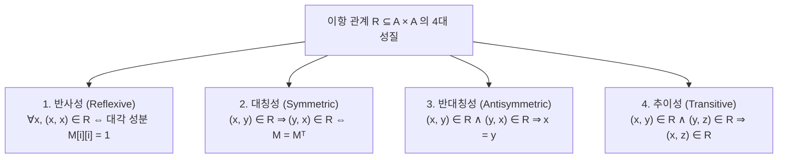
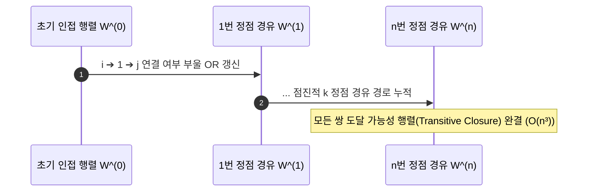
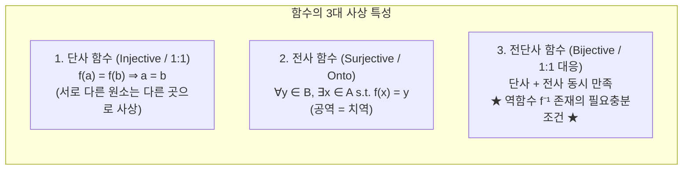

> [!abstract] 핵심 요약
> **이항 관계(Binary Relation, $R \subseteq A \times B$)**는 객체 간의 상호작용을 수학적으로 정의하는 구조이다.
> 반사성·대칭성·추이성을 만족하는 **동치 관계(Equivalence Relation)**는 집합을 서로소인 동치류로 완벽히 **분할(Partition)**하며, 반사성·반대칭성·추이성을 만족하는 **부분 순서 관계(Partial Order, Poset)**는 계층 순서를 규정한다. 또한 **워셜(Warshall) 알고리즘**은 $O(n^3)$ 부울 행렬 연산으로 도달 가능성인 추이 폐포(Transitive Closure)를 계산한다.

---

## 1. 관계의 4대 핵심 성질과 관계 행렬($M_R$) 조건



| 특수 관계 유형 | 필수 충족 성질 | 대표적 실세계 사례 |
| :-- | :-- | :-- |
| **동치 관계 (Equivalence Relation)** | **반사성 + 대칭성 + 추이성** | 모듈로 합동($a \equiv b \pmod m$), 파일 해시 일치 |
| **부분 순서 관계 (Partial Order / Poset)** | **반사성 + 반대칭성 + 추이성** | 집합 포함 관계($A \subseteq B$), 정수 나누어떨어짐($a \mid b$) |

---

## 2. 워셜(Warshall) 추이 폐포(Transitive Closure) 알고리즘

정점 $k$를 경유하는 경로를 순차적으로 고려하여 도달 가능 행렬 $W$를 갱신한다:

$$W^{(k)}[i][j] = W^{(k-1)}[i][j] \lor \left( W^{(k-1)}[i][k] \land W^{(k-1)}[k][j] \right) \quad (1 \le k \le n)$$



---

## 3. 함수의 3대 사상 분류 (Mappings)



---

## 4. 실시간 4x4 관계 행렬 성질 판별 및 워셜 추이 폐포 시뮬레이터

```html preview
<div style="font-family:system-ui,-apple-system,sans-serif;padding:20px;background:var(--card);color:var(--card-foreground);border:1px solid var(--border);border-radius:var(--radius)">
  <div style="font-size:16px;font-weight:700;margin-bottom:14px;color:var(--primary);display:flex;align-items:center;gap:8px">
    <span>📐 4x4 관계 행렬 성질 판별기 & 워셜(Warshall) 추이 폐포 엔진</span>
  </div>

  <div style="display:grid;grid-template-columns:1fr 1fr;gap:14px;margin-bottom:14px">
    <div style="padding:10px;background:var(--background);border:1px solid var(--border);border-radius:var(--radius)">
      <div style="font-size:12px;font-weight:700;margin-bottom:8px;color:var(--chart-1)">관계 행렬 M_R (클릭하여 0/1 토글):</div>
      <div id="matrixGrid" style="display:grid;grid-template-columns:repeat(4, 1fr);gap:4px;max-width:200px"></div>
    </div>

    <div style="padding:10px;background:var(--background);border:1px solid var(--border);border-radius:var(--radius)">
      <div style="font-size:12px;font-weight:700;margin-bottom:8px;color:var(--chart-2)">성질 실시간 판정:</div>
      <div id="propList" style="font-size:11px;line-height:1.8"></div>
    </div>
  </div>

  <div style="padding:10px;background:var(--background);border:1px solid var(--primary);border-radius:var(--radius)">
    <div style="display:flex;justify-content:space-between;align-items:center;margin-bottom:6px">
      <span style="font-size:12px;font-weight:700;color:var(--primary)">워셜 알고리즘 계산 결과 (추이 폐포 Transitive Closure):</span>
      <button id="runWarshallBtn" style="padding:4px 10px;background:var(--primary);color:#fff;border:none;border-radius:var(--radius);font-size:11px;font-weight:700;cursor:pointer">폐포 계산</button>
    </div>
    <div id="closureViz" style="font-family:monospace;font-size:12px;font-weight:700;color:var(--chart-3)"></div>
  </div>

  <script>
    var N = 4;
    var M = [
      [1, 1, 0, 0],
      [0, 1, 1, 0],
      [0, 0, 1, 1],
      [0, 0, 0, 1]
    ];

    var gCont = document.getElementById('matrixGrid');
    var pCont = document.getElementById('propList');
    var cCont = document.getElementById('closureViz');

    function renderMatrix() {
      gCont.innerHTML = '';
      for (var r = 0; r < N; r++) {
        for (var c = 0; c < N; c++) {
          var btn = document.createElement('button');
          btn.style.cssText = 'height:36px;border-radius:4px;border:1px solid var(--border);font-weight:700;cursor:pointer;font-size:13px';
          btn.style.background = (M[r][c] === 1) ? 'var(--primary)' : 'var(--card)';
          btn.style.color = (M[r][c] === 1) ? '#fff' : 'var(--foreground)';
          btn.textContent = M[r][c];

          (function(row, col) {
            btn.onclick = function() {
              M[row][col] = (M[row][col] === 1) ? 0 : 1;
              renderMatrix();
              analyze();
            };
          })(r, c);

          gCont.appendChild(btn);
        }
      }
    }

    function analyze() {
      var isRef = true;
      var isSym = true;
      var isAntisym = true;

      for (var i = 0; i < N; i++) {
        if (M[i][i] !== 1) isRef = false;
        for (var j = 0; j < N; j++) {
          if (M[i][j] !== M[j][i]) isSym = false;
          if (i !== j && M[i][j] === 1 && M[j][i] === 1) isAntisym = false;
        }
      }

      var html = "";
      html += "• 반사성 (Reflexive): <b>" + (isRef ? "<span style='color:var(--chart-2)'>YES</span>" : "<span style='color:var(--destructive)'>NO</span>") + "</b><br/>";
      html += "• 대칭성 (Symmetric): <b>" + (isSym ? "<span style='color:var(--chart-2)'>YES</span>" : "<span style='color:var(--destructive)'>NO</span>") + "</b><br/>";
      html += "• 반대칭성 (Antisymmetric): <b>" + (isAntisym ? "<span style='color:var(--chart-2)'>YES</span>" : "<span style='color:var(--destructive)'>NO</span>") + "</b><br/>";

      if (isRef && isSym) html += "<div style='margin-top:4px;color:var(--chart-1);font-weight:700'>➔ 동치 관계(Equivalence) 후보</div>";
      if (isRef && isAntisym) html += "<div style='margin-top:4px;color:var(--chart-3);font-weight:700'>➔ 부분 순서 관계(Poset) 후보</div>";

      pCont.innerHTML = html;
      runWarshall();
    }

    function runWarshall() {
      var W = JSON.parse(JSON.stringify(M));
      for (var k = 0; k < N; k++) {
        for (var i = 0; i < N; i++) {
          for (var j = 0; j < N; j++) {
            W[i][j] = W[i][j] || (W[i][k] && W[k][j]) ? 1 : 0;
          }
        }
      }
      var out = [];
      for (var i = 0; i < N; i++) {
        out.push("[" + W[i].join(", ") + "]");
      }
      cCont.textContent = out.join("  |  ");
    }

    document.getElementById('runWarshallBtn').addEventListener('click', runWarshall);

    renderMatrix();
    analyze();
  </script>
</div>
```
