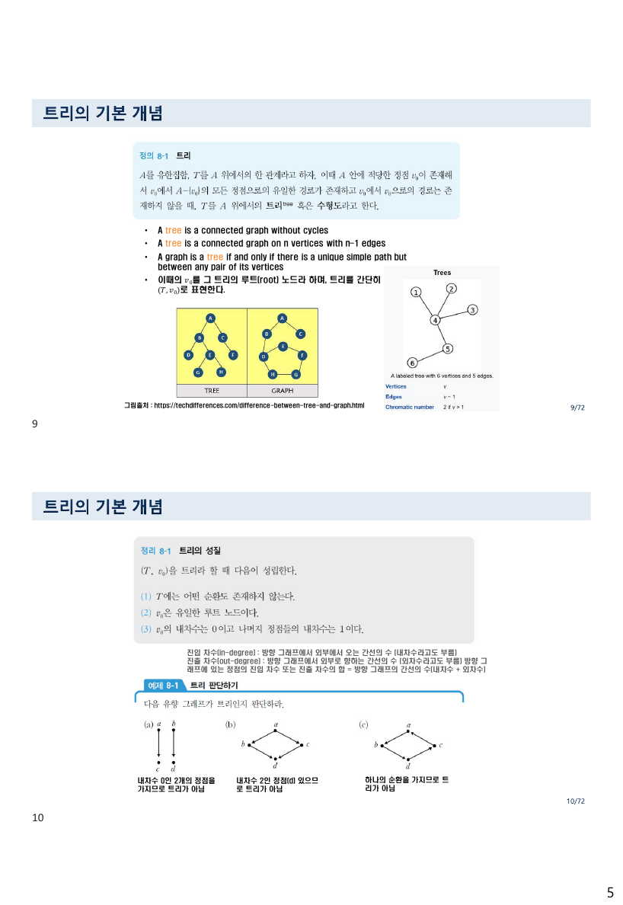
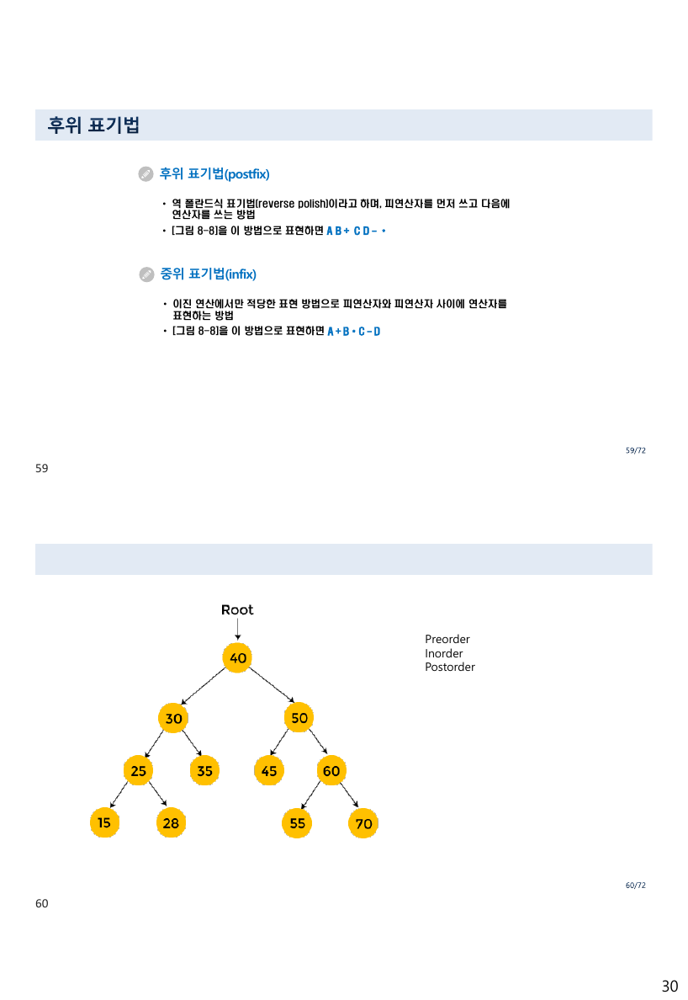
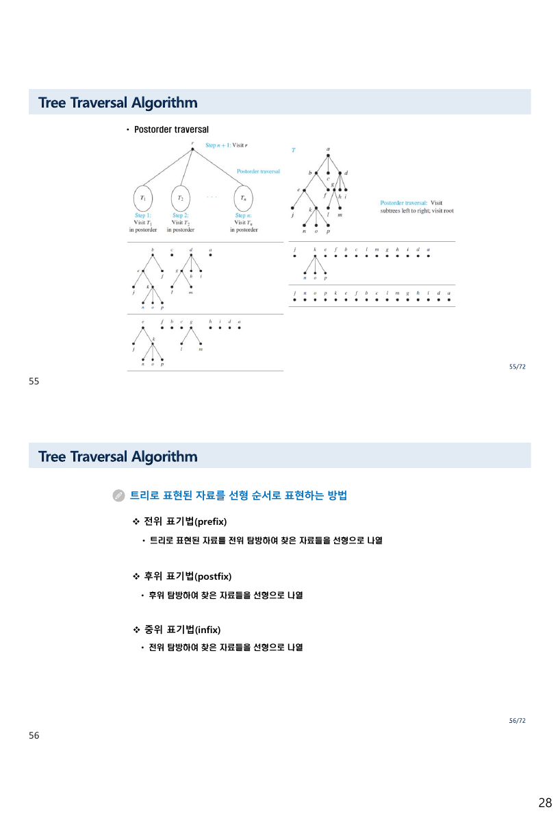
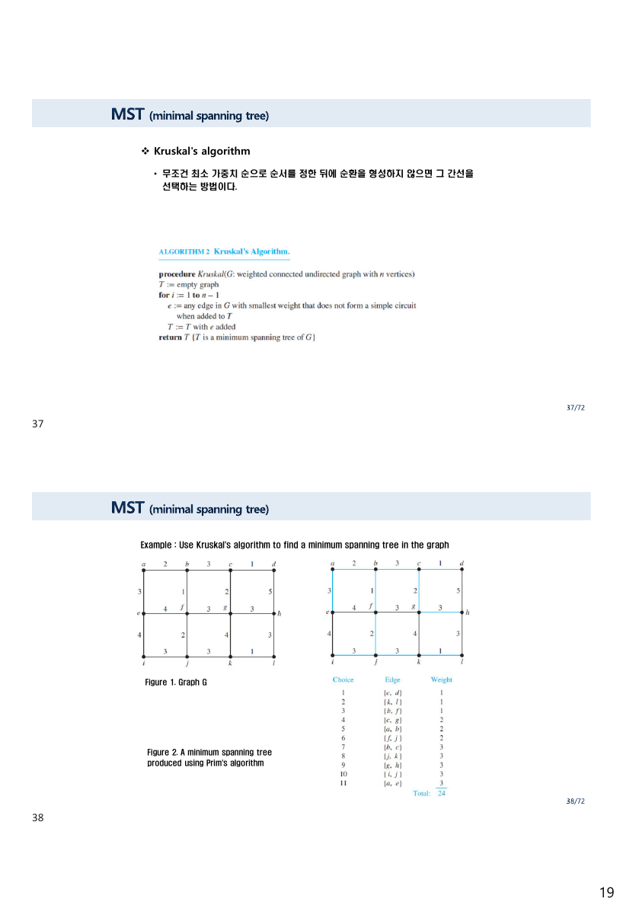
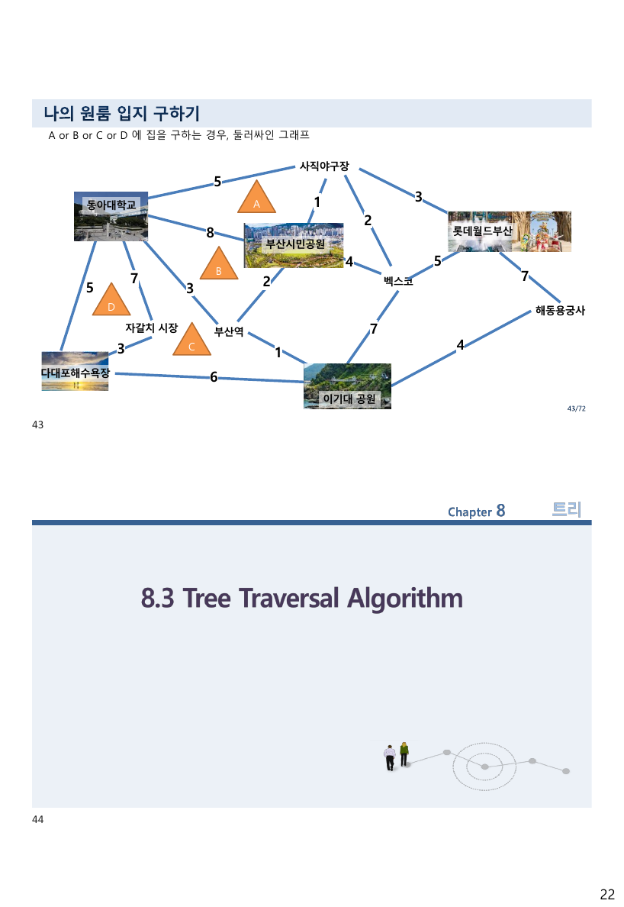
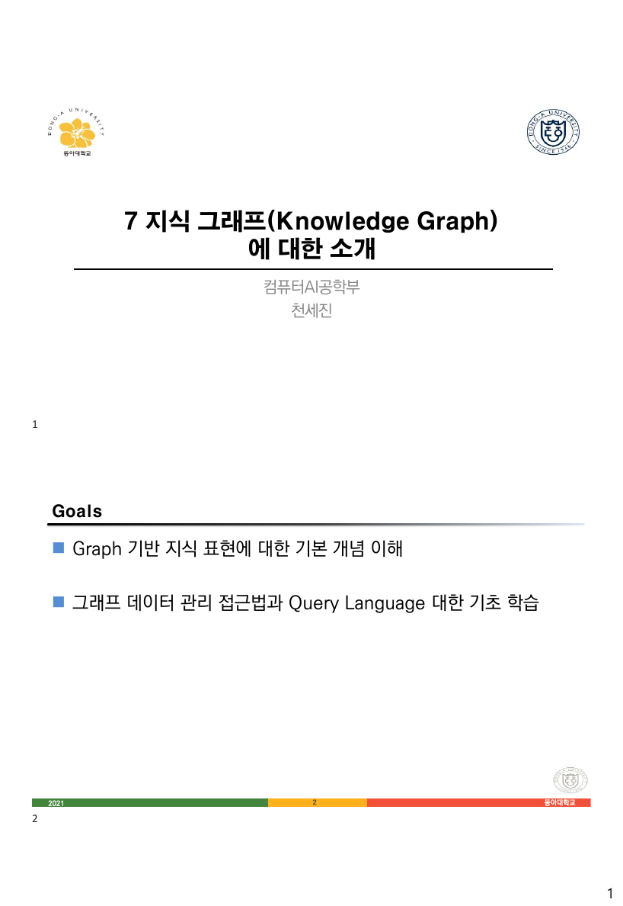
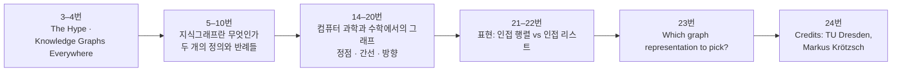
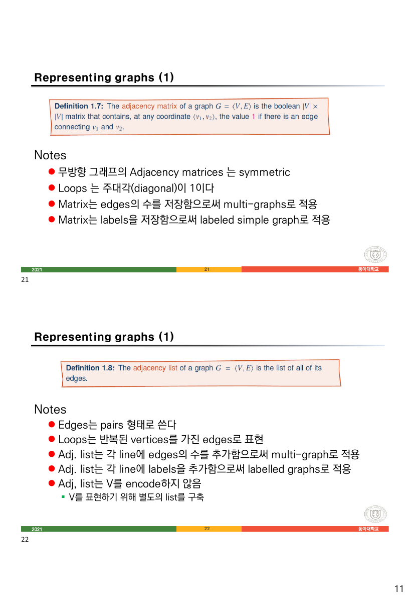
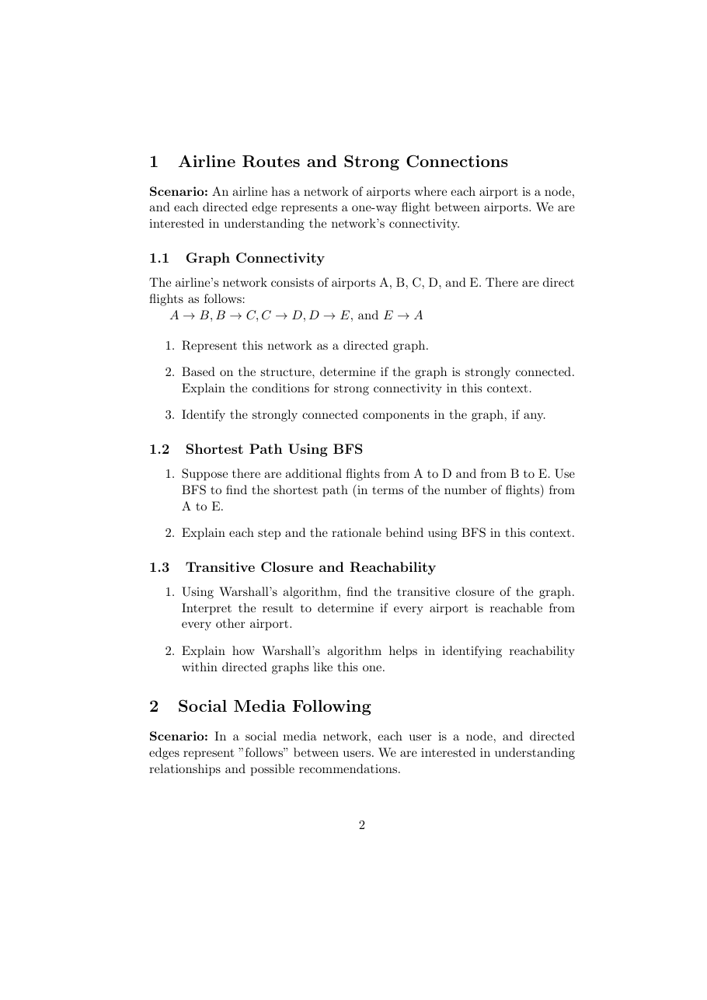
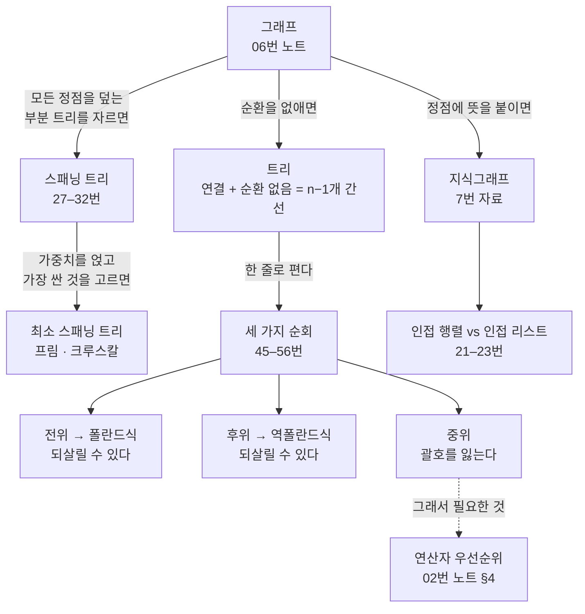

> [!abstract] 이 자료들이 실제로 하는 말
> 3번 슬라이드가 트리를 이렇게 소개한다 — *“트리는 **‘특별한 형태의 한 관계(relation)’** 라고 간단히 정의할 수 있다.”* [04. 관계 ①](<./04. 관계 ① — 제목의 절반이 앞머리 열여섯 장에서 끝난다.md>)에서 관계를, [06. 그래프](<./06. 그래프 — 탐욕이 최소를 준다는 약속.md>)에서 그래프를 배운 뒤에 오는 자리다.
>
> 그런데 이 자료가 트리에 요구하는 일은 그리기가 아니라 **저장하기**다. 24번 슬라이드가 그 사실을 정면으로 말한다 — *“트리에 자료를 저장하기 위해서는 **선형의 산술식**을 저장해야 한다.”* 컴퓨터의 메모리는 한 줄이고 트리는 가지를 친다. 그래서 트리를 한 줄로 펴야 하고, 다시 그 한 줄에서 트리를 되살려야 한다.
>
> 그 펴는 방법이 세 가지 순회(전위·중위·후위)이고, 결과물이 세 가지 표기법(전위·중위·후위)이다. 그런데 **셋 중 하나만 되살릴 수 없다.** 59번 슬라이드가 그 사실을 스스로 보여 준다 — 같은 트리를 후위로 펴면 `A B＋ C D－＊` 이고 전위로 펴면 `＊＋AB－CD` 인데, 중위로 펴면 `A＋B＊C－D` 가 되어 **괄호가 사라진다.** 이 문서는 그 잃어버림을 축으로 읽는다.
>
> 그리고 마지막으로 지식그래프 자료를 붙인다. [01. 이산수학 소개](<./01. 이산수학 소개 — 맥주잔과 수도꼭지 사이에서.md>) 8쪽이 던진 질문 — *“동아대 / 동아대학교 / Dong-A University … 웹 상에서 어떻게 식별할까?”* — 이 그 자료의 출발점이다.

---

## 1. 트리 — 순환이 없다는 조건 하나

9번 슬라이드가 정의를 세 가지로 준다. **세 정의는 서로 동치다.**

> - A tree is a **connected graph without cycles**
> - A tree is a connected graph on $n$ vertices with **$n-1$ edges**
> - A graph is a tree **if and only if** there is a unique simple path ~~but~~ between any pair of its vertices

세 번째 줄에 `but` 이 잘못 끼어 있다(`unique simple path **but** between any pair`). 문장에서 빼고 읽으면 정확하다 — **어느 두 정점 사이에도 단순 경로가 정확히 하나씩 있다.**

세 정의의 관계를 뜯어 보면 트리의 성질이 드러난다.

| 정의 | 무엇을 금지하는가 | 어기면 |
| --- | --- | --- |
| 연결 + 순환 없음 | 순환 | 순환이 있으면 두 정점 사이 경로가 둘 이상 |
| $n$개 정점에 $n-1$개 간선 | 간선이 하나만 더 있어도 | $n$개면 반드시 순환이 생긴다 |
| 두 정점 사이 경로가 유일 | 경로의 중복 | 경로가 둘이면 그 둘을 이어 순환이 된다 |

$n-1$ 이라는 수가 아슬아슬하다. 하나만 적으면 끊어지고 하나만 더하면 순환이 생긴다. 트리는 **연결을 유지하는 가장 적은 간선의 그래프**다. 이 성질이 §4의 스패닝 트리에서 직접 쓰인다.



> 원본 10번 슬라이드. 세 개의 반례에 각각 이유가 붙어 있다.

원본이 든 세 반례와 그 이유는 이렇다.

| 반례 | 원본의 설명 |
| --- | --- |
| 뿌리가 둘 | *“내차수 0인 2개의 정점을 가지므로 트리가 아님”* |
| 두 부모를 가진 노드 | *“내차수 2인 정점(d) 있으므로 트리가 아님”* |
| 순환이 있음 | *“하나의 순환을 가지므로 트리가 아님”* |

같은 슬라이드가 내차수·외차수를 다시 정의하는데([06. 그래프](<./06. 그래프 — 탐욕이 최소를 준다는 약속.md>) §3), 여기서는 **뿌리 있는 트리를 판정하는 도구**로 쓰인다. 뿌리 있는 트리에서는 **뿌리만 내차수 0이고 나머지는 모두 내차수 1**이다.

12·13·14번이 용어를 붙인다. [그림 8-1]을 기준으로 원본이 든 예를 그대로 옮기면

| 용어 | 정의 | [그림 8-1]에서 |
| --- | --- | --- |
| 루트 노드 | 시작 노드 | $v_4$ |
| 부모·자식 | $(v_1, v)\in T$ 이면 $v$ 가 $v_1$ 의 자식 | $v_2$ 는 $v_1, v_3$ 의 부모 |
| 형제 노드 | 같은 부모의 자식들 | $v_1$ 과 $v_3$ |
| 터미널(리프) | 자식이 없는 정점 | $v_8, v_9, v_{10}, v_1, v_3$ |
| 레벨 | **루트가 0**, 자식은 부모 + 1 | $v_4$=0, $v_1 \cdot v_3$=2, $v_9 \cdot v_{10}$=3 |
| 높이 | 정점들 중 최고의 레벨 | 3 |
| 정점의 차수 | **자식 노드의 개수** | $v_4$ 의 차수는 3 |
| 트리의 차수 | 모든 정점 차수의 최댓값 | 3 |

“정점의 차수”가 [06. 그래프](<./06. 그래프 — 탐욕이 최소를 준다는 약속.md>) §3의 차수와 **다르다**는 점에 주의한다. 그래프에서는 붙은 간선의 개수(= 부모까지 포함)지만, 여기서는 **자식만** 센다. 7번 슬라이드가 인용한 경고 — *“There is no standard terminology for graph theory”* — 가 여기서 실제로 걸린다.

15번이 $n$-트리를 정의한다.

- **$n$-트리** — 모든 정점이 기껏해야 $n$개의 자식을 가진 트리
- **완전 $n$-트리** — 터미널 노드를 제외한 **모든** 정점의 자식이 정확히 $n$개
- $n = 2$ 이면 2진 트리
- **Forest** — *“a forest is an undirected acyclic graph”* (순환은 없지만 연결되지 않아도 되는 것)

숲(forest)이 트리에서 “연결”만 뺀 것이라는 점이 깔끔하다. 트리 = 연결 + 순환 없음, 숲 = 순환 없음.

19·20번이 응용 하나를 자세히 다룬다 — **결정 트리(decision tree)**. 20번의 예제는 계산해 볼 만하다.

> Suppose there are seven coins, all with the same weight, and a counterfeit coin that weighs less than the others. How many weighings are necessary using a balance scale to determine which of the eight coins is the counterfeit one?
> … the decision tree for the sequence of weighings is a **3-ary tree**. There are at least **eight leaves** … the height of the decision tree is at least $\lceil \log_3 8 \rceil = 2$. Hence, **at least two weighings** are needed.

양팔 저울 한 번의 결과가 **왼쪽이 무겁다 / 오른쪽이 무겁다 / 균형**의 셋이므로 결정 트리는 3진 트리다. 후보가 8개이므로 잎이 8개 이상 필요하고, 높이 $h$ 인 3진 트리의 잎은 최대 $3^h$ 개다. $3^1 = 3 < 8 \le 9 = 3^2$ 이므로 $h \ge 2$. **검산하면 $\lceil \log_3 8 \rceil = 2$ 로 원본과 일치한다.**

같은 논증이 [03. 지뢰찾기와 중간고사](<../../../01_programming-foundations/python-programming/notes/03. 지뢰찾기와 중간고사 — 명세가 그림뿐일 때.md>) §6에서 “아홉 번으로 1–1000을 맞힐 수 있는가”에 쓰였다. 거기서는 응답이 두 갈래라 밑이 2였고, 여기서는 세 갈래라 밑이 3이다.

---

## 2. 산술식을 트리에 넣기 — 그리고 다시 꺼내기

24번이 이 자료의 문제를 세운다.

> 트리에 자료를 저장하기 위해서는 **선형의 산술식**을 저장해야 한다.
> 선형의 산술식이 있을 때 이를 트리로 저장하기 위해서는 **산술식이 어떻게 계산되는지**를 알아야 한다.
> 이때 가장 필요한 요소가 **2장에서 설명한 연산자 우선순위와 결합법칙**이다.

[02. 논리](<./02. 논리 — 진리표를 그리기 전에 괄호부터 정한다.md>) §4에서 아홉 장을 쓴 그 우선순위표를 여기서 되찾아 쓴다. 두 자료가 정확히 이어지는 자리다.

24번이 **중심 연산자(central operator)** 를 정의한다 — *“산술식에서 **마지막으로 연산이 되는 연산자**.”* 예로 든 식 `(3－(2*x))＋((x－2)－(3＋x))` 에서는 바깥의 `＋` 다. 마지막에 계산되는 것이 트리의 뿌리가 된다.

25번의 [알고리즘 8-2]가 절차다.

1. 트리의 루트 노드를 전체 산술식의 **중심 연산자**로 한다
2. 중심 연산자가 이항 연산자면 왼쪽 부분식은 왼쪽 부분 트리로, 오른쪽 부분식은 오른쪽 부분 트리로 하고, **재귀적으로 ①과 ②를 행한다**
3. 상수나 변수 하나로 된 터미널 노드가 나올 때까지 계속한다

“마지막에 계산되는 것이 가장 위”라는 규칙이 이 알고리즘의 전부다. 우선순위가 낮을수록 늦게 계산되므로 **우선순위가 낮은 연산자가 뿌리에 가깝다.**

---

## 3. 세 번 훑고, 세 번 펴기

45–56번이 순회를 다룬다. 46번이 뼈대를 준다 — 현재 노드에서 할 수 있는 일이 셋이다.

| 작업 | 뜻 |
| --- | --- |
| **D** | 노드의 데이터 읽기 |
| **L** | 왼쪽 서브트리로 이동 |
| **R** | 오른쪽 서브트리로 이동 |

D를 어디에 넣느냐로 세 가지가 갈린다.

| 순회 | 순서 | 원본의 설명 |
| --- | --- | --- |
| 전위 (preorder) | **D** → L → R | *“현재 노드를 방문하여 처리하는 작업 D를 가장 먼저 수행”* (47번) |
| 중위 (inorder) | L → **D** → R | *“작업 D를 작업 L과 작업 R의 중간에 수행”* (49번) |
| 후위 (postorder) | L → R → **D** | *“D 작업을 가장 나중에 수행”* (53번) |

45번이 가장 작은 예로 셋을 한 화면에 보인다 — 뿌리가 `+`, 자식이 `1` 과 `2` 인 트리에 대해 `+12` / `1+2` / `12+`. 그리고 한 줄을 덧붙인다 — *“연산자 트리 (Leaf node는 숫자, Root/중간 노드들은 연산자).”*

66–68번의 [알고리즘 8-4]가 셋을 재귀로 적는데, 세 알고리즘의 문장이 **똑같고 순서만 다르다.** 전위는 “루트를 찾는다 → 왼쪽 → 오른쪽”, 중위는 “왼쪽 → 루트 → 오른쪽”, 후위는 “왼쪽 → 오른쪽 → 루트”. 세 알고리즘이 같은 부품을 순서만 바꿔 쓴다는 것이 눈에 보인다.

57–59번이 순회의 결과에 이름을 붙인다.



> 원본 59번 슬라이드. [그림 8-8]의 트리에 대해 후위와 중위 표현을 준다.

원본이 [그림 8-8]에 대해 적은 네 가지 표현을 모두 옮긴다.

| 표기법 | 원본이 적은 것 | 설명 |
| --- | --- | --- |
| 일반 전위 | `＊(＋(A, B), －(C, D))` | *“연산자를 먼저 쓰고, 그 연산에 따른 피연산자를 괄호로 묶어”* |
| 케임브리지 폴란드식 | `(＊(＋AB)(－CD))` | *“콤마를 제거하고 연산 기호를 괄호 안으로”* — **LISP** 이 쓰는 방식 |
| 폴란드식 (전위) | `＊＋AB－CD` | *“케임브리지 폴란드식에서 괄호를 제거한 방법”* |
| 역폴란드식 (후위) | `A B＋ C D－＊` | *“피연산자를 먼저 쓰고 다음에 연산자를”* |
| 중위 | `A＋B＊C－D` | *“피연산자와 피연산자 사이에 연산자를”* |

네 표현이 모두 같은 트리를 가리킨다 — 뿌리가 `＊`, 왼쪽 서브트리가 `＋(A,B)`, 오른쪽이 `－(C,D)`. **네 표현을 그 트리로 검산했고 전부 일치한다.**

그런데 마지막 줄 `A＋B＊C－D` 를 원래 트리로 되돌리려 해 보라. 우선순위대로 읽으면 `A + (B*C) - D` 가 되어 **전혀 다른 트리**다. 원래 트리는 `(A+B) * (C-D)` 였다.

```html preview h=640px
<div style="font-family:system-ui,-apple-system,sans-serif;padding:20px;color:var(--foreground)">
  <div id="tvpick" style="display:flex;gap:6px;flex-wrap:wrap;margin-bottom:14px"></div>

  <div style="display:flex;gap:26px;flex-wrap:wrap;align-items:flex-start">
    <div>
      <svg id="tvsvg" viewBox="0 0 300 210" width="300" role="img" aria-label="연산자 트리"></svg>
      <div style="display:flex;gap:8px;margin-top:6px">
        <button id="tvstep" class="tvb">한 걸음</button>
        <button id="tvall" class="tvb">끝까지</button>
        <button id="tvrst" class="tvb">처음으로</button>
      </div>
    </div>
    <div style="flex:1;min-width:250px">
      <div id="tvmode" style="display:flex;gap:6px;flex-wrap:wrap;margin-bottom:12px"></div>
      <div id="tvout" style="font-family:ui-monospace,Menlo,monospace;font-size:19px;letter-spacing:2px;
           padding:12px 14px;background:var(--card);border:1px solid var(--border);border-radius:var(--radius);min-height:26px"></div>
      <div id="tvnote" style="margin-top:11px;padding:11px 13px;background:var(--card);border:1px solid var(--border);
           border-radius:var(--radius);font-size:13px;line-height:1.8"></div>
    </div>
  </div>
  <style>.tvb{padding:6px 11px;font-size:12.5px;border:1px solid var(--border);border-radius:var(--radius);
    background:var(--card);color:var(--foreground);cursor:pointer}
    .tvb[data-on="1"]{background:var(--chart-1);color:var(--background);border-color:var(--chart-1);font-weight:600}</style>

  <script>
    var TREES = [
      { label: '원본 [그림 8-8] · (A+B)*(C−D)',
        t: { v: '*', l: { v: '+', l: { v: 'A' }, r: { v: 'B' } }, r: { v: '−', l: { v: 'C' }, r: { v: 'D' } } } },
      { label: '원본 45번 슬라이드 · 1+2', t: { v: '+', l: { v: '1' }, r: { v: '2' } } },
      { label: '중위가 같은 다른 트리 · A+(B*C)−D',
        t: { v: '−', l: { v: '+', l: { v: 'A' }, r: { v: '*', l: { v: 'B' }, r: { v: 'C' } } }, r: { v: 'D' } } }
    ];
    var MODES = [['pre', '전위 D→L→R'], ['in', '중위 L→D→R'], ['post', '후위 L→R→D']];
    var ti = 0, mode = 'pre', shown = 0;

    TREES.forEach(function (T, i) {
      var b = document.createElement('button');
      b.className = 'tvb'; b.textContent = T.label;
      b.onclick = function () { ti = i; shown = 0; draw(); };
      document.getElementById('tvpick').appendChild(b);
    });
    MODES.forEach(function (m) {
      var b = document.createElement('button');
      b.className = 'tvb'; b.textContent = m[1]; b.dataset.m = m[0];
      b.onclick = function () { mode = m[0]; shown = 0; draw(); };
      document.getElementById('tvmode').appendChild(b);
    });

    function layout(n, x, y, dx, out, depth) {
      n.x = x; n.y = y; n.d = depth;
      if (n.l) layout(n.l, x - dx, y + 58, dx / 2, out, depth + 1);
      if (n.r) layout(n.r, x + dx, y + 58, dx / 2, out, depth + 1);
      out.push(n);
      return out;
    }
    function walk(n, m, out) {
      if (!n) return out;
      if (m === 'pre') out.push(n);
      walk(n.l, m, out);
      if (m === 'in') out.push(n);
      walk(n.r, m, out);
      if (m === 'post') out.push(n);
      return out;
    }
    function infixParen(n) {
      if (!n.l) return n.v;
      return '(' + infixParen(n.l) + n.v + infixParen(n.r) + ')';
    }

    function draw() {
      var T = TREES[ti].t, all = [];
      layout(T, 150, 26, 66, all, 0);
      var seq = walk(T, mode, []);
      var rank = {};
      seq.slice(0, shown).forEach(function (n, i) { rank[n.x + ',' + n.y] = i + 1; });

      MODES.forEach(function (m) {
        document.querySelector('[data-m="' + m[0] + '"]').dataset.on = mode === m[0] ? '1' : '0';
      });

      var svg = '';
      all.forEach(function (n) {
        ['l', 'r'].forEach(function (k) {
          if (n[k]) svg += '<line x1="' + n.x + '" y1="' + n.y + '" x2="' + n[k].x + '" y2="' + n[k].y +
            '" stroke="var(--border)" stroke-width="1.6"/>';
        });
      });
      all.forEach(function (n) {
        var r = rank[n.x + ',' + n.y], isOp = !!n.l;
        svg += '<circle cx="' + n.x + '" cy="' + n.y + '" r="17" fill="' +
          (r ? 'var(--chart-1)' : isOp ? 'var(--card)' : 'var(--card)') + '" stroke="' +
          (isOp ? 'var(--chart-3)' : 'var(--border)') + '" stroke-width="1.8"/>' +
          '<text x="' + n.x + '" y="' + (n.y + 5) + '" text-anchor="middle" font-size="15" font-weight="700" fill="' +
          (r ? 'var(--background)' : 'var(--foreground)') + '">' + n.v + '</text>' +
          (r ? '<circle cx="' + (n.x + 15) + '" cy="' + (n.y - 14) + '" r="8.5" fill="var(--chart-3)"/>' +
            '<text x="' + (n.x + 15) + '" y="' + (n.y - 10) + '" text-anchor="middle" font-size="10" font-weight="700" ' +
            'fill="var(--background)">' + r + '</text>' : '');
      });
      document.getElementById('tvsvg').innerHTML = svg;

      document.getElementById('tvout').textContent =
        seq.slice(0, shown).map(function (n) { return n.v; }).join(' ') || '—';

      var done = shown === seq.length;
      var full = seq.map(function (n) { return n.v; }).join(' ');
      var note = '';
      if (!done) {
        note = '<span style="color:var(--muted-foreground)">진행 ' + shown + ' / ' + seq.length +
          ' — ' + (mode === 'pre' ? '뿌리를 먼저 찍고 왼쪽으로 내려간다.'
                : mode === 'in' ? '왼쪽 끝까지 내려간 뒤 올라오면서 찍는다.'
                : '두 자식을 다 처리한 뒤에야 자기를 찍는다.') + '</span>';
      } else if (mode === 'in') {
        note = '<b style="color:var(--chart-5)">중위 표기는 괄호를 잃는다.</b><br/>' +
          '이 트리의 실제 구조는 <b>' + infixParen(T) + '</b> 인데, 중위로 편 결과는 <b>' + full.replace(/ /g, '') + '</b> 다.<br/>' +
          '<span style="color:var(--muted-foreground)">우선순위 규칙만으로 이 문자열을 되돌리면 원래와 다른 트리가 나올 수 있다. ' +
          '세 번째 프리셋이 그 예다 — 두 트리의 중위 표기가 같다.</span>';
      } else {
        note = '<b style="color:var(--chart-1)">' + (mode === 'pre' ? '전위' : '후위') +
          ' 표기는 괄호 없이도 트리를 되살릴 수 있다.</b><br/>' +
          '<span style="color:var(--muted-foreground)">연산자가 몇 개의 피연산자를 먹는지 정해져 있으면 ' +
          '왼쪽(또는 오른쪽)부터 순서대로 읽어 나가며 트리를 유일하게 재구성할 수 있기 때문이다. ' +
          'LISP 이 케임브리지 폴란드식을 쓰는 이유이고, 계산기가 후위(역폴란드) 표기를 쓰는 이유다.</span>';
      }
      document.getElementById('tvnote').innerHTML = note;
    }
    document.getElementById('tvstep').onclick = function () {
      var s = walk(TREES[ti].t, mode, []); shown = Math.min(s.length, shown + 1); draw();
    };
    document.getElementById('tvall').onclick = function () {
      shown = walk(TREES[ti].t, mode, []).length; draw();
    };
    document.getElementById('tvrst').onclick = function () { shown = 0; draw(); };
    draw();
  </script>
</div>
```

세 번째 프리셋이 요점이다. `(A+B)*(C−D)` 와 `(A+(B*C))−D` 는 **완전히 다른 트리**인데 중위 표기가 둘 다 `A+B*C−D` 다. 전위·후위 표기는 두 트리를 구별한다.

| 트리 | 전위 | 중위 | 후위 |
| --- | --- | --- | --- |
| `(A+B)*(C−D)` | `*+AB−CD` | **`A+B*C−D`** | `AB+CD−*` |
| `(A+(B*C))−D` | `−+A*BCD` | **`A+B*C−D`** | `ABC*+D−` |

전위와 후위가 괄호 없이도 트리를 결정하는 이유는 **연산자의 항수(arity)가 정해져 있으면 파싱이 결정적**이기 때문이다. `*+AB−CD` 를 왼쪽부터 읽으면 `*` 가 두 개를 먹어야 하니 첫 인자를 찾으러 가고, `+` 가 또 두 개를 먹으니 A와 B를 먹고 돌아오는 식으로 유일하게 갈린다. 중위는 연산자가 피연산자 사이에 끼어 있어 그런 결정성이 없고, 그래서 **우선순위 규칙이라는 외부 약속**이 필요해진다 — [02. 논리](<./02. 논리 — 진리표를 그리기 전에 괄호부터 정한다.md>) §4의 아홉 장이 필요했던 이유다.



> 원본 56번 슬라이드. 세 표기법을 “어떤 탐방의 결과인가”로 정의한다.

그런데 세 줄 중 하나가 앞줄의 문구를 그대로 물려받았다.

> [!warning] 원본 오류 ① — 56번 슬라이드의 중위 표기법 정의
> 원본이 적은 세 정의는 이렇다.
>
> > ❖ 전위 표기법(prefix) • 트리로 표현된 자료를 **전위 탐방**하여 찾은 자료들을 선형으로 나열
> > ❖ 후위 표기법(postfix) • **후위 탐방**하여 찾은 자료들을 선형으로 나열
> > ❖ 중위 표기법(infix) • **전위 탐방**하여 찾은 자료들을 선형으로 나열
>
> 세 번째가 **“중위 탐방”** 이어야 한다. 첫 번째 항목의 문구가 복사된 것으로 보인다.
>
> 같은 자료 65번 슬라이드가 정확한 대응을 적어 두었으므로 의도는 분명하다 — *“전위로 탐방해서 자료를 찾으면 그것은 전위 표기법이 된다. **중위로 탐방해서 자료를 찾으면 중위 표기법이 된다.** 후위로 탐방해서 자료를 찾으면 후위 표기법이 된다.”*

---

## 4. 스패닝 트리 — 그래프에서 트리를 잘라 내기

27번이 문제를 세운다.

> 그래프 $G$ 안에 있는 **모든 정점을 다 포함하면서 트리가 되는 연결 부분 그래프**가 필요하다 … 이런 트리를 spanning tree라고 하고, **컴퓨터 인터넷 네트워크와 자동차 내비게이션** 등에 많이 사용된다.

28번이 만드는 방법을 보인다 — 순환이 있으면 그 순환의 간선 하나를 지우는 일을 반복한다. 원본이 든 예에서는 `{a,e}`, `{e,f}`, `{c,g}` 세 간선을 지워 스패닝 트리를 얻는다. 그리고 캡션에 한 줄이 붙어 있다 — *“It is **not only** spanning tree of graph G”*, 즉 **스패닝 트리는 유일하지 않다.** 29번의 [Figure 4]가 같은 그래프의 서로 다른 스패닝 트리 여럿을 보인다.

§1에서 본 “$n$개 정점, $n-1$개 간선”이 여기서 셈으로 쓰인다. 원래 그래프에 간선이 $m$개이고 정점이 $n$개면, 스패닝 트리를 만들기 위해 지워야 하는 간선은 **정확히 $m - (n-1)$개**다. 어느 간선을 지우느냐가 자유이므로 답이 여럿이다.

27번이 두 가지 만드는 방법을 든다 — **너비우선 스패닝 트리**와 **깊이우선 스패닝 트리**. 31·32번이 실행 예를 보이는데, 31번(DFS)의 설명이 특히 좋다.

> Arbitrarily start with the vertex f … This produces a path f, g, h, k, j … Next, **backtrack** to k. There is no path beginning at k containing vertices not already visited. So we backtrack to h. Form the path h, i. Then backtrack to h, and then to f …

그리고 [Figure 8]의 캡션이 결과를 두 종류의 간선으로 나눈다 — *“The **tree edges** and **back edges** (e-f, f-h) of the depth-first search.”* 트리 간선은 스패닝 트리에 남고, 뒤로 가는 간선은 버려진다. 버려진 간선 하나하나가 원래 그래프의 순환 하나에 대응한다.

---

## 5. 최소 스패닝 트리 — 두 가지 탐욕

33번이 문제에 가중치를 얹는다. $m$개 정점의 가중치 그래프에서 MST를 찾는 방법 둘을 든다.

| | Prim (34번) | Kruskal (37번) |
| --- | --- | --- |
| 원본의 서술 | *“최소 가중치를 가지는 간선 $(u,v)$ 를 선택하고 … 그런 다음 정점 $u$ 또는 $v$ 에 연결된 간선 중에서 최소 가중치를 가지는 간선을 선택”* | *“무조건 최소 가중치 순으로 순서를 정한 뒤에 순환을 형성하지 않으면 그 간선을 선택”* |
| 자라는 방식 | **한 덩어리**가 커진다 | **여러 덩어리**가 생겼다 합쳐진다 |
| 매번 확인하는 것 | 지금 덩어리에 붙은 간선 중 최소 | 전체 간선을 정렬해 두고 순환 여부 |
| 공통 조건 | *“물론 이때 **순회가 되지 않아야** 한다”* | *“**순환을 형성하지 않으면**”* |

두 방법 모두 **탐욕**이지만, [06. 그래프](<./06. 그래프 — 탐욕이 최소를 준다는 약속.md>) §7의 웰치-포웰과 달리 **증명적으로 최적**이다. 어떤 간선이 어떤 절단(cut)을 건너는 유일한 최소 간선이면 그 간선은 반드시 MST에 들어간다는 사실(절단 성질)이 두 알고리즘을 뒷받침한다. 원본은 이 증명을 다루지 않는다.



> 원본 37·38번 슬라이드. 위가 크루스칼의 설명, 아래가 크루스칼 예제다.

아래쪽 슬라이드의 캡션이 앞 예제의 것을 물려받았다.

> [!warning] 원본 오류 ② — 크루스칼 예제에 프림 캡션이 붙었다
> 38번 슬라이드의 제목은 *“Example : Use **Kruskal's** algorithm to find a minimum spanning tree in the graph”* 인데, 그 아래 결과 그림의 캡션은 **`Figure 2. A minimum spanning tree produced using Prim's algorithm`** 이다. 35번(프림 예제) 슬라이드의 캡션이 그대로 복사되었다.
>
> 결과 자체는 틀리지 않을 수 있다 — 두 알고리즘은 같은 그래프에서 **같은 총 가중치**의 MST를 낸다(가중치가 모두 다르면 MST 자체가 유일하다). 그러나 캡션이 알고리즘 이름을 잘못 말하고 있어, 두 방법을 구분해 배우는 슬라이드에서는 헷갈릴 수 있다.

### 43번 슬라이드 — 교수가 직접 만든 그래프



> 원본 43번 슬라이드. 제목은 `나의 원룸 입지 구하기`, 부제는 *“A or B or C or D 에 집을 구하는 경우, 둘러싸인 그래프”* 다. 부산의 열 곳을 정점으로 하고 열일곱 개의 간선에 가중치가 붙어 있으며, 후보지 A·B·C·D가 삼각형으로 표시되어 있다.

이 자료에서 유일하게 **교수가 직접 만든 데이터**다. 정점 열 개는 동아대학교 · 사직야구장 · 부산시민공원 · 롯데월드부산 · 벡스코 · 해동용궁사 · 이기대 공원 · 다대포해수욕장 · 자갈치 시장 · 부산역이고, 간선과 가중치를 그림에서 읽으면 이렇다.

| 간선 | 가중치 | | 간선 | 가중치 |
| --- | --- | --- | --- | --- |
| 동아대 – 사직야구장 | 5 | | 벡스코 – 롯데월드 | 5 |
| 동아대 – 시민공원 | 8 | | 벡스코 – 이기대 | 7 |
| 동아대 – 부산역 | 3 | | 롯데월드 – 해동용궁사 | 7 |
| 동아대 – 자갈치 | 7 | | 해동용궁사 – 이기대 | 4 |
| 동아대 – 다대포 | 5 | | 자갈치 – 다대포 | 3 |
| 사직야구장 – 시민공원 | 1 | | 다대포 – 이기대 | 6 |
| 사직야구장 – 벡스코 | 2 | | 부산역 – 이기대 | 1 |
| 사직야구장 – 롯데월드 | 3 | | 시민공원 – 부산역 | 2 |
| 시민공원 – 벡스코 | 4 | | | |

**슬라이드는 질문만 던지고 답을 적지 않는다.** A·B·C·D는 지도상의 위치 표시일 뿐 그래프의 정점이 아니어서, “어디에 집을 구할 것인가”는 학생이 기준을 정해 답해야 하는 열린 문제다. 아래 도구는 그 기준 두 가지 — **모든 곳에 이어 놓는 최소 비용(MST)** 과 **한 곳에서 다른 모든 곳까지의 거리 합** — 을 계산한다.

```html preview h=660px
<div style="font-family:system-ui,-apple-system,sans-serif;padding:20px;color:var(--foreground)">
  <div style="display:flex;gap:8px;flex-wrap:wrap;margin-bottom:14px">
    <button id="mkru" class="mb">크루스칼 (37번)</button>
    <button id="mpri" class="mb">프림 (34번)</button>
    <button id="mdis" class="mb">각 정점 기준 거리 합</button>
  </div>
  <style>.mb{padding:7px 12px;font-size:13px;border:1px solid var(--border);border-radius:var(--radius);
    background:var(--card);color:var(--foreground);cursor:pointer}
    .mb[data-on="1"]{background:var(--chart-1);color:var(--background);border-color:var(--chart-1);font-weight:600}</style>

  <div style="display:flex;gap:24px;flex-wrap:wrap;align-items:flex-start">
    <svg id="bsvg" viewBox="0 0 430 300" width="100%" style="max-width:470px" role="img" aria-label="부산 열 곳의 가중치 그래프"></svg>
    <div style="flex:1;min-width:240px">
      <div id="blog" style="font-size:13px;line-height:1.85;padding:11px 13px;background:var(--card);
           border:1px solid var(--border);border-radius:var(--radius);max-height:300px;overflow-y:auto"></div>
      <div id="bbox" style="margin-top:11px;padding:11px 13px;background:var(--card);border:1px solid var(--border);
           border-radius:var(--radius);font-size:13px;line-height:1.8"></div>
    </div>
  </div>

  <script>
    var E = [
      ['동아대','사직',5],['사직','시민공원',1],['사직','벡스코',2],['사직','롯데월드',3],
      ['동아대','시민공원',8],['시민공원','벡스코',4],['시민공원','부산역',2],['벡스코','롯데월드',5],
      ['롯데월드','용궁사',7],['벡스코','이기대',7],['용궁사','이기대',4],['동아대','다대포',5],
      ['동아대','자갈치',7],['동아대','부산역',3],['자갈치','다대포',3],['다대포','이기대',6],['부산역','이기대',1]
    ];
    var P = { '동아대':[52,88], '사직':[196,32], '시민공원':[196,104], '롯데월드':[372,84],
              '벡스코':[286,140], '용궁사':[392,190], '이기대':[262,258], '다대포':[42,250],
              '자갈치':[110,214], '부산역':[168,196] };
    var V = Object.keys(P), ADJ = {};
    V.forEach(function (v) { ADJ[v] = []; });
    E.forEach(function (e) { ADJ[e[0]].push([e[2], e[1]]); ADJ[e[1]].push([e[2], e[0]]); });
    var mode = 'kru';

    function kruskal() {
      var par = {}; V.forEach(function (v) { par[v] = v; });
      function f(x) { while (par[x] !== x) { par[x] = par[par[x]]; x = par[x]; } return x; }
      var picked = [], skipped = [], tot = 0;
      E.slice().sort(function (a, b) { return a[2] - b[2]; }).forEach(function (e) {
        var ra = f(e[0]), rb = f(e[1]);
        if (ra !== rb) { par[ra] = rb; picked.push(e); tot += e[2]; }
        else skipped.push(e);
      });
      return { picked: picked, skipped: skipped, tot: tot };
    }
    function prim(src) {
      var seen = {}, picked = [], tot = 0, pq = [];
      seen[src] = 1;
      ADJ[src].forEach(function (n) { pq.push([n[0], src, n[1]]); });
      while (pq.length) {
        pq.sort(function (a, b) { return a[0] - b[0]; });
        var e = pq.shift();
        if (seen[e[2]]) continue;
        seen[e[2]] = 1; picked.push([e[1], e[2], e[0]]); tot += e[0];
        ADJ[e[2]].forEach(function (n) { if (!seen[n[1]]) pq.push([n[0], e[2], n[1]]); });
      }
      return { picked: picked, tot: tot };
    }
    function dij(src) {
      var d = {}, done = {};
      V.forEach(function (v) { d[v] = Infinity; });
      d[src] = 0;
      for (var it = 0; it < V.length; it++) {
        var u = null;
        V.forEach(function (v) { if (!done[v] && (u === null || d[v] < d[u])) u = v; });
        if (u === null || d[u] === Infinity) break;
        done[u] = 1;
        ADJ[u].forEach(function (n) { if (d[u] + n[0] < d[n[1]]) d[n[1]] = d[u] + n[0]; });
      }
      return d;
    }

    function draw() {
      ['kru','pri','dis'].forEach(function (m) {
        document.getElementById('m' + (m === 'kru' ? 'kru' : m === 'pri' ? 'pri' : 'dis')).dataset.on = mode === m ? '1' : '0';
      });
      var hi = {}, log = '', box = '';
      if (mode === 'kru') {
        var K = kruskal();
        K.picked.forEach(function (e) { hi[e[0] + '|' + e[1]] = 1; hi[e[1] + '|' + e[0]] = 1; });
        log = '<b>가중치가 작은 간선부터 훑으며, 순환이 생기지 않으면 채택한다.</b><br/>' +
          E.slice().sort(function (a, b) { return a[2] - b[2]; }).map(function (e) {
            var ok = hi[e[0] + '|' + e[1]];
            return '<span style="color:' + (ok ? 'var(--chart-1)' : 'var(--muted-foreground)') + '">' +
              (ok ? '채택' : '버림') + ' &nbsp;' + e[0] + ' – ' + e[1] + ' (' + e[2] + ')' +
              (ok ? '' : ' <span style="font-size:11.5px">순환</span>') + '</span>';
          }).join('<br/>');
        box = '채택한 간선 <b>' + K.picked.length + '개</b> (정점 10개이므로 반드시 9개) · ' +
          '총 가중치 <b style="color:var(--chart-1)">' + K.tot + '</b>';
      } else if (mode === 'pri') {
        var Pm = prim('동아대');
        Pm.picked.forEach(function (e) { hi[e[0] + '|' + e[1]] = 1; hi[e[1] + '|' + e[0]] = 1; });
        log = '<b>동아대학교에서 시작해, 지금 덩어리에 붙은 간선 중 가장 싼 것을 계속 흡수한다.</b><br/>' +
          Pm.picked.map(function (e, i) {
            return '<span style="color:var(--chart-1)">' + (i + 1) + '. ' + e[0] + ' → ' + e[1] + ' (' + e[2] + ')</span>';
          }).join('<br/>');
        box = '총 가중치 <b style="color:var(--chart-1)">' + Pm.tot + '</b> — ' +
          '<span style="color:var(--muted-foreground)">크루스칼과 같다. 간선을 고르는 순서는 다르지만 최소 총합은 하나뿐이다.</span>';
      } else {
        var rows = V.map(function (v) {
          var d = dij(v), s = 0, mx = 0;
          V.forEach(function (w) { s += d[w]; mx = Math.max(mx, d[w]); });
          return [v, s, mx];
        }).sort(function (a, b) { return a[1] - b[1]; });
        log = '<b>각 정점에서 나머지 아홉 곳까지 최단 거리를 더한 값.</b><br/>' +
          '<span style="color:var(--muted-foreground)">작을수록 “어디든 가깝다”.</span><br/>' +
          rows.map(function (r, i) {
            return '<span style="color:' + (i === 0 ? 'var(--chart-1)' : 'var(--foreground)') + '">' +
              (i + 1) + '. <b>' + r[0] + '</b> — 합 ' + r[1] + ' · 가장 먼 곳 ' + r[2] + '</span>';
          }).join('<br/>');
        box = '거리 합이 가장 작은 곳은 <b style="color:var(--chart-1)">' + rows[0][0] + '</b> (합 ' + rows[0][1] + ').<br/>' +
          '<span style="color:var(--muted-foreground)">원본 슬라이드는 답을 적지 않는다. 이 순위는 위 표의 가중치로 이 문서에서 계산한 것이다.</span>';
      }

      var svg = E.map(function (e) {
        var a = P[e[0]], b = P[e[1]], on = hi[e[0] + '|' + e[1]];
        return '<line x1="' + a[0] + '" y1="' + a[1] + '" x2="' + b[0] + '" y2="' + b[1] +
          '" stroke="' + (on ? 'var(--chart-1)' : 'var(--border)') + '" stroke-width="' + (on ? 3 : 1.4) + '"/>' +
          '<text x="' + ((a[0] + b[0]) / 2) + '" y="' + ((a[1] + b[1]) / 2 - 4) + '" text-anchor="middle" font-size="11" ' +
          'font-weight="700" fill="' + (on ? 'var(--chart-1)' : 'var(--muted-foreground)') + '">' + e[2] + '</text>';
      }).join('') + V.map(function (v) {
        return '<circle cx="' + P[v][0] + '" cy="' + P[v][1] + '" r="6" fill="var(--chart-3)"/>' +
          '<text x="' + P[v][0] + '" y="' + (P[v][1] - 11) + '" text-anchor="middle" font-size="11" ' +
          'font-weight="600" fill="var(--foreground)">' + v + '</text>';
      }).join('');
      document.getElementById('bsvg').innerHTML = svg;
      document.getElementById('blog').innerHTML = log;
      document.getElementById('bbox').innerHTML = box;
    }
    document.getElementById('mkru').onclick = function () { mode = 'kru'; draw(); };
    document.getElementById('mpri').onclick = function () { mode = 'pri'; draw(); };
    document.getElementById('mdis').onclick = function () { mode = 'dis'; draw(); };
    draw();
  </script>
</div>
```

세 결과를 확인했다.

- **크루스칼과 프림의 총 가중치가 둘 다 24로 같다.** 고르는 순서는 다르지만 최소 총합은 하나다.
- 채택된 간선이 **정확히 9개**다 — 정점 10개이므로 §1의 “$n-1$개 간선”이 그대로 나온다.
- 거리 합이 가장 작은 곳은 **부산역**(42)이고, 동아대학교(52)가 그다음이다. 자갈치 시장(95)이 가장 크다.

> [!note] 계산의 출처
> 위 간선 표는 43번 슬라이드의 그림에서 읽은 값이고, MST와 거리 합은 그 값으로 **이 문서에서 계산한 것**이다. 원본은 그래프만 주고 답을 적지 않는다. A·B·C·D의 위치가 어떤 정점과 어떤 가중치로 이어지는지도 슬라이드에 없으므로, “A와 B 중 어디가 나은가”는 원본만으로는 계산할 수 없다.

![12쪽(23번 슬라이드) — [알고리즘 8-1]](../assets/ch07-p12-알고리즘8-1-LAGER.png)

> 원본 23번 슬라이드. $M^N$ 을 구하는 알고리즘을 들여쓰기 있는 번호 목록으로 적었다. 그 중첩 구조 자체가 트리이며, 22번이 이것을 “레이블을 갖는 트리”의 예로 든다.

23번의 [알고리즘 8-1]도 이 자료의 성격을 보여 주는 자리다. $M^N$ 을 구하는 알고리즘인데, `CALL PRINT ('ANSWER IS TOO **LAGER**')` 라고 적혀 있다 — `LARGER` 의 오타다. 알고리즘 자체도 `S > MAX` 일 때 에러를 출력할 뿐 **정상적인 경우에 `S` 를 출력하는 단계가 없다.** 22번이 이 알고리즘을 “레이블을 갖는 트리”의 예로 든 것이므로, 실행 흐름을 트리로 그리는 것이 목적이고 출력은 관심 밖이었던 것으로 보인다.

---

## 6. 지식그래프 — 그래프를 무엇에 쓰는가

12쪽 24슬라이드짜리 이 자료는 [01. 이산수학 소개](<./01. 이산수학 소개 — 맥주잔과 수도꼭지 사이에서.md>) §4의 강의계획서 14주차에 해당한다. 2번 슬라이드가 목표를 둘로 적는다.



> 원본 1·2번 슬라이드.
>
> ◼ Graph 기반 지식 표현에 대한 기본 개념 이해
> ◼ 그래프 데이터 관리 접근법과 **Query Language 대한 기초 학습**

자료의 흐름은 이렇다.



15번이 [06. 그래프](<./06. 그래프 — 탐욕이 최소를 준다는 약속.md>) §2의 용어를 되짚는다 — *“Vertices들은 nodes라고 불리우기도 하며, undirected edges들은 arcs로 불리우기도 한다. 특별한 언급이 없다면, **모든 그래프는 finite하다고 가정함**.”* [01. 이산수학 소개](<./01. 이산수학 소개 — 맥주잔과 수도꼭지 사이에서.md>) §3의 *“우리가 관심있게 다루는 개체들은 유한적(finite)인 형태로 사용함”* 과 같은 전제다.

21·22번이 이 자료의 실질적 내용이다.



> 원본 21·22번 슬라이드. 각각 `Notes` 항목으로 성질을 네댓 개씩 적는다.

원본이 적은 두 목록을 나란히 놓으면 대비가 분명해진다.

| 인접 행렬 (21번) | 인접 리스트 (22번) |
| --- | --- |
| 무방향 그래프의 행렬은 **symmetric** | Edges는 **pairs 형태**로 쓴다 |
| **Loops**는 주대각(diagonal)이 1이다 | Loops는 **반복된 vertices**를 가진 edges로 표현 |
| **edges의 수를 저장**함으로써 multi-graph로 적용 | 각 line에 **edges의 수를 추가**함으로써 multi-graph로 적용 |
| **labels를 저장**함으로써 labeled simple graph로 적용 | 각 line에 **labels를 추가**함으로써 labelled graphs로 적용 |
| — | **Adj. list는 V를 encode하지 않음** — V를 표현하기 위해 별도의 list를 구축 |

앞의 네 줄은 대칭적이다. 두 표현 모두 “칸에 1 대신 다른 값을 넣으면” 다중 그래프나 레이블 그래프로 확장된다 — [06. 그래프](<./06. 그래프 — 탐욕이 최소를 준다는 약속.md>) §2에서 가중치를 인접 행렬에 직접 넣었던 것과 같다.

마지막 줄만 비대칭이다. **인접 리스트는 정점 집합 자체를 저장하지 않는다.** 간선이 하나도 없는 고립 정점은 리스트 어디에도 나타나지 않으므로 별도의 정점 목록이 필요하다. 인접 행렬에는 그 문제가 없다 — 정점이 $n$개면 행렬이 $n \times n$ 이므로 고립 정점도 자기 행과 열을 갖는다.

[06. 그래프](<./06. 그래프 — 탐욕이 최소를 준다는 약속.md>) §5의 다익스트라 예제에 정점 `G` 가 고립 정점으로 있었던 것을 떠올리면 이 차이가 실감난다. 인접 리스트로 그 그래프를 적으면 `G` 가 사라진다.

```html preview h=520px
<div style="font-family:system-ui,-apple-system,sans-serif;padding:20px;color:var(--foreground)">
  <div style="display:flex;gap:18px;flex-wrap:wrap;margin-bottom:12px">
    <div style="flex:1;min-width:170px">
      <label for="kv" style="font-size:12.5px;font-weight:600">정점 수 |V| = <span id="kvv">1000</span></label>
      <input id="kv" type="range" min="10" max="5000" step="10" value="1000" style="width:100%;accent-color:var(--primary)" />
    </div>
    <div style="flex:1;min-width:170px">
      <label for="kd" style="font-size:12.5px;font-weight:600">밀집도 = <span id="kdv">0.5</span>%</label>
      <input id="kd" type="range" min="1" max="1000" value="50" style="width:100%;accent-color:var(--primary)" />
    </div>
  </div>
  <div id="kbars" style="margin:14px 0"></div>
  <div id="kbox" style="padding:11px 13px;background:var(--card);border:1px solid var(--border);
       border-radius:var(--radius);font-size:13px;line-height:1.8"></div>

  <script>
    var kv = document.getElementById('kv'), kd = document.getElementById('kd');
    function upd() {
      var V = +kv.value, dens = +kd.value / 100;
      document.getElementById('kvv').textContent = V.toLocaleString();
      document.getElementById('kdv').textContent = dens.toFixed(2);
      var maxE = V * (V - 1) / 2;
      var E = Math.round(maxE * dens / 100);
      var mat = V * V, lst = V + 2 * E;            // 인접 리스트: 헤드 |V| + 양방향 항목 2|E|
      var m = Math.max(mat, lst);
      function bar(t, v, c, sub) {
        return '<div style="margin-bottom:10px"><div style="font-size:12.5px;color:var(--muted-foreground);margin-bottom:3px">' +
          t + ' — <b style="color:' + c + '">' + v.toLocaleString() + '</b> <span style="font-size:11.5px">' + sub + '</span></div>' +
          '<div style="height:18px;border-radius:4px;background:' + c + ';width:' + Math.max(1, v / m * 100) + '%"></div></div>';
      }
      document.getElementById('kbars').innerHTML =
        bar('인접 행렬 — |V|²', mat, 'var(--chart-2)', '칸 수') +
        bar('인접 리스트 — |V| + 2|E|', lst, 'var(--chart-1)', '항목 수');
      var win = lst < mat ? '인접 리스트' : '인접 행렬';
      document.getElementById('kbox').innerHTML =
        '간선 <b>' + E.toLocaleString() + '개</b> (가능한 최대 ' + Math.round(maxE).toLocaleString() + '개 중 ' + dens.toFixed(2) + '%)<br/>' +
        '이 설정에서는 <b style="color:' + (win === '인접 리스트' ? 'var(--chart-1)' : 'var(--chart-2)') + '">' + win +
        '</b> 가 더 적은 공간을 쓴다.<br/>' +
        '<span style="color:var(--muted-foreground)">두 값이 같아지는 지점은 밀집도가 약 ' +
        (100 * (V * V - V) / (2 * maxE)).toFixed(1) + '% 부근이다. ' +
        '지식그래프처럼 정점이 수백만이고 각 정점의 이웃이 수십 개인 그래프는 밀집도가 거의 0이므로 ' +
        '인접 리스트 쪽이 압도적으로 유리하다 — 23번 슬라이드가 “Which graph representation to pick?”이라 묻는 이유다.</span>';
    }
    kv.addEventListener('input', upd); kd.addEventListener('input', upd);
    upd();
  </script>
</div>
```

> [!note] 목표에 적힌 것 중 절반이 자료에 없다
> 2번 슬라이드가 내건 두 목표 중 두 번째는 *“그래프 데이터 관리 접근법과 **Query Language** 대한 기초 학습”* 이다. 그러나 24장 어디에도 질의 언어는 나오지 않는다. 자료는 23번의 *“Which graph representation to pick?”* 에서 끝나고 24번은 출처(TU Dresden, Markus Krötzsch)다.
>
> [01. 이산수학 소개](<./01. 이산수학 소개 — 맥주잔과 수도꼭지 사이에서.md>) §4에서 본 강의계획서의 각주 — *“12-14주에는 지식그래프, **RDF 모델링, RDF/SPARQL 기초**에 대해 학습”* — 도 같은 방향을 가리켰다. 세 가지 약속 중 첫 번째(지식그래프 소개)만 자료로 남았다.
>
> 다만 `5 그래프` 자료가 그 빈자리를 조금 메운다. 그 자료 17–23번 슬라이드가 **그래프 구조 기반 데이터 모델 다섯 종류**를 다루면서 `천세진 —teaches→ 이산수학` 이라는 예로 세 모델을 비교한다.
>
> | 모델 | 원본의 예 |
> | --- | --- |
> | Directed edge-labelled graph | `천세진 —type→ 사람`, `천세진 —teaches→ 이산수학`, `이산수학 —type→ 강의` |
> | Heterogeneous graph | `천세진 : 사람 —teaches→ 이산수학 : 강의` (타입이 정점에 붙는다) |
> | Property graph | `천세진 [type=사람] —teaches [year=2021]→ 이산수학 [type=강의, term=가을학기]` (간선에도 속성) |
>
> 첫 번째 모델의 `주어 —술어→ 목적어` 세 쌍이 RDF의 트리플이다. 이름만 적히지 않았을 뿐 개념은 나온 셈이다.

---

## 7. 과제로 확인하는 것

`Discrete_Mathematics__Homework_I` (2024년 11월 4일)는 이 과목 후반부를 한 문서로 묶는다. 18문항 각 10점, 총 180점이며 세 시나리오로 이루어져 있다.



> 과제 2쪽. 세 시나리오 중 첫 번째다.

| 시나리오 | 소재 | 묻는 것 | 이 과목의 어느 부분 |
| --- | --- | --- | --- |
| **1. 항공 노선** | A→B→C→D→E→A 순환 | 강연결인가 · 강연결 요소 · BFS 최단 경로 · **워셜 추이 닫힘** | [05](<./05. 관계 ② — 무한 번 반복하지 않고 도달 가능성을 묻는 법.md>) §3 · [06](<./06. 그래프 — 탐욕이 최소를 준다는 약속.md>) §4 |
| **2. 소셜 팔로우** | Alice→Bob→Charlie→Alice, Alice→Dana | 대칭인가 반대칭인가 · 순환의 의미 · **추이성으로 추천** | [04](<./04. 관계 ① — 제목의 절반이 앞머리 열여섯 장에서 끝난다.md>) §5 |
| **3. 사내 이메일** | E1–E4, 자기 자신 제외 전원에게 | 인접 행렬 · 완전 그래프인가 · **반사·대칭인가** · 링크 하나가 끊기면 | [04](<./04. 관계 ① — 제목의 절반이 앞머리 열여섯 장에서 끝난다.md>) §5 · [06](<./06. 그래프 — 탐욕이 최소를 준다는 약속.md>) §4 |

**18문항이라는 수가 실제와 맞다.** 1.1이 3문항, 1.2가 2문항, 1.3이 2문항, 2.1이 3문항, 2.2가 2문항, 3.1이 2문항, 3.2가 2문항, 3.3이 2문항 — 합이 정확히 18이다.

세 시나리오가 이 과목의 개념을 어떻게 되짚는지 몇 가지만 짚어 둔다.

- **1.1** 의 `A→B→C→D→E→A` 는 다섯 정점을 도는 유향 순환이다. 유향 순환 하나로 모든 정점이 이어져 있으면 어느 쌍에 대해서도 양방향 경로가 있으므로 **강연결**이고, 따라서 **강연결 요소는 하나뿐**이다(그래프 전체).
- **1.3** 의 워셜 추이 닫힘은 그 결과 **모든 칸이 1인 $5 \times 5$ 행렬**이 된다 — 자기 자신으로 돌아오는 경로도 있으므로 주대각까지 1이다.
- **2.1** 의 “대칭인가 반대칭인가”가 함정이다. Alice→Bob, Bob→Charlie, Charlie→Alice, Alice→Dana 중 **양방향인 쌍이 하나도 없으므로** 반대칭 조건 “$aRb \land bRa \to a=b$”의 전건이 결코 참이 되지 않는다. 곧 **공허하게 참(vacuously true)** 이고, 이 관계는 반대칭이다. [02. 논리](<./02. 논리 — 진리표를 그리기 전에 괄호부터 정한다.md>) §8의 vacuous proof가 그대로 쓰인다.
- **3.1** 의 인접 행렬은 주대각만 0이고 나머지가 1인 $4 \times 4$ 행렬이다. 간선은 $4 \times 3 = 12$ 개다.

과제 안내문에 시대를 반영한 조항도 하나 있다.

> (주의사항) **ChatGPT 등의 거대언어모델 사용, 다른 학우에 의한 도움 등은 가능하지만, 출처를 남기지 않는 경우는 과제점수는 0점 처리함.** 수기형태로 작성된 문서가 아닌 hwp, word 등의 타이핑을 통한 문서 작성은 0점으로 처리함.

도구 사용을 금지하는 대신 **출처 표기**를 요구하고, 대신 **손으로 쓸 것**을 요구한다.

---

## 8. 이 세 자료가 실제로 가르치는 것



이 그림의 가운데 세 갈래가 이 노트의 제목이다. 트리를 한 줄로 펴는 방법이 셋인데 **되살릴 수 있는 것이 둘, 없는 것이 하나**다. 그 하나가 하필 사람이 가장 익숙하게 쓰는 표기다. `2 + 3 × 4` 를 우리는 자연스럽게 읽지만, 그 자연스러움은 **우선순위라는 약속을 이미 배웠기 때문**이다. 약속이 없으면 그 문자열은 두 개의 서로 다른 트리를 동시에 가리킨다.

컴퓨터가 후위 표기를 쓰는 이유가 여기 있다. 약속이 필요 없고, 스택 하나로 왼쪽부터 끝까지 한 번만 읽으면 계산이 끝난다. LISP이 케임브리지 폴란드식을 쓰는 이유도 같다 — 괄호를 명시하면 우선순위표가 아예 필요 없어진다.

그리고 마지막 갈래가 이 과목을 닫는다. 지식그래프는 그래프에 **뜻**을 붙인 것이다. `천세진 —teaches→ 이산수학` 이라는 화살표 하나는 [04. 관계 ①](<./04. 관계 ① — 제목의 절반이 앞머리 열여섯 장에서 끝난다.md>) §2의 곱집합에서 고른 순서쌍 하나이고, 그것을 어떻게 저장할지는 [06. 그래프](<./06. 그래프 — 탐욕이 최소를 준다는 약속.md>) §2가 다룬 인접 행렬과 인접 리스트의 문제다. **[01. 이산수학 소개](<./01. 이산수학 소개 — 맥주잔과 수도꼭지 사이에서.md>) 8쪽이 던진 질문 — “동아대 / 동아대학교 / Dong-A University를 웹에서 어떻게 식별할까?” — 은 결국 순서쌍과 저장 방식의 문제였다.**

- 이전 → [06. 그래프 — 탐욕이 최소를 준다는 약속](<./06. 그래프 — 탐욕이 최소를 준다는 약속.md>)
- 처음으로 → [01. 이산수학 소개 — 맥주잔과 수도꼭지 사이에서](<./01. 이산수학 소개 — 맥주잔과 수도꼭지 사이에서.md>)

### 다른 과목과의 연결

- §3의 세 순회와 세 표기법은 [데이터 구조 05. 표기법 변환 — 괄호를 없애는 두 가지 길](<../../../01_programming-foundations/data-structures/notes/05. 표기법 변환 — 괄호를 없애는 두 가지 길.md>)에서 스택으로 실제 구현된다.
- §5의 프림과 크루스칼은 [알고리즘 설계와 분석 08. 탐욕적 기법](<../../../06_algorithms-graphics/algorithm-design-analysis/notes/08. 탐욕적 기법.md>)에서 최적성이 증명된다.
- §1의 트리 용어와 레벨·높이는 [데이터 구조 07. 트리 — 자식이 둘을 넘으면 감당이 안 된다](<../../../01_programming-foundations/data-structures/notes/07. 트리 — 자식이 둘을 넘으면 감당이 안 된다.md>)와 같은 정의를 쓴다.
- §1의 $\lceil \log_3 8 \rceil$ 논증은 [파이썬 프로그래밍 03. 지뢰찾기와 중간고사](<../../../01_programming-foundations/python-programming/notes/03. 지뢰찾기와 중간고사 — 명세가 그림뿐일 때.md>) §6의 $\lceil \log_2 1000 \rceil$ 과 같은 형태다 — 응답의 갈래 수가 로그의 밑이 된다.

---

## 근거 자료

`6 트리.pdf` (38쪽 · 75슬라이드, 2슬라이드/쪽 유인물 배치). 표지는 `6 트리(Tree)` 이지만 목차는 교재 **8.1–8.3** 절이고, 그림·알고리즘 번호도 `[그림 8-1]`, `[알고리즘 8-4]` 다. 푸터는 `N/72` 인데 실제는 75슬라이드다.

| 슬라이드 | 내용 | 이 문서에서 쓴 자리 |
| --- | --- | --- |
| 2–8 | 미리보기 — 트리를 왜 배우는가, 키르히호프(1847)·케일리(1857) | §1 |
| 9 · 10 | 트리의 세 정의와 세 반례 | §1 (이미지 인용) |
| 12–18 | 용어 — 루트·부모·자식·레벨·높이·차수·$n$-트리·순서 트리·숲 | §1 |
| 19 · 20 | 결정 트리와 위조 동전 문제 | §1 |
| 22–26 | 레이블 트리, [알고리즘 8-1], 중심 연산자, [알고리즘 8-2] | §2 · §5 |
| 27–32 | 스패닝 트리, DFS·BFS 스패닝 트리 | §4 |
| 33–42 | MST — 프림과 크루스칼 | §5 (이미지 인용, **원본 오류 ②**) |
| 43 | 나의 원룸 입지 구하기 | §5 (이미지 인용, 인터랙티브) |
| 45–56 | 트리 순회 세 가지와 세 표기법의 정의 | §3 (이미지 인용, **원본 오류 ①**) |
| 57–60 | 전위·후위·중위 표기법과 [그림 8-8] | §3 (이미지 인용, 인터랙티브) |
| 65–68 | [알고리즘 8-4] 세 순회의 재귀 정의 | §3 |

`7 지식그래프 소개.pdf` (12쪽 · 24슬라이드)

| 슬라이드 | 내용 | 이 문서에서 쓴 자리 |
| --- | --- | --- |
| 1 · 2 | 표지와 Goals | §6 (이미지 인용) |
| 3–13 | 지식그래프의 정의와 반례들 | §6 |
| 14–20 | 컴퓨터 과학과 수학에서의 그래프 | §6 |
| 21 · 22 | 인접 행렬과 인접 리스트의 성질 | §6 (이미지 인용, 인터랙티브) |
| 23 · 24 | 표현의 선택 · Credits (TU Dresden, Markus Krötzsch) | §6 |

`Discrete_Mathematics__Homework_I (1).pdf` (4쪽, 2024-11-04, 18문항 180점)

| 쪽 | 내용 | 이 문서에서 쓴 자리 |
| --- | --- | --- |
| 1 | 제출 방식과 주의사항 | §7 |
| 2 | 시나리오 1 — 항공 노선 | §7 (이미지 인용) |
| 3 · 4 | 시나리오 2 · 3 — 소셜 팔로우, 사내 이메일 | §7 |

> [!note] 계산 검증
> §1의 $\lceil \log_3 8 \rceil = 2$, §3의 [그림 8-8]에 대한 네 표현(전위·케임브리지 폴란드식·폴란드식·후위)과 중위 표현, §5의 부산 그래프 MST(프림·크루스칼 모두 총합 24, 간선 9개)와 정점별 거리 합, §7의 과제 문항 수 18을 모두 계산해 원본과 대조했다. §5 인터랙티브의 간선·가중치는 43번 슬라이드의 그림에서 읽은 값이며, MST와 거리 순위는 원본에 없는 이 문서의 계산이다(위 Callout에 명시).
