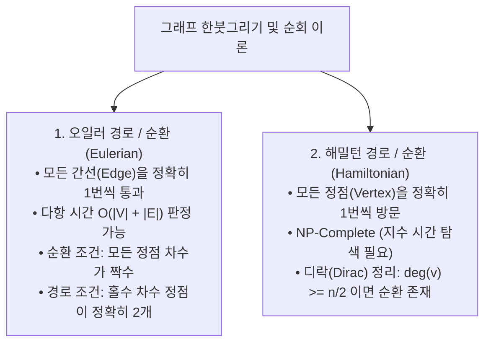

> [!abstract] 핵심 요약
> **그래프(Graph, $G=(V, E)$)**는 객체 간의 네트워크 구조를 모델링하는 비선형 자료구조이다.
> 모든 간선은 2개의 정점에 연결되므로 모든 정점의 차수의 합은 간선 수의 2배라는 **악수 정리(Handshaking Theorem)**가 성립하며, 간선을 1회씩 지나는 **오일러 순환(Eulerian Circuit, 모든 정점 차수 짝수)**과 정점을 1회씩 방문하는 **해밀턴 순환(Hamiltonian Circuit, NP-Complete)**으로 양분된다.

---

## 1. 악수 정리(Handshaking Theorem)와 차수 성질

$$\sum_{v \in V} \text{deg}(v) = 2|E|$$

> [!NOTE]
> **따름정리(Corollary)**: 임의의 무방향 그래프에서 **차수가 홀수인 정점(Odd Degree Vertex)의 개수는 항상 짝수**이다.

---

## 2. 오일러(Eulerian) vs 해밀턴(Hamiltonian) 경로 비교



---

## 3. 평면 그래프(Planar Graph)와 오일러 다면체 공식

교차하는 간선 없이 평면에 그릴 수 있는 연결 평면 그래프에서 정점 수 $v$, 간선 수 $e$, 면(영역)의 수 $f$ 사이에는 다음 관계가 항상 성립한다:

$$v - e + f = 2$$

---

## 4. 실시간 오일러 경로 판별기 및 쾨니히스베르크 다리 시뮬레이터

```html preview
<div style="font-family:system-ui,-apple-system,sans-serif;padding:20px;background:var(--card);color:var(--card-foreground);border:1px solid var(--border);border-radius:var(--radius)">
  <div style="font-size:16px;font-weight:700;margin-bottom:14px;color:var(--primary);display:flex;align-items:center;gap:8px">
    <span>🌉 오일러 경로(Eulerian Path) 차수 자동 판별기 & 악수 정리 검증기</span>
  </div>

  <div style="display:flex;gap:8px;margin-bottom:14px;flex-wrap:wrap">
    <button id="presetKonigsberg" style="padding:6px 12px;background:var(--chart-1);color:#fff;border:none;border-radius:var(--radius);font-size:12px;font-weight:700;cursor:pointer">쾨니히스베르크 7개 다리</button>
    <button id="presetEulerHouse" style="padding:6px 12px;background:var(--chart-2);color:#fff;border:none;border-radius:var(--radius);font-size:12px;font-weight:700;cursor:pointer">한붓그리기 집 모양 (오일러 경로)</button>
    <button id="presetCompleteK4" style="padding:6px 12px;background:var(--chart-3);color:#fff;border:none;border-radius:var(--radius);font-size:12px;font-weight:700;cursor:pointer">완전 그래프 K4 (오일러 순환)</button>
  </div>

  <div style="display:grid;grid-template-columns:1fr 1fr;gap:12px;margin-bottom:12px">
    <div style="padding:10px;background:var(--background);border:1px solid var(--border);border-radius:var(--radius)">
      <div style="font-size:11px;color:var(--muted-foreground)">정점 차수(Degree) 목록:</div>
      <div id="degreeList" style="font-family:monospace;font-size:13px;font-weight:700;color:var(--foreground);margin-top:4px"></div>
    </div>
    <div style="padding:10px;background:var(--background);border:1px solid var(--border);border-radius:var(--radius)">
      <div style="font-size:11px;color:var(--muted-foreground)">악수 정리 계산:</div>
      <div id="handshakeCalc" style="font-family:monospace;font-size:13px;font-weight:700;color:var(--chart-1);margin-top:4px"></div>
    </div>
  </div>

  <div style="padding:12px;background:var(--background);border:1px solid var(--primary);border-radius:var(--radius)">
    <div style="font-size:11px;color:var(--muted-foreground)">오일러 한붓그리기 성립 판정:</div>
    <div id="eulerJudgment" style="font-size:15px;font-weight:800;color:var(--primary);margin-top:4px"></div>
  </div>

  <script>
    var degOut = document.getElementById('degreeList');
    var hsOut = document.getElementById('handshakeCalc');
    var ejOut = document.getElementById('eulerJudgment');

    function evaluateGraph(name, degrees, edgeCount) {
      var oddCount = 0;
      var sumDeg = 0;
      var degStr = [];

      for (var i = 0; i < degrees.length; i++) {
        var d = degrees[i];
        sumDeg += d;
        if (d % 2 !== 0) oddCount++;
        degStr.push("V" + (i + 1) + ":" + d + (d % 2 !== 0 ? "(홀)" : "(짝)"));
      }

      degOut.textContent = degStr.join(", ");
      hsOut.textContent = "차수의 총합 " + sumDeg + " = 2 × 간선수 " + edgeCount;

      if (oddCount === 0) {
        ejOut.innerHTML = "✅ <span style='color:var(--chart-2)'>오일러 순환 (Eulerian Circuit) 존재</span> (모든 정점 짝수 차수 ➔ 출발점으로 복귀 한붓그리기 가능)";
      } else if (oddCount === 2) {
        ejOut.innerHTML = "⚡ <span style='color:var(--chart-1)'>오일러 경로 (Eulerian Path) 존재</span> (홀수 차수 2개 ➔ 한 홀수 정점에서 출발하여 다른 홀수 정점에서 종료)";
      } else {
        ejOut.innerHTML = "❌ <span style='color:var(--destructive)'>오일러 경로/순환 불가능</span> (홀수 차수 정점 " + oddCount + "개 ➔ 한붓그리기 불가)";
      }
    }

    document.getElementById('presetKonigsberg').addEventListener('click', function() {
      evaluateGraph("쾨니히스베르크", [3, 3, 3, 5], 7);
    });

    document.getElementById('presetEulerHouse').addEventListener('click', function() {
      evaluateGraph("집 모양", [2, 3, 3, 4, 4], 8);
    });

    document.getElementById('presetCompleteK4').addEventListener('click', function() {
      evaluateGraph("K4", [3, 3, 3, 3], 6);
    });

    evaluateGraph("집 모양", [2, 3, 3, 4, 4], 8);
  </script>
</div>
```
