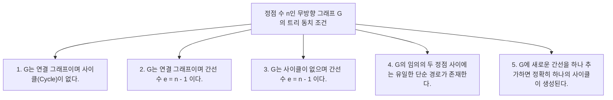
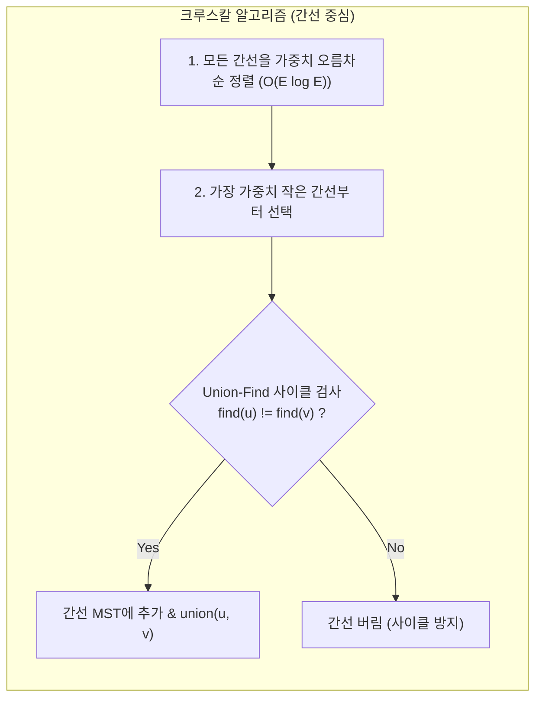

> [!abstract] 핵심 요약
> **트리(Tree)**는 **사이클이 없는 연결 무방향 그래프(Connected Acyclic Graph)**로 정의된다.
> 정점의 수가 $n$개일 때 간선 수는 항상 $e = n - 1$개이며, 임의의 두 정점 간에는 유일한 단순 경로(Unique Simple Path)가 존재한다.
> 가중 그래프에서 모든 정점을 최소 비용으로 연결하는 **최소 신장 트리(MST)**는 간선 중심의 **크루스칼(Kruskal)** 알고리즘과 정점 중심의 **프림(Prim)** 알고리즘이라는 두 가지 탐욕적(Greedy) 기법으로 해결된다.

---

## 1. 트리의 수학적 동치 조건 5선



---

## 2. 크루스칼(Kruskal) vs 프림(Prim) MST 알고리즘



| 비교 항목 | 크루스칼 알고리즘 (Kruskal) | 프림 알고리즘 (Prim) |
| :-- | :-- | :-- |
| **알고리즘 관점** | **간선(Edge) 중심** 탐욕 선택 | **정점(Vertex) 중심** 탐욕 확장 |
| **핵심 자료구조** | 정렬 배열 + **서로소 집합 (Union-Find)** | 인접 리스트 + **최소 힙 (Priority Queue)** |
| **시간 복잡도** | $O(|E| \log |E|)$ | $O(|E| \log |V|)$ |
| **적합한 그래프** | **희소 그래프(Sparse Graph)**에 유리 | **밀집 그래프(Dense Graph)**에 유리 |

---

## 3. 실시간 크루스칼 MST 간선 선택 시뮬레이터

```html preview
<div style="font-family:system-ui,-apple-system,sans-serif;padding:20px;background:var(--card);color:var(--card-foreground);border:1px solid var(--border);border-radius:var(--radius)">
  <div style="font-size:16px;font-weight:700;margin-bottom:14px;color:var(--primary);display:flex;align-items:center;gap:8px">
    <span>🌲 크루스칼(Kruskal) 최소 신장 트리(MST) 실시간 간선 선택 시뮬레이터</span>
  </div>

  <div style="display:grid;grid-template-columns:1fr 1fr;gap:12px;margin-bottom:14px">
    <div style="padding:10px;background:var(--background);border:1px solid var(--border);border-radius:var(--radius)">
      <div style="font-size:12px;font-weight:700;margin-bottom:6px;color:var(--chart-1)">정렬된 간선 후보 목록 (가중치 오름차순):</div>
      <div id="edgeCandidateList" style="font-family:monospace;font-size:11px;line-height:1.6"></div>
    </div>

    <div style="padding:10px;background:var(--background);border:1px solid var(--border);border-radius:var(--radius)">
      <div style="font-size:12px;font-weight:700;margin-bottom:6px;color:var(--chart-2)">MST 선택 상태 및 총 가중치:</div>
      <div id="mstSelectedList" style="font-family:monospace;font-size:11px;line-height:1.6"></div>
      <div id="mstTotalCost" style="font-size:14px;font-weight:800;color:var(--primary);margin-top:6px"></div>
    </div>
  </div>

  <div style="display:flex;gap:8px">
    <button id="stepKruskalBtn" style="padding:8px 16px;background:var(--primary);color:#fff;border:none;border-radius:var(--radius);font-size:12px;font-weight:700;cursor:pointer">다음 최소 간선 처리 (1-Step)</button>
    <button id="resetKruskalBtn" style="padding:8px 14px;background:var(--muted);color:var(--foreground);border:1px solid var(--border);border-radius:var(--radius);font-size:12px;cursor:pointer">초기화</button>
  </div>

  <script>
    var edges = [
      { u: 'A', v: 'B', w: 1 },
      { u: 'B', v: 'C', w: 2 },
      { u: 'A', v: 'C', w: 3 },
      { u: 'C', v: 'D', w: 4 },
      { u: 'B', v: 'D', w: 5 }
    ];

    var parent = { 'A': 'A', 'B': 'B', 'C': 'C', 'D': 'D' };
    var stepIndex = 0;
    var mstEdges = [];
    var totalCost = 0;

    function find(i) {
      if (parent[i] === i) return i;
      return parent[i] = find(parent[i]);
    }

    function union(i, j) {
      var rootI = find(i);
      var rootJ = find(j);
      if (rootI !== rootJ) {
        parent[rootI] = rootJ;
        return true;
      }
      return false;
    }

    function updateUI() {
      var candHtml = "";
      for (var i = 0; i < edges.length; i++) {
        var e = edges[i];
        var isCurrent = (i === stepIndex);
        candHtml += "<div style='color:" + (isCurrent ? "var(--primary);font-weight:800" : "var(--foreground)") + "'>";
        candHtml += (i < stepIndex ? "✓ " : "• ") + e.u + " - " + e.v + " (가중치: " + e.w + ")";
        candHtml += "</div>";
      }
      document.getElementById('edgeCandidateList').innerHTML = candHtml;

      var mstHtml = "";
      for (var j = 0; j < mstEdges.length; j++) {
        var me = mstEdges[j];
        mstHtml += "<div style='color:var(--chart-2);font-weight:700'>✅ " + me.u + " - " + me.v + " (w=" + me.w + ") 채택</div>";
      }
      document.getElementById('mstSelectedList').innerHTML = mstHtml || "<span style='color:var(--muted-foreground)'>선택된 간선 없음</span>";
      document.getElementById('mstTotalCost').textContent = "MST 총 가중치 비용: " + totalCost;
    }

    document.getElementById('stepKruskalBtn').addEventListener('click', function() {
      if (stepIndex >= edges.length || mstEdges.length === 3) {
        alert("MST 생성이 완료되었습니다! (간선 수 n-1 = 3개 충족)");
        return;
      }

      var e = edges[stepIndex];
      if (find(e.u) !== find(e.v)) {
        union(e.u, e.v);
        mstEdges.push(e);
        totalCost += e.w;
      }
      stepIndex++;
      updateUI();
    });

    document.getElementById('resetKruskalBtn').addEventListener('click', function() {
      parent = { 'A': 'A', 'B': 'B', 'C': 'C', 'D': 'D' };
      stepIndex = 0;
      mstEdges = [];
      totalCost = 0;
      updateUI();
    });

    updateUI();
  </script>
</div>
```
