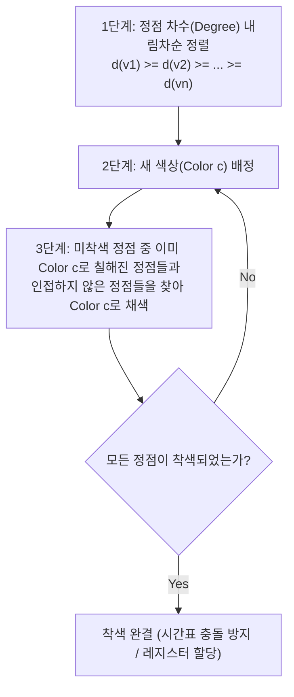

> [!abstract] 핵심 요약
> **플로이드-워셜(Floyd-Warshall)** 알고리즘은 동적 계획법(DP)을 통해 $O(|V|^3)$ 시간 복잡도로 그래프 내 **모든 정점 쌍 간의 최단 경로(All-Pairs Shortest Path)**를 도출한다.
> **웰치-포웰(Welch-Powell)** 알고리즘은 정점을 **차수(Degree) 내림차순**으로 정렬한 뒤 인접하지 않은 정점들에 순차적으로 동일한 색상을 탐욕적으로 배정하여 최소 채색수(Chromatic Number $\chi(G)$)에 근접하는 해를 제공한다.

---

## 1. 플로이드-워셜(Floyd-Warshall) 점화식과 3중 루프 구조

정점 집합 $\{1, 2, \dots, k\}$를 중간 경유지로 고려할 때, 정점 $i$에서 $j$까지의 최단 거리 $D^{(k)}[i][j]$는 다음과 같이 결정된다:

$$D^{(k)}[i][j] = \min \left( D^{(k-1)}[i][j], \; D^{(k-1)}[i][k] + D^{(k-1)}[k][j] \right)$$

```python
# Floyd-Warshall 핵심 구현 (O(V^3))
for k in range(V):          # 경유 정점
    for i in range(V):      # 출발 정점
        for j in range(V):  # 도착 정점
            if dist[i][k] + dist[k][j] < dist[i][j]:
                dist[i][j] = dist[i][k] + dist[k][j]
```

---

## 2. 웰치-포웰(Welch-Powell) 그래프 착색 4단계



---

## 3. 실시간 플로이드-워셜 4노드 최단거리 계산 및 웰치-포웰 착색기

```html preview
<div style="font-family:system-ui,-apple-system,sans-serif;padding:20px;background:var(--card);color:var(--card-foreground);border:1px solid var(--border);border-radius:var(--radius)">
  <div style="font-size:16px;font-weight:700;margin-bottom:14px;color:var(--primary);display:flex;align-items:center;gap:8px">
    <span>🌐 플로이드-워셜 (APSP) 실시간 행렬 연산기</span>
  </div>

  <div style="display:grid;grid-template-columns:1fr 1fr;gap:12px;margin-bottom:14px">
    <div style="padding:10px;background:var(--background);border:1px solid var(--border);border-radius:var(--radius)">
      <div style="font-size:12px;font-weight:700;color:var(--chart-1);margin-bottom:6px">초기 인접 가중치 행렬 D^(0):</div>
      <table style="width:100%;font-size:11px;font-family:monospace;text-align:center;border-collapse:collapse">
        <tr style="border-bottom:1px solid var(--border)"><th></th><th>0</th><th>1</th><th>2</th><th>3</th></tr>
        <tr><th>0</th><td>0</td><td>6</td><td>5</td><td>∞</td></tr>
        <tr><th>1</th><td>∞</td><td>0</td><td>4</td><td>3</td></tr>
        <tr><th>2</th><td>∞</td><td>∞</td><td>0</td><td>2</td></tr>
        <tr><th>3</th><td>∞</td><td>∞</td><td>∞</td><td>0</td></tr>
      </table>
    </div>

    <div style="padding:10px;background:var(--background);border:1px solid var(--border);border-radius:var(--radius)">
      <div style="font-size:12px;font-weight:700;color:var(--chart-2);margin-bottom:6px">플로이드-워셜 결과 D^(4):</div>
      <table id="fwResultTable" style="width:100%;font-size:11px;font-family:monospace;text-align:center;border-collapse:collapse">
      </table>
    </div>
  </div>

  <button id="calcFwBtn" style="padding:8px 16px;background:var(--primary);color:#fff;border:none;border-radius:var(--radius);font-size:12px;font-weight:700;cursor:pointer">플로이드-워셜 APSP 계산</button>

  <script>
    var INF = 999;
    var W = [
      [0, 6, 5, INF],
      [INF, 0, 4, 3],
      [INF, INF, 0, 2],
      [INF, INF, INF, 0]
    ];

    function runFW() {
      var D = JSON.parse(JSON.stringify(W));
      var N = 4;

      for (var k = 0; k < N; k++) {
        for (var i = 0; i < N; i++) {
          for (var j = 0; j < N; j++) {
            if (D[i][k] + D[k][j] < D[i][j]) {
              D[i][j] = D[i][k] + D[k][j];
            }
          }
        }
      }

      var tbl = document.getElementById('fwResultTable');
      tbl.innerHTML = '<tr style="border-bottom:1px solid var(--border)"><th></th><th>0</th><th>1</th><th>2</th><th>3</th></tr>';

      for (var r = 0; r < N; r++) {
        var row = '<tr><th>' + r + '</th>';
        for (var c = 0; c < N; c++) {
          var val = (D[r][c] >= INF) ? '∞' : D[r][c];
          row += '<td style="color:' + (D[r][c] < W[r][c] ? 'var(--chart-2);font-weight:800' : 'inherit') + '">' + val + '</td>';
        }
        row += '</tr>';
        tbl.innerHTML += row;
      }
    }

    document.getElementById('calcFwBtn').addEventListener('click', runFW);
    runFW();
  </script>
</div>
```
