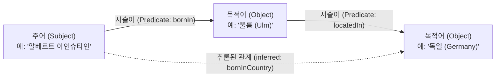

> [!abstract] 핵심 요약
> **지식 그래프(Knowledge Graph)**는 실세계의 개체(Entity)를 노드로, 개체 간의 의미적 관계(Semantic Relation)를 간선으로 모델링한 대규모 이형(Heterogeneous) 그래프이다.
> 모든 지식은 **(Subject, Predicate, Object)**의 **트리플(Triple)** 형태로 정규화되며, 온톨로지(Ontology) 추론 엔진을 통해 직접 명시되지 않은 새로운 사실(Implicit Knowledge)을 연역적으로 유도한다.

---

## 1. 트리플(SPO) 데이터 모델과 그래프 사상



$$\text{Knowledge Base } \mathcal{KB} = \{ (s, p, o) \mid s \in \mathcal{E}, p \in \mathcal{R}, o \in \mathcal{E} \cup \mathcal{L} \}$$

---

## 2. 지식 그래프의 3대 핵심 구성 요소

| 구성 요소 | 역할 및 정의 | 구체적 사례 |
| :-- | :-- | :-- |
| **개체 (Entities $\mathcal{E}$)** | 지식 그래프의 노드 (현실의 객체/개념) | `Turing`, `ComputerScience`, `UK` |
| **관계 (Relations $\mathcal{R}$)** | 노드를 연결하는 방향성 있는 간선 | `fieldOfWork`, `citizenOf`, `bornIn` |
| **온톨로지 (Ontology)** | 개념 계층 및 관계의 의미적 제약 정의 | `Scientist ⊑ Person`, `bornIn is Functional` |

---

## 3. 실시간 SPO 트리플 지식 그래프 빌더 및 추론 시뮬레이터

```html preview
<div style="font-family:system-ui,-apple-system,sans-serif;padding:20px;background:var(--card);color:var(--card-foreground);border:1px solid var(--border);border-radius:var(--radius)">
  <div style="font-size:16px;font-weight:700;margin-bottom:14px;color:var(--primary);display:flex;align-items:center;gap:8px">
    <span>🌐 SPO 트리플 지식 그래프 실시간 구축 & 관계 추론기</span>
  </div>

  <div style="display:flex;gap:6px;margin-bottom:12px;flex-wrap:wrap">
    <input id="subInput" type="text" placeholder="주어 (Subject)" value="앨런 튜링" style="flex:1;min-width:100px;padding:6px 10px;background:var(--background);color:var(--foreground);border:1px solid var(--border);border-radius:var(--radius);font-size:12px" />
    <input id="predInput" type="text" placeholder="서술어 (Predicate)" value="연구분야" style="flex:1;min-width:100px;padding:6px 10px;background:var(--background);color:var(--foreground);border:1px solid var(--border);border-radius:var(--radius);font-size:12px" />
    <input id="objInput" type="text" placeholder="목적어 (Object)" value="컴퓨터과학" style="flex:1;min-width:100px;padding:6px 10px;background:var(--background);color:var(--foreground);border:1px solid var(--border);border-radius:var(--radius);font-size:12px" />
    <button id="addTripleBtn" style="padding:6px 14px;background:var(--primary);color:#fff;border:none;border-radius:var(--radius);font-size:12px;font-weight:700;cursor:pointer">트리플 추가</button>
  </div>

  <div style="padding:10px;background:var(--background);border:1px solid var(--border);border-radius:var(--radius);max-height:140px;overflow-y:auto;margin-bottom:12px">
    <div style="font-size:11px;font-weight:700;color:var(--muted-foreground);margin-bottom:4px">등록된 지식 베이스 트리플 목록:</div>
    <div id="tripleList" style="font-family:monospace;font-size:11px;line-height:1.6"></div>
  </div>

  <div style="padding:10px;background:var(--background);border:1px solid var(--primary);border-radius:var(--radius);font-size:12px">
    <span style="font-weight:700;color:var(--primary)">추이성(Transitivity) 기반 자동 연역 추론: </span>
    <span id="kgInference" style="font-family:monospace;color:var(--chart-2)"></span>
  </div>

  <script>
    var triples = [
      { s: '앨런 튜링', p: '출생도시', o: '런던' },
      { s: '런던', p: '소속국가', o: '영국' },
      { s: '영국', p: '소속대륙', o: '유럽' }
    ];

    var tCont = document.getElementById('tripleList');
    var iCont = document.getElementById('kgInference');

    function renderTriples() {
      tCont.innerHTML = '';
      for (var i = 0; i < triples.length; i++) {
        var t = triples[i];
        var div = document.createElement('div');
        div.style.color = 'var(--foreground)';
        div.innerHTML = "<span style='color:var(--chart-1);font-weight:700'>(" + t.s + ")</span> ➔ <span style='color:var(--muted-foreground)'>[" + t.p + "]</span> ➔ <span style='color:var(--chart-3);font-weight:700'>(" + t.o + ")</span>";
        tCont.appendChild(div);
      }

      var inf = [];
      for (var i = 0; i < triples.length; i++) {
        for (var j = 0; j < triples.length; j++) {
          if (triples[i].o === triples[j].s) {
            inf.push("💡 (" + triples[i].s + " ➔ " + triples[j].o + ")");
          }
        }
      }
      iCont.innerHTML = inf.join("<br/>") || "추론 가능한 다단계 경로 없음";
    }

    document.getElementById('addTripleBtn').addEventListener('click', function() {
      var s = document.getElementById('subInput').value.trim();
      var p = document.getElementById('predInput').value.trim();
      var o = document.getElementById('objInput').value.trim();
      if (!s || !p || !o) return;
      triples.push({ s: s, p: p, o: o });
      renderTriples();
    });

    renderTriples();
  </script>
</div>
```
