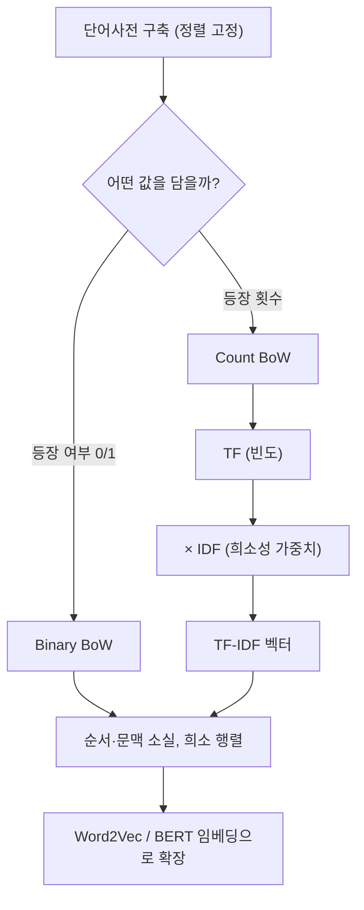

> [!NOTE]
> **한 줄 요약** — 컴퓨터는 문자열을 이해하지 못하므로, 문서를 **숫자 벡터**로 바꾸어야 한다. 가장 기초적인 방법이 **BoW(단어가방 모델)** 이고, 여기에 "흔한 단어는 덜 중요하다"는 통찰을 더해 가중치를 보정한 것이 **TF-IDF** 다.
>
> 출처: 강의자료 `nlp2026_4장_tfidf.pdf` (동아대학교 AI학과 양선, 전 18쪽).

## 1. 왜 벡터화(Vectorization)인가

텍스트를 자동으로 분류하려면 먼저 텍스트 데이터를 컴퓨터가 다룰 수 있는 형태로 바꾸어야 하고, 그 대표적인 방법이 문서를 **벡터화**하는 것이다 (4장 p.3).

문서 벡터화 계열은 크게 세 단계로 발전해 왔다 (p.3).


이번 챕터에서 다루는 것은 가장 기본이 되는 **BoW**와 **TF-IDF** 두 가지다.

## 2. BoW(Bag of Words, 단어가방 모델)

### 2.1 정의

자연어처리에서의 단어가방 모델은 (p.4):

- 텍스트 데이터를 수치화하는 가장 기초적인 방법 중 하나
- 문서를 =="단어들의 집합(가방)"== 으로 간주
- 즉, **단어의 순서는 무시**하고 등장 여부(binary BoW) 혹은 횟수(count BoW)만 고려

> [!IMPORTANT]
> "가방(bag)"이라는 이름이 핵심이다. 가방에 단어를 쏟아 넣으면 **어떤 단어가 몇 개 들어 있는지는 알 수 있지만, 원래 어떤 순서로 있었는지는 알 수 없다.** 이것이 BoW의 정체성이자 동시에 최대 한계다.

### 2.2 처리 절차 2단계

| 단계 | 내용 |
| --- | --- |
| (1) 단어사전(vocabulary) 생성 | 모든 문서에 등장하는 단어를 모아 사전 구축 (실제로는 토큰화 수행) |
| (2) 문서 → 벡터 변환 | 각 문서를 이 단어 집합 기준으로 숫자 벡터로 변환 |

강의 예시 (p.4) — 문서1 `"나는 오늘 학교에 갔다"`, 문서2 `"오늘 나는 도서관에 갔다"`

- 단어사전: `['갔다', '나는', '도서관에', '오늘', '학교에']`
- 문서1: `[1, 1, 0, 1, 1]` / 문서2: `[1, 1, 1, 1, 0]`

> [!TIP]
> **단어사전은 순서가 중요하다.** 사전의 $i$번째 단어가 벡터의 $i$번째 차원에 대응하므로, 사전 순서가 바뀌면 같은 문서라도 전혀 다른 벡터가 된다. 그래서 보통 **정렬(sorted)** 해서 고정한다.

### 2.3 장단점 (p.5)

| 구분 | 내용 |
| --- | --- |
| 장점 | 단순하고 구현이 쉬움. 작은 데이터셋에서는 꽤 효과적 |
| 단점 ① | 단어의 **순서·문맥·의미**가 모두 사라짐 |
| 단점 ② | 단어 수가 많아지면 벡터 차원이 매우 커짐 (**차원의 저주**) |
| 단점 ③ | 등장하지 않은 단어는 0이므로 **희소 행렬(sparse matrix)** 이 됨 |

정리하자면 BoW는 "텍스트를 수학적으로 다루기 위한 **출발점**" 같은 개념이며, 확장 방향은 (1) TF-IDF — 단순 빈도 대신 문서 전체에서 중요한 단어에 더 높은 가중치, (2) Word2Vec·BERT — 단어 의미까지 반영한 벡터다 (p.5).

## 3. 수업 과제 — 3개 문서를 BoW로 벡터화하기

> [!NOTE]
> **문제** — BoW 모델을 이용해 아래 3개 문서를 벡터화하시오.
>
> - 문서1: `I am a boy`
> - 문서2: `I am pretty, pretty`
> - 문서3: `you are a boy`

### 3.1 1단계 — 단어사전 만들기

세 문서에 등장하는 단어를 모두 모아 (대소문자 무시, 정렬해서) 사전을 만든다.

```text
['A', 'am', 'are', 'boy', 'I', 'pretty', 'you']
```

단어는 **7종류**이므로, 각 문서는 **7차원 벡터**로 표현된다.

| 인덱스 | 0 | 1 | 2 | 3 | 4 | 5 | 6 |
| --- | --- | --- | --- | --- | --- | --- | --- |
| 단어 | A | am | are | boy | I | pretty | you |

### 3.2 (1) Binary BoW — 등장 "여부"만 0/1

| 문서 | A | am | are | boy | I | pretty | you | 벡터 |
| --- | --- | --- | --- | --- | --- | --- | --- | --- |
| 문서1 `I am a boy` | 1 | 1 | 0 | 1 | 1 | 0 | 0 | `[1,1,0,1,1,0,0]` |
| 문서2 `I am pretty, pretty` | 0 | 1 | 0 | 0 | 1 | 1 | 0 | `[0,1,0,0,1,1,0]` |
| 문서3 `you are a boy` | 1 | 0 | 1 | 1 | 0 | 0 | 1 | `[1,0,1,1,0,0,1]` |

> [!IMPORTANT]
> 문서2의 벡터 `[0,1,0,0,1,1,0]` 만 봐도 **어떤 단어가 있는지는 알 수 있다.** 하지만 원래 문서에서 단어들이 **어떤 순서로** 있었는지는 알 수 없다 — 이것이 곧 **단어가방(Bag of Words) 모델**이라는 이름의 이유다.

### 3.3 (2) Count BoW — 등장 "횟수"

| 문서 | A | am | are | boy | I | pretty | you | 벡터 |
| --- | --- | --- | --- | --- | --- | --- | --- | --- |
| 문서1 `I am a boy` | 1 | 1 | 0 | 1 | 1 | 0 | 0 | `[1,1,0,1,1,0,0]` |
| 문서2 `I am pretty, pretty` | 0 | 1 | 0 | 0 | 1 | **2** | 0 | `[0,1,0,0,1,2,0]` |
| 문서3 `you are a boy` | 1 | 0 | 1 | 1 | 0 | 0 | 1 | `[1,0,1,1,0,0,1]` |

> [!TIP]
> **두 방식의 차이가 드러나는 곳은 문서2뿐이다.** 문서1·문서3은 중복 단어가 없어 binary와 count가 완전히 동일하다. `pretty`가 두 번 나온 문서2에서만 `1 → 2`로 갈라진다. 즉 **중복 단어가 없으면 두 표현은 구분되지 않는다.**

### 3.4 직접 해보기 — 인터랙티브 BoW 벡터라이저

아래 상자에 문서를 한 줄에 하나씩 입력하면 단어사전과 두 종류의 BoW 벡터가 즉시 계산된다.

```html preview
<div style="font-family:system-ui,sans-serif;padding:20px;color:var(--foreground)">
  <label for="docs" style="font-size:14px;font-weight:600">문서 입력 (한 줄에 한 문서)</label>
  <textarea id="docs" rows="3" style="width:100%;margin:8px 0;padding:10px;font-size:14px;
    font-family:ui-monospace,SFMono-Regular,Menlo,monospace;background:var(--card);
    color:var(--card-foreground);border:1px solid var(--border);
    border-radius:var(--radius);box-sizing:border-box">I am a boy
I am pretty, pretty
you are a boy</textarea>

  <div style="display:flex;gap:16px;align-items:center;margin:10px 0 14px;font-size:14px">
    <label style="display:flex;gap:6px;align-items:center;cursor:pointer">
      <input type="radio" name="mode" value="binary" checked style="accent-color:var(--primary)">
      Binary BoW
    </label>
    <label style="display:flex;gap:6px;align-items:center;cursor:pointer">
      <input type="radio" name="mode" value="count" style="accent-color:var(--primary)">
      Count BoW
    </label>
  </div>

  <div id="vocab" style="font-size:13px;color:var(--muted-foreground);margin-bottom:10px"></div>
  <div id="out" style="overflow-x:auto"></div>

  <script>
    var ta = document.getElementById('docs');
    var vocabEl = document.getElementById('vocab');
    var outEl = document.getElementById('out');

    function tokenize(line) {
      return line.toLowerCase().split(/[^a-z0-9가-힣]+/).filter(function (t) { return t.length > 0; });
    }

    function render() {
      var mode = document.querySelector('input[name=mode]:checked').value;
      var lines = ta.value.split('\n').filter(function (l) { return l.trim().length > 0; });
      var docs = lines.map(tokenize);

      var seen = {};
      docs.forEach(function (d) { d.forEach(function (t) { seen[t] = true; }); });
      var vocab = Object.keys(seen).sort();

      vocabEl.innerHTML = '단어사전 (' + vocab.length + '차원): <code>[' +
        vocab.map(function (w) { return "'" + w + "'"; }).join(', ') + ']</code>';

      var head = '<tr><th style="text-align:left;padding:6px 10px;border-bottom:1px solid var(--border)">문서</th>' +
        vocab.map(function (w) {
          return '<th style="padding:6px 10px;border-bottom:1px solid var(--border);font-size:12px">' + w + '</th>';
        }).join('') +
        '<th style="padding:6px 10px;border-bottom:1px solid var(--border);text-align:left">벡터</th></tr>';

      var rows = docs.map(function (d, i) {
        var vec = vocab.map(function (w) {
          var c = d.filter(function (t) { return t === w; }).length;
          return mode === 'binary' ? (c > 0 ? 1 : 0) : c;
        });
        var cells = vec.map(function (v) {
          var strong = v > 1;
          return '<td style="padding:6px 10px;text-align:center;font-variant-numeric:tabular-nums;' +
            'color:' + (v === 0 ? 'var(--muted-foreground)' : (strong ? 'var(--chart-5)' : 'var(--chart-1)')) + ';' +
            'font-weight:' + (v === 0 ? '400' : '700') + '">' + v + '</td>';
        }).join('');
        return '<tr><td style="padding:6px 10px;white-space:nowrap;font-size:13px">문서' + (i + 1) +
          ' <span style="color:var(--muted-foreground)">' + lines[i].trim() + '</span></td>' + cells +
          '<td style="padding:6px 10px;font-family:ui-monospace,Menlo,monospace;font-size:12px">[' +
          vec.join(',') + ']</td></tr>';
      }).join('');

      outEl.innerHTML = '<table style="border-collapse:collapse;font-size:13px;min-width:100%">' +
        head + rows + '</table>';
    }

    ta.addEventListener('input', render);
    Array.prototype.forEach.call(document.querySelectorAll('input[name=mode]'), function (r) {
      r.addEventListener('change', render);
    });
    render();
  </script>
</div>
```

<details>
<summary>파이썬으로 확인하기 (CountVectorizer)</summary>

```python
from sklearn.feature_extraction.text import CountVectorizer
import pandas as pd

docs = ["I am a boy", "I am pretty, pretty", "you are a boy"]

# (1) Binary BoW — 등장 여부만
bin_vec = CountVectorizer(token_pattern=r"(?u)\b\w+\b", binary=True)
bin_m = bin_vec.fit_transform(docs)
print(pd.DataFrame(bin_m.toarray(), columns=bin_vec.get_feature_names_out()))

# (2) Count BoW — 등장 횟수
cnt_vec = CountVectorizer(token_pattern=r"(?u)\b\w+\b")
cnt_m = cnt_vec.fit_transform(docs)
print(pd.DataFrame(cnt_m.toarray(), columns=cnt_vec.get_feature_names_out()))
```

`token_pattern=r"(?u)\b\w+\b"` 을 지정하는 이유는 싸이킷런 기본 패턴이 **2글자 이상**만 토큰으로 잡아 `I`, `a` 같은 1글자 단어를 버리기 때문이다 (강의 p.18에서도 동일한 옵션을 사용).

</details>

## 4. TF-IDF — 흔한 단어의 점수를 깎는다

### 4.1 개념 (p.6)

| 구성 요소 | 의미 | 방향 |
| --- | --- | --- |
| **TF** (Term Frequency, 단어 빈도) | 문서 안에서 어떤 단어가 얼마나 자주 등장하는지 | 같은 문서에서 많이 나올수록 **중요도 ↑** |
| **IDF** (Inverse Document Frequency, 역문서 빈도) | 모든 문서에 흔하게 등장하는 단어인지 | 여러 문서에 흔할수록 **중요도 ↓** |

> [!TIP]
> **발표 수업 비유** (강의자료 p.6)
>
> - 어떤 학생이 같은 말을 계속 반복하면(→ 높은 TF), 그 말은 그 학생 발언에서 중요한 단어일 수 있다.
> - 하지만 그 말을 모든 학생이 다 한다면(→ 낮은 IDF), 특별히 눈에 띄지 않는다.
> - **결론**: 다른 학생들은 잘 안 하는데 특정 학생만 여러 번 강조한 말이 그 학생을 대표하는 키워드다.

### 4.2 계산 예제의 공통 준비 (p.8)

강의에서는 다음 4개 문서($N = 4$)를 사용한다. 전처리를 아직 배우지 않았으므로 **조사만 제외**한다고 가정한다.

| 문서 | 원문 | 조사 제외 후 | 단어 수 |
| --- | --- | --- | --- |
| 문서1 | 나는 학교에 간다 | 나 학교 간다 | 3 |
| 문서2 | 학교에서 공부한다 | 학교 공부한다 | 2 |
| 문서3 | 친구와 학교에서 만나서 다른 친구네 집에 갔다 | 친구 학교 만나서 다른 친구 집 갔다 | 7 |
| 문서4 | 운동 좋아하는 친구와 함께 운동을 했다 | 운동 좋아하는 친구 함께 운동 했다 | 6 |

정렬된 단어사전 (13개 → **13차원 벡터**):

```text
['간다', '갔다', '공부한다', '나', '다른', '만나서', '운동', '좋아하는', '집', '친구', '학교', '함께', '했다']
```

> [!NOTE]
> 단어사전 구축까지는 방법1·방법2가 **완전히 동일**하다. 갈라지는 지점은 TF 정의, IDF 수식, 그리고 정규화 유무다.

### 4.3 방법1 — 문서 길이를 TF에 반영, 정규화 없음

$$
\text{TF}(t, d) = \frac{\text{문서 } d \text{ 내 단어 } t \text{ 의 빈도수}}{\text{문서 } d \text{ 의 총 단어수}}
\qquad
\text{IDF}(t) = \ln\!\left(\frac{N}{df(t)}\right)
$$

**TF 계산** (p.9~10) — 문서3은 7단어이므로 두 번 나온 `친구`는 $2/7 \approx 0.29$, 나머지는 $1/7 \approx 0.14$. 강의 표(p.10)는 문서1·문서3 행만 채워져 있어, 아래 표의 **문서2·문서4 행은 직접 계산한 값**이다.

| TF | 간다 | 갔다 | 공부한다 | 나 | 다른 | 만나서 | 운동 | 좋아하는 | 집 | 친구 | 학교 | 함께 | 했다 |
| --- | --- | --- | --- | --- | --- | --- | --- | --- | --- | --- | --- | --- | --- |
| 문서1 | 0.33 | 0 | 0 | 0.33 | 0 | 0 | 0 | 0 | 0 | 0 | 0.33 | 0 | 0 |
| 문서2 | 0 | 0 | 0.50 | 0 | 0 | 0 | 0 | 0 | 0 | 0 | 0.50 | 0 | 0 |
| 문서3 | 0 | 0.14 | 0 | 0 | 0.14 | 0.14 | 0 | 0 | 0.14 | 0.29 | 0.14 | 0 | 0 |
| 문서4 | 0 | 0 | 0 | 0 | 0 | 0 | 0.33 | 0.17 | 0 | 0.17 | 0 | 0.17 | 0.17 |

**IDF 계산** (p.11) — DF를 먼저 세고 변환한다.

| 단어 | df | IDF = ln(N/df) |
| --- | --- | --- |
| 학교 | 3 | $\ln(4/3) \approx 0.29$ |
| 친구 | 2 | $\ln(4/2) \approx 0.69$ |
| 그 외 10개 단어 | 1 | $\ln(4/1) \approx 1.39$ |

**벡터 완성** (p.12) — 문서1 `"나 학교 간다"`:

- `나`: $0.33 \times 1.39 \approx 0.46$
- `학교`: $0.33 \times 0.29 \approx 0.10$
- `간다`: $0.33 \times 1.39 \approx 0.46$

$$
\vec{d_1} = [0.46,\ 0,\ 0,\ 0.46,\ 0,\ 0,\ 0,\ 0,\ 0,\ 0,\ 0.10,\ 0,\ 0]
$$

> [!IMPORTANT]
> `나`와 `간다`는 문서1에만 나오므로 가중치 0.46, `학교`는 4문서 중 3개에 나오는 흔한 단어라 0.10으로 깎였다. **같은 문서 안에서 TF가 똑같아도 IDF가 순위를 갈라놓는다.**

#### 문서2~4 벡터 완성하기 (강의 p.12 과제)

강의자료는 문서1만 풀어주고 나머지는 직접 완성하라고 남겨둔다. 계산 과정은 다음과 같다.

**문서2** `"학교 공부한다"` (2단어)

- `공부한다`: $0.50 \times 1.39 \approx 0.69$
- `학교`: $0.50 \times 0.29 \approx 0.14$

**문서3** `"친구 학교 만나서 다른 친구 집 갔다"` (7단어)

- `친구`: $0.29 \times 0.69 \approx 0.20$
- `갔다` · `다른` · `만나서` · `집`: 각 $0.14 \times 1.39 \approx 0.20$
- `학교`: $0.14 \times 0.29 \approx 0.04$

**문서4** `"운동 좋아하는 친구 함께 운동 했다"` (6단어)

- `운동`: $0.33 \times 1.39 \approx 0.46$
- `좋아하는` · `함께` · `했다`: 각 $0.17 \times 1.39 \approx 0.23$
- `친구`: $0.17 \times 0.69 \approx 0.12$

단어사전 순서에 맞춘 **방법1 최종 13차원 벡터**:

| TF×IDF | 간다 | 갔다 | 공부한다 | 나 | 다른 | 만나서 | 운동 | 좋아하는 | 집 | 친구 | 학교 | 함께 | 했다 |
| --- | --- | --- | --- | --- | --- | --- | --- | --- | --- | --- | --- | --- | --- |
| 문서1 | 0.46 | 0 | 0 | 0.46 | 0 | 0 | 0 | 0 | 0 | 0 | 0.10 | 0 | 0 |
| 문서2 | 0 | 0 | 0.69 | 0 | 0 | 0 | 0 | 0 | 0 | 0 | 0.14 | 0 | 0 |
| 문서3 | 0 | 0.20 | 0 | 0 | 0.20 | 0.20 | 0 | 0 | 0.20 | 0.20 | 0.04 | 0 | 0 |
| 문서4 | 0 | 0 | 0 | 0 | 0 | 0 | 0.46 | 0.23 | 0 | 0.12 | 0 | 0.23 | 0.23 |

> [!TIP]
> **문서3의 함정** — `친구`는 2번 나왔는데 1번만 나온 `갔다`·`집`과 **점수가 똑같은 0.20**이다. $df = 2$ 일 때 $\ln(4/2)$ 가 정확히 $\ln(4)/2$ 이므로, TF가 2배가 되어도 IDF가 정확히 절반이 되어 상쇄된다. **"많이 나오면 무조건 중요하다"가 아니라는 것을 보여주는 사례**다.
>
> 반면 문서4의 `운동`은 2번 나왔고 df = 1이라 IDF 감점이 없어 0.46으로 문서 내 최고가 된다.

이 표의 출처와 검증 방법은 다음과 같다.

> [!NOTE]
> 위 표는 **강의자료에 정답이 제시되지 않은 부분**을 직접 계산한 것이다 (문서1 행만 강의 p.12 제공). 검증 방법: 동일한 계산 코드로 **방법2**를 돌려 강의 p.17의 최종 표(0.6445 / 0.8429 / 0.6006 / 0.7244 …)와 소수점 4자리까지 전부 일치함을 확인했다.
>
> 소수점 처리는 강의와 동일하게 **정확한 값으로 계산한 뒤 마지막에 반올림**했다. 반올림된 TF·IDF를 먼저 곱하면 값이 미세하게 달라질 수 있다 (예: 문서2의 `공부한다` — $0.50 \times 1.39 = 0.695 \to 0.70$ 이지만 정확한 값은 $0.5 \times 1.3863 = 0.6931 \to 0.69$).

### 4.4 방법2 — 싸이킷런 `TfidfVectorizer` 방식

$$
\text{TF}(t, d) = \text{단순 빈도수 (count BoW)}
\qquad
\text{IDF}(t) = \ln\!\left(\frac{N + 1}{df(t) + 1}\right) + 1
$$

**① TF** (p.13) — 문서 길이를 나누지 않은 raw count. 길이는 나중에 정규화에서 반영한다.

**② IDF** (p.14) — 분자·분모에 `+1`(스무딩)을 하고 전체에 `+1`을 더한다.

| 단어 | df | IDF = ln((N+1)/(df+1)) + 1 |
| --- | --- | --- |
| 학교 | 3 | $\ln(5/4) + 1 \approx 1.2231$ |
| 친구 | 2 | $\ln(5/3) + 1 \approx 1.5108$ |
| 그 외 10개 단어 | 1 | $\ln(5/2) + 1 \approx 1.9163$ |

> [!TIP]
> **왜 `+1`을 붙일까?** 분모에 `+1`을 더하면 학습에 없던 단어의 $df = 0$ 으로 인한 0-나눗셈을 막는다. 전체에 `+1`을 더하면, 모든 문서에 등장해 $\ln$ 값이 0이 되는 단어도 완전히 소멸하지 않고 가중치를 유지한다.

**③ TF × IDF** (p.15) — 문서1은 `[1.9163, 0, 0, 1.9163, 0, 0, 0, 0, 0, 0, 1.2231, 0, 0]`. 나머지 문서까지 채우면 (강의 표에서 비워둔 부분):

| TF×IDF | 간다 | 갔다 | 공부한다 | 나 | 다른 | 만나서 | 운동 | 좋아하는 | 집 | 친구 | 학교 | 함께 | 했다 | norm |
| --- | --- | --- | --- | --- | --- | --- | --- | --- | --- | --- | --- | --- | --- | --- |
| 문서1 | 1.9163 | 0 | 0 | 1.9163 | 0 | 0 | 0 | 0 | 0 | 0 | 1.2231 | 0 | 0 | 2.9733 |
| 문서2 | 0 | 0 | 1.9163 | 0 | 0 | 0 | 0 | 0 | 0 | 0 | 1.2231 | 0 | 0 | 2.2734 |
| 문서3 | 0 | 1.9163 | 0 | 0 | 1.9163 | 1.9163 | 0 | 0 | 1.9163 | **3.0217** | 1.2231 | 0 | 0 | 5.0314 |
| 문서4 | 0 | 0 | 0 | 0 | 0 | 0 | **3.8326** | 1.9163 | 0 | 1.5108 | 0 | 1.9163 | 1.9163 | 5.2903 |

굵게 표시한 칸은 두 번 등장한 단어다 — 방법2는 TF가 raw count이므로 `친구`는 $2 \times 1.5108$, `운동`은 $2 \times 1.9163$ 으로 그대로 2배가 된다.

**④ L2 정규화** (p.16) — 각 문서 벡터를 자기 norm으로 나눈다.

$$
\|\vec{d_1}\| = \sqrt{1.9163^2 + 1.2231^2 + 1.9163^2} \approx 2.9737
$$

- `나` = $1.9163 / 2.9737 \approx 0.6445$
- `학교` = $1.2231 / 2.9737 \approx 0.4114$
- `간다` = $1.9163 / 2.9737 \approx 0.6445$

**최종 벡터** (p.17):

| TF-IDF | 간다 | 갔다 | 공부한다 | 나 | 다른 | 만나서 | 운동 | 좋아하는 | 집 | 친구 | 학교 | 함께 | 했다 |
| --- | --- | --- | --- | --- | --- | --- | --- | --- | --- | --- | --- | --- | --- |
| 문서1 | 0.6445 | 0 | 0 | 0.6445 | 0 | 0 | 0 | 0 | 0 | 0 | 0.4114 | 0 | 0 |
| 문서2 | 0 | 0 | 0.8429 | 0 | 0 | 0 | 0 | 0 | 0 | 0 | 0.5380 | 0 | 0 |
| 문서3 | 0 | 0.3809 | 0 | 0 | 0.3809 | 0.3809 | 0 | 0 | 0.3809 | 0.6006 | 0.2431 | 0 | 0 |
| 문서4 | 0 | 0 | 0 | 0 | 0 | 0 | 0.7244 | 0.3622 | 0 | 0.2856 | 0 | 0.3622 | 0.3622 |

### 4.5 두 방법 비교

| 항목 | 방법1 | 방법2 (싸이킷런 기본) |
| --- | --- | --- |
| 단어사전 | 동일 | 동일 |
| TF | 빈도수 / 문서 총 단어수 | 빈도수 그대로 (count) |
| IDF | $\ln(N/df)$ | $\ln((N+1)/(df+1)) + 1$ |
| 문서 길이 보정 | TF 단계에서 | 마지막 L2 정규화에서 |
| 정규화 | 없음 | L2 norm |
| 벡터 크기 | 문서마다 제각각 | 모든 문서가 단위 길이(norm = 1) |

> [!WARNING]
> TF-IDF의 세부 수식은 **하나로 정해져 있지 않다** (p.7). 교재·라이브러리마다 로그 밑, 스무딩, 정규화 방식이 다르므로 "어떤 정의를 썼는지" 를 항상 함께 밝혀야 한다.

### 4.6 싸이킷런으로 확인 (p.18)

```python
from sklearn.feature_extraction.text import TfidfVectorizer
import pandas as pd

docs = [
    "나 학교 간다",
    "학교 공부한다",
    "친구 학교 만나서 다른 친구 집 갔다",
    "운동 좋아하는 친구 함께 운동 했다"
]

# TF-IDF 벡터화
vectorizer = TfidfVectorizer(token_pattern=r"(?u)\b\w+\b")   # (1글자 이상 허용)
tfidf_matrix = vectorizer.fit_transform(docs)

# 결과를 보기 쉽게 DataFrame으로 변환
df = pd.DataFrame(
    tfidf_matrix.toarray(),
    columns=vectorizer.get_feature_names_out()
)
print(df)
```

## 5. 생각해볼 포인트 (p.12)

<details>
<summary>① 여러 문서에서 등장하면 IDF가 낮은가요?</summary>

**낮아진다.** $df$ 가 분모에 있으므로 등장 문서 수가 늘수록 $\ln(N/df)$ 는 작아진다. 위 예제에서 `학교`는 4문서 중 3개에 등장해 IDF 0.29, 1개 문서에만 있는 `간다`는 1.39다. **약 4.8배 차이**로, 흔한 단어의 영향력이 체계적으로 억제된다.

</details>

<details>
<summary>② 긴 문서와 짧은 문서가 TF 차이가 나나요?</summary>

**방법1에서는 난다.** TF를 문서 총 단어수로 나누므로, 짧은 문서일수록 단어 하나의 TF가 커진다. 2단어 문서2에서 `학교`는 $1/2 = 0.5$, 7단어 문서3에서 `학교`는 $1/7 \approx 0.14$ 다. 같은 1회 등장인데 3배 이상 차이가 난다.

**방법2에서는 TF 단계에선 나지 않는다** (둘 다 1). 대신 마지막 L2 정규화가 같은 역할을 대신한다 — 실제로 최종 표에서 문서2의 `학교`는 0.5380, 문서3의 `학교`는 0.2431로 다시 벌어진다.

</details>

<details>
<summary>③ 같은 단어가 문서별로 TF, IDF 값이 다른가요?</summary>

- **TF는 문서마다 다르다.** TF는 (단어, 문서) 쌍의 함수이기 때문이다.
- **IDF는 문서와 무관하게 단어당 하나로 고정된다.** IDF는 코퍼스 전체를 보고 계산하는 (단어)만의 함수다.

즉 최종 TF-IDF 값이 문서마다 달라지는 원인은 **전적으로 TF 쪽**에 있다.

</details>

## 6. 정리



| 개념 | 핵심 한 줄 |
| --- | --- |
| 단어사전 | 순서가 곧 차원 인덱스 — 정렬해 고정한다 |
| Binary BoW | 있다/없다만 — 반복은 무시 |
| Count BoW | 몇 번 나왔나 — 반복을 반영 |
| TF | 이 문서에서 얼마나 자주 나오나 |
| IDF | 다른 문서에서도 흔한가 (흔하면 감점) |
| TF-IDF | 이 문서에만 자주 나오는 단어에 높은 점수 |

> [!NOTE]
> 관련 노트 — [01. 빅데이터 분석의 정의와 특성 - 3V 모델, 통계적 멱법칙(Power Law)과 TF-IDF 텍스트 마이닝](../../big-data-analysis/notes/01.%20%EB%B9%85%EB%8D%B0%EC%9D%B4%ED%84%B0%20%EB%B6%84%EC%84%9D%EC%9D%98%20%EC%A0%95%EC%9D%98%EC%99%80%20%ED%8A%B9%EC%84%B1%20-%203V%20%EB%AA%A8%EB%8D%B8%2C%20%ED%86%B5%EA%B3%84%EC%A0%81%20%EB%A9%B1%EB%B2%95%EC%B9%99%28Power%20Law%29%EA%B3%BC%20TF-IDF%20%ED%85%8D%EC%8A%A4%ED%8A%B8%20%EB%A7%88%EC%9D%B4%EB%8B%9D.md) 에서 지프의 법칙 관점의 TF-IDF를 함께 볼 수 있다.
