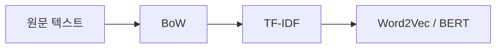

> [!NOTE]
> 문서를 숫자 벡터로 — **BoW**(등장 여부/횟수) → **TF-IDF**(흔한 단어 감점). 출처 `nlp2026_4장_tfidf.pdf` · 18쪽



## 1. BoW (단어가방 모델)

- 문서를 "단어의 가방"으로 보고 **순서는 무시** · **binary**(0/1) / **count**(횟수) (p.4)
- ① 단어사전 정렬·고정 → ② 사전 순서대로 벡터화. **단어 종류 수 = 차원**
- 단점: 순서·문맥 소실, 차원의 저주, 희소 행렬 (p.5)

### 강의 예제 (p.4)

```html preview
<div style="font-family:system-ui,sans-serif;padding:18px;color:var(--foreground)">
  <textarea id="bowDocs" rows="2" style="width:100%;margin-bottom:10px;padding:10px;font-size:14px;
    font-family:ui-monospace,SFMono-Regular,Menlo,monospace;background:var(--card);
    color:var(--card-foreground);border:1px solid var(--border);
    border-radius:var(--radius);box-sizing:border-box">나는 오늘 학교에 갔다
오늘 나는 도서관에 갔다</textarea>
  <div id="bowMode" style="display:flex;gap:8px;margin-bottom:14px"></div>
  <div id="bowVocab" style="font-size:13px;color:var(--muted-foreground);margin-bottom:12px"></div>
  <div id="bowOut" style="display:flex;flex-direction:column;gap:10px"></div>
  <script>
    var MODES = [['binary', 'Binary BoW'], ['count', 'Count BoW']];
    var mode = 'binary';
    var ta = document.getElementById('bowDocs');
    function btnStyle(on) {
      return 'padding:6px 14px;font-size:13px;font-weight:600;cursor:pointer;' +
        'border-radius:999px;border:1px solid ' + (on ? 'var(--primary)' : 'var(--border)') + ';' +
        'background:' + (on ? 'var(--primary)' : 'transparent') + ';' +
        'color:' + (on ? 'var(--primary-foreground)' : 'var(--muted-foreground)') + ';';
    }
    function drawModes() {
      document.getElementById('bowMode').innerHTML = MODES.map(function (m) {
        return '<button data-m="' + m[0] + '" style="' + btnStyle(mode === m[0]) + '">' + m[1] + '</button>';
      }).join('');
      Array.prototype.forEach.call(document.querySelectorAll('#bowMode button'), function (b) {
        b.onclick = function () { mode = b.getAttribute('data-m'); render(); };
      });
    }
    function tokenize(line) {
      return line.toLowerCase().split(/[^a-z0-9가-힣]+/).filter(function (t) { return t.length > 0; });
    }
    function render() {
      drawModes();
      var lines = ta.value.split('\n').filter(function (l) { return l.trim().length > 0; });
      var docs = lines.map(tokenize);
      var seen = {};
      docs.forEach(function (d) { d.forEach(function (t) { seen[t] = true; }); });
      var vocab = Object.keys(seen).sort();
      document.getElementById('bowVocab').innerHTML =
        '단어사전 <b>' + vocab.length + '차원</b> — <code>[' +
        vocab.map(function (w) { return "'" + w + "'"; }).join(', ') + ']</code>';
      document.getElementById('bowOut').innerHTML = docs.map(function (d, i) {
        var vec = vocab.map(function (w) {
          var c = d.filter(function (t) { return t === w; }).length;
          return mode === 'binary' ? (c > 0 ? 1 : 0) : c;
        });
        var chips = vocab.map(function (w, k) {
          var v = vec[k];
          var col = v === 0 ? 'var(--muted-foreground)' : (v > 1 ? 'var(--chart-5)' : 'var(--chart-1)');
          return '<div style="min-width:60px;text-align:center;padding:5px 7px;border-radius:var(--radius);' +
            'background:' + (v === 0 ? 'transparent' : 'var(--card)') + ';' +
            'border:1px solid ' + (v === 0 ? 'var(--border)' : col) + ';opacity:' + (v === 0 ? '0.45' : '1') + '">' +
            '<div style="font-size:11px;color:var(--muted-foreground)">' + w + '</div>' +
            '<div style="font-size:17px;font-weight:700;color:' + col + '">' + v + '</div></div>';
        }).join('');
        return '<div style="padding:12px;border:1px solid var(--border);border-radius:var(--radius)">' +
          '<div style="font-size:13px;margin-bottom:8px"><b>문서' + (i + 1) + '</b> ' +
          '<span style="color:var(--muted-foreground)">' + lines[i].trim() + '</span></div>' +
          '<div style="display:flex;gap:6px;flex-wrap:wrap;margin-bottom:8px">' + chips + '</div>' +
          '<code style="font-size:13px">[' + vec.join(', ') + ']</code></div>';
      }).join('');
    }
    ta.addEventListener('input', render);
    render();
  </script>
</div>
```

> [!TIP]
> 순서가 다른 두 문장(`나는 오늘` vs `오늘 나는`)이 **같은 벡터**로 나온다. 중복 단어가 없어 binary = count.

### 과제

```html preview
<div style="font-family:system-ui,sans-serif;padding:18px;color:var(--foreground)">
  <textarea id="bowDocs" rows="3" style="width:100%;margin-bottom:10px;padding:10px;font-size:14px;
    font-family:ui-monospace,SFMono-Regular,Menlo,monospace;background:var(--card);
    color:var(--card-foreground);border:1px solid var(--border);
    border-radius:var(--radius);box-sizing:border-box">i love machine learning
i love deep deep learning learning
i like deep learning</textarea>
  <div id="bowMode" style="display:flex;gap:8px;margin-bottom:14px"></div>
  <div id="bowVocab" style="font-size:13px;color:var(--muted-foreground);margin-bottom:12px"></div>
  <div id="bowOut" style="display:flex;flex-direction:column;gap:10px"></div>
  <script>
    var MODES = [['binary', 'Binary BoW'], ['count', 'Count BoW']];
    var mode = 'binary';
    var ta = document.getElementById('bowDocs');
    function btnStyle(on) {
      return 'padding:6px 14px;font-size:13px;font-weight:600;cursor:pointer;' +
        'border-radius:999px;border:1px solid ' + (on ? 'var(--primary)' : 'var(--border)') + ';' +
        'background:' + (on ? 'var(--primary)' : 'transparent') + ';' +
        'color:' + (on ? 'var(--primary-foreground)' : 'var(--muted-foreground)') + ';';
    }
    function drawModes() {
      document.getElementById('bowMode').innerHTML = MODES.map(function (m) {
        return '<button data-m="' + m[0] + '" style="' + btnStyle(mode === m[0]) + '">' + m[1] + '</button>';
      }).join('');
      Array.prototype.forEach.call(document.querySelectorAll('#bowMode button'), function (b) {
        b.onclick = function () { mode = b.getAttribute('data-m'); render(); };
      });
    }
    function tokenize(line) {
      return line.toLowerCase().split(/[^a-z0-9가-힣]+/).filter(function (t) { return t.length > 0; });
    }
    function render() {
      drawModes();
      var lines = ta.value.split('\n').filter(function (l) { return l.trim().length > 0; });
      var docs = lines.map(tokenize);
      var seen = {};
      docs.forEach(function (d) { d.forEach(function (t) { seen[t] = true; }); });
      var vocab = Object.keys(seen).sort();
      document.getElementById('bowVocab').innerHTML =
        '단어사전 <b>' + vocab.length + '차원</b> — <code>[' +
        vocab.map(function (w) { return "'" + w + "'"; }).join(', ') + ']</code>';
      document.getElementById('bowOut').innerHTML = docs.map(function (d, i) {
        var vec = vocab.map(function (w) {
          var c = d.filter(function (t) { return t === w; }).length;
          return mode === 'binary' ? (c > 0 ? 1 : 0) : c;
        });
        var chips = vocab.map(function (w, k) {
          var v = vec[k];
          var col = v === 0 ? 'var(--muted-foreground)' : (v > 1 ? 'var(--chart-5)' : 'var(--chart-1)');
          return '<div style="min-width:60px;text-align:center;padding:5px 7px;border-radius:var(--radius);' +
            'background:' + (v === 0 ? 'transparent' : 'var(--card)') + ';' +
            'border:1px solid ' + (v === 0 ? 'var(--border)' : col) + ';opacity:' + (v === 0 ? '0.45' : '1') + '">' +
            '<div style="font-size:11px;color:var(--muted-foreground)">' + w + '</div>' +
            '<div style="font-size:17px;font-weight:700;color:' + col + '">' + v + '</div></div>';
        }).join('');
        return '<div style="padding:12px;border:1px solid var(--border);border-radius:var(--radius)">' +
          '<div style="font-size:13px;margin-bottom:8px"><b>문서' + (i + 1) + '</b> ' +
          '<span style="color:var(--muted-foreground)">' + lines[i].trim() + '</span></div>' +
          '<div style="display:flex;gap:6px;flex-wrap:wrap;margin-bottom:8px">' + chips + '</div>' +
          '<code style="font-size:13px">[' + vec.join(', ') + ']</code></div>';
      }).join('');
    }
    ta.addEventListener('input', render);
    render();
  </script>
</div>
```

<details>
<summary>BoW 과제 정답</summary>

사전 `0: deep  1: i  2: learning  3: like  4: love  5: machine` → **6차원**

```text
           binary              count
문서1  [0,1,1,0,1,1]       [0,1,1,0,1,1]
문서2  [1,1,1,0,1,0]       [2,1,2,0,1,0]
문서3  [1,1,1,1,0,0]       [1,1,1,1,0,0]
```

문서2만 갈라진다 (`deep`·`learning` 2회).

</details>

## 2. TF-IDF

- **TF** — 이 문서에서 자주 나오는가 (↑) · **IDF** — 다른 문서에도 흔한가 (흔하면 ↓) (p.6)
- **방법1** $\text{TF} = \frac{\text{빈도}}{\text{총 단어수}},\ \text{IDF} = \ln\frac{N}{df}$ · 정규화 없음 (p.9–12)
- **방법2** $\text{TF} = \text{빈도},\ \text{IDF} = \ln\frac{N+1}{df+1} + 1$ · 끝에 L2 정규화 (p.13–17)

> [!IMPORTANT]
> **⭐ 시험 포인트** — TF는 (단어, 문서)의 함수라 **문서마다 다르다** ⭕ / IDF는 (단어)만의 함수라 ==단어 1개당 값 1개==— 문서별로 상이하지 않는다.

### 강의 예제 (p.8–17)

```html preview
<div style="font-family:system-ui,sans-serif;padding:18px;color:var(--foreground)">
  <textarea id="tDocs" rows="4" style="width:100%;margin-bottom:10px;padding:10px;font-size:14px;
    font-family:ui-monospace,SFMono-Regular,Menlo,monospace;background:var(--card);
    color:var(--card-foreground);border:1px solid var(--border);
    border-radius:var(--radius);box-sizing:border-box">나 학교 간다
학교 공부한다
친구 학교 만나서 다른 친구 집 갔다
운동 좋아하는 친구 함께 운동 했다</textarea>
  <div id="tM" style="display:flex;gap:6px;flex-wrap:wrap;margin-bottom:8px"></div>
  <div id="tS" style="display:flex;gap:6px;flex-wrap:wrap;margin-bottom:8px"></div>
  <div id="tD" style="display:flex;gap:6px;flex-wrap:wrap;margin-bottom:12px"></div>
  <div id="tI" style="padding:9px 11px;background:var(--card);border:1px solid var(--border);
    border-radius:var(--radius);font-size:12px;margin-bottom:12px;line-height:1.6"></div>
  <div id="tB" style="display:flex;flex-direction:column;gap:4px"></div>
  <div id="tV" style="margin-top:12px;font-size:12px;color:var(--muted-foreground);
    word-break:break-all;line-height:1.7"></div>
  <script>
    var method = 1, step = 'tf', di = 0;
    var ta = document.getElementById('tDocs');
    function btn(l, on, a) {
      return '<button ' + a + ' style="padding:5px 12px;font-size:12px;font-weight:600;cursor:pointer;' +
        'border-radius:999px;border:1px solid ' + (on ? 'var(--primary)' : 'var(--border)') +
        ';background:' + (on ? 'var(--primary)' : 'transparent') + ';color:' +
        (on ? 'var(--primary-foreground)' : 'var(--muted-foreground)') + '">' + l + '</button>';
    }
    function parse() {
      var lines = ta.value.split('\n').filter(function (l) { return l.trim().length > 0; });
      var toks = lines.map(function (l) {
        return l.toLowerCase().split(/[^a-z0-9가-힣]+/).filter(function (t) { return t.length > 0; });
      });
      var seen = {};
      toks.forEach(function (t) { t.forEach(function (w) { seen[w] = true; }); });
      var vocab = Object.keys(seen).sort();
      var df = {};
      vocab.forEach(function (w) {
        df[w] = toks.filter(function (t) { return t.indexOf(w) >= 0; }).length;
      });
      return { lines: lines, toks: toks, vocab: vocab, df: df, N: toks.length };
    }
    function tfOf(D, i, w) {
      var c = D.toks[i].filter(function (x) { return x === w; }).length;
      return method === 1 ? c / D.toks[i].length : c;
    }
    function idfOf(D, w) {
      return method === 1 ? Math.log(D.N / D.df[w]) : Math.log((D.N + 1) / (D.df[w] + 1)) + 1;
    }
    function prodOf(D, i) {
      return D.vocab.map(function (w) { return tfOf(D, i, w) * idfOf(D, w); });
    }
    function normOf(D, i) {
      var p = prodOf(D, i);
      var n = Math.sqrt(p.reduce(function (a, b) { return a + b * b; }, 0));
      return p.map(function (v) { return n ? v / n : 0; });
    }
    function fmt(v) {
      return (method === 2 && step === 'tf') ? String(v) : v.toFixed(4);
    }
    function steps() {
      return method === 1
        ? [['tf', '(1) TF'], ['idf', '(2) IDF'], ['prod', '(3) TF-IDF']]
        : [['tf', '(1) TF'], ['idf', '(2) IDF'], ['prod', '(3) TF×IDF'], ['norm', '(4) L2 정규화']];
    }
    function render() {
      var D = parse();
      if (di >= D.toks.length) di = 0;
      document.getElementById('tM').innerHTML =
        '<span style="font-size:12px;color:var(--muted-foreground);align-self:center;width:40px">방법</span>' +
        btn('방법1', method === 1, 'data-m="1"') + btn('방법2 (싸이킷런)', method === 2, 'data-m="2"');
      document.getElementById('tS').innerHTML =
        '<span style="font-size:12px;color:var(--muted-foreground);align-self:center;width:40px">단계</span>' +
        steps().map(function (s) { return btn(s[1], step === s[0], 'data-s="' + s[0] + '"'); }).join('');
      document.getElementById('tD').innerHTML =
        '<span style="font-size:12px;color:var(--muted-foreground);align-self:center;width:40px">문서</span>' +
        D.lines.map(function (l, i) {
          return btn('문서' + (i + 1), di === i && step !== 'idf', 'data-d="' + i + '"');
        }).join('');
      var vals, subs, info;
      if (step === 'idf') {
        vals = D.vocab.map(function (w) { return idfOf(D, w); });
        subs = D.vocab.map(function (w) { return 'df ' + D.df[w] + '/' + D.N; });
        info = method === 1
          ? 'IDF = ln(N / df), N = ' + D.N + ' &nbsp;—&nbsp; <b>문서와 무관하게 단어당 1개로 고정</b>. df = N 이면 0으로 소거된다.'
          : 'IDF = ln((N+1)/(df+1)) + 1, N = ' + D.N + ' &nbsp;—&nbsp; 스무딩 +1로 0이 되지 않는다.';
      } else if (step === 'tf') {
        vals = D.vocab.map(function (w) { return tfOf(D, di, w); });
        subs = D.vocab.map(function (w) {
          var c = D.toks[di].filter(function (x) { return x === w; }).length;
          return method === 1 ? c + '/' + D.toks[di].length : c + '회';
        });
        info = method === 1
          ? 'TF = 빈도 ÷ 문서 총 단어수 &nbsp;—&nbsp; 문서' + (di + 1) + '은 ' + D.toks[di].length + '단어'
          : 'TF = 빈도 그대로(raw count) &nbsp;—&nbsp; 길이는 (4) 정규화에서 반영';
      } else if (step === 'prod') {
        vals = prodOf(D, di);
        subs = D.vocab.map(function (w) { return 'df ' + D.df[w]; });
        info = method === 1 ? 'TF × IDF &nbsp;—&nbsp; 방법1은 여기서 끝' : 'TF × IDF &nbsp;—&nbsp; 아직 정규화 전';
      } else {
        vals = normOf(D, di);
        subs = D.vocab.map(function (w) { return 'df ' + D.df[w]; });
        var p = prodOf(D, di);
        info = '÷ norm(' + Math.sqrt(p.reduce(function (a, b) { return a + b * b; }, 0)).toFixed(4) +
          ') &nbsp;—&nbsp; 모든 문서가 길이 1의 벡터가 된다';
      }
      var max = Math.max.apply(null, vals.concat([0.0001]));
      document.getElementById('tI').innerHTML = info;
      document.getElementById('tB').innerHTML = D.vocab.map(function (w, k) {
        var v = vals[k], z = v === 0;
        var col = z ? 'var(--border)' : (v === max ? 'var(--chart-5)' : 'var(--chart-1)');
        return '<div style="display:flex;align-items:center;gap:10px;opacity:' + (z ? '0.45' : '1') + '">' +
          '<div style="width:74px;text-align:right;font-size:13px;white-space:nowrap">' + w + '</div>' +
          '<div style="width:50px;font-size:10px;color:var(--muted-foreground);white-space:nowrap">' + subs[k] + '</div>' +
          '<div style="flex:1;height:16px;background:var(--border);border-radius:4px;overflow:hidden;min-width:40px">' +
          '<div style="width:' + (v / max * 100) + '%;height:100%;background:' + col + '"></div></div>' +
          '<div style="width:58px;font-size:12px;font-weight:700;font-variant-numeric:tabular-nums;' +
          'text-align:right;color:' + (z ? 'var(--muted-foreground)' : col) + '">' + fmt(v) + '</div></div>';
      }).join('');
      document.getElementById('tV').innerHTML =
        '<b>' + (step === 'idf' ? 'IDF (전체 공통)' : '문서' + (di + 1)) + '</b><br>[' +
        vals.map(fmt).join(', ') + ']';
      Array.prototype.forEach.call(document.querySelectorAll('#tM button'), function (b) {
        b.onclick = function () {
          method = +b.getAttribute('data-m');
          if (method === 1 && step === 'norm') step = 'prod';
          render();
        };
      });
      Array.prototype.forEach.call(document.querySelectorAll('#tS button'), function (b) {
        b.onclick = function () { step = b.getAttribute('data-s'); render(); };
      });
      Array.prototype.forEach.call(document.querySelectorAll('#tD button'), function (b) {
        b.onclick = function () { di = +b.getAttribute('data-d'); if (step === 'idf') step = 'tf'; render(); };
      });
    }
    ta.addEventListener('input', render);
    render();
  </script>
</div>
```

> [!TIP]
> `IDF` 단계에서 문서 버튼을 눌러도 막대가 움직이지 않는다 — 위 시험 포인트의 증거다.

### 과제 — 방법1, 소수점 4자리

```html preview
<div style="font-family:system-ui,sans-serif;padding:18px;color:var(--foreground)">
  <textarea id="tDocs" rows="3" style="width:100%;margin-bottom:10px;padding:10px;font-size:14px;
    font-family:ui-monospace,SFMono-Regular,Menlo,monospace;background:var(--card);
    color:var(--card-foreground);border:1px solid var(--border);
    border-radius:var(--radius);box-sizing:border-box">i love machine learning
i love deep deep learning learning
i like deep learning</textarea>
  <div id="tM" style="display:flex;gap:6px;flex-wrap:wrap;margin-bottom:8px"></div>
  <div id="tS" style="display:flex;gap:6px;flex-wrap:wrap;margin-bottom:8px"></div>
  <div id="tD" style="display:flex;gap:6px;flex-wrap:wrap;margin-bottom:12px"></div>
  <div id="tI" style="padding:9px 11px;background:var(--card);border:1px solid var(--border);
    border-radius:var(--radius);font-size:12px;margin-bottom:12px;line-height:1.6"></div>
  <div id="tB" style="display:flex;flex-direction:column;gap:4px"></div>
  <div id="tV" style="margin-top:12px;font-size:12px;color:var(--muted-foreground);
    word-break:break-all;line-height:1.7"></div>
  <script>
    var method = 1, step = 'tf', di = 0;
    var ta = document.getElementById('tDocs');
    function btn(l, on, a) {
      return '<button ' + a + ' style="padding:5px 12px;font-size:12px;font-weight:600;cursor:pointer;' +
        'border-radius:999px;border:1px solid ' + (on ? 'var(--primary)' : 'var(--border)') +
        ';background:' + (on ? 'var(--primary)' : 'transparent') + ';color:' +
        (on ? 'var(--primary-foreground)' : 'var(--muted-foreground)') + '">' + l + '</button>';
    }
    function parse() {
      var lines = ta.value.split('\n').filter(function (l) { return l.trim().length > 0; });
      var toks = lines.map(function (l) {
        return l.toLowerCase().split(/[^a-z0-9가-힣]+/).filter(function (t) { return t.length > 0; });
      });
      var seen = {};
      toks.forEach(function (t) { t.forEach(function (w) { seen[w] = true; }); });
      var vocab = Object.keys(seen).sort();
      var df = {};
      vocab.forEach(function (w) {
        df[w] = toks.filter(function (t) { return t.indexOf(w) >= 0; }).length;
      });
      return { lines: lines, toks: toks, vocab: vocab, df: df, N: toks.length };
    }
    function tfOf(D, i, w) {
      var c = D.toks[i].filter(function (x) { return x === w; }).length;
      return method === 1 ? c / D.toks[i].length : c;
    }
    function idfOf(D, w) {
      return method === 1 ? Math.log(D.N / D.df[w]) : Math.log((D.N + 1) / (D.df[w] + 1)) + 1;
    }
    function prodOf(D, i) {
      return D.vocab.map(function (w) { return tfOf(D, i, w) * idfOf(D, w); });
    }
    function normOf(D, i) {
      var p = prodOf(D, i);
      var n = Math.sqrt(p.reduce(function (a, b) { return a + b * b; }, 0));
      return p.map(function (v) { return n ? v / n : 0; });
    }
    function fmt(v) {
      return (method === 2 && step === 'tf') ? String(v) : v.toFixed(4);
    }
    function steps() {
      return method === 1
        ? [['tf', '(1) TF'], ['idf', '(2) IDF'], ['prod', '(3) TF-IDF']]
        : [['tf', '(1) TF'], ['idf', '(2) IDF'], ['prod', '(3) TF×IDF'], ['norm', '(4) L2 정규화']];
    }
    function render() {
      var D = parse();
      if (di >= D.toks.length) di = 0;
      document.getElementById('tM').innerHTML =
        '<span style="font-size:12px;color:var(--muted-foreground);align-self:center;width:40px">방법</span>' +
        btn('방법1', method === 1, 'data-m="1"') + btn('방법2 (싸이킷런)', method === 2, 'data-m="2"');
      document.getElementById('tS').innerHTML =
        '<span style="font-size:12px;color:var(--muted-foreground);align-self:center;width:40px">단계</span>' +
        steps().map(function (s) { return btn(s[1], step === s[0], 'data-s="' + s[0] + '"'); }).join('');
      document.getElementById('tD').innerHTML =
        '<span style="font-size:12px;color:var(--muted-foreground);align-self:center;width:40px">문서</span>' +
        D.lines.map(function (l, i) {
          return btn('문서' + (i + 1), di === i && step !== 'idf', 'data-d="' + i + '"');
        }).join('');
      var vals, subs, info;
      if (step === 'idf') {
        vals = D.vocab.map(function (w) { return idfOf(D, w); });
        subs = D.vocab.map(function (w) { return 'df ' + D.df[w] + '/' + D.N; });
        info = method === 1
          ? 'IDF = ln(N / df), N = ' + D.N + ' &nbsp;—&nbsp; <b>문서와 무관하게 단어당 1개로 고정</b>. df = N 이면 0으로 소거된다.'
          : 'IDF = ln((N+1)/(df+1)) + 1, N = ' + D.N + ' &nbsp;—&nbsp; 스무딩 +1로 0이 되지 않는다.';
      } else if (step === 'tf') {
        vals = D.vocab.map(function (w) { return tfOf(D, di, w); });
        subs = D.vocab.map(function (w) {
          var c = D.toks[di].filter(function (x) { return x === w; }).length;
          return method === 1 ? c + '/' + D.toks[di].length : c + '회';
        });
        info = method === 1
          ? 'TF = 빈도 ÷ 문서 총 단어수 &nbsp;—&nbsp; 문서' + (di + 1) + '은 ' + D.toks[di].length + '단어'
          : 'TF = 빈도 그대로(raw count) &nbsp;—&nbsp; 길이는 (4) 정규화에서 반영';
      } else if (step === 'prod') {
        vals = prodOf(D, di);
        subs = D.vocab.map(function (w) { return 'df ' + D.df[w]; });
        info = method === 1 ? 'TF × IDF &nbsp;—&nbsp; 방법1은 여기서 끝' : 'TF × IDF &nbsp;—&nbsp; 아직 정규화 전';
      } else {
        vals = normOf(D, di);
        subs = D.vocab.map(function (w) { return 'df ' + D.df[w]; });
        var p = prodOf(D, di);
        info = '÷ norm(' + Math.sqrt(p.reduce(function (a, b) { return a + b * b; }, 0)).toFixed(4) +
          ') &nbsp;—&nbsp; 모든 문서가 길이 1의 벡터가 된다';
      }
      var max = Math.max.apply(null, vals.concat([0.0001]));
      document.getElementById('tI').innerHTML = info;
      document.getElementById('tB').innerHTML = D.vocab.map(function (w, k) {
        var v = vals[k], z = v === 0;
        var col = z ? 'var(--border)' : (v === max ? 'var(--chart-5)' : 'var(--chart-1)');
        return '<div style="display:flex;align-items:center;gap:10px;opacity:' + (z ? '0.45' : '1') + '">' +
          '<div style="width:74px;text-align:right;font-size:13px;white-space:nowrap">' + w + '</div>' +
          '<div style="width:50px;font-size:10px;color:var(--muted-foreground);white-space:nowrap">' + subs[k] + '</div>' +
          '<div style="flex:1;height:16px;background:var(--border);border-radius:4px;overflow:hidden;min-width:40px">' +
          '<div style="width:' + (v / max * 100) + '%;height:100%;background:' + col + '"></div></div>' +
          '<div style="width:58px;font-size:12px;font-weight:700;font-variant-numeric:tabular-nums;' +
          'text-align:right;color:' + (z ? 'var(--muted-foreground)' : col) + '">' + fmt(v) + '</div></div>';
      }).join('');
      document.getElementById('tV').innerHTML =
        '<b>' + (step === 'idf' ? 'IDF (전체 공통)' : '문서' + (di + 1)) + '</b><br>[' +
        vals.map(fmt).join(', ') + ']';
      Array.prototype.forEach.call(document.querySelectorAll('#tM button'), function (b) {
        b.onclick = function () {
          method = +b.getAttribute('data-m');
          if (method === 1 && step === 'norm') step = 'prod';
          render();
        };
      });
      Array.prototype.forEach.call(document.querySelectorAll('#tS button'), function (b) {
        b.onclick = function () { step = b.getAttribute('data-s'); render(); };
      });
      Array.prototype.forEach.call(document.querySelectorAll('#tD button'), function (b) {
        b.onclick = function () { di = +b.getAttribute('data-d'); if (step === 'idf') step = 'tf'; render(); };
      });
    }
    ta.addEventListener('input', render);
    render();
  </script>
</div>
```

> [!IMPORTANT]
> `i` 와 `learning` 은 세 문서 전부에 있어 $df = N = 3$, $\ln(3/3) = 0$ → **TF-IDF가 전부 0**. 빈칸이 아니라 변별력이 0이라 **IDF가 지운 것**이다.

<details>
<summary>TF-IDF 과제 정답 (방법1, 4자리)</summary>

```text
(1) TF
문서1  [0,      0.2500, 0.2500, 0,      0.2500, 0.2500]
문서2  [0.3333, 0.1667, 0.3333, 0,      0.1667, 0     ]
문서3  [0.2500, 0.2500, 0.2500, 0.2500, 0,      0     ]

(2) IDF = ln(3/df)
deep 0.4055 · i 0.0000 · learning 0.0000 · like 1.0986 · love 0.4055 · machine 1.0986

(3) TF-IDF
문서1  [0,      0, 0, 0,      0.1014, 0.2747]
문서2  [0.1352, 0, 0, 0,      0.0676, 0     ]
문서3  [0.1014, 0, 0, 0.2747, 0,      0     ]
```

</details>

### 싸이킷런 (p.18)

```python
from sklearn.feature_extraction.text import TfidfVectorizer
import pandas as pd

docs = ["나 학교 간다", "학교 공부한다",
        "친구 학교 만나서 다른 친구 집 갔다",
        "운동 좋아하는 친구 함께 운동 했다"]

vectorizer = TfidfVectorizer(token_pattern=r"(?u)\b\w+\b")   # 1글자 단어 허용
tfidf = vectorizer.fit_transform(docs)
print(pd.DataFrame(tfidf.toarray(), columns=vectorizer.get_feature_names_out()))
```

> [!WARNING]
> `token_pattern` 생략 시 기본값이 2글자 이상만 토큰으로 잡아 `나`, `i` 가 버려진다. 또 TF-IDF 수식은 **하나로 정해져 있지 않다** (p.7).

## 3. 확인 문제

<details>
<summary>1. TF는 같은 단어라도 문서마다 값이 다르다.</summary>

**⭕** — TF는 (단어, 문서) 쌍의 함수. `학교`의 TF는 문서2 0.50, 문서3 0.14.

</details>

<details>
<summary>2. IDF도 같은 단어라도 문서마다 값이 다르다.</summary>

**❌** — 코퍼스 전체로 계산하므로 **단어 1개당 값 1개**로 고정.

</details>

<details>
<summary>3. 여러 문서에 두루 등장하는 단어일수록 IDF가 높아진다.</summary>

**❌** — 반대. $df$가 분모라 흔할수록 낮아진다.

</details>

<details>
<summary>4. BoW 벡터로 원래 문장의 단어 순서를 복원할 수 있다.</summary>

**❌** — 순서·문맥·의미가 모두 사라진다.

</details>

<details>
<summary>5. binary BoW와 count BoW는 항상 다른 벡터를 만든다.</summary>

**❌** — 중복 단어가 없으면 같다.

</details>

<details>
<summary>6. 단어사전 순서가 바뀌면 같은 문서라도 벡터가 달라진다.</summary>

**⭕** — 사전의 $i$번째 단어가 벡터의 $i$번째 차원이다.

</details>

<details>
<summary>7. 방법1에서는 문서 길이가 TF 값에 영향을 준다.</summary>

**⭕** — 빈도를 총 단어수로 나누므로 짧은 문서일수록 TF가 크다.

</details>

<details>
<summary>8. 방법2도 TF 단계에서 문서 길이로 나눈다.</summary>

**❌** — raw count 그대로. 길이는 마지막 L2 정규화에서 반영.

</details>

<details>
<summary>9. TF-IDF 수식은 하나로 정해져 있다.</summary>

**❌** — p.7. 로그 밑·스무딩·정규화가 구현마다 다르다.

</details>

<details>
<summary>10. 단어 수가 많아질수록 BoW 행렬은 희소해진다.</summary>

**⭕** — 차원이 커질수록 0의 비율이 늘어난다.

</details>

<details>
<summary>생각해볼 포인트 3문항 (p.12)</summary>

**① 여러 문서에 등장하면 IDF가 낮은가?** — 낮아진다. `학교`(df 3) 0.29 vs `간다`(df 1) 1.39.

**② 긴 문서와 짧은 문서가 TF 차이가 나나?** — 방법1은 난다(0.50 vs 0.14). 방법2는 TF 단계에선 같고 L2에서 벌어진다.

**③ 같은 단어가 문서별로 TF, IDF가 다른가?** — TF는 다르고 IDF는 같다.

</details>

## 4. 정리

- **단어사전** — 정렬해 고정. 단어 종류 수 = 벡터 차원
- **binary / count** — 중복 단어가 없으면 둘은 같다
- **TF** — 문서마다 다름 / **IDF** — 단어당 1개로 고정
- **TF-IDF** — 이 문서에만 자주 나오는 단어에 높은 점수
- 둘 다 순서를 잃는다 → Word2Vec·BERT로 확장

> [!NOTE]
> 관련 — [01. 빅데이터 분석의 정의와 특성 - 3V 모델, 통계적 멱법칙(Power Law)과 TF-IDF 텍스트 마이닝](../../big-data-analysis/notes/01.%20%EB%B9%85%EB%8D%B0%EC%9D%B4%ED%84%B0%20%EB%B6%84%EC%84%9D%EC%9D%98%20%EC%A0%95%EC%9D%98%EC%99%80%20%ED%8A%B9%EC%84%B1%20-%203V%20%EB%AA%A8%EB%8D%B8%2C%20%ED%86%B5%EA%B3%84%EC%A0%81%20%EB%A9%B1%EB%B2%95%EC%B9%99%28Power%20Law%29%EA%B3%BC%20TF-IDF%20%ED%85%8D%EC%8A%A4%ED%8A%B8%20%EB%A7%88%EC%9D%B4%EB%8B%9D.md)
