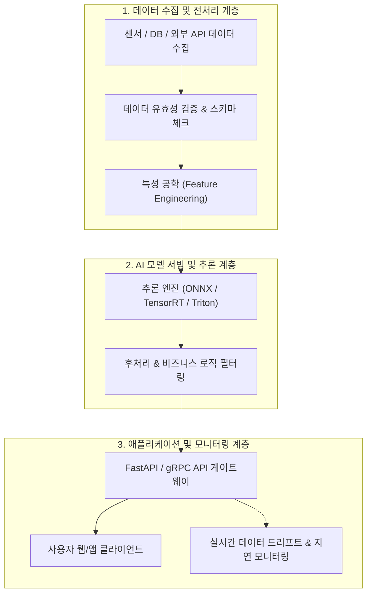

> [!abstract] 핵심 요약
> **공학 설계(Engineering Design)**는 과학적 지식과 수학적 원리를 체계적으로 적용하여 주어진 자원과 제약 조건 하에서 사용자의 실세계 요구를 충족하는 제품 또는 시스템을 창출하는 의사결정 프로세스이다.
> 전통적 소프트웨어 공학과 달리 **AI 시스템 설계**는 코드뿐만 아니라 **데이터 품질, 비결정론적 모델 추론, 실시간 서빙 지연 시간(Latency), 지속적 재학습 파이프라인(MLOps)**이 시스템 전체의 성패를 좌우하므로, 기능적 요구사항과 엄격한 비기능적 SLA(Service Level Agreement)를 사전 정의해야 한다.

---

## 1. AI 시스템 아키텍처 계층 구조



---

## 2. 기능적 요구사항(FR) vs 비기능적 요구사항(NFR)

| 구분 | 정의 | AI 시스템 설계 적용 예시 |
| :-- | :-- | :-- |
| **기능적 요구사항 (FR)** | 시스템이 **무엇을 수행해야 하는가** (동작, 기능) | 사용자가 업로드한 엑스레이 이미지에서 폐 질환 영역을 3초 내 바운딩 박스로 검출한다. |
| **비기능적 요구사항 (NFR)** | 시스템이 **어떠한 제약/품질로 동작해야 하는가** | • **지연 시간**: P99 응답 시간 $\le 200\text{ms}$<br/>• **정확도**: F1-Score $\ge 0.95$, Recall $\ge 0.98$<br/>• **가용성**: 연간 $99.99\%$ (고가용성 이중화) |

---

## 3. 실시간 AI 시스템 NFR 지연 시간(Latency) & SLA 계산기

```html preview
<div style="font-family:system-ui,-apple-system,sans-serif;padding:20px;background:var(--card);color:var(--card-foreground);border:1px solid var(--border);border-radius:var(--radius)">
  <div style="font-size:16px;font-weight:700;margin-bottom:14px;color:var(--primary);display:flex;align-items:center;gap:8px">
    <span>⏱️ AI 서빙 파이프라인 지연 시간(End-to-End Latency) 계산기</span>
  </div>

  <div style="display:grid;grid-template-columns:repeat(3, 1fr);gap:10px;margin-bottom:14px">
    <div>
      <label style="font-size:10px;color:var(--muted-foreground)">전처리 시간 (ms):</label>
      <input id="inPreLat" type="number" value="25" step="5" style="width:100%;padding:4px;background:var(--background);color:var(--foreground);border:1px solid var(--border);border-radius:var(--radius);font-weight:700" />
    </div>
    <div>
      <label style="font-size:10px;color:var(--muted-foreground)">GPU 추론 시간 (ms):</label>
      <input id="inGpuLat" type="number" value="65" step="5" style="width:100%;padding:4px;background:var(--background);color:var(--foreground);border:1px solid var(--border);border-radius:var(--radius);font-weight:700" />
    </div>
    <div>
      <label style="font-size:10px;color:var(--muted-foreground)">네트워크 왕복 RTT (ms):</label>
      <input id="inNetLat" type="number" value="40" step="5" style="width:100%;padding:4px;background:var(--background);color:var(--foreground);border:1px solid var(--border);border-radius:var(--radius);font-weight:700" />
    </div>
  </div>

  <div style="display:grid;grid-template-columns:1fr 1fr;gap:12px;margin-bottom:12px">
    <div style="padding:10px;background:var(--background);border:1px solid var(--border);border-radius:var(--radius);text-align:center">
      <div style="font-size:10px;color:var(--muted-foreground)">전체 E2E 지연 시간 (Latency)</div>
      <div id="e2eLatOut" style="font-family:monospace;font-size:16px;font-weight:800;color:var(--primary);margin-top:2px">130 ms</div>
    </div>
    <div style="padding:10px;background:var(--background);border:1px solid var(--border);border-radius:var(--radius);text-align:center">
      <div style="font-size:10px;color:var(--muted-foreground)">SLA 충족 여부 (기준 150ms)</div>
      <div id="slaStatusOut" style="font-size:12px;font-weight:800;color:var(--primary);margin-top:4px">✅ SLA 규격 통과 (Safe)</div>
    </div>
  </div>

  <script>
    function updateLat() {
      var p = parseFloat(document.getElementById('inPreLat').value) || 0;
      var g = parseFloat(document.getElementById('inGpuLat').value) || 0;
      var n = parseFloat(document.getElementById('inNetLat').value) || 0;

      var total = p + g + n;
      document.getElementById('e2eLatOut').textContent = total.toFixed(0) + " ms";

      var sla = document.getElementById('slaStatusOut');
      if (total <= 150) {
        sla.innerHTML = "✅ <span style='color:var(--primary)'>SLA 통과 (목표 150ms 이내)</span>";
      } else {
        sla.innerHTML = "⚠️ <span style='color:var(--destructive,#ef4444)'>SLA 초과 (지연 최적화 필요)</span>";
      }
    }

    ['inPreLat', 'inGpuLat', 'inNetLat'].forEach(function(id) {
      document.getElementById(id).addEventListener('input', updateLat);
    });
    updateLat();
  </script>
</div>
```
