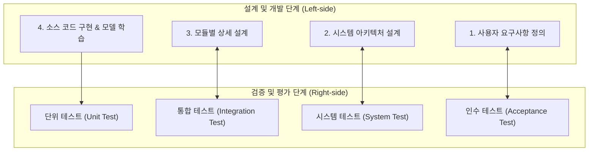

> [!abstract] 핵심 요약
> 성공적인 공학 시스템 구축은 즉흥적인 코딩이 아니라 **체계적인 5단계 공학 설계 생애주기**를 따라야 한다.
> 문제 정의에서 출발하여 **개념 설계(대안 탐색)**, **상세 설계(수치적 인터페이스 명세)**를 거치며, 개발의 각 단계는 **V-모델(V-Model)**의 우측 검증 축인 단위 테스트(Unit), 통합 테스트(Integration), 시스템 테스트(System), 인수 테스트(Acceptance)와 1:1로 엄격히 대응되어야 한다.

---

## 1. 공학 설계 V-모델(V-Model) 아키텍처



---

## 2. 공학 설계 5단계 주요 활동 및 산출물

| 설계 단계 | 핵심 활동 (Activities) | 주요 산출물 (Deliverables) |
| :-- | :-- | :-- |
| **1. 문제 정의** | 고객 요구사항 분석, 제약 조건 규명 | 시스템 요구사항 명세서 (SRS), 목표 사양표 |
| **2. 개념 설계** | 형태학적 분석, 브레인스토밍, 핵심 대안 선정 | 개념 스케치, 대안 평가 의사결정 매트릭스 |
| **3. 예비 설계** | 서브시스템 분할, 모듈 간 인터페이스 정의 | 시스템 블록 다이어그램, 데이터 흐름도(DFD) |
| **4. 상세 설계** | 부품/모델 세부 사양, API 스키마, 데이터베이스 스키마 확정 | 상세 회로도, API 명세서, DB ERD |
| **5. 구현 및 검증** | 프로토타입 제작, V-모델 테스트 수행 | 테스트 결과 보고서, 사용자 매뉴얼 |

---

## 3. 실시간 공학 설계 단계별 의사결정 매트릭스 시뮬레이터

```html preview
<div style="font-family:system-ui,-apple-system,sans-serif;padding:20px;background:var(--card);color:var(--card-foreground);border:1px solid var(--border);border-radius:var(--radius)">
  <div style="font-size:16px;font-weight:700;margin-bottom:14px;color:var(--primary);display:flex;align-items:center;gap:8px">
    <span>📐 개념 설계 대안 평가 매트릭스 (Pugh Decision Matrix)</span>
  </div>

  <div style="display:grid;grid-template-columns:1fr 1fr;gap:12px;margin-bottom:14px">
    <div>
      <div style="display:flex;justify-content:space-between;font-size:11px;color:var(--muted-foreground)">
        <span>정확도 가중 점수 (1~10):</span>
        <span id="accScoreVal" style="font-weight:700;color:var(--primary)">8점</span>
      </div>
      <input id="inAccScore" type="range" min="1" max="10" value="8" style="width:100%" />
    </div>
    <div>
      <div style="display:flex;justify-content:space-between;font-size:11px;color:var(--muted-foreground)">
        <span>구현 비용/난이도 점수 (1~10):</span>
        <span id="costScoreVal" style="font-weight:700;color:var(--chart-1)">6점</span>
      </div>
      <input id="inCostScore" type="range" min="1" max="10" value="6" style="width:100%" />
    </div>
  </div>

  <div style="padding:10px;background:var(--background);border:1px solid var(--border);border-radius:var(--radius);text-align:center;margin-bottom:12px">
    <div style="font-size:10px;color:var(--muted-foreground)">대안 종합 적합도 점수 (가중 합산)</div>
    <div id="totalScoreOut" style="font-family:monospace;font-size:18px;font-weight:800;color:var(--primary);margin-top:2px">7.20 / 10.0</div>
  </div>

  <script>
    function updateScore() {
      var a = parseInt(document.getElementById('inAccScore').value);
      var c = parseInt(document.getElementById('inCostScore').value);
      document.getElementById('accScoreVal').textContent = a + "점";
      document.getElementById('costScoreVal').textContent = c + "점";

      var total = a * 0.6 + c * 0.4;
      document.getElementById('totalScoreOut').textContent = total.toFixed(2) + " / 10.0";
    }

    ['inAccScore', 'inCostScore'].forEach(function(id) {
      document.getElementById(id).addEventListener('input', updateScore);
    });
    updateScore();
  </script>
</div>
```
