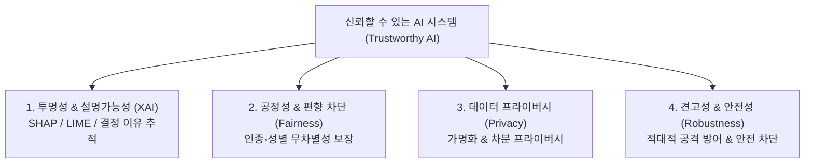

> [!abstract] 핵심 요약
> AI 기술이 사회 전반에 깊숙이 침투함에 따라 단순한 성능 지표를 넘어 **신뢰할 수 있는 인공지능(Trustworthy AI)**의 설계가 필수가 되었다.
> 과기정통부 AI 윤리 3대 원칙(인간의 존엄성, 사회의 공공선, 기술의 합목적성)과 10대 핵심요건을 준수하며, 블랙박스 모델의 판단 근거를 시각화하는 **XAI(설명가능한 AI)**와 집단 간 편향을 차단하는 **알고리즘 공정성(Fairness)**을 설계 초기부터 내재화해야 한다.

---

## 1. 신뢰할 수 있는 AI 4대 핵심 축



---

## 2. 실시간 알고리즘 공정성(Demographic Parity) 시뮬레이터

```html preview
<div style="font-family:system-ui,-apple-system,sans-serif;padding:20px;background:var(--card);color:var(--card-foreground);border:1px solid var(--border);border-radius:var(--radius)">
  <div style="font-size:16px;font-weight:700;margin-bottom:14px;color:var(--primary);display:flex;align-items:center;gap:8px">
    <span>⚖️ AI 채용 모델 집단 간 공정성(Demographic Parity) 검사기</span>
  </div>

  <div style="display:grid;grid-template-columns:1fr 1fr;gap:12px;margin-bottom:14px">
    <div>
      <label style="font-size:11px;color:var(--muted-foreground)">A 집단 합격률 (%):</label>
      <input id="inRateA" type="number" min="0" max="100" value="80" style="width:100%;padding:4px;background:var(--background);color:var(--foreground);border:1px solid var(--border);border-radius:var(--radius);font-weight:700" />
    </div>
    <div>
      <label style="font-size:11px;color:var(--muted-foreground)">B 집단 합격률 (%):</label>
      <input id="inRateB" type="number" min="0" max="100" value="68" style="width:100%;padding:4px;background:var(--background);color:var(--foreground);border:1px solid var(--border);border-radius:var(--radius);font-weight:700" />
    </div>
  </div>

  <div style="display:grid;grid-template-columns:1fr 1fr;gap:12px;margin-bottom:12px">
    <div style="padding:10px;background:var(--background);border:1px solid var(--border);border-radius:var(--radius);text-align:center">
      <div style="font-size:10px;color:var(--muted-foreground)">4/5 룰 공정성 비율 (B / A)</div>
      <div id="fairRateOut" style="font-family:monospace;font-size:16px;font-weight:800;color:var(--primary);margin-top:2px">85.0 %</div>
    </div>
    <div style="padding:10px;background:var(--background);border:1px solid var(--border);border-radius:var(--radius);text-align:center">
      <div style="font-size:10px;color:var(--muted-foreground)">미국 EEOC 80% 규칙 판별</div>
      <div id="fairStatusOut" style="font-size:12px;font-weight:800;color:var(--primary);margin-top:4px">✅ 공정성 충족 (Pass)</div>
    </div>
  </div>

  <script>
    function updateFairness() {
      var a = parseFloat(document.getElementById('inRateA').value) || 1;
      var b = parseFloat(document.getElementById('inRateB').value) || 0;

      var ratio = (b / a) * 100;
      document.getElementById('fairRateOut').textContent = ratio.toFixed(1) + " %";

      var status = document.getElementById('fairStatusOut');
      if (ratio >= 80) {
        status.innerHTML = "✅ <span style='color:var(--primary)'>공정성 충족 (Pass)</span>";
      } else {
        status.innerHTML = "⚠️ <span style='color:var(--destructive,#ef4444)'>차별적 편향 감지 (Disparate Impact)</span>";
      }
    }

    ['inRateA', 'inRateB'].forEach(function(id) {
      document.getElementById(id).addEventListener('input', updateFairness);
    });
    updateFairness();
  </script>
</div>
```
