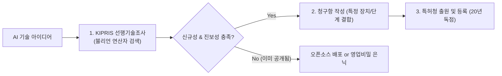

> [!abstract] 핵심 요약
> 인공지능 알고리즘과 소프트웨어 시스템은 막대한 R&D 비용이 투입되므로 **지식재산권(IP)**을 통한 독점적 권리 확보가 필수적이다.
> 순수한 수학적 알고리즘 자체는 특허 대상이 아니지만, **하드웨어와 결합하여 특정 기술적 과제를 해결하는 AI 파이프라인**은 특허 출원이 가능하며, 특허청 KIPRIS 선행기술조사를 통해 **신규성과 진보성**을 입증해야 한다.

---

## 1. 4대 지식재산권 및 보호 대상 비교

| 구분 | 보호 대상 | 권리 발생 요건 | 존속 기간 |
| :-- | :-- | :-- | :-- |
| **특허권 (Patent)** | 고도화된 기술적 사상의 창작 (발명) | 특허청 심사 및 등록 (신규성·진보성 필수) | 출원일로부터 **20년** |
| **저작권 (Copyright)** | 인간의 사상이나 감정을 표현한 창작물 (소스코드) | 창작과 동시에 자동 발생 (무방식주의) | 저작자 사후 **70년** |
| **영업비밀 (Trade Secret)** | 비공지성, 독립된 경제적 가치, 비밀 관리성 유지 | 비밀 유지 조치 (NDA 등) 충족 시 | 비밀 유지 기간 무기한 |



---

## 2. 실시간 특허 요건 판별 체크리스트 시뮬레이터

```html preview
<div style="font-family:system-ui,-apple-system,sans-serif;padding:20px;background:var(--card);color:var(--card-foreground);border:1px solid var(--border);border-radius:var(--radius)">
  <div style="font-size:16px;font-weight:700;margin-bottom:14px;color:var(--primary);display:flex;align-items:center;gap:8px">
    <span>📜 AI 특허 등록 가능성 3대 요건 체크리스트</span>
  </div>

  <div style="display:grid;gap:8px;margin-bottom:14px">
    <label style="font-size:11px;display:flex;align-items:center;gap:6px;cursor:pointer">
      <input type="checkbox" id="chkInd" checked /> <b>산업상 이용가능성:</b> 실제 소프트웨어/장치로 구현 및 상용화 가능
    </label>
    <label style="font-size:11px;display:flex;align-items:center;gap:6px;cursor:pointer">
      <input type="checkbox" id="chkNov" checked /> <b>신규성 (Novelty):</b> 출원 전 국내외에 공지되거나 논문으로 발표되지 않음
    </label>
    <label style="font-size:11px;display:flex;align-items:center;gap:6px;cursor:pointer">
      <input type="checkbox" id="chkInv" checked /> <b>진보성 (Inventive Step):</b> 통상의 기술자가 기존 선행기술로부터 용이하게 도출 불가능
    </label>
  </div>

  <div style="padding:10px;background:var(--background);border:1px solid var(--border);border-radius:var(--radius);text-align:center">
    <div style="font-size:10px;color:var(--muted-foreground)">특허 심사 통과 예측</div>
    <div id="patentStatusOut" style="font-size:13px;font-weight:800;color:var(--primary);margin-top:4px">✨ 3대 요건 완비: 등록 가능성 매우 높음</div>
  </div>

  <script>
    function updatePatentCheck() {
      var ind = document.getElementById('chkInd').checked;
      var nov = document.getElementById('chkNov').checked;
      var inv = document.getElementById('chkInv').checked;

      var out = document.getElementById('patentStatusOut');
      if (ind && nov && inv) {
        out.innerHTML = "✨ <span style='color:var(--primary)'>3대 요건 완비: 등록 가능성 매우 높음</span>";
      } else if (!nov) {
        out.innerHTML = "❌ <span style='color:var(--destructive,#ef4444)'>신규성 상실: 출원 전 자체 공개로 거절 위험</span>";
      } else if (!inv) {
        out.innerHTML = "⚠️ <span style='color:var(--chart-2)'>진보성 결여: 선행기술과의 차별점 보강 필요</span>";
      } else {
        out.innerHTML = "❌ <span style='color:var(--destructive,#ef4444)'>산업상 이용가능성 결여: 단순 수학 공식은 특허 불가</span>";
      }
    }

    ['chkInd', 'chkNov', 'chkInv'].forEach(function(id) {
      document.getElementById(id).addEventListener('change', updatePatentCheck);
    });
  </script>
</div>
```
